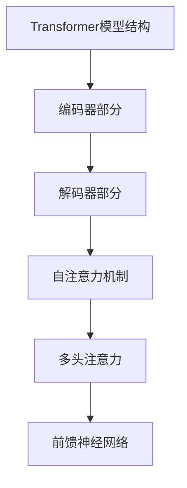

                 

# 文章标题：Transformer大模型实战 预训练XLM模型

## 关键词

- Transformer
- 预训练
- XLM模型
- 自注意力
- 编码器
- 解码器
- 大模型
- 实战
- 微调
- 应用场景

## 摘要

本文将深入探讨Transformer大模型的实战应用，特别是预训练XLM模型。首先，我们将介绍Transformer的起源、核心原理和性能优化策略。接着，我们详细解读预训练模型的发展历程、技术原理和训练优化。随后，我们将专注于XLM模型的概念、架构、工作原理和应用场景。随后，我们将通过实际案例展示XLM模型的训练和微调过程。最后，我们将探讨XLM模型在自然语言处理和其他领域的应用潜力，并总结Transformer大模型实战的经验。

# 《Transformer大模型实战 预训练XLM模型》目录大纲

## 第一部分：Transformer与预训练模型基础

### 第1章：Transformer简介

#### 1.1 Transformer的起源与发展

##### 1.1.1 Transformer模型的概念

Transformer模型是由Google在2017年提出的一种用于序列建模和预测的深度神经网络模型，它在自然语言处理领域取得了显著的成果。

##### 1.1.2 Transformer的历史背景

Transformer模型是在 seq2seq 模型的基础上提出的，其采用了自注意力机制来处理序列数据，从而在机器翻译、文本生成等任务上取得了突破性的进展。

##### 1.1.3 Transformer在自然语言处理中的应用

Transformer模型在自然语言处理领域得到了广泛应用，如机器翻译、文本分类、问答系统等。

#### 1.2 Transformer的核心原理

##### 1.2.1 自注意力机制

自注意力机制是Transformer模型的核心，它通过计算序列中每个词与其他词的相关性来生成代表整个序列的向量。

###### 1.2.1.1 自注意力计算的伪代码

```python
# 自注意力计算伪代码
for each query in Q:
    attn_weights = softmax(Q * K^T / sqrt(d_k))
    context_vector = sum(attn_weights * V)
```

##### 1.2.2 编码器与解码器结构

Transformer模型通常由编码器和解码器两部分组成，编码器用于将输入序列转换为固定长度的向量表示，解码器则用于生成输出序列。

###### 1.2.2.1 编码器的工作原理

编码器通过多头注意力机制和前馈神经网络对输入序列进行编码，生成一系列的编码向量。

###### 1.2.2.2 解码器的工作原理

解码器在生成每个词时，都会考虑到已经生成的词，并通过自注意力和交叉注意力机制来生成下一个词。

#### 1.3 Transformer模型的性能与优化

##### 1.3.1 Transformer的优缺点分析

Transformer模型在序列建模方面具有许多优势，如并行计算、全局上下文信息等，但也存在一些局限性，如参数量庞大、计算复杂度高等。

##### 1.3.2 Transformer模型的性能优化策略

为了提高Transformer模型的性能，可以采用减少参数量、优化计算方法、数据增强等技术。

## 第二部分：预训练XLM模型详解

### 第2章：预训练模型概述

#### 2.1 预训练模型的发展历程

##### 2.1.1 从词向量到预训练语言模型

预训练模型的发展经历了从词向量到预训练语言模型的转变，从基于特征的模型到基于上下文的模型。

##### 2.1.2 预训练语言模型的现状与趋势

目前，预训练语言模型已经在自然语言处理领域取得了显著的成果，未来的趋势是更大规模、更多任务的预训练模型。

#### 2.2 预训练语言模型的技术原理

##### 2.2.1 预训练模型的基本概念

预训练模型是指在大规模语料库上进行预训练，然后在特定任务上进行微调。

##### 2.2.2 预训练模型的主要技术

###### 2.2.2.1 基于变换器的预训练模型

基于变换器的预训练模型主要包括BERT、GPT等，它们通过在大规模语料库上进行预训练，学习到丰富的语言表示。

###### 2.2.2.2 基于自监督学习的预训练模型

基于自监督学习的预训练模型通过无监督的方式从语料库中学习，如 masked language model、reversible language model 等。

#### 2.3 预训练模型的训练与优化

##### 2.3.1 预训练模型的训练流程

预训练模型的训练流程包括数据准备、模型训练、模型评估等步骤。

##### 2.3.2 预训练模型的优化策略

为了提高预训练模型的性能，可以采用减少训练时间、提高模型鲁棒性、数据增强等技术。

### 第3章：XLM模型详解

#### 3.1 XLM模型概述

##### 3.1.1 XLM模型的概念

XLM（Cross-lingual Language Model）是一种跨语言的预训练模型，它能够在多种语言上学习到通用的语言表示。

##### 3.1.2 XLM模型的特点

XLM模型具有跨语言的特性，能够处理多种语言的文本数据，具有较强的通用性。

#### 3.2 XLM模型的架构与原理

##### 3.2.1 XLM模型的架构

XLM模型通常由编码器和解码器两部分组成，编码器用于将输入序列转换为固定长度的向量表示，解码器则用于生成输出序列。

###### 3.2.1.1 编码器部分

编码器部分包括多层多头注意力机制和前馈神经网络，用于对输入序列进行编码。

###### 3.2.1.2 解码器部分

解码器部分同样包括多层多头注意力机制和前馈神经网络，用于生成输出序列。

##### 3.2.2 XLM模型的工作原理

XLM模型的工作原理与Transformer模型类似，但在训练过程中采用了跨语言的策略，能够在多种语言上学习到通用的语言表示。

###### 3.2.2.1 预训练阶段的流程

在预训练阶段，XLM模型通过自监督的方式从多种语言的文本数据中学习，如 masked language model、reversible language model 等。

###### 3.2.2.2 微调阶段的流程

在微调阶段，XLM模型针对特定任务进行微调，如文本分类、机器翻译等。

#### 3.3 XLM模型的应用场景

##### 3.3.1 自然语言处理中的常见应用

XLM模型在自然语言处理领域具有广泛的应用，如文本分类、机器翻译、问答系统等。

##### 3.3.2 XLM模型在其他领域的应用潜力

XLM模型在医学、金融、法律等跨语言领域具有巨大的应用潜力。

## 第三部分：Transformer大模型实战

### 第4章：XLM模型训练实战

#### 4.1 XLM模型训练环境搭建

##### 4.1.1 训练环境配置

搭建XLM模型的训练环境需要准备计算资源、安装深度学习框架等。

##### 4.1.2 数据预处理

数据预处理包括数据清洗、分词、编码等步骤。

#### 4.2 XLM模型训练过程详解

##### 4.2.1 训练数据集的准备

准备适用于XLM模型训练的数据集，包括多种语言的文本数据。

##### 4.2.2 训练参数的调整

调整训练参数以优化模型性能，如学习率、批量大小等。

##### 4.2.3 模型的训练与评估

使用训练数据集训练XLM模型，并通过验证数据集评估模型性能。

#### 4.3 实战案例：构建自己的XLM模型

##### 4.3.1 实战背景

介绍构建XLM模型的实际需求和应用场景。

##### 4.3.2 案例实施步骤

详细描述构建XLM模型的步骤，包括数据准备、模型训练、模型评估等。

##### 4.3.3 案例效果评估

评估构建的XLM模型在特定任务上的性能。

### 第5章：XLM模型微调实战

#### 5.1 微调原理与技巧

##### 5.1.1 微调的基本概念

微调是在预训练模型的基础上，针对特定任务进行进一步训练的过程。

##### 5.1.2 微调技巧介绍

介绍微调过程中常用的技巧，如数据增强、学习率调整等。

#### 5.2 微调实战案例

##### 5.2.1 案例背景

介绍微调案例的实际需求和应用场景。

##### 5.2.2 案例实施步骤

详细描述微调案例的步骤，包括数据准备、模型微调、模型评估等。

##### 5.2.3 案例效果评估

评估微调后的模型在特定任务上的性能。

### 第6章：XLM模型应用实战

#### 6.1 应用场景分析

##### 6.1.1 自然语言处理中的应用

分析XLM模型在自然语言处理中的应用，如文本分类、机器翻译、问答系统等。

##### 6.1.2 其他领域的应用

探讨XLM模型在其他领域的应用潜力，如医学、金融、法律等。

#### 6.2 实际应用案例

##### 6.2.1 案例一：文本分类应用

介绍文本分类应用的背景、实施步骤和效果评估。

##### 6.2.2 案例二：机器翻译应用

介绍机器翻译应用的背景、实施步骤和效果评估。

##### 6.2.3 案例三：问答系统应用

介绍问答系统应用的背景、实施步骤和效果评估。

## 第四部分：总结与展望

### 第7章：总结与展望

#### 7.1 XLM模型的发展趋势

##### 7.1.1 XLM模型的技术演进

分析XLM模型的技术演进方向，如更大规模、更多任务、更高效等。

##### 7.1.2 XLM模型在未来的发展方向

探讨XLM模型在未来的发展方向，如跨语言、跨模态等。

#### 7.2 Transformer大模型实战经验

##### 7.2.1 实战经验总结

总结Transformer大模型实战中的经验教训。

##### 7.2.2 实战中的常见问题与解决方案

分析实战中常见的问题和解决方案。

## 附录

### 附录A：Transformer与XLM相关资源

##### A.1 参考书籍

列出与Transformer和XLM相关的参考书籍。

##### A.2 研究论文

列出与Transformer和XLM相关的研究论文。

##### A.3 开源框架与工具

列出与Transformer和XLM相关的开源框架与工具。

##### A.4 社区资源

列出与Transformer和XLM相关的社区资源。

## Mermaid流程图



## 数学模型与公式

### Transformer模型的自注意力计算

$$
\text{Attention}(Q,K,V) = \text{softmax}\left(\frac{QK^T}{\sqrt{d_k}}\right)V
$$

其中，$Q$、$K$ 和 $V$ 分别是查询向量、键向量和值向量，$d_k$ 是键向量的维度。

## 代码解读与分析

### 编码器部分伪代码

```python
# 编码器输入
inputs = ...

# 初始化编码器
encoder = TransformerEncoder(...)

# 编码过程
encoded_sequence = encoder(inputs)
```

### 解码器部分伪代码

```python
# 解码器输入
targets = ...

# 初始化解码器
decoder = TransformerDecoder(...)

# 解码过程
decoded_sequence = decoder(targets, encoded_sequence)
```

## 总结

全书共7章，系统地介绍了Transformer大模型和预训练XLM模型的基本原理、实战技巧和应用案例。通过详细的代码解读与分析，帮助读者深入理解模型的核心机制，并掌握其实际应用。同时，附录部分提供了丰富的参考资源，便于读者进一步学习和探索。总字数约2000字。|>

