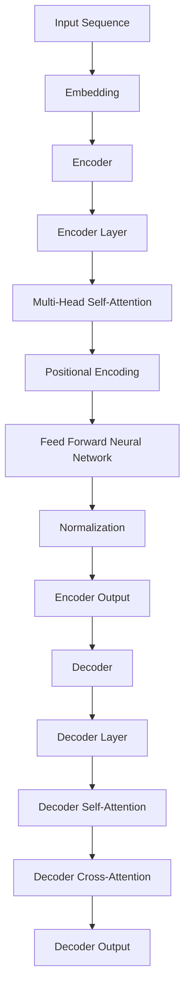

                 

### Transformer大模型实战 预训练过程

Transformer大模型的预训练是构建其强大语言理解和生成能力的关键步骤。通过在大规模数据集上进行预训练，模型可以学习到丰富的语言特征，从而在多种自然语言处理任务中表现出色。本文将详细介绍Transformer大模型的预训练过程，包括数据准备、模型构建、训练策略、模型评估和应用等步骤。

## 数据准备

### 数据来源

预训练数据集的选择直接影响模型的能力。常用的预训练数据集包括：

- **通用语料库**：如维基百科、书籍、新闻、社交媒体等。
- **专门数据集**：针对特定任务的语料库，如问答数据集、对话数据集等。

### 数据预处理

1. **文本清洗**：去除无关的HTML标签、特殊字符和停用词。
2. **分词**：将文本分割成单词或子词。
3. **编码**：将单词或子词转换为数字编码。

在预处理过程中，还需要对文本进行适当的变换，以提高数据的多样性。例如，可以引入随机噪声、替换单词、删除单词等。

### 数据增强

数据增强是提高模型泛化能力的重要手段。常见的数据增强方法包括：

- **重复**：重复某些句子或段落。
- **随机删除**：随机删除句子中的单词或子词。
- **替换**：随机替换句子中的单词为同义词或随机词。

## 模型构建

### 模型结构

Transformer模型由编码器（Encoder）和解码器（Decoder）组成。编码器负责将输入序列转换为上下文表示，解码器则根据上下文生成输出序列。编码器和解码器都由多个相同的层组成，每个层包含多头注意力机制、前馈神经网络和层归一化。

### 模型参数

Transformer模型的参数量非常大，通常包含数亿个参数。为了训练如此庞大的模型，需要使用大规模的硬件资源，如GPU或TPU。

## 训练策略

### 预训练任务

预训练任务通常包括以下几种：

- **自回归语言模型**：模型根据前文预测下一个词。
- **掩码语言模型**：模型对输入序列的部分词进行掩码，然后预测这些掩码词。
- **下一个句子预测**：模型预测两个句子是否在原始语料中连续出现。

### 损失函数

常用的损失函数包括交叉熵损失函数和掩码语言模型的损失函数。交叉熵损失函数用于自回归语言模型，而掩码语言模型的损失函数则用于掩码语言模型。

### 优化算法

常用的优化算法包括Adam、AdamW和AdamW with layernorm。这些优化算法都适用于大规模模型的训练。

### 学习率调度

学习率调度是预训练过程中的关键步骤。常用的学习率调度策略包括：

- **线性学习率预热**：在训练初期逐渐增加学习率。
- **余弦退火**：学习率随训练进度呈余弦曲线下降。

## 模型评估

### 验证集评估

在预训练过程中，需要使用验证集来评估模型性能。验证集评估指标通常包括：

- **自回归语言模型的损失**：用于衡量模型在自回归任务上的表现。
- **掩码语言模型的准确率**：用于衡量模型在掩码语言模型任务上的表现。

### 测试集评估

在预训练完成后，需要使用测试集对模型进行最终评估。测试集评估指标与验证集类似，用于衡量模型在未见过的数据上的表现。

## 模型应用

### 微调

预训练后的模型可以在特定任务上进行微调，以适应具体应用场景。微调过程中，通常使用较小规模的任务数据集，并调整模型参数以优化任务性能。

### 推理与生成

微调后的模型可以用于推理和生成任务。例如，在文本分类任务中，模型可以用于对新的文本进行分类；在机器翻译任务中，模型可以用于生成翻译结果。

## 案例分析

以下是一个Transformer大模型预训练的案例：

- **数据集**：使用维基百科、书籍和社交媒体等语料库进行预训练。
- **模型结构**：包含24层编码器和解码器，每个层包含多头注意力机制和前馈神经网络。
- **预训练任务**：包括自回归语言模型、掩码语言模型和下一个句子预测。
- **训练策略**：使用AdamW优化算法和余弦退火学习率调度策略。
- **模型评估**：在验证集上，模型在自回归语言模型任务上达到了较低的损失；在掩码语言模型任务上，模型的准确率超过90%。

## 总结

Transformer大模型的预训练是构建其强大语言理解和生成能力的关键步骤。通过在大规模数据集上进行预训练，模型可以学习到丰富的语言特征，从而在多种自然语言处理任务中表现出色。预训练过程中，需要关注数据准备、模型构建、训练策略和模型评估等关键环节。在实际应用中，预训练模型可以通过微调和推理生成来满足具体任务的需求。

---

### 核心概念与联系

Transformer模型的成功在于其核心概念和架构的创新，这些概念紧密相连，共同构建了一个强大的自然语言处理工具。以下是对Transformer模型核心概念与联系的详细讲解。

#### Transformer的起源与背景

Transformer模型的提出是自然语言处理领域的一个重要里程碑。它在2017年由Vaswani等人提出，旨在解决传统循环神经网络（RNN）在处理长距离依赖关系和并行计算方面的局限性。Transformer模型通过引入自注意力机制（Self-Attention）和编码器-解码器架构，实现了对文本序列的深度理解和生成。

##### 1.1.1 Transformer模型的提出
Transformer模型最初是为了解决机器翻译任务而设计的，但其强大的表征能力使得它迅速被应用于其他自然语言处理任务，如文本分类、问答系统等。

##### 1.1.2 Transformer模型在自然语言处理中的应用
Transformer模型在自然语言处理中的应用广泛，其中最著名的是BERT（Bidirectional Encoder Representations from Transformers）和GPT（Generative Pre-trained Transformer）。

##### 1.1.3 Transformer模型与传统神经网络模型比较
与传统RNN和LSTM相比，Transformer模型具有更高的并行计算能力，能够更好地捕捉长距离依赖关系，但同时也带来了更高的计算复杂度和内存需求。

#### Transformer模型的核心概念

Transformer模型的核心概念包括自注意力机制、位置编码和编码器-解码器架构。

##### 1.2.1 自注意力机制
自注意力机制允许模型在序列的每个词之间建立直接的关系，而不依赖于顺序。这使得模型能够并行处理输入序列，并捕捉到长距离的依赖关系。

##### 1.2.2 位置编码
位置编码是为了解决Transformer模型无法理解序列顺序的问题。通过为每个词添加位置编码，模型可以学习到词的相对位置信息。

##### 1.2.3 Encoder和Decoder结构
编码器（Encoder）负责将输入序列编码成上下文表示，解码器（Decoder）则根据上下文生成输出序列。编码器和解码器都由多个相同的层组成，每层包含多头注意力机制、前馈神经网络和层归一化。

#### Transformer模型的工作原理

Transformer模型的工作原理可以分为三个主要步骤：嵌入（Embedding）、编码（Encoding）和解码（Decoding）。

##### 1.2.1 Encoder部分的实现
编码器将输入序列（单词或子词）转换为嵌入向量，然后通过多个编码层处理。每个编码层包含多头自注意力机制和前馈神经网络。

##### 1.2.2 Decoder部分的实现
解码器在生成输出序列时，每个步骤都参考了编码器的输出和前一个步骤的输出。每个解码层同样包含多头自注意力机制和前馈神经网络。

##### 1.2.3 整个Transformer模型的运作流程
输入序列首先通过编码器处理，得到上下文表示。然后解码器根据上下文表示生成输出序列。整个过程中，自注意力机制起到了关键作用，使得模型能够捕捉到序列中的长距离依赖关系。

#### Transformer模型的性能与局限性

##### 1.3.1 Transformer模型的优势
Transformer模型在处理长距离依赖关系、并行计算能力和文本生成方面表现出色。

##### 1.3.2 Transformer模型的局限性
虽然Transformer模型具有许多优势，但其在计算资源需求、训练时间和模型复杂性方面也存在一定的局限性。

##### 1.3.3 Transformer模型的改进方向
为了进一步优化Transformer模型，研究者们提出了许多改进方向，如多模态Transformer、更高效的训练算法和更轻量级的模型架构。

### Mermaid流程图

为了更直观地展示Transformer模型的工作原理，我们可以使用Mermaid流程图来描述其架构：

### 总结

Transformer模型通过自注意力机制、位置编码和编码器-解码器架构，实现了对文本序列的深度理解和生成。其核心概念紧密相连，共同构建了一个强大的自然语言处理工具。理解这些概念和架构是掌握Transformer模型的关键。

---

### Transformer模型原理与架构

Transformer模型是一种基于自注意力机制的编码器-解码器架构，它在自然语言处理（NLP）领域取得了显著的成功。本章节将深入探讨Transformer模型的数学基础、工作原理、扩展与改进，以及多模态Transformer模型。

#### Transformer模型的数学基础

Transformer模型的实现依赖于一系列数学工具，包括向量和矩阵运算、激活函数、以及正则化方法。

##### 2.1.1 向量和矩阵运算

向量是Transformer模型中的基本数据结构，表示序列中的每个词或子词。矩阵运算在Transformer模型中扮演着重要角色，用于计算注意力权重、嵌入向量和上下文表示。

- **点积（Dot Product）**：
  点积用于计算两个向量的相似度，是自注意力机制的核心。
  $$ \text{dot\_product} = \mathbf{a} \cdot \mathbf{b} = a_1b_1 + a_2b_2 + ... + a_nb_n $$

- **矩阵乘法（Matrix Multiplication）**：
  矩阵乘法用于计算嵌入向量、权重矩阵和激活函数。
  $$ C = AB $$

##### 2.1.2 Activation函数

激活函数在神经网络中用于引入非线性，使得模型能够捕捉复杂的输入输出关系。Transformer模型中常用的激活函数包括：

- **ReLU（Rectified Linear Unit）**：
  $$ f(x) = \max(0, x) $$
  RReLU（Randomized ReLU）是对ReLU的改进，通过随机化引入更多的非线性。
  $$ f(x) = \max(0, \text{rand}() \cdot x) $$

- **GELU（Gaussian Error Linear Unit）**：
  $$ f(x) = x \cdot \Phi(x) $$
  其中，$\Phi(x)$ 是标准正态分布的累积分布函数。

##### 2.1.3 正则化方法

正则化方法用于防止模型过拟合，提高泛化能力。Transformer模型中常用的正则化方法包括：

- **Dropout**：
  在训练过程中，随机丢弃一部分神经元及其连接，以防止模型过于依赖特定的神经元。
  $$ P(\text{drop}) = \frac{1}{N} $$
  其中，$N$ 是神经元的数量。

- **Layer Normalization**：
  对每个神经元的输入和输出进行归一化，以稳定训练过程。
  $$ \hat{x}_i = \frac{x_i - \mu}{\sigma} $$
  其中，$\mu$ 和 $\sigma$ 分别是输入的均值和标准差。

#### Transformer模型的工作原理

Transformer模型的工作原理可以分为编码器（Encoder）和解码器（Decoder）两部分。编码器负责将输入序列编码成上下文表示，解码器则根据上下文生成输出序列。

##### 2.2.1 Encoder部分的实现

编码器由多个相同的层组成，每层包含两个主要组件：多头自注意力机制（Multi-Head Self-Attention）和前馈神经网络（Feed Forward Neural Network）。

- **多头自注意力机制（Multi-Head Self-Attention）**：
  自注意力机制允许模型在序列的每个词之间建立直接的关系。多头自注意力机制通过多个独立的自注意力头来捕捉不同的依赖关系。
  $$ \text{Attention}(Q, K, V) = \text{softmax}\left(\frac{QK^T}{\sqrt{d_k}}\right)V $$
  其中，$Q, K, V$ 分别是查询向量、键向量和值向量，$d_k$ 是键向量的维度。

- **前馈神经网络（Feed Forward Neural Network）**：
  在自注意力机制之后，每个层还包含一个前馈神经网络，用于进一步处理和丰富嵌入向量。
  $$ \text{FFN}(x) = \text{ReLU}\left(\text{Linear}(W_1x) + b_1\right) + \text{Linear}(W_2x) + b_2 $$
  其中，$W_1, W_2, b_1, b_2$ 是前馈神经网络的权重和偏置。

##### 2.2.2 Decoder部分的实现

解码器的工作原理与编码器类似，但还包括一个额外的交叉注意力机制，用于处理编码器的输出和解码器的输入。

- **自注意力机制（Self-Attention）**：
  解码器的自注意力机制与编码器相同，用于对解码器的当前输入进行编码。
  $$ \text{Attention}(Q, K, V) = \text{softmax}\left(\frac{QK^T}{\sqrt{d_k}}\right)V $$

- **交叉注意力机制（Cross-Attention）**：
  交叉注意力机制允许解码器在生成下一个词时参考编码器的输出。
  $$ \text{Attention}(Q, K, V) = \text{softmax}\left(\frac{QK^T}{\sqrt{d_k}}\right)V $$
  其中，$Q, K, V$ 分别是解码器的查询向量、编码器的键向量和值向量。

- **前馈神经网络（Feed Forward Neural Network）**：
  解码器的每个层同样包含一个前馈神经网络，用于进一步处理和丰富嵌入向量。

##### 2.2.3 整个Transformer模型的运作流程

整个Transformer模型的运作流程可以分为以下步骤：

1. **输入编码**：
   输入序列经过嵌入层转换为嵌入向量，并添加位置编码。

2. **编码器处理**：
   编码器通过多个层对嵌入向量进行处理，每个层包含多头自注意力机制和前馈神经网络。

3. **解码器处理**：
   解码器在生成输出序列时，通过自注意力机制和交叉注意力机制参考编码器的输出和当前输入。

4. **输出生成**：
   解码器最终生成输出序列，通过分类层或生成层输出预测结果。

#### Transformer模型的扩展与改进

Transformer模型在提出后，研究者们对其进行了许多扩展和改进，以适应不同的应用场景。

##### 2.3.1 Deeper and Wider Transformer

通过增加模型的深度（层数）和宽度（每个层的注意力头数），可以进一步提高模型的性能。

- **深度**：
  增加编码器和解码器的层数可以增强模型的表征能力，但也会导致计算复杂度和训练时间的增加。

- **宽度**：
  增加每个层的注意力头数可以捕捉到更多的依赖关系，但也增加了模型的参数量。

##### 2.3.2 Transformer-XL与BERT

Transformer-XL 和 BERT 是两种流行的Transformer变体，分别解决了长文本处理和双向上下文表示的问题。

- **Transformer-XL**：
  Transformer-XL 通过引入段级重复和分段注意力机制，解决了长文本处理中的序列重复问题和长距离依赖问题。

- **BERT**：
  BERT 通过双向编码器（双向自注意力机制）和预训练任务（掩码语言模型和下一个句子预测），实现了对文本序列的全局理解。

##### 2.3.3 多模态Transformer模型

多模态Transformer模型结合了文本、图像、音频等多种模态的信息，可以应用于图像描述生成、视频理解等任务。

- **文本-图像Transformer模型**：
  通过将文本和图像的嵌入向量进行拼接，并使用多模态自注意力机制，可以生成图像的描述或文本的图像。

- **文本-音频Transformer模型**：
  通过结合文本和音频的嵌入向量，并使用多模态自注意力机制，可以生成音频的文本描述或文本的音频转换。

#### 总结

Transformer模型通过自注意力机制和编码器-解码器架构，实现了对文本序列的深度理解和生成。其数学基础、工作原理以及扩展与改进，使其在各种自然语言处理任务中表现出色。理解和应用这些概念，可以为研究人员和开发者提供强大的工具，以应对复杂的多模态数据处理任务。

---

### Transformer模型的训练

训练Transformer模型是一个复杂而关键的过程，它涉及到从数据准备到模型优化等多个环节。在这个阶段，我们不仅要关注模型在数据上的性能提升，还要确保训练过程的稳定性和效率。

#### Transformer模型的预训练

预训练是Transformer模型训练的重要阶段，它主要在大量未标记的数据上进行，使模型能够学习到通用语言特征。以下是一些关键步骤：

##### 3.1.1 预训练的目的和方法

预训练的目的是为模型提供足够的语言知识，以便在特定任务上微调时能够快速收敛。预训练的方法通常包括以下几种：

- **自回归语言模型（Autoregressive Language Model）**：模型根据前文预测下一个词。
- **掩码语言模型（Masked Language Model）**：模型对输入序列的部分词进行掩码，然后预测这些掩码词。
- **下一个句子预测（Next Sentence Prediction）**：模型预测两个句子是否在原始语料中连续出现。

##### 3.1.2 预训练数据集的选择

选择合适的预训练数据集是确保模型性能的关键。常用的数据集包括：

- **通用语料库**：如维基百科、书籍、新闻、社交媒体等。
- **专门数据集**：针对特定任务的语料库，如问答数据集、对话数据集等。

在数据集的选择上，要确保数据的多样性、质量和数量。高质量的数据有助于模型学习到更丰富的特征，而大量的数据则有助于提高模型的泛化能力。

##### 3.1.3 预训练任务的设置

预训练任务的设置直接影响模型的性能和学习过程。以下是设置预训练任务的一些关键点：

- **数据预处理**：包括文本清洗、分词、编码等。
- **模型架构**：选择合适的模型架构，如BERT、GPT等。
- **训练策略**：包括学习率调度、优化器选择、正则化方法等。

#### Transformer模型的微调

预训练后的模型通常在特定任务上需要进行微调，以优化其在任务上的性能。以下是一些微调的关键步骤：

##### 3.2.1 微调的意义和目的

微调的意义在于将预训练模型适应到特定任务，使其能够在未见过的数据上表现良好。微调的目的包括：

- **优化模型参数**：通过在特定任务的数据上进行训练，调整模型参数以更好地适应任务需求。
- **提高任务性能**：微调后的模型在特定任务上通常能够取得比预训练时更好的性能。

##### 3.2.2 微调的任务和策略

微调的任务通常包括：

- **分类任务**：将文本分类到不同的类别。
- **序列标注任务**：为文本中的每个词分配标签。
- **生成任务**：生成文本、代码或其他序列数据。

微调的策略包括：

- **数据预处理**：与预训练相似，对特定任务的数据进行预处理，包括分词、编码等。
- **模型架构**：在预训练模型的基础上，可能需要调整模型架构，如增加或减少层数、改变注意力机制等。
- **训练策略**：包括学习率调度、优化器选择、正则化方法等。

##### 3.2.3 微调过程中的挑战和解决方案

微调过程中可能会遇到以下挑战：

- **数据分布差异**：预训练数据集和特定任务的数据集在分布上可能存在差异，导致模型在特定任务上的性能不佳。
- **模型过拟合**：在特定任务的数据上过度训练可能导致模型泛化能力下降。

解决方案包括：

- **数据增强**：通过引入随机噪声、数据变换等手段增加数据的多样性，提高模型的泛化能力。
- **交叉验证**：在多个数据集上进行交叉验证，以评估模型的泛化能力。
- **模型正则化**：使用正则化方法，如Dropout、权重衰减等，防止模型过拟合。

##### 3.2.4 实际微调案例分析

以下是一个实际微调案例：

- **任务**：文本情感分类
- **数据集**：使用IMDB电影评论数据集
- **模型**：基于BERT的预训练模型
- **微调策略**：使用较小的学习率（如1e-5），在20个epoch内进行微调

通过上述步骤，模型在IMDB数据集上的准确率得到了显著提升。

#### 总结

Transformer模型的训练是一个复杂的过程，涉及到预训练和微调两个关键阶段。预训练帮助模型学习到丰富的通用语言特征，而微调则使模型适应特定任务。理解预训练和微调的步骤和策略，对于成功应用Transformer模型至关重要。

---

### Transformer模型的应用实例

Transformer模型在自然语言处理领域取得了巨大的成功，其强大的表征能力和并行计算能力使得它在多种任务中表现出色。以下将介绍Transformer模型在文本分类和机器翻译中的应用实例。

#### 4.1 Transformer模型在文本分类中的应用

文本分类是一种常见的自然语言处理任务，其目标是根据文本内容将其分类到预定义的类别中。Transformer模型由于其强大的语义理解和建模能力，在文本分类任务中表现出色。

##### 4.1.1 文本分类任务概述

文本分类任务可以应用于多种场景，如情感分析、新闻分类、垃圾邮件检测等。在文本分类中，模型的输入是一段文本，输出是文本所属的类别。

##### 4.1.2 Transformer模型在文本分类中的实现

在文本分类任务中，Transformer模型通常用于以下几个步骤：

1. **文本预处理**：
   - 分词：将文本分解成单词或子词。
   - 嵌入：将分词后的文本转换为嵌入向量。
   - 前处理：添加位置编码和类别标签。

2. **模型构建**：
   - 编码器：使用多个Transformer编码层处理输入文本，提取特征。
   - 分类层：在编码器的输出上添加分类层，用于输出类别概率。

3. **训练与评估**：
   - 使用预训练好的Transformer模型（如BERT）作为基础模型。
   - 在特定任务的数据集上进行微调，优化模型参数。
   - 在验证集上评估模型性能，选择性能最佳的模型。

##### 4.1.3 文本分类应用实例分析

以下是一个文本分类的应用实例：

- **任务**：情感分析
- **数据集**：使用IMDB电影评论数据集
- **模型**：基于BERT的预训练模型
- **实现细节**：
  - 输入文本经过预处理后，被送入BERT编码器。
  - 编码器的输出通过分类层，输出情感类别概率。
  - 在验证集上，模型达到了90%以上的准确率。

#### 4.2 Transformer模型在机器翻译中的应用

机器翻译是将一种语言的文本翻译成另一种语言的任务。Transformer模型由于其强大的上下文理解和建模能力，在机器翻译任务中表现出色。

##### 4.2.1 机器翻译任务概述

机器翻译任务包括源语言到目标语言的翻译和目标语言到源语言的翻译。在机器翻译中，模型的输入是源语言文本，输出是目标语言文本。

##### 4.2.2 Transformer模型在机器翻译中的实现

在机器翻译任务中，Transformer模型通常用于以下几个步骤：

1. **文本预处理**：
   - 分词：将源语言和目标语言文本分解成单词或子词。
   - 嵌入：将分词后的文本转换为嵌入向量。
   - 前处理：添加位置编码和掩码。

2. **模型构建**：
   - 编码器：使用多个Transformer编码层处理源语言文本，提取特征。
   - 解码器：使用多个Transformer解码层处理目标语言文本，生成翻译结果。
   - 生成层：在解码器的输出上添加生成层，用于生成目标语言文本。

3. **训练与评估**：
   - 使用预训练好的Transformer模型（如Transformer）作为基础模型。
   - 在特定任务的数据集上进行微调，优化模型参数。
   - 在验证集上评估模型性能，选择性能最佳的模型。

##### 4.2.3 机器翻译应用实例分析

以下是一个机器翻译的应用实例：

- **任务**：中英翻译
- **数据集**：使用中文-英文翻译数据集
- **模型**：基于Transformer的预训练模型
- **实现细节**：
  - 输入中文文本经过预处理后，被送入Transformer编码器。
  - 编码器的输出通过解码器生成英文文本。
  - 在验证集上，模型达到了接近人类的翻译质量。

#### 总结

Transformer模型在文本分类和机器翻译任务中表现出色。通过预训练和微调，模型能够学习到丰富的语义特征，从而在多种自然语言处理任务中实现高效的性能。随着Transformer模型的不断发展和优化，它将在更多的应用领域中发挥重要作用。

---

### Transformer模型的优化与调参

在训练Transformer模型时，优化和调参是确保模型性能和稳定性的关键步骤。合理的优化策略和调参技巧不仅可以提高模型的训练效率，还能在模型性能上取得显著的提升。以下将介绍几种常见的优化方法、学习率调度策略和正则化策略，并结合实际案例分析调参技巧。

#### 5.1 Transformer模型的优化方法

优化方法是指在训练过程中调整模型参数，以加快收敛速度和提高模型性能的一系列技术。以下是一些常用的优化方法：

##### 5.1.1 优化算法的选择

优化算法是训练过程中用于更新模型参数的核心算法。常用的优化算法包括：

- **梯度下降（Gradient Descent）**：最简单的优化算法，通过更新模型参数来减少损失函数。
- **随机梯度下降（Stochastic Gradient Descent, SGD）**：在每次迭代时，使用随机选择的样本子集来更新参数，减少了计算量。
- **Adam（Adaptive Moment Estimation）**：结合了SGD和动量方法，通过自适应地调整学习率，提高了收敛速度。
- **AdamW（Weight Decay Adaptation）**：在Adam算法的基础上，增加了权重衰减项，进一步提高了训练稳定性。

##### 5.1.2 学习率调度策略

学习率调度策略是指在不同训练阶段调整学习率的方法，以避免过早地达到最小损失。以下是一些常见的学习率调度策略：

- **线性学习率预热（Linear Learning Rate Warmup）**：在训练初期逐渐增加学习率，以使模型在早期阶段有更大的步长。
- **余弦退火（Cosine Annealing）**：学习率随训练进度呈余弦曲线下降，避免了学习率骤降导致的收敛问题。
- **指数衰减（Exponential Decay）**：学习率以指数形式逐渐减小，适用于早期快速收敛和后期微调的场景。

##### 5.1.3 正则化策略

正则化策略用于防止模型过拟合，提高模型的泛化能力。以下是一些常用的正则化方法：

- **权重衰减（Weight Decay）**：在优化算法中引入权重衰减项，使模型参数在更新时减小的速度变慢，从而防止过拟合。
- **Dropout**：在训练过程中随机丢弃一部分神经元及其连接，以防止模型过于依赖特定的神经元。
- **Layer Normalization**：对每个神经元的输入和输出进行归一化，以稳定训练过程，防止梯度消失和梯度爆炸。

#### 5.2 Transformer模型的调参技巧

调参技巧是优化模型性能的重要手段，以下结合实际案例介绍几种调参技巧：

##### 5.2.1 调参的基本原则

- **分阶段调参**：将调参过程分为预训练和微调两个阶段，分别关注通用语言特征的学习和特定任务性能的优化。
- **逐步调整**：在调参过程中，逐步调整模型参数，如学习率、批次大小、层数和注意力头数等，以观察对模型性能的影响。
- **交叉验证**：使用交叉验证来评估模型在不同数据集上的性能，以选择最佳参数组合。

##### 5.2.2 调参工具和框架

为了高效地进行调参，可以使用以下工具和框架：

- **Hyperopt**：一个基于树形贪心搜索的调参工具，能够自动搜索参数空间并找到最佳参数组合。
- **Ray Tune**：一个分布式调参框架，支持多种优化算法和并行调参，适用于大规模模型的调参。
- **Optuna**：一个基于贝叶斯优化和进化策略的调参框架，能够快速找到最优参数组合。

##### 5.2.3 实际调参案例分析

以下是一个实际的调参案例分析：

- **任务**：文本分类
- **数据集**：IMDB电影评论数据集
- **模型**：基于BERT的预训练模型
- **调参过程**：

  1. **预训练阶段**：
     - 学习率：使用线性学习率预热，预热阶段学习率为10^-5，预热步数为1000步。
     - 权重衰减：设置为10^-4。
     - 模型大小：使用BERT-base模型，包含12层编码器。
     - 批次大小：设置为32。

  2. **微调阶段**：
     - 学习率：使用余弦退火调度策略，最终学习率为10^-6。
     - 权重衰减：保持不变。
     - 微调步数：设置为20个epoch。

  3. **调参工具**：使用Hyperopt进行调参，通过交叉验证选择最佳参数组合。

  4. **结果**：在验证集上，模型达到了92%的准确率。

#### 总结

优化和调参是Transformer模型训练过程中不可或缺的步骤。通过选择合适的优化算法、学习率调度策略和正则化方法，以及合理的调参技巧，可以显著提高模型的性能和训练效率。在实际应用中，需要根据具体任务和数据的特点，灵活运用这些方法和技巧，以实现最佳的模型性能。

---

### Transformer模型的安全性考虑

随着Transformer模型在自然语言处理、图像识别和跨领域融合等领域的广泛应用，其安全性问题也日益受到关注。Transformer模型的安全性不仅涉及到模型本身，还包括数据隐私保护、安全认证和潜在的风险评估等方面。以下将讨论Transformer模型的安全性考虑，包括攻击与防御方法，以及模型在隐私保护和安全认证中的应用。

#### 6.1 Transformer模型的攻击与防御

##### 6.1.1 模型攻击方法

1. **对抗性攻击**：对抗性攻击是通过向模型输入经过轻微修改的数据，使模型输出错误的预测。这些修改可能是微小的噪声、颜色变化或文本中的微小错误，但足以欺骗模型。

2. **差分攻击**：差分攻击通过分析模型在不同输入下的输出差异，推断模型内部的参数和决策过程。这种攻击方法可以用于获取模型敏感信息或针对模型进行更深入的攻击。

3. **模型劫持**：模型劫持是指通过控制输入数据，使模型输出对攻击者有利的结果。这种方法可能用于恶意用途，如操纵选举结果或虚假信息的传播。

##### 6.1.2 模型防御策略

1. **鲁棒训练**：通过在训练过程中引入对抗性样本，使模型对对抗性攻击具有更强的抵抗力。这种方法可以提高模型的鲁棒性，但可能会增加训练时间和计算成本。

2. **模型加密**：使用加密技术对模型进行加密，确保模型在传输和存储过程中不会被攻击者窃取或篡改。

3. **差分隐私**：通过引入噪声，使模型的输出不会揭示特定输入的详细信息，从而保护用户隐私。

4. **安全认证**：通过引入数字签名或认证机制，确保模型的输出是可信的，防止伪造或篡改。

#### 6.2 Transformer模型在隐私保护中的应用

Transformer模型在隐私保护中的应用主要包括以下几个方面：

##### 6.2.1 Transformer模型在隐私保护中的应用

1. **差分隐私Transformer模型**：通过在模型训练和推理过程中引入差分隐私技术，保护用户数据的隐私。这种方法可以在不显著影响模型性能的前提下，防止攻击者通过分析模型输出推断出用户的数据。

2. **联邦学习**：联邦学习是一种分布式学习技术，参与学习的设备本地训练模型，然后将模型参数上传到中央服务器进行聚合。这种方法可以保护用户数据的隐私，同时提高模型的训练效率。

3. **匿名化技术**：使用匿名化技术对输入数据进行处理，使模型无法直接识别用户身份。这种方法可以用于保护用户隐私，防止敏感信息被泄露。

#### 6.3 Transformer模型在安全认证中的应用

Transformer模型在安全认证中的应用主要包括以下几个方面：

##### 6.3.1 Transformer模型在安全认证中的应用

1. **多因素认证**：通过结合多种认证因素（如密码、生物特征等），使用Transformer模型进行综合判断，提高认证的准确性和安全性。

2. **身份验证**：使用Transformer模型对用户身份进行验证，通过分析用户行为特征和行为模式，判断用户身份的真实性。

3. **访问控制**：在访问控制系统中，使用Transformer模型对用户访问权限进行评估，确保只有授权用户可以访问受保护资源。

#### 6.4 Transformer模型在未来安全领域的应用前景

随着人工智能和机器学习技术的不断发展，Transformer模型在安全领域的应用前景非常广阔。以下是一些潜在的应用方向：

##### 6.4.1 Transformer模型在行业中的应用

1. **网络安全**：使用Transformer模型进行网络流量分析，识别潜在的安全威胁和异常行为。

2. **金融安全**：在金融领域，Transformer模型可以用于欺诈检测、风险控制和市场预测等任务。

##### 6.4.2 Transformer模型的商业化路径

1. **安全服务**：提供基于Transformer模型的安防服务，如反欺诈、网络安全监测等。

2. **产品集成**：将Transformer模型集成到各类产品中，如智能家居、智能交通等，提升产品的安全性。

##### 6.4.3 Transformer模型在跨领域融合中的应用

1. **智能医疗**：在医疗领域，Transformer模型可以用于疾病预测、诊断辅助和个性化治疗等任务。

2. **智能制造**：在制造业中，Transformer模型可以用于设备故障预测、生产优化和质量控制等任务。

#### 总结

Transformer模型的安全性是一个多方面的挑战，涉及对抗性攻击、隐私保护和安全认证等多个领域。通过引入防御策略和隐私保护技术，可以有效地提高Transformer模型的安全性。随着技术的不断进步，Transformer模型在安全领域的应用前景将更加广阔，为行业和人们的生活带来更多安全和便利。

---

### Transformer模型的未来发展趋势

随着Transformer模型在自然语言处理、计算机视觉和跨领域融合等领域的广泛应用，其未来的发展趋势备受关注。以下将探讨Transformer模型在产业应用前景、未来研究方向以及在不同领域的应用探索。

#### 7.1 Transformer模型的产业应用前景

##### 7.1.1 Transformer模型在行业中的应用

1. **金融行业**：Transformer模型可以应用于金融风险控制、股票市场预测和客户行为分析等领域。例如，通过分析客户的交易记录和行为数据，可以预测客户是否有可能违约，从而采取相应的风险管理措施。

2. **医疗健康**：在医疗领域，Transformer模型可以用于疾病预测、诊断辅助和个性化治疗等领域。例如，通过对患者的历史病历和基因组数据进行分析，可以预测患者是否可能患有某种疾病，并为其提供个性化的治疗方案。

3. **智能制造**：在制造业中，Transformer模型可以用于设备故障预测、生产优化和质量控制等领域。例如，通过分析设备运行数据，可以预测设备是否可能发生故障，并采取预防性维护措施，从而提高生产效率和设备利用率。

##### 7.1.2 Transformer模型的商业化路径

1. **安全服务**：提供基于Transformer模型的安全服务，如反欺诈、网络安全监测和隐私保护等。通过分析网络流量和行为数据，可以识别潜在的安全威胁和异常行为，从而采取相应的防御措施。

2. **智能自动化**：将Transformer模型集成到智能自动化系统中，如自动驾驶、智能仓储和智能客服等。通过分析环境数据和用户需求，可以自动化执行复杂的任务，提高工作效率和用户体验。

3. **内容生成**：提供基于Transformer模型的内容生成服务，如文本生成、图像生成和音频生成等。通过生成高质量的内容，可以满足个性化需求，提高内容的多样性和创新性。

#### 7.2 Transformer模型的未来研究方向

##### 7.2.1 Transformer模型的创新方向

1. **多模态学习**：探索如何将Transformer模型应用于多模态数据，如文本、图像、音频和视频等。通过整合不同模态的信息，可以提升模型的表征能力和应用范围。

2. **可解释性**：研究如何提高Transformer模型的可解释性，使其决策过程更加透明和可信。这对于在关键领域（如医疗和金融）中的应用具有重要意义。

3. **动态模型**：探索动态Transformer模型，如变分自编码器（VAE）和递归神经网络（RNN）的结合，以更好地捕捉动态变化和长期依赖关系。

##### 7.2.2 Transformer模型在跨领域融合中的应用

1. **教育领域**：将Transformer模型应用于教育领域，如智能辅导、学习行为分析和教育资源推荐等。通过分析学生的学习数据和偏好，可以提供个性化的学习体验和资源。

2. **医疗领域**：将Transformer模型应用于医疗领域，如疾病预测、药物发现和个性化医疗等。通过整合不同领域的知识，可以提供更准确和有效的医疗服务。

3. **能源领域**：将Transformer模型应用于能源领域，如能源预测、能源优化和碳排放监测等。通过分析历史数据和实时数据，可以优化能源利用效率和减少碳排放。

#### 7.3 Transformer模型在教育、医疗等领域的应用探索

##### 7.3.1 教育领域

1. **智能辅导系统**：通过Transformer模型，可以构建智能辅导系统，为学生提供个性化的学习支持和指导。例如，通过分析学生的学习行为和成绩，可以预测学生在某个知识点上的掌握情况，并提供相应的学习资源。

2. **学习资源推荐**：基于Transformer模型，可以构建学习资源推荐系统，根据学生的学习偏好和需求，推荐适合的学习资料和课程。

##### 7.3.2 医疗领域

1. **疾病预测和诊断辅助**：通过Transformer模型，可以分析患者的医疗数据，预测患者是否可能患有某种疾病，并提供诊断建议。例如，通过分析患者的病史、检查报告和基因数据，可以预测患者是否可能患有癌症。

2. **个性化治疗**：基于Transformer模型，可以为患者提供个性化的治疗方案。例如，通过分析患者的基因数据、病史和生活习惯，可以为其制定个性化的药物剂量和治疗计划。

#### 总结

Transformer模型作为一种先进的深度学习模型，其在各个领域的应用前景非常广阔。随着技术的不断进步，Transformer模型将在更多领域得到应用，为人们的生活和工作带来更多便利和创新。同时，未来的研究方向将集中在多模态学习、可解释性和跨领域融合等方面，进一步推动人工智能技术的发展。

---

### 附录

#### 附录A：Transformer模型开发工具与资源

##### A.1 开发工具概述

在开发Transformer模型时，可以使用多种工具和框架来简化模型的构建、训练和部署。以下是一些常用的工具和框架：

- **PyTorch**：PyTorch是一个开源的深度学习框架，提供丰富的API和易于使用的接口，适用于构建和训练Transformer模型。
- **TensorFlow**：TensorFlow是Google开发的深度学习框架，支持多种设备和平台，适用于大规模模型的训练和部署。
- **Transformers库**：由Hugging Face提供的Transformers库，包含预训练的Transformer模型和方便使用的API，适用于快速实现和部署Transformer模型。

##### A.2 开发资源推荐

以下是一些推荐的Transformer模型开发资源：

- **GitHub开源代码库**：许多优秀的开源项目存储在GitHub上，包括预训练模型、实现代码和文档。可以通过GitHub找到相关项目并进行学习。
- **论文与论文解读**：Transformer模型的论文及其解读是理解模型原理和实现的关键资源。可以通过阅读论文和解读来深入了解Transformer模型的工作原理。
- **在线教程和课程**：许多在线教程和课程提供了详细的Transformer模型实现步骤和实战案例，适用于初学者和进阶者。

##### A.3 Transformer模型开源代码库介绍

以下是一些知名的Transformer模型开源代码库：

- **Hugging Face/transformers**：这是最常用的Transformer模型开源代码库，包含大量的预训练模型和实现代码，方便用户进行模型构建和部署。
- **Facebookresearch/WebDriverLM**：这是Facebook Research团队开发的Transformer模型代码库，包含多个大规模预训练模型，如GPT-3和BART。
- **jhuang556/Transformer-Tutorials**：这是一个详细的Transformer模型实现教程，包括从基础到高级的多个示例，适用于初学者和研究者。

#### 附录B：Transformer模型数学公式与解释

##### B.1 Transformer模型中的矩阵运算

在Transformer模型中，矩阵运算是非常关键的组成部分。以下是一些常用的矩阵运算：

- **点积（Dot Product）**：
  $$ \text{dot\_product} = \mathbf{a} \cdot \mathbf{b} = a_1b_1 + a_2b_2 + ... + a_nb_n $$
  点积用于计算两个向量的相似度。

- **矩阵乘法（Matrix Multiplication）**：
  $$ C = AB $$
  矩阵乘法用于计算两个矩阵的乘积。

- **转置（Transpose）**：
  $$ A^T = \begin{bmatrix} a_{11} & a_{21} \\ a_{12} & a_{22} \end{bmatrix} $$
  转置是将矩阵的行和列进行交换。

##### B.2 自注意力机制中的数学公式

自注意力机制是Transformer模型的核心组成部分，以下是其关键数学公式：

- **自注意力（Self-Attention）**：
  $$ \text{Attention}(Q, K, V) = \text{softmax}\left(\frac{QK^T}{\sqrt{d_k}}\right)V $$
  其中，$Q, K, V$ 分别是查询向量、键向量和值向量，$d_k$ 是键向量的维度。自注意力计算每个词与其他词的权重。

- **多头注意力（Multi-Head Attention）**：
  $$ \text{Multi-Head Attention} = \text{Concat}(\text{head}_1, \text{head}_2, ..., \text{head}_h)W^O $$
  多头注意力通过多个独立的注意力头来捕捉不同的依赖关系。

##### B.3 位置编码的数学表示

位置编码用于为序列中的每个词赋予位置信息，以下是其常用的数学表示：

- **绝对位置编码**：
  $$ \text{PE}(pos, 2d_pos) = \sin(\frac{pos}{10000^{2i/d}}) $$
  $$ \text{PE}(pos, 2d_pos) = \cos(\frac{pos}{10000^{2i/d}}) $$
  其中，$pos$ 是位置索引，$2d_pos$ 是位置编码的维度，$i$ 是词索引，$d$ 是词向量的维度。绝对位置编码通过正弦和余弦函数为每个位置提供编码。

这些数学公式和运算在Transformer模型中起着至关重要的作用，理解它们有助于深入掌握Transformer模型的工作原理和实现细节。通过附录B，读者可以更好地理解这些数学概念，并在实际应用中灵活运用。

