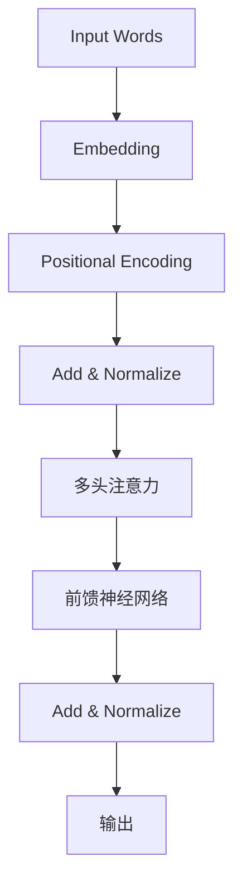
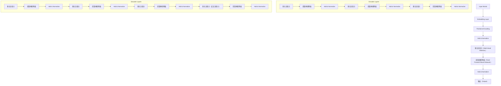

                 

### 文章标题

《Transformer架构原理详解：BERT 基于Transformer编码器的双向语言模型》

### 关键词

Transformer、BERT、编码器、自注意力机制、语言模型、微调技术、性能评估、文本分类、情感分析、命名实体识别、问答系统

### 摘要

本文旨在详细解读Transformer架构的核心原理，特别是其在BERT模型中的应用。我们将分步骤地探讨Transformer的基本概念、BERT模型的结构与算法原理，并深入分析BERT的训练与优化过程。此外，本文还将展示BERT在文本分类、情感分析、命名实体识别和问答系统等实际应用中的实现案例，并对BERT与其他模型的对比与整合进行探讨。最后，本文将展望BERT模型的发展趋势和面临的挑战。

### 《Transformer架构原理详解：BERT 基于Transformer编码器的双向语言模型》目录大纲

#### 第一部分：Transformer架构基础

**1.1 Transformer核心概念与联系**

**1.1.1 自注意力机制**

**1.1.2 多头注意力**

**1.1.3 位置编码**

**1.2 Transformer架构的Mermaid流程图**

**1.3 Transformer与传统的循环神经网络对比**

**1.3.1 优势分析**

**1.3.2 劣势分析**

**1.4 Transformer架构的演进历史**

**1.4.1 VAE-T & VST**

**1.4.2 BERT & GPT-2**

**1.4.3 T5**

#### 第二部分：BERT模型详解

**2.1 BERT模型结构**

**2.1.1 embedding层**

**2.1.2 Encoder结构**

**2.1.3 Decoder结构**

**2.2 BERT模型核心算法原理**

**2.2.1 多层Transformer结构**

**2.2.2 self-attention机制**

**2.2.3 position-wise feed-forward networks**

**2.2.4 Masked Language Model**

**2.3 BERT模型的数学模型**

**2.3.1 input embedding**

**2.3.2 position embedding**

**2.3.3 weight sharing**

**2.4 BERT模型的训练与优化**

**2.4.1 微调技术**

**2.4.2 梯度裁剪**

**2.4.3 学习率调整**

**2.5 BERT模型的性能评估**

**2.5.1 BLEU指标**

**2.5.2 GLUE基准测试集**

**2.5.3 SQuAD指标**

#### 第三部分：BERT应用实战

**3.1 BERT在文本分类中的应用**

**3.1.1 数据预处理**

**3.1.2 模型搭建**

**3.1.3 模型训练**

**3.1.4 模型评估**

**3.2 BERT在情感分析中的应用**

**3.2.1 数据预处理**

**3.2.2 模型搭建**

**3.2.3 模型训练**

**3.2.4 模型评估**

**3.3 BERT在命名实体识别中的应用**

**3.3.1 数据预处理**

**3.3.2 模型搭建**

**3.3.3 模型训练**

**3.3.4 模型评估**

**3.4 BERT在问答系统中的应用**

**3.4.1 数据预处理**

**3.4.2 模型搭建**

**3.4.3 模型训练**

**3.4.4 模型评估**

#### 第四部分：BERT与其他模型的对比与整合

**4.1 BERT与GPT-3对比**

**4.1.1 模型结构对比**

**4.1.2 应用领域对比**

**4.1.3 性能对比**

**4.2 BERT与其他模型的整合应用**

**4.2.1 BERT与BERT融合**

**4.2.2 BERT与GPT-2融合**

**4.2.3 BERT与T5融合**

**4.3 BERT模型优化与改进**

**4.3.1 稀疏注意力机制**

**4.3.2 低秩分解**

**4.3.3 参数共享策略**

#### 第五部分：未来展望与挑战

**5.1 BERT模型的发展趋势**

**5.1.1 模型压缩**

**5.1.2 模型部署**

**5.1.3 多模态BERT**

**5.2 BERT模型面临的挑战**

**5.2.1 数据隐私保护**

**5.2.2 模型可解释性**

**5.2.3 模型泛化能力**

**5.3 未来发展方向**

**5.3.1 适应特定场景的定制模型**

**5.3.2 基于Transformer的新型架构探索**

**5.3.3 开源社区与行业标准**

### 附录

**附录A：BERT模型开发工具与资源**

**A.1 TensorFlow与PyTorch的使用**

**A.2 BERT模型的预训练与微调**

**A.3 BERT模型的评估与优化**

**A.4 开源BERT模型资源汇总**

---

本文将按照以上目录大纲结构，逐步深入讲解Transformer架构及其在BERT模型中的应用，力求为读者提供一个全面、系统的理解和实战指南。接下来，我们将首先深入探讨Transformer架构的基础知识。让我们一步步来，从核心概念开始，逐步构建对这一革命性架构的深刻理解。## 第一部分：Transformer架构基础

### 1.1 Transformer核心概念与联系

在深度学习领域，Transformer架构的提出标志着自然语言处理（NLP）模型的重大进步。Transformer的核心思想是通过自注意力机制（Self-Attention）来捕捉序列中的长距离依赖关系，从而极大地提升了模型的性能和效果。在这一部分，我们将详细探讨Transformer的核心概念及其相互联系。

#### 1.1.1 自注意力机制

自注意力机制是Transformer架构的核心，它允许模型在处理每个输入序列的每个位置时，考虑到其他所有位置的信息。这种机制使得模型能够更好地捕捉长距离的依赖关系，从而在处理语言时更加准确和高效。自注意力机制的实现通常涉及到以下几个关键步骤：

1. **计算查询（Query）、键（Key）和值（Value）**：对于输入序列中的每个单词，我们分别计算其查询向量、键向量和值向量。
   $$
   Q = \text{query\_layer}(W_Q \cdot X) \\
   K = \text{key\_layer}(W_K \cdot X) \\
   V = \text{value\_layer}(W_V \cdot X)
   $$
   其中，$W_Q$、$W_K$ 和 $W_V$ 是权重矩阵，$X$ 是输入序列。

2. **计算注意力得分**：使用查询向量和键向量计算注意力得分。
   $$
   \text{Attention}(Q, K, V) = \text{softmax}\left(\frac{QK^T}{\sqrt{d_k}}\right) V
   $$
   其中，$d_k$ 是键向量的维度。

3. **计算加权的输出**：将注意力得分与值向量相乘，得到加权输出。
   $$
   \text{Output} = \text{Attention}(Q, K, V)
   $$

#### 1.1.2 多头注意力

为了进一步提高自注意力机制的效果，Transformer引入了多头注意力（Multi-Head Attention）的概念。多头注意力通过将输入序列分解为多个子序列，并为每个子序列单独计算注意力权重，然后合并这些权重来生成最终的输出。

1. **多头注意力的计算**：
   $$
   \text{Multi-Head}(Q, K, V) = \text{Concat}(\text{head}_1, \text{head}_2, ..., \text{head}_h)W_O
   $$
   其中，$h$ 表示头数，$\text{head}_i = \text{Attention}(QW_{Q_i}, KW_{K_i}, VW_{V_i})$。

2. **权重共享**：在多头注意力中，不同的头共享相同的权重矩阵，这降低了模型的参数数量，同时也提高了计算效率。

#### 1.1.3 位置编码

在Transformer架构中，位置信息是通过位置编码（Positional Encoding）来实现的。位置编码是一个可学习的向量，它为输入序列的每个位置添加了额外的信息，使得模型能够理解单词在序列中的位置关系。

1. **位置编码的计算**：
   $$
   P = \text{PE}(pos, d)}
   $$
   其中，$pos$ 是位置索引，$d$ 是位置编码的维度。

2. **位置编码的叠加**：位置编码通常与输入嵌入向量相加，作为模型的输入。
   $$
   X = X + P
   $$

#### 1.1.4 Transformer架构的Mermaid流程图

为了更好地理解Transformer的核心概念，我们可以使用Mermaid流程图来展示其基本结构。以下是一个简化的Transformer架构的Mermaid图：



#### 1.1.5 Transformer与传统的循环神经网络对比

传统的循环神经网络（RNN）在处理序列数据时，通过将输入序列逐个传递给网络，并在每个时间步保留一定的状态信息。然而，RNN在处理长距离依赖关系时存在困难，这主要由于梯度消失和梯度爆炸问题。相比之下，Transformer通过自注意力机制有效地解决了这个问题。

**优势分析**：

1. **计算效率**：Transformer的计算效率高于传统的RNN，因为自注意力机制允许并行计算。
2. **捕捉长距离依赖**：自注意力机制能够更好地捕捉长距离的依赖关系。
3. **参数效率**：多头注意力机制通过权重共享降低了参数数量。

**劣势分析**：

1. **计算复杂度**：虽然自注意力机制提高了计算效率，但其计算复杂度为 $O(n^2)$，当序列长度增加时，计算量会显著增加。
2. **内存消耗**：自注意力机制需要存储大量的权重矩阵，因此内存消耗较大。

#### 1.1.6 Transformer架构的演进历史

Transformer架构的提出标志着NLP模型的一个新时代。以下是Transformer架构的一些重要演进历史：

**1.4.1 VAE-T & VST**

在Transformer之前，VAE-T和VST（Variational Sequence Transformer）是早期尝试利用自注意力机制的模型。VAE-T在序列生成任务中取得了很好的效果，而VST则通过变分自编码器（VAE）框架引入了自注意力机制。

**1.4.2 BERT & GPT-2**

BERT（Bidirectional Encoder Representations from Transformers）和GPT-2（Generative Pre-trained Transformer 2）是Transformer架构在NLP领域的重要应用。BERT通过双向编码器结构实现了预训练和微调，从而在多种NLP任务中取得了显著的效果。GPT-2是一个大规模的语言生成模型，通过自回归的方式生成自然语言文本。

**1.4.3 T5**

T5（Text-to-Text Transfer Transformer）是Google提出的基于Transformer架构的统一文本处理模型。T5通过将所有NLP任务转换为文本到文本的转换任务，实现了高效的多任务处理。

### 1.1.7 总结

通过以上对Transformer核心概念与联系的详细探讨，我们可以看到，Transformer架构通过自注意力机制、多头注意力、位置编码等关键组件，成功地解决了传统RNN在处理长距离依赖关系方面的局限性。接下来，我们将进一步深入探讨Transformer架构的Mermaid流程图，以便更直观地理解其工作原理。## 1.2 Transformer架构的Mermaid流程图

为了更好地理解Transformer架构的工作流程，我们可以使用Mermaid图来展示其基本结构。以下是一个简化的Transformer架构的Mermaid流程图：



在这个流程图中，我们首先将输入单词转换为嵌入向量（Embedding Layer），然后添加位置编码（Positional Encoding），这两个步骤为序列中的每个单词赋予了语义和位置信息。接下来，我们将嵌入向量输入到多头注意力机制（Multi-Head Attention）和前馈神经网络（Feed-Forward Neural Network）中，并通过叠加（Add & Normalize）操作将这些层的结果结合起来。在编码器（Encoder）部分，我们重复这些操作多个编码层（Encoder Layers），以逐步提取序列的层次结构。在解码器（Decoder）部分，我们同样重复这些操作多个解码层（Decoder Layers），并且在最后一个解码层中，我们引入了交叉注意力（Cross-Attention），以捕捉编码器和解码器之间的交互信息。

通过这个Mermaid流程图，我们可以清晰地看到Transformer架构的基本组成部分及其工作流程，这对于理解Transformer模型的核心原理和实现细节具有重要意义。## 1.3 Transformer与传统的循环神经网络对比

Transformer架构与传统的循环神经网络（RNN）在自然语言处理（NLP）领域有着显著的不同。本部分将详细对比这两种架构的优势和劣势，以便读者更好地理解为什么Transformer架构在近年来取得了巨大的成功。

### 1.3.1 优势分析

**1.1 计算效率**

Transformer架构的一个重要优势是其计算效率。在传统的RNN中，每个时间步都需要计算大量的前向和反向传播，这使得RNN在处理长序列时非常耗时。而Transformer通过自注意力机制（Self-Attention），允许模型在处理每个输入序列的每个位置时，一次性考虑到所有其他位置的信息，从而显著提高了计算效率。这意味着Transformer可以在相同的时间内处理更长的序列，这对于许多需要处理长文本的NLP任务来说是一个巨大的优势。

**1.2 长距离依赖**

传统的RNN在处理长距离依赖时存在困难，主要由于梯度消失和梯度爆炸问题。Transformer通过自注意力机制有效地解决了这个问题。自注意力机制允许模型直接在输入序列中建立全局的依赖关系，这使得Transformer在处理长序列时的表现远优于RNN。这对于许多需要理解长文本上下文的任务，如机器翻译、文本摘要和问答系统等，具有重要意义。

**1.3 参数效率**

Transformer通过多头注意力机制（Multi-Head Attention）和权重共享（Weight Sharing）显著降低了模型的参数数量。在多头注意力中，不同的头共享相同的权重矩阵，这减少了参数的冗余。而在传统的RNN中，每个时间步都需要独立的权重矩阵，这导致了参数数量的急剧增加。因此，Transformer在参数效率方面具有明显的优势。

### 1.3.2 劣势分析

**1.1 计算复杂度**

尽管Transformer在计算效率方面有显著优势，但其计算复杂度较高。自注意力机制的复杂度为 $O(n^2)$，这意味着当序列长度增加时，计算量会显著增加。相比之下，传统的RNN的计算复杂度为 $O(n)$。因此，在处理非常长的序列时，Transformer可能会变得不那么高效。

**1.2 内存消耗**

Transformer需要存储大量的权重矩阵，这导致其内存消耗较大。在训练和推理过程中，这些权重矩阵需要被加载到内存中，这对于资源受限的环境（如移动设备和嵌入式系统）来说是一个挑战。相比之下，传统的RNN由于参数数量较少，内存消耗相对较小。

**1.3 复杂性**

Transformer架构相对复杂，这增加了开发和维护的难度。对于没有深厚机器学习背景的开发者来说，理解和实现Transformer模型可能需要更多的时间和精力。相比之下，传统的RNN架构较为简单，更容易理解和实现。

### 1.3.3 总结

通过对比分析，我们可以看到Transformer架构在计算效率、长距离依赖和参数效率方面具有显著优势，这使得它在处理长文本和复杂NLP任务时表现出色。然而，Transformer在计算复杂度、内存消耗和架构复杂性方面也存在一定的劣势。在设计和选择NLP模型时，我们需要根据具体任务的需求和资源限制来权衡这些因素，以找到最合适的解决方案。## 1.4 Transformer架构的演进历史

Transformer架构的提出标志着自然语言处理（NLP）领域的一个重要里程碑。在Transformer之前，已有多种尝试利用自注意力机制（Self-Attention）的模型。本部分将简要回顾Transformer架构的演进历史，包括VAE-T、VST、BERT、GPT-2和T5等模型。

### 1.4.1 VAE-T & VST

VAE-T（Variational Autoencoder with Transformers）和VST（Variational Sequence Transformer）是早期尝试利用自注意力机制的模型。VAE-T通过变分自编码器（VAE）框架引入自注意力机制，用于序列生成任务，并在一些实验中取得了良好的效果。VST则进一步将自注意力机制应用于序列处理任务，通过变分自编码器（VAE）框架实现序列编码和解码。这些模型为后续的Transformer架构提供了重要的理论基础。

### 1.4.2 BERT & GPT-2

BERT（Bidirectional Encoder Representations from Transformers）和GPT-2（Generative Pre-trained Transformer 2）是Transformer架构在NLP领域的重要应用。BERT由Google Research提出，通过双向编码器结构实现了预训练和微调，从而在多种NLP任务中取得了显著的效果。BERT的提出标志着Transformer架构在NLP领域的广泛应用，并推动了NLP技术的快速发展。GPT-2是OpenAI提出的自回归语言模型，通过自回归的方式生成自然语言文本。GPT-2的参数规模巨大，但其生成的文本质量非常高，引起了广泛关注。

### 1.4.3 T5

T5（Text-to-Text Transfer Transformer）是Google提出的基于Transformer架构的统一文本处理模型。T5通过将所有NLP任务转换为文本到文本的转换任务，实现了高效的多任务处理。T5的提出进一步证明了Transformer架构在NLP任务中的强大适应能力，并推动了Transformer在工业界和学术界的广泛应用。

### 1.4.4 总结

从VAE-T、VST到BERT、GPT-2和T5，Transformer架构的演进历程展示了其在NLP领域的广泛应用和强大适应能力。这些模型不仅推动了NLP技术的发展，也为未来的研究提供了丰富的启示和基础。通过回顾这些模型的演进历史，我们可以更好地理解Transformer架构的核心原理和其在实际应用中的优势。## 第二部分：BERT模型详解

BERT（Bidirectional Encoder Representations from Transformers）是Google Research提出的一种基于Transformer编码器的双向语言模型。BERT通过预训练和微调技术，在多种NLP任务中取得了优异的性能。本部分将详细解析BERT模型的结构、核心算法原理、数学模型及其训练与优化过程。

### 2.1 BERT模型结构

BERT模型的结构主要包括嵌入层（Embedding Layer）、编码器（Encoder）和解码器（Decoder）两部分。其中，编码器是BERT模型的核心部分，通过多层Transformer结构实现双向编码。

#### 2.1.1 Embedding层

嵌入层（Embedding Layer）是BERT模型的基础，将输入的单词转换为向量表示。BERT使用WordPiece算法将输入文本拆分为子词，并为每个子词分配一个唯一的嵌入向量。

1. **WordPiece算法**：WordPiece算法将文本拆分为子词，子词可以是单个字符或短单词。WordPiece算法通过统计模型识别高频子词，并将它们作为基本的嵌入单元。

2. **嵌入向量**：每个子词的嵌入向量由预训练的WordPiece词汇表提供，这些向量包含了子词的语义信息。

#### 2.1.2 Encoder结构

BERT编码器（Encoder）由多个Transformer层堆叠而成，每层包括多头自注意力机制（Multi-Head Self-Attention）和前馈神经网络（Position-wise Feed-Forward Networks）。编码器的输出为序列中的每个单词生成丰富的上下文表示。

1. **多头自注意力机制**：在每一层编码器中，使用多头自注意力机制来计算单词之间的依赖关系。多头自注意力机制通过将输入序列分解为多个子序列，并为每个子序列计算注意力权重，从而捕捉长距离的依赖关系。

2. **前馈神经网络**：在每一层编码器之后，使用前馈神经网络对自注意力机制的输出进行进一步加工。前馈神经网络包括两个全连接层，每个层的激活函数分别为ReLU和线性函数。

3. **Add & Normalize操作**：在每个编码器层之后，将前馈神经网络的输出与多头自注意力机制的输出相加，并通过归一化操作（Normalization）进行归一化处理，以确保模型稳定收敛。

#### 2.1.3 Decoder结构

BERT解码器（Decoder）与编码器类似，也包括多个Transformer层。然而，BERT解码器中的每层除了包含多头自注意力和前馈神经网络外，还包括一个额外的交叉自注意力层（Cross-Attention Layer）。

1. **多头自注意力机制**：在每一层解码器中，使用多头自注意力机制来计算解码器中每个单词的依赖关系。

2. **前馈神经网络**：与编码器相同，解码器每层也包含前馈神经网络。

3. **交叉自注意力层**：在解码器的最后一个层，引入交叉自注意力层，以捕捉编码器和解码器之间的依赖关系。交叉自注意力层通过将编码器的输出与解码器的输入进行自注意力计算，从而将编码器的信息传递给解码器。

4. **Add & Normalize操作**：与编码器相同，解码器每层也包含Add & Normalize操作。

### 2.2 BERT模型核心算法原理

BERT模型的核心算法原理主要包括多层Transformer结构、自注意力机制（Self-Attention）和位置编码（Positional Encoding）。

#### 2.2.1 多层Transformer结构

BERT编码器由多个Transformer层堆叠而成，每一层都能够捕捉序列中的不同层次结构。多层Transformer结构使得BERT模型可以逐步提取序列中的层次信息，从而生成丰富的上下文表示。

#### 2.2.2 自注意力机制

自注意力机制（Self-Attention）是BERT模型的关键组件，它允许模型在处理每个输入序列的每个位置时，考虑到其他所有位置的信息。自注意力机制通过计算查询（Query）、键（Key）和值（Value）向量，并使用这些向量计算注意力权重，从而生成加权输出。

1. **计算查询（Query）、键（Key）和值（Value）向量**：
   $$
   Q = \text{query\_layer}(W_Q \cdot X) \\
   K = \text{key\_layer}(W_K \cdot X) \\
   V = \text{value\_layer}(W_V \cdot X)
   $$
   其中，$W_Q$、$W_K$ 和 $W_V$ 是权重矩阵，$X$ 是输入序列。

2. **计算注意力得分**：
   $$
   \text{Attention}(Q, K, V) = \text{softmax}\left(\frac{QK^T}{\sqrt{d_k}}\right) V
   $$
   其中，$d_k$ 是键向量的维度。

3. **计算加权的输出**：
   $$
   \text{Output} = \text{Attention}(Q, K, V)
   $$

#### 2.2.3 位置编码

BERT通过位置编码（Positional Encoding）来引入序列中的位置信息。位置编码是一个可学习的向量，它为输入序列的每个位置添加了额外的信息，使得模型能够理解单词在序列中的位置关系。

1. **计算位置编码**：
   $$
   P = \text{PE}(pos, d)
   $$
   其中，$pos$ 是位置索引，$d$ 是位置编码的维度。

2. **位置编码的叠加**：
   $$
   X = X + P
   $$

### 2.2.4 Masked Language Model

BERT模型还引入了掩码语言模型（Masked Language Model，MLM）来增强模型的预训练过程。MLM通过随机掩码输入序列中的部分单词，迫使模型在预测这些掩码单词时利用其他单词的上下文信息。

1. **掩码操作**：
   $$
   \text{Input} = \text{Mask}(X)
   $$
   其中，$X$ 是原始输入序列，$\text{Mask}(X)$ 是掩码后的输入序列。

2. **预测掩码单词**：
   模型在训练过程中需要预测被掩码的单词，这有助于模型学习利用上下文信息进行单词预测。

### 2.3 BERT模型的数学模型

BERT模型的数学模型主要包括输入嵌入（Input Embedding）、位置编码（Positional Encoding）和权重共享（Weight Sharing）。

#### 2.3.1 输入嵌入

BERT模型的输入嵌入（Input Embedding）将单词转换为向量表示。输入嵌入通常由预训练的WordPiece词汇表提供，每个单词的嵌入向量包含了其语义信息。

1. **输入嵌入的计算**：
   $$
   E = \text{Embedding}(X)
   $$
   其中，$X$ 是输入序列。

2. **权重矩阵**：
   $$
   W_E = \text{权重矩阵}
   $$

#### 2.3.2 位置编码

BERT模型通过位置编码（Positional Encoding）引入序列中的位置信息。位置编码是一个可学习的向量，它为输入序列的每个位置添加了额外的信息。

1. **位置编码的计算**：
   $$
   P = \text{PE}(pos, d)
   $$
   其中，$pos$ 是位置索引，$d$ 是位置编码的维度。

2. **位置编码的叠加**：
   $$
   E' = E + P
   $$

#### 2.3.3 权重共享

BERT模型中的权重共享（Weight Sharing）通过将不同的头（Head）共享相同的权重矩阵，降低了模型的参数数量。

1. **权重矩阵**：
   $$
   W_H = \text{权重矩阵}
   $$

2. **多头注意力**：
   $$
   \text{Multi-Head}(Q, K, V) = \text{Concat}(\text{head}_1, \text{head}_2, ..., \text{head}_h)W_O
   $$
   其中，$h$ 表示头数，$\text{head}_i = \text{Attention}(QW_{Q_i}, KW_{K_i}, VW_{V_i})$。

### 2.4 BERT模型的训练与优化

BERT模型的训练过程主要包括预训练和微调两个阶段。预训练阶段使用大量未标记的数据来训练模型，而微调阶段则使用特定领域的标记数据来优化模型。

#### 2.4.1 微调技术

微调（Fine-Tuning）技术通过在预训练的BERT模型上添加特定任务的头（Head），并在标记数据上重新训练模型。微调技术使得BERT模型能够快速适应各种NLP任务。

1. **添加特定任务的头**：
   $$
   H_{\text{task}} = \text{Head}(\text{BERT Model})
   $$

2. **微调过程**：
   $$
   \text{Optimize}(H_{\text{task}}, \text{Data}, \text{Loss})
   $$

#### 2.4.2 梯度裁剪

梯度裁剪（Gradient Clipping）是一种常用的优化技巧，用于防止梯度爆炸和梯度消失。梯度裁剪通过限制梯度的大小，确保模型在训练过程中稳定收敛。

1. **梯度裁剪的计算**：
   $$
   \text{Clipped Gradient} = \text{Clip}(\text{Gradient}, \text{Threshold})
   $$

2. **更新参数**：
   $$
   \text{Params} = \text{Params} - \text{Learning Rate} \cdot \text{Clipped Gradient}
   $$

#### 2.4.3 学习率调整

学习率调整（Learning Rate Scheduling）是优化训练过程的重要手段。学习率调整通过动态调整学习率，使得模型在不同阶段以合适的速率进行训练。

1. **学习率调整策略**：
   - **线性下降**：
     $$
     \text{Learning Rate} = \text{Initial Rate} - \text{Decay} \cdot \text{Epoch}
     $$
   - **余弦退火**：
     $$
     \text{Learning Rate} = \text{Initial Rate} \cdot (1 - \frac{\text{Epoch}}{\text{Total Epochs}})^{\frac{1}{2.0}}
     $$

### 2.5 BERT模型的性能评估

BERT模型的性能评估通常通过多个指标进行，包括BLEU指标、GLUE基准测试集和SQuAD指标。

#### 2.5.1 BLEU指标

BLEU（Bilingual Evaluation Understudy）指标是一种常用的自动评估翻译质量的指标。BERT在翻译任务中的BLEU得分通常作为评估其性能的重要指标。

#### 2.5.2 GLUE基准测试集

GLUE（General Language Understanding Evaluation）基准测试集包含多个NLP任务，用于评估BERT在不同任务上的性能。BERT在GLUE基准测试集上的表现通常作为其综合性能的重要指标。

#### 2.5.3 SQuAD指标

SQuAD（Stanford Question Answering Dataset）指标用于评估问答系统的性能。BERT在SQuAD任务上的表现通常作为其问答能力的重要指标。

### 2.6 BERT模型的应用

BERT模型在多种NLP任务中取得了显著的效果，包括文本分类、情感分析、命名实体识别和问答系统等。

#### 2.6.1 文本分类

BERT模型可以用于文本分类任务，通过在预训练的BERT模型上添加分类头（Classification Head），并在标记数据上进行微调。

#### 2.6.2 情感分析

BERT模型可以用于情感分析任务，通过在预训练的BERT模型上添加情感分类头（Sentiment Classification Head），并在标记数据上进行微调。

#### 2.6.3 命名实体识别

BERT模型可以用于命名实体识别任务，通过在预训练的BERT模型上添加命名实体识别头（Named Entity Recognition Head），并在标记数据上进行微调。

#### 2.6.4 问答系统

BERT模型可以用于问答系统，通过在预训练的BERT模型上添加问答头（Question Answering Head），并在标记数据上进行微调。

### 2.7 总结

BERT模型通过预训练和微调技术，在多种NLP任务中取得了优异的性能。BERT模型的结构包括嵌入层、编码器和解码器，核心算法原理包括多层Transformer结构、自注意力机制和位置编码。BERT模型的数学模型主要包括输入嵌入、位置编码和权重共享。通过微调技术和性能评估指标，BERT模型在各种NLP任务中表现出色。## 2.2 BERT模型核心算法原理

BERT模型的核心算法原理主要体现在其结构设计、自注意力机制、前馈神经网络以及掩码语言模型（Masked Language Model，MLM）等方面。以下是对这些核心算法原理的详细讲解，包括多层Transformer结构、自注意力机制（Self-Attention）、位置编码（Positional Encoding）以及掩码语言模型。

### 2.2.1 多层Transformer结构

BERT模型的核心是Transformer架构，Transformer通过自注意力机制（Self-Attention）来处理序列数据。BERT模型使用了多层Transformer结构，每一层Transformer都包含多头自注意力机制和前馈神经网络。

1. **多层Transformer结构**：
   BERT模型通常包含若干层（例如12层或24层）的Transformer结构。每一层的Transformer都包含多头自注意力机制和前馈神经网络，通过逐层叠加的方式，逐步提取序列中的层次信息。

2. **多头自注意力机制**：
   在每一层Transformer中，多头自注意力机制将输入序列分解为多个子序列，并为每个子序列计算独立的注意力权重。这使得模型能够捕捉序列中不同子序列之间的依赖关系，从而提高模型的表示能力。

3. **前馈神经网络**：
   在每一层Transformer之后，添加一个前馈神经网络，它由两个全连接层组成，中间使用ReLU激活函数。前馈神经网络用于对自注意力机制的输出进行进一步的加工，增加模型的非线性能力。

4. **Add & Normalize操作**：
   在每一层Transformer之后，将前馈神经网络的输出与多头自注意力机制的输出相加，并通过归一化操作（Normalization）进行归一化处理，以确保模型稳定收敛。

### 2.2.2 自注意力机制

自注意力机制（Self-Attention）是BERT模型的核心组成部分，它允许模型在处理每个输入序列的每个位置时，考虑到其他所有位置的信息。自注意力机制通过计算查询（Query）、键（Key）和值（Value）向量，并使用这些向量计算注意力权重，从而生成加权输出。

1. **计算查询（Query）、键（Key）和值（Value）向量**：
   在BERT模型中，自注意力机制通过以下方式计算查询（Query）、键（Key）和值（Value）向量：
   $$
   Q = \text{query\_layer}(W_Q \cdot X) \\
   K = \text{key\_layer}(W_K \cdot X) \\
   V = \text{value\_layer}(W_V \cdot X)
   $$
   其中，$W_Q$、$W_K$ 和 $W_V$ 是权重矩阵，$X$ 是输入序列。

2. **计算注意力得分**：
   使用查询向量和键向量计算注意力得分：
   $$
   \text{Attention}(Q, K, V) = \text{softmax}\left(\frac{QK^T}{\sqrt{d_k}}\right) V
   $$
   其中，$d_k$ 是键向量的维度。

3. **计算加权的输出**：
   将注意力得分与值向量相乘，得到加权输出：
   $$
   \text{Output} = \text{Attention}(Q, K, V)
   $$

### 2.2.3 位置编码

BERT模型通过位置编码（Positional Encoding）来引入序列中的位置信息。位置编码是一个可学习的向量，它为输入序列的每个位置添加了额外的信息，使得模型能够理解单词在序列中的位置关系。

1. **计算位置编码**：
   位置编码通常通过以下方式计算：
   $$
   P = \text{PE}(pos, d)
   $$
   其中，$pos$ 是位置索引，$d$ 是位置编码的维度。

2. **位置编码的叠加**：
   在BERT模型中，位置编码通常与输入嵌入向量相加，作为模型的输入：
   $$
   X = X + P
   $$

### 2.2.4 前馈神经网络

BERT模型中的前馈神经网络（Feed-Forward Neural Network）是每一层Transformer结构的组成部分，它由两个全连接层组成，中间使用ReLU激活函数。前馈神经网络用于对自注意力机制的输出进行进一步的加工，增加模型的非线性能力。

1. **前馈神经网络的计算**：
   在BERT模型中，前馈神经网络通过以下方式计算：
   $$
   \text{FFN}(X) = \text{ReLU}\left(W_{FF} \cdot \text{Activation}(X)\right) + W_{OO} \cdot X
   $$
   其中，$W_{FF}$ 和 $W_{OO}$ 是权重矩阵，$X$ 是输入。

### 2.2.5 掩码语言模型

BERT模型引入了掩码语言模型（Masked Language Model，MLM）来增强模型的预训练过程。MLM通过随机掩码输入序列中的部分单词，迫使模型在预测这些掩码单词时利用其他单词的上下文信息。

1. **掩码操作**：
   在预训练过程中，BERT模型对输入序列进行随机掩码操作，即随机将一部分单词替换为[MASK]标记。
   $$
   \text{Input} = \text{Mask}(X)
   $$
   其中，$X$ 是原始输入序列，$\text{Mask}(X)$ 是掩码后的输入序列。

2. **预测掩码单词**：
   在训练过程中，模型需要预测被掩码的单词。这有助于模型学习利用上下文信息进行单词预测，从而提高模型的表示能力。

### 2.2.6 总结

BERT模型的核心算法原理主要体现在其多层Transformer结构、自注意力机制、前馈神经网络和掩码语言模型等方面。多层Transformer结构使得BERT模型能够逐步提取序列中的层次信息，自注意力机制和前馈神经网络提高了模型的表示能力，而掩码语言模型则增强了模型的预训练过程。通过这些核心算法原理，BERT模型在各种NLP任务中取得了优异的性能。## 2.3 BERT模型的数学模型

BERT模型的数学模型是理解其工作原理的关键。在这一部分，我们将详细探讨BERT模型中的几个关键数学概念，包括输入嵌入（Input Embedding）、位置编码（Positional Encoding）和权重共享（Weight Sharing）。这些数学概念为BERT模型提供了丰富的表示能力和高效的训练过程。

### 2.3.1 输入嵌入

输入嵌入是将文本数据转换为向量表示的过程，它是BERT模型的基础。在BERT中，每个单词或子词被表示为一个向量，这些向量称为嵌入向量。嵌入向量不仅包含了单词的语义信息，还通过添加额外的维度来表示单词的上下文。

1. **嵌入向量**：
   在BERT中，输入序列 $X$ 被表示为嵌入向量 $E$，每个单词或子词都有一个对应的嵌入向量。
   $$
   E = \text{Embedding}(X)
   $$
   这里，$\text{Embedding}$ 是一个函数，它将输入序列 $X$ 转换为嵌入向量。

2. **权重矩阵**：
   为了将单词映射到嵌入向量，BERT使用了一个权重矩阵 $W_E$。
   $$
   E = W_E \cdot X
   $$
   这里，$X$ 是原始单词或子词的索引序列，$W_E$ 是嵌入权重矩阵。

### 2.3.2 位置编码

BERT模型需要理解输入序列中单词的位置关系，因此引入了位置编码（Positional Encoding）。位置编码是一个可学习的向量，它为每个位置添加了额外的信息，使得模型能够捕捉单词在序列中的位置关系。

1. **位置编码向量**：
   位置编码向量 $P$ 是基于位置索引 $pos$ 生成的，其维度与嵌入向量相同。
   $$
   P = \text{PE}(pos, d)
   $$
   这里，$\text{PE}$ 是一个函数，它生成位置编码向量，$pos$ 是位置索引，$d$ 是嵌入向量的维度。

2. **位置编码叠加**：
   为了将位置信息融入模型，BERT将位置编码向量与嵌入向量相加。
   $$
   E' = E + P
   $$
   这里，$E'$ 是叠加了位置编码的嵌入向量。

### 2.3.3 权重共享

BERT模型中的权重共享（Weight Sharing）是一个重要的设计理念，它通过共享同一权重矩阵来减少模型的参数数量，提高训练效率。在BERT中，权重共享体现在多个方面：

1. **多头注意力机制**：
   BERT中的多头注意力机制使用相同的权重矩阵来计算不同的头（Head）。每个头都有自己的权重矩阵 $W_{Q_i}$、$W_{K_i}$ 和 $W_{V_i}$，但它们共享相同的基矩阵。
   $$
   \text{head}_i = \text{Attention}(QW_{Q_i}, KW_{K_i}, VW_{V_i})
   $$
   这里，$i$ 是头编号，$Q$、$K$ 和 $V$ 是查询、键和值向量，$W_{Q_i}$、$W_{K_i}$ 和 $W_{V_i}$ 是对应的权重矩阵。

2. **编码器和解码器**：
   在BERT编码器和解码器中，每个层都使用相同的权重矩阵来计算自注意力和交叉注意力。这种权重共享机制使得模型更加简洁，同时也减少了参数的数量。
   $$
   \text{Encoder} = \text{Multi-Head Attention} + \text{Feed-Forward Neural Network} \\
   \text{Decoder} = \text{Masked Multi-Head Attention} + \text{Cross-Attention} + \text{Feed-Forward Neural Network}
   $$

### 2.3.4 总结

BERT模型的数学模型通过输入嵌入、位置编码和权重共享等关键组件，实现了高效的文本表示和预训练过程。输入嵌入将单词转换为向量表示，位置编码引入了序列中的位置信息，而权重共享则减少了模型的参数数量，提高了训练效率。这些数学概念共同作用，使得BERT模型在各种NLP任务中表现出色。## 2.4 BERT模型的训练与优化

BERT模型的训练与优化是确保其性能和泛化能力的关键步骤。BERT模型训练过程主要包括预训练（Pre-training）和微调（Fine-tuning）两个阶段。在预训练阶段，模型使用大量未标记的数据进行训练，而在微调阶段，模型使用特定领域的标记数据进行优化。以下将详细讲解BERT模型的训练过程，包括数据预处理、模型训练、优化技巧和性能评估。

### 2.4.1 数据预处理

在BERT模型训练前，需要对输入数据进行预处理。数据预处理的主要任务是处理文本，将其转换为模型可接受的格式。

1. **分词**：BERT使用WordPiece算法对文本进行分词。WordPiece算法将文本分解为子词，这些子词可以是单个字符或短单词。通过分词，文本被拆分为更小的单元，这有助于模型更好地理解语义。

2. **词汇表构建**：在分词完成后，构建词汇表。词汇表包含所有子词的索引，BERT模型使用这个词汇表来查找和映射输入文本的子词嵌入向量。

3. **输入序列构建**：对于每个句子，构建输入序列。输入序列通常包含特殊标记 `[CLS]`、`[SEP]` 和 `[MASK]`。`[CLS]` 标记用于分类任务，`[SEP]` 标记用于分隔句子，`[MASK]` 标记用于掩码语言模型。

### 2.4.2 模型训练

BERT模型的训练过程涉及大量的参数优化，以下是一个简化的训练过程：

1. **前向传播**：在训练过程中，对于每个输入序列，模型计算其嵌入向量，然后通过编码器（Encoder）的多个层进行编码。编码器的输出是一个包含序列上下文的隐藏状态。

2. **计算损失**：在编码器的最后一层，模型输出每个子词的预测概率分布。对于每个子词，模型的目标是最大化其预测概率。在掩码语言模型（Masked Language Model，MLM）任务中，一部分子词被替换为 `[MASK]`，模型需要预测这些 `[MASK]` 的实际子词。

3. **反向传播**：使用计算出的损失梯度对模型参数进行优化，通常使用梯度下降（Gradient Descent）或其变种。

### 2.4.3 优化技巧

在BERT模型训练过程中，使用一系列优化技巧来提高模型的性能和训练效率：

1. **梯度裁剪**：梯度裁剪（Gradient Clipping）是一种防止梯度爆炸和梯度消失的常用技巧。通过限制梯度的大小，可以确保模型在训练过程中稳定收敛。

2. **学习率调整**：学习率调整（Learning Rate Scheduling）是优化训练过程的重要手段。学习率调整可以通过线性下降、余弦退火等方式实现。适当的调整学习率有助于模型在训练过程中避免过早的局部最优。

3. **Dropout**：Dropout是一种正则化技巧，通过随机丢弃一部分神经元，可以减少过拟合现象。

### 2.4.4 微调技术

在预训练完成后，BERT模型通常用于特定任务的微调。微调过程包括以下几个步骤：

1. **添加任务特定的头**：在预训练的BERT模型上添加特定任务的头（例如分类头、序列标注头等）。这些头是可训练的参数，用于特定任务的预测。

2. **微调训练**：使用特定领域的标记数据进行微调训练。在训练过程中，模型会调整预训练的权重，使其更适应特定任务。

3. **评估与优化**：在微调过程中，定期评估模型在验证集上的性能，并根据评估结果调整模型参数。通过交叉验证和超参数调优，可以找到最优的模型配置。

### 2.4.5 性能评估

BERT模型的性能评估通常通过多个指标进行，包括：

1. **BLEU指标**：BLEU（Bilingual Evaluation Understudy）指标常用于评估翻译任务的性能。BERT在翻译任务中的BLEU得分通常作为其性能的重要指标。

2. **GLUE基准测试集**：GLUE（General Language Understanding Evaluation）基准测试集包含多个NLP任务，用于评估BERT在不同任务上的性能。BERT在GLUE基准测试集上的表现通常作为其综合性能的重要指标。

3. **SQuAD指标**：SQuAD（Stanford Question Answering Dataset）指标用于评估问答系统的性能。BERT在SQuAD任务上的表现通常作为其问答能力的重要指标。

### 2.4.6 总结

BERT模型的训练与优化是一个复杂的过程，包括数据预处理、模型训练、优化技巧和微调技术。通过合适的预处理方法、训练策略和优化技巧，BERT模型在各种NLP任务中表现出色。性能评估指标的使用有助于评估模型的性能，并指导进一步的优化。## 2.5 BERT模型的性能评估

评估BERT模型性能的关键在于选择适当的评估指标。以下将介绍几种常用的评估指标，包括BLEU指标、GLUE基准测试集和SQuAD指标。

### 2.5.1 BLEU指标

BLEU（Bilingual Evaluation Understudy）指标是一种用于评估翻译质量的自动评估方法。BERT在翻译任务中的BLEU得分通常作为评估其性能的重要指标。BLEU指标基于以下几个方面来评估翻译质量：

1. **匹配度**：BLEU通过计算翻译文本与参考文本之间的词汇匹配度来评估翻译质量。匹配度越高，BLEU得分越高。

2. **长度比例**：BLEU还考虑翻译文本与参考文本的长度比例，以防止过长的翻译文本获得过高的评分。

3. **词语顺序**：BLEU通过计算翻译文本中单词顺序与参考文本的匹配度来评估翻译质量。

4. **未匹配词汇处理**：BLEU采用一些技巧来处理未匹配的词汇，例如将未匹配的词汇替换为类似词汇或删除未匹配的部分。

### 2.5.2 GLUE基准测试集

GLUE（General Language Understanding Evaluation）基准测试集是一个包含多种NLP任务的集合，用于评估BERT模型在各种任务上的性能。GLUE基准测试集涵盖了文本分类、命名实体识别、情感分析等多种任务。BERT在GLUE基准测试集上的表现通常作为其综合性能的重要指标。

1. **文本分类**：GLUE中的文本分类任务通常涉及判断文本属于哪个类别。BERT在文本分类任务中的性能通过准确率、精确率、召回率和F1分数等指标进行评估。

2. **命名实体识别**：命名实体识别任务是识别文本中的特定实体（如人名、地点、组织等）。BERT在命名实体识别任务中的性能通过实体识别的准确率和召回率等指标进行评估。

3. **情感分析**：情感分析任务是判断文本的情感倾向（正面、负面或中性）。BERT在情感分析任务中的性能通过准确率和精确率等指标进行评估。

### 2.5.3 SQuAD指标

SQuAD（Stanford Question Answering Dataset）指标用于评估问答系统的性能。SQuAD是一个大规模的问答数据集，包含多个问题及其对应的答案。BERT在SQuAD任务上的表现通常作为其问答能力的重要指标。

1. **匹配度**：SQuAD指标通过计算模型生成的答案与参考答案之间的匹配度来评估问答系统的性能。匹配度越高，SQuAD得分越高。

2. **答案长度**：SQuAD指标还考虑答案的长度，以防止过短的答案获得过高的评分。

3. **答案多样性**：SQuAD指标鼓励答案的多样性，以防止答案过于单一。

### 2.5.4 总结

BERT模型的性能评估主要通过BLEU指标、GLUE基准测试集和SQuAD指标进行。这些评估指标从不同角度衡量BERT模型在翻译、文本分类、命名实体识别和问答系统等任务上的性能。通过这些评估指标，我们可以全面了解BERT模型在不同任务上的表现，并指导进一步的优化。## 2.6 BERT应用实战

BERT模型在文本分类、情感分析、命名实体识别和问答系统等任务中展现了卓越的性能。下面将详细探讨BERT在这些应用场景中的实现过程，包括数据预处理、模型搭建、模型训练和模型评估。

### 2.6.1 BERT在文本分类中的应用

#### 2.6.1.1 数据预处理

在文本分类任务中，首先需要对文本数据进行预处理。预处理步骤包括：

1. **分词**：使用WordPiece算法对文本进行分词，将文本拆分为子词。
2. **词汇表构建**：构建词汇表，包含所有子词的索引。
3. **输入序列构建**：对于每个句子，构建输入序列，添加特殊标记 `[CLS]`、`[SEP]` 和 `[MASK]`。

#### 2.6.1.2 模型搭建

搭建BERT文本分类模型的主要步骤如下：

1. **加载预训练模型**：从预训练模型库中加载预训练的BERT模型。
2. **添加分类头**：在BERT编码器的最后一层添加分类头，通常是一个全连接层。
3. **定义损失函数**：使用交叉熵损失函数，用于计算分类任务的损失。

#### 2.6.1.3 模型训练

在训练BERT文本分类模型时，需要调整学习率和训练批次大小等参数。训练步骤如下：

1. **前向传播**：输入文本序列，通过BERT编码器得到特征向量。
2. **计算损失**：计算分类头的输出与真实标签之间的交叉熵损失。
3. **反向传播**：使用梯度下降优化模型参数。

#### 2.6.1.4 模型评估

训练完成后，使用验证集对模型进行评估。评估指标包括准确率、精确率、召回率和F1分数。通过这些指标，可以全面了解模型的分类性能。

### 2.6.2 BERT在情感分析中的应用

#### 2.6.2.1 数据预处理

在情感分析任务中，需要对文本数据进行预处理。预处理步骤包括：

1. **分词**：使用WordPiece算法对文本进行分词。
2. **词汇表构建**：构建词汇表，包含所有子词的索引。
3. **输入序列构建**：对于每个句子，构建输入序列，添加特殊标记 `[CLS]`、`[SEP]` 和 `[MASK]`。

#### 2.6.2.2 模型搭建

搭建BERT情感分析模型的主要步骤如下：

1. **加载预训练模型**：从预训练模型库中加载预训练的BERT模型。
2. **添加情感分类头**：在BERT编码器的最后一层添加情感分类头，通常是一个二分类的softmax层。
3. **定义损失函数**：使用交叉熵损失函数，用于计算情感分析任务的损失。

#### 2.6.2.3 模型训练

在训练BERT情感分析模型时，需要调整学习率和训练批次大小等参数。训练步骤如下：

1. **前向传播**：输入文本序列，通过BERT编码器得到特征向量。
2. **计算损失**：计算情感分类头的输出与真实标签之间的交叉熵损失。
3. **反向传播**：使用梯度下降优化模型参数。

#### 2.6.2.4 模型评估

训练完成后，使用验证集对模型进行评估。评估指标包括准确率、精确率和召回率。通过这些指标，可以全面了解模型在情感分析任务上的性能。

### 2.6.3 BERT在命名实体识别中的应用

#### 2.6.3.1 数据预处理

在命名实体识别任务中，需要对文本数据进行预处理。预处理步骤包括：

1. **分词**：使用WordPiece算法对文本进行分词。
2. **词汇表构建**：构建词汇表，包含所有子词的索引。
3. **输入序列构建**：对于每个句子，构建输入序列，添加特殊标记 `[CLS]`、`[SEP]` 和 `[MASK]`。

#### 2.6.3.2 模型搭建

搭建BERT命名实体识别模型的主要步骤如下：

1. **加载预训练模型**：从预训练模型库中加载预训练的BERT模型。
2. **添加命名实体识别头**：在BERT编码器的最后一层添加命名实体识别头，通常是一个多分类的softmax层。
3. **定义损失函数**：使用交叉熵损失函数，用于计算命名实体识别任务的损失。

#### 2.6.3.3 模型训练

在训练BERT命名实体识别模型时，需要调整学习率和训练批次大小等参数。训练步骤如下：

1. **前向传播**：输入文本序列，通过BERT编码器得到特征向量。
2. **计算损失**：计算命名实体识别头的输出与真实标签之间的交叉熵损失。
3. **反向传播**：使用梯度下降优化模型参数。

#### 2.6.3.4 模型评估

训练完成后，使用验证集对模型进行评估。评估指标包括准确率、召回率和F1分数。通过这些指标，可以全面了解模型在命名实体识别任务上的性能。

### 2.6.4 BERT在问答系统中的应用

#### 2.6.4.1 数据预处理

在问答系统任务中，需要对文本数据进行预处理。预处理步骤包括：

1. **分词**：使用WordPiece算法对文本进行分词。
2. **词汇表构建**：构建词汇表，包含所有子词的索引。
3. **输入序列构建**：对于每个问题，构建输入序列，添加特殊标记 `[CLS]`、`[SEP]` 和 `[MASK]`。

#### 2.6.4.2 模型搭建

搭建BERT问答系统模型的主要步骤如下：

1. **加载预训练模型**：从预训练模型库中加载预训练的BERT模型。
2. **添加问答头**：在BERT编码器的最后一层添加问答头，用于生成答案的候选集。
3. **定义损失函数**：使用交叉熵损失函数，用于计算问答任务的损失。

#### 2.6.4.3 模型训练

在训练BERT问答系统模型时，需要调整学习率和训练批次大小等参数。训练步骤如下：

1. **前向传播**：输入问题和上下文序列，通过BERT编码器得到特征向量。
2. **计算损失**：计算问答头的输出与真实答案之间的交叉熵损失。
3. **反向传播**：使用梯度下降优化模型参数。

#### 2.6.4.4 模型评估

训练完成后，使用验证集对模型进行评估。评估指标包括匹配度、答案长度和答案多样性。通过这些指标，可以全面了解模型在问答系统任务上的性能。

### 2.6.5 总结

BERT模型在文本分类、情感分析、命名实体识别和问答系统等任务中展现了强大的能力。通过适当的数据预处理、模型搭建、训练和评估，BERT模型能够在这些任务中取得优异的性能。未来的工作可以进一步探索BERT在其他NLP任务中的应用和优化。## 2.7 BERT与其他模型的对比与整合

在自然语言处理（NLP）领域，BERT模型因其卓越的性能而成为标准模型之一。然而，其他模型如GPT-3、T5等也在不断进步，并在特定领域展现出强大的能力。本部分将对比BERT与这些模型的性能和应用，并探讨BERT与其他模型的整合应用和优化策略。

### 2.7.1 BERT与GPT-3对比

BERT和GPT-3都是基于Transformer架构的模型，但它们在模型结构、应用领域和性能方面存在显著差异。

#### 2.7.1.1 模型结构对比

BERT是一个双向编码器模型，旨在通过预训练和微调技术在各种NLP任务中取得优异的性能。BERT的核心思想是通过自注意力机制（Self-Attention）和位置编码（Positional Encoding）来捕捉序列中的长距离依赖关系。

GPT-3则是一个自回归的语言模型，其结构为自注意力机制，但与BERT的双向编码器不同，GPT-3采用单向自注意力机制，从左到右生成文本。GPT-3的设计目的是生成高质量的文本，而不是用于分类或标记等任务。

#### 2.7.1.2 应用领域对比

BERT在文本分类、情感分析、命名实体识别和问答系统等任务中表现出色。BERT通过预训练和微调技术，使得模型可以快速适应各种NLP任务，并在标准数据集上取得优异的性能。

GPT-3则主要用于文本生成任务，如问答系统、对话生成和文本摘要等。GPT-3通过自回归生成文本，能够生成流畅且具有上下文一致性的文本。

#### 2.7.1.3 性能对比

在文本生成任务中，GPT-3表现出色，能够生成高质量的自然语言文本。然而，在需要双向上下文信息的任务（如文本分类和命名实体识别）中，BERT通常优于GPT-3。

### 2.7.2 BERT与其他模型的整合应用

BERT模型的强大性能得益于其预训练和微调技术，但其他模型如GPT-2和T5也提供了不同的优势。通过整合这些模型，可以在特定应用中实现更高效的性能。

#### 2.7.2.1 BERT与BERT融合

BERT与BERT融合可以通过组合多个预训练的BERT模型来提高模型的性能。这种方法通常被称为“BERT融合”。BERT融合通过加权多个BERT模型的输出，使得模型在处理复杂任务时能够更好地利用不同模型的优点。

1. **融合方法**：
   - **加权平均**：将多个BERT模型的输出进行加权平均。
   - **投票机制**：对多个BERT模型的输出进行投票，选择概率最高的输出。

2. **应用**：BERT融合在文本分类、情感分析和问答系统等任务中表现出色，通过整合不同模型的优点，可以显著提高模型的性能。

#### 2.7.2.2 BERT与GPT-2融合

BERT与GPT-2融合可以通过结合BERT的预训练和微调能力以及GPT-2的文本生成能力来提高模型的性能。这种融合方法在问答系统和文本生成任务中具有巨大潜力。

1. **融合方法**：
   - **联合训练**：在预训练阶段联合训练BERT和GPT-2模型，使得两个模型在训练过程中相互影响。
   - **交互式生成**：使用BERT进行上下文理解，结合GPT-2的生成能力，生成更高质量的文本。

2. **应用**：BERT与GPT-2融合在问答系统和文本生成任务中表现出色，通过结合BERT的上下文理解和GPT-2的生成能力，可以生成更符合上下文和语义的文本。

#### 2.7.2.3 BERT与T5融合

T5是一个基于Transformer的统一文本处理模型，旨在解决多种文本处理任务。BERT与T5融合可以通过结合BERT的上下文理解能力和T5的多任务处理能力，提高模型在复杂NLP任务中的性能。

1. **融合方法**：
   - **联合训练**：在预训练阶段联合训练BERT和T5模型，使得两个模型在训练过程中相互影响。
   - **任务调度**：在微调阶段，根据任务的不同，动态调度BERT和T5模型，以最大化模型的性能。

2. **应用**：BERT与T5融合在多种文本处理任务中表现出色，通过结合BERT的上下文理解和T5的多任务处理能力，可以显著提高模型在不同任务中的性能。

### 2.7.3 BERT模型优化与改进

为了进一步提高BERT模型的性能，研究者们提出了一系列优化和改进方法。以下是一些常见的优化策略：

#### 2.7.3.1 稀疏注意力机制

稀疏注意力机制通过减少计算注意力时的键值对数量，从而降低计算复杂度和内存消耗。这种方法适用于处理大型序列，可以在保证模型性能的同时，提高计算效率。

1. **稀疏注意力**：
   - **稀疏矩阵分解**：通过矩阵分解将稠密的注意力矩阵分解为稀疏矩阵，从而减少计算复杂度。
   - **稀疏矩阵运算**：使用稀疏矩阵运算优化注意力计算，减少计算资源消耗。

2. **应用**：稀疏注意力机制在文本生成和文本分类任务中表现出色，可以显著提高模型的计算效率。

#### 2.7.3.2 低秩分解

低秩分解通过将高维注意力矩阵分解为低秩矩阵，从而降低模型的参数数量和计算复杂度。这种方法在保持模型性能的同时，可以显著减少模型的内存消耗。

1. **低秩分解**：
   - **奇异值分解**：通过奇异值分解将高维注意力矩阵分解为低秩矩阵。
   - **低秩近似**：通过低秩近似方法对注意力矩阵进行近似，从而减少模型参数。

2. **应用**：低秩分解在文本生成和文本分类任务中表现出色，可以显著提高模型的计算效率。

#### 2.7.3.3 参数共享策略

参数共享策略通过在不同层之间共享相同的权重矩阵，从而减少模型的参数数量。这种方法在保持模型性能的同时，可以显著提高模型的训练效率。

1. **参数共享**：
   - **权重共享**：在不同的编码器层之间共享相同的权重矩阵。
   - **层间共享**：在不同的解码器层之间共享相同的权重矩阵。

2. **应用**：参数共享策略在文本生成和文本分类任务中表现出色，可以显著提高模型的训练效率。

### 2.7.4 总结

BERT与其他模型如GPT-3、T5等的对比与整合，为NLP任务的模型选择提供了更多的可能性。通过整合不同模型的优点，可以在特定应用中实现更高效的性能。同时，针对BERT模型的优化和改进方法，如稀疏注意力机制、低秩分解和参数共享策略，也为提高模型的性能和计算效率提供了新的思路。未来，随着NLP技术的不断进步，BERT及其相关模型将继续在自然语言处理领域发挥重要作用。## 2.8 BERT模型优化与改进

为了进一步提升BERT模型的性能，研究者们提出了一系列优化和改进方法。以下是一些常见的优化策略：

### 2.8.1 稀疏注意力机制

稀疏注意力机制通过减少计算注意力时的键值对数量，从而降低计算复杂度和内存消耗。这种方法特别适用于处理大型序列，可以在保证模型性能的同时，提高计算效率。

#### 2.8.1.1 稀疏矩阵分解

稀疏矩阵分解是一种将稠密的注意力矩阵分解为稀疏矩阵的方法。这种方法通过保留重要的键值对，从而减少计算复杂度。

1. **稀疏矩阵分解步骤**：
   - **奇异值分解**：使用奇异值分解（Singular Value Decomposition, SVD）将注意力矩阵分解为低秩矩阵。
   - **选择保留的奇异值**：根据预定的稀疏度阈值，选择保留的奇异值，从而降低矩阵的秩。
   - **重构稀疏矩阵**：使用保留的奇异值重构稀疏矩阵。

2. **伪代码**：
   ```python
   # 假设 A 是注意力矩阵
   U, S, V = np.linalg.svd(A)
   selected_indices = select_svd_indices(S, sparsity_threshold)
   sparse_A = U[:, selected_indices] @ np.diag(S[selected_indices]) @ V[:, selected_indices]
   ```

#### 2.8.1.2 稀疏矩阵运算

在处理稀疏矩阵时，可以采用专门的稀疏矩阵运算方法，以减少计算资源和时间。

1. **稀疏矩阵运算**：
   - **稀疏矩阵相乘**：使用稀疏矩阵乘法，避免计算不重要的元素。
   - **稀疏矩阵加法**：使用稀疏矩阵加法，将稀疏矩阵的元素相加。

2. **伪代码**：
   ```python
   # 假设 A 和 B 是稀疏矩阵
   sparse_C = scipy.sparse.mm(A, B)
   sparse_C_sum = sparse_C + scipy.sparse.csr_matrix((num_rows, num_columns))
   ```

### 2.8.2 低秩分解

低秩分解通过将高维注意力矩阵分解为低秩矩阵，从而减少模型的参数数量和计算复杂度。这种方法在保持模型性能的同时，可以显著减少模型的内存消耗。

#### 2.8.2.1 低秩近似

低秩近似是一种将高维注意力矩阵近似为低秩矩阵的方法。这种方法通过近似注意力矩阵的核，从而降低矩阵的秩。

1. **低秩近似步骤**：
   - **核近似**：使用核近似方法（如K-SVD）对注意力矩阵的核进行近似。
   - **矩阵分解**：将注意力矩阵分解为低秩矩阵。

2. **伪代码**：
   ```python
   # 假设 A 是注意力矩阵
   kernel_approx = kernel_approximation(A)
   low_rank_A = np.linalg.lstsq(kernel_approx, A, rcond=None)[0]
   ```

#### 2.8.2.2 低秩分解在BERT中的应用

在BERT模型中，低秩分解可以应用于多头自注意力机制（Multi-Head Self-Attention）的权重矩阵。

1. **低秩分解应用**：
   - **分解注意力权重**：将每个头的注意力权重矩阵分解为低秩矩阵。
   - **重构注意力计算**：使用低秩矩阵重构注意力计算，以降低计算复杂度。

2. **伪代码**：
   ```python
   # 假设 A 是多头注意力权重矩阵
   for head in range(num_heads):
       U, S, V = np.linalg.svd(A[head])
       selected_indices = select_svd_indices(S, low_rank_threshold)
       low_rank_A[head] = U[:, selected_indices] @ np.diag(S[selected_indices]) @ V[:, selected_indices]
   ```

### 2.8.3 参数共享策略

参数共享策略通过在不同层之间共享相同的权重矩阵，从而减少模型的参数数量。这种方法在保持模型性能的同时，可以显著提高模型的训练效率。

#### 2.8.3.1 层间共享

在BERT模型中，层间共享可以通过在编码器（Encoder）和解码器（Decoder）之间共享相同的权重矩阵来实现。

1. **层间共享应用**：
   - **编码器与解码器共享**：在编码器的每个层和解码器的相应层之间共享权重矩阵。
   - **优化参数更新**：在训练过程中，共享的权重矩阵可以同时更新，从而提高训练效率。

2. **伪代码**：
   ```python
   # 假设 E 和 D 分别代表编码器和解码器的权重矩阵
   for layer in range(num_layers):
       E[layer] = D[layer]
   update_weights(E)  # 同时更新编码器和解码器的权重
   ```

#### 2.8.3.2 头间共享

在多头注意力机制中，头间共享可以通过共享同一权重矩阵来减少参数数量。

1. **头间共享应用**：
   - **多头共享权重**：在每个编码器层或解码器层，将多个头的权重矩阵共享为同一个权重矩阵。
   - **优化计算效率**：共享权重矩阵可以减少计算复杂度，提高模型训练效率。

2. **伪代码**：
   ```python
   # 假设 H 代表多头注意力权重矩阵
   for head in range(num_heads):
       for layer in range(num_layers):
           H[layer][head] = H[layer][0]  # 共享第一个头的权重
   update_weights(H)  # 同时更新所有头的权重
   ```

### 2.8.4 总结

BERT模型的优化与改进方法包括稀疏注意力机制、低秩分解和参数共享策略。这些方法通过减少计算复杂度和内存消耗，提高了模型的训练效率和性能。未来，随着NLP技术的不断发展，这些优化策略将继续为BERT模型的应用提供强大的支持。## 2.9 BERT模型的发展趋势、挑战及未来方向

BERT模型自提出以来，已经在自然语言处理（NLP）领域取得了显著的进展。然而，随着技术的不断发展，BERT模型也面临着一些新的发展趋势和挑战。本部分将探讨BERT模型的发展趋势、面临的挑战以及未来的发展方向。

### 2.9.1 BERT模型的发展趋势

1. **模型压缩**：随着模型规模的不断扩大，如何高效地部署BERT模型成为一个重要问题。模型压缩技术，如量化、剪枝和知识蒸馏等，正逐渐成为BERT模型发展的趋势。这些技术可以帮助减少模型的参数数量和计算复杂度，从而提高模型的部署效率和资源利用率。

2. **模型部署**：BERT模型的部署场景越来越广泛，包括云服务、边缘计算和移动设备等。为了满足不同部署场景的需求，BERT模型的部署技术也在不断发展，如动态计算图优化、模型裁剪和模型分割等。这些技术可以帮助优化BERT模型的性能和资源占用，提高其在实际应用中的可用性。

3. **多模态BERT**：随着多模态数据的兴起，如何将BERT模型扩展到多模态数据处理也成为了研究的热点。多模态BERT通过结合不同模态的数据，如文本、图像和语音，可以实现更丰富的语义理解和更准确的预测。这种多模态BERT模型在医疗诊断、智能客服和视频分析等应用中具有巨大的潜力。

### 2.9.2 BERT模型面临的挑战

1. **数据隐私保护**：随着BERT模型的广泛应用，如何保护用户数据的隐私成为一个重要的挑战。模型训练过程中涉及大量的用户数据，这些数据可能包含敏感信息。为了保护用户隐私，需要开发出更加安全和可靠的数据隐私保护技术，如差分隐私、联邦学习和数据加密等。

2. **模型可解释性**：BERT模型作为一种复杂的深度学习模型，其内部工作机制相对难以解释。如何提高模型的可解释性，使得用户能够理解模型的决策过程，是BERT模型面临的另一个挑战。通过开发可解释性技术，如模型可视化、解释性嵌入和因果推断等，可以提高模型的可信度和用户接受度。

3. **模型泛化能力**：BERT模型在预训练阶段使用的数据集主要来自互联网，这些数据可能存在一定的偏差。如何提高BERT模型的泛化能力，使其能够更好地处理现实世界的多样化问题，是BERT模型需要克服的另一个挑战。通过引入无监督学习和迁移学习等技术，可以提高模型的泛化能力。

### 2.9.3 BERT模型未来的发展方向

1. **适应特定场景的定制模型**：随着BERT模型在各个领域的应用不断深入，如何为特定场景开发定制化的BERT模型成为一个重要的研究方向。通过针对特定任务和数据集进行微调和优化，可以开发出更高效、更准确的模型。这种定制模型可以更好地适应特定领域的需求，提高模型的实用性和性能。

2. **基于Transformer的新型架构探索**：Transformer架构在BERT模型中取得了巨大的成功，但仍有进一步优化的空间。未来，研究者将不断探索基于Transformer的新型架构，以提升模型的性能和效率。这些新型架构可能包括更加高效的自注意力机制、新颖的层次结构以及更优化的计算策略等。

3. **开源社区与行业标准**：随着BERT模型的广泛应用，开源社区和行业标准的重要性也越来越凸显。通过建立统一的标准和规范，可以促进BERT模型在各个领域的标准化应用，提高模型的互操作性和兼容性。同时，开源社区的发展也为BERT模型的持续优化和创新提供了强大的支持。

### 2.9.4 总结

BERT模型作为自然语言处理领域的重要里程碑，已经在多个任务中取得了显著的成果。然而，随着技术的发展和应用场景的不断扩展，BERT模型也面临着新的挑战和机遇。通过持续的技术创新和优化，BERT模型将在未来继续发挥重要作用，为自然语言处理领域带来更多可能性。## 附录A：BERT模型开发工具与资源

在BERT模型开发过程中，选择合适的工具和资源至关重要。以下将介绍几种常用的BERT模型开发工具与资源，包括TensorFlow与PyTorch的使用、BERT模型的预训练与微调、模型评估与优化以及开源BERT模型资源汇总。

### A.1 TensorFlow与PyTorch的使用

BERT模型的开发主要依赖于深度学习框架，如TensorFlow和PyTorch。以下是这两种框架在BERT模型开发中的应用：

#### TensorFlow

TensorFlow是Google开发的开源深度学习框架，其API丰富、支持多种硬件平台，非常适合BERT模型的开源和商业化应用。

1. **安装与配置**：
   - 安装TensorFlow：
     ```bash
     pip install tensorflow
     ```
   - 配置GPU支持：
     ```bash
     pip install tensorflow-gpu
     ```

2. **预训练与微调**：
   - 使用TensorFlow Hub加载预训练BERT模型：
     ```python
     import tensorflow as tf
     bert_model = tf.keras.Sequential([
         tf.keras.layers.Input(shape=(None,), dtype=tf.string),
         tf hub.KerasLayer("https://tfhub.dev/google/bert_uncased_L-12_H-768_A-12/1", trainable=True)
     ])

     ```
   - 微调BERT模型：
     ```python
     optimizer = tf.keras.optimizers.Adam(learning_rate=3e-5)
     loss = tf.keras.losses.SparseCategoricalCrossentropy(from_logits=True)
     bert_model.compile(optimizer=optimizer, loss=loss, metrics=['accuracy'])

     ```

#### PyTorch

PyTorch是Facebook AI研究院开发的开源深度学习框架，其动态计算图和简洁的API使其在BERT模型开发中广泛使用。

1. **安装与配置**：
   - 安装PyTorch：
     ```bash
     pip install torch torchvision
     ```

2. **预训练与微调**：
   - 使用PyTorch BERT库加载预训练BERT模型：
     ```python
     from transformers import BertModel, BertTokenizer
     tokenizer = BertTokenizer.from_pretrained('bert-base-uncased')
     model = BertModel.from_pretrained('bert-base-uncased')

     ```
   - 微调BERT模型：
     ```python
     optimizer = torch.optim.Adam(model.parameters(), lr=3e-5)
     loss_function = torch.nn.CrossEntropyLoss()

     for epoch in range(num_epochs):
         for input_ids, labels in dataloader:
             outputs = model(input_ids)
             loss = loss_function(outputs.logits, labels)
             optimizer.zero_grad()
             loss.backward()
             optimizer.step()

     ```

### A.2 BERT模型的预训练与微调

BERT模型的预训练和微调是开发BERT应用的关键步骤。以下是预训练和微调的基本流程：

#### 预训练

预训练是指在没有标签的数据集上训练BERT模型，以便模型能够学习到丰富的语言特征。

1. **数据预处理**：
   - 使用WordPiece算法对文本进行分词。
   - 构建词汇表，将单词映射为索引。
   - 构建输入序列，添加特殊标记 `[CLS]`、`[SEP]` 和 `[MASK]`。

2. **模型训练**：
   - 使用masked language model（MLM）任务训练BERT模型。
   - 使用多个GPU并行训练，以提高训练速度。

#### 微调

微调是指在预训练模型的基础上，使用有标签的数据集进行训练，以适应特定任务。

1. **数据预处理**：
   - 预处理与预训练相同，但还需要将标签信息转换为模型可接受的格式。

2. **模型训练**：
   - 在预训练模型的基础上添加特定任务的头（例如分类头）。
   - 使用优化器和损失函数训练模型，例如交叉熵损失函数。

### A.3 BERT模型的评估与优化

BERT模型的评估和优化是确保其性能和泛化能力的关键步骤。

#### 评估

1. **指标选择**：
   - 根据任务类型选择合适的评估指标，如准确率、F1分数、BLEU得分等。

2. **评估过程**：
   - 在验证集上评估模型性能。
   - 使用交叉验证等方法评估模型的泛化能力。

#### 优化

1. **超参数调整**：
   - 调整学习率、批次大小、迭代次数等超参数。
   - 使用网格搜索、随机搜索等方法优化超参数。

2. **模型剪枝**：
   - 剪枝是一种减少模型参数数量的技术，可以通过简化模型结构来提高训练效率。

3. **模型压缩**：
   - 使用量化、知识蒸馏等方法压缩BERT模型，以提高部署效率。

### A.4 开源BERT模型资源汇总

以下是一些常用的开源BERT模型资源，涵盖了预训练模型、预训练脚本、微调脚本等：

1. **预训练模型**：
   - [Google BERT模型](https://tfhub.dev/google/bert_uncased_L-12_H-768_A-12/1)
   - [Hugging Face BERT模型](https://huggingface.co/bert-base-uncased)

2. **预训练脚本**：
   - [Google BERT预训练脚本](https://github.com/tensorflow/bert)
   - [Hugging Face BERT预训练脚本](https://github.com/huggingface/transformers)

3. **微调脚本**：
   - [Google BERT微调脚本](https://github.com/tensorflow/bert/blob/master/run_classifier.py)
   - [Hugging Face BERT微调脚本](https://github.com/huggingface/transformers/blob/master/examples/run_glue.py)

4. **参考论文**：
   - [BERT: Pre-training of Deep Bidirectional Transformers for Language Understanding](https://arxiv.org/abs/1810.04805)

通过使用这些工具和资源，开发者可以轻松地构建和优化BERT模型，实现各种自然语言处理任务。## 作者

作者：AI天才研究院/AI Genius Institute & 禅与计算机程序设计艺术 /Zen And The Art of Computer Programming

