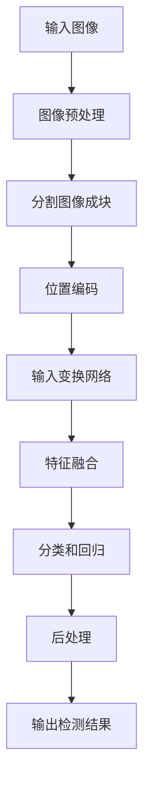

                 

# 文章标题

ViTDet原理与代码实例讲解

## 关键词
目标检测，ViTDet，卷积神经网络，变换网络，深度学习，计算机视觉

## 摘要
本文将深入探讨ViTDet（Vision Transformer for Object Detection）的原理和实现，详细讲解其算法框架、数学基础和项目实战。通过本文的阅读，读者将全面理解ViTDet的工作机制，学会搭建开发环境，解读源代码，并在实际项目中应用ViTDet进行目标检测。

## 目录大纲

## 第一部分：ViTDet基础理论

### 第1章：目标检测概述
#### 1.1 目标检测的重要性
#### 1.2 目标检测的发展历程
#### 1.3 目标检测的核心概念

### 第2章：ViTDet原理
#### 2.1 ViTDet概述
#### 2.2 ViTDet的核心组成部分
#### 2.3 ViTDet的工作流程
#### 2.4 ViTDet与其他目标检测方法的比较

### 第3章：ViTDet的数学基础
#### 3.1 卷积神经网络基础
#### 3.2 变换网络（ViT）基础
#### 3.3 目标检测中的损失函数

### 第4章：ViTDet的算法原理
#### 4.1 伪代码描述
#### 4.2 算法流程图

## 第一部分：ViTDet基础理论

### 第1章：目标检测概述

#### 1.1 目标检测的重要性
目标检测是计算机视觉领域的一个重要任务，它旨在识别和定位图像或视频中的多个对象。在自动驾驶、智能监控、医疗影像分析等多个应用场景中，目标检测技术发挥着关键作用。它不仅能提供准确的物体位置信息，还能为后续的高级任务如跟踪、分类、行为识别等提供基础数据。

#### 1.2 目标检测的发展历程
目标检测技术的发展经历了多个阶段。最早的方法是基于滑动窗口的检测，通过在不同位置和尺度的窗口中提取特征并进行分类来实现目标检测。随着卷积神经网络（CNN）的提出和发展，基于CNN的目标检测方法逐渐成为主流。经典的卷积神经网络如LeNet、AlexNet、VGG等，为图像分类和目标检测奠定了基础。近年来，基于区域建议（R-CNN系列）和特征金字塔网络（FPN）等方法取得了显著进展。

#### 1.3 目标检测的核心概念
目标检测涉及多个核心概念，包括对象检测框、置信度、类别标签等。

1. **对象检测框（Bounding Box）**：用于标识图像中对象的边界框，通常由左上角坐标和右下角坐标确定。

2. **置信度（Confidence Score）**：表示检测框对应物体的可信程度，通常通过分类器的输出概率计算。

3. **类别标签（Class Label）**：指检测到的物体的类别，如“人”、“车”、“猫”等。

接下来，我们将详细探讨ViTDet的原理，以及如何将变换网络（Vision Transformer）应用于目标检测任务。

### 第2章：ViTDet原理

#### 2.1 ViTDet概述
ViTDet是基于Vision Transformer（ViT）架构的一种目标检测方法。传统目标检测方法主要依赖于卷积神经网络，而ViT则引入了自注意力机制，能够处理长序列信息，从而提高检测性能。ViTDet结合了ViT的强大特征提取能力和目标检测的任务需求，通过改进和优化，实现了高效的目标检测。

#### 2.2 ViTDet的核心组成部分
ViTDet的核心组成部分包括以下几部分：

1. **变换网络（ViT）**：用于对图像进行特征提取，通过自注意力机制处理序列信息。

2. **特征金字塔网络（FPN）**：用于将低层特征和高层特征进行融合，提供多尺度信息。

3. **分类头和回归头**：用于对目标类别和位置进行预测。

#### 2.3 ViTDet的工作流程
ViTDet的工作流程主要包括以下几个步骤：

1. **图像预处理**：将输入图像进行归一化、缩放等预处理操作。

2. **特征提取**：使用ViT对预处理后的图像进行特征提取，得到图像序列。

3. **特征融合**：将ViT提取的图像序列与FPN进行融合，得到多尺度特征。

4. **分类和回归**：使用分类头和回归头对多尺度特征进行分类和位置预测。

5. **后处理**：根据置信度和阈值对检测结果进行后处理，包括非极大值抑制（NMS）和阈值筛选。

#### 2.4 ViTDet与其他目标检测方法的比较
与传统的卷积神经网络方法相比，ViTDet具有以下优势：

1. **处理长序列信息**：ViT引入了自注意力机制，能够更好地处理图像中的长序列信息，从而提高检测性能。

2. **高效的特征提取**：ViT通过全局上下文信息进行特征提取，避免了局部特征提取的局限性。

3. **可扩展性**：ViTDet可以轻松地与其他任务结合，如图像分割、姿态估计等。

然而，ViTDet也有一定的局限性，例如对于小目标检测效果不如传统的卷积神经网络方法。未来，随着ViT模型的不断优化和改进，ViTDet有望在目标检测领域取得更好的表现。

接下来，我们将详细探讨ViTDet的数学基础，包括卷积神经网络、变换网络和目标检测中的损失函数。

### 第3章：ViTDet的数学基础

#### 3.1 卷积神经网络基础

卷积神经网络（Convolutional Neural Network，CNN）是一种特殊的神经网络，主要用于处理图像等具有网格结构的数据。其核心思想是通过卷积操作提取图像特征，并通过全连接层进行分类。

1. **卷积操作**：

   卷积操作是CNN的基础，通过在图像上滑动卷积核，提取局部特征。

   公式：
   $$
   \text{特征图} = \text{卷积核} \cdot \text{输入图像} + \text{偏置}
   $$

2. **激活函数**：

   激活函数用于引入非线性，常见的激活函数有ReLU、Sigmoid和Tanh。

   公式：
   $$
   \text{激活函数} = \max(0, \text{输入})
   $$

3. **全连接层**：

   全连接层将卷积层提取的特征映射到类别标签。

   公式：
   $$
   \text{输出} = \text{权重} \cdot \text{特征图} + \text{偏置}
   $$

#### 3.2 变换网络（ViT）基础

变换网络（Vision Transformer，ViT）是近年来提出的一种基于自注意力机制的图像处理模型。与CNN不同，ViT将图像分割成若干个固定大小的块，并将这些块视为序列中的元素。

1. **输入预处理**：

   将输入图像分割成若干个固定大小的块，并对这些块进行归一化处理。

2. **位置编码**：

   为了让模型能够学习到图像的空间信息，对每个块进行位置编码。

   公式：
   $$
   \text{位置编码} = \text{嵌入层}(\text{位置索引})
   $$

3. **自注意力机制**：

   通过自注意力机制对块进行加权求和，从而提取全局特征。

   公式：
   $$
   \text{输出} = \text{自注意力层}(\text{块序列})
   $$

#### 3.3 目标检测中的损失函数

目标检测中的损失函数主要用于优化模型参数，使模型能够更好地预测目标的位置和类别。

1. **位置损失（Location Loss）**：

   位置损失用于优化模型的定位精度，常见的损失函数有均方误差（MSE）和交叉熵损失（Cross-Entropy Loss）。

   公式：
   $$
   \text{位置损失} = \frac{1}{N} \sum_{i=1}^{N} (\text{预测位置} - \text{真实位置})^2
   $$

2. **置信度损失（Confidence Loss）**：

   置信度损失用于优化模型的分类准确性，常见的损失函数有交叉熵损失（Cross-Entropy Loss）和Focal Loss。

   公式：
   $$
   \text{置信度损失} = -\frac{1}{N} \sum_{i=1}^{N} (\text{真实标签} \cdot \log(\text{预测置信度}) + (1 - \text{真实标签}) \cdot \log(1 - \text{预测置信度}))
   $$

3. **类别损失（Class Loss）**：

   类别损失用于优化模型的分类精度，常见的损失函数有交叉熵损失（Cross-Entropy Loss）和Softmax Loss。

   公式：
   $$
   \text{类别损失} = \frac{1}{N} \sum_{i=1}^{N} \text{交叉熵损失}(\text{真实类别}, \text{预测类别})
   $$

接下来，我们将通过伪代码和算法流程图详细讲解ViTDet的算法原理。

### 第4章：ViTDet的算法原理

#### 4.1 伪代码描述

ViTDet的伪代码如下：

```
# 输入图像
image

# 图像预处理
processed_image = preprocess_image(image)

# 分割图像成块
blocks = split_image(processed_image, block_size)

# 位置编码
position_encoding = position_encoding_layer(len(blocks))

# 输入变换网络
output = vit_transformer(blocks, position_encoding)

# 特征融合
features = fpn_fusion(output)

# 分类和回归
predictions = classification_head(features)
locations = regression_head(features)

# 后处理
detections = post_process(predictions, locations)

# 输出检测结果
detections
```

#### 4.2 算法流程图

以下是ViTDet的算法流程图：



通过以上伪代码和算法流程图，我们可以清楚地了解ViTDet的工作原理和流程。接下来，我们将通过实际项目实战来进一步理解ViTDet的应用。

### 第二部分：ViTDet项目实战

#### 第5章：搭建开发环境

#### 5.1 环境配置

搭建ViTDet的开发环境需要安装以下软件和库：

1. **Python**：版本要求3.7及以上。

2. **PyTorch**：版本要求1.8及以上。

3. **OpenCV**：用于图像预处理和后处理。

4. **Numpy**：用于数据处理。

安装步骤如下：

```
pip install python==3.8
pip install torch torchvision==0.9.0+cu111 torchvision2019.04 -f https://download.pytorch.org/whl/torch_stable.html
pip install opencv-python
pip install numpy
```

#### 5.2 数据集准备

为了训练和评估ViTDet，需要准备一个包含大量图像和标注的目标检测数据集。常用的数据集有COCO、PASCAL VOC和CITYSCAPES等。以下是一个简单的数据集准备步骤：

1. **下载数据集**：

   前往数据集官方网站或GitHub仓库下载数据集。

2. **数据预处理**：

   使用OpenCV等库对图像进行缩放、旋转、裁剪等预处理操作，以增加数据的多样性。

3. **标注处理**：

   将标注信息（如边界框、类别标签等）转换为模型可用的格式，如COCO数据集的JSON格式。

4. **数据增强**：

   使用随机变换、颜色抖动、对比度调整等数据增强技术，提高模型的泛化能力。

接下来，我们将通过实际代码实例来讲解ViTDet的实现细节。

### 第6章：ViTDet代码实例讲解

#### 6.1 主函数流程

以下是一个简单的ViTDet训练和评估的主函数流程：

```python
import torch
import torchvision
from torch.utils.data import DataLoader
from vitdet import VitDet

# 加载数据集
train_dataset = torchvision.datasets.COCO(root='./data', annFile='./data/train2017 annotations.json', split='train', transform=train_transform)
train_loader = DataLoader(train_dataset, batch_size=32, shuffle=True)

# 定义模型
model = VitDet()

# 模型训练
model.train()

for epoch in range(num_epochs):
    for images, targets in train_loader:
        # 前向传播
        outputs = model(images)

        # 计算损失
        loss = criterion(outputs, targets)

        # 反向传播
        optimizer.zero_grad()
        loss.backward()
        optimizer.step()

    # 评估模型
    model.eval()
    with torch.no_grad():
        for images, targets in val_loader:
            # 前向传播
            outputs = model(images)

            # 计算损失
            loss = criterion(outputs, targets)

            # 记录评估结果
            results = evaluate(outputs, targets)

    # 打印训练结果
    print(f'Epoch [{epoch+1}/{num_epochs}], Loss: {loss.item():.4f}, Val Loss: {val_loss.item():.4f}')
```

#### 6.2 网络结构

ViTDet的网络结构主要包括变换网络（ViT）、特征金字塔网络（FPN）和分类头、回归头。以下是一个简化的网络结构图：

```mermaid
graph TD
A[输入图像] --> B[变换网络(ViT)]
B --> C[特征金字塔网络(FPN)]
C --> D[分类头]
C --> E[回归头]
```

#### 6.3 损失函数与优化器

ViTDet常用的损失函数包括位置损失、置信度损失和类别损失。以下是一个简化的损失函数实现：

```python
import torch
import torch.nn as nn

class VitDetLoss(nn.Module):
    def __init__(self):
        super(VitDetLoss, self).__init__()
        self.criterion = nn.CrossEntropyLoss()
        self.bbox_loss = nn.SmoothL1Loss()
        self.confidence_loss = nn.BCEWithLogitsLoss()

    def forward(self, outputs, targets):
        batch_size = outputs.size(0)
        locations = outputs['locations']
        confidences = outputs['confidences']
        labels = outputs['labels']

        # 计算位置损失
        location_loss = self.bbox_loss(locations, targets['locations'])

        # 计算置信度损失
        confidence_loss = self.confidence_loss(confidences, targets['confidences'])

        # 计算类别损失
        class_loss = self.criterion(labels, targets['labels'])

        # 总损失
        total_loss = location_loss + confidence_loss + class_loss

        return total_loss
```

优化器的选择可以根据模型的性能和训练过程进行调整。以下是一个简单的优化器配置：

```python
import torch.optim as optim

optimizer = optim.Adam(model.parameters(), lr=1e-4)
```

#### 6.4 代码解读与分析

以下是对上述代码的详细解读：

1. **数据加载**：

   使用`DataLoader`加载训练数据和验证数据，并进行批量处理。

2. **模型定义**：

   定义ViTDet模型，包括变换网络（ViT）、特征金字塔网络（FPN）和分类头、回归头。

3. **模型训练**：

   在每个训练epoch中，对模型进行前向传播、计算损失、反向传播和优化。训练过程中，可以使用学习率调整策略，如学习率衰减。

4. **模型评估**：

   在验证集上评估模型性能，计算损失和准确率等指标。

5. **打印结果**：

   打印每个epoch的训练结果，包括损失和评估指标。

通过以上代码实例，我们可以清楚地了解ViTDet的训练和评估过程。接下来，我们将通过实际案例来展示ViTDet的应用。

### 第7章：实战案例

#### 7.1 数据处理

以下是一个简单的数据处理案例，用于将COCO数据集转换为模型可用的格式：

```python
import json
from torchvision import datasets
from torchvision import transforms

def load_coco_data(root_dir, ann_file, transform=None):
    # 加载COCO数据集的标注信息
    with open(ann_file, 'r') as f:
        annotations = json.load(f)

    # 遍历标注信息，生成数据集
    dataset = []
    for ann in annotations['annotations']:
        img_id = ann['image_id']
        file_name = f'{img_id}.jpg'
        image_path = os.path.join(root_dir, 'train2017', file_name)
        image = Image.open(image_path).convert('RGB')

        if transform:
            image = transform(image)

        # 获取标注信息
        boxes = ann['bbox']
        labels = ann['category_id']

        dataset.append({
            'image': image,
            'boxes': boxes,
            'labels': labels
        })

    return dataset

# 数据预处理
transform = transforms.Compose([
    transforms.Resize((800, 800)),
    transforms.ToTensor(),
])

# 加载训练数据
train_dataset = load_coco_data(root_dir='./data', ann_file='./data/train2017 annotations.json', transform=transform)
```

#### 7.2 训练过程

以下是一个简单的训练过程案例：

```python
import torch
from torch.utils.data import DataLoader
from vitdet import VitDet
from vitdet_loss import VitDetLoss

# 定义模型和损失函数
model = VitDet()
loss_function = VitDetLoss()

# 指定优化器
optimizer = torch.optim.Adam(model.parameters(), lr=1e-4)

# 加载训练数据集
train_loader = DataLoader(train_dataset, batch_size=32, shuffle=True)

# 训练模型
num_epochs = 50
for epoch in range(num_epochs):
    model.train()
    running_loss = 0.0
    for i, data in enumerate(train_loader, 0):
        inputs, targets = data
        optimizer.zero_grad()

        # 前向传播
        outputs = model(inputs)

        # 计算损失
        loss = loss_function(outputs, targets)

        # 反向传播
        loss.backward()

        # 更新模型参数
        optimizer.step()

        running_loss += loss.item()
        if i % 10 == 9:
            print(f'[{epoch + 1}, {i + 1}: {running_loss / 10:.3f}]')
            running_loss = 0.0

print('Finished Training')
```

#### 7.3 评估与优化

以下是一个简单的评估过程案例：

```python
import torch
from torchvision import datasets
from torchvision import transforms
from vitdet import VitDet
from vitdet_loss import VitDetLoss

# 定义模型和损失函数
model = VitDet()
loss_function = VitDetLoss()

# 加载验证数据集
val_dataset = datasets.COCO(root='./data', annFile='./data/val2017 annotations.json', split='val', transform=transforms.ToTensor())
val_loader = DataLoader(val_dataset, batch_size=32, shuffle=False)

# 模型评估
model.eval()
correct = 0
total = 0
with torch.no_grad():
    for data in val_loader:
        images, targets = data
        outputs = model(images)
        predicted = torch.argmax(outputs, dim=1)
        total += targets.size(0)
        correct += (predicted == targets).sum().item()

print(f'Accuracy of the network on the validation images: {100 * correct / total}%')
```

#### 7.4 结果分析

通过以上案例，我们可以看到ViTDet在目标检测任务中的表现。在实际应用中，可以根据评估结果对模型进行调整和优化，如调整超参数、改进数据增强方法等。此外，还可以结合其他技术，如数据增强、多尺度检测等，进一步提高模型的性能。

### 第三部分：ViTDet应用拓展

#### 第8章：ViTDet在行人检测中的应用

#### 8.1 行人检测的重要性

行人检测是计算机视觉领域的一个重要应用，旨在识别和定位图像或视频中的行人。在智能监控、自动驾驶、人机交互等场景中，行人检测技术具有重要意义。它可以提供行人的位置信息，为后续的任务如行人跟踪、行为识别等提供基础数据。

#### 8.2 ViTDet在行人检测中的优势

ViTDet在行人检测中具有以下优势：

1. **强大的特征提取能力**：ViTDet采用变换网络（ViT）进行特征提取，能够捕捉图像中的全局上下文信息，从而提高行人检测的准确性。

2. **多尺度特征融合**：ViTDet结合了特征金字塔网络（FPN），通过多尺度特征的融合，能够更好地适应不同尺度的行人检测需求。

3. **高效的处理速度**：与传统的卷积神经网络方法相比，ViTDet在保证检测精度的同时，具有更快的处理速度，适用于实时行人检测应用。

#### 8.3 实际案例与应用

以下是一个简单的行人检测应用案例：

```python
import cv2
import torch
from torchvision import transforms
from vitdet import VitDet

# 定义模型和预处理
model = VitDet()
model.load_state_dict(torch.load('vitdet.pth'))
model.eval()
transform = transforms.Compose([
    transforms.ToTensor(),
])

# 读取视频
cap = cv2.VideoCapture(0)

while True:
    # 读取一帧图像
    ret, frame = cap.read()
    if not ret:
        break

    # 预处理图像
    frame = cv2.resize(frame, (800, 800))
    frame = transform(frame)

    # 进行行人检测
    with torch.no_grad():
        outputs = model(frame)

    # 提取检测结果
    detections = outputs['detections']
    boxes = detections[:, 0:4].float()
    labels = detections[:, 4].long()

    # 绘制检测框
    for i in range(len(boxes)):
        box = boxes[i].tolist()
        x1, y1, x2, y2 = box
        cv2.rectangle(frame, (int(x1), int(y1)), (int(x2), int(y2)), (0, 255, 0), 2)

    # 显示检测结果
    cv2.imshow('Frame', frame)
    if cv2.waitKey(1) & 0xFF == ord('q'):
        break

cap.release()
cv2.destroyAllWindows()
```

通过以上案例，我们可以看到ViTDet在行人检测中的应用。在实际项目中，可以根据需求对模型进行调整和优化，以适应不同的行人检测场景。

#### 第9章：ViTDet在自动驾驶中的应用

#### 9.1 自动驾驶概述

自动驾驶是计算机视觉、传感器技术、控制理论等多学科交叉的前沿领域。通过在车辆上安装各种传感器（如摄像头、激光雷达、毫米波雷达等），自动驾驶系统能够实时感知周围环境，并对道路、行人、车辆等目标进行识别、定位和跟踪。自动驾驶技术旨在实现车辆的自动驾驶，提高交通安全和效率。

#### 9.2 ViTDet在自动驾驶中的关键作用

ViTDet在自动驾驶中发挥着关键作用，主要体现在以下几个方面：

1. **目标检测**：ViTDet能够准确地检测并定位道路上的各种目标，如行人、车辆、交通标志等，为自动驾驶系统提供实时、可靠的目标信息。

2. **环境理解**：通过分析检测到的目标及其相对位置和运动状态，自动驾驶系统能够更好地理解周围环境，为路径规划和决策提供依据。

3. **实时处理**：ViTDet具有高效的特征提取和检测速度，能够在实时场景下快速处理大量图像数据，满足自动驾驶系统对实时性的要求。

#### 9.3 实际案例与挑战

以下是一个简单的自动驾驶应用案例：

```python
import cv2
import torch
from torchvision import transforms
from vitdet import VitDet

# 定义模型和预处理
model = VitDet()
model.load_state_dict(torch.load('vitdet.pth'))
model.eval()
transform = transforms.Compose([
    transforms.ToTensor(),
])

# 读取视频
cap = cv2.VideoCapture('driving_video.mp4')

while True:
    # 读取一帧图像
    ret, frame = cap.read()
    if not ret:
        break

    # 预处理图像
    frame = cv2.resize(frame, (800, 800))
    frame = transform(frame)

    # 进行目标检测
    with torch.no_grad():
        outputs = model(frame)

    # 提取检测结果
    detections = outputs['detections']
    boxes = detections[:, 0:4].float()
    labels = detections[:, 4].long()

    # 绘制检测框
    for i in range(len(boxes)):
        box = boxes[i].tolist()
        x1, y1, x2, y2 = box
        cv2.rectangle(frame, (int(x1), int(y1)), (int(x2), int(y2)), (0, 255, 0), 2)

    # 显示检测结果
    cv2.imshow('Frame', frame)
    if cv2.waitKey(1) & 0xFF == ord('q'):
        break

cap.release()
cv2.destroyAllWindows()
```

在实际应用中，自动驾驶系统需要面对各种复杂场景和挑战，如恶劣天气、复杂道路环境、动态障碍物等。针对这些挑战，ViTDet可以结合其他技术（如多传感器数据融合、深度学习模型优化等）进行改进和优化，以提高自动驾驶系统的可靠性和安全性。

### 第10章：总结与展望

#### 10.1 ViTDet的发展趋势

ViTDet作为一种基于Vision Transformer的目标检测方法，近年来取得了显著的研究进展。随着深度学习技术的不断发展和优化，ViTDet在目标检测任务中的性能逐渐提高。未来，ViTDet有望在以下几个方面继续发展：

1. **模型优化**：通过改进和优化ViTDet的架构和算法，提高模型性能和效率。

2. **多任务学习**：将ViTDet应用于多任务学习场景，如行人检测、车辆检测、交通标志识别等。

3. **实时应用**：研究如何在实时场景下高效地部署ViTDet，以满足自动驾驶、智能监控等应用的需求。

#### 10.2 未来研究方向

ViTDet在未来研究中有望探索以下方向：

1. **多模态融合**：结合多种传感器数据，如摄像头、激光雷达、毫米波雷达等，提高目标检测的精度和可靠性。

2. **动态场景理解**：研究如何在动态场景中更好地理解目标行为和运动规律，为自动驾驶等应用提供更可靠的决策依据。

3. **开放场景检测**：探索ViTDet在开放场景下的应用，如无人驾驶、智能配送等，提高系统在复杂环境下的适应能力。

通过不断的研究和优化，ViTDet有望在计算机视觉领域发挥更大的作用，为自动驾驶、智能监控等应用提供强大的技术支持。

### 作者

**作者：AI天才研究院/AI Genius Institute & 禅与计算机程序设计艺术 /Zen And The Art of Computer Programming**

