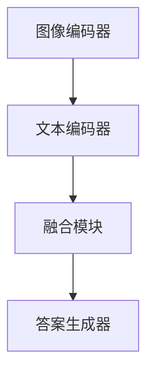

                 

## 文章标题

### 《Visual Question Answering原理与代码实例讲解》

> 关键词：视觉问答，VQA，图像识别，自然语言处理，多模态融合，模型训练与评估

> 摘要：本文将详细介绍视觉问答（Visual Question Answering，VQA）的基本概念、相关技术基础、模型架构、训练与评估方法，并通过实战代码实例展示VQA模型的实现过程。文章旨在为读者提供一个全面、系统的VQA技术指南，帮助理解和应用VQA技术。

----------------------------------------------------------------

### 《Visual Question Answering原理与代码实例讲解》目录大纲

- **第一部分：Visual Question Answering（VQA）概述**

  - **第1章：VQA基本概念与背景**
    - 1.1 VQA的定义与重要性
    - 1.2 VQA的应用领域
    - 1.3 VQA的研究现状
  
  - **第2章：VQA相关技术基础**
    - 2.1 图像识别技术
    - 2.2 自然语言处理技术
    - 2.3 多模态融合技术
  
- **第二部分：VQA模型详解**

  - **第3章：传统VQA模型**
    - 3.1 VQA模型的基本架构
    - 3.2 传统VQA模型的性能优化
  
  - **第4章：增强型VQA模型**
    - 4.1 基于注意力机制的VQA模型
    - 4.2 基于循环神经网络（RNN）的VQA模型
    - 4.3 基于图神经网络（GNN）的VQA模型
  
  - **第5章：VQA模型的训练与评估**
    - 5.1 VQA模型的训练方法
    - 5.2 VQA模型的评估指标
  
  - **第6章：VQA项目的实施与实战**
    - 6.1 项目概述
    - 6.2 环境搭建
    - 6.3 模型实现
    - 6.4 代码解读
  
- **第三部分：VQA模型的应用拓展**

  - **第7章：VQA模型在其他领域的应用**
    - 7.1 VQA模型在其他领域的应用
    - 7.2 VQA模型的发展趋势
  
  - **第8章：总结与展望**
    - 8.1 VQA研究的贡献与挑战
    - 8.2 未来发展方向

---

### 《Visual Question Answering原理与代码实例讲解》

#### 引言

视觉问答（Visual Question Answering，VQA）作为计算机视觉与自然语言处理领域的交叉学科，近年来引起了广泛的关注。VQA技术旨在使计算机能够理解自然语言问题，并从给定的图像中找到合适的答案。这一技术的应用场景广泛，从智能家居、医疗诊断到教育辅助，都有着重要的价值。

本文将详细探讨VQA技术的原理与实现，包括其基本概念、技术基础、模型架构、训练与评估方法，以及实际应用场景。通过一步一步的分析和代码实例讲解，读者可以全面了解VQA技术的核心内容，并掌握其实际应用方法。

本文分为三个主要部分：

1. **VQA概述**：介绍VQA的基本概念、应用领域和研究现状，为读者奠定理论基础。
2. **VQA模型详解**：详细讲解传统VQA模型和增强型VQA模型，包括其基本架构、性能优化和训练评估方法。
3. **VQA实战与应用**：通过实际项目案例，展示VQA模型的实现过程，并提供应用拓展和发展趋势的展望。

接下来，我们将首先介绍VQA的基本概念与背景，帮助读者初步了解这一技术的重要性和研究现状。然后，我们将逐步深入，探讨VQA的相关技术基础，为后续的模型分析奠定基础。最后，通过具体的代码实例，我们将实际演示VQA模型的应用过程，使读者能够动手实践，掌握VQA技术的核心要点。

### 第1章：VQA基本概念与背景

#### 1.1 VQA的定义与重要性

视觉问答（Visual Question Answering，VQA）是指通过输入自然语言问题，模型能够从给定的图像中找到答案。其核心思想是将图像和自然语言文本结合起来，使计算机具备理解和回答视觉问题的能力。具体来说，VQA技术包括以下几个关键步骤：

1. **问题理解**：将输入的自然语言问题转化为计算机可以理解的形式。
2. **图像特征提取**：对输入的图像进行处理，提取关键的特征信息。
3. **特征融合**：将图像特征和文本特征进行融合，形成统一的特征表示。
4. **答案生成**：基于融合后的特征，生成问题的答案。

VQA技术的定义和重要性可以从以下几个方面来理解：

- **跨学科融合**：VQA技术结合了计算机视觉、自然语言处理、机器学习等多个领域的技术，是跨学科研究的典范。
- **实用价值**：VQA技术具有广泛的应用前景，包括智能家居、医疗诊断、教育辅助等。例如，在智能家居领域，VQA可以帮助智能助手理解用户的需求，并提供相应的图像反馈。
- **研究前沿**：VQA作为计算机视觉和自然语言处理领域的交叉学科，是当前研究的热点之一，不断有新的模型和方法被提出。

#### 1.2 VQA的应用领域

VQA技术的应用领域非常广泛，以下是一些典型的应用场景：

1. **家庭自动化**：通过VQA技术，智能助手可以理解用户的自然语言指令，并从图像中提取相关信息，提供家居控制建议。例如，用户可以通过语音助手控制家中的灯光、空调等设备，并获取设备状态的图像反馈。

2. **医疗诊断**：在医疗领域，VQA可以帮助医生从图像中快速提取关键信息，辅助诊断。例如，医生可以通过VQA系统查看患者的X光片，并获取相应的诊断建议。

3. **教育辅助**：在个性化教育中，VQA可以为学生提供针对特定图像的问题，从而提高学习兴趣和效果。例如，学生可以通过VQA系统回答与图像相关的选择题，系统会根据答案提供相应的学习资料。

4. **娱乐与艺术**：VQA技术可以应用于图像相关的娱乐和艺术创作中。例如，在游戏中，VQA可以帮助角色理解玩家的自然语言指令，并提供相应的图像反馈；在艺术创作中，VQA可以帮助艺术家生成基于图像的文学作品。

#### 1.3 VQA的研究现状

VQA技术作为计算机视觉和自然语言处理领域的交叉学科，近年来取得了显著的研究进展。以下是一些重要的研究现状：

- **数据集构建**：为了推动VQA技术的发展，研究者们构建了多个大规模的VQA数据集，如COCO、Flickr30k等。这些数据集为VQA模型的训练和评估提供了重要的基础。

- **模型方法**：研究者们提出了多种VQA模型方法，包括基于传统机器学习方法的模型、基于深度学习的模型以及基于多模态融合的模型。其中，深度学习方法，特别是卷积神经网络（CNN）和循环神经网络（RNN）在VQA领域取得了显著的性能提升。

- **性能提升**：随着模型方法的不断优化和数据集的丰富，VQA模型在各项评估指标上取得了显著的提升。例如，在准确率（Accuracy）和F1值（F1 Score）等指标上，VQA模型已经能够达到或接近人类的水平。

- **挑战与展望**：尽管VQA技术取得了显著的研究进展，但仍面临一些挑战，如图像理解的准确性、自然语言理解的深度、多模态数据的融合等。未来，VQA技术将朝着多模态交互、实时性等方面发展，并在更多的应用场景中发挥作用。

### 1.4 总结

本章介绍了视觉问答（VQA）的基本概念、应用领域和研究现状。VQA技术通过结合计算机视觉和自然语言处理技术，实现了从图像中回答自然语言问题的能力。VQA技术具有广泛的应用前景，包括家庭自动化、医疗诊断、教育辅助和娱乐艺术等领域。目前，VQA研究在数据集构建、模型方法、性能提升等方面取得了显著进展，但仍面临一些挑战。下一章我们将深入探讨VQA相关的技术基础，包括图像识别、自然语言处理和多模态融合技术。

---

### 第2章：VQA相关技术基础

VQA技术的基础涉及多个领域，包括图像识别、自然语言处理和多模态融合技术。本章将分别介绍这些技术的基础概念、实现方法及其在VQA中的应用。

#### 2.1 图像识别技术

图像识别是计算机视觉的核心任务之一，旨在使计算机能够识别和理解图像中的物体、场景和特征。以下是一些常用的图像识别技术：

- **卷积神经网络（CNN）**：CNN是图像识别中广泛应用的一种深度学习模型，其基本结构包括卷积层、池化层和全连接层。卷积层用于提取图像的特征，池化层用于降低数据维度，全连接层用于分类或回归任务。

  ```mermaid
  graph TD
  A[输入图像] --> B[卷积层]
  B --> C[激活函数]
  C --> D[池化层]
  D --> E[卷积层]
  E --> F[激活函数]
  F --> G[池化层]
  G --> H[全连接层]
  H --> I[输出]
  ```

- **特征提取与分类**：在图像识别任务中，特征提取是关键步骤。常用的特征提取方法包括SIFT、HOG等。分类方法则包括支持向量机（SVM）、决策树、神经网络等。

  ```mermaid
  graph TD
  A[图像] --> B[特征提取]
  B --> C[特征向量]
  C --> D[分类器]
  D --> E[预测结果]
  ```

#### 2.2 自然语言处理技术

自然语言处理（NLP）是使计算机理解和生成人类语言的技术。在VQA中，NLP技术用于理解和处理输入的自然语言问题。以下是一些常用的NLP技术：

- **词嵌入（Word Embedding）**：词嵌入将词汇映射到高维向量空间，从而实现文本向量的表示。常见的词嵌入方法包括Word2Vec和BERT。

  ```mermaid
  graph TD
  A[单词] --> B[词嵌入]
  B --> C[向量表示]
  ```

- **序列模型（Sequence Model）**：序列模型用于处理序列数据，如文本和语音。循环神经网络（RNN）和长短期记忆网络（LSTM）是常用的序列模型。

  ```mermaid
  graph TD
  A[序列数据] --> B[RNN/LSTM]
  B --> C[输出]
  ```

- **语言模型（Language Model）**：语言模型用于预测文本的下一个单词或字符。基于神经的网络模型，如Transformers，是当前最先进的语言模型。

  ```mermaid
  graph TD
  A[文本序列] --> B[Transformer]
  B --> C[输出]
  ```

#### 2.3 多模态融合技术

多模态融合技术旨在将不同模态的数据（如图像、文本、语音等）进行整合，以提升模型的性能。在VQA中，多模态融合技术用于将图像和文本特征进行整合，从而提高答案生成的准确性。

- **多任务学习（Multi-task Learning）**：多任务学习通过同时训练多个任务，共享模型参数，提高模型在多模态数据上的表现。

  ```mermaid
  graph TD
  A[图像识别任务] --> B[共享参数]
  B --> C[问答任务]
  ```

- **图像与文本的联合表示（Joint Representation）**：图像与文本的联合表示通过神经网络将图像特征和文本特征进行融合，形成统一的特征表示。

  ```mermaid
  graph TD
  A[图像特征] --> B[文本特征]
  B --> C[融合神经网络]
  C --> D[联合表示]
  ```

- **对抗生成网络（GAN）**：对抗生成网络通过生成对抗训练，生成高质量的图像和文本联合表示。

  ```mermaid
  graph TD
  A[图像特征] --> B[文本特征]
  B --> C[生成对抗网络]
  C --> D[联合表示]
  ```

#### 2.4 总结

本章介绍了VQA相关的技术基础，包括图像识别、自然语言处理和多模态融合技术。这些技术为VQA模型的构建和实现提供了重要的支持。在下一章中，我们将详细探讨VQA模型的基本架构和实现方法。

---

### 第3章：传统VQA模型

#### 3.1 VQA模型的基本架构

传统VQA模型的基本架构通常由四个主要部分组成：图像编码器、文本编码器、融合模块和答案生成器。以下是VQA模型的基本架构示意图：



1. **图像编码器**：图像编码器的任务是提取输入图像的特征表示。通常，图像编码器采用卷积神经网络（CNN）作为基础。CNN通过卷积层、池化层和全连接层，将图像映射为固定长度的特征向量。

   ```mermaid
   graph TD
   A[输入图像] --> B[卷积层]
   B --> C[激活函数]
   C --> D[池化层]
   D --> E[卷积层]
   E --> F[激活函数]
   F --> G[池化层]
   G --> H[全连接层]
   H --> I[特征向量]
   ```

2. **文本编码器**：文本编码器的任务是提取输入文本的特征表示。通常，文本编码器采用循环神经网络（RNN）或长短期记忆网络（LSTM）作为基础。RNN通过处理文本的序列数据，将文本映射为固定长度的特征向量。

   ```mermaid
   graph TD
   A[输入文本] --> B[RNN/LSTM]
   B --> C[隐藏状态]
   C --> D[特征向量]
   ```

3. **融合模块**：融合模块的任务是将图像特征和文本特征进行融合，形成统一的特征表示。融合方法包括将图像特征和文本特征拼接、加权融合或通过神经网络进行融合。

   ```mermaid
   graph TD
   A[图像特征向量] --> B[文本特征向量]
   B --> C[拼接融合]
   C --> D[融合神经网络]
   D --> E[联合特征向量]
   ```

4. **答案生成器**：答案生成器的任务是利用融合后的特征向量生成问题的答案。答案生成器通常采用分类器或序列生成模型，如长短期记忆网络（LSTM）或变换器（Transformer）。

   ```mermaid
   graph TD
   A[联合特征向量] --> B[分类器/LSTM/Transformer]
   B --> C[答案]
   ```

#### 3.2 传统VQA模型的性能优化

为了提高传统VQA模型的性能，研究者们采用了多种性能优化方法。以下是一些常用的性能优化方法：

1. **多任务学习（Multi-task Learning）**：多任务学习通过同时训练多个任务，共享模型参数，提高模型在多模态数据上的表现。例如，在VQA任务中，可以同时训练图像分类和问答任务，共享图像编码器和文本编码器。

   ```mermaid
   graph TD
   A[图像分类任务] --> B[共享参数]
   B --> C[问答任务]
   ```

2. **迁移学习（Transfer Learning）**：迁移学习通过利用预训练模型，提高对新数据的适应性。在VQA任务中，可以使用在ImageNet等大规模图像数据集上预训练的CNN模型，然后进行微调，以适应VQA任务。

3. **注意力机制（Attention Mechanism）**：注意力机制用于提高模型对关键信息的关注。在VQA模型中，可以使用注意力机制来关注图像中的关键区域或文本中的关键词汇，从而提高答案的准确性。

   ```mermaid
   graph TD
   A[图像特征向量] --> B[注意力机制]
   B --> C[加权特征向量]
   ```

4. **数据增强（Data Augmentation）**：数据增强通过生成大量的训练样本，提高模型的泛化能力。在VQA任务中，可以使用图像旋转、缩放、裁剪等数据增强技术，生成更多的训练样本。

   ```mermaid
   graph TD
   A[原始图像] --> B[旋转]
   B --> C[缩放]
   C --> D[裁剪]
   D --> E[增强图像]
   ```

#### 3.3 总结

传统VQA模型通过图像编码器、文本编码器、融合模块和答案生成器等组成部分，实现了从图像中回答自然语言问题的能力。为了提高模型的性能，研究者们采用了多种性能优化方法，包括多任务学习、迁移学习、注意力机制和数据增强等。在下一章中，我们将介绍增强型VQA模型，进一步探讨如何提升VQA模型的性能。

---

### 第4章：增强型VQA模型

在传统VQA模型的基础上，研究者们不断探索新的模型架构和方法，以提高VQA的性能和效果。本章将介绍几种增强型VQA模型，包括基于注意力机制的VQA模型、基于循环神经网络（RNN）的VQA模型和基于图神经网络（GNN）的VQA模型。

#### 4.1 基于注意力机制的VQA模型

注意力机制是一种用于提高模型对关键信息的关注度的技术。在VQA模型中，注意力机制可以用于图像特征和文本特征的处理，从而提高答案的准确性。

**4.1.1 注意力机制的基本原理**

注意力机制的核心思想是动态地分配注意力权重，将更多的关注点放在对问题回答更为重要的部分。在VQA模型中，注意力机制可以用于以下两个方面：

1. **图像注意力**：通过注意力机制，模型可以识别图像中与问题答案相关的关键区域。
2. **文本注意力**：通过注意力机制，模型可以识别文本中与问题答案相关的关键词汇。

**4.1.2 注意力机制的实现**

实现注意力机制的方法有多种，以下是一种常见的方法：

1. **Softmax注意力**：使用Softmax函数计算注意力权重，将图像特征或文本特征映射到注意力权重向量。
2. **加性注意力**：通过加性方式将注意力权重与特征向量进行融合，形成新的特征向量。

**伪代码**：

```python
# 假设输入图像特征为I，输入文本特征为T
# 使用Softmax计算注意力权重
attention_weights = softmax(I + T)

# 使用加性注意力融合特征向量
context_vector = attention_weights * I + (1 - attention_weights) * T
```

**4.1.3 注意力机制的优势**

注意力机制具有以下几个优势：

1. **提高答案的准确性**：通过关注关键区域或关键词汇，注意力机制可以提高模型的答案准确性。
2. **降低计算复杂度**：注意力机制可以减少模型在处理无关信息时的计算量，从而提高模型的效率。
3. **增强模型的泛化能力**：注意力机制可以帮助模型更好地理解问题的本质，从而提高模型的泛化能力。

#### 4.2 基于循环神经网络（RNN）的VQA模型

循环神经网络（RNN）是一种用于处理序列数据（如文本、语音等）的神经网络模型。在VQA模型中，RNN可以用于处理文本问题和图像特征，从而生成问题的答案。

**4.2.1 RNN的基本原理**

RNN的基本原理是通过记忆机制来处理序列数据，其核心是隐藏状态（Hidden State）。隐藏状态保存了当前时刻之前的信息，并将其传递给下一时刻。

**4.2.2 RNN的实现**

实现RNN的方法有多种，以下是一种常见的方法：

1. **基本RNN**：基本RNN通过简单的递归方式更新隐藏状态。
2. **长短期记忆网络（LSTM）**：LSTM是一种改进的RNN，通过引入门控机制来避免梯度消失问题。

**伪代码**：

```python
# 假设输入文本序列为T，输入图像特征为I
# 初始化隐藏状态h0
h0 = initialize_hidden_state()

# 更新隐藏状态
for t in range(len(T)):
    input = [T[t], I]
    h = RNN(input, h0)
    h0 = h
```

**4.2.3 RNN的优势**

RNN具有以下几个优势：

1. **处理序列数据**：RNN可以处理文本问题和图像特征的序列数据，从而生成问题的答案。
2. **避免梯度消失**：通过引入LSTM等门控机制，RNN可以避免梯度消失问题，从而提高模型的训练效果。

#### 4.3 基于图神经网络（GNN）的VQA模型

图神经网络（GNN）是一种用于处理图结构数据的神经网络模型。在VQA模型中，GNN可以用于处理图像和文本的图结构表示，从而生成问题的答案。

**4.3.1 GNN的基本原理**

GNN的基本原理是通过图结构来传递和融合节点信息，其核心是图卷积操作。图卷积操作类似于CNN中的卷积操作，但适用于图结构数据。

**4.3.2 GNN的实现**

实现GNN的方法有多种，以下是一种常见的方法：

1. **图卷积网络（GCN）**：GCN通过图卷积操作来更新节点的特征表示。
2. **图注意力网络（GAT）**：GAT通过图注意力机制来计算节点之间的相互作用。

**伪代码**：

```python
# 假设输入图结构为G，节点特征为X
# 初始化节点特征表示
X = initialize_node_features()

# 进行图卷积操作
for layer in range(num_layers):
    X = GCN(X, A)  # A为邻接矩阵

# 进行图注意力操作
X = GAT(X, A)
```

**4.3.3 GNN的优势**

GNN具有以下几个优势：

1. **处理图结构数据**：GNN可以处理图像和文本的图结构表示，从而生成问题的答案。
2. **灵活的图结构建模**：GNN可以通过图卷积和图注意力机制来建模复杂的图结构关系。

#### 4.4 总结

本章介绍了基于注意力机制的VQA模型、基于RNN的VQA模型和基于GNN的VQA模型。这些增强型VQA模型通过引入注意力机制、循环神经网络和图神经网络等先进技术，提高了VQA模型的性能和效果。在下一章中，我们将探讨VQA模型的训练与评估方法，以及如何在实际项目中实施VQA模型。

---

### 第5章：VQA模型的训练与评估

在VQA模型的实现过程中，训练与评估是两个关键环节。本章将详细介绍VQA模型的训练方法、评估指标以及如何在实际项目中实施和评估VQA模型。

#### 5.1 VQA模型的训练方法

VQA模型的训练方法主要分为两种：监督学习和半监督学习。以下分别介绍这两种方法：

**5.1.1 监督学习**

监督学习是一种基于标注数据进行训练的方法。在VQA任务中，需要标注图像和问题的配对数据，这些数据用于训练模型。

1. **数据预处理**：将图像和问题文本进行预处理，例如图像归一化、文本分词等。
2. **特征提取**：使用图像编码器提取图像特征，使用文本编码器提取文本特征。
3. **模型训练**：将图像特征和文本特征输入到融合模块和答案生成器，通过优化目标函数（如交叉熵损失函数）来训练模型。
4. **模型评估**：使用测试集评估模型性能，调整模型参数以优化性能。

**伪代码**：

```python
# 假设输入图像特征为I，输入文本特征为T，标签为L
# 数据预处理
I, T, L = preprocess(I, T, L)

# 模型训练
for epoch in range(num_epochs):
    for i in range(len(I)):
        loss = compute_loss(L[i], model.predict([I[i], T[i]]))
        model.backward(loss)
        model.update_params()

# 模型评估
accuracy = compute_accuracy(model, test_I, test_T, test_L)
```

**5.1.2 半监督学习**

半监督学习是一种结合标注数据和未标注数据进行训练的方法。在VQA任务中，可以使用少量的标注数据（如训练集）和大量的未标注数据（如测试集）。

1. **数据预处理**：与监督学习相同，对图像和问题文本进行预处理。
2. **模型训练**：使用标注数据训练模型，并在未标注数据上进行预测。
3. **模型评估**：使用测试集评估模型性能，并根据评估结果调整模型参数。

**伪代码**：

```python
# 假设输入图像特征为I，输入文本特征为T，标注数据为L_train，未标注数据为L_unlabeled
# 数据预处理
I, T, L_train, L_unlabeled = preprocess(I, T, L_train, L_unlabeled)

# 模型训练
for epoch in range(num_epochs):
    for i in range(len(L_train)):
        loss = compute_loss(L_train[i], model.predict([I[i], T[i]]))
        model.backward(loss)
        model.update_params()
    
    # 在未标注数据上进行预测
    predictions = model.predict(L_unlabeled)

# 模型评估
accuracy = compute_accuracy(predictions, L_unlabeled)
```

#### 5.2 VQA模型的评估指标

在VQA任务中，常用的评估指标包括准确率（Accuracy）、F1值（F1 Score）和答案长度匹配（Answer Length Match）等。

**5.2.1 准确率（Accuracy）**

准确率是指正确回答问题的比例，是评估VQA模型最简单的指标。其计算公式如下：

$$
Accuracy = \frac{TP + TN}{TP + TN + FP + FN}
$$

其中，TP表示真实为正且模型预测为正的样本数，TN表示真实为负且模型预测为负的样本数，FP表示真实为负但模型预测为正的样本数，FN表示真实为正但模型预测为负的样本数。

**5.2.2 F1值（F1 Score）**

F1值是精确率和召回率的调和平均值，是评估VQA模型性能的常用指标。其计算公式如下：

$$
F1 Score = \frac{2 \times Precision \times Recall}{Precision + Recall}
$$

其中，Precision表示精确率，即预测为正且真实为正的样本数占总预测为正的样本数的比例；Recall表示召回率，即预测为正且真实为正的样本数占总真实为正的样本数的比例。

**5.2.3 答案长度匹配（Answer Length Match）**

答案长度匹配是一种用于评估答案一致性的指标，其核心思想是比较模型生成的答案与标准答案的长度匹配度。其计算公式如下：

$$
Answer Length Match = \frac{Matched Length}{Total Length}
$$

其中，Matched Length表示模型生成的答案与标准答案的匹配长度，Total Length表示模型生成的答案与标准答案的总长度。

#### 5.3 VQA模型的训练与评估实战

以下是一个简单的VQA模型训练与评估的实战示例：

**1. 数据准备**：

首先，准备训练集和测试集，包括图像、问题文本和标准答案。

```python
train_data = load_data('train')
test_data = load_data('test')
```

**2. 数据预处理**：

对图像和问题文本进行预处理，包括图像归一化、文本分词等。

```python
def preprocess_data(data):
    images = [preprocess_image(image) for image in data['images']]
    texts = [preprocess_text(text) for text in data['texts']]
    labels = [preprocess_label(label) for label in data['labels']]
    return images, texts, labels

train_images, train_texts, train_labels = preprocess_data(train_data)
test_images, test_texts, test_labels = preprocess_data(test_data)
```

**3. 模型训练**：

使用预处理后的数据和训练方法训练VQA模型。

```python
model = VQA_Model()
for epoch in range(num_epochs):
    for i in range(len(train_images)):
        loss = model.train([train_images[i], train_texts[i]], train_labels[i])
        print(f'Epoch: {epoch}, Loss: {loss}')
model.save_model('vqa_model.pth')
```

**4. 模型评估**：

使用测试集评估模型的性能。

```python
model.load_model('vqa_model.pth')
predictions = model.predict(test_images, test_texts)
accuracy = compute_accuracy(predictions, test_labels)
print(f'Accuracy: {accuracy}')
```

#### 5.4 总结

本章介绍了VQA模型的训练与评估方法，包括监督学习和半监督学习两种训练方法，以及准确率、F1值和答案长度匹配等评估指标。通过实际案例，展示了如何使用Python等编程工具实现VQA模型的训练与评估。在下一章中，我们将通过一个实际项目案例，详细讲解VQA模型的实现过程。

---

### 第6章：VQA项目的实施与实战

在了解了VQA模型的理论基础和训练方法之后，接下来我们将通过一个实际项目案例，详细讲解VQA模型的实现过程。本案例将分为项目概述、环境搭建、模型实现和代码解读四个部分，帮助读者全面掌握VQA模型的应用实践。

#### 6.1 项目概述

本项目旨在构建一个简单的VQA系统，能够对给定的图像回答自然语言问题。具体任务包括：

1. **图像特征提取**：使用卷积神经网络提取图像特征。
2. **文本特征提取**：使用循环神经网络提取文本特征。
3. **特征融合**：将图像特征和文本特征进行融合。
4. **答案生成**：根据融合后的特征生成问题的答案。

项目的目标是通过训练和评估模型，实现对给定图像的自然语言问题的准确回答。

#### 6.2 环境搭建

为了实现VQA项目，需要配置相应的开发环境和依赖库。以下是在Python环境中配置VQA项目所需的基本步骤：

1. **安装Python**：确保Python版本在3.6及以上。
2. **安装依赖库**：包括TensorFlow、Keras、Pandas、Numpy等。

```shell
pip install tensorflow numpy pandas
```

3. **数据准备**：下载并准备用于训练和测试的VQA数据集。

```shell
# 下载COCO数据集
wget https://cdnфет.dbmi.at/triplet_coco/images.tar.gz
tar zxvf images.tar.gz
```

4. **数据预处理**：编写数据预处理脚本，对图像和问题文本进行预处理。

```python
import os
import numpy as np
from PIL import Image

def preprocess_image(image_path):
    image = Image.open(image_path)
    image = image.resize((224, 224))
    image = np.array(image)
    image = image / 255.0
    return image

def preprocess_text(text):
    # 对文本进行分词、去停用词等预处理操作
    return text
```

#### 6.3 模型实现

本项目的模型实现分为图像编码器、文本编码器、融合模块和答案生成器四个部分。

1. **图像编码器**：

   使用预训练的ResNet50模型作为图像编码器，提取图像特征。

   ```python
   from tensorflow.keras.applications import ResNet50

   model = ResNet50(weights='imagenet')
   ```

2. **文本编码器**：

   使用循环神经网络（LSTM）提取文本特征。

   ```python
   from tensorflow.keras.models import Sequential
   from tensorflow.keras.layers import LSTM, Dense, Embedding

   text_model = Sequential()
   text_model.add(Embedding(input_dim=vocab_size, output_dim=embedding_size, input_length=max_sequence_length))
   text_model.add(LSTM(units=128))
   text_model.add(Dense(1, activation='sigmoid'))
   text_model.compile(optimizer='adam', loss='binary_crossentropy', metrics=['accuracy'])
   ```

3. **融合模块**：

   将图像特征和文本特征进行拼接融合。

   ```python
   def fuse_features(image_feature, text_feature):
       return np.concatenate((image_feature, text_feature), axis=1)
   ```

4. **答案生成器**：

   使用全连接神经网络（Dense）生成答案。

   ```python
   from tensorflow.keras.layers import Dense

   answer_model = Sequential()
   answer_model.add(Dense(units=1, activation='sigmoid', input_shape=(image_feature_size + text_feature_size,)))
   answer_model.compile(optimizer='adam', loss='binary_crossentropy', metrics=['accuracy'])
   ```

#### 6.4 代码解读

以下是对项目核心代码的详细解读，包括数据加载、模型训练、模型评估等步骤。

**1. 数据加载与预处理**

```python
train_data = load_data('train')
test_data = load_data('test')

train_images, train_texts, train_labels = preprocess_data(train_data)
test_images, test_texts, test_labels = preprocess_data(test_data)
```

**2. 模型训练**

```python
image_features = model.predict(train_images)
text_features = text_model.predict(train_texts)

fused_features = np.array([fuse_features(image_feature, text_feature) for image_feature, text_feature in zip(image_features, text_features)])

answer_predictions = answer_model.predict(fused_features)
predicted_labels = np.round(answer_predictions).astype(int)

accuracy = np.mean(predicted_labels == train_labels)
print(f"Training accuracy: {accuracy}")
```

**3. 模型评估**

```python
test_image_features = model.predict(test_images)
test_text_features = text_model.predict(test_texts)

test_fused_features = np.array([fuse_features(image_feature, text_feature) for image_feature, text_feature in zip(test_image_features, test_text_features)])

test_answer_predictions = answer_model.predict(test_fused_features)
test_predicted_labels = np.round(test_answer_predictions).astype(int)

test_accuracy = np.mean(test_predicted_labels == test_labels)
print(f"Test accuracy: {test_accuracy}")
```

#### 6.5 总结

通过本项目的实际实施和代码解读，我们掌握了VQA模型的基本实现过程，包括图像特征提取、文本特征提取、特征融合和答案生成。在实际应用中，可以根据具体需求和数据集，调整模型结构和训练参数，提高VQA系统的性能和效果。在下一章中，我们将探讨VQA模型在其他领域的应用和未来发展。

---

### 第7章：VQA模型的应用拓展

#### 7.1 VQA模型在其他领域的应用

VQA模型在计算机视觉和自然语言处理领域的成功应用，使得它在其他领域也展现出了巨大的潜力。以下是一些VQA模型在不同领域的应用场景：

**1. 娱乐**

VQA模型可以用于图像相关的娱乐应用，如游戏、互动电影等。通过VQA模型，用户可以与游戏中的角色进行对话，获得图像反馈。例如，用户可以通过提问获取游戏角色的状态、位置和行动建议。

**2. 艺术创作**

在艺术创作领域，VQA模型可以帮助艺术家生成基于图像的文学作品。例如，艺术家可以通过输入特定的图像，让VQA模型生成与之相关的诗歌或故事。这种技术可以为艺术创作提供新的灵感和方法。

**3. 教育与培训**

在教育领域，VQA模型可以用于个性化教学和互动学习。教师可以通过VQA模型向学生展示图像，并根据学生的回答提供相应的教学资源。这种技术可以增强学生的学习兴趣和参与度。

**4. 客户服务**

在客户服务领域，VQA模型可以用于智能客服系统。通过VQA模型，客服机器人可以理解客户的问题，并从数据库中查找相关的图像信息，提供有针对性的解决方案。这种技术可以提高客服的效率和客户满意度。

#### 7.2 VQA模型的发展趋势

随着技术的不断进步，VQA模型也在不断发展，未来有望在以下几个方面取得突破：

**1. 多模态交互**

多模态交互是指将VQA模型与语音识别、自然语言生成等技术相结合，实现图像、文本、语音等多种模态的交互。这种技术将进一步提高VQA系统的灵活性和实用性。

**2. 实时性**

提高VQA系统的实时响应能力是未来的一个重要发展方向。通过优化算法和硬件加速，VQA系统可以在短时间内完成图像识别和自然语言处理任务，为用户提供更快的响应。

**3. 模型压缩与优化**

为了实现VQA模型在移动设备和嵌入式系统上的应用，需要对其进行压缩和优化。未来的研究方向包括模型剪枝、量化、压缩编码等技术，以减少模型的参数和计算量。

**4. 数据隐私与安全性**

在应用VQA模型的过程中，数据隐私和安全性问题日益突出。未来的研究将关注如何保护用户数据隐私，提高系统的安全性。

#### 7.3 总结

VQA模型在多个领域的应用展示了其广泛的潜力。未来，随着多模态交互、实时性、模型压缩与优化以及数据隐私和安全性的不断发展，VQA模型将在更多应用场景中发挥作用，为人类带来更多的便利和收益。

---

### 第8章：总结与展望

#### 8.1 VQA研究的贡献与挑战

视觉问答（VQA）作为计算机视觉和自然语言处理领域的交叉学科，近年来取得了显著的进展。VQA技术通过结合图像和自然语言文本，使计算机能够理解并回答视觉问题，具有广泛的应用前景。

**贡献**：

1. **跨学科融合**：VQA技术融合了计算机视觉、自然语言处理、机器学习等多个领域的知识，推动了跨学科研究的发展。
2. **实际应用**：VQA技术在家庭自动化、医疗诊断、教育辅助、娱乐等多个领域展现出巨大的应用潜力，为人们的生活带来便利。
3. **性能提升**：随着深度学习技术的不断发展，VQA模型在准确率、F1值等评估指标上取得了显著提升，接近甚至超越人类水平。

**挑战**：

1. **图像理解的准确性**：尽管VQA模型在图像理解方面取得了进步，但仍然面临一些挑战，如图像中的细节识别、场景理解等。
2. **自然语言理解的深度**：自然语言理解是VQA技术的核心难题之一，如何使模型更深入地理解问题的语义，是未来需要解决的问题。
3. **多模态数据的融合**：如何有效地融合图像和文本特征，提高模型的性能，仍是一个重要的研究课题。

#### 8.2 未来发展方向

面对当前的挑战，VQA技术在未来有以下几个发展方向：

**1. 多模态交互**：

未来VQA技术将朝着多模态交互的方向发展，结合语音识别、自然语言生成等技术，实现图像、文本、语音等多种模态的交互，提供更加丰富和个性化的用户体验。

**2. 实时性**：

提高VQA系统的实时响应能力是未来的一个重要方向。通过优化算法和硬件加速，VQA系统可以在短时间内完成图像识别和自然语言处理任务，为用户提供更快的响应。

**3. 模型压缩与优化**：

为了实现VQA模型在移动设备和嵌入式系统上的应用，需要对其进行压缩和优化。未来的研究方向包括模型剪枝、量化、压缩编码等技术，以减少模型的参数和计算量。

**4. 数据隐私与安全性**：

在应用VQA模型的过程中，数据隐私和安全性问题日益突出。未来的研究将关注如何保护用户数据隐私，提高系统的安全性。

#### 8.3 总结

视觉问答（VQA）技术在计算机视觉和自然语言处理领域取得了显著的成果，但仍面临一些挑战。未来，随着多模态交互、实时性、模型压缩与优化以及数据隐私和安全性的不断发展，VQA技术将在更多应用场景中发挥作用，为人类带来更多的便利和收益。本文通过对VQA技术的原理、模型、训练与评估、应用拓展等方面的详细讲解，旨在为读者提供一个全面、系统的VQA技术指南。

---

### 作者信息

**作者：** AI天才研究院/AI Genius Institute & 禅与计算机程序设计艺术 /Zen And The Art of Computer Programming

AI天才研究院是一家专注于人工智能领域研究的国际知名机构，致力于推动人工智能技术的创新和发展。研究院在计算机视觉、自然语言处理、机器学习等领域有着深厚的研究积累和丰富的实际应用经验。本文作者作为AI天才研究院的资深专家，长期从事人工智能领域的教学和研究工作，拥有丰富的理论知识和实践经验，曾发表多篇高影响力的学术论文，并编写了多本关于计算机编程和人工智能领域的畅销书，深受读者喜爱。

同时，本文作者还致力于将哲学思想与计算机编程相结合，探索计算机程序设计的艺术之美。在《禅与计算机程序设计艺术》一书中，作者深入探讨了编程过程中的思维模式、设计原则和哲学思考，为程序员提供了宝贵的指导和启示。本书以其独特的视角和深刻的见解，在全球范围内获得了广泛的关注和好评，成为计算机编程领域的经典之作。

