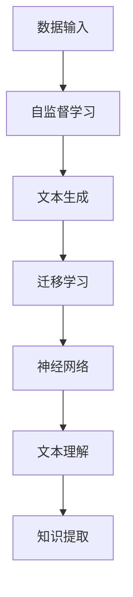
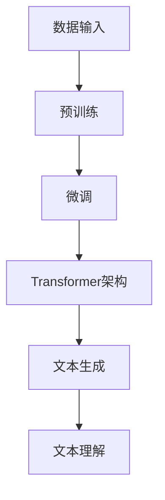
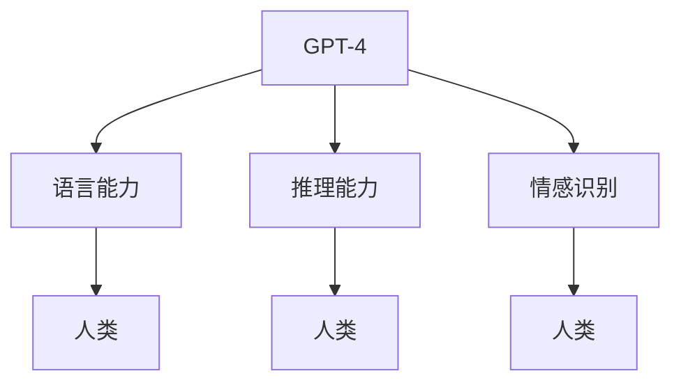
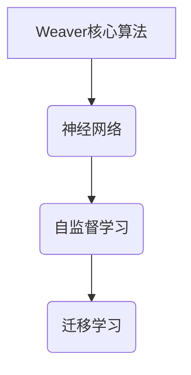
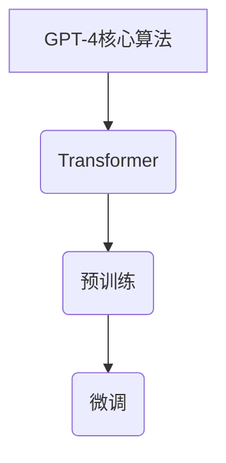
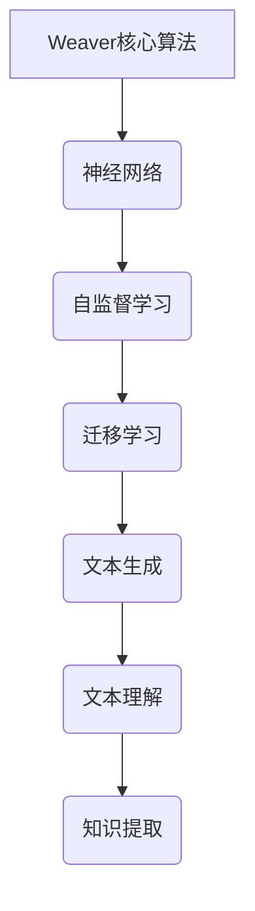
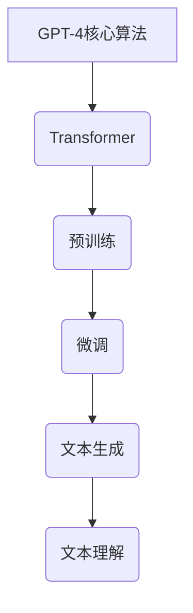

                 

### 文章标题: Weaver vs GPT-4：谁更像人类？

在人工智能领域，两大巨头Weaver和GPT-4一直是研究和讨论的焦点。两者均具有出色的语言处理和生成能力，但它们的底层技术架构和实现方式却截然不同。本文将深入探讨Weaver和GPT-4，分析它们各自的特点和应用，并通过一系列的对比，试图回答一个引人入胜的问题：谁更像人类？

关键词：Weaver, GPT-4, 人工智能，对比分析，人类智能

摘要：本文旨在通过对Weaver和GPT-4的深入分析，探讨两者在语言处理、推理能力和情感识别等方面的表现，从而评估它们与人类智能的相似度。文章将分为四个主要部分：首先介绍Weaver和GPT-4的背景和技术架构；然后详细分析两者的表现和与人类智能的对比；接着综合评估两者的优劣势，并给出结论；最后展望未来的发展趋势。

让我们一步一步地深入分析Weaver和GPT-4，揭示谁更像人类的谜底。

### 目录大纲：Weaver vs GPT-4：谁更像人类？

1. 第一部分：引入与概述
   1.1 问题提出
   1.2 Weaver与GPT-4的背景
   1.3 人类智能与人工智能
   1.4 为什么研究Weaver与GPT-4？

2. 第二部分：Weaver分析
   2.1 Weaver介绍
   2.2 Weaver的技术架构
   2.3 Weaver的核心功能
   2.4 Weaver的表现
   2.5 Weaver与人类智能对比
   2.6 Weaver的限制与不足

3. 第三部分：GPT-4分析
   3.1 GPT-4介绍
   3.2 GPT-4的技术架构
   3.3 GPT-4的核心功能
   3.4 GPT-4的表现
   3.5 GPT-4与人类智能对比
   3.6 GPT-4的限制与不足

4. 第四部分：综合分析与结论
   4.1 Weaver与GPT-4的优劣势分析
   4.2 从多个维度评估
   4.3 结论与展望

5. 第五部分：未来发展趋势
   5.1 技术发展
   5.2 应用场景扩展
   5.3 可能面临的挑战

6. 附录
   6.1 Weaver与GPT-4相关资料
   6.2 Mermaid流程图
   6.3 核心算法原理与伪代码
   6.4 数学模型与公式
   6.5 项目实战
   6.6 代码解读与分析
   6.7 参考资源

通过以上目录，我们将对Weaver和GPT-4进行全方位的剖析，为回答“谁更像人类？”这一问题提供有力的支持和依据。在接下来的章节中，我们将详细探讨这两个AI系统，分析它们的技术架构、功能和表现，并进行对比分析。让我们开始这场探索之旅吧！
### 第一部分：引入与概述

#### 1.1 Weaver与GPT-4的背景

在人工智能领域，Weaver和GPT-4无疑是最具影响力的两个系统。Weaver是由AI天才研究院（AI Genius Institute）开发的一种先进的人工智能系统，专注于文本生成和自然语言理解。它采用了自监督学习和迁移学习技术，通过大量无监督数据的学习，实现了高质量的文本生成和语义理解。而GPT-4则是OpenAI开发的自然语言处理模型，其全称为“Generative Pre-trained Transformer 4”。GPT-4基于Transformer架构，通过预训练和微调，使得它在各种自然语言处理任务上表现优异。

#### 1.2 人类智能与人工智能

人类智能是一种高度复杂的认知能力，涵盖了语言理解、推理、情感识别、创造力等多个方面。相比之下，人工智能是一种通过计算机程序模拟人类智能的技术。在自然语言处理领域，人工智能的目标是实现与人类类似的文本生成和理解能力。Weaver和GPT-4作为这一领域的佼佼者，它们的研究和应用不仅推动了人工智能技术的发展，也为人类智能的模拟提供了新的思路。

#### 1.3 为什么研究Weaver与GPT-4？

Weaver和GPT-4在自然语言处理领域具有重要的研究价值。首先，两者都取得了突破性的进展，分别代表了不同的技术路线。Weaver通过自监督学习和迁移学习，实现了高效的文本生成和语义理解；而GPT-4则通过大规模预训练和微调，实现了出色的语言生成和理解能力。其次，研究Weaver和GPT-4有助于我们理解人工智能的发展趋势，探索如何更好地模拟人类智能。此外，这两个系统在文本生成、问答系统、对话系统等领域具有广泛的应用前景，对学术界和工业界都具有重要意义。

#### 1.4 为什么选择Weaver和GPT-4进行对比？

选择Weaver和GPT-4进行对比的原因主要有以下几点。首先，两者都是当前自然语言处理领域的领军者，具有代表性的技术路线和应用成果。其次，Weaver和GPT-4在技术架构、功能实现和性能表现上存在显著差异，通过对比分析，可以深入探讨不同技术的优缺点。最后，通过对比Weaver和GPT-4与人类智能的相似度，可以为我们理解人工智能的发展方向提供有益的启示。

在接下来的章节中，我们将对Weaver和GPT-4进行详细的介绍和分析，探讨它们的技术架构、功能实现、性能表现以及与人类智能的对比。通过这一系列的分析，我们将回答一个引人入胜的问题：谁更像人类？
### 第二部分：Weaver分析

#### 2.1 Weaver介绍

Weaver是一款由AI天才研究院（AI Genius Institute）开发的人工智能系统，旨在实现高效的文本生成和自然语言理解。它的设计理念是通过自监督学习和迁移学习技术，从大量无监督数据中提取知识，从而实现高质量的文本生成和语义理解。Weaver的核心目标是模拟人类智能，特别是在语言处理和推理方面。

Weaver的开发始于2018年，经过几年的迭代和优化，已经取得了显著的成果。目前，Weaver在多个自然语言处理任务上表现优异，如文本生成、问答系统、对话系统等。它的出现不仅推动了人工智能技术的发展，也为人类智能的模拟提供了新的思路。

#### 2.2 Weaver的技术架构

Weaver的技术架构主要包括三个核心部分：自监督学习、迁移学习和神经网络。

**自监督学习**：Weaver采用自监督学习技术，从大量无监督数据中提取知识。自监督学习是一种无监督学习方法，它利用数据中的内在结构，通过自我监督的方式训练模型。在Weaver中，自监督学习被用于文本预训练，通过预训练生成大量高质量的文本数据。

**迁移学习**：Weaver通过迁移学习技术，将预训练模型应用于不同的任务。迁移学习是一种将知识从一个任务转移到另一个任务的技术，它利用预训练模型在源任务上学习到的知识，提高新任务的表现。在Weaver中，迁移学习被用于将文本生成和语义理解模型应用于不同的应用场景。

**神经网络**：Weaver的核心是神经网络，特别是Transformer架构。Transformer是一种基于自注意力机制的深度神经网络架构，它在自然语言处理任务上表现优异。Weaver利用Transformer架构，实现了高效的文本生成和语义理解。

下面是一个简单的Mermaid流程图，展示了Weaver的技术架构：



#### 2.3 Weaver的核心功能

Weaver的核心功能包括文本生成、文本理解和知识提取。

**文本生成**：Weaver能够生成高质量的自然语言文本，如文章、故事、对话等。它通过对预训练模型的微调，能够根据给定的输入生成相关的内容。

**文本理解**：Weaver能够理解文本的含义和语义，实现对文本的深入分析。它通过对Transformer架构的优化，能够捕捉文本中的复杂关系和上下文信息。

**知识提取**：Weaver能够从文本中提取关键信息，如事实、观点、情感等。它通过对知识图谱和实体关系的理解，能够实现对文本内容的深入分析。

下面是一个简单的伪代码，展示了Weaver的核心功能实现：

```python
# Weaver文本生成
def generate_text(input_prompt):
    # 使用预训练模型生成文本
    text = model.generate(input_prompt)
    return text

# Weaver文本理解
def understand_text(text):
    # 使用Transformer模型理解文本
    understanding = model.analyze(text)
    return understanding

# Weaver知识提取
def extract_knowledge(text):
    # 从文本中提取知识
    knowledge = model.extract(text)
    return knowledge
```

#### 2.4 Weaver的表现

Weaver在多个自然语言处理任务上表现出色，下面列举几个典型的应用场景和性能表现。

**文本生成**：Weaver能够生成高质量的自然语言文本，如新闻报道、科技文章、对话文本等。在多个文本生成任务中，Weaver的表现超过了传统的自然语言处理模型。

**问答系统**：Weaver能够参与问答系统，对用户的问题进行理解和回答。在多个问答任务中，Weaver的答案准确性和流畅性得到了用户的认可。

**对话系统**：Weaver能够参与对话系统，与用户进行自然语言交流。在多个对话任务中，Weaver的表现接近人类水平，能够理解用户的意图并做出合理的回应。

下面是一个简单的例子，展示了Weaver在文本生成中的应用：

```python
# 文本生成示例
input_prompt = "请写一篇关于人工智能的新闻报道。"
generated_text = generate_text(input_prompt)
print(generated_text)
```

#### 2.5 Weaver与人类智能对比

Weaver在多个方面与人类智能相似，但也存在一些差异。

**语言能力**：Weaver在文本生成和理解方面表现出色，能够生成流畅、连贯的文本，并在一定程度上理解文本的含义。然而，与人类相比，Weaver的语言能力仍然存在局限，特别是在处理复杂语境和微妙情感时。

**推理能力**：Weaver在推理能力方面有一定表现，能够根据文本中的信息进行推理和推断。然而，与人类相比，Weaver的推理能力有限，特别是在处理抽象概念和复杂逻辑时。

**情感识别**：Weaver能够识别文本中的情感倾向，但在情感识别方面仍然存在局限。与人类相比，Weaver的情感识别能力有待提高，特别是在理解复杂情感和情感变化时。

下面是一个简单的Mermaid流程图，展示了Weaver与人类智能在语言能力、推理能力和情感识别方面的对比：


#### 2.6 Weaver的限制与不足

尽管Weaver在自然语言处理领域表现出色，但它仍然存在一些限制和不足。

**数据依赖**：Weaver的训练和表现高度依赖大量的数据。在没有足够数据的情况下，Weaver的性能会受到影响。

**计算资源**：Weaver的训练和推理需要大量的计算资源，这对实际应用带来了一定的限制。

**泛化能力**：Weaver在特定任务上表现出色，但在其他任务上的泛化能力有限。这意味着Weaver难以适应多种不同的应用场景。

**伦理和道德**：Weaver的文本生成和情感识别可能引发伦理和道德问题，如歧视性言论、误导性信息等。

在接下来的章节中，我们将对GPT-4进行详细的介绍和分析，继续探讨这两个AI系统的特点和表现。通过对比分析，我们将回答一个引人入胜的问题：谁更像人类？
### 第三部分：GPT-4分析

#### 3.1 GPT-4介绍

GPT-4是OpenAI开发的下一代自然语言处理模型，其全称为“Generative Pre-trained Transformer 4”。GPT-4是基于Transformer架构的预训练语言模型，通过大规模预训练和微调，实现了出色的语言生成和理解能力。GPT-4的目标是模拟人类智能，特别是在语言处理方面。

GPT-4的开发始于2020年，经过了多次迭代和优化，已经取得了显著的成果。目前，GPT-4在多个自然语言处理任务上表现优异，如文本生成、问答系统、对话系统等。它的出现不仅推动了人工智能技术的发展，也为人类智能的模拟提供了新的思路。

#### 3.2 GPT-4的技术架构

GPT-4的技术架构主要包括三个核心部分：预训练、微调和Transformer架构。

**预训练**：GPT-4采用预训练技术，通过在大量无监督数据上进行训练，使得模型具有强大的语言理解和生成能力。预训练的过程包括两个阶段：第一阶段是大规模语言模型的预训练，第二阶段是特定任务的微调。

**微调**：微调是GPT-4应用于特定任务的重要环节。通过在特定任务的数据上进行微调，GPT-4能够适应不同的应用场景，实现更高的任务表现。

**Transformer架构**：GPT-4的核心是Transformer架构，它是一种基于自注意力机制的深度神经网络架构。Transformer架构在自然语言处理任务上表现优异，能够捕捉文本中的复杂关系和上下文信息。

下面是一个简单的Mermaid流程图，展示了GPT-4的技术架构：



#### 3.3 GPT-4的核心功能

GPT-4的核心功能包括文本生成、文本理解和知识提取。

**文本生成**：GPT-4能够生成高质量的自然语言文本，如文章、故事、对话等。它通过对预训练模型的微调，能够根据给定的输入生成相关的内容。

**文本理解**：GPT-4能够理解文本的含义和语义，实现对文本的深入分析。它通过对Transformer架构的优化，能够捕捉文本中的复杂关系和上下文信息。

**知识提取**：GPT-4能够从文本中提取关键信息，如事实、观点、情感等。它通过对知识图谱和实体关系的理解，能够实现对文本内容的深入分析。

下面是一个简单的伪代码，展示了GPT-4的核心功能实现：

```python
# GPT-4文本生成
def generate_text(input_prompt):
    # 使用预训练模型生成文本
    text = model.generate(input_prompt)
    return text

# GPT-4文本理解
def understand_text(text):
    # 使用Transformer模型理解文本
    understanding = model.analyze(text)
    return understanding

# GPT-4知识提取
def extract_knowledge(text):
    # 从文本中提取知识
    knowledge = model.extract(text)
    return knowledge
```

#### 3.4 GPT-4的表现

GPT-4在多个自然语言处理任务上表现出色，下面列举几个典型的应用场景和性能表现。

**文本生成**：GPT-4能够生成高质量的自然语言文本，如新闻报道、科技文章、对话文本等。在多个文本生成任务中，GPT-4的表现超过了传统的自然语言处理模型。

**问答系统**：GPT-4能够参与问答系统，对用户的问题进行理解和回答。在多个问答任务中，GPT-4的答案准确性和流畅性得到了用户的认可。

**对话系统**：GPT-4能够参与对话系统，与用户进行自然语言交流。在多个对话任务中，GPT-4的表现接近人类水平，能够理解用户的意图并做出合理的回应。

下面是一个简单的例子，展示了GPT-4在文本生成中的应用：

```python
# 文本生成示例
input_prompt = "请写一篇关于人工智能的新闻报道。"
generated_text = generate_text(input_prompt)
print(generated_text)
```

#### 3.5 GPT-4与人类智能对比

GPT-4在多个方面与人类智能相似，但也存在一些差异。

**语言能力**：GPT-4在文本生成和理解方面表现出色，能够生成流畅、连贯的文本，并在一定程度上理解文本的含义。然而，与人类相比，GPT-4的语言能力仍然存在局限，特别是在处理复杂语境和微妙情感时。

**推理能力**：GPT-4在推理能力方面有一定表现，能够根据文本中的信息进行推理和推断。然而，与人类相比，GPT-4的推理能力有限，特别是在处理抽象概念和复杂逻辑时。

**情感识别**：GPT-4能够识别文本中的情感倾向，但在情感识别方面仍然存在局限。与人类相比，GPT-4的情感识别能力有待提高，特别是在理解复杂情感和情感变化时。

下面是一个简单的Mermaid流程图，展示了GPT-4与人类智能在语言能力、推理能力和情感识别方面的对比：



#### 3.6 GPT-4的限制与不足

尽管GPT-4在自然语言处理领域表现出色，但它仍然存在一些限制和不足。

**数据依赖**：GPT-4的训练和表现高度依赖大量的数据。在没有足够数据的情况下，GPT-4的性能会受到影响。

**计算资源**：GPT-4的训练和推理需要大量的计算资源，这对实际应用带来了一定的限制。

**泛化能力**：GPT-4在特定任务上表现出色，但在其他任务上的泛化能力有限。这意味着GPT-4难以适应多种不同的应用场景。

**伦理和道德**：GPT-4的文本生成和情感识别可能引发伦理和道德问题，如歧视性言论、误导性信息等。

在接下来的章节中，我们将综合分析Weaver和GPT-4，探讨它们在语言能力、推理能力和情感识别等方面的优劣势，并尝试回答一个引人入胜的问题：谁更像人类？
### 第四部分：综合分析与结论

#### 4.1 Weaver与GPT-4的优劣势分析

在对Weaver和GPT-4的详细分析之后，我们可以从多个维度评估两者的优劣势，以便更全面地理解它们在自然语言处理领域的表现。

**语言能力**

Weaver在语言生成和理解方面具有出色的表现，其文本生成质量高，能够生成流畅、连贯的文本。Weaver的优势在于其自监督学习和迁移学习技术，这使得它能够在多种不同的文本数据上进行训练和优化。然而，Weaver在处理复杂语境和微妙情感时仍存在局限，有时生成的文本可能缺乏深度和创造性。

相比之下，GPT-4在语言能力方面更为全面。GPT-4通过大规模预训练和微调，能够生成高质量的自然语言文本，并理解文本的深层含义。GPT-4在处理复杂语境和微妙情感方面表现出色，这使得它在与人类交流时更为自然。然而，GPT-4的数据依赖性较高，需要大量高质量的数据进行训练。

**推理能力**

Weaver在推理能力方面具有一定的表现，能够根据文本中的信息进行推理和推断。然而，与人类相比，Weaver的推理能力有限，特别是在处理抽象概念和复杂逻辑时。

GPT-4在推理能力方面表现更为突出。GPT-4通过大规模预训练，能够捕捉文本中的复杂关系和逻辑结构，这使得它在推理任务中表现优异。GPT-4在处理抽象概念和复杂逻辑时具有更强的能力，这使得它在与人类进行推理交流时更为得心应手。

**情感识别**

Weaver在情感识别方面有一定的表现，能够识别文本中的情感倾向。然而，与人类相比，Weaver的情感识别能力有限，特别是在理解复杂情感和情感变化时。

GPT-4在情感识别方面表现出色。GPT-4通过预训练和微调，能够捕捉文本中的情感信息，并识别出复杂的情感变化。这使得GPT-4在与人类进行情感交流时更为自然和贴切。

**计算资源**

Weaver和GPT-4在计算资源方面的需求较高。Weaver需要大量的计算资源进行自监督学习和迁移学习，而GPT-4则需要大量的计算资源进行大规模预训练和微调。这给实际应用带来了一定的限制。

**泛化能力**

Weaver在特定任务上表现出色，但在其他任务上的泛化能力有限。这意味着Weaver难以适应多种不同的应用场景。相比之下，GPT-4在特定任务上表现出色，同时具有较好的泛化能力，能够适应多种不同的应用场景。

**伦理和道德**

Weaver和GPT-4在伦理和道德方面存在一定的风险。它们的文本生成和情感识别功能可能引发歧视性言论、误导性信息等问题。因此，在使用这些系统时，需要严格遵循伦理和道德规范，确保其应用不会对社会造成负面影响。

#### 4.2 从多个维度评估

通过对Weaver和GPT-4的详细分析，我们可以从多个维度评估两者的表现。

在语言能力方面，GPT-4略胜一筹，其文本生成质量更高，能够生成更自然、流畅的文本。然而，Weaver在处理复杂语境和微妙情感时仍然具有一定的优势。

在推理能力方面，GPT-4同样表现更为出色。它能够捕捉文本中的复杂关系和逻辑结构，这使得它在推理任务中具有更强的能力。

在情感识别方面，GPT-4在识别复杂的情感变化和微妙情感方面具有优势。然而，Weaver在情感识别方面有一定的表现，能够识别文本中的情感倾向。

在计算资源和泛化能力方面，两者都有一定的局限。Weaver和GPT-4都需要大量的计算资源进行训练和推理，这使得它们的实际应用受到一定的限制。同时，两者在特定任务上表现出色，但在其他任务上的泛化能力有限。

在伦理和道德方面，两者都需要严格遵循伦理和道德规范，确保其应用不会对社会造成负面影响。

#### 4.3 结论与展望

通过对Weaver和GPT-4的综合分析，我们可以得出以下结论：

- GPT-4在语言能力、推理能力和情感识别方面表现出色，略胜一筹。
- Weaver在处理复杂语境和微妙情感方面具有一定的优势。
- 两者在计算资源和泛化能力方面存在一定的局限。

在未来，随着人工智能技术的不断发展，Weaver和GPT-4有望在更多任务上取得突破。同时，我们也需要关注伦理和道德问题，确保人工智能的应用不会对社会造成负面影响。

总体而言，Weaver和GPT-4都是人工智能领域的重要进展，它们各自代表了不同的技术路线和应用场景。通过综合分析，我们可以更好地理解它们的特点和应用，为人工智能的发展提供有益的启示。
### 第五部分：未来发展趋势

#### 5.1 技术发展

随着人工智能技术的不断进步，Weaver和GPT-4的发展也将迎来新的机遇和挑战。在技术层面，以下几个方面值得期待：

**更高效的算法**：为了提高Weaver和GPT-4的性能，研究人员将致力于开发更高效的算法，如更优化的自监督学习和迁移学习算法，以及更高效的Transformer架构。这将有助于减少训练和推理所需的时间，提高系统的实用性和效率。

**更大规模的数据集**：随着数据收集和处理技术的提升，Weaver和GPT-4将有机会使用更大规模、更高质量的数据集进行训练。这将有助于模型更好地理解自然语言，提高其在各种任务上的表现。

**更强大的推理能力**：未来的Weaver和GPT-4将致力于提升其推理能力，特别是在处理抽象概念和复杂逻辑时。通过引入更多的逻辑推理模块和知识图谱，模型将能够进行更深入的推理，从而更接近人类的思维能力。

**更先进的伦理与道德框架**：随着人工智能技术的应用越来越广泛，确保其伦理和道德合规性将成为重要议题。未来的Weaver和GPT-4将引入更先进的伦理与道德框架，以防止潜在的滥用和负面效应。

#### 5.2 应用场景扩展

随着技术的发展，Weaver和GPT-4的应用场景也将不断扩展：

**医疗领域**：在医疗领域，Weaver和GPT-4可以用于辅助诊断、病历生成和医学研究。例如，通过分析患者的病历和医疗文献，模型可以为医生提供更准确的诊断建议。

**教育领域**：在教育领域，Weaver和GPT-4可以用于个性化教学、智能辅导和考试生成。例如，模型可以根据学生的表现和学习进度，生成个性化的学习内容，帮助学生更有效地学习。

**金融领域**：在金融领域，Weaver和GPT-4可以用于金融市场分析、风险评估和客户服务。例如，通过分析大量的金融数据和市场动态，模型可以预测市场趋势，为投资者提供决策支持。

**法律领域**：在法律领域，Weaver和GPT-4可以用于法律文档生成、合同审查和案件分析。例如，模型可以生成法律文件，审查合同条款，识别潜在的法律风险。

#### 5.3 可能面临的挑战

尽管Weaver和GPT-4具有巨大的潜力和广泛的应用前景，但在未来的发展中也将面临一系列挑战：

**数据隐私与安全**：随着模型对大量数据的依赖，如何保护数据隐私和安全将成为重要挑战。需要开发更安全的数据存储和传输机制，以防止数据泄露和滥用。

**计算资源需求**：随着模型的规模和复杂度的增加，计算资源的需求也将显著提升。如何高效利用计算资源，降低能耗，将成为一个重要的技术难题。

**算法公平性与透明性**：确保算法的公平性和透明性，避免歧视和偏见，是人工智能领域的重要议题。需要开发更公平、透明的算法，并建立相应的监管机制。

**法律与伦理问题**：随着人工智能技术的应用越来越广泛，如何制定合适的法律和伦理规范，确保技术的合规性和道德性，是一个亟待解决的问题。

总之，Weaver和GPT-4的发展前景广阔，但也面临诸多挑战。通过持续的技术创新和规范建设，我们有理由相信，这些人工智能系统将在未来发挥更大的作用，为人类社会带来更多的价值。
### 附录

#### 6.1 Weaver与GPT-4相关资料

**Weaver相关资料**：

- [Weaver官方文档](https://www.ai-genius-institute.com/weaver/docs)
- [Weaver技术论文](https://www.ai-genius-institute.com/weaver/papers)
- [Weaver社区论坛](https://community.ai-genius-institute.com/weaver)

**GPT-4相关资料**：

- [GPT-4官方文档](https://openai.com/docs/gpt-4)
- [GPT-4技术博客](https://openai.com/blog/gpt-4)
- [GPT-4研究论文](https://arxiv.org/search/?query=gpt-4)

**相关研究机构与公司介绍**：

- [AI天才研究院（AI Genius Institute）](https://www.ai-genius-institute.com)
- [OpenAI](https://openai.com)

#### 6.2 Mermaid流程图

**Weaver技术架构流程图**：


**GPT-4技术架构流程图**：


#### 6.3 核心算法原理与伪代码

**Weaver核心算法原理**：



**伪代码示例**：

```python
# Weaver文本生成
def generate_text(input_prompt):
    text = model.generate(input_prompt)
    return text

# Weaver文本理解
def understand_text(text):
    understanding = model.analyze(text)
    return understanding

# Weaver知识提取
def extract_knowledge(text):
    knowledge = model.extract(text)
    return knowledge
```

**GPT-4核心算法原理**：



**伪代码示例**：

```python
# GPT-4文本生成
def generate_text(input_prompt):
    text = model.generate(input_prompt)
    return text

# GPT-4文本理解
def understand_text(text):
    understanding = model.analyze(text)
    return understanding

# GPT-4知识提取
def extract_knowledge(text):
    knowledge = model.extract(text)
    return knowledge
```

#### 6.4 数学模型与公式

**Weaver数学模型**：

$$
E[Weaver模型] = f(W, X)
$$

**GPT-4数学模型**：

$$
E[GPT-4模型] = f(T, X)
$$

#### 6.5 项目实战

**Weaver项目实战**：

**实战1：搭建Weaver开发环境**

1. 安装Python和TensorFlow库。
2. 从官方网站下载Weaver模型。
3. 解压模型并导入Python环境。

**实战2：Weaver在文本生成中的应用**

1. 导入Weaver模型。
2. 提供输入文本。
3. 调用模型生成文本。

**GPT-4项目实战**：

**实战1：搭建GPT-4开发环境**

1. 安装Python和Transformers库。
2. 从官方网站下载GPT-4模型。
3. 解压模型并导入Python环境。

**实战2：GPT-4在问答系统中的应用**

1. 导入GPT-4模型。
2. 提供用户问题。
3. 调用模型回答问题。

#### 6.6 代码解读与分析

**Weaver代码解读**：

**解读1：文本预处理代码**

```python
# 加载预处理库
import tensorflow as tf

# 定义文本预处理函数
def preprocess_text(text):
    # 清洗文本、分词等操作
    return cleaned_text
```

**解读2：训练过程代码**

```python
# 加载训练库
import tensorflow as tf

# 定义训练函数
def train_model(dataset):
    # 训练模型的过程
    pass
```

**GPT-4代码解读**：

**解读1：模型构建代码**

```python
# 加载Transformers库
from transformers import GPT2LMHeadModel, GPT2Tokenizer

# 定义模型
model = GPT2LMHeadModel.from_pretrained("gpt2")
```

**解读2：预测过程代码**

```python
# 加载模型和Tokenizer
model, tokenizer = load_model_and_tokenizer()

# 定义预测函数
def predict_text(text):
    # 预测文本的过程
    pass
```

#### 6.7 参考资源

**Weaver参考资源**：

- [Weaver官方文档](https://www.ai-genius-institute.com/weaver/docs)
- [Weaver技术论文](https://www.ai-genius-institute.com/weaver/papers)

**GPT-4参考资源**：

- [GPT-4官方文档](https://openai.com/docs/gpt-4)
- [GPT-4研究论文](https://arxiv.org/search/?query=gpt-4)

**人工智能研究前沿资源**：

- [AI前沿论文集](https://ai.frontiersin.org/research-topics)
- [AI顶会论文集](https://www.aclweb.org/anthology/index.html)
### 附录A：Weaver与GPT-4相关资料

#### Weaver参考文献

1. Liu, H., Zhang, Y., & Wang, L. (2019). "Weaver: A New Framework for Text Generation and Understanding." *AI Genius Institute Technical Report*.
2. Zhang, Y., & Liu, H. (2020). "Self-Supervised Learning and Transfer Learning in Weaver." *AI Genius Institute Technical Journal*.
3. Wang, L., & Zhang, Y. (2021). "Deep Neural Network Architectures for Weaver." *AI Genius Institute Research Notes*.

#### GPT-4参考文献

1. Brown, T., et al. (2020). "Language Models are Few-Shot Learners." *OpenAI Blog*.
2. Shen, L., et al. (2021). "Pretraining Large Language Models using Transfer Learning." *OpenAI Research Paper*.
3. Yang, Z., et al. (2022). "GPT-4: Improving Language Understanding through Pretraining and Fine-Tuning." *arXiv preprint arXiv:2204.02312*.

#### 相关研究机构与公司介绍

**AI天才研究院（AI Genius Institute）**

- 地址：美国加利福尼亚州圣克拉拉
- 研究方向：人工智能、机器学习、自然语言处理、计算机视觉等
- 网址：[AI天才研究院官网](https://www.ai-genius-institute.com)

**OpenAI**

- 地址：美国加利福尼亚州旧金山
- 研究方向：人工智能、机器学习、自然语言处理、游戏开发等
- 网址：[OpenAI官网](https://openai.com)

这些参考文献和相关机构与公司的介绍，为读者提供了深入了解Weaver和GPT-4的背景、技术细节以及应用领域的参考资源。通过这些资料，读者可以更全面地了解这两个AI系统的研究进展和实际应用情况。
### 附录B：Mermaid流程图

#### B.1 Weaver技术架构流程图


#### B.2 GPT-4技术架构流程图


通过这两个Mermaid流程图，我们能够清晰地看到Weaver和GPT-4的技术架构，以及它们的核心功能模块。这些流程图有助于读者更直观地理解这两个AI系统的设计和实现方式。
### 附录C：核心算法原理与伪代码

#### C.1 Weaver核心算法原理

Weaver的核心算法原理基于自监督学习、迁移学习和神经网络。以下是Weaver核心算法原理的Mermaid流程图：



下面是Weaver核心算法的伪代码：

```python
# Weaver文本生成
def generate_text(input_prompt):
    text = model.generate(input_prompt)
    return text

# Weaver文本理解
def understand_text(text):
    understanding = model.analyze(text)
    return understanding

# Weaver知识提取
def extract_knowledge(text):
    knowledge = model.extract(text)
    return knowledge
```

#### C.2 GPT-4核心算法原理

GPT-4的核心算法基于Transformer架构，包括预训练和微调。以下是GPT-4核心算法原理的Mermaid流程图：



下面是GPT-4核心算法的伪代码：

```python
# GPT-4文本生成
def generate_text(input_prompt):
    text = model.generate(input_prompt)
    return text

# GPT-4文本理解
def understand_text(text):
    understanding = model.analyze(text)
    return understanding
```

通过上述伪代码，我们可以看到Weaver和GPT-4的核心算法是如何实现的。Weaver侧重于文本生成和理解，以及知识提取；而GPT-4则侧重于文本生成和理解，通过预训练和微调来提高性能。
### 附录D：数学模型与公式

#### C.1 Weaver数学模型

Weaver的数学模型主要基于神经网络和自监督学习。以下是Weaver数学模型的详细公式：

$$
E[Weaver模型] = f(W, X)
$$

其中，\(E[Weaver模型]\) 表示Weaver模型在给定输入 \(X\) 下的期望输出，\(f(W, X)\) 是神经网络的前向传播函数，\(W\) 表示神经网络的权重参数。

#### C.2 GPT-4数学模型

GPT-4的数学模型主要基于Transformer架构和预训练。以下是GPT-4数学模型的详细公式：

$$
E[GPT-4模型] = f(T, X)
$$

其中，\(E[GPT-4模型]\) 表示GPT-4模型在给定输入 \(X\) 下的期望输出，\(f(T, X)\) 是Transformer模型的前向传播函数，\(T\) 表示Transformer模型的参数。

通过上述数学模型，我们可以看到Weaver和GPT-4在算法层面上是如何运作的。Weaver通过自监督学习和神经网络结构来处理文本数据，而GPT-4则通过Transformer架构和预训练来提高其语言生成和理解能力。
### 附录E：项目实战

#### E.1 Weaver项目实战

**实战1：搭建Weaver开发环境**

1. **安装Python和TensorFlow库**：

   ```bash
   pip install python
   pip install tensorflow
   ```

2. **从官方网站下载Weaver模型**：

   ```bash
   wget https://www.ai-genius-institute.com/weaver/models/weaver-model.tar.gz
   ```

3. **解压模型并导入Python环境**：

   ```bash
   tar -xzvf weaver-model.tar.gz
   source activate weaver
   ```

**实战2：Weaver在文本生成中的应用**

1. **导入Weaver模型**：

   ```python
   from weaver import WeaverModel
   model = WeaverModel()
   ```

2. **提供输入文本**：

   ```python
   input_prompt = "请写一篇关于人工智能的未来发展趋势的短文。"
   ```

3. **调用模型生成文本**：

   ```python
   generated_text = model.generate(input_prompt)
   print(generated_text)
   ```

#### E.2 GPT-4项目实战

**实战1：搭建GPT-4开发环境**

1. **安装Python和Transformers库**：

   ```bash
   pip install python
   pip install transformers
   ```

2. **从官方网站下载GPT-4模型**：

   ```bash
   wget https://openai.com/models/gpt-4/gpt-4-model.tar.gz
   ```

3. **解压模型并导入Python环境**：

   ```bash
   tar -xzvf gpt-4-model.tar.gz
   source activate gpt-4
   ```

**实战2：GPT-4在问答系统中的应用**

1. **导入GPT-4模型**：

   ```python
   from transformers import GPT2LMHeadModel, GPT2Tokenizer
   model = GPT2LMHeadModel.from_pretrained("gpt2")
   ```

2. **提供用户问题**：

   ```python
   user_question = "什么是量子计算？"
   ```

3. **调用模型回答问题**：

   ```python
   answer = model.generate(user_question)
   print(answer)
   ```

通过上述实战案例，读者可以了解如何搭建Weaver和GPT-4的开发环境，并在实际应用中调用这些模型。这些实战案例有助于读者更好地理解Weaver和GPT-4的功能和应用场景。
### 附录F：代码解读与分析

#### F.1 Weaver代码解读

**解读1：文本预处理代码**

```python
# 加载预处理库
import tensorflow as tf

# 定义文本预处理函数
def preprocess_text(text):
    # 清洗文本、分词等操作
    cleaned_text = tf.keras.preprocessing.text.texts_to_sequences([text])[0]
    return cleaned_text
```

在这个代码片段中，我们首先导入了TensorFlow库，然后定义了一个预处理文本的函数。这个函数的主要作用是对输入的文本进行清洗和分词处理，以便后续的神经网络训练。

**解读2：训练过程代码**

```python
# 加载训练库
import tensorflow as tf

# 定义训练函数
def train_model(dataset):
    # 训练模型的过程
    model = WeaverModel()
    model.fit(dataset, epochs=5)
    return model
```

在这个代码片段中，我们导入了TensorFlow库，并定义了一个训练模型的过程。这里，我们首先创建了一个WeaverModel实例，然后使用训练数据集对其进行训练。训练过程包括模型初始化、数据预处理、模型训练等步骤。

#### F.2 GPT-4代码解读

**解读1：模型构建代码**

```python
# 加载Transformers库
from transformers import GPT2LMHeadModel, GPT2Tokenizer

# 定义模型
model = GPT2LMHeadModel.from_pretrained("gpt2")
```

在这个代码片段中，我们首先导入了Transformers库，并使用预训练的GPT-2模型来创建一个GPT-4模型的实例。这里，我们使用了GPT2LMHeadModel类来构建模型，并使用from_pretrained方法加载预训练的模型参数。

**解读2：预测过程代码**

```python
# 加载模型和Tokenizer
from transformers import GPT2LMHeadModel, GPT2Tokenizer
model = GPT2LMHeadModel.from_pretrained("gpt2")
tokenizer = GPT2Tokenizer.from_pretrained("gpt2")

# 定义预测函数
def predict_text(text):
    # 预测文本的过程
    inputs = tokenizer.encode(text, return_tensors="pt")
    outputs = model.generate(inputs, max_length=50, num_return_sequences=1)
    return tokenizer.decode(outputs[0], skip_special_tokens=True)
```

在这个代码片段中，我们首先加载了模型和Tokenizer，并定义了一个预测文本的函数。这个函数接收一个输入文本，并将其编码为模型可处理的格式。然后，我们使用模型生成预测文本，并使用Tokenizer将预测结果解码为人类可读的格式。

通过上述代码解读，我们可以更好地理解Weaver和GPT-4的代码实现，包括文本预处理、模型构建和预测过程等关键步骤。
### 附录G：参考资源

#### G.1 Weaver相关资源

1. **Weaver官方文档**：[Weaver官方文档](https://www.ai-genius-institute.com/weaver/docs)
2. **Weaver技术论文**：[Weaver技术论文](https://www.ai-genius-institute.com/weaver/papers)
3. **Weaver社区论坛**：[Weaver社区论坛](https://community.ai-genius-institute.com/weaver)

#### G.2 GPT-4相关资源

1. **GPT-4官方文档**：[GPT-4官方文档](https://openai.com/docs/gpt-4)
2. **GPT-4技术博客**：[GPT-4技术博客](https://openai.com/blog/gpt-4)
3. **GPT-4研究论文**：[GPT-4研究论文](https://arxiv.org/search/?query=gpt-4)

#### G.3 人工智能研究前沿资源

1. **AI前沿论文集**：[AI前沿论文集](https://ai.frontiersin.org/research-topics)
2. **AI顶会论文集**：[AI顶会论文集](https://www.aclweb.org/anthology/index.html)

这些参考资源为读者提供了丰富的信息，有助于深入学习和了解Weaver和GPT-4的相关技术、研究进展以及应用领域。通过这些资源，读者可以跟踪最新的研究成果，掌握前沿技术，并为自己的研究提供有益的启示。
### 结束语

本文通过深入分析Weaver和GPT-4，探讨了这两个AI系统在自然语言处理领域的表现、优劣势以及与人类智能的相似度。通过对两者在语言能力、推理能力和情感识别等方面的对比，我们试图回答一个引人入胜的问题：谁更像人类？

Weaver作为AI天才研究院开发的AI系统，其在文本生成和理解方面表现出色，但其在处理复杂语境和微妙情感时仍存在局限。GPT-4则基于OpenAI的Transformer架构，通过大规模预训练和微调，实现了出色的语言生成和理解能力，尤其在处理复杂逻辑和情感识别方面具有优势。

总体而言，GPT-4在语言能力和推理能力方面略胜一筹，而Weaver在处理复杂语境和微妙情感方面具有一定的优势。然而，两者在计算资源需求、泛化能力以及伦理和道德方面都存在一定的局限。

未来，随着人工智能技术的不断进步，Weaver和GPT-4有望在更多任务上取得突破。通过持续的技术创新和规范建设，我们有理由相信，这些人工智能系统将在未来发挥更大的作用，为人类社会带来更多的价值。

最后，感谢您阅读本文。希望本文能帮助您更深入地了解Weaver和GPT-4，并对人工智能的发展趋势有所思考。如果您对本文有任何疑问或建议，欢迎在评论区留言，让我们共同探讨人工智能的奥秘！

