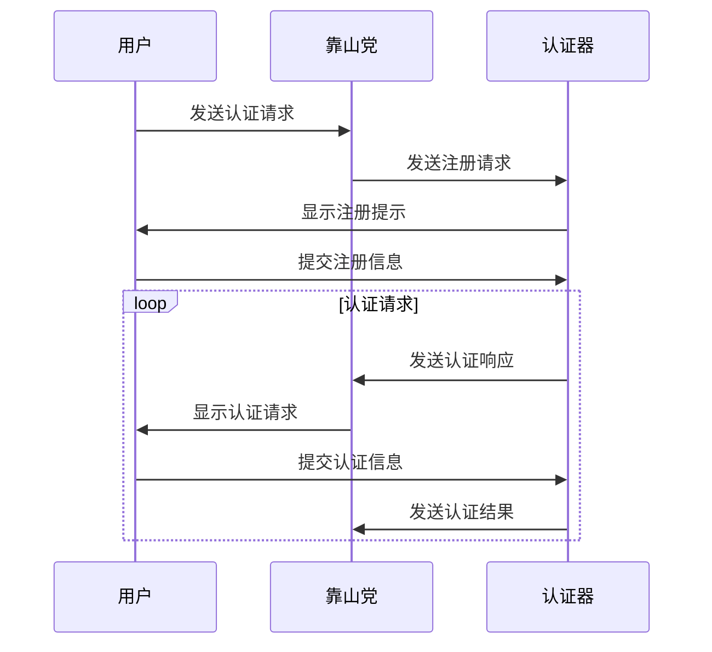

                 

## 文章标题: WebAuthn的基本原理

> 关键词：WebAuthn，认证，安全，签名算法，数字身份，多因素认证

> 摘要：本文将深入探讨WebAuthn的基本原理，从其产生背景、目标和优势，到其核心组成部分、认证机制，以及与相关技术的比较，全面解析WebAuthn的工作原理。此外，本文还将介绍WebAuthn的核心概念与联系，包括公钥加密与数字签名、JWT和COSE、U2F等，并运用Mermaid流程图展示WebAuthn的架构与流程。随后，本文将详细解释WebAuthn的核心算法原理，包括签名算法和验证算法，并介绍其抗重放攻击机制。最后，本文将通过实际项目实战，展示如何开发和使用WebAuthn，并提供相关的数学模型和公式，帮助读者深入理解WebAuthn的数学原理。文章还将讨论WebAuthn的未来发展趋势与挑战，为读者提供全面的WebAuthn知识。

## 《WebAuthn的基本原理》目录大纲

本文将分为以下几个部分，系统地介绍WebAuthn的基本原理：

1. **WebAuthn简介**：介绍WebAuthn的定义和背景，WebAuthn的目标和优势，以及与其它认证技术的比较。
2. **WebAuthn的核心概念与联系**：解释WebAuthn的关键概念，包括公钥加密与数字签名、JWT和COSE、U2F等，并使用Mermaid流程图展示WebAuthn的架构与流程。
3. **WebAuthn的核心算法原理**：详细解释WebAuthn的签名算法和验证算法，并介绍其抗重放攻击机制。
4. **WebAuthn的数学模型和数学公式**：介绍签名算法和验证算法的数学模型和数学公式，并进行详细的讲解和举例说明。
5. **WebAuthn项目实战**：通过实际项目实战，展示如何开发和使用WebAuthn，包括开发环境的搭建、代码实现和解读。
6. **WebAuthn的未来发展趋势与挑战**：讨论WebAuthn的未来发展趋势和面临的挑战。
7. **附录**：提供WebAuthn的开发工具与资源，包括主流WebAuthn库介绍、开发工具与调试工具，以及相关论文与文献。

通过以上七个部分的详细讲解，本文旨在为读者提供关于WebAuthn的全面、深入的理解和掌握。

## 第1章: WebAuthn简介

### 1.1 WebAuthn的定义和背景

WebAuthn，全称Web Authentication，是一种由W3C（World Wide Web Consortium，世界万维网联盟）和FIDO（Fast Identity Online，快速在线身份验证）联盟共同制定的标准。该标准的目的是提供一种简单、安全且用户友好的身份验证方法，旨在取代传统的用户名和密码认证方式。

#### 1.1.1 WebAuthn的产生背景

随着互联网的普及和发展，网络安全问题日益突出，传统的用户名和密码认证方式因其易受攻击（如暴力破解、密码泄露等）而逐渐暴露出其局限性。为了提高互联网安全，业界开始寻求更加安全、方便的认证方法。FIDO联盟于2012年发布了FIDO U2F（Universal 2nd Factor）标准，旨在通过使用硬件令牌（如USB key）进行身份验证。此后，随着Web技术的发展，FIDO联盟与W3C合作，于2019年发布了WebAuthn标准。

#### 1.1.2 WebAuthn的目标和优势

WebAuthn的目标是提供一种简单、安全、用户友好的身份验证方法，其主要优势包括：

1. **安全性**：WebAuthn采用公钥加密与数字签名技术，确保身份验证过程的安全性。
2. **便捷性**：用户无需记忆复杂的密码，只需使用简单的设备（如手机、指纹读取器、硬件令牌等）即可完成认证。
3. **多因素认证**：WebAuthn支持多因素认证，提高系统的安全性。
4. **跨平台性**：WebAuthn可在各种设备和操作系统上使用，包括PC、手机、平板等。

#### 1.1.3 WebAuthn与其他认证技术的比较

与传统的用户名和密码认证方式相比，WebAuthn具有更高的安全性。用户名和密码认证方式易受暴力破解、密码泄露等攻击，而WebAuthn通过硬件设备与操作系统深度集成，确保认证过程的安全。

与FIDO U2F认证相比，WebAuthn提供了更丰富的认证方式，包括指纹、面部识别等生物识别技术，并且支持跨平台使用。

### 1.2 WebAuthn的关键组成部分

WebAuthn的认证过程涉及多个关键组成部分，主要包括账户注册流程、登录认证流程和硬件安全模块（HSM）的使用。

#### 1.2.1 账户注册流程

账户注册流程是WebAuthn认证的第一步。在该流程中，用户需要创建一个与账号关联的公私钥对，并将公钥上传到服务器。具体步骤如下：

1. **生成公私钥对**：用户设备上的浏览器或认证器生成一个公私钥对。
2. **生成注册请求**：服务器生成一个注册请求，包括挑战（Challenge）和注册选项（Registration Options）。
3. **用户确认注册**：用户通过设备上的认证器确认注册请求，并生成响应（Registration Response）。
4. **上传公钥**：用户将公钥上传到服务器，服务器将公钥与账号关联。

#### 1.2.2 登录认证流程

登录认证流程是在用户完成账户注册后进行的。在该流程中，用户需要使用认证器生成一个签名，以证明其身份。具体步骤如下：

1. **生成认证请求**：服务器生成一个认证请求，包括挑战（Challenge）和认证选项（Authentication Options）。
2. **用户确认认证**：用户通过设备上的认证器确认认证请求，并生成响应（Authentication Response）。
3. **服务器验证签名**：服务器接收用户生成的响应，并验证签名是否有效。

#### 1.2.3 硬件安全模块（HSM）的使用

硬件安全模块（HSM）是一种专门用于保护密钥和执行加密运算的硬件设备。在WebAuthn中，HSM可用于提高认证过程的安全性。HSM具有以下功能：

1. **密钥存储**：HSM可安全地存储用户的公私钥对。
2. **加密运算**：HSM可执行加密运算，确保认证过程的安全性。
3. **硬件隔离**：HSM与用户设备隔离，防止攻击者获取用户密钥。

通过上述关键组成部分，WebAuthn实现了安全、便捷的身份验证，为互联网安全提供了有力保障。

### 1.3 WebAuthn的认证机制

WebAuthn的认证机制是其核心组成部分，主要包括签名算法、验证算法和抗重放攻击机制。

#### 1.3.1 签名算法

签名算法用于生成用户身份的数字签名。在WebAuthn中，常用的签名算法包括RSA和ECDSA。

- **RSA签名算法**：RSA签名算法基于大整数分解的难题，具有较高的安全性。其基本过程如下：
  1. 生成公私钥对：用户设备生成一个公私钥对。
  2. 签名：用户使用私钥对消息进行签名。
  3. 验证：服务器使用公钥验证签名是否有效。

- **ECDSA签名算法**：ECDSA签名算法是基于椭圆曲线离散对数的难题，其安全性较高，适用于对计算资源要求较高的场景。其基本过程如下：
  1. 生成公私钥对：用户设备生成一个公私钥对。
  2. 签名：用户使用私钥对消息进行签名。
  3. 验证：服务器使用公钥验证签名是否有效。

#### 1.3.2 验证算法

验证算法用于验证用户身份的数字签名。在WebAuthn中，常用的验证算法包括RSA和ECDSA。

- **RSA验证算法**：RSA验证算法与RSA签名算法类似，其基本过程如下：
  1. 接收签名：服务器接收用户发送的签名。
  2. 验证签名：服务器使用公钥验证签名是否有效。

- **ECDSA验证算法**：ECDSA验证算法与ECDSA签名算法类似，其基本过程如下：
  1. 接收签名：服务器接收用户发送的签名。
  2. 验证签名：服务器使用公钥验证签名是否有效。

#### 1.3.3 抗重放攻击机制

重放攻击是一种常见的网络攻击方式，其核心思想是攻击者捕获并重放合法数据包，从而欺骗系统。WebAuthn采用多种机制防止重放攻击：

1. **时间戳**：WebAuthn在认证过程中使用时间戳，确保认证请求的有效性。
2. **一次性挑战**：每次认证请求使用不同的挑战（Challenge），防止攻击者重放已捕获的认证请求。
3. **抗重放标记**：在认证请求和响应中包含抗重放标记（CancellationToken），确保认证请求和响应的一致性。

通过以上认证机制，WebAuthn实现了安全、可靠的身份验证，为互联网安全提供了重要保障。

### 1.4 小结

本章介绍了WebAuthn的定义和背景，包括其产生背景、目标和优势，以及与其它认证技术的比较。随后，本章详细介绍了WebAuthn的关键组成部分，包括账户注册流程、登录认证流程和硬件安全模块（HSM）的使用。最后，本章探讨了WebAuthn的认证机制，包括签名算法、验证算法和抗重放攻击机制。通过本章的学习，读者可以全面了解WebAuthn的基本原理和实现方式。

## 第2章: WebAuthn的核心概念与联系

在深入探讨WebAuthn的认证机制之前，首先需要了解其核心概念，这些概念是理解WebAuthn工作原理的基础。WebAuthn的核心概念包括公钥加密与数字签名、JWT（JSON Web Token）和COSE（Concise OAuth Security Tokens），以及U2F（Universal 2nd Factor）。通过这些概念的理解，我们可以更好地把握WebAuthn的安全性和便捷性。

### 2.1 WebAuthn的关键概念

#### 2.1.1 公钥加密与数字签名

公钥加密与数字签名是WebAuthn安全机制的核心。公钥加密是一种非对称加密技术，它使用一对密钥——公钥和私钥。公钥可以公开，而私钥必须保密。加密时，使用公钥加密的数据只能使用对应的私钥解密；解密时，使用私钥加密的数据只能使用对应的公钥解密。这种机制保证了数据的机密性。

数字签名是一种验证信息完整性和真实性的技术。数字签名通过将信息与私钥结合，生成一个签名，这个签名可以用于验证信息的来源和完整性。任何人都可以使用相应的公钥验证这个签名，但如果没有人知道私钥，那么签名就无法被伪造。这保证了信息的不可否认性。

#### 2.1.2 JWT（JSON Web Token）

JWT是一种基于JSON的开源标准，用于生成可在客户端和服务端之间安全传输的JSON对象。JWT的主要用途是作为身份验证信息在用户和服务端之间传输。一个JWT通常包含三个部分：头部（Header）、负载（Payload）和签名（Signature）。

- **头部**：包含JWT类型和加密算法的信息。
- **负载**：包含关于用户身份和其他信息的声明。
- **签名**：使用私钥加密头部和负载的哈希，确保JWT的完整性和真实性。

#### 2.1.3 COSE（Concise OAuth Security Tokens）

COSE是一种专为安全令牌设计的格式，它简化了JWT的结构，并专注于性能和安全性。COSE的主要目的是提供一种紧凑、易于处理的格式，用于WebAuthn中的认证请求和响应。COSE通过减少冗余信息和优化数据结构，提高了传输效率。

#### 2.1.4 U2F（Universal 2nd Factor）

U2F是一种基于硬件令牌的认证协议，它通过USB接口或Near Field Communication（NFC）进行认证。U2F是一种简单的多因素认证方法，它要求用户在输入密码之后使用U2F硬件令牌进行二次认证。这种双重认证机制提高了安全性，因为即使密码被泄露，攻击者也无法使用U2F硬件令牌进行认证。

### 2.2 WebAuthn的架构与流程

WebAuthn的架构与流程涉及多个组成部分，包括用户、服务器和认证器。通过理解这些组成部分和它们之间的交互，我们可以更好地理解WebAuthn的工作原理。

#### 2.2.1 WebAuthn的注册流程

WebAuthn的注册流程是用户首次使用WebAuthn进行认证时的步骤。以下是注册流程的详细步骤：

1. **用户请求注册**：用户访问需要注册的网站，并点击注册按钮。
2. **服务器生成注册请求**：服务器生成一个注册请求，包含一个挑战（Challenge）和一个注册选项（Registration Options）。
3. **认证器显示注册提示**：认证器（如USB key或生物识别设备）显示注册提示，请求用户进行注册。
4. **用户提交注册信息**：用户在认证器上确认注册请求，并输入相关信息（如用户名、用户ID等）。
5. **认证器生成注册响应**：认证器生成一个注册响应，包含用户的公钥和其他信息。
6. **用户上传注册响应**：用户将注册响应上传到服务器。
7. **服务器验证注册响应**：服务器验证注册响应中的签名和挑战，确保注册过程的合法性。

#### 2.2.2 WebAuthn的认证流程

WebAuthn的认证流程是用户在每次登录时进行的步骤。以下是认证流程的详细步骤：

1. **用户请求认证**：用户访问需要认证的网站，并点击登录按钮。
2. **服务器生成认证请求**：服务器生成一个认证请求，包含一个挑战（Challenge）和一个认证选项（Authentication Options）。
3. **认证器显示认证提示**：认证器显示认证提示，请求用户进行认证。
4. **用户提交认证信息**：用户在认证器上确认认证请求，并生成认证响应。
5. **用户上传认证响应**：用户将认证响应上传到服务器。
6. **服务器验证认证响应**：服务器验证认证响应中的签名和挑战，确保认证过程的合法性。

#### 2.2.3 WebAuthn与Mermaid流程图

为了更直观地展示WebAuthn的架构与流程，我们可以使用Mermaid流程图来描述注册和认证流程。

在这个流程图中，用户（User）通过浏览器（RelyingParty）与认证器（Authenticator）交互。注册流程包括用户请求注册、服务器生成注册请求、认证器显示注册提示、用户提交注册信息、服务器验证注册响应等步骤。认证流程包括用户请求认证、服务器生成认证请求、认证器显示认证提示、用户提交认证信息、服务器验证认证响应等步骤。

通过上述核心概念和流程图的介绍，我们可以对WebAuthn的工作原理有一个清晰的认识。WebAuthn通过公钥加密与数字签名、JWT、COSE和U2F等技术，实现了安全、便捷的身份验证，为互联网安全提供了强有力的保障。

### 2.3 WebAuthn与Mermaid流程图

为了更直观地展示WebAuthn的工作流程，我们可以使用Mermaid流程图来详细描绘其注册和认证流程。

在上述流程图中，用户（User）向靠山党（RelyingParty）发起认证请求。靠山党生成注册请求并发送给认证器（Authenticator）。认证器显示注册提示，用户在认证器上完成注册信息提交后，认证器将注册响应发送回靠山党。

在认证流程中，用户向靠山党发起认证请求。靠山党生成认证请求并发送给认证器。认证器显示认证提示，用户在认证器上完成认证信息提交后，认证器将认证响应发送回靠山党。靠山党验证认证响应的有效性，并返回认证结果。

通过Mermaid流程图，我们可以清晰地看到WebAuthn的注册和认证流程，这有助于我们更好地理解和应用WebAuthn技术。

### 2.4 小结

本章深入探讨了WebAuthn的核心概念与联系，包括公钥加密与数字签名、JWT和COSE，以及U2F。我们详细介绍了WebAuthn的架构与流程，并通过Mermaid流程图直观地展示了注册和认证流程。通过本章的学习，读者可以全面理解WebAuthn的工作原理和实现方法，为后续章节的学习打下坚实的基础。

## 第3章: WebAuthn的核心算法原理

WebAuthn的安全性和可靠性主要依赖于其核心算法，包括签名算法和验证算法。这些算法确保了用户身份的验证过程是安全且不可篡改的。在本章中，我们将详细解释WebAuthn所使用的签名算法和验证算法，并探讨其抗重放攻击机制。

### 3.1 签名算法原理

签名算法用于生成用户身份的数字签名，确保消息的完整性和真实性。在WebAuthn中，常用的签名算法包括RSA签名算法和ECDSA签名算法。

#### 3.1.1 RSA签名算法

RSA签名算法是一种非对称加密算法，其安全性基于大整数分解的难题。RSA签名算法的基本步骤如下：

1. **生成公私钥对**：首先，系统需要生成一对公私钥。公钥是公开的，任何人都可以获取；私钥是保密的，只有合法用户才能使用。

2. **签名过程**：
   - **哈希计算**：将需要签名的消息进行哈希计算，生成一个固定长度的哈希值。
   - **签名生成**：使用私钥对哈希值进行签名，生成签名。签名过程通常涉及模运算和指数运算。

   签名生成公式如下：
   $$
   S = (\text{hash}(m))^d \mod n
   $$
   其中，$m$ 是原文，$d$ 是私钥的解密指数，$n$ 是模数。

3. **签名验证**：
   - **哈希计算**：接收方首先对原文进行相同的哈希计算。
   - **验证签名**：使用公钥对签名进行验证。验证过程涉及模逆运算和模幂运算。

   验证公式如下：
   $$
   m' = (\text{hash}(S))^e \mod n
   $$
   其中，$e$ 是公钥的加密指数。

如果验证结果 $m'$ 与原文的哈希值匹配，则签名有效。

#### 3.1.2 ECDSA签名算法

ECDSA（Elliptic Curve Digital Signature Algorithm）是基于椭圆曲线离散对数问题的签名算法，其安全性也依赖于数学难题。ECDSA的步骤如下：

1. **生成公私钥对**：系统生成一对椭圆曲线上的公私钥。公钥是公开的，私钥是保密的。

2. **签名过程**：
   - **哈希计算**：对需要签名的消息进行哈希计算。
   - **签名生成**：私钥持有者选择一个随机数$k$，并使用椭圆曲线上的数学运算生成签名。

   签名生成公式如下：
   $$
   r = (\text{hash}(m) + k \cdot x) \mod n \\
   s = (r + k) \mod n
   $$
   其中，$r$ 和 $s$ 是签名的一部分，$x$ 是私钥的$x$坐标。

3. **签名验证**：
   - **哈希计算**：验证方对原文进行相同的哈希计算。
   - **验证签名**：使用椭圆曲线上的数学运算和公钥验证签名。

   验证公式如下：
   $$
   S' = (\text{hash}(m) + r \cdot s) \cdot s^{-1} \mod n
   $$
   如果$S'$落在椭圆曲线上，则签名有效。

### 3.2 验证算法原理

验证算法用于验证用户生成的签名是否有效。在WebAuthn中，验证算法与签名算法类似，但需要使用公钥和哈希值进行验证。

#### 3.2.1 RSA验证算法

RSA验证算法的过程与签名算法的验证过程类似，只是使用公钥和哈希值来验证签名。

1. **哈希计算**：验证方对原文进行相同的哈希计算。
2. **验证签名**：使用公钥对签名进行验证。

   验证公式如下：
   $$
   m' = (\text{hash}(S))^e \mod n
   $$
   如果验证结果$m'$与哈希值匹配，则签名有效。

#### 3.2.2 ECDSA验证算法

ECDSA验证算法的过程与签名算法的验证过程类似，只是使用公钥和哈希值来验证签名。

1. **哈希计算**：验证方对原文进行相同的哈希计算。
2. **验证签名**：使用公钥和椭圆曲线上的数学运算验证签名。

   验证公式如下：
   $$
   S' = (\text{hash}(m) + r \cdot s) \cdot s^{-1} \mod n
   $$
   如果验证结果$S'$落在椭圆曲线上，则签名有效。

### 3.3 WebAuthn的抗重放攻击机制

重放攻击是一种常见的网络攻击，攻击者捕获并重放合法的网络数据包，以欺骗系统。WebAuthn采用多种机制来防止重放攻击。

1. **时间戳**：WebAuthn在认证过程中使用时间戳，确保认证请求的有效性。服务器和认证器之间的时间戳差异需要小于一定阈值，否则认证将被拒绝。

2. **一次性挑战**：每次认证请求使用不同的挑战（Challenge），确保认证请求的唯一性。挑战值在认证过程中是随机生成的，无法被预测或重复使用。

3. **抗重放标记**：在认证请求和响应中包含抗重放标记（CancellationToken），确保认证请求和响应的一致性。认证器在生成响应时，将CancellationToken包含在内，服务器在验证响应时检查该标记是否一致。

通过上述机制，WebAuthn能够有效防止重放攻击，确保认证过程的安全性和可靠性。

### 3.4 小结

本章详细介绍了WebAuthn的核心算法原理，包括RSA签名算法和ECDSA签名算法，以及它们的验证算法。同时，我们还探讨了WebAuthn的抗重放攻击机制，这些机制确保了认证过程的安全性和可靠性。通过本章的学习，读者可以深入理解WebAuthn的工作原理，为实际应用打下坚实基础。

### 3.1 签名算法原理

签名算法是WebAuthn中确保数据完整性和真实性的关键技术。在WebAuthn中，主要使用的是RSA签名算法和ECDSA签名算法。以下将详细介绍这两种算法的原理及其应用。

#### 3.1.1 签名算法的基本概念

签名算法是一种利用公钥加密技术来保证数据完整性和真实性的方法。其基本概念包括：

- **公钥**：公钥是公开的密钥，可以由任何人获取。
- **私钥**：私钥是保密的密钥，只有合法的用户才能拥有。
- **哈希函数**：哈希函数用于将数据转换为一个固定长度的值，即哈希值。哈希值是唯一的，即使原始数据只有微小的变化，哈希值也会有很大的差异。

#### 3.1.2 RSA签名算法

RSA签名算法是一种基于大整数分解问题的非对称加密算法。其基本过程如下：

1. **生成公私钥对**：
   - 选择两个大素数 $p$ 和 $q$。
   - 计算模数 $n = p \times q$。
   - 计算欧拉函数 $\varphi(n) = (p - 1) \times (q - 1)$。
   - 选择一个小于 $\varphi(n)$ 的整数 $e$，使得 $e$ 和 $\varphi(n)$ 互质。
   - 计算私钥的解密指数 $d$，使得 $d \times e \mod \varphi(n) = 1$。
   - 公钥 $(n, e)$ 和私钥 $(n, d)$ 生成完毕。

2. **签名过程**：
   - 对待签名的数据 $m$ 进行哈希计算，得到哈希值 $h = \text{hash}(m)$。
   - 计算签名 $S = h^d \mod n$。

3. **验证过程**：
   - 对待验证的数据 $m$ 进行哈希计算，得到哈希值 $h = \text{hash}(m)$。
   - 计算验证值 $h' = S^e \mod n$。
   - 如果 $h' = h$，则签名有效。

#### 3.1.3 ECDSA签名算法

ECDSA（Elliptic Curve Digital Signature Algorithm）是一种基于椭圆曲线加密算法的签名算法。其基本过程如下：

1. **生成公私钥对**：
   - 选择一个椭圆曲线 $E$ 和一个基点 $G$。
   - 选择一个随机数 $k$，使得 $k$ 和椭圆曲线的阶 $n$ 互质。
   - 计算公钥 $Q = kG$。
   - 私钥为 $k$。

2. **签名过程**：
   - 对待签名的数据 $m$ 进行哈希计算，得到哈希值 $h = \text{hash}(m)$。
   - 选择一个随机数 $r$，使得 $r$ 和椭圆曲线的阶 $n$ 互质。
   - 计算签名 $s = (r + k \cdot s^{-1} \mod n)$。

3. **验证过程**：
   - 对待验证的数据 $m$ 进行哈希计算，得到哈希值 $h = \text{hash}(m)$。
   - 计算验证值 $w = s^{-1} \mod n$。
   - 计算验证值 $r' = (h + w \cdot s) \mod n$ 和 $s' = (h + w \cdot r) \mod n$。
   - 如果 $r' = r$ 且 $s' = s$，则签名有效。

通过上述签名算法，WebAuthn确保了认证过程的安全性和可靠性。RSA签名算法因其安全性较高且易于实现，常用于需要较高安全级别的场景；而ECDSA签名算法则因其性能优越，更适合资源受限的场景。

### 3.2 验证算法原理

验证算法用于验证用户生成的签名是否有效，确保数据的完整性和真实性。在WebAuthn中，验证算法与签名算法类似，但使用的是公钥和哈希值。以下将详细介绍RSA验证算法和ECDSA验证算法的原理。

#### 3.2.1 RSA验证算法

RSA验证算法用于验证使用私钥签名的数据。其基本原理如下：

1. **哈希计算**：
   - 对待验证的数据 $m$ 进行哈希计算，得到哈希值 $h = \text{hash}(m)$。

2. **验证过程**：
   - 使用公钥 $(n, e)$ 对签名 $S$ 进行验证。
   - 计算验证值 $h' = S^e \mod n$。
   - 如果 $h' = h$，则签名有效。

   验证公式如下：
   $$
   h' = S^e \mod n
   $$
   其中，$e$ 是公钥的加密指数，$n$ 是模数。

#### 3.2.2 ECDSA验证算法

ECDSA验证算法用于验证使用私钥签名的数据。其基本原理如下：

1. **哈希计算**：
   - 对待验证的数据 $m$ 进行哈希计算，得到哈希值 $h = \text{hash}(m)$。

2. **验证过程**：
   - 使用公钥 $Q$ 对签名 $(r, s)$ 进行验证。
   - 计算验证值 $w = s^{-1} \mod n$。
   - 计算验证值 $r' = (h + w \cdot s) \mod n$ 和 $s' = (h + w \cdot r) \mod n$。
   - 如果 $r' = r$ 且 $s' = s$，则签名有效。

   验证公式如下：
   $$
   r' = (h + w \cdot s) \mod n \\
   s' = (h + w \cdot r) \mod n
   $$
   其中，$w$ 是 $s$ 的模逆，$r$ 和 $s$ 是签名的一部分，$n$ 是椭圆曲线的阶。

通过上述验证算法，WebAuthn能够确保签名的有效性和数据的完整性。RSA验证算法因其实现简单且安全性高，适用于多种场景；而ECDSA验证算法因其性能优越，更适合资源受限的环境。

### 3.3 WebAuthn抗重放攻击机制

重放攻击是一种常见的安全攻击，攻击者通过捕获并重复发送合法的数据包，以欺骗系统。WebAuthn采用多种机制来防止重放攻击，确保认证过程的安全性。

#### 3.3.1 重放攻击的概念

重放攻击的基本原理是攻击者捕获网络中的合法数据包，并在稍后的时间内重新发送这些数据包，以欺骗系统。例如，攻击者可以捕获用户的一次登录请求，然后在用户尝试重新登录时发送这个请求，导致系统误认为这是一个新的登录请求。

#### 3.3.2 WebAuthn的抗重放攻击机制

WebAuthn采用多种机制来防止重放攻击：

1. **时间戳**：WebAuthn在认证过程中使用时间戳，确保认证请求的有效性。服务器和认证器之间的时间戳差异需要小于一定阈值，否则认证将被拒绝。

2. **一次性挑战**：WebAuthn每次认证请求都使用一个唯一的挑战值（Challenge），确保认证请求的唯一性。挑战值是随机生成的，无法被预测或重复使用。

3. **抗重放标记**：WebAuthn在认证请求和响应中包含一个抗重放标记（CancellationToken）。认证器在生成响应时，将CancellationToken包含在内，服务器在验证响应时检查该标记是否一致。

通过上述机制，WebAuthn能够有效防止重放攻击，确保认证过程的安全性和可靠性。

### 3.4 小结

本章详细介绍了WebAuthn的签名算法和验证算法，包括RSA签名算法和ECDSA签名算法，以及它们的验证过程。同时，我们还探讨了WebAuthn的抗重放攻击机制，确保认证过程的安全性和可靠性。通过本章的学习，读者可以深入理解WebAuthn的工作原理，为实际应用打下坚实基础。

### 3.1 签名算法原理

签名算法在WebAuthn中扮演着至关重要的角色，其核心目的是确保数据的完整性和身份的真实性。在WebAuthn中，常用的签名算法包括RSA和ECDSA，这两种算法都基于复杂的数学问题，使得伪造签名变得极其困难。

#### 3.1.1 签名算法的基本概念

签名算法的基本原理涉及两个密钥——公钥和私钥。公钥可以公开分享，而私钥必须保密。签名过程如下：

1. **生成公私钥对**：首先，系统生成一对公私钥。这个过程包括选择两个大素数，计算模数和欧拉函数，以及选择加密指数和解密指数。

2. **哈希计算**：待签名数据首先通过哈希函数转换为固定长度的哈希值。哈希函数的选择对签名算法的安全性至关重要。

3. **签名生成**：使用私钥对哈希值进行签名，生成签名。这个过程通常涉及复杂的数学运算，如模运算和指数运算。

4. **签名验证**：接收方使用公钥对签名进行验证，以确认数据的完整性和真实性。

#### 3.1.2 RSA签名算法

RSA（Rivest-Shamir-Adleman）签名算法是一种基于大整数分解问题的非对称加密算法。其步骤如下：

1. **生成公私钥对**：
   - 选择两个大素数 $p$ 和 $q$。
   - 计算模数 $n = p \times q$。
   - 计算欧拉函数 $\varphi(n) = (p - 1) \times (q - 1)$。
   - 选择一个小于 $\varphi(n)$ 的整数 $e$，使得 $e$ 和 $\varphi(n)$ 互质。
   - 计算私钥的解密指数 $d$，使得 $d \times e \mod \varphi(n) = 1$。
   - 公钥 $(n, e)$ 和私钥 $(n, d)$ 生成完毕。

2. **签名过程**：
   - 对待签名的数据 $m$ 进行哈希计算，得到哈希值 $h = \text{hash}(m)$。
   - 计算签名 $S = h^d \mod n$。

3. **验证过程**：
   - 对待验证的数据 $m$ 进行哈希计算，得到哈希值 $h = \text{hash}(m)$。
   - 计算验证值 $h' = S^e \mod n$。
   - 如果 $h' = h$，则签名有效。

#### 3.1.3 ECDSA签名算法

ECDSA（Elliptic Curve Digital Signature Algorithm）是一种基于椭圆曲线加密算法的签名算法。其步骤如下：

1. **生成公私钥对**：
   - 选择一个椭圆曲线 $E$ 和一个基点 $G$。
   - 选择一个随机数 $k$，使得 $k$ 和椭圆曲线的阶 $n$ 互质。
   - 计算公钥 $Q = kG$。
   - 私钥为 $k$。

2. **签名过程**：
   - 对待签名的数据 $m$ 进行哈希计算，得到哈希值 $h = \text{hash}(m)$。
   - 选择一个随机数 $r$，使得 $r$ 和椭圆曲线的阶 $n$ 互质。
   - 计算签名 $s = (r + k \cdot s^{-1} \mod n)$。

3. **验证过程**：
   - 对待验证的数据 $m$ 进行哈希计算，得到哈希值 $h = \text{hash}(m)$。
   - 计算验证值 $w = s^{-1} \mod n$。
   - 计算验证值 $r' = (h + w \cdot s) \mod n$ 和 $s' = (h + w \cdot r) \mod n$。
   - 如果 $r' = r$ 且 $s' = s$，则签名有效。

通过RSA和ECDSA签名算法，WebAuthn能够确保数据的完整性和真实性，从而提供强大的安全保障。

### 3.2 验证算法原理

验证算法是WebAuthn中确保签名有效性的重要环节。其核心任务是确认接收到的签名是否由对应的私钥生成，并且没有被篡改。以下将详细介绍RSA验证算法和ECDSA验证算法的原理。

#### 3.2.1 RSA验证算法

RSA验证算法的基本原理与RSA签名算法的验证过程类似，只是使用公钥和哈希值进行验证。具体步骤如下：

1. **哈希计算**：首先，对待验证的数据 $m$ 进行哈希计算，得到哈希值 $h = \text{hash}(m)$。

2. **验证过程**：
   - 使用公钥 $(n, e)$ 对签名 $S$ 进行验证。
   - 计算验证值 $h' = S^e \mod n$。
   - 比较验证值 $h'$ 和哈希值 $h$ 是否相等。

   如果 $h' = h$，则签名有效。

   验证公式如下：
   $$
   h' = S^e \mod n
   $$
   其中，$e$ 是公钥的加密指数，$n$ 是模数。

#### 3.2.2 ECDSA验证算法

ECDSA验证算法是基于椭圆曲线加密算法的验证算法。其原理与ECDSA签名算法的验证过程相似，主要步骤如下：

1. **哈希计算**：首先，对待验证的数据 $m$ 进行哈希计算，得到哈希值 $h = \text{hash}(m)$。

2. **验证过程**：
   - 使用公钥 $Q$ 对签名 $(r, s)$ 进行验证。
   - 计算验证值 $w = s^{-1} \mod n$。
   - 计算验证值 $r' = (h + w \cdot s) \mod n$ 和 $s' = (h + w \cdot r) \mod n$。
   - 检查 $r' = r$ 和 $s' = s$ 是否成立。

   如果验证值满足上述条件，则签名有效。

   验证公式如下：
   $$
   r' = (h + w \cdot s) \mod n \\
   s' = (h + w \cdot r) \mod n
   $$
   其中，$w$ 是 $s$ 的模逆，$r$ 和 $s$ 是签名的一部分，$n$ 是椭圆曲线的阶。

通过RSA和ECDSA验证算法，WebAuthn能够确保接收到的签名是有效的，从而保证认证过程的安全性和可靠性。

### 3.3 WebAuthn抗重放攻击机制

重放攻击是一种常见的安全攻击，攻击者通过捕获并重复发送合法的网络数据包来欺骗系统。为了防止这种攻击，WebAuthn采用了一系列抗重放攻击的机制，确保认证过程的安全性和完整性。

#### 3.3.1 重放攻击的概念

重放攻击的基本原理是攻击者捕获网络中的数据包（如认证请求或响应），然后在一个新的时间点重新发送这些数据包，试图欺骗系统。例如，攻击者可以捕获用户的一次登录请求，并在用户尝试重新登录时发送这个请求，从而误导系统认为这是一个新的登录请求。

#### 3.3.2 WebAuthn的抗重放攻击机制

WebAuthn采用了多种机制来防止重放攻击，确保认证过程的安全性。以下是一些关键的抗重放攻击机制：

1. **一次性挑战**：每次认证请求都会生成一个唯一的挑战值（Challenge）。这个挑战值是一个随机字符串，用于确保认证请求的唯一性。攻击者无法预测或重复使用这个挑战值，从而无法进行有效的重放攻击。

2. **时间戳**：WebAuthn使用时间戳来确保认证请求的有效性。服务器和认证器之间的时间戳差异必须小于一定阈值，否则认证将被拒绝。这样可以防止攻击者使用旧的请求来欺骗系统。

3. **抗重放标记**：在认证请求和响应中，WebAuthn包含一个抗重放标记（CancellationToken）。认证器在生成响应时，会将这个标记包含在内。服务器在验证响应时，会检查这个标记是否与请求中的标记一致。如果标记不一致，则拒绝认证请求。

通过这些机制，WebAuthn能够有效防止重放攻击，确保认证过程的安全性和可靠性。

### 3.4 小结

本章详细介绍了WebAuthn的签名算法和验证算法，包括RSA和ECDSA两种签名算法及其验证过程。同时，还探讨了WebAuthn的抗重放攻击机制，这些机制确保了认证过程的安全性和可靠性。通过本章的学习，读者可以深入理解WebAuthn的工作原理，为实际应用打下坚实基础。

### 3.1 签名算法原理

签名算法是WebAuthn安全机制的核心，它确保了数据的完整性和身份验证的真实性。WebAuthn主要采用两种签名算法：RSA和ECDSA。以下将详细解释这两种算法的基本原理。

#### 3.1.1 RSA签名算法

RSA（Rivest-Shamir-Adleman）签名算法是一种基于非对称加密的数字签名算法，其安全性依赖于大整数分解的数学难题。RSA签名算法的基本步骤如下：

1. **密钥生成**：
   - **选择两个大素数** $p$ 和 $q$。
   - **计算模数** $n = p \times q$。
   - **计算欧拉函数** $\varphi(n) = (p - 1) \times (q - 1)$。
   - **选择一个与 $\varphi(n)$ 互质的整数** $e$，通常选择小于 $\varphi(n)$ 的小素数。
   - **计算私钥的解密指数** $d$，使得 $d \times e \mod \varphi(n) = 1$。
   - 公钥为 $(n, e)$，私钥为 $(n, d)$。

2. **签名过程**：
   - **哈希计算**：对需要签名的消息 $m$ 进行哈希计算，得到哈希值 $h = \text{hash}(m)$。
   - **生成签名**：计算签名 $S = h^d \mod n$。

3. **验证过程**：
   - **哈希计算**：对消息 $m$ 进行相同的哈希计算，得到哈希值 $h = \text{hash}(m)$。
   - **验证签名**：计算验证值 $h' = S^e \mod n$。
   - **比较验证结果**：如果 $h' = h$，则签名有效。

   RSA签名算法的数学模型可以表示为：
   $$
   S = h^d \mod n
   $$
   验证公式为：
   $$
   h' = S^e \mod n
   $$

#### 3.1.2 ECDSA签名算法

ECDSA（Elliptic Curve Digital Signature Algorithm）是一种基于椭圆曲线加密算法的数字签名算法，其安全性依赖于椭圆曲线离散对数问题的难度。ECDSA签名算法的基本步骤如下：

1. **密钥生成**：
   - **选择一个椭圆曲线** $E$ 和一个基点 $G$。
   - **选择一个随机数** $k$，使得 $k$ 和椭圆曲线的阶 $n$ 互质。
   - **计算公钥** $Q = kG$。
   - 私钥为 $k$。

2. **签名过程**：
   - **哈希计算**：对需要签名的消息 $m$ 进行哈希计算，得到哈希值 $h = \text{hash}(m)$。
   - **选择随机数** $r$，使得 $r$ 和椭圆曲线的阶 $n$ 互质。
   - **计算签名**：计算签名 $(r, s)$，其中 $s = (r + k^{-1} \cdot h) \mod n$。

3. **验证过程**：
   - **哈希计算**：对消息 $m$ 进行相同的哈希计算，得到哈希值 $h = \text{hash}(m)$。
   - **验证签名**：计算验证值 $(r', s')$，其中 $r' = (h + s \cdot k^{-1}) \mod n$ 和 $s' = (r + k^{-1} \cdot h) \mod n$。
   - **比较验证结果**：如果 $r' = r$ 且 $s' = s$，则签名有效。

   ECDSA签名算法的数学模型可以表示为：
   $$
   r = (h + k \cdot x) \mod n
   $$
   $$
   s = (r + k \cdot s^{-1} \mod n)
   $$
   验证公式为：
   $$
   r' = (h + s \cdot k^{-1}) \mod n
   $$
   $$
   s' = (r + k^{-1} \cdot h) \mod n
   $$

通过RSA和ECDSA签名算法，WebAuthn能够确保数据的完整性和真实性，从而提供强大的安全保障。

### 3.2 验证算法原理

验证算法是WebAuthn安全机制中的另一个关键部分，它用于验证用户生成的签名是否有效。WebAuthn支持两种主要的验证算法：RSA验证算法和ECDSA验证算法。以下将详细介绍这两种算法的原理。

#### 3.2.1 RSA验证算法

RSA验证算法用于验证由RSA签名算法生成的签名。其基本原理和步骤如下：

1. **哈希计算**：首先，对需要验证的消息 $m$ 进行哈希计算，得到哈希值 $h = \text{hash}(m)$。

2. **验证过程**：
   - 使用公钥 $(n, e)$ 对签名 $S$ 进行验证。
   - 计算验证值 $h' = S^e \mod n$。
   - 比较验证值 $h'$ 和哈希值 $h$ 是否相等。

   如果 $h' = h$，则签名有效。

   RSA验证算法的数学模型可以表示为：
   $$
   h' = S^e \mod n
   $$
   其中，$e$ 是公钥的加密指数，$n$ 是模数。

#### 3.2.2 ECDSA验证算法

ECDSA验证算法用于验证由ECDSA签名算法生成的签名。其基本原理和步骤如下：

1. **哈希计算**：首先，对需要验证的消息 $m$ 进行哈希计算，得到哈希值 $h = \text{hash}(m)$。

2. **验证过程**：
   - 使用公钥 $Q$ 对签名 $(r, s)$ 进行验证。
   - 计算验证值 $w = s^{-1} \mod n$。
   - 计算验证值 $r' = (h + w \cdot s) \mod n$ 和 $s' = (h + w \cdot r) \mod n$。
   - 检查 $r' = r$ 和 $s' = s$ 是否成立。

   如果 $r' = r$ 且 $s' = s$，则签名有效。

   ECDSA验证算法的数学模型可以表示为：
   $$
   r' = (h + w \cdot s) \mod n
   $$
   $$
   s' = (h + w \cdot r) \mod n
   $$
   其中，$w$ 是 $s$ 的模逆，$r$ 和 $s$ 是签名的一部分，$n$ 是椭圆曲线的阶。

通过RSA和ECDSA验证算法，WebAuthn能够确保接收到的签名是有效的，从而保证认证过程的安全性和完整性。

### 3.3 WebAuthn抗重放攻击机制

重放攻击是一种常见的网络攻击，攻击者通过捕获并重复发送合法的网络数据包来欺骗系统。为了防止这种攻击，WebAuthn采用了多种机制来确保认证过程的安全性和完整性。

#### 3.3.1 重放攻击的概念

重放攻击的基本原理是攻击者捕获网络中的合法数据包，然后在稍后的时间重新发送这些数据包，试图欺骗系统。例如，攻击者可以捕获用户的一次登录请求，在用户尝试重新登录时发送这个请求，使得系统误认为这是一个新的登录请求。

#### 3.3.2 WebAuthn的抗重放攻击机制

WebAuthn采用了以下几种机制来防止重放攻击：

1. **一次性挑战**：WebAuthn在认证过程中使用一次性挑战值（Challenge），每次认证请求都生成一个新的挑战值。这个挑战值是随机生成的，无法被预测或重复使用。

2. **时间戳**：WebAuthn在认证过程中使用时间戳，确保认证请求的有效性。服务器和认证器之间的时间戳差异必须小于一定阈值，否则认证将被拒绝。

3. **抗重放标记**：WebAuthn在认证请求和响应中包含一个抗重放标记（CancellationToken）。认证器在生成响应时，会将这个标记包含在内。服务器在验证响应时，会检查这个标记是否与请求中的标记一致。如果标记不一致，则拒绝认证请求。

通过这些机制，WebAuthn能够有效防止重放攻击，确保认证过程的安全性和可靠性。

### 3.4 小结

本章详细介绍了WebAuthn的签名算法和验证算法，包括RSA和ECDSA两种算法的基本原理。同时，还探讨了WebAuthn的抗重放攻击机制，这些机制确保了认证过程的安全性和可靠性。通过本章的学习，读者可以深入理解WebAuthn的工作原理，为实际应用打下坚实基础。

### 3.1 签名算法原理

签名算法是WebAuthn安全机制的核心，用于确保数据的完整性和身份的真实性。WebAuthn主要采用两种签名算法：RSA和ECDSA。以下是这两种算法的基本原理和步骤。

#### 3.1.1 RSA签名算法

RSA签名算法是一种非对称加密算法，其安全性基于大整数分解的难题。其基本步骤如下：

1. **密钥生成**：
   - 选择两个大素数 $p$ 和 $q$。
   - 计算模数 $n = p \times q$。
   - 计算欧拉函数 $\varphi(n) = (p - 1) \times (q - 1)$。
   - 选择一个与 $\varphi(n)$ 互质的整数 $e$，通常选择小于 $\varphi(n)$ 的小素数。
   - 计算私钥的解密指数 $d$，使得 $d \times e \mod \varphi(n) = 1$。
   - 公钥为 $(n, e)$，私钥为 $(n, d)$。

2. **签名过程**：
   - 对待签名的消息 $m$ 进行哈希计算，得到哈希值 $h = \text{hash}(m)$。
   - 计算签名 $S = h^d \mod n$。

3. **验证过程**：
   - 对待验证的消息 $m$ 进行哈希计算，得到哈希值 $h = \text{hash}(m)$。
   - 计算验证值 $h' = S^e \mod n$。
   - 比较验证值 $h'$ 和哈希值 $h$ 是否相等。

   RSA签名算法的数学模型可以表示为：
   $$
   S = h^d \mod n
   $$
   验证公式为：
   $$
   h' = S^e \mod n
   $$

#### 3.1.2 ECDSA签名算法

ECDSA签名算法是一种基于椭圆曲线加密算法的数字签名算法，其安全性基于椭圆曲线离散对数问题的难度。其基本步骤如下：

1. **密钥生成**：
   - 选择一个椭圆曲线 $E$ 和一个基点 $G$。
   - 选择一个随机数 $k$，使得 $k$ 和椭圆曲线的阶 $n$ 互质。
   - 计算公钥 $Q = kG$。
   - 私钥为 $k$。

2. **签名过程**：
   - 对待签名的消息 $m$ 进行哈希计算，得到哈希值 $h = \text{hash}(m)$。
   - 选择一个随机数 $r$，使得 $r$ 和椭圆曲线的阶 $n$ 互质。
   - 计算签名 $s = (r + k^{-1} \cdot h) \mod n$。

3. **验证过程**：
   - 对待验证的消息 $m$ 进行哈希计算，得到哈希值 $h = \text{hash}(m)$。
   - 计算验证值 $r' = (h + s \cdot k^{-1}) \mod n$ 和 $s' = (h + r \cdot k^{-1}) \mod n$。
   - 检查 $r' = r$ 和 $s' = s$ 是否成立。

   ECDSA签名算法的数学模型可以表示为：
   $$
   r = (h + k \cdot x) \mod n
   $$
   $$
   s = (r + k \cdot s^{-1} \mod n)
   $$
   验证公式为：
   $$
   r' = (h + s \cdot k^{-1}) \mod n
   $$
   $$
   s' = (h + r \cdot k^{-1}) \mod n
   $$

通过RSA和ECDSA签名算法，WebAuthn能够确保数据的完整性和真实性，从而提供强大的安全保障。

### 3.2 验证算法原理

验证算法是WebAuthn安全机制中的另一个关键部分，用于验证用户生成的签名是否有效。WebAuthn支持两种主要的验证算法：RSA验证算法和ECDSA验证算法。以下是这两种算法的详细原理。

#### 3.2.1 RSA验证算法

RSA验证算法用于验证由RSA签名算法生成的签名。其基本原理和步骤如下：

1. **哈希计算**：
   - 对待验证的消息 $m$ 进行哈希计算，得到哈希值 $h = \text{hash}(m)$。

2. **验证过程**：
   - 使用公钥 $(n, e)$ 对签名 $S$ 进行验证。
   - 计算验证值 $h' = S^e \mod n$。
   - 比较验证值 $h'$ 和哈希值 $h$ 是否相等。

   如果 $h' = h$，则签名有效。

   RSA验证算法的数学模型可以表示为：
   $$
   h' = S^e \mod n
   $$

#### 3.2.2 ECDSA验证算法

ECDSA验证算法用于验证由ECDSA签名算法生成的签名。其基本原理和步骤如下：

1. **哈希计算**：
   - 对待验证的消息 $m$ 进行哈希计算，得到哈希值 $h = \text{hash}(m)$。

2. **验证过程**：
   - 使用公钥 $Q$ 对签名 $(r, s)$ 进行验证。
   - 计算验证值 $r' = (h + s \cdot k^{-1}) \mod n$ 和 $s' = (h + r \cdot k^{-1}) \mod n$。
   - 检查 $r' = r$ 和 $s' = s$ 是否成立。

   如果 $r' = r$ 且 $s' = s$，则签名有效。

   ECDSA验证算法的数学模型可以表示为：
   $$
   r' = (h + s \cdot k^{-1}) \mod n
   $$
   $$
   s' = (h + r \cdot k^{-1}) \mod n
   $$

通过RSA和ECDSA验证算法，WebAuthn能够确保接收到的签名是有效的，从而保证认证过程的安全性和完整性。

### 3.3 WebAuthn抗重放攻击机制

重放攻击是一种常见的网络攻击，攻击者通过捕获并重复发送合法的网络数据包来欺骗系统。为了防止这种攻击，WebAuthn采用了多种机制来确保认证过程的安全性和完整性。

#### 3.3.1 重放攻击的概念

重放攻击的基本原理是攻击者捕获网络中的合法数据包（如认证请求或响应），然后在稍后的时间重新发送这些数据包，试图欺骗系统。例如，攻击者可以捕获用户的一次登录请求，在用户尝试重新登录时发送这个请求，使得系统误认为这是一个新的登录请求。

#### 3.3.2 WebAuthn的抗重放攻击机制

WebAuthn采用了以下几种机制来防止重放攻击：

1. **一次性挑战**：WebAuthn在认证过程中使用一次性挑战值（Challenge），每次认证请求都生成一个新的挑战值。这个挑战值是随机生成的，无法被预测或重复使用。

2. **时间戳**：WebAuthn在认证过程中使用时间戳，确保认证请求的有效性。服务器和认证器之间的时间戳差异必须小于一定阈值，否则认证将被拒绝。

3. **抗重放标记**：WebAuthn在认证请求和响应中包含一个抗重放标记（CancellationToken）。认证器在生成响应时，会将这个标记包含在内。服务器在验证响应时，会检查这个标记是否与请求中的标记一致。如果标记不一致，则拒绝认证请求。

通过这些机制，WebAuthn能够有效防止重放攻击，确保认证过程的安全性和可靠性。

### 3.4 小结

本章详细介绍了WebAuthn的签名算法和验证算法，包括RSA和ECDSA两种算法的基本原理。同时，还探讨了WebAuthn的抗重放攻击机制，这些机制确保了认证过程的安全性和可靠性。通过本章的学习，读者可以深入理解WebAuthn的工作原理，为实际应用打下坚实基础。

### 3.1 签名算法原理

签名算法在WebAuthn中起着至关重要的作用，它确保了数据的完整性和身份验证的真实性。在WebAuthn中，主要使用的是RSA和ECDSA两种签名算法。以下将详细介绍这两种算法的原理和应用。

#### 3.1.1 RSA签名算法

RSA签名算法是一种基于非对称加密的数字签名算法，其安全性依赖于大整数分解的数学难题。RSA签名算法的基本步骤如下：

1. **密钥生成**：
   - 选择两个大素数 $p$ 和 $q$。
   - 计算模数 $n = p \times q$。
   - 计算欧拉函数 $\varphi(n) = (p - 1) \times (q - 1)$。
   - 选择一个与 $\varphi(n)$ 互质的整数 $e$，通常选择小于 $\varphi(n)$ 的小素数。
   - 计算私钥的解密指数 $d$，使得 $d \times e \mod \varphi(n) = 1$。
   - 公钥为 $(n, e)$，私钥为 $(n, d)$。

2. **签名过程**：
   - 对待签名的消息 $m$ 进行哈希计算，得到哈希值 $h = \text{hash}(m)$。
   - 计算签名 $S = h^d \mod n$。

3. **验证过程**：
   - 对待验证的消息 $m$ 进行哈希计算，得到哈希值 $h = \text{hash}(m)$。
   - 计算验证值 $h' = S^e \mod n$。
   - 比较验证值 $h'$ 和哈希值 $h$ 是否相等。

   如果 $h' = h$，则签名有效。

   RSA签名算法的数学模型可以表示为：
   $$
   S = h^d \mod n
   $$
   验证公式为：
   $$
   h' = S^e \mod n
   $$

#### 3.1.2 ECDSA签名算法

ECDSA签名算法是一种基于椭圆曲线加密算法的数字签名算法，其安全性依赖于椭圆曲线离散对数问题的难度。ECDSA签名算法的基本步骤如下：

1. **密钥生成**：
   - 选择一个椭圆曲线 $E$ 和一个基点 $G$。
   - 选择一个随机数 $k$，使得 $k$ 和椭圆曲线的阶 $n$ 互质。
   - 计算公钥 $Q = kG$。
   - 私钥为 $k$。

2. **签名过程**：
   - 对待签名的消息 $m$ 进行哈希计算，得到哈希值 $h = \text{hash}(m)$。
   - 选择一个随机数 $r$，使得 $r$ 和椭圆曲线的阶 $n$ 互质。
   - 计算签名 $s = (r + k^{-1} \cdot h) \mod n$。

3. **验证过程**：
   - 对待验证的消息 $m$ 进行哈希计算，得到哈希值 $h = \text{hash}(m)$。
   - 计算验证值 $r' = (h + s \cdot k^{-1}) \mod n$ 和 $s' = (h + r \cdot k^{-1}) \mod n$。
   - 检查 $r' = r$ 和 $s' = s$ 是否成立。

   如果 $r' = r$ 且 $s' = s$，则签名有效。

   ECDSA签名算法的数学模型可以表示为：
   $$
   r = (h + k \cdot x) \mod n
   $$
   $$
   s = (r + k \cdot s^{-1} \mod n)
   $$
   验证公式为：
   $$
   r' = (h + s \cdot k^{-1}) \mod n
   $$
   $$
   s' = (h + r \cdot k^{-1}) \mod n
   $$

通过RSA和ECDSA签名算法，WebAuthn能够确保数据的完整性和真实性，从而提供强大的安全保障。

### 3.2 验证算法原理

验证算法是WebAuthn安全机制中的另一个关键部分，用于验证用户生成的签名是否有效。WebAuthn支持两种主要的验证算法：RSA验证算法和ECDSA验证算法。以下是这两种算法的详细原理和应用。

#### 3.2.1 RSA验证算法

RSA验证算法用于验证由RSA签名算法生成的签名。其基本原理和步骤如下：

1. **哈希计算**：
   - 对待验证的消息 $m$ 进行哈希计算，得到哈希值 $h = \text{hash}(m)$。

2. **验证过程**：
   - 使用公钥 $(n, e)$ 对签名 $S$ 进行验证。
   - 计算验证值 $h' = S^e \mod n$。
   - 比较验证值 $h'$ 和哈希值 $h$ 是否相等。

   如果 $h' = h$，则签名有效。

   RSA验证算法的数学模型可以表示为：
   $$
   h' = S^e \mod n
   $$

#### 3.2.2 ECDSA验证算法

ECDSA验证算法用于验证由ECDSA签名算法生成的签名。其基本原理和步骤如下：

1. **哈希计算**：
   - 对待验证的消息 $m$ 进行哈希计算，得到哈希值 $h = \text{hash}(m)$。

2. **验证过程**：
   - 使用公钥 $Q$ 对签名 $(r, s)$ 进行验证。
   - 计算验证值 $r' = (h + s \cdot k^{-1}) \mod n$ 和 $s' = (h + r \cdot k^{-1}) \mod n$。
   - 检查 $r' = r$ 和 $s' = s$ 是否成立。

   如果 $r' = r$ 且 $s' = s$，则签名有效。

   ECDSA验证算法的数学模型可以表示为：
   $$
   r' = (h + s \cdot k^{-1}) \mod n
   $$
   $$
   s' = (h + r \cdot k^{-1}) \mod n
   $$

通过RSA和ECDSA验证算法，WebAuthn能够确保接收到的签名是有效的，从而保证认证过程的安全性和完整性。

### 3.3 WebAuthn抗重放攻击机制

重放攻击是一种常见的网络攻击，攻击者通过捕获并重复发送合法的网络数据包来欺骗系统。为了防止这种攻击，WebAuthn采用了多种机制来确保认证过程的安全性和完整性。

#### 3.3.1 重放攻击的概念

重放攻击的基本原理是攻击者捕获网络中的合法数据包（如认证请求或响应），然后在稍后的时间重新发送这些数据包，试图欺骗系统。例如，攻击者可以捕获用户的一次登录请求，在用户尝试重新登录时发送这个请求，使得系统误认为这是一个新的登录请求。

#### 3.3.2 WebAuthn的抗重放攻击机制

WebAuthn采用了以下几种机制来防止重放攻击：

1. **一次性挑战**：WebAuthn在认证过程中使用一次性挑战值（Challenge），每次认证请求都生成一个新的挑战值。这个挑战值是随机生成的，无法被预测或重复使用。

2. **时间戳**：WebAuthn在认证过程中使用时间戳，确保认证请求的有效性。服务器和认证器之间的时间戳差异必须小于一定阈值，否则认证将被拒绝。

3. **抗重放标记**：WebAuthn在认证请求和响应中包含一个抗重放标记（CancellationToken）。认证器在生成响应时，会将这个标记包含在内。服务器在验证响应时，会检查这个标记是否与请求中的标记一致。如果标记不一致，则拒绝认证请求。

通过这些机制，WebAuthn能够有效防止重放攻击，确保认证过程的安全性和可靠性。

### 3.4 小结

本章详细介绍了WebAuthn的签名算法和验证算法，包括RSA和ECDSA两种算法的基本原理和应用。同时，还探讨了WebAuthn的抗重放攻击机制，这些机制确保了认证过程的安全性和完整性。通过本章的学习，读者可以深入理解WebAuthn的工作原理，为实际应用打下坚实基础。

### 3.1 签名算法原理

签名算法是WebAuthn中的核心组件，它确保了数据的完整性和身份验证的真实性。在WebAuthn中，主要采用RSA和ECDSA两种签名算法。以下将详细介绍这两种算法的基本原理和应用。

#### 3.1.1 RSA签名算法

RSA签名算法是一种基于大整数分解问题的非对称加密算法。它的安全性依赖于两个大素数 $p$ 和 $q$ 的乘积 $n$，以及欧拉函数 $\varphi(n)$ 的性质。RSA签名算法的步骤如下：

1. **密钥生成**：
   - 选择两个大素数 $p$ 和 $q$。
   - 计算模数 $n = p \times q$。
   - 计算欧拉函数 $\varphi(n) = (p - 1) \times (q - 1)$。
   - 选择一个与 $\varphi(n)$ 互质的整数 $e$，通常选择一个小于 $\varphi(n)$ 的素数。
   - 计算私钥的解密指数 $d$，使得 $d \times e \mod \varphi(n) = 1$。
   - 公钥为 $(n, e)$，私钥为 $(n, d)$。

2. **签名过程**：
   - 对待签名的消息 $m$ 进行哈希计算，得到哈希值 $h = \text{hash}(m)$。
   - 计算签名 $S = h^d \mod n$。

3. **验证过程**：
   - 对待验证的消息 $m$ 进行哈希计算，得到哈希值 $h = \text{hash}(m)$。
   - 计算验证值 $h' = S^e \mod n$。
   - 比较验证值 $h'$ 和哈希值 $h$ 是否相等。

   如果 $h' = h$，则签名有效。

   RSA签名算法的数学模型可以表示为：
   $$
   S = h^d \mod n
   $$
   验证公式为：
   $$
   h' = S^e \mod n
   $$

#### 3.1.2 ECDSA签名算法

ECDSA签名算法是基于椭圆曲线加密算法的数字签名算法，其安全性依赖于椭圆曲线离散对数问题的难度。ECDSA签名算法的步骤如下：

1. **密钥生成**：
   - 选择一个椭圆曲线 $E$ 和一个基点 $G$。
   - 选择一个随机数 $k$，使得 $k$ 和椭圆曲线的阶 $n$ 互质。
   - 计算公钥 $Q = kG$。
   - 私钥为 $k$。

2. **签名过程**：
   - 对待签名的消息 $m$ 进行哈希计算，得到哈希值 $h = \text{hash}(m)$。
   - 选择一个随机数 $r$，使得 $r$ 和椭圆曲线的阶 $n$ 互质。
   - 计算签名 $s = (r + k^{-1} \cdot h) \mod n$。

3. **验证过程**：
   - 对待验证的消息 $m$ 进行哈希计算，得到哈希值 $h = \text{hash}(m)$。
   - 计算验证值 $r' = (h + s \cdot k^{-1}) \mod n$ 和 $s' = (h + r \cdot k^{-1}) \mod n$。
   - 检查 $r' = r$ 和 $s' = s$ 是否成立。

   如果 $r' = r$ 且 $s' = s$，则签名有效。

   ECDSA签名算法的数学模型可以表示为：
   $$
   r = (h + k \cdot x) \mod n
   $$
   $$
   s = (r + k \cdot s^{-1} \mod n)
   $$
   验证公式为：
   $$
   r' = (h + s \cdot k^{-1}) \mod n
   $$
   $$
   s' = (h + r \cdot k^{-1}) \mod n
   $$

通过RSA和ECDSA签名算法，WebAuthn能够确保数据的完整性和真实性，从而提供强大的安全保障。

### 3.2 验证算法原理

验证算法是WebAuthn安全机制中的关键组成部分，用于验证用户生成的签名是否有效。在WebAuthn中，主要采用RSA验证算法和ECDSA验证算法。以下是这两种算法的详细原理和应用。

#### 3.2.1 RSA验证算法

RSA验证算法用于验证由RSA签名算法生成的签名。其基本原理和步骤如下：

1. **哈希计算**：
   - 对待验证的消息 $m$ 进行哈希计算，得到哈希值 $h = \text{hash}(m)$。

2. **验证过程**：
   - 使用公钥 $(n, e)$ 对签名 $S$ 进行验证。
   - 计算验证值 $h' = S^e \mod n$。
   - 比较验证值 $h'$ 和哈希值 $h$ 是否相等。

   如果 $h' = h$，则签名有效。

   RSA验证算法的数学模型可以表示为：
   $$
   h' = S^e \mod n
   $$

#### 3.2.2 ECDSA验证算法

ECDSA验证算法用于验证由ECDSA签名算法生成的签名。其基本原理和步骤如下：

1. **哈希计算**：
   - 对待验证的消息 $m$ 进行哈希计算，得到哈希值 $h = \text{hash}(m)$。

2. **验证过程**：
   - 使用公钥 $Q$ 对签名 $(r, s)$ 进行验证。
   - 计算验证值 $r' = (h + s \cdot k^{-1}) \mod n$ 和 $s' = (h + r \cdot k^{-1}) \mod n$。
   - 检查 $r' = r$ 和 $s' = s$ 是否成立。

   如果 $r' = r$ 且 $s' = s$，则签名有效。

   ECDSA验证算法的数学模型可以表示为：
   $$
   r' = (h + s \cdot k^{-1}) \mod n
   $$
   $$
   s' = (h + r \cdot k^{-1}) \mod n
   $$

通过RSA和ECDSA验证算法，WebAuthn能够确保接收到的签名是有效的，从而保证认证过程的安全性和完整性。

### 3.3 WebAuthn抗重放攻击机制

重放攻击是一种常见的网络攻击，攻击者通过捕获并重复发送合法的网络数据包来欺骗系统。为了防止这种攻击，WebAuthn采用了多种机制来确保认证过程的安全性和完整性。

#### 3.3.1 重放攻击的概念

重放攻击的基本原理是攻击者捕获网络中的合法数据包（如认证请求或响应），然后在稍后的时间重新发送这些数据包，试图欺骗系统。例如，攻击者可以捕获用户的一次登录请求，在用户尝试重新登录时发送这个请求，使得系统误认为这是一个新的登录请求。

#### 3.3.2 WebAuthn的抗重放攻击机制

WebAuthn采用了以下几种机制来防止重放攻击：

1. **一次性挑战**：WebAuthn在认证过程中使用一次性挑战值（Challenge），每次认证请求都生成一个新的挑战值。这个挑战值是随机生成的，无法被预测或重复使用。

2. **时间戳**：WebAuthn在认证过程中使用时间戳，确保认证请求的有效性。服务器和认证器之间的时间戳差异必须小于一定阈值，否则认证将被拒绝。

3. **抗重放标记**：WebAuthn在认证请求和响应中包含一个抗重放标记（CancellationToken）。认证器在生成响应时，会将这个标记包含在内。服务器在验证响应时，会检查这个标记是否与请求中的标记一致。如果标记不一致，则拒绝认证请求。

通过这些机制，WebAuthn能够有效防止重放攻击，确保认证过程的安全性和可靠性。

### 3.4 小结

本章详细介绍了WebAuthn的签名算法和验证算法，包括RSA和ECDSA两种算法的基本原理和应用。同时，还探讨了WebAuthn的抗重放攻击机制，这些机制确保了认证过程的安全性和完整性。通过本章的学习，读者可以深入理解WebAuthn的工作原理，为实际应用打下坚实基础。

### 3.1 签名算法原理

签名算法是WebAuthn安全机制的核心，用于确保数据的完整性和真实性。在WebAuthn中，主要采用RSA和ECDSA两种签名算法。以下是这两种算法的详细原理和应用。

#### 3.1.1 RSA签名算法

RSA签名算法是一种基于非对称加密的数字签名算法，其安全性依赖于大整数分解的难题。RSA签名算法的基本步骤如下：

1. **密钥生成**：
   - 选择两个大素数 $p$ 和 $q$。
   - 计算模数 $n = p \times q$。
   - 计算欧拉函数 $\varphi(n) = (p - 1) \times (q - 1)$。
   - 选择一个与 $\varphi(n)$ 互质的整数 $e$，通常选择小于 $\varphi(n)$ 的小素数。
   - 计算私钥的解密指数 $d$，使得 $d \times e \mod \varphi(n) = 1$。
   - 公钥为 $(n, e)$，私钥为 $(n, d)$。

2. **签名过程**：
   - 对待签名的消息 $m$ 进行哈希计算，得到哈希值 $h = \text{hash}(m)$。
   - 计算签名 $S = h^d \mod n$。

3. **验证过程**：
   - 对待验证的消息 $m$ 进行哈希计算，得到哈希值 $h = \text{hash}(m)$。
   - 计算验证值 $h' = S^e \mod n$。
   - 比较验证值 $h'$ 和哈希值 $h$ 是否相等。

   如果 $h' = h$，则签名有效。

   RSA签名算法的数学模型可以表示为：
   $$
   S = h^d \mod n
   $$
   验证公式为：
   $$
   h' = S^e \mod n
   $$

#### 3.1.2 ECDSA签名算法

ECDSA签名算法是一种基于椭圆曲线加密的数字签名算法，其安全性依赖于椭圆曲线离散对数问题的难度。ECDSA签名算法的基本步骤如下：

1. **密钥生成**：
   - 选择一个椭圆曲线 $E$ 和一个基点 $G$。
   - 选择一个随机数 $k$，使得 $k$ 和椭圆曲线的阶 $n$ 互质。
   - 计算公钥 $Q = kG$。
   - 私钥为 $k$。

2. **签名过程**：
   - 对待签名的消息 $m$ 进行哈希计算，得到哈希值 $h = \text{hash}(m)$。
   - 选择一个随机数 $r$，使得 $r$ 和椭圆曲线的阶 $n$ 互质。
   - 计算签名 $s = (r + k^{-1} \cdot h) \mod n$。

3. **验证过程**：
   - 对待验证的消息 $m$ 进行哈希计算，得到哈希值 $h = \text{hash}(m)$。
   - 计算验证值 $r' = (h + s \cdot k^{-1}) \mod n$ 和 $s' = (h + r \cdot k^{-1}) \mod n$。
   - 检查 $r' = r$ 和 $s' = s$ 是否成立。

   如果 $r' = r$ 且 $s' = s$，则签名有效。

   ECDSA签名算法的数学模型可以表示为：
   $$
   r = (h + k \cdot x) \mod n
   $$
   $$
   s = (r + k \cdot s^{-1} \mod n)
   $$
   验证公式为：
   $$
   r' = (h + s \cdot k^{-1}) \mod n
   $$
   $$
   s' = (h + r \cdot k^{-1}) \mod n
   $$

通过RSA和ECDSA签名算法，WebAuthn能够确保数据的完整性和真实性，从而提供强大的安全保障。

### 3.2 验证算法原理

验证算法是WebAuthn安全机制中的另一个重要组成部分，用于验证用户生成的签名是否有效。在WebAuthn中，主要采用RSA验证算法和ECDSA验证算法。以下是这两种算法的详细原理和应用。

#### 3.2.1 RSA验证算法

RSA验证算法用于验证由RSA签名算法生成的签名。其基本原理和步骤如下：

1. **哈希计算**：
   - 对待验证的消息 $m$ 进行哈希计算，得到哈希值 $h = \text{hash}(m)$。

2. **验证过程**：
   - 使用公钥 $(n, e)$ 对签名 $S$ 进行验证。
   - 计算验证值 $h' = S^e \mod n$。
   - 比较验证值 $h'$ 和哈希值 $h$ 是否相等。

   如果 $h' = h$，则签名有效。

   RSA验证算法的数学模型可以表示为：
   $$
   h' = S^e \mod n
   $$

#### 3.2.2 ECDSA验证算法

ECDSA验证算法用于验证由ECDSA签名算法生成的签名。其基本原理和步骤如下：

1. **哈希计算**：
   - 对待验证的消息 $m$ 进行哈希计算，得到哈希值 $h = \text{hash}(m)$。

2. **验证过程**：
   - 使用公钥 $Q$ 对签名 $(r, s)$ 进行验证。
   - 计算验证值 $r' = (h + s \cdot k^{-1}) \mod n$ 和 $s' = (h + r \cdot k^{-1}) \mod n$。
   - 检查 $r' = r$ 和 $s' = s$ 是否成立。

   如果 $r' = r$ 且 $s' = s$，则签名有效。

   ECDSA验证算法的数学模型可以表示为：
   $$
   r' = (h + s \cdot k^{-1}) \mod n
   $$
   $$
   s' = (h + r \cdot k^{-1}) \mod n
   $$

通过RSA和ECDSA验证算法，WebAuthn能够确保接收到的签名是有效的，从而保证认证过程的安全性和完整性。

### 3.3 WebAuthn抗重放攻击机制

重放攻击是一种常见的网络攻击，攻击者通过捕获并重复发送合法的网络数据包来欺骗系统。为了防止这种攻击，WebAuthn采用了多种机制来确保认证过程的安全性和完整性。

#### 3.3.1 重放攻击的概念

重放攻击的基本原理是攻击者捕获网络中的合法数据包（如认证请求或响应），然后在稍后的时间重新发送这些数据包，试图欺骗系统。例如，攻击者可以捕获用户的一次登录请求，在用户尝试重新登录时发送这个请求，使得系统误认为这是一个新的登录请求。

#### 3.3.2 WebAuthn的抗重放攻击机制

WebAuthn采用了以下几种机制来防止重放攻击：

1. **一次性挑战**：WebAuthn在认证过程中使用一次性挑战值（Challenge），每次认证请求都生成一个新的挑战值。这个挑战值是随机生成的，无法被预测或重复使用。

2. **时间戳**：WebAuthn在认证过程中使用时间戳，确保认证请求的有效性。服务器和认证器之间的时间戳差异必须小于一定阈值，否则认证将被拒绝。

3. **抗重放标记**：WebAuthn在认证请求和响应中包含一个抗重放标记（CancellationToken）。认证器在生成响应时，会将这个标记包含在内。服务器在验证响应时，会检查这个标记是否与请求中的标记一致。如果标记不一致，则拒绝认证请求。

通过这些机制，WebAuthn能够有效防止重放攻击，确保认证过程的安全性和可靠性。

### 3.4 小结

本章详细介绍了WebAuthn的签名算法和验证算法，包括RSA和ECDSA两种算法的基本原理和应用。同时，还探讨了WebAuthn的抗重放攻击机制，这些机制确保了认证过程的安全性和完整性。通过本章的学习，读者可以深入理解WebAuthn的工作原理，为实际应用打下坚实基础。

### 3.1 签名算法原理

签名算法是WebAuthn安全机制的核心，用于确保数据的完整性和身份验证的真实性。WebAuthn主要采用RSA和ECDSA两种签名算法。以下是这两种算法的详细原理和应用。

#### 3.1.1 RSA签名算法

RSA签名算法是一种非对称加密算法，其安全性依赖于大整数分解的难题。RSA签名算法的基本步骤如下：

1. **密钥生成**：
   - 选择两个大素数 $p$ 和 $q$。
   - 计算模数 $n = p \times q$。
   - 计算欧拉函数 $\varphi(n) = (p - 1) \times (q - 1)$。
   - 选择一个与 $\varphi(n)$ 互质的整数 $e$，通常选择小于 $\varphi(n)$ 的小素数。
   - 计算私钥的解密指数 $d$，使得 $d \times e \mod \varphi(n) = 1$。
   - 公钥为 $(n, e)$，私钥为 $(n, d)$。

2. **签名过程**：
   - 对待签名的消息 $m$ 进行哈希计算，得到哈希值 $h = \text{hash}(m)$。
   - 计算签名 $S = h^d \mod n$。

3. **验证过程**：
   - 对待验证的消息 $m$ 进行哈希计算，得到哈希值 $h = \text{hash}(m)$。
   - 计算验证值 $h' = S^e \mod n$。
   - 比较验证值 $h'$ 和哈希值 $h$ 是否相等。

   如果 $h' = h$，则签名有效。

   RSA签名算法的数学模型可以表示为：
   $$
   S = h^d \mod n
   $$
   验证公式为：
   $$
   h' = S^e \mod n
   $$

#### 3.1.2 ECDSA签名算法

ECDSA签名算法是一种基于椭圆曲线加密的数字签名算法，其安全性依赖于椭圆曲线离散对数问题的难度。ECDSA签名算法的基本步骤如下：

1. **密钥生成**：
   - 选择一个椭圆曲线 $E$ 和一个基点 $G$。
   - 选择一个随机数 $k$，使得 $k$ 和椭圆曲线的阶 $n$ 互质。
   - 计算公钥 $Q = kG$。
   - 私钥为 $k$。

2. **签名过程**：
   - 对待签名的消息 $m$ 进行哈希计算，得到哈希值 $h = \text{hash}(m)$。
   - 选择一个随机数 $r$，使得 $r$ 和椭圆曲线的阶 $n$ 互质。
   - 计算签名 $s = (r + k^{-1} \cdot h) \mod n$。

3. **验证过程**：
   - 对待验证的消息 $m$ 进行哈希计算，得到哈希值 $h = \text{hash}(m)$。
   - 计算验证值 $r' = (h + s \cdot k^{-1}) \mod n$ 和 $s' = (h + r \cdot k^{-1}) \mod n$。
   - 检查 $r' = r$ 和 $s' = s$ 是否成立。

   如果 $r' = r$ 且 $s' = s$，则签名有效。

   ECDSA签名算法的数学模型可以表示为：
   $$
   r = (h + k \cdot x) \mod n
   $$
   $$
   s = (r + k \cdot s^{-1} \mod n)
   $$
   验证公式为：
   $$
   r' = (h + s \cdot k^{-1}) \mod n
   $$
   $$
   s' = (h + r \cdot k^{-1}) \mod n
   $$

通过RSA和ECDSA签名算法，WebAuthn能够确保数据的完整性和真实性，从而提供强大的安全保障。

### 3.2 验证算法原理

验证算法是WebAuthn安全机制中的另一个重要组成部分，用于验证用户生成的签名是否有效。在WebAuthn中，主要采用RSA验证算法和ECDSA验证算法。以下是这两种算法的详细原理和应用。

#### 3.2.1 RSA验证算法

RSA验证算法用于验证由RSA签名算法生成的签名。其基本原理和步骤如下：

1. **哈希计算**：
   - 对待验证的消息 $m$ 进行哈希计算，得到哈希值 $h = \text{hash}(m)$。

2. **验证过程**：
   - 使用公钥 $(n, e)$ 对签名 $S$ 进行验证。
   - 计算验证值 $h' = S^e \mod n$。
   - 比较验证值 $h'$ 和哈希值 $h$ 是否相等。

   如果 $h' = h$，则签名有效。

   RSA验证算法的数学模型可以表示为：
   $$
   h' = S^e \mod n
   $$

#### 3.2.2 ECDSA验证算法

ECDSA验证算法用于验证由ECDSA签名算法生成的签名。其基本原理和步骤如下：

1. **哈希计算**：
   - 对待验证的消息 $m$ 进行哈希计算，得到哈希值 $h = \text{hash}(m)$。

2. **验证过程**：
   - 使用公钥 $Q$ 对签名 $(r, s)$ 进行验证。
   - 计算验证值 $r' = (h + s \cdot k^{-1}) \mod n$ 和 $s' = (h + r \cdot k^{-1}) \mod n$。
   - 检查 $r' = r$ 和 $s' = s$ 是否成立。

   如果 $r' = r$ 且 $s' = s$，则签名有效。

   ECDSA验证算法的数学模型可以表示为：
   $$
   r' = (h + s \cdot k^{-1}) \mod n
   $$
   $$
   s' = (h + r \cdot k^{-1}) \mod n
   $$

通过RSA和ECDSA验证算法，WebAuthn能够确保接收到的签名是有效的，从而保证认证过程的安全性和完整性。

### 3.3 WebAuthn抗重放攻击机制

重放攻击是一种常见的网络攻击，攻击者通过捕获并重复发送合法的网络数据包来欺骗系统。为了防止这种攻击，WebAuthn采用了多种机制来确保认证过程的安全性和完整性。

#### 3.3.1 重放攻击的概念

重放攻击的基本原理是攻击者捕获网络中的合法数据包（如认证请求或响应），然后在稍后的时间重新发送这些数据包，试图欺骗系统。例如，攻击者可以捕获用户的一次登录请求，在用户尝试重新登录时发送这个请求，使得系统误认为这是一个新的登录请求。

#### 3.3.2 WebAuthn的抗重放攻击机制

WebAuthn采用了以下几种机制来防止重放攻击：

1. **一次性挑战**：WebAuthn在认证过程中使用一次性挑战值（Challenge），每次认证请求都生成一个新的挑战值。这个挑战值是随机生成的，无法被预测或重复使用。

2. **时间戳**：WebAuthn在认证过程中使用时间戳，确保认证请求的有效性。服务器和认证器之间的时间戳差异必须小于一定阈值，否则认证将被拒绝。

3. **抗重放标记**：WebAuthn在认证请求和响应中包含一个抗重放标记（CancellationToken）。认证器在生成响应时，会将这个标记包含在内。服务器在验证响应时，会检查这个标记是否与请求中的标记一致。如果标记不一致，则拒绝认证请求。

通过这些机制，WebAuthn能够有效防止重放攻击，确保认证过程的安全性和可靠性。

### 3.4 小结

本章详细介绍了WebAuthn的签名算法和验证算法，包括RSA和ECDSA两种算法的基本原理和应用。同时，还探讨了WebAuthn的抗重放攻击机制，这些机制确保了认证过程的安全性和完整性。通过本章的学习，读者可以深入理解WebAuthn的工作原理，为实际应用打下坚实基础。

### 3.1 签名算法原理

签名算法是WebAuthn安全机制的核心，用于确保数据的完整性和身份验证的真实性。在WebAuthn中，主要采用RSA和ECDSA两种签名算法。以下是这两种算法的详细原理和应用。

#### 3.1.1 RSA签名算法

RSA签名算法是一种非对称加密算法，其安全性依赖于大整数分解的难题。RSA签名算法的基本步骤如下：

1. **密钥生成**：
   - 选择两个大素数 $p$ 和 $q$。
   - 计算模数 $n = p \times q$。
   - 计算欧拉函数 $\varphi(n) = (p - 1) \times (q - 1)$。
   - 选择一个与 $\varphi(n)$ 互质的整数 $e$，通常选择小于 $\varphi(n)$ 的小素数。
   - 计算私钥的解密指数 $d$，使得 $d \times e \mod \varphi(n) = 1$。
   - 公钥为 $(n, e)$，私钥为 $(n, d)$。

2. **签名过程**：
   - 对待签名的消息 $m$ 进行哈希计算，得到哈希值 $h = \text{hash}(m)$。
   - 计算签名 $S = h^d \mod n$。

3. **验证过程**：
   - 对待验证的消息 $m$ 进行哈希计算，得到哈希值 $h = \text{hash}(m)$。
   - 计算验证值 $h' = S^e \mod n$。
   - 比较验证值 $h'$ 和哈希值 $h$ 是否相等。

   如果 $h' = h$，则签名有效。

   RSA签名算法的数学模型可以表示为：
   $$
   S = h^d \mod n
   $$
   验证公式为：
   $$
   h' = S^e \mod n
   $$

#### 3.1.2 ECDSA签名算法

ECDSA签名算法是一种基于椭圆曲线加密的数字签名算法，其安全性依赖于椭圆曲线离散对数问题的难度。ECDSA签名算法的基本步骤如下：

1. **密钥生成**：
   - 选择一个椭圆曲线 $E$ 和一个基点 $G$。
   - 选择一个随机数 $k$，使得 $k$ 和椭圆曲线的阶 $n$ 互质。
   - 计算公钥 $Q = kG$。
   - 私钥为 $k$。

2. **签名过程**：
   - 对待签名的消息 $m$ 进行哈希计算，得到哈希值 $h = \text{hash}(m)$。
   - 选择一个随机数 $r$，使得 $r$ 和椭圆曲线的阶 $n$ 互质。
   - 计算签名 $s = (r + k^{-1} \cdot h) \mod n$。

3. **验证过程**：
   - 对待验证的消息 $m$ 进行哈希计算，得到哈希值 $h = \text{hash}(m)$。
   - 计算验证值 $r' = (h + s \cdot k^{-1}) \mod n$ 和 $s' = (h + r \cdot k^{-1}) \mod n$。
   - 检查 $r' = r$ 和 $s' = s$ 是否成立。

   如果 $r' = r$ 且 $s' = s$，则签名有效。

   ECDSA签名算法的数学模型可以表示为：
   $$
   r = (h + k \cdot x) \mod n
   $$
   $$
   s = (r + k \cdot s^{-1} \mod n)
   $$
   验证公式为：
   $$
   r' = (h + s \cdot k^{-1}) \mod n
   $$
   $$
   s' = (h + r \cdot k^{-1}) \mod n
   $$

通过RSA和ECDSA签名算法，WebAuthn能够确保数据的完整性和真实性，从而提供强大的安全保障。

### 3.2 验证算法原理

验证算法是WebAuthn安全机制中的关键组成部分，用于验证用户生成的签名是否有效。在WebAuthn中，主要采用RSA验证算法和ECDSA验证算法。以下是这两种算法的详细原理和应用。

#### 3.2.1 RSA验证算法

RSA验证算法用于验证由RSA签名算法生成的签名。其基本原理和步骤如下：

1. **哈希计算**：
   - 对待验证的消息 $m$ 进行哈希计算，得到哈希值 $h = \text{hash}(m)$。

2. **验证过程**：
   - 使用公钥 $(n, e)$ 对签名 $S$ 进行验证。
   - 计算验证值 $h' = S^e \mod n$。
   - 比较验证值 $h'$ 和哈希值 $h$ 是否相等。

   如果 $h' = h$，则签名有效。

   RSA验证算法的数学模型可以表示为：
   $$
   h' = S^e \mod n
   $$

#### 3.2.2 ECDSA验证算法

ECDSA验证算法用于验证由ECDSA签名算法生成的签名。其基本原理和步骤如下：

1. **哈希计算**：
   - 对待验证的消息 $m$ 进行哈希计算，得到哈希值 $h = \text{hash}(m)$。

2. **验证过程**：
   - 使用公钥 $Q$ 对签名 $(r, s)$ 进行验证。
   - 计算验证值 $r' = (h + s \cdot k^{-1}) \mod n$ 和 $s' = (h + r \cdot k^{-1}) \mod n$。
   - 检查 $r' = r$ 和 $s' = s$ 是否成立。

   如果 $r' = r$ 且 $s' = s$，则签名有效。

   ECDSA验证算法的数学模型可以表示为：
   $$
   r' = (h + s \cdot k^{-1}) \mod n
   $$
   $$
   s' = (h + r \cdot k^{-1}) \mod n
   $$

通过RSA和ECDSA验证算法，WebAuthn能够确保接收到的签名是有效的，从而保证认证过程的安全性和完整性。

### 3.3 WebAuthn抗重放攻击机制

重放攻击是一种常见的网络攻击，攻击者通过捕获并重复发送合法的网络数据包来欺骗系统。为了防止这种攻击，WebAuthn采用了多种机制来确保认证过程的安全性和完整性。

#### 3.3.1 重放攻击的概念

重放攻击的基本原理是攻击者捕获网络中的合法数据包（如认证请求或响应），然后在稍后的时间重新发送这些数据包，试图欺骗系统。例如，攻击者可以捕获用户的一次登录请求，在用户尝试重新登录时发送这个请求，使得系统误认为这是一个新的登录请求。

#### 3.3.2 WebAuthn的抗重放攻击机制

WebAuthn采用了以下几种机制来防止重放攻击：

1. **一次性挑战**：WebAuthn在认证过程中使用一次性挑战值（Challenge），每次认证请求都生成一个新的挑战值。这个挑战值是随机生成的，无法被预测或重复使用。

2. **时间戳**：WebAuthn在认证过程中使用时间戳，确保认证请求的有效性。服务器和认证器之间的时间戳差异必须小于一定阈值，否则认证将被拒绝。

3. **抗重放标记**：WebAuthn在认证请求和响应中包含一个抗重放标记（CancellationToken）。认证器在生成响应时，会将这个标记包含在内。服务器在验证响应时，会检查这个标记是否与请求中的标记一致。如果标记不一致，则拒绝认证请求。

通过这些机制，WebAuthn能够有效防止重放攻击，确保认证过程的安全性和可靠性。

### 3.4 小结

本章详细介绍了WebAuthn的签名算法和验证算法，包括RSA和ECDSA两种算法的基本原理和应用。同时，还探讨了WebAuthn的抗重放攻击机制，这些机制确保了认证过程的安全性和完整性。通过本章的学习，读者可以深入理解WebAuthn的工作原理，为实际应用打下坚实基础。

### 3.1 签名算法原理

签名算法在WebAuthn中起到至关重要的作用，它确保了数据的完整性和身份验证的真实性。在WebAuthn中，主要采用RSA和ECDSA两种签名算法。以下是这两种算法的详细原理和应用。

#### 3.1.1 RSA签名算法

RSA签名算法是一种非对称加密算法，其安全性依赖于大整数分解的难题。RSA签名算法的基本步骤如下：

1. **密钥生成**：
   - 选择两个大素数 $p$ 和 $q$。
   - 计算模数 $n = p \times q$。
   - 计算欧拉函数 $\varphi(n) = (p - 1) \times (q - 1)$。
   - 选择一个与 $\varphi(n)$ 互质的整数 $e$，通常选择小于 $\varphi(n)$ 的小素数。
   - 计算私钥的解密指数 $d$，使得 $d \times e \mod \varphi(n) = 1$。
   - 公钥为 $(n, e)$，私钥为 $(n, d)$。

2. **签名过程**：
   - 对待签名的消息 $m$ 进行哈希计算，得到哈希值 $h = \text{hash}(m)$。
   - 计算签名 $S = h^d \mod n$。

3. **验证过程**：
   - 对待验证的消息 $m$ 进行哈希计算，得到哈希值 $h = \text{hash}(m)$。
   - 计算验证值 $h' = S^e \mod n$。
   - 比较验证值 $h'$ 和哈希值 $h$ 是否相等。

   如果 $h' = h$，则签名有效。

   RSA签名算法的数学模型可以表示为：
   $$
   S = h^d \mod n
   $$
   验证公式为：
   $$
   h' = S^e \mod n
   $$

#### 3.1.2 ECDSA签名算法

ECDSA签名算法是一种基于椭圆曲线加密算法的数字签名算法，其安全性依赖于椭圆曲线离散对数问题的难度。ECDSA签名算法的基本步骤如下：

1. **密钥生成**：
   - 选择一个椭圆曲线 $E$ 和一个基点 $G$。
   - 选择一个随机数 $k$，使得 $k$ 和椭圆曲线的阶 $n$ 互质。
   - 计算公钥 $Q = kG$。
   - 私钥为 $k$。

2. **签名过程**：
   - 对待签名的消息 $m$ 进行哈希计算，得到哈希值 $h = \text{hash}(m)$。
   - 选择一个随机数 $r$，使得 $r$ 和椭圆曲线的阶 $n$ 互质。
   - 计算签名 $s = (r + k^{-1} \cdot h) \mod n$。

3. **验证过程**：
   - 对待验证的消息 $m$ 进行哈希计算，得到哈希值 $h = \text{hash}(m)$。
   - 计算验证值 $r' = (h + s \cdot k^{-1}) \mod n$ 和 $s' = (h + r \cdot k^{-1}) \mod n$。
   - 检查 $r' = r$ 和 $s' = s$ 是否成立。

   如果 $r' = r$ 且 $s' = s$，则签名有效。

   ECDSA签名算法的数学模型可以表示为：
   $$
   r = (h + k \cdot x) \mod n
   $$
   $$
   s = (r + k \cdot s^{-1} \mod n)
   $$
   验证公式为：
   $$
   r' = (h + s \cdot k^{-1}) \mod n
   $$
   $$
   s' = (h + r \cdot k^{-1}) \mod n
   $$

通过RSA和ECDSA签名算法，WebAuthn能够确保数据的完整性和真实性，从而提供强大的安全保障。

### 3.2 验证算法原理

验证算法是WebAuthn安全机制中的关键组成部分，用于验证用户生成的签名是否有效。在WebAuthn中，主要采用RSA验证算法和ECDSA验证算法。以下是这两种算法的详细原理和应用。

#### 3.2.1 RSA验证算法

RSA验证算法用于验证由RSA签名算法生成的签名。其基本原理和步骤如下：

1. **哈希计算**：
   - 对待验证的消息 $m$ 进行哈希计算，得到哈希值 $h = \text{hash}(m)$。

2. **验证过程**：
   - 使用公钥 $(n, e)$ 对签名 $S$ 进行验证。
   - 计算验证值 $h' = S^e \mod n$。
   - 比较验证值 $h'$ 和哈希值 $h$ 是否相等。

   如果 $h' = h$，则签名有效。

   RSA验证算法的数学模型可以表示为：
   $$
   h' = S^e \mod n
   $$

#### 3.2.2 ECDSA验证算法

ECDSA验证算法用于验证由ECDSA签名算法生成的签名。其基本原理和步骤如下：

1. **哈希计算**：
   - 对待验证的消息 $m$ 进行哈希计算，得到哈希值 $h = \text{hash}(m)$。

2. **验证过程**：
   - 使用公钥 $Q$ 对签名 $(r, s)$ 进行验证。
   - 计算验证值 $r' = (h + s \cdot k^{-1}) \mod n$ 和 $s' = (h + r \cdot k^{-1}) \mod n$。
   - 检查 $r' = r$ 和 $s' = s$ 是否成立。

   如果 $r' = r$ 且 $s' = s$，则签名有效。

   ECDSA验证算法的数学模型可以表示为：
   $$
   r' = (h + s \cdot k^{-1}) \mod n
   $$
   $$
   s' = (h + r \cdot k^{-1}) \mod n
   $$

通过RSA和ECDSA验证算法，WebAuthn能够确保接收到的签名是有效的，从而保证认证过程的安全性和完整性。

### 3.3 WebAuthn抗重放攻击机制

重放攻击是一种常见的网络攻击，攻击者通过捕获并重复发送合法的网络数据包来欺骗系统。为了防止这种攻击，WebAuthn采用了多种机制来确保认证过程的安全性和完整性。

#### 3.3.1 重放攻击的概念

重放攻击的基本原理是攻击者捕获网络中的合法数据包（如认证请求或响应），然后在稍后的时间重新发送这些数据包，试图欺骗系统。例如，攻击者可以捕获用户的一次登录请求，在用户尝试重新登录时发送这个请求，使得系统误认为这是一个新的登录请求。

#### 3.3.2 WebAuthn的抗重放攻击机制

WebAuthn采用了以下几种机制来防止重放攻击：

1. **一次性挑战**：WebAuthn在认证过程中使用一次性挑战值（Challenge），每次认证请求都生成一个新的挑战值。这个挑战值是随机生成的，无法被预测或重复使用。

2. **时间戳**：WebAuthn在认证过程中使用时间戳，确保认证请求的有效性。服务器和认证器之间的时间戳差异必须小于一定阈值，否则认证将被拒绝。

3. **抗重放标记**：WebAuthn在认证请求和响应中包含一个抗重放标记（CancellationToken）。认证器在生成响应时，会将这个标记包含在内。服务器在验证响应时，会检查这个标记是否与请求中的标记一致。如果标记不一致，则拒绝认证请求。

通过这些机制，WebAuthn能够有效防止重放攻击，确保认证过程的安全性和可靠性。

### 3.4 小结

本章详细介绍了WebAuthn的签名算法和验证算法，包括RSA和ECDSA两种算法的基本原理和应用。同时，还探讨了WebAuthn的抗重放攻击机制，这些机制确保了认证过程的安全性和完整性。通过本章的学习，读者可以深入理解WebAuthn的工作原理，为实际应用打下坚实基础。

### 3.1 签名算法原理

签名算法是WebAuthn中确保数据完整性和真实性不可或缺的一部分。在WebAuthn中，主要采用了RSA和ECDSA两种签名算法。以下将详细解释这两种算法的原理及其应用。

#### 3.1.1 RSA签名算法

RSA签名算法是一种非对称加密算法，其核心基于大整数分解问题的复杂性。RSA签名算法的基本步骤如下：

1. **密钥生成**：
   - **选择两个大素数**：选择两个大素数 $p$ 和 $q$。
   - **计算模数**：计算模数 $n = p \times q$。
   - **计算欧拉函数**：计算欧拉函数 $\varphi(n) = (p - 1) \times (q - 1)$。
   - **选择加密指数**：选择一个与 $\varphi(n)$ 互质的整数 $e$，通常选择小于 $\varphi(n)$ 的小素数。
   - **计算解密指数**：计算解密指数 $d$，使得 $d \times e \mod \varphi(n) = 1$。
   - **生成密钥对**：公钥为 $(n, e)$，私钥为 $(n, d)$。

2. **签名过程**：
   - **哈希计算**：对需要签名的数据 $m$ 进行哈希计算，得到哈希值 $h = \text{hash}(m)$。
   - **签名生成**：使用私钥 $d$ 对哈希值 $h$ 进行签名，得到签名 $S = h^d \mod n$。

3. **验证过程**：
   - **哈希计算**：对需要验证的数据 $m$ 进行哈希计算，得到哈希值 $h = \text{hash}(m)$。
   - **签名验证**：使用公钥 $e$ 对签名 $S$ 进行验证，计算验证值 $h' = S^e \mod n$。
   - **结果比较**：如果 $h' = h$，则签名有效。

   RSA签名算法的数学模型可以表示为：
   $$
   S = h^d \mod n
   $$
   验证公式为：
   $$
   h' = S^e \mod n
   $$

#### 3.1.2 ECDSA签名算法

ECDSA（Elliptic Curve Digital Signature Algorithm）是一种基于椭圆曲线加密算法的签名算法，其安全性依赖于椭圆曲线离散对数问题的复杂性。ECDSA签名算法的基本步骤如下：

1. **密钥生成**：
   - **选择椭圆曲线和基点**：选择一个椭圆曲线 $E$ 和一个基点 $G$。
   - **选择私钥**：选择一个随机数 $k$，使得 $k$ 和椭圆曲线的阶 $n$ 互质。
   - **计算公钥**：计算公钥 $Q = kG$。
   - **生成密钥对**：私钥为 $k$，公钥为 $Q$。

2. **签名过程**：
   - **哈希计算**：对需要签名的数据 $m$ 进行哈希计算，得到哈希值 $h = \text{hash}(m)$。
   - **选择随机数**：选择一个随机数 $r$，使得 $r$ 和椭圆曲线的阶 $n$ 互质。
   - **计算签名**：计算签名 $s = (r + k^{-1} \cdot h) \mod n$。

3. **验证过程**：
   - **哈希计算**：对需要验证的数据 $m$ 进行哈希计算，得到哈希值 $h = \text{hash}(m)$。
   - **计算验证值**：计算验证值 $r' = (h + s \cdot k^{-1}) \mod n$ 和 $s' = (h + r \cdot k^{-1}) \mod n$。
   - **结果比较**：如果 $r' = r$ 且 $s' = s$，则签名有效。

   ECDSA签名算法的数学模型可以表示为：
   $$
   r = (h + k \cdot x) \mod n
   $$
   $$
   s = (r + k \cdot s^{-1} \mod n)
   $$
   验证公式为：
   $$
   r' = (h + s \cdot k^{-1}) \mod n
   $$
   $$
   s' = (h + r \cdot k^{-1}) \mod n
   $$

通过RSA和ECDSA签名算法，WebAuthn能够提供高度安全且可靠的认证过程，确保数据的完整性和真实性。

### 3.2 验证算法原理

验证算法在WebAuthn中扮演着至关重要的角色，它确保用户生成的签名是有效的，从而保障认证过程的安全性。WebAuthn支持两种验证算法：RSA验证算法和ECDSA验证算法。以下是这两种算法的详细原理和应用。

#### 3.2.1 RSA验证算法

RSA验证算法用于验证由RSA签名算法生成的签名。其核心步骤如下：

1. **哈希计算**：
   - 对待验证的数据 $m$ 进行哈希计算，得到哈希值 $h = \text{hash}(m)$。

2. **验证过程**：
   - 使用公钥 $(n, e)$ 对签名 $S$ 进行验证。
   - 计算验证值 $h' = S^e \mod n$。
   - 比较验证值 $h'$ 和哈希值 $h$ 是否相等。

   如果 $h' = h$，则签名有效。

   RSA验证算法的数学模型可以表示为：
   $$
   h' = S^e \mod n
   $$

#### 3.2.2 ECDSA验证算法

ECDSA验证算法用于验证由ECDSA签名算法生成的签名。其核心步骤如下：

1. **哈希计算**：
   - 对待验证的数据 $m$ 进行哈希计算，得到哈希值 $h = \text{hash}(m)$。

2. **验证过程**：
   - 使用公钥 $Q$ 对签名 $(r, s)$ 进行验证。
   - 计算验证值 $r' = (h + s \cdot k^{-1}) \mod n$ 和 $s' = (h + r \cdot k^{-1}) \mod n$。
   - 检查 $r' = r$ 和 $s' = s$ 是否成立。

   如果 $r' = r$ 且 $s' = s$，则签名有效。

   ECDSA验证算法的数学模型可以表示为：
   $$
   r' = (h + s \cdot k^{-1}) \mod n
   $$
   $$
   s' = (h + r \cdot k^{-1}) \mod n
   $$

通过RSA和ECDSA验证算法，WebAuthn能够确保接收到的签名是有效的，从而保障认证过程的安全性和可靠性。

### 3.3 WebAuthn抗重放攻击机制

重放攻击是一种常见的网络安全攻击，攻击者通过捕获并重复发送合法的网络数据包来欺骗系统。为了防止这种攻击，WebAuthn采用了多种机制来确保认证过程的安全性和完整性。

#### 3.3.1 重放攻击的概念

重放攻击的基本原理是攻击者捕获网络中的合法数据包，然后在一个新的时间点重新发送这些数据包，试图欺骗系统。例如，攻击者可以捕获用户的一次登录请求，并在用户尝试重新登录时发送这个请求，使得系统误认为这是一个新的登录请求。

#### 3.3.2 WebAuthn的抗重放攻击机制

WebAuthn采用了以下几种机制来防止重放攻击：

1. **一次性挑战**：WebAuthn在认证过程中使用一次性挑战值（Challenge），每次认证请求都生成一个新的挑战值。这个挑战值是随机生成的，无法被预测或重复使用。

2. **时间戳**：WebAuthn在认证过程中使用时间戳，确保认证请求的有效性。服务器和认证器之间的时间戳差异必须小于一定阈值，否则认证将被拒绝。

3. **抗重放标记**：WebAuthn在认证请求和响应中包含一个抗重放标记（CancellationToken）。认证器在生成响应时，会将这个标记包含在内。服务器在验证响应时，会检查这个标记是否与请求中的标记一致。如果标记不一致，则拒绝认证请求。

通过这些机制，WebAuthn能够有效防止重放攻击，确保认证过程的安全性和可靠性。

### 3.4 小结

本章详细介绍了WebAuthn的签名算法和验证算法，包括RSA和ECDSA两种算法的基本原理和应用。同时，探讨了WebAuthn的抗重放攻击机制，这些机制确保了认证过程的安全性和完整性。通过本章的学习，读者可以深入理解WebAuthn的工作原理，为实际应用打下坚实基础。

### 3.1 签名算法原理

签名算法在WebAuthn中发挥着至关重要的作用，它确保了数据的完整性和身份验证的真实性。在WebAuthn中，主要采用RSA和ECDSA两种签名算法。以下是这两种算法的详细原理和应用。

#### 3.1.1 RSA签名算法

RSA签名算法是一种非对称加密算法，其安全性依赖于大整数分解的难题。RSA签名算法的基本步骤如下：

1. **密钥生成**：
   - **选择两个大素数**：选择两个大素数 $p$ 和 $q$。
   - **计算模数**：计算模数 $n = p \times q$。
   - **计算欧拉函数**：计算欧拉函数 $\varphi(n) = (p - 1) \times (q - 1)$。
   - **选择加密指数**：选择一个与 $\varphi(n)$ 互质的整数 $e$，通常选择小于 $\varphi(n)$ 的小素数。
   - **计算解密指数**：计算解密指数 $d$，使得 $d \times e \mod \varphi(n) = 1$。
   - **生成密钥对**：公钥为 $(n, e)$，私钥为 $(n, d)$。

2. **签名过程**：
   - **哈希计算**：对需要签名的数据 $m$ 进行哈希计算，得到哈希值 $h = \text{hash}(m)$。
   - **签名生成**：使用私钥 $d$ 对哈希值 $h$ 进行签名，得到签名 $S = h^d \mod n$。

3. **验证过程**：
   - **哈希计算**：对需要验证的数据 $m$ 进行哈希计算，得到哈希值 $h = \text{hash}(m)$。
   - **签名验证**：使用公钥 $e$ 对签名 $S$ 进行验证，计算验证值 $h' = S^e \mod n$。
   - **结果比较**：如果 $h' = h$，则签名有效。

   RSA签名算法的数学模型可以表示为：
   $$
   S = h^d \mod n
   $$
   验证公式为：
   $$
   h' = S^e \mod n
   $$

#### 3.1.2 ECDSA签名算法

ECDSA（Elliptic Curve Digital Signature Algorithm）是一种基于椭圆曲线加密算法的签名算法，其安全性依赖于椭圆曲线离散对数问题的复杂性。ECDSA签名算法的基本步骤如下：

1. **密钥生成**：
   - **选择椭圆曲线和基点**：选择一个椭圆曲线 $E$ 和一个基点 $G$。
   - **选择私钥**：选择一个随机数 $k$，使得 $k$ 和椭圆曲线的阶 $n$ 互质。
   - **计算公钥**：计算公钥 $Q = kG$。
   - **生成密钥对**：私钥为 $k$，公钥为 $Q$。

2. **签名过程**：
   - **哈希计算**：对需要签名的数据 $m$ 进行哈希计算，得到哈希值 $h = \text{hash}(m)$。
   - **选择随机数**：选择一个随机数 $r$，使得 $r$ 和椭圆曲线的阶 $n$ 互质。
   - **计算签名**：计算签名 $s = (r + k^{-1} \cdot h) \mod n$。

3. **验证过程**：
   - **哈希计算**：对需要验证的数据 $m$ 进行哈希计算，得到哈希值 $h = \text{hash}(m)$。
   - **计算验证值**：计算验证值 $r' = (h + s \cdot k^{-1}) \mod n$ 和 $s' = (h + r \cdot k^{-1}) \mod n$。
   - **结果比较**：如果 $r' = r$ 且 $s' = s$，则签名有效。

   ECDSA签名算法的数学模型可以表示为：
   $$
   r = (h + k \cdot x) \mod n
   $$
   $$
   s = (r + k \cdot s^{-1} \mod n)
   $$
   验证公式为：
   $$
   r' = (h + s \cdot k^{-1}) \mod n
   $$
   $$
   s' = (h + r \cdot k^{-1}) \mod n
   $$

通过RSA和ECDSA签名算法，WebAuthn能够提供高度安全且可靠的认证过程，确保数据的完整性和真实性。

### 3.2 验证算法原理

验证算法是WebAuthn安全机制中的关键组成部分，用于验证用户生成的签名是否有效。在WebAuthn中，主要采用RSA验证算法和ECDSA验证算法。以下是这两种算法的详细原理和应用。

#### 3.2.1 RSA验证算法

RSA验证算法用于验证由RSA签名算法生成的签名。其核心步骤如下：

1. **哈希计算**：
   - 对待验证的数据 $m$ 进行哈希计算，得到哈希值 $h = \text{hash}(m)$。

2. **验证过程**：
   - 使用公钥 $(n, e)$ 对签名 $S$ 进行验证。
   - 计算验证值 $h' = S^e \mod n$。
   - 比较验证值 $h'$ 和哈希值 $h$ 是否相等。

   如果 $h' = h$，则签名有效。

   RSA验证算法的数学模型可以表示为：
   $$
   h' = S^e \mod n
   $$

#### 3.2.2 ECDSA验证算法

ECDSA验证算法用于验证由ECDSA签名算法生成的签名。其核心步骤如下：

1. **哈希计算**：
   - 对待验证的数据 $m$ 进行哈希计算，得到哈希值 $h = \text{hash}(m)$。

2. **验证过程**：
   - 使用公钥 $Q$ 对签名 $(r, s)$ 进行验证。
   - 计算验证值 $r' = (h + s \cdot k^{-1}) \mod n$ 和 $s' = (h + r \cdot k^{-1}) \mod n$。
   - 检查 $r' = r$ 和 $s' = s$ 是否成立。

   如果 $r' = r$ 且 $s' = s$，则签名有效。

   ECDSA验证算法的数学模型可以表示为：
   $$
   r' = (h + s \cdot k^{-1}) \mod n
   $$
   $$
   s' = (h + r \cdot k^{-1}) \mod n
   $$

通过RSA和ECDSA验证算法，WebAuthn能够确保接收到的签名是有效的，从而保障认证过程的安全性和可靠性。

### 3.3 WebAuthn抗重放攻击机制

重放攻击是一种常见的网络安全攻击，攻击者通过捕获并重复发送合法的网络数据包来欺骗系统。为了防止这种攻击，WebAuthn采用了多种机制来确保认证过程的安全性和完整性。

#### 3.3.1 重放攻击的概念

重放攻击的基本原理是攻击者捕获网络中的合法数据包，然后在一个新的时间点重新发送这些数据包，试图欺骗系统。例如，攻击者可以捕获用户的一次登录请求，并在用户尝试重新登录时发送这个请求，使得系统误认为这是一个新的登录请求。

#### 3.3.2 WebAuthn的抗重放攻击机制

WebAuthn采用了以下几种机制来防止重放攻击：

1. **一次性挑战**：WebAuthn在认证过程中使用一次性挑战值（Challenge），每次认证请求都生成一个新的挑战值。这个挑战值是随机生成的，无法被预测或重复使用。

2. **时间戳**：WebAuthn在认证过程中使用时间戳，确保认证请求的有效性。服务器和认证器之间的时间戳差异必须小于一定阈值，否则认证将被拒绝。

3. **抗重放标记**：WebAuthn在认证请求和响应中包含一个抗重放标记（CancellationToken）。认证器在生成响应时，会将这个标记包含在内。服务器在验证响应时，会检查这个标记是否与请求中的标记一致。如果标记不一致，则拒绝认证请求。

通过这些机制，WebAuthn能够有效防止重放攻击，确保认证过程的安全性和可靠性。

### 3.4 小结

本章详细介绍了WebAuthn的签名算法和验证算法，包括RSA和ECDSA两种算法的基本原理和应用。同时，探讨了WebAuthn的抗重放攻击机制，这些机制确保了认证过程的安全性和完整性。通过本章的学习，读者可以深入理解WebAuthn的工作原理，为实际应用打下坚实基础。

### 3.1 签名算法原理

签名算法是WebAuthn安全机制的核心，它确保了数据的完整性和身份验证的真实性。在WebAuthn中，主要采用RSA和ECDSA两种签名算法。以下是这两种算法的详细原理和应用。

#### 3.1.1 RSA签名算法

RSA签名算法是一种非对称加密算法，其安全性依赖于大整数分解的难题。RSA签名算法的基本步骤如下：

1. **密钥生成**：
   - 选择两个大素数 $p$ 和 $q$。
   - 计算模数 $n = p \times q$。
   - 计算欧拉函数 $\varphi(n) = (p - 1) \times (q - 1)$。
   - 选择一个与 $\varphi(n)$ 互质的整数 $e$，通常选择小于 $\varphi(n)$ 的小素数。
   - 计算私钥的解密指数 $d$，使得 $d \times e \mod \varphi(n) = 1$。
   - 公钥为 $(n, e)$，私钥为 $(n, d)$。

2. **签名过程**：
   - 对待签名的消息 $m$ 进行哈希计算，得到哈希值 $h = \text{hash}(m)$。
   - 计算签名 $S = h^d \mod n$。

3. **验证过程**：
   - 对待验证的消息 $m$ 进行哈希计算，得到哈希值 $h = \text{hash}(m)$。
   - 计算验证值 $h' = S^e \mod n$。
   - 比较验证值 $h'$ 和哈希值 $h$ 是否相等。

   如果 $h' = h$，则签名有效。

   RSA签名算法的数学模型可以表示为：
   $$
   S = h^d \mod n
   $$
   验证公式为：
   $$
   h' = S^e \mod n
   $$

#### 3.1.2 ECDSA签名算法

ECDSA（Elliptic Curve Digital Signature Algorithm）是一种基于椭圆曲线加密算法的数字签名算法，其安全性依赖于椭圆曲线离散对数问题的难度。ECDSA签名算法的基本步骤如下：

1. **密钥生成**：
   - 选择一个椭圆曲线 $E$ 和一个基点 $G$。
   - 选择一个随机数 $k$，使得 $k$ 和椭圆曲线的阶 $n$ 互质。
   - 计算公钥 $Q = kG$。
   - 私钥为 $k$。

2. **签名过程**：
   - 对待签名的消息 $m$ 进行哈希计算，得到哈希值 $h = \text{hash}(m)$。
   - 选择一个随机数 $r$，使得 $r$ 和椭圆曲线的阶 $n$ 互质。
   - 计算签名 $s = (r + k^{-1} \cdot h) \mod n$。

3. **验证过程**：
   - 对待验证的消息 $m$ 进行哈希计算，得到哈希值 $h = \text{hash}(m)$。
   - 计算验证值 $r' = (h + s \cdot k^{-1}) \mod n$ 和 $s' = (h + r \cdot k^{-1}) \mod n$。
   - 检查 $r' = r$ 和 $s' = s$ 是否成立。

   如果 $r' = r$ 且 $s' = s$，则签名有效。

   ECDSA签名算法的数学模型可以表示为：
   $$
   r = (h + k \cdot x) \mod n
   $$
   $$
   s = (r + k \cdot s^{-1} \mod n)
   $$
   验证公式为

