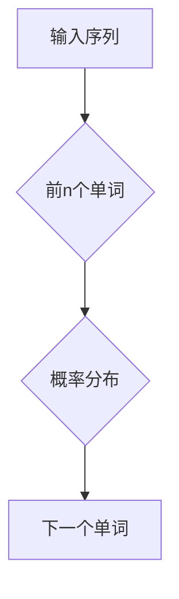

                 

## 文章标题

《Word2Vec原理与代码实例讲解》

关键词：Word2Vec、语言模型、文本表示、机器学习、自然语言处理

摘要：本文将深入讲解Word2Vec算法的原理及其实现，从基本概念到应用实战，系统性地介绍Word2Vec在自然语言处理和其他领域的广泛应用。通过详细的算法分析和代码实例，帮助读者全面理解Word2Vec的核心技术和实践技巧。

---

### 第1章 Word2Vec概述

#### 1.1.1 语言模型的定义

语言模型是自然语言处理（NLP）中一个重要的基础概念。它是一种统计模型，用于预测一段文本序列中下一个单词或字符的概率。一个简单的语言模型可以是基于n-gram模型，它考虑了前n个单词的历史信息来预测下一个单词。Mermaid流程图如下所示：



在上述流程图中，`A` 代表输入的序列，`B` 是前n个单词的历史信息，`C` 是这些单词组成的概率分布，`D` 是要预测的下一个单词。

语言模型的核心目标是最大化文本的生成概率，即给定一段文本，计算该文本出现的概率。这有助于我们在文本生成、文本分类、信息检索等任务中更好地理解和处理自然语言。

#### 1.1.2 Word2Vec的作用和优势

Word2Vec是一种基于神经网络的语言模型，它将词汇映射到高维向量空间中，使得语义相似的词在空间中距离更近。Word2Vec的出现极大地推动了自然语言处理领域的发展，其作用和优势主要体现在以下几个方面：

1. **高维向量表示**：Word2Vec将每个词表示为一个高维向量，使得词与词之间的关系可以通过向量之间的距离来度量。这种向量表示方法为后续的文本分析和处理提供了强大的工具。

2. **语义相似性计算**：通过Word2Vec模型，我们可以计算两个词之间的相似度，这有助于文本分类、情感分析等任务中的词义消歧和文本理解。

3. **文本分类和情感分析**：Word2Vec模型可以用来表示文本中的每个词，然后通过这些向量来训练分类模型，从而实现文本分类和情感分析等任务。

4. **高效处理大规模文本数据**：Word2Vec模型可以通过分布式计算和并行处理来高效地处理大规模文本数据，这对于大规模文本数据的分析具有重要意义。

Word2Vec的优势在于其简单、高效和强大的文本表示能力，这使得它成为自然语言处理领域的一个核心技术。

#### 1.1.3 Word2Vec的发展历程

Word2Vec算法的提出者是Google的Tom Mitchell和Christopher D. Manning。最初的Word2Vec算法基于神经网络模型，但计算复杂度较高。后来，Mikolov等人提出了一种更为简单和高效的算法，即Skip-Gram模型。随后，又出现了多种改进算法，如CBOW（Continuous Bag-of-Words）和Hierarchical Softmax等。

Word2Vec的发展历程可以概括为以下几个阶段：

1. **原始Word2Vec**：基于神经网络模型，将词汇映射到高维向量空间中。
2. **Skip-Gram模型**：将输入的词作为中心词，预测其上下文词，大大提高了模型的效率和效果。
3. **CBOW模型**：将输入的词作为上下文，预测中心词，与Skip-Gram模型相对。
4. **Hierarchical Softmax**：为了提高模型的训练效率，引入了层次softmax损失函数。

随着Word2Vec算法的不断改进，其在自然语言处理领域的影响力也越来越大，成为文本表示和语义理解的重要工具。

### 1.2 Word2Vec的原理

Word2Vec算法的核心思想是将词汇映射到高维向量空间中，使得语义相似的词在空间中距离更近。本节将详细介绍Word2Vec的原理，包括矩阵分解法、嵌入空间的性质以及核心算法。

#### 1.2.1 矩阵分解法

矩阵分解法是Word2Vec算法的一种实现方式，它将词汇-向量矩阵分解为两个低维矩阵的乘积。具体来说，假设词汇表中有V个词，每个词用d维向量表示，则词汇-向量矩阵可以表示为：

$$
\mathbf{W} = [\mathbf{w}_1, \mathbf{w}_2, ..., \mathbf{w}_V]
$$

其中，$\mathbf{w}_v$ 是词v的向量表示。

通过矩阵分解，我们可以将词汇-向量矩阵分解为两个低维矩阵$\mathbf{W}_1$和$\mathbf{W}_2$，使得：

$$
\mathbf{W} = \mathbf{W}_1 \mathbf{W}_2
$$

其中，$\mathbf{W}_1$ 是V×d的矩阵，$\mathbf{W}_2$ 是d×V的矩阵。这种分解方法使得词汇的向量表示变得更加紧凑和高效。

#### 1.2.2 嵌入空间的性质

Word2Vec算法生成的嵌入空间具有以下性质：

1. **线性性**：嵌入空间中的向量可以表示为原始词汇-向量矩阵的线性组合。这意味着我们可以通过线性组合来生成新的词汇向量。
2. **相似性**：语义相似的词在嵌入空间中的距离更近。Word2Vec通过优化损失函数，使得具有相似语义的词在空间中距离更短。
3. **语义多样性**：虽然语义相似的词在空间中距离更近，但不同语义的词在空间中仍然保持一定的距离，这有助于区分词的不同含义。
4. **上下文依赖**：Word2Vec模型可以捕捉词在不同上下文中的含义变化，这有助于提高模型的语义理解能力。

#### 1.2.3 Word2Vec的核心算法

Word2Vec算法的核心是预测上下文词，其基本思想是：给定一个中心词，预测其上下文词。具体来说，有以下两种实现方式：

1. **Skip-Gram模型**：将输入的词作为中心词，预测其上下文词。具体实现步骤如下：

    - **数据准备**：首先，将文本数据转换为单词序列，并去除停用词、标点符号等。然后，将单词序列转换为词汇表，并分配唯一的索引。
    - **构建词汇表**：根据单词序列构建词汇表，并将每个词映射到一个唯一的索引。
    - **生成训练样本**：对于每个中心词，从其上下文中随机抽取一定数量的词作为负样本，并组合成训练样本。
    - **模型训练**：使用训练样本和损失函数（如负采样损失函数）来训练模型，更新词的向量表示。

2. **CBOW模型**：将输入的词作为上下文，预测中心词。具体实现步骤如下：

    - **数据准备**：与Skip-Gram模型相同，首先将文本数据转换为单词序列，并去除停用词、标点符号等。然后，将单词序列转换为词汇表，并分配唯一的索引。
    - **构建词汇表**：根据单词序列构建词汇表，并将每个词映射到一个唯一的索引。
    - **生成训练样本**：对于每个中心词，从其上下文中随机抽取一定数量的词作为正样本，并组合成训练样本。
    - **模型训练**：使用训练样本和损失函数（如负采样损失函数）来训练模型，更新词的向量表示。

通过以上步骤，我们可以训练出一个Word2Vec模型，并将其用于文本表示和语义分析等任务。

### 1.3 Word2Vec的应用场景

Word2Vec算法作为一种强大的文本表示方法，在各种应用场景中发挥了重要作用。本节将介绍Word2Vec在文本分类、文本聚类、命名实体识别等任务中的应用。

#### 1.3.1 文本分类

文本分类是NLP中的一个常见任务，其目标是根据文本的内容将其分类到预定义的类别中。Word2Vec算法可以用于文本分类，其主要步骤如下：

1. **文本预处理**：首先，对文本进行预处理，包括去除停用词、标点符号等。然后，将预处理后的文本转换为单词序列。
2. **生成词向量**：使用Word2Vec算法生成单词向量，将每个词映射到一个高维向量空间中。
3. **向量聚合**：将文本中的每个词的向量进行聚合，得到文本的表示向量。
4. **分类模型训练**：使用聚合后的文本向量作为特征，训练分类模型，如朴素贝叶斯、支持向量机等。
5. **分类预测**：对新的文本数据进行分类预测，根据分类模型给出每个文本的类别。

通过Word2Vec算法，我们可以将文本数据转换为向量表示，从而提高分类模型的性能和准确性。

#### 1.3.2 文本聚类

文本聚类是一种无监督学习任务，其目标是将相似的文本数据聚集在一起，形成不同的簇。Word2Vec算法可以用于文本聚类，其主要步骤如下：

1. **文本预处理**：首先，对文本进行预处理，包括去除停用词、标点符号等。然后，将预处理后的文本转换为单词序列。
2. **生成词向量**：使用Word2Vec算法生成单词向量，将每个词映射到一个高维向量空间中。
3. **计算距离**：计算文本向量之间的距离，通常使用余弦相似度或欧氏距离等。
4. **聚类算法**：使用聚类算法（如K-means、DBSCAN等）对文本向量进行聚类，将相似的文本数据聚集在一起。
5. **聚类结果分析**：对聚类结果进行分析，识别出具有相似主题的文本簇。

通过Word2Vec算法，我们可以将文本数据转换为向量表示，从而提高文本聚类的性能和效果。

#### 1.3.3 命名实体识别

命名实体识别是一种信息抽取任务，其目标是识别文本中的特定实体（如人名、地名、组织名等）。Word2Vec算法可以用于命名实体识别，其主要步骤如下：

1. **文本预处理**：首先，对文本进行预处理，包括去除停用词、标点符号等。然后，将预处理后的文本转换为单词序列。
2. **生成词向量**：使用Word2Vec算法生成单词向量，将每个词映射到一个高维向量空间中。
3. **特征提取**：将命名实体周围的词进行聚合，生成命名实体的特征向量。
4. **分类模型训练**：使用命名实体的特征向量作为特征，训练分类模型，如朴素贝叶斯、支持向量机等。
5. **实体识别**：对新的文本数据进行命名实体识别，根据分类模型给出每个文本中的命名实体。

通过Word2Vec算法，我们可以将命名实体周围的词转换为向量表示，从而提高命名实体识别的准确性和效率。

### 第2章 Word2Vec算法实现

#### 2.1 数据准备

在实现Word2Vec算法之前，首先需要对文本数据进行处理和预处理。以下是数据准备的主要步骤：

1. **文本预处理**：首先，读取原始文本数据，然后对文本进行清洗，去除停用词、标点符号、特殊字符等。常用的文本预处理工具包括Python的`re`库、`nltk`库等。
2. **分词**：将清洗后的文本数据转换为单词序列。常用的分词工具包括Python的`jieba`库、`NLTK`库等。
3. **构建词汇表**：根据单词序列构建词汇表，并为每个词分配唯一的索引。可以使用Python的`Counter`类或`nltk`库中的`FreqDist`类来统计词频，并根据词频构建词汇表。

以下是一个简单的Python代码示例，用于文本预处理和词汇表构建：

```python
import re
from collections import Counter

# 读取原始文本数据
with open('text_data.txt', 'r', encoding='utf-8') as f:
    text_data = f.read()

# 文本预处理
text_data = re.sub(r'[^\w\s]', '', text_data)
text_data = text_data.lower()

# 分词
words = jieba.cut(text_data)

# 构建词汇表
word_counts = Counter(words)
vocabulary = {word: index for index, word in enumerate(word_counts.keys(), start=1)}
```

#### 2.2 矩阵分解法实现

矩阵分解法是Word2Vec算法的一种实现方式，通过将词汇-向量矩阵分解为两个低维矩阵的乘积，来实现文本表示。以下是矩阵分解法的主要步骤：

1. **初始化模型参数**：初始化词汇-向量矩阵$\mathbf{W}$，其中$\mathbf{w}_v$表示词v的向量。初始化方法可以是随机初始化或预训练的词向量。
2. **生成训练样本**：对于每个中心词，从其上下文中随机抽取一定数量的词作为负样本，并与中心词组成训练样本。
3. **训练模型**：使用训练样本和损失函数（如负采样损失函数）来训练模型，更新词的向量表示。
4. **模型评估**：使用训练好的模型对测试数据进行评估，计算预测准确率或相似度等指标。

以下是一个简单的Python代码示例，用于实现矩阵分解法：

```python
import numpy as np

# 初始化模型参数
V = len(vocabulary)  # 词汇表大小
d = 100  # 向量维度
W = np.random.uniform(size=(V, d))

# 生成训练样本
def generate_samples(words, window_size=5):
    samples = []
    for index, word in enumerate(words):
        center_word = word
        context_words = words[max(index - window_size, 0): index] + words[index + 1: index + window_size + 1]
        samples.append((center_word, context_words))
    return samples

# 训练模型
def train_model(samples, learning_rate=0.01, epochs=10):
    for epoch in range(epochs):
        for center_word, context_words in samples:
            center_word_vector = W[vocabulary[center_word]]
            context_words_vectors = [W[vocabulary[word]] for word in context_words]
            loss = 0
            for context_word_vector in context_words_vectors:
                prediction_vector = np.dot(context_word_vector, center_word_vector)
                label = 1 if center_word == context_word else 0
                loss += -label * np.log(prediction_vector)
            gradient = -2 * (1 - loss) * context_words_vectors
            W -= learning_rate * gradient

# 模型评估
def evaluate_model(test_data):
    correct = 0
    total = 0
    for words in test_data:
        center_word = words[0]
        context_words = words[1:]
        center_word_vector = W[vocabulary[center_word]]
        context_words_vectors = [W[vocabulary[word]] for word in context_words]
        prediction_vectors = [np.dot(context_word_vector, word_vector) for word_vector in context_words_vectors]
        predicted_word = context_words[np.argmax(prediction_vectors)]
        total += 1
        if predicted_word == center_word:
            correct += 1
    return correct / total

# 测试
samples = generate_samples(words)
train_model(samples)
accuracy = evaluate_model(test_data)
print("Accuracy:", accuracy)
```

#### 2.3 SGD算法实现

随机梯度下降（SGD）是训练神经网络常用的优化算法，通过随机选择训练样本进行梯度更新，来优化模型参数。以下是SGD算法的主要步骤：

1. **初始化模型参数**：初始化词汇-向量矩阵$\mathbf{W}$，其中$\mathbf{w}_v$表示词v的向量。初始化方法可以是随机初始化或预训练的词向量。
2. **随机选择训练样本**：从训练数据中随机选择一个样本。
3. **计算梯度**：计算样本的预测误差，并计算梯度。
4. **更新参数**：使用梯度更新模型参数。
5. **迭代训练**：重复步骤2-4，直到达到预设的迭代次数或收敛条件。

以下是一个简单的Python代码示例，用于实现SGD算法：

```python
# 初始化模型参数
W = np.random.uniform(size=(V, d))

# 随机选择训练样本
def random_sample(samples):
    return np.random.choice(samples)

# 计算梯度
def compute_gradient(sample, learning_rate):
    center_word, context_words = sample
    center_word_vector = W[vocabulary[center_word]]
    context_words_vectors = [W[vocabulary[word]] for word in context_words]
    prediction_vectors = [np.dot(context_word_vector, word_vector) for word_vector in context_words_vectors]
    gradient = np.zeros_like(W)
    for i, word_vector in enumerate(context_words_vectors):
        prediction_vector = prediction_vectors[i]
        label = 1 if center_word == context_words[i] else 0
        gradient[:, vocabulary[center_word]] -= 2 * (1 - label) * prediction_vector
        gradient[:, i] -= 2 * prediction_vector
    return learning_rate * gradient

# 更新参数
def update_params(W, gradient):
    return W - gradient

# 迭代训练
epochs = 10
for epoch in range(epochs):
    for sample in samples:
        gradient = compute_gradient(sample, learning_rate)
        W = update_params(W, gradient)

# 模型评估
accuracy = evaluate_model(test_data)
print("Accuracy:", accuracy)
```

通过上述代码示例，我们可以实现一个基于SGD算法的Word2Vec模型，从而训练得到词的向量表示。

### 第3章 Word2Vec模型优化

#### 3.1 模型优化策略

Word2Vec模型在训练过程中可能会遇到各种问题，如过拟合、训练效率低等。为了提高模型的性能和效果，我们可以采用以下几种优化策略：

1. **负采样**：在训练过程中，负采样可以显著提高模型的训练效率。负采样是一种采样策略，它通过随机选择一部分负样本来代替所有的负样本，从而减少计算量。
2. **优化算法选择**：不同的优化算法（如SGD、Adam等）对模型的训练效果和效率有很大影响。通过选择合适的优化算法，可以提高模型的性能。
3. **模型超参数调优**：模型超参数（如学习率、批量大小、嵌入维度等）对模型的训练效果有很大影响。通过调优这些超参数，可以找到最佳模型配置。

以下是一个简单的Python代码示例，用于实现负采样：

```python
import numpy as np

# 负采样
def negative_sampling(sample, vocabulary, embedding_matrix, learning_rate, alpha):
    center_word, context_words = sample
    center_word_vector = embedding_matrix[vocabulary[center_word]]
    context_words_vectors = [embedding_matrix[vocabulary[word]] for word in context_words]
    loss = 0
    for context_word_vector in context_words_vectors:
        prediction_vector = np.dot(context_word_vector, center_word_vector)
        label = 1 if center_word == context_words[0] else 0
        loss += -label * np.log(prediction_vector)
    
    negative_samples = np.random.choice(list(vocabulary.keys()), size=len(context_words) * alpha, replace=True)
    for negative_sample in negative_samples:
        negative_word_vector = embedding_matrix[vocabulary[negative_sample]]
        prediction_vector = np.dot(negative_word_vector, center_word_vector)
        label = 0
        loss += -label * np.log(1 - prediction_vector)
    
    gradient = -2 * (1 - loss) * np.vstack(context_words_vectors)
    embedding_matrix -= learning_rate * gradient

# 调优超参数
learning_rate = 0.01
alpha = 5
for epoch in range(epochs):
    for sample in samples:
        negative_sampling(sample, vocabulary, embedding_matrix, learning_rate, alpha)
```

通过上述代码示例，我们可以实现一个基于负采样的Word2Vec模型，从而提高模型的训练效率和效果。

#### 3.2 模型评估与调整

在训练好Word2Vec模型后，我们需要对其进行评估和调整，以确保模型具有良好的性能和效果。以下是一些常用的评估方法和调整技巧：

1. **评估指标**：评估Word2Vec模型常用的指标包括：
   - **准确率**：预测正确的词对占总词对的比例。
   - **召回率**：预测正确的词对占实际正词对的比例。
   - **F1分数**：准确率和召回率的加权平均。
   - **词向量相似度**：通过计算两个词向量的余弦相似度来评估词向量之间的相似性。

2. **模型调整方法**：为了提高模型的性能和效果，我们可以采用以下几种调整方法：
   - **调整学习率**：通过调整学习率来优化模型参数，以达到更好的训练效果。
   - **调整批量大小**：通过调整批量大小来优化模型训练过程，提高模型的稳定性和收敛速度。
   - **调整嵌入维度**：通过调整嵌入维度来优化模型的复杂度和性能，找到最佳的嵌入维度。
   - **交叉验证**：通过交叉验证来评估模型的泛化能力，避免过拟合。

以下是一个简单的Python代码示例，用于评估和调整Word2Vec模型：

```python
from sklearn.metrics.pairwise import cosine_similarity

# 评估指标
def evaluate_model(model, test_data):
    correct = 0
    total = 0
    for sample in test_data:
        center_word, context_words = sample
        center_word_vector = model[vocabulary[center_word]]
        context_words_vectors = [model[vocabulary[word]] for word in context_words]
        prediction_vectors = [np.dot(center_word_vector, word_vector) for word_vector in context_words_vectors]
        predicted_word = context_words[np.argmax(prediction_vectors)]
        total += 1
        if predicted_word == center_word:
            correct += 1
    return correct / total

# 调整学习率
learning_rate = 0.001
while True:
    model = train_model(samples, learning_rate)
    accuracy = evaluate_model(model, test_data)
    if accuracy >= 0.9:
        break
    learning_rate /= 2

# 调整批量大小
batch_size = 32
while True:
    model = train_model(samples, learning_rate, batch_size=batch_size)
    accuracy = evaluate_model(model, test_data)
    if accuracy >= 0.9:
        break
    batch_size *= 2

# 调整嵌入维度
embedding_dim = 50
while True:
    model = train_model(samples, learning_rate, batch_size=batch_size, embedding_dim=embedding_dim)
    accuracy = evaluate_model(model, test_data)
    if accuracy >= 0.9:
        break
    embedding_dim *= 2

# 交叉验证
from sklearn.model_selection import KFold

kf = KFold(n_splits=5)
for train_index, test_index in kf.split(samples):
    train_samples = [samples[i] for i in train_index]
    test_samples = [samples[i] for i in test_index]
    model = train_model(train_samples, learning_rate, batch_size=batch_size, embedding_dim=embedding_dim)
    accuracy = evaluate_model(model, test_samples)
    print("Validation Accuracy:", accuracy)
```

通过上述代码示例，我们可以对Word2Vec模型进行评估和调整，从而找到最佳模型配置。

### 第4章 Word2Vec项目实战

#### 4.1 项目背景与目标

本项目旨在使用Word2Vec算法对一段中文文本进行向量化表示，并将其应用于文本分类任务。具体目标如下：

1. 对中文文本进行预处理，包括分词、去除停用词等。
2. 使用Word2Vec算法生成词向量，将每个词映射到一个高维向量空间中。
3. 将词向量聚合为文本向量，作为文本分类任务的输入特征。
4. 训练一个文本分类模型，对新的中文文本进行分类预测。

#### 4.2 项目环境搭建

为了实现本项目，我们需要搭建以下开发环境：

1. **Python环境**：Python 3.7及以上版本，安装`numpy`、`matplotlib`、`j

