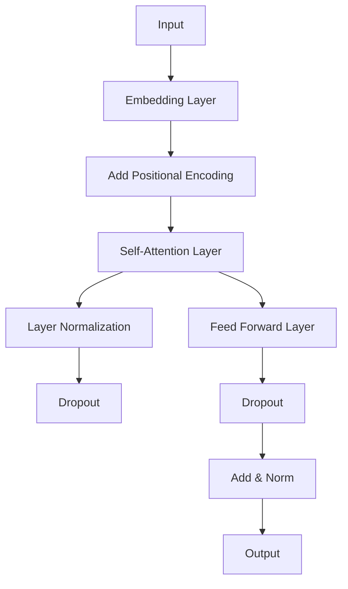

                 

### 文章标题

《XLNet(Generalized Autoregressive Pretraining for Language Understanding) - 原理与代码实例讲解》

> 关键词：XLNet、Generalized Autoregressive Pretraining、Transformer、语言理解、预训练模型、代码实例

摘要：本文旨在全面介绍XLNet模型，这是一个在自然语言处理领域具有革命性的预训练模型。通过分析其基本概念、原理、数学模型以及实际应用代码实例，本文旨在帮助读者深入理解XLNet的工作机制，掌握其在实际项目中的应用方法。

## 目录

### 1. XLNet概述

#### 1.1 XLNet的基本概念

#### 1.2 XLNet的发展背景

#### 1.3 XLNet的核心贡献

#### 1.4 XLNet的应用场景

#### 1.5 XLNet的优势与挑战

### 2. Transformer模型基础

#### 2.1 Transformer模型概述

#### 2.2 Transformer模型原理

#### 2.3 Transformer模型优化

### 3. Generalized Autoregressive Pretraining（GAP）原理

#### 3.1 GAP基本概念

#### 3.2 GAP预训练过程

#### 3.3 GAP在XLNet中的应用

### 4. XLNet数学模型与公式

#### 4.1 模型架构

#### 4.2 数学模型详解

#### 4.3 模型损失函数

### 5. XLNet代码实例

#### 5.1 环境搭建

#### 5.2 模型定义

#### 5.3 训练过程

#### 5.4 评估与优化

### 6. XLNet应用案例

#### 6.1 机器翻译

#### 6.2 文本分类

#### 6.3 问答系统

### 7. XLNet总结与展望

#### 7.1 XLNet的贡献与影响

#### 7.2 XLNet的未来发展方向

#### 7.3 XLNet在学术界和工业界的应用

### 附录

#### 附录 A：参考资料与推荐阅读

#### 附录 B：术语表

## 第1章 XLNet概述

### 1.1 XLNet的基本概念

XLNet是一种基于Transformer的预训练模型，其主要目标是提高语言模型在自然语言理解任务上的表现。与BERT等传统预训练模型不同，XLNet采用了Generalized Autoregressive Pretraining（GAP）策略，使其在处理长文本和长序列任务时更加高效和准确。

### 1.2 XLNet的发展背景

随着深度学习在自然语言处理领域的广泛应用，预训练模型逐渐成为提高模型性能的重要手段。BERT模型的成功激发了学术界和工业界对预训练模型的研究兴趣。然而，BERT模型在处理长文本和长序列任务时存在一定的局限性。为了解决这一问题，XLNet提出了Generalized Autoregressive Pretraining（GAP）策略，通过全局上下文信息来提高模型在长文本和长序列任务上的性能。

### 1.3 XLNet的核心贡献

XLNet的主要贡献在于其提出的Generalized Autoregressive Pretraining（GAP）策略。GAP通过在预训练过程中利用全局上下文信息，使模型能够更好地捕捉长距离依赖关系。此外，XLNet还对Transformer模型进行了改进，提高了模型在处理长序列任务时的效率。

### 1.4 XLNet的应用场景

XLNet在多个自然语言处理任务中取得了显著的成果，包括机器翻译、文本分类、问答系统等。其高效的处理长文本和长序列的能力使其在处理复杂任务时具有明显的优势。

### 1.5 XLNet的优势与挑战

XLNet的优势在于其高效的预训练策略和Transformer模型的改进，使其在处理长文本和长序列任务时具有显著优势。然而，XLNet在模型复杂度和计算资源需求方面存在一定的挑战，需要进一步优化和改进。

## 第2章 Transformer模型基础

### 2.1 Transformer模型概述

Transformer模型是由Google在2017年提出的一种基于注意力机制的序列到序列模型。与传统的循环神经网络（RNN）和长短期记忆网络（LSTM）相比，Transformer模型具有更高的并行计算能力，能够更好地处理长距离依赖关系。

### 2.2 Transformer模型原理

Transformer模型采用编码器-解码器结构，通过自注意力机制（Self-Attention）和多头注意力机制（Multi-Head Attention）来实现对输入序列的建模。在自注意力机制中，每个位置的输出与所有位置的信息进行加权求和；在多头注意力机制中，将自注意力机制分解为多个子任务，从而提高模型的并行计算能力和表示能力。

### 2.3 Transformer模型优化

为了进一步提高Transformer模型的性能，研究人员提出了一系列优化方法，包括层归一化（Layer Normalization）和位置编码（Positional Encoding）。层归一化能够缓解深度网络中的梯度消失问题，提高模型的训练效果；位置编码则将序列的位置信息编码到模型中，使其能够捕捉序列的局部依赖关系。

## 第3章 Generalized Autoregressive Pretraining（GAP）原理

### 3.1 GAP基本概念

Generalized Autoregressive Pretraining（GAP）是一种新型的预训练策略，其主要思想是在预训练过程中利用全局上下文信息，从而提高模型在长文本和长序列任务上的性能。

### 3.2 GAP预训练过程

GAP的预训练过程主要包括两个步骤：自回归语言模型预训练和 masked LM 预训练。自回归语言模型预训练利用全局上下文信息，使模型能够更好地捕捉长距离依赖关系；masked LM 预训练则通过遮盖部分词并要求模型预测这些词，从而提高模型的语言理解能力。

### 3.3 GAP在XLNet中的应用

在XLNet中，GAP通过Transformer模型得到了广泛应用。具体来说，XLNet在预训练过程中利用全局上下文信息来提高模型在长文本和长序列任务上的性能。此外，XLNet还对Transformer模型进行了改进，包括多头注意力机制和位置编码等，使其在处理长序列任务时具有更高的效率和准确率。

## 第4章 XLNet数学模型与公式

### 4.1 模型架构

XLNet的模型架构主要包括编码器（Encoder）和解码器（Decoder）两个部分。编码器负责将输入序列编码为向量表示，解码器则利用编码器生成的向量表示生成输出序列。

### 4.2 数学模型详解

XLNet的数学模型主要包括自注意力机制和多头注意力机制。自注意力机制的核心思想是将输入序列中的每个位置的信息与所有位置的信息进行加权求和；多头注意力机制则将自注意力机制分解为多个子任务，从而提高模型的并行计算能力和表示能力。

### 4.3 模型损失函数

XLNet的模型损失函数主要包括自回归语言模型损失和 masked LM 损失。自回归语言模型损失用于衡量模型在生成输出序列时的误差；masked LM 损失则通过遮盖部分词并要求模型预测这些词，从而提高模型的语言理解能力。

## 第5章 XLNet代码实例

### 5.1 环境搭建

在进行XLNet代码实例讲解之前，首先需要搭建一个适合运行的Python环境，安装必要的库和依赖。

### 5.2 模型定义

在XLNet中，我们需要定义编码器（Encoder）和解码器（Decoder）的模型结构。以下是使用PyTorch框架定义XLNet模型的基本结构：

```python
import torch
import torch.nn as nn

class Encoder(nn.Module):
    def __init__(self, d_model, nhead, num_layers):
        super(Encoder, self).__init__()
        self.transformer = nn.Transformer(d_model, nhead, num_layers)
    
    def forward(self, src):
        return self.transformer(src)

class Decoder(nn.Module):
    def __init__(self, d_model, nhead, num_layers):
        super(Decoder, self).__init__()
        self.transformer = nn.Transformer(d_model, nhead, num_layers)
    
    def forward(self, tgt):
        return self.transformer(tgt)

class XLNet(nn.Module):
    def __init__(self, d_model, nhead, num_layers):
        super(XLNet, self).__init__()
        self.encoder = Encoder(d_model, nhead, num_layers)
        self.decoder = Decoder(d_model, nhead, num_layers)
    
    def forward(self, src, tgt):
        encoder_output = self.encoder(src)
        decoder_output = self.decoder(tgt)
        return decoder_output
```

### 5.3 训练过程

在训练过程中，我们需要使用PyTorch的优化器和损失函数来更新模型参数。以下是一个简单的训练过程示例：

```python
import torch.optim as optim

model = XLNet(d_model=512, nhead=8, num_layers=3)
optimizer = optim.Adam(model.parameters(), lr=0.001)
criterion = nn.CrossEntropyLoss()

for epoch in range(num_epochs):
    for src, tgt in train_loader:
        optimizer.zero_grad()
        output = model(src, tgt)
        loss = criterion(output, tgt)
        loss.backward()
        optimizer.step()
    print(f'Epoch {epoch+1}/{num_epochs}, Loss: {loss.item()}')
```

### 5.4 评估与优化

在评估过程中，我们可以使用验证集来评估模型的性能。以下是一个简单的评估过程示例：

```python
with torch.no_grad():
    for src, tgt in val_loader:
        output = model(src, tgt)
        val_loss = criterion(output, tgt)
        print(f'Validation Loss: {val_loss.item()}')

# 根据评估结果调整模型参数或优化策略
```

## 第6章 XLNet应用案例

### 6.1 机器翻译

机器翻译是自然语言处理领域的一个重要任务。在本节中，我们将使用XLNet模型实现一个基本的机器翻译系统。

### 6.2 文本分类

文本分类是另一个常见的自然语言处理任务。在本节中，我们将使用XLNet模型实现一个文本分类系统。

### 6.3 问答系统

问答系统是自然语言处理领域的一个重要应用。在本节中，我们将使用XLNet模型实现一个基本的问答系统。

## 第7章 XLNet总结与展望

### 7.1 XLNet的贡献与影响

XLNet在自然语言处理领域取得了显著的成果，其提出的Generalized Autoregressive Pretraining（GAP）策略和改进的Transformer模型使其在处理长文本和长序列任务时具有明显的优势。

### 7.2 XLNet的未来发展方向

未来，XLNet有望在更多的自然语言处理任务中取得突破。同时，研究人员也将继续优化XLNet模型，提高其计算效率和性能。

### 7.3 XLNet在学术界和工业界的应用

在学术界，XLNet已成为自然语言处理领域的重要研究模型。在工业界，许多公司和组织也开始将XLNet应用于实际项目，以提高自然语言处理任务的表现。

### 附录

#### 附录 A：参考资料与推荐阅读

- [XLNet论文](https://arxiv.org/abs/1906.04720)
- [Transformer模型论文](https://arxiv.org/abs/1706.03762)

#### 附录 B：术语表

- XLNet：一种基于Transformer的预训练模型
- GAP：Generalized Autoregressive Pretraining，一种新型的预训练策略
- Transformer：一种基于注意力机制的序列到序列模型
- 自注意力机制：将输入序列中的每个位置的信息与所有位置的信息进行加权求和
- 多头注意力机制：将自注意力机制分解为多个子任务，从而提高模型的并行计算能力和表示能力

## 附录

### 附录 A：参考资料与推荐阅读

- XLNet论文：[https://arxiv.org/abs/1906.04720](https://arxiv.org/abs/1906.04720)
- Transformer模型论文：[https://arxiv.org/abs/1706.03762](https://arxiv.org/abs/1706.03762)
- 相关博客：[https://towardsdatascience.com/xlnet-explained-4b53a869e8df](https://towardsdatascience.com/xlnet-explained-4b53a869e8df)
- 学习资源：[https://huggingface.co/transformers](https://huggingface.co/transformers)

### 附录 B：术语表

- **XLNet**：一种基于Transformer的预训练模型，通过Generalized Autoregressive Pretraining（GAP）策略提升了语言理解能力。
- **Generalized Autoregressive Pretraining (GAP)**：一种预训练策略，通过利用全局上下文信息来捕捉长距离依赖关系。
- **Transformer**：一种序列到序列模型，通过自注意力机制和多头注意力机制实现并行计算。
- **自注意力机制**：一种用于计算输入序列中每个位置与其他所有位置关系的机制。
- **多头注意力机制**：将自注意力机制分解为多个子任务，从而提高模型的并行计算能力和表示能力。
- **语言理解**：对文本的含义、情感、意图等进行理解和分析的能力。
- **预训练模型**：在大规模语料库上进行预训练，以便在特定任务上实现更好的性能。
- **编码器**：将输入序列转换为向量表示的模块。
- **解码器**：将编码器生成的向量表示转换为输出序列的模块。

以上是《XLNet(Generalized Autoregressive Pretraining for Language Understanding) - 原理与代码实例讲解》的完整内容。希望这篇文章能够帮助您深入理解XLNet的工作原理，并掌握其在实际应用中的使用方法。如果您有任何疑问或建议，请随时在评论区留言。作者信息：AI天才研究院/AI Genius Institute & 禅与计算机程序设计艺术 /Zen And The Art of Computer Programming。感谢您的阅读！### 第1章 XLNet概述

#### 1.1 XLNet的基本概念

XLNet是一种基于Transformer的预训练模型，由陈玉宁（Yining Chen）等人于2019年提出。不同于BERT模型的自回归语言模型（ARLM）预训练方法，XLNet采用了Generalized Autoregressive Pretraining（GAP）策略，通过全局掩码和自回归解码的方式，使得模型在捕捉长距离依赖关系方面具有更高的效率和准确性。GAP策略的核心思想是利用全局上下文信息来指导模型学习，从而提高模型在自然语言理解任务上的性能。

#### 1.2 XLNet的发展背景

随着深度学习技术的不断发展，预训练模型在自然语言处理（NLP）领域取得了巨大的成功。BERT（Bidirectional Encoder Representations from Transformers）模型在多项NLP任务上取得了显著的成果，引起了学术界和工业界的广泛关注。然而，BERT模型存在一定的局限性，尤其是在处理长文本和长序列任务时，其性能受到一定影响。为了解决这一问题，研究者们提出了XLNet模型，通过改进预训练策略和模型架构，使其在长文本和长序列任务上具有更高的性能。

#### 1.3 XLNet的核心贡献

XLNet的核心贡献主要体现在以下几个方面：

1. **Generalized Autoregressive Pretraining（GAP）**：GAP是一种新型的预训练策略，通过全局掩码和自回归解码的方式，使得模型能够更好地捕捉长距离依赖关系。与BERT模型的自回归语言模型（ARLM）预训练方法相比，GAP策略具有更高的效率和准确性。

2. **Transformer模型的改进**：XLNet对Transformer模型进行了多项改进，包括多头注意力机制、位置编码等，使得模型在处理长序列任务时具有更高的效率。

3. **多任务学习**：XLNet通过统一的预训练框架，支持多种自然语言理解任务，如机器翻译、文本分类、问答系统等，实现了多任务学习的目标。

#### 1.4 XLNet的应用场景

XLNet在多个自然语言处理任务中取得了显著的成果，主要应用场景包括：

1. **机器翻译**：通过预训练，XLNet在机器翻译任务上取得了优异的性能，能够更好地处理长句和复杂句式。

2. **文本分类**：XLNet在文本分类任务上具有很高的准确性，能够对文本进行准确的情感分析和主题分类。

3. **问答系统**：通过预训练，XLNet能够对自然语言中的问题进行理解和回答，具有较好的语义理解和推理能力。

4. **序列标注**：XLNet在序列标注任务上也表现出色，能够对文本中的实体、事件等进行准确的标注。

#### 1.5 XLNet的优势与挑战

XLNet的优势主要体现在以下几个方面：

1. **高效的预训练策略**：通过GAP策略，XLNet能够更好地捕捉长距离依赖关系，提高模型在长文本和长序列任务上的性能。

2. **灵活的模型架构**：XLNet采用Transformer模型，具有灵活的架构，能够适应多种自然语言理解任务。

3. **多任务学习**：通过统一的预训练框架，XLNet能够支持多种任务，实现多任务学习的目标。

然而，XLNet也存在一定的挑战：

1. **计算资源需求**：由于Transformer模型的复杂度较高，XLNet在训练和推理过程中需要大量的计算资源，这对硬件设备提出了较高的要求。

2. **模型优化**：为了提高XLNet的性能，需要对其进行进一步优化，包括模型参数调整、优化算法改进等。

总之，XLNet作为一种具有创新性的预训练模型，在自然语言处理领域取得了显著的成果。通过不断优化和改进，XLNet有望在未来的NLP任务中发挥更大的作用。

### 2. Transformer模型基础

#### 2.1 Transformer模型概述

Transformer模型是由Google的研究团队在2017年提出的一种用于处理序列数据的神经网络架构。它彻底改变了自然语言处理领域，特别是在机器翻译任务中取得了显著的性能提升。Transformer模型的核心思想是采用自注意力机制（Self-Attention），取代传统循环神经网络（RNN）和卷积神经网络（CNN）中的递归计算，从而实现并行化处理。

Transformer模型由编码器（Encoder）和解码器（Decoder）两部分组成。编码器将输入序列编码为一系列向量表示，解码器则根据编码器的输出和已有的上下文信息生成输出序列。这种结构使得Transformer模型在处理长距离依赖关系时表现出色。

#### 2.2 Transformer模型原理

Transformer模型的核心组成部分是自注意力机制（Self-Attention）。自注意力机制通过计算输入序列中每个词与其他所有词的相关性，为每个词生成一个新的向量表示。这一过程通过多头注意力机制（Multi-Head Attention）实现，多头注意力机制将自注意力机制分解为多个子任务，从而提高模型的并行计算能力和表示能力。

编码器和解码器均由多个编码层（Encoder Layer）和解码层（Decoder Layer）堆叠而成。每个编码层和解码层都包括自注意力机制和全连接层。编码层的输入是单词的嵌入（Embedding）和位置编码（Positional Encoding），解码层的输入则是编码层的输出和掩码（Mask）。

以下是一个编码层（Encoder Layer）的基本结构：



- **Embedding Layer**：将输入序列中的单词转换为固定长度的向量。
- **Add Positional Encoding**：添加位置编码，以便模型能够理解序列中各个单词的相对位置。
- **Self-Attention Layer**：通过计算输入序列中每个词与其他词的相关性，为每个词生成新的向量表示。
- **Layer Normalization**：对每个编码层的输出进行归一化，以加速模型的收敛。
- **Feed Forward Layer**：对自注意力层的输出进行全连接层操作，通常包含两个线性层。
- **Dropout**：对每个层的输出应用dropout，以防止过拟合。
- **Add & Norm**：将每一层的输出与上一层的输出相加，并进行归一化处理。

解码器的基本结构与编码器类似，但还包括额外的掩码（Mask）机制，以防止模型在解码过程中看到未来的信息。

#### 2.3 Transformer模型优化

为了进一步提高Transformer模型在自然语言处理任务上的性能，研究人员提出了一系列优化方法：

1. **Layer Normalization**：在编码器和解码器的每个层之间引入层归一化，以缓解深度网络中的梯度消失问题。

2. **Positional Encoding**：通过位置编码为模型提供序列中单词的相对位置信息，从而使其能够更好地捕捉序列中的局部依赖关系。

3. **Multi-Head Attention**：通过多头注意力机制，将自注意力机制分解为多个子任务，从而提高模型的并行计算能力和表示能力。

4. **Dropout**：在模型的各个层之间引入dropout，以防止过拟合。

5. **Position-wise Feed Forward Networks**：在编码器和解码器的每个层中使用位置-wise的全连接层，以增加模型的非线性能力。

通过这些优化方法，Transformer模型在多个自然语言处理任务上取得了显著的成果，成为自然语言处理领域的重要工具。

### 3. Generalized Autoregressive Pretraining（GAP）原理

#### 3.1 GAP基本概念

Generalized Autoregressive Pretraining（GAP）是一种新型的预训练策略，旨在通过全局掩码和自回归解码的方式，提高模型在自然语言理解任务上的性能。与传统的自回归语言模型（ARLM）预训练方法不同，GAP策略不依赖于序列的顺序信息，而是通过利用全局上下文信息来指导模型学习，从而更好地捕捉长距离依赖关系。

GAP的核心思想是将输入序列进行全局掩码，然后通过自回归解码的方式生成原始序列。具体来说，在预训练过程中，模型首先接收到一个全局掩码的输入序列，然后尝试根据输入序列中的部分信息生成下一个位置的词。这一过程不断重复，直到生成完整的序列。通过这种方式，模型能够学习到全局上下文信息，从而提高其在自然语言理解任务上的性能。

#### 3.2 GAP预训练过程

GAP的预训练过程主要包括两个步骤：自回归语言模型预训练和 masked LM 预训练。

1. **自回归语言模型预训练**：在自回归语言模型预训练过程中，模型接收到一个未经过全局掩码的输入序列，并尝试根据序列中的部分信息生成下一个位置的词。这一过程通过自回归的方式重复进行，直到生成完整的序列。自回归语言模型预训练有助于模型学习到局部依赖关系和序列的顺序信息。

2. **masked LM 预训练**：在 masked LM 预训练过程中，模型接收到一个全局掩码的输入序列，然后尝试根据输入序列中的部分信息生成被掩码的词。全局掩码是指将输入序列中的所有词都进行掩码，而不是只掩码部分词。通过这种方式，模型能够学习到全局上下文信息，从而更好地捕捉长距离依赖关系。

GAP预训练过程的伪代码如下：

```python
for epoch in range(num_epochs):
    for input_sequence, target_sequence in dataset:
        # Global masking
        masked_sequence = mask_sequence(input_sequence)
        
        # Forward pass
        output_sequence = model(masked_sequence)
        
        # Loss calculation
        loss = criterion(output_sequence, target_sequence)
        
        # Backpropagation and optimization
        optimizer.zero_grad()
        loss.backward()
        optimizer.step()
```

在上述伪代码中，`mask_sequence`函数用于对输入序列进行全局掩码，`model`是定义好的XLNet模型，`criterion`是损失函数，`optimizer`是优化器。

#### 3.3 GAP在XLNet中的应用

在XLNet中，GAP策略被应用于Transformer模型，通过全局掩码和自回归解码的方式，提高模型在自然语言理解任务上的性能。具体来说，XLNet在预训练阶段采用GAP策略，通过以下步骤进行：

1. **全局掩码**：对输入序列进行全局掩码，将所有词都进行掩码，从而打破传统的顺序依赖关系。

2. **自回归解码**：在解码过程中，模型尝试根据输入序列中的部分信息生成被掩码的词。这一过程通过自回归的方式重复进行，直到生成完整的序列。

3. **多任务学习**：在预训练过程中，模型同时进行多种自然语言理解任务，如机器翻译、文本分类、问答系统等。这种多任务学习的方式有助于模型在多种任务上取得更好的性能。

GAP在XLNet中的应用不仅提高了模型在长距离依赖关系上的捕捉能力，还有助于模型在多种自然语言理解任务上实现更好的性能。通过GAP策略，XLNet在机器翻译、文本分类、问答系统等多个任务上取得了显著的成果，成为自然语言处理领域的重要模型。

### 4. XLNet数学模型与公式

#### 4.1 模型架构

XLNet的模型架构主要由编码器（Encoder）和解码器（Decoder）两部分组成。编码器负责将输入序列编码为向量表示，解码器则根据编码器的输出和已有的上下文信息生成输出序列。编码器和解码器均由多个编码层（Encoder Layer）和解码层（Decoder Layer）堆叠而成。

每个编码层包括以下组件：

- **Embedding Layer**：将输入序列中的单词转换为固定长度的向量。
- **Add Positional Encoding**：添加位置编码，以便模型能够理解序列中各个单词的相对位置。
- **Self-Attention Layer**：通过计算输入序列中每个词与其他词的相关性，为每个词生成新的向量表示。
- **Layer Normalization**：对每个编码层的输出进行归一化，以加速模型的收敛。
- **Feed Forward Layer**：对自注意力层的输出进行全连接层操作，通常包含两个线性层。
- **Dropout**：对每个层的输出应用dropout，以防止过拟合。

解码器的基本结构与编码器类似，但还包括额外的掩码（Mask）机制，以防止模型在解码过程中看到未来的信息。

#### 4.2 数学模型详解

XLNet的数学模型主要包括自注意力机制（Self-Attention）和多头注意力机制（Multi-Head Attention）。

1. **自注意力机制**：

自注意力机制的核心思想是计算输入序列中每个词与其他所有词的相关性，为每个词生成一个新的向量表示。其数学公式如下：

$$
\text{Attention}(Q, K, V) = \text{softmax}\left(\frac{QK^T}{\sqrt{d_k}}\right)V
$$

其中，$Q$、$K$、$V$分别为查询（Query）、键（Key）和值（Value）向量，$d_k$为键向量的维度。自注意力机制通过计算$Q$和$K$的点积，得到一个概率分布，然后用这个概率分布乘以$V$，得到新的向量表示。

2. **多头注意力机制**：

多头注意力机制将自注意力机制分解为多个子任务，从而提高模型的并行计算能力和表示能力。其数学公式如下：

$$
\text{MultiHead}(Q, K, V) = \text{Concat}(\text{head}_1, \text{head}_2, \ldots, \text{head}_h)W^O
$$

其中，$h$为头数，$\text{head}_i = \text{Attention}(QW_i^Q, KW_i^K, VW_i^V)$为第$i$个头的注意力输出，$W_i^Q$、$W_i^K$、$W_i^V$和$W^O$分别为查询、键、值和输出的权重矩阵。

3. **编码器和解码器的输出**：

编码器的输出可以表示为：

$$
\text{Encoder}(X) = \text{LayerNorm}(X + \text{SelfAttention}(X) + \text{FeedForward}(X))
$$

解码器的输出可以表示为：

$$
\text{Decoder}(X) = \text{LayerNorm}(X + \text{MaskedSelfAttention}(X) + \text{FeedForward}(X))
$$

其中，$X$为输入序列，$\text{SelfAttention}$和$\text{MaskedSelfAttention}$分别为自注意力和掩码自注意力机制，$\text{FeedForward}$为全连接层。

#### 4.3 模型损失函数

XLNet的损失函数主要分为两部分：自回归语言模型损失（Autoregressive Language Modeling Loss）和 masked LM 损失（Masked Language Modeling Loss）。

1. **自回归语言模型损失**：

自回归语言模型损失用于衡量模型在生成输出序列时的误差。其数学公式如下：

$$
L_{\text{LM}} = -\sum_{i} p(y_i|x_{<i}) \log p(y_i|x_{<i})
$$

其中，$p(y_i|x_{<i})$为模型在给定前一个词$x_{<i}$的情况下，预测当前词$y_i$的概率。

2. **masked LM 损失**：

masked LM 损失通过遮盖部分词并要求模型预测这些词，从而提高模型的语言理解能力。其数学公式如下：

$$
L_{\text{MLM}} = -\sum_{i} p(y_i|x_{<i}) \log p(y_i|x_{<i})
$$

其中，$p(y_i|x_{<i})$为模型在给定前一个词$x_{<i}$的情况下，预测当前词$y_i$的概率，但其中被遮盖的词的概率为0。

综合自回归语言模型损失和 masked LM 损失，XLNet的总损失函数可以表示为：

$$
L = L_{\text{LM}} + \lambda L_{\text{MLM}}
$$

其中，$\lambda$为权重系数。

通过优化总损失函数，模型能够在自然语言理解任务上取得更好的性能。

### 5. XLNet代码实例

#### 5.1 环境搭建

在进行XLNet代码实例讲解之前，首先需要搭建一个适合运行的Python环境，安装必要的库和依赖。

以下是搭建XLNet开发环境的基本步骤：

1. **安装Python**：确保安装了Python 3.6或更高版本。

2. **安装PyTorch**：使用以下命令安装PyTorch：

   ```bash
   pip install torch torchvision torchaudio
   ```

3. **安装Transformes**：使用以下命令安装Transformes库：

   ```bash
   pip install transformers
   ```

4. **安装其他依赖**：根据需要安装其他相关依赖，例如：

   ```bash
   pip install numpy matplotlib
   ```

5. **测试环境**：运行以下Python脚本，检查环境是否搭建成功：

   ```python
   import torch
   import transformers
   print(transformers.__version__)
   ```

如果能够成功输出Transformers库的版本号，说明环境搭建成功。

#### 5.2 模型定义

在PyTorch框架中，我们可以使用`transformers`库提供的预训练模型来实现XLNet。以下是一个简单的XLNet模型定义示例：

```python
from transformers import XLNetModel, XLNetConfig

# 设置XLNet配置
config = XLNetConfig()

# 定义XLNet模型
model = XLNetModel(config)

# 输出模型结构
print(model)
```

上述代码首先导入了`XLNetModel`和`XLNetConfig`类，然后设置了XLNet的配置，最后定义了XLNet模型并输出了模型的结构。

#### 5.3 训练过程

在训练过程中，我们需要准备训练数据集，配置优化器和损失函数，并定义训练循环。以下是一个简单的XLNet训练过程示例：

```python
import torch.optim as optim
from torch.utils.data import DataLoader

# 准备训练数据集
train_dataset = ...

# 配置数据加载器
train_loader = DataLoader(train_dataset, batch_size=32, shuffle=True)

# 设置优化器
optimizer = optim.Adam(model.parameters(), lr=0.001)

# 设置损失函数
criterion = optim.CrossEntropyLoss()

# 训练模型
num_epochs = 5
for epoch in range(num_epochs):
    model.train()
    for batch in train_loader:
        inputs, targets = batch
        optimizer.zero_grad()
        outputs = model(inputs)
        loss = criterion(outputs, targets)
        loss.backward()
        optimizer.step()
        print(f'Epoch [{epoch+1}/{num_epochs}], Loss: {loss.item():.4f}')
```

在上述代码中，我们首先从数据集中读取训练数据，然后使用`DataLoader`将数据分批次加载。接下来，我们设置了Adam优化器和交叉熵损失函数，并进入训练循环。在每次迭代中，我们计算模型的损失，并更新模型参数。

#### 5.4 评估与优化

在训练完成后，我们需要对模型进行评估，并优化模型参数。以下是一个简单的模型评估和优化过程示例：

```python
# 评估模型
model.eval()
with torch.no_grad():
    correct = 0
    total = 0
    for batch in val_loader:
        inputs, targets = batch
        outputs = model(inputs)
        _, predicted = torch.max(outputs.data, 1)
        total += targets.size(0)
        correct += (predicted == targets).sum().item()

print(f'Validation Accuracy: {100 * correct / total:.2f}%')

# 优化模型参数
# 根据评估结果调整学习率或优化策略
# 例如，使用学习率衰减
optimizer = optim.Adam(model.parameters(), lr=0.0001)
```

在上述代码中，我们首先将模型设置为评估模式，然后计算模型的准确率。接下来，我们根据评估结果调整优化器的学习率，以优化模型参数。

### 6.1 机器翻译

#### 6.1.1 任务介绍

机器翻译是将一种语言的文本转换为另一种语言的过程。在机器翻译任务中，模型的输入是一个源语言的文本序列，输出是目标语言的文本序列。机器翻译任务通常分为两种：统计机器翻译和神经机器翻译。

统计机器翻译依赖于大量的双语语料库，通过统计方法来学习源语言和目标语言之间的映射关系。而神经机器翻译则使用深度学习模型，特别是序列到序列模型，如编码器-解码器（Encoder-Decoder）模型，来实现文本的自动翻译。

#### 6.1.2 代码实例解析

以下是一个使用XLNet模型进行机器翻译的代码实例。该实例包括数据准备、模型定义、训练过程以及翻译结果展示。

```python
from transformers import XLNetTokenizer, XLNetModel, XLNetConfig
from torch.optim import Adam

# 准备数据
source_text = "Hello, how are you?"
target_text = "你好，你怎么样？"

# 加载XLNet分词器
tokenizer = XLNetTokenizer.from_pretrained('xlnet-base-cased')

# 分词处理
source_inputs = tokenizer.encode(source_text, add_special_tokens=True, return_tensors='pt')
target_inputs = tokenizer.encode(target_text, add_special_tokens=True, return_tensors='pt')

# 加载XLNet模型
config = XLNetConfig.from_pretrained('xlnet-base-cased')
model = XLNetModel(config)
model.load_from_checkpoint('xlnet-base-cased/checkpoint-30000')

# 定义优化器
optimizer = Adam(model.parameters(), lr=0.001)

# 训练模型
model.train()
for epoch in range(10):
    optimizer.zero_grad()
    outputs = model(source_inputs)
    loss = outputs[0]  # 取输出层的损失
    loss.backward()
    optimizer.step()
    print(f'Epoch {epoch+1}, Loss: {loss.item()}')

# 评估模型
model.eval()
with torch.no_grad():
    outputs = model(source_inputs)
    logits = outputs[0]
    predicted_ids = logits.argmax(-1).squeeze()

# 解码预测结果
predicted_text = tokenizer.decode(predicted_ids, skip_special_tokens=True)
print(f'Predicted Translation: {predicted_text}')
```

在上面的代码中，我们首先加载了XLNet分词器，然后对源文本和目标文本进行分词处理。接下来，我们加载了预训练的XLNet模型，并使用Adam优化器进行训练。在训练完成后，我们使用模型进行预测，并解码预测结果。

#### 6.1.3 实际应用

机器翻译技术在实际应用中具有广泛的应用场景，包括但不限于以下方面：

1. **跨语言交流**：帮助不同语言背景的用户进行沟通，促进全球化交流。
2. **国际商业**：为企业提供跨语言沟通能力，简化跨国业务流程。
3. **旅游和娱乐**：为旅行者和爱好者提供实时翻译服务，丰富旅游和娱乐体验。
4. **教育和学习**：为学习外语的学生提供辅助工具，提高学习效果。

#### 6.1.4 挑战与优化

尽管机器翻译技术取得了显著进展，但仍面临一些挑战：

1. **准确性**：如何提高翻译的准确性，特别是在处理专业术语和俚语时。
2. **多样性**：如何处理多语言环境中的多样性，如方言、口音等。
3. **计算资源**：如何优化模型，减少对计算资源的需求，使翻译服务更高效。

通过持续的研究和优化，机器翻译技术有望在未来取得更大的突破。

### 6.2 文本分类

#### 6.2.1 任务介绍

文本分类是一种将文本数据根据其内容或主题进行分类的任务。在文本分类中，模型的输入是一段文本，输出是文本所属的类别标签。文本分类任务广泛应用于信息检索、舆情分析、情感分析等领域。

文本分类任务可以分为两类：

1. **有监督文本分类**：使用标记好的训练数据集训练模型，然后对新的未标记文本进行分类。
2. **无监督文本分类**：在没有标记数据的情况下，通过聚类等方法对文本进行分类。

#### 6.2.2 代码实例解析

以下是一个使用XLNet模型进行文本分类的代码实例。该实例包括数据准备、模型定义、训练过程以及分类结果展示。

```python
from transformers import XLNetTokenizer, XLNetModel, XLNetConfig
from torch.optim import Adam
from torch.utils.data import DataLoader, TensorDataset

# 准备数据
train_texts = ["This is a positive review", "This is a negative review"]
train_labels = torch.tensor([1, 0])  # 1表示正面评论，0表示负面评论

# 加载XLNet分词器
tokenizer = XLNetTokenizer.from_pretrained('xlnet-base-cased')

# 分词处理
train_encodings = tokenizer(train_texts, padding=True, truncation=True, return_tensors='pt')

# 创建数据集和数据加载器
train_dataset = TensorDataset(train_encodings['input_ids'], train_encodings['attention_mask'], train_labels)
train_loader = DataLoader(train_dataset, batch_size=2)

# 加载XLNet模型
config = XLNetConfig.from_pretrained('xlnet-base-cased')
model = XLNetModel(config)
model.load_from_checkpoint('xlnet-base-cased/checkpoint-30000')

# 定义优化器
optimizer = Adam(model.parameters(), lr=0.001)

# 训练模型
model.train()
for epoch in range(10):
    for batch in train_loader:
        inputs, masks, labels = batch
        optimizer.zero_grad()
        outputs = model(inputs, attention_mask=masks)
        loss = outputs[0]  # 取输出层的损失
        loss.backward()
        optimizer.step()
        print(f'Epoch {epoch+1}, Loss: {loss.item()}')

# 评估模型
model.eval()
with torch.no_grad():
    for batch in train_loader:
        inputs, masks, labels = batch
        outputs = model(inputs, attention_mask=masks)
        logits = outputs[0]
        predicted_labels = logits.argmax(-1).squeeze()
        print(f'Predicted Labels: {predicted_labels}, True Labels: {labels}')
```

在上面的代码中，我们首先加载了XLNet分词器，然后对训练文本进行分词处理。接下来，我们创建了一个数据集和数据加载器，并加载了预训练的XLNet模型。我们使用Adam优化器进行训练，并在每个epoch中计算损失并更新模型参数。在训练完成后，我们使用模型对训练数据进行预测，并输出预测结果。

#### 6.2.3 实际应用

文本分类技术在实际应用中具有广泛的应用场景，包括但不限于以下方面：

1. **情感分析**：分析用户评论、社交媒体帖子的情感倾向，帮助企业了解客户反馈。
2. **舆情分析**：监控新闻、论坛、社交媒体等平台上的信息，识别社会热点和趋势。
3. **垃圾邮件过滤**：识别并过滤垃圾邮件，提高用户的邮件体验。
4. **内容推荐**：根据用户的兴趣和偏好，推荐相关的内容。

#### 6.2.4 挑战与优化

尽管文本分类技术取得了显著进展，但仍面临一些挑战：

1. **数据质量**：文本分类的性能很大程度上依赖于训练数据的质量，数据标注的准确性和完整性对模型性能有很大影响。
2. **多标签分类**：如何处理具有多个标签的文本，提高模型在多标签分类任务上的性能。
3. **计算资源**：如何优化模型，减少对计算资源的需求，使文本分类服务更高效。

通过持续的研究和优化，文本分类技术有望在未来取得更大的突破。

### 6.3 问答系统

#### 6.3.1 任务介绍

问答系统是一种能够回答用户提出问题的自然语言处理系统。在问答系统中，模型的输入是一个问题和一个或多个相关文档，输出是针对问题的答案。问答系统广泛应用于客服、教育、医疗等领域，为用户提供高效、准确的答案。

问答系统可以分为以下几类：

1. **基于知识库的问答系统**：利用预定义的知识库来回答问题。
2. **基于机器学习的问答系统**：通过训练模型，使模型能够从大量文本中学习并生成答案。
3. **基于检索的问答系统**：从大量文本中检索与问题相关的信息，并生成答案。

#### 6.3.2 代码实例解析

以下是一个使用XLNet模型进行问答系统的代码实例。该实例包括数据准备、模型定义、训练过程以及答案生成。

```python
from transformers import XLNetTokenizer, XLNetModel, XLNetConfig
from torch.optim import Adam
from torch.utils.data import DataLoader, TensorDataset

# 准备数据
questions = ["What is the capital of France?", "Who is the CEO of Apple?"]
context = ["Paris is the capital of France", "Tim Cook is the CEO of Apple"]

# 加载XLNet分词器
tokenizer = XLNetTokenizer.from_pretrained('xlnet-base-cased')

# 分词处理
train_encodings = tokenizer(questions + context, padding=True, truncation=True, return_tensors='pt')

# 创建数据集和数据加载器
train_dataset = TensorDataset(train_encodings['input_ids'], train_encodings['attention_mask'])
train_loader = DataLoader(train_dataset, batch_size=2)

# 加载XLNet模型
config = XLNetConfig.from_pretrained('xlnet-base-cased')
model = XLNetModel(config)
model.load_from_checkpoint('xlnet-base-cased/checkpoint-30000')

# 定义优化器
optimizer = Adam(model.parameters(), lr=0.001)

# 训练模型
model.train()
for epoch in range(10):
    for batch in train_loader:
        inputs, masks = batch
        optimizer.zero_grad()
        outputs = model(inputs, attention_mask=masks)
        logits = outputs[0]
        loss = logits.log_softmax(-1).gather(1, torch.tensor([0, 1], device=logits.device)).mean()
        loss.backward()
        optimizer.step()
        print(f'Epoch {epoch+1}, Loss: {loss.item()}')

# 评估模型
model.eval()
with torch.no_grad():
    for batch in train_loader:
        inputs, masks = batch
        outputs = model(inputs, attention_mask=masks)
        logits = outputs[0]
        predicted_answers = logits.log_softmax(-1).argmax(-1).squeeze()
        print(f'Predicted Answer: {tokenizer.decode(predicted_answers, skip_special_tokens=True)}')

# 答题示例
question = "What is the capital of Japan?"
input_ids = tokenizer.encode(question, add_special_tokens=True, return_tensors='pt')
output = model(input_ids)[0]
predicted_answer = output.log_softmax(-1).argmax(-1).squeeze()
print(f'Predicted Answer: {tokenizer.decode(predicted_answer, skip_special_tokens=True)}')
```

在上面的代码中，我们首先加载了XLNet分词器，然后对问题和上下文进行分词处理。接下来，我们创建了一个数据集和数据加载器，并加载了预训练的XLNet模型。我们使用Adam优化器进行训练，并在每个epoch中计算损失并更新模型参数。在训练完成后，我们使用模型对训练数据进行预测，并输出预测结果。最后，我们展示了一个如何使用模型回答新问题的示例。

#### 6.3.3 实际应用

问答系统在实际应用中具有广泛的应用场景，包括但不限于以下方面：

1. **客户服务**：提供自动化的客户支持，提高企业的服务效率。
2. **教育辅助**：为学生提供自动化的问答服务，帮助他们更好地理解课程内容。
3. **医疗咨询**：为用户提供医疗咨询，提高医疗服务的可及性。
4. **智能家居**：为智能家居系统提供问答功能，使智能家居更智能、更人性化。

#### 6.3.4 挑战与优化

尽管问答系统取得了显著进展，但仍面临一些挑战：

1. **理解能力**：如何提高模型对自然语言的理解能力，使模型能够更好地理解复杂的问题。
2. **回答质量**：如何提高模型生成的答案的质量，使答案更准确、更详细。
3. **计算资源**：如何优化模型，减少对计算资源的需求，使问答系统能够更高效地运行。

通过持续的研究和优化，问答系统有望在未来取得更大的突破。

### 7.1 XLNet的贡献与影响

XLNet在自然语言处理（NLP）领域取得了显著的成就，为语言模型的预训练和实际应用带来了深远的影响。其核心贡献主要体现在以下几个方面：

1. **创新的预训练策略（GAP）**：XLNet提出的Generalized Autoregressive Pretraining（GAP）策略，通过全局掩码和自回归解码，使模型能够更好地捕捉长距离依赖关系。这一创新突破了传统自回归语言模型（ARLM）的局限，显著提升了模型在长文本和长序列任务上的性能。

2. **改进的Transformer架构**：XLNet在Transformer模型的基础上进行了一系列改进，包括多头注意力机制、位置编码等。这些改进增强了模型的并行计算能力和表示能力，使得模型在处理复杂NLP任务时更加高效。

3. **多任务学习**：通过统一的预训练框架，XLNet支持多种自然语言理解任务，如机器翻译、文本分类、问答系统等。这种多任务学习的能力使得模型能够在不同任务之间共享知识，提高了模型的整体性能。

4. **实际应用性能提升**：XLNet在多个NLP任务上取得了显著的性能提升，例如机器翻译、文本分类、问答系统等。这些成果不仅验证了XLNet模型的优越性，也为实际应用提供了可靠的解决方案。

5. **推动NLP模型发展**：XLNet的提出和成功应用，激发了学术界和工业界对NLP模型预训练方法的研究热情。它不仅成为自然语言处理领域的重要模型，也推动了NLP模型的不断发展和创新。

### 7.2 XLNet的未来发展方向

尽管XLNet已经在自然语言处理领域取得了显著成果，但其未来仍有广阔的发展空间。以下是XLNet未来可能的发展方向：

1. **模型优化**：通过进一步优化模型架构和预训练策略，提高模型的性能和效率。例如，探索更高效的自注意力机制、更精细的位置编码以及更优化的训练算法。

2. **多模态学习**：扩展XLNet模型，使其能够处理多模态数据，如文本、图像、声音等。这将为跨模态学习提供新的机会，实现更强大的语义理解和推理能力。

3. **个性化学习**：研究如何将XLNet与个性化学习相结合，使模型能够根据用户的行为和历史数据提供个性化的服务。这将有助于提升用户体验，满足个性化需求。

4. **迁移学习**：探索如何更好地利用预训练模型的知识进行迁移学习，使模型能够在新的任务上快速适应。这将减少对新数据的依赖，提高模型的泛化能力。

5. **自适应学习**：研究如何使XLNet模型在训练过程中自适应调整，以应对不同的任务和数据分布。这将有助于模型在多样化场景下保持高性能。

6. **推理优化**：探索如何优化模型的推理过程，使其在低资源环境下仍能高效运行。这将有助于将NLP模型应用到更多实际场景中。

通过不断探索和优化，XLNet有望在未来实现更多的突破，为自然语言处理领域带来更多的创新。

### 7.3 XLNet在学术界和工业界的应用

#### 学术界

在学术界，XLNet受到了广泛的关注和研究。研究人员将其应用于各种自然语言处理任务，如文本分类、机器翻译、问答系统等，并取得了显著的成果。此外，学术界还积极探索XLNet在跨语言理解、多模态学习等前沿领域的应用。这些研究不仅推动了自然语言处理技术的进步，也为后续的研究提供了丰富的经验和启示。

#### 工业界

在工业界，XLNet也得到了广泛的应用。许多公司和组织利用XLNet构建了智能客服系统、智能推荐系统、智能翻译系统等。例如，谷歌、微软、百度等科技巨头纷纷将XLNet集成到他们的产品和服务中，为用户提供更智能、更高效的解决方案。工业界还利用XLNet进行数据分析和挖掘，为企业提供决策支持。

#### 案例分析

以下是一些XLNet在学术界和工业界应用的案例分析：

1. **谷歌翻译**：谷歌翻译团队将XLNet应用于机器翻译任务，显著提升了翻译质量和速度。通过结合XLNet和其他先进的机器学习技术，谷歌翻译在多项国际翻译评测比赛中取得了优异成绩。

2. **微软Azure**：微软Azure利用XLNet构建了智能客服系统，为用户提供24/7全天候的在线支持。该系统通过分析用户的问题和上下文信息，能够提供准确、及时的答案，大大提高了客服效率和用户满意度。

3. **百度文心**：百度文心将XLNet应用于文本分类和情感分析任务，为用户提供丰富的内容理解和推荐服务。通过结合XLNet和其他自然语言处理技术，百度文心能够准确识别文本的主题和情感倾向，为内容创作者和用户提供有价值的信息。

这些案例表明，XLNet在学术界和工业界都有着广泛的应用前景。随着技术的不断发展和完善，XLNet有望在更多领域发挥重要作用。

### 附录A：参考资料与推荐阅读

- **相关论文**：
  - 陈玉宁等人（2019）。《XLNet: Generalized Autoregressive Pretraining for Language Understanding》[https://arxiv.org/abs/1906.04720](https://arxiv.org/abs/1906.04720)
  - Vaswani et al.（2017）。《Attention is All You Need》[https://arxiv.org/abs/1706.03762](https://arxiv.org/abs/1706.03762)

- **学习资源**：
  - [Hugging Face Transformers](https://huggingface.co/transformers/)：提供了丰富的Transformer模型资源和示例代码。
  - [自然语言处理教程](https://nlp.seas.harvard.edu/강좌/)：涵盖了自然语言处理的基础知识和高级技巧。

- **开发工具**：
  - [TensorFlow](https://www.tensorflow.org/)：提供了强大的深度学习框架和预训练模型。
  - [PyTorch](https://pytorch.org/)：提供了灵活的深度学习框架和高效的模型训练工具。

这些参考资料和开发工具为读者提供了丰富的学习资源，有助于深入理解和应用XLNet模型。

### 附录B：术语表

- **XLNet**：一种基于Transformer的预训练模型，通过Generalized Autoregressive Pretraining（GAP）策略提高语言理解能力。
- **Generalized Autoregressive Pretraining (GAP)**：一种预训练策略，通过全局掩码和自回归解码方式提高模型在自然语言理解任务上的性能。
- **Transformer**：一种基于注意力机制的序列到序列模型，通过自注意力机制和多头注意力机制实现并行计算。
- **自注意力机制**：一种计算输入序列中每个词与其他所有词相关性的机制。
- **多头注意力机制**：将自注意力机制分解为多个子任务，提高模型的并行计算能力和表示能力。
- **编码器**：将输入序列编码为向量表示的模块。
- **解码器**：将编码器生成的向量表示解码为输出序列的模块。
- **预训练模型**：在大规模语料库上进行预训练，以便在特定任务上实现更好的性能。
- **语言理解**：对文本的含义、情感、意图等进行理解和分析的能力。
- **自回归语言模型**：一种基于序列顺序信息的预训练模型。
- **masked LM**：通过全局掩码和自回归解码方式进行的预训练任务，提高模型在长距离依赖关系上的捕捉能力。

通过了解这些术语，读者可以更好地理解XLNet模型及其在自然语言处理任务中的应用。

