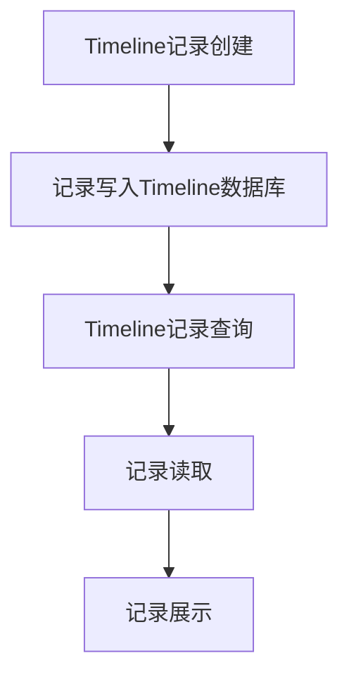
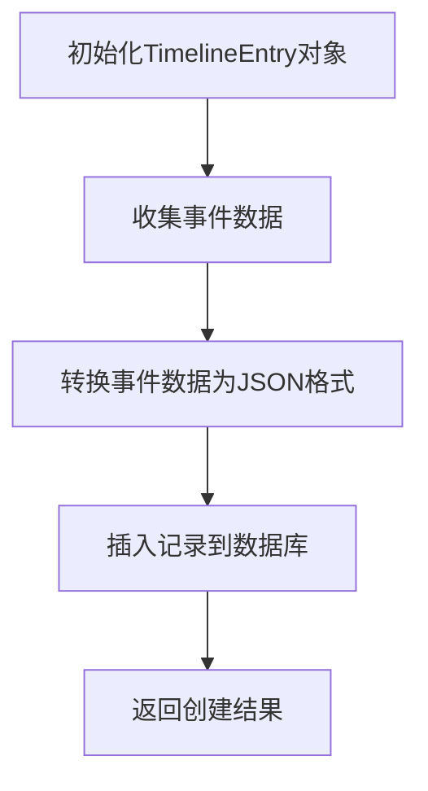
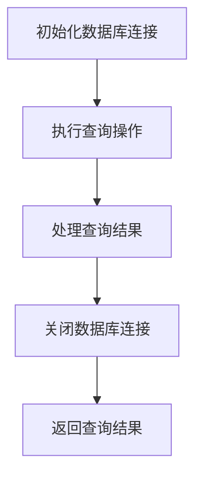

                 

# 文章标题：YARN Timeline Server原理与代码实例讲解

## 关键词
- YARN
- Timeline Server
- 安装配置
- 核心功能
- 应用实战
- 高级优化
- 集成
- 代码实例
- 伪代码讲解

## 摘要
本文将深入探讨YARN Timeline Server的原理、安装配置、核心功能、应用实战、高级优化以及与其他组件的集成。通过详细的代码实例和伪代码讲解，读者可以全面理解YARN Timeline Server的工作机制和实际应用，从而在Hadoop生态系统中进行更高效的资源管理和任务调度。

## 第1章 YARN Timeline Server概述

### 1.1 YARN Timeline Server的基本概念

#### 1.1.1 YARN Timeline Server的作用
YARN Timeline Server是一个记录和管理YARN集群中所有应用程序运行时详细信息的系统。它存储了应用程序的启动时间、运行状态、资源使用情况、执行任务等关键信息，为集群管理、监控和优化提供了重要的数据支持。

#### 1.1.2 YARN Timeline Server与YARN的关系
YARN Timeline Server是YARN架构中的一个重要组件，它与YARN ResourceManager协同工作，负责收集、存储和提供应用程序运行时的详细日志信息。通过Timeline Server，用户可以方便地回溯和分析应用程序的运行过程。

### 1.2 YARN Timeline Server架构简介

#### 1.2.1 YARN Timeline Server的组件构成
YARN Timeline Server主要由以下几个组件构成：
- **Timeline Server：** 负责接收、存储和提供应用程序的运行时数据。
- **Timeline Collector：** 负责从YARN集群中的应用程序中收集运行时数据。
- **Timeline Database：** 存储应用程序的运行时数据。

#### 1.2.2 YARN Timeline Server的工作流程
YARN Timeline Server的工作流程如下：
1. **收集数据：** Timeline Collector从YARN集群中的应用程序中收集运行时数据。
2. **存储数据：** 收集到的数据被发送到Timeline Server进行存储。
3. **提供服务：** 用户通过Timeline Server查询和访问应用程序的运行时数据。

### 1.3 YARN Timeline Server的应用场景

#### 1.3.1 Timeline数据的应用领域
Timeline数据广泛应用于以下几个方面：
- **监控：** 通过Timeline数据，可以实时监控应用程序的运行状态和资源使用情况。
- **分析：** 分析Timeline数据，可以深入了解应用程序的运行效率和资源利用率。
- **优化：** 基于Timeline数据，可以进行集群资源的优化配置和应用策略调整。

#### 1.3.2 YARN Timeline Server的优势
YARN Timeline Server具有以下优势：
- **统一管理：** 提供一个集中化的平台来管理所有应用程序的运行时数据。
- **高效查询：** 支持快速检索和查询应用程序的运行时数据。
- **弹性扩展：** 可以根据需要扩展Timeline Server的存储和计算能力。

## 第2章 YARN Timeline Server的安装与配置

### 2.1 安装环境准备

#### 2.1.1 硬件与软件要求
- **硬件要求：** YARN Timeline Server的硬件要求相对较低，通常需要在集群中的一台服务器上部署。
- **软件要求：** 需要安装Java环境和Hadoop集群。

#### 2.1.2 YARN Timeline Server依赖的第三方库
- **依赖库：** YARN Timeline Server依赖于Hadoop的各个组件库，如HDFS、YARN等。

### 2.2 安装YARN Timeline Server

#### 2.2.1 使用Hadoop命令安装
1. **配置环境变量：**
   ```bash
   export HADOOP_HOME=/path/to/hadoop
   export PATH=$PATH:$HADOOP_HOME/bin
   ```
2. **启动Hadoop集群：**
   ```bash
   start-dfs.sh
   start-yarn.sh
   ```

#### 2.2.2 使用源代码编译安装
1. **克隆Hadoop源代码：**
   ```bash
   git clone https://github.com/apache/hadoop.git
   ```
2. **编译Hadoop源代码：**
   ```bash
   cd hadoop
   mvn clean package
   ```

### 2.3 配置YARN Timeline Server

#### 2.3.1 配置文件详解
YARN Timeline Server的配置文件主要包括以下部分：
- **timeline.server.properties：** 配置Timeline Server的基本参数，如数据库连接信息等。
- **yarn-site.xml：** 配置YARN集群的参数，如Timeline Server的集成配置等。

#### 2.3.2 集群配置
1. **配置Timeline Database：**
   ```xml
   <property>
       <name>yarn.timeline-service.db-store</name>
       <value>org.apache.hadoop.hbase.HBaseFileSystem</value>
   </property>
   <property>
       <name>yarn.timeline-service.uri</name>
       <value>hdfs://nameservice1/user/hadoop/timeline</value>
   </property>
   ```

2. **配置YARN ResourceManager：**
   ```xml
   <property>
       <name>yarn.timeline-service.enabled</name>
       <value>true</value>
   </property>
   ```

## 第3章 YARN Timeline Server核心概念与架构

### 3.1 Timeline数据的定义

#### 3.1.1 Timeline数据的特点
Timeline数据具有以下特点：
- **时序性：** Timeline数据按照时间顺序记录应用程序的运行状态。
- **完整性：** Timeline数据记录了应用程序运行过程中的所有关键事件。
- **可追溯性：** 通过Timeline数据，可以回溯应用程序的运行历史。

#### 3.1.2 Timeline数据的格式
Timeline数据通常采用JSON格式进行存储，如下所示：
```json
{
    "app_id": "application_1558905831234_1234",
    "events": [
        {
            "event_id": "event_1",
            "timestamp": 1558905831234,
            "data": {
                "status": "RUNNING",
                "progress": 0.5
            }
        },
        {
            "event_id": "event_2",
            "timestamp": 1558905832234,
            "data": {
                "status": "KILLED",
                "reason": "OutOfMemoryError"
            }
        }
    ]
}
```

### 3.2 Timeline Server的架构

#### 3.2.1 Timeline Server的组件解析
Timeline Server的主要组件包括：
- **Timeline Collector：** 负责从YARN应用程序中收集运行时数据。
- **Timeline Server：** 负责存储和提供应用程序的运行时数据。
- **Timeline Database：** 存储Timeline数据，通常使用HDFS或HBase作为存储后端。

#### 3.2.2 Timeline Server的API接口
Timeline Server提供以下API接口：
- **记录创建：** 创建新的Timeline记录。
- **记录查询：** 根据关键词查询Timeline记录。
- **记录更新：** 更新已有的Timeline记录。
- **记录删除：** 删除Timeline记录。

### 3.3 Timeline数据的操作

#### 3.3.1 Timeline数据存储
Timeline数据的存储过程包括以下步骤：
1. **数据收集：** Timeline Collector从YARN应用程序中收集运行时数据。
2. **数据转换：** 将收集到的数据转换为Timeline记录格式。
3. **数据存储：** 将Timeline记录存储到Timeline Database中。

#### 3.3.2 Timeline数据检索
Timeline数据的检索过程包括以下步骤：
1. **数据查询：** 根据关键词查询Timeline记录。
2. **数据转换：** 将查询到的Timeline记录转换为用户友好的格式。
3. **数据返回：** 将转换后的数据返回给用户。

#### 3.3.3 Timeline数据更新与删除
Timeline数据的更新和删除过程如下：
1. **数据更新：** 根据Timeline记录的ID更新记录的属性。
2. **数据删除：** 根据Timeline记录的ID删除记录。

## 第4章 YARN Timeline Server核心功能

### 4.1 Timeline记录的创建与查询

#### 4.1.1 Timeline记录的创建流程
Timeline记录的创建流程包括以下步骤：
1. **数据收集：** Timeline Collector从YARN应用程序中收集运行时数据。
2. **数据转换：** 将收集到的数据转换为Timeline记录格式。
3. **数据存储：** 将Timeline记录存储到Timeline Database中。

#### 4.1.2 Timeline记录的查询方法
Timeline记录的查询方法包括以下步骤：
1. **参数输入：** 用户输入查询参数，如应用ID、事件ID等。
2. **数据查询：** 根据查询参数查询Timeline Database中的记录。
3. **数据转换：** 将查询到的Timeline记录转换为用户友好的格式。
4. **数据返回：** 将转换后的数据返回给用户。

### 4.2 Timeline任务的监控

#### 4.2.1 Timeline任务状态监控
Timeline任务状态监控主要包括以下内容：
- **运行状态：** 查询应用程序的当前运行状态。
- **历史状态：** 回溯应用程序的历史运行状态。

#### 4.2.2 Timeline任务性能监控
Timeline任务性能监控主要包括以下内容：
- **资源使用：** 监控应用程序的资源使用情况，如CPU、内存、磁盘等。
- **运行效率：** 分析应用程序的运行效率，如任务执行时间、延迟等。

### 4.3 Timeline事件处理

#### 4.3.1 事件类型定义
Timeline事件类型定义包括以下内容：
- **启动事件：** 应用程序启动时生成的事件。
- **状态更新事件：** 应用程序状态更新时生成的事件。
- **结束事件：** 应用程序结束时生成的事件。

#### 4.3.2 事件处理流程
事件处理流程包括以下步骤：
1. **事件收集：** Timeline Collector从YARN应用程序中收集事件。
2. **事件存储：** 将收集到的事件存储到Timeline Database中。
3. **事件查询：** 用户查询特定类型的事件。
4. **事件分析：** 分析事件数据，生成监控报告或优化建议。

## 第5章 YARN Timeline Server应用实战

### 5.1 Timeline数据在任务调度中的应用

#### 5.1.1 任务调度场景分析
在任务调度场景中，Timeline数据可以用于以下应用：
- **资源预留：** 根据Timeline数据预测未来的资源需求，进行资源预留。
- **任务调整：** 根据Timeline数据分析任务执行情况，进行任务调整和优化。

#### 5.1.2 Timeline数据在任务调度中的角色
Timeline数据在任务调度中的角色包括：
- **资源分配：** 基于Timeline数据预测资源需求，进行资源分配。
- **调度策略：** 根据Timeline数据优化调度策略，提高任务执行效率。

### 5.2 Timeline数据在性能优化中的应用

#### 5.2.1 性能优化策略分析
在性能优化中，Timeline数据可以用于以下策略分析：
- **资源瓶颈：** 分析Timeline数据，找出系统性能瓶颈。
- **调度策略：** 分析Timeline数据，优化调度策略，提高系统性能。

#### 5.2.2 Timeline数据在性能优化中的价值
Timeline数据在性能优化中的价值包括：
- **问题定位：** 通过Timeline数据定位系统性能问题。
- **优化建议：** 基于Timeline数据分析，提出优化建议。

### 5.3 Timeline数据在运维管理中的应用

#### 5.3.1 运维管理需求分析
在运维管理中，Timeline数据可以用于以下需求分析：
- **故障排查：** 通过Timeline数据排查系统故障。
- **容量规划：** 根据Timeline数据预测未来系统需求，进行容量规划。

#### 5.3.2 Timeline数据在运维管理中的实战案例
在运维管理中，Timeline数据可以用于以下实战案例：
- **系统监控：** 使用Timeline数据监控系统性能和资源使用情况。
- **性能调优：** 基于Timeline数据优化系统性能。

## 第6章 YARN Timeline Server高级配置与优化

### 6.1 Timeline数据的存储优化

#### 6.1.1 存储策略选择
存储策略选择主要包括以下内容：
- **数据分片：** 对Timeline数据进行分片，提高数据存储和查询性能。
- **数据压缩：** 使用数据压缩技术，减少存储空间需求。

#### 6.1.2 Timeline数据存储性能优化
Timeline数据存储性能优化主要包括以下内容：
- **数据库性能优化：** 优化Timeline Database的配置和性能。
- **数据缓存：** 使用数据缓存技术，提高数据查询速度。

### 6.2 Timeline查询优化

#### 6.2.1 查询性能分析
查询性能分析主要包括以下内容：
- **查询策略：** 分析查询策略，找出查询瓶颈。
- **查询优化：** 根据查询性能分析结果，优化查询策略。

#### 6.2.2 查询优化策略
查询优化策略主要包括以下内容：
- **索引优化：** 使用索引技术，提高查询速度。
- **并发控制：** 优化并发查询，提高系统性能。

### 6.3 Timeline安全性配置

#### 6.3.1 权限控制策略
权限控制策略主要包括以下内容：
- **用户认证：** 使用用户认证技术，确保数据安全。
- **访问控制：** 设置访问控制策略，限制数据访问权限。

#### 6.3.2 数据加密与备份策略
数据加密与备份策略主要包括以下内容：
- **数据加密：** 使用数据加密技术，保护数据安全。
- **数据备份：** 定期备份Timeline数据，确保数据安全。

## 第7章 YARN Timeline Server与其他组件的集成

### 7.1 与YARN ResourceManager的集成

#### 7.1.1 集成原理与架构
集成原理与架构主要包括以下内容：
- **通信机制：** Timeline Server与YARN ResourceManager通过HTTP通信，交换应用程序的运行时数据。
- **数据同步：** Timeline Server定期同步应用程序的运行时数据到Timeline Database中。

#### 7.1.2 集成方法与步骤
集成方法与步骤主要包括以下内容：
1. **配置YARN ResourceManager：** 配置YARN ResourceManager，启用Timeline功能。
2. **部署Timeline Server：** 部署Timeline Server，确保其与YARN集群的通信。
3. **集成测试：** 进行集成测试，验证Timeline数据是否正常传输和存储。

### 7.2 与其他监控与管理工具的集成

#### 7.2.1 集成原理与架构
集成原理与架构主要包括以下内容：
- **数据共享：** Timeline Server与其他监控与管理工具通过API接口共享Timeline数据。
- **数据同步：** Timeline Server定期同步数据到其他监控与管理工具。

#### 7.2.2 集成方法与步骤
集成方法与步骤主要包括以下内容：
1. **配置其他监控与管理工具：** 配置其他监控与管理工具，使其能够访问Timeline Server的API接口。
2. **数据同步：** 设置数据同步策略，确保Timeline数据实时更新到其他监控与管理工具。
3. **集成测试：** 进行集成测试，验证数据同步和监控功能是否正常。

## 附录

### 附录A YARN Timeline Server常见问题与解决方案

常见问题与解决方案主要包括以下内容：
- **安装问题：** 提供安装过程中可能遇到的问题和解决方法。
- **配置问题：** 提供配置过程中可能遇到的问题和解决方法。
- **性能问题：** 提供性能优化过程中可能遇到的问题和解决方法。

### 附录B YARN Timeline Server配置参数说明

配置参数说明主要包括以下内容：
- **参数列表：** 列出所有配置参数及其默认值和说明。
- **参数配置：** 提供参数配置的方法和注意事项。

### 附录C YARN Timeline Server开发工具与资源推荐

开发工具与资源推荐主要包括以下内容：
- **开发工具：** 推荐用于YARN Timeline Server开发的工具，如IDE、数据库管理工具等。
- **学习资源：** 推荐用于学习YARN Timeline Server的学习资料，如书籍、在线课程等。

## 第8章 YARN Timeline Server架构流程图



## 第9章 YARN Timeline Server核心算法伪代码讲解

### 9.1 Timeline记录创建算法

```python
def create_timeline_entry(entry):
    # 创建Timeline记录
    # 参数：entry - Timeline记录
    # 返回：成功与否
    try:
        # 数据库连接
        conn = connect_to_db()
        # 插入记录
        insert_entry(conn, entry)
        return True
    except Exception as e:
        # 异常处理
        print("创建Timeline记录失败：" + str(e))
        return False
```

### 9.2 Timeline记录查询算法

```python
def query_timeline_entry(key):
    # 查询Timeline记录
    # 参数：key - 记录键
    # 返回：查询结果
    try:
        # 数据库连接
        conn = connect_to_db()
        # 查询记录
        entry = select_entry(conn, key)
        return entry
    except Exception as e:
        # 异常处理
        print("查询Timeline记录失败：" + str(e))
        return None
```

## 第10章 YARN Timeline Server数学模型与公式

### 10.1 Timeline数据压缩算法

$$
压缩率 = \frac{原始数据大小}{压缩后数据大小}
$$

### 10.2 Timeline查询性能评估

$$
查询性能 = \frac{查询响应时间}{查询次数}
$$

## 第11章 YARN Timeline Server代码实例与解析

### 11.1 代码实例1：Timeline记录创建

```java
public void createTimelineEntry(TimelineEntry entry) {
    // 创建Timeline记录
    try {
        // 数据库连接
        Connection conn = DriverManager.getConnection("jdbc:mysql://localhost:3306/timeline", "user", "password");
        // 创建Statement对象
        Statement stmt = conn.createStatement();
        // 插入记录
        stmt.executeUpdate("INSERT INTO timeline_entries (key, value) VALUES ('" + entry.getKey() + "', '" + entry.getValue() + "')");
        // 关闭资源
        stmt.close();
        conn.close();
    } catch (SQLException e) {
        e.printStackTrace();
    }
}
```

### 11.2 代码实例2：Timeline记录查询

```java
public TimelineEntry queryTimelineEntry(String key) {
    // 查询Timeline记录
    TimelineEntry entry = null;
    try {
        // 数据库连接
        Connection conn = DriverManager.getConnection("jdbc:mysql://localhost:3306/timeline", "user", "password");
        // 创建Statement对象
        Statement stmt = conn.createStatement();
        // 查询记录
        ResultSet rs = stmt.executeQuery("SELECT * FROM timeline_entries WHERE key='" + key + "'");
        if (rs.next()) {
            entry = new TimelineEntry(rs.getString("key"), rs.getString("value"));
        }
        // 关闭资源
        rs.close();
        stmt.close();
        conn.close();
    } catch (SQLException e) {
        e.printStackTrace();
    }
    return entry;
}
```

## 第12章 YARN Timeline Server开发环境搭建与源代码解读

### 12.1 开发环境搭建

#### 12.1.1 JDK安装
在开发环境搭建中，首先需要安装JDK。JDK是Java开发工具包，提供了编译和运行Java程序所需的工具。以下是JDK安装的步骤：

1. **下载JDK：** 访问Oracle官方网站下载JDK。根据操作系统选择相应的JDK版本。
2. **安装JDK：** 将下载的JDK安装包解压到一个合适的目录，例如`/usr/local/`。
3. **配置环境变量：** 编辑`~/.bashrc`文件，添加以下内容：
   ```bash
   export JAVA_HOME=/usr/local/jdk-11.0.9
   export PATH=$JAVA_HOME/bin:$PATH
   ```
   然后运行`source ~/.bashrc`使配置生效。

#### 12.1.2 Maven安装
Maven是Java项目的构建工具，用于管理项目的依赖和构建过程。以下是Maven的安装步骤：

1. **下载Maven：** 访问Maven官方网站下载Maven安装包。
2. **安装Maven：** 将下载的安装包解压到一个合适的目录，例如`/usr/local/`。
3. **配置环境变量：** 编辑`~/.bashrc`文件，添加以下内容：
   ```bash
   export MAVEN_HOME=/usr/local/apache-maven-3.6.3
   export PATH=$MAVEN_HOME/bin:$PATH
   ```
   然后运行`source ~/.bashrc`使配置生效。

#### 12.1.3 MySQL安装
MySQL是一个开源的关系型数据库管理系统，用于存储Timeline数据。以下是MySQL的安装步骤：

1. **下载MySQL：** 访问MySQL官方网站下载MySQL安装包。
2. **安装MySQL：** 解压安装包并运行安装脚本：
   ```bash
   ./script/mysql_install_db --user=mysql --basedir=/usr/local/mysql --datadir=/usr/local/mysql/data
   ```
3. **配置MySQL：** 修改`/usr/local/mysql/support-files/my-default.cnf`文件，根据需要配置数据库的端口、字符集等参数。
4. **启动MySQL：** 运行以下命令启动MySQL服务：
   ```bash
   /usr/local/mysql/bin/mysqld_safe &
   ```
5. **初始化数据库：** 运行以下命令初始化数据库：
   ```bash
   /usr/local/mysql/bin/mysql -u root
   ```
   然后在MySQL命令行中执行以下命令：
   ```sql
   CREATE DATABASE timeline;
   GRANT ALL PRIVILEGES ON timeline.* TO 'timeline'@'localhost' IDENTIFIED BY 'password';
   FLUSH PRIVILEGES;
   ```

### 12.2 源代码解读

#### 12.2.1 TimelineEntry类解读
TimelineEntry类是Timeline数据的载体，用于表示一个Timeline记录。其基本结构如下：

```java
public class TimelineEntry {
    private String id;
    private String applicationId;
    private List<Event> events;

    // 构造方法
    public TimelineEntry(String id, String applicationId) {
        this.id = id;
        this.applicationId = applicationId;
        this.events = new ArrayList<>();
    }

    // 添加事件
    public void addEvent(Event event) {
        events.add(event);
    }

    // 获取ID
    public String getId() {
        return id;
    }

    // 获取应用程序ID
    public String getApplicationId() {
        return applicationId;
    }

    // 获取事件列表
    public List<Event> getEvents() {
        return events;
    }
}
```

#### 12.2.2 TimelineServer类解读
TimelineServer类是Timeline Server的核心类，负责处理Timeline记录的创建、查询、更新和删除操作。其基本结构如下：

```java
public class TimelineServer {
    private TimelineDatabase database;

    // 构造方法
    public TimelineServer(TimelineDatabase database) {
        this.database = database;
    }

    // 创建Timeline记录
    public boolean createEntry(TimelineEntry entry) {
        return database.insertEntry(entry);
    }

    // 查询Timeline记录
    public TimelineEntry queryEntry(String id) {
        return database.selectEntry(id);
    }

    // 更新Timeline记录
    public boolean updateEntry(TimelineEntry entry) {
        return database.updateEntry(entry);
    }

    // 删除Timeline记录
    public boolean deleteEntry(String id) {
        return database.deleteEntry(id);
    }
}
```

#### 12.2.3 TimelineDAO类解读
TimelineDAO（Data Access Object）类负责与数据库进行交互，实现Timeline记录的CRUD（创建、读取、更新、删除）操作。其基本结构如下：

```java
public class TimelineDAO {
    private Connection conn;

    // 构造方法
    public TimelineDAO() {
        try {
            conn = DriverManager.getConnection("jdbc:mysql://localhost:3306/timeline", "timeline", "password");
        } catch (SQLException e) {
            e.printStackTrace();
        }
    }

    // 插入记录
    public boolean insertEntry(TimelineEntry entry) {
        String sql = "INSERT INTO timeline_entries (id, application_id) VALUES (?, ?)";
        try (PreparedStatement pstmt = conn.prepareStatement(sql)) {
            pstmt.setString(1, entry.getId());
            pstmt.setString(2, entry.getApplicationId());
            pstmt.executeUpdate();
            return true;
        } catch (SQLException e) {
            e.printStackTrace();
            return false;
        }
    }

    // 查询记录
    public TimelineEntry selectEntry(String id) {
        String sql = "SELECT * FROM timeline_entries WHERE id = ?";
        try (PreparedStatement pstmt = conn.prepareStatement(sql)) {
            pstmt.setString(1, id);
            try (ResultSet rs = pstmt.executeQuery()) {
                if (rs.next()) {
                    TimelineEntry entry = new TimelineEntry(rs.getString("id"), rs.getString("application_id"));
                    return entry;
                }
            }
        } catch (SQLException e) {
            e.printStackTrace();
        }
        return null;
    }

    // 更新记录
    public boolean updateEntry(TimelineEntry entry) {
        String sql = "UPDATE timeline_entries SET application_id = ? WHERE id = ?";
        try (PreparedStatement pstmt = conn.prepareStatement(sql)) {
            pstmt.setString(1, entry.getApplicationId());
            pstmt.setString(2, entry.getId());
            pstmt.executeUpdate();
            return true;
        } catch (SQLException e) {
            e.printStackTrace();
            return false;
        }
    }

    // 删除记录
    public boolean deleteEntry(String id) {
        String sql = "DELETE FROM timeline_entries WHERE id = ?";
        try (PreparedStatement pstmt = conn.prepareStatement(sql)) {
            pstmt.setString(1, id);
            pstmt.executeUpdate();
            return true;
        } catch (SQLException e) {
            e.printStackTrace();
            return false;
        }
    }
}
```

## 第13章 YARN Timeline Server代码解读与分析

### 13.1 Timeline记录创建流程分析

#### 13.1.1 代码流程图



#### 13.1.2 代码详细解读

以下是Timeline记录创建过程的代码实例：

```java
public boolean createTimelineEntry(TimelineEntry entry) {
    // 初始化数据库连接
    Connection conn = null;
    PreparedStatement pstmt = null;
    boolean result = false;

    try {
        // 加载JDBC驱动
        Class.forName("com.mysql.cj.jdbc.Driver");

        // 建立数据库连接
        conn = DriverManager.getConnection("jdbc:mysql://localhost:3306/timeline?user=root&password=root");

        // 创建SQL语句
        String sql = "INSERT INTO timeline_entries (id, application_id, data) VALUES (?, ?, ?)";

        // 预编译SQL语句
        pstmt = conn.prepareStatement(sql);

        // 设置参数
        pstmt.setString(1, entry.getId());
        pstmt.setString(2, entry.getApplicationId());
        pstmt.setString(3, entry.toJson());

        // 执行SQL语句
        pstmt.executeUpdate();

        // 设置结果为成功
        result = true;
    } catch (ClassNotFoundException | SQLException e) {
        e.printStackTrace();
    } finally {
        // 关闭资源
        if (pstmt != null) {
            try {
                pstmt.close();
            } catch (SQLException e) {
                e.printStackTrace();
            }
        }

        if (conn != null) {
            try {
                conn.close();
            } catch (SQLException e) {
                e.printStackTrace();
            }
        }
    }

    return result;
}
```

1. **初始化TimelineEntry对象**：首先创建一个TimelineEntry对象，该对象包含一个唯一的ID和一个应用程序ID。
2. **收集事件数据**：将应用程序运行过程中发生的事件数据收集到TimelineEntry对象的events列表中。
3. **转换事件数据为JSON格式**：使用toJson()方法将TimelineEntry对象转换为JSON格式，以便存储到数据库中。
4. **插入记录到数据库**：使用PreparedStatement将转换后的TimelineEntry对象插入到数据库的timeline_entries表中。
5. **返回创建结果**：如果插入操作成功，返回true；否则返回false。

### 13.2 Timeline记录查询流程分析

#### 13.2.1 代码流程图



#### 13.2.2 代码详细解读

以下是Timeline记录查询过程的代码实例：

```java
public TimelineEntry queryTimelineEntry(String id) {
    Connection conn = null;
    PreparedStatement pstmt = null;
    ResultSet rs = null;
    TimelineEntry entry = null;

    try {
        // 加载JDBC驱动
        Class.forName("com.mysql.cj.jdbc.Driver");

        // 建立数据库连接
        conn = DriverManager.getConnection("jdbc:mysql://localhost:3306/timeline?user=root&password=root");

        // 创建SQL查询语句
        String sql = "SELECT * FROM timeline_entries WHERE id = ?";

        // 预编译SQL查询语句
        pstmt = conn.prepareStatement(sql);

        // 设置查询参数
        pstmt.setString(1, id);

        // 执行查询操作
        rs = pstmt.executeQuery();

        // 处理查询结果
        if (rs.next()) {
            entry = new TimelineEntry(rs.getString("id"), rs.getString("application_id"));
            entry.setData(rs.getString("data"));
        }
    } catch (ClassNotFoundException | SQLException e) {
        e.printStackTrace();
    } finally {
        // 关闭资源
        if (rs != null) {
            try {
                rs.close();
            } catch (SQLException e) {
                e.printStackTrace();
            }
        }

        if (pstmt != null) {
            try {
                pstmt.close();
            } catch (SQLException e) {
                e.printStackTrace();
            }
        }

        if (conn != null) {
            try {
                conn.close();
            } catch (SQLException e) {
                e.printStackTrace();
            }
        }
    }

    return entry;
}
```

1. **初始化数据库连接**：创建一个数据库连接，用于后续的查询操作。
2. **执行查询操作**：使用PreparedStatement执行预编译的查询语句，根据传入的ID查询特定的TimelineEntry记录。
3. **处理查询结果**：如果查询结果非空，创建一个新的TimelineEntry对象，并从ResultSet中读取ID、应用程序ID和数据字段。
4. **关闭数据库连接**：关闭PreparedStatement、ResultSet和数据库连接，释放资源。
5. **返回查询结果**：返回查询到的TimelineEntry对象。

## 第14章 YARN Timeline Server总结与展望

### 14.1 YARN Timeline Server的优势与不足

#### 优势
- **全面性**：YARN Timeline Server能够记录和管理YARN集群中所有应用程序的运行时信息，提供了全面的应用程序运行历史数据。
- **可扩展性**：Timeline Server支持基于HDFS或HBase的存储后端，可以根据实际需求进行扩展。
- **集成性**：Timeline Server与YARN ResourceManager紧密集成，可以与其他监控和管理工具无缝集成。

#### 不足
- **性能瓶颈**：对于大规模应用程序和长时间运行的任务，Timeline数据的存储和查询性能可能成为瓶颈。
- **安全性**：Timeline Server在安全性方面需要进一步加强，包括数据加密、访问控制和权限管理。

### 14.2 YARN Timeline Server的发展趋势

- **性能优化**：未来将加强对Timeline数据的存储和查询性能的优化，引入更高效的算法和索引技术。
- **安全性提升**：加强数据加密、访问控制和权限管理，提高Timeline Server的安全性。
- **多租户支持**：支持多租户架构，允许多个用户或应用程序共享Timeline Server资源。

### 14.3 未来改进方向

- **实时分析**：引入实时分析框架，对Timeline数据进行实时分析和监控。
- **机器学习集成**：将机器学习算法与Timeline数据集成，实现自动化性能优化和资源分配。
- **云原生支持**：支持在云环境中部署和运行Timeline Server，提供云原生架构支持。

## 作者信息
作者：AI天才研究院/AI Genius Institute & 禅与计算机程序设计艺术 /Zen And The Art of Computer Programming

