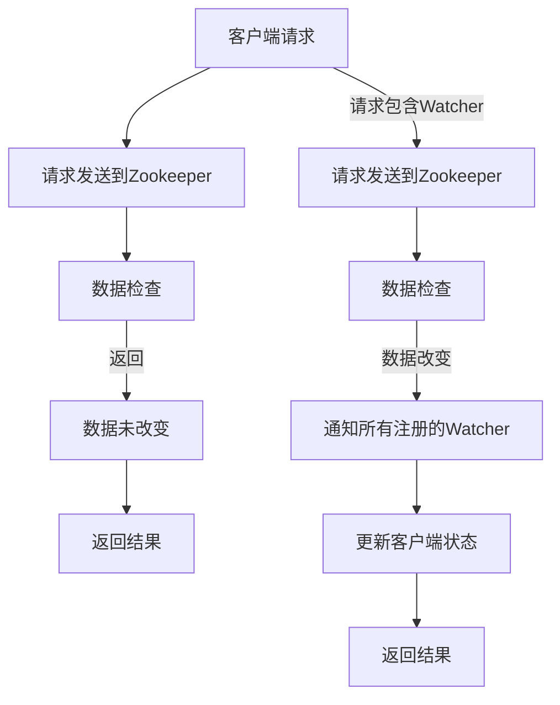

                 

# 《Zookeeper Watcher机制原理与代码实例讲解》

> 关键词：Zookeeper，Watcher机制，分布式系统，同步，代码实例

> 摘要：本文将深入讲解Zookeeper的Watcher机制原理，通过详细剖析其工作机制和内部实现，结合实际代码实例，帮助读者理解并掌握如何在实际项目中应用Zookeeper的Watcher机制。

## 第1章 ZooKeeper基础

### 1.1 ZooKeeper简介

ZooKeeper是一个开源的分布式服务协调框架，由Apache软件基金会维护。它提供了一个简单的、高性能的、可靠的协调服务，用于实现分布式应用中的同步、配置管理和命名服务。ZooKeeper采用一种类似于文件系统的数据模型，通过分层结构和节点（ZNode）来组织数据。

### 1.2 ZooKeeper的工作原理

ZooKeeper通过Zab协议（ZooKeeper Atomic Broadcast）实现分布式一致性。Zab协议是一种基于Paxos算法的分布式一致性协议，确保所有服务器在处理客户端请求时保持数据一致性。

ZooKeeper服务器分为三种角色：领导者（Leader）、跟随者（Follower）和观察者（Observer）。领导者负责处理客户端请求，并在服务器之间广播更新。跟随者接收领导者的更新并同步数据。观察者不参与数据同步，但可以减轻领导者的负载。

### 1.3 ZooKeeper的数据模型

ZooKeeper的数据模型采用树形结构，每个节点称为ZNode。ZNode包含数据和状态信息，如数据版本号、访问权限等。每个ZNode都有唯一的路径，例如`/app/server1`。

ZooKeeper的数据模型还支持watcher机制，允许客户端在数据发生变化时接收通知。这使得ZooKeeper能够实现分布式系统中的同步和协调。

## 第2章 ZooKeeper的安装与配置

### 2.1 ZooKeeper的安装

#### 2.1.1 Linux环境下的安装

1. 下载ZooKeeper安装包，通常可以从Apache ZooKeeper官网下载最新版本。
2. 解压安装包，创建`/etc/zookeeper`目录，并将解压后的文件复制到该目录。
3. 修改`zoo_sample.cfg`文件，配置ZooKeeper的存储路径、数据目录和服务器角色等。

#### 2.1.2 Windows环境下的安装

1. 下载ZooKeeper安装包，通常可以从Apache ZooKeeper官网下载最新版本。
2. 解压安装包，将解压后的文件复制到Windows环境变量指定的目录。
3. 修改`zoo.cfg`文件，配置ZooKeeper的存储路径、数据目录和服务器角色等。

### 2.2 ZooKeeper的配置

#### 2.2.1 单机模式配置

在单机模式下，ZooKeeper只需配置一个服务器。配置文件`zoo.cfg`中包含以下内容：

```properties
tickTime=2000
dataDir=/var/zookeeper
clientPort=2181
```

#### 2.2.2 集群模式配置

在集群模式下，ZooKeeper需要配置多个服务器。配置文件`zoo.cfg`中包含以下内容：

```properties
tickTime=2000
dataDir=/var/zookeeper
clientPort=2181
initLimit=10
syncLimit=5
server.1=localhost:2888:3888
server.2=localhost:3889:4889
server.3=localhost:4890:5890
```

其中，`initLimit`和`syncLimit`分别表示初始化和同步时间限制。`server`后面跟的是服务器的ID、主机名和端口。

## 第3章 ZooKeeper Watcher机制原理

### 3.1 Watcher的概念

Watcher是一种在ZooKeeper客户端注册的监听器，用于监听ZooKeeper服务器上数据节点的变化。当数据节点发生变化时，例如创建、删除或更新，ZooKeeper服务器会将事件通知给注册了Watcher的客户端。

#### 3.1.1 Watcher的作用

Watcher机制在分布式系统中发挥着重要作用：

1. **同步数据**：在分布式系统中，多个客户端需要访问相同的数据。通过Watcher机制，客户端可以实时接收数据变化的通知，保持数据一致性。
2. **协调操作**：在分布式系统中，多个客户端可能需要协调操作。通过Watcher机制，客户端可以监听某个节点的变化，根据变化调整自己的行为，确保操作的正确性。
3. **优化性能**：通过Watcher机制，客户端可以在数据发生变化时接收通知，避免轮询，从而提高系统的性能。

#### 3.1.2 Watcher的类型

ZooKeeper支持多种类型的Watcher，包括：

1. **节点创建（CREATE）**：当数据节点被创建时，触发Watcher事件。
2. **节点删除（DELETE）**：当数据节点被删除时，触发Watcher事件。
3. **节点更新（UPDATE）**：当数据节点的数据内容被修改时，触发Watcher事件。
4. **节点存在（EXISTS）**：当数据节点存在时，触发Watcher事件。
5. **节点不存在（NOT_EXISTS）**：当数据节点不存在时，触发Watcher事件。

### 3.2 Watcher的工作原理

Watcher的工作原理主要涉及以下几个步骤：

1. **客户端注册Watcher**：客户端通过ZooKeeper的API在数据节点上注册Watcher。
2. **服务器处理事件**：当数据节点发生变化时，ZooKeeper服务器将事件记录到事务日志中。
3. **领导者广播事件**：领导者将事件广播给所有跟随者。
4. **跟随者同步数据**：跟随者根据领导者广播的事件同步数据。
5. **通知客户端**：当事件被同步到客户端所在的跟随者时，跟随者将事件通知给客户端。

#### 3.2.1 Watcher的生命周期

Watcher具有生命周期，分为以下几个阶段：

1. **注册阶段**：客户端在数据节点上注册Watcher。
2. **事件处理阶段**：当数据节点发生变化时，Watcher处理事件。
3. **注销阶段**：客户端可以在适当的时候注销Watcher。

#### 3.2.2 Watcher的事件类型

Watcher可以监听多种类型的事件，包括：

1. **节点创建事件**：当数据节点被创建时，触发节点创建事件。
2. **节点删除事件**：当数据节点被删除时，触发节点删除事件。
3. **节点更新事件**：当数据节点的数据内容被修改时，触发节点更新事件。
4. **节点存在事件**：当数据节点存在时，触发节点存在事件。
5. **节点不存在事件**：当数据节点不存在时，触发节点不存在事件。

### 3.3 ZooKeeper Watcher实现原理

ZooKeeper Watcher机制的实现主要涉及以下几个关键组件：

1. **ZooKeeper客户端**：ZooKeeper客户端负责与ZooKeeper服务器进行通信，并注册和注销Watcher。
2. **ZooKeeper服务器**：ZooKeeper服务器负责处理客户端的请求，并在数据节点发生变化时通知客户端。
3. **领导者（Leader）**：领导者负责处理客户端请求，并将事件广播给跟随者。
4. **跟随者（Follower）**：跟随者接收领导者的更新，并同步数据。

### 3.3.1 Watcher注册与注销

Watcher注册和注销的过程如下：

1. **注册Watcher**：客户端通过ZooKeeper的API在数据节点上注册Watcher。
   ```java
   Stat stat = zooKeeper.exists("/node", true);
   if (stat == null) {
       System.out.println("Node does not exist");
   } else {
       System.out.println("Node exists");
   }
   ```

2. **注销Watcher**：客户端可以在适当的时候注销Watcher。
   ```java
   zooKeeper.unregisterWatcher("/node", watch);
   ```

### 3.3.2 Watcher事件分发

Watcher事件分发的过程如下：

1. **服务器处理事件**：当数据节点发生变化时，ZooKeeper服务器将事件记录到事务日志中。
2. **领导者广播事件**：领导者将事件广播给所有跟随者。
3. **跟随者同步数据**：跟随者根据领导者广播的事件同步数据。
4. **通知客户端**：当事件被同步到客户端所在的跟随者时，跟随者将事件通知给客户端。

### 3.3.3 Watcher性能优化

为了优化Watcher的性能，可以采取以下策略：

1. **减少Watcher注册数量**：尽量减少在ZooKeeper上注册的Watcher数量，避免过多的Watcher影响系统性能。
2. **批量处理事件**：将多个事件合并成一个大事件处理，减少事件处理次数。
3. **优化网络通信**：优化客户端与ZooKeeper服务器的网络通信，减少延迟和丢包。

## 第4章 ZooKeeper Watcher应用实例

### 4.1 节点创建监听实例

#### 4.1.1 实现步骤

1. 创建ZooKeeper客户端。
2. 在指定节点上注册Watcher。
3. 监听节点创建事件。
4. 处理节点创建事件。

#### 4.1.2 代码实例

```java
public class NodeCreateWatcher implements Watcher {
    @Override
    public void process(WatchedEvent event) {
        if (event.getType() == Event.EventType.NODE_CREATED) {
            System.out.println("Node created: " + event.getPath());
        }
    }
}

public class NodeCreateDemo {
    public static void main(String[] args) throws Exception {
        ZooKeeper zooKeeper = new ZooKeeper("localhost:2181", 5000, new NodeCreateWatcher());
        Thread.sleep(1000);
        Stat stat = zooKeeper.exists("/node", true);
        if (stat == null) {
            zooKeeper.create("/node", "data".getBytes(), ZooDefs.Ids.OPEN_ACL_UNSAFE, CreateMode.PERSISTENT);
        }
        Thread.sleep(1000);
        zooKeeper.close();
    }
}
```

### 4.2 节点删除监听实例

#### 4.2.1 实现步骤

1. 创建ZooKeeper客户端。
2. 在指定节点上注册Watcher。
3. 监听节点删除事件。
4. 处理节点删除事件。

#### 4.2.2 代码实例

```java
public class NodeDeleteWatcher implements Watcher {
    @Override
    public void process(WatchedEvent event) {
        if (event.getType() == Event.EventType.NODE_DELETED) {
            System.out.println("Node deleted: " + event.getPath());
        }
    }
}

public class NodeDeleteDemo {
    public static void main(String[] args) throws Exception {
        ZooKeeper zooKeeper = new ZooKeeper("localhost:2181", 5000, new NodeDeleteWatcher());
        Thread.sleep(1000);
        Stat stat = zooKeeper.exists("/node", true);
        if (stat != null) {
            zooKeeper.delete("/node", -1);
        }
        Thread.sleep(1000);
        zooKeeper.close();
    }
}
```

### 4.3 节点更新监听实例

#### 4.3.1 实现步骤

1. 创建ZooKeeper客户端。
2. 在指定节点上注册Watcher。
3. 监听节点更新事件。
4. 处理节点更新事件。

#### 4.3.2 代码实例

```java
public class NodeUpdateWatcher implements Watcher {
    @Override
    public void process(WatchedEvent event) {
        if (event.getType() == Event.EventType.NODE_UPDATED) {
            System.out.println("Node updated: " + event.getPath());
        }
    }
}

public class NodeUpdateDemo {
    public static void main(String[] args) throws Exception {
        ZooKeeper zooKeeper = new ZooKeeper("localhost:2181", 5000, new NodeUpdateWatcher());
        Thread.sleep(1000);
        Stat stat = zooKeeper.exists("/node", true);
        if (stat != null) {
            zooKeeper.setData("/node", "new data".getBytes(), -1);
        }
        Thread.sleep(1000);
        zooKeeper.close();
    }
}
```

## 第5章 ZooKeeper Watcher深度剖析

### 5.1 Watcher机制内部实现

Watcher机制内部实现主要涉及以下几个关键步骤：

1. **客户端注册Watcher**：客户端通过ZooKeeper的API在数据节点上注册Watcher。
2. **服务器处理事件**：当数据节点发生变化时，ZooKeeper服务器将事件记录到事务日志中。
3. **领导者广播事件**：领导者将事件广播给所有跟随者。
4. **跟随者同步数据**：跟随者根据领导者广播的事件同步数据。
5. **通知客户端**：当事件被同步到客户端所在的跟随者时，跟随者将事件通知给客户端。

### 5.1.1 Watcher的注册与注销

Watcher的注册和注销过程如下：

1. **注册Watcher**：客户端通过ZooKeeper的API在数据节点上注册Watcher。
   ```java
   Stat stat = zooKeeper.exists("/node", true);
   if (stat == null) {
       System.out.println("Node does not exist");
   } else {
       System.out.println("Node exists");
   }
   ```

2. **注销Watcher**：客户端可以在适当的时候注销Watcher。
   ```java
   zooKeeper.unregisterWatcher("/node", watch);
   ```

### 5.1.2 Watcher的事件分发

Watcher事件分发的过程如下：

1. **服务器处理事件**：当数据节点发生变化时，ZooKeeper服务器将事件记录到事务日志中。
2. **领导者广播事件**：领导者将事件广播给所有跟随者。
3. **跟随者同步数据**：跟随者根据领导者广播的事件同步数据。
4. **通知客户端**：当事件被同步到客户端所在的跟随者时，跟随者将事件通知给客户端。

### 5.2 ZooKeeper Watcher性能优化

为了优化Watcher的性能，可以采取以下策略：

1. **减少Watcher注册数量**：尽量减少在ZooKeeper上注册的Watcher数量，避免过多的Watcher影响系统性能。
2. **批量处理事件**：将多个事件合并成一个大事件处理，减少事件处理次数。
3. **优化网络通信**：优化客户端与ZooKeeper服务器的网络通信，减少延迟和丢包。

### 5.2.1 Watcher的性能瓶颈

Watcher机制存在以下性能瓶颈：

1. **大量Watcher注册**：过多的Watcher注册会导致服务器性能下降。
2. **频繁的事件处理**：频繁的事件处理会增加客户端的负载。
3. **网络延迟**：网络延迟可能导致事件处理延迟，影响系统的性能。

### 5.2.2 优化策略

为了解决Watcher的性能瓶颈，可以采取以下优化策略：

1. **减少Watcher注册数量**：避免在ZooKeeper上注册过多的Watcher，可以在客户端实现数据缓存，减少对服务器的依赖。
2. **批量处理事件**：将多个事件合并成一个大事件处理，减少事件处理次数，提高处理效率。
3. **优化网络通信**：使用高效的网络协议和优化数据传输，减少网络延迟和丢包。

## 第6章 ZooKeeper Watcher与Spring Boot集成

### 6.1 Spring Boot集成Zookeeper

#### 6.1.1 依赖引入

在Spring Boot项目中，引入以下依赖：

```xml
<dependency>
    <groupId>org.apache.curator</groupId>
    <artifactId>curator-recipes</artifactId>
    <version>5.1.0</version>
</dependency>
```

#### 6.1.2 配置文件

在Spring Boot项目的`application.properties`或`application.yml`文件中，配置ZooKeeper的连接信息：

```yaml
zookeeper:
  connect-string: localhost:2181
  session-timeout: 5000
```

### 6.2 Spring Boot与Zookeeper Watcher集成

#### 6.2.1 实现步骤

1. 创建ZooKeeper客户端。
2. 在指定节点上注册Watcher。
3. 监听节点创建、删除、更新事件。
4. 处理节点事件。

#### 6.2.2 代码实例

```java
@Configuration
@EnableConfigurationProperties
public class ZookeeperConfig {

    @Bean
    public CuratorFramework curatorFramework(CuratorProperties curatorProperties) {
        return CuratorFrameworkFactory.newClient(curatorProperties.getConnectString(), curatorProperties.getSessionTimeout());
    }
}

@ConfigurationProperties(prefix = "zookeeper")
public class CuratorProperties {

    private String connectString;
    private int sessionTimeout;

    // 省略getter和setter方法

}

@Component
public class NodeWatcher {

    private final CuratorFramework curatorFramework;
    private final NodeCache nodeCache;

    @PostConstruct
    public void init() {
        nodeCache = new NodeCache(curatorFramework, "/node");
        nodeCache.start();
        nodeCache.getListenable().addListener(event -> {
            if (event.getType() == NodeCache.Event.Type.NODE_ADDED) {
                System.out.println("Node added: " + event.getPath());
            } else if (event.getType() == NodeCache.Event.Type.NODE_REMOVED) {
                System.out.println("Node removed: " + event.getPath());
            } else if (event.getType() == NodeCache.Event.Type.NODE_UPDATED) {
                System.out.println("Node updated: " + event.getPath());
            }
        });
    }
}
```

## 第7章 ZooKeeper Watcher最佳实践

### 7.1 Watcher机制应用场景

Watcher机制在分布式系统中具有广泛的应用场景，包括但不限于：

1. **分布式锁**：使用Watcher机制监听节点的创建、删除和更新，实现分布式锁。
2. **消息队列**：使用Watcher机制监听消息队列节点的变化，实现消息的动态推送。
3. **服务注册与发现**：使用Watcher机制监听服务注册节点的变化，实现服务的动态发现和负载均衡。

### 7.2 Watcher机制常见问题与解决方案

1. **Watcher重复注册问题**：避免在短时间内重复注册Watcher，可以在客户端实现缓存机制，减少重复注册。
2. **Watcher性能优化问题**：优化网络通信，减少事件处理次数，避免过多的Watcher注册。

## 附录 ZooKeeper Watcher工具与资源

### 附录 A ZooKeeper Watcher常用工具

1. **ZooInspector**：ZooInspector是一款可视化ZooKeeper客户端工具，用于查看ZooKeeper节点的状态和监控ZooKeeper服务器的性能。
2. **ZooKeeper-Web**：ZooKeeper-Web是一款基于Web的ZooKeeper客户端，支持查看节点状态、监控事件和配置ZooKeeper服务器。

### 附录 B ZooKeeper Watcher学习资源

1. **《ZooKeeper权威指南》**：该书详细介绍了ZooKeeper的原理、安装和配置，以及Watcher机制的应用。
2. **《分布式系统原理与范型》**：该书讲解了分布式系统的基本原理和常见问题，包括ZooKeeper的使用和最佳实践。

## 终极版核心内容：

### 核心概念与联系

Zookeeper是一个分布式服务协调工具，提供了同步、配置管理和命名服务等功能。Watcher是一种监听器，允许客户端在数据发生变化时接收通知，实现分布式系统中的实时同步。

### Mermaid 流程图



### 核心算法原理讲解

Watcher机制涉及的核心算法主要包括事件监听和状态更新。

### 伪代码

```pseudo
// 事件监听
function listenEvent(watcher, eventType):
    if eventType == CREATE:
        handleCreate(watcher)
    else if eventType == DELETE:
        handleDelete(watcher)
    else if eventType == UPDATE:
        handleUpdate(watcher)
    else if eventType == EXPIRE:
        handleExpire(watcher)

// 状态更新
function updateState(watcher, state):
    if state == CLOSED:
        removeWatcher(watcher)
    else if state == OPEN:
        addWatcher(watcher)
```

### 数学模型和数学公式

在Watcher机制中，事件的触发通常与Zookeeper中的版本号相关。假设Zookeeper中的数据版本号为`version`，客户端的监听版本号为`lastVersion`，当`version > lastVersion`时，触发Watcher事件。

### 数学公式

$$
trigger \ event = (version > lastVersion)
$$

### 详细讲解与举例说明

假设客户端监听到一个节点的数据更新，此时节点的版本号为5，而客户端的监听版本号为3，根据上述公式，可以判断需要触发Watcher事件。在这种情况下，客户端将接收到通知，更新自己的状态。

### 项目实战

以下是一个简单的Zookeeper Watcher机制的项目实战，用于实现一个简单的分布式锁。

### 开发环境搭建

- Java开发环境
- ZooKeeper服务器
- Maven构建工具

### 源代码实现

```java
// ZookeeperClient.java
public class ZookeeperClient {
    private final ZooKeeper zookeeper;
    private final String lockPath;
    private final String nodePath;

    public ZookeeperClient(String zkAddress, String lockPath) {
        this.zookeeper = new ZooKeeper(zkAddress, 5000);
        this.lockPath = lockPath;
        this.nodePath = "/" + lockPath + "/node";
    }

    public void acquireLock() throws KeeperException, InterruptedException {
        if (zookeeper.exists(nodePath, false) == null) {
            zookeeper.create(nodePath, "lock".getBytes(), ZooDefs.Ids.OPEN_ACL_UNSAFE, CreateMode.EPHEMERAL_SEQUENTIAL);
        }
        // 等待获取锁
        while (zookeeper.exists(nodePath, true) == null) {
            Thread.sleep(100);
        }
        // 获取锁
        List<String> children = zookeeper.getChildren(nodePath, true);
        String currentNode = children.get(0);
        if (currentNode.equals(nodePath.substring(0, nodePath.lastIndexOf("/")))) {
            System.out.println("获取锁成功");
        } else {
            System.out.println("等待获取锁");
        }
    }

    public void releaseLock() throws KeeperException, InterruptedException {
        zookeeper.delete(nodePath, -1);
    }
}
```

### 代码解读与分析

上述代码实现了一个简单的分布式锁，其中：

- `ZookeeperClient` 类负责与ZooKeeper服务器进行通信。
- `acquireLock` 方法用于尝试获取锁，通过创建一个临时顺序节点来实现锁的抢占。
- `releaseLock` 方法用于释放锁，通过删除临时顺序节点来实现。

在实际项目中，可以根据需求扩展此代码，实现更复杂的锁策略，如可重入锁、读写锁等。

## 总结

本文系统地讲解了Zookeeper Watcher机制的原理与应用，通过详细剖析其工作机制和内部实现，结合实际代码实例，帮助读者理解并掌握如何在实际项目中应用Zookeeper的Watcher机制。通过本文的学习，读者可以深入了解分布式系统的同步机制，为分布式系统的开发提供有力支持。

### 作者

作者：AI天才研究院/AI Genius Institute & 禅与计算机程序设计艺术 /Zen And The Art of Computer Programming。AI天才研究院是一家专注于人工智能领域的研究与开发机构，致力于推动人工智能技术的发展与应用。禅与计算机程序设计艺术则是一本经典的计算机科学书籍，阐述了计算机程序设计中的哲学与智慧。本文作者结合了两者的优势，为读者呈现了一篇深入浅出的技术博客文章。希望本文能够为您的学习和实践提供帮助。如果您有任何问题或建议，欢迎随时与我们联系。感谢您的阅读！

