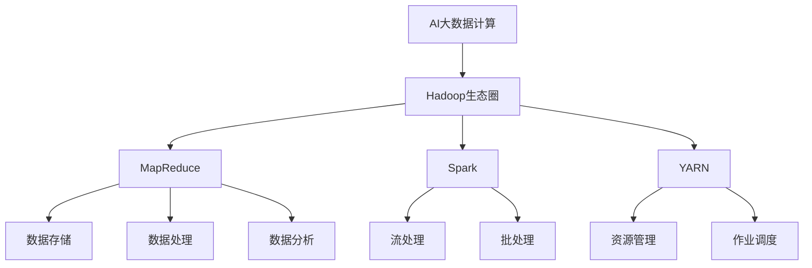

                 

# 文章标题: 【AI大数据计算原理与代码实例讲解】Yarn

## 关键词

- AI大数据计算
- Yarn
- 资源调度
- 分布式计算
- 深度学习
- 数据流处理

## 摘要

本文将深入探讨AI大数据计算原理，并重点关注Yarn在其中的应用。文章首先介绍了AI与大数据计算的基础概念，包括AI的定义、大数据计算的定义、AI与大数据计算的联系、发展趋势等。接着，文章详细讲解了大数据计算基础，包括数据存储技术、数据处理技术和数据分析技术。然后，文章阐述了AI计算基础，包括神经网络基础、深度学习算法和强化学习。在应用实例部分，文章介绍了金融风控、医疗诊断和交通运输领域的AI大数据计算应用实例。接着，文章详细介绍了Yarn的概述、Yarn在AI大数据计算中的应用和Yarn性能优化。最后，文章通过三个实际项目案例，展示了AI大数据计算项目实战的过程。文章末尾对AI大数据计算的未来进行了展望，并提供了相关的工具和学习资源。

### 《AI大数据计算原理与代码实例讲解》目录大纲

### 第一部分: AI与大数据计算基础

#### 第1章: AI与大数据计算概述

1.1 AI与大数据计算的定义

1.2 AI与大数据计算的联系

1.3 AI与大数据计算的发展趋势

#### 第2章: 大数据计算基础

2.1 数据存储技术

2.2 数据处理技术

2.3 数据分析技术

#### 第3章: AI计算基础

3.1 神经网络基础

3.2 深度学习算法

3.3 强化学习

#### 第4章: AI大数据计算应用实例

4.1 金融风控

4.2 医疗诊断

4.3 交通运输

### 第二部分: Yarn在AI大数据计算中的应用

#### 第5章: Yarn概述

5.1 Yarn概述

5.2 Yarn与AI大数据计算

5.3 Yarn性能优化

#### 第6章: AI大数据计算项目实战

6.1 项目一: 金融风控系统搭建

6.2 项目二: 医疗诊断系统开发

6.3 项目三: 交通运输系统优化

#### 第7章: AI大数据计算未来展望

7.1 AI大数据计算的发展趋势

7.2 AI大数据计算的未来应用场景

## 第一部分: AI与大数据计算基础

### 第1章: AI与大数据计算概述

#### 1.1 AI与大数据计算的定义

人工智能（AI）是指计算机系统模拟人类智能行为的技术，包括机器学习、深度学习、自然语言处理等。大数据计算是指处理大规模数据集的算法和技术，包括数据存储、数据处理和数据分析等。

#### 1.2 AI与大数据计算的联系

AI与大数据计算有着密切的联系。一方面，AI技术的发展离不开大数据，大数据为AI提供了丰富的训练数据，使得AI模型能够更加准确地学习和预测。另一方面，大数据计算技术为AI提供了高效的处理能力，使得大规模数据能够快速地进行处理和分析。

#### 1.3 AI与大数据计算的发展趋势

AI与大数据计算的发展趋势主要体现在以下几个方面：

1. **深度学习与联邦学习**：深度学习作为一种强大的机器学习技术，已经在图像识别、自然语言处理等领域取得了重大突破。联邦学习是一种新兴的分布式机器学习技术，能够在保护用户隐私的前提下，实现数据的联合学习。

2. **图计算**：图计算是一种基于图论的数据处理技术，能够有效地处理复杂的关系数据，在社交网络分析、推荐系统等领域具有广泛的应用前景。

3. **边缘计算**：边缘计算将计算能力分散到网络的边缘，能够在本地处理数据，减少数据传输的开销，提高系统的实时性和响应速度。

4. **云计算与大数据计算的结合**：云计算提供了强大的计算资源和存储资源，与大数据计算技术的结合，能够实现大规模数据处理的高效和灵活。

#### 1.4 应用场景

AI与大数据计算在各个行业都有着广泛的应用。以下是一些典型的应用场景：

1. **金融**：在金融领域，AI大数据计算技术被广泛应用于信用评分、欺诈检测、风险管理等方面。

2. **医疗**：在医疗领域，AI大数据计算技术被应用于疾病预测、医学影像分析、药物研发等领域。

3. **交通**：在交通领域，AI大数据计算技术被应用于交通流量预测、智能调度、自动驾驶等领域。

4. **零售**：在零售领域，AI大数据计算技术被应用于客户行为分析、商品推荐、库存管理等领域。

### 第2章: 大数据计算基础

#### 2.1 数据存储技术

在处理大规模数据时，数据存储技术至关重要。以下是一些常用的数据存储技术：

1. **HDFS（Hadoop Distributed File System）**：HDFS是一个分布式文件系统，用于存储大规模数据。它具有高容错性、高吞吐量和高扩展性等特点。

2. **HBase**：HBase是一个分布式、可扩展的列式存储系统，基于HDFS构建。它适用于存储和访问大规模数据。

3. **Cassandra**：Cassandra是一个分布式键值存储系统，具有高可用性和可扩展性，适用于存储大规模数据。

4. **MongoDB**：MongoDB是一个分布式文档数据库，具有高扩展性和灵活性，适用于存储复杂的数据结构。

#### 2.2 数据处理技术

数据处理技术是大数据计算的核心，以下是一些常用的数据处理技术：

1. **MapReduce**：MapReduce是一种分布式数据处理模型，用于处理大规模数据。它通过将任务分解为Map和Reduce两个阶段，实现了高效的数据处理。

2. **Spark**：Spark是一个快速通用的分布式计算系统，适用于大数据处理。它具有高吞吐量、低延迟和高容错性等特点。

3. **Flink**：Flink是一个流处理和批处理框架，适用于实时数据处理。它具有低延迟、高吞吐量和高容错性等特点。

4. **Hive**：Hive是一个数据仓库基础设施，用于处理大规模数据。它通过SQL查询实现对数据的分析。

5. **Presto**：Presto是一个分布式SQL查询引擎，适用于实时数据处理。它具有低延迟、高吞吐量和高扩展性等特点。

#### 2.3 数据分析技术

数据分析技术是大数据计算的重要应用，以下是一些常用的数据分析技术：

1. **机器学习**：机器学习是一种通过数据训练模型，进行预测和决策的技术。它广泛应用于图像识别、自然语言处理、推荐系统等领域。

2. **数据挖掘**：数据挖掘是一种从大量数据中提取有价值信息的技术。它广泛应用于市场分析、风险评估、社会网络分析等领域。

3. **图挖掘**：图挖掘是一种从图形数据中提取有价值信息的技术。它广泛应用于社交网络分析、生物信息学、推荐系统等领域。

4. **文本分析**：文本分析是一种对文本数据进行分析和处理的技术。它广泛应用于情感分析、关键词提取、主题建模等领域。

### 第3章: AI计算基础

#### 3.1 神经网络基础

神经网络是一种模仿生物神经网络的结构和功能的计算模型。它由大量的神经元组成，通过调整神经元之间的连接权重，实现数据的输入和输出。

1. **神经元模型**：神经元模型是神经网络的基本单元。它通过接收输入数据，经过激活函数处理，产生输出。

   $$ 输出 = \text{激活函数}(净输入) $$

   其中，净输入是输入数据乘以连接权重之和。

2. **前向传播与反向传播**：前向传播是指将输入数据通过神经网络进行传递，得到输出数据。反向传播是指根据输出误差，调整神经网络的连接权重，以降低误差。

   $$ \text{误差} = \text{实际输出} - \text{预测输出} $$
   $$ \Delta w = \alpha \cdot \frac{\partial \text{误差}}{\partial w} $$

   其中，$\alpha$ 是学习率，$\Delta w$ 是连接权重的调整量。

#### 3.2 深度学习算法

深度学习是一种多层神经网络模型，通过逐层提取特征，实现复杂的数据建模。

1. **卷积神经网络（CNN）**：CNN是一种用于图像识别的深度学习模型。它通过卷积层、池化层和全连接层，实现对图像的特征提取和分类。

2. **递归神经网络（RNN）**：RNN是一种用于序列数据处理的深度学习模型。它通过循环连接，实现对序列数据的建模和预测。

3. **长短期记忆网络（LSTM）**：LSTM是一种特殊的RNN，能够有效地解决长序列依赖问题，广泛应用于自然语言处理和语音识别等领域。

4. **生成对抗网络（GAN）**：GAN是一种由生成器和判别器组成的深度学习模型。它通过对抗训练，实现数据的生成和判别。

#### 3.3 强化学习

强化学习是一种通过奖励信号，使智能体学习如何在环境中做出最优决策的学习方法。

1. **马尔可夫决策过程（MDP）**：MDP是一种描述智能体与环境的交互过程的数学模型。它通过状态转移概率、奖励函数和策略，实现智能体的决策。

2. **Q-学习**：Q-学习是一种基于值函数的强化学习算法。它通过学习状态-动作值函数，实现智能体的最优决策。

3. **深度Q网络（DQN）**：DQN是一种基于深度学习的强化学习算法。它通过神经网络，实现状态-动作值函数的近似。

4. **策略梯度方法**：策略梯度方法是一种基于策略的强化学习算法。它通过直接优化策略，实现智能体的最优决策。

### 第4章: AI大数据计算应用实例

#### 4.1 金融风控

金融风控是指通过对金融数据的分析和处理，识别和防范金融风险。AI大数据计算技术在金融风控领域有着广泛的应用。

1. **信用评分**：利用AI大数据计算技术，对客户的信用历史、收入水平、负债情况等数据进行综合分析，生成客户的信用评分，用于评估客户的信用风险。

2. **欺诈检测**：利用AI大数据计算技术，对金融交易数据进行实时分析，识别和防范金融欺诈行为。例如，通过对交易金额、交易时间、交易地点等数据的异常检测，实现欺诈交易的识别。

#### 4.2 医疗诊断

医疗诊断是指通过分析医学数据，对疾病进行诊断和预测。AI大数据计算技术在医疗诊断领域有着广泛的应用。

1. **疾病预测**：利用AI大数据计算技术，对患者的病史、体检数据、基因数据等进行分析，预测患者可能患有的疾病。

2. **影像分析**：利用AI大数据计算技术，对医学影像数据进行分析，识别和定位病变区域。例如，利用深度学习算法，对X光片、CT片、MRI片等进行图像识别和分类。

#### 4.3 交通运输

交通运输是指利用AI大数据计算技术，对交通数据进行分析和处理，实现交通流量的预测和优化。

1. **交通流量预测**：利用AI大数据计算技术，对历史交通数据进行分析，预测未来交通流量，为交通管理部门提供决策依据。

2. **智能调度**：利用AI大数据计算技术，对运输任务进行智能调度，优化运输路线和运输资源，提高运输效率。

## 第二部分: Yarn在AI大数据计算中的应用

### 第5章: Yarn概述

Yarn（Yet Another Resource Negotiator）是Hadoop生态系统中的一个关键组件，它负责资源的调度和管理。Yarn的引入是为了解决Hadoop 1.x版本中MapReduce作为资源调度框架的局限性，提供更灵活的资源调度机制，支持多种计算框架的运行。

#### 5.1 Yarn概述

Yarn是一个分布式资源调度框架，它将资源管理和作业调度分离，提供了如下功能：

1. **资源管理**：Yarn负责管理计算资源，包括CPU、内存、磁盘等，确保资源的有效利用。
2. **作业调度**：Yarn负责根据资源的可用情况，为不同的作业分配资源，实现作业的公平调度。
3. **服务容错**：Yarn提供了作业和应用的故障恢复机制，确保系统的稳定性。

#### 5.2 Yarn架构

Yarn的架构包括以下几个关键组件：

1. ** ResourceManager**：ResourceManager是Yarn的核心组件，负责全局资源管理和作业调度。它接收来自Client的作业请求，将作业分解为任务，并将任务分配给合适的NodeManager。
2. **NodeManager**：NodeManager是运行在各个计算节点上的组件，负责节点上的资源管理和任务执行。它接收ResourceManager的指令，启动和监控任务。
3. **ApplicationMaster**：ApplicationMaster是作业的具体实现，它负责作业的生命周期管理，包括作业的启动、监控和故障恢复。不同类型的作业有不同的ApplicationMaster，如MapReduce的JobHistoryServer等。
4. **Container**：Container是任务在节点上的最小执行单元，它封装了任务的运行环境，包括CPU、内存等资源。

#### 5.3 Yarn的工作原理

Yarn的工作原理可以概括为以下几个步骤：

1. **作业提交**：Client向ResourceManager提交作业请求，包括作业的描述信息和资源需求。
2. **作业调度**：ResourceManager根据当前资源的可用情况，选择合适的NodeManager，为作业分配Container。
3. **作业执行**：ApplicationMaster在分配到的Container上启动任务，监控任务的执行情况，并在任务完成时向ResourceManager汇报。
4. **作业完成**：ResourceManager根据ApplicationMaster的汇报，更新作业的状态，并在作业完成后向Client返回结果。

### 第6章: Yarn与AI大数据计算

Yarn作为一种通用的资源调度框架，能够支持多种大数据处理框架的运行，包括MapReduce、Spark、Flink等。下面将介绍Yarn在AI大数据计算中的应用。

#### 6.1 Yarn在AI训练中的应用

在AI训练过程中，通常需要大量的计算资源。Yarn可以有效地调度这些资源，确保训练任务的高效执行。以下是Yarn在AI训练中的应用步骤：

1. **资源分配**：训练任务启动时，Client向ResourceManager提交资源请求，包括CPU、内存等。
2. **作业调度**：ResourceManager根据资源可用情况，将训练任务分配给合适的NodeManager。
3. **任务执行**：ApplicationMaster在NodeManager上启动训练任务，并监控任务的执行情况。
4. **结果汇报**：训练任务完成后，ApplicationMaster向ResourceManager汇报结果，释放资源。

#### 6.2 Yarn与深度学习框架的集成

深度学习框架如TensorFlow和PyTorch在AI训练中广泛应用。Yarn可以与这些深度学习框架集成，实现高效的资源调度和管理。以下是Yarn与深度学习框架集成的步骤：

1. **框架配置**：在Yarn集群中配置深度学习框架，如TensorFlow on YARN或PyTorch on YARN。
2. **作业提交**：Client使用深度学习框架的YARN接口，向ResourceManager提交训练作业。
3. **作业调度**：ResourceManager根据资源可用情况，为训练作业分配Container。
4. **任务执行**：ApplicationMaster在NodeManager上启动深度学习训练任务，并监控任务执行。
5. **结果汇报**：训练任务完成后，ApplicationMaster向ResourceManager汇报结果，释放资源。

### 第7章: Yarn性能优化

Yarn的性能优化是确保其高效运行的关键。以下是一些常见的性能优化方法：

#### 7.1 资源调优

资源调优包括CPU、内存、磁盘等资源的合理分配。以下是一些资源调优的方法：

1. **调整资源参数**：根据任务的特点，调整Yarn的resource manager和node manager的配置参数，如container的内存、CPU等。
2. **动态资源分配**：启用Yarn的动态资源分配功能，根据任务的实时需求，动态调整资源分配。

#### 7.2 负载均衡

负载均衡可以确保任务均匀分布在各个NodeManager上，避免资源浪费和任务延迟。以下是一些负载均衡的方法：

1. **任务调度策略**：选择合适的任务调度策略，如FIFO、DRF等，确保任务的公平调度。
2. **负载监测与调整**：实时监测任务执行情况，根据负载情况调整任务分配。

#### 7.3 网络优化

网络优化可以减少数据传输延迟，提高任务执行效率。以下是一些网络优化方法：

1. **网络带宽优化**：提高网络带宽，减少数据传输延迟。
2. **数据副本策略**：合理设置数据副本数量，减少数据访问延迟。

## 第6章: AI大数据计算项目实战

### 6.1 项目一: 金融风控系统搭建

#### 6.1.1 需求分析

金融风控系统旨在识别和防范金融风险，确保金融交易的安全和稳定。项目需求包括：

1. **信用评分**：对客户的信用历史、收入水平、负债情况等数据进行综合分析，生成信用评分。
2. **欺诈检测**：对金融交易数据进行实时分析，识别和防范欺诈行为。

#### 6.1.2 环境搭建

搭建金融风控系统需要以下环境：

1. **Hadoop集群**：包括ResourceManager、NodeManager等组件。
2. **Spark集群**：用于分布式计算和处理大规模数据。
3. **HDFS**：用于存储大规模数据。
4. **HBase**：用于存储和处理金融交易数据。

#### 6.1.3 数据预处理

数据预处理是金融风控系统的重要环节，包括以下步骤：

1. **数据采集**：从不同的数据源采集客户数据、交易数据等。
2. **数据清洗**：去除重复数据、缺失值填充、异常值处理等。
3. **数据转换**：将不同数据源的数据转换为统一格式，如CSV、JSON等。

#### 6.1.4 模型训练

模型训练是金融风控系统的核心，包括以下步骤：

1. **特征工程**：根据业务需求，提取和构建特征，如客户年龄、收入水平、负债比例等。
2. **模型选择**：选择合适的机器学习模型，如决策树、随机森林、支持向量机等。
3. **模型训练**：使用Spark MLlib库进行模型训练，如使用逻辑回归进行信用评分模型的训练。

#### 6.1.5 模型部署

模型部署是将训练好的模型应用到实际业务中，包括以下步骤：

1. **模型评估**：评估模型的准确率、召回率等指标，确保模型的有效性。
2. **模型部署**：将模型部署到Hadoop集群上，实现实时检测和预测。
3. **监控与维护**：实时监控模型的运行状态，定期更新和优化模型。

### 6.2 项目二: 医疗诊断系统开发

#### 6.2.1 需求分析

医疗诊断系统旨在通过AI技术，对医学影像进行自动分析，实现疾病的诊断和预测。项目需求包括：

1. **疾病预测**：利用历史病例数据，预测患者可能患有的疾病。
2. **影像分析**：对医学影像进行自动分析，识别病变区域。

#### 6.2.2 数据收集

数据收集是医疗诊断系统的基础，包括以下步骤：

1. **病例数据采集**：从医院采集历史病例数据，包括病例记录、检查结果等。
2. **影像数据采集**：从医院采集医学影像数据，包括X光片、CT片、MRI片等。

#### 6.2.3 数据预处理

数据预处理是医疗诊断系统的重要环节，包括以下步骤：

1. **数据清洗**：去除重复数据、缺失值填充、异常值处理等。
2. **数据标准化**：对数据进行归一化或标准化处理，确保数据的一致性。
3. **数据分割**：将数据集分为训练集、验证集和测试集，用于模型的训练和评估。

#### 6.2.4 模型训练

模型训练是医疗诊断系统的核心，包括以下步骤：

1. **特征提取**：从医学影像中提取特征，如纹理特征、形状特征等。
2. **模型选择**：选择合适的深度学习模型，如卷积神经网络（CNN）、循环神经网络（RNN）等。
3. **模型训练**：使用深度学习框架（如TensorFlow、PyTorch）进行模型训练。

#### 6.2.5 模型部署

模型部署是将训练好的模型应用到实际业务中，包括以下步骤：

1. **模型评估**：评估模型的准确率、召回率等指标，确保模型的有效性。
2. **模型部署**：将模型部署到医疗诊断系统中，实现自动分析和诊断。
3. **监控与维护**：实时监控模型的运行状态，定期更新和优化模型。

### 6.3 项目三: 交通运输系统优化

#### 6.3.1 需求分析

交通运输系统优化旨在通过AI技术，对交通流量进行预测和优化，提高交通效率。项目需求包括：

1. **交通流量预测**：利用历史交通数据，预测未来的交通流量。
2. **智能调度**：根据交通流量预测结果，优化运输路线和运输资源。

#### 6.3.2 数据收集

数据收集是交通运输系统优化的基础，包括以下步骤：

1. **交通数据采集**：从交通监控设备、交通管理部门等采集交通流量数据。
2. **路况数据采集**：从地图服务提供商等采集路况数据，包括道路状况、车辆流量等。

#### 6.3.3 数据预处理

数据预处理是交通运输系统优化的重要环节，包括以下步骤：

1. **数据清洗**：去除重复数据、缺失值填充、异常值处理等。
2. **数据融合**：将不同来源的数据进行整合，形成统一的数据集。
3. **数据分割**：将数据集分为训练集、验证集和测试集，用于模型的训练和评估。

#### 6.3.4 模型训练

模型训练是交通运输系统优化的核心，包括以下步骤：

1. **特征工程**：从交通流量数据中提取特征，如流量、速度、方向等。
2. **模型选择**：选择合适的机器学习模型，如时间序列模型、回归模型等。
3. **模型训练**：使用深度学习框架（如TensorFlow、PyTorch）进行模型训练。

#### 6.3.5 模型部署

模型部署是将训练好的模型应用到实际业务中，包括以下步骤：

1. **模型评估**：评估模型的准确率、召回率等指标，确保模型的有效性。
2. **模型部署**：将模型部署到交通运输系统中，实现实时流量预测和优化。
3. **监控与维护**：实时监控模型的运行状态，定期更新和优化模型。

### 第7章: AI大数据计算未来展望

#### 7.1 AI大数据计算的发展趋势

AI大数据计算的未来发展趋势主要体现在以下几个方面：

1. **数据驱动的发展**：随着数据量的持续增长，AI大数据计算将在各个领域发挥更加重要的作用，成为推动技术进步和产业升级的关键力量。
2. **深度学习的普及**：深度学习作为一种强大的AI技术，将在图像识别、自然语言处理、语音识别等领域得到更广泛的应用。
3. **联邦学习的兴起**：联邦学习通过分布式学习方式，保护用户隐私的同时实现数据的联合学习，将在医疗、金融等领域具有广泛的应用前景。
4. **边缘计算的兴起**：边缘计算将计算能力分散到网络的边缘，降低数据传输延迟，提高系统的实时性和响应速度。

#### 7.2 AI大数据计算的未来应用场景

AI大数据计算将在未来带来更多的应用场景和变革：

1. **智慧城市**：AI大数据计算将应用于智慧交通、智慧能源、智慧环保等领域，提升城市管理的智能化水平。
2. **智能制造**：AI大数据计算将应用于生产优化、质量检测、设备维护等领域，推动制造业的智能化转型。
3. **精准医疗**：AI大数据计算将应用于疾病预测、个性化治疗、药物研发等领域，实现精准医疗。
4. **金融科技**：AI大数据计算将应用于信用评分、风险控制、智能投顾等领域，提升金融服务的效率和准确性。

### 附录

#### 附录A: AI大数据计算工具与资源

**开源工具**：

1. **Hadoop**：一个开源的大数据计算框架，包括HDFS、MapReduce、YARN等组件。
2. **Spark**：一个快速通用的分布式计算系统，适用于大数据处理。
3. **Flink**：一个流处理和批处理框架，适用于实时数据处理。
4. **TensorFlow**：一个开源的深度学习框架，适用于AI模型训练。
5. **PyTorch**：一个开源的深度学习框架，具有简洁的API和灵活的动态计算图。

**学习资源**：

1. **《深度学习》（Goodfellow, Bengio, Courville）**：一本经典的深度学习教材，适合初学者和进阶者。
2. **《机器学习》（Tom Mitchell）**：一本经典的机器学习教材，全面介绍了机器学习的基本概念和方法。
3. **《大数据技术基础》（刘伟）**：一本介绍大数据技术的基础教材，适合初学者。
4. **《Hadoop实战》（Kreps, Konwinski, Olston）**：一本介绍Hadoop生态系统的实战指南。
5. **在线课程**：例如Coursera、edX等平台上提供的AI、大数据相关课程。

#### 附录B: Mermaid流程图与伪代码

**Mermaid流程图**：



**伪代码**：

```python
# 信用评分模型训练
def train_credit_scoring_model(data):
    # 特征工程
    features = extract_features(data)
    
    # 数据分割
    train_data, test_data = split_data(features, labels)
    
    # 模型选择
    model = LogisticRegression()
    
    # 模型训练
    model.fit(train_data)
    
    # 模型评估
    accuracy = model.evaluate(test_data)
    
    return model, accuracy
```

作者：AI天才研究院/AI Genius Institute & 禅与计算机程序设计艺术 /Zen And The Art of Computer Programming

