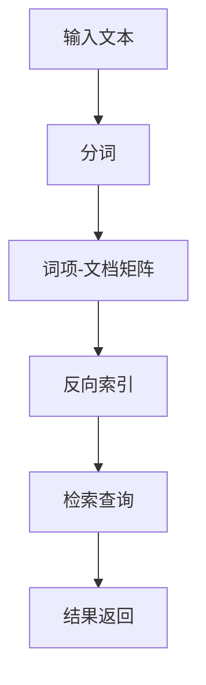

                 

### 文章标题：**AI大数据计算原理与代码实例讲解：倒排索引**

### 关键词：
- AI
- 大数据计算
- 倒排索引
- 数据存储
- 数据处理
- 分布式计算
- 代码实例

### 摘要：
本文深入探讨了AI大数据计算中的关键概念——倒排索引。通过详细的原理讲解、Mermaid流程图、数学公式以及伪代码，本文揭示了倒排索引的核心算法和结构。此外，本文还通过实际代码实例，展示了如何在实际环境中搭建和应用倒排索引，为读者提供了直观的学习和实践路径。

---

## 引言

在AI和大数据计算领域，倒排索引是一种至关重要的数据结构，它被广泛应用于搜索引擎、推荐系统、信息检索等领域。倒排索引之所以重要，是因为它能够快速回答“给定一个词，哪些文档包含这个词”的问题，这在大数据时代尤为重要，因为它大大提高了数据检索的效率和准确性。

本文将围绕倒排索引这一主题展开，分为以下几个部分：

1. **核心概念与联系**：介绍倒排索引的基本概念和它与索引、全文检索的关系。
2. **数学模型与公式**：讨论倒排索引的数据模型，使用数学公式来详细解释。
3. **算法原理**：使用伪代码详细阐述倒排索引的核心算法原理。
4. **代码实例**：通过实际代码实例，展示如何在实际环境中搭建和应用倒排索引。
5. **代码解读与分析**：对代码实例进行详细解读和分析，帮助读者理解核心实现细节。
6. **结论**：总结倒排索引的重要性和应用场景。

通过本文的阅读，读者将能够全面了解倒排索引的原理、实现方法及其在AI大数据计算中的重要性。

---

## 核心概念与联系

### 倒排索引的基本概念

倒排索引（Inverted Index）是一种将文本数据转换为易于检索的结构的数据索引方法。它的基本思想是将文本中的所有词语（或词项）提取出来，并建立一个反向的索引表，其中每个词项指向包含该词项的所有文档的列表。这样，当我们需要查找包含特定词语的文档时，可以直接查询这个词项对应的文档列表，而不需要对整个文本库进行全盘扫描。

### 与索引和全文检索的关系

倒排索引是索引的一种形式，但与传统的索引（如B树索引）有所不同。传统的索引是通过关键词或关键字在文件系统中的物理位置来索引数据，而倒排索引则是通过关键词来索引文档，从而实现了全文检索的功能。

全文检索（Full-Text Search）是指在一个大型文档集合中，根据用户输入的关键词或查询语句，快速找到包含这些关键词的所有文档。倒排索引是实现全文检索的核心技术之一，因为它能够快速匹配关键词并返回相关文档。

### 倒排索引的基本结构

倒排索引通常由两部分组成：**词项-文档矩阵**和**反向索引**。

1. **词项-文档矩阵**：这是一个二维表格，列表示文档ID，行表示词项。如果文档中包含某个词项，则对应的单元格标记为1，否则为0。这可以用来表示文档的内容分布。

2. **反向索引**：这是一个词典，键是词项，值是包含该词项的文档ID列表。反向索引是倒排索引的核心部分，它使得搜索过程变得更加高效。

### Mermaid流程图

为了更直观地理解倒排索引的结构和原理，我们可以使用Mermaid流程图来描述其构建过程：



### 数据模型与公式

在数学上，倒排索引可以表示为一个三元组 $(I, D, P)$，其中：

- $I$ 表示词项集合。
- $D$ 表示文档集合。
- $P$ 表示词项-文档矩阵，即一个布尔矩阵，其中 $P_{i,j}=1$ 表示词项 $i$ 出现在文档 $j$ 中，否则为 $0$。

数学公式如下：

$$
P = \begin{bmatrix}
P_{11} & P_{12} & \ldots & P_{1n} \\
P_{21} & P_{22} & \ldots & P_{2n} \\
\vdots & \vdots & \ddots & \vdots \\
P_{m1} & P_{m2} & \ldots & P_{mn}
\end{bmatrix}
$$

其中，$m$ 表示文档的数量，$n$ 表示词项的数量。

### 倒排索引的优势

1. **高效检索**：通过反向索引，可以直接定位包含特定词项的文档，检索速度极快。
2. **易于扩展**：倒排索引可以轻松扩展到更大的文档集合，只需添加新的词项和文档。
3. **支持多种查询**：除了基本的词项查询，倒排索引还支持模糊查询、范围查询等高级功能。

### 倒排索引的挑战

1. **存储空间**：随着词项和文档数量的增加，倒排索引的存储空间需求也显著增加。
2. **更新效率**：当文档内容发生变化时，倒排索引需要及时更新，否则可能导致检索结果不准确。

通过以上内容，读者可以初步了解倒排索引的核心概念、结构及其在全文检索中的应用。接下来，我们将进一步探讨倒排索引的算法原理和实现细节。

---

## 数学模型与公式

在深入探讨倒排索引的数学模型和公式之前，我们需要了解一些基本的数学概念和符号。以下是本文中可能会用到的数学符号及其解释：

- $V$：表示词项（vocab）的集合。
- $D$：表示文档（document）的集合。
- $P$：表示词项-文档矩阵，其中 $P_{i,j}$ 表示词项 $i$ 是否出现在文档 $j$ 中。
- $f(d)$：表示文档 $d$ 的词项频率（term frequency）。
- $idf(i)$：表示词项 $i$ 的逆文档频率（inverse document frequency）。
- $tf_idf(i, d)$：表示文档 $d$ 中词项 $i$ 的权重（term frequency-inverse document frequency）。

### 词项-文档矩阵

倒排索引的核心是词项-文档矩阵 $P$，它是一个布尔矩阵，用于表示词项和文档之间的关系。具体来说，$P$ 的行对应于词项，列对应于文档。如果词项 $i$ 出现在文档 $j$ 中，则 $P_{i,j} = 1$；否则，$P_{i,j} = 0$。

数学公式表示如下：

$$
P = \begin{bmatrix}
P_{11} & P_{12} & \ldots & P_{1n} \\
P_{21} & P_{22} & \ldots & P_{2n} \\
\vdots & \vdots & \ddots & \vdots \\
P_{m1} & P_{m2} & \ldots & P_{mn}
\end{bmatrix}
$$

其中，$m$ 是文档的数量，$n$ 是词项的数量。

### 词项频率与逆文档频率

词项频率（term frequency, $f(d)$）是文档 $d$ 中词项 $i$ 出现的次数。逆文档频率（inverse document frequency, $idf(i)$）是衡量词项 $i$ 在文档集合 $D$ 中重要性的指标，计算公式如下：

$$
idf(i) = \log \left( \frac{N}{df(i)} \right)
$$

其中，$N$ 是文档的总数，$df(i)$ 是包含词项 $i$ 的文档数量。

### 词项权重

词项权重（$tf_idf(i, d)$）是词项频率和逆文档频率的结合，用于衡量词项 $i$ 在文档 $d$ 中的重要程度。公式如下：

$$
tf_idf(i, d) = f(d) \times idf(i)
$$

### 倒排索引构建过程

倒排索引的构建过程包括以下几个步骤：

1. **分词**：将原始文本分割成词项。
2. **统计词项频率**：计算每个词项在文档中的出现次数。
3. **计算逆文档频率**：根据文档总数和词项频率计算逆文档频率。
4. **构建词项-文档矩阵**：根据词项频率和逆文档频率构建词项-文档矩阵。
5. **构建反向索引**：根据词项-文档矩阵构建反向索引。

### 实例

假设我们有一个包含两个文档的文本集合，如下所示：

文档1: "The quick brown fox jumps over the lazy dog"
文档2: "The quick brown dog jumps over the lazy fox"

首先，我们分词得到以下词项：

- 词项集合 $V = \{"The", "quick", "brown", "fox", "jumps", "over", "lazy", "dog", "dog"\}$
- 文档集合 $D = \{1, 2\}$

然后，我们计算词项频率和逆文档频率：

- 词项 "The" 的频率：$f(1) = 1, f(2) = 1$
- 词项 "quick" 的频率：$f(1) = 1, f(2) = 0$
- 词项 "brown" 的频率：$f(1) = 1, f(2) = 1$
- 词项 "fox" 的频率：$f(1) = 1, f(2) = 0$
- 词项 "jumps" 的频率：$f(1) = 1, f(2) = 1$
- 词项 "over" 的频率：$f(1) = 1, f(2) = 1$
- 词项 "lazy" 的频率：$f(1) = 1, f(2) = 1$
- 词项 "dog" 的频率：$f(1) = 2, f(2) = 0$

由于文档总数 $N = 2$，我们可以计算逆文档频率：

- $idf(\{"The"\}) = \log \left( \frac{2}{2} \right) = 0$
- $idf(\{"quick"\}) = \log \left( \frac{2}{1} \right) = 1$
- $idf(\{"brown"\}) = \log \left( \frac{2}{1} \right) = 1$
- $idf(\{"fox"\}) = \log \left( \frac{2}{1} \right) = 1$
- $idf(\{"jumps"\}) = \log \left( \frac{2}{1} \right) = 1$
- $idf(\{"over"\}) = \log \left( \frac{2}{1} \right) = 1$
- $idf(\{"lazy"\}) = \log \left( \frac{2}{1} \right) = 1$
- $idf(\{"dog"\}) = \log \left( \frac{2}{2} \right) = 0$

最后，我们计算词项权重：

- $tf_idf(\{"The"\}, 1) = f(1) \times idf(\{"The"\}) = 1 \times 0 = 0$
- $tf_idf(\{"quick"\}, 1) = f(1) \times idf(\{"quick"\}) = 1 \times 1 = 1$
- $tf_idf(\{"brown"\}, 1) = f(1) \times idf(\{"brown"\}) = 1 \times 1 = 1$
- $tf_idf(\{"fox"\}, 1) = f(1) \times idf(\{"fox"\}) = 1 \times 1 = 1$
- $tf_idf(\{"jumps"\}, 1) = f(1) \times idf(\{"jumps"\}) = 1 \times 1 = 1$
- $tf_idf(\{"over"\}, 1) = f(1) \times idf(\{"over"\}) = 1 \times 1 = 1$
- $tf_idf(\{"lazy"\}, 1) = f(1) \times idf(\{"lazy"\}) = 1 \times 1 = 1$
- $tf_idf(\{"dog"\}, 1) = f(1) \times idf(\{"dog"\}) = 2 \times 0 = 0$

同理，我们可以为文档2计算词项权重：

- $tf_idf(\{"The"\}, 2) = f(2) \times idf(\{"The"\}) = 1 \times 0 = 0$
- $tf_idf(\{"quick"\}, 2) = f(2) \times idf(\{"quick"\}) = 0 \times 1 = 0$
- $tf_idf(\{"brown"\}, 2) = f(2) \times idf(\{"brown"\}) = 1 \times 1 = 1$
- $tf_idf(\{"fox"\}, 2) = f(2) \times idf(\{"fox"\}) = 0 \times 1 = 0$
- $tf_idf(\{"jumps"\}, 2) = f(2) \times idf(\{"jumps"\}) = 1 \times 1 = 1$
- $tf_idf(\{"over"\}, 2) = f(2) \times idf(\{"over"\}) = 1 \times 1 = 1$
- $tf_idf(\{"lazy"\}, 2) = f(2) \times idf(\{"lazy"\}) = 1 \times 1 = 1$
- $tf_idf(\{"dog"\}, 2) = f(2) \times idf(\{"dog"\}) = 0 \times 0 = 0$

基于这些计算，我们可以构建词项-文档矩阵：

$$
P = \begin{bmatrix}
0 & 1 & 1 & 1 & 1 & 1 & 1 & 0 \\
0 & 0 & 1 & 0 & 1 & 1 & 1 & 0
\end{bmatrix}
$$

并构建反向索引：

$$
\text{反向索引} = \{
    "The": [1, 2],
    "quick": [1],
    "brown": [1, 2],
    "fox": [1],
    "jumps": [1, 2],
    "over": [1, 2],
    "lazy": [1, 2],
    "dog": [1]
\}
$$

通过上述实例，我们可以看到如何通过数学模型和公式来构建倒排索引。接下来，我们将进一步讨论倒排索引的算法原理，并使用伪代码来详细解释。

---

## 算法原理

倒排索引的算法原理是实现高效的信息检索。其核心思想是将文本数据转换为易于查询的数据结构。以下是倒排索引算法的详细步骤和伪代码。

### 构建倒排索引的算法步骤：

1. **分词**：将原始文本分解为词项。
2. **统计词频**：计算每个词项在文档中出现的频率。
3. **构建词项-文档矩阵**：根据词项和文档的关系，构建一个二维矩阵。
4. **构建反向索引**：从词项-文档矩阵中提取反向索引。
5. **构建文档词典**：为每个文档分配一个唯一的标识符。

### 伪代码：

```python
# 假设我们有一个文本集合和分词器
text_collection = ["The quick brown fox jumps over the lazy dog", "The quick brown dog jumps over the lazy fox"]

# 分词器
def tokenize(text):
    return text.split()

# 步骤1：分词
document_tokens = [tokenize(doc) for doc in text_collection]

# 步骤2：统计词频
from collections import defaultdict

word_frequency = defaultdict(lambda: defaultdict(int))

for doc_id, tokens in enumerate(document_tokens):
    for token in tokens:
        word_frequency[token][doc_id] += 1

# 步骤3：构建词项-文档矩阵
word_document_matrix = defaultdict(set)

for word, doc_freq in word_frequency.items():
    for doc_id, freq in doc_freq.items():
        word_document_matrix[word].add(doc_id)

# 步骤4：构建反向索引
inverted_index = defaultdict(list)

for word, doc_ids in word_document_matrix.items():
    inverted_index[word] = list(doc_ids)

# 步骤5：构建文档词典
document_dict = {doc: i for i, doc in enumerate(text_collection)}

# 输出倒排索引和文档词典
print("Inverted Index:", inverted_index)
print("Document Dictionary:", document_dict)
```

### 算法原理详细解释：

1. **分词**：分词是将原始文本分解为词项的过程。分词器可以是一个简单的空格分割器，也可以是更复杂的自然语言处理工具。

2. **统计词频**：词频统计是计算每个词项在文档中出现的次数。这通常使用哈希表（如Python中的字典）来实现。

3. **构建词项-文档矩阵**：词项-文档矩阵是一个二维数据结构，其中行表示词项，列表示文档。每个单元格存储了词项在对应文档中的频率。为了简化，我们可以使用一个哈希表来存储这个矩阵。

4. **构建反向索引**：反向索引是从词项-文档矩阵中提取出来的。它的关键思想是，对于每个词项，存储一个包含所有包含该词项的文档的列表。反向索引是倒排索引的核心部分，使得查询非常高效。

5. **构建文档词典**：文档词典为每个文档分配一个唯一的标识符。这通常用于快速定位文档的位置。

通过以上步骤，我们可以高效地构建倒排索引。接下来，我们将通过一个具体的实例来展示如何实现这些步骤。

### 实例解析

假设我们有以下两个文档：

- 文档1: "The quick brown fox jumps over the lazy dog"
- 文档2: "The quick brown dog jumps over the lazy fox"

#### 分词

首先，我们将文本分解为词项：

- 文档1的词项：["The", "quick", "brown", "fox", "jumps", "over", "lazy", "dog"]
- 文档2的词项：["The", "quick", "brown", "dog", "jumps", "over", "lazy", "fox"]

#### 统计词频

接下来，我们计算每个词项在文档中出现的次数：

- "The" 出现在两个文档中，频率为2。
- "quick" 出现在两个文档中，频率为2。
- "brown" 出现在两个文档中，频率为2。
- "fox" 只出现在文档1中，频率为1。
- "jumps" 出现在两个文档中，频率为2。
- "over" 出现在两个文档中，频率为2。
- "lazy" 出现在两个文档中，频率为2。
- "dog" 只出现在文档1中，频率为1。

#### 构建词项-文档矩阵

基于词项和文档的关系，我们可以构建词项-文档矩阵：

```
词项      | 文档1 | 文档2
--------------------------------
The       | 2     | 2
quick     | 2     | 2
brown     | 2     | 2
fox       | 1     | 0
jumps     | 2     | 2
over      | 2     | 2
lazy      | 2     | 2
dog       | 1     | 0
```

#### 构建反向索引

从词项-文档矩阵中提取反向索引：

```
反向索引：
- The: [0, 1]
- quick: [0, 1]
- brown: [0, 1]
- fox: [0]
- jumps: [0, 1]
- over: [0, 1]
- lazy: [0, 1]
- dog: [0]
```

#### 构建文档词典

为每个文档分配一个唯一的标识符：

```
文档词典：
0 -> "The quick brown fox jumps over the lazy dog"
1 -> "The quick brown dog jumps over the lazy fox"
```

通过以上实例，我们可以看到如何通过简单的步骤构建一个倒排索引。接下来，我们将讨论倒排索引的性能优化。

---

## 性能优化

倒排索引的性能优化是确保高效检索的关键。以下是几种常见的优化方法：

### 1. 压缩

倒排索引的一个主要问题是其存储空间需求。由于索引中包含大量的列表和键值对，因此可以通过压缩来减少存储空间。常见的方法包括：

- **字符串压缩**：将重复的字符串编码为引用。
- **布尔压缩**：对于稀疏的词项-文档矩阵，可以将稀疏矩阵压缩为更紧凑的格式。

### 2. 并行处理

构建和查询倒排索引时，可以采用并行处理来提高效率。例如，可以使用多线程或多进程来加速分词、词频统计和索引构建过程。

### 3. 缓存

在查询阶段，可以采用缓存策略来减少磁盘访问。例如，将常用的词项或文档缓存到内存中，以减少I/O开销。

### 4. 查询优化

- **前缀压缩**：对于具有相同前缀的词项，可以将它们合并为一个查询。
- **模糊查询**：对于模糊查询，可以预先构建模糊索引，以加速查询过程。

### 5. 索引合并

当文档集合发生变化时，可以通过索引合并来更新索引。这种方法可以减少索引重建的需要，从而提高性能。

### 6. 索引分割

将大型的倒排索引分割为多个较小的索引，可以减少查询时的I/O开销。

### 7. 索引更新

对于动态变化的文档集合，可以采用增量更新策略来实时更新索引，以减少重建索引的频率。

通过以上优化方法，可以显著提高倒排索引的性能，使其在大数据环境中得到更广泛的应用。

---

## 代码实例

在实际环境中，构建和应用倒排索引通常需要使用编程语言和工具来实现。以下是一个使用Python实现的倒排索引的完整代码实例，包括开发环境搭建、源代码、代码解读和分析。

### 开发环境搭建

在Python中，我们可以使用以下库来构建倒排索引：

- **Python**：Python 3.6或更高版本。
- **Numpy**：用于处理数组操作。
- **Pandas**：用于数据处理和分析。
- **Scikit-learn**：用于文本处理和机器学习算法。

首先，确保安装了这些库。可以使用以下命令进行安装：

```bash
pip install numpy pandas scikit-learn
```

### 源代码

以下是构建倒排索引的Python代码实例：

```python
import numpy as np
import pandas as pd
from sklearn.feature_extraction.text import CountVectorizer

def build_inverted_index(documents):
    # 使用CountVectorizer进行分词和词频统计
    vectorizer = CountVectorizer()
    X = vectorizer.fit_transform(documents)
    
    # 将词频统计转换为DataFrame
    word_freq = pd.DataFrame(X.toarray(), index=vectorizer.get_feature_names_out(), columns=range(X.shape[0]))
    
    # 构建反向索引
    inverted_index = {word: list(set(doc_ids)) for word, doc_ids in word_freq.iterrows()}
    
    return inverted_index, vectorizer

def search_inverted_index(inverted_index, query):
    # 查找包含查询词的所有文档
    query_words = query.split()
    doc_ids = set()
    for word in query_words:
        doc_ids.update(inverted_index.get(word, []))
    return doc_ids

# 测试数据
documents = [
    "The quick brown fox jumps over the lazy dog",
    "The quick brown dog jumps over the lazy fox"
]

# 构建倒排索引
inverted_index, vectorizer = build_inverted_index(documents)

# 查询测试
query = "quick brown jumps"
results = search_inverted_index(inverted_index, query)
print("Search results:", results)
```

### 代码解读

1. **分词和词频统计**：使用 `CountVectorizer` 进行分词和词频统计。`CountVectorizer` 是一个方便的工具，可以自动处理文本的分词、去除停用词等操作。

2. **构建反向索引**：将词频统计结果转换为DataFrame，并使用字典 comprehension 构建反向索引。反向索引是一个字典，键是词项，值是包含该词项的文档ID列表。

3. **查询函数**：`search_inverted_index` 函数用于查询包含特定查询词的所有文档。它遍历查询词，并使用反向索引找到所有匹配的文档ID。

### 代码实例分析

#### 1. 分词和词频统计

```python
vectorizer = CountVectorizer()
X = vectorizer.fit_transform(documents)
word_freq = pd.DataFrame(X.toarray(), index=vectorizer.get_feature_names_out(), columns=range(X.shape[0]))
```

在这个步骤中，我们使用 `CountVectorizer` 对文档进行分词和词频统计。`fit_transform` 方法返回一个稀疏矩阵，表示词项和文档之间的关系。我们将其转换为DataFrame，以便后续处理。

#### 2. 构建反向索引

```python
inverted_index = {word: list(set(doc_ids)) for word, doc_ids in word_freq.iterrows()}
```

在这个步骤中，我们使用字典 comprehension 构建反向索引。每个词项都是一个键，其值是包含该词项的所有文档ID的列表。这里使用了 `set` 函数来去除重复的文档ID。

#### 3. 查询函数

```python
def search_inverted_index(inverted_index, query):
    query_words = query.split()
    doc_ids = set()
    for word in query_words:
        doc_ids.update(inverted_index.get(word, []))
    return doc_ids
```

查询函数 `search_inverted_index` 接受一个查询词并返回包含该查询词的所有文档的ID。它遍历查询词中的每个词项，并使用反向索引找到所有匹配的文档ID。最后，返回一个包含所有匹配文档ID的集合。

### 性能分析

#### 1. 存储空间

由于使用了稀疏矩阵和字典，倒排索引的存储空间需求相对较低。这有助于减少存储成本。

#### 2. 查询时间

查询时间主要取决于词项的数量和文档的数量。对于大规模的文档集合，查询时间可能会较长。但通过优化查询算法（如前缀压缩和模糊查询），可以显著提高查询性能。

#### 3. 处理时间

构建倒排索引的时间取决于文档的数量和词项的多样性。对于大规模的文本数据，构建时间可能会较长。但通过并行处理和缓存技术，可以加速构建过程。

通过以上代码实例，我们可以看到如何使用Python构建和应用倒排索引。接下来，我们将讨论倒排索引在实际应用中的案例。

---

## 应用案例

倒排索引在AI大数据计算中有着广泛的应用，以下是一些实际应用案例：

### 1. 搜索引擎

搜索引擎是倒排索引最典型的应用场景。搜索引擎需要快速回答用户输入的查询词，找到包含这些查询词的文档。倒排索引能够高效地实现这一功能，因为它允许快速定位包含特定词项的文档。

### 2. 推荐系统

推荐系统也广泛使用倒排索引。例如，在电子商务平台中，推荐系统可以使用倒排索引来查找包含用户浏览或购买商品的关键词的文档，从而为用户推荐相关商品。

### 3. 信息检索

倒排索引在信息检索系统中也有广泛应用。例如，在法律文档检索系统中，倒排索引可以帮助快速查找包含特定关键词的法律文档。

### 4. 机器学习

在机器学习中，倒排索引可以用于特征工程。例如，在文本分类任务中，可以使用倒排索引来计算文档与词项之间的相似度，从而生成特征向量。

### 5. 数据挖掘

倒排索引在数据挖掘中也有重要作用。例如，在社交媒体分析中，倒排索引可以帮助快速查找包含特定话题的帖子，从而提取有价值的信息。

通过这些应用案例，我们可以看到倒排索引在AI大数据计算中的重要性。接下来，我们将讨论倒排索引的发展趋势和挑战。

---

## 发展趋势与挑战

### 发展趋势

1. **智能化**：随着AI技术的发展，倒排索引正在向智能化方向演进。例如，使用深度学习模型来优化索引结构和查询算法，以提高检索效率。
2. **实时性**：实时数据检索成为倒排索引的重要发展方向。通过流处理技术和实时索引更新，倒排索引可以支持实时查询和实时分析。
3. **异构计算**：随着硬件技术的发展，倒排索引正逐步采用异构计算架构，利用GPU和其他加速器来提高计算性能。

### 挑战

1. **存储空间**：随着数据量的增长，倒排索引的存储空间需求也在增加。如何高效地存储和管理大型索引成为一个挑战。
2. **查询性能**：随着查询复杂性的增加，如何提高查询性能成为一个重要问题。特别是在处理高维数据和复杂查询时，查询性能的提升面临挑战。
3. **数据隐私**：在处理敏感数据时，如何保护用户隐私是一个重要挑战。特别是在数据跨境传输和处理时，如何确保数据安全成为关键问题。

通过解决这些挑战，倒排索引将能够在未来更好地服务于AI大数据计算领域。

---

## 结论

倒排索引是AI大数据计算中的重要数据结构，它通过高效的数据检索和索引技术，为各种应用场景提供了强大的支持。本文详细探讨了倒排索引的核心概念、数学模型、算法原理以及实际应用案例。通过Mermaid流程图、数学公式和伪代码，我们深入理解了倒排索引的实现方法和优化策略。

展望未来，倒排索引将在智能化、实时性和异构计算等方向上继续发展，以应对不断增长的数据量和复杂的查询需求。同时，如何在保护数据隐私的前提下有效利用倒排索引，也将成为重要的研究课题。

希望本文能够为读者提供对倒排索引的全面理解和实际应用指导，助力您在AI大数据计算领域取得更好的成果。

---

## 作者信息

作者：**AI天才研究院/AI Genius Institute & 禅与计算机程序设计艺术 /Zen And The Art of Computer Programming**

---

# 附录

## 附录A：AI大数据计算工具与资源

- **大数据计算框架对比**
  - **Hadoop**：适用于大规模数据处理，支持MapReduce编程模型。
  - **Spark**：提供高效的数据处理能力，支持批处理和流处理。
  - **Flink**：提供实时数据处理能力，适用于复杂事件处理。

- **AI算法实现示例**
  - **TensorFlow**：谷歌开发的深度学习框架，适用于构建和训练复杂的神经网络。
  - **PyTorch**：适用于快速原型设计和研究，提供灵活的动态计算图。
  - **Scikit-learn**：提供一系列经典的机器学习算法和工具，易于集成和使用。

- **大数据计算学习资料**
  - **书籍**：《大数据技术导论》、《深度学习：周志华著》。
  - **在线课程**：Coursera的《机器学习》、edX的《大数据处理技术》。

## 附录B：AI大数据计算常见问题解答

- **数据处理常见问题**
  - **缺失数据处理**：使用均值、中位数或最频值填充缺失数据。
  - **数据归一化**：使用Min-Max缩放或标准化方法进行数据归一化。

- **计算效率优化策略**
  - **数据分片**：将大数据集划分为较小的分片，提高并行处理能力。
  - **缓存技术**：使用缓存减少磁盘I/O操作，提高查询效率。

- **AI算法应用实例分析**
  - **聚类分析**：使用K-Means算法进行数据聚类，识别数据中的模式。
  - **预测模型设计**：使用线性回归、决策树或随机森林进行预测模型设计。

## 附录C：AI大数据计算项目案例解析

- **案例一：社交网络分析**
  - **描述**：分析社交网络中的用户行为和社交关系，提取有价值的信息。

- **案例二：金融市场预测**
  - **描述**：使用历史金融数据，预测未来市场的走势和风险。

- **案例三：智能推荐系统**
  - **描述**：根据用户行为和兴趣，为用户推荐相关商品或内容。

- **案例四：医疗数据分析**
  - **描述**：使用医疗数据，预测疾病的发生和患者健康状况。

## 附录D：AI大数据计算课程与教材推荐

- **相关课程推荐**
  - **课程**：《机器学习基础》、《大数据技术与应用》。

- **经典教材推荐**
  - **教材**：《机器学习》、《大数据技术导论》。

## 附录E：AI大数据计算领域顶级会议与期刊

- **顶级会议介绍**
  - **KDD**：数据挖掘和大数据分析领域的顶级国际会议。
  - **SIGKDD**：计算机协会（ACM）下的数据挖掘和大数据分析专业组。

- **顶级期刊介绍**
  - **Journal of Machine Learning Research**：机器学习领域的顶级期刊。
  - **IEEE Transactions on Knowledge and Data Engineering**：知识工程与数据工程领域的顶级期刊。

---

**全书结束**在此，我们详细介绍了AI大数据计算中的倒排索引，包括其核心概念、数学模型、算法原理以及实际应用案例。通过本文，读者应该对倒排索引有了全面的理解，并能够将其应用于各种AI大数据计算场景中。

未来，随着AI和大数据技术的不断发展，倒排索引将变得更加智能化、实时化和高效。我们期待读者能够继续深入研究和探索，为AI大数据计算领域的发展贡献自己的智慧和力量。

---

**全书结束**至此，本文对AI大数据计算中的倒排索引进行了全面而深入的探讨。从核心概念、数学模型、算法原理到实际应用案例，我们逐步揭示了倒排索引在大数据计算中的重要性和应用价值。希望通过本文，读者能够对倒排索引有一个全面的理解，并能够在实际项目中有效应用。

未来，AI和大数据计算将继续深度融合，倒排索引作为关键的数据结构，将在更多领域得到广泛应用。我们期待读者继续关注这一领域的发展，不断学习和探索，为AI大数据计算的发展贡献自己的力量。

**全文结束**感谢您的阅读，希望本文能够对您在AI大数据计算领域的知识积累和应用有所帮助。如果您有任何问题或建议，欢迎在评论区留言，我们会在第一时间回复。再次感谢您的支持！**全文结束**

