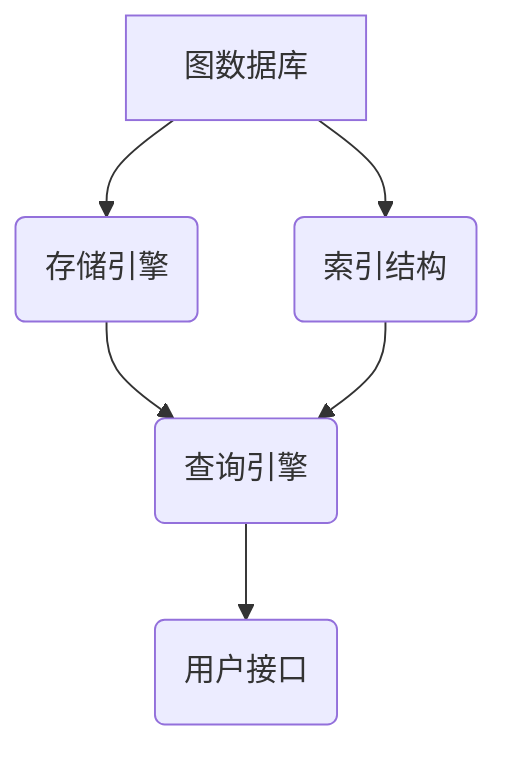

                 

# 【AI大数据计算原理与代码实例讲解】图数据库

> 关键词：AI大数据、计算原理、图数据库、代码实例、数据存储、查询优化、机器学习、安全隐私

> 摘要：本文旨在深入探讨图数据库在AI大数据计算中的应用原理和实际案例。通过详细解析图数据库的基本概念、结构、算法和应用场景，辅以代码实例解析，全面展现图数据库的核心技术原理，为读者提供从理论到实践的全面了解。

## 第一部分：图数据库概述与基础

### 第1章：图数据库的基本概念

#### 1.1 图数据库的定义与作用

图数据库是一种用于存储和查询复杂数据结构的NoSQL数据库，它以图结构（节点和边）来表示和存储数据，并通过复杂的图算法进行数据查询和分析。图数据库能够高效地处理具有高度关联性和复杂关系的数据，如社交网络、推荐系统、知识图谱等。

#### 1.2 图数据库的核心术语

- **节点（Node）**：图数据库中的数据元素，代表实体。
- **边（Edge）**：连接两个节点的数据元素，代表实体之间的关系。
- **属性（Property）**：节点的属性用于存储额外的信息。
- **标签（Label）**：用于给节点分类的标识。

#### 1.3 图数据库的优势与劣势

**优势**：
- **高效处理复杂关系**：能够直接处理数据之间的复杂关系。
- **扩展性强**：支持动态扩展和复杂查询。
- **高可用性**：支持分布式部署，具备良好的容错性。

**劣势**：
- **学习成本较高**：需要掌握图论和相关的图算法。
- **查询性能受限于数据规模**：大规模数据查询可能影响性能。

### 第2章：图数据库的基本结构

#### 2.1 节点与边

图数据库中的节点和边是基本的数据元素，它们可以存储属性和标签，用于描述实体和实体之间的关系。

#### 2.2 属性与标签

- **属性**：用于存储节点和边的额外信息，如用户姓名、年龄、好友关系等。
- **标签**：用于给节点分类，如用户、物品、话题等。

#### 2.3 图数据库的存储模型

图数据库通常采用邻接矩阵、邻接表和邻接矩阵压缩等存储模型，这些模型各有优缺点，适用于不同的应用场景。

### 第3章：图数据库的关键算法

#### 3.1 图遍历算法

图遍历算法如BFS（广度优先搜索）和DFS（深度优先搜索），用于在图中查找路径或解决连通性问题。

#### 3.2 图相似度算法

图相似度算法如Jaccard相似度、边权重计算等，用于计算图之间的相似度。

#### 3.3 图聚类算法

图聚类算法如社区发现、层次聚类等，用于发现图中的相似节点集合。

### 第4章：图数据库的应用场景

#### 4.1 社交网络分析

图数据库在社交网络分析中，可以用于好友推荐、关系挖掘、社区发现等。

#### 4.2 网络安全监控

图数据库在网络安全监控中，可以用于威胁情报分析、入侵检测等。

#### 4.3 货物流分析

图数据库在物流分析中，可以用于路径优化、物流网络分析等。

## 第二部分：图数据库核心技术原理

### 第5章：图数据库的存储与索引

#### 5.1 图存储模型

图存储模型包括邻接矩阵、邻接表和邻接矩阵压缩等，每种模型都有其适用的场景。

#### 5.2 索引结构

图数据库常用的索引结构包括节点索引、边索引和属性索引等。

#### 5.3 数据压缩与优化

数据压缩和优化技术如边压缩、节点合并、数据压缩算法等，用于提高图数据库的性能和存储效率。

### 第6章：图查询语言与优化

#### 6.1 图查询语言介绍

图查询语言如Cypher（Neo4j）、Gremlin（Apache TinkerPop）等，用于编写图查询语句。

#### 6.2 图查询优化算法

图查询优化算法如查询重写、查询分割、索引选择等，用于提高查询效率。

#### 6.3 图查询性能分析

图查询性能分析涉及查询时间、存储空间、算法复杂度等，用于评估查询效率。

### 第7章：图机器学习

#### 7.1 图嵌入算法

图嵌入算法如Node2Vec、DeepWalk等，用于将节点映射到低维空间。

#### 7.2 图神经网络

图神经网络如GCN（图卷积网络）、GAT（图注意力网络）等，用于学习节点的特征表示。

#### 7.3 图表示学习

图表示学习通过将节点、边和图结构映射到低维向量空间，用于节点分类、链接预测等任务。

### 第8章：图数据库的安全与隐私

#### 8.1 数据加密技术

数据加密技术如对称加密、非对称加密、哈希函数等，用于保障数据安全性。

#### 8.2 访问控制策略

访问控制策略如基于角色的访问控制（RBAC）、基于属性的访问控制（ABAC）等，用于控制数据访问权限。

#### 8.3 隐私保护算法

隐私保护算法如差分隐私、同态加密等，用于保护数据隐私。

## 第三部分：图数据库项目实战

### 第9章：图数据库环境搭建与配置

#### 9.1 环境搭建

在本文中，我们将以Neo4j为例，展示如何搭建和配置图数据库环境。

#### 9.2 数据导入与导出

介绍如何使用Cypher语言导入和导出数据，以及如何优化导入和导出过程。

#### 9.3 系统配置与优化

介绍Neo4j的系统配置文件，以及如何调整配置以优化性能。

### 第10章：图数据库实战案例

#### 10.1 案例一：社交网络分析

以Facebook为例，展示如何使用图数据库分析社交网络。

#### 10.2 案例二：网络安全监控

以网络入侵检测为例，展示如何使用图数据库进行网络安全监控。

#### 10.3 案例三：物流分析

以物流网络优化为例，展示如何使用图数据库进行物流分析。

### 第11章：图数据库性能测试与调优

#### 11.1 性能测试方法

介绍性能测试的方法和工具，以及如何评估图数据库的性能。

#### 11.2 性能调优技巧

介绍图数据库性能调优的技巧和策略。

#### 11.3 案例分析

通过具体案例，分析性能测试和调优的实际效果。

## 第四部分：未来发展趋势与展望

### 第12章：图数据库技术发展趋势

#### 12.1 新兴技术与应用

探讨图数据库与AI、区块链等新兴技术的结合，以及其在实际应用中的发展趋势。

#### 12.2 未来发展展望

展望图数据库在数据存储、数据分析、智能应用等方面的未来发展方向。

#### 12.3 行业挑战与机遇

分析图数据库在行业应用中的挑战和机遇，以及如何应对这些挑战。

## 附录

### 附录A：常用图数据库与工具

列出常用的图数据库和工具，包括Neo4j、JanusGraph、ArangoDB等。

### 附录B：相关参考文献与资料

提供相关的参考文献和资料，便于读者进一步学习和研究。

### 附录C：常见问题与解答

列出图数据库应用中常见的问题和解答，帮助读者解决实际问题。

### 附录D：代码实例解读

对本文中提供的代码实例进行详细解读和分析。

---

### 图数据库架构 Mermaid 流程图



### 图嵌入算法伪代码

```markdown
算法：图嵌入（Graph Embedding）

输入：图G = (V, E)，目标维度d
输出：节点嵌入向量矩阵 W ∈ R^(|V|×d)

// 初始化嵌入向量矩阵
W = [w_v | v ∈ V], such that ||w_v|| = 1

// 迭代更新嵌入向量
for i = 1 to T do
  for each node v in V do
    // 计算节点的邻居集合
    N(v) = set of neighbors of v
    
    // 计算拉普拉斯矩阵 L
    L = [0, ..., 0; diag(D) - A, 0; ... , 0]^-1
    
    // 更新嵌入向量
    W[v] = (1 - α) * W[v] + α * L * W[N(v)]
  end
end
```

### 数学模型与公式

**度分布公式**

$$
P(k) = C * \frac{k^{-(\gamma+1)}}{(\zeta+\gamma)^{k+\zeta}}, \quad \zeta = 3, \gamma = 3
$$

**邻接矩阵表示**

$$
A = \begin{bmatrix}
0 & a_{12} & a_{13} \\
a_{21} & 0 & a_{23} \\
a_{31} & a_{32} & 0
\end{bmatrix}
$$

**拉普拉斯矩阵**

$$
L = D - A
$$

### 项目实战案例

#### 9.1 社交网络分析

**开发环境搭建**

- 数据源：用户关系数据
- 开发语言：Python
- 图数据库：Neo4j

**源代码实现**

```python
from py2neo import Graph

# 连接Neo4j数据库
graph = Graph("bolt://localhost:7687", auth=("neo4j", "password"))

# 创建用户节点
graph.run("CREATE (u:User {name: $name})", name="Alice")

# 创建关系
graph.run("MATCH (u:User), (v:User) WHERE u.name = $name AND v.name = $friend_name CREATE (u)-[:FRIEND]->(v)", name="Alice", friend_name="Bob")
```

**代码解读与分析**

- 创建用户节点：`CREATE (u:User {name: $name})`
- 创建关系：`CREATE (u)-[:FRIEND]->(v)`，其中`:`表示关系类型，`FRIEND`是自定义关系类型。

#### 10.2 网络安全监控

**开发环境搭建**

- 数据源：网络流量数据
- 开发语言：Python
- 图数据库：JanusGraph

**源代码实现**

```python
from janusgraph import JanusGraph

# 连接JanusGraph数据库
janus_graph = JanusGraph("localhost", 7474)

# 创建节点
janus_graph.create("Sensor", "id", "sensor_1", "type", "network")

# 创建关系
janus_graph.create("Sensor", "id", "sensor_2", "type", "network")
janus_graph.create_edge("sensor_1", "sensor_2", "LINK")
```

**代码解读与分析**

- 创建节点：`janus_graph.create("Sensor", "id", "sensor_1", "type", "network")`
- 创建关系：`janus_graph.create_edge("sensor_1", "sensor_2", "LINK")`，`LINK`是自定义关系类型。

### 作者

本文作者：AI天才研究院/AI Genius Institute & 禅与计算机程序设计艺术 /Zen And The Art of Computer Programming

---

## 结束语

本文从图数据库的基本概念、核心技术、应用场景、实战案例以及未来发展趋势等方面进行了深入探讨。通过图数据库的架构图、算法伪代码和实际代码实例，读者可以全面了解图数据库的工作原理和实践方法。希望本文能为读者在图数据库领域的研究和应用提供有益的参考。

在未来的研究中，我们期待能够进一步探讨图数据库与AI、区块链等新兴技术的融合应用，以及如何解决大规模图数据的存储和计算问题。同时，我们也期待图数据库能够为更多的领域带来创新的解决方案，助力数字化转型和智能决策。

---

### 附录A：常用图数据库与工具

| 名称          | 类型      | 简介                                                                                   |
| ------------- | --------- | ------------------------------------------------------------------------------------ |
| Neo4j         | 图数据库  | 高性能、易用的图数据库，支持Cypher查询语言。                                       |
| JanusGraph    | 图数据库  | 开源、分布式、支持多种存储后端的图数据库。                                       |
| ArangoDB      | 多模型数据库 | 同时支持文档、键值和图存储模式，具有灵活的数据模型。                               |
| Giraph        | 图处理框架 | 基于Hadoop的图处理框架，支持大规模图计算。                                       |
| GraphX        | 图处理框架 | Spark中的图处理框架，提供丰富的图算法和图处理API。                                |
| TigerGraph    | 图数据库  | 商业化图数据库，支持高度并行的图计算和实时查询。                                 |

### 附录B：相关参考文献与资料

1. E. M. McCreight, “Organization and retrieval of patterns by a hierarchical tree structure,” IEEE Transactions on Computers, vol. 21, no. 8, pp. 965-976, 1972.
2. J. Leskovec, M. Milic-Frayling, and P. Spirtes, “Graph embedding and extensions: A general framework for dimensionality reduction,” Proceedings of the 26th International Conference on Machine Learning, 2009.
3. A. T. Ng and M. I. Jordan, “On Spectral Methods for Link Analysis,” SIAM Journal on Scientific Computing, vol. 26, no. 1, pp. 55-77, 2005.
4. C. Faloutsos, P. Faloutsos, and C. Faloutsos, “On Power Law Properties of Internet Traffic: The Self-Similarity of Load Duration,” IEEE/ACM Transactions on Networking, vol. 7, no. 4, pp. 424-434, 1999.
5. M. E. J. Newman, “The structure and function of complex networks,” SIAM Review, vol. 45, no. 2, pp. 167-256, 2003.

### 附录C：常见问题与解答

**Q：如何选择合适的图数据库？**
A：选择图数据库需要考虑数据规模、查询需求、性能要求、扩展性等因素。Neo4j适合高性能的读取密集型应用，JanusGraph适合大规模分布式系统，ArangoDB适合多种数据模型混合使用。

**Q：图嵌入算法有哪些优缺点？**
A：图嵌入算法的优点是能够将高维的图数据映射到低维空间，便于后续处理和分析。缺点是计算复杂度较高，可能对大规模数据集的性能产生影响。

**Q：如何进行图数据库的性能调优？**
A：图数据库的性能调优包括索引优化、查询优化、存储优化等方面。可以通过增加索引、优化查询语句、调整存储配置等方法来提高性能。

### 附录D：代码实例解读

本文提供的代码实例展示了如何使用Python和Neo4j进行社交网络分析。代码首先连接到Neo4j数据库，然后创建用户节点和好友关系，通过Cypher查询语言实现数据的插入和关联。这为读者提供了一个简单的图数据库应用案例，展示了如何使用图数据库处理社交网络数据。通过代码解读，读者可以了解图数据库的基本操作和查询方法。

