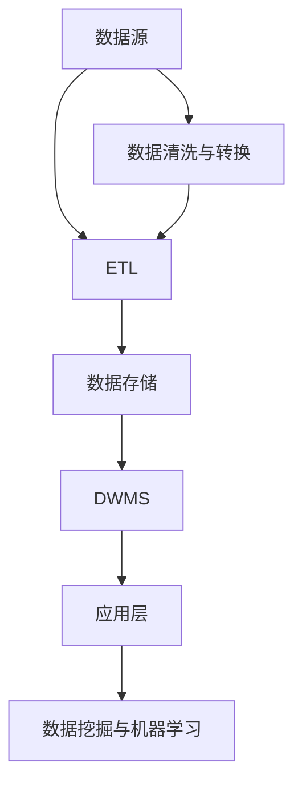

                 

# AI大数据计算原理与代码实例讲解

> 关键词：大数据计算，数据仓库，数据建模，数据挖掘，机器学习，计算平台

> 摘要：本文将深入探讨AI大数据计算的核心原理，涵盖数据仓库的定义、架构、设计原则，数据清洗与预处理方法，数据建模技巧，数据挖掘与机器学习算法，大数据计算平台与应用，以及AI大数据计算项目实战。通过详细讲解和代码实例，帮助读者全面理解并掌握AI大数据计算的相关知识。

----------------------------------------------------------------

## 第一部分: AI大数据计算原理

### 第1章: 引言

#### 1.1 AI大数据计算的概念与背景

在当今信息爆炸的时代，数据已经成为企业和社会发展的重要资产。大数据（Big Data）指的是无法用常规软件工具在合理时间内对其进行存储、检索、管理和分析的数据集合。这些数据通常具有海量（Volume）、多样（Variety）、快速（Velocity）和价值（Value）四大特征。

随着人工智能（AI）技术的快速发展，AI与大数据的结合成为推动社会进步的关键力量。AI大数据计算涉及从数据收集、存储、处理到分析、建模和应用的整个流程，目的是从海量数据中提取有价值的信息，支持决策制定和业务优化。

#### 1.2 本书的目标与结构

本书旨在为读者提供全面、系统的AI大数据计算知识体系，帮助读者理解大数据计算的核心原理，掌握相关技术和工具，并进行实际项目应用。

本书结构如下：

1. 第一部分：AI大数据计算原理
    - 数据仓库
    - 数据清洗与预处理
    - 数据建模
    - 数据挖掘与机器学习
    - 大数据计算平台与工具
    - AI大数据计算项目实战
2. 第二部分：附录
    - 常用数据仓库与大数据计算工具介绍
    - 代码实例
3. 第三部分：参考资料

#### 1.3 AI大数据计算的应用领域

AI大数据计算广泛应用于多个领域，如：

- 金融：风险控制、投资分析、客户关系管理
- 医疗：疾病预测、个性化治疗、医疗数据分析
- 电子商务：推荐系统、用户行为分析、营销策略制定
- 物流：物流优化、供应链管理、库存控制
- 智能制造：生产计划优化、质量监控、设备维护

### 第2章: 数据仓库

#### 2.1 数据仓库的定义与重要性

数据仓库（Data Warehouse）是一个面向主题的、集成的、非易失的、用于支持管理决策的数据集合。数据仓库通常包含来自多个数据源的结构化、半结构化和非结构化数据，通过数据清洗、转换和集成，为决策支持系统提供高质量的数据。

数据仓库在企业管理决策中具有重要地位，它能够提供：

- 综合视角：整合不同业务部门的数据，提供全面的数据视图
- 快速查询：优化数据存储和访问，提高查询效率
- 数据分析：支持复杂的数据分析和报告，辅助决策制定
- 数据挖掘：为数据挖掘和机器学习提供数据基础

#### 2.2 数据仓库的架构与组件

数据仓库的架构通常包括以下组件：

- 数据源：包括内部和外部数据源，如关系数据库、文件系统、Web服务
- 数据抽取、转换和加载（ETL）：将数据从源系统抽取、清洗、转换和加载到数据仓库中
- 数据存储：数据仓库的核心，通常采用关系数据库或列式存储技术
- 数据仓库管理系统（DWMS）：提供数据存储、查询、报表和分析功能
- 应用层：包括数据挖掘、机器学习、报告和仪表盘等应用

#### 2.3 数据仓库的设计原则

数据仓库的设计应遵循以下原则：

- 面向主题：数据仓库应以业务主题为中心，提供完整的业务视角
- 集成性：消除数据孤岛，确保数据一致性
- 非易失性：保证数据的安全性，避免数据丢失
- 可扩展性：支持数据量的增长和业务需求的变化
- 性能优化：优化数据存储和查询，提高系统性能

### 第3章: 数据清洗与预处理

#### 3.1 数据清洗的基本概念

数据清洗（Data Cleaning）是指通过识别和修正数据中的错误、缺失和异常，提高数据质量和可靠性的过程。数据清洗的目标是：

- 去除重复数据
- 修正错误数据
- 补充缺失数据
- 标准化数据格式

#### 3.2 数据预处理的方法与技巧

数据预处理包括以下方法与技巧：

- 数据清洗：使用清洗算法和规则去除重复、错误和缺失数据
- 数据转换：包括数据类型转换、数据格式转换和数据值转换
- 数据归一化：通过线性变换或非线性变换，将数据缩放到同一尺度
- 数据标准化：通过标准化公式将数据转换为标准正态分布

#### 3.3 数据质量评估与优化

数据质量评估包括以下方面：

- 准确性：数据是否真实、可靠
- 完整性：数据是否完整、无缺失
- 一致性：数据是否一致、无冲突
- 可用性：数据是否易于使用、满足需求

数据质量优化方法包括：

- 数据源审计：检查数据源的质量，确保数据准确性
- 数据标准化：统一数据格式和单位，提高数据一致性
- 数据质量监控：建立数据质量监控机制，定期评估数据质量
- 数据治理：建立数据治理体系，规范数据管理和使用

### 第4章: 数据建模

#### 4.1 数据建模的基本原理

数据建模（Data Modeling）是指通过分析业务需求和数据特性，构建数据模型的过程。数据模型包括实体、属性、关系和约束等元素，用于描述数据结构和语义。

数据建模的基本原理包括：

- 实体-关系模型：通过实体和关系描述数据结构和语义
- 层次模型：通过层次结构描述数据之间的关系
- 星型模型和雪花模型：通过星型和雪花结构优化数据查询性能

#### 4.2 常见的数据建模方法

常见的数据建模方法包括：

- 第三范式（3NF）：通过消除函数依赖，提高数据一致性
- 星型模型（Star Schema）：通过实体-关系模型构建星型结构，提高查询性能
- 雪花模型（Snowflake Schema）：通过将星型模型的维度表进一步规范化，提高数据一致性

#### 4.3 数据建模的实践应用

数据建模在多个领域有广泛应用，如：

- 金融：构建客户信息、账户信息和交易信息模型
- 医疗：构建患者信息、药品信息和诊断信息模型
- 电子商务：构建用户信息、商品信息和交易信息模型

### 第5章: 数据挖掘与机器学习

#### 5.1 数据挖掘的基本概念

数据挖掘（Data Mining）是指从大量数据中自动发现有趣的知识和模式的过程。数据挖掘的目标是：

- 发现数据中的规律和趋势
- 预测未来的数据和行为
- 提取有价值的知识和信息

#### 5.2 机器学习的基础算法

机器学习（Machine Learning）是一种通过算法自动从数据中学习并预测结果的方法。常见的机器学习算法包括：

- 决策树（Decision Tree）
- 随机森林（Random Forest）
- 支持向量机（SVM）
- 神经网络（Neural Network）
- 聚类算法（Clustering Algorithm）

#### 5.3 数据挖掘与机器学习的应用案例

数据挖掘与机器学习在多个领域有广泛应用，如：

- 金融：风险控制、信用评分、投资组合优化
- 医疗：疾病预测、个性化治疗、医疗数据分析
- 电子商务：用户行为分析、推荐系统、营销策略
- 物流：物流优化、供应链管理、库存控制

### 第6章: 大数据计算平台与工具

#### 6.1 大数据计算平台的概述

大数据计算平台是指用于处理、存储和分析大数据的软件和硬件系统。常见的大数据计算平台包括：

- Hadoop
- Spark
- Flink
- Storm

#### 6.2 常见的大数据计算工具

常见的大数据计算工具包括：

- 数据库：MySQL、PostgreSQL、MongoDB
- 数据仓库：Amazon Redshift、Google BigQuery
- 数据挖掘与机器学习：scikit-learn、TensorFlow、PyTorch
- 报表与分析：Tableau、Power BI

#### 6.3 大数据计算平台的应用实践

大数据计算平台在多个领域有广泛应用，如：

- 金融：风险控制、投资分析、客户关系管理
- 医疗：疾病预测、个性化治疗、医疗数据分析
- 电子商务：推荐系统、用户行为分析、营销策略
- 物流：物流优化、供应链管理、库存控制

### 第7章: AI大数据计算项目实战

#### 7.1 项目背景与目标

本节将介绍一个AI大数据计算项目，包括项目背景、目标和预期成果。

#### 7.2 项目开发流程与策略

项目开发流程包括需求分析、系统设计、开发实现、测试与部署等阶段。项目策略包括：

- 技术选型：选择合适的大数据计算平台和工具
- 数据治理：确保数据质量和一致性
- 分阶段实施：逐步实现项目功能，确保项目进度和质量

#### 7.3 项目实际运行与效果评估

项目实际运行与效果评估包括：

- 系统性能评估：评估系统响应速度和并发能力
- 功能完整性评估：评估系统功能是否符合需求
- 用户满意度评估：评估用户对系统的满意度
- 成本效益评估：评估项目投资回报率

### 第8章: 未来展望与挑战

#### 8.1 AI大数据计算的发展趋势

AI大数据计算在未来将继续发展，主要趋势包括：

- 数据量持续增长：数据量的增长将推动大数据计算技术的不断创新
- 人工智能融合：AI与大数据计算将更加紧密地融合，提高数据处理和分析能力
- 云计算与边缘计算：云计算和边缘计算将为大数据计算提供更灵活、高效的计算环境

#### 8.2 AI大数据计算的挑战与解决方案

AI大数据计算面临的挑战包括：

- 数据质量：确保数据质量和一致性
- 系统性能：提高系统性能和并发能力
- 数据安全与隐私：保护数据安全和隐私
- 成本控制：降低大数据计算的成本

解决方案包括：

- 数据治理：建立完善的数据治理体系，确保数据质量
- 分布式计算：采用分布式计算技术，提高系统性能
- 加密与隐私保护：采用加密和隐私保护技术，确保数据安全
- 模块化与微服务：采用模块化和微服务架构，降低成本

#### 8.3 AI大数据计算的未来应用前景

AI大数据计算在未来将广泛应用于各个领域，包括：

- 智能制造：生产优化、质量控制、设备维护
- 智慧城市：交通管理、环境监测、公共安全
- 互联网+: 搜索引擎、推荐系统、广告投放
- 生物医学：基因分析、药物研发、疾病预测

## 第二部分：附录

### 附录1：常用数据仓库与大数据计算工具介绍

本附录将介绍常用的数据仓库和大数据计算工具，包括其特点、优缺点和适用场景。

### 附录2：代码实例

本附录将提供数据仓库、数据挖掘和机器学习等方面的代码实例，包括数据清洗、数据建模、数据挖掘算法的实现，以及大数据计算平台的搭建。

## 第三部分：参考资料

### 参考文献

1. Harris, R. J. (2013). *Big Data for Dummies*. John Wiley & Sons.
2. Davenport, T. H., & Harris, R. J. (2017). *Competing on Analytics: The New Science of Winning*. Harvard Business Review Press.
3. Murphy, J. (2012). *Machine Learning: A Probabilistic Perspective*. MIT Press.

### 相关网站与资源链接

1. Hadoop官网：[Hadoop官网](https://hadoop.apache.org/)
2. Spark官网：[Spark官网](https://spark.apache.org/)
3. TensorFlow官网：[TensorFlow官网](https://www.tensorflow.org/)
4. PyTorch官网：[PyTorch官网](https://pytorch.org/)

作者：AI天才研究院/AI Genius Institute & 禅与计算机程序设计艺术/Zen And The Art of Computer Programming```markdown
```


----------------------------------------------------------------

## 第2章：数据仓库

### 2.1 数据仓库的定义与重要性

数据仓库是一个面向主题的、集成的、相对稳定的、用于支持管理决策的数据集合。它是根据一定的主题从企业各个业务系统中提取数据，经过数据清洗、转换、集成等过程构建而成的，以便为企业的管理和决策提供数据支持。

数据仓库的重要性体现在以下几个方面：

1. **集成性**：数据仓库能够集成来自多个业务系统的数据，形成一个统一的数据视图，使企业能够从整体上了解业务运作情况，提高数据利用效率。
2. **一致性**：数据仓库中的数据经过清洗和转换，保证了数据的一致性和准确性，为企业的决策提供了可靠的数据基础。
3. **稳定性**：数据仓库是一个相对稳定的数据存储，数据不会随意更改，保证了数据的安全性和可靠性。
4. **决策支持**：数据仓库提供了强大的查询和分析功能，能够支持各种复杂的数据分析，辅助企业做出更加明智的决策。

### 2.2 数据仓库的架构与组件

数据仓库的架构通常包括以下组件：

1. **数据源**：数据仓库的数据源可以是企业内部的各种业务系统，如ERP、CRM、财务系统等，也可以是外部数据，如市场调研数据、天气数据等。
2. **数据抽取、转换和加载（ETL）**：ETL是数据仓库的核心组件，负责将数据从源系统中抽取出来，进行清洗、转换和加载到数据仓库中。
3. **数据存储**：数据仓库的数据存储层通常采用关系数据库或列式存储技术，如Hadoop HDFS、Amazon S3等，以支持海量数据的存储和查询。
4. **数据仓库管理系统（DWMS）**：DWMS是数据仓库的管理和操作平台，提供数据存储、查询、报表和分析等功能。
5. **应用层**：应用层包括各种数据分析和挖掘工具，如数据挖掘、机器学习、报表和仪表盘等，用于支持企业的数据分析和决策。

### 2.3 数据仓库的设计原则

设计数据仓库时，应遵循以下原则：

1. **面向主题**：数据仓库的设计应以业务主题为中心，而不是以应用为中心。每个主题对应一组相关的业务数据和操作，形成一个独立的数据集合。
2. **集成性**：数据仓库应能够整合来自多个业务系统的数据，消除数据孤岛，提供统一的数据视图。
3. **稳定性**：数据仓库的数据应保持相对稳定，避免频繁的数据更新和变更，以保证数据的可靠性和一致性。
4. **扩展性**：数据仓库应具备良好的扩展性，能够支持数据量的增长和业务需求的变化。
5. **高效性**：数据仓库应优化数据存储和查询，提高系统性能，满足企业快速查询和数据分析的需求。
6. **灵活性**：数据仓库应具备灵活性，能够根据业务需求的变化快速调整和优化数据模型。

### 2.4 数据仓库的核心概念与联系

为了更好地理解数据仓库的架构和设计，我们使用Mermaid流程图来描述其核心概念和联系。



在这个流程图中，数据源（A）通过ETL过程（B）将数据抽取、清洗和转换后，加载到数据存储（C）中。数据存储（C）与数据仓库管理系统（DWMS）

