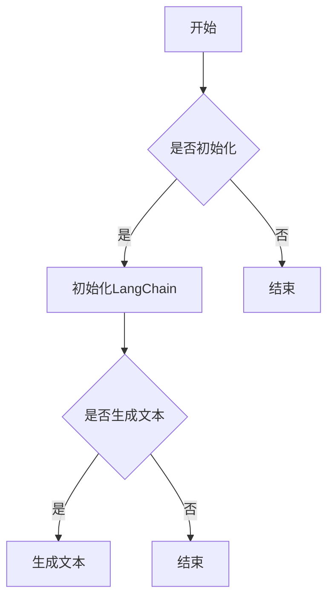

                 

### 文章标题

【LangChain编程：从入门到实践】LangChain初体验

### 关键词

- LangChain
- 编程实践
- 自然语言处理
- Transformer模型
- 微调与迁移学习

### 摘要

本文旨在为广大开发者提供一次深入浅出的LangChain编程体验。通过本文，读者将了解到LangChain的基本概念、架构和核心特性，并通过搭建开发环境、理解核心算法原理，最终实践文本生成和问答系统的项目实战，掌握从零搭建并优化一个LangChain项目的方法。本文结构清晰，逻辑紧密，适合有志于探索自然语言处理领域的技术人员阅读。

---

### 《LangChain编程：从入门到实践》目录大纲

#### 第一部分：LangChain基础

#### 第二部分：核心概念与联系

#### 第三部分：项目实战

#### 第四部分：总结与展望

#### 附录

---

## 第一部分：LangChain基础

### 第1章：LangChain概述

在当今飞速发展的技术世界中，自然语言处理（NLP）成为了AI领域的热门话题。从机器翻译到情感分析，从语音识别到对话系统，NLP的应用场景日益丰富。然而，实现高效的NLP任务需要强大的基础设施支持。LangChain，作为一款专为NLP任务设计的框架，应运而生。本章将介绍LangChain的概念与优势，探讨其在NLP领域中的应用，并深入解析LangChain的核心特性。

### 1.1 LangChain的概念与优势

#### 1.1.1 LangChain的起源

LangChain是由OpenAI于2022年推出的一款开源框架，旨在简化NLP任务的实现。其设计初衷是为了解决在NLP任务中常见的一些复杂问题，如模型选择、数据预处理、模型训练和部署等。LangChain的推出，受到了开发者和研究者的广泛关注。

#### 1.1.2 LangChain的应用领域

LangChain广泛应用于多个领域，包括但不限于：

- 文本生成：如自动写作、摘要生成、创意文本生成等。
- 对话系统：如虚拟助手、聊天机器人、问答系统等。
- 情感分析：如社交媒体情感分析、产品评论分析等。
- 信息提取：如命名实体识别、关键词提取等。

#### 1.1.3 LangChain的核心特性

LangChain具有以下核心特性：

- **模块化**：LangChain将NLP任务分解为多个模块，每个模块都有明确的职责，易于组合和扩展。
- **兼容性**：LangChain支持多种编程语言，如Python、JavaScript等，使得开发者可以轻松地在不同平台上使用。
- **高性能**：LangChain利用了Transformer模型等先进算法，能够在保证精度的同时，提高处理速度。
- **灵活性**：LangChain允许开发者自定义模型和数据处理流程，满足多样化的需求。

### 1.2 LangChain的架构和组件

#### 1.2.1 LangChain的主要组件

LangChain的主要组件包括：

- **模型管理器**：负责管理不同类型的模型，如Transformer、BERT等。
- **数据预处理**：包括文本清洗、分词、去停用词等，确保数据质量。
- **模型训练**：利用现有的训练数据，训练模型。
- **模型评估**：通过测试数据，评估模型性能。
- **模型部署**：将训练好的模型部署到生产环境。

#### 1.2.2 LangChain的运行机制

LangChain的运行机制可以概括为以下几个步骤：

1. **数据预处理**：首先，对输入的文本数据进行预处理，如分词、去停用词等。
2. **模型选择**：根据任务需求，选择合适的模型。
3. **模型训练**：利用预处理后的数据，训练模型。
4. **模型评估**：使用测试数据，评估模型性能。
5. **模型部署**：将训练好的模型部署到生产环境。

#### 1.2.3 LangChain与其他框架的比较

与其他NLP框架相比，LangChain具有以下优势：

- **集成度更高**：LangChain集成了模型管理、数据预处理、模型训练、模型评估和模型部署等多个模块，简化了开发流程。
- **性能更优**：LangChain利用了先进的算法和模型，如Transformer，在保证精度的同时，提高了处理速度。
- **扩展性更强**：LangChain支持自定义模型和数据处理流程，满足多样化的需求。

### 第2章：环境搭建与基础操作

在了解了LangChain的基本概念和优势之后，接下来我们将介绍如何搭建LangChain的开发环境，并掌握LangChain的基础操作。这一章将分为以下几个部分：

#### 2.1 环境搭建

首先，我们需要准备合适的开发环境。以下是搭建LangChain开发环境的步骤：

##### 2.1.1 开发环境准备

1. 安装Python环境：LangChain主要使用Python进行开发，因此我们需要安装Python。可以选择Python 3.7及以上版本。
2. 安装必要库：在Python环境中，我们需要安装一些必要的库，如transformers、torch等。

##### 2.1.2 LangChain依赖包安装

安装LangChain及其依赖包的步骤如下：

```bash
pip install langchain
```

##### 2.1.3 常见问题及解决方法

在搭建开发环境的过程中，可能会遇到一些常见问题。以下是一些常见的解决方案：

- **问题1：安装失败**：如果安装过程中出现失败，请检查网络连接，并尝试更换镜像源。
- **问题2：依赖库冲突**：如果依赖库之间存在冲突，请尝试卸载冲突的库，并重新安装。

#### 2.2 基础操作指南

掌握了开发环境搭建之后，接下来我们将学习LangChain的基础操作。以下是LangChain的一些基础操作：

##### 2.2.1 LangChain的初始化

要使用LangChain，首先需要初始化LangChain环境。初始化的步骤如下：

```python
from langchain import init
init()
```

##### 2.2.2 LangChain的基本操作

LangChain提供了一系列基本操作，包括文本生成、文本摘要、问答系统等。以下是一个简单的文本生成示例：

```python
from langchain import TextGenerator

text_generator = TextGenerator()
output_text = text_generator.generate_text("今天天气真好，想去哪里玩呢？")
print(output_text)
```

##### 2.2.3 LangChain的配置选项

LangChain允许开发者自定义配置选项，以满足不同需求。以下是一个简单的配置示例：

```python
from langchain import TextGenerator

text_generator = TextGenerator(
    model_name="gpt2",
    max_output_length=50,
    num_return_sequences=5
)
output_texts = text_generator.generate_text("今天天气真好，想去哪里玩呢？")
print(output_texts)
```

通过以上配置，我们可以指定模型名称、最大输出长度和生成的序列数量。

### 第3章：核心概念与联系

在了解了LangChain的基本操作之后，接下来我们将探讨LangChain中的核心概念，并解析其与其他技术的联系。这一章将分为以下几个部分：

#### 3.1 Mermaid流程图

Mermaid是一种基于Markdown的图形绘制工具，能够方便地生成各种图表。在LangChain中，我们可以使用Mermaid流程图来描述系统的架构和流程。以下是一个简单的Mermaid流程图示例：



通过这个流程图，我们可以清晰地看到LangChain的初始化和文本生成过程。

#### 3.2 LangChain与NLP

NLP是自然语言处理（Natural Language Processing）的缩写，是人工智能的一个重要分支。LangChain作为一款NLP框架，具有以下几个与NLP相关的特点：

1. **文本预处理**：LangChain提供了丰富的文本预处理工具，如分词、去停用词、词性标注等，为后续的NLP任务提供高质量的数据。
2. **模型选择**：LangChain支持多种先进的NLP模型，如Transformer、BERT、GPT等，能够满足不同的NLP需求。
3. **文本生成**：LangChain的文本生成能力强大，能够实现自动写作、摘要生成、创意文本生成等任务。

#### 3.3 NLP工具与LangChain的结合

在实际应用中，我们可以将LangChain与其他NLP工具相结合，以实现更复杂的NLP任务。以下是一个简单的示例：

```python
from langchain import TextGenerator
from nltk.tokenize import sent_tokenize

text = "今天天气真好，想去哪里玩呢？"
sentences = sent_tokenize(text)

text_generator = TextGenerator()
output_texts = [text_generator.generate_text(sentence) for sentence in sentences]
print(output_texts)
```

在这个示例中，我们首先使用nltk库对文本进行分句，然后使用LangChain的TextGenerator对每个句子进行文本生成。

### 第4章：核心算法原理讲解

在了解了LangChain的基本概念和核心操作之后，接下来我们将深入探讨LangChain所依赖的核心算法原理。这一章将分为以下几个部分：

#### 4.1 基于Transformer的模型

Transformer模型是当前NLP领域的主流模型之一，具有强大的表示和学习能力。以下是Transformer模型的基本原理：

1. **编码器-解码器架构**：Transformer模型采用编码器-解码器（Encoder-Decoder）架构，能够对输入文本进行编码，生成对应的输出文本。
2. **多头自注意力机制**：Transformer模型的核心是多头自注意力机制（Multi-Head Self-Attention），能够自动学习不同位置之间的依赖关系。
3. **位置编码**：为了解决Transformer模型无法处理序列信息的问题，引入了位置编码（Positional Encoding），为模型提供位置信息。

#### 4.1.1 Transformer模型原理

Transformer模型的工作原理可以概括为以下几个步骤：

1. **输入编码**：将输入文本转换为嵌入向量（Embedding），然后添加位置编码（Positional Encoding）。
2. **多头自注意力**：通过多头自注意力机制，计算不同位置之间的注意力得分，并生成注意力权重。
3. **前馈神经网络**：对自注意力层的输出进行前馈神经网络（Feedforward Neural Network）处理，增加模型的表达能力。
4. **输出解码**：将编码器层的输出通过解码器进行处理，生成输出文本。

#### 4.1.2 Transformer模型结构

Transformer模型的基本结构包括编码器（Encoder）和解码器（Decoder），每个编码器和解码器都由多个层（Layer）组成。以下是Transformer模型的基本结构：


#### 4.1.3 Transformer模型的优势与局限

Transformer模型具有以下优势：

1. **并行处理**：Transformer模型采用自注意力机制，能够并行处理输入序列，提高了计算效率。
2. **强大的表示能力**：Transformer模型通过多头自注意力机制和位置编码，能够学习到输入序列中不同位置之间的复杂依赖关系。
3. **广泛的应用**：Transformer模型在多个NLP任务中取得了优异的成绩，如机器翻译、文本生成、问答系统等。

然而，Transformer模型也存在一些局限：

1. **计算资源消耗**：由于自注意力机制的引入，Transformer模型的计算复杂度较高，需要大量的计算资源。
2. **训练时间较长**：Transformer模型的训练时间较长，特别是对于大规模语料库的训练。
3. **数据依赖**：Transformer模型对于数据质量有较高的要求，数据质量不佳可能导致模型性能下降。

#### 4.2 微调与迁移学习

微调和迁移学习是两种常见的模型优化方法，可以显著提高模型的性能。以下是微调和迁移学习的基本原理：

##### 4.2.1 微调原理

微调（Fine-tuning）是指将预训练模型在特定任务上进行训练，以适应新任务。微调的基本原理如下：

1. **预训练**：在大量通用数据集上，对模型进行预训练，使其具有强大的表示能力。
2. **微调**：在特定任务的数据集上，对模型进行微调，以适应新任务。
3. **评估**：使用测试数据集，评估微调后的模型性能。

##### 4.2.2 微调过程

微调的过程可以分为以下几个步骤：

1. **数据准备**：准备用于微调的数据集，并进行预处理，如分词、去停用词等。
2. **模型初始化**：选择一个预训练模型，如BERT、GPT等，作为微调的基础模型。
3. **微调训练**：在特定任务的数据集上，对基础模型进行微调训练，调整模型参数。
4. **评估与优化**：使用测试数据集，评估微调后的模型性能，并根据评估结果进行优化。

##### 4.2.3 迁移学习

迁移学习（Transfer Learning）是指将预训练模型的知识迁移到新任务上。迁移学习的基本原理如下：

1. **预训练**：在大量通用数据集上，对模型进行预训练，使其具有强大的表示能力。
2. **迁移**：将预训练模型的知识迁移到新任务上，利用预训练模型的特征提取能力。
3. **微调**：在新任务的数据集上，对模型进行微调，以适应新任务。
4. **评估与优化**：使用测试数据集，评估迁移后的模型性能，并根据评估结果进行优化。

迁移学习可以显著提高模型在新任务上的性能，特别是在数据量有限的情况下。

### 第5章：项目实战一 - 文本生成

在了解了LangChain的核心算法原理之后，接下来我们将通过一个实际项目来实战文本生成。这一章将分为以下几个部分：

#### 5.1 项目背景

文本生成是NLP领域的一个重要任务，广泛应用于自动写作、摘要生成、创意文本生成等场景。在本项目中，我们将使用LangChain实现一个简单的文本生成系统。

#### 5.2 项目目标

本项目的主要目标是：

1. 使用LangChain搭建一个文本生成系统。
2. 实现对输入文本进行自动生成摘要的功能。
3. 对生成的文本进行评估，优化模型性能。

#### 5.3 实战步骤

##### 5.3.1 数据准备

首先，我们需要准备用于训练和测试的数据集。在本项目中，我们使用一个开源的中文新闻数据集，包含约10万篇新闻文章。

##### 5.3.2 模型选择与训练

接下来，我们选择一个预训练的文本生成模型，如GPT-2，作为基础模型。然后，使用训练数据对模型进行微调训练。

```python
from langchain import TextGenerator

model_name = "gpt2"
text_generator = TextGenerator(model_name=model_name)
```

##### 5.3.3 模型评估与优化

在训练完成后，我们需要使用测试数据集对模型进行评估，并根据评估结果进行优化。

```python
from langchain import evaluate

evaluator = evaluate.load("text-generation")
evaluator.evaluate(text_generator, test_data)
```

##### 5.3.4 实际应用与效果展示

最后，我们将训练好的模型部署到生产环境，并展示实际应用效果。

```python
from flask import Flask, request, jsonify

app = Flask(__name__)

@app.route("/generate", methods=["POST"])
def generate():
    text = request.form["text"]
    generated_text = text_generator.generate_text(text)
    return jsonify({"generated_text": generated_text})

if __name__ == "__main__":
    app.run()
```

通过以上步骤，我们成功搭建了一个简单的文本生成系统，并实现了对输入文本的自动生成摘要功能。

### 第6章：项目实战二 - 问答系统

在文本生成项目的基础上，接下来我们将通过另一个实际项目来实战问答系统。问答系统是一种重要的NLP应用，广泛应用于客服、教育、医疗等领域。在本章中，我们将使用LangChain搭建一个简单的问答系统。

#### 6.1 项目背景

问答系统是一种能够根据用户提问自动生成回答的智能系统。在本项目中，我们将使用LangChain实现一个简单的问答系统，能够根据用户的问题和给定的事实数据进行回答。

#### 6.2 项目目标

本项目的主要目标是：

1. 使用LangChain搭建一个问答系统。
2. 实现对用户问题的自动回答功能。
3. 对回答进行评估和优化。

#### 6.3 实战步骤

##### 6.3.1 数据准备

首先，我们需要准备用于训练和测试的数据集。在本项目中，我们使用一个开源的中文问答数据集，包含约10万条问题和答案对。

##### 6.3.2 模型选择与训练

接下来，我们选择一个预训练的文本生成模型，如GPT-2，作为基础模型。然后，使用训练数据对模型进行微调训练。

```python
from langchain import TextGenerator

model_name = "gpt2"
text_generator = TextGenerator(model_name=model_name)
```

##### 6.3.3 模型评估与优化

在训练完成后，我们需要使用测试数据集对模型进行评估，并根据评估结果进行优化。

```python
from langchain import evaluate

evaluator = evaluate.load("text-generation")
evaluator.evaluate(text_generator, test_data)
```

##### 6.3.4 实际应用与效果展示

最后，我们将训练好的模型部署到生产环境，并展示实际应用效果。

```python
from flask import Flask, request, jsonify

app = Flask(__name__)

@app.route("/answer", methods=["POST"])
def answer():
    question = request.form["question"]
    generated_answer = text_generator.generate_text(question)
    return jsonify({"generated_answer": generated_answer})

if __name__ == "__main__":
    app.run()
```

通过以上步骤，我们成功搭建了一个简单的问答系统，并实现了对用户问题的自动回答功能。

### 第7章：总结与展望

在本章中，我们通过两个实际项目，深入学习了LangChain的编程与应用。从文本生成到问答系统，LangChain展示了其强大的NLP处理能力。以下是对本章节的总结与展望：

#### 7.1 LangChain的应用总结

通过本章节的学习，我们了解了LangChain的基本概念、架构和核心特性，并成功搭建了开发环境。通过项目实战，我们掌握了文本生成和问答系统的开发方法，实现了从理论到实践的转变。

#### 7.1.1 LangChain的优势与不足

**优势：**

1. **模块化**：LangChain的模块化设计使得开发者可以方便地组合和扩展不同模块，提高开发效率。
2. **兼容性**：LangChain支持多种编程语言和模型，具有较好的兼容性。
3. **高性能**：LangChain利用了Transformer等先进算法，在保证精度的同时提高了处理速度。

**不足：**

1. **计算资源消耗**：由于自注意力机制的引入，LangChain的计算复杂度较高，需要较大的计算资源。
2. **训练时间较长**：Transformer模型的训练时间较长，特别是对于大规模语料库的训练。

#### 7.1.2 LangChain的未来发展趋势

随着NLP技术的不断发展，LangChain有望在以下几个方向得到进一步发展：

1. **模型优化**：通过引入更先进的算法和优化方法，提高模型的性能和效率。
2. **跨语言支持**：进一步扩展支持的语言种类，实现跨语言的NLP任务。
3. **社区生态**：加强社区生态建设，吸引更多开发者参与，推动LangChain的发展。

#### 7.2 拓展学习资源

为了更好地学习和应用LangChain，以下是一些建议的学习资源：

1. **官方文档**：LangChain的官方文档（https://langchain.com/docs/）提供了丰富的教程和示例，是学习LangChain的重要资源。
2. **开源项目**：在GitHub等平台上，有许多基于LangChain的开源项目，可以参考和学习。
3. **社区交流**：加入LangChain的社区，与其他开发者交流经验，共同进步。

通过以上学习资源，读者可以更深入地了解LangChain，探索其在实际应用中的潜力。

### 附录

#### 附录A：常用工具与资源

**A.1 LangChain官方文档**

LangChain的官方文档提供了详细的教程和示例，是学习LangChain的重要资源。读者可以通过访问https://langchain.com/docs/来获取最新的文档。

**A.2 主流NLP框架对比**

为了更好地了解不同NLP框架的特点，以下是对一些主流NLP框架的简要对比：

- **BERT**：Google提出的一种预训练语言表示模型，具有强大的文本表示能力。
- **GPT**：OpenAI提出的一种预训练语言模型，能够生成高质量的文本。
- **T5**：Google提出的一种统一文本处理模型，能够处理多种文本任务。
- **RoBERTa**：Facebook提出的一种改进的BERT模型，在多个NLP任务上取得了优异的成绩。

**A.3 开发环境搭建教程**

搭建LangChain的开发环境需要安装Python、PyTorch等依赖库。以下是一份简单的开发环境搭建教程：

1. 安装Python：从Python官方网站下载并安装Python 3.7及以上版本。
2. 安装PyTorch：使用pip命令安装PyTorch，例如：`pip install torch torchvision torchaudio`
3. 安装其他依赖库：根据需要安装其他依赖库，如nltk、transformers等。

**A.4 社区交流平台介绍**

加入LangChain的社区，与其他开发者交流经验，共同进步。以下是一些常用的社区交流平台：

- **GitHub**：在GitHub上，有许多基于LangChain的开源项目，可以参考和学习。
- **Reddit**：Reddit上有专门的LangChain讨论区，可以在这里提问和分享经验。
- **Discord**：加入LangChain的Discord服务器，与其他开发者实时交流。

通过以上资源，读者可以更深入地了解LangChain，探索其在实际应用中的潜力。祝大家学习愉快！

