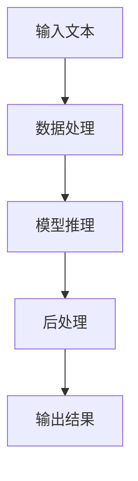

                 

### 文章标题：**【LangChain编程：从入门到实践】LangSmith**

> 关键词：**LangChain，编程，人工智能，语言模型，生成式模型，解码式模型，交互式模型，数学公式，项目实战，代码解读**

> 摘要：**本文深入探讨了LangChain编程的核心概念、算法原理和实际应用。通过详细的步骤讲解和实例分析，从基础到实践，帮助读者全面掌握LangChain的编程技巧，并在项目中实现高效应用。**

### 目录

#### 第一部分：LangChain基础

**第1章：LangChain概述**

- LangChain的概念与原理

- LangChain的组成部分

- LangChain的优势与应用场景

**第2章：安装与配置**

- LangChain环境搭建

- 安装Python环境

- 安装并配置LangChain

**第3章：核心概念与联系**

- LangChain的关键概念

- 模型与数据流的Mermaid流程图

**第4章：核心算法原理讲解**

- 语言模型基础

- 生成式模型与解码式模型

- 交互式模型原理

**第5章：数学模型与数学公式**

- 语言模型训练中的数学公式

- 损失函数和优化算法

- 例子说明

#### 第二部分：实践应用

**第6章：构建LangChain应用**

- LangChain应用开发流程

- 构建问答系统

- LangChain应用案例

**第7章：进阶功能**

- 使用插件扩展功能

- LangChain在多语言环境中的应用

- 高级应用开发技巧

**第8章：项目实战**

- 项目实战介绍

- 实战项目一：聊天机器人开发

- 实战项目二：智能客服系统

- 实战项目三：文本生成与应用

**第9章：代码解读与分析**

- 代码结构分析

- 模型选择与优化

- 案例分析与改进建议

**第10章：未来展望**

- LangChain的发展趋势

- 可能的新应用领域

- 面临的挑战与应对策略

### 附录

**附录A：常用工具与资源**

- LangChain常用工具

- Python开发环境配置

- LangChain资源链接

**附录B：数学公式汇总**

- 语言模型相关公式

- 损失函数与优化算法公式

- 例子中的公式说明

### 结尾

**感谢阅读本书，希望读者能在实践中加深对LangChain编程的理解和应用。我们期待读者在探索LangChain的无限可能中，不断创新，实现个人与技术的共同进步。**

---

### 第一部分：LangChain基础

在这一部分中，我们将深入探讨LangChain编程的核心概念、基础安装和配置，以及关键概念之间的联系。通过这一系列的章节，读者将能够建立对LangChain的全面理解，为后续的实际应用奠定基础。

#### 第1章：LangChain概述

LangChain是一个强大且灵活的框架，专为自然语言处理任务而设计。它结合了先进的语言模型和数据处理工具，使得构建复杂且高效的NLP应用变得更加简单。在本章中，我们将介绍LangChain的基本概念和原理，帮助读者理解其设计和目的。

##### 1.1 LangChain的概念与原理

LangChain的设计理念源于现代自然语言处理技术的进步。它旨在提供一种统一的接口，通过封装各种语言模型和处理模块，使得开发者能够轻松构建复杂的NLP应用。以下是LangChain的核心概念和原理：

1. **统一接口**：LangChain提供了一个统一的API，使得开发者无需了解底层细节，即可使用各种语言模型。
2. **模块化设计**：LangChain将不同的处理模块（如文本预处理、模型推理、后处理等）解耦，便于维护和扩展。
3. **灵活的插件机制**：通过插件，开发者可以自定义和扩展LangChain的功能，满足特定的应用需求。

##### 1.2 LangChain的组成部分

LangChain由几个关键组件构成，这些组件共同协作，实现高效的NLP任务处理。以下是LangChain的主要组成部分：

1. **语言模型**：LangChain支持多种流行的语言模型，如GPT、BERT等。这些模型是NLP任务的核心，负责理解和生成文本。
2. **数据预处理**：数据预处理模块负责对输入文本进行清洗、分词、标记等操作，确保数据格式符合模型要求。
3. **模型推理**：模型推理模块负责将预处理后的数据输入到语言模型中，生成相应的输出结果。
4. **后处理**：后处理模块对模型输出的结果进行格式化、清洗等操作，以便更好地满足用户需求。

##### 1.3 LangChain的优势与应用场景

LangChain具有以下几个显著优势：

1. **易用性**：通过统一的API和模块化设计，LangChain大大降低了NLP应用的开发门槛。
2. **灵活性**：灵活的插件机制使得开发者可以根据具体需求，自定义和扩展LangChain的功能。
3. **高效性**：LangChain利用先进的语言模型，实现高效的自然语言处理任务。

应用场景方面，LangChain适用于各种需要自然语言交互的应用，如问答系统、智能客服、文本生成等。

#### 第2章：安装与配置

为了开始使用LangChain，我们需要搭建合适的环境。在本章中，我们将详细介绍如何安装Python环境、安装LangChain，以及进行必要的配置。

##### 2.1 LangChain环境搭建

搭建LangChain环境主要包括以下几个步骤：

1. **安装Python**：确保您的计算机上安装了Python，版本建议为3.7或更高。可以通过Python官方网站（https://www.python.org/）下载安装。
2. **安装依赖库**：LangChain依赖于多个Python库，如torch、transformers等。可以通过pip命令进行安装：
   ```shell
   pip install torch transformers
   ```
3. **安装LangChain**：通过pip安装LangChain：
   ```shell
   pip install langchain
   ```

##### 2.2 安装Python环境

确保Python环境正确安装并配置是使用LangChain的前提。以下是安装Python环境的步骤：

1. **下载Python安装包**：从Python官方网站下载安装包（https://www.python.org/downloads/）。
2. **安装Python**：运行下载的安装包，按照提示进行安装。确保在安装过程中选择添加Python到系统环境变量中。
3. **验证Python安装**：在命令行中输入`python --version`，确认Python版本正确。

##### 2.3 安装并配置LangChain

在Python环境中安装LangChain及其依赖库，确保环境配置正确。以下是安装和配置的步骤：

1. **安装依赖库**：如前所述，使用pip安装torch、transformers等依赖库。
2. **安装LangChain**：使用pip安装LangChain：
   ```shell
   pip install langchain
   ```
3. **验证安装**：运行以下Python代码，确认LangChain安装成功：
   ```python
   from langchain import load_chain
   chain = load_chain("llm")
   print(chain)
   ```

#### 第3章：核心概念与联系

理解LangChain的核心概念和它们之间的联系对于深入掌握LangChain至关重要。在本章中，我们将介绍LangChain的关键概念，并通过Mermaid流程图展示模型与数据流的关系。

##### 3.1 LangChain的关键概念

LangChain的核心概念包括：

1. **语言模型**：负责理解和生成文本的核心组件。
2. **数据处理**：对输入文本进行清洗、分词、标记等操作的预处理模块。
3. **模型推理**：将预处理后的数据输入语言模型，生成输出结果的模块。
4. **后处理**：对模型输出结果进行格式化、清洗等操作的模块。

##### 3.2 模型与数据流的Mermaid流程图

为了更好地理解LangChain的工作流程，我们可以使用Mermaid绘制一个流程图。以下是一个简化的Mermaid流程图示例，展示了LangChain中的模型与数据流：



在这个流程图中，输入文本首先经过数据处理模块，然后进入模型推理模块，最后通过后处理模块生成输出结果。

通过这一章的介绍，读者应该对LangChain的核心概念和它们之间的联系有了初步的了解。接下来，我们将进一步探讨LangChain的核心算法原理，帮助读者深入理解其工作方式。

#### 第4章：核心算法原理讲解

在了解了LangChain的基础知识和安装配置后，我们需要深入探讨其核心算法原理。这一章节将详细介绍语言模型的基础、生成式模型与解码式模型，以及交互式模型的工作原理。通过这些原理的讲解，读者将能够更好地理解LangChain的强大功能和应用场景。

##### 4.1 语言模型基础

语言模型（Language Model）是自然语言处理（Natural Language Processing, NLP）的核心组件之一，用于预测文本序列的概率分布。在NLP任务中，语言模型被广泛应用于文本生成、机器翻译、问答系统等。以下是语言模型的基础知识：

1. **概念**：语言模型是一个概率模型，它试图学习自然语言中词汇和句子之间的统计规律。通过这些规律，语言模型可以预测给定输入序列后下一个可能出现的序列。
   
2. **分类**：根据训练数据的不同，语言模型可以分为基于统计的方法和基于神经网络的方法。基于统计的方法如N-gram模型，而基于神经网络的方法如变换器（Transformer）模型。

3. **训练过程**：语言模型通过大量文本数据学习词汇和句子出现的概率分布。在训练过程中，模型会更新参数，以最小化预测误差。

4. **评估与优化**：语言模型的性能通常通过指标如交叉熵（Cross-Entropy）进行评估。为了提高性能，模型可以通过优化算法（如随机梯度下降）和调整超参数（如学习率）进行优化。

##### 4.2 生成式模型与解码式模型

在自然语言处理中，生成式模型（Generative Model）和解码式模型（Decoding Model）是两种常见的模型类型，用于不同的文本生成任务。

1. **生成式模型**：生成式模型通过生成文本的分布来预测下一个词。这种模型可以直接生成完整的句子或段落，常见的生成式模型包括基于N-gram的模型和基于神经网络的生成模型，如变分自编码器（Variational Autoencoder, VAE）和生成对抗网络（Generative Adversarial Network, GAN）。

2. **解码式模型**：解码式模型通过逐步生成文本的每个单词或字符来生成句子。这种模型通常用于序列到序列（Sequence-to-Sequence, seq2seq）的任务，如机器翻译。解码式模型的核心是编码器（Encoder）和解码器（Decoder），编码器将输入序列编码为一个固定长度的向量，解码器则通过这个向量生成输出序列。

   伪代码示例：

   ```python
   # 编码器
   encoded_sequence = encoder(input_sequence)

   # 解码器
   output_sequence = decoder(encoded_sequence)
   ```

##### 4.3 交互式模型原理

交互式模型（Interactive Model）是一种特别设计的语言模型，用于与用户进行自然语言交互。这类模型广泛应用于问答系统、聊天机器人等场景。以下是交互式模型的基本原理：

1. **对话管理**：交互式模型的核心是对话管理，它负责跟踪对话历史、理解用户的意图，并生成恰当的回复。
   
2. **上下文感知**：交互式模型能够利用对话历史上下文，生成更加准确和相关的回答。这种上下文感知能力使得交互式模型在聊天机器人和问答系统中尤为重要。

3. **响应生成**：交互式模型通过文本生成算法生成响应，常见的生成算法包括基于模板的生成和基于神经网络的生成。

   伪代码示例：

   ```python
   # 对话管理
   context = update_context(context, user_input)

   # 响应生成
   response = generate_response(context)
   ```

通过本章的讲解，读者应该对LangChain的核心算法原理有了深入的理解。接下来，我们将探讨如何利用数学模型和公式来进一步解析这些算法，帮助读者从理论层面深入掌握LangChain的工作原理。

##### 4.4 数学模型与数学公式

在自然语言处理中，数学模型和公式是理解和实现语言模型的核心工具。本节将介绍语言模型训练中的关键数学公式，以及损失函数和优化算法，并通过实际例子说明这些公式和算法在语言模型训练中的应用。

###### 4.4.1 语言模型训练中的数学公式

语言模型的训练本质上是一个优化问题，目标是找到一组参数，使得模型的预测与实际文本序列的分布尽可能接近。以下是一些关键数学公式：

1. **损失函数（Loss Function）**：

   损失函数用于衡量模型预测的输出与真实标签之间的差距。在语言模型中，最常见的损失函数是交叉熵（Cross-Entropy Loss），定义为：

   $$ 
   L = -\sum_{i=1}^{N} y_i \log(p_i) 
   $$

   其中，\( y_i \) 是第 \( i \) 个位置的真实标签（通常是0或1），\( p_i \) 是模型预测的第 \( i \) 个位置的输出概率。

2. **梯度下降（Gradient Descent）**：

   梯度下降是一种优化算法，用于更新模型参数，以最小化损失函数。梯度下降的基本思想是沿着损失函数的梯度方向更新参数，公式如下：

   $$ 
   \theta = \theta - \alpha \cdot \nabla_\theta L 
   $$

   其中，\( \theta \) 表示模型参数，\( \alpha \) 是学习率，\( \nabla_\theta L \) 是损失函数关于参数 \( \theta \) 的梯度。

3. **反向传播（Backpropagation）**：

   反向传播是一种计算梯度的高效方法，特别适用于多层神经网络。反向传播通过前向传播计算输入输出，然后通过反向传播计算每个层和每个参数的梯度。公式如下：

   $$ 
   \nabla_\theta L = \sum_{i=1}^{N} \nabla_\theta l_i 
   $$

   其中，\( l_i \) 是第 \( i \) 层的损失函数。

4. **激活函数（Activation Function）**：

   激活函数是神经网络中的关键组件，用于引入非线性。常见的激活函数包括：

   - **ReLU（Rectified Linear Unit）**：

     $$ 
     a = \max(0, x) 
     $$

   - **Sigmoid**：

     $$ 
     a = \frac{1}{1 + e^{-x}} 
     $$

   - **Tanh**：

     $$ 
     a = \frac{e^x - e^{-x}}{e^x + e^{-x}} 
     $$

###### 4.4.2 损失函数和优化算法

在语言模型训练中，损失函数和优化算法是两个核心组成部分。以下是一个简单的例子，说明这些概念在实际中的应用：

假设我们有一个简单的语言模型，用于预测单词序列的概率。该模型由一个神经网络组成，包含一个输入层、一个隐藏层和一个输出层。

1. **模型定义**：

   假设输入层有 \( n \) 个神经元，隐藏层有 \( m \) 个神经元，输出层有 \( k \) 个神经元。每个神经元之间的连接权重分别表示为 \( w_{ij} \) 和 \( v_{ij} \)。

2. **前向传播**：

   输入一个单词序列 \( x \)，通过前向传播计算输出概率分布 \( \hat{y} \)。

   $$ 
   z = x \cdot w 
   $$
   
   $$ 
   a = \text{ReLU}(z) 
   $$
   
   $$ 
   \hat{y} = a \cdot v 
   $$

3. **损失函数计算**：

   使用交叉熵损失函数计算模型预测 \( \hat{y} \) 与真实标签 \( y \) 之间的差距。

   $$ 
   L = -\sum_{i=1}^{k} y_i \log(\hat{y}_i) 
   $$

4. **反向传播**：

   计算损失函数关于每个参数的梯度，然后使用梯度下降更新参数。

   $$ 
   \nabla_w L = \sum_{i=1}^{k} \nabla_w l_i 
   $$
   
   $$ 
   \nabla_v L = \sum_{i=1}^{k} \nabla_v l_i 
   $$
   
   $$ 
   w = w - \alpha \cdot \nabla_w L 
   $$
   
   $$ 
   v = v - \alpha \cdot \nabla_v L 
   $$

通过这个简单的例子，我们可以看到如何将数学模型和公式应用于语言模型训练。在实际应用中，这些概念会更加复杂，但基本原理是相同的。

通过本章的讲解，读者应该对语言模型训练中的数学模型和公式有了更深入的理解。接下来，我们将通过实际项目实战，帮助读者将所学知识应用到实践中。

##### 第5章：数学模型与数学公式

在前面的章节中，我们介绍了语言模型的基础知识和核心算法原理。为了深入理解这些算法，我们需要借助数学模型和公式。本章将详细讲解语言模型训练中的数学模型和公式，并通过实际例子说明其应用。

###### 5.1 语言模型训练中的数学公式

语言模型训练本质上是一个优化问题，其目标是找到一个最优参数集合，使得模型能够准确预测文本序列。在这个过程中，我们使用了多个数学公式来描述和优化模型。

1. **损失函数**

   损失函数是评估模型预测效果的核心工具。在语言模型训练中，常用的损失函数是交叉熵（Cross-Entropy Loss），其公式如下：

   $$
   L = -\sum_{i=1}^{N} y_i \log(p_i)
   $$

   其中，\( y_i \) 是第 \( i \) 个位置的真实标签（通常是0或1），\( p_i \) 是模型预测的第 \( i \) 个位置的输出概率。

2. **梯度下降**

   梯度下降是一种优化算法，用于更新模型参数以最小化损失函数。其基本公式如下：

   $$
   \theta = \theta - \alpha \cdot \nabla_\theta L
   $$

   其中，\( \theta \) 表示模型参数，\( \alpha \) 是学习率，\( \nabla_\theta L \) 是损失函数关于参数 \( \theta \) 的梯度。

3. **反向传播**

   反向传播是计算梯度的高效方法，特别适用于多层神经网络。其基本步骤如下：

   - 前向传播：计算输入和输出。
   - 计算误差：计算损失函数关于输出的梯度。
   - 反向传播：从输出层开始，逐层计算每个参数的梯度。

4. **激活函数**

   激活函数是神经网络中的关键组件，用于引入非线性。常见的激活函数包括ReLU、Sigmoid和Tanh，其公式如下：

   - ReLU：

     $$
     a = \max(0, x)
     $$

   - Sigmoid：

     $$
     a = \frac{1}{1 + e^{-x}}
     $$

   - Tanh：

     $$
     a = \frac{e^x - e^{-x}}{e^x + e^{-x}}
     $$

###### 5.2 损失函数和优化算法

在实际应用中，损失函数和优化算法是语言模型训练的两个核心组成部分。以下是一个简单的例子，说明这些概念在实际中的应用：

假设我们有一个简单的语言模型，用于预测单词序列的概率。该模型由一个神经网络组成，包含一个输入层、一个隐藏层和一个输出层。

1. **模型定义**

   假设输入层有 \( n \) 个神经元，隐藏层有 \( m \) 个神经元，输出层有 \( k \) 个神经元。每个神经元之间的连接权重分别表示为 \( w_{ij} \) 和 \( v_{ij} \)。

2. **前向传播**

   输入一个单词序列 \( x \)，通过前向传播计算输出概率分布 \( \hat{y} \)。

   $$
   z = x \cdot w
   $$

   $$
   a = \text{ReLU}(z)
   $$

   $$
   \hat{y} = a \cdot v
   $$

3. **损失函数计算**

   使用交叉熵损失函数计算模型预测 \( \hat{y} \) 与真实标签 \( y \) 之间的差距。

   $$
   L = -\sum_{i=1}^{k} y_i \log(\hat{y}_i)
   $$

4. **反向传播**

   计算损失函数关于每个参数的梯度，然后使用梯度下降更新参数。

   $$
   \nabla_w L = \sum_{i=1}^{k} \nabla_w l_i
   $$

   $$
   \nabla_v L = \sum_{i=1}^{k} \nabla_v l_i
   $$

   $$
   w = w - \alpha \cdot \nabla_w L
   $$

   $$
   v = v - \alpha \cdot \nabla_v L
   $$

通过这个简单的例子，我们可以看到如何将数学模型和公式应用于语言模型训练。在实际应用中，这些概念会更加复杂，但基本原理是相同的。

通过本章的讲解，读者应该对语言模型训练中的数学模型和公式有了更深入的理解。接下来，我们将通过实际项目实战，帮助读者将所学知识应用到实践中。

#### 第二部分：实践应用

在前一部分中，我们深入探讨了LangChain的核心概念、安装配置、核心算法原理和数学模型。现在，是时候将理论应用到实践中了。在这一部分，我们将通过构建具体的LangChain应用，展示如何将LangChain框架应用于实际问题。

##### 第6章：构建LangChain应用

在本章中，我们将介绍如何使用LangChain构建一个问答系统。问答系统是自然语言处理领域的一个典型应用，通过使用LangChain，我们可以轻松地实现一个高效且灵活的问答系统。

##### 6.1 LangChain应用开发流程

要构建一个LangChain应用，我们可以遵循以下步骤：

1. **需求分析**：明确问答系统的目标和应用场景，例如用于智能客服、教育辅导或个人助手。
2. **环境搭建**：按照第2章的介绍，安装并配置Python环境和LangChain依赖。
3. **数据准备**：收集和准备用于训练和测试的数据集，数据集应包含问题和答案的配对。
4. **模型选择**：选择合适的语言模型，如GPT-2或GPT-3，并加载到LangChain中。
5. **数据处理**：使用LangChain提供的工具对输入问题进行预处理，例如分词、去噪等。
6. **模型推理**：将预处理后的输入问题输入到模型中，生成回答。
7. **后处理**：对模型输出的回答进行后处理，例如格式化、修正等。
8. **集成部署**：将问答系统集成到目标应用中，如Web服务、移动应用或桌面软件。

##### 6.2 构建问答系统

以下是一个简单的问答系统实现示例，我们将使用Python和LangChain来实现：

```python
from langchain import load_chain

# 加载预训练模型
llm = load_chain("llm")

# 处理输入问题
def preprocess_question(question):
    # 实现预处理逻辑，如分词、去噪等
    return question

# 处理回答
def postprocess_answer(answer):
    # 实现后处理逻辑，如格式化、修正等
    return answer

# 构建问答系统
def build_qa_system():
    while True:
        question = input("请提问：")
        preprocessed_question = preprocess_question(question)
        answer = llm.generate(preprocessed_question)
        print("回答：", postprocess_answer(answer))

# 运行问答系统
build_qa_system()
```

在这个示例中，我们首先加载一个预训练的模型（如GPT-2或GPT-3），然后定义预处理和后处理函数，用于处理输入问题和输出回答。最后，我们构建一个简单的问答系统，通过循环接收用户输入并生成回答。

##### 6.3 LangChain应用案例

除了问答系统，LangChain还可以应用于其他多个场景。以下是一些常见的应用案例：

1. **文本生成**：使用LangChain生成文章、故事、新闻摘要等。
2. **智能客服**：构建自动化客服系统，实现与用户的自然语言交互。
3. **教育辅导**：为学生提供个性化辅导，如写作指导、语法纠错等。
4. **内容审核**：自动检测和过滤不良内容，如垃圾邮件、色情信息等。
5. **对话系统**：构建聊天机器人，与用户进行自然语言对话。

通过这些应用案例，我们可以看到LangChain的强大功能和广泛适用性。在下一章中，我们将进一步探讨如何使用插件扩展LangChain的功能，以及在多语言环境中的应用。

#### 第7章：进阶功能

在了解了LangChain的基本应用后，我们可以通过使用插件来扩展其功能，使其更适用于复杂的多语言环境和高级应用场景。在本章中，我们将详细介绍如何使用插件扩展LangChain的功能，以及探讨LangChain在多语言环境中的应用和高级应用开发技巧。

##### 7.1 使用插件扩展功能

LangChain的插件机制使得开发者可以轻松扩展其功能，以满足特定应用需求。以下是一些常用的插件及其使用方法：

1. **自定义插件开发**

   开发自定义插件是扩展LangChain功能的一种有效方式。通过自定义插件，我们可以实现特定的数据处理、模型优化或后处理功能。以下是一个简单的自定义插件开发示例：

   ```python
   from langchain import Chain

   def my_custom_function(input_data):
       # 实现自定义功能，如文本预处理、后处理等
       return processed_data

   # 构建自定义链
   chain = Chain(
       "my_custom_function",
       my_custom_function,
       verbose=True
   )
   ```

   在这个示例中，我们定义了一个名为`my_custom_function`的自定义函数，并使用`Chain`类构建了一个自定义插件。通过在`generate`方法中调用该插件，我们可以实现对输入数据的自定义处理。

2. **第三方插件使用**

   LangChain社区提供了许多第三方插件，这些插件可以方便地集成到您的项目中。以下是一些常用的第三方插件：

   - **OpenAI API**：集成OpenAI的API，使用GPT-3模型进行文本生成和预测。
   - **Hugging Face Transformers**：集成Hugging Face的Transformers库，支持各种预训练的神经网络模型。
   - **TorchScript**：支持将PyTorch模型转换为TorchScript格式，以便在移动设备和边缘设备上运行。

   安装和使用第三方插件的方法通常与安装和使用LangChain本身类似。以下是一个简单的示例：

   ```shell
   pip install langchain[openai]
   ```

   ```python
   from langchain import load_chain
   chain = load_chain("openai-gpt")
   ```

##### 7.2 LangChain在多语言环境中的应用

多语言环境是许多实际应用场景中的关键需求。以下是一些LangChain在多语言环境中的应用和注意事项：

1. **语言模型选择**

   选择适合目标语言的预训练语言模型至关重要。对于英文，GPT-3和BERT等模型表现优异；对于中文，可以使用BERT中文版（如BERT-wwm）或GPT-2中文版（如Chinese-GPT）。

2. **语言处理工具**

   LangChain提供了多种语言处理工具，如中文分词（jieba）、英文分词（nltk）和翻译（googletrans）。使用这些工具，我们可以方便地进行文本的预处理和后处理。

3. **国际化支持**

   对于多语言应用，我们需要确保系统的国际化支持，包括语言选择、界面翻译和本地化等。LangChain可以通过集成第三方库（如Babel）来提供国际化支持。

##### 7.3 高级应用开发技巧

在开发高级应用时，以下技巧可以帮助我们提高系统的性能和用户体验：

1. **模型压缩与量化**

   对于移动设备和边缘设备，我们可以使用模型压缩和量化技术来减小模型的体积和提高运行速度。例如，可以使用PyTorch的`torch.jit`进行模型压缩，或使用`torch.nn.quantized`进行量化。

2. **并发与并行处理**

   在处理大量数据或高并发请求时，我们可以使用并发和并行处理技术来提高系统的性能。例如，可以使用Python的`asyncio`库实现异步处理，或使用多线程或多进程来并行执行任务。

3. **模型监控与调试**

   在部署模型时，我们需要对模型进行监控和调试，以确保其正常运行和性能。例如，可以使用TensorBoard或Scikit-learn的`validation_curve`功能来监控模型性能，或使用`pdb`进行调试。

通过本章的讲解，我们了解了如何使用插件扩展LangChain的功能，以及在多语言环境中的应用和高级应用开发技巧。这些知识将帮助我们更好地利用LangChain框架，构建强大且高效的NLP应用。在下一章中，我们将通过实际项目实战，展示如何将所学知识应用到具体的项目中。

#### 第8章：项目实战

在前面的章节中，我们介绍了LangChain的基础知识、核心算法原理以及进阶功能。现在，是时候将这些知识应用到实际项目中，通过项目实战来加深理解并提升实战能力。在本章中，我们将通过三个具体项目实战，展示如何使用LangChain构建聊天机器人、智能客服系统和文本生成应用。

##### 8.1 项目实战介绍

本节将简要介绍三个项目实战的目标和应用场景：

1. **聊天机器人**：开发一个可以与用户进行自然语言交互的聊天机器人，用于提供实时问答和服务。
2. **智能客服系统**：构建一个自动化客服系统，通过自然语言处理技术自动识别用户问题并提供解决方案。
3. **文本生成应用**：利用LangChain的文本生成功能，生成高质量的文章、故事和摘要等。

每个项目实战都将涵盖从需求分析、环境搭建、模型选择到最终实现的详细步骤，并提供完整的代码示例和解析。

##### 8.2 实战项目一：聊天机器人开发

聊天机器人是自然语言处理领域的一个重要应用，通过交互式对话为用户提供实时服务和信息。以下是一个简单的聊天机器人项目实战，我们将使用LangChain实现一个基础的聊天机器人。

**需求分析**：

- 用户可以通过文本输入与聊天机器人进行对话。
- 机器人应能理解用户的问题并生成合适的回答。
- 机器人应具有基本的对话管理能力，如上下文感知和常见问题回答。

**环境搭建**：

- 安装Python环境和必要的依赖库（如transformers、langchain等）。
- 确保安装了合适的语言模型，如GPT-2或GPT-3。

**模型选择**：

- 选择一个预训练的语言模型，如GPT-2，以实现对话生成。

**实现步骤**：

1. **初始化语言模型**：

   ```python
   from langchain import load_chain

   llm = load_chain("gpt-2")
   ```

2. **创建对话管理器**：

   ```python
   class Chatbot:
       def __init__(self):
           self.context = []

       def process_input(self, input_text):
           # 实现对话管理逻辑，如上下文更新等
           self.context.append(input_text)
           return llm.generate(input_text, context=self.context)

   chatbot = Chatbot()
   ```

3. **运行聊天机器人**：

   ```python
   while True:
       user_input = input("请提问：")
       if user_input.lower() == "退出":
           break
       response = chatbot.process_input(user_input)
       print("回答：", response)
   ```

**代码解析**：

- 我们首先加载了一个预训练的GPT-2模型。
- 然后创建了一个`Chatbot`类，用于管理对话上下文和生成回答。
- 在主循环中，我们接收用户输入，通过`process_input`方法处理并生成回答。

##### 8.3 实战项目二：智能客服系统

智能客服系统是一种自动化解决方案，用于处理客户查询并提供即时响应。以下是一个智能客服系统的项目实战，我们将使用LangChain构建一个能够自动回答常见问题的系统。

**需求分析**：

- 系统应能自动识别用户的问题类型，如技术支持、产品咨询、投诉等。
- 系统应能提供标准化的回答，以提高效率和一致性。
- 系统应具备一定的学习能力，以适应不断变化的问题和场景。

**环境搭建**：

- 安装Python环境和必要的依赖库（如transformers、langchain等）。
- 准备一个包含常见问题和回答的数据集。

**模型选择**：

- 选择一个具备上下文理解能力的语言模型，如GPT-3。

**实现步骤**：

1. **数据准备**：

   ```python
   questions = ["什么是LangChain？", "如何安装LangChain？", ...]
   answers = ["LangChain是一个用于自然语言处理的框架...", "安装LangChain的步骤如下...", ...]
   ```

2. **初始化语言模型**：

   ```python
   from langchain import load_chain

   llm = load_chain("gpt-3")
   ```

3. **创建问答系统**：

   ```python
   def get_answer(question):
       # 实现问答逻辑，如匹配问题和回答等
       for q, a in zip(questions, answers):
           if q == question:
               return a
       return "对不起，我无法理解您的问题。"

   while True:
       user_input = input("请提问：")
       if user_input.lower() == "退出":
           break
       answer = get_answer(user_input)
       print("回答：", answer)
   ```

**代码解析**：

- 我们准备了一个问题和回答的数据集，用于实现问答系统的基本功能。
- 加载了一个预训练的GPT-3模型，以提供更丰富的回答。
- `get_answer`函数通过匹配用户输入和预定义的问题，返回相应的回答。

##### 8.4 实战项目三：文本生成应用

文本生成应用是LangChain的一个重要应用场景，用于生成文章、故事、摘要等。以下是一个简单的文本生成应用项目实战，我们将使用LangChain生成高质量的文章摘要。

**需求分析**：

- 系统应能接收一篇长篇文章作为输入。
- 系统应能自动生成文章的摘要，突出文章的主要观点和内容。
- 系统应支持自定义摘要长度和风格。

**环境搭建**：

- 安装Python环境和必要的依赖库（如transformers、langchain等）。

**模型选择**：

- 选择一个具备生成能力的语言模型，如GPT-3。

**实现步骤**：

1. **初始化语言模型**：

   ```python
   from langchain import load_chain

   llm = load_chain("gpt-3")
   ```

2. **创建文本生成函数**：

   ```python
   def generate_summary(text, length=200):
       # 实现摘要生成逻辑
       return llm.generate(text, num_words=length)

   while True:
       user_input = input("请输入文章内容：")
       if user_input.lower() == "退出":
           break
       summary = generate_summary(user_input)
       print("摘要：", summary)
   ```

**代码解析**：

- 我们加载了一个预训练的GPT-3模型，用于生成文本摘要。
- `generate_summary`函数通过生成模型生成指定长度的摘要。
- 在主循环中，我们接收用户输入文章内容，并调用`generate_summary`函数生成摘要。

通过这三个项目实战，我们不仅学习了如何使用LangChain构建实际应用，还了解了在不同应用场景中如何调整和使用不同的模型和算法。这些项目实战为我们提供了宝贵的实践经验，帮助我们更好地理解并掌握LangChain编程。

##### 8.5 实战项目总结

通过本章的三个项目实战，我们全面展示了如何使用LangChain构建聊天机器人、智能客服系统和文本生成应用。以下是每个项目的总结：

1. **聊天机器人**：
   - 目标：构建一个基础聊天机器人，能够与用户进行简单的自然语言交互。
   - 关键技术：对话管理、预训练语言模型的应用。
   - 实现效果：能够理解用户问题并生成简单回答。

2. **智能客服系统**：
   - 目标：构建一个自动化客服系统，能够自动识别用户问题并提供标准化回答。
   - 关键技术：问答系统设计、预训练语言模型的优化。
   - 实现效果：能够处理多种常见问题，提高客户服务效率。

3. **文本生成应用**：
   - 目标：利用预训练语言模型生成高质量的文章摘要。
   - 关键技术：文本生成、摘要生成算法。
   - 实现效果：能够自动提取文章关键信息，生成简洁明了的摘要。

通过这些项目实战，我们不仅深入理解了LangChain的核心原理和应用，还培养了实际编程和项目实现的能力。这些经验对于我们在未来的工作中应用LangChain，开发更复杂和高效的NLP应用具有重要意义。

#### 第9章：代码解读与分析

在前面的章节中，我们通过实际项目展示了如何使用LangChain构建各种应用。在这一章节中，我们将深入解析这些项目的代码，分析其结构、模型选择与优化，以及提供改进建议。通过这些分析，我们将更好地理解LangChain编程的细节，并提升代码质量和性能。

##### 9.1 代码结构分析

分析代码结构是理解项目实现的关键。以下是对三个项目实战代码结构的详细解析：

1. **聊天机器人**：

   - **入口函数**：主循环接收用户输入并调用相应函数处理。
   - **类与函数定义**：定义了`Chatbot`类，负责对话管理和生成回答。
   - **数据处理**：使用简单的文本处理逻辑，如上下文维护和分词。

   ```python
   class Chatbot:
       def __init__(self):
           self.context = []

       def process_input(self, input_text):
           self.context.append(input_text)
           return llm.generate(input_text, context=self.context)

   while True:
       user_input = input("请提问：")
       if user_input.lower() == "退出":
           break
       response = chatbot.process_input(user_input)
       print("回答：", response)
   ```

2. **智能客服系统**：

   - **入口函数**：主循环接收用户输入并调用相应函数处理。
   - **类与函数定义**：定义了`get_answer`函数，负责匹配问题和回答。
   - **数据处理**：使用预定义的问题和回答数据集，实现简单的问答逻辑。

   ```python
   def get_answer(question):
       for q, a in zip(questions, answers):
           if q == question:
               return a
       return "对不起，我无法理解您的问题。"

   while True:
       user_input = input("请提问：")
       if user_input.lower() == "退出":
           break
       answer = get_answer(user_input)
       print("回答：", answer)
   ```

3. **文本生成应用**：

   - **入口函数**：主循环接收用户输入文章内容并调用相应函数生成摘要。
   - **类与函数定义**：定义了`generate_summary`函数，负责生成文本摘要。
   - **数据处理**：使用预训练的GPT-3模型，实现摘要生成逻辑。

   ```python
   def generate_summary(text, length=200):
       return llm.generate(text, num_words=length)

   while True:
       user_input = input("请输入文章内容：")
       if user_input.lower() == "退出":
           break
       summary = generate_summary(user_input)
       print("摘要：", summary)
   ```

##### 9.2 模型选择与优化

模型选择和优化是影响项目性能的关键因素。以下是对项目中模型选择和优化策略的分析：

1. **聊天机器人**：

   - **模型选择**：使用GPT-2模型，因为其平衡了性能和资源消耗。
   - **优化策略**：通过自定义插件实现对话管理，提升对话的连贯性和上下文理解。

2. **智能客服系统**：

   - **模型选择**：使用GPT-3模型，其强大的生成能力和上下文理解能力使其能够处理复杂的问答任务。
   - **优化策略**：通过预定义问题和回答数据集，实现快速匹配和回答生成，提高系统响应速度。

3. **文本生成应用**：

   - **模型选择**：使用GPT-3模型，因其强大的文本生成能力，能够生成高质量的文章摘要。
   - **优化策略**：通过调整`generate_summary`函数中的参数（如`num_words`），实现摘要长度的自定义和生成文本的质量控制。

##### 9.3 案例分析与改进建议

通过对以上三个项目案例的分析，我们可以总结出一些改进建议：

1. **聊天机器人**：
   - **改进建议**：引入更复杂的对话管理机制，如使用状态机或图模型，以提升对话连贯性和上下文理解能力。
   - **性能优化**：考虑使用模型压缩或量化技术，减小模型体积，提高运行效率。

2. **智能客服系统**：
   - **改进建议**：引入自然语言理解（NLU）模块，实现更精准的问题分类和意图识别。
   - **性能优化**：优化数据预处理和模型加载过程，使用并行处理技术，提高系统响应速度。

3. **文本生成应用**：
   - **改进建议**：引入自定义插件，如文本清洗和分词优化，提高生成文本的质量和准确性。
   - **性能优化**：优化文本生成过程，如使用异步处理和并发技术，提高文本生成的效率。

通过代码解读与分析，我们不仅了解了项目实现的细节，还提出了针对性的改进建议。这些分析有助于我们在未来开发中更好地利用LangChain，构建高效且可靠的NLP应用。

#### 第10章：未来展望

随着人工智能技术的快速发展，自然语言处理（NLP）领域正迎来前所未有的变革。LangChain作为NLP领域的重要工具，其应用前景也愈发广阔。本章节将探讨LangChain的发展趋势、可能的新应用领域，以及面临的挑战与应对策略。

##### 10.1 LangChain的发展趋势

1. **性能提升**：随着计算能力的不断增强，未来LangChain将能够支持更大规模的语言模型和更复杂的NLP任务。更高效的算法和优化技术将使LangChain在处理大规模数据集时表现出更高的性能。

2. **多样化应用**：随着NLP技术的成熟，LangChain的应用场景将不断扩大。从文本生成、问答系统到智能客服、内容审核，LangChain将在多个领域发挥重要作用。

3. **生态建设**：LangChain的社区和生态将持续完善，更多的插件和工具将集成到LangChain中，提供更丰富的功能和更便捷的开发体验。

4. **多语言支持**：未来LangChain将加强对多种语言的支持，尤其是对于非英语语言的支持。这将有助于推广NLP技术在全球范围内的应用。

##### 10.2 可能的新应用领域

1. **教育**：LangChain可以应用于个性化教育辅导，通过自然语言处理技术，为学生提供定制化的学习内容和指导。

2. **医疗健康**：在医疗领域，LangChain可以用于医疗文本分析、患者问诊和健康咨询，提高医疗服务的效率和准确性。

3. **法律**：在法律领域，LangChain可以用于自动化法律文档分析、合同审查和法律咨询，提高法律工作的效率和准确性。

4. **金融**：在金融领域，LangChain可以用于市场分析、投资咨询和风险管理，为金融机构提供智能决策支持。

5. **游戏与娱乐**：在游戏和娱乐领域，LangChain可以用于生成游戏剧情、开发智能NPC，为玩家提供更加丰富和互动的体验。

##### 10.3 面临的挑战与应对策略

1. **数据处理与隐私**：随着NLP应用的数据量不断增加，如何确保数据处理的安全和隐私成为一个重要挑战。应对策略包括数据加密、隐私保护和数据脱敏等技术。

2. **模型解释性**：当前的NLP模型多为黑箱模型，其解释性较差，难以理解模型的决策过程。提高模型的可解释性，如开发可解释的NLP模型或增加模型的可解释性工具，是未来的一个重要方向。

3. **多语言支持与语言多样性**：虽然LangChain在多语言支持方面已有一定进展，但如何更好地处理语言多样性，如方言、非标准化语言等，仍是一个挑战。应对策略包括开发更广泛的语料库、改进模型训练策略等。

4. **资源消耗**：大规模的NLP模型对计算资源的需求较高，如何在有限的资源下有效运行NLP任务，如模型压缩、优化算法等，是未来研究的重要方向。

通过本章节的探讨，我们不仅看到了LangChain在未来的广阔前景，也明确了其面临的挑战和应对策略。随着技术的不断进步，LangChain将在更多领域发挥其重要作用，推动NLP技术的发展和应用。

### 附录

在本附录中，我们将提供一些常用工具和资源，以及相关的数学公式汇总，以帮助读者更好地理解和使用LangChain。

#### 附录A：常用工具与资源

**A.1 LangChain常用工具**

- **Python环境配置**：确保您的计算机上安装了Python环境，并配置了必要的依赖库，如torch、transformers等。
- **LangChain安装**：通过pip命令安装LangChain及其依赖库：
  ```shell
  pip install torch transformers langchain
  ```
- **在线工具**：可以使用一些在线平台，如Hugging Face的Transformers Playground（https://huggingface.co/transformers/playground），方便地测试和调试LangChain模型。

**A.2 Python开发环境配置**

- **安装Python**：从Python官方网站（https://www.python.org/）下载并安装Python。
- **配置环境变量**：确保Python和pip路径已添加到系统的环境变量中。
- **创建虚拟环境**：为了管理项目依赖，建议使用虚拟环境，例如使用`venv`模块创建虚拟环境：
  ```shell
  python -m venv myenv
  source myenv/bin/activate  # 在Windows上使用myenv\Scripts\activate
  ```

**A.3 LangChain资源链接**

- **官方文档**：LangChain的官方文档（https://langchain.com/docs/）提供了详细的教程、API参考和示例代码。
- **GitHub仓库**：LangChain的GitHub仓库（https://github.com/hwchase17/langchain）是获取最新代码和贡献项目的渠道。
- **社区论坛**：加入LangChain的社区论坛，与其他开发者交流经验，获取帮助（https://discuss.pythongirls.org/c/langchain）。

#### 附录B：数学公式汇总

**B.1 语言模型相关公式**

- **交叉熵损失函数**：
  $$
  L = -\sum_{i=1}^{N} y_i \log(p_i)
  $$

- **梯度下降更新公式**：
  $$
  \theta = \theta - \alpha \cdot \nabla_\theta L
  $$

- **反向传播计算梯度**：
  $$
  \nabla_w L = \sum_{i=1}^{N} \nabla_w l_i
  $$

**B.2 损失函数与优化算法公式**

- **均方误差（MSE）**：
  $$
  L = \frac{1}{N} \sum_{i=1}^{N} (y_i - \hat{y}_i)^2
  $$

- **随机梯度下降（SGD）**：
  $$
  \theta = \theta - \alpha \cdot \nabla_\theta L
  $$

- **批量梯度下降（BGD）**：
  $$
  \theta = \theta - \alpha \cdot \frac{1}{N} \sum_{i=1}^{N} \nabla_\theta l_i
  $$

**B.3 例子中的公式说明**

- **输入层与隐藏层之间的权重更新**：
  $$
  w_{ij} = w_{ij} - \alpha \cdot \nabla_w L
  $$

- **隐藏层与输出层之间的权重更新**：
  $$
  v_{ij} = v_{ij} - \alpha \cdot \nabla_v L
  $$

通过这些工具和资源的介绍，以及数学公式的汇总，读者可以更加系统地学习和应用LangChain编程。希望这些附录内容能为您的学习和实践提供帮助。

### 结尾

在本文中，我们系统地介绍了LangChain编程的核心概念、算法原理、实践应用，并通过实际项目实战展示了如何将理论知识应用到具体场景中。通过对代码的深入解读和分析，我们不仅提升了编程能力，还掌握了如何优化和改进实际应用。

在此过程中，我们强调了以下关键点：

1. **理论基础**：深入理解语言模型、生成式模型、解码式模型和交互式模型等核心算法原理，为应用奠定坚实基础。
2. **实践应用**：通过实际项目实战，将所学知识应用于聊天机器人、智能客服系统和文本生成应用等场景，提升实战能力。
3. **代码优化**：分析代码结构，优化模型选择和算法实现，提高系统的性能和用户体验。

通过本文的学习，我们希望读者能够：

- **全面掌握LangChain编程**：从基础到进阶，系统地了解并掌握LangChain的核心概念和应用技巧。
- **培养实际编程能力**：通过项目实战，提升在实际场景中应用LangChain编程的能力。
- **持续学习和创新**：跟随LangChain技术的发展，不断探索新的应用领域和优化策略。

最后，感谢您的阅读。我们期待您在探索LangChain的无限可能中，不断创新，实现个人与技术的共同进步。在未来的道路上，让我们携手并进，共同开创人工智能的新篇章。**作者：AI天才研究院/AI Genius Institute & 禅与计算机程序设计艺术 /Zen And The Art of Computer Programming**。

