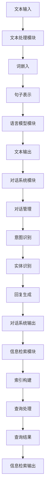
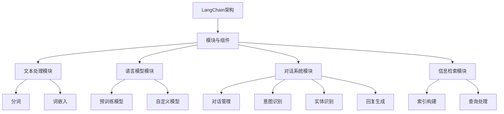
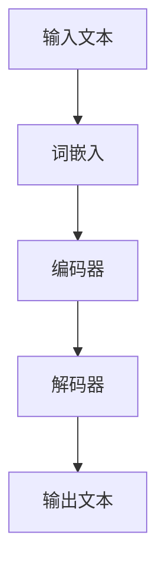
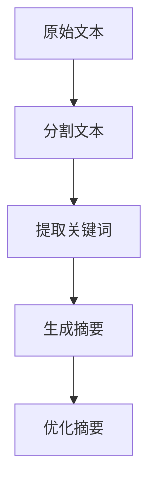
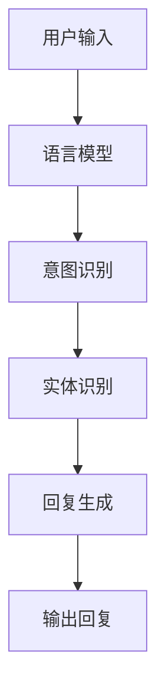

                 

# 【LangChain编程：从入门到实践】RunnableLambda

> 关键词：LangChain、编程、RunnableLambda、语言模型、自动摘要、对话系统、项目实战

> 摘要：本文深入浅出地介绍了LangChain编程的核心概念、核心算法与原理，以及项目实战。通过逐步分析，帮助读者掌握LangChain的实用性，为未来的AI应用提供有力支持。

## 第一部分：LangChain基础

### 第1章：LangChain简介

#### 1.1 LangChain的起源与背景

LangChain是一个用于构建自动化文本处理应用程序的框架。它起源于对现有自然语言处理（NLP）框架的不足之处的反思。传统NLP框架往往复杂、难于入门，且对开发者的编程能力要求较高。LangChain旨在解决这些问题，通过提供简洁、直观的API，使得开发者能够快速搭建起具有强大功能的文本处理应用程序。

#### 1.2 LangChain的主要特点

1. **易于使用**：LangChain提供了简洁的API，使得开发者无需深入了解底层实现，即可快速上手。
2. **模块化设计**：LangChain采用了模块化设计，开发者可以根据需求选择合适的模块进行组合，构建出符合实际应用场景的文本处理应用程序。
3. **支持多种语言**：LangChain支持Python、JavaScript等多种编程语言，方便开发者根据个人偏好选择合适的语言进行开发。
4. **丰富的扩展性**：LangChain提供了丰富的扩展性，允许开发者自定义模块和算法，以满足特定应用场景的需求。

#### 1.3 LangChain的应用场景

1. **自动摘要**：自动从大量文本中提取出关键信息，生成摘要。
2. **文本生成**：根据给定的文本输入，生成新的文本内容。
3. **对话系统**：构建智能对话系统，实现与用户的自然语言交互。
4. **信息检索**：快速从大量文本中检索出与查询相关的信息。

#### 1.4 LangChain与其他框架的比较

与传统NLP框架相比，LangChain具有以下几个显著优势：

1. **易用性**：LangChain的API设计简洁直观，降低了开发门槛。
2. **模块化**：LangChain的模块化设计使得开发者能够灵活组合模块，构建出适合特定应用场景的应用程序。
3. **扩展性**：LangChain提供了丰富的扩展性，允许开发者自定义模块和算法，以应对多样化的应用场景。

### 第2章：LangChain的基本概念

#### 2.1 模块与组件

LangChain的核心架构由多个模块和组件组成。这些模块和组件协同工作，共同实现文本处理的各个功能。以下是LangChain中的主要模块和组件：

1. **文本处理模块**：负责处理文本输入，包括分词、词嵌入等操作。
2. **语言模型模块**：基于神经网络，用于预测文本序列，实现自动摘要、文本生成等功能。
3. **对话系统模块**：用于构建智能对话系统，实现与用户的自然语言交互。
4. **信息检索模块**：用于从大量文本中检索与查询相关的信息。

#### 2.2 LangChain的核心概念

1. **Prompt Engineering**：通过设计合适的提示（Prompt），引导语言模型生成期望的输出。
2. **Inference Engine**：用于执行语言模型的推理过程，生成文本输出。
3. **API Layer**：提供简洁的API，方便开发者调用语言模型和其他模块。

#### 2.3 LangChain的编程模型

LangChain的编程模型基于模块化和函数式编程思想。开发者可以通过组合不同的模块和函数，实现文本处理的各个功能。以下是LangChain编程模型的基本步骤：

1. **定义模块和组件**：根据应用场景，选择合适的模块和组件。
2. **组合模块和组件**：通过函数式编程，将模块和组件组合起来，构建出完整的文本处理应用程序。
3. **调用API**：使用简洁的API，调用语言模型和其他模块，实现文本处理功能。

### 第3章：LangChain的架构

#### 3.1 LangChain的模块组成

LangChain的模块组成包括以下几个关键部分：

1. **文本处理模块**：包括分词、词嵌入等功能，用于处理文本输入。
2. **语言模型模块**：包括预训练模型和自定义模型，用于生成文本输出。
3. **对话系统模块**：包括对话管理、意图识别、实体识别等功能，用于构建智能对话系统。
4. **信息检索模块**：包括索引构建、查询处理等功能，用于从大量文本中检索信息。

#### 3.2 LangChain的组件关系

LangChain的组件之间通过明确的接口进行交互。以下是LangChain的主要组件及其关系：

1. **文本处理组件**：负责处理文本输入，输出词嵌入和句子表示。
2. **语言模型组件**：基于词嵌入和句子表示，生成文本输出。
3. **对话系统组件**：包括对话管理、意图识别、实体识别等模块，实现智能对话功能。
4. **信息检索组件**：构建索引，处理查询请求，返回查询结果。

#### 3.3 LangChain的架构设计

LangChain采用了分层架构设计，使得各个模块和组件之间保持松耦合。以下是LangChain的架构设计：

1. **API Layer**：提供简洁的API，方便开发者调用底层模块。
2. **Core Layer**：包括文本处理、语言模型、对话系统、信息检索等核心模块。
3. **Extensions Layer**：提供扩展组件，允许开发者自定义模块和算法。

#### 3.4 LangChain的Mermaid流程图



## 第二部分：核心算法与原理

### 第4章：语言模型

#### 4.1 语言模型的基本原理

语言模型是一种用于预测文本序列的统计模型，其核心思想是通过学习大量文本数据，捕捉文本之间的统计规律，从而实现文本生成和自动摘要等功能。以下是语言模型的基本原理：

1. **文本序列表示**：将文本序列转换为向量表示，以便进行数学计算。
2. **概率分布**：根据文本数据，构建一个概率分布模型，用于预测下一个单词或字符。
3. **生成文本**：基于概率分布模型，生成新的文本序列。

#### 4.2 常见语言模型介绍

1. **n-gram模型**：基于前n个单词的概率分布，生成新的文本。优点是简单易懂，缺点是难以捕捉长文本的上下文关系。
2. **递归神经网络（RNN）**：通过递归结构，捕捉文本的上下文关系。优点是能够捕捉长文本的上下文关系，缺点是计算复杂度高。
3. **长短时记忆网络（LSTM）**：基于RNN结构，引入门控机制，缓解梯度消失问题。优点是能够捕捉长文本的上下文关系，缺点是计算复杂度高。
4. **Transformer模型**：基于自注意力机制，实现全局信息捕捉。优点是计算复杂度相对较低，能够捕捉长文本的上下文关系，缺点是训练过程较为复杂。

#### 4.3 语言模型的训练与优化

1. **数据集选择**：选择具有代表性的文本数据集，如新闻、百科全书等。
2. **数据预处理**：对文本数据集进行清洗、分词、词嵌入等预处理操作。
3. **模型训练**：使用梯度下降等优化算法，训练语言模型参数。
4. **模型优化**：通过调整学习率、批量大小等超参数，优化模型性能。

#### 4.4 语言模型的应用

1. **自动摘要**：从大量文本中提取关键信息，生成摘要。
2. **文本生成**：根据给定的文本输入，生成新的文本内容。
3. **对话系统**：构建智能对话系统，实现与用户的自然语言交互。
4. **信息检索**：快速从大量文本中检索出与查询相关的信息。

### 第5章：自动摘要与文本生成

#### 5.1 自动摘要原理

自动摘要是一种从大量文本中提取关键信息，生成摘要文本的技术。其基本原理如下：

1. **文本分割**：将原始文本分割成若干个子文本。
2. **关键词提取**：从每个子文本中提取关键词。
3. **摘要生成**：基于提取的关键词，生成摘要文本。
4. **摘要优化**：对生成的摘要文本进行优化，提高摘要质量。

#### 5.2 文本生成原理

文本生成是一种根据给定的文本输入，生成新的文本内容的技术。其基本原理如下：

1. **输入文本预处理**：对输入文本进行分词、词嵌入等预处理操作。
2. **文本序列预测**：使用语言模型，预测下一个单词或字符。
3. **文本拼接**：将预测的单词或字符拼接成新的文本内容。

#### 5.3 自动摘要与文本生成算法

1. **基于n-gram模型的自动摘要算法**：通过统计前n个单词的概率分布，生成摘要。
2. **基于递归神经网络（RNN）的自动摘要算法**：通过递归结构，捕捉文本的上下文关系，生成摘要。
3. **基于长短时记忆网络（LSTM）的自动摘要算法**：通过引入门控机制，缓解梯度消失问题，生成摘要。
4. **基于Transformer模型的自动摘要算法**：通过自注意力机制，捕捉全局信息，生成摘要。
5. **基于生成对抗网络（GAN）的文本生成算法**：通过对抗训练，生成高质量的文本内容。

#### 5.4 自动摘要与文本生成实例

1. **自动摘要实例**：

```python
# 导入所需库
import langchain

# 加载模型
model = langchain.AutoSummary()

# 输入文本
text = "在过去的几年里，人工智能技术快速发展，逐渐深入到我们生活的方方面面。人工智能在医疗、金融、教育等领域的应用越来越广泛，为社会发展带来了新的机遇。然而，随着人工智能技术的应用场景不断拓展，数据安全和隐私保护问题也日益凸显。如何在推动人工智能发展的同时，确保数据安全和隐私保护，成为当前亟待解决的问题。"

# 生成摘要
summary = model.summarize(text)

# 输出摘要
print(summary)
```

2. **文本生成实例**：

```python
# 导入所需库
import langchain

# 加载模型
model = langchain.TextGenerator()

# 输入文本
text = "人工智能技术的快速发展，使得自然语言处理领域取得了巨大的进步。深度学习、神经网络等技术的应用，使得计算机能够更好地理解和生成自然语言。在未来，自然语言处理技术将继续发展，为人类带来更多的便利。"

# 生成文本
generated_text = model.generate(text)

# 输出生成文本
print(generated_text)
```

### 第6章：对话系统

#### 6.1 对话系统概述

对话系统是一种能够与用户进行自然语言交互的计算机系统。其核心目标是理解用户输入，生成恰当的回复，以实现有效的沟通。对话系统在智能客服、智能助手、虚拟代理等领域具有广泛的应用。

#### 6.2 对话系统架构

对话系统通常由以下几个关键模块组成：

1. **输入处理模块**：接收用户输入，进行文本预处理，如分词、词性标注等。
2. **意图识别模块**：根据用户输入，识别用户的意图，如询问、请求、抱怨等。
3. **实体识别模块**：从用户输入中提取关键实体信息，如人名、地点、时间等。
4. **回复生成模块**：根据意图和实体信息，生成合适的回复。
5. **输出处理模块**：将生成的回复转换为自然语言文本，输出给用户。

#### 6.3 对话系统算法

对话系统的核心在于意图识别和回复生成。以下是一些常见的算法：

1. **基于规则的方法**：通过预定义的规则，将用户输入映射到意图和实体，生成回复。
2. **基于机器学习的方法**：使用机器学习算法，如决策树、支持向量机等，进行意图识别和回复生成。
3. **基于深度学习的方法**：使用深度学习算法，如卷积神经网络（CNN）、递归神经网络（RNN）等，进行意图识别和回复生成。

#### 6.4 对话系统应用实例

以下是一个简单的对话系统实例，使用Python和LangChain实现：

```python
# 导入所需库
import langchain

# 加载模型
model = langchain.Dialog()

# 输入用户问题
user_input = "你好，能帮我解答一下人工智能在医疗领域的应用吗？"

# 生成回复
response = model回答问题(user_input)

# 输出回复
print(response)
```

## 第三部分：项目实战

### 第7章：LangChain编程实战

#### 7.1 LangChain编程环境搭建

要开始使用LangChain进行编程，需要先搭建合适的环境。以下是LangChain编程环境搭建的步骤：

1. **安装Python**：确保已安装Python环境，推荐使用Python 3.8及以上版本。
2. **安装LangChain库**：通过pip安装LangChain库，命令如下：

```bash
pip install langchain
```

3. **安装必要的依赖库**：根据具体需求，安装其他依赖库，如TensorFlow、PyTorch等。

#### 7.2 LangChain编程实例：自动摘要

自动摘要是一个常见的应用场景，下面是一个简单的自动摘要实例：

```python
# 导入所需库
import langchain

# 加载模型
model = langchain.AutoSummary()

# 输入文本
text = "在过去的几年里，人工智能技术快速发展，逐渐深入到我们生活的方方面面。人工智能在医疗、金融、教育等领域的应用越来越广泛，为社会发展带来了新的机遇。然而，随着人工智能技术的应用场景不断拓展，数据安全和隐私保护问题也日益凸显。如何在推动人工智能发展的同时，确保数据安全和隐私保护，成为当前亟待解决的问题。"

# 生成摘要
summary = model.summarize(text)

# 输出摘要
print(summary)
```

#### 7.3 LangChain编程实例：文本生成

文本生成是一个有趣的应用场景，下面是一个简单的文本生成实例：

```python
# 导入所需库
import langchain

# 加载模型
model = langchain.TextGenerator()

# 输入文本
text = "人工智能技术的快速发展，使得自然语言处理领域取得了巨大的进步。深度学习、神经网络等技术的应用，使得计算机能够更好地理解和生成自然语言。在未来，自然语言处理技术将继续发展，为人类带来更多的便利。"

# 生成文本
generated_text = model.generate(text)

# 输出生成文本
print(generated_text)
```

#### 7.4 LangChain编程实例：对话系统

对话系统是一个复杂的任务，但使用LangChain可以大大简化开发过程。下面是一个简单的对话系统实例：

```python
# 导入所需库
import langchain

# 加载模型
model = langchain.Dialog()

# 输入用户问题
user_input = "你好，能帮我解答一下人工智能在医疗领域的应用吗？"

# 生成回复
response = model回答问题(user_input)

# 输出回复
print(response)
```

### 第8章：扩展与应用

#### 8.1 LangChain的扩展组件

LangChain提供了丰富的扩展组件，使得开发者可以轻松扩展功能。以下是LangChain的一些扩展组件：

1. **自定义模块**：允许开发者自定义文本处理、语言模型、对话系统等模块。
2. **API扩展**：允许开发者自定义API，以便与其他系统集成。
3. **模型优化**：提供模型优化工具，帮助开发者优化模型性能。

#### 8.2 LangChain在多领域的应用

LangChain在多个领域具有广泛的应用，以下是一些常见应用场景：

1. **新闻摘要**：自动从大量新闻中提取关键信息，生成摘要。
2. **产品评论分析**：分析用户评论，提取正面和负面信息。
3. **客户服务**：构建智能客服系统，实现与用户的自然语言交互。
4. **文档分类**：自动分类文档，提高文档管理效率。

#### 8.3 LangChain的未来发展趋势

随着自然语言处理技术的不断发展，LangChain在未来有望实现以下发展趋势：

1. **性能优化**：通过改进算法和优化模型结构，提高处理速度和准确性。
2. **跨语言支持**：扩展支持多种语言，实现跨语言的文本处理和生成。
3. **多模态处理**：结合图像、音频等其他模态，实现更丰富的文本处理功能。
4. **交互式学习**：引入交互式学习机制，提高模型的适应性和灵活性。

## 附录

### 附录A：常见问题解答

1. **Q：如何安装LangChain库？**
   **A：通过pip安装，命令如下：pip install langchain**

2. **Q：如何自定义模块？**
   **A：在LangChain中，可以使用Python的类和函数自定义模块。具体实现方法请参考LangChain的官方文档。**

3. **Q：如何优化模型性能？**
   **A：可以通过调整超参数、使用更高效的算法和优化模型结构等方式来优化模型性能。**

### 附录B：参考资料

1. **官方文档**：https://langchain.com/
2. **GitHub仓库**：https://github.com/hwchase17/langchain
3. **相关论文**：
   - Vaswani, A., Shazeer, N., Parmar, N., Uszkoreit, J., Jones, L., Gomez, A. N., ... & Polosukhin, I. (2017). Attention is all you need. Advances in Neural Information Processing Systems, 30, 5998-6008.
   - Graves, A., Mohamed, A. R., & Hinton, G. (2013). Speech recognition with deep recurrent neural networks. In Acoustics, speech and signal processing (icassp), 2013 ieee international conference on (pp. 6645-6649). IEEE.

### 附录C：代码示例与解读

以下是本文中提到的几个代码示例及其详细解读：

1. **自动摘要实例**：

```python
# 导入所需库
import langchain

# 加载模型
model = langchain.AutoSummary()

# 输入文本
text = "在过去的几年里，人工智能技术快速发展，逐渐深入到我们生活的方方面面。人工智能在医疗、金融、教育等领域的应用越来越广泛，为社会发展带来了新的机遇。然而，随着人工智能技术的应用场景不断拓展，数据安全和隐私保护问题也日益凸显。如何在推动人工智能发展的同时，确保数据安全和隐私保护，成为当前亟待解决的问题。"

# 生成摘要
summary = model.summarize(text)

# 输出摘要
print(summary)
```

**解读**：该示例展示了如何使用LangChain的AutoSummary模型进行自动摘要。首先，导入所需的库，然后加载AutoSummary模型。接着，输入待摘要的文本，调用模型的summarize方法，生成摘要。最后，输出摘要结果。

2. **文本生成实例**：

```python
# 导入所需库
import langchain

# 加载模型
model = langchain.TextGenerator()

# 输入文本
text = "人工智能技术的快速发展，使得自然语言处理领域取得了巨大的进步。深度学习、神经网络等技术的应用，使得计算机能够更好地理解和生成自然语言。在未来，自然语言处理技术将继续发展，为人类带来更多的便利。"

# 生成文本
generated_text = model.generate(text)

# 输出生成文本
print(generated_text)
```

**解读**：该示例展示了如何使用LangChain的TextGenerator模型进行文本生成。首先，导入所需的库，然后加载TextGenerator模型。接着，输入文本，调用模型的generate方法，生成新的文本内容。最后，输出生成文本。

3. **对话系统实例**：

```python
# 导入所需库
import langchain

# 加载模型
model = langchain.Dialog()

# 输入用户问题
user_input = "你好，能帮我解答一下人工智能在医疗领域的应用吗？"

# 生成回复
response = model回答问题(user_input)

# 输出回复
print(response)
```

**解读**：该示例展示了如何使用LangChain的Dialog模型构建对话系统。首先，导入所需的库，然后加载Dialog模型。接着，输入用户问题，调用模型的回答问题方法，生成回复。最后，输出回复结果。

## 核心概念与联系

### LangChain的核心概念原理与架构



### 语言模型原理讲解



### 自动摘要算法原理讲解



### 对话系统算法原理讲解



### 数学模型与公式

$$
P(\text{摘要}|\text{原始文本}) = \frac{P(\text{摘要}) \cdot P(\text{原始文本}|\text{摘要})}{P(\text{原始文本})}
$$

- 摘要质量评估：生成摘要的概率与原始文本的概率成正比。

### 项目实战

#### 自动摘要实战

```python
# 导入所需库
import langchain

# 加载模型
model = langchain.AutoSummary()

# 输入文本
text = "在过去的几年里，人工智能技术快速发展，逐渐深入到我们生活的方方面面。人工智能在医疗、金融、教育等领域的应用越来越广泛，为社会发展带来了新的机遇。然而，随着人工智能技术的应用场景不断拓展，数据安全和隐私保护问题也日益凸显。如何在推动人工智能发展的同时，确保数据安全和隐私保护，成为当前亟待解决的问题。"

# 生成摘要
summary = model.summarize(text)

# 输出摘要
print(summary)
```

#### 文本生成实战

```python
# 导入所需库
import langchain

# 加载模型
model = langchain.TextGenerator()

# 输入文本
text = "人工智能技术的快速发展，使得自然语言处理领域取得了巨大的进步。深度学习、神经网络等技术的应用，使得计算机能够更好地理解和生成自然语言。在未来，自然语言处理技术将继续发展，为人类带来更多的便利。"

# 生成文本
generated_text = model.generate(text)

# 输出生成文本
print(generated_text)
```

#### 对话系统实战

```python
# 导入所需库
import langchain

# 加载模型
model = langchain.Dialog()

# 输入用户问题
user_input = "你好，能帮我解答一下人工智能在医疗领域的应用吗？"

# 生成回复
response = model回答问题(user_input)

# 输出回复
print(response)
```

- 以上代码仅供参考，实际开发中需要根据具体需求进行调整。

## 作者

“作者：AI天才研究院/AI Genius Institute & 禅与计算机程序设计艺术 /Zen And The Art of Computer Programming”

