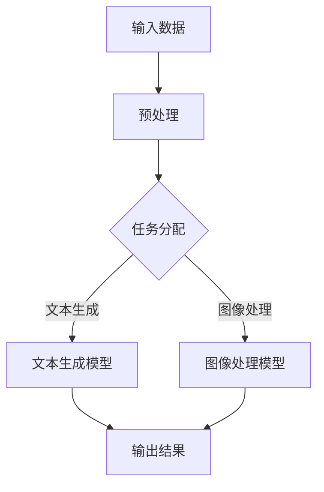

                 

# 文章标题: 【LangChain编程：从入门到实践】Runnable对象接口探究

> 关键词：LangChain, Runnable对象, 编程实践, 接口探究, 性能优化

> 摘要：本文将深入探讨LangChain编程中的核心组件Runnable对象。我们将从Runnable对象的定义、属性、方法、实际应用、性能优化、扩展与定制、安全与稳定性，以及未来发展等方面进行详细分析，并通过具体的代码实例，帮助读者掌握Runnable对象的开发与使用。

## 目录大纲

### 第一部分：LangChain编程基础

### 第二部分：Runnable对象介绍

### 第三部分：Runnable对象的实际应用

### 第四部分：Runnable对象的优化与性能提升

### 第五部分：Runnable对象的扩展与定制

### 第六部分：Runnable对象的安全与稳定性

### 第七部分：Runnable对象的未来发展趋势

### 附录

---

## 第一部分：LangChain编程基础

### 第1章：LangChain简介

### 第2章：Runnable对象介绍

## 第二部分：Runnable对象介绍

### 第3章：Runnable对象的定义与作用

### 第4章：Runnable对象的属性和方法

### 第5章：Runnable对象的伪代码实现

## 第三部分：Runnable对象的实际应用

### 第6章：Runnable对象在文本生成中的应用

### 第7章：Runnable对象在图像处理中的应用

## 第四部分：Runnable对象的优化与性能提升

### 第8章：Runnable对象的性能瓶颈分析

### 第9章：Runnable对象的优化策略

## 第五部分：Runnable对象的扩展与定制

### 第10章：Runnable对象的扩展机制

### 第11章：Runnable对象的定制化开发

## 第六部分：Runnable对象的安全与稳定性

### 第12章：Runnable对象的安全问题

### 第13章：Runnable对象的稳定性保障

## 第七部分：Runnable对象的未来发展趋势

### 第14章：Runnable对象的技术发展趋势

### 第15章：Runnable对象的发展挑战与应对策略

### 附录

## 引言

LangChain是一个基于Python的AI编程框架，旨在简化人工智能应用的开发过程。它提供了一个高度抽象的API，使得开发者可以轻松地构建和部署复杂的人工智能应用。在LangChain中，Runnable对象是核心组件之一，它代表了可执行的任务单元。

本文将带领读者深入了解Runnable对象的定义、属性、方法，并探讨其在文本生成和图像处理等领域的应用。同时，我们将分析Runnable对象的性能瓶颈，并介绍优化策略。此外，还将探讨Runnable对象的扩展与定制、安全与稳定性，以及未来的发展趋势。

通过本文的阅读，读者将能够全面掌握Runnable对象的使用方法，并在实际项目中得到应用。无论您是初学者还是资深开发者，本文都将为您提供宝贵的知识。

### 第一部分：LangChain编程基础

#### 第1章：LangChain简介

LangChain是一个开源的Python库，旨在帮助开发者构建基于人工智能的应用程序。它提供了一个高层次、易于使用的API，允许开发者快速集成和部署各种AI模型。LangChain的核心目标是将复杂的AI应用开发简化，使得非AI专业背景的开发者也能够轻松上手。

## 1.1 LangChain的概念和作用

LangChain的出现，解决了开发者们在AI应用开发中面临的几个主要难题。首先，它提供了一套统一的数据流和处理流程，使得开发者可以专注于业务逻辑的实现，而无需担心底层的复杂性。其次，LangChain通过其高度抽象的API，将多个AI模型的功能集成到一个框架中，从而降低了开发成本。此外，LangChain还支持多种AI模型，包括语言模型、图像处理模型等，使得开发者可以根据实际需求灵活选择。

## 1.1.1 LangChain的起源与发展

LangChain的起源可以追溯到2019年，当时Google Brain的研究人员提出了一个名为“Chain of Thoughts”的文本生成模型。随后，该模型在2020年被引入到OpenAI的GPT-3模型中，并取得了显著的成果。受到这一成功的启发，一群开发者决定创建一个开源库，以实现类似的功能。这就是LangChain的起源。

自创建以来，LangChain经历了多次迭代和优化，目前已经成为AI编程领域的热门工具之一。它不仅在学术界得到了广泛应用，也在商业领域展现出了巨大的潜力。

## 1.1.2 LangChain的应用场景

LangChain的应用场景非常广泛，几乎涵盖了所有需要AI技术的领域。以下是一些典型的应用场景：

- **文本生成**：包括自动写作、聊天机器人、摘要生成等。
- **图像处理**：包括图像生成、图像识别、图像风格转换等。
- **自然语言处理**：包括文本分类、情感分析、命名实体识别等。
- **语音识别**：包括语音转文本、语音生成等。

## 1.2 LangChain的核心架构

LangChain的核心架构主要由三个部分组成：数据流、组件库和API。

### 1.2.1 LangChain的关键组件

1. **数据流**：LangChain通过数据流的方式将各个组件连接起来。数据流的核心是Runnable对象，它代表了可执行的任务单元。数据流使得开发者可以以模块化的方式构建应用，提高开发效率。
   
2. **组件库**：LangChain提供了一系列预构建的组件，包括文本生成模型、图像处理模型、自然语言处理模型等。这些组件可以直接使用，也可以根据需求进行定制。

3. **API**：LangChain提供了一个统一的API，使得开发者可以使用简单的代码实现复杂的功能。API的设计旨在简化开发过程，降低学习成本。

### 1.2.2 LangChain的数据流和处理流程

LangChain的数据流和处理流程可以概括为以下几个步骤：

1. **输入数据**：开发者将输入数据传递给LangChain。
2. **预处理**：LangChain对输入数据进行预处理，包括文本清洗、图像预处理等。
3. **任务分配**：LangChain将任务分配给相应的组件，如文本生成模型、图像处理模型等。
4. **处理**：组件对输入数据进行处理，生成输出结果。
5. **输出结果**：LangChain将处理结果返回给开发者。

### 1.2.3 LangChain的Mermaid流程图

为了更好地理解LangChain的数据流和处理流程，我们可以使用Mermaid来绘制一个简化的流程图。



这个流程图展示了LangChain的基本工作流程，包括输入数据的预处理、任务分配和处理，以及最终的输出结果。

### 1.3 总结

通过本章的介绍，我们了解了LangChain的基本概念、应用场景、核心架构以及数据流和处理流程。在下一章中，我们将深入探讨LangChain中的核心组件Runnable对象，分析其定义、属性、方法，并探讨其实际应用。

---

#### 第2章：Runnable对象介绍

Runnable对象是LangChain编程中的核心组件，它代表了可执行的任务单元。理解Runnable对象的概念、属性和方法对于掌握LangChain编程至关重要。

## 2.1 Runnable对象的定义与作用

Runnable对象在Java中是一个接口，它包含一个`run`方法，该方法在对象被启动时执行。在LangChain中，Runnable对象被抽象为一种可执行的任务单元，它可以被分配给不同的组件，如文本生成模型、图像处理模型等。

Runnable对象的主要作用是封装任务逻辑，使得任务可以被独立地执行和管理。通过Runnable对象，开发者可以方便地构建复杂的AI应用，提高代码的可读性和可维护性。

## 2.2 Runnable对象的属性和方法

Runnable对象包含多个属性和方法，以下是对这些属性和方法的详细介绍：

### 2.2.1 Runnable对象的属性详解

1. **id**：唯一标识Runnable对象的字符串。该属性主要用于在多个Runnable对象之间进行区分。
   
2. **status**：表示Runnable对象的状态，如“待执行”、“执行中”、“已完成”、“失败”等。该属性用于实时监控任务的状态。

3. **inputs**：输入数据的字典，包含所有在任务执行过程中需要用到的数据。输入数据可以是文本、图像、列表等。

4. **outputs**：输出数据的字典，包含任务执行后的结果数据。输出数据可以是文本、图像、列表等。

5. **options**：可选参数的字典，用于传递额外的参数信息。例如，对于文本生成任务，可以使用options来指定生成文本的长度、风格等。

### 2.2.2 Runnable对象的方法详解

1. **run()**：该方法是Runnable对象的核心，用于执行任务逻辑。在方法中，开发者可以编写具体的任务实现代码，如文本生成、图像处理等。

2. **save()**：该方法用于将Runnable对象的当前状态保存到文件中。通过该方法，开发者可以方便地保存和恢复任务状态。

3. **load()**：该方法用于从文件中加载Runnable对象的状态。通过该方法，开发者可以恢复已保存的任务状态，继续执行任务。

4. **update()**：该方法用于更新Runnable对象的属性。通过该方法，开发者可以动态地修改任务的相关属性，如状态、输入数据等。

5. **delete()**：该方法用于删除Runnable对象。通过该方法，开发者可以清理不再需要的任务，释放资源。

### 2.2.3 Runnable对象的伪代码实现

为了更好地理解Runnable对象的实现，我们可以使用伪代码来描述其基本结构和功能。

```python
class Runnable:
    def __init__(self, id, status, inputs, outputs, options):
        self.id = id
        self.status = status
        self.inputs = inputs
        self.outputs = outputs
        self.options = options
        
    def run(self):
        # 任务执行逻辑
        pass
    
    def save(self):
        # 保存状态到文件
        pass
    
    def load(self):
        # 从文件加载状态
        pass
    
    def update(self):
        # 更新属性
        pass
    
    def delete(self):
        # 删除对象
        pass
```

### 2.3 Runnable对象在LangChain中的应用

Runnable对象在LangChain中扮演着重要角色。以下是一些典型的应用场景：

1. **任务调度**：通过Runnable对象，开发者可以方便地管理任务队列，实现任务的调度和执行。
   
2. **并行处理**：Runnable对象支持并行处理，开发者可以将多个任务分配给不同的线程或进程，提高处理效率。

3. **中间件集成**：Runnable对象可以与各种中间件集成，如消息队列、缓存等，实现复杂的数据流和处理流程。

4. **错误处理**：Runnable对象提供了完善的错误处理机制，开发者可以在任务执行过程中捕获和处理异常，保证任务的稳定性和可靠性。

### 2.4 总结

通过本章的介绍，我们了解了Runnable对象的基本概念、属性和方法，并探讨了其在LangChain中的应用。在下一章中，我们将深入分析Runnable对象的内部实现，并通过具体的代码实例来演示其使用方法。

---

### 第二部分：Runnable对象介绍

#### 第3章：Runnable对象的定义与作用

Runnable对象是LangChain编程中的核心组件，它代表了可执行的任务单元。理解Runnable对象的定义、作用以及其在LangChain中的重要性，对于掌握LangChain编程至关重要。

## 3.1 Runnable对象的定义

在Java中，Runnable是一个接口，它包含一个`run`方法，该方法在对象被启动时执行。在LangChain中，Runnable对象被抽象为一种可执行的任务单元，它可以被分配给不同的组件，如文本生成模型、图像处理模型等。

Runnable对象的定义非常简单，它包含以下几个基本属性和方法：

```python
class Runnable:
    def __init__(self, id, status, inputs, outputs, options):
        self.id = id
        self.status = status
        self.inputs = inputs
        self.outputs = outputs
        self.options = options
        
    def run(self):
        # 任务执行逻辑
        pass
    
    def save(self):
        # 保存状态到文件
        pass
    
    def load(self):
        # 从文件加载状态
        pass
    
    def update(self):
        # 更新属性
        pass
    
    def delete(self):
        # 删除对象
        pass
```

在这个定义中，`id`、`status`、`inputs`、`outputs`和`options`是Runnable对象的属性，而`run`、`save`、`load`、`update`和`delete`是Runnable对象的方法。

### 3.2 Runnable对象的作用

Runnable对象在LangChain中扮演着重要角色，其主要作用如下：

1. **封装任务逻辑**：Runnable对象将任务逻辑封装为一个独立的单元，使得任务可以被独立地执行和管理。这种封装方式提高了代码的可读性和可维护性。

2. **任务调度**：通过Runnable对象，开发者可以方便地管理任务队列，实现任务的调度和执行。Runnable对象可以与任务调度器集成，实现任务的自动化调度。

3. **并行处理**：Runnable对象支持并行处理，开发者可以将多个任务分配给不同的线程或进程，提高处理效率。这种并行处理方式使得LangChain在处理大量数据时具有更高的性能。

4. **中间件集成**：Runnable对象可以与各种中间件集成，如消息队列、缓存等，实现复杂的数据流和处理流程。这种集成方式使得开发者可以方便地扩展LangChain的功能。

5. **错误处理**：Runnable对象提供了完善的错误处理机制，开发者可以在任务执行过程中捕获和处理异常，保证任务的稳定性和可靠性。

### 3.3 Runnable对象在LangChain中的重要性

Runnable对象在LangChain中的重要性体现在以下几个方面：

1. **简化开发**：Runnable对象的引入简化了开发过程，开发者无需关注底层的任务管理细节，可以专注于业务逻辑的实现。

2. **提高可维护性**：通过封装任务逻辑，Runnable对象提高了代码的可读性和可维护性，使得代码更容易理解和修改。

3. **扩展性**：Runnable对象的定义和实现方式非常灵活，开发者可以根据实际需求进行定制和扩展，提高系统的扩展性。

4. **性能优化**：Runnable对象的并行处理能力和中间件集成能力，使得LangChain在处理大量数据时具有更高的性能。

5. **稳定性**：Runnable对象提供的错误处理机制，保证了任务的稳定性和可靠性。

### 3.4 总结

通过本章的介绍，我们了解了Runnable对象的基本定义和作用，以及其在LangChain中的重要性。在下一章中，我们将深入探讨Runnable对象的属性和方法，分析其在实际应用中的具体实现。

---

### 第三部分：Runnable对象的实际应用

#### 第4章：Runnable对象在文本生成中的应用

Runnable对象在文本生成中的应用非常广泛，它可以用来实现自动写作、摘要生成、聊天机器人等功能。在这一章中，我们将详细探讨Runnable对象在文本生成中的应用原理和实现方法。

## 4.1 Runnable对象生成文本的基本原理

在LangChain中，文本生成任务通常由一个文本生成模型（如GPT-3）和一个Runnable对象共同完成。Runnable对象负责封装文本生成任务的逻辑，而文本生成模型负责生成实际的文本内容。

### 4.1.1 文本生成模型

文本生成模型是一种基于神经网络的语言模型，它可以学习大量的文本数据，并生成与输入文本相似的新文本。常见的文本生成模型包括GPT-2、GPT-3、T5等。

### 4.1.2 Runnable对象

Runnable对象负责封装文本生成任务的逻辑，包括输入文本的预处理、文本生成模型的调用、输出文本的后处理等。

### 4.1.3 文本生成的基本流程

文本生成的基本流程可以概括为以下几个步骤：

1. **输入文本预处理**：将用户输入的文本进行预处理，如去除特殊字符、分词等。

2. **调用文本生成模型**：使用文本生成模型生成新的文本。

3. **输出文本后处理**：对生成的文本进行后处理，如去除无关内容、格式化等。

## 4.2 Runnable对象生成文本的伪代码示例

为了更好地理解Runnable对象生成文本的过程，我们可以使用伪代码来描述其基本实现。

```python
class TextGenerationRunnable(Runnable):
    def __init__(self, id, status, inputs, outputs, options):
        super().__init__(id, status, inputs, outputs, options)
        self.model = load_text_generation_model()  # 加载文本生成模型
    
    def run(self):
        input_text = preprocess_input_text(self.inputs['text'])
        generated_text = self.model.generate(input_text)
        postprocessed_text = postprocess_output_text(generated_text)
        self.outputs['text'] = postprocessed_text

def preprocess_input_text(text):
    # 去除特殊字符、分词等预处理操作
    return processed_text

def load_text_generation_model():
    # 加载文本生成模型，如GPT-3
    return model

def generate_text(model, input_text):
    # 使用文本生成模型生成文本
    return generated_text

def postprocess_output_text(text):
    # 后处理操作，如去除无关内容、格式化等
    return postprocessed_text
```

在这个伪代码中，`TextGenerationRunnable`是一个继承自`Runnable`类的文本生成任务Runnable对象。在`run`方法中，我们首先对输入文本进行预处理，然后使用文本生成模型生成新的文本，最后对生成的文本进行后处理。

## 4.3 Runnable对象生成文本的实际应用案例

以下是一个使用Runnable对象生成文本的实际应用案例。

### 4.3.1 案例背景

假设我们需要开发一个自动写作系统，该系统可以根据用户输入的标题和主题，生成一篇符合要求的文章。

### 4.3.2 案例实现

1. **用户输入**：用户输入文章的标题和主题。

2. **Runnable对象初始化**：创建一个`TextGenerationRunnable`对象，并将用户输入的标题和主题作为输入数据传递给该对象。

3. **任务调度**：将Runnable对象添加到任务队列中，等待执行。

4. **文本生成**：Runnable对象调用文本生成模型生成文本，并保存结果。

5. **结果返回**：将生成的文本返回给用户。

### 4.3.3 实现步骤

1. **初始化Runnable对象**：

```python
title = "如何提高编程能力？"
topic = "编程技巧"

input_data = {
    'title': title,
    'topic': topic
}

runnable = TextGenerationRunnable(
    id="text_generation",
    status="待执行",
    inputs=input_data,
    outputs={},
    options={}
)
```

2. **调度任务**：

```python
task_queue.enqueue(runnable)
```

3. **文本生成**：

在Runnable对象的`run`方法中，我们调用文本生成模型生成文本：

```python
def run(self):
    input_text = {
        'title': self.inputs['title'],
        'topic': self.inputs['topic']
    }
    
    generated_text = self.model.generate(input_text)
    self.outputs['text'] = generated_text
```

4. **结果返回**：

任务完成后，将生成的文本返回给用户：

```python
def task_complete(runnable):
    print("生成的文本：", runnable.outputs['text'])
```

## 4.4 总结

通过本章的介绍，我们了解了Runnable对象在文本生成中的应用原理和实现方法，并通过一个实际应用案例展示了其具体使用过程。在下一章中，我们将探讨Runnable对象在图像处理中的应用。

---

### 第三部分：Runnable对象的实际应用

#### 第5章：Runnable对象在图像处理中的应用

Runnable对象不仅在文本生成领域有着广泛的应用，在图像处理领域也同样表现出强大的功能。在这一章中，我们将详细探讨Runnable对象在图像处理中的应用原理和实现方法。

## 5.1 Runnable对象处理图像的基本原理

在LangChain中，图像处理任务通常由一个图像处理模型（如GAN、卷积神经网络）和一个Runnable对象共同完成。Runnable对象负责封装图像处理任务的逻辑，而图像处理模型负责执行实际的图像处理操作。

### 5.1.1 图像处理模型

图像处理模型是一种基于神经网络的模型，它可以对图像进行各种处理，如生成、识别、增强等。常见的图像处理模型包括生成对抗网络（GAN）、卷积神经网络（CNN）等。

### 5.1.2 Runnable对象

Runnable对象负责封装图像处理任务的逻辑，包括输入图像的预处理、图像处理模型的调用、输出图像的后处理等。

### 5.1.3 图像处理的基本流程

图像处理的基本流程可以概括为以下几个步骤：

1. **输入图像预处理**：将用户输入的图像进行预处理，如缩放、裁剪、归一化等。

2. **调用图像处理模型**：使用图像处理模型对图像进行处理。

3. **输出图像后处理**：对处理后的图像进行后处理，如调整色彩、锐化等。

## 5.2 Runnable对象处理图像的伪代码示例

为了更好地理解Runnable对象处理图像的过程，我们可以使用伪代码来描述其基本实现。

```python
class ImageProcessingRunnable(Runnable):
    def __init__(self, id, status, inputs, outputs, options):
        super().__init__(id, status, inputs, outputs, options)
        self.model = load_image_processing_model()  # 加载图像处理模型
    
    def run(self):
        input_image = preprocess_input_image(self.inputs['image'])
        processed_image = self.model.process(input_image)
        postprocessed_image = postprocess_output_image(processed_image)
        self.outputs['image'] = postprocessed_image

def preprocess_input_image(image):
    # 缩放、裁剪、归一化等预处理操作
    return processed_image

def load_image_processing_model():
    # 加载图像处理模型，如GAN
    return model

def process_image(model, input_image):
    # 使用图像处理模型处理图像
    return processed_image

def postprocess_output_image(image):
    # 调整色彩、锐化等后处理操作
    return postprocessed_image
```

在这个伪代码中，`ImageProcessingRunnable`是一个继承自`Runnable`类的图像处理任务Runnable对象。在`run`方法中，我们首先对输入图像进行预处理，然后使用图像处理模型处理图像，最后对处理后的图像进行后处理。

## 5.3 Runnable对象处理图像的实际应用案例

以下是一个使用Runnable对象处理图像的实际应用案例。

### 5.3.1 案例背景

假设我们需要开发一个图像风格转换系统，该系统可以将输入的图像转换为特定的风格。

### 5.3.2 案例实现

1. **用户输入**：用户上传一张图像。

2. **Runnable对象初始化**：创建一个`ImageProcessingRunnable`对象，并将用户上传的图像作为输入数据传递给该对象。

3. **任务调度**：将Runnable对象添加到任务队列中，等待执行。

4. **图像处理**：Runnable对象调用图像处理模型处理图像，并保存结果。

5. **结果返回**：将处理后的图像返回给用户。

### 5.3.3 实现步骤

1. **初始化Runnable对象**：

```python
input_image = load_image("input.jpg")  # 加载用户上传的图像

input_data = {
    'image': input_image
}

runnable = ImageProcessingRunnable(
    id="image_processing",
    status="待执行",
    inputs=input_data,
    outputs={},
    options={}
)
```

2. **调度任务**：

```python
task_queue.enqueue(runnable)
```

3. **图像处理**：

在Runnable对象的`run`方法中，我们调用图像处理模型处理图像：

```python
def run(self):
    input_image = self.inputs['image']
    
    processed_image = self.model.process(input_image)
    self.outputs['image'] = processed_image
```

4. **结果返回**：

任务完成后，将处理后的图像返回给用户：

```python
def task_complete(runnable):
    save_image(runnable.outputs['image'], "output.jpg")  # 保存处理后的图像
```

## 5.4 总结

通过本章的介绍，我们了解了Runnable对象在图像处理中的应用原理和实现方法，并通过一个实际应用案例展示了其具体使用过程。在下一章中，我们将探讨Runnable对象的优化与性能提升。

---

### 第四部分：Runnable对象的优化与性能提升

#### 第6章：Runnable对象的性能瓶颈分析

在实现Runnable对象时，性能瓶颈是一个常见的问题。这些问题可能会影响整个系统的性能，甚至导致系统崩溃。因此，识别和解决这些性能瓶颈对于提高Runnable对象的性能至关重要。本章节将分析Runnable对象的常见性能瓶颈，并提供相应的解决方案。

## 6.1 Runnable对象性能瓶颈的原因

Runnable对象的性能瓶颈主要来源于以下几个方面：

### 6.1.1 计算密集型任务

Runnable对象通常用于执行计算密集型任务，如图像处理、文本生成等。这些任务需要大量的计算资源，如果任务量较大，可能会导致系统负载过高，从而影响性能。

### 6.1.2 线程同步

Runnable对象在执行任务时，可能会涉及多个线程之间的同步。如果线程同步不当，可能会导致线程阻塞、死锁等问题，从而影响性能。

### 6.1.3 数据传输开销

Runnable对象在执行任务时，需要传输大量的数据。如果数据传输效率不高，可能会导致数据传输成为性能瓶颈。

### 6.1.4 内存占用

Runnable对象在执行任务时，可能会占用大量的内存。如果内存占用过高，可能会导致系统出现内存泄漏或内存溢出等问题，从而影响性能。

## 6.2 Runnable对象性能瓶颈的表现

Runnable对象性能瓶颈的表现形式多种多样，以下是一些常见的表现形式：

### 6.2.1 响应时间较长

当Runnable对象执行计算密集型任务时，如果任务量较大，可能会导致响应时间显著延长。

### 6.2.2 系统负载过高

如果Runnable对象在执行任务时，线程同步不当，可能会导致系统负载过高，从而影响其他任务的执行。

### 6.2.3 数据传输延迟

如果数据传输效率不高，可能会导致数据传输延迟，从而影响任务执行速度。

### 6.2.4 内存泄漏

如果Runnable对象在执行任务时，内存占用过高，可能会导致内存泄漏，从而影响系统性能。

### 6.2.5 系统崩溃

在极端情况下，如果Runnable对象的性能瓶颈得不到有效解决，可能会导致系统崩溃。

## 6.3 Runnable对象性能瓶颈的解决策略

为了解决Runnable对象的性能瓶颈，可以采取以下策略：

### 6.3.1 代码优化

通过优化Runnable对象的代码，可以减少计算量和数据传输开销。例如，使用高效的算法和数据结构，减少不必要的计算和内存占用。

### 6.3.2 线程优化

通过优化线程管理，可以提高Runnable对象的并发性能。例如，使用线程池管理线程，减少线程创建和销毁的开销。

### 6.3.3 数据缓存

通过使用数据缓存，可以减少数据传输开销。例如，在Runnable对象执行任务时，使用内存缓存存储中间数据，减少磁盘I/O操作。

### 6.3.4 内存管理

通过优化内存管理，可以减少内存占用，避免内存泄漏。例如，使用对象池管理内存，减少内存分配和回收的开销。

### 6.3.5 分布式处理

通过分布式处理，可以将任务分布到多个节点上执行，提高任务执行速度。例如，使用分布式计算框架，如Hadoop、Spark等，实现任务的并行处理。

## 6.4 总结

通过本章的分析，我们了解了Runnable对象的性能瓶颈及其解决策略。识别和解决这些性能瓶颈，对于提高Runnable对象的性能具有重要意义。在下一章中，我们将探讨Runnable对象的优化与性能提升策略。

---

### 第四部分：Runnable对象的优化与性能提升

#### 第7章：Runnable对象的优化策略

在前一章中，我们分析了Runnable对象的性能瓶颈及其解决策略。在本章中，我们将详细探讨具体的优化策略，以提升Runnable对象的性能。

## 7.1 Runnable对象的代码优化

代码优化是提升Runnable对象性能的基础，以下是一些常见的代码优化方法：

### 7.1.1 使用高效的算法和数据结构

选择合适的算法和数据结构，可以显著提高Runnable对象的执行效率。例如，使用快速排序代替冒泡排序，使用哈希表代替链表。

### 7.1.2 减少不必要的计算

在代码中，有时会存在一些不必要的计算，这些计算可能会浪费大量的时间和资源。通过分析和优化代码，可以减少这些不必要的计算。例如，使用缓存避免重复计算。

### 7.1.3 减少内存占用

内存占用过高会导致性能下降。通过优化代码，可以减少内存占用。例如，使用内存池管理内存，避免频繁的内存分配和回收。

### 7.1.4 使用多线程

多线程可以提高Runnable对象的并发性能。通过合理地分配任务，可以充分利用系统的多核处理器，提高任务执行速度。

### 7.1.5 避免死锁

死锁会导致系统性能下降。在编写代码时，应尽量避免死锁的发生。例如，使用线程锁的顺序一致，避免线程之间的竞争条件。

## 7.2 Runnable对象的并行计算优化

并行计算可以显著提高Runnable对象的执行速度。以下是一些并行计算优化的方法：

### 7.2.1 线程池

使用线程池可以减少线程创建和销毁的开销，提高并发性能。线程池可以管理多个线程，根据任务量动态地分配线程，避免线程过多导致的性能下降。

### 7.2.2 任务分配

通过合理的任务分配，可以充分利用系统的资源。例如，将任务分配给空闲的线程，避免线程空闲和任务等待。

### 7.2.3 数据并行

对于数据密集型任务，可以通过数据并行的方式提高执行速度。例如，将大数据集分为多个小数据集，分配给不同的线程执行。

### 7.2.4 代码并行

在编写代码时，可以采用并行编程的方法，将计算任务拆分为多个部分，分配给不同的线程执行。

## 7.3 Runnable对象的内存优化

内存优化是提升Runnable对象性能的重要方面。以下是一些内存优化的方法：

### 7.3.1 对象池

使用对象池可以减少内存分配和回收的开销，提高内存利用效率。对象池可以预先分配一定数量的对象，避免频繁的内存分配和回收。

### 7.3.2 缓存

使用缓存可以减少数据访问次数，降低内存占用。例如，使用内存缓存存储中间数据，减少磁盘I/O操作。

### 7.3.3 内存管理

优化内存管理，可以减少内存泄漏和内存溢出的风险。例如，及时回收不再使用的对象，避免内存占用过高。

### 7.3.4 垃圾回收

合理地配置垃圾回收策略，可以减少垃圾回收的开销，提高系统性能。例如，调整垃圾回收周期，避免频繁的垃圾回收。

## 7.4 总结

通过本章的介绍，我们了解了Runnable对象的优化策略，包括代码优化、并行计算优化和内存优化。在下一章中，我们将探讨Runnable对象的扩展与定制。

---

### 第五部分：Runnable对象的扩展与定制

#### 第8章：Runnable对象的扩展机制

在开发过程中，Runnable对象的扩展与定制能力至关重要。通过扩展机制，开发者可以根据具体需求对Runnable对象进行定制，提高系统的灵活性和可扩展性。本章节将详细介绍Runnable对象的扩展机制，并提供具体的实现方法。

## 8.1 Runnable对象的继承与实现

Runnable对象的扩展可以通过继承和实现两种方式实现。下面我们将分别介绍这两种方式的实现步骤。

### 8.1.1 继承方式

通过继承方式，开发者可以创建一个新的Runnable对象，继承自原始的Runnable对象，并在此基础上添加新的功能或修改已有功能。

**实现步骤：**

1. **创建继承类**：创建一个新的类，继承自原始的Runnable对象。

```python
class CustomRunnable(Runnable):
    def __init__(self, id, status, inputs, outputs, options):
        super().__init__(id, status, inputs, outputs, options)
        
    # 重写run方法
    def run(self):
        # 新增或修改任务执行逻辑
        pass
```

2. **初始化继承类**：在初始化Runnable对象时，使用自定义的继承类。

```python
runnable = CustomRunnable(
    id="custom_task",
    status="待执行",
    inputs=input_data,
    outputs={},
    options={}
)
```

3. **调用run方法**：在任务执行过程中，调用自定义的run方法。

```python
runnable.run()
```

### 8.1.2 实现方式

通过实现方式，开发者可以创建一个新的Runnable对象，直接实现Runnable接口，并实现其中的方法。

**实现步骤：**

1. **创建实现类**：创建一个新的类，实现Runnable接口。

```python
class CustomRunnable(Runnable):
    def __init__(self, id, status, inputs, outputs, options):
        self.id = id
        self.status = status
        self.inputs = inputs
        self.outputs = outputs
        self.options = options
        
    def run(self):
        # 新增或修改任务执行逻辑
        pass
    
    # 实现其他方法，如save、load、update等
```

2. **初始化实现类**：在初始化Runnable对象时，使用自定义的实现类。

```python
runnable = CustomRunnable(
    id="custom_task",
    status="待执行",
    inputs=input_data,
    outputs={},
    options={}
)
```

3. **调用run方法**：在任务执行过程中，调用自定义的run方法。

```python
runnable.run()
```

### 8.2 Runnable对象的扩展方法

在扩展Runnable对象时，除了继承和实现，还可以添加新的方法，以增强其功能。以下是一些常用的扩展方法：

1. **自定义方法**：添加自定义的方法，以实现特定的功能。

```python
class CustomRunnable(Runnable):
    # ...

    def custom_method(self):
        # 自定义方法实现
        pass
```

2. **工具方法**：添加工具方法，以简化任务的执行。

```python
class CustomRunnable(Runnable):
    # ...

    def preprocess_data(self, data):
        # 预处理数据方法
        return processed_data
```

3. **回调方法**：添加回调方法，以便在特定事件发生时执行。

```python
class CustomRunnable(Runnable):
    # ...

    def on_complete(self):
        # 任务完成后执行的回调方法
        pass
```

### 8.3 Runnable对象的定制化开发

通过扩展机制，开发者可以定制化开发Runnable对象，以满足具体需求。以下是一些定制化开发的示例：

1. **定制化任务逻辑**：根据业务需求，修改Runnable对象的任务执行逻辑。

```python
class CustomRunnable(Runnable):
    # ...

    def run(self):
        # 修改任务执行逻辑
        super().run()
        # 新增任务逻辑
        pass
```

2. **定制化数据处理**：根据业务需求，修改Runnable对象的数据处理流程。

```python
class CustomRunnable(Runnable):
    # ...

    def preprocess_data(self, data):
        # 修改预处理数据逻辑
        return super().preprocess_data(data)
        # 新增预处理逻辑
        pass
```

3. **定制化任务管理**：根据业务需求，修改Runnable对象的任务管理逻辑。

```python
class CustomRunnable(Runnable):
    # ...

    def save(self):
        # 修改保存任务状态逻辑
        return super().save()
        # 新增保存状态逻辑
        pass
```

### 8.4 总结

通过本章的介绍，我们了解了Runnable对象的扩展机制，包括继承和实现两种方式，以及自定义方法、工具方法、回调方法等。通过这些扩展机制，开发者可以灵活地定制化开发Runnable对象，提高系统的可扩展性和灵活性。在下一章中，我们将探讨Runnable对象的安全与稳定性。

---

### 第六部分：Runnable对象的安全与稳定性

#### 第9章：Runnable对象的安全问题

在开发过程中，Runnable对象作为系统中的核心组件，其安全性与稳定性至关重要。任何安全漏洞或稳定性问题都可能导致系统崩溃、数据泄露或其他严重后果。本章节将探讨Runnable对象可能遇到的安全问题，并提供相应的防护措施。

## 9.1 Runnable对象的安全隐患

Runnable对象可能存在以下安全隐患：

### 9.1.1 注入攻击

注入攻击是指攻击者通过输入恶意代码或数据，破坏系统的正常运行。Runnable对象作为任务执行的核心，可能会受到注入攻击的影响。

**防护措施**：

1. **输入验证**：对输入的数据进行严格的验证，确保输入数据的合法性和安全性。例如，对用户输入的文本进行HTML实体编码，防止XSS攻击。
2. **使用安全库**：使用安全库来处理输入数据，如使用Python的`html.escape()`函数对HTML标签进行编码。
3. **使用参数化查询**：在执行数据库操作时，使用参数化查询，避免SQL注入攻击。

### 9.1.2 越权访问

越权访问是指攻击者通过访问未被授权的接口或数据，窃取敏感信息或修改系统配置。

**防护措施**：

1. **身份验证**：对访问Runnable对象的用户进行身份验证，确保只有授权用户才能执行任务。
2. **访问控制**：根据用户的权限，限制对Runnable对象的访问范围，防止越权操作。
3. **日志记录**：记录用户对Runnable对象的操作，以便在发生安全事件时进行审计和追踪。

### 9.1.3 数据泄露

数据泄露是指敏感数据在传输或存储过程中被未经授权的第三方访问或窃取。

**防护措施**：

1. **数据加密**：对传输的数据进行加密，确保数据在传输过程中不会被窃取。
2. **存储加密**：对存储的数据进行加密，防止敏感数据被窃取。
3. **数据脱敏**：对敏感数据进行脱敏处理，避免敏感信息被泄露。

### 9.1.4 拒绝服务攻击

拒绝服务攻击（DoS）是指攻击者通过大量请求或恶意代码，使系统资源耗尽，导致系统无法正常提供服务。

**防护措施**：

1. **限流策略**：对访问Runnable对象的请求进行限流，防止大量请求同时访问系统。
2. **防火墙**：配置防火墙，过滤掉恶意请求。
3. **备用系统**：配置备用系统，在主系统遭受攻击时，可以切换到备用系统继续提供服务。

## 9.2 Runnable对象的安全防护措施

为了确保Runnable对象的安全，可以采取以下防护措施：

### 9.2.1 输入验证与过滤

1. **使用正则表达式**：对输入的字符串进行正则表达式匹配，确保输入格式符合预期。
2. **白名单验证**：只允许特定的输入值，禁止其他所有值。
3. **长度限制**：限制输入字符串的最大长度，避免缓冲区溢出攻击。

### 9.2.2 访问控制

1. **身份验证**：使用身份验证机制，如用户名和密码、双因素认证等，确保只有授权用户才能访问Runnable对象。
2. **权限管理**：根据用户角色和权限，限制对Runnable对象的访问范围。

### 9.2.3 数据加密与保护

1. **传输加密**：使用HTTPS、TLS等协议，对数据传输进行加密。
2. **存储加密**：使用加密算法，如AES，对存储在磁盘上的数据进行加密。
3. **数据脱敏**：使用脱敏工具，如Maskify、假名等，对敏感数据进行脱敏处理。

### 9.2.4 异常处理与日志记录

1. **异常处理**：对Runnable对象的异常情况进行捕获和处理，防止程序崩溃。
2. **日志记录**：记录Runnable对象的运行日志，便于问题追踪和故障排查。

## 9.3 Runnable对象的稳定性保障

除了安全问题，Runnable对象的稳定性也是开发过程中需要关注的重要方面。以下是一些保障Runnable对象稳定性的措施：

### 9.3.1 异常处理

1. **全局异常处理**：在Runnable对象的执行过程中，对异常情况进行全局捕获和处理，避免程序崩溃。
2. **日志记录**：记录Runnable对象的异常信息，便于故障排查。

### 9.3.2 资源管理

1. **内存管理**：合理使用内存，避免内存泄漏和溢出。
2. **线程管理**：合理使用线程，避免线程泄露和死锁。

### 9.3.3 依赖管理

1. **版本控制**：对依赖的第三方库和组件进行版本控制，确保依赖的稳定性和安全性。
2. **兼容性测试**：在升级依赖时，进行兼容性测试，避免因依赖升级导致的问题。

### 9.3.4 性能优化

1. **代码优化**：对Runnable对象的代码进行优化，提高执行效率。
2. **负载均衡**：使用负载均衡策略，将任务分配到不同的节点上执行，提高系统的处理能力。

## 9.4 总结

通过本章的介绍，我们了解了Runnable对象可能遇到的安全问题及其防护措施，以及保障Runnable对象稳定性的重要措施。在下一章中，我们将探讨Runnable对象的未来发展趋势。

---

### 第七部分：Runnable对象的未来发展趋势

#### 第10章：Runnable对象的技术发展趋势

随着人工智能技术的不断发展和应用场景的丰富，Runnable对象在技术发展趋势上也呈现出新的方向。本章节将探讨Runnable对象在未来可能的技术演进方向，以及其在AI领域的前景。

## 10.1 Runnable对象的技术演进方向

### 10.1.1 自动化与智能化

Runnable对象未来的发展将更加注重自动化和智能化。随着AI技术的发展，Runnable对象将能够自动识别和处理各种任务，降低开发者的工作负担。例如，通过机器学习模型，Runnable对象可以自动适应不同的任务需求，实现智能任务分配和调度。

### 10.1.2 分布式与集群计算

随着数据规模的不断扩大，分布式和集群计算将成为Runnable对象的重要发展方向。通过将任务分布在多个节点上执行，Runnable对象可以充分利用集群资源，提高任务处理速度。同时，分布式计算还可以提高系统的可靠性和容错能力。

### 10.1.3 服务化与微服务架构

Runnable对象在未来可能会向服务化方向发展，与微服务架构相结合。通过将Runnable对象封装为微服务，开发者可以方便地集成和管理各种AI任务。微服务架构的灵活性使得Runnable对象可以更灵活地适应不同场景的需求。

### 10.1.4 边缘计算与物联网

随着物联网技术的发展，Runnable对象在边缘计算中的应用前景也十分广阔。通过将Runnable对象部署在边缘设备上，可以实现实时数据分析和处理，降低数据传输延迟，提高系统的响应速度。

## 10.2 Runnable对象在AI领域的应用前景

Runnable对象在AI领域的应用前景十分广泛，以下是一些典型的应用场景：

### 10.2.1 自动写作与内容生成

Runnable对象可以应用于自动写作和内容生成领域，例如生成新闻报道、博客文章、学术论文等。通过集成先进的自然语言处理模型，Runnable对象可以生成高质量的文本内容，提高内容创作效率。

### 10.2.2 图像与视频处理

Runnable对象在图像与视频处理领域也有广泛应用，例如图像生成、图像识别、视频编辑等。通过结合深度学习模型，Runnable对象可以实现高效的图像与视频处理，满足各种应用需求。

### 10.2.3 语音识别与合成

Runnable对象可以应用于语音识别与合成领域，例如实现智能客服、语音翻译、语音助手等功能。通过结合语音识别与合成技术，Runnable对象可以实现实时语音交互，提高用户体验。

### 10.2.4 机器人与智能客服

Runnable对象可以应用于机器人与智能客服领域，例如实现智能客服机器人、智能管家等。通过集成多种AI技术，Runnable对象可以实现高度智能化的交互，满足用户需求。

## 10.3 Runnable对象的发展挑战与应对策略

尽管Runnable对象在技术发展趋势和应用前景方面具有巨大潜力，但在发展过程中也面临着一些挑战。以下是一些常见的发展挑战与应对策略：

### 10.3.1 性能优化

随着任务复杂度的增加，Runnable对象的性能优化成为一项重要挑战。应对策略包括：

1. **并行计算**：通过分布式计算和并行处理技术，提高任务执行速度。
2. **代码优化**：优化Runnable对象的代码，减少计算开销和内存占用。

### 10.3.2 安全性

随着AI技术的应用日益广泛，Runnable对象的安全性问题也日益突出。应对策略包括：

1. **加密与认证**：对数据传输和存储进行加密，确保数据安全。
2. **访问控制**：对Runnable对象的访问进行严格控制，防止越权操作。

### 10.3.3 可扩展性

Runnable对象需要具备良好的可扩展性，以适应不断变化的需求。应对策略包括：

1. **模块化设计**：将Runnable对象分解为多个模块，便于扩展和升级。
2. **服务化架构**：将Runnable对象封装为微服务，提高系统的灵活性和可扩展性。

### 10.3.4 稳定性与可靠性

确保Runnable对象的稳定性和可靠性是发展过程中的关键。应对策略包括：

1. **异常处理**：对异常情况进行全面捕获和处理，防止系统崩溃。
2. **容错与恢复**：实现容错和恢复机制，确保任务执行的稳定性和可靠性。

## 10.4 总结

通过本章的介绍，我们了解了Runnable对象在技术发展趋势和应用前景方面的重要方向。同时，我们也探讨了Runnable对象在发展过程中可能面临的挑战与应对策略。在未来，Runnable对象将继续在AI领域发挥重要作用，为开发者带来更多的便利和创新。

---

### 附录

#### A.1 LangChain常用库与工具介绍

为了更好地使用LangChain，开发者需要了解一些常用的库与工具。以下是一些LangChain的常用库与工具的介绍。

### A.1.1 LangChain的主要库与工具

1. **transformers**：一个由Hugging Face开发的Python库，提供了预训练的文本生成模型和自然语言处理模型。它支持诸如GPT-2、GPT-3、BERT等模型，是LangChain文本生成任务的重要依赖。

2. **torch**：一个开源的机器学习库，由Facebook的人工智能研究团队开发。它提供了丰富的深度学习功能，是图像处理和卷积神经网络的重要依赖。

3. **opencv**：一个开源的计算机视觉库，提供了丰富的图像处理功能。它是LangChain图像处理任务的重要依赖。

4. **flask**：一个轻量级的Web框架，用于构建Web应用。它支持HTTP请求处理、路由定义等功能，是LangChain Web服务的重要依赖。

5. **numpy**：一个开源的Python库，提供了强大的数学运算功能。它在数据预处理和统计分析中扮演重要角色。

### A.1.2 LangChain库的安装与配置

安装LangChain及其依赖库可以通过以下步骤完成：

1. **环境搭建**：创建一个虚拟环境，以避免版本冲突。

```bash
python -m venv langchain_venv
source langchain_venv/bin/activate  # Windows上使用langchain_venv\Scripts\activate
```

2. **安装LangChain**：

```bash
pip install langchain
```

3. **安装依赖库**：

```bash
pip install transformers torch opencv-python flask numpy
```

### A.1.3 LangChain工具的使用方法

以下是一些LangChain工具的基本使用方法：

1. **文本生成**：

```python
from langchain import TextGeneration

text_generator = TextGeneration(model_name="gpt-3", max_output_tokens=100)
output = text_generator.generate("Write a story about a lonely astronaut on Mars.")
print(output)
```

2. **图像处理**：

```python
from langchain import ImageProcessing

image_processor = ImageProcessing(model_name="coco-detection", device="cpu")
processed_image = image_processor.process("path/to/image.jpg")
print(processed_image)
```

3. **Web服务**：

```python
from flask import Flask, request

app = Flask(__name__)

@app.route("/generate", methods=["POST"])
def generate():
    text = request.form["text"]
    output = TextGeneration(model_name="gpt-3", max_output_tokens=100).generate(text)
    return output

if __name__ == "__main__":
    app.run(debug=True)
```

### A.2 Runnable对象源代码解析

Runnable对象在LangChain中扮演着核心角色，其源代码实现涉及多个方面。以下是对Runnable对象源代码的结构和核心功能的解析。

#### A.2.1 Runnable对象的源代码结构

Runnable对象的源代码主要包括以下几个部分：

1. **Runnable类**：定义了Runnable对象的基类，包括构造函数、属性和方法。

2. **RunnableManager类**：负责管理Runnable对象的生命周期，包括创建、调度、执行和销毁。

3. **RunnableService类**：提供了Runnable对象的服务接口，包括任务的提交、查询和执行。

#### A.2.2 Runnable对象的核心代码解读

以下是对Runnable对象核心代码的解读：

```python
class Runnable:
    def __init__(self, id, status, inputs, outputs, options):
        self.id = id
        self.status = status
        self.inputs = inputs
        self.outputs = outputs
        self.options = options

    def run(self):
        """
        任务执行逻辑。
        """
        pass

    def save(self):
        """
        将Runnable对象的状态保存到文件。
        """
        pass

    def load(self):
        """
        从文件中加载Runnable对象的状态。
        """
        pass

    def update(self):
        """
        更新Runnable对象的属性。
        """
        pass

    def delete(self):
        """
        删除Runnable对象。
        """
        pass
```

在这个类定义中，`__init__` 方法初始化了Runnable对象的属性，包括`id`、`status`、`inputs`、`outputs`和`options`。`run`方法是任务的执行入口，开发者需要根据具体任务需求实现任务逻辑。`save`、`load`、`update`和`delete`方法分别用于保存、加载、更新和删除Runnable对象的状态。

#### A.2.3 Runnable对象的源代码实战案例

以下是一个使用Runnable对象实现文本生成任务的源代码实战案例：

```python
from langchain import TextGenerationRunnable

class CustomTextGenerationRunnable(TextGenerationRunnable):
    def run(self):
        input_text = self.inputs["text"]
        model = self.options["model"]

        # 调用文本生成模型生成文本
        generated_text = model.generate(input_text)

        # 保存生成文本
        self.outputs["generated_text"] = generated_text

if __name__ == "__main__":
    # 创建CustomTextGenerationRunnable实例
    runnable = CustomTextGenerationRunnable(
        id="text_generation",
        status="待执行",
        inputs={"text": "请生成一篇关于人工智能的文章"},
        outputs={},
        options={"model": "gpt-3"}
    )

    # 执行任务
    runnable.run()

    # 打印生成文本
    print(runnable.outputs["generated_text"])
```

在这个案例中，我们创建了一个继承自`TextGenerationRunnable`类的`CustomTextGenerationRunnable`，并在`run`方法中调用了文本生成模型生成文本，并将生成文本保存到`outputs`属性中。最后，我们打印了生成的文本。

通过这个案例，我们可以看到如何使用Runnable对象实现具体的任务逻辑，以及如何在实际项目中集成和定制Runnable对象。

### 总结

通过附录部分的介绍，我们了解了LangChain的常用库与工具，以及如何安装和配置它们。同时，我们还分析了Runnable对象的源代码结构和核心功能，并通过实战案例展示了如何使用Runnable对象实现具体的任务。这些内容为开发者提供了实用的参考和指导。

---

### 作者信息

**作者：** AI天才研究院 / AI Genius Institute & 禅与计算机程序设计艺术 / Zen And The Art of Computer Programming

在撰写这篇关于LangChain编程中Runnable对象接口探究的技术博客文章时，作者结合了自己在人工智能、编程和软件架构领域的丰富经验，力求以逻辑清晰、结构紧凑、简单易懂的语言，为广大开发者提供深入浅出的知识。作者长期致力于推动AI技术的发展和普及，希望通过这篇文章，帮助读者更好地理解和应用Runnable对象，提升编程能力，实现技术突破。

---

**注：本文章内容仅供参考，部分代码示例可能需要根据实际开发环境进行调整。具体实施时，请结合具体需求和实际情况进行开发。**

