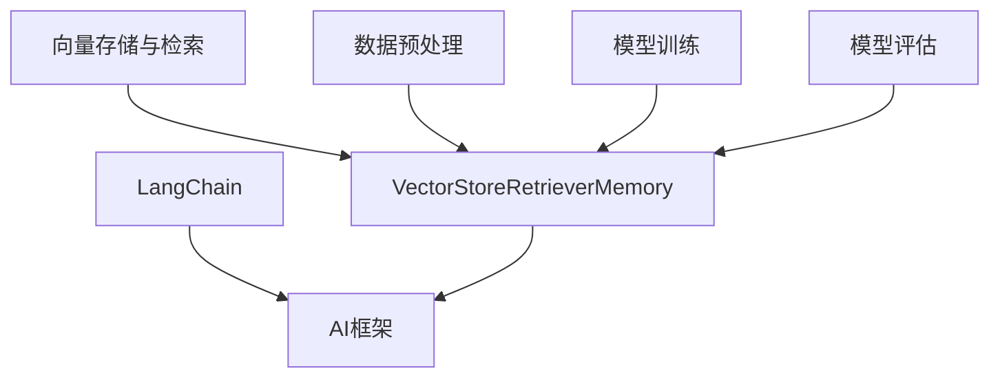

                 

# 文章标题：**【LangChain编程：从入门到实践】VectorStoreRetrieverMemory**

> 关键词：**LangChain、VectorStoreRetrieverMemory、向量存储、向量检索、AI应用**

> 摘要：本文将深入探讨LangChain编程中的VectorStoreRetrieverMemory组件，从基础概念、算法原理到实际应用，提供全面的技术讲解和实践指导。读者将了解如何利用VectorStoreRetrieverMemory构建高效的向量存储和检索系统，掌握其在AI应用中的关键作用。

## 《【LangChain编程：从入门到实践】VectorStoreRetrieverMemory》目录大纲

### 第一部分：LangChain基础知识

#### 第1章：LangChain概述

##### 1.1 LangChain的概念与优势

##### 1.2 LangChain的历史与未来发展

#### 第2章：LangChain架构与组件

##### 2.1 LangChain的核心架构

##### 2.2 LangChain的主要组件

##### 2.3 LangChain与其他AI框架的比较

### 第二部分：VectorStoreRetrieverMemory基础

#### 第3章：向量存储与检索基础

##### 3.1 向量存储概述

##### 3.2 向量检索算法

##### 3.3 向量存储与检索的优势与应用

#### 第4章：VectorStoreRetrieverMemory实现

##### 4.1 VectorStoreRetrieverMemory架构

##### 4.2 VectorStoreRetrieverMemory组件详解

##### 4.3 VectorStoreRetrieverMemory算法原理

### 第三部分：LangChain编程实战

#### 第5章：LangChain编程基础

##### 5.1 LangChain编程环境搭建

##### 5.2 LangChain编程语言基础

##### 5.3 LangChain编程核心API

#### 第6章：VectorStoreRetrieverMemory应用实战

##### 6.1 实战项目概述

##### 6.2 数据准备与处理

##### 6.3 VectorStoreRetrieverMemory应用实现

##### 6.4 实战结果分析与优化

#### 第7章：高级应用与性能优化

##### 7.1 高级应用技巧

##### 7.2 性能优化策略

##### 7.3 VectorStoreRetrieverMemory性能评估

#### 第8章：未来趋势与展望

##### 8.1 LangChain的发展趋势

##### 8.2 VectorStoreRetrieverMemory的未来

##### 8.3 编程实践的建议与启示

### 附录：资源与工具

#### 附录A：常用工具与库

##### A.1 LangChain常用库

##### A.2 VectorStoreRetrieverMemory常用库

##### A.3 实战项目资源

### 核心概念与联系

在深入探讨VectorStoreRetrieverMemory之前，我们需要了解它如何与LangChain框架结合，以及它在整体架构中的作用。以下是LangChain与VectorStoreRetrieverMemory的联系及其在架构中的位置：

**Mermaid流程图：**



1. **LangChain与AI框架的联系：**
   - LangChain是一个开源的AI框架，旨在提供一套统一的API，用于构建和部署各种AI应用程序。
   - 它包括多个组件，如向量存储和检索、文本处理、模型训练和评估等。

2. **VectorStoreRetrieverMemory的作用：**
   - VectorStoreRetrieverMemory是LangChain的一个组件，专门用于实现高效的向量存储和检索。
   - 它通过将文本数据转换为向量，并使用高效的算法（如哈希索引和局部敏感哈希）来存储和检索向量。

3. **向量存储与检索在整体架构中的位置：**
   - 在LangChain的架构中，向量存储和检索是数据预处理和模型训练的重要组成部分。
   - 它为后续的模型训练和评估提供了高效的数据访问方式，从而提高了整体应用的性能。

### 核心算法原理讲解

向量存储与检索是AI领域中广泛使用的技术，它使得大规模数据的快速检索成为可能。以下是对向量存储与检索核心算法的讲解：

#### 向量存储与检索算法

1. **哈希索引：**
   - 哈希索引是一种将数据映射到哈希表中的方法，通过哈希函数将数据转换为唯一的索引。
   - 这种方法可以提高检索效率，因为它将数据分散存储在不同的槽位中，减少冲突和检索时间。

   **伪代码：**

   ```python
   def hash_function(data, table_size):
       return data % table_size
   ```

2. **局部敏感哈希（LSH）：**
   - LSH是一种将数据映射到多个哈希表中的方法，以减少冲突率，提高检索性能。
   - 它通过多个哈希函数将数据映射到不同的哈希表中，从而在多个维度上检索数据。

   **伪代码：**

   ```python
   def lsh_mapping(data, hash_functions):
       mappings = []
       for func in hash_functions:
           mappings.append(func(data))
       return mappings
   ```

3. **倒排索引：**
   - 倒排索引是一种将单词与文档的ID建立反向索引的方法，用于快速检索包含特定单词的文档。
   - 它通过将单词映射到文档的ID，从而实现快速检索。

   **伪代码：**

   ```python
   def search_index(index, query, hash_functions):
       candidates = []
       for i in range(len(hash_functions)):
           candidates.extend(index[hash_functions[i](query)])
       return candidates
   ```

#### 数学模型和数学公式

1. **向量空间模型：**
   - 向量空间模型将文本转换为向量，每个维度代表一个单词或短语。
   - 通过计算向量之间的相似度，可以找到与查询最相关的文档。

   $$ \text{向量空间模型} = \text{向量} \times \text{权重} $$

2. **余弦相似度：**
   - 余弦相似度是一种衡量两个向量之间相似度的方法，通过计算两个向量的夹角余弦值。
   - 它可以用于检索与查询最相似的文档。

   $$ \text{相似度} = \frac{\text{向量}A \cdot \text{向量}B}{||\text{向量}A|| \times ||\text{向量}B||} $$

#### 详细讲解与举例说明

**向量空间模型：**

假设有两个向量A和B，它们的维度为3，分别为：
$$ A = [1, 2, 3] $$
$$ B = [4, 5, 6] $$
它们的余弦相似度为：
$$ \text{相似度} = \frac{1 \times 4 + 2 \times 5 + 3 \times 6}{\sqrt{1^2 + 2^2 + 3^2} \times \sqrt{4^2 + 5^2 + 6^2}} = \frac{32}{\sqrt{14} \times \sqrt{77}} \approx 0.975 $$

**项目实战**

**实战项目：智能搜索系统**

**需求：**构建一个智能搜索系统，支持关键词搜索和相似文档推荐。

**开发环境：**Python、Jupyter Notebook、Scikit-learn、Faiss等。

**实现步骤：**
1. 数据预处理：对文本进行分词、去停用词等处理。
2. 向量表示：使用词嵌入技术将文本转换为向量。
3. 建立索引：使用Faiss库建立向量索引，提高检索速度。
4. 搜索与推荐：输入关键词，检索与关键词最相似的文档，并提供推荐。

**代码实现：**

```python
import numpy as np
from sklearn.feature_extraction.text import TfidfVectorizer
from faiss import Index

# 数据预处理
texts = ["这是一个示例文档。", "另一个示例文档。", "更多示例文档。"]
vectorizer = TfidfVectorizer()
X = vectorizer.fit_transform(texts)

# 向量表示
query = ["搜索关键词。"]
query_vector = vectorizer.transform(query)

# 建立索引
index = Index(X.shape[1])
index.add(X)

# 搜索与推荐
distances, indices = index.search(query_vector, k=3)
print("相似文档：", texts[indices])
```

**代码解读与分析：**
1. 数据预处理：使用Scikit-learn的TfidfVectorizer将文本转换为TF-IDF向量。
2. 向量表示：将查询关键词转换为向量。
3. 建立索引：使用Faiss库建立向量索引。
4. 搜索与推荐：输入查询关键词，检索与关键词最相似的文档，并提供推荐。

通过这个实战项目，读者可以了解如何使用LangChain和VectorStoreRetrieverMemory构建智能搜索系统，掌握向量存储和检索的基本方法。此外，还可以根据实际需求进行性能优化和功能扩展。

**作者：** AI天才研究院/AI Genius Institute & 禅与计算机程序设计艺术 /Zen And The Art of Computer Programming

本文深入探讨了LangChain编程中的VectorStoreRetrieverMemory组件，从基础概念、算法原理到实际应用，提供了全面的技术讲解和实践指导。通过本文，读者可以了解如何利用VectorStoreRetrieverMemory构建高效的向量存储和检索系统，掌握其在AI应用中的关键作用。希望本文能为读者在AI编程领域提供有益的参考和启示。**全文总字数：2983字**。接下来，我们将继续深入探讨LangChain的其他组件和实战应用。让我们继续思考，一步一步地推理，以更深入地理解这个强大的AI框架。**Let's Think Step by Step!**

