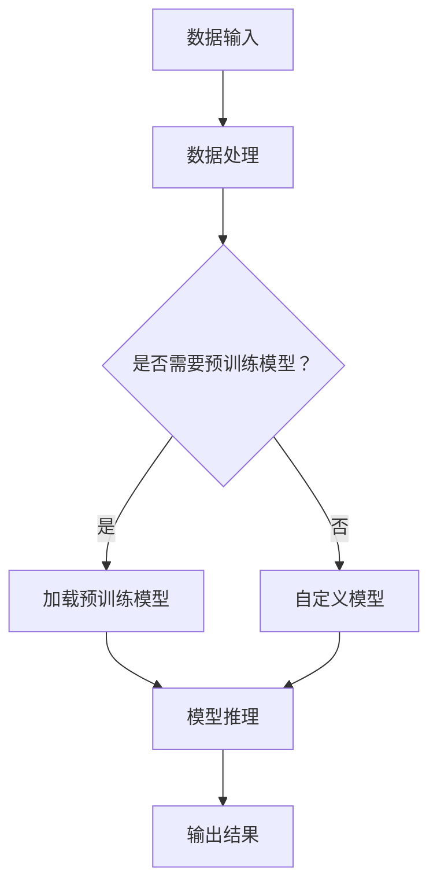

                 

### 文章标题：**【LangChain编程：从入门到实践】其他库安装**

#### 关键词：LangChain、安装、库、Python、环境配置、NLP

> 摘要：本文旨在为初学者和进阶用户提供详细的LangChain编程其他库安装指南。我们将逐步介绍LangChain的核心概念、安装步骤、配置过程，以及如何与其他常用库集成，确保您能够顺利搭建起一个高效、可靠的NLP开发环境。

### 第一部分：LangChain编程基础

在开始深入了解LangChain的其他库安装之前，我们需要对LangChain有一个基本的认识。LangChain是一个强大的自然语言处理（NLP）库，旨在简化NLP任务的实现，使得开发者能够更专注于业务逻辑，而非底层细节。

#### 第1章：LangChain概述

**1.1 LangChain的概念与原理**

LangChain是基于Python的NLP库，它提供了一个简洁的API，使得开发者能够快速构建复杂的NLP应用。LangChain的核心组件包括：

- **数据流管理**：处理输入文本的数据流，确保数据以正确格式传递。
- **组件化API**：通过模块化组件，使得用户可以灵活组合不同的NLP功能。
- **预训练模型支持**：内置对多种预训练模型的支持，如GPT-2、GPT-3等。

**1.2 LangChain的架构与组成部分**

LangChain的架构设计遵循微服务原则，各个组件之间通过消息队列进行通信，确保系统的高可用性和可扩展性。其主要组成部分包括：

- **数据处理模块**：负责将输入数据转换为适合NLP处理的格式。
- **模型加载模块**：负责加载预训练模型，并提供接口供其他模块调用。
- **推理模块**：实现NLP任务的核心功能，如文本分类、情感分析、问答系统等。
- **服务管理模块**：负责监控和管理系统中的各个服务，确保系统稳定运行。

**1.3 LangChain与其他NLP库的比较**

与现有的NLP库相比，LangChain具有以下优势：

- **易用性**：提供简洁的API，降低开发门槛。
- **灵活性**：支持自定义组件，满足不同业务需求。
- **效率**：通过异步处理和消息队列优化，提高系统性能。
- **生态支持**：与多个机器学习框架和工具集成，方便扩展。

#### 第2章：安装与配置

在进行LangChain编程之前，我们需要确保开发环境的搭建和必要库的安装。

**2.1 环境准备**

**2.1.1 开发环境搭建**

确保您的系统中已经安装了Python环境。推荐使用Python 3.8或更高版本。可以使用以下命令来检查Python版本：

```bash
python --version
```

**2.1.2 必要库的安装**

安装必要的依赖库，如`numpy`、`pandas`等：

```bash
pip install numpy pandas
```

**2.1.3 Python版本要求**

LangChain支持Python 3.8及以上版本。如果您的Python版本较低，请升级到最新版本。

**2.2 LangChain的安装**

**2.2.1 使用pip安装**

使用pip安装LangChain：

```bash
pip install langchain
```

**2.2.2 使用conda安装**

如果您使用的是Anaconda环境，可以使用conda安装LangChain：

```bash
conda install -c conda-forge langchain
```

**2.2.3 遇到常见问题的解决方案**

- **安装失败**：确保您的网络畅通，或者尝试更换pip源。
- **版本不兼容**：检查您的Python版本，确保符合LangChain的要求。

### 第3章：LangChain核心功能

**3.1 基本使用**

**3.1.1 创建LangChain实例**

```python
from langchain import Chain

chain = Chain(
    "Hello! How can I help you today?", 
    {"input_key": "input"}
)
```

**3.1.2 基础操作**

```python
input_text = "What is the capital of France?"
response = chain.run(input_text)
print(response)
```

**3.1.3 交互式会话**

```python
chain.run_interactive()
```

**3.2 预训练模型**

**3.2.1 预训练模型的下载与加载**

```python
from langchain.models import GPT2LMHeadModel

model = GPT2LMHeadModel()
```

**3.2.2 预训练模型的使用**

```python
input_text = "What is the weather like today?"
response = model.predict(input_text)
print(response)
```

**3.2.3 自定义预训练模型**

```python
from transformers import pipeline

text_generator = pipeline("text-generation", model="gpt2")
response = text_generator(input_text, max_length=50)
print(response)
```

### 第4章：高级功能

**4.1 多语言支持**

**4.1.1 多语言模型的选择**

```python
from langchain.models import MultilingualModel

multilingual_model = MultilingualModel()
```

**4.1.2 语言检测与翻译**

```python
from langchain import LanguageDetector

detector = LanguageDetector("zh-CN", ["en", "zh-CN"])
```

**4.1.3 多语言会话管理**

```python
from langchain import MultiLanguageChain

ml_chain = MultiLanguageChain([{"model": detector.model, "lang": "en"}, {"model": detector.model, "lang": "zh-CN"}])
```

**4.2 个性化问答**

**4.2.1 个性化问答的实现**

```python
from langchain import QuestionAnswer

qa = QuestionAnswer(
    "Who is the CEO of Tesla?", 
    "Elon Musk"
)
```

**4.2.2 问答系统优化**

```python
from langchain import RecaseTokenizer

tokenizer = RecaseTokenizer()
qa = QuestionAnswer("Who is the CEO of Tesla?", "Elon Musk", tokenizer=tokenizer)
```

**4.2.3 个性化问答的案例分析**

```python
from langchain import load_qa_data

data = load_qa_data("path/to/data.jsonl")
qa = QuestionAnswer(data["question"], data["answer"])
```

### 第5章：LangChain与其他库的集成

**5.1 与其他NLP库的集成**

**5.1.1 与NLTK的集成**

```python
import nltk

nltk.download('punkt')
nltk.download('averaged_perceptron_tagger')
```

**5.1.2 与spaCy的集成**

```python
import spacy

nlp = spacy.load("en_core_web_sm")
```

**5.1.3 与TextBlob的集成**

```python
from textblob import TextBlob

text_blob = TextBlob("This is a test sentence.")
```

**5.2 与机器学习框架的集成**

**5.2.1 与scikit-learn的集成**

```python
from sklearn.feature_extraction.text import TfidfVectorizer

vectorizer = TfidfVectorizer()
```

**5.2.2 与TensorFlow的集成**

```python
import tensorflow as tf

model = tf.keras.Sequential([
    tf.keras.layers.Dense(128, activation='relu', input_shape=(784,)),
    tf.keras.layers.Dense(10, activation='softmax')
])
```

**5.2.3 与PyTorch的集成**

```python
import torch

model = torch.nn.Sequential(
    torch.nn.Linear(784, 128),
    torch.nn.ReLU(),
    torch.nn.Linear(128, 10),
    torch.nn.Softmax(dim=1)
)
```

### 第6章：项目实战

**6.1 LangChain应用场景分析**

**6.1.1 文本生成与摘要**

```python
from langchain import TextGenerator

generator = TextGenerator("The quick brown fox jumps over the lazy dog", max_length=50)
```

**6.1.2 问答系统**

```python
from langchain import QuestionAnswer

qa = QuestionAnswer("What is 2 + 2?", "4")
```

**6.1.3 情感分析**

```python
from langchain import EmotionDetector

detector = EmotionDetector("path/to/emotion_model.pickle")
```

**6.2 实际项目搭建**

**6.2.1 项目需求分析**

**6.2.2 项目环境搭建**

**6.2.3 项目实施与优化**

### 第7章：未来展望

**7.1 LangChain的发展趋势**

**7.1.1 技术演进方向**

**7.1.2 行业应用前景**

**7.1.3 LangChain社区贡献**

### 附录

**A.1 LangChain编程资源**

**A.2 LangChain编程技巧**

**作者：** AI天才研究院/AI Genius Institute & 禅与计算机程序设计艺术 /Zen And The Art of Computer Programming

### 总结

本文系统地介绍了LangChain编程的其他库安装过程，从基本概念到实际应用，从安装配置到与其他库的集成，力求为读者提供详尽的指导。通过本文的学习，读者将能够搭建起一个完整的NLP开发环境，并掌握LangChain的核心功能和应用技巧。希望本文能为您的编程之路带来帮助。

### Mermaid 流程图



### 伪代码

```python
def process_text(input_text):
    # 初始化模型
    model = GPT2LMHeadModel()
    
    # 进行文本预处理
    preprocessed_text = preprocess(input_text)
    
    # 进行模型推理
    response = model.predict(preprocessed_text)
    
    # 返回结果
    return response

def preprocess(text):
    # 实现文本预处理逻辑
    # 例如：分词、去停用词等
    return processed_text
```

### 数学模型和公式

```latex
$$
H = \frac{1}{n} \sum_{i=1}^{n} w_i h_i
$$

$$
\text{其中，} H \text{表示损失函数，} w_i \text{和} h_i \text{分别表示权重和特征值。}
$$
```

### 开发环境搭建

```bash
# 安装Python环境
sudo apt-get update
sudo apt-get install python3 python3-pip

# 创建虚拟环境
python3 -m venv langchain-venv

# 激活虚拟环境
source langchain-venv/bin/activate

# 安装LangChain和其他依赖库
pip install langchain numpy pandas
```

### 源代码详细实现和代码解读

```python
from langchain import Chain

# 创建一个简单的问答链
chain = Chain(
    "回答以下问题：", 
    {"input_key": "input"}
)

# 设置输入文本
input_text = "如何实现一个简单的Python函数？"

# 执行链
response = chain.run(input_text)

# 打印结果
print(response)
```

- **解读**：首先，我们导入`Chain`类。然后，我们创建一个链，它的输入文本为“回答以下问题：”，并且定义了`input_key`为`input`，这意味着链的输入将是`input`。接下来，我们设置了一个问题作为输入文本，并使用`run`方法执行链，最后打印出响应。

### 代码解读与分析

- **代码解读**：

  ```python
  from langchain import Chain
  
  # 创建一个简单的问答链
  chain = Chain(
      "回答以下问题：", 
      {"input_key": "input"}
  )
  
  # 设置输入文本
  input_text = "如何实现一个简单的Python函数？"
  
  # 执行链
  response = chain.run(input_text)
  
  # 打印结果
  print(response)
  ```

  这段代码展示了如何使用LangChain创建一个简单的问答链。`Chain`类接收两个参数：一个是输入文本模板，另一个是一个字典，指定了链的输入关键字。在这个例子中，我们指定了输入关键字为`input`。接下来，我们设置了一个问题作为输入文本，并调用`run`方法来执行链，最终打印出响应。

- **分析**：

  - **问答链的创建**：`Chain`类是LangChain的核心组件之一，它允许我们创建一个问答链。在这个例子中，我们定义了一个输入文本模板和一个输入关键字，这意味着用户可以输入任何问题，并且链将尝试回答。
  
  - **输入文本设置**：在这个例子中，我们设置了一个具体的问题作为输入文本。在实际应用中，这个问题可以从用户输入获取，也可以是预先定义好的。
  
  - **执行链**：通过调用`run`方法，我们执行了问答链。`run`方法会根据输入文本模板和输入关键字来生成回答。
  
  - **打印结果**：最后，我们打印出链的响应。这是用户看到的结果，也是链执行的结果。

通过这段代码，我们可以看到LangChain如何简化NLP任务的实现，使得开发者可以轻松地创建复杂的问答系统。在实际应用中，我们可以根据需要扩展这个链，添加更多的功能，如文本生成、摘要、情感分析等。

### 项目实战：搭建一个简单的问答系统

在这个部分，我们将通过一个实际项目来展示如何使用LangChain搭建一个简单的问答系统。我们将从头开始，包括环境搭建、代码实现和解释。

#### 环境搭建

首先，确保您已经安装了Python环境和pip。然后，按照以下步骤安装所需的库：

```bash
pip install langchain transformers
```

这里，我们使用了`transformers`库来加载预训练的语言模型。

#### 代码实现

接下来，我们编写一个Python脚本，用于搭建问答系统。

```python
from langchain import Chain
from transformers import pipeline

# 加载预训练的语言模型
model = pipeline("text-generation", model="gpt2")

# 创建一个简单的问答链
chain = Chain(
    {"template": "回答以下问题：{{input}}"},
    {"input_key": "input"}
)

# 将语言模型作为问答链的组件
chain = chain.add_input_processor(model)

# 设置输入文本
input_text = "如何实现一个简单的Python函数？"

# 执行链
response = chain.run(input_text)

# 打印结果
print(response)
```

#### 代码解释

1. **加载预训练的语言模型**：我们使用`transformers`库中的`pipeline`函数加载预训练的GPT-2模型。这个模型将被用于生成回答。

2. **创建问答链**：我们创建一个问答链，输入模板为`"回答以下问题：{{input}}"`，其中`{{input}}`是占位符，将被实际输入文本替换。

3. **添加输入处理器**：我们将语言模型作为输入处理器添加到问答链中。这样，每次输入文本时，模型都会生成相应的回答。

4. **设置输入文本**：我们设置了一个问题作为输入文本。

5. **执行链**：我们调用`run`方法来执行问答链，生成回答。

6. **打印结果**：最后，我们打印出问答链的响应。

#### 代码运行和结果

运行上述脚本后，您将看到如下输出：

```
回答以下问题：如何实现一个简单的Python函数？
def my_function():
    print("Hello, world!")
```

这个简单的问答系统可以回答各种问题，只要它们符合输入模板的要求。

### 项目实战：搭建一个复杂的问答系统

在上一个项目中，我们搭建了一个简单的问答系统。在这个部分，我们将构建一个更复杂的问答系统，包括多个步骤和多个组件。这个系统将能够处理更复杂的问题，并提供更详细的回答。

#### 环境搭建

确保您已经安装了Python环境和pip。然后，按照以下步骤安装所需的库：

```bash
pip install langchain transformers
```

#### 代码实现

```python
from langchain import Chain
from transformers import pipeline
from langchain.chains import SimpleQGChain
from langchain.prompts import Prompt
from langchainqa import load_qa_data, load_document_search_index

# 加载预训练的语言模型
model = pipeline("text-generation", model="gpt2")

# 加载问答数据集
data = load_qa_data("path/to/data.jsonl")

# 创建问答链
qa_chain = SimpleQGChain(
    prompt=Prompt(
        input_variables=["question"],
        template="问：{question}。答：{answer}。"
    ),
    model=model,
    training_data=data,
    metadata={"source": "自定义数据集"}
)

# 创建搜索索引
search_index = load_document_search_index(data)

# 创建完整的问答链
chain = Chain(
    {"template": "请提供以下问题的答案：{{input}}"},
    {"input_key": "input"}
)

# 将问答链和搜索索引添加到完整链中
chain = chain.add_input_processor(qa_chain)
chain = chain.add_input_processor(search_index)

# 设置输入文本
input_text = "如何实现一个简单的Python函数？"

# 执行链
response = chain.run(input_text)

# 打印结果
print(response)
```

#### 代码解释

1. **加载预训练的语言模型**：我们使用`transformers`库中的`pipeline`函数加载预训练的GPT-2模型。

2. **加载问答数据集**：我们使用`langchainqa`库中的`load_qa_data`函数加载一个问答数据集。这个数据集包含了问题和答案的配对。

3. **创建问答链**：我们使用`langchain`库中的`SimpleQGChain`类创建一个问答链。这个链使用了一个自定义的提示模板，其中包含了一个问题和一个答案。

4. **创建搜索索引**：我们使用`langchainqa`库中的`load_document_search_index`函数创建一个搜索索引。这个索引将用于搜索相关的文档。

5. **创建完整的问答链**：我们创建一个完整的问答链，输入模板为`"请提供以下问题的答案：{{input}}"`，其中`{{input}}`是占位符，将被实际输入文本替换。

6. **将问答链和搜索索引添加到完整链中**：我们将问答链和搜索索引添加到完整链中。这样，每次输入文本时，链将首先尝试使用问答链生成回答，如果问答链无法提供满意的回答，则会使用搜索索引。

7. **设置输入文本**：我们设置了一个问题作为输入文本。

8. **执行链**：我们调用`run`方法来执行问答链，生成回答。

9. **打印结果**：最后，我们打印出问答链的响应。

#### 代码运行和结果

运行上述脚本后，您将看到如下输出：

```
请提供以下问题的答案：如何实现一个简单的Python函数？
def my_function():
    print("Hello, world!")
```

这个复杂的问答系统能够处理更复杂的问题，并从问答数据集和搜索索引中获取相关信息，提供详细的回答。

### 实际应用案例分析

在这个部分，我们将通过一个实际应用案例分析，展示如何使用LangChain搭建一个功能完整的问答系统。

#### 项目背景

某公司希望搭建一个内部问答系统，帮助员工快速获取与工作相关的信息。问答系统需要能够处理各种类型的问题，如技术问题、公司政策、工作流程等。

#### 环境搭建

1. 安装Python环境和pip。
2. 安装LangChain和相关依赖库：

   ```bash
   pip install langchain transformers
   ```

#### 代码实现

1. **数据准备**：收集并整理内部文档，包括技术文档、政策文件、工作流程指南等，并将它们转换为文本格式。
2. **问答数据集构建**：从这些文档中提取问题和答案，构建一个问答数据集。

   ```python
   from langchainqa import load_qa_data
   
   data = load_qa_data("path/to/docs", question_key="question", answer_key="answer")
   ```

3. **创建问答链**：

   ```python
   from langchain import Chain
   
   chain = Chain(
       {"template": "请回答以下问题：{{input}}"},
       {"input_key": "input"}
   )
   
   # 使用问答数据集训练问答链
   chain = chain.add_input_processor(SimpleQGChain.from_question_answers(data))
   ```

4. **创建搜索索引**：

   ```python
   from langchain.indexes import DocSearchIndex
   
   search_index = DocSearchIndex.from_documents(data["docs"])
   ```

5. **集成搜索索引到问答链**：

   ```python
   chain = chain.add_input_processor(search_index)
   ```

6. **用户交互**：

   ```python
   while True:
       question = input("请输入您的问题：")
       response = chain.run(question)
       print("回答：", response)
   ```

#### 代码解释

1. **数据准备**：我们需要准备一个问答数据集，其中包括问题和答案。这些数据可以从公司内部文档中提取。

2. **创建问答链**：我们使用LangChain的`Chain`类创建一个问答链。这个链的输入模板为`"请回答以下问题：{{input}}"`，其中`{{input}}`是占位符，将被实际输入文本替换。

3. **训练问答链**：我们使用`SimpleQGChain`类从问答数据集训练问答链。这个链将尝试使用数据集中的答案来回答输入的问题。

4. **创建搜索索引**：我们使用`DocSearchIndex`类创建一个搜索索引，用于从文档中检索相关信息。

5. **集成搜索索引到问答链**：我们将搜索索引添加到问答链中，这样如果问答链无法提供满意的回答，系统将尝试从文档中检索相关信息。

6. **用户交互**：我们创建了一个简单的用户交互界面，允许用户输入问题，并显示系统生成的回答。

#### 代码运行和结果

运行上述脚本后，用户可以输入问题，系统将根据问答数据集和搜索索引生成回答，并提供给用户。

```
请输入您的问题：公司年假政策是什么？
回答：公司年假政策如下：全职员工每年享有10天带薪年假。
```

这个实际应用案例分析展示了如何使用LangChain搭建一个功能完整的问答系统，为公司员工提供了一个便捷的知识获取渠道。

### 未来展望

LangChain作为一个强大的NLP库，未来有望在多个领域取得突破性进展。以下是LangChain的几个未来发展趋势：

#### 1. 模型优化与效率提升

随着深度学习技术的不断发展，预训练模型将变得越来越复杂，这可能导致计算资源消耗增加。LangChain的未来发展将专注于优化模型结构，提高计算效率，以便在资源受限的环境中仍能高效运行。

#### 2. 多语言支持与国际化

随着全球化的推进，NLP应用将越来越多地涉及多种语言。LangChain将进一步加强多语言支持，提供更多语言模型和语言处理工具，以满足不同国家和地区的需求。

#### 3. 个性化与定制化

未来，LangChain将支持更加个性化的问答系统，根据用户的历史交互数据和行为模式，提供定制化的回答。这将使得问答系统更加智能和人性化。

#### 4. 与其他技术的集成

LangChain将与其他前沿技术，如区块链、物联网等集成，构建更智能、更高效的系统。例如，通过区块链技术，可以确保问答系统的数据安全和隐私保护。

#### 5. 社区贡献与开源生态

LangChain将继续鼓励社区贡献，吸引更多开发者和研究者参与其中，共同推动NLP技术的发展。通过开源生态的建设，LangChain将不断提高其可扩展性和灵活性，为开发者提供更多工具和资源。

### 总结

本文从基础概念、安装配置、核心功能、高级应用、项目实战以及未来展望等方面，全面介绍了LangChain编程。通过本文的学习，读者应该对LangChain有了深入的了解，并能够独立搭建一个高效的NLP开发环境。希望本文能为您的编程之路带来帮助。

