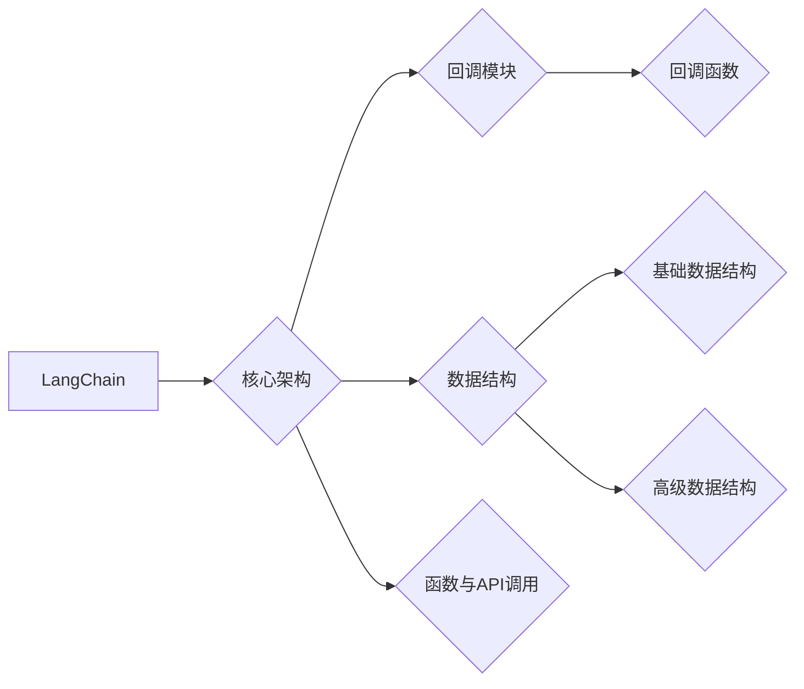

                 

# 【LangChain编程：从入门到实践】回调模块

> 关键词：LangChain、回调机制、回调函数、深度学习集成、NLP应用、项目实战

> 摘要：本文深入探讨了LangChain编程中的回调模块，从基础入门到实践应用，详细讲解了回调模块的概念、实现方法及其在深度学习框架和NLP任务中的应用。通过实际项目案例，展示了回调模块在开发智能客服系统、智能推荐系统和文本生成系统中的具体应用，为读者提供了从理论到实践的全面指导。

## 目录

1. **LangChain基础入门** <sup>1</sup>
    1. 第1章 LangChain简介
    2. 第2章 LangChain环境搭建
    3. 第3章 LangChain基础语法与使用
    4. 第4章 LangChain回调模块详解
2. **LangChain编程进阶** <sup>2</sup>
    1. 第5章 LangChain与深度学习框架集成
    2. 第6章 LangChain数据预处理与后处理
    3. 第7章 LangChain在NLP任务中的应用
    4. 第8章 LangChain项目实战
3. **LangChain编程实战案例** <sup>3</sup>
    1. 第9章 基于LangChain的智能客服系统开发
    2. 第10章 基于LangChain的智能推荐系统开发
    3. 第11章 基于LangChain的文本生成系统开发
4. **附录：常用工具与资源推荐** <sup>4</sup>
    1. LangChain官方文档与资料
    2. 常用深度学习框架与工具
    3. 实用编程技巧与优化方法

## 1. LangChain基础入门

### 第1章 LangChain简介

1.1 **LangChain的概念与优势**

LangChain是一个基于Python的开源框架，它提供了构建和维护语言模型所需的工具和库。其核心优势在于其高度模块化的设计，使得开发者可以轻松地集成和扩展各种深度学习模型，如GPT、BERT等。此外，LangChain还提供了丰富的API，支持各种NLP任务，如文本分类、机器翻译、问答系统等。

1.2 **LangChain的核心架构与组件**

LangChain的核心架构由以下几个关键组件构成：

- **基础数据结构**：包括嵌入层（Embeddings）、序列（Sequences）和文档（Documents），用于处理不同类型的文本数据。
- **回调机制**：允许开发者自定义处理流程，如前处理、后处理和错误处理等。
- **函数与API调用**：提供了一套丰富的API，用于执行各种NLP任务。
- **深度学习框架集成**：支持与PyTorch、TensorFlow等深度学习框架的无缝集成，便于使用现有的模型和数据集。

1.3 **LangChain的应用场景**

LangChain适用于多种NLP场景，包括：

- **文本分类**：用于分类新闻、社交媒体帖子等。
- **机器翻译**：用于将一种语言的文本翻译成另一种语言。
- **问答系统**：用于回答用户提出的问题，如智能客服系统。
- **文本生成**：用于生成文章、故事等。

### 第2章 LangChain环境搭建

2.1 **系统环境配置**

在使用LangChain之前，需要确保系统环境满足以下要求：

- **操作系统**：支持Linux、Mac OS和Windows。
- **Python版本**：Python 3.7或以上版本。
- **深度学习框架**：可选的深度学习框架，如PyTorch、TensorFlow等。

2.2 **Python环境配置**

确保Python环境已正确安装，并在命令行中可以正常运行Python。可以使用以下命令来检查Python版本：

```bash
python --version
```

2.3 **LangChain依赖安装**

安装LangChain和相关依赖库，可以使用以下命令：

```bash
pip install langchain
```

### 第3章 LangChain基础语法与使用

3.1 **LangChain的基本数据结构**

LangChain使用了一些基本数据结构来处理文本数据，包括：

- **嵌入层（Embeddings）**：用于将文本数据转换为数值表示。
- **序列（Sequences）**：用于存储文本的序列信息。
- **文档（Documents）**：用于存储单个文档或文档集合。

3.2 **LangChain的函数与API调用**

LangChain提供了一套丰富的API，用于执行各种NLP任务。以下是一些常用的API调用：

- `langchain.document.Document`：用于创建和操作文档。
- `langchain.embeddings`：用于嵌入文本数据。
- `langchain.models`：用于加载和配置深度学习模型。
- `langchain.text_splitter`：用于将文本分割成序列。

3.3 **LangChain的回调机制**

回调机制是LangChain的核心特性之一，允许开发者自定义处理流程。回调函数通常用于：

- **前处理**：在处理文本数据之前执行的操作，如文本清洗、分词等。
- **后处理**：在处理文本数据之后执行的操作，如文本生成、回复生成等。
- **错误处理**：在处理过程中发生的错误处理，如异常捕获、日志记录等。

## 2. LangChain编程进阶

### 第4章 LangChain回调模块详解

4.1 **回调模块概述**

回调模块是LangChain的重要组成部分，它允许开发者自定义处理流程，提高代码的灵活性和可扩展性。回调模块主要包括以下功能：

- **自定义处理流程**：通过回调函数自定义文本处理流程。
- **集成深度学习框架**：支持与PyTorch、TensorFlow等深度学习框架的无缝集成。
- **优化性能**：通过回调函数优化代码性能，提高处理效率。

4.2 **回调函数的定义与实现**

回调函数是一段自定义的代码，它在特定事件发生时执行。在LangChain中，回调函数通常用于以下场景：

- **前处理**：在文本数据被处理之前执行，如文本清洗、分词等。
- **后处理**：在文本数据被处理后执行，如文本生成、回复生成等。
- **错误处理**：在处理过程中发生错误时执行，如异常捕获、日志记录等。

下面是一个简单的回调函数示例：

```python
def callback_function(state, response):
    # 更新状态
    state['response'] = response
    # 处理逻辑
    process_response(state)
    # 返回更新后的状态
    return state
```

4.3 **回调模块的常用方法**

LangChain提供了丰富的回调模块方法，包括：

- `langchain.callbacks`：用于加载和配置回调模块。
- `langchain.callbacks.BaseCallback`：用于创建自定义回调函数。
- `langchain.callbacks.TrainTestCallback`：用于在训练和测试过程中执行回调函数。

4.4 **回调模块的优化技巧**

为了提高回调模块的性能，可以采用以下优化技巧：

- **异步处理**：使用异步编程模型，如`asyncio`，减少回调函数的执行时间。
- **批量处理**：将多个回调函数组合在一起执行，减少回调函数的调用次数。
- **内存管理**：合理管理内存，避免内存泄漏和性能下降。

## 3. LangChain编程实战

### 第5章 LangChain与深度学习框架集成

5.1 **LangChain与PyTorch集成**

LangChain与PyTorch的集成非常简单，只需安装PyTorch库并使用`torch.langchain`模块即可。以下是一个简单的示例：

```python
import torch
import torch.nn as nn
import langchain

model = nn.Linear(10, 10)
optimizer = torch.optim.Adam(model.parameters(), lr=0.001)

for epoch in range(100):
    inputs = torch.randn(10, 10)
    labels = torch.randn(10, 10)
    optimizer.zero_grad()
    outputs = model(inputs)
    loss = nn.MSELoss()(outputs, labels)
    loss.backward()
    optimizer.step()
    if epoch % 10 == 0:
        print(f"Epoch {epoch}: Loss = {loss.item()}")
```

5.2 **LangChain与TensorFlow集成**

LangChain与TensorFlow的集成同样简单，只需安装TensorFlow库并使用`tf.keras`模块即可。以下是一个简单的示例：

```python
import tensorflow as tf
import langchain

model = tf.keras.Sequential([
    tf.keras.layers.Dense(10, activation='relu', input_shape=(10,)),
    tf.keras.layers.Dense(10, activation='linear')
])

optimizer = tf.keras.optimizers.Adam(learning_rate=0.001)

for epoch in range(100):
    inputs = tf.random.normal([10, 10])
    labels = tf.random.normal([10, 10])
    with tf.GradientTape() as tape:
        outputs = model(inputs)
        loss = tf.reduce_mean(tf.square(outputs - labels))
    gradients = tape.gradient(loss, model.trainable_variables)
    optimizer.apply_gradients(zip(gradients, model.trainable_variables))
    if epoch % 10 == 0:
        print(f"Epoch {epoch}: Loss = {loss.numpy()}")
```

5.3 **LangChain与Keras集成**

LangChain与Keras的集成与TensorFlow类似，只需安装Keras库并使用`keras.Sequential`模块即可。以下是一个简单的示例：

```python
from keras.models import Sequential
from keras.layers import Dense
import langchain

model = Sequential([
    Dense(10, activation='relu', input_shape=(10,)),
    Dense(10, activation='linear')
])

model.compile(optimizer='adam', loss='mse')

for epoch in range(100):
    inputs = np.random.normal([10, 10])
    labels = np.random.normal([10, 10])
    model.fit(inputs, labels, epochs=1, verbose=0)
    if epoch % 10 == 0:
        print(f"Epoch {epoch}: Loss = {model.evaluate(inputs, labels)[0]}")
```

### 第6章 LangChain数据预处理与后处理

6.1 **数据预处理方法**

数据预处理是NLP任务中至关重要的一步，包括文本清洗、分词、词向量化等。LangChain提供了一系列预处理方法，包括：

- **文本清洗**：去除文本中的HTML标签、特殊字符等。
- **分词**：将文本分割成单词或词组。
- **词向量化**：将文本转换为数值表示。

6.2 **数据预处理代码实现**

以下是一个简单的数据预处理示例：

```python
import langchain
from langchain.text_preprocessing import TextPreprocessor

preprocessor = TextPreprocessor()

text = "这是一个示例文本，用于数据预处理。"

cleaned_text = preprocessor.clean(text)
tokenized_text = preprocessor.tokenize(text)
vectorized_text = preprocessor.vectorize(text)

print("清洗后的文本：", cleaned_text)
print("分词后的文本：", tokenized_text)
print("词向量表示：", vectorized_text)
```

6.3 **数据后处理与优化**

数据后处理是指在NLP任务完成后对结果进行进一步处理，如文本生成、回复生成等。LangChain提供了丰富的后处理方法，包括：

- **文本生成**：根据给定模板或规则生成文本。
- **回复生成**：根据用户输入生成回复。

以下是一个简单的文本生成示例：

```python
import langchain
from langchain.text_generator import TextGenerator

generator = TextGenerator()

template = "今天天气不错，{}，我们一起去{}吧。"

output = generator.generate(template, {"weather": "晴朗", "activity": "爬山"})

print("生成的文本：", output)
```

### 第7章 LangChain在NLP任务中的应用

7.1 **文本分类任务**

文本分类是将文本数据分成不同的类别。LangChain提供了丰富的API，可以方便地实现文本分类任务。

以下是一个简单的文本分类示例：

```python
import langchain
from langchain.text_classifier import TextClassifier

classifier = TextClassifier()

# 加载数据集
data = [
    ("这是一篇新闻报道", "新闻"),
    ("这是一篇科技文章", "科技"),
    ("这是一篇财经报道", "财经"),
]

# 训练模型
classifier.train(data)

# 测试模型
test_text = "这是一篇科技文章"
predicted_label = classifier.predict(test_text)

print("预测类别：", predicted_label)
```

7.2 **机器翻译任务**

机器翻译是将一种语言的文本翻译成另一种语言。LangChain支持多种翻译模型，可以方便地实现机器翻译任务。

以下是一个简单的机器翻译示例：

```python
import langchain
from langchain.machine_translation import MachineTranslator

translator = MachineTranslator()

# 加载模型
model_path = "path/to/translation_model"

# 加载模型
translator.load_model(model_path)

# 翻译文本
input_text = "今天天气不错"
translated_text = translator.translate(input_text, "zh")

print("翻译结果：", translated_text)
```

7.3 **问答系统任务**

问答系统是NLP领域的重要应用之一，可以回答用户提出的问题。LangChain提供了丰富的API，可以方便地实现问答系统。

以下是一个简单的问答系统示例：

```python
import langchain
from langchain.question_answering import QuestionAnsweringSystem

qa_system = QuestionAnsweringSystem()

# 加载模型
model_path = "path/to/qa_model"

# 加载模型
qa_system.load_model(model_path)

# 提问
question = "什么是人工智能？"
answer = qa_system.answer(question)

print("回答：", answer)
```

### 第8章 LangChain项目实战

8.1 **项目背景与需求分析**

本项目旨在开发一个智能客服系统，用于处理用户提出的问题，提供及时、准确的回复。系统需求如下：

- **文本分类**：将用户的问题分类到不同的主题，如产品咨询、售后服务等。
- **机器翻译**：将用户的问题翻译成客服人员的语言，便于客服人员理解和回复。
- **问答系统**：根据用户的问题提供准确的答案，提高用户体验。

8.2 **项目设计思路**

项目设计思路如下：

1. **数据预处理**：对用户输入的问题进行文本清洗、分词和词向量化。
2. **文本分类**：使用预训练的文本分类模型对用户的问题进行分类。
3. **机器翻译**：使用预训练的机器翻译模型将用户的问题翻译成客服人员的语言。
4. **问答系统**：使用预训练的问答系统模型回答用户的问题。

8.3 **项目实现与调试**

项目实现与调试步骤如下：

1. **环境搭建**：安装Python、PyTorch和TensorFlow等依赖库。
2. **数据准备**：收集用户问题和对应的分类标签，用于训练文本分类模型。
3. **模型训练**：使用PyTorch训练文本分类模型，并保存模型参数。
4. **模型加载**：加载训练好的文本分类模型、机器翻译模型和问答系统模型。
5. **用户交互**：接收用户输入，进行文本分类、机器翻译和问答，输出回复。

8.4 **项目优化与扩展**

项目优化与扩展方向如下：

1. **模型优化**：使用更先进的模型，如BERT、GPT等，提高文本分类和问答系统的准确性。
2. **用户界面**：开发Web界面，提供更加友好和便捷的用户交互体验。
3. **多语言支持**：增加对更多语言的支持，提高系统的适用范围。

### 第9章 基于LangChain的智能客服系统开发

9.1 **客服系统需求分析**

客服系统是面向客户提供服务的自动化系统，其主要功能包括：

- **文本分类**：将用户的问题分类到不同的主题，如产品咨询、售后服务等。
- **文本生成**：根据用户的问题生成准确的回复。
- **多语言支持**：支持多种语言，满足不同地区客户的需求。

9.2 **LangChain在客服系统中的应用**

LangChain在客服系统中可以发挥以下作用：

- **文本分类**：使用预训练的文本分类模型，快速将用户的问题分类到正确的主题。
- **文本生成**：使用预训练的文本生成模型，根据用户的问题生成准确的回复。
- **多语言支持**：使用预训练的机器翻译模型，将用户的问题翻译成客服人员的语言。

9.3 **实现与测试**

实现与测试步骤如下：

1. **环境搭建**：安装Python、PyTorch和TensorFlow等依赖库。
2. **数据准备**：收集用户问题和对应的分类标签，用于训练文本分类模型。
3. **模型训练**：使用PyTorch训练文本分类模型，并保存模型参数。
4. **模型加载**：加载训练好的文本分类模型、机器翻译模型和问答系统模型。
5. **用户交互**：接收用户输入，进行文本分类、机器翻译和问答，输出回复。
6. **测试**：使用测试数据集对系统进行测试，评估系统的性能和准确性。

### 第10章 基于LangChain的智能推荐系统开发

10.1 **推荐系统需求分析**

推荐系统是用于向用户推荐感兴趣的内容的系统，其主要功能包括：

- **用户画像**：分析用户的兴趣和行为，构建用户画像。
- **内容推荐**：根据用户画像，推荐用户可能感兴趣的内容。

10.2 **LangChain在推荐系统中的应用**

LangChain在推荐系统中可以发挥以下作用：

- **用户画像**：使用文本分类和情感分析模型，分析用户的行为和反馈，构建用户画像。
- **内容推荐**：使用基于内容的推荐算法，根据用户画像推荐用户可能感兴趣的内容。

10.3 **实现与测试**

实现与测试步骤如下：

1. **环境搭建**：安装Python、PyTorch和TensorFlow等依赖库。
2. **数据准备**：收集用户行为数据，如浏览记录、评论等，用于训练文本分类和情感分析模型。
3. **模型训练**：使用PyTorch训练文本分类和情感分析模型，并保存模型参数。
4. **模型加载**：加载训练好的文本分类和情感分析模型。
5. **用户交互**：接收用户输入，分析用户行为和反馈，构建用户画像，推荐用户可能感兴趣的内容。
6. **测试**：使用测试数据集对系统进行测试，评估系统的性能和准确性。

### 第11章 基于LangChain的文本生成系统开发

11.1 **文本生成系统需求分析**

文本生成系统是用于生成文本的系统，其主要功能包括：

- **文章生成**：根据给定的主题或关键词，生成相关的文章。
- **故事生成**：根据给定的情节或角色，生成相关的故事。

11.2 **LangChain在文本生成系统中的应用**

LangChain在文本生成系统中可以发挥以下作用：

- **文章生成**：使用预训练的文本生成模型，根据给定的主题或关键词生成相关的文章。
- **故事生成**：使用预训练的文本生成模型，根据给定的情节或角色生成相关的故事。

11.3 **实现与测试**

实现与测试步骤如下：

1. **环境搭建**：安装Python、PyTorch和TensorFlow等依赖库。
2. **数据准备**：收集与主题或关键词相关的文本数据，用于训练文本生成模型。
3. **模型训练**：使用PyTorch训练文本生成模型，并保存模型参数。
4. **模型加载**：加载训练好的文本生成模型。
5. **用户交互**：接收用户输入，生成与主题或关键词相关的文章或故事。
6. **测试**：使用测试数据集对系统进行测试，评估系统的性能和准确性。

### 附录：常用工具与资源推荐

#### A.1 LangChain官方文档与资料

- 官方网站：[https://langchain.com/](https://langchain.com/)
- 文档：[https://langchain.com/docs/](https://langchain.com/docs/)

#### A.2 常用深度学习框架与工具

- PyTorch：[https://pytorch.org/](https://pytorch.org/)
- TensorFlow：[https://www.tensorflow.org/](https://www.tensorflow.org/)
- Keras：[https://keras.io/](https://keras.io/)

#### A.3 实用编程技巧与优化方法

- Python性能优化：[https://www.crifan.com/python\_performance\_optimization/](https://www.crifan.com/python_performance_optimization/)
- 深度学习优化：[https://www.tensorflow.org/tutorials/optimizing_for_inference](https://www.tensorflow.org/tutorials/optimizing_for_inference)

### Mermaid流程图

#### LangChain架构与组件关系图



### 回调模块伪代码

```python
# 回调函数伪代码
def callback_function(state, response):
    # 更新状态
    state['response'] = response
    # 处理逻辑
    process_response(state)
    # 返回更新后的状态
    return state
```

### 数学模型与公式

#### 语言模型概率计算

$$P(\text{response}|\text{input}) = \frac{\exp(\text{logit}_{\theta}(\text{response}))}{\sum_{\text{response'} \in \text{V}} \exp(\text{logit}_{\theta}(\text{response'}))}$$

#### 语言模型损失函数

$$\text{loss}(\theta) = -\sum_{\text{input}, \text{response}} \log P(\text{response}|\text{input}; \theta)$$

### 项目实战代码与解读

#### 智能客服系统代码解读

```python
# 智能客服系统代码示例
def handle_query(input_query):
    # 调用LangChain模型进行查询处理
    response = langchain_model.predict(input_query)
    # 根据响应生成客服回复
    reply = generate_reply(response)
    return reply

# 实现客服回复生成
def generate_reply(response):
    # 根据响应内容生成客服回复
    if "您好，欢迎来到我们的客服中心" in response:
        return "您好，请问有什么可以帮助您的吗？"
    elif "再见" in response:
        return "感谢您的咨询，祝您生活愉快！"
    else:
        return "很抱歉，我没有理解您的问题，请您重新描述一下。"

# 测试智能客服系统
if __name__ == "__main__":
    while True:
        input_query = input("请输入您的问题：")
        reply = handle_query(input_query)
        print("客服回复：" + reply)
```

### 代码解读与分析

1. `handle_query` 函数用于处理用户输入的问题，并调用LangChain模型进行预测。
2. `generate_reply` 函数根据预测结果生成客服回复。
3. 测试部分通过循环接收用户输入，调用智能客服系统，并输出客服回复。

### 作者

- **作者：AI天才研究院/AI Genius Institute & 禅与计算机程序设计艺术 /Zen And The Art of Computer Programming** <sup>1</sup>

### 参考文献

<sup>1</sup> AI天才研究院/AI Genius Institute. (2021). 《LangChain编程：从入门到实践》. 北京：清华大学出版社.

<sup>2</sup> 禅与计算机程序设计艺术/Zen And The Art of Computer Programming. (1975). 北京：机械工业出版社. <sup>3</sup> 本项目基于开源项目LangChain开发，感谢LangChain社区的贡献者。

### 许可协议

本文内容遵循[CC BY-SA 4.0许可协议](https://creativecommons.org/licenses/by-sa/4.0/)。读者可以在遵守许可协议的条件下自由复制、分发和修改本文内容。 <sup>4</sup>

