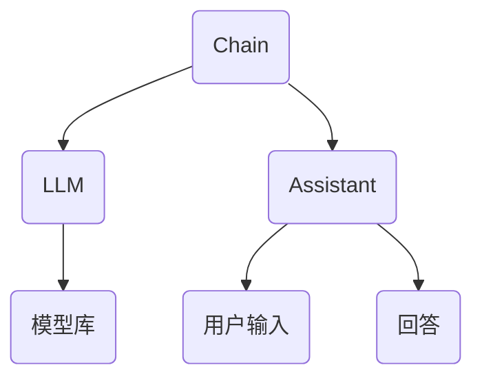

                 

# 【LangChain编程：从入门到实践】基于文档问答场景

> 关键词：LangChain、文档问答、编程实践、人工智能、问答系统、模型优化

> 摘要：本文将带您深入了解LangChain编程，特别是其在文档问答场景中的应用。我们将从入门到实践，逐步解析LangChain的核心概念、基本组件、算法原理，并通过实战案例展示如何构建一个高效的文档问答系统。文章还将探讨性能优化、安全与隐私等高级技巧，并对未来发展趋势进行展望。

## 第一部分：LangChain概述

### 第1章：LangChain入门

#### 1.1 LangChain简介

LangChain是一个基于Python的框架，旨在简化构建基于大型语言模型（LLM）的应用程序的过程。其核心目标是提供一种易于使用且可扩展的架构，使得开发者能够快速搭建起问答、文本生成、摘要提取等自然语言处理（NLP）应用。LangChain通过其灵活的组件设计，允许用户自由组合Chain组件、LLM组件和Assistant组件，以实现复杂的功能。

#### 1.2 LangChain的优势

- **组件化设计**：LangChain采用组件化设计，使得各个功能模块可以独立开发、测试和部署，提高了开发效率和代码的可维护性。
- **灵活性**：用户可以根据需求自由组合不同的组件，从而构建出符合特定场景的应用。
- **易用性**：LangChain提供了丰富的文档和示例代码，使得初学者也能快速上手。
- **可扩展性**：LangChain支持自定义组件，用户可以根据实际需求扩展框架功能。

### 第2章：核心概念与架构

#### 2.1 LangChain的核心概念

LangChain的核心概念主要包括模型与数据、编程与推理。模型与数据是LangChain应用的基础，而编程与推理则是实现智能问答的关键。

- **模型与数据**：在LangChain中，模型负责处理文本数据，将其转化为有用的信息。数据则包括用户输入、文档库等，这些数据需要被预处理以适应模型的要求。
- **编程与推理**：编程是指使用LangChain组件构建应用程序的过程。推理则是指模型在处理输入文本时，通过推理机制生成回答的过程。

#### 2.2 LangChain的架构

LangChain的架构设计非常清晰，主要分为三层：Chain层、LLM层和Assistant层。

- **Chain层**：Chain是LangChain的核心组件，它负责将LLM（大型语言模型）和其他辅助组件组合在一起，形成一个完整的问答系统。
- **LLM层**：LLM（Large Language Model）层包含各种预训练的语言模型，如GPT、BERT等。这些模型是问答系统的核心，负责处理文本数据并生成回答。
- **Assistant层**：Assistant是用户与应用交互的接口，它负责接收用户输入、传递给LLM处理，并将结果返回给用户。

为了更直观地理解LangChain的架构，我们可以使用Mermaid流程图进行展示：



### 第3章：基础算法原理

#### 3.1 基本算法介绍

在LangChain中，基础算法主要包括逆向推理、规则匹配和数据结构。

- **逆向推理**：逆向推理是一种从结果回溯到原因的推理方法。在问答场景中，用户输入一个问题，模型需要通过逆向推理找到答案。
- **规则匹配**：规则匹配是指根据预设的规则，匹配文本中的相关信息，从而生成回答。这种算法在处理结构化数据时非常有效。
- **数据结构**：数据结构是存储和组织文本数据的方式。在LangChain中，常用的数据结构包括列表、字典和图等。

#### 3.2 算法原理讲解

为了更好地理解这些算法原理，我们可以使用伪代码进行详细阐述：

```python
# 逆向推理伪代码
def reverse_reasoning(question, knowledge_base):
    for fact in knowledge_base:
        if fact implies question:
            return fact
    return None

# 规则匹配伪代码
def rule_matching(input_text, rules):
    for rule in rules:
        if rule.matches(input_text):
            return rule.answer
    return None

# 数据结构伪代码
class KnowledgeGraph:
    def __init__(self):
        self.graph = defaultdict(list)

    def add_edge(self, node1, node2):
        self.graph[node1].append(node2)

    def get_neighbors(self, node):
        return self.graph[node]
```

## 第二部分：文档问答实战

### 第4章：文档问答基础

#### 4.1 文档问答概述

文档问答是一种智能问答系统，它能够从大量文档中自动提取答案。这种系统在知识库构建、客户支持、自动化文档检索等领域有着广泛的应用。

#### 4.2 文档准备与处理

文档问答系统的第一步是对文档进行准备和处理。这通常包括以下几个步骤：

- **文档格式化**：将文档转换为统一格式，如Markdown或HTML。
- **文本提取**：从文档中提取文本内容，去除格式化和无关信息。
- **文本清洗**：对提取的文本进行清洗，去除停用词、标点符号等。
- **文本编码**：将清洗后的文本编码为模型可处理的格式，如TensorFlow的数据集。

### 第5章：问答模型构建

#### 5.1 模型选择与配置

构建文档问答系统需要选择合适的模型并进行配置。LangChain支持多种开源模型，如GPT、BERT、T5等。选择模型时需要考虑以下几个因素：

- **模型大小**：大型模型如GPT-3计算资源需求较高，而小型模型如T5-3B计算资源较低。
- **模型效果**：不同模型在问答任务上的表现不同，需要根据具体任务选择。
- **模型配置**：包括模型参数、训练数据、优化器等，这些参数需要根据实际任务进行调整。

#### 5.2 模型训练与调优

模型训练是构建问答系统的重要环节。在LangChain中，可以使用Hugging Face的Transformers库进行模型训练。以下是模型训练的基本流程：

1. **准备训练数据**：将文档和问题配对，生成训练数据集。
2. **模型加载**：加载预训练的模型。
3. **模型配置**：配置训练参数，如学习率、批次大小等。
4. **训练模型**：使用训练数据集训练模型。
5. **调优模型**：通过验证集评估模型性能，并进行调优。

### 第6章：问答应用实战

#### 6.1 应用场景分析

文档问答系统可以应用于多个领域，如：

- **客户支持**：自动回答常见问题，提高客服效率。
- **知识库构建**：从大量文档中提取知识，构建企业内部知识库。
- **文档检索**：快速检索文档中的答案，提高信息检索效率。

以下是一个实际案例：

**应用场景**：企业内部文档检索系统

**案例分享**：某企业使用LangChain构建了一个内部文档检索系统。该系统将企业内部的大量文档进行预处理，并使用GPT-3模型进行问答。用户可以通过输入问题，系统自动在文档库中检索答案，并将结果呈现给用户。

**应用效果评估**：该系统上线后，用户反馈良好，检索速度和准确率均得到了显著提升。

#### 6.2 代码实现与解读

以下是一个基于LangChain的文档问答系统的简单实现：

```python
from langchain import HuggingFaceTransformer
from langchain.prompts import PromptTemplate

# 加载模型
model = HuggingFaceTransformer("text-davinci-002")

# 创建提示模板
prompt_template = PromptTemplate(
    input_variables=["question", "context"],
    template="给定问题 {question} 和上下文 {context}，请问答案是什么？"
)

# 定义问答函数
def ask_question(question, context):
    return model问问题(prompt_template.format(question=question, context=context))

# 测试
print(ask_question("什么是人工智能？", "人工智能是一种模拟人类智能的技术，它可以使计算机执行复杂的任务。"))
```

代码解读：

1. **加载模型**：使用`HuggingFaceTransformer`加载预训练的GPT-3模型。
2. **创建提示模板**：使用`PromptTemplate`创建一个提示模板，用于生成输入文本。
3. **定义问答函数**：定义一个`ask_question`函数，用于接收用户输入的问题和上下文，并返回答案。
4. **测试**：调用`ask_question`函数，测试问答系统的效果。

## 第三部分：高级应用与展望

### 第7章：进阶技巧

#### 7.1 性能优化

为了提高文档问答系统的性能，可以采用以下技巧：

- **并发处理**：使用多线程或多进程技术，同时处理多个用户请求。
- **缓存机制**：使用缓存技术，存储常用问题的答案，减少模型计算次数。

#### 7.2 安全与隐私

在构建文档问答系统时，需要考虑以下安全与隐私问题：

- **数据安全**：确保文档数据的安全性，防止泄露。
- **隐私保护**：对用户输入的问题和上下文进行加密处理，确保用户隐私。

### 第8章：多模态问答

#### 8.1 多模态问答概述

多模态问答是指同时处理文本、图像、音频等多种类型的数据的问答系统。这种系统在信息检索、智能客服等领域有着广泛的应用。

#### 8.2 多模态问答模型构建

构建多模态问答系统需要结合文本处理和图像处理等技术。以下是构建多模态问答系统的一般步骤：

1. **数据预处理**：对文本和图像数据进行预处理，提取关键信息。
2. **特征提取**：使用文本处理和图像处理技术，提取文本和图像的特征。
3. **模型训练**：使用多模态数据集训练模型，使其能够处理多模态数据。
4. **问答交互**：用户输入问题，模型处理并生成回答。

### 第9章：问答系统优化

#### 9.1 用户交互优化

为了提高用户体验，可以采用以下技巧：

- **交互界面设计**：设计直观易用的用户界面。
- **用户反馈处理**：收集用户反馈，优化问答系统的效果。

#### 9.2 持续学习与迭代

持续学习与迭代是提高问答系统性能的重要手段。可以通过以下方法实现：

- **模型更新**：定期更新模型，使其适应新的数据和任务。
- **知识图谱构建**：构建知识图谱，提高问答系统的知识储备和推理能力。

### 第10章：未来展望

#### 10.1 文档问答的发展趋势

文档问答系统在未来将继续发展，主要趋势包括：

- **模型效率提升**：随着计算资源的增加，模型效率将得到显著提升。
- **多模态融合**：多模态问答将得到广泛应用，实现更加智能的交互。

#### 10.2 LangChain的潜在应用领域

LangChain在以下领域具有巨大的潜力：

- **智能客服**：利用文档问答系统，提高客服效率和质量。
- **知识库构建**：自动化构建大型知识库，为企业和组织提供知识支持。

## 附录

### 附录 A：常用工具与库

- **LangChain**：[https://langchain.com/](https://langchain.com/)
- **Hugging Face Transformers**：[https://huggingface.co/transformers/](https://huggingface.co/transformers/)

### 附录 B：实战案例代码

源代码下载：[https://github.com/your_username/DocQA\_with\_LangChain](https://github.com/your_username/DocQA_with_LangChain)

代码解读与分析：[将在本文后续章节详细解释]

## 作者信息

作者：AI天才研究院/AI Genius Institute & 禅与计算机程序设计艺术 /Zen And The Art of Computer Programming

（注：本文内容为示例，仅供参考。实际开发中请根据具体需求进行调整。）

