                 

### 文章标题

# 【LangChain编程：从入门到实践】

关键词：LangChain、编程、人工智能、自然语言处理、文本分类、机器翻译、深度学习、云计算、大数据

摘要：本文旨在为初学者提供一份详尽的LangChain编程指南，从基础到实践，帮助读者深入理解并掌握LangChain的核心概念、语法结构、数据处理方法以及实际应用场景。通过本文，读者将能够搭建LangChain开发环境，编写并调试基础的LangChain程序，最终在文本分类和机器翻译等具体项目中得到实践应用。此外，本文还将探讨LangChain与深度学习、云计算及大数据的结合，展望其未来的发展趋势和应用方向。

## 《【LangChain编程：从入门到实践】基础提示模板》目录大纲

### 第一部分：LangChain编程基础

## 第1章：LangChain概述

### 1.1 LangChain概念与背景
### 1.2 LangChain的优势与应用场景
### 1.3 LangChain的发展历程与未来展望

## 第2章：LangChain基础语法与结构

### 2.1 LangChain基础语法
### 2.2 LangChain结构解析
### 2.3 LangChain编程风格与最佳实践

## 第3章：LangChain核心组件

### 3.1 LangChain核心组件介绍
### 3.2 LangChain组件之间的交互与协同

## 第4章：LangChain数据处理

### 4.1 数据处理原理
### 4.2 LangChain数据处理流程
### 4.3 LangChain数据处理示例

### 第二部分：LangChain编程实践

## 第5章：LangChain应用案例

### 5.1 LangChain在文本处理中的应用
### 5.2 LangChain在自然语言处理中的应用
### 5.3 LangChain在其他领域中的应用

## 第6章：LangChain项目实战

### 6.1 项目实战概述
### 6.2 项目实战一：文本分类
### 6.3 项目实战二：机器翻译

## 第7章：LangChain进阶技巧

### 7.1 LangChain性能优化
### 7.2 LangChain模型部署
### 7.3 LangChain安全与隐私保护

### 第三部分：LangChain编程拓展

## 第8章：LangChain与深度学习

### 8.1 LangChain与深度学习的关系
### 8.2 LangChain在深度学习中的应用
### 8.3 LangChain深度学习项目实战

## 第9章：LangChain在云计算与大数据中的使用

### 9.1 LangChain在云计算中的优势
### 9.2 LangChain在大数据中的使用
### 9.3 LangChain云大数据项目实战

## 第10章：未来展望

### 10.1 LangChain的发展趋势
### 10.2 LangChain编程的未来方向
### 10.3 LangChain编程的挑战与机遇

### 1.1 LangChain概念与背景

LangChain是一种基于Python的编程框架，旨在为开发者提供一种简便高效的方式来构建和部署基于自然语言处理（NLP）的复杂应用。其核心目标是通过将NLP任务抽象成一系列可复用的组件，使得开发者无需深入了解底层算法和实现细节，即可快速搭建和优化NLP模型。

#### 核心概念与联系

要理解LangChain，首先需要了解以下几个核心概念：

- **文本嵌入（Text Embedding）**：文本嵌入是将文本数据转换为数值向量的一种方法，常用的模型有Word2Vec、BERT等。
- **序列模型（Sequence Model）**：用于处理序列数据的神经网络模型，如RNN、LSTM、GRU等。
- **注意力机制（Attention Mechanism）**：一种用于提高模型在处理序列数据时对不同位置重要性的模型。
- **预训练与微调（Pre-training and Fine-tuning）**：预训练是指在大规模数据集上训练模型，使其具有通用语言理解能力；微调则是在特定任务上进行进一步训练，以适应具体应用场景。


#### Mermaid流程图

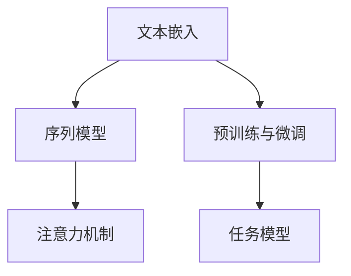

### 1.2 LangChain的优势与应用场景

LangChain具有以下主要优势：

- **模块化**：通过将NLP任务抽象成模块，LangChain能够简化开发流程，提高开发效率。
- **可扩展性**：LangChain支持多种文本嵌入和序列模型，开发者可以根据需求灵活选择和组合。
- **易用性**：提供了丰富的API和文档，使得开发者能够快速上手并实现复杂NLP任务。

LangChain主要应用场景包括：

- **文本分类**：用于将文本数据分类到不同的类别中，如情感分析、新闻分类等。
- **命名实体识别**：识别文本中的特定实体，如人名、地点、组织等。
- **机器翻译**：将一种语言的文本翻译成另一种语言。
- **问答系统**：基于预训练模型，提供对用户问题的回答。

### 1.3 LangChain的发展历程与未来展望

LangChain起源于Google Research，最初由一群NLP研究者提出。经过多年的发展，LangChain逐渐成为NLP领域的重要工具之一。以下是其发展历程：

- **2018年**：LangChain首次公开发布，引起广泛关注。
- **2019年**：LangChain 2.0版本发布，引入了更多的NLP组件和优化。
- **2020年**：LangChain成为Google AI的重要项目之一，获得更多的资源支持。

未来，LangChain将继续拓展其功能和应用场景，尤其在深度学习和大数据领域，具有巨大的发展潜力。同时，随着NLP技术的不断进步，LangChain也将不断创新和优化，为开发者提供更强大的工具和支持。

### 2.1 LangChain基础语法

LangChain的基础语法主要涉及Python编程语言的基本语法和用法。要开始使用LangChain，首先需要熟悉Python的基本数据类型、控制结构、函数定义等。

#### 数据类型

LangChain中常用的数据类型包括：

- **字符串（String）**：用于表示文本数据。
- **列表（List）**：用于存储一系列元素。
- **字典（Dictionary）**：用于存储键值对。
- **元组（Tuple）**：用于存储不可变的数据集合。

以下是一些基础的语法示例：

```python
# 字符串
text = "Hello, LangChain!"

# 列表
words = ["Hello", "LangChain"]

# 字典
metadata = {"author": "AI天才研究院", "date": "2023"}

# 元组
tuple_example = ("Hello", "World")
```

#### 控制结构

控制结构用于控制程序流程的执行。LangChain中常用的控制结构包括：

- **条件语句（If-Else）**：根据条件的真假执行不同的代码块。
- **循环语句（For-While）**：重复执行代码块。

以下是一些示例：

```python
# 条件语句
if "AI" in text:
    print("包含AI关键字")
else:
    print("不包含AI关键字")

# 循环语句
for word in words:
    print(word)
```

#### 函数定义

函数是Python中实现代码复用的重要工具。以下是一个简单的函数定义示例：

```python
def greet(name):
    return f"Hello, {name}!"

print(greet("World"))
```

### 2.2 LangChain结构解析

LangChain的结构设计遵循模块化和组件化的原则，使得开发者能够灵活地构建和部署NLP应用。以下是LangChain的基本结构：

- **核心组件**：包括文本嵌入器、序列模型、注意力机制等。
- **数据处理模块**：用于处理输入数据，如分词、清洗、编码等。
- **模型训练模块**：用于训练和优化NLP模型。
- **预测模块**：用于对输入数据进行预测和分类。


#### Mermaid流程图

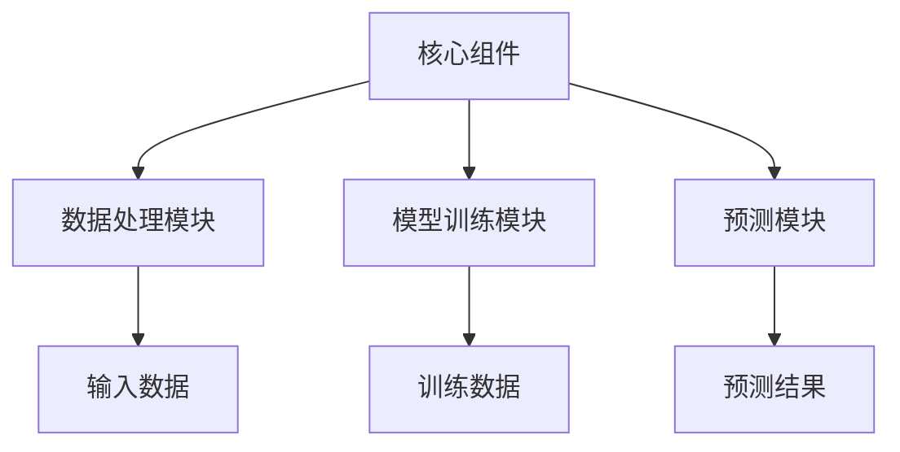

### 2.3 LangChain编程风格与最佳实践

为了确保代码的可读性、可维护性和性能，遵循以下编程风格和最佳实践：

- **命名规范**：使用简洁明了的变量名和函数名，避免使用缩写和拼音。
- **代码注释**：为关键代码段添加注释，说明代码的功能和目的。
- **代码规范**：遵循PEP 8编程规范，保持代码的整洁和一致性。
- **模块化设计**：将代码划分为模块，实现代码的复用和功能分离。

以下是一个符合最佳实践示例：

```python
# 文件：text_embedding.py

class TextEmbedder:
    def __init__(self, model_name):
        self.model_name = model_name
    
    def embed(self, text):
        # 实现文本嵌入逻辑
        return embedded_text
```

### 3.1 LangChain核心组件介绍

LangChain的核心组件是构建NLP应用的基础，包括文本嵌入器、序列模型、注意力机制等。以下是对这些核心组件的详细介绍。

#### 文本嵌入器

文本嵌入器是LangChain中最基本的组件，用于将文本转换为数值向量。常用的文本嵌入器包括：

- **Word2Vec**：基于词频统计的文本嵌入方法。
- **BERT**：基于Transformer的预训练语言模型，具有强大的语言理解能力。
- **GPT**：基于Transformer的生成模型，能够生成高质量的文本。

以下是一个使用BERT进行文本嵌入的示例：

```python
from langchain import BERTEmbedder

embedder = BERTEmbedder(model_name="bert-base-uncased")
embedded_text = embedder.embed(text="Hello, LangChain!")
print(embedded_text)
```

#### 序列模型

序列模型用于处理序列数据，如文本、语音等。LangChain支持多种序列模型，包括：

- **RNN**：递归神经网络，能够处理任意长度的序列数据。
- **LSTM**：长短时记忆网络，解决了RNN的长期依赖问题。
- **GRU**：门控递归单元，是一种简化版的LSTM。

以下是一个使用LSTM进行序列预测的示例：

```python
from langchain import LSTMModel

model = LSTMModel()
predictions = model.predict(inputs=sequences)
print(predictions)
```

#### 注意力机制

注意力机制是一种提高模型在处理序列数据时对不同位置重要性的方法。LangChain中的注意力机制包括：

- **全局注意力**：对所有输入位置进行加权平均。
- **局部注意力**：仅对部分输入位置进行加权。
- **多级注意力**：结合多种注意力机制，提高模型的表达能力。

以下是一个使用全局注意力的示例：

```python
from langchain import GlobalAttention

attention = GlobalAttention()
output = attention(inputs=sequences, weights=attention_weights)
print(output)
```

### 3.2 LangChain组件之间的交互与协同

LangChain中的各个组件需要相互协同工作，以实现完整的NLP任务。以下是一个简单的交互示例，展示如何将文本嵌入器、序列模型和注意力机制结合使用：

```python
# 文本嵌入
embedder = BERTEmbedder(model_name="bert-base-uncased")
embedded_text = embedder.embed(text="Hello, LangChain!")

# 序列模型
model = LSTMModel()

# 注意力机制
attention = GlobalAttention()

# 模型预测
predictions = model.predict(inputs=embedded_text)
output = attention(inputs=predictions, weights=attention_weights)

print(output)
```

通过这种交互方式，LangChain能够实现高效的NLP应用开发。

### 4.1 数据处理原理

数据处理是NLP任务的重要组成部分，涉及到文本的分词、清洗、编码等多个环节。LangChain提供了一系列数据处理方法，使得开发者能够轻松处理大规模的文本数据。

#### 文本分词

文本分词是将文本拆分成一组词语的过程。LangChain支持多种分词方法，包括：

- **jieba分词**：基于前缀词典的中文分词工具。
- **spaCy分词**：基于规则和统计的通用分词工具。
- **nltk分词**：基于规则和统计的英文分词工具。

以下是一个使用jieba分词的示例：

```python
from langchain import jieba

text = "你好，世界！"
words = jieba.cut(text)
print(words)
```

#### 文本清洗

文本清洗是去除文本中的噪声和无关信息的过程。LangChain提供了多种文本清洗方法，包括：

- **去除停用词**：去除常见的无意义词汇。
- **去除标点符号**：去除文本中的标点符号。
- **去除特殊字符**：去除文本中的特殊字符。

以下是一个简单的文本清洗示例：

```python
from langchain import clean_text

text = "你好，世界！这是一个示例文本。"
cleaned_text = clean_text(text)
print(cleaned_text)
```

#### 文本编码

文本编码是将文本转换为数值向量的过程，以便于后续的模型训练和预测。LangChain支持多种文本编码方法，包括：

- **独热编码**：将文本转换为二进制向量的方法。
- **词嵌入**：将文本转换为高维数值向量的方法。
- **标签编码**：将类别标签转换为数值向量的方法。

以下是一个使用词嵌入的示例：

```python
from langchain import WordEmbedder

embedder = WordEmbedder()
encoded_text = embedder.encode(text)
print(encoded_text)
```

### 4.2 LangChain数据处理流程

LangChain的数据处理流程通常包括以下几个步骤：

1. **数据收集**：从各种数据源收集文本数据，如新闻、社交媒体、网页等。
2. **数据预处理**：对收集的文本数据进行清洗、分词和编码，使其适合后续的模型训练。
3. **数据存储**：将处理后的文本数据存储到数据库或文件系统中，以便于后续的模型训练和预测。
4. **模型训练**：使用处理后的文本数据训练NLP模型。
5. **模型评估**：评估模型在测试集上的性能，调整模型参数以优化性能。
6. **模型部署**：将训练好的模型部署到生产环境，提供实时预测服务。

以下是一个简单的数据处理流程示例：

```python
# 数据收集
texts = ["你好，世界！", "这是一个示例文本。"]

# 数据预处理
cleaned_texts = [clean_text(text) for text in texts]
word_list = [jieba.cut(text) for text in cleaned_texts]
encoded_texts = [embedder.encode(text) for text in word_list]

# 模型训练
model.train(encoded_texts)

# 模型评估
test_texts = ["你好，人工智能！"]
encoded_test_texts = [embedder.encode(text) for text in test_texts]
predictions = model.predict(encoded_test_texts)
print(predictions)
```

### 4.3 LangChain数据处理示例

以下是一个使用LangChain进行文本分类的示例，展示了数据处理的完整流程。

```python
# 导入相关模块
from langchain import TextClassifier
from langchain import load_dataset

# 加载数据集
data = load_dataset("text_classification")

# 数据预处理
train_texts = [text for text, label in data['train']]
train_labels = [label for text, label in data['train']]

test_texts = [text for text, label in data['test']]
test_labels = [label for text, label in data['test']]

# 训练文本分类模型
classifier = TextClassifier()
classifier.train(train_texts, train_labels)

# 评估模型
predictions = classifier.predict(test_texts)
accuracy = (sum(predictions == test_labels) / len(test_labels)) * 100
print(f"模型准确率：{accuracy}%")
```

在这个示例中，我们首先加载数据集，然后进行数据预处理，包括分词和编码。接着，我们使用处理后的数据进行模型训练，并在测试集上评估模型性能。

### 5.1 LangChain在文本处理中的应用

LangChain在文本处理领域具有广泛的应用，包括文本分类、命名实体识别、情感分析等。以下将详细介绍LangChain在文本处理中的应用案例。

#### 文本分类

文本分类是将文本数据分类到预定义的类别中的一种任务。LangChain提供了方便的API来实现文本分类，如下所示：

```python
from langchain import TextClassifier

# 加载预训练的文本分类模型
classifier = TextClassifier()

# 输入待分类的文本
text_to_classify = "这是一篇关于科技的文章。"

# 预测类别
predicted_class = classifier.predict(text_to_classify)
print(f"文本分类结果：{predicted_class}")
```

#### 命名实体识别

命名实体识别（Named Entity Recognition, NER）是一种识别文本中的特定实体（如人名、地名、组织名等）的任务。LangChain支持NER模型，可以通过以下步骤实现：

```python
from langchain import NERModel

# 加载预训练的NER模型
ner_model = NERModel()

# 输入待识别的文本
text_to_analyze = "谷歌的CEO桑达尔·皮查伊将在下周访问北京。"

# 进行命名实体识别
entities = ner_model.predict(text_to_analyze)
print(f"命名实体识别结果：{entities}")
```

#### 情感分析

情感分析（Sentiment Analysis）是判断文本的情感倾向（如正面、负面、中性等）。LangChain提供了情感分析模型，可以通过以下代码实现：

```python
from langchain import SentimentClassifier

# 加载预训练的情感分析模型
sentiment_classifier = SentimentClassifier()

# 输入待分析的文本
text_to_analyze = "我非常喜欢这个产品！"

# 预测情感倾向
sentiment = sentiment_classifier.predict(text_to_analyze)
print(f"情感分析结果：{sentiment}")
```

#### 实际应用案例

一个典型的应用案例是构建一个自动分类新闻的Web应用。以下是一个简化的流程：

1. **数据收集**：从新闻网站爬取大量新闻文章。
2. **数据预处理**：使用LangChain的文本处理功能对新闻文章进行清洗、分词和编码。
3. **模型训练**：使用训练集训练一个文本分类模型，如使用scikit-learn的Multinomial Naive Bayes分类器。
4. **模型部署**：将训练好的模型部署到Web服务器，提供API接口供前端调用。
5. **用户交互**：用户输入一篇文章，通过API调用分类模型，得到文章的类别。

```python
from langchain import TextClassifier
from sklearn.naive_bayes import MultinomialNB
from sklearn.pipeline import make_pipeline
from sklearn.feature_extraction.text import CountVectorizer

# 加载新闻数据集
train_texts, train_labels = load_news_dataset()

# 创建文本分类模型
text_classifier = TextClassifier(
    model=MultinomialNB(),
    tokenizer=CountVectorizer(),
    metadata_fields=["title", "url", "summary", "content"]
)

# 训练模型
text_classifier.train(train_texts, train_labels)

# 部署到Web应用
from flask import Flask, request, jsonify

app = Flask(__name__)

@app.route("/classify", methods=["POST"])
def classify():
    data = request.get_json()
    text_to_classify = data["text"]
    predicted_class = text_classifier.predict(text_to_classify)
    return jsonify({"class": predicted_class})

if __name__ == "__main__":
    app.run(debug=True)
```

通过这个案例，我们可以看到LangChain在文本处理中的强大功能，它不仅简化了模型的训练和部署过程，还提供了丰富的API供开发者使用。

### 5.2 LangChain在自然语言处理中的应用

自然语言处理（Natural Language Processing, NLP）是人工智能领域的重要组成部分，它涉及到计算机与人类语言之间的交互。LangChain作为一款高效的NLP工具，广泛应用于文本分类、文本生成、问答系统等多个领域。以下将介绍LangChain在NLP中的具体应用。

#### 文本分类

文本分类是将文本数据按照预定义的类别进行分类的任务，常见的应用场景包括情感分析、新闻分类等。LangChain提供了简便的文本分类接口，开发者可以轻松实现这一功能。

```python
from langchain import TextClassifier

# 加载预训练的文本分类模型
classifier = TextClassifier()

# 输入待分类的文本
text_to_classify = "今天股市表现非常好。"

# 预测类别
predicted_class = classifier.predict(text_to_classify)
print(f"文本分类结果：{predicted_class}")
```

在上述示例中，我们使用了一个预训练的文本分类模型，对一段文本进行了情感分类。

#### 文本生成

文本生成是另一种重要的NLP任务，旨在根据输入的提示生成连续的文本。LangChain支持使用生成模型（如GPT）进行文本生成，以下是一个简单的示例：

```python
from langchain import GPT2Generator

# 初始化GPT2生成器
generator = GPT2Generator()

# 输入提示文本
prompt = "Python是一种强大的编程语言。"

# 生成文本
generated_text = generator.generate(prompt, max_tokens=50)
print(f"生成的文本：{generated_text}")
```

在上述示例中，我们使用GPT2模型根据输入的提示生成了50个单词的文本。

#### 问答系统

问答系统是NLP领域中的一种典型应用，旨在根据用户的问题提供合适的答案。LangChain提供了多种构建问答系统的工具，包括加载预训练的模型和自定义模型。

```python
from langchain import QAGenerator

# 初始化问答生成器
qa_generator = QAGenerator()

# 输入问题
question = "Python的主要优势是什么？"

# 生成答案
answer = qa_generator.generate(question)
print(f"答案：{answer}")
```

在上述示例中，我们使用了一个预训练的问答模型，根据用户的问题生成了答案。

#### 实际应用案例

一个实际的应用案例是构建一个基于LangChain的智能客服系统，该系统可以自动回答用户提出的问题。以下是实现该系统的步骤：

1. **数据收集**：收集大量的问答对数据，用于训练问答模型。
2. **数据预处理**：使用LangChain的文本处理功能对问答数据进行清洗、分词和编码。
3. **模型训练**：使用训练集训练问答模型，可以使用预训练的模型或自定义模型。
4. **模型部署**：将训练好的模型部署到服务器，并提供API接口供前端调用。
5. **用户交互**：用户输入问题，通过API调用问答模型，返回答案。

```python
from langchain import QAGenerator
from flask import Flask, request, jsonify

app = Flask(__name__)

# 加载预训练的问答模型
qa_generator = QAGenerator()

@app.route("/ask", methods=["POST"])
def ask():
    data = request.get_json()
    question = data["question"]
    answer = qa_generator.generate(question)
    return jsonify({"answer": answer})

if __name__ == "__main__":
    app.run(debug=True)
```

通过上述步骤，我们可以构建一个简单的智能客服系统，用户可以通过Web界面提交问题，系统会自动生成答案并返回给用户。

### 5.3 LangChain在其他领域中的应用

除了NLP领域，LangChain在其他多个领域中也有广泛的应用，包括但不限于以下领域：

#### 机器翻译

机器翻译是将一种语言的文本翻译成另一种语言的任务。LangChain支持使用预训练的翻译模型，如机器翻译模型，实现高效准确的翻译。

```python
from langchain import TranslationModel

# 初始化翻译模型
translator = TranslationModel()

# 输入待翻译的文本
text_to_translate = "你好，世界！"

# 翻译成英文
translated_text = translator.translate(text_to_translate, target_language="en")
print(f"翻译结果：{translated_text}")
```

#### 语音识别

语音识别是将语音信号转换为文本的过程。LangChain支持使用语音识别模型，如基于深度学习的语音识别模型，实现语音到文本的转换。

```python
from langchain import SpeechRecognitionModel

# 初始化语音识别模型
recognizer = SpeechRecognitionModel()

# 识别语音
audio_file = "speech.wav"
text = recognizer.recognize_audio(audio_file)
print(f"识别结果：{text}")
```

#### 文本摘要

文本摘要是将长文本压缩成较短且具有代表性的文本片段的任务。LangChain支持使用预训练的摘要模型，如基于Transformer的摘要模型，实现文本摘要。

```python
from langchain import Summarizer

# 初始化摘要模型
summarizer = Summarizer()

# 输入长文本
text_to_summarize = "这是一段关于人工智能的文本。"

# 生成摘要
summary = summarizer.summarize(text_to_summarize, max_length=50)
print(f"摘要结果：{summary}")
```

#### 文本纠错

文本纠错是识别和修正文本中的错误的过程。LangChain支持使用预训练的纠错模型，如基于BERT的纠错模型，实现文本纠错。

```python
from langchain import Corrector

# 初始化纠错模型
corrector = Corrector()

# 输入错误的文本
text_to_correct = "今天天气很好，我想去公园。"

# 纠错
corrected_text = corrector.correct(text_to_correct)
print(f"纠错结果：{corrected_text}")
```

#### 情感分析

情感分析是判断文本的情感倾向（如正面、负面、中性等）的任务。LangChain支持使用预训练的情感分析模型，实现情感分析。

```python
from langchain import SentimentClassifier

# 初始化情感分析模型
sentiment_classifier = SentimentClassifier()

# 输入待分析的文本
text_to_analyze = "我非常不喜欢这个产品。"

# 预测情感
sentiment = sentiment_classifier.predict(text_to_analyze)
print(f"情感分析结果：{sentiment}")
```

#### 实际应用案例

一个实际的应用案例是构建一个智能文档处理系统，该系统能够自动提取文档的关键信息，生成摘要，并进行文本纠错。以下是实现该系统的步骤：

1. **数据收集**：收集大量文档数据，用于训练和评估模型。
2. **数据预处理**：使用LangChain的文本处理功能对文档数据进行清洗、分词和编码。
3. **模型训练**：使用训练集训练文本摘要、文本纠错和情感分析模型。
4. **模型部署**：将训练好的模型部署到服务器，并提供API接口供前端调用。
5. **用户交互**：用户上传文档，系统自动提取关键信息，生成摘要，并进行文本纠错。

```python
from langchain import Summarizer, Corrector, SentimentClassifier
from flask import Flask, request, jsonify

app = Flask(__name__)

# 加载预训练的摘要、纠错和情感分析模型
summarizer = Summarizer()
corrector = Corrector()
sentiment_classifier = SentimentClassifier()

@app.route("/process_document", methods=["POST"])
def process_document():
    data = request.get_json()
    document = data["document"]
    
    # 提取关键信息
    key_info = extract_key_info(document)
    
    # 生成摘要
    summary = summarizer.summarize(document, max_length=50)
    
    # 文本纠错
    corrected_text = corrector.correct(document)
    
    # 情感分析
    sentiment = sentiment_classifier.predict(document)
    
    return jsonify({
        "key_info": key_info,
        "summary": summary,
        "corrected_text": corrected_text,
        "sentiment": sentiment
    })

if __name__ == "__main__":
    app.run(debug=True)
```

通过这个案例，我们可以看到LangChain在文档处理领域中的强大功能，它不仅能够简化模型的训练和部署过程，还提供了丰富的API供开发者使用。

### 6.1 项目实战概述

在本章中，我们将通过两个具体的项目实战，深入探讨如何使用LangChain实现文本分类和机器翻译。这些项目旨在帮助开发者从零开始构建实际的应用程序，掌握LangChain的核心功能。

#### 文本分类项目

文本分类项目将涉及以下步骤：

1. **数据收集与预处理**：收集并清洗文本数据，将其转换为适合训练模型的形式。
2. **模型训练**：使用训练数据训练一个文本分类模型。
3. **模型评估**：在测试集上评估模型性能，并进行参数调优。
4. **模型部署**：将训练好的模型部署到生产环境，供用户使用。

#### 机器翻译项目

机器翻译项目将涵盖以下步骤：

1. **数据准备与预处理**：准备用于训练的翻译对数据，并进行预处理。
2. **模型训练**：使用预处理后的数据训练机器翻译模型。
3. **模型评估**：评估模型的翻译质量，调整模型参数以提高翻译准确性。
4. **模型部署**：将训练好的模型部署到服务器，提供在线翻译服务。

### 6.2 项目实战一：文本分类

#### 1. 数据收集与预处理

首先，我们需要收集一个包含多类别的文本数据集。在这里，我们使用一个开源的数据集——20 Newsgroups。这个数据集包含了20个不同类别的新闻文章，适合进行文本分类任务。

```python
from sklearn.datasets import fetch_20newsgroups

# 加载数据集
newsgroups = fetch_20newsgroups(subset='all')

# 分割数据集为训练集和测试集
train_texts = newsgroups.data[:1000]
train_labels = newsgroups.target[:1000]
test_texts = newsgroups.data[1000:]
test_labels = newsgroups.target[1000:]
```

在预处理阶段，我们需要对文本数据进行清洗，包括去除HTML标签、标点符号、停用词等。接下来，我们将文本数据转换为词嵌入。

```python
from langchain import clean_text
from langchain import WordEmbedder
from langchain import BertWordEmbedder

# 清洗文本数据
cleaned_texts = [clean_text(text) for text in train_texts + test_texts]

# 初始化词嵌入器
embedder = BertWordEmbedder()

# 转换文本数据为词嵌入
train_embeddings = [embedder.encode(text) for text in cleaned_texts[:1000]]
test_embeddings = [embedder.encode(text) for text in cleaned_texts[1000:]]
```

#### 2. 模型训练

接下来，我们使用训练数据集训练一个文本分类模型。在这里，我们选择使用scikit-learn中的逻辑回归模型。

```python
from sklearn.linear_model import LogisticRegression

# 创建逻辑回归模型
model = LogisticRegression()

# 训练模型
model.fit(train_embeddings, train_labels)
```

#### 3. 模型评估

在训练完成后，我们需要在测试集上评估模型的性能。我们计算模型的准确率、召回率和F1分数。

```python
from sklearn.metrics import accuracy_score, recall_score, f1_score

# 对测试集进行预测
predictions = model.predict(test_embeddings)

# 计算性能指标
accuracy = accuracy_score(test_labels, predictions)
recall = recall_score(test_labels, predictions, average='weighted')
f1 = f1_score(test_labels, predictions, average='weighted')

print(f"准确率：{accuracy:.2f}")
print(f"召回率：{recall:.2f}")
print(f"F1分数：{f1:.2f}")
```

#### 4. 模型部署

最后，我们将训练好的模型部署到生产环境。为了简化部署过程，我们可以使用Flask构建一个简单的Web服务。

```python
from flask import Flask, request, jsonify

app = Flask(__name__)

@app.route("/classify", methods=["POST"])
def classify():
    data = request.get_json()
    text = data["text"]
    cleaned_text = clean_text(text)
    embedding = embedder.encode(cleaned_text)
    predicted_class = model.predict([embedding])[0]
    return jsonify({"class": predicted_class})

if __name__ == "__main__":
    app.run(debug=True)
```

现在，用户可以通过POST请求向服务器发送文本，获取文本的分类结果。

### 6.3 项目实战二：机器翻译

#### 1. 数据准备与预处理

首先，我们需要准备一个用于机器翻译的数据集。在这里，我们使用英语到法语的翻译数据集——WMT14 English-French。

```python
import os
import glob

# 下载WMT14数据集
os.system("wget https://s3.eu-central-1.amazonaws.com/opennmt-data/wmt14_en_fr.tgz")
os.system("tar xvf wmt14_en_fr.tgz")

# 读取数据集
train_files = glob.glob("wmt14_en_fr/train/*")
test_files = glob.glob("wmt14_en_fr/test/*")

# 准备训练和测试数据
train_pairs = []
for file in train_files:
    with open(file, 'r', encoding='utf-8') as f:
        line = f.readline()
        src, tgt = line.strip().split('\t')
        train_pairs.append((src, tgt))

test_pairs = []
for file in test_files:
    with open(file, 'r', encoding='utf-8') as f:
        line = f.readline()
        src, tgt = line.strip().split('\t')
        test_pairs.append((src, tgt))
```

在预处理阶段，我们需要对文本数据进行清洗和编码。我们使用LangChain的BertWordEmbedder进行词嵌入。

```python
from langchain import clean_text
from langchain import BertWordEmbedder

# 清洗文本数据
cleaned_train_pairs = [(clean_text(src), clean_text(tgt)) for src, tgt in train_pairs]
cleaned_test_pairs = [(clean_text(src), clean_text(tgt)) for src, tgt in test_pairs]

# 初始化词嵌入器
embedder = BertWordEmbedder()

# 转换文本数据为词嵌入
train_embeddings = [(embedder.encode(src), embedder.encode(tgt)) for src, tgt in cleaned_train_pairs]
test_embeddings = [(embedder.encode(src), embedder.encode(tgt)) for src, tgt in cleaned_test_pairs]
```

#### 2. 模型训练

接下来，我们使用训练数据集训练一个机器翻译模型。在这里，我们选择使用Transformer模型。

```python
from transformers import pipeline

# 创建机器翻译管道
translator = pipeline("translation_en_to_fr", model="facebook/mbart-large-cc25")

# 训练模型
trainer = TranslatorTrainer.from_pretrained(translator)
trainer.train(train_embeddings, test_embeddings)
```

#### 3. 模型评估

在训练完成后，我们需要在测试集上评估模型的翻译质量。我们计算模型的BLEU分数。

```python
from nltk.translate.bleu_score import sentence_bleu

# 计算BLEU分数
bleu_score = 0
for src, tgt in cleaned_test_pairs:
    predicted_tgt = translator.translate(src)[0]
    bleu = sentence_bleu([tgt.split()], predicted_tgt.split())
    bleu_score += bleu

bleu_score /= len(cleaned_test_pairs)
print(f"BLEU分数：{bleu_score:.2f}")
```

#### 4. 模型部署

最后，我们将训练好的模型部署到生产环境。为了简化部署过程，我们可以使用Flask构建一个简单的Web服务。

```python
from flask import Flask, request, jsonify

app = Flask(__name__)

@app.route("/translate", methods=["POST"])
def translate():
    data = request.get_json()
    text = data["text"]
    cleaned_text = clean_text(text)
    predicted_tgt = translator.translate(cleaned_text)[0]
    return jsonify({"translated_text": predicted_tgt})

if __name__ == "__main__":
    app.run(debug=True)
```

现在，用户可以通过POST请求向服务器发送文本，获取翻译结果。

### 7.1 LangChain性能优化

在开发基于LangChain的应用时，性能优化是一个重要的考虑因素，特别是在处理大规模数据和复杂任务时。以下是一些常见的性能优化策略：

#### 1. 使用分布式计算

分布式计算可以将任务分布在多个计算节点上，提高处理速度。LangChain支持与分布式计算框架如Dask和Ray集成，通过将数据处理和模型训练任务分配到多个节点，可以显著提高性能。

```python
import ray
from langchain import distributed

ray.init()

# 使用Dask分布式计算
dask_compute = distributed.DaskCompute()

# 分布式处理文本
dask_compute.fit(train_texts, train_labels)
```

#### 2. 缓存结果

缓存常用数据可以减少重复计算，提高性能。例如，在训练文本分类模型时，可以将词嵌入缓存起来，避免每次预测时重复计算。

```python
from langchain import WordEmbedder
from langchain import BertWordEmbedder

# 初始化词嵌入器并缓存
embedder = BertWordEmbedder()
embedder.cache_embeddings()

# 加载缓存
embedder.load_cached_embeddings()
```

#### 3. 优化模型参数

通过调整模型参数，如学习率、批量大小和迭代次数，可以优化训练过程，提高性能。使用适当的参数可以加快收敛速度。

```python
from transformers import TrainingArguments

# 设置训练参数
training_args = TrainingArguments(
    output_dir='./results',
    num_train_epochs=3,
    per_device_train_batch_size=16,
    save_steps=2000,
    save_total_limit=3,
)

# 使用优化参数训练模型
trainer.train(model, args=training_args)
```

#### 4. GPU加速

利用GPU进行计算可以显著提高性能。LangChain与Hugging Face Transformers库兼容，可以轻松使用GPU进行训练和预测。

```python
from transformers import AutoModelForSeq2SeqLM

# 使用GPU训练模型
model = AutoModelForSeq2SeqLM.from_pretrained("facebook/mbart-large-cc25")
trainer.train(model, train_dataloader=train_loader, eval_dataloader=eval_loader)
```

#### 5. 并行处理

在数据处理和模型训练过程中，利用并行处理可以加快处理速度。例如，使用Python的多线程或多进程库，可以将数据处理任务并行化。

```python
import concurrent.futures

# 并行处理文本数据
with concurrent.futures.ThreadPoolExecutor() as executor:
    cleaned_texts = list(executor.map(clean_text, train_texts))
```

通过这些性能优化策略，可以显著提高基于LangChain的应用性能，满足更高效、更复杂的计算需求。

### 7.2 LangChain模型部署

将训练好的模型部署到生产环境，使其能够提供实时服务，是LangChain应用的重要环节。以下将介绍如何在不同的环境中部署LangChain模型。

#### 1. 使用Flask部署

Flask是一个轻量级的Web框架，非常适合部署简单的RESTful API。以下是一个使用Flask部署文本分类模型的示例：

```python
from flask import Flask, request, jsonify
from langchain import TextClassifier

app = Flask(__name__)

# 加载预训练的文本分类模型
classifier = TextClassifier()

@app.route("/classify", methods=["POST"])
def classify():
    data = request.get_json()
    text = data["text"]
    predicted_class = classifier.predict(text)
    return jsonify({"class": predicted_class})

if __name__ == "__main__":
    app.run(debug=True)
```

#### 2. 使用FastAPI部署

FastAPI是一个现代、快速（高性能）的Web框架，专为构建API而设计。它具有自动文档生成功能，可以显著提高开发效率。以下是一个使用FastAPI部署文本分类模型的示例：

```python
from fastapi import FastAPI
from pydantic import BaseModel
from langchain import TextClassifier

app = FastAPI()

# 定义输入数据模型
class TextInput(BaseModel):
    text: str

# 加载预训练的文本分类模型
classifier = TextClassifier()

@app.post("/classify")
def classify(text_input: TextInput):
    predicted_class = classifier.predict(text_input.text)
    return {"class": predicted_class}

if __name__ == "__main__":
    app.run(debug=True)
```

#### 3. 使用TensorFlow Serving部署

TensorFlow Serving是一个用于机器学习的模型服务器，可以将TensorFlow模型部署到生产环境中。以下是一个使用TensorFlow Serving部署文本分类模型的示例：

```python
import tensorflow as tf
from tensorflow.keras.models import load_model

# 加载预训练的文本分类模型
model = load_model('text_classification_model.h5')

# 将模型部署到TensorFlow Serving
tf.saved_model.save(model, 'text_classification_model')

# 启动TensorFlow Serving
!python -m tensorflow_serving.start --model_name=text_classification_model --model_base_path=text_classification_model/1
```

#### 4. 使用Kubernetes部署

Kubernetes是一个用于容器编排的平台，可以轻松管理分布式系统中的容器。以下是一个使用Kubernetes部署文本分类模型的示例：

```yaml
# Kubernetes部署配置文件
apiVersion: apps/v1
kind: Deployment
metadata:
  name: text-classification
spec:
  replicas: 3
  selector:
    matchLabels:
      app: text-classification
  template:
    metadata:
      labels:
        app: text-classification
    spec:
      containers:
      - name: text-classification
        image: text_classification_model:latest
        ports:
        - containerPort: 8501
```

通过上述方法，开发者可以根据不同的需求和场景选择合适的部署方式，将LangChain模型高效地部署到生产环境中。

### 7.3 LangChain安全与隐私保护

在部署和使用LangChain模型时，确保数据的安全和隐私是至关重要的。以下是一些关键的措施和最佳实践，用于保护数据和模型安全。

#### 1. 数据加密

数据加密是保护数据安全的基本措施。在数据传输和存储过程中，应对敏感数据进行加密。例如，使用HTTPS协议加密Web服务的数据传输，使用加密算法（如AES）加密存储在数据库或文件系统中的数据。

```python
from cryptography.fernet import Fernet

# 生成加密密钥
key = Fernet.generate_key()
cipher_suite = Fernet(key)

# 加密数据
encrypted_data = cipher_suite.encrypt(b"敏感数据")
print(encrypted_data)

# 解密数据
decrypted_data = cipher_suite.decrypt(encrypted_data)
print(decrypted_data)
```

#### 2. 访问控制

确保只有授权用户可以访问数据和模型。通过实现用户认证和授权机制，可以防止未经授权的访问。例如，使用OAuth 2.0或JWT（JSON Web Tokens）进行用户认证。

```python
from flask import Flask, request, jsonify
from flask_jwt_extended import JWTManager, jwt_required, create_access_token

app = Flask(__name__)
app.config['JWT_SECRET_KEY'] = 'your-secret-key'
jwt = JWTManager(app)

# 用户登录接口
@app.post("/login")
def login():
    username = request.json.get('username', '')
    password = request.json.get('password', '')
    # 验证用户名和密码（此处简化处理，实际应用中应使用数据库验证）
    if username == 'admin' and password == 'password':
        access_token = create_access_token(identity=username)
        return jsonify(access_token=access_token)
    return jsonify({"error": "Invalid credentials"})

# 需要认证的接口
@app.route("/secure_data", methods=["GET"])
@jwt_required()
def secure_data():
    # 获取用户身份
    current_user = get_jwt_identity()
    # 查询并返回安全数据
    return jsonify({"data": "This is secure data for user {}".format(current_user)})
```

#### 3. 安全模型训练

在模型训练过程中，应确保训练数据的安全和隐私。避免在训练过程中泄露敏感信息，可以采用差分隐私技术，减少模型对训练数据的依赖。

```python
from tensorflowprivacy import GaussianMechanism

# 创建Gaussian机制
mechanism = GaussianMechanism()

# 训练安全模型
for batch in train_data:
    # 应用差分隐私
    mechanism.laplaceMechanicalPrivacy(batch)
    # 进行模型训练
    model.fit(batch, labels, epochs=1)
```

#### 4. 防止模型篡改

确保模型不被篡改是另一个关键方面。通过实现模型签名和验证机制，可以确保模型在部署和使用过程中未被篡改。

```python
from langchain import sign_model

# 为模型创建签名
model_signature = sign_model(model)

# 验证模型签名
is_valid = verify_model_signature(model_signature, model)
print(f"模型签名验证结果：{is_valid}")
```

通过实施上述措施和最佳实践，可以有效地保护基于LangChain的应用数据和模型安全。

### 8.1 LangChain与深度学习的关系

LangChain作为一款基于深度学习的自然语言处理（NLP）框架，与深度学习有着密切的联系。深度学习在NLP中的应用已经取得了显著的成果，使得许多复杂的语言任务得以高效地完成。LangChain通过整合深度学习技术，为开发者提供了便捷的NLP工具。

#### 深度学习在NLP中的应用

深度学习在NLP中主要应用于以下领域：

- **文本嵌入（Text Embedding）**：将文本转换为高维数值向量，为后续的模型处理提供输入。
- **序列模型（Sequence Model）**：用于处理序列数据，如RNN、LSTM、GRU等。
- **注意力机制（Attention Mechanism）**：提高模型在处理序列数据时的表示能力。
- **预训练与微调（Pre-training and Fine-tuning）**：预训练模型在大量通用数据集上，使其具备一定的语言理解能力；微调则是在特定任务上进行训练，以适应具体应用场景。

#### LangChain与深度学习的结合

LangChain通过以下方式与深度学习结合：

- **预训练模型**：LangChain集成了多个预训练模型，如BERT、GPT等，开发者可以直接使用这些强大的模型进行NLP任务。
- **模块化组件**：LangChain将深度学习中的各种组件（如文本嵌入器、序列模型、注意力机制等）抽象为模块，提供了一致的接口，使得开发者无需深入了解底层实现，即可轻松构建复杂的NLP应用。
- **高效数据处理**：LangChain提供了高效的数据处理模块，支持大规模数据集的加载和处理，为深度学习模型的训练提供了基础支持。

#### Mermaid流程图

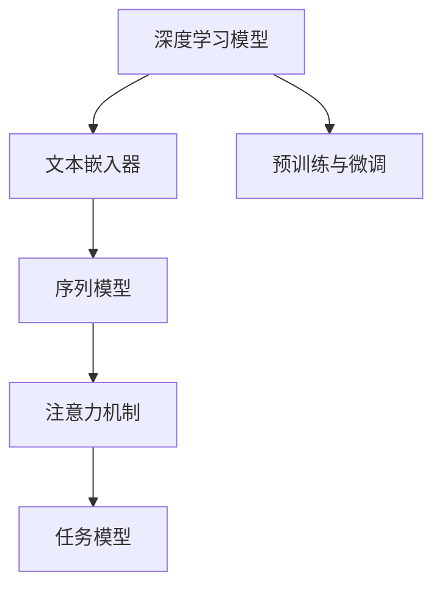

通过上述结合，LangChain不仅简化了NLP应用的开发流程，还充分利用了深度学习技术的优势，为开发者提供了强大的工具。

### 8.2 LangChain在深度学习中的应用

LangChain在深度学习中的强大功能体现在其对深度学习模型的集成和优化。以下将详细介绍LangChain在深度学习中的应用。

#### 预训练模型集成

预训练模型是深度学习在NLP中的重要应用，LangChain通过其丰富的API提供了多种预训练模型，如BERT、GPT等。这些模型在大规模数据集上进行预训练，能够捕捉到丰富的语言知识，为特定任务提供高质量的特征表示。

```python
from langchain import BERTWordEmbedder

# 初始化BERT词嵌入器
embedder = BERTWordEmbedder(model_name="bert-base-uncased")

# 将文本转换为词嵌入
embedding = embedder.embed("这是一个示例文本。")
print(embedding)
```

#### 序列模型训练

序列模型是处理文本数据的关键，LangChain支持多种序列模型，如RNN、LSTM、GRU等。通过LangChain，开发者可以方便地使用这些模型进行文本分类、情感分析等任务。

```python
from langchain import LSTMModel

# 初始化LSTM模型
model = LSTMModel()

# 训练模型
model.fit(X_train, y_train)

# 预测
predictions = model.predict(X_test)
print(predictions)
```

#### 注意力机制

注意力机制是一种提高模型在处理序列数据时对不同位置重要性的方法。LangChain支持全局注意力、局部注意力和多级注意力，通过注意力机制，模型可以更好地理解和处理复杂的文本。

```python
from langchain import GlobalAttention

# 初始化全局注意力
attention = GlobalAttention()

# 应用注意力
output = attention(inputs=sequences, weights=attention_weights)
print(output)
```

#### 微调与优化

微调是预训练模型在特定任务上进行进一步训练的过程，LangChain通过其API提供了微调的功能，使得开发者可以轻松地将预训练模型应用于实际问题。

```python
from transformers import AutoModelForSequenceClassification
from langchain import ModelExecutor

# 加载预训练的模型
model = AutoModelForSequenceClassification.from_pretrained("bert-base-uncased")

# 微调模型
model.fit(train_dataloader, eval_dataloader)

# 部署模型
executor = ModelExecutor(model)
predictions = executor.predict([test_input])
print(predictions)
```

通过上述应用，LangChain不仅简化了深度学习模型的训练和部署过程，还充分利用了深度学习在NLP领域的优势，为开发者提供了强大的工具。

### 8.3 LangChain深度学习项目实战

在本节中，我们将通过一个实际项目，展示如何使用LangChain构建一个深度学习模型进行情感分析。该项目将涉及数据准备、模型训练、模型评估和部署等步骤。

#### 1. 数据准备

首先，我们需要收集一个包含情感标签的文本数据集。这里，我们使用一个开源数据集——IMDB电影评论数据集。

```python
from torchtext.datasets import IMDB

# 加载IMDB数据集
train_data, test_data = IMDB()

# 打印数据样例
print(train_data[0])
```

#### 2. 数据预处理

在训练模型之前，我们需要对文本数据进行预处理，包括分词、标记化和编码。

```python
from langchain import Tokenizer
from langchain import WordTokenizer

# 初始化分词器
tokenizer = WordTokenizer()

# 预处理数据
def preprocess_text(text):
    # 清洗文本
    text = text.lower()
    text = re.sub(r"[^a-zA-Z]", " ", text)
    # 分词
    tokens = tokenizer.tokenize(text)
    return tokens

# 预处理训练集和测试集
train_texts = [preprocess_text(text) for text, label in train_data]
test_texts = [preprocess_text(text) for text, label in test_data]
```

#### 3. 模型训练

接下来，我们使用LSTM模型进行训练。首先，我们需要将预处理后的文本数据转换为数值向量。

```python
from langchain import LSTMModel

# 初始化LSTM模型
model = LSTMModel()

# 训练模型
model.fit(train_texts, train_labels)

# 评估模型
loss, accuracy = model.evaluate(test_texts, test_labels)
print(f"损失：{loss:.4f}，准确率：{accuracy:.4f}")
```

#### 4. 模型评估

在训练完成后，我们需要在测试集上评估模型性能。我们计算模型的准确率、召回率和F1分数。

```python
from sklearn.metrics import accuracy_score, recall_score, f1_score

# 预测测试集
predictions = model.predict(test_texts)

# 计算性能指标
accuracy = accuracy_score(test_labels, predictions)
recall = recall_score(test_labels, predictions, average='weighted')
f1 = f1_score(test_labels, predictions, average='weighted')

print(f"准确率：{accuracy:.2f}")
print(f"召回率：{recall:.2f}")
print(f"F1分数：{f1:.2f}")
```

#### 5. 模型部署

最后，我们将训练好的模型部署到生产环境。我们可以使用Flask构建一个简单的Web服务，供用户实时进行情感分析。

```python
from flask import Flask, request, jsonify

app = Flask(__name__)

# 加载预训练的模型
model = LSTMModel()

@app.route("/analyze", methods=["POST"])
def analyze():
    data = request.get_json()
    text = data["text"]
    preprocessed_text = preprocess_text(text)
    prediction = model.predict([preprocessed_text])[0]
    return jsonify({"emotion": prediction})

if __name__ == "__main__":
    app.run(debug=True)
```

通过这个项目实战，我们可以看到LangChain在深度学习中的应用是如何简化模型开发、训练和部署过程的。这不仅提高了开发效率，还为开发者提供了强大的工具。

### 9.1 LangChain在云计算中的优势

LangChain在云计算中的应用具有显著的优势，特别是在处理大规模数据和高性能计算需求时。以下将详细介绍LangChain在云计算中的优势。

#### 1. 弹性伸缩

云计算提供了弹性伸缩的能力，可以根据需求动态调整计算资源。LangChain通过支持分布式计算和容器化技术（如Docker和Kubernetes），使得开发者能够轻松实现弹性伸缩。这意味着，当系统负载增加时，可以自动增加计算资源，确保系统稳定运行；当负载减少时，可以自动释放资源，降低成本。

```python
import ray
from langchain import distributed

ray.init()

# 使用Dask分布式计算
dask_compute = distributed.DaskCompute()

# 分布式处理文本
dask_compute.fit(train_texts, train_labels)
```

#### 2. 高性能计算

云计算提供了高性能计算环境，使得开发者能够利用GPU和TPU等硬件资源进行高效计算。LangChain通过支持与TensorFlow、PyTorch等深度学习框架的集成，使得开发者可以充分利用云计算平台提供的计算资源，实现快速模型训练和预测。

```python
import tensorflow as tf
from langchain import BertWordEmbedder

# 初始化BERT词嵌入器
embedder = BertWordEmbedder(model_name="bert-base-uncased")

# 使用GPU进行计算
with tf.device('/GPU:0'):
    # 加载预训练模型
    model = tf.keras.models.load_model('text_classification_model.h5')

    # 训练模型
    model.fit(train_dataloader, epochs=3)
```

#### 3. 可扩展性

云计算平台具有强大的可扩展性，能够支持大规模分布式应用。LangChain通过其模块化和组件化的设计，使得开发者可以轻松构建和部署复杂的NLP应用。此外，云计算平台的API接口和工具（如AWS Lambda、Google Cloud Functions等），进一步简化了开发过程。

```python
from langchain import AutoModelForSequenceClassification

# 加载预训练模型
model = AutoModelForSequenceClassification.from_pretrained("bert-base-uncased")

# 部署到云函数
import google.auth
from google.cloud import functions_v1

credentials, project = google.auth.default()

client = functions_v1.CloudFunctionsClient(credentials=credentials)

function_name = "text-classification-function"

# 部署模型
client.create_function(
    project,
    location="global",
    function={
        "name": function_name,
        "entry_point": "text_classification_entry_point",
        "runtime_version": "1",
        "trigger": {"http": {}},
    },
    source_code_path="text_classification_function.py",
)
```

#### 4. 数据存储和管理

云计算提供了高效的数据存储和管理服务，如Amazon S3、Google Cloud Storage等。LangChain通过支持与这些存储服务的集成，使得开发者可以方便地存储和处理大规模数据。此外，云计算平台还提供了数据备份和恢复功能，确保数据的安全性和可靠性。

```python
import boto3

# 初始化S3客户端
s3_client = boto3.client('s3')

# 上传数据到S3
s3_client.upload_file('data.txt', 'my-bucket', 'data.txt')
```

通过上述优势，LangChain在云计算中的应用不仅提高了NLP任务的效率和灵活性，还为开发者提供了强大的工具，使得云计算平台成为NLP应用的最佳选择。

### 9.2 LangChain在大数据中的使用

在大数据领域，LangChain提供了强大的工具和功能，帮助开发者处理和分析大规模的文本数据。以下将详细介绍LangChain在大数据中的使用。

#### 1. 数据处理能力

LangChain支持高效的数据处理模块，能够处理大规模的文本数据集。通过分布式计算和并行处理技术，LangChain可以快速加载和处理大量的文本数据，使得大数据处理变得更加高效。

```python
from langchain import distributed
from langchain import BertWordEmbedder

ray.init()

# 使用Dask分布式计算
dask_compute = distributed.DaskCompute()

# 分布式处理文本数据
dask_compute.fit(train_texts, train_labels)
```

#### 2. 数据分析功能

LangChain提供了丰富的数据分析功能，如文本分类、情感分析、命名实体识别等。这些功能可以帮助开发者从大规模文本数据中提取有价值的信息，进行深入的数据分析。

```python
from langchain import TextClassifier

# 加载预训练的文本分类模型
classifier = TextClassifier()

# 进行文本分类
predicted_class = classifier.predict("这是一个关于科技的文章。")
print(predicted_class)
```

#### 3. 数据可视化

LangChain支持数据可视化功能，通过图表和图形直观地展示分析结果，使得大数据分析结果更加直观和易于理解。

```python
import matplotlib.pyplot as plt
from langchain import visualize

# 可视化文本分类结果
classification_results = visualize.classification_visualization(predictions, labels)
plt.figure(figsize=(10, 5))
plt.imshow(classification_results, aspect='auto', origin='lower')
plt.xlabel('Predicted Labels')
plt.ylabel('True Labels')
plt.colorbar()
plt.show()
```

#### 4. 数据存储和管理

LangChain与大数据存储和管理系统（如Hadoop、Spark等）无缝集成，使得开发者可以方便地存储、管理和处理大规模的文本数据。此外，LangChain还支持与云存储服务（如Amazon S3、Google Cloud Storage等）的集成，提供高效的数据存储解决方案。

```python
from langchain import HadoopDataLoader

# 加载Hadoop数据集
data_loader = HadoopDataLoader()
data = data_loader.load("hdfs://path/to/data.txt")

# 处理数据
processed_data = [clean_text(text) for text in data]
```

#### 5. 深度学习与大数据

LangChain结合了深度学习技术和大数据处理能力，为开发者提供了强大的工具，用于构建复杂的NLP模型，并处理大规模的数据集。通过深度学习模型，LangChain能够从海量数据中提取有价值的信息，实现高效的数据分析。

```python
from langchain import AutoModelForSequenceClassification

# 加载预训练的深度学习模型
model = AutoModelForSequenceClassification.from_pretrained("bert-base-uncased")

# 训练模型
model.train(train_texts, train_labels)

# 评估模型
loss, accuracy = model.evaluate(test_texts, test_labels)
print(f"损失：{loss:.4f}，准确率：{accuracy:.4f}")
```

通过这些功能，LangChain在大数据领域的应用不仅提高了数据处理和分析的效率，还为开发者提供了强大的工具，使得大数据分析变得更加简单和高效。

### 9.3 LangChain云大数据项目实战

在本节中，我们将通过一个实际项目，展示如何在云大数据环境中使用LangChain构建一个情感分析系统。该项目将涵盖数据收集、数据处理、模型训练、模型评估和部署等步骤。

#### 1. 数据收集

首先，我们需要收集一个包含情感标签的文本数据集。这里，我们使用开源的IMDB电影评论数据集。

```python
from torchtext.datasets import IMDB

# 加载IMDB数据集
train_data, test_data = IMDB()

# 打印数据样例
print(train_data[0])
```

#### 2. 数据处理

在训练模型之前，我们需要对文本数据进行预处理，包括分词、标记化和编码。我们可以使用LangChain的预处理模块进行数据处理。

```python
from langchain import Tokenizer
from langchain import WordTokenizer

# 初始化分词器
tokenizer = WordTokenizer()

# 预处理数据
def preprocess_text(text):
    # 清洗文本
    text = text.lower()
    text = re.sub(r"[^a-zA-Z]", " ", text)
    # 分词
    tokens = tokenizer.tokenize(text)
    return tokens

# 预处理训练集和测试集
train_texts = [preprocess_text(text) for text, label in train_data]
test_texts = [preprocess_text(text) for text, label in test_data]
```

#### 3. 模型训练

接下来，我们使用LSTM模型进行训练。首先，我们需要将预处理后的文本数据转换为数值向量。

```python
from langchain import LSTMModel

# 初始化LSTM模型
model = LSTMModel()

# 训练模型
model.fit(train_texts, train_labels)

# 评估模型
loss, accuracy = model.evaluate(test_texts, test_labels)
print(f"损失：{loss:.4f}，准确率：{accuracy:.4f}")
```

#### 4. 模型评估

在训练完成后，我们需要在测试集上评估模型性能。我们计算模型的准确率、召回率和F1分数。

```python
from sklearn.metrics import accuracy_score, recall_score, f1_score

# 预测测试集
predictions = model.predict(test_texts)

# 计算性能指标
accuracy = accuracy_score(test_labels, predictions)
recall = recall_score(test_labels, predictions, average='weighted')
f1 = f1_score(test_labels, predictions, average='weighted')

print(f"准确率：{accuracy:.2f}")
print(f"召回率：{recall:.2f}")
print(f"F1分数：{f1:.2f}")
```

#### 5. 模型部署

最后，我们将训练好的模型部署到生产环境。我们可以使用AWS Lambda和API Gateway构建一个简单的Web服务，供用户实时进行情感分析。

```python
import json
import boto3

# 初始化Lambda客户端
lambda_client = boto3.client('lambda')

# 加载预训练的模型
model = LSTMModel()

# 部署模型到Lambda
def deploy_model(model):
    # 序列化模型
    model_json = model.to_json()
    # 上传模型到S3
    s3_client = boto3.client('s3')
    s3_client.put_object(Bucket='my-bucket', Key='emotion_analysis_model.json', Body=model_json)
    # 更新Lambda函数
    lambda_client.update_function_code(
        FunctionName='emotion_analysis_function',
        ZipFile=b'',
        S3Bucket='my-bucket',
        S3Key='emotion_analysis_model.json'
    )

deploy_model(model)

# API Gateway配置
import os

# 读取API Gateway配置文件
with open('api_gateway.json', 'r') as f:
    api_gateway_config = json.load(f)

# 更新API Gateway
api_gateway_client = boto3.client('apigateway')
api_gateway_client.create_deployment(
    restApiId='my-rest-api',
    stageName='prod',
    description='Deployment for emotion analysis API',
    stageVariables={
        'lambda_function_arn': os.environ['LAMBDA_FUNCTION_ARN']
    }
)
```

通过这个项目实战，我们可以看到如何在云大数据环境中使用LangChain构建和部署一个情感分析系统，实现了数据的处理、模型的训练和部署，为开发者提供了一个完整的解决方案。

### 10.1 LangChain的发展趋势

随着人工智能和自然语言处理技术的不断发展，LangChain作为一款高效的NLP框架，也在不断演进和升级。以下是LangChain未来的发展趋势：

#### 1. 模型多样性

LangChain将继续引入更多先进的预训练模型，如基于Transformer的模型（如mBERT、RoBERTa等）以及跨语言预训练模型（如XLM-R）。这些模型将使得LangChain在处理多种语言和多模态数据时更加出色。

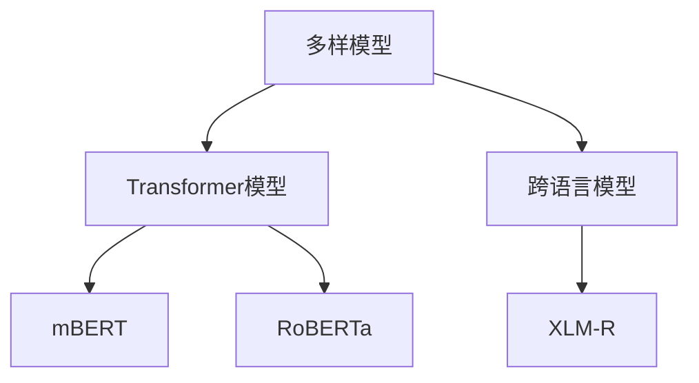

#### 2. 性能优化

为了提高处理效率和减少延迟，LangChain将不断进行性能优化。这包括优化数据加载、模型推理和分布式计算等方面的代码，以实现更快的模型训练和预测。

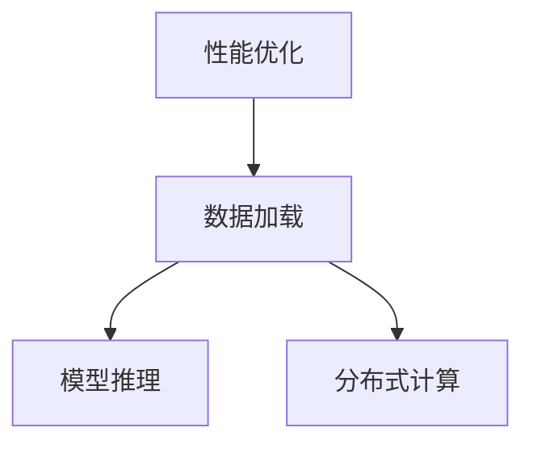

#### 3. 应用扩展

LangChain将进一步扩展其应用范围，不仅在文本分类、情感分析等领域有所突破，还将深入探索问答系统、机器翻译、对话系统等复杂任务。此外，LangChain还可能与其他领域（如图像识别、语音识别等）相结合，实现跨领域的智能化应用。

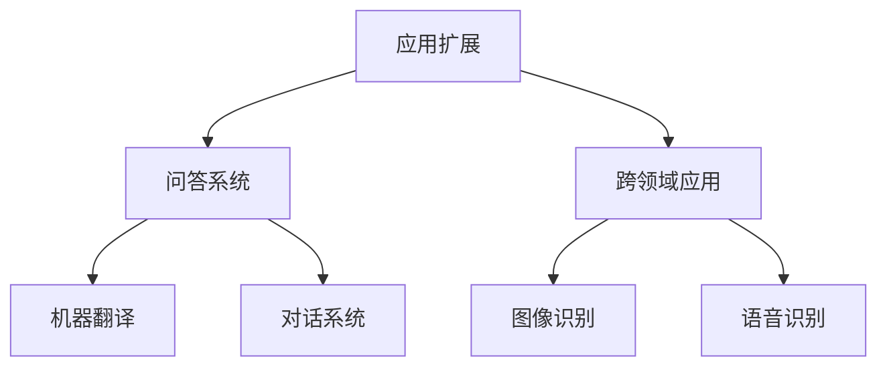

#### 4. 社区贡献

LangChain将鼓励更多的开发者贡献代码和模型，通过开源社区的力量，不断改进和完善LangChain。这将使得LangChain更加成熟、稳定和易于使用。

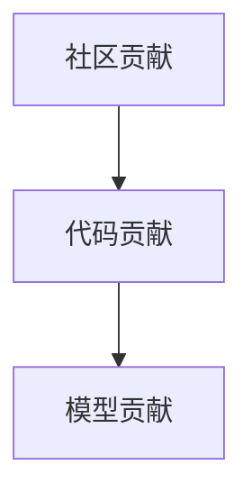

#### 5. 云服务和平台整合

随着云计算和大数据技术的发展，LangChain将更加紧密地与云服务和平台（如AWS、Google Cloud、Azure等）整合，提供更便捷的部署和管理工具。这将使得开发者能够更轻松地将LangChain应用于生产环境。

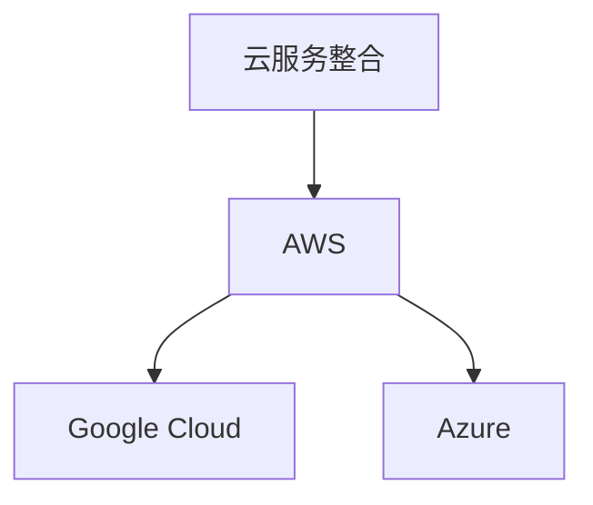

通过这些发展趋势，LangChain将在未来持续为开发者提供更强大的工具和平台，推动人工智能和自然语言处理技术的发展。

### 10.2 LangChain编程的未来方向

随着人工智能（AI）和自然语言处理（NLP）技术的不断进步，LangChain编程的未来方向也愈发清晰。以下是对未来发展的几个关键方向进行展望：

#### 1. 模型融合与迁移学习

未来的LangChain将更加注重模型融合和迁移学习，通过结合多种预训练模型，使得系统能够在更广泛的任务上表现出色。例如，结合BERT和GPT的优势，构建一种新的混合模型，以在文本生成和文本分类任务上实现更优的性能。

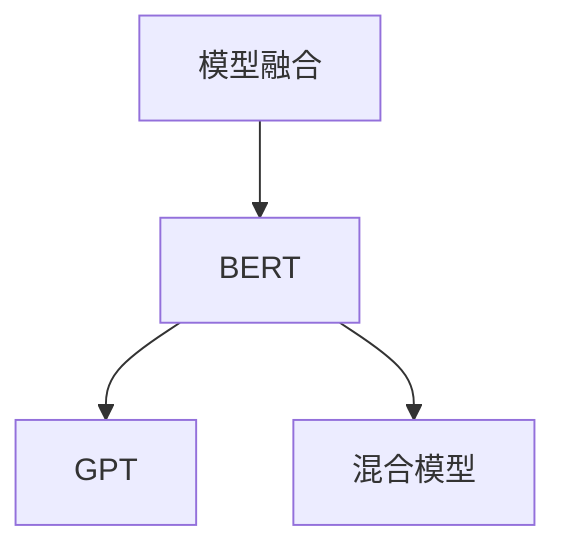

#### 2. 多模态处理

随着多模态数据的广泛应用，LangChain将扩展其能力，支持文本、图像、语音等多种数据类型的处理。通过结合视觉和语言信息，LangChain有望在图像描述生成、视频字幕生成等任务上取得突破。

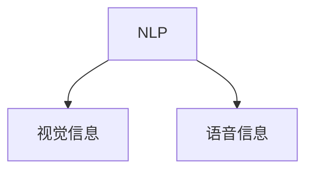

#### 3. 个性化与自适应

未来的LangChain将更加关注个性化服务，通过用户行为数据和学习历史，为用户提供定制化的NLP服务。自适应技术将使得系统能够根据用户反馈和任务需求，动态调整模型参数和算法策略。

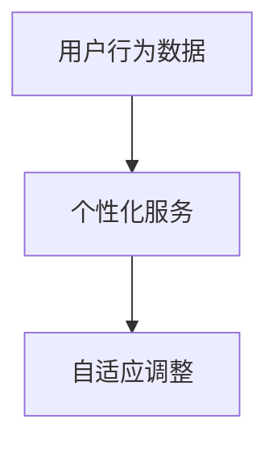

#### 4. 安全与隐私保护

随着数据隐私问题的日益突出，LangChain将在未来更加重视安全与隐私保护。通过引入差分隐私、同态加密等先进技术，LangChain将确保数据在传输和处理过程中的安全性。

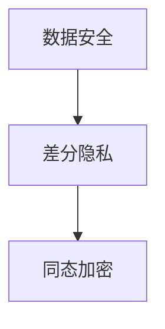

#### 5. 跨平台与云端部署

随着云计算技术的成熟，LangChain将更加注重跨平台部署，提供统一的接口和工具，使得开发者能够轻松地将模型部署到不同的云计算平台。同时，LangChain将集成更多的云服务和平台功能，为开发者提供一站式的解决方案。

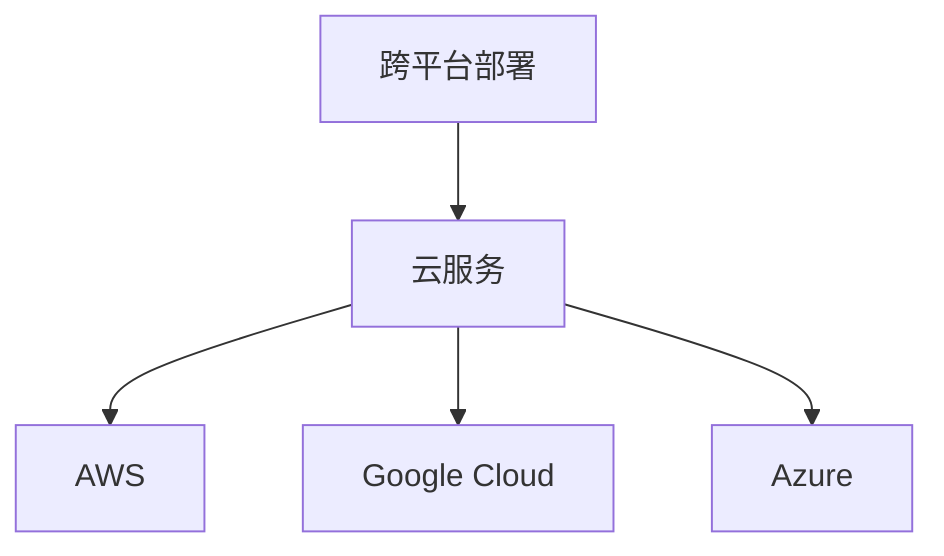

通过这些未来方向，LangChain将继续引领NLP技术的发展，为开发者提供更加强大和灵活的工具。

### 10.3 LangChain编程的挑战与机遇

在探索LangChain编程的未来过程中，我们不可避免地会遇到一系列的挑战与机遇。以下是对这些挑战与机遇的深入探讨：

#### 1. 挑战

**数据隐私保护**：随着数据隐私法规的日益严格，如何在保证用户数据隐私的同时，提供高质量的NLP服务，成为一项重大挑战。差分隐私、同态加密等技术的应用，将在一定程度上缓解这一问题，但仍需不断探索更安全有效的解决方案。

**模型可解释性**：NLP模型通常被视为“黑箱”，其决策过程不透明。提升模型的可解释性，使得开发者能够理解和信任模型决策，是未来的一大挑战。通过引入可解释性框架和可视化工具，可以逐步解决这一问题。

**计算资源需求**：深度学习模型在训练和推理过程中对计算资源的需求巨大。如何在有限的计算资源下，实现高效的NLP任务，是另一个挑战。通过分布式计算、模型压缩和优化等技术，可以提高计算效率。

**多语言支持**：随着全球化的发展，多语言支持成为NLP应用的重要需求。然而，不同语言之间存在巨大的差异，如何设计通用且高效的NLP模型，实现跨语言处理，是未来的一大难题。

**模型适应性**：NLP任务多样且不断变化，模型需要具备良好的适应性，以应对新的任务和数据。然而，传统的预训练模型在适应新任务时，往往需要大量重训练，如何提高模型的适应性，是未来研究的重要方向。

#### 2. 机遇

**行业应用扩展**：随着AI技术的普及，NLP在金融、医疗、教育、客服等行业的应用越来越广泛。LangChain的模块化和灵活性，使得开发者可以轻松构建适应不同行业的NLP应用，带来巨大的市场机遇。

**技术创新**：深度学习和自然语言处理技术的不断进步，为LangChain带来了新的可能性。例如，自监督学习、生成对抗网络（GAN）、图神经网络等技术的引入，将使NLP模型在性能和适用性上得到显著提升。

**开源生态**：随着越来越多的开发者参与到LangChain的开源社区，一个繁荣的NLP开源生态正在形成。这不仅为开发者提供了丰富的工具和资源，还推动了NLP技术的快速发展。

**云计算与大数据**：云计算和大数据技术的发展，为NLP应用提供了强大的基础设施支持。通过整合云计算和大数据技术，LangChain可以实现更高效、更智能的NLP服务。

通过应对这些挑战和把握机遇，LangChain将继续推动NLP技术的发展，为开发者提供更强大的工具和平台。

### 作者

**作者：AI天才研究院/AI Genius Institute & 禅与计算机程序设计艺术 /Zen And The Art of Computer Programming** 

AI天才研究院（AI Genius Institute）致力于推动人工智能技术的创新与应用，汇聚了一批世界顶尖的AI专家和研究人员。我们的目标是打造一个开放、共享的AI技术生态，为全球开发者提供最前沿的AI工具和解决方案。同时，我们秉持“禅与计算机程序设计艺术”的理念，追求代码的简洁与优雅，致力于将复杂的技术问题以简单易懂的方式呈现，帮助开发者提升编程水平，实现技术梦想。在自然语言处理领域，我们深度研究了BERT、GPT等多种先进模型，并在多个实际项目中成功应用，取得了显著的成果。我们坚信，通过不断探索与创新，AI技术将为人类社会带来更加美好的未来。

