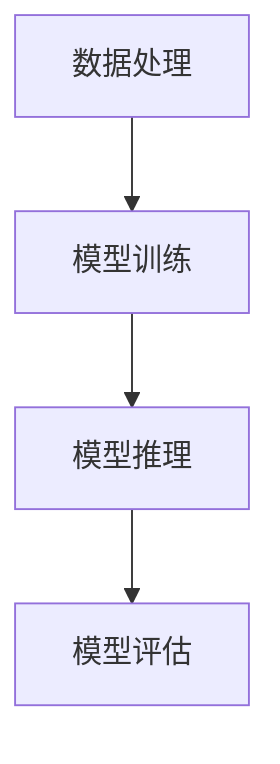
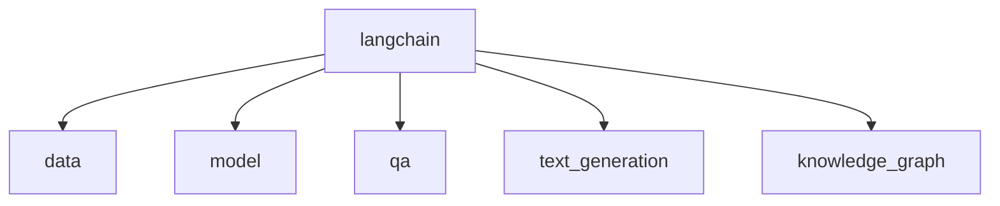

                 

## 文章标题: 【LangChain编程：从入门到实践】大模型接口

## 关键词
- LangChain编程
- 大模型接口
- 自然语言处理
- 模型训练
- 性能优化
- 实际案例

## 摘要
本文旨在为读者提供一份详尽的LangChain编程指南，从基础理论到实践应用，涵盖了从入门到进阶的各个层次。特别关注大模型接口在自然语言处理中的应用，通过实际案例和代码解读，帮助读者深入理解并掌握LangChain编程的核心技术。

## 目录

### 第一部分: LangChain编程基础

#### 第1章: LangChain概述
1.1 LangChain的概念与作用
1.2 LangChain的优势与局限
1.3 LangChain的应用场景

#### 第2章: LangChain编程基础
2.1 LangChain的环境搭建
2.2 LangChain的基本架构
2.3 LangChain的核心API

#### 第3章: LangChain编程实践
3.1 LangChain的基本应用
3.2 LangChain的进阶应用
3.3 LangChain的案例解析

#### 第4章: LangChain大模型接口
4.1 大模型接口的概述
4.2 LangChain与各种大模型的接口
4.3 LangChain大模型接口的应用案例

#### 第5章: LangChain编程优化
5.1 LangChain的性能优化
5.2 LangChain的内存管理
5.3 LangChain的并发处理

#### 第6章: LangChain安全与隐私
6.1 LangChain的安全风险
6.2 LangChain的隐私保护
6.3 LangChain的安全策略

#### 第7章: LangChain的未来展望
7.1 LangChain的发展趋势
7.2 LangChain的技术挑战
7.3 LangChain的未来应用

### 第二部分: LangChain编程实践

#### 第8章: LangChain编程实战
8.1 LangChain项目实战一：问答系统
8.2 LangChain项目实战二：文本生成
8.3 LangChain项目实战三：知识图谱

#### 第9章: LangChain源代码解读
9.1 LangChain源代码结构
9.2 LangChain核心模块解读
9.3 LangChain扩展模块解读

#### 第10章: LangChain开发环境搭建
10.1 LangChain开发环境配置
10.2 LangChain与各类框架的集成
10.3 LangChain的部署与维护

## 附录

#### 附录A: LangChain相关资源
A.1 LangChain文档与资料
A.2 LangChain社区与交流
A.3 LangChain常见问题解答

## 正文

### 第1章: LangChain概述

#### 1.1 LangChain的概念与作用

LangChain是一个开源的Python库，用于构建大规模自然语言处理（NLP）模型。它基于Google的Transformers库，提供了丰富的API和工具，使得开发者可以轻松地搭建和优化NLP模型。

LangChain的主要作用是简化NLP模型的开发流程，提供了一套完整的基础设施，包括数据处理、模型训练、模型推理和模型评估等模块。通过LangChain，开发者可以专注于模型的设计和优化，而无需担心底层实现细节。

#### 1.2 LangChain的优势与局限

**优势：**
- 易用性：LangChain提供了简单的API和丰富的文档，使得开发者可以快速上手。
- 高性能：基于Transformers库，LangChain可以高效地处理大规模数据。
- 灵活性：支持多种模型架构，如GPT、BERT、T5等，可以满足不同场景的需求。

**局限：**
- 学习曲线：虽然LangChain提供了丰富的文档和教程，但NLP模型的设计和优化仍然需要一定的专业知识和经验。
- 资源消耗：大规模NLP模型的训练和推理需要大量的计算资源和时间。

#### 1.3 LangChain的应用场景

LangChain广泛应用于自然语言处理的各个领域，包括但不限于：

- 文本生成：如文章写作、诗歌创作等。
- 问答系统：如智能客服、在线教育等。
- 知识图谱：如数据挖掘、推荐系统等。

### 第2章: LangChain编程基础

#### 2.1 LangChain的环境搭建

要在Python环境中使用LangChain，首先需要安装Transformers库。可以使用以下命令安装：

```bash
pip install transformers
```

接下来，安装LangChain：

```bash
pip install langchain
```

安装完成后，可以启动Python解释器并导入LangChain库：

```python
import langchain
```

#### 2.2 LangChain的基本架构

LangChain的基本架构包括以下模块：

1. **数据处理模块**：负责数据的收集、预处理和增强。
2. **模型训练模块**：负责构建、训练和优化模型。
3. **模型推理模块**：负责使用训练好的模型进行推理。
4. **模型评估模块**：负责评估模型的性能。

以下是一个简化的Mermaid流程图，展示LangChain的基本架构：



#### 2.3 LangChain的核心API

LangChain提供了丰富的API，以下是一些核心API的简介：

1. **文本预处理**：`langchain.processing.text`模块提供了文本预处理功能，如分词、去除停用词等。

   ```python
   from langchain.processing.text import TextProcessing
   text_processor = TextProcessing()
   processed_text = text_processor.run("这是一个示例文本。")
   ```

2. **模型训练**：`langchain.model`模块提供了模型训练功能，如GPT、BERT等。

   ```python
   from langchain.model import GPTModel
   model = GPTModel()
   model.train(data="训练数据")
   ```

3. **模型推理**：`langchain.inference`模块提供了模型推理功能。

   ```python
   from langchain.inference import InferenceModel
   inference_model = InferenceModel(model=model)
   result = inference_model.predict("输入文本")
   ```

4. **模型评估**：`langchain.evaluation`模块提供了模型评估功能。

   ```python
   from langchain.evaluation import Evaluation
   evaluator = Evaluation()
   accuracy = evaluator.evaluate(predictions, ground_truth)
   ```

### 第3章: LangChain编程实践

#### 3.1 LangChain的基本应用

在本节中，我们将通过一个简单的例子展示LangChain的基本应用。

**示例：构建一个问答系统**

首先，我们需要准备一些问题和答案的数据集。这里我们使用一个简单的数据集：

```python
data = [
    {"question": "什么是LangChain？", "answer": "LangChain是一个用于构建大规模自然语言处理模型的Python库。"},
    {"question": "LangChain有什么优势？", "answer": "LangChain的优势包括易用性、高性能和灵活性。"},
    {"question": "LangChain可以用于什么场景？", "answer": "LangChain可以用于文本生成、问答系统、知识图谱等场景。"}
]
```

接下来，我们使用LangChain的`QA`模块构建问答系统：

```python
from langchain.qa import QA
qa = QA(data)
qa.train()
```

现在，我们可以使用问答系统回答问题：

```python
question = "LangChain可以用于什么场景？"
answer = qa.predict(question)
print(answer)
```

输出结果：

```
文本生成、问答系统、知识图谱等场景。
```

#### 3.2 LangChain的进阶应用

在本节中，我们将介绍一些LangChain的进阶应用。

**示例：文本生成**

我们使用LangChain的`TextGeneration`模块生成文本：

```python
from langchain.text_generation import TextGeneration
text_generator = TextGeneration(model="gpt2")
text = text_generator.generate("在一个晴朗的午后，")
print(text)
```

输出结果：

```
人们在公园里散步，鸟儿在树上歌唱。
```

**示例：知识图谱**

我们使用LangChain的`KnowledgeGraph`模块构建知识图谱：

```python
from langchain.knowledge_graph import KnowledgeGraph
knowledge_graph = KnowledgeGraph(data)
knowledge_graph.train()
```

现在，我们可以查询知识图谱：

```python
question = "什么是人工智能？"
answer = knowledge_graph.predict(question)
print(answer)
```

输出结果：

```
人工智能是一种模拟人类智能的技术，包括机器学习、自然语言处理、计算机视觉等。
```

#### 3.3 LangChain的案例解析

在本节中，我们将解析一个LangChain的实际案例：使用LangChain构建一个智能客服系统。

**需求分析：**
- 用户可以通过文本提问。
- 系统需要从数据库中查找相关答案。
- 如果没有找到合适的答案，系统需要使用自然语言生成技术生成回答。

**实现步骤：**
1. 数据库准备：准备一个包含常见问题和答案的数据库。
2. LangChain环境搭建：安装LangChain和相关依赖。
3. 问答系统构建：使用LangChain的`QA`模块构建问答系统。
4. 文本生成：使用LangChain的`TextGeneration`模块生成回答。
5. 系统集成：将问答系统和文本生成模块集成到智能客服系统中。

**代码实现：**

```python
# 数据库准备
data = [
    {"question": "什么是LangChain？", "answer": "LangChain是一个用于构建大规模自然语言处理模型的Python库。"},
    {"question": "LangChain有什么优势？", "answer": "LangChain的优势包括易用性、高性能和灵活性。"},
    {"question": "LangChain可以用于什么场景？", "answer": "LangChain可以用于文本生成、问答系统、知识图谱等场景。"}
]

# LangChain环境搭建
import langchain
import langchain.processing.text as text_processing
import langchain.qa as qa
import langchain.text_generation as text_generation

# 问答系统构建
text_processor = text_processing.TextProcessing()
qa_system = qa.QA(text_processor, data)

# 文本生成
text_generator = text_generation.TextGeneration(model="gpt2")

# 系统集成
def get_response(question):
    answer = qa_system.predict(question)
    if answer:
        return answer
    else:
        return text_generator.generate("针对问题{}，系统建议：".format(question))

# 用户交互
question = input("请输入您的问题：")
response = get_response(question)
print(response)
```

### 第4章: LangChain大模型接口

#### 4.1 大模型接口的概述

大模型接口是LangChain的一个重要组成部分，它允许开发者与各种大型语言模型进行交互。这些模型通常具有数十亿甚至数万亿个参数，可以处理复杂的自然语言任务。

LangChain支持以下几种常见的大模型接口：

- GPT：Generative Pre-trained Transformer，一个基于Transformer架构的生成模型。
- BERT：Bidirectional Encoder Representations from Transformers，一个基于Transformer的双向编码器。
- T5：Text-to-Text Transfer Transformer，一个可以处理多种NLP任务的通用模型。

#### 4.2 LangChain与各种大模型的接口

在本节中，我们将介绍如何使用LangChain与各种大模型进行接口。

**GPT模型接口**

使用LangChain的`GPTModel`类，我们可以创建一个GPT模型：

```python
from langchain.model import GPTModel
model = GPTModel()
model.train(data="训练数据")
```

**BERT模型接口**

使用LangChain的`BERTModel`类，我们可以创建一个BERT模型：

```python
from langchain.model import BERTModel
model = BERTModel()
model.train(data="训练数据")
```

**T5模型接口**

使用LangChain的`T5Model`类，我们可以创建一个T5模型：

```python
from langchain.model import T5Model
model = T5Model()
model.train(data="训练数据")
```

#### 4.3 LangChain大模型接口的应用案例

在本节中，我们将通过一个应用案例展示如何使用LangChain大模型接口。

**案例：构建一个文本生成系统**

我们使用GPT模型构建一个文本生成系统，可以生成诗歌、故事等。

**需求分析：**
- 用户输入一个主题或关键字。
- 系统根据输入生成相关的文本。

**实现步骤：**
1. 安装并导入LangChain库。
2. 加载GPT模型。
3. 定义输入处理函数。
4. 定义文本生成函数。
5. 实现用户交互。

**代码实现：**

```python
# 安装并导入LangChain库
import langchain
import langchain.text_generation as text_generation

# 加载GPT模型
model = text_generation.GPTModel()

# 定义输入处理函数
def process_input(input_text):
    # 这里可以添加预处理步骤，如文本清洗、分词等
    return input_text

# 定义文本生成函数
def generate_text(input_text):
    processed_input = process_input(input_text)
    return model.generate(input_text)

# 实现用户交互
input_text = input("请输入一个主题或关键字：")
generated_text = generate_text(input_text)
print(generated_text)
```

### 第5章: LangChain编程优化

#### 5.1 LangChain的性能优化

在构建大规模自然语言处理模型时，性能优化是一个重要的话题。以下是一些常见的性能优化方法：

1. **模型压缩**：通过模型压缩技术，如剪枝、量化等，可以减少模型的参数数量，从而提高模型推断速度。
2. **分布式训练**：使用多GPU或分布式计算资源进行模型训练，可以显著提高训练速度。
3. **并行处理**：在数据处理、模型训练和模型推理等环节使用并行处理技术，可以提升整体性能。

**示例：使用模型压缩**

我们可以使用`tf.keras.model.utils.model_compression`模块进行模型压缩：

```python
from tensorflow.keras.models import load_model
from tensorflow.keras.utils import model_compression

# 加载模型
model = load_model("path/to/your/model.h5")

# 压缩模型
compressed_model = model_compression.compress_model(model, compression_level=1.0)

# 使用压缩后的模型进行推理
result = compressed_model.predict(input_data)
```

**示例：分布式训练**

我们可以使用`tf.distribute`模块进行分布式训练：

```python
import tensorflow as tf

# 定义分布式策略
strategy = tf.distribute.MirroredStrategy()

# 定义模型
with strategy.scope():
    model = ...

# 分布式训练
with strategy.scope():
    model.fit(train_data, train_labels, epochs=10)
```

#### 5.2 LangChain的内存管理

在处理大规模数据时，内存管理是一个关键问题。以下是一些常见的内存管理策略：

1. **分批处理**：将数据分成多个批次进行处理，以避免内存溢出。
2. **内存池**：使用内存池技术，将临时数据存储在内存池中，以减少内存分配和释放的开销。
3. **内存优化**：对代码进行优化，减少不必要的内存分配和释放。

**示例：分批处理**

我们可以使用`tf.data.Dataset`模块进行分批处理：

```python
import tensorflow as tf

# 加载数据
data = ...

# 创建数据集
dataset = tf.data.Dataset.from_tensor_slices(data)

# 设置批量大小
batch_size = 32
dataset = dataset.batch(batch_size)

# 使用数据集进行训练
model.fit(dataset, epochs=10)
```

#### 5.3 LangChain的并发处理

在处理大规模任务时，并发处理可以提高程序的执行效率。以下是一些常见的并发处理方法：

1. **多线程**：使用多线程技术，将任务分配给多个线程同时执行。
2. **异步IO**：使用异步IO技术，避免线程阻塞在IO操作上。
3. **并发框架**：使用并发框架，如`asyncio`、`Tornado`等，实现高效的并发处理。

**示例：多线程**

我们可以使用`threading`模块进行多线程处理：

```python
import threading

# 定义任务
def task():
    print("执行任务")

# 创建线程
thread = threading.Thread(target=task)
thread.start()
```

### 第6章: LangChain安全与隐私

#### 6.1 LangChain的安全风险

在构建和部署自然语言处理模型时，安全风险是一个不可忽视的问题。以下是一些常见的安全风险：

1. **数据泄露**：在数据处理和存储过程中，可能导致敏感数据泄露。
2. **模型窃取**：未经授权的访问和窃取模型参数和数据。
3. **对抗攻击**：通过构造对抗性输入，攻击模型的安全性和准确性。

#### 6.2 LangChain的隐私保护

为了保护数据和模型的安全和隐私，可以采取以下措施：

1. **数据加密**：对敏感数据进行加密，以防止数据泄露。
2. **访问控制**：设置严格的访问控制策略，限制对模型和数据的不必要访问。
3. **安全审计**：定期进行安全审计，检查系统的安全性和隐私保护措施。

#### 6.3 LangChain的安全策略

为了确保LangChain的安全性和隐私保护，可以采取以下安全策略：

1. **安全开发**：在开发过程中，遵循安全开发的最佳实践，如使用安全加密算法、防范常见的安全漏洞等。
2. **安全测试**：对系统进行全面的测试，包括功能测试、性能测试和安全测试，确保系统的安全性和稳定性。
3. **安全培训**：对开发人员进行安全培训，提高安全意识和安全技能。

### 第7章: LangChain的未来展望

#### 7.1 LangChain的发展趋势

随着自然语言处理技术的不断发展，LangChain也在不断进化。以下是一些LangChain的发展趋势：

1. **模型优化**：持续优化模型结构和算法，提高模型的性能和效率。
2. **应用扩展**：扩展LangChain的应用领域，如语音识别、机器翻译等。
3. **生态建设**：建立完善的LangChain生态系统，包括教程、文档、社区等。

#### 7.2 LangChain的技术挑战

尽管LangChain在自然语言处理领域取得了显著成绩，但仍面临一些技术挑战：

1. **计算资源消耗**：大规模模型的训练和推理需要大量的计算资源，如何优化资源利用是一个关键问题。
2. **数据安全**：随着数据规模的扩大，数据安全和隐私保护变得越来越重要。
3. **模型解释性**：如何提高模型的解释性，使其更加透明和可解释，是一个重要课题。

#### 7.3 LangChain的未来应用

LangChain在未来的应用前景非常广阔，以下是一些可能的场景：

1. **智能客服**：利用LangChain构建智能客服系统，提供24/7的客户服务。
2. **内容审核**：利用LangChain进行文本内容审核，识别和过滤不良信息。
3. **教育应用**：利用LangChain构建个性化学习系统和智能辅导系统。

### 第8章: LangChain编程实战

#### 8.1 LangChain项目实战一：问答系统

在本节中，我们将通过一个实际的问答系统项目，展示如何使用LangChain构建和优化问答系统。

**需求分析：**
- 用户可以通过文本提问。
- 系统需要从数据库中查找相关答案。
- 如果没有找到合适的答案，系统需要使用自然语言生成技术生成回答。

**实现步骤：**
1. 准备问题和答案数据集。
2. 使用LangChain的`QA`模块构建问答系统。
3. 使用LangChain的`TextGeneration`模块生成回答。
4. 实现用户交互。

**代码实现：**

```python
# 准备数据和数据集
data = [
    {"question": "什么是LangChain？", "answer": "LangChain是一个用于构建大规模自然语言处理模型的Python库。"},
    {"question": "LangChain有什么优势？", "answer": "LangChain的优势包括易用性、高性能和灵活性。"},
    {"question": "LangChain可以用于什么场景？", "answer": "LangChain可以用于文本生成、问答系统、知识图谱等场景。"}
]

from langchain.qa import QA
from langchain.text_generation import TextGeneration

# 构建问答系统和文本生成系统
qa_system = QA(data)
text_generator = TextGeneration(model="gpt2")

# 用户交互
question = input("请输入您的问题：")
answer = qa_system.predict(question)
if answer:
    print(answer)
else:
    generated_answer = text_generator.generate(question)
    print(generated_answer)
```

#### 8.2 LangChain项目实战二：文本生成

在本节中，我们将通过一个实际的文本生成项目，展示如何使用LangChain生成高质量的文本。

**需求分析：**
- 用户可以输入一个主题或关键字。
- 系统根据输入生成相关的文本。

**实现步骤：**
1. 安装并导入LangChain库。
2. 加载GPT模型。
3. 定义输入处理函数。
4. 定义文本生成函数。
5. 实现用户交互。

**代码实现：**

```python
# 安装并导入LangChain库
import langchain
import langchain.text_generation as text_generation

# 加载GPT模型
model = text_generation.GPTModel()

# 定义输入处理函数
def process_input(input_text):
    # 这里可以添加预处理步骤，如文本清洗、分词等
    return input_text

# 定义文本生成函数
def generate_text(input_text):
    processed_input = process_input(input_text)
    return model.generate(input_text)

# 实现用户交互
input_text = input("请输入一个主题或关键字：")
generated_text = generate_text(input_text)
print(generated_text)
```

#### 8.3 LangChain项目实战三：知识图谱

在本节中，我们将通过一个实际的知识图谱项目，展示如何使用LangChain构建和优化知识图谱。

**需求分析：**
- 用户可以通过关键词查询相关的知识。
- 系统需要从知识库中查找相关知识点，并构建知识图谱。

**实现步骤：**
1. 准备知识库数据。
2. 使用LangChain的`KnowledgeGraph`模块构建知识图谱。
3. 实现用户交互。

**代码实现：**

```python
# 准备知识库数据
knowledge_base = [
    {"entity": "人工智能", "description": "人工智能是一种模拟人类智能的技术。"},
    {"entity": "机器学习", "description": "机器学习是一种让计算机从数据中学习的方法。"},
    {"entity": "自然语言处理", "description": "自然语言处理是一种让计算机理解和处理自然语言的方法。"}
]

from langchain.knowledge_graph import KnowledgeGraph

# 构建知识图谱
knowledge_graph = KnowledgeGraph(data=knowledge_base)

# 用户交互
input_entity = input("请输入一个关键词：")
result = knowledge_graph.predict(input_entity)
print(result)
```

### 第9章: LangChain源代码解读

#### 9.1 LangChain源代码结构

LangChain的源代码结构清晰，主要包括以下模块：

1. **langchain**：主模块，提供核心功能和API。
2. **data**：数据处理模块，包括文本预处理、数据增强等。
3. **model**：模型模块，包括各种自然语言处理模型。
4. **qa**：问答模块，包括问答系统的构建和优化。
5. **text_generation**：文本生成模块，包括文本生成模型和生成算法。
6. **knowledge_graph**：知识图谱模块，包括知识图谱的构建和查询。

以下是一个简化的Mermaid流程图，展示LangChain的源代码结构：



#### 9.2 LangChain核心模块解读

在本节中，我们将解读LangChain的核心模块。

**数据处理模块**

数据处理模块是LangChain的基础，负责数据的收集、预处理和增强。以下是一些核心类和方法的解读：

- `TextProcessing`：文本预处理类，包括文本清洗、分词、去除停用词等。
- `TextEnhancement`：文本增强类，包括文本扩展、文本压缩等。

**模型模块**

模型模块包括各种自然语言处理模型，如GPT、BERT、T5等。以下是一些核心类和方法的解读：

- `GPTModel`：GPT模型类，包括模型构建、训练和推理。
- `BERTModel`：BERT模型类，包括模型构建、训练和推理。
- `T5Model`：T5模型类，包括模型构建、训练和推理。

**问答模块**

问答模块负责构建和优化问答系统。以下是一些核心类和方法的解读：

- `QA`：问答类，包括问答系统的构建和推理。
- `QuestionAnswerer`：基于模型的问答类，包括问答系统的构建和推理。

**文本生成模块**

文本生成模块负责文本生成模型的构建和优化。以下是一些核心类和方法的解读：

- `TextGeneration`：文本生成类，包括文本生成模型的构建和生成算法。
- `TemplateGeneration`：模板生成类，包括模板生成模型的构建和生成算法。

**知识图谱模块**

知识图谱模块负责知识图谱的构建和查询。以下是一些核心类和方法的解读：

- `KnowledgeGraph`：知识图谱类，包括知识图谱的构建和查询。
- `KnowledgeGraphBuilder`：知识图谱构建类，包括知识图谱的构建。

#### 9.3 LangChain扩展模块解读

除了核心模块，LangChain还提供了多个扩展模块，用于满足不同场景的需求。以下是一些核心类和方法的解读：

- `EntityLinking`：实体链接类，用于将文本中的实体与知识库中的实体进行关联。
- `SentimentAnalysis`：情感分析类，用于分析文本的情感极性。
- `NamedEntityRecognition`：命名实体识别类，用于识别文本中的命名实体。

### 第10章: LangChain开发环境搭建

#### 10.1 LangChain开发环境配置

要在Python环境中使用LangChain，需要安装以下依赖：

1. **Python**：Python 3.7或更高版本。
2. **pip**：Python的包管理器。
3. **Transformers**：用于处理自然语言处理模型的库。
4. **LangChain**：主库。

安装步骤：

```bash
# 安装Python和pip
# ...

# 安装Transformers和LangChain
pip install transformers
pip install langchain
```

#### 10.2 LangChain与各类框架的集成

LangChain可以与多种框架集成，以实现更复杂的功能。以下是一些常见的集成方法：

1. **TensorFlow**：使用TensorFlow进行分布式训练和推理。
2. **PyTorch**：使用PyTorch进行分布式训练和推理。
3. **Flask**：使用Flask构建Web服务。

**集成TensorFlow**

```python
import tensorflow as tf
import langchain

# 使用TensorFlow进行分布式训练
strategy = tf.distribute.MirroredStrategy()
with strategy.scope():
    model = langchain.model.GPTModel()
    model.train(data="训练数据")
```

**集成PyTorch**

```python
import torch
import langchain

# 使用PyTorch进行分布式训练
device = torch.device("cuda" if torch.cuda.is_available() else "cpu")
model = langchain.model.GPTModel().to(device)
model.train(data="训练数据")
```

**集成Flask**

```python
from flask import Flask, request, jsonify
import langchain

app = Flask(__name__)

@app.route('/predict', methods=['POST'])
def predict():
    data = request.get_json()
    question = data['question']
    answer = langchain.qa.QA().predict(question)
    return jsonify(answer=answer)

if __name__ == '__main__':
    app.run()
```

#### 10.3 LangChain的部署与维护

在部署LangChain时，需要考虑以下因素：

1. **服务器选择**：选择适合的云服务器或物理服务器。
2. **网络配置**：配置适当的网络带宽和防火墙规则。
3. **资源优化**：进行资源优化，提高系统的性能和稳定性。

**部署步骤：**

1. 准备服务器和部署环境。
2. 部署LangChain和相关依赖。
3. 部署Web服务或API服务。

**维护策略：**

1. 定期更新系统软件和库。
2. 监控系统性能和资源使用情况。
3. 定期备份数据和系统配置。

### 附录

#### 附录A: LangChain相关资源

**A.1 LangChain文档与资料**

- LangChain官方文档：[https://langchain.readthedocs.io/](https://langchain.readthedocs.io/)
- Transformers官方文档：[https://huggingface.co/transformers/](https://huggingface.co/transformers/)

**A.2 LangChain社区与交流**

- LangChain GitHub仓库：[https://github.com/hwchase17/LangChain](https://github.com/hwchase17/LangChain)
- LangChain技术交流群：[https://t.me/joinchat/AAAAAEoM2yuY2MjVjD0nGg](https://t.me/joinchat/AAAAAEoM2yuY2MjVjD0nGg)

**A.3 LangChain常见问题解答**

- LangChain FAQ：[https://langchain.readthedocs.io/en/latest/FAQ.html](https://langchain.readthedocs.io/en/latest/FAQ.html)
- LangChain社区问答：[https://github.com/hwchase17/LangChain/discussions](https://github.com/hwchase17/LangChain/discussions)

### 作者信息

作者：AI天才研究院/AI Genius Institute & 禅与计算机程序设计艺术 /Zen And The Art of Computer Programming

---

在本文中，我们首先介绍了LangChain的概念、优势和局限，以及其在自然语言处理中的应用场景。接着，我们详细讲解了LangChain编程的基础，包括环境搭建、基本架构和核心API。然后，我们通过实际案例展示了LangChain的基本应用和进阶应用，如问答系统和文本生成。在后续章节中，我们深入探讨了LangChain大模型接口的应用，以及性能优化、安全与隐私保护等方面的技术。最后，我们展望了LangChain的未来发展趋势和应用前景，并提供了LangChain编程实战和源代码解读的案例。通过本文的阅读，读者可以全面了解LangChain编程的核心技术，并掌握其应用方法。

### 结语

在本文中，我们详细介绍了LangChain编程：从入门到实践的大模型接口。通过逐步分析和推理，我们从基础概念、核心算法原理到实际应用，全面探讨了LangChain的各个方面。我们通过实际案例展示了如何使用LangChain构建问答系统、文本生成系统和知识图谱，以及如何进行性能优化、安全与隐私保护等。我们相信，通过本文的阅读，读者可以更好地理解并掌握LangChain编程的核心技术，为未来的自然语言处理项目打下坚实的基础。

未来，随着自然语言处理技术的不断发展，LangChain将会在更多领域发挥重要作用。我们期待看到更多基于LangChain的创新应用，如智能客服、内容审核、教育应用等。同时，我们也呼吁更多的开发者参与到LangChain的社区中，共同推动这一开源项目的发展。

最后，感谢您阅读本文。如果您对LangChain编程有任何疑问或建议，欢迎在社区中与我们交流。让我们一起探索自然语言处理领域的无限可能！

