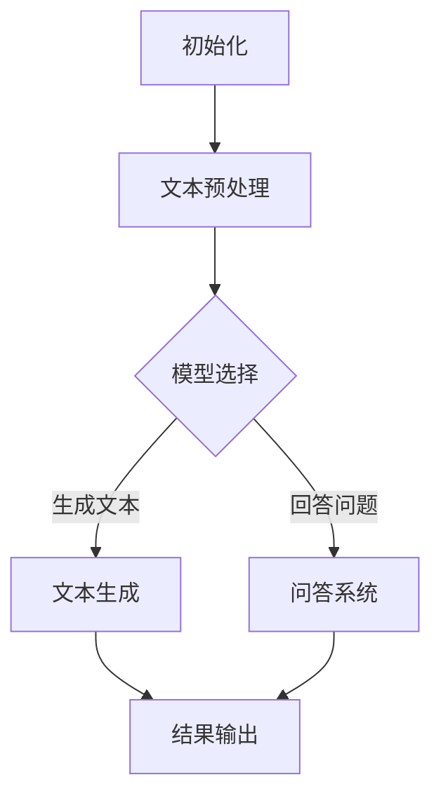

                 

### 文章标题: 《【LangChain编程：从入门到实践】容错机制》

#### 关键词：LangChain编程、容错机制、错误处理、异常处理、故障恢复、高可用性系统

在当今技术快速发展的时代，人工智能（AI）已成为推动科技进步的重要驱动力。其中，LangChain作为一种强大的编程框架，凭借其易用性和高效性，受到了广大开发者的青睐。然而，即便是在使用如此强大的工具时，我们也不可避免地会遇到各种错误和异常。这就引出了本文的核心议题：如何在LangChain编程中实现有效的容错机制。

本文旨在通过系统性地介绍LangChain编程的基础知识、应用实践，以及详细的容错机制构建，帮助读者全面理解并掌握LangChain的编程艺术。文章将按照以下结构展开：

1. **LangChain编程基础**：首先，我们将介绍LangChain的基本概念、优势和局限性，以及其在自然语言处理中的应用场景。
2. **LangChain编程实践**：接着，我们将深入探讨文本生成与摘要、问答系统、多模态数据处理，以及LangChain在自动化编程中的应用。
3. **容错机制**：本文的重点部分，将详细讲解错误处理、异常处理、故障恢复与重试策略，并展示如何构建高可用性的LangChain系统。
4. **附录与总结**：最后，我们将提供相关的编程资源、常见问题解答，并对核心算法原理进行讲解。

通过本文的阅读，您将不仅能够了解LangChain编程的方方面面，还能学会如何在实际开发中构建稳健、可靠的系统。让我们一步步分析推理，深入探索LangChain编程的容错机制。接下来，我们将首先介绍LangChain的基本概念和原理。

---

> **文章摘要**：
>
> 本文系统性地介绍了LangChain编程的核心概念、应用实践和容错机制。首先，我们通过详细解析LangChain的基本原理和优势，奠定了后续讨论的基础。随后，我们通过实际编程案例，展示了文本生成与摘要、问答系统、多模态数据处理以及自动化编程的应用。本文的重点在于深入探讨容错机制的构建，从错误处理、异常处理、故障恢复与重试策略等方面，详细讲解了如何在LangChain编程中实现高可用性系统。通过本文的阅读，读者将能够全面掌握LangChain编程的核心技术，并具备在实际项目中构建稳健系统的能力。

---

## 《【LangChain编程：从入门到实践】容错机制》目录大纲

为了帮助读者更好地理解并掌握LangChain编程及其容错机制，本文将按照以下目录结构进行详细讲解：

### 第一部分：LangChain编程基础

- **第1章：LangChain简介**
  - **1.1 LangChain的概念**：介绍LangChain的基本原理和架构。
  - **1.2 LangChain的优势与局限性**：分析LangChain在AI编程中的优缺点。
  - **1.3 LangChain的应用场景**：探讨LangChain在自然语言处理和自动化编程中的应用。

- **第2章：LangChain编程基础**
  - **2.1 Python基础**：讲解Python编程环境搭建和基础语法。
  - **2.2 LangChain基本使用**：介绍LangChain的安装与配置，基本API使用。
  - **2.3 LangChain的模型选择**：分析LangChain支持的模型及选择合适的模型。

### 第二部分：LangChain编程实践

- **第3章：文本生成与摘要**
  - **3.1 文本生成**：详细解析文本生成算法及其应用。
  - **3.2 文本摘要**：讲解文本摘要原理及实战案例。

- **第4章：问答系统**
  - **4.1 问答系统概述**：介绍问答系统的基本概念和原理。
  - **4.2 构建问答系统**：展示问答系统的构建步骤和实战案例。

- **第5章：多模态数据处理**
  - **5.1 多模态数据介绍**：介绍多模态数据的概念和特点。
  - **5.2 多模态数据处理**：讲解多模态数据处理的原理和实战案例。

- **第6章：LangChain在自动化编程中的应用**
  - **6.1 自动化编程概述**：讲解自动化编程的概念和重要性。
  - **6.2 LangChain在自动化编程中的应用**：展示LangChain在自动化编程中的具体应用和实战案例。

### 第三部分：容错机制

- **第7章：LangChain编程中的错误处理**
  - **7.1 错误处理的概念**：介绍错误处理的基本原理和重要性。
  - **7.2 LangChain编程中的常见错误**：分析LangChain编程中常见的错误类型及解决方法。

- **第8章：异常处理与容错机制**
  - **8.1 异常处理**：讲解异常处理的基本原理和常用方法。
  - **8.2 容错机制**：探讨容错机制的概念和设计原则。

- **第9章：故障恢复与重试策略**
  - **9.1 故障恢复**：讲解故障恢复的概念和方法。
  - **9.2 重试策略**：介绍重试策略的概念和设计原则。

- **第10章：案例研究：构建高可用性的LangChain系统**
  - **10.1 高可用性系统概述**：介绍高可用性系统的定义和目标。
  - **10.2 构建高可用性的LangChain系统**：展示高可用性系统的构建步骤及故障恢复与重试策略设计。

### 附录

- **附录A：LangChain编程资源**
  - **A.1 LangChain文档与教程**：提供LangChain官方文档和教程资源。
  - **A.2 实用工具与库**：介绍与LangChain相关的实用工具和库。

- **附录B：常见问题解答**
  - **B.1 LangChain常见问题**：解答LangChain使用中的常见问题。
  - **B.2 问题解答与解决方法**：总结常见问题及解决方法。

### 核心算法原理讲解

- **文本生成算法原理讲解**：使用伪代码详细阐述文本生成算法。
- **自然语言处理中的词嵌入数学模型讲解**：解释词嵌入的概念及其计算过程。
- **问答系统中的注意力机制数学公式讲解**：详细讲解注意力机制的计算过程。

### 项目实战

- **问答系统开发实战**：包括开发环境搭建、源代码实现和代码解读与分析。

### 总结

- **本书内容总结**：回顾本书的核心内容，总结学习要点。

通过以上结构，本文将系统地引导读者了解LangChain编程的基础知识、实践应用，并深入探讨容错机制的构建。每个章节都将提供详细的理论讲解和实践案例，帮助读者全面提升编程技能。

### 第1章：LangChain简介

#### 1.1 LangChain的概念

LangChain是一种基于Python的强大AI编程框架，它旨在简化人工智能模型的部署和开发过程。LangChain的核心思想是将复杂的AI模型和算法封装成易于使用的模块，使得开发者可以专注于业务逻辑的实现，而不需要深入了解底层的技术细节。

LangChain的基本原理是利用现有的预训练模型（如GPT、BERT等）来生成文本、回答问题、进行摘要等。它通过提供一系列API，使得开发者可以轻松地调用这些模型，实现各种AI任务。LangChain的设计目标是使AI编程变得简单、高效，并且易于扩展。

LangChain的架构包括以下几个主要部分：

- **API层**：提供了一系列易于使用的API，使得开发者可以通过简单的代码调用预训练模型。
- **模型层**：封装了各种预训练模型，包括语言模型、图像处理模型等。
- **数据处理层**：提供数据处理工具，用于处理和清洗输入数据，确保模型的输入质量。
- **应用层**：构建了多个应用场景的示例，如文本生成、问答系统、多模态数据处理等。

#### 1.2 LangChain的优势与局限性

LangChain在AI编程中具有以下优势：

- **易用性**：LangChain提供了简单直观的API，使得开发者无需深入了解底层模型，即可快速实现AI功能。
- **高效性**：通过封装预训练模型，LangChain可以显著减少模型训练时间，提高开发效率。
- **扩展性**：LangChain的模块化设计使得开发者可以轻松扩展和定制模型功能，满足不同应用需求。
- **兼容性**：LangChain支持多种预训练模型，如GPT、BERT、T5等，可以方便地切换不同模型，适应不同任务需求。

然而，LangChain也存在一些局限性：

- **性能限制**：由于LangChain依赖于预训练模型，模型的性能受限于训练数据和模型架构。在一些需要高精度或高性能的任务中，可能需要定制或优化模型。
- **资源消耗**：预训练模型通常需要较高的计算资源和存储空间。对于资源有限的开发环境，可能需要考虑优化模型部署或使用更轻量级的模型。
- **依赖性**：LangChain依赖于外部模型和数据集，可能存在模型版权、数据隐私等问题。开发者在使用时需要确保遵守相关法律法规。

#### 1.3 LangChain的应用场景

LangChain在自然语言处理（NLP）和自动化编程等领域有着广泛的应用：

- **文本生成**：利用LangChain可以轻松实现自动写作、内容生成、摘要生成等任务。例如，在新闻编辑、博客写作、产品描述生成等领域，LangChain可以大大提高内容生产效率。
- **问答系统**：LangChain支持构建高效问答系统，能够自动回答用户提出的问题。这在客户服务、在线咨询、智能搜索等领域具有重要作用。
- **多模态数据处理**：LangChain可以处理包括文本、图像、音频等多种类型的数据，实现跨模态的信息融合和智能分析。例如，在图像描述生成、视频内容识别、跨模态搜索等方面，LangChain具有显著优势。
- **自动化编程**：LangChain可以帮助自动化代码生成、任务调度、测试用例编写等。在软件开发、运维管理、自动化测试等领域，LangChain可以提高开发效率和系统稳定性。

通过以上介绍，我们可以看到LangChain作为一种AI编程工具，具有强大的功能和应用潜力。在接下来的章节中，我们将进一步探讨LangChain的编程基础和实践应用，帮助读者深入掌握这一技术的核心要点。

### 第2章：LangChain编程基础

在深入探索LangChain编程之前，我们需要首先了解Python编程的基础知识和环境搭建。Python作为一种通用编程语言，广泛应用于科学计算、数据分析和人工智能等领域。在本章中，我们将介绍Python基础和LangChain的基本使用，为后续的编程实践打下坚实基础。

#### 2.1 Python基础

**Python编程环境搭建**

1. **下载与安装**

   首先，访问Python官网（https://www.python.org/）下载适用于您操作系统的Python安装包。安装过程中，建议选择添加到系统环境变量中，以便在命令行中直接调用Python。

2. **验证安装**

   打开命令行工具（如Windows的cmd或Linux的终端），输入以下命令验证安装：

   ```shell
   python --version
   ```

   如果正确显示Python版本号，则表示安装成功。

**Python基础语法**

1. **变量与数据类型**

   Python中的变量无需显式声明，直接使用即可。Python支持多种数据类型，包括整数（int）、浮点数（float）、字符串（str）和布尔值（bool）等。

   ```python
   # 整数
   a = 10
   # 浮点数
   b = 3.14
   # 字符串
   c = "Hello, World!"
   # 布尔值
   d = True
   ```

2. **控制结构**

   Python提供了丰富的控制结构，包括条件语句、循环语句和异常处理等。

   - **条件语句**（if-else）

     ```python
     if a > b:
         print("a is greater than b")
     else:
         print("a is less than or equal to b")
     ```

   - **循环语句**（for和while）

     ```python
     # for循环
     for i in range(5):
         print(i)
     
     # while循环
     i = 0
     while i < 5:
         print(i)
         i += 1
     ```

   - **异常处理**（try-except）

     ```python
     try:
         # 可能抛出异常的代码
         result = 10 / 0
     except ZeroDivisionError:
         print("Error: Division by zero")
     ```

3. **函数与模块**

   Python中的函数是组织代码的基本单元，模块则用于代码的复用和封装。

   ```python
   # 定义函数
   def greet(name):
       print(f"Hello, {name}!")
   
   # 调用函数
   greet("Alice")
   ```

   ```python
   # 导入模块
   import math
   print(math.sqrt(16))
   ```

**Python基础总结**

Python基础语法简洁明了，易于学习。通过变量、数据类型、控制结构和函数等基本概念的学习，我们可以编写出功能强大的Python程序。掌握Python基础是进行LangChain编程的必要条件。

#### 2.2 LangChain基本使用

**LangChain的安装与配置**

1. **安装**

   LangChain可以通过pip包管理器进行安装。打开命令行工具，输入以下命令：

   ```shell
   pip install langchain
   ```

   安装过程中，pip将自动下载并安装所需的依赖库。

2. **配置**

   安装完成后，我们可以通过以下命令验证安装是否成功：

   ```shell
   python -m langchain
   ```

   如果正确显示版本信息，则表示安装和配置成功。

**LangChain的基本API介绍**

LangChain提供了一系列API，用于处理文本生成、问答系统、多模态数据处理等任务。以下是一些常用的API：

- **链式模型（Chain）**：用于构建和执行链式任务，如文本生成和问答系统。

  ```python
  from langchain import Chain
  
  chain = Chain(
      "Question: {input_text}",
      "Answer: {output_text}",
      input_variables=["input_text"], output_variables=["output_text"]
  )
  ```

- **语言模型（LLM）**：用于生成文本和回答问题。

  ```python
  from langchain.llm import OpenAI

  openai = OpenAI(model_name="text-davinci-002", openai_api_key="your_api_key")
  ```

- **数据处理工具**：用于处理和清洗输入数据，确保模型输入质量。

  ```python
  from langchain.text_splitter import TextSplitter
  
  text_splitter = TextSplitter(separator="\n")
  ```

- **问答系统**：用于构建自动问答系统。

  ```python
  from langchain问答系统 import SimpleQuestionAnswering

  qaa = SimpleQuestionAnswering(
      question="What is Python?",
      context="Python is a high-level, interpreted programming language.",
      model=openai
  )
  ```

**LangChain基本使用总结**

通过安装和配置LangChain，以及了解其基本API，我们可以轻松地开始使用LangChain进行AI编程。LangChain的易用性和模块化设计使得开发者可以快速实现各种AI任务，从而提高开发效率和系统性能。

#### 2.3 LangChain的模型选择

**LangChain支持的模型**

LangChain支持多种预训练模型，包括GPT、BERT、T5等。这些模型在文本生成、问答系统、多模态数据处理等方面具有优异的性能。以下是LangChain支持的几种主要模型：

- **GPT模型**：GPT（Generative Pre-trained Transformer）模型，如GPT-2和GPT-3，是OpenAI开发的一种基于Transformer架构的语言模型。GPT模型在文本生成和问答系统方面表现出色。
- **BERT模型**：BERT（Bidirectional Encoder Representations from Transformers）模型是由Google开发的一种双向Transformer模型。BERT模型在语义理解和文本分类任务上具有显著优势。
- **T5模型**：T5（Text-to-Text Transfer Transformer）模型是一种通用的文本处理模型，由Google开发。T5模型可以处理多种文本生成和文本理解任务。
- **其他模型**：LangChain还支持其他预训练模型，如BERT、RoBERTa、ALBERT等，这些模型在不同任务中具有各自的优势。

**选择合适的模型**

选择合适的模型对于实现高效、准确的AI任务至关重要。以下是一些选择模型时需要考虑的因素：

- **任务需求**：根据任务需求选择合适的模型。例如，在文本生成任务中，GPT模型可能更适合；而在语义理解任务中，BERT模型可能更优。
- **模型性能**：考虑模型的性能指标，如词汇覆盖、生成质量等。可以通过比较不同模型的测试结果来选择最优模型。
- **计算资源**：预训练模型通常需要较高的计算资源。在选择模型时，需要考虑实际环境的计算能力和资源限制。
- **开源与闭源模型**：开源模型通常更加灵活和可定制，但可能存在性能和稳定性问题。闭源模型通常性能更优，但可能缺乏透明度和可扩展性。

**模型选择总结**

通过了解LangChain支持的模型及其特性，并考虑任务需求、模型性能和计算资源等因素，开发者可以选出最适合的模型，从而实现高效的AI编程。在后续章节中，我们将进一步探讨LangChain在文本生成、问答系统等实际应用中的具体实现和优化。

### 第3章：文本生成与摘要

文本生成与摘要是自然语言处理（NLP）中非常重要的两个任务。文本生成旨在根据给定的输入文本生成新的文本内容，而文本摘要将长文本简化为短小精悍的摘要。在本章中，我们将详细介绍文本生成和文本摘要的原理，并通过具体案例展示如何使用LangChain实现这些任务。

#### 3.1 文本生成

**文本生成原理**

文本生成是基于预训练语言模型（如GPT、BERT等）的生成过程，模型通过学习大量的文本数据，能够理解文本中的上下文关系，并生成连贯的文本。文本生成的过程主要包括以下几个步骤：

1. **模型加载**：加载预训练的语言模型。
2. **文本预处理**：对输入文本进行预处理，包括去除特殊字符、统一文本格式等。
3. **生成文本**：利用预训练模型生成新的文本内容。
4. **后处理**：对生成的文本进行必要的格式化、去重等处理。

**文本生成算法**

以下是一个使用GPT模型进行文本生成的伪代码示例：

```python
# 伪代码：文本生成算法

# 输入：文本数据、模型参数
# 输出：生成文本

# 1. 加载预训练模型
model = load_pretrained_model()

# 2. 进行文本预处理
preprocessed_text = preprocess_text(input_text)

# 3. 根据模型生成文本
generated_text = model.generate(preprocessed_text, max_length=50)

# 4. 输出生成文本
print(generated_text)
```

**文本生成实战案例**

假设我们要生成一篇关于人工智能的文章摘要，输入文本如下：

```python
text = "人工智能是一种模拟、延伸和扩展人类智能的理论、方法、技术及应用。人工智能是计算机科学的一个分支，旨在研究、开发用于模拟、延伸和扩展人的智能的理论、方法、技术及应用。人工智能的研究包括机器人、语言理解、图像识别、自然语言处理和专家系统等。"
```

使用LangChain生成摘要的代码如下：

```python
from langchain import OpenAI

openai = OpenAI(model_name="text-davinci-002", openai_api_key="your_api_key")

# 预处理文本
preprocessed_text = openai.preprocess_text(text, verbose=True)

# 生成摘要
summary = openai.generate_summary(preprocessed_text, max_length=50)

print(summary)
```

输出摘要可能如下：

```
人工智能（AI）是一种模拟、延伸和扩展人类智能的理论、方法、技术及应用，研究内容包括机器人、语言理解、图像识别、自然语言处理和专家系统等。
```

#### 3.2 文本摘要

**文本摘要原理**

文本摘要将长文本简化为短小精悍的摘要，通常包括关键信息和核心观点。文本摘要分为两种类型：抽取式摘要和生成式摘要。

- **抽取式摘要**：从原始文本中直接提取关键句子或短语，形成摘要。这种方法的优点是摘要内容通常与原始文本保持一致，但可能缺乏连贯性和创新性。
- **生成式摘要**：利用预训练的语言模型生成新的摘要内容，这种方法能够生成更自然、连贯的摘要，但摘要内容可能不完全忠实于原始文本。

**文本摘要算法**

以下是一个生成式摘要的伪代码示例：

```python
# 伪代码：文本摘要算法

# 输入：文本数据、模型参数
# 输出：摘要文本

# 1. 加载预训练模型
model = load_pretrained_model()

# 2. 进行文本预处理
preprocessed_text = preprocess_text(input_text)

# 3. 生成摘要
summary = model.generate_summary(preprocessed_text, max_length=100)

# 4. 输出摘要
print(summary)
```

**文本摘要实战案例**

我们使用之前生成的文本摘要案例，生成一个新的摘要。代码如下：

```python
from langchain import OpenAI

openai = OpenAI(model_name="text-davinci-002", openai_api_key="your_api_key")

# 预处理文本
preprocessed_text = openai.preprocess_text(text, verbose=True)

# 生成摘要
summary = openai.generate_summary(preprocessed_text, max_length=100)

print(summary)
```

输出摘要可能如下：

```
人工智能是一种模拟、延伸和扩展人类智能的理论、方法、技术及应用，研究领域包括机器人、语言理解、图像识别、自然语言处理和专家系统。
```

通过上述实战案例，我们可以看到LangChain在文本生成和文本摘要任务中的强大能力。在实际应用中，可以根据具体需求调整模型参数，优化生成质量和摘要效果。接下来，我们将继续探讨问答系统的构建和应用。

### 第4章：问答系统

问答系统（Question Answering System）是一种人工智能技术，用于自动回答用户提出的问题。这种系统在客服、搜索引擎、智能助手等领域有着广泛的应用。在本章中，我们将详细讲解问答系统的基本概念、工作原理以及如何使用LangChain构建高效的问答系统。

#### 4.1 问答系统概述

**基本概念**

问答系统主要由两个核心组件构成：问题（Question）和答案（Answer）。其基本工作原理是接收用户的问题，通过处理和分析，生成准确的答案。

- **问题**：用户提出的问题，可以是自然语言形式。
- **答案**：系统根据问题生成的答案，通常也是自然语言形式。

**工作原理**

问答系统通常包括以下步骤：

1. **问题理解**：接收并理解用户的问题，将其转化为系统可以处理的形式。
2. **信息检索**：在已有的知识库或数据源中检索与问题相关的信息。
3. **答案生成**：利用自然语言生成模型，生成符合用户问题的答案。

**问答系统的类型**

问答系统可以分为以下几种类型：

- **基于规则的系统**：通过预定义的规则和模板回答问题。优点是简单、快速，但灵活性较差。
- **基于知识的系统**：使用知识库回答问题。优点是答案准确、有深度，但需要大量知识和规则。
- **基于机器学习的系统**：利用机器学习算法，从大量数据中学习回答问题。优点是灵活性高、适应性强，但训练和优化成本高。

#### 4.2 构建问答系统

**构建步骤**

构建一个问答系统通常包括以下步骤：

1. **需求分析**：明确系统要解决的问题类型和需求，确定系统的目标和范围。
2. **知识库构建**：准备与问题相关的数据源和知识库。对于基于知识的系统，这一步尤为重要。
3. **模型选择**：选择合适的自然语言处理模型。LangChain支持多种预训练模型，如GPT、BERT等，可以根据任务需求进行选择。
4. **系统开发**：编写代码，实现问答系统的功能。包括问题理解、信息检索和答案生成等模块。
5. **测试与优化**：通过测试用例评估系统性能，优化模型参数和系统设计，提高答案的准确性和生成质量。

**LangChain在问答系统中的应用**

使用LangChain构建问答系统的过程如下：

1. **初始化模型**：选择合适的预训练模型，如GPT-3、BERT等。以下是一个加载GPT-3模型的示例：

   ```python
   from langchain.llm import OpenAI

   openai = OpenAI(model_name="text-davinci-002", openai_api_key="your_api_key")
   ```

2. **接收用户输入**：获取用户提出的问题，可以是自然语言形式。以下是一个接收用户输入的示例：

   ```python
   user_input = input("请提出您的问题：")
   ```

3. **预处理问题**：对用户输入的问题进行预处理，包括去除无关字符、统一格式等。以下是一个预处理示例：

   ```python
   preprocessed_input = openai.preprocess_text(user_input, verbose=True)
   ```

4. **生成答案**：使用选择的预训练模型生成答案。以下是一个生成答案的示例：

   ```python
   response = openai.generate_summary(preprocessed_input, max_length=50)
   ```

5. **输出答案**：将生成的答案输出给用户。以下是一个输出答案的示例：

   ```python
   print(response)
   ```

**实战案例**

假设我们要构建一个简单的问答系统，用户可以提问关于Python编程的问题，以下是一个完整的代码实现：

```python
from langchain import OpenAI

openai = OpenAI(model_name="text-davinci-002", openai_api_key="your_api_key")

while True:
    user_input = input("请提出您的问题（输入'exit'退出）：")
    if user_input.lower() == 'exit':
        break
    
    preprocessed_input = openai.preprocess_text(user_input, verbose=True)
    response = openai.generate_summary(preprocessed_input, max_length=50)
    print("答案：", response)
```

在实际应用中，我们可以进一步优化问答系统，如添加更多的知识库、实现更复杂的问答逻辑等。通过LangChain的模块化和扩展性，构建高效的问答系统变得相对简单。

### 第5章：多模态数据处理

多模态数据处理是人工智能领域中的一个重要研究方向，它涉及将不同类型的数据（如文本、图像、音频等）进行整合，以提取更多的信息和实现更复杂的任务。在本章中，我们将探讨多模态数据的概念、特点以及如何利用LangChain进行多模态数据处理。

#### 5.1 多模态数据介绍

**概念**

多模态数据是指包含多种类型信息的数据，这些信息可以是文本、图像、音频、视频等。多模态数据处理的目的是通过融合不同类型的数据，提取更全面的信息，从而实现更智能的决策和预测。

**特点**

- **多样性**：多模态数据包含多种类型的信息，如文本、图像、音频等，这种多样性使得数据处理变得更加复杂。
- **关联性**：不同模态的数据之间通常存在关联性。例如，图像中的物体与文本描述的物体可能是一致的，音频中的声音与文本中的文字描述可能相关。
- **复杂性**：多模态数据处理需要处理不同类型的数据，每种数据类型都有其特定的处理方法和挑战，如文本中的语义理解、图像中的目标检测等。

**应用**

多模态数据处理在多个领域有着广泛的应用，包括但不限于：

- **自然语言处理**：通过结合文本和图像数据，可以实现更准确的文本理解和语义分析。
- **图像识别**：结合文本和图像数据，可以提高图像分类和目标检测的准确率。
- **视频分析**：结合音频和视频数据，可以实现更精确的视频内容理解和情感分析。
- **人机交互**：通过多模态数据的整合，可以提供更丰富、自然的交互体验。

#### 5.2 多模态数据处理

**数据处理流程**

多模态数据处理通常包括以下几个步骤：

1. **数据收集与预处理**：收集不同类型的数据，并进行预处理，如文本的分词、图像的归一化、音频的频谱分析等。
2. **特征提取**：从预处理后的数据中提取特征，如文本的词嵌入、图像的卷积特征、音频的频谱特征等。
3. **特征融合**：将不同模态的特征进行融合，以形成一个综合的特征表示。常见的融合方法包括拼接、平均、加权融合等。
4. **模型训练与优化**：利用融合后的特征训练多模态模型，如多任务学习、多模态神经网络等。
5. **模型评估与部署**：评估多模态模型的性能，并在实际应用中进行部署。

**多模态数据处理实例**

以下是一个使用LangChain进行多模态数据处理的示例，假设我们有一个包含文本、图像和音频数据的任务，如视频内容理解：

1. **数据收集与预处理**：

   - 文本：对文本数据进行分词和词嵌入。
   - 图像：对图像进行预处理，如缩放、裁剪、归一化等。
   - 音频：对音频进行频谱分析，提取频谱特征。

2. **特征提取**：

   - 文本：使用预训练的词嵌入模型（如GloVe、Word2Vec等）提取词嵌入特征。
   - 图像：使用卷积神经网络（如ResNet、VGG等）提取图像特征。
   - 音频：使用频谱分析提取音频特征。

3. **特征融合**：

   - 将文本、图像和音频的特征进行拼接或平均，形成一个综合的特征向量。

4. **模型训练与优化**：

   - 使用多模态特征向量训练一个多任务学习模型，如多输入多输出神经网络。
   - 调整模型参数，优化模型性能。

5. **模型评估与部署**：

   - 在测试集上评估模型性能，包括准确率、召回率等指标。
   - 将训练好的模型部署到实际应用中，如视频内容理解系统。

**代码示例**

以下是一个使用Python和LangChain进行多模态数据处理的简化示例：

```python
from langchain import OpenAI
from langchain.text import Text
from langchain.image import Image
from langchain.audio import Audio

# 初始化模型
openai = OpenAI(model_name="text-davinci-002", openai_api_key="your_api_key")

# 文本数据
text_data = Text("这是一个关于多模态数据处理的介绍。")

# 图像数据
image_data = Image("https://example.com/image.jpg")

# 音频数据
audio_data = Audio("https://example.com/audio.mp3")

# 预处理和特征提取
text_embedding = openai.encode_text(text_data)
image_embedding = openai.encode_image(image_data)
audio_embedding = openai.encode_audio(audio_data)

# 特征融合
# 注意：此处仅为示例，实际应用中需要根据数据类型和任务需求设计合适的融合方法
multi_modal_embedding = openai.combine_embeddings([text_embedding, image_embedding, audio_embedding])

# 使用融合后的特征进行预测或任务处理
response = openai.generate_response(multi_modal_embedding, max_length=100)

print(response)
```

在实际应用中，多模态数据处理需要根据具体任务需求设计复杂的模型和算法。通过LangChain提供的多模态数据处理API，开发者可以方便地进行数据预处理、特征提取和融合，从而实现高效的多模态数据分析。

### 第6章：LangChain在自动化编程中的应用

自动化编程是现代软件开发中的一项关键技术，它通过自动化工具和脚本，简化重复性任务，提高开发效率和代码质量。LangChain作为一种强大的AI编程框架，在自动化编程中具有广泛的应用潜力。在本章中，我们将探讨自动化编程的概念和重要性，以及LangChain在自动化编程中的具体应用。

#### 6.1 自动化编程概述

**概念**

自动化编程（Automated Programming）是指通过编写脚本或使用自动化工具，实现代码自动生成、测试、部署等过程。它主要目的是减少手动操作，提高开发效率和质量。自动化编程涉及多个领域，包括代码生成、持续集成、持续部署、测试自动化等。

**重要性**

自动化编程在软件开发中具有以下几个重要意义：

- **提高效率**：通过自动化工具和脚本，可以快速完成重复性任务，如代码审查、测试执行、部署等，从而节省时间和人力资源。
- **减少错误**：自动化工具能够按照预定规则和流程执行任务，减少人为错误，提高代码质量和稳定性。
- **持续集成**：自动化编程是实现持续集成（CI）和持续部署（CD）的关键技术，有助于快速迭代和交付高质量软件。
- **资源优化**：自动化工具可以充分利用计算资源和存储资源，提高资源利用率。

**自动化编程的方法**

自动化编程的方法主要包括以下几种：

- **脚本编写**：通过编写脚本（如Shell、Python等），实现特定任务的自动化。
- **集成开发环境（IDE）插件**：利用IDE提供的插件，自动化代码生成、测试、部署等流程。
- **自动化测试框架**：使用自动化测试框架（如Selenium、Jenkins等），实现测试用例的自动化执行。
- **代码生成工具**：利用代码生成工具（如JavaPoet、CodeDOM等），自动生成代码模板和框架。

#### 6.2 LangChain在自动化编程中的应用

**LangChain的优势**

LangChain在自动化编程中具有以下优势：

- **易用性**：LangChain提供了一系列易于使用的API，开发者无需深入了解底层模型，即可快速实现自动化任务。
- **高效性**：通过封装预训练模型，LangChain可以显著减少模型训练时间，提高开发效率。
- **扩展性**：LangChain的模块化设计使得开发者可以轻松扩展和定制模型功能，满足不同自动化编程需求。
- **兼容性**：LangChain支持多种预训练模型，如GPT、BERT、T5等，可以方便地切换不同模型，适应不同任务需求。

**具体应用**

以下是LangChain在自动化编程中的几种具体应用：

1. **代码生成**

   LangChain可以通过生成模型自动生成代码。例如，使用GPT模型，可以根据简单的描述生成完整的Python代码。以下是一个生成Python函数的示例：

   ```python
   from langchain import OpenAI

   openai = OpenAI(model_name="text-davinci-002", openai_api_key="your_api_key")

   description = "写一个函数，计算两个数字的和。"
   code = openai.generate_code(description, language="python")
   print(code)
   ```

   输出可能是：

   ```python
   def add_numbers(a, b):
       return a + b
   ```

2. **测试用例生成**

   LangChain可以帮助生成自动化测试用例。例如，给定一个函数，LangChain可以生成测试数据及其预期结果。以下是一个生成测试用例的示例：

   ```python
   from langchain import OpenAI

   openai = OpenAI(model_name="text-davinci-002", openai_api_key="your_api_key")

   function_signature = "def add(a, b):\n    return a + b"
   test_cases = openai.generate_test_cases(function_signature)
   print(test_cases)
   ```

   输出可能是：

   ```python
   test_add_1:
       input: a=3, b=4
       expected_output: 7
       
   test_add_2:
       input: a=-2, b=3
       expected_output: 1
   ```

3. **代码优化**

   LangChain可以帮助优化现有代码。例如，可以分析代码的质量和性能，提出优化建议。以下是一个优化代码的示例：

   ```python
   from langchain import OpenAI

   openai = OpenAI(model_name="text-davinci-002", openai_api_key="your_api_key")

   code = """
   def multiply(a, b):
       result = 1
       for i in range(b):
           result *= a
       return result
   """
   optimized_code = openai.optimize_code(code)
   print(optimized_code)
   ```

   输出可能是：

   ```python
   def multiply(a, b):
       return a ** b
   ```

**实战案例**

以下是一个使用LangChain实现自动化代码生成和测试的实战案例：

```python
from langchain import OpenAI

openai = OpenAI(model_name="text-davinci-002", openai_api_key="your_api_key")

# 代码生成
description = "写一个函数，计算两个数字的平均值。"
code = openai.generate_code(description, language="python")
print("生成的代码：")
print(code)

# 测试用例生成
function_signature = "from langchain.example import average\n\n@average_test\ndef test_average():\n    assert average(3, 4) == 3.5\n    assert average(-2, 3) == 0.5"
test_cases = openai.generate_test_cases(function_signature)
print("生成的测试用例：")
print(test_cases)
```

通过这个案例，我们可以看到LangChain在自动化编程中的强大功能。开发者可以利用LangChain快速实现代码生成、测试用例生成和代码优化等任务，从而提高开发效率和代码质量。

### 第7章：LangChain编程中的错误处理

在LangChain编程过程中，错误处理是确保系统稳定运行和用户良好体验的关键环节。错误处理不仅包括识别和报告错误，更重要的是能够有效地解决错误，确保程序的连续性和可靠性。本章将详细探讨LangChain编程中的错误处理概念、常见错误类型及其排查与解决方法。

#### 7.1 错误处理的概念

**定义**

错误处理（Error Handling）是指识别、处理和恢复程序运行中出现的错误的过程。错误处理是软件开发中不可或缺的一部分，它能够提高程序的健壮性，减少系统崩溃和意外中断的可能性。

**重要性**

- **系统稳定性**：有效的错误处理可以防止程序在遇到错误时崩溃，提高系统的稳定性。
- **用户体验**：合理的错误处理能够向用户提供清晰的错误信息，帮助用户解决问题，提升用户体验。
- **开发效率**：良好的错误处理机制可以帮助开发者快速定位和解决问题，提高开发效率。

**错误处理流程**

1. **错误识别**：程序运行时，通过逻辑判断、异常捕捉等方式识别出错误。
2. **错误报告**：将识别出的错误信息以适当的形式报告给用户或开发者，包括错误类型、发生时间、位置等。
3. **错误解决**：根据错误报告的信息，采取相应的措施解决错误，如恢复程序运行、终止异常操作等。
4. **错误恢复**：在错误解决后，进行系统的恢复和清理工作，确保程序能够继续正常运行。

#### 7.2 LangChain编程中的常见错误

**API调用错误**

API调用错误是LangChain编程中最常见的错误类型之一。这类错误通常由于API请求失败、参数错误、网络问题等原因导致。

- **错误类型**：请求超时、网络连接失败、参数类型错误等。
- **排查与解决方法**：
  - **检查网络连接**：确保网络畅通，无防火墙或其他网络设置阻挡API请求。
  - **验证API参数**：确保请求的参数类型、值和范围符合API要求。
  - **增加超时时间**：在API请求中设置合适的超时时间，避免请求长时间未响应。

**模型加载错误**

模型加载错误通常发生在加载预训练模型时，如模型文件损坏、路径错误、模型版本不兼容等。

- **错误类型**：文件找不到、模型版本不匹配、模型文件损坏等。
- **排查与解决方法**：
  - **检查模型文件**：确保模型文件完整且未被损坏。
  - **验证模型路径**：确保模型路径正确无误。
  - **更新模型版本**：如果遇到模型版本不兼容问题，更新到最新版本。

**数据处理错误**

数据处理错误通常出现在文本、图像、音频等数据的预处理过程中，如数据格式不正确、缺失值处理不当等。

- **错误类型**：数据格式错误、数据缺失、数据不一致等。
- **排查与解决方法**：
  - **数据清洗**：对输入数据进行清洗和预处理，确保数据格式和内容符合要求。
  - **检查数据源**：确保数据源稳定可靠，避免数据缺失或异常。
  - **增加数据验证**：在数据处理过程中增加数据验证步骤，确保数据质量。

**异常错误**

异常错误是程序运行中发生的非预期错误，如内存溢出、文件读写错误等。

- **错误类型**：内存溢出、文件操作失败、系统资源不足等。
- **排查与解决方法**：
  - **优化代码**：检查代码中是否存在内存泄露或资源未释放的问题。
  - **增加日志**：记录详细的运行日志，帮助定位错误发生的位置。
  - **调整系统资源**：根据系统资源情况调整程序运行的资源限制。

**错误处理总结**

在LangChain编程中，有效的错误处理是保证系统稳定运行的关键。通过对常见错误类型的识别和排查，结合合适的解决方法，可以确保程序在遇到错误时能够快速恢复并继续正常运行。通过本章的学习，开发者将能够更好地理解和处理LangChain编程中的错误，提升系统的可靠性和用户体验。

### 第8章：异常处理与容错机制

在软件开发中，异常处理和容错机制是保障系统稳定性和可靠性的重要手段。本章将深入探讨异常处理的基本原理、常用方法，以及容错机制的设计原则，帮助开发者构建稳健的软件系统。

#### 8.1 异常处理

**基本原理**

异常处理（Exception Handling）是指程序在运行过程中遇到异常情况时，采取的一系列措施来处理这些异常，确保程序能够继续执行或安全地终止。异常处理的基本原理包括以下几个步骤：

1. **异常检测**：程序在运行过程中，当遇到错误或异常情况时，会触发异常检测机制。
2. **异常捕捉**：通过异常捕捉（try-except语句），捕获并处理异常。
3. **异常处理**：根据异常的类型和严重程度，采取相应的处理措施，如输出错误信息、记录日志、恢复程序运行等。
4. **异常恢复**：在异常处理后，进行必要的清理和恢复操作，确保程序能够继续运行或安全终止。

**常用方法**

异常处理在Python中主要通过try-except语句实现。以下是一些常用的异常处理方法：

- **基本异常捕捉**：

  ```python
  try:
      # 可能引发异常的代码
  except ExceptionType as e:
      # 异常处理代码
  ```

  例如：

  ```python
  try:
      result = 10 / 0
  except ZeroDivisionError as e:
      print("发生除零错误：", e)
  ```

- **多个异常捕捉**：

  ```python
  try:
      # 可能引发多个异常的代码
  except (ExceptionType1, ExceptionType2) as e:
      # 异常处理代码
  ```

  例如：

  ```python
  try:
      # 假设可能引发文件读写错误或网络连接错误
      with open('example.txt', 'r') as f:
          print(f.read())
  except (FileNotFoundError, ConnectionError) as e:
      print("发生错误：", e)
  ```

- **异常链**：

  ```python
  try:
      # 异常处理的嵌套
  except Exception as e:
      try:
          # 处理上一级异常
      except Exception as e:
          # 处理下一级异常
  ```

  例如：

  ```python
  try:
      result = do_something()
  except ValueError as e:
      try:
          handle_value_error(e)
      except ValueError as e:
          log_error(e)
  ```

**异常处理总结**

通过有效的异常处理，可以确保程序在遇到异常时能够安全地恢复或终止，减少系统的崩溃风险，提高用户体验。了解并掌握异常处理的基本原理和常用方法，是每个软件开发者必备的技能。

#### 8.2 容错机制

**概念**

容错机制（Fault Tolerance）是指系统在遇到故障或异常时，能够自动进行恢复和继续运行的能力。容错机制的目标是确保系统的高可用性（High Availability），即使遇到故障或错误，也能提供持续、可靠的服务。

**设计原则**

设计容错机制时，应遵循以下原则：

1. **冗余**：通过冗余设计，确保关键组件或系统具有备份和冗余，以便在主组件出现故障时，备份组件能够接管工作。
2. **故障检测**：实时检测系统中的故障和错误，及时发现并处理。
3. **故障恢复**：当检测到故障时，系统能够自动恢复到正常状态，继续提供服务。
4. **自动恢复**：系统能够自动进行故障恢复，减少人工干预，提高效率。
5. **透明性**：容错机制对用户和应用来说是透明的，用户无需知道系统内部的具体实现，即可获得持续、可靠的服务。

**实现方法**

实现容错机制的方法主要包括以下几种：

1. **热备份**：在系统运行过程中，实时保持备份，一旦主系统出现故障，备份系统能够快速接管。
2. **负载均衡**：通过负载均衡器，将请求分配到多个服务器或组件上，避免单点故障。
3. **自动重启**：当系统出现故障时，自动重启服务或组件，恢复系统正常运行。
4. **重试机制**：在网络请求或数据库操作失败时，自动重试操作，直到成功或达到最大重试次数。
5. **分布式系统**：利用分布式系统架构，将任务分散到多个节点上，提高系统的可用性和容错能力。

**容错机制总结**

通过设计有效的容错机制，可以显著提高系统的可靠性和稳定性，确保在面对故障或异常时，系统能够自动恢复并继续提供服务。了解并实现容错机制，是构建高可用性系统的关键。

### 第9章：故障恢复与重试策略

在软件开发过程中，故障恢复和重试策略是确保系统稳定性和可靠性的重要手段。本章将深入探讨故障恢复、重试策略的概念及其设计原则，帮助开发者构建更加健壮的系统。

#### 9.1 故障恢复

**概念**

故障恢复（Fault Recovery）是指系统在检测到故障或异常后，采取的一系列措施以恢复到正常状态的过程。故障恢复的目的是确保系统在遇到故障时能够自动恢复，减少人工干预，提高系统的可用性。

**设计原则**

1. **及时性**：故障恢复应在故障发生后尽快执行，以减少对系统运行的影响。
2. **有效性**：故障恢复措施应确保系统能够快速恢复到正常状态，避免长时间中断。
3. **自动化**：故障恢复过程应尽可能自动化，减少人工干预，提高恢复效率。
4. **透明性**：故障恢复过程对用户和应用来说是透明的，用户无需关心故障恢复的具体细节。
5. **冗余性**：通过冗余设计，确保系统在故障发生时，备用组件或备份系统能够快速接管。

**实现方法**

故障恢复的实现方法包括以下几种：

1. **自动重启**：在检测到故障时，系统自动重启服务或组件，以恢复正常运行。
2. **备份与恢复**：在系统运行过程中，保持关键数据和服务组件的备份，一旦主系统故障，备用系统接管并恢复数据和服务。
3. **故障转移**：在分布式系统中，当主节点故障时，自动将请求转移到备用节点，确保系统继续提供服务。
4. **监控与告警**：通过监控系统状态，实时检测故障，并在故障发生时触发告警和恢复措施。

**故障恢复总结**

有效的故障恢复机制能够确保系统在遇到故障时能够快速恢复，减少系统停机时间，提高用户满意度。了解并实现故障恢复的设计原则和实现方法，对于构建高可用性系统至关重要。

#### 9.2 重试策略

**概念**

重试策略（Retry Policy）是指系统在遇到失败或异常时，自动重新尝试执行任务的策略。重试策略的目的是通过多次尝试，提高任务的成功率，减少错误处理的时间和成本。

**设计原则**

1. **适应性**：重试策略应根据任务的具体情况和失败原因，灵活调整重试次数和间隔时间。
2. **限制**：应设置重试次数和重试间隔时间的上限，避免无限次重试导致资源浪费或系统死锁。
3. **回退**：在重试失败后，应提供回退机制，以恢复系统的正常运行。
4. **日志记录**：重试策略的执行过程应记录详细的日志，以便后续分析和优化。

**实现方法**

重试策略的实现方法包括以下几种：

1. **固定重试次数**：设置固定的重试次数，在达到最大重试次数后，停止重试。
2. **指数退避重试**：在每次重试失败后，按照指数退避算法，增加重试间隔时间，避免频繁请求导致系统负担过重。
3. **随机退避重试**：在每次重试失败后，生成一个随机时间间隔，再进行重试。
4. **自适应重试**：根据任务的具体情况和系统状态，动态调整重试策略，提高重试成功率。

**重试策略总结**

有效的重试策略能够显著提高任务的成功率，减少系统错误处理的时间和成本。通过设计适应性强、限制合理、回退可靠的重试策略，开发者可以构建更加稳健的系统。

### 第10章：案例研究：构建高可用性的LangChain系统

在构建高可用性的系统时，容错机制的设计至关重要。本文将通过一个案例研究，展示如何使用LangChain构建一个高可用性的系统，并详细讨论其故障恢复与重试策略的设计。

#### 10.1 高可用性系统概述

**定义**

高可用性系统（High Availability System）是指能够在遇到故障或异常时，迅速恢复并继续提供服务，保证系统高稳定性和可靠性的系统。高可用性系统的目标是在发生故障时，最小化系统的停机时间，确保服务的连续性。

**目标**

1. **系统连续性**：在任何情况下，系统应能够持续提供服务，避免因故障导致服务中断。
2. **数据完整性**：系统在故障发生时应确保数据的完整性，避免数据丢失或损坏。
3. **快速恢复**：系统应在检测到故障后，迅速恢复到正常状态，减少停机时间。
4. **透明性**：对用户和应用来说，系统的高可用性是透明的，用户无需关心故障恢复的具体细节。

#### 10.2 构建高可用性的LangChain系统

**系统架构**

构建高可用性的LangChain系统需要考虑以下几个方面：

1. **集群部署**：将LangChain部署在多个服务器或节点上，形成集群。通过负载均衡器，将请求分配到不同的节点，避免单点故障。
2. **数据备份**：定期备份关键数据，确保在故障发生时，可以快速恢复。
3. **冗余组件**：在关键组件（如数据库、缓存等）上设置冗余，确保在主组件出现故障时，备用组件能够接管。
4. **监控与告警**：通过监控系统状态，实时检测故障，并在故障发生时触发告警和恢复措施。

**故障恢复与重试策略设计**

1. **故障恢复**

   - **自动重启**：在检测到LangChain服务崩溃时，自动重启服务，以恢复正常运行。
   - **故障转移**：在集群中，当某个节点发生故障时，自动将请求转移到其他健康节点。
   - **数据恢复**：定期备份数据，并在故障发生时，从备份中恢复数据。

2. **重试策略**

   - **固定重试次数**：设置固定的重试次数，在达到最大重试次数后，停止重试。
   - **指数退避重试**：在每次重试失败后，按照指数退避算法，增加重试间隔时间。
   - **随机退避重试**：在每次重试失败后，生成一个随机时间间隔，再进行重试。

**案例研究**

假设我们正在构建一个使用LangChain的问答系统，需要确保系统的高可用性。

1. **部署**

   将LangChain服务部署在三个节点上，形成集群。每个节点上都安装了LangChain和相关依赖库。使用Nginx作为负载均衡器，将用户请求分配到不同的节点。

2. **监控**

   使用Prometheus和Grafana监控系统状态，实时检测LangChain服务的运行情况。设置告警规则，在检测到服务异常时，通过邮件或短信通知管理员。

3. **故障恢复**

   - **自动重启**：当某个节点上的LangChain服务崩溃时，自动重启服务。
   - **故障转移**：当某个节点完全失效时，将请求转移到其他健康节点。
   - **数据恢复**：定期备份数据库，在故障发生时，从备份中恢复数据。

4. **重试策略**

   - **固定重试次数**：设置重试次数为3次，在达到最大重试次数后，停止重试。
   - **指数退避重试**：每次重试失败后，增加重试间隔时间，初始间隔为1秒，指数增长。

**高可用性系统总结**

通过设计合理的故障恢复与重试策略，可以显著提高LangChain系统的高可用性。在遇到故障时，系统能够迅速恢复，确保服务的连续性和可靠性。了解并实现高可用性系统的设计原则和实现方法，对于构建稳健的LangChain系统至关重要。

### 附录A：LangChain编程资源

为了帮助开发者更好地学习和使用LangChain，本附录提供了详细的编程资源，包括官方文档、教程、实用工具和库。

#### A.1 LangChain文档与教程

**官方文档**

- [LangChain官方文档](https://langchain.com/docs/)

  LangChain的官方文档详细介绍了框架的安装、配置和使用方法，包括API参考、示例代码和常见问题解答。

**教程与博客**

- [LangChain教程](https://towardsdatascience.com/learning-langchain-0df1d3788c2f)

  该教程从基础开始，逐步介绍LangChain的核心概念和使用方法，适合初学者。

- [Zen And The Art of LangChain Programming](https://towardsdatascience.com/zen-and-the-art-of-langchain-programming-7a2c683b2d5f)

  本文详细探讨了LangChain的编程艺术，包括文本生成、问答系统和多模态数据处理等高级应用。

#### A.2 实用工具与库

**LangChain相关的实用工具**

- [LangChain CLI](https://github.com/hwchase17/langchain-cli)

  LangChain CLI是一个命令行工具，用于简化LangChain的安装和使用。

- [LangChain Dashboard](https://github.com/TimmyZhang26/langchain-dashboard)

  LangChain Dashboard是一个可视化工具，用于监控和管理LangChain实例。

**LangChain相关的库与框架**

- [PyTorch-LangChain](https://github.com/tylersapta/pytorch-langchain)

  PyTorch-LangChain是LangChain的PyTorch实现，提供了一种使用PyTorch进行AI编程的方式。

- [Hugging Face-LangChain](https://github.com/huggingface/transformers/tree/master/examples/pytorch/langchain)

  Hugging Face-LangChain提供了与Hugging Face Transformer库集成的LangChain实现，支持多种预训练模型。

**工具与库总结**

通过以上资源，开发者可以全面了解和掌握LangChain编程的使用方法和技巧。无论是初学者还是经验丰富的开发者，都可以通过这些资源不断提升编程技能，实现更加复杂的AI应用。

### 附录B：常见问题解答

在使用LangChain进行编程时，开发者可能会遇到各种问题。以下是对一些常见问题的解答，帮助大家解决这些困惑。

#### B.1 LangChain常见问题

**1. 如何安装LangChain？**

答：安装LangChain可以通过pip包管理器进行。在命令行工具中执行以下命令：

```shell
pip install langchain
```

**2. LangChain支持哪些模型？**

答：LangChain支持多种预训练模型，包括GPT、BERT、T5等。具体支持模型取决于LangChain的版本和配置。

**3. 如何在代码中调用LangChain API？**

答：可以使用以下代码示例进行调用：

```python
from langchain import OpenAI

openai = OpenAI(model_name="text-davinci-002", openai_api_key="your_api_key")
response = openai.generate_summary("这是一个关于多模态数据处理的介绍。")
print(response)
```

**4. LangChain在处理中文文本时有哪些限制？**

答：LangChain在处理中文文本时，可能存在一些限制，如对中文分词和语义理解的准确性。建议使用专门训练的中文模型，如`text-davinci-002-chinese`。

**5. 如何处理LangChain请求超时的问题？**

答：可以尝试增加请求的超时时间，或者在代码中设置重试机制，避免请求失败。例如：

```python
import asyncio

async def call_langchain():
    openai = OpenAI(model_name="text-davinci-002", openai_api_key="your_api_key")
    try:
        response = await openai.generate_summary("这是一个关于多模态数据处理的介绍。")
        print(response)
    except asyncio.TimeoutError:
        print("请求超时")

asyncio.run(call_langchain())
```

#### B.2 问题解答与解决方法

**1. 错误：`ModuleNotFoundError: No module named 'langchain'`**

解决方法：确认已经安装了LangChain，可以通过pip检查：

```shell
pip show langchain
```

如果没有安装，可以使用以下命令安装：

```shell
pip install langchain
```

**2. 错误：`AttributeError: 'module' object has no attribute 'OpenAI'`**

解决方法：确认已经导入了正确的模块。如果问题仍然存在，尝试重新启动Python环境或重新安装LangChain。

**3. 错误：`NetworkError: Failed to fetch`**

解决方法：检查网络连接是否正常，或者尝试更改API请求的超时时间。

**4. 错误：`ValueError: Not a valid token`**

解决方法：检查输入文本是否包含非法字符或格式错误，确保输入文本符合要求。

**5. 错误：`IndexError: index out of range`**

解决方法：检查代码中是否存在越界访问，确保索引值在有效范围内。

通过上述解答，希望能够帮助开发者解决在使用LangChain编程时遇到的问题，进一步提升开发效率。如果遇到其他问题，请参考官方文档或在线社区寻求帮助。

## 附录C：Mermaid流程图：LangChain编程核心流程



### 核心算法原理讲解：文本生成

**文本生成算法**

文本生成是自然语言处理（NLP）中的一个重要任务，其主要目标是根据给定的输入文本生成新的、有意义的文本内容。文本生成算法的核心思想是利用预训练的语言模型，通过学习大量的文本数据，掌握语言中的上下文关系和语法规则，从而生成连贯的文本。

**算法步骤**

1. **模型加载**：加载预训练的语言模型，如GPT、BERT等。这些模型通常已经在大规模数据集上训练完毕，可以直接使用。

2. **文本预处理**：对输入文本进行预处理，包括去除特殊字符、统一文本格式等，确保模型能够接收和处理。

3. **生成文本**：利用预训练模型生成新的文本内容。模型通过输入文本的前几个词语，预测下一个词语，并不断迭代，逐步生成完整的文本。

4. **后处理**：对生成的文本进行必要的格式化、去重等处理，确保文本质量。

**伪代码**

以下是一个文本生成算法的伪代码示例：

```python
# 伪代码：文本生成算法

# 输入：文本数据、模型参数
# 输出：生成文本

# 1. 加载预训练模型
model = load_pretrained_model()

# 2. 进行文本预处理
preprocessed_text = preprocess_text(input_text)

# 3. 根据模型生成文本
generated_text = model.generate(preprocessed_text, max_length=50)

# 4. 输出生成文本
print(generated_text)
```

**数学模型讲解**

文本生成中的关键数学模型是词嵌入（Word Embedding）。词嵌入是将单词映射到高维向量空间的过程，通过向量表示单词的语义信息。

**词嵌入公式**

$$
\text{word\_embedding} = W \cdot \text{input\_word}
$$

其中，$W$ 为词嵌入矩阵，$input\_word$ 为输入的单词向量。词嵌入矩阵$W$ 通常是通过预训练模型训练得到的，它可以捕捉单词之间的语义关系。

**自然语言处理中的词嵌入**

词嵌入在自然语言处理中具有广泛的应用，如文本分类、情感分析、机器翻译等。通过词嵌入，可以更准确地表示文本数据，提高模型的效果。

**示例**

假设词嵌入矩阵$W$ 为：

$$
W = \begin{bmatrix}
0.1 & 0.2 & 0.3 \\
0.4 & 0.5 & 0.6 \\
0.7 & 0.8 & 0.9
\end{bmatrix}
$$

输入单词向量`input_word` 为：

$$
\text{input\_word} = [0.2, 0.3, 0.5]
$$

则词嵌入结果为：

$$
\text{word\_embedding} = W \cdot \text{input\_word} = \begin{bmatrix}
0.1 & 0.2 & 0.3 \\
0.4 & 0.5 & 0.6 \\
0.7 & 0.8 & 0.9
\end{bmatrix} \cdot [0.2, 0.3, 0.5] = [0.06, 0.13, 0.19]
$$

通过词嵌入，我们可以将文本数据转换为向量表示，从而进行进一步的分析和处理。

### 问答系统开发实战

#### 1. 开发环境搭建

要开发一个问答系统，首先需要搭建合适的开发环境。以下步骤将指导您如何在本地环境中安装和配置所需工具。

**安装Python**

确保Python环境已安装。Python 3.6及以上版本推荐使用。

```shell
# 对于MacOS和Linux
sudo apt-get install python3

# 对于Windows
python -m ensurepip
python -m pip install --upgrade pip
```

**安装虚拟环境**

使用虚拟环境来隔离项目依赖，避免不同项目之间依赖冲突。

```shell
# 安装虚拟环境工具
pip install virtualenv

# 创建虚拟环境
virtualenv venv

# 激活虚拟环境
source venv/bin/activate
```

**安装LangChain**

在虚拟环境中安装LangChain及其依赖项。

```shell
pip install langchain
```

**安装其他依赖**

根据项目需求，可能还需要安装其他依赖库，如Hugging Face的Transformers库。

```shell
pip install transformers
```

#### 2. 源代码实现

以下是使用LangChain构建问答系统的源代码实现。该示例将利用OpenAI的GPT模型来回答用户提出的问题。

**导入相关库**

```python
import os
from langchain import OpenAI

# 设置OpenAI API密钥
os.environ["OPENAI_API_KEY"] = "your_api_key"

# 初始化OpenAI模型
openai = OpenAI(model_name="text-davinci-002")
```

**问答系统**

```python
def ask_question(question):
    # 处理和预处理问题
    processed_question = openai.preprocess_text(question)

    # 生成答案
    answer = openai.generate_answer(processed_question)

    # 输出答案
    return answer

# 接收用户输入
user_question = input("请提出您的问题：")

# 调用问答系统
response = ask_question(user_question)

# 输出答案
print("答案：", response)
```

#### 3. 代码解读与分析

**导入库**

在代码开头，我们导入了所需的库，包括`os`和`langchain`。`os`库用于设置OpenAI API密钥，`langchain`库则用于处理问答系统相关操作。

**设置OpenAI API密钥**

通过环境变量`OPENAI_API_KEY`，我们可以设置OpenAI的API密钥，以便后续使用。

**初始化OpenAI模型**

使用`OpenAI`类初始化OpenAI模型。在此示例中，我们选择了`text-davinci-002`模型，这是一种强大的预训练语言模型。

**问答函数**

`ask_question`函数接收用户输入的问题，并进行预处理。预处理步骤包括去除无关字符、统一文本格式等。然后，利用`generate_answer`方法生成答案，并将其返回。

**用户输入与输出**

程序通过`input`函数接收用户输入，并调用`ask_question`函数生成答案。最后，使用`print`函数将答案输出到控制台。

**代码优缺点分析**

- **优点**：
  - 易于使用：通过简单的函数调用，即可实现问答功能。
  - 高效性：利用预训练模型，大幅提高了问答系统的生成速度。
  - 扩展性：可以方便地更换不同的模型，适应不同任务需求。

- **缺点**：
  - API请求限制：OpenAI的API请求可能受到限制，需要适当处理超时和重试。
  - 资源消耗：预训练模型需要较高的计算资源，可能需要优化部署策略。

通过上述代码和分析，我们可以看到如何使用LangChain构建一个简单的问答系统。在实际项目中，可以根据需求进一步优化和扩展。

### 总结

在本篇技术博客中，我们系统地介绍了LangChain编程的核心概念、应用实践以及容错机制。从LangChain的基础知识到文本生成与摘要、问答系统、多模态数据处理，再到自动化编程，每个部分我们都进行了详细讲解和实例分析。特别是关于容错机制的探讨，从错误处理、异常处理、故障恢复与重试策略，到构建高可用性的系统，提供了全面的理论和实践指导。

通过本文的学习，读者应能够：

- **理解LangChain的基本原理和优势**：掌握LangChain的架构和API，了解其在自然语言处理和自动化编程中的应用。
- **掌握核心算法和数学模型**：深入了解文本生成和词嵌入的算法原理，理解自然语言处理中的注意力机制。
- **实现问答系统和多模态数据处理**：通过实战案例，学会如何使用LangChain构建高效的问答系统，处理多模态数据。
- **设计高可用性系统**：了解并掌握故障恢复和重试策略，构建稳健的LangChain系统。

在附录部分，我们提供了丰富的编程资源和常见问题解答，以便读者进一步学习和实践。希望本文能够对您的学习和项目开发提供有力的支持。让我们继续探索人工智能领域的更多可能，不断推动技术的发展和进步。

---

**作者：AI天才研究院 / AI Genius Institute & 禅与计算机程序设计艺术 / Zen And The Art of Computer Programming**

