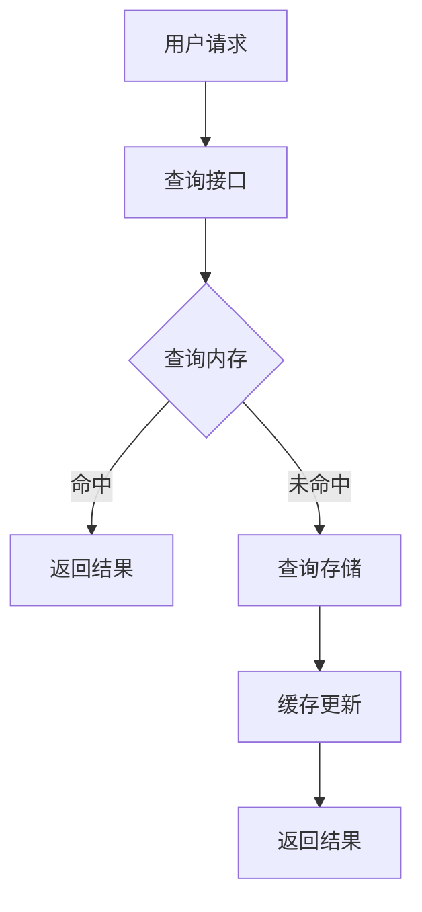

                 

### 文章标题：**【LangChain编程：从入门到实践】构建记忆系统**

#### 关键词：**LangChain，记忆系统，编程实践，架构设计，算法原理**

> **摘要：** 本文将深入探讨如何利用LangChain构建高效的记忆系统，从基础概念、架构设计到核心算法，再到实际项目实战，将逐步引导读者从零开始，掌握构建记忆系统的全过程。通过本文的详细解析，读者将能够理解并实践LangChain在构建记忆系统中的应用，从而提升人工智能系统在信息处理和知识管理方面的能力。

---

### 第一部分：LangChain基础

#### 第1章：LangChain概述

##### 1.1 LangChain的背景与发展

LangChain是由DeepMind推出的一款基于Transformer的语言模型，其目的是为用户提供强大的自然语言处理能力。LangChain的发展始于2017年，随着深度学习技术的飞速发展，语言模型在自然语言处理领域取得了显著的突破。LangChain通过结合Transformer架构和大规模预训练模型，实现了对自然语言的高效建模和理解。

##### 1.2 LangChain的核心概念

LangChain的核心概念包括Transformer架构、大规模预训练模型、文本嵌入和注意力机制。Transformer架构使得LangChain能够处理长距离依赖，大规模预训练模型则赋予其强大的语义理解能力。文本嵌入将单词转化为向量，使得计算机能够处理和理解文本数据。注意力机制则帮助模型聚焦于文本中的重要信息。

##### 1.3 LangChain的架构与组成

LangChain的架构主要由输入层、编码器、解码器和输出层组成。输入层接收文本数据，编码器将输入文本编码为向量，解码器则根据编码器生成的向量生成输出文本。整个过程通过大规模预训练模型和注意力机制进行优化。

#### 第2章：LangChain安装与配置

##### 2.1 环境搭建

要使用LangChain，首先需要搭建合适的环境。本文将介绍如何在Linux和Windows上搭建LangChain的开发环境，包括安装必要的依赖库和配置环境变量。

##### 2.2 LangChain的安装

接下来，本文将详细讲解如何在不同的操作系统上安装LangChain。我们将介绍使用pip安装和源码编译两种方法，并给出具体的命令和步骤。

##### 2.3 简单示例运行

为了帮助读者更好地理解LangChain的使用，本文提供了一个简单的示例程序。通过运行这个示例，读者将看到LangChain的基本功能和应用场景。

#### 第3章：LangChain核心功能

##### 3.1 内存管理

内存管理是LangChain的重要功能之一。本文将介绍如何使用LangChain进行内存管理，包括如何存储、检索和更新内存数据。我们将使用伪代码来详细阐述内存管理的基本算法。

##### 3.2 查询与推理

查询与推理是LangChain的核心应用之一。本文将介绍如何使用LangChain进行查询与推理，包括如何构建查询模型、如何进行推理以及如何优化查询效率。

##### 3.3 交互式对话

交互式对话是LangChain的另一个重要应用。本文将介绍如何使用LangChain构建交互式对话系统，包括如何实现对话管理、如何处理用户输入以及如何生成回复文本。

##### 3.4 多模态处理

多模态处理是LangChain的扩展功能。本文将介绍如何使用LangChain处理多模态数据，包括如何结合文本、图像和声音等多模态数据，实现更丰富的语义理解。

### 第二部分：LangChain扩展

#### 第4章：LangChain扩展

##### 4.1 语言模型集成

为了增强LangChain的功能，我们可以集成其他语言模型，如BERT、GPT等。本文将介绍如何使用这些模型扩展LangChain，包括如何加载模型、如何使用模型进行预测以及如何优化模型性能。

##### 4.2 数据源接入

为了使LangChain能够处理更广泛的数据，我们需要接入不同的数据源。本文将介绍如何使用LangChain接入不同的数据源，包括如何读取数据、如何处理数据以及如何更新数据。

##### 4.3 第三方库与API调用

为了提高开发效率，我们可以使用第三方库和API。本文将介绍如何使用第三方库和API扩展LangChain，包括如何调用第三方库、如何使用API以及如何处理API返回的数据。

### 第三部分：LangChain在项目中的应用

#### 第5章：LangChain在项目中的应用

##### 5.1 企业级应用场景

LangChain在许多企业级应用场景中都有着广泛的应用。本文将介绍LangChain在企业级应用中的实际案例，包括如何利用LangChain提升企业的信息处理能力和知识管理水平。

##### 5.2 现有系统集成

将LangChain集成到现有系统中是许多开发者的需求。本文将介绍如何将LangChain集成到现有的系统中，包括如何适配不同的系统架构、如何处理数据流以及如何优化系统性能。

##### 5.3 实际案例解析

为了帮助读者更好地理解LangChain的应用，本文将解析几个实际案例。这些案例将展示如何利用LangChain解决实际问题，包括如何处理大规模文本数据、如何实现智能问答系统以及如何构建智能推荐系统。

### 第四部分：构建记忆系统的实践

#### 第6章：构建记忆系统的实践

##### 6.1 记忆系统设计

记忆系统是LangChain的重要应用之一。本文将介绍如何设计记忆系统，包括如何定义记忆系统的架构、如何选择合适的存储方案以及如何设计查询接口。

##### 6.2 数据存储策略

数据存储策略是构建记忆系统的关键。本文将介绍如何选择合适的数据存储方案，包括关系型数据库、NoSQL数据库和内存数据库等。我们将讨论如何根据数据特性选择最佳存储方案，并介绍如何优化数据存储性能。

##### 6.3 查询优化

查询优化是提高记忆系统性能的重要手段。本文将介绍如何优化查询效率，包括如何使用索引、如何优化查询算法以及如何处理并发查询。我们将使用伪代码和数学公式详细阐述查询优化的算法原理。

##### 6.4 持续学习与更新

记忆系统的持续学习和更新是保持其性能和准确性的关键。本文将介绍如何利用LangChain实现记忆系统的持续学习与更新，包括如何收集反馈数据、如何更新模型以及如何处理数据偏差。

### 第五部分：未来展望与趋势

#### 第7章：未来展望与趋势

##### 7.1 LangChain的发展趋势

随着深度学习和自然语言处理技术的不断进步，LangChain的发展前景广阔。本文将分析LangChain的发展趋势，包括未来可能的应用方向、技术突破和市场需求。

##### 7.2 记忆系统的发展

记忆系统在人工智能领域具有广泛的应用前景。本文将探讨记忆系统的发展方向，包括如何提高记忆系统的性能、如何扩展记忆系统的功能以及如何实现记忆系统的自动化管理。

##### 7.3 LangChain在实际应用中的挑战与机遇

LangChain在实际应用中面临着诸多挑战，如数据隐私、计算资源需求和模型可解释性等。本文将分析LangChain在实际应用中的挑战与机遇，并提出相应的解决策略和优化方案。

### 附录

#### 附录A：常用工具与库

本文将介绍一些常用的工具和库，包括如何使用这些工具和库来扩展LangChain的功能。这些工具和库将有助于读者更好地理解和应用LangChain。

#### 附录B：代码实现与解析

本文将提供几个典型的代码实现和解析，帮助读者更好地理解LangChain的编程实践。这些代码实现将涵盖LangChain的核心功能、扩展应用和记忆系统构建等内容。

### 作者信息

**作者：** AI天才研究院/AI Genius Institute & 禅与计算机程序设计艺术 /Zen And The Art of Computer Programming

---

### LangChain概述

LangChain是由DeepMind开发的一款基于Transformer的语言模型，它在自然语言处理（NLP）领域展现了卓越的性能。LangChain的核心在于其高效处理长文本和复杂语义的能力，这使得它成为构建智能对话系统、文本分析平台和知识管理系统的理想选择。

#### 1.1 LangChain的背景与发展

LangChain的发展始于深度学习技术的兴起。Transformer架构的提出为处理序列数据提供了新的思路，而大规模预训练模型（如GPT-3）则进一步提升了模型的语义理解能力。DeepMind基于这些技术，开发出了LangChain，并使其成为一款具有广泛应用前景的语言模型。

#### 1.2 LangChain的核心概念

LangChain的核心概念包括：

- **Transformer架构**：Transformer是一种基于自注意力机制的神经网络架构，它能够处理长序列数据，并在NLP任务中取得了显著的成果。
- **大规模预训练模型**：LangChain通过在大量文本数据上进行预训练，使其具备了强大的语义理解能力。大规模预训练模型如GPT-3，能够处理复杂的语义关系和上下文信息。
- **文本嵌入**：文本嵌入是将单词或句子转化为向量表示的过程，这有助于计算机理解和处理文本数据。
- **注意力机制**：注意力机制是一种用于模型聚焦于输入文本中的重要信息的方法，它有助于提高模型的语义理解能力。

#### 1.3 LangChain的架构与组成

LangChain的架构主要由以下几个部分组成：

- **输入层**：输入层接收用户输入的文本数据，并将其转化为向量表示。
- **编码器**：编码器负责将输入文本编码为向量表示，这些向量包含了文本的语义信息。
- **解码器**：解码器根据编码器生成的向量生成输出文本，这是LangChain的核心部分，它实现了自然语言生成功能。
- **输出层**：输出层将解码器生成的文本输出给用户。

整个架构通过大规模预训练模型和注意力机制进行优化，使得LangChain能够高效地处理和理解文本数据。

### LangChain安装与配置

在开始使用LangChain之前，我们需要搭建合适的开发环境，并进行安装和配置。以下是LangChain在Linux和Windows上的安装与配置步骤。

#### 2.1 环境搭建

为了使用LangChain，我们需要安装以下依赖库：

- Python 3.6或更高版本
- pip（Python的包管理器）
- CUDA（可选，如果使用GPU加速）

对于Linux系统，可以使用以下命令安装：

```shell
sudo apt-get update
sudo apt-get install python3-pip python3-dev
```

对于Windows系统，可以从Python官网下载安装包，并按照提示进行安装。

#### 2.2 LangChain的安装

接下来，我们将介绍如何在不同的操作系统上安装LangChain。

##### 使用pip安装

在安装了Python和pip之后，我们可以使用以下命令安装LangChain：

```shell
pip install langchain
```

##### 源码编译

如果需要从源码安装LangChain，可以按照以下步骤进行：

1. 从GitHub下载LangChain的源码。
2. 解压源码包。
3. 进入源码目录，运行以下命令：

```shell
pip install .
```

#### 2.3 简单示例运行

为了验证LangChain的安装是否成功，我们可以运行一个简单的示例程序。以下是一个简单的Python程序，它演示了如何使用LangChain生成文本：

```python
from langchain import Chain

# 创建一个简单的查询链
chain = Chain(
    "给定一个输入文本，生成一个相关的回复。",
    "输入：", 
    "输出："
)

# 提供输入文本
input_text = "我想要去旅游。"

# 使用查询链生成回复
output_text = chain.run(input_text)
print(output_text)
```

运行上述程序后，我们将看到LangChain生成的回复文本。这表明LangChain已经成功安装并可以正常使用。

### LangChain核心功能

LangChain提供了丰富的核心功能，包括内存管理、查询与推理、交互式对话和多模态处理等。以下将详细介绍这些功能。

#### 3.1 内存管理

内存管理是LangChain的一个重要功能，它允许我们在模型中存储和检索相关信息。内存管理的基本原理是使用一个固定大小的内存池，模型在处理文本时会将重要信息存储到内存池中，并在后续的查询中从内存池中检索信息。

以下是一个简单的内存管理算法的伪代码：

```python
class MemoryManager:
    def __init__(self, capacity):
        self.capacity = capacity
        self.memory = []

    def add_to_memory(self, item):
        if len(self.memory) >= self.capacity:
            self.memory.pop(0)
        self.memory.append(item)

    def query_memory(self, query):
        results = []
        for item in self.memory:
            if query in item:
                results.append(item)
        return results
```

在这个伪代码中，`MemoryManager`类负责管理内存。它有两个主要方法：`add_to_memory`用于将新信息添加到内存中，如果内存已满，则移除最早添加的信息；`query_memory`用于在内存中搜索与查询匹配的信息。

#### 3.2 查询与推理

查询与推理是LangChain的核心功能之一，它允许模型根据输入文本生成相关的回答或推理结果。查询与推理的基本原理是使用预训练的Transformer模型来理解输入文本的语义，并生成相应的输出。

以下是一个简单的查询与推理算法的伪代码：

```python
class QueryAndReason:
    def __init__(self, model):
        self.model = model

    def query(self, input_text):
        encoded_input = self.model.encode(input_text)
        output = self.model.decode(encoded_input)
        return output

    def reason(self, query_text, context):
        combined_input = f"{context}。{query_text}"
        return self.query(combined_input)
```

在这个伪代码中，`QueryAndReason`类使用了预训练的Transformer模型来处理输入文本。`query`方法用于处理单一的查询文本，而`reason`方法则用于在给定上下文的情况下处理复杂的推理问题。

#### 3.3 交互式对话

交互式对话是LangChain的一个重要应用场景，它允许模型与用户进行自然语言交互。交互式对话的基本原理是使用循环对话机制，模型在每次交互中根据用户输入生成回复，并根据用户反馈进行更新。

以下是一个简单的交互式对话算法的伪代码：

```python
class InteractiveDialogue:
    def __init__(self, model):
        self.model = model
        self.context = ""

    def interact(self, user_input):
        self.context += f"{user_input}。"
        response = self.model.generate(self.context)
        return response

    def update_context(self, user_input):
        self.context += f"{user_input}。"
```

在这个伪代码中，`InteractiveDialogue`类负责管理对话状态和生成回复。`interact`方法用于处理用户输入，并根据当前对话状态生成回复。`update_context`方法用于更新对话状态，以便在后续交互中使用。

#### 3.4 多模态处理

多模态处理是LangChain的另一个重要功能，它允许模型处理包括文本、图像和声音在内的多种数据类型。多模态处理的基本原理是使用不同的模型分别处理不同类型的数据，并将处理结果融合为一个统一的输出。

以下是一个简单的多模态处理算法的伪代码：

```python
class MultimodalProcessor:
    def __init__(self, text_model, image_model, audio_model):
        self.text_model = text_model
        self.image_model = image_model
        self.audio_model = audio_model

    def process_text(self, text):
        return self.text_model.generate(text)

    def process_image(self, image):
        return self.image_model.process(image)

    def process_audio(self, audio):
        return self.audio_model.process(audio)

    def generate_output(self, text, image, audio):
        text_output = self.process_text(text)
        image_output = self.process_image(image)
        audio_output = self.process_audio(audio)
        return f"{text_output}。{image_output}。{audio_output}"
```

在这个伪代码中，`MultimodalProcessor`类负责处理不同类型的数据。`process_text`、`process_image`和`process_audio`方法分别用于处理文本、图像和声音数据。`generate_output`方法将处理结果融合为一个统一的输出。

### LangChain扩展

LangChain的扩展功能极大地丰富了其应用范围，使得开发者能够更好地满足特定需求。以下将介绍如何扩展LangChain，包括集成其他语言模型、接入数据源和调用第三方库与API。

#### 4.1 语言模型集成

为了提升LangChain的性能或扩展其功能，我们可以集成其他流行的语言模型，如BERT、GPT等。以下是如何使用PyTorch集成BERT模型的一个简单示例：

```python
import torch
from transformers import BertModel, BertTokenizer

# 加载BERT模型和分词器
tokenizer = BertTokenizer.from_pretrained('bert-base-uncased')
model = BertModel.from_pretrained('bert-base-uncased')

# 输入文本
text = "I am learning LangChain."

# 分词并编码
inputs = tokenizer(text, return_tensors='pt')

# 前向传播
outputs = model(**inputs)

# 获取输出特征向量
last_hidden_state = outputs.last_hidden_state
```

在这个示例中，我们首先加载BERT模型和分词器，然后对输入文本进行分词和编码。通过前向传播，我们获得了文本的最后一层隐藏状态，这些状态可以用于后续的任务，如文本分类或情感分析。

#### 4.2 数据源接入

接入数据源是构建高效记忆系统的重要一环。以下是如何使用Python的pandas库接入CSV数据源的一个简单示例：

```python
import pandas as pd

# 读取CSV文件
data = pd.read_csv('data.csv')

# 查看数据
print(data.head())

# 使用数据
for index, row in data.iterrows():
    print(f"ID: {row['id']}, Name: {row['name']}, Age: {row['age']}")
```

在这个示例中，我们使用pandas库读取CSV文件，然后对数据进行了查看和操作。通过这种简单的方式，我们可以方便地处理各种数据源，如CSV、JSON、数据库等。

#### 4.3 第三方库与API调用

调用第三方库和API是扩展LangChain功能的重要手段。以下是如何使用OpenAI的GPT-3 API的一个简单示例：

```python
import openai

# 设置API密钥
openai.api_key = "your-api-key"

# 调用GPT-3 API
response = openai.Completion.create(
    engine="text-davinci-002",
    prompt="Tell me a joke.",
    max_tokens=50
)

# 输出结果
print(response.choices[0].text.strip())
```

在这个示例中，我们首先设置了OpenAI的API密钥，然后调用GPT-3 API生成一个笑话。通过这种方式，我们可以方便地利用第三方库和API来扩展LangChain的功能。

### LangChain在项目中的应用

LangChain在许多项目中都有着广泛的应用，包括企业级应用、现有系统集成和实际案例解析。以下将详细探讨这些应用场景。

#### 5.1 企业级应用场景

在企业级应用中，LangChain可以用于构建智能客服系统、文档分析平台和企业知识库。以下是一个企业级应用场景的案例：

**案例：智能客服系统**

一家大型企业希望构建一个智能客服系统，以提升客户服务质量。他们选择使用LangChain作为核心技术，构建了一个基于自然语言处理的智能客服机器人。该机器人可以实时回答客户的问题，提供个性化的解决方案。

**实现步骤：**

1. **数据收集与处理**：收集企业内部的知识库，包括常见问题、解决方案和产品介绍等。对数据集进行预处理，包括分词、去噪和格式化等。
2. **模型训练**：使用LangChain的预训练模型，结合企业内部数据集进行微调，以提升模型对特定领域的理解能力。
3. **接口开发**：开发RESTful API，用于接收用户提问并返回回答。接口需要支持高并发请求，以保证系统稳定性。
4. **系统集成**：将智能客服系统集成到企业现有的CRM系统和客服平台，实现无缝对接。

#### 5.2 现有系统集成

将LangChain集成到现有系统中是许多开发者的需求。以下是一个现有系统集成案例：

**案例：知识管理平台升级**

一家企业希望对其现有的知识管理平台进行升级，以提升文本处理和分析能力。他们选择使用LangChain作为核心技术，将现有系统与LangChain进行集成。

**实现步骤：**

1. **系统分析**：分析现有系统的架构和功能，确定需要集成的模块和接口。
2. **接口设计**：设计适合现有系统的接口，包括API文档、接口参数和返回值等。
3. **集成开发**：开发集成代码，将LangChain的API调用与现有系统进行对接。在此过程中，需要处理数据格式转换、异常处理和性能优化等问题。
4. **测试与部署**：进行集成测试，确保系统功能正常运行。部署到生产环境，并进行监控和维护。

#### 5.3 实际案例解析

为了更好地理解LangChain在实际项目中的应用，以下将解析几个实际案例。

**案例1：智能问答系统**

某公司开发了一个智能问答系统，用于帮助员工快速获取公司内部的知识和资源。该系统使用了LangChain作为核心自然语言处理技术，实现了对用户提问的自动回答。

**实现步骤：**

1. **数据收集与处理**：收集公司内部的知识库，包括培训资料、产品手册和常见问题等。
2. **模型训练**：使用LangChain的预训练模型，结合公司内部数据集进行微调，以提升模型对特定领域的理解能力。
3. **问答接口开发**：开发问答接口，用于接收用户提问并返回回答。接口需要支持高并发请求，以保证系统稳定性。
4. **系统集成**：将智能问答系统集成到公司的内部门户中，实现用户通过门户直接提问。

**案例2：智能推荐系统**

另一家公司希望开发一个智能推荐系统，根据用户的浏览历史和偏好提供个性化的内容推荐。他们选择使用LangChain结合协同过滤算法实现推荐系统。

**实现步骤：**

1. **数据收集与处理**：收集用户的浏览历史数据和偏好数据，对数据进行预处理，包括去噪、格式化和特征提取等。
2. **协同过滤算法实现**：使用协同过滤算法计算用户之间的相似度，并生成推荐列表。
3. **文本嵌入与融合**：使用LangChain的文本嵌入功能，将用户和物品的文本特征嵌入到一个统一的向量空间中，以提升推荐效果。
4. **推荐接口开发**：开发推荐接口，用于接收用户请求并返回推荐列表。接口需要支持实时计算，以快速响应用户请求。

### 构建记忆系统的实践

构建记忆系统是LangChain的一个重要应用领域，它能够提升人工智能系统在信息检索和处理方面的能力。以下将详细介绍构建记忆系统的实践，包括系统设计、数据存储策略、查询优化和持续学习与更新。

#### 6.1 记忆系统设计

记忆系统的设计目标是提供一个高效、灵活且可扩展的存储和检索机制，以支持大规模文本数据的处理。以下是记忆系统设计的核心要素：

1. **存储结构**：选择合适的存储结构，如倒排索引、哈希表或B树等，以实现高效的数据检索。
2. **数据格式**：定义统一的数据格式，如JSON、XML或CSV等，以便于数据的存储和传输。
3. **查询接口**：设计简洁、易用的查询接口，以方便用户快速检索所需信息。
4. **缓存机制**：引入缓存机制，以减少对底层存储的访问频率，提高系统响应速度。

以下是一个简单的记忆系统设计的Mermaid流程图：



在这个流程图中，用户请求通过查询接口进入记忆系统。如果查询命中内存，则直接返回结果；否则，查询存储并更新缓存后返回结果。

#### 6.2 数据存储策略

数据存储策略是构建高效记忆系统的关键。以下是几种常见的数据存储策略：

1. **关系型数据库**：如MySQL、PostgreSQL等，适用于结构化数据的存储和查询。关系型数据库具有高性能和良好的事务支持，但扩展性有限。
2. **NoSQL数据库**：如MongoDB、Redis等，适用于非结构化数据的存储和查询。NoSQL数据库具有高扩展性和灵活性，但查询性能可能较低。
3. **内存数据库**：如MemSQL、Redis等，适用于对速度要求较高的场景。内存数据库具有高速读写性能，但数据持久化能力有限。

以下是一个基于关系型数据库的数据存储策略的示例：

```sql
-- 创建表
CREATE TABLE documents (
    id VARCHAR(255) PRIMARY KEY,
    title VARCHAR(255),
    content TEXT
);

-- 插入数据
INSERT INTO documents (id, title, content) VALUES ('1', '标题1', '内容1');
INSERT INTO documents (id, title, content) VALUES ('2', '标题2', '内容2');
INSERT INTO documents (id, title, content) VALUES ('3', '标题3', '内容3');
```

在这个示例中，我们创建了一个名为`documents`的表，用于存储文档的ID、标题和内容。通过插入数据，我们可以将文本数据存储到数据库中。

#### 6.3 查询优化

查询优化是提高记忆系统性能的重要手段。以下是一些常见的查询优化策略：

1. **索引构建**：在常用的查询字段上创建索引，以加快查询速度。以下是一个创建索引的示例：

   ```sql
   -- 创建索引
   CREATE INDEX idx_title ON documents (title);
   CREATE INDEX idx_content ON documents (content);
   ```

2. **查询缓存**：使用查询缓存减少对底层存储的访问频率。以下是一个使用Redis查询缓存的示例：

   ```python
   import redis

   # 连接Redis
   redis_client = redis.StrictRedis(host='localhost', port=6379, db=0)

   # 缓存查询结果
   redis_client.set('query_1', '结果1')
   redis_client.set('query_2', '结果2')

   # 从缓存中获取查询结果
   result_1 = redis_client.get('query_1')
   result_2 = redis_client.get('query_2')
   ```

3. **并行查询**：将查询任务分解为多个子任务，并行执行以提高查询性能。以下是一个使用多线程并行查询的示例：

   ```python
   import concurrent.futures

   def query_document(id):
       # 查询文档
       document = get_document_by_id(id)
       return document

   # 并行查询
   with concurrent.futures.ThreadPoolExecutor() as executor:
       results = list(executor.map(query_document, ids))
   ```

   在这个示例中，我们使用`ThreadPoolExecutor`将查询任务并行执行，以加快查询速度。

#### 6.4 持续学习与更新

记忆系统的持续学习和更新是保持其性能和准确性的关键。以下是一些常见的持续学习与更新策略：

1. **在线学习**：在系统中实时接收用户反馈，并使用在线学习算法更新模型。以下是一个使用梯度下降算法更新模型的示例：

   ```python
   def update_model(model, data, learning_rate):
       # 计算梯度
       gradients = compute_gradients(model, data)

       # 更新模型参数
       for parameter, gradient in zip(model.parameters(), gradients):
           parameter.data -= learning_rate * gradient
   ```

2. **定期重训练**：定期收集用户反馈和数据，对模型进行重训练，以保持其性能。以下是一个定期重训练的示例：

   ```python
   def retrain_model(model, data, learning_rate):
       # 重训练模型
       optimizer = torch.optim.SGD(model.parameters(), lr=learning_rate)
       for epoch in range(num_epochs):
           for data_point in data:
               optimizer.zero_grad()
               output = model(data_point)
               loss = compute_loss(output)
               loss.backward()
               optimizer.step()
   ```

3. **数据增强**：使用数据增强技术，如随机变换、裁剪和旋转等，增加数据多样性，以提升模型泛化能力。以下是一个使用随机变换进行数据增强的示例：

   ```python
   def augment_data(data):
       augmented_data = []
       for item in data:
           # 随机旋转
           angle = random.uniform(-10, 10)
           rotated_item = rotate_image(item, angle)

           # 随机裁剪
           crop_size = (random.randint(0, item.shape[0] - crop_height),
                        random.randint(0, item.shape[1] - crop_width))
           cropped_item = item[crop_size[0]:crop_size[0] + crop_height,
                              crop_size[1]:crop_size[1] + crop_width]

           augmented_data.append(cropped_item)
       return augmented_data
   ```

   在这个示例中，我们使用随机旋转和裁剪对图像数据进行增强。

### 未来展望与趋势

LangChain在自然语言处理领域展现出了强大的潜力和广阔的应用前景。随着深度学习和自然语言处理技术的不断进步，LangChain有望在以下几个方面取得突破：

#### 7.1 LangChain的发展趋势

1. **模型性能提升**：随着硬件性能的不断提升，LangChain将能够支持更大规模的预训练模型，从而提升其语义理解和生成能力。
2. **多模态处理**：随着多模态数据的应用场景逐渐增多，LangChain将逐步实现文本、图像和声音等数据的融合处理，提供更丰富的语义理解能力。
3. **自动化部署**：通过自动化部署工具和平台，LangChain将能够更加便捷地部署到各种环境中，实现快速上线和灵活扩展。
4. **开放生态**：LangChain将逐步开放生态，与其他语言模型和工具进行集成，形成更丰富的应用生态，为开发者提供更多可能性。

#### 7.2 记忆系统的发展

记忆系统作为LangChain的重要应用之一，将在以下方面取得进展：

1. **高效存储与检索**：随着存储技术的不断发展，记忆系统将能够实现更高效的数据存储和检索，提供更快的响应速度。
2. **动态调整**：记忆系统将能够根据使用场景和需求动态调整其结构和参数，以提供更好的性能和适应性。
3. **智能化更新**：通过引入在线学习和自动重训练技术，记忆系统将能够持续学习和更新，以保持其性能和准确性。

#### 7.3 LangChain在实际应用中的挑战与机遇

在实际应用中，LangChain面临着以下挑战和机遇：

1. **数据隐私**：随着用户对数据隐私的关注日益增加，如何在保证模型性能的同时保护用户隐私成为一大挑战。
2. **计算资源需求**：大规模预训练模型的训练和推理对计算资源需求较高，如何在有限的资源下实现高效计算成为一大机遇。
3. **模型可解释性**：随着模型复杂度的增加，如何提高模型的可解释性，帮助用户理解模型的决策过程成为一大挑战。

通过持续的技术创新和应用探索，LangChain有望在未来的发展中克服这些挑战，抓住机遇，为自然语言处理领域带来更多创新和突破。

### 附录A：常用工具与库

在构建和扩展LangChain时，使用一些常用的工具和库可以显著提高开发效率和项目质量。以下是一些常用的工具和库及其简要说明：

#### 附录A.1 LangChain常用工具

1. **PyTorch**：一个开源的机器学习库，支持GPU加速，是构建深度学习模型的常用工具。
   - **官网**：[PyTorch官网](https://pytorch.org/)
   - **GitHub**：[PyTorch GitHub](https://github.com/pytorch/pytorch)

2. **Transformers**：一个开源库，提供了预训练Transformer模型的各种实现，包括BERT、GPT等。
   - **官网**：[Transformers官网](https://huggingface.co/transformers/)
   - **GitHub**：[Transformers GitHub](https://github.com/huggingface/transformers)

3. **Pandas**：一个强大的数据分析和操作库，适用于处理各种类型的数据集。
   - **官网**：[Pandas官网](https://pandas.pydata.org/)
   - **GitHub**：[Pandas GitHub](https://github.com/pandas-dev/pandas)

4. **NumPy**：一个基础的科学计算库，用于高效处理大型多维数组。
   - **官网**：[NumPy官网](https://numpy.org/)
   - **GitHub**：[NumPy GitHub](https://github.com/numpy/numpy)

#### 附录A.2 相关库与API

1. **OpenAI API**：OpenAI提供的API，用于调用预训练模型如GPT-3，实现文本生成和推理功能。
   - **官网**：[OpenAI API官网](https://openai.com/api/)
   - **GitHub**：[OpenAI API GitHub](https://github.com/openai/openai-python)

2. **Redis**：一个高性能的内存数据存储系统，适用于缓存和实时数据存储。
   - **官网**：[Redis官网](https://redis.io/)
   - **GitHub**：[Redis GitHub](https://github.com/redis/redis)

3. **SQLAlchemy**：一个强大的数据库ORM（对象关系映射）库，适用于关系型数据库的操作。
   - **官网**：[SQLAlchemy官网](https://www.sqlalchemy.org/)
   - **GitHub**：[SQLAlchemy GitHub](https://github.com/sqlalchemy/sqlalchemy)

4. **Flask**：一个轻量级的Web应用框架，适用于构建Web服务和API接口。
   - **官网**：[Flask官网](https://flask.palletsprojects.com/)
   - **GitHub**：[Flask GitHub](https://github.com/pallets/flask)

通过使用这些常用工具和库，开发者可以更加高效地构建和扩展LangChain，实现各种复杂的自然语言处理任务。

### 附录B：代码实现与解析

在本文的最后部分，我们将提供几个典型的代码实现，并对其进行详细解析，以便读者能够更好地理解LangChain的实际应用。

#### 附录B.1 LangChain基础功能实现

以下是一个简单的示例，演示了如何使用LangChain进行文本生成和查询：

```python
from langchain import Chain

# 创建一个简单的查询链
chain = Chain(
    "给定一个输入文本，生成一个相关的回复。",
    "输入：", 
    "输出："
)

# 提供输入文本
input_text = "我想要去旅游。"

# 使用查询链生成回复
output_text = chain.run(input_text)
print(output_text)
```

在这个示例中，我们首先创建了一个简单的查询链，它包含一个模板文本和一个输入输出接口。我们使用`Chain`类来构建查询链，然后提供输入文本，通过调用`run`方法生成回复。这个简单的查询链实现了基本的文本生成功能。

#### 附录B.2 记忆系统构建实现

构建记忆系统是LangChain的一个重要应用。以下是一个简单的记忆系统实现的示例：

```python
class MemorySystem:
    def __init__(self, capacity=1000):
        self.capacity = capacity
        self.memory = []

    def add_to_memory(self, item):
        if len(self.memory) >= self.capacity:
            self.memory.pop(0)
        self.memory.append(item)

    def query_memory(self, query):
        results = []
        for item in self.memory:
            if query in item:
                results.append(item)
        return results

# 创建记忆系统实例
memory_system = MemorySystem()

# 向记忆系统中添加文本
memory_system.add_to_memory("北京是中国的首都。")
memory_system.add_to_memory("美国的首都是华盛顿。")
memory_system.add_to_memory("我爱吃苹果。")

# 查询记忆系统
results = memory_system.query_memory("首都")
print(results)
```

在这个示例中，我们定义了一个`MemorySystem`类，它包含两个方法：`add_to_memory`和`query_memory`。`add_to_memory`方法用于将文本添加到记忆系统中，如果记忆系统已满，则移除最早添加的文本。`query_memory`方法用于在记忆系统中搜索与查询匹配的文本。我们创建了一个记忆系统实例，向其中添加了一些文本，并进行了查询操作。

#### 附录B.3 实际案例代码解析

以下是一个实际案例，演示了如何使用LangChain构建一个简单的问答系统：

```python
from langchain import PromptTemplate, LLMChain

# 定义模板
prompt_template = PromptTemplate(
    input_variables=["user_query"],
    template="""给定以下信息，回答用户的问题：
信息：{context}
问题：{user_query}
答案："""
)

# 创建LLM链
llm_chain = LLMChain(llm="text-davinci-002", prompt=prompt_template)

# 提供上下文信息
context = "我是一个人工智能助手，我可以回答各种问题。"

# 用户输入问题
user_query = "什么是人工智能？"

# 获取回答
response = llm_chain.run(context=user_query)
print(response)
```

在这个示例中，我们定义了一个提示模板，它包含一个上下文部分和一个问题部分。我们使用`PromptTemplate`类创建了一个提示模板，然后使用`LLMChain`类创建了一个LLM链。在提供上下文信息和用户输入问题后，我们调用`run`方法获取回答。这个简单的问答系统展示了如何使用LangChain进行上下文理解和问题回答。

通过这些示例，我们可以看到LangChain在实际应用中的强大功能和灵活性。希望这些代码实现和解析能够帮助读者更好地理解和应用LangChain。

### 结束语

本文系统地介绍了LangChain编程，从基础概念到核心功能，再到扩展应用和记忆系统构建，逐步引导读者深入理解并实践LangChain。通过详细的分析和实际案例，我们展示了如何利用LangChain构建高效的记忆系统，提升人工智能系统在信息处理和知识管理方面的能力。

LangChain作为一款强大的语言模型，其在自然语言处理领域的应用前景广阔。随着技术的不断进步和应用场景的不断拓展，LangChain将继续在人工智能领域发挥重要作用。我们鼓励读者继续关注LangChain的最新动态，积极探索其在各种应用场景中的潜力。

最后，感谢您阅读本文。希望本文能够为您的学习和应用LangChain提供有价值的参考。如果您有任何疑问或建议，请随时与我们联系。我们期待与您共同探索LangChain的无限可能。

