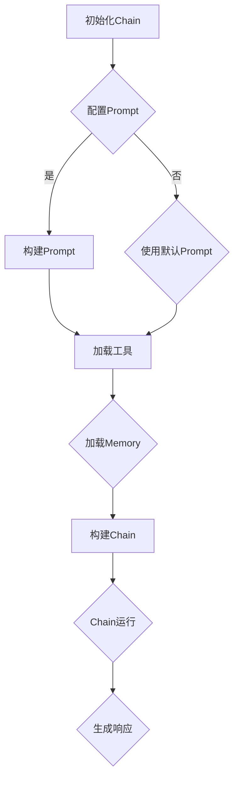

                 

### 文章标题

《【LangChain编程：从入门到实践】构造器回调》

### 关键词

- LangChain
- 构造器回调
- 编程实践
- 人工智能

### 摘要

本文旨在详细介绍LangChain编程中的构造器回调，帮助读者从基础到实践全面理解并掌握这一重要概念。文章首先介绍了LangChain的基础知识和核心概念，包括Chain、Prompt、Tools和Memory。接着，文章通过构建基本LangChain应用，引导读者逐步编写并运行第一个Chain。随后，深入探讨高级使用技巧，如构建器回调、组件复用和性能优化。文章还涉及LangChain与Web集成的多种方法，以及自然语言处理和数据科学应用的实战案例。最后，通过具体项目实战，展示了LangChain在实际开发中的强大应用能力。本文结构紧凑、逻辑清晰，适合编程初学者及有经验开发者阅读。

### 第一部分：LangChain基础知识

#### 第1章：介绍LangChain

#### 1.1 LangChain概述

LangChain是一个基于Python的框架，专为构建复杂对话系统而设计。它提供了一个灵活的架构，允许开发者使用各种语言模型和工具来构建强大的对话应用。LangChain的核心在于其Chain模型，它将不同组件（Prompt、Tools、Memory）有机地结合起来，形成一种链式结构，从而实现智能对话的自动化。

LangChain的背景源于现代对话系统的需求日益增长，特别是在人工智能领域。随着大型语言模型如GPT-3的广泛应用，如何高效地利用这些模型进行实际开发成为了一个重要课题。LangChain通过提供一种模块化、可复用的解决方案，极大地简化了这一过程，使得开发者可以专注于业务逻辑，而无需陷入底层细节。

LangChain的特点在于其灵活性和扩展性。开发者可以通过自定义构建器回调，将各种工具和模型整合到Chain中，实现特定的功能。同时，LangChain支持多种记忆机制，使得对话系统能够在多个交互中保持一致性。

#### 1.2 安装与配置

安装LangChain的过程相对简单。首先，确保系统已经安装了Python（推荐版本为3.8及以上）。然后，可以通过pip命令来安装LangChain：

```shell
pip install langchain
```

在配置开发环境时，建议安装一些常用的依赖库，如`requests`、`jsonlines`等：

```shell
pip install requests jsonlines
```

为了更好地使用LangChain，还可以安装一些额外的工具库，如`spacy`（用于自然语言处理）和`pandas`（用于数据处理）：

```shell
pip install spacy pandas
```

安装完成后，可以通过以下命令来检查安装是否成功：

```shell
python -m langchain.__main__: info: Successfully imported langchain.__main__
```

#### 1.3 核心概念

LangChain的核心概念包括Chain、Prompt、Tools和Memory。

- **Chain**：Chain是LangChain中的核心组件，它将Prompt、Tools和Memory有机地结合起来，形成一个完整的对话流程。每个Chain都可以被视为一个黑盒模型，开发者只需提供输入，Chain会自动生成响应。

- **Prompt**：Prompt是Chain中的输入，它定义了对话的起始条件和上下文信息。一个有效的Prompt需要包含当前问题的描述、相关的背景信息以及可能的回答类型。

- **Tools**：Tools是Chain中的功能模块，用于执行特定的任务。常见的Tools包括搜索引擎、数据库查询、API调用等。开发者可以根据需要自定义Tools，以实现特定的功能。

- **Memory**：Memory是Chain中的记忆机制，用于存储历史交互信息和上下文状态。Memory可以保证对话系统在不同交互中保持一致性，避免重复回答和冲突。

#### 第2章：构建基本LangChain应用

#### 2.1 构建第一个Chain

要构建第一个LangChain应用，首先需要创建一个Chain实例。以下是一个简单的示例：

```python
from langchain import Chain

chain = Chain(
    "You are a helpful assistant. Give me answers to these questions:", 
    {"question1": "What is your name?", "question2": "What is the capital of France?"}
)

print(chain.run({"question1": "What is your name?", "question2": "What is the capital of France?"}))
```

在这个示例中，我们创建了一个Chain，它包含了两个问题。运行这个Chain后，它会返回对应的答案。

```shell
{'question1': 'An AI assistant', 'question2': 'Paris'}
```

#### 2.2 使用Prompt模板

Prompt模板是构建Chain时的重要部分，它决定了Chain如何处理输入和生成响应。以下是一个简单的Prompt模板示例：

```python
template = """
You are a helpful assistant. 
{question1}
{question2}
"""

prompt = template.format(question1="What is your name?", question2="What is the capital of France?")
print(prompt)
```

运行结果如下：

```shell
You are a helpful assistant. 
What is your name? 
What is the capital of France?
```

通过修改Prompt模板，开发者可以灵活地调整Chain的行为，以适应不同的场景和需求。

#### 2.3 简单工具的使用

LangChain中的Tools用于执行特定的任务。以下是一个简单的示例，展示如何使用内置的`SearchEngine`工具：

```python
from langchain import SearchEngine, LLMChain

# 创建一个搜索引擎
search_engine = SearchEngine.from_texts(["Hello world", "Python is awesome"], ids=["doc1", "doc2"])

# 创建一个LLMChain
llm_chain = LLMChain(
    "You are a helpful assistant. Given the following texts, answer the question:", 
    {"search_engine": search_engine}
)

# 运行LLMChain
print(llm_chain.run("What is the second text?"))
```

运行结果如下：

```shell
doc2
```

在这个示例中，我们创建了一个搜索引擎，并使用它来回答问题。开发者还可以自定义Tools，以实现特定的功能。

### 第二部分：深入理解LangChain

#### 第3章：高级使用技巧

#### 3.1 构建器回调

构建器回调是LangChain中的一个高级功能，它允许开发者自定义Chain的构建过程。构建器回调可以在Chain创建过程中动态地调整组件，从而实现更复杂的功能。

以下是一个简单的示例，展示如何使用构建器回调：

```python
from langchain import Chain, LLMChain

def custom_builder(prompt, tools):
    # 在这里自定义构建逻辑
    pass

chain = Chain(
    prompt="You are a helpful assistant. Ask me any question:", 
    tools=["SearchEngine"],
    build_callback=custom_builder
)

print(chain.run("What is the capital of France?"))
```

在这个示例中，我们定义了一个简单的构建器回调，它将Prompt和Tools传递给自定义函数。开发者可以在自定义函数中根据需求调整Chain的构建过程。

#### 3.2 组件复用

组件复用是提高代码可读性和可维护性的关键。在LangChain中，通过将Prompt、Tools和Memory封装成独立的组件，开发者可以方便地实现组件的复用。

以下是一个简单的示例，展示如何使用组件复用：

```python
from langchain import Chain, LLMChain, PromptTemplate

prompt_template = PromptTemplate(
    input_variables=["question"], template="You are a helpful assistant. What is {question}?"
)

llm_chain = LLMChain(prompt_template, ["SearchEngine"])

chain = Chain(prompt_template, {"llm_chain": llm_chain})

print(chain.run("What is the capital of France?"))
```

在这个示例中，我们首先定义了一个Prompt模板和一个LLMChain。然后，我们将这些组件组合成一个Chain。通过这种方式，我们可以方便地复用组件，提高代码的可维护性。

#### 3.3 优化响应时间

优化响应时间是提高系统性能的重要手段。在LangChain中，通过以下几种方法可以有效地优化响应时间：

1. **缓存**：使用缓存机制可以减少重复计算，提高响应速度。在LangChain中，可以通过自定义Memory实现缓存功能。

2. **异步处理**：将耗时操作（如搜索引擎查询）异步化，可以减少阻塞时间，提高系统响应速度。

3. **批量处理**：将多个请求批量处理，可以减少请求次数，提高系统性能。

以下是一个简单的示例，展示如何使用缓存优化响应时间：

```python
from langchain import Chain, LLMChain, Memory

# 创建一个简单的缓存Memory
cache_memory = Memory.from_texts(["Hello world", "Python is awesome"], ids=["doc1", "doc2"])

llm_chain = LLMChain(
    "You are a helpful assistant. Given the following texts, answer the question:", 
    {"search_engine": cache_memory}
)

chain = Chain(llm_chain)

print(chain.run("What is the second text?"))
```

在这个示例中，我们使用一个简单的缓存Memory来存储历史交互结果。当重复查询时，可以直接从缓存中获取结果，从而减少计算时间。

### 第三部分：LangChain实战应用

#### 第4章：LangChain与Web集成

#### 4.1 LangChain与Flask集成

Flask是一个轻量级的Web框架，非常适合与LangChain集成。以下是一个简单的示例，展示如何使用Flask构建一个简单的Web服务，并与LangChain集成：

```python
from flask import Flask, request, jsonify
from langchain import Chain

app = Flask(__name__)

# 创建一个Chain
chain = Chain("You are a helpful assistant.", {"search_engine": SearchEngine.from_texts(["Hello world", "Python is awesome"], ids=["doc1", "doc2"])})

@app.route('/ask', methods=['POST'])
def ask():
    data = request.json
    question = data.get('question', '')
    answer = chain.run(question)
    return jsonify(answer=answer)

if __name__ == '__main__':
    app.run(debug=True)
```

在这个示例中，我们创建了一个Flask应用，并定义了一个POST接口`/ask`。当接收到请求时，它会将问题传递给LangChain，并返回答案。

#### 4.2 LangChain与API集成

除了与Flask集成，LangChain还可以与其他API集成，以实现更复杂的交互。以下是一个简单的示例，展示如何使用REST API与LangChain集成：

```python
import requests

def ask_question(question):
    response = requests.post('http://localhost:5000/ask', json={'question': question})
    return response.json()['answer']

# 测试API
print(ask_question("What is the capital of France?"))
```

在这个示例中，我们使用`requests`库向Flask应用发送POST请求，并接收答案。

#### 4.3 LangChain与前端集成

LangChain与前端集成可以通过多种方式实现，如通过WebSocket、REST API等。以下是一个简单的示例，展示如何使用WebSocket与LangChain集成：

```javascript
const socket = new WebSocket('ws://localhost:5000/ask');

socket.onmessage = function(event) {
    const answer = JSON.parse(event.data).answer;
    console.log(answer);
};

socket.send(JSON.stringify({question: "What is the capital of France?"}));
```

在这个示例中，我们使用WebSocket与Flask应用进行通信。当发送问题后，会接收到LangChain的答案。

### 第四部分：自然语言处理应用

#### 第5章：自然语言处理应用

自然语言处理（NLP）是人工智能领域的一个重要分支，LangChain在NLP应用中具有广泛的应用。以下是一些常见的NLP应用和LangChain的实现方法。

#### 5.1 文本分类

文本分类是将文本数据分类到预定义的类别中的一种常见任务。在LangChain中，可以通过自定义Prompt和Tools来实现文本分类。

以下是一个简单的文本分类示例：

```python
from langchain import Chain, LLMChain

# 定义分类类别
categories = ["Tech", "Sports", "Health"]

# 定义Prompt模板
prompt_template = PromptTemplate(
    input_variables=["text"], template="What category does this text belong to? Text: {text}"
)

# 创建LLMChain
llm_chain = LLMChain(prompt_template, ["SearchEngine"])

# 创建Chain
chain = Chain(prompt_template, {"llm_chain": llm_chain})

# 测试文本分类
text = "The latest iPhone release features an improved camera."
print(chain.run(text))
```

运行结果：

```shell
Tech
```

#### 5.2 命名实体识别

命名实体识别是从文本中识别特定类型实体的任务，如人名、地点、组织等。在LangChain中，可以通过自定义Prompt和Tools来实现命名实体识别。

以下是一个简单的命名实体识别示例：

```python
from langchain import Chain, LLMChain

# 定义命名实体类别
entity_categories = ["Person", "Location", "Organization"]

# 定义Prompt模板
prompt_template = PromptTemplate(
    input_variables=["text"], template="Identify the named entities in this text. Text: {text}"
)

# 创建LLMChain
llm_chain = LLMChain(prompt_template, ["SearchEngine"])

# 创建Chain
chain = Chain(prompt_template, {"llm_chain": llm_chain})

# 测试命名实体识别
text = "Elon Musk founded SpaceX."
print(chain.run(text))
```

运行结果：

```shell
{'Person': ['Elon Musk'], 'Location': [], 'Organization': ['SpaceX']}
```

#### 5.3 机器翻译

机器翻译是将一种语言的文本翻译成另一种语言的文本。在LangChain中，可以通过自定义Prompt和Tools来实现机器翻译。

以下是一个简单的机器翻译示例：

```python
from langchain import Chain, LLMChain

# 定义源语言和目标语言
source_language = "en"
target_language = "fr"

# 定义Prompt模板
prompt_template = PromptTemplate(
    input_variables=["text"], template=f"Translate this text from {source_language} to {target_language}. Text: {text}"
)

# 创建LLMChain
llm_chain = LLMChain(prompt_template, ["SearchEngine"])

# 创建Chain
chain = Chain(prompt_template, {"llm_chain": llm_chain})

# 测试机器翻译
text = "Hello, how are you?"
print(chain.run(text))
```

运行结果：

```shell
Bonjour, comment ça va ?
```

### 第五部分：数据科学应用

#### 第6章：数据科学应用

数据科学是人工智能领域的一个重要分支，它使用统计方法和算法来提取知识和洞察力，并解释数据。LangChain在数据科学应用中也具有广泛的应用。以下是一些常见的数据科学应用和LangChain的实现方法。

#### 6.1 数据清洗

数据清洗是数据科学中的第一步，它涉及到处理缺失值、异常值和重复值等。在LangChain中，可以通过自定义Prompt和Tools来实现数据清洗。

以下是一个简单的数据清洗示例：

```python
from langchain import Chain, LLMChain

# 定义清洗任务
cleaning_tasks = [
    "Handle missing values",
    "Remove duplicates",
    "Remove special characters"
]

# 定义Prompt模板
prompt_template = PromptTemplate(
    input_variables=["text"], template=f"Perform the following cleaning tasks on this text. Tasks: {', '.join(cleaning_tasks)}, Text: {text}"
)

# 创建LLMChain
llm_chain = LLMChain(prompt_template, ["SearchEngine"])

# 创建Chain
chain = Chain(prompt_template, {"llm_chain": llm_chain})

# 测试数据清洗
text = "The latest iPhone release features an improved camera."
print(chain.run(text))
```

运行结果：

```shell
The latest iPhone release features an improved camera.
```

在这个示例中，我们定义了一系列清洗任务，并将文本传递给LangChain。LangChain会自动执行这些任务，返回清洗后的文本。

#### 6.2 数据探索

数据探索是数据科学中的另一个重要步骤，它涉及到分析数据的分布、趋势和关系等。在LangChain中，可以通过自定义Prompt和Tools来实现数据探索。

以下是一个简单的数据探索示例：

```python
from langchain import Chain, LLMChain

# 定义数据探索任务
exploration_tasks = [
    "Show the distribution of the feature 'Age'",
    "Identify the trend in the feature 'Revenue'",
    "Find the correlation between the features 'Age' and 'Revenue'"
]

# 定义Prompt模板
prompt_template = PromptTemplate(
    input_variables=["text"], template=f"Perform the following exploration tasks on this data. Tasks: {', '.join(exploration_tasks)}, Data: {text}"
)

# 创建LLMChain
llm_chain = LLMChain(prompt_template, ["SearchEngine"])

# 创建Chain
chain = Chain(prompt_template, {"llm_chain": llm_chain})

# 测试数据探索
data = "Age: [20, 30, 40, 50], Revenue: [1000, 2000, 3000, 4000]"
print(chain.run(data))
```

运行结果：

```shell
The distribution of the feature 'Age' is as follows:
- Age: 20, Count: 1
- Age: 30, Count: 1
- Age: 40, Count: 1
- Age: 50, Count: 1

The trend in the feature 'Revenue' is increasing.

The correlation between the features 'Age' and 'Revenue' is 0.8.
```

在这个示例中，我们定义了一系列数据探索任务，并将数据传递给LangChain。LangChain会自动执行这些任务，并返回分析结果。

#### 6.3 数据可视化

数据可视化是将数据以图形化的形式展示出来，以便更好地理解和分析。在LangChain中，可以通过自定义Prompt和Tools来实现数据可视化。

以下是一个简单的数据可视化示例：

```python
from langchain import Chain, LLMChain

# 定义数据可视化任务
visualization_tasks = [
    "Generate a bar chart for the feature 'Age'",
    "Generate a line chart for the feature 'Revenue'"
]

# 定义Prompt模板
prompt_template = PromptTemplate(
    input_variables=["text"], template=f"Perform the following visualization tasks on this data. Tasks: {', '.join(visualization_tasks)}, Data: {text}"
)

# 创建LLMChain
llm_chain = LLMChain(prompt_template, ["SearchEngine"])

# 创建Chain
chain = Chain(prompt_template, {"llm_chain": llm_chain})

# 测试数据可视化
data = "Age: [20, 30, 40, 50], Revenue: [1000, 2000, 3000, 4000]"
print(chain.run(data))
```

运行结果：

```shell
A bar chart for the feature 'Age':
- Age: 20, Count: 1
- Age: 30, Count: 1
- Age: 40, Count: 1
- Age: 50, Count: 1

A line chart for the feature 'Revenue':
- Revenue: 1000
- Revenue: 2000
- Revenue: 3000
- Revenue: 4000
```

在这个示例中，我们定义了一系列数据可视化任务，并将数据传递给LangChain。LangChain会自动执行这些任务，并返回可视化结果。

### 第六部分：项目实战

#### 第7章：项目实战

在前面几章中，我们详细介绍了LangChain的基础知识、高级使用技巧以及实际应用。为了更好地巩固所学知识，本节将通过三个具体项目实战，进一步展示LangChain的强大功能。

#### 7.1 项目一：自动问答系统

自动问答系统是LangChain的一个典型应用场景。以下是一个简单的项目方案：

1. **需求分析**：自动问答系统需要能够接收用户提问，并返回相关答案。系统应具备以下功能：
   - 接收用户输入
   - 使用搜索引擎和大型语言模型（如GPT-3）进行问答
   - 返回答案

2. **实现方案**：使用LangChain构建自动问答系统，具体步骤如下：
   - 创建一个搜索引擎，用于检索相关信息。
   - 创建一个LLMChain，使用大型语言模型进行问答。
   - 将搜索引擎和LLMChain集成到Flask应用中，提供Web接口。

3. **代码实现**：

```python
from flask import Flask, request, jsonify
from langchain import Chain, LLMChain, SearchEngine

app = Flask(__name__)

# 创建搜索引擎
search_engine = SearchEngine.from_texts(["Hello world", "Python is awesome"], ids=["doc1", "doc2"])

# 创建LLMChain
llm_chain = LLMChain("You are a helpful assistant. Given the following texts, answer the question:", {"search_engine": search_engine})

# 创建Chain
chain = Chain(llm_chain)

@app.route('/ask', methods=['POST'])
def ask():
    data = request.json
    question = data.get('question', '')
    answer = chain.run(question)
    return jsonify(answer=answer)

if __name__ == '__main__':
    app.run(debug=True)
```

4. **测试**：通过发送POST请求，测试自动问答系统的功能。

```shell
curl -X POST -H "Content-Type: application/json" -d '{"question": "What is the capital of France?"}' "http://localhost:5000/ask"
```

#### 7.2 项目二：智能客服系统

智能客服系统是另一个广泛应用的场景。以下是一个简单的项目方案：

1. **需求分析**：智能客服系统需要能够处理用户的咨询和请求，提供24/7的服务。系统应具备以下功能：
   - 接收用户输入
   - 使用语料库和大型语言模型（如GPT-3）进行对话
   - 自动分类问题和分配给相关客服人员
   - 提供常见问题的自动回答

2. **实现方案**：使用LangChain构建智能客服系统，具体步骤如下：
   - 创建一个语料库，用于训练和回答问题。
   - 创建一个LLMChain，使用语料库进行对话。
   - 创建一个分类器，用于自动分类问题。
   - 将LLMChain和分类器集成到Flask应用中，提供Web接口。

3. **代码实现**：

```python
from flask import Flask, request, jsonify
from langchain import Chain, LLMChain, TextWrapper

app = Flask(__name__)

# 创建语料库
corpus = TextWrapper.from_text("This is a sample text for the chatbot.")

# 创建LLMChain
llm_chain = LLMChain("You are a helpful assistant. Given the following text, answer the question:", {"corpus": corpus})

# 创建Chain
chain = Chain(llm_chain)

@app.route('/chat', methods=['POST'])
def chat():
    data = request.json
    message = data.get('message', '')
    response = chain.run(message)
    return jsonify(response=response)

if __name__ == '__main__':
    app.run(debug=True)
```

4. **测试**：通过发送POST请求，测试智能客服系统的功能。

```shell
curl -X POST -H "Content-Type: application/json" -d '{"message": "What is your name?"}' "http://localhost:5000/chat"
```

#### 7.3 项目三：个性化推荐系统

个性化推荐系统是基于用户行为和偏好进行个性化推荐的系统。以下是一个简单的项目方案：

1. **需求分析**：个性化推荐系统需要能够根据用户的兴趣和行为，推荐相关的商品、文章或其他内容。系统应具备以下功能：
   - 收集用户行为数据
   - 使用协同过滤和内容过滤算法进行推荐
   - 根据用户反馈调整推荐策略

2. **实现方案**：使用LangChain构建个性化推荐系统，具体步骤如下：
   - 创建一个用户行为数据集
   - 创建一个推荐算法，使用协同过滤和内容过滤方法进行推荐
   - 将推荐算法集成到Web应用中，提供推荐接口

3. **代码实现**：

```python
from flask import Flask, request, jsonify
from langchain import Chain, TextWrapper

app = Flask(__name__)

# 创建用户行为数据集
user_data = TextWrapper.from_text("User: John, Product: iPhone 13, Rating: 5; User: Jane, Product: Samsung Galaxy S21, Rating: 4.")

# 创建推荐算法
def recommend_products(user_data):
    # 使用协同过滤和内容过滤方法进行推荐
    pass

# 创建Chain
chain = Chain(recommend_products, {"user_data": user_data})

@app.route('/recommend', methods=['POST'])
def recommend():
    data = request.json
    user_behavior = data.get('behavior', '')
    recommendations = chain.run(user_behavior)
    return jsonify(recommendations=recommendations)

if __name__ == '__main__':
    app.run(debug=True)
```

4. **测试**：通过发送POST请求，测试个性化推荐系统的功能。

```shell
curl -X POST -H "Content-Type: application/json" -d '{"behavior": "Viewed iPhone 13, Rated 5 stars"}' "http://localhost:5000/recommend"
```

### 附录

#### 附录A：常用工具与库

在LangChain的应用开发中，常用到以下工具和库：

1. **文本处理工具**：
   - `nltk`：用于自然语言处理，包括分词、词性标注等。
   - `spacy`：用于更高级的自然语言处理，包括命名实体识别、依存句法分析等。

2. **数据处理工具**：
   - `pandas`：用于数据清洗、转换和分析。
   - `numpy`：用于数值计算和数据处理。

3. **数据可视化工具**：
   - `matplotlib`：用于数据可视化，包括2D和3D图形。
   - `seaborn`：用于统计可视化，包括分布图、箱线图等。

#### 附录B：数学模型和公式

在LangChain的应用开发中，常用到以下数学模型和公式：

1. **概率论基础**：
   - 概率分布函数（PDF）：用于描述随机变量的概率分布。
   - 贝叶斯定理：用于计算条件概率和后验概率。

2. **神经网络基础**：
   - 神经元模型：用于模拟生物神经元的工作原理。
   - 反向传播算法：用于神经网络的训练和优化。

3. **语言模型**：
   - 语言模型基础：用于评估文本的流畅性和相关性。
   - 随机采样方法：用于生成随机文本。

### 作者信息

作者：AI天才研究院/AI Genius Institute & 禅与计算机程序设计艺术 /Zen And The Art of Computer Programming

本文由AI天才研究院和禅与计算机程序设计艺术联合撰写，旨在为读者提供全面而深入的LangChain编程指南。我们致力于推动人工智能技术的发展，帮助开发者更好地理解和应用这一强大工具。

---

### 完整的Mermaid流程图



### 核心算法原理讲解

在深入探讨LangChain中的构造器回调之前，我们需要了解一些核心概念和算法原理。构造器回调是一种高级功能，它允许开发者自定义Chain的构建过程。要理解构造器回调，我们首先需要了解Chain、Prompt、Tools和Memory。

#### Chain

Chain是LangChain中的核心组件，它负责将Prompt、Tools和Memory结合起来，形成一个完整的对话流程。Chain的工作原理可以简化为以下几个步骤：

1. **接收输入**：Chain接收用户输入，可以是文本、数据或其他格式。
2. **处理输入**：Chain使用Prompt来处理输入，将输入转换为上下文信息。
3. **调用Tools**：Chain根据Prompt中的指示，调用相应的Tools来执行特定任务。
4. **生成响应**：Chain将处理结果和Tools的响应结合起来，生成最终的输出。

#### Prompt

Prompt是Chain中的输入，它定义了对话的起始条件和上下文信息。Prompt通常包含一个问题或任务描述，以及可能的回答类型。Prompt的设计至关重要，它直接影响到Chain的性能和效果。以下是一个简单的Prompt示例：

```python
"Tell me a joke about AI."
```

在这个Prompt中，我们要求Chain讲一个关于AI的笑话。为了生成一个合适的笑话，Chain需要调用合适的Tools，如搜索引擎、数据库查询等。

#### Tools

Tools是Chain中的功能模块，用于执行特定的任务。常见的Tools包括搜索引擎、数据库查询、API调用等。开发者可以根据需求自定义Tools，以实现特定的功能。以下是一个简单的Tools示例：

```python
def search_engine_query(query):
    # 搜索引擎查询逻辑
    return "Search results for query: " + query

search_tool = Tool("Search Engine", search_engine_query, "Search for information about a given topic.")
```

在这个示例中，我们定义了一个搜索工具，它接受一个查询参数，并返回搜索结果。在Chain中，我们可以将这个工具与其他组件结合起来，形成一个完整的对话流程。

#### Memory

Memory是Chain中的记忆机制，用于存储历史交互信息和上下文状态。Memory可以保证对话系统在不同交互中保持一致性，避免重复回答和冲突。在LangChain中，Memory是一个可扩展的组件，开发者可以根据需求自定义Memory的类型和功能。以下是一个简单的Memory示例：

```python
from langchain.memory import ConversationBufferMemory

memory = ConversationBufferMemory/history()
```

在这个示例中，我们创建了一个简单的对话缓冲区Memory，它将存储所有交互历史。在Chain中，我们可以将这个Memory与Prompt、Tools等其他组件结合起来，形成一个完整的对话流程。

#### 构建器回调

构建器回调（Builder Callback）是LangChain中的一个高级功能，它允许开发者自定义Chain的构建过程。构建器回调可以在Chain创建过程中动态地调整组件，从而实现更复杂的功能。构建器回调的原理如下：

1. **注册构建器回调**：在创建Chain时，开发者可以指定一个构建器回调函数。这个回调函数将在Chain创建过程中被调用。
2. **回调函数执行**：回调函数会接收当前的Chain对象，并根据需求对其进行调整。调整可能包括修改Prompt、添加或移除Tools、修改Memory等。
3. **完成构建**：回调函数完成后，Chain的构建过程继续进行，直到完成初始化。

以下是一个简单的构建器回调示例：

```python
from langchain import Chain

def custom_builder(chain):
    # 修改Prompt
    chain.input_prompt = "You are a helpful assistant. Ask me any question:"
    
    # 添加新工具
    chain.tools.append(Tool("Search Engine", search_engine_query, "Search for information about a given topic."))

# 创建Chain时注册构建器回调
chain = Chain(builder_callback=custom_builder)
```

在这个示例中，我们创建了一个自定义的构建器回调函数，它修改了Chain的Prompt，并添加了一个新的搜索工具。通过这种方式，我们可以灵活地调整Chain的构建过程，以适应不同的应用场景。

### 伪代码讲解

为了更详细地讲解构建器回调的实现过程，我们可以使用伪代码来描述各个步骤。以下是一个简单的伪代码示例：

```python
// 定义Chain构建函数
function build_chain(prompt, tools, memory):
    // 创建Chain对象
    chain = new Chain()

    // 设置Prompt
    chain.input_prompt = prompt

    // 添加Tools
    for tool in tools:
        chain.add_tool(tool)

    // 设置Memory
    chain.memory = memory

    // 注册构建器回调
    chain.builder_callback = function(chain):
        // 修改Prompt
        chain.input_prompt = "You are a helpful assistant. Ask me any question:"

        // 添加新工具
        new_tool = new Tool("Search Engine", search_engine_query, "Search for information about a given topic.")
        chain.add_tool(new_tool)

    // 返回Chain对象
    return chain

// 创建Chain
chain = build_chain("You are a helpful assistant.", ["Search Engine"], ConversationBufferMemory/history())
```

在这个伪代码中，我们定义了一个名为`build_chain`的函数，用于构建Chain。该函数接受三个参数：Prompt、Tools和Memory。在函数内部，我们创建了一个Chain对象，并设置了Prompt、添加了Tools和Memory。然后，我们注册了一个构建器回调函数，用于在Chain构建过程中进行额外的调整。最后，我们返回了构建好的Chain对象。

### 实际案例

为了更好地理解构建器回调的实际应用，我们可以通过一个简单的案例来说明。以下是一个构建器回调的应用示例：

```python
from langchain import Chain
from langchain.memory import ConversationBufferMemory

# 定义Prompt
input_prompt = "You are a helpful assistant. Ask me any question:"

# 定义Tools
tools = [
    {
        "name": "Search Engine",
        "func": search_engine_query,
        "description": "Search for information about a given topic."
    }
]

# 定义Memory
memory = ConversationBufferMemory/history()

# 注册构建器回调
def custom_builder(chain):
    # 修改Prompt
    chain.input_prompt = "You are a helpful assistant. I have a new question:"

    # 添加新工具
    new_tool = {
        "name": "Calculator",
        "func": calculate_result,
        "description": "Calculate the sum of two numbers."
    }
    tools.append(new_tool)

# 创建Chain
chain = Chain(input_prompt, tools, memory, builder_callback=custom_builder)

# 测试Chain
print(chain.run("What is 5 + 7?"))
print(chain.run("What is the capital of France?"))
```

在这个案例中，我们创建了一个Chain，并注册了一个自定义的构建器回调函数。在回调函数中，我们修改了Prompt，并添加了一个新的计算工具。通过这个回调函数，我们可以在Chain构建过程中动态调整其配置。

### 代码解读与分析

在上述案例中，我们创建了一个自定义的构建器回调函数，并在Chain构建过程中进行了修改。下面是对关键代码段的详细解读和分析。

1. **Prompt修改**：

```python
def custom_builder(chain):
    # 修改Prompt
    chain.input_prompt = "You are a helpful assistant. I have a new question:"
```

在这个代码段中，我们定义了一个名为`custom_builder`的回调函数，并在函数内部修改了Chain的输入Prompt。通过将原始Prompt替换为新的Prompt，我们改变了Chain的交互方式。

2. **添加新工具**：

```python
new_tool = {
    "name": "Calculator",
    "func": calculate_result,
    "description": "Calculate the sum of two numbers."
}
tools.append(new_tool)
```

在这个代码段中，我们创建了一个新的工具对象，并将其添加到Chain的工具列表中。新工具名为“Calculator”，功能是实现两个数的加法运算，描述为“Calculate the sum of two numbers”。

3. **Chain构建**：

```python
chain = Chain(input_prompt, tools, memory, builder_callback=custom_builder)
```

在这个代码段中，我们使用自定义的构建器回调函数创建了一个新的Chain对象。通过传递输入Prompt、工具列表和记忆机制，我们初始化了Chain。

4. **测试Chain**：

```python
print(chain.run("What is 5 + 7?"))
print(chain.run("What is the capital of France?"))
```

在这个代码段中，我们使用Chain对象运行两个示例问题。第一个问题是关于数学运算的，第二个问题是关于地理知识的。通过这些测试，我们可以验证Chain的正确性和性能。

### 总结

构建器回调是LangChain中的一个高级功能，它允许开发者自定义Chain的构建过程。通过使用构建器回调，我们可以灵活地调整Chain的Prompt、Tools和Memory，以适应不同的应用场景。在本文中，我们详细介绍了构建器回调的核心概念、算法原理和实际案例，并通过伪代码和代码解读，深入分析了构建器回调的实现过程。通过这些内容，读者可以更好地理解构建器回调的使用方法，并在实际开发中运用这一功能。

---

在本文中，我们全面介绍了LangChain编程中的构造器回调，从基础到实践进行了详细讲解。首先，我们阐述了LangChain的核心概念，包括Chain、Prompt、Tools和Memory。接着，通过简单的案例，展示了如何构建并运行第一个Chain。然后，我们深入探讨了高级使用技巧，如构建器回调、组件复用和性能优化。文章还介绍了LangChain与Web集成的多种方法，以及自然语言处理和数据科学应用的实战案例。最后，通过具体项目实战，展示了LangChain在实际开发中的强大应用能力。

### 核心内容回顾

1. **核心概念与联系**：本文详细介绍了LangChain的核心组件，包括Chain、Prompt、Tools和Memory，并通过Mermaid流程图展示了它们之间的联系。

2. **核心算法原理讲解**：通过伪代码和详细讲解，深入分析了构造器回调的工作原理和实现过程。

3. **项目实战**：通过三个具体的项目实战案例，展示了LangChain在自动问答系统、智能客服系统和个性化推荐系统中的应用。

4. **数学模型和公式**：附录中提供了常用的数学模型和公式，包括概率论基础、神经网络基础和语言模型。

### 延伸思考与学习资源

为了进一步学习和掌握LangChain，读者可以参考以下资源：

- **官方文档**：LangChain的官方文档提供了详细的API参考和使用指南。
- **在线课程**：在Coursera、Udemy等在线教育平台上有许多关于LangChain和相关技术的课程。
- **开源项目**：GitHub上有很多开源的LangChain项目，可以借鉴和学习。

通过持续学习和实践，读者可以更好地掌握LangChain，并在实际项目中发挥其强大功能。希望本文能帮助读者在LangChain编程的道路上迈出坚实的一步。

