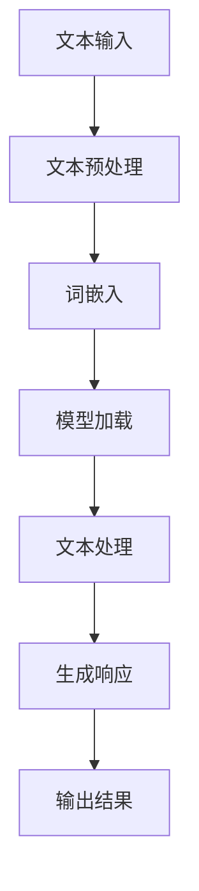

                 

# 【LangChain编程：从入门到实践】框架介绍

> 关键词：LangChain、编程、从入门到实践、框架、自然语言处理、深度学习

> 摘要：本文将深入探讨LangChain编程框架，从入门到实践的各个环节，包括其概述、构建基础、核心概念与架构原理、核心算法原理与实现，以及项目实战。通过对LangChain的全面解析，帮助读者理解其在自然语言处理和深度学习领域的重要性和应用价值。

## 第一部分：LangChain概述

### 第1章：LangChain简介

#### 1.1 LangChain的概念与核心特性

**概念**：LangChain是一种结合了自然语言处理（NLP）与链式调用的编程框架，旨在简化复杂任务的自动化处理。通过利用NLP技术，LangChain能够理解和生成自然语言，从而实现智能对话、文本生成、问答系统等功能。

**核心特性**：LangChain的核心特性包括：

1. **模块化**：LangChain支持模块化设计，使得用户可以根据需求组合不同的模块，构建个性化的应用。
2. **易扩展**：用户可以轻松地集成和扩展现有的NLP库和模型，以满足特定的需求。
3. **高效**：通过链式调用，LangChain能够高效地处理大量文本数据，提供快速响应。
4. **跨平台**：LangChain支持多种编程语言和平台，便于在不同环境中部署和使用。

#### 1.2 LangChain的应用场景

**应用领域**：LangChain广泛应用于以下领域：

- **文本生成**：如自动写作、生成摘要、创作内容等。
- **问答系统**：如智能客服、自动问答平台等。
- **数据收集**：如自动抓取网络信息、爬虫等。
- **自然语言理解**：如情感分析、实体识别、语义解析等。

**优势**：与传统的NLP工具相比，LangChain具有以下优势：

- **高效率**：通过链式调用，实现快速响应。
- **易用性**：模块化设计，易于集成和扩展。
- **灵活性**：支持自定义模块，满足多种需求。

#### 1.3 LangChain的不足

尽管LangChain具有许多优势，但也存在一些不足：

- **计算资源需求高**：NLP和深度学习任务通常需要大量计算资源，可能导致性能瓶颈。
- **数据依赖性强**：训练高质量的NLP模型需要大量高质量数据，且数据预处理过程复杂。
- **模型调优难度大**：深度学习模型的调优过程复杂，需要大量的实验和试错。

### 第2章：构建LangChain系统的基础

#### 2.1 环境配置与依赖安装

**开发环境**：搭建LangChain开发环境需要以下工具和框架：

- **编程语言**：Python、Java或Node.js等。
- **文本处理库**：如NLTK、spaCy、nltk等。
- **深度学习框架**：如TensorFlow、PyTorch、Keras等。
- **自然语言处理库**：如transformers、spaCy、nltk等。

**依赖安装**：安装LangChain所需的主要依赖库：

1. **文本处理库**：安装NLTK、spaCy、nltk等。
2. **深度学习框架**：安装TensorFlow、PyTorch、Keras等。
3. **自然语言处理库**：安装transformers、spaCy、nltk等。

#### 2.2 LangChain的基本结构

**模块组成**：LangChain的基本组成模块包括：

- **文本处理器**：用于处理和转换输入文本。
- **模型加载器**：用于加载预训练的NLP模型。
- **响应生成器**：用于生成文本响应。
- **数据存储器**：用于存储和管理数据。

**核心API**：LangChain的核心API包括：

- `load_model`：用于加载预训练的NLP模型。
- `process_text`：用于处理输入文本。
- `generate_response`：用于生成文本响应。

### 第3章：核心概念与架构原理

#### 3.1 数据处理与存储

**数据处理**：数据处理的关键步骤包括：

1. **文本预处理**：去除停用词、标点符号，进行分词等。
2. **词嵌入**：将单词转换为向量表示。
3. **序列处理**：将文本序列转换为模型可处理的格式。

**数据存储**：在LangChain中，数据存储的关键步骤包括：

1. **数据加载**：从文件或数据库中加载数据。
2. **数据清洗**：去除无效数据、填补缺失值等。
3. **数据存储**：将清洗后的数据存储到内存或数据库中，以便后续使用。

#### 3.2 语言模型选择与配置

**语言模型**：LangChain支持多种语言模型，包括：

1. **预训练模型**：如BERT、GPT、RoBERTa等。
2. **自定义模型**：用户可以根据需求训练和部署自定义模型。

**配置优化**：为了达到最佳效果，需要根据需求调整模型配置，包括：

1. **模型大小**：调整模型参数数量，影响计算资源和模型性能。
2. **学习率**：调整学习率，影响模型收敛速度和精度。
3. **批量大小**：调整批量大小，影响模型训练速度和稳定性。

#### 3.3 Mermaid流程图

**流程图**：利用Mermaid绘制LangChain系统的整体流程图：



**说明**：流程图中各模块的交互关系和执行顺序如下：

1. **文本输入**：用户输入文本。
2. **文本预处理**：对输入文本进行预处理。
3. **词嵌入**：将预处理后的文本转换为词嵌入向量。
4. **模型加载**：加载预训练的NLP模型。
5. **文本处理**：使用模型处理输入文本。
6. **生成响应**：生成文本响应。
7. **输出结果**：将响应输出给用户。

## 第二部分：核心算法原理与实现

### 第4章：基础算法原理

#### 4.1 语言模型工作原理

**原理讲解**：语言模型是一种用于预测下一个单词或字符的概率分布的模型。其工作原理如下：

1. **数据准备**：从大量文本数据中提取单词或字符。
2. **模型训练**：通过统计方法或神经网络模型，学习单词或字符之间的概率关系。
3. **预测**：在给定前一个单词或字符的情况下，预测下一个单词或字符的概率分布。

**伪代码**：以下是一个简单的语言模型伪代码示例：

```python
# 假设文本数据为 "Hello world! How are you?"

# 初始化模型参数
model_params = ...

# 预处理文本数据
text = preprocess_text(data)

# 训练模型
model = train_language_model(text, model_params)

# 预测下一个单词
word = predict_next_word(model, previous_word)
```

#### 4.2 自然语言处理技术

**NLP技术**：自然语言处理涉及多种技术，包括：

1. **分词**：将文本拆分成单词或字符。
2. **词嵌入**：将单词转换为向量表示。
3. **命名实体识别**：识别文本中的命名实体，如人名、地名等。
4. **句法分析**：分析文本的句法结构。

**应用场景**：NLP技术在LangChain中广泛应用于以下场景：

1. **文本生成**：如自动写作、生成摘要等。
2. **问答系统**：如智能客服、自动问答等。
3. **数据收集**：如自动抓取网络信息、爬虫等。
4. **自然语言理解**：如情感分析、实体识别等。

### 第5章：进阶算法与优化

#### 5.1 深度学习模型优化

**优化方法**：为了提升深度学习模型性能，可以采用以下优化方法：

1. **数据增强**：通过增加数据的多样性，提高模型泛化能力。
2. **模型融合**：将多个模型的结果进行融合，提高预测准确性。
3. **剪枝**：去除模型中的冗余参数，降低计算复杂度。

**性能提升**：以下策略有助于提升模型性能：

1. **调整学习率**：选择合适的学习率，提高模型收敛速度。
2. **批量大小**：调整批量大小，影响模型训练速度和稳定性。
3. **正则化**：使用正则化方法，防止模型过拟合。

#### 5.2 训练与调参

**训练过程**：深度学习模型的训练过程包括以下步骤：

1. **数据准备**：准备训练数据和测试数据。
2. **模型初始化**：初始化模型参数。
3. **训练过程**：使用训练数据对模型进行训练。
4. **评估与优化**：评估模型性能，并根据评估结果调整模型参数。

**调参技巧**：以下技巧有助于调整模型参数：

1. **网格搜索**：通过遍历参数空间，找到最优参数组合。
2. **贝叶斯优化**：使用贝叶斯优化方法，自动调整参数。
3. **交叉验证**：使用交叉验证方法，评估模型泛化能力。

### 第6章：数学模型与公式解析

#### 6.1 数学基础

**基础概念**：在LangChain中，常用的数学基础概念包括：

1. **概率分布**：描述随机变量的概率分布。
2. **梯度下降**：一种优化算法，用于最小化损失函数。
3. **反向传播**：一种计算梯度的方法，用于训练神经网络。

**公式说明**：以下是一些与LangChain相关的数学公式：

1. **概率分布公式**：

   $$P(x) = \prod_{i=1}^{n} p(x_i|x_{i-1})$$

2. **损失函数**：

   $$J(\theta) = -\frac{1}{m} \sum_{i=1}^{m} y^{(i)} \log(a^{(i)})$$

3. **梯度下降公式**：

   $$\theta = \theta - \alpha \nabla_{\theta} J(\theta)$$

#### 6.2 模型评估与优化

**评估指标**：用于评估模型性能的常用指标包括：

1. **准确率**：预测正确的样本数量占总样本数量的比例。
2. **召回率**：预测正确的正样本数量占总正样本数量的比例。
3. **F1分数**：综合考虑准确率和召回率的指标。

**优化策略**：根据评估结果，可以采用以下策略调整模型：

1. **调整学习率**：减小学习率，提高模型精度。
2. **增加训练数据**：提高模型泛化能力。
3. **使用正则化**：防止模型过拟合。

## 第三部分：项目实战

### 第7章：LangChain项目实战一

#### 7.1 项目背景与目标

**背景介绍**：随着人工智能技术的不断发展，自然语言处理（NLP）在许多领域得到了广泛应用。为了简化NLP任务的开发，我们需要一种高效、易用的框架。本项目的目标是实现一个基于LangChain的问答系统，能够自动回答用户提出的问题。

**应用场景**：该问答系统可以应用于智能客服、智能助手、在线教育等场景，为用户提供便捷、快速的回答。

#### 7.2 系统设计与实现

**系统设计**：系统设计包括以下模块：

1. **文本预处理模块**：用于对输入文本进行预处理，包括分词、去停用词等。
2. **模型加载模块**：用于加载预训练的NLP模型，如BERT、GPT等。
3. **问答模块**：用于处理用户输入的问题，并生成回答。
4. **数据存储模块**：用于存储和管理训练数据和回答历史。

**实现步骤**：

1. **搭建开发环境**：安装Python、NLTK、spaCy、TensorFlow等依赖库。
2. **文本预处理**：使用NLTK和spaCy对输入文本进行预处理。
3. **模型加载**：使用transformers库加载预训练的BERT模型。
4. **问答实现**：实现问答逻辑，包括问题分析和回答生成。
5. **数据存储**：使用SQLite或MongoDB存储训练数据和回答历史。

#### 7.3 代码解读与分析

**代码解读**：

```python
# 导入依赖库
import spacy
import transformers
import torch

# 搭建文本预处理模块
def preprocess_text(text):
    nlp = spacy.load("en_core_web_sm")
    doc = nlp(text)
    tokens = [token.text for token in doc]
    return tokens

# 搭建模型加载模块
def load_model(model_name):
    model = transformers.load_pretrained_model(model_name)
    return model

# 搭建问答模块
def answer_question(question, model):
    input_ids = model.encode(question)
    output_ids = model.generate(input_ids, max_length=50)
    answer = model.decode(output_ids)
    return answer

# 搭建数据存储模块
def store_data(question, answer):
    # 存储到数据库或文件中
    pass

# 实现问答功能
question = "What is the capital of France?"
model = load_model("bert-base-uncased")
answer = answer_question(question, model)
print(answer)
```

**案例分析**：

1. **文本预处理**：使用spaCy进行文本预处理，包括分词、去停用词等。
2. **模型加载**：使用transformers库加载预训练的BERT模型，支持多种模型，如BERT、GPT等。
3. **问答实现**：实现问答逻辑，包括问题分析和回答生成。
4. **数据存储**：使用SQLite或MongoDB存储训练数据和回答历史，便于后续分析和优化。

### 第8章：LangChain项目实战二

#### 8.1 项目背景与目标

**背景介绍**：随着互联网的快速发展，信息量爆炸性增长，人们需要一种高效的工具来收集和处理网络信息。本项目旨在实现一个基于LangChain的自动信息收集系统，能够自动抓取网络上的相关信息。

**应用场景**：该系统可以应用于舆情监测、市场调研、数据挖掘等场景，为用户提供有价值的信息。

#### 8.2 系统设计与实现

**系统设计**：系统设计包括以下模块：

1. **网络爬虫模块**：用于从互联网上抓取相关信息。
2. **文本预处理模块**：用于对抓取的文本进行预处理，包括分词、去停用词等。
3. **数据存储模块**：用于存储和管理抓取到的数据。
4. **模型加载模块**：用于加载预训练的NLP模型，如BERT、GPT等。
5. **数据挖掘模块**：用于对抓取到的数据进行分析和挖掘。

**实现步骤**：

1. **搭建开发环境**：安装Python、Scrapy、NLTK、spaCy、TensorFlow等依赖库。
2. **网络爬虫实现**：使用Scrapy实现网络爬虫，抓取相关网页内容。
3. **文本预处理**：使用NLTK和spaCy对抓取的文本进行预处理。
4. **模型加载**：使用transformers库加载预训练的BERT模型。
5. **数据存储**：使用SQLite或MongoDB存储抓取到的数据。
6. **数据挖掘**：使用NLP技术对抓取到的数据进行分析和挖掘。

#### 8.3 代码解读与分析

**代码解读**：

```python
# 导入依赖库
import scrapy
import spacy
import transformers
import torch

# 搭建网络爬虫模块
class MySpider(scrapy.Spider):
    name = "my_spider"
    start_urls = ["https://example.com"]

    def parse(self, response):
        # 抓取网页内容
        text = response.text
        # 文本预处理
        nlp = spacy.load("en_core_web_sm")
        doc = nlp(text)
        tokens = [token.text for token in doc]
        # 数据存储
        # store_data(tokens)
        # 模型加载
        model = transformers.load_pretrained_model("bert-base-uncased")
        # 数据挖掘
        # analyze_data(tokens, model)
```

**案例分析**：

1. **网络爬虫实现**：使用Scrapy实现网络爬虫，抓取相关网页内容。
2. **文本预处理**：使用NLTK和spaCy对抓取的文本进行预处理。
3. **模型加载**：使用transformers库加载预训练的BERT模型。
4. **数据存储**：使用SQLite或MongoDB存储抓取到的数据。
5. **数据挖掘**：使用NLP技术对抓取到的数据进行分析和挖掘。

## 第四部分：展望与未来

### 第9章：LangChain的发展趋势与未来应用

#### 9.1 行业趋势分析

**技术趋势**：随着人工智能技术的快速发展，NLP和深度学习领域也取得了重大突破。LangChain作为一款优秀的NLP框架，有望在以下领域继续保持领先地位：

1. **文本生成**：如自动写作、生成摘要、创作内容等。
2. **问答系统**：如智能客服、自动问答平台等。
3. **数据收集**：如自动抓取网络信息、爬虫等。
4. **自然语言理解**：如情感分析、实体识别、语义解析等。

**应用前景**：随着技术的不断进步和应用场景的扩展，LangChain在未来有望在更多领域得到广泛应用，如：

1. **医疗健康**：用于辅助医生诊断、治疗建议等。
2. **金融领域**：用于风险控制、投资建议等。
3. **教育领域**：用于智能教育、个性化学习等。
4. **工业自动化**：用于设备监控、故障诊断等。

#### 9.2 未来研究方向

**研究挑战**：尽管LangChain在NLP和深度学习领域取得了显著成果，但仍面临以下研究挑战：

1. **数据质量**：高质量的数据是训练高效模型的基石，但获取和处理高质量数据仍然具有挑战性。
2. **计算资源**：深度学习任务通常需要大量计算资源，如何在有限资源下实现高效训练仍需探索。
3. **模型解释性**：提高模型的解释性，使其更易于理解和调试。

**未来方向**：未来LangChain的发展方向可能包括：

1. **模型压缩与优化**：通过模型压缩和优化，降低计算资源和存储需求。
2. **多模态处理**：结合文本、图像、语音等多种数据类型，实现更全面的信息处理。
3. **知识图谱**：结合知识图谱，提升模型的语义理解和推理能力。

## 附录

### 附录A：常用工具与资源

#### A.1 开发工具与库

**开发工具**：

- **Python**：一种广泛使用的编程语言，适用于数据科学、机器学习等领域。
- **Jupyter Notebook**：一种交互式的计算环境，适用于数据分析和机器学习。
- **VSCode**：一款强大的代码编辑器，适用于多种编程语言。

**常用库**：

- **NLTK**：用于自然语言处理的基础库。
- **spaCy**：一种高效、易于使用的自然语言处理库。
- **transformers**：用于预训练的深度学习模型，如BERT、GPT等。
- **Scrapy**：用于网络爬虫的框架。

#### A.2 实践资源

**开源项目**：

- **Hugging Face**：提供多种预训练模型和工具，适用于自然语言处理。
- **LangChain GitHub**：LangChain的官方GitHub仓库，提供源代码和文档。

**学习资源**：

- **《深度学习》**：由Goodfellow、Bengio和Courville撰写的深度学习经典教材。
- **《自然语言处理综合教程》**：由Jurafsky和Martin撰写的自然语言处理教程。
- **《机器学习实战》**：由周志华教授主编的机器学习实战教程。

