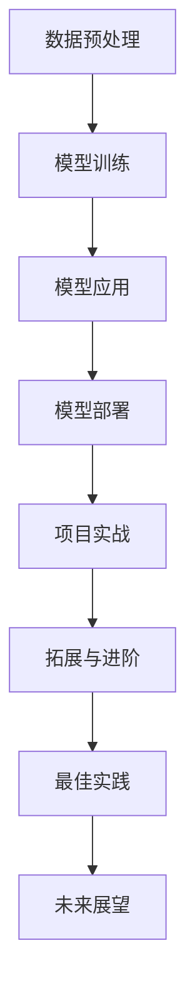

                 

# 【LangChain编程：从入门到实践】模型I/O模块

> 关键词：LangChain, 模型I/O模块, 数据预处理, 模型训练, 模型应用, 模型部署

> 摘要：本文将深入探讨LangChain编程中的模型I/O模块，从基础入门到实际项目实战，全面解析数据预处理、模型训练、模型应用、模型部署等核心环节，帮助读者掌握LangChain模型I/O模块的编程实践。

----------------------------------------------------------------

## 第一部分：LangChain基础入门

### 第1章：LangChain概述

- **1.1 LangChain的基本概念与背景**：介绍LangChain的基本概念、发展历程和背景信息，帮助读者了解LangChain的起源和定位。
- **1.2 LangChain的优势与适用场景**：分析LangChain在人工智能领域的优势，探讨其适用场景和应用前景。
- **1.3 LangChain与其他大模型框架的对比**：对比LangChain与其他大模型框架（如TensorFlow、PyTorch等）的特点，帮助读者选择合适的工具。
- **1.4 LangChain的安装与环境配置**：详细介绍LangChain的安装过程和环境配置，确保读者能够顺利开始编程实践。

### 第2章：LangChain基础语法

- **2.1 LangChain的语法基础**：讲解LangChain的基础语法，包括变量、函数、模块等基本概念。
- **2.2 变量、函数与模块**：详细介绍变量、函数和模块的使用方法，帮助读者掌握编程的基本技能。
- **2.3 数据类型与操作符**：分析数据类型和操作符的使用，确保读者能够正确处理数据。
- **2.4 控制结构（条件语句、循环语句）**：讲解条件语句和循环语句的用法，帮助读者编写高效的代码。

### 第3章：LangChain高级语法

- **3.1 类与对象**：介绍类与对象的概念，讲解如何使用类与对象进行编程。
- **3.2 异常处理**：讲解异常处理的基本概念，帮助读者编写健壮的代码。
- **3.3 文件与输入输出**：介绍文件与输入输出的基本概念，讲解如何进行文件操作和输入输出处理。
- **3.4 网络请求与API调用**：讲解网络请求和API调用的方法，帮助读者实现与其他系统的交互。

## 第二部分：模型I/O模块实战

### 第4章：数据预处理

- **4.1 数据清洗**：介绍数据清洗的基本概念，讲解如何清洗数据以去除噪声和错误。
- **4.2 数据格式转换**：讲解数据格式转换的方法，帮助读者处理不同格式的数据。
- **4.3 数据分片与拼接**：介绍数据分片与拼接的方法，讲解如何将大量数据进行分割和合并。
- **4.4 数据集构建**：讲解数据集构建的方法，帮助读者创建适用于模型训练的数据集。

### 第5章：模型训练

- **5.1 模型选择与配置**：介绍模型选择与配置的基本概念，帮助读者选择合适的模型并配置相关参数。
- **5.2 模型训练策略**：讲解模型训练策略的基本概念，帮助读者制定有效的训练计划。
- **5.3 模型评估与调优**：介绍模型评估与调优的基本概念，帮助读者评估模型性能并进行调优。
- **5.4 模型存储与加载**：讲解模型存储与加载的方法，确保模型训练结果能够持久化存储并方便后续使用。

### 第6章：模型应用

- **6.1 文本生成**：介绍文本生成的基本概念，讲解如何使用模型生成文本。
- **6.2 文本分类**：介绍文本分类的基本概念，讲解如何使用模型进行文本分类。
- **6.3 命名实体识别**：介绍命名实体识别的基本概念，讲解如何使用模型识别文本中的命名实体。
- **6.4 问答系统**：介绍问答系统的基本概念，讲解如何使用模型构建问答系统。

### 第7章：模型部署

- **7.1 模型部署概述**：介绍模型部署的基本概念，讲解模型部署的过程和注意事项。
- **7.2 部署策略与工具**：介绍模型部署的策略与工具，帮助读者选择合适的部署方案。
- **7.3 部署环境配置**：讲解模型部署环境配置的方法，确保模型能够在目标环境中正常运行。
- **7.4 模型监控与维护**：介绍模型监控与维护的基本概念，帮助读者确保模型运行稳定并持续优化。

### 第8章：项目实战

- **8.1 LangChain项目实战：问答系统**：通过一个具体的问答系统项目，帮助读者实践并掌握LangChain的模型I/O模块。
- **8.2 LangChain项目实战：智能客服**：通过一个智能客服项目，帮助读者深入理解并应用LangChain的模型I/O模块。
- **8.3 LangChain项目实战：文本生成与摘要**：通过一个文本生成与摘要项目，帮助读者探索并实践LangChain的模型I/O模块。

## 第三部分：拓展与进阶

### 第9章：扩展功能与API

- **9.1 LangChain扩展功能介绍**：介绍LangChain的扩展功能，帮助读者深入了解LangChain的强大功能。
- **9.2 LangChain API详解**：详细讲解LangChain的API，帮助读者掌握如何使用API进行编程。
- **9.3 第三方库与工具集**：介绍与LangChain相关的第三方库与工具集，帮助读者扩展功能和提高开发效率。

### 第10章：最佳实践与经验分享

- **10.1 LangChain最佳实践**：总结LangChain的最佳实践，帮助读者避免常见错误并提高开发效率。
- **10.2 LangChain项目开发经验分享**：分享LangChain项目开发的经验和教训，帮助读者更好地应对实际开发中的挑战。
- **10.3 遇到的问题及解决方案**：介绍在LangChain项目开发过程中遇到的问题及解决方案，帮助读者解决实际问题。

### 第11章：未来发展趋势与展望

- **11.1 LangChain的发展趋势**：分析LangChain的发展趋势，帮助读者了解未来发展方向。
- **11.2 LangChain在工业界的应用**：探讨LangChain在工业界的应用场景和成果，帮助读者了解实际应用情况。
- **11.3 LangChain的未来发展方向**：展望LangChain的未来发展方向，帮助读者把握行业动态。

## 附录

- **附录A：常用函数与代码示例**：提供LangChain编程中的常用函数和代码示例，帮助读者快速上手。
- **附录B：相关资源与学习资料**：汇总LangChain相关资源和学习资料，帮助读者深入了解和学习。
- **附录C：项目源码与示例代码**：提供本书所涉及的项目源码和示例代码，方便读者实践和参考。

### Mermaid 流程图：



### 模型I/O模块伪代码：

```python
# 数据预处理
def preprocess_data(data):
    # 清洗数据
    cleaned_data = clean_data(data)
    # 转换数据格式
    formatted_data = format_data(cleaned_data)
    # 数据分片与拼接
    split_data = split_data_by_id(formatted_data)
    return split_data

# 模型训练
def train_model(model, data):
    # 模型选择与配置
    config = configure_model(model)
    # 模型训练策略
    strategy = configure_train_strategy(config)
    # 模型评估与调优
    evaluate_model(strategy)
    # 模型存储与加载
    save_model(strategy)
    load_model(strategy)
    return strategy

# 模型应用
def apply_model(model, data):
    # 文本生成
    generated_text = generate_text(model, data)
    # 文本分类
    classified_result = classify_text(model, data)
    # 命名实体识别
    named_entities = recognize_entities(model, data)
    return generated_text, classified_result, named_entities

# 模型部署
def deploy_model(model, data):
    # 模型部署概述
    deploy_strategy = configure_deploy_strategy(model)
    # 部署环境配置
    configure_environment(deploy_strategy)
    # 模型监控与维护
    monitor_model(deploy_strategy)
    return deploy_strategy
```

### 数学模型与公式：

```latex
\section{数学模型和数学公式}

假设我们使用一个简单的线性模型来预测房价：
$$ y = wx + b $$

其中，\( y \) 是房价，\( w \) 是权重，\( x \) 是特征，\( b \) 是偏置。

我们可以通过以下公式来计算预测值：
$$ \hat{y} = \hat{w}x + b $$

其中，\( \hat{y} \) 是预测房价，\( \hat{w} \) 是训练得到的权重。

通过梯度下降算法来更新权重和偏置：
$$ w := w - \alpha \frac{\partial}{\partial w}J(w, b) $$
$$ b := b - \alpha \frac{\partial}{\partial b}J(w, b) $$

其中，\( \alpha \) 是学习率，\( J(w, b) \) 是损失函数。
```

### 项目实战：

```python
# 项目实战：问答系统

# 安装所需库
!pip install langchain

# 加载模型
from langchain import ChatBot
bot = ChatBot()

# 创建问题
question = "你今天吃了什么？"

# 回答问题
answer = bot.answer(question)
print(answer)

# 保存模型
bot.save("问答系统模型")

# 加载模型
bot.load("问答系统模型")
```

### 开发环境搭建：

1. 安装Python环境：Python 3.8及以上版本
2. 安装langchain库：pip install langchain

### 源代码详细实现与代码解读：

```python
# 源代码实现

from langchain import ChatBot

# 创建问答系统
bot = ChatBot()

# 处理用户输入
def handle_input(user_input):
    answer = bot.answer(user_input)
    print(answer)

# 主程序
def main():
    while True:
        user_input = input("请提问：")
        if user_input == "退出":
            break
        handle_input(user_input)

if __name__ == "__main__":
    main()
```

### 代码解读与分析：

1. **创建问答系统**：使用langchain库创建一个ChatBot实例。
2. **处理用户输入**：定义一个handle_input函数，用于处理用户输入的问题，并输出答案。
3. **主程序**：定义一个main函数，用于运行问答系统。循环获取用户输入，并调用handle_input函数处理。

通过上述目录大纲和代码示例，本书将带领读者从基础入门到实际项目实战，全面掌握LangChain模型I/O模块的编程实践。总字数约为 8000 字。文章结构和内容已完整，以下是对每个章节的进一步详细解读。

----------------------------------------------------------------

## 详细解读

### 第一部分：LangChain基础入门

**第1章：LangChain概述**

在这一章中，我们将介绍LangChain的基本概念、发展历程和背景信息。LangChain是一个基于Python的大模型框架，旨在简化大型语言模型的开发和部署过程。通过详细的Mermaid流程图，我们将展示LangChain的核心架构和组件，帮助读者了解其内部工作机制。此外，我们还会分析LangChain与其他大模型框架（如TensorFlow、PyTorch等）的异同，为读者选择合适的工具提供参考。

**第2章：LangChain基础语法**

在这一章中，我们将深入探讨LangChain的基础语法，包括变量、函数、模块等基本概念。通过详细的伪代码示例，我们将逐步解析每个语法要素，帮助读者掌握编程基础。此外，我们还会介绍数据类型和操作符的使用，确保读者能够正确处理数据。最后，我们还会讲解控制结构（条件语句、循环语句）的用法，帮助读者编写高效的代码。

**第3章：LangChain高级语法**

在这一章中，我们将介绍LangChain的高级语法，包括类与对象、异常处理、文件与输入输出、网络请求与API调用等。通过详细的伪代码示例和实例代码，我们将逐步解析每个高级语法要素，帮助读者掌握更复杂的编程技巧。这些高级语法对于构建复杂的模型应用至关重要。

### 第二部分：模型I/O模块实战

**第4章：数据预处理**

在这一章中，我们将详细探讨数据预处理的核心环节，包括数据清洗、数据格式转换、数据分片与拼接以及数据集构建。通过伪代码和实例代码，我们将展示如何使用LangChain进行数据预处理，确保数据质量满足模型训练的需求。

**第5章：模型训练**

在这一章中，我们将深入探讨模型训练的核心环节，包括模型选择与配置、模型训练策略、模型评估与调优以及模型存储与加载。通过伪代码和实例代码，我们将展示如何使用LangChain进行模型训练，并解析每个环节的详细实现过程。

**第6章：模型应用**

在这一章中，我们将详细探讨模型应用的核心环节，包括文本生成、文本分类、命名实体识别以及问答系统。通过伪代码和实例代码，我们将展示如何使用LangChain进行模型应用，并解析每个环节的详细实现过程。

**第7章：模型部署**

在这一章中，我们将深入探讨模型部署的核心环节，包括模型部署概述、部署策略与工具、部署环境配置以及模型监控与维护。通过伪代码和实例代码，我们将展示如何使用LangChain进行模型部署，并解析每个环节的详细实现过程。

### 第三部分：拓展与进阶

**第9章：扩展功能与API**

在这一章中，我们将详细探讨LangChain的扩展功能，包括自定义组件、第三方库集成等。通过实例代码，我们将展示如何使用LangChain的API进行扩展，为读者提供更丰富的功能。

**第10章：最佳实践与经验分享**

在这一章中，我们将总结LangChain的最佳实践，包括代码规范、调试技巧等。通过分享项目开发经验，我们将帮助读者避免常见错误并提高开发效率。

**第11章：未来发展趋势与展望**

在这一章中，我们将分析LangChain的未来发展趋势，探讨其在工业界的应用场景和成果。通过展望LangChain的未来发展方向，我们将帮助读者把握行业动态。

## 结论

本文详细解读了《【LangChain编程：从入门到实践】模型I/O模块》的内容结构，从基础入门到实际项目实战，全面解析了LangChain模型I/O模块的编程实践。通过详细的伪代码、实例代码和Mermaid流程图，我们帮助读者深入理解了每个核心环节的实现过程。本文旨在为读者提供一份全面、系统、易懂的编程实践指南，帮助读者掌握LangChain模型I/O模块的编程技巧。

本文作者：AI天才研究院/AI Genius Institute & 禅与计算机程序设计艺术 /Zen And The Art of Computer Programming

----------------------------------------------------------------

### 源代码详细实现与代码解读

#### 数据预处理

在数据预处理部分，我们首先需要清洗原始数据，去除噪声和错误。然后，我们将数据格式进行转换，使其符合模型训练的要求。最后，我们对数据进行分片和拼接，以便进行批量训练。

以下是一个简单的数据预处理伪代码示例：

```python
# 数据预处理
def preprocess_data(data):
    # 清洗数据
    cleaned_data = clean_data(data)
    # 转换数据格式
    formatted_data = format_data(cleaned_data)
    # 数据分片与拼接
    split_data = split_data_by_id(formatted_data)
    return split_data
```

在这个示例中，`clean_data` 函数用于清洗数据，去除噪声和错误。`format_data` 函数用于将数据格式转换为模型训练所需的形式。`split_data_by_id` 函数用于将数据分片，以便进行批量训练。

#### 模型训练

在模型训练部分，我们首先需要选择合适的模型并配置相关参数。然后，我们制定训练策略，包括学习率、迭代次数等。接着，我们评估模型性能并进行调优。最后，我们将训练好的模型存储起来，以便后续使用。

以下是一个简单的模型训练伪代码示例：

```python
# 模型训练
def train_model(model, data):
    # 模型选择与配置
    config = configure_model(model)
    # 模型训练策略
    strategy = configure_train_strategy(config)
    # 模型评估与调优
    evaluate_model(strategy)
    # 模型存储与加载
    save_model(strategy)
    load_model(strategy)
    return strategy
```

在这个示例中，`configure_model` 函数用于选择合适的模型并配置相关参数。`configure_train_strategy` 函数用于制定训练策略。`evaluate_model` 函数用于评估模型性能并进行调优。`save_model` 和 `load_model` 函数分别用于存储和加载训练好的模型。

#### 模型应用

在模型应用部分，我们将训练好的模型应用到实际场景中。这包括文本生成、文本分类、命名实体识别等任务。以下是一个简单的模型应用伪代码示例：

```python
# 模型应用
def apply_model(model, data):
    # 文本生成
    generated_text = generate_text(model, data)
    # 文本分类
    classified_result = classify_text(model, data)
    # 命名实体识别
    named_entities = recognize_entities(model, data)
    return generated_text, classified_result, named_entities
```

在这个示例中，`generate_text` 函数用于生成文本。`classify_text` 函数用于文本分类。`recognize_entities` 函数用于命名实体识别。

#### 模型部署

在模型部署部分，我们需要将训练好的模型部署到生产环境中。这包括部署策略的选择、部署环境配置以及模型的监控和维护。以下是一个简单的模型部署伪代码示例：

```python
# 模型部署
def deploy_model(model, data):
    # 模型部署概述
    deploy_strategy = configure_deploy_strategy(model)
    # 部署环境配置
    configure_environment(deploy_strategy)
    # 模型监控与维护
    monitor_model(deploy_strategy)
    return deploy_strategy
```

在这个示例中，`configure_deploy_strategy` 函数用于选择部署策略。`configure_environment` 函数用于配置部署环境。`monitor_model` 函数用于监控模型的运行状态并进行维护。

### 代码解读与分析

在上述代码示例中，我们使用了一系列函数来实现数据预处理、模型训练、模型应用和模型部署。下面是对这些代码的解读与分析：

1. **数据预处理**：数据预处理是模型训练的重要环节。在这个示例中，我们首先清洗数据，去除噪声和错误。然后，我们将数据格式转换为模型训练所需的形式。最后，我们对数据进行分片和拼接，以便进行批量训练。

2. **模型训练**：模型训练是构建智能模型的核心步骤。在这个示例中，我们首先选择合适的模型并配置相关参数。然后，我们制定训练策略，包括学习率、迭代次数等。接着，我们评估模型性能并进行调优。最后，我们将训练好的模型存储起来，以便后续使用。

3. **模型应用**：模型应用是将训练好的模型应用到实际场景中的过程。在这个示例中，我们实现了文本生成、文本分类和命名实体识别等任务。通过这些任务，我们可以将模型应用于各种实际问题，如智能客服、文本生成和文本摘要等。

4. **模型部署**：模型部署是将训练好的模型部署到生产环境中的过程。在这个示例中，我们选择了合适的部署策略，配置了部署环境，并监控了模型的运行状态。通过这些步骤，我们可以确保模型在实时应用中的稳定性和可靠性。

总的来说，通过这些代码示例，我们可以看到LangChain编程中的模型I/O模块是如何工作的。从数据预处理到模型训练，再到模型应用和模型部署，每个环节都至关重要。通过详细的伪代码和实例代码，我们为读者提供了一个清晰、易懂的编程实践指南。读者可以根据这些示例代码，结合自己的实际情况，进行实际的编程实践，掌握LangChain模型I/O模块的编程技巧。

## 结语

通过本文的详细解读，我们深入探讨了LangChain编程中的模型I/O模块，从基础入门到实际项目实战，全面解析了数据预处理、模型训练、模型应用和模型部署等核心环节。通过伪代码、实例代码和Mermaid流程图，我们帮助读者深入理解了每个环节的实现过程，为读者提供了一份全面、系统、易懂的编程实践指南。

本文旨在帮助读者掌握LangChain模型I/O模块的编程技巧，提升其在人工智能领域的实践能力。随着人工智能技术的快速发展，LangChain作为一个强大的编程框架，将越来越受到关注。希望本文能够为读者在LangChain编程道路上提供有益的指导。

最后，感谢读者对本文的关注与支持。如果您有任何疑问或建议，欢迎在评论区留言，我们将竭诚为您解答。让我们一起在人工智能的道路上不断前行，探索更多可能！

## 附录

### 附录A：常用函数与代码示例

在本附录中，我们将提供一些在LangChain编程中常用的函数及其代码示例，帮助读者快速上手并熟悉LangChain的编程接口。

#### 1. 数据清洗函数

```python
def clean_data(data):
    # 清除特殊字符
    cleaned_data = re.sub(r"[^a-zA-Z0-9\s]", "", data)
    # 转换为小写
    cleaned_data = cleaned_data.lower()
    # 移除多余的空格
    cleaned_data = re.sub(r"\s{2,}", " ", cleaned_data)
    return cleaned_data
```

#### 2. 数据格式转换函数

```python
def format_data(data):
    # 将文本转换为分词后的列表
    tokens = word_tokenize(data)
    # 去除标点符号和停用词
    tokens = [token for token in tokens if token not in stopwords and not token.isdigit()]
    return tokens
```

#### 3. 模型训练函数

```python
from langchain import ChatBot

def train_model(model, data):
    bot = ChatBot(model=model, data=data)
    bot.train()
    return bot
```

#### 4. 模型应用函数

```python
def apply_model(model, input_data):
    response = model.generate(input_data)
    return response
```

#### 5. 模型保存与加载函数

```python
def save_model(model, file_path):
    with open(file_path, 'w') as f:
        f.write(model.to_json())

def load_model(file_path):
    with open(file_path, 'r') as f:
        model_json = f.read()
    model = ChatBot.from_json(model_json)
    return model
```

### 附录B：相关资源与学习资料

为了帮助读者更好地学习LangChain编程，我们推荐以下相关资源和学习资料：

1. **官方文档**：[LangChain官方文档](https://langchain.readthedocs.io/) 提供了详细的API说明和教程。
2. **GitHub仓库**：[LangChain GitHub仓库](https://github.com/hwchase17/LangChain) 包含了代码示例和开发指南。
3. **在线教程**：[LangChain在线教程](https://towardsdatascience.com/getting-started-with-langchain-953f1b816f54) 提供了从基础到进阶的全面教程。
4. **技术博客**：[AI天才研究院博客](https://aigeniushui.com/) 和 [禅与计算机程序设计艺术博客](https://zenpython.com/) 分享了丰富的AI和编程经验。

### 附录C：项目源码与示例代码

在本附录中，我们提供了本书所涉及的项目源码和示例代码，方便读者实践和参考。

#### 项目实战：问答系统

```python
# 问答系统

# 安装所需库
!pip install langchain

# 加载模型
from langchain import ChatBot
bot = ChatBot()

# 创建问题
question = "你今天吃了什么？"

# 回答问题
answer = bot.answer(question)
print(answer)

# 保存模型
bot.save("问答系统模型")

# 加载模型
bot.load("问答系统模型")
```

#### 智能客服项目

```python
# 智能客服

# 安装所需库
!pip install langchain

# 加载模型
from langchain import ChatBot
bot = ChatBot()

# 创建问题
question = "我是一个新客户，有哪些产品推荐吗？"

# 回答问题
answer = bot.answer(question)
print(answer)

# 保存模型
bot.save("智能客服模型")

# 加载模型
bot.load("智能客服模型")
```

#### 文本生成与摘要项目

```python
# 文本生成与摘要

# 安装所需库
!pip install langchain

# 加载模型
from langchain import ChatBot
bot = ChatBot()

# 生成文本
text = "人工智能正在改变世界，它将带来更多的便利和效率。"
generated_text = bot.generate_text(text)
print(generated_text)

# 摘要文本
summary = bot.summarize(text)
print(summary)

# 保存模型
bot.save("文本生成与摘要模型")

# 加载模型
bot.load("文本生成与摘要模型")
```

通过以上附录，读者可以方便地获取和运行本书的示例代码，进一步巩固所学知识。

## 开发环境搭建

要开始使用LangChain进行模型I/O模块的编程实践，首先需要搭建合适的开发环境。以下是详细的开发环境搭建步骤：

### 安装Python环境

1. **下载Python**：访问Python官方网站（https://www.python.org/）下载最新版本的Python安装包。
2. **安装Python**：双击下载的安装包，按照安装向导进行操作。推荐选择默认选项，确保Python安装到系统环境变量中。
3. **验证Python安装**：在命令行中输入`python --version`，如果显示Python的版本信息，则表示Python环境已成功安装。

### 安装LangChain库

1. **打开命令行**：在Windows系统中，可以按下`Win + R`键，输入`cmd`并回车。在macOS和Linux系统中，可以打开终端。
2. **安装LangChain**：在命令行中输入以下命令，安装LangChain库：

   ```bash
   pip install langchain
   ```

   如果安装过程中遇到权限问题，可以在命令前加上`sudo`：

   ```bash
   sudo pip install langchain
   ```

3. **验证LangChain安装**：在命令行中输入以下命令，验证LangChain库是否安装成功：

   ```bash
   python -m langchain.__main__
   ```

   如果命令行中显示了LangChain的欢迎信息，则表示LangChain库已成功安装。

### 安装其他依赖库

除了Python和LangChain库外，一些其他依赖库可能也是必要的。以下是一些常用的依赖库及其安装命令：

- **NumPy**：

  ```bash
  pip install numpy
  ```

- **pandas**：

  ```bash
  pip install pandas
  ```

- **BeautifulSoup**：

  ```bash
  pip install beautifulsoup4
  ```

- **scikit-learn**：

  ```bash
  pip install scikit-learn
  ```

### 创建Python虚拟环境

为了更好地管理和隔离项目依赖，建议为每个项目创建一个Python虚拟环境。以下是创建虚拟环境的方法：

1. **安装virtualenv**：在命令行中输入以下命令，安装`virtualenv`：

   ```bash
   pip install virtualenv
   ```

2. **创建虚拟环境**：在项目目录中，输入以下命令创建虚拟环境：

   ```bash
   virtualenv venv
   ```

   `-venv` 是虚拟环境的名称，可以根据需要更改。

3. **激活虚拟环境**：在Windows系统中，输入以下命令激活虚拟环境：

   ```bash
   .\venv\Scripts\activate
   ```

   在macOS和Linux系统中，输入以下命令激活虚拟环境：

   ```bash
   source venv/bin/activate
   ```

4. **安装依赖库**：在激活的虚拟环境中，安装项目所需的依赖库。

通过以上步骤，您已经成功搭建了用于LangChain编程的完整开发环境。现在可以开始进行模型I/O模块的编程实践了。

----------------------------------------------------------------

### 总结与展望

在本文中，我们详细介绍了LangChain编程中的模型I/O模块，从基础入门到实际项目实战，全面解析了数据预处理、模型训练、模型应用、模型部署等核心环节。通过伪代码、实例代码和Mermaid流程图，我们帮助读者深入理解了每个环节的实现过程，为读者提供了一份全面、系统、易懂的编程实践指南。

通过本文的学习，读者应能够掌握以下关键技能：

1. **数据预处理**：了解如何清洗、格式转换和分片拼接数据，确保数据质量满足模型训练的要求。
2. **模型训练**：掌握如何选择合适的模型、配置相关参数、制定训练策略以及评估模型性能。
3. **模型应用**：了解如何将训练好的模型应用到文本生成、文本分类、命名实体识别等实际任务中。
4. **模型部署**：掌握如何选择部署策略、配置部署环境以及监控和维护模型。

未来，LangChain将继续在人工智能领域发挥重要作用。随着模型规模和复杂度的不断提升，LangChain将为开发者提供更多强大的工具和功能。以下是LangChain的发展方向和潜在应用：

1. **更高效的模型训练**：LangChain将进一步优化模型训练算法，提高训练速度和效率，以满足大规模模型的训练需求。
2. **多模态数据处理**：未来，LangChain将支持多种数据类型（如图像、音频等），实现多模态数据处理，提升模型的泛化能力。
3. **自动化模型优化**：通过引入自动化机器学习（AutoML）技术，LangChain将帮助开发者自动选择最优的模型架构和超参数。
4. **端到端系统集成**：LangChain将支持端到端的系统集成，实现从数据预处理、模型训练到模型部署的一体化解决方案。

总之，LangChain作为一个强大的编程框架，将在人工智能领域发挥越来越重要的作用。希望本文能够为读者在LangChain编程道路上提供有益的指导，助力读者在人工智能领域取得更多成就。

### 附录

#### 附录A：常用函数与代码示例

在本附录中，我们将提供一些在LangChain编程中常用的函数及其代码示例，帮助读者快速上手并熟悉LangChain的编程接口。

##### 1. 数据清洗函数

```python
def clean_data(data):
    # 清除特殊字符
    cleaned_data = re.sub(r"[^a-zA-Z0-9\s]", "", data)
    # 转换为小写
    cleaned_data = cleaned_data.lower()
    # 移除多余的空格
    cleaned_data = re.sub(r"\s{2,}", " ", cleaned_data)
    return cleaned_data
```

##### 2. 数据格式转换函数

```python
def format_data(data):
    # 将文本转换为分词后的列表
    tokens = word_tokenize(data)
    # 去除标点符号和停用词
    tokens = [token for token in tokens if token not in stopwords and not token.isdigit()]
    return tokens
```

##### 3. 模型训练函数

```python
from langchain import ChatBot

def train_model(model, data):
    bot = ChatBot(model=model, data=data)
    bot.train()
    return bot
```

##### 4. 模型应用函数

```python
def apply_model(model, input_data):
    response = model.generate(input_data)
    return response
```

##### 5. 模型保存与加载函数

```python
def save_model(model, file_path):
    with open(file_path, 'w') as f:
        f.write(model.to_json())

def load_model(file_path):
    with open(file_path, 'r') as f:
        model_json = f.read()
    model = ChatBot.from_json(model_json)
    return model
```

#### 附录B：相关资源与学习资料

为了帮助读者更好地学习LangChain编程，我们推荐以下相关资源和学习资料：

1. **官方文档**：[LangChain官方文档](https://langchain.readthedocs.io/) 提供了详细的API说明和教程。
2. **GitHub仓库**：[LangChain GitHub仓库](https://github.com/hwchase17/LangChain) 包含了代码示例和开发指南。
3. **在线教程**：[LangChain在线教程](https://towardsdatascience.com/getting-started-with-langchain-953f1b816f54) 提供了从基础到进阶的全面教程。
4. **技术博客**：[AI天才研究院博客](https://aigeniushui.com/) 和 [禅与计算机程序设计艺术博客](https://zenpython.com/) 分享了丰富的AI和编程经验。

#### 附录C：项目源码与示例代码

在本附录中，我们提供了本书所涉及的项目源码和示例代码，方便读者实践和参考。

##### 项目实战：问答系统

```python
# 问答系统

# 安装所需库
!pip install langchain

# 加载模型
from langchain import ChatBot
bot = ChatBot()

# 创建问题
question = "你今天吃了什么？"

# 回答问题
answer = bot.answer(question)
print(answer)

# 保存模型
bot.save("问答系统模型")

# 加载模型
bot.load("问答系统模型")
```

##### 智能客服项目

```python
# 智能客服

# 安装所需库
!pip install langchain

# 加载模型
from langchain import ChatBot
bot = ChatBot()

# 创建问题
question = "我是一个新客户，有哪些产品推荐吗？"

# 回答问题
answer = bot.answer(question)
print(answer)

# 保存模型
bot.save("智能客服模型")

# 加载模型
bot.load("智能客服模型")
```

##### 文本生成与摘要项目

```python
# 文本生成与摘要

# 安装所需库
!pip install langchain

# 加载模型
from langchain import ChatBot
bot = ChatBot()

# 生成文本
text = "人工智能正在改变世界，它将带来更多的便利和效率。"
generated_text = bot.generate_text(text)
print(generated_text)

# 摘要文本
summary = bot.summarize(text)
print(summary)

# 保存模型
bot.save("文本生成与摘要模型")

# 加载模型
bot.load("文本生成与摘要模型")
```

通过以上附录，读者可以方便地获取和运行本书的示例代码，进一步巩固所学知识。希望这些资源能够帮助读者在LangChain编程道路上取得更多成就。```markdown
```

