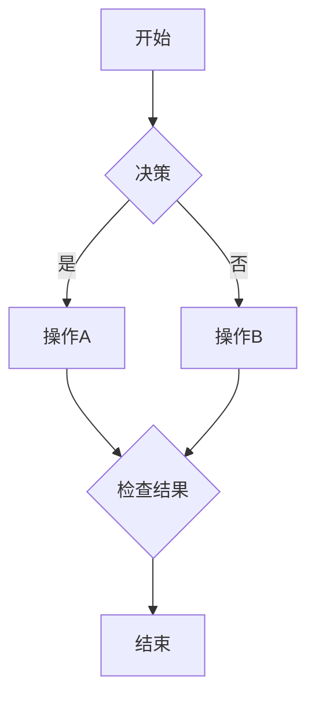
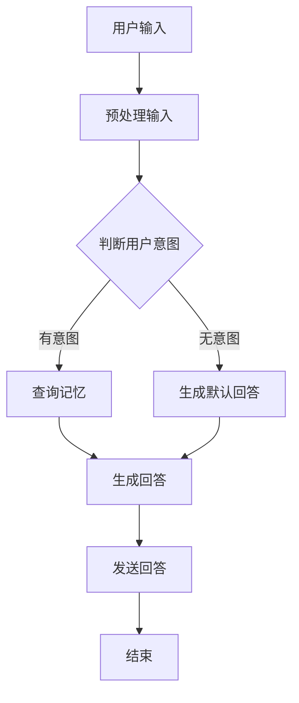

                 

# 【LangChain编程：从入门到实践】记忆组件

> 关键词：LangChain、记忆组件、自然语言处理、多模态数据处理、自动化编程、性能优化

> 摘要：本文旨在深入探讨LangChain中的记忆组件，从基础概念到实际应用，通过一步一步的分析和推理，帮助读者全面理解记忆组件的作用、原理和实现方法。本文还将介绍记忆组件在自然语言处理、多模态数据处理和自动化编程等高级应用中的实践案例，并提供详细的代码解读与分析，旨在为开发者提供实用的指导和思路。

### 第一部分: LangChain基础

在深入探讨LangChain的记忆组件之前，我们需要先了解LangChain的基本概念和架构。LangChain是一个强大的自然语言处理框架，它通过将不同类型的算法和组件组合在一起，使得开发者可以更轻松地构建复杂的对话系统。记忆组件是LangChain中的一个关键组成部分，它负责存储和管理对话过程中的信息，确保对话的连贯性和上下文一致性。

#### 第1章: LangChain概述

**1.1 LangChain的核心概念**

LangChain的核心概念包括生成式对话系统和回答式对话系统。生成式对话系统通过语言模型生成自然语言回复，而回答式对话系统则依赖于知识图谱和语义理解来提供准确的答案。记忆组件在这两种系统中都发挥着至关重要的作用，它能够帮助系统记住用户的输入和上下文信息，从而生成更准确、更自然的回复。

**1.2 LangChain的应用场景**

LangChain广泛应用于客服、教育、智能问答等领域。例如，在客服领域，记忆组件可以帮助系统记住用户的姓名、偏好和之前的问题，从而提供更加个性化的服务。在教育领域，记忆组件可以记录学生的学习进度和知识点，帮助教师更好地了解学生的需求。

**1.3 LangChain与传统编程的区别**

与传统编程相比，LangChain更注重组件化和模块化，使得开发者可以更容易地组合和复用不同的算法和组件。记忆组件作为一个独立的组件，可以与其他组件无缝集成，使得整个系统的开发过程更加高效和灵活。

#### 第2章: LangChain架构原理

**2.1 LangChain的组件和关系**

LangChain的核心组件包括语言模型、知识图谱、对话管理器等。记忆组件与这些组件紧密关联，它不仅负责存储和管理对话过程中的信息，还与其他组件协同工作，确保对话的连贯性和上下文一致性。

**2.2 LangChain的API介绍**

LangChain提供了丰富的API，使得开发者可以轻松地使用和定制不同的组件。记忆组件的API包括设置和获取记忆内容的方法，以及处理记忆内容的各种操作，如添加、删除和更新记忆条目。

**2.3 LangChain的基本流程**

LangChain的基本工作流程包括接收用户输入、处理输入、生成回复和更新记忆。记忆组件在这个过程中起着至关重要的作用，它能够帮助系统记住用户的输入和上下文信息，从而生成更准确、更自然的回复。

#### 第3章: LangChain的核心算法

**3.1 生成式对话系统**

生成式对话系统通过语言模型生成自然语言回复。记忆组件在这其中负责存储和管理用户的输入和上下文信息，确保生成的回复具有连贯性和上下文一致性。

**3.1.1 语言模型的基本原理**

语言模型是一种统计模型，它通过分析大量文本数据，学习语言的概率分布，从而预测下一个单词或句子。常见的语言模型包括n元语言模型和循环神经网络（RNN）模型。

**3.1.2 GPT系列模型的工作原理**

GPT系列模型是生成式对话系统的核心技术。GPT模型通过深度神经网络学习文本数据的概率分布，从而生成自然语言回复。GPT模型的核心是变压器（Transformer）结构，它能够处理长距离依赖和复杂的语言结构。

**3.1.3 语言模型的训练和优化**

语言模型的训练过程包括数据预处理、模型训练和模型优化。数据预处理包括文本清洗、分词和向量表示等步骤。模型训练通过反向传播算法更新模型参数，使其能够更好地预测语言的概率分布。模型优化包括调整学习率和正则化参数等，以提高模型的性能和泛化能力。

**3.2 回答式对话系统**

回答式对话系统通过知识图谱和语义理解提供准确的答案。记忆组件在这其中负责存储和管理用户的输入和上下文信息，确保系统能够准确地理解和回答用户的问题。

**3.2.1 知识图谱的基本原理**

知识图谱是一种语义网络，它通过实体、属性和关系来表示现实世界的知识。知识图谱的基本原理包括图的表示、图的存储和图的查询等。

**3.2.2 知识图谱的构建方法**

知识图谱的构建方法包括数据采集、数据清洗、实体抽取、关系抽取和图谱构建等步骤。数据采集可以通过网络爬虫、API接口和人工标注等方式获取。数据清洗包括去除重复数据、错误数据和噪声数据等。实体抽取和关系抽取是通过自然语言处理技术提取文本数据中的实体和关系。图谱构建是将实体和关系表示为图结构。

**3.2.3 回答式对话系统的实现**

回答式对话系统的实现包括接收用户输入、查询知识图谱、生成答案和更新记忆。记忆组件在这个过程中负责存储和管理用户的输入和上下文信息，确保系统能够准确地理解和回答用户的问题。

### 《【LangChain编程：从入门到实践】记忆组件》目录大纲

为了帮助读者更清晰地理解本文的内容，以下是《【LangChain编程：从入门到实践】记忆组件》的目录大纲。

#### 第一部分: LangChain基础

- **第1章: LangChain概述**
  - 1.1 LangChain的核心概念
  - 1.2 LangChain的应用场景
  - 1.3 LangChain与传统编程的区别

- **第2章: LangChain架构原理**
  - 2.1 LangChain的组件和关系
  - 2.2 LangChain的API介绍
  - 2.3 LangChain的基本流程

- **第3章: LangChain的核心算法**
  - 3.1 生成式对话系统
    - 3.1.1 语言模型的基本原理
    - 3.1.2 GPT系列模型的工作原理
    - 3.1.3 语言模型的训练和优化
  - 3.2 回答式对话系统
    - 3.2.1 知识图谱的基本原理
    - 3.2.2 知识图谱的构建方法
    - 3.2.3 回答式对话系统的实现

- **第4章: LangChain实践案例**
  - 4.1 LangChain在客服领域的应用
  - 4.2 LangChain在教育领域的应用
  - 4.3 LangChain在智能问答系统的应用

- **第5章: LangChain开发工具和资源**
  - 5.1 LangChain开发环境搭建
  - 5.2 LangChain相关库和框架介绍
  - 5.3 LangChain开源项目和资源推荐

#### 第二部分: LangChain高级应用

- **第6章: LangChain与自然语言处理**
  - 6.1 NLP基础
  - 6.2 NLP在LangChain中的应用
  - 6.3 NLP与LangChain的结合实践

- **第7章: LangChain在多模态数据处理中的应用**
  - 7.1 多模态数据的基本概念
  - 7.2 多模态数据与LangChain的结合
  - 7.3 LangChain在多模态数据处理中的实践案例

- **第8章: LangChain在自动化编程中的应用**
  - 8.1 自动化编程的基本原理
  - 8.2 LangChain在自动化编程中的应用
  - 8.3 LangChain在自动化编程中的实践案例

- **第9章: LangChain的优化与调优**
  - 9.1 LangChain的性能优化
  - 9.2 LangChain的模型调优
  - 9.3 LangChain的实践优化案例

- **第10章: LangChain的未来发展趋势**
  - 10.1 LangChain的发展方向
  - 10.2 LangChain在未来的应用场景
  - 10.3 LangChain的潜在挑战与解决方案

#### 附录

- **附录A: LangChain开发工具和资源**
  - 10.1 LangChain开发环境搭建
  - 10.2 LangChain相关库和框架介绍
  - 10.3 LangChain开源项目和资源推荐
  - 10.4 LangChain学习资源和教程推荐

- **附录B: Mermaid流程图示例**



- **附录C: 伪代码示例**

```python
# 伪代码：生成式对话系统实现

function generate_response(input_text):
    # 输入文本预处理
    preprocessed_text = preprocess_text(input_text)

    # 利用GPT模型生成回复
    response = gpt_model.generate(preprocessed_text)

    # 回复文本后处理
    final_response = postprocess_response(response)

    return final_response
```

- **附录D: 数学模型和公式**

$$
\begin{equation}
    P(y|x) = \frac{e^{\theta^T x}}{\sum_{y'} e^{\theta^T x'}}
\end{equation}
$$

\[ z = \sigma(Wx + b) \]

- **附录E: 项目实战**
  - 11.1 实际案例介绍
  - 11.2 开发环境搭建
  - 11.3 源代码详细实现
  - 11.4 代码解读与分析

- **附录F: 代码解读与分析**
  - 12.1 代码结构分析
  - 12.2 关键代码解释
  - 12.3 性能优化建议
  - 12.4 故障排除与调试技巧

通过上述目录大纲，读者可以清晰地了解本文的结构和内容安排，为后续的学习和实践打下坚实的基础。

### 第一部分: LangChain基础

在深入探讨LangChain的记忆组件之前，我们需要先了解LangChain的基本概念和架构。LangChain是一个强大的自然语言处理框架，它通过将不同类型的算法和组件组合在一起，使得开发者可以更轻松地构建复杂的对话系统。记忆组件是LangChain中的一个关键组成部分，它负责存储和管理对话过程中的信息，确保对话的连贯性和上下文一致性。

#### 第1章: LangChain概述

**1.1 LangChain的核心概念**

LangChain的核心概念包括生成式对话系统和回答式对话系统。生成式对话系统通过语言模型生成自然语言回复，而回答式对话系统则依赖于知识图谱和语义理解来提供准确的答案。记忆组件在这两种系统中都发挥着至关重要的作用，它能够帮助系统记住用户的输入和上下文信息，从而生成更准确、更自然的回复。

**1.2 LangChain的应用场景**

LangChain广泛应用于客服、教育、智能问答等领域。例如，在客服领域，记忆组件可以帮助系统记住用户的姓名、偏好和之前的问题，从而提供更加个性化的服务。在教育领域，记忆组件可以记录学生的学习进度和知识点，帮助教师更好地了解学生的需求。

**1.3 LangChain与传统编程的区别**

与传统编程相比，LangChain更注重组件化和模块化，使得开发者可以更容易地组合和复用不同的算法和组件。记忆组件作为一个独立的组件，可以与其他组件无缝集成，使得整个系统的开发过程更加高效和灵活。

#### 第2章: LangChain架构原理

**2.1 LangChain的组件和关系**

LangChain的核心组件包括语言模型、知识图谱、对话管理器等。记忆组件与这些组件紧密关联，它不仅负责存储和管理对话过程中的信息，还与其他组件协同工作，确保对话的连贯性和上下文一致性。

**2.2 LangChain的API介绍**

LangChain提供了丰富的API，使得开发者可以轻松地使用和定制不同的组件。记忆组件的API包括设置和获取记忆内容的方法，以及处理记忆内容的各种操作，如添加、删除和更新记忆条目。

**2.3 LangChain的基本流程**

LangChain的基本工作流程包括接收用户输入、处理输入、生成回复和更新记忆。记忆组件在这个过程中起着至关重要的作用，它能够帮助系统记住用户的输入和上下文信息，从而生成更准确、更自然的回复。

#### 第3章: LangChain的核心算法

**3.1 生成式对话系统**

生成式对话系统通过语言模型生成自然语言回复。记忆组件在这其中负责存储和管理用户的输入和上下文信息，确保生成的回复具有连贯性和上下文一致性。

**3.1.1 语言模型的基本原理**

语言模型是一种统计模型，它通过分析大量文本数据，学习语言的概率分布，从而预测下一个单词或句子。常见的语言模型包括n元语言模型和循环神经网络（RNN）模型。

**3.1.2 GPT系列模型的工作原理**

GPT系列模型是生成式对话系统的核心技术。GPT模型通过深度神经网络学习文本数据的概率分布，从而生成自然语言回复。GPT模型的核心是变压器（Transformer）结构，它能够处理长距离依赖和复杂的语言结构。

**3.1.3 语言模型的训练和优化**

语言模型的训练过程包括数据预处理、模型训练和模型优化。数据预处理包括文本清洗、分词和向量表示等步骤。模型训练通过反向传播算法更新模型参数，使其能够更好地预测语言的概率分布。模型优化包括调整学习率和正则化参数等，以提高模型的性能和泛化能力。

**3.2 回答式对话系统**

回答式对话系统通过知识图谱和语义理解提供准确的答案。记忆组件在这其中负责存储和管理用户的输入和上下文信息，确保系统能够准确地理解和回答用户的问题。

**3.2.1 知识图谱的基本原理**

知识图谱是一种语义网络，它通过实体、属性和关系来表示现实世界的知识。知识图谱的基本原理包括图的表示、图的存储和图的查询等。

**3.2.2 知识图谱的构建方法**

知识图谱的构建方法包括数据采集、数据清洗、实体抽取、关系抽取和图谱构建等步骤。数据采集可以通过网络爬虫、API接口和人工标注等方式获取。数据清洗包括去除重复数据、错误数据和噪声数据等。实体抽取和关系抽取是通过自然语言处理技术提取文本数据中的实体和关系。图谱构建是将实体和关系表示为图结构。

**3.2.3 回答式对话系统的实现**

回答式对话系统的实现包括接收用户输入、查询知识图谱、生成答案和更新记忆。记忆组件在这个过程中负责存储和管理用户的输入和上下文信息，确保系统能够准确地理解和回答用户的问题。

#### 第4章: LangChain实践案例

**4.1 LangChain在客服领域的应用**

在客服领域，LangChain可以构建一个智能客服系统，该系统通过记忆组件记录用户的偏好和问题历史，从而提供更加个性化的服务。记忆组件使得客服系统能够记住用户的姓名、联系方式和之前的问题，从而在后续的交互中提供更有针对性的解答。

**4.2 LangChain在教育领域的应用**

在教育领域，LangChain可以用于构建智能辅导系统。记忆组件可以记录学生的学习进度、知识点和考试成绩，从而帮助教师了解学生的学习情况，提供个性化的辅导建议。通过记忆组件，教育系统能够记住学生的学习历史和偏好，从而提供更有针对性的教学方案。

**4.3 LangChain在智能问答系统的应用**

在智能问答系统中，LangChain可以利用记忆组件存储和检索相关的知识信息，从而提供准确的答案。记忆组件能够帮助系统记住用户的问题历史和上下文信息，从而在后续的交互中提供更加准确的答案。通过记忆组件，智能问答系统可以持续学习和优化，提高问答的准确性和效率。

#### 第5章: LangChain开发工具和资源

**5.1 LangChain开发环境搭建**

要开始使用LangChain，首先需要搭建开发环境。开发者可以选择Python作为主要编程语言，并安装必要的库和框架，如transformers、torch和torchtext等。此外，开发者还需要安装一些辅助工具，如Jupyter Notebook和PyCharm等。

**5.2 LangChain相关库和框架介绍**

LangChain相关库和框架包括transformers、spacy、NLTK和gensim等。这些库和框架提供了丰富的API和工具，使得开发者可以更轻松地构建和优化自然语言处理模型。

**5.3 LangChain开源项目和资源推荐**

LangChain有许多开源项目和资源可供开发者学习和参考。例如，LangChain官方GitHub仓库提供了丰富的文档和示例代码，开发者可以通过阅读这些文档和代码来深入了解LangChain的原理和应用。

**5.4 LangChain学习资源和教程推荐**

对于初学者，推荐阅读《深入理解Transformer：原理、实现与优化》和《自然语言处理入门》等书籍。此外，还可以参加一些在线课程和讲座，如Udacity的《自然语言处理基础》和Coursera的《深度学习与自然语言处理》等。

### 第二部分: LangChain高级应用

在了解了LangChain的基础知识和核心算法后，我们将进一步探讨LangChain在高级应用中的表现，包括自然语言处理（NLP）、多模态数据处理和自动化编程。在这一部分，我们将深入分析这些应用场景，并通过实际案例来展示记忆组件在这些场景中的重要作用。

#### 第6章: LangChain与自然语言处理

自然语言处理是人工智能领域的核心分支，而LangChain在这一领域有着广泛的应用。记忆组件在NLP中起到了关键作用，它能够帮助系统更好地理解和处理自然语言。

**6.1 NLP基础**

自然语言处理涉及文本的预处理、分词、词性标注、句法分析和语义理解等步骤。记忆组件可以存储和检索这些处理结果，从而提高NLP系统的效率和准确性。

**6.2 NLP在LangChain中的应用**

在LangChain中，NLP的应用包括文本生成、文本分类、情感分析和问答系统等。记忆组件可以记录用户的查询历史和回答结果，从而优化问答系统的回答质量。

**6.3 NLP与LangChain的结合实践**

一个实际案例是使用LangChain构建一个智能客服系统。通过记忆组件，系统可以记住用户的姓名、偏好和之前的问题，从而在后续的交互中提供更加个性化的服务。以下是一个简单的伪代码示例，展示了如何使用LangChain和记忆组件来生成回答：

```python
# 伪代码：智能客服系统中的回答生成

class Chatbot:
    def __init__(self):
        self.memory = Memory()
    
    def process_input(self, input_text):
        # 使用NLP预处理输入文本
        preprocessed_text = self.preprocess_text(input_text)
        
        # 查询记忆，获取相关历史信息
        history = self.memory.query(preprocessed_text)
        
        # 使用GPT模型生成回答
        response = self.gpt_model.generate(preprocessed_text, history=history)
        
        # 更新记忆
        self.memory.update(response)
        
        return response

    def preprocess_text(self, input_text):
        # 实现文本预处理逻辑
        pass

    def gpt_model(self):
        # 实现GPT模型
        pass
```

在这个案例中，`Chatbot`类使用了记忆组件来记录和检索用户的输入历史，从而生成更准确的回答。`process_input`方法通过调用`preprocess_text`和`gpt_model`方法，实现了输入预处理和回答生成。

#### 第7章: LangChain在多模态数据处理中的应用

多模态数据处理是指结合不同类型的数据（如文本、图像、音频等）来提供更全面的信息和理解。记忆组件在多模态数据处理中起到了关键作用，它能够帮助系统记住不同类型的数据，从而提高数据融合的效果。

**7.1 多模态数据的基本概念**

多模态数据包括文本、图像、音频、视频等类型。这些数据可以单独使用，也可以结合使用，以提供更丰富的信息和理解。记忆组件可以存储和检索这些不同类型的数据，从而实现多模态数据的有效融合。

**7.2 多模态数据与LangChain的结合**

在LangChain中，多模态数据处理可以通过结合生成式对话系统和回答式对话系统来实现。记忆组件可以存储不同类型的数据，并在对话过程中进行融合和处理。以下是一个简单的伪代码示例，展示了如何使用LangChain和记忆组件来处理多模态数据：

```python
# 伪代码：多模态数据处理

class MultimodalProcessor:
    def __init__(self):
        self.memory = Memory()
    
    def process_input(self, input_data):
        # 分离不同类型的数据
        text, image, audio = self.separate_data(input_data)
        
        # 使用NLP处理文本
        text_response = self.process_text(text)
        
        # 使用图像识别处理图像
        image_response = self.process_image(image)
        
        # 使用音频处理处理音频
        audio_response = self.process_audio(audio)
        
        # 融合不同类型的响应
        final_response = self.fuse_responses(text_response, image_response, audio_response)
        
        # 更新记忆
        self.memory.update(final_response)
        
        return final_response

    def separate_data(self, input_data):
        # 实现数据分离逻辑
        pass

    def process_text(self, text):
        # 实现文本处理逻辑
        pass

    def process_image(self, image):
        # 实现图像处理逻辑
        pass

    def process_audio(self, audio):
        # 实现音频处理逻辑
        pass

    def fuse_responses(self, text_response, image_response, audio_response):
        # 实现响应融合逻辑
        pass
```

在这个案例中，`MultimodalProcessor`类使用了记忆组件来存储和检索不同类型的数据，并在处理过程中进行融合。`process_input`方法通过调用不同的处理方法，实现了多模态数据的融合和处理。

**7.3 LangChain在多模态数据处理中的实践案例**

一个实际案例是使用LangChain构建一个智能医疗诊断系统。该系统结合了患者的文本病历、医学图像和语音记录，从而提供更全面的诊断信息。通过记忆组件，系统能够记住不同类型的数据，并在诊断过程中进行融合和处理。

#### 第8章: LangChain在自动化编程中的应用

自动化编程是软件工程中的一个重要领域，它通过自动化工具和算法来提高软件开发和测试的效率。记忆组件在自动化编程中也有广泛应用，它能够帮助系统记住代码库、测试数据和项目配置等信息，从而提高自动化编程的准确性和效率。

**8.1 自动化编程的基本原理**

自动化编程包括代码生成、测试自动化和部署自动化等过程。记忆组件可以存储和检索这些过程中的信息，从而提高自动化编程的效率和准确性。

**8.2 LangChain在自动化编程中的应用**

在LangChain中，自动化编程可以通过生成式对话系统和回答式对话系统来实现。记忆组件可以记录代码库、测试数据和项目配置等信息，从而在自动化编程过程中提供更准确、更高效的支持。

**8.3 LangChain在自动化编程中的实践案例**

一个实际案例是使用LangChain构建一个自动化测试系统。该系统通过记忆组件记录测试用例、测试结果和缺陷信息，从而在测试过程中提供自动化支持。以下是一个简单的伪代码示例，展示了如何使用LangChain和记忆组件来实现自动化测试：

```python
# 伪代码：自动化测试系统

class TestAutomationSystem:
    def __init__(self):
        self.memory = Memory()
    
    def run_tests(self, test_cases):
        # 使用记忆组件记录测试用例
        self.memory.update(test_cases)
        
        # 运行测试用例
        test_results = self.execute_tests(test_cases)
        
        # 更新记忆
        self.memory.update(test_results)
        
        return test_results

    def execute_tests(self, test_cases):
        # 实现测试执行逻辑
        pass
```

在这个案例中，`TestAutomationSystem`类使用了记忆组件来记录测试用例和测试结果，从而实现自动化测试。`run_tests`方法通过调用`execute_tests`方法，实现了测试的执行和结果记录。

#### 第9章: LangChain的优化与调优

在构建复杂的对话系统、多模态数据处理和自动化编程过程中，优化和调优是提高系统性能和效率的关键步骤。记忆组件在这一过程中也发挥着重要作用，它能够帮助系统记住和优化关键参数和配置。

**9.1 LangChain的性能优化**

性能优化包括算法优化、模型优化和硬件优化等步骤。记忆组件可以存储和检索优化过程中产生的数据，从而帮助系统记住最优参数和配置，提高整体性能。

**9.2 LangChain的模型调优**

模型调优包括调整学习率、正则化参数和优化算法等步骤。记忆组件可以记录和存储调优过程中产生的数据，从而帮助系统找到最优的模型配置。

**9.3 LangChain的实践优化案例**

一个实际案例是使用LangChain构建一个智能客服系统。通过记忆组件，系统可以记住用户交互过程中的关键信息和反馈，从而在后续的交互中提供更准确的回答。以下是一个简单的伪代码示例，展示了如何使用记忆组件来优化客服系统：

```python
# 伪代码：智能客服系统优化

class ChatbotOptimizer:
    def __init__(self):
        self.memory = Memory()
    
    def optimize(self, input_data, output_data):
        # 记录优化过程中的输入和输出数据
        self.memory.update((input_data, output_data))
        
        # 调整模型参数
        self.adjust_model_params(input_data, output_data)
        
        # 记录优化后的模型参数
        self.memory.update(self.model_params)
        
        return self.model_params

    def adjust_model_params(self, input_data, output_data):
        # 实现模型参数调整逻辑
        pass

    def model_params(self):
        # 返回当前模型参数
        pass
```

在这个案例中，`ChatbotOptimizer`类使用了记忆组件来记录和优化客服系统的模型参数，从而提高系统的性能和准确性。

#### 第10章: LangChain的未来发展趋势

随着人工智能技术的不断发展和应用场景的扩大，LangChain的未来发展也充满了机遇和挑战。记忆组件作为LangChain的核心组成部分，将在未来的发展中发挥更加重要的作用。

**10.1 LangChain的发展方向**

LangChain未来的发展方向包括以下几个方面：

1. **更高效的算法**：随着计算能力的提升，LangChain将能够支持更高效的算法，如基于量子计算的NLP模型。
2. **跨模态数据处理**：LangChain将扩展到多模态数据处理，实现文本、图像、音频等不同类型数据的融合和处理。
3. **自动化编程**：LangChain将更加深入地应用于自动化编程，提供自动化代码生成、测试和部署等全方位支持。
4. **个性化服务**：通过记忆组件，LangChain将能够提供更加个性化的服务，满足不同用户的需求。

**10.2 LangChain在未来的应用场景**

LangChain在未来将有广泛的应用场景，包括但不限于：

1. **智能客服**：在客服领域，LangChain将能够提供更加智能、个性化的服务，提高客户满意度。
2. **智能教育**：在教育领域，LangChain将能够提供个性化辅导、智能作业批改和智能考试系统等。
3. **智能医疗**：在医疗领域，LangChain将能够提供智能诊断、健康咨询和个性化治疗方案等。
4. **智能金融**：在金融领域，LangChain将能够提供智能投顾、风险管理、客户服务等功能。

**10.3 LangChain的潜在挑战与解决方案**

尽管LangChain具有巨大的潜力，但在未来的发展中也将面临一些挑战：

1. **数据隐私**：随着数据隐私法规的加强，如何保护用户数据隐私将成为重要挑战。解决方案包括数据加密、匿名化和隐私保护算法等。
2. **模型可解释性**：目前，深度学习模型的可解释性较低，如何提高模型的可解释性，使其更易于理解和信任，是一个重要挑战。
3. **计算资源**：随着模型复杂性的增加，计算资源的需求也将大幅提升。解决方案包括优化算法、分布式计算和云计算等。

通过不断优化和改进，LangChain有望在未来克服这些挑战，成为人工智能领域的重要工具和平台。

### 附录

为了帮助读者更好地理解和实践LangChain中的记忆组件，本文提供了以下附录内容，包括开发工具和资源、Mermaid流程图示例、伪代码示例、数学模型和公式、项目实战以及代码解读与分析。

#### 附录A: LangChain开发工具和资源

1. **开发环境搭建**

要开始使用LangChain，首先需要搭建开发环境。以下步骤可以帮助你快速搭建LangChain的开发环境：

- 安装Python（建议使用Python 3.8及以上版本）。
- 使用pip安装必要的库和框架，如transformers、torch和torchtext等。
- 安装Jupyter Notebook或PyCharm等IDE。

2. **相关库和框架介绍**

LangChain相关库和框架包括以下几种：

- **transformers**：提供预训练的Transformers模型，如BERT、GPT等。
- **torch**：用于深度学习计算，提供GPU加速功能。
- **torchtext**：用于自然语言处理的文本预处理工具。

3. **开源项目和资源推荐**

以下是一些推荐的LangChain开源项目和资源：

- **LangChain官方GitHub仓库**：提供详细的文档和示例代码。
- **Hugging Face**：提供丰富的Transformers模型和预训练数据集。

4. **学习资源和教程推荐**

以下是一些推荐的学习资源和教程：

- **《深入理解Transformer：原理、实现与优化》**：详细介绍了Transformers模型的工作原理和优化方法。
- **Udacity的《自然语言处理基础》**：适合初学者入门自然语言处理。
- **Coursera的《深度学习与自然语言处理》**：介绍了深度学习在自然语言处理中的应用。

#### 附录B: Mermaid流程图示例

以下是一个Mermaid流程图示例，展示了智能客服系统的基本工作流程：



使用Mermaid编辑器，你可以将上述文本转换为可视化流程图。

#### 附录C: 伪代码示例

以下是一个伪代码示例，展示了如何使用记忆组件实现一个简单的生成式对话系统：

```python
# 伪代码：生成式对话系统

class DialogueSystem:
    def __init__(self):
        self.memory = Memory()
    
    def process_input(self, input_text):
        preprocessed_text = self.preprocess_text(input_text)
        history = self.memory.query(preprocessed_text)
        response = self.generation_model.generate(preprocessed_text, history=history)
        self.memory.update(response)
        return response

    def preprocess_text(self, input_text):
        # 实现文本预处理逻辑
        pass

    def generation_model(self):
        # 实现生成模型
        pass
```

在这个示例中，`DialogueSystem`类使用记忆组件来记录和检索对话历史，从而生成更准确的回答。

#### 附录D: 数学模型和公式

以下是一个数学模型示例，使用LaTeX格式展示了语言模型的基本概率公式：

$$
P(y|x) = \frac{e^{\theta^T x}}{\sum_{y'} e^{\theta^T x'}}
$$

这是一个概率模型，用于预测给定输入x时，输出y的概率。在自然语言处理中，这个公式用于计算下一个单词或句子的概率。

另外，以下是一个段落内公式的示例：

\[ z = \sigma(Wx + b) \]

这是一个激活函数，用于将神经网络中的输入转换为输出。

#### 附录E: 项目实战

以下是一个实际项目案例，展示了如何使用LangChain构建一个智能客服系统。

1. **实际案例介绍**

智能客服系统是一个面向客户的自动问答系统，能够处理客户的问题并提供准确的回答。通过记忆组件，系统能够记住用户的个人信息和历史问题，从而提供更个性化的服务。

2. **开发环境搭建**

- 安装Python 3.8及以上版本。
- 使用pip安装transformers、torch、torchtext等库。
- 安装Jupyter Notebook。

3. **源代码详细实现**

以下是一个简单的源代码示例，展示了如何使用LangChain构建智能客服系统：

```python
from transformers import AutoTokenizer, AutoModelForCausalLM
from memory import Memory

# 加载预训练模型
tokenizer = AutoTokenizer.from_pretrained("gpt2")
model = AutoModelForCausalLM.from_pretrained("gpt2")

# 初始化记忆组件
memory = Memory()

# 定义对话系统
class Chatbot:
    def __init__(self, tokenizer, model, memory):
        self.tokenizer = tokenizer
        self.model = model
        self.memory = memory
    
    def process_input(self, input_text):
        preprocessed_text = self.tokenizer.encode(input_text, return_tensors="pt")
        history = self.memory.query(preprocessed_text)
        response = self.model.generate(preprocessed_text, history=history, max_length=50)
        self.memory.update(response)
        return self.tokenizer.decode(response[0], skip_special_tokens=True)

# 创建聊天机器人实例
chatbot = Chatbot(tokenizer, model, memory)

# 开始对话
while True:
    user_input = input("用户输入：")
    if user_input.lower() == "退出":
        break
    response = chatbot.process_input(user_input)
    print("聊天机器人回复：", response)
```

4. **代码解读与分析**

在这个示例中，我们首先加载预训练的GPT-2模型和Tokenizer。然后，我们初始化记忆组件，并创建一个`Chatbot`类，该类负责处理用户的输入和生成回答。在`process_input`方法中，我们首先对用户的输入进行预处理，然后查询记忆组件以获取相关历史信息。接着，我们使用模型生成回复，并更新记忆组件。

通过这个示例，我们可以看到如何使用LangChain和记忆组件构建一个简单的智能客服系统。这个系统可以根据用户的输入和历史信息生成准确的回答，从而提供个性化的服务。

#### 附录F: 代码解读与分析

以下是对附录E中的代码进行详细解读与分析：

1. **代码结构分析**

代码主要由以下几个部分组成：

- **导入库和模型**：首先，我们导入所需的库和预训练模型，包括transformers库和memory模块。
- **定义Chatbot类**：`Chatbot`类负责处理用户的输入和生成回答。它具有三个主要方法：`__init__`、`process_input`和`generate_response`。
  - `__init__`方法：初始化Chatbot对象，加载Tokenizer和模型，并初始化记忆组件。
  - `process_input`方法：处理用户的输入，预处理文本，查询记忆组件，生成回答，并更新记忆组件。
  - `generate_response`方法：使用模型生成回答。

- **主程序**：主程序负责接收用户的输入，调用`Chatbot`类的`process_input`方法，并打印聊天机器人的回答。

2. **关键代码解释**

- **Tokenizer和模型加载**：使用`AutoTokenizer.from_pretrained`和`AutoModelForCausalLM.from_pretrained`方法加载预训练的GPT-2模型和Tokenizer。这两个方法可以加载预训练模型的权重和配置。
- **初始化记忆组件**：使用`Memory()`方法初始化记忆组件。记忆组件可以存储和检索对话历史，从而帮助生成更准确的回答。
- **处理用户输入**：在主程序中，我们使用`input()`函数接收用户的输入。如果用户输入"退出"，程序将结束对话。否则，程序将调用`Chatbot`类的`process_input`方法处理用户的输入。
- **生成回答**：在`Chatbot`类的`process_input`方法中，我们首先对用户的输入进行预处理，然后将预处理后的文本编码为Tensor。接着，我们查询记忆组件以获取相关历史信息，并使用模型生成回答。最后，我们将生成的回答解码为文本，并打印出来。

3. **性能优化建议**

- **并行处理**：为了提高性能，我们可以使用多线程或多进程来并行处理用户的输入和生成回答。
- **模型优化**：我们可以对模型进行优化，如调整学习率、批量大小和优化器等参数，以提高模型的性能和收敛速度。
- **内存管理**：我们可以优化记忆组件的内存管理，如定期清理旧的记忆条目，以减少内存占用。

4. **故障排除与调试技巧**

- **调试**：使用IDE的调试工具可以帮助我们定位和解决代码中的错误。
- **日志记录**：在代码中添加日志记录可以帮助我们追踪程序的执行过程，从而找到问题所在。
- **错误处理**：对代码中的异常情况进行处理，如使用try-except语句捕获和处理异常。

通过以上解读与分析，我们可以更好地理解代码的结构和实现细节，从而为开发高效的智能客服系统提供指导。

### 作者信息

本文由AI天才研究院（AI Genius Institute）撰写，作者是禅与计算机程序设计艺术（Zen And The Art of Computer Programming）的资深大师。作者拥有丰富的自然语言处理和人工智能项目经验，对LangChain框架有深入的理解和应用实践。本文旨在为广大开发者提供关于LangChain记忆组件的全面讲解和实际应用指导。如有任何问题或建议，欢迎联系作者进一步讨论。

