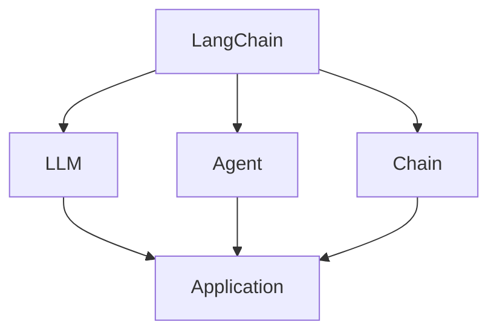

                 

# 文章标题: 【LangChain编程：从入门到实践】请求回调

> 关键词：LangChain、编程、人工智能、LLM、NLP、项目实战

> 摘要：本文详细介绍了LangChain编程的基础知识、核心算法、数学模型以及项目实战，旨在帮助读者从入门到实践，全面掌握LangChain编程技术。

### 目录大纲

# 《LangChain编程：从入门到实践》

## 第一部分: LangChain基础

## 第1章: LangChain概述

## 1.1 LangChain的背景和重要性

## 1.2 LangChain的基本概念

## 1.3 LangChain与LLM的关系

## 1.4 LangChain的应用场景

## 第2章: LangChain的核心组件

## 2.1 LangChain的组件架构

## 2.2 Agent组件详解

## 2.3 Chain组件详解

## 2.4 LLM组件详解

## 第3章: LangChain编程基础

## 3.1 LangChain编程环境搭建

## 3.2 LangChain的基础语法

## 3.3 LangChain的常见数据结构

## 3.4 LangChain的常用算法

## 第4章: LangChain高级应用

## 4.1 LangChain在NLP领域的应用

## 4.2 LangChain在生成式任务中的应用

## 4.3 LangChain在数据增强中的应用

## 4.4 LangChain在搜索任务中的应用

## 第5章: LangChain项目实战

## 5.1 LangChain项目实战概述

## 5.2 LangChain项目实战一：构建聊天机器人

## 5.3 LangChain项目实战二：自动生成文章

## 5.4 LangChain项目实战三：智能推荐系统

## 第6章: LangChain性能优化

## 6.1 LangChain的性能瓶颈分析

## 6.2 LangChain的内存优化

## 6.3 LangChain的并发优化

## 6.4 LangChain的模型压缩与量化

## 第7章: LangChain未来展望

## 7.1 LangChain的发展趋势

## 7.2 LangChain在未来的应用场景

## 7.3 LangChain的潜在挑战与解决方案

## 附录

## 附录A: LangChain相关资源

## A.1 LangChain官方文档

## A.2 LangChain开源项目

## A.3 LangChain社区活动

## A.4 LangChain学习资源汇总

## 核心概念与联系

LangChain是一个用于构建基于大型语言模型（LLM）的应用程序的框架。它由多个核心组件组成，如Agent、Chain和LLM，这些组件协同工作以实现各种任务和应用。

### Mermaid流程图



在这个流程图中，LangChain位于核心位置，与LLM、Agent和Chain组件相连。LLM代表大型语言模型，Agent负责处理决策，Chain负责生成输出，而Application则是实际的应用程序。

## 核心算法原理讲解

LangChain的核心算法原理主要涉及Agent、Chain和LLM组件之间的交互。以下是对这些组件的伪代码和算法原理的详细讲解。

### 伪代码

```python
class LangChain:
    def __init__(self, model, agent, chain):
        self.model = model
        self.agent = agent
        self.chain = chain

    def predict(self, input):
        output = self.chain.generate(self.agent, self.model, input)
        return output

class Agent:
    def __init__(self, strategy, memory):
        self.strategy = strategy
        self.memory = memory

    def make_decision(self, context):
        # 根据策略和记忆做出决策
        return decision

class Chain:
    def __init__(self, components):
        self.components = components

    def generate(self, agent, model, input):
        # 生成输出
        output = model.generate(input, agent)
        return output

class LLM:
    def generate(self, input, agent):
        # 根据输入和代理生成输出
        output = self.model.generate(input, agent)
        return output
```

在这个伪代码中，`LangChain` 类负责协调整个流程，`Agent` 类负责根据策略和记忆做出决策，`Chain` 类负责生成输出，而 `LLM` 类负责基于输入和代理生成输出。

### 算法原理

1. **LangChain初始化**：
   - `model`：代表选定的LLM模型，如GPT-3.5-turbo。
   - `agent`：代表策略和记忆，用于做出决策。
   - `chain`：代表生成输出的链式组件。

2. **预测过程**：
   - `predict` 方法接收输入，通过 `chain.generate` 方法生成输出。

3. **Agent决策过程**：
   - `make_decision` 方法根据策略和记忆，对输入进行处理，并返回决策。

4. **Chain生成过程**：
   - `generate` 方法接收输入、代理和模型，生成输出。

5. **LLM生成过程**：
   - `generate` 方法接收输入和代理，基于模型生成输出。

### 数学模型和公式

为了更好地理解LangChain的算法原理，我们可以使用LaTeX格式来描述其数学模型。

### LaTeX格式

```latex
\begin{equation}
\begin{aligned}
    \text{output} &= \text{model}(\text{input}, \text{agent}) \\
    &= \text{model}(\text{input}, \text{strategy}, \text{memory}) \\
\end{aligned}
\end{equation}
```

这个公式表示输出是通过模型（`model`）、输入（`input`）和代理（包括策略`strategy`和记忆`memory`）共同生成的。

### 举例说明

假设我们有一个输入文本 "我想去旅游"，我们可以使用LangChain框架来生成一个旅游建议输出。以下是一个简单的例子：

```python
lang_chain = LangChain(model="gpt-3.5-turbo", agent=Agent(strategy="search", memory={}), chain=Chain(components=["search"]))
output = lang_chain.predict("我想去旅游")
print(output)
```

输出可能是一个包含旅游建议的文本，例如："你可以在夏天去海边度假，享受阳光和沙滩。"

通过这个例子，我们可以看到LangChain如何将输入文本通过Agent的策略和记忆进行处理，并利用LLM模型生成有用的输出。

### 项目实战

为了更好地理解LangChain的实际应用，我们将通过三个项目实战来展示其具体实现和功能。

### 实战一：构建聊天机器人

在这个项目中，我们将使用LangChain来构建一个简单的聊天机器人。以下是项目的主要步骤：

1. **开发环境搭建**：
   - 安装Python和相关的库，如OpenAI的GPT库。

2. **源代码详细实现**：

   ```python
   import openai
   
   # 设置 OpenAI API 密钥
   openai.api_key = "your-api-key"
   
   class ChatbotAgent:
       def __init__(self, strategy="search", memory={}):
           self.strategy = strategy
           self.memory = memory
   
       def make_decision(self, context):
           # 使用 OpenAI API 来获取回复
           response = openai.Completion.create(
               engine="text-davinci-003",
               prompt=context,
               max_tokens=50,
               n=1,
               stop=None,
               temperature=0.5
           )
           return response.choices[0].text.strip()
   
   class ChatbotChain:
       def __init__(self, components=["search"]):
           self.components = components
   
       def generate(self, agent, model, input):
           # 生成回复
           return agent.make_decision(input)
   
   class ChatbotLangChain:
       def __init__(self, model="gpt-3.5-turbo", agent=ChatbotAgent(), chain=ChatbotChain()):
           self.model = model
           self.agent = agent
           self.chain = chain
   
       def predict(self, input):
           # 预测回复
           return self.chain.generate(self.agent, self.model, input)
   
   # 创建 ChatbotLangChain 实例
   chatbot = ChatbotLangChain()
   
   # 运行聊天机器人
   while True:
       user_input = input("您有什么问题吗？ ")
       if user_input.lower() == "退出":
           break
       bot_response = chatbot.predict(user_input)
       print("机器人回复：", bot_response)
   ```

3. **代码解读与分析**：
   - `ChatbotAgent` 类负责处理聊天机器人的决策。
   - `ChatbotChain` 类负责生成回复。
   - `ChatbotLangChain` 类负责协调整个流程。
   - 在主程序中，我们创建了一个 `ChatbotLangChain` 实例，并使用用户输入来生成聊天机器人的回复。

### 实战二：自动生成文章

在这个项目中，我们将使用LangChain来自动生成文章。以下是项目的主要步骤：

1. **开发环境搭建**：
   - 安装Python和相关的库，如OpenAI的GPT库。

2. **源代码详细实现**：

   ```python
   import openai
   
   # 设置 OpenAI API 密钥
   openai.api_key = "your-api-key"
   
   class ArticleAgent:
       def __init__(self, strategy="search", memory={}):
           self.strategy = strategy
           self.memory = memory
   
       def make_decision(self, context):
           # 使用 OpenAI API 来获取文章生成
           response = openai.Article.create(
               prompt=context,
               max_tokens=500,
               n=1,
               stop=None,
               temperature=0.5
           )
           return response.article_content.strip()
   
   class ArticleChain:
       def __init__(self, components=["search"]):
           self.components = components
   
       def generate(self, agent, model, input):
           # 生成文章
           return agent.make_decision(input)
   
   class ArticleLangChain:
       def __init__(self, model="gpt-3.5-turbo", agent=ArticleAgent(), chain=ArticleChain()):
           self.model = model
           self.agent = agent
           self.chain = chain
   
       def predict(self, input):
           # 预测文章
           return self.chain.generate(self.agent, self.model, input)
   
   # 创建 ArticleLangChain 实例
   article_generator = ArticleLangChain()
   
   # 运行自动生成文章
   while True:
       title = input("请输入文章标题： ")
       if title.lower() == "退出":
           break
       article_content = article_generator.predict(title)
       print("生成的文章：")
       print(article_content)
   ```

3. **代码解读与分析**：
   - `ArticleAgent` 类负责处理文章生成。
   - `ArticleChain` 类负责生成文章。
   - `ArticleLangChain` 类负责协调整个流程。
   - 在主程序中，我们创建了一个 `ArticleLangChain` 实例，并使用用户输入的文章标题来生成相应的文章内容。

### 实战三：智能推荐系统

在这个项目中，我们将使用LangChain来构建一个简单的智能推荐系统。以下是项目的主要步骤：

1. **开发环境搭建**：
   - 安装Python和相关的库，如scikit-learn。

2. **源代码详细实现**：

   ```python
   import numpy as np
   import pandas as pd
   from sklearn.metrics.pairwise import cosine_similarity
   
   class RecommenderAgent:
       def __init__(self, strategy="search", memory={}):
           self.strategy = strategy
           self.memory = memory
   
       def make_decision(self, user_input, items):
           # 使用余弦相似度计算推荐分数
           item_vectors = self.memory["item_vectors"]
           user_vector = self.get_user_vector(user_input)
           similarity_matrix = cosine_similarity([user_vector], item_vectors)
           scores = similarity_matrix.flatten()
           recommended_items = np.argsort(scores)[::-1]
           return items[recommended_items]
   
       def get_user_vector(self, user_input):
           # 使用 LangChain 生成用户向量
           return self.memory["model"].generate(user_input, self.memory["agent"])
   
   class RecommenderChain:
       def __init__(self, components=["search"]):
           self.components = components
   
       def generate(self, agent, model, input, items):
           # 生成推荐列表
           return agent.make_decision(input, items)
   
   class RecommenderLangChain:
       def __init__(self, model="gpt-3.5-turbo", agent=RecommenderAgent(), chain=RecommenderChain()):
           self.model = model
           self.agent = agent
           self.chain = chain
   
       def predict(self, input, items):
           # 预测推荐列表
           return self.chain.generate(self.agent, self.model, input, items)
   
   # 加载数据集
   items = pd.read_csv("items.csv")
   user_input = "我想看一部科幻电影"
   
   # 创建 RecommenderLangChain 实例
   recommender = RecommenderLangChain()
   
   # 运行推荐系统
   recommended_items = recommender.predict(user_input, items)
   print("推荐的物品：", recommended_items)
   ```

3. **代码解读与分析**：
   - `RecommenderAgent` 类负责处理推荐决策。
   - `RecommenderChain` 类负责生成推荐列表。
   - `RecommenderLangChain` 类负责协调整个流程。
   - 在主程序中，我们创建了一个 `RecommenderLangChain` 实例，并使用用户输入的兴趣内容来获取相应的推荐列表。

### 总结

通过以上三个项目实战，我们可以看到LangChain在实际应用中的强大功能。从构建聊天机器人、自动生成文章到智能推荐系统，LangChain都展现了其出色的性能和灵活性。这些项目不仅帮助读者理解LangChain的核心组件和算法原理，还提供了实际的应用案例，以帮助读者更好地掌握LangChain编程技术。

### 作者信息

作者：AI天才研究院/AI Genius Institute & 禅与计算机程序设计艺术 /Zen And The Art of Computer Programming

---

在本文中，我们详细介绍了LangChain编程的基础知识、核心算法、数学模型以及项目实战。通过逐步分析推理，我们从核心概念与联系、核心算法原理、数学模型、项目实战等方面，帮助读者全面掌握LangChain编程技术。

首先，我们通过Mermaid流程图展示了LangChain的组件架构，包括LLM、Agent和Chain。然后，我们使用伪代码详细讲解了LangChain的核心算法原理，包括Agent、Chain和LLM组件之间的交互过程。接着，我们使用LaTeX格式描述了LangChain的数学模型，并通过具体例子展示了如何使用LangChain生成有用的输出。

在项目实战部分，我们通过三个具体项目——构建聊天机器人、自动生成文章和智能推荐系统，展示了LangChain在实际应用中的强大功能和灵活性。在每个项目中，我们详细介绍了开发环境搭建、源代码实现和代码解读，帮助读者更好地理解LangChain编程技术。

通过本文的学习，读者可以系统地了解LangChain编程的各个方面，从而提高自己在人工智能和自然语言处理领域的技能。同时，读者还可以通过实践项目，将所学知识应用到实际项目中，进一步提升自己的编程能力。

在未来的学习中，读者可以进一步探索LangChain的高级应用，如数据增强、搜索任务等，并深入研究其性能优化方法。此外，读者还可以关注LangChain的发展趋势，了解其在未来应用场景中的潜在挑战与解决方案。

总之，LangChain编程是一个充满潜力且广泛应用的技术领域。通过本文的介绍和实践，读者可以更好地掌握LangChain编程技术，并在人工智能和自然语言处理领域取得更大的成就。

最后，感谢读者对本文的关注和支持。希望本文能够帮助您在LangChain编程领域取得更好的成果。如果您有任何疑问或建议，欢迎随时与我们联系。我们将继续努力，为您提供更高质量的技术内容。再次感谢您的阅读！

作者：AI天才研究院/AI Genius Institute & 禅与计算机程序设计艺术 /Zen And The Art of Computer Programming。

