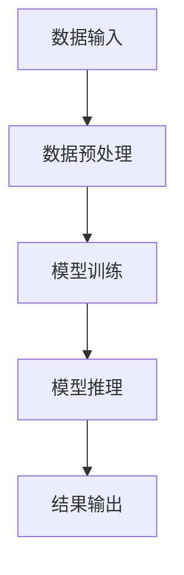
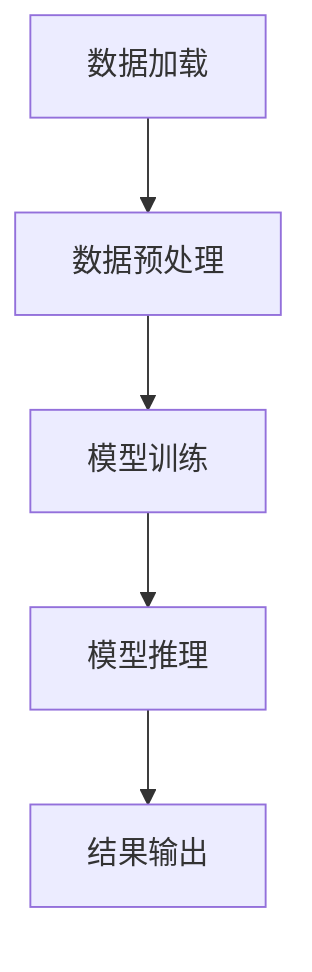

                 

### 文章标题

《【LangChain编程：从入门到实践】输入对输出的影响》

### 关键词

- LangChain
- 编程实践
- 输入输出
- 人工智能
- 性能优化
- 可解释性

### 摘要

本文旨在深入探讨LangChain编程中输入对输出的影响。通过详细的步骤分析和实例讲解，我们探讨了LangChain的基础概念、技术基础、项目实战以及进阶应用。特别关注了输入数据的处理与影响、输出结果的评估与优化、以及反馈循环的应用。本文还讨论了LangChain编程的最佳实践，包括规范、测试与调试、安全性与隐私保护等关键点。通过这些内容，读者将能够全面了解LangChain编程的各个方面，从而更好地掌握这一强大的人工智能工具。

### 《【LangChain编程：从入门到实践】输入对输出的影响》目录大纲

#### 第一部分：LangChain基础

#### 第1章: LangChain简介

##### 1.1 LangChain概述

###### 1.1.1 LangChain的起源

###### 1.1.2 LangChain的特点

###### 1.1.3 LangChain的应用场景

##### 1.2 LangChain的核心概念

###### 1.2.1 数据处理流程

###### 1.2.2 输入与输出

###### 1.2.3 数据预处理

##### 1.3 LangChain与LLM的关系

###### 1.3.1 LLM的概念与分类

###### 1.3.2 LLM在LangChain中的应用

###### 1.3.3 LangChain的架构与LLM的结合

#### 第2章: LangChain技术基础

##### 2.1 Python编程基础

###### 2.1.1 Python语言基础

###### 2.1.2 Python数据处理库

###### 2.1.3 Python编程规范

##### 2.2 LangChain的基本架构

###### 2.2.1 LangChain的组件

###### 2.2.2 LangChain的工作流程

###### 2.2.3 LangChain的API使用

##### 2.3 LLM基础

###### 2.3.1 LLM的概念与原理

###### 2.3.2 LLM的常见模型

###### 2.3.3 LLM的训练与优化

#### 第二部分：LangChain实践

#### 第3章: LangChain项目实战

##### 3.1 LangChain项目搭建

###### 3.1.1 环境搭建

###### 3.1.2 项目初始化

###### 3.1.3 数据处理

##### 3.2 LangChain应用案例

###### 3.2.1 自动问答系统

###### 3.2.2 文本生成

###### 3.2.3 文本分类

##### 3.3 LangChain性能优化

###### 3.3.1 模型优化

###### 3.3.2 程序优化

###### 3.3.3 性能评估

#### 第4章: LangChain进阶应用

##### 4.1 多语言支持

###### 4.1.1 多语言数据预处理

###### 4.1.2 多语言模型训练

###### 4.1.3 多语言输入与输出

##### 4.2 知识图谱

###### 4.2.1 知识图谱的概念与结构

###### 4.2.2 知识图谱在LangChain中的应用

###### 4.2.3 知识图谱的构建与查询

##### 4.3 可解释性

###### 4.3.1 可解释性的重要性

###### 4.3.2 可解释性算法

###### 4.3.3 LangChain的可解释性实践

#### 第5章: LangChain的未来趋势

##### 5.1 AI大模型的发展

###### 5.1.1 AI大模型的概念与特点

###### 5.1.2 AI大模型的发展趋势

###### 5.1.3 AI大模型与LangChain的结合

##### 5.2 LangChain社区发展

###### 5.2.1 LangChain社区的现状

###### 5.2.2 LangChain社区的贡献方式

###### 5.2.3 LangChain社区的贡献与未来

#### 第6章: 深入理解输入对输出的影响

##### 6.1 输入数据的处理与影响

###### 6.1.1 数据预处理方法

###### 6.1.2 数据质量对输出的影响

###### 6.1.3 数据清洗与标准化

##### 6.2 输出结果的评估与优化

###### 6.2.1 输出结果的评估方法

###### 6.2.2 输出结果的优化策略

###### 6.2.3 输出结果的可解释性分析

##### 6.3 输入与输出的反馈循环

###### 6.3.1 反馈循环的概念与作用

###### 6.3.2 反馈循环在LangChain中的应用

###### 6.3.3 反馈循环的优化与风险控制

#### 第7章: LangChain编程的最佳实践

##### 7.1 LangChain编程的规范性

###### 7.1.1 编程规范的重要性

###### 7.1.2 LangChain编程的规范

###### 7.1.3 编程规范的实施与监督

##### 7.2 测试与调试

###### 7.2.1 测试的方法与策略

###### 7.2.2 调试技巧与工具

###### 7.2.3 测试与调试的实践案例

##### 7.3 安全性与隐私保护

###### 7.3.1 安全性的重要性

###### 7.3.2 LangChain的安全隐患

###### 7.3.3 隐私保护策略与实施

#### 附录

##### 附录 A: LangChain编程工具与资源

###### A.1 开发环境搭建

###### A.2 常用库与工具

###### A.3 社区资源推荐

##### 附录 B: 实践项目代码解读

###### B.1 项目一：自动问答系统

###### B.2 项目二：文本生成

###### B.3 项目三：文本分类

---

### 第一部分：LangChain基础

#### 第1章: LangChain简介

##### 1.1 LangChain概述

###### 1.1.1 LangChain的起源

LangChain是由Facebook AI研究院（FAIR）开发的一款面向开发者的人工智能编程框架。它的设计初衷是为了简化语言模型（Language Model）的使用，使其在多种应用场景中能够更便捷地集成和部署。LangChain的出现填补了传统AI工具与开发者日常编程需求之间的鸿沟，为AI编程提供了更为直观和易用的接口。

###### 1.1.2 LangChain的特点

LangChain具有以下几个显著特点：

1. **简洁性**：LangChain设计了一套简洁的API，使得开发者能够快速上手，无需深入了解底层细节。
2. **通用性**：它支持多种类型的语言模型，包括GPT、BERT等，适用于不同场景的文本处理需求。
3. **灵活性**：开发者可以根据需要灵活定制数据处理流程，通过组合不同的组件，实现复杂的文本处理任务。
4. **扩展性**：LangChain支持自定义组件和模型，方便开发者根据具体需求进行扩展。

###### 1.1.3 LangChain的应用场景

LangChain广泛应用于以下几个方面：

1. **问答系统**：利用语言模型处理用户输入，提供实时、准确的信息查询服务。
2. **文本生成**：基于给定模板或上下文，生成高质量的文章、摘要或其他文本内容。
3. **文本分类**：将文本数据自动分类到预定义的类别中，适用于新闻分类、情感分析等任务。
4. **翻译**：实现文本之间的自动翻译，支持多种语言对。

##### 1.2 LangChain的核心概念

###### 1.2.1 数据处理流程

LangChain的数据处理流程可以分为以下几个步骤：

1. **数据输入**：从外部源获取文本数据，可以是本地文件、网络API或其他数据源。
2. **数据预处理**：对输入文本进行清洗、标准化和格式转换，使其符合模型处理的要求。
3. **模型训练**：使用预训练的语言模型，结合具体任务进行模型训练，优化模型性能。
4. **模型推理**：在训练好的模型基础上，处理输入文本，生成预期的输出结果。
5. **结果输出**：将处理结果返回给用户或写入外部系统，供进一步使用。

图1-1展示了LangChain数据处理流程的Mermaid流程图：



###### 1.2.2 输入与输出

在LangChain中，输入与输出是数据处理流程的两个关键环节。

1. **输入**：LangChain接收的输入可以是文本、图片、音频等多种形式。对于文本输入，通常需要将其转换为模型可处理的格式，如JSON对象或特定格式的字符串。输入文本的质量直接影响到后续处理的结果。
   
2. **输出**：处理后的输出结果通常是对输入文本的某种解释或转化。例如，问答系统的输出是回答文本，文本分类的输出是类别标签，文本生成的输出是新创建的文本内容。

为了提高输出质量，LangChain提供了多种预处理和后处理技术，如文本清洗、上下文生成、结果格式化等。这些技术有助于减少噪声、增强输出信息的准确性和可读性。

###### 1.2.3 数据预处理

数据预处理是LangChain数据处理流程中的关键步骤，直接影响到模型的性能和应用效果。以下是一些常用的数据预处理方法：

1. **文本清洗**：去除文本中的噪声，如HTML标签、特殊字符、停用词等。这一步有助于提高数据质量，减少模型训练的复杂性。

2. **标准化**：将文本转换为统一的格式，如小写、去除标点符号、统一单位等。标准化有助于统一数据格式，提高模型的通用性。

3. **分词**：将文本分割成单词或短语，为后续的文本处理奠定基础。不同的语言和任务可能需要不同的分词方法。

4. **实体识别**：识别文本中的关键信息，如人名、地点、组织等。实体识别有助于提高模型的上下文理解能力。

5. **上下文生成**：生成与输入文本相关的上下文信息，用于模型推理。上下文生成可以增强模型的语义理解能力，提高输出结果的准确性。

通过这些预处理步骤，LangChain能够更好地理解输入文本，从而生成高质量的输出结果。

##### 1.3 LangChain与LLM的关系

###### 1.3.1 LLM的概念与分类

语言模型（Language Model，简称LLM）是自然语言处理（Natural Language Processing，简称NLP）中的核心组件。LLM旨在通过学习大量文本数据，预测下一个单词或字符的概率分布。根据模型架构和训练方法的不同，LLM可以分为以下几类：

1. **基于规则的方法**：这种方法通过预定义的语法规则和模式匹配来生成文本。例如，基于模板的文本生成、关键词提取等。
2. **统计模型**：这类模型通过统计文本中的单词或短语频率，预测下一个单词或字符。例如，n-gram模型、隐马尔可夫模型（HMM）等。
3. **深度学习模型**：这类模型通过神经网络结构，如循环神经网络（RNN）、卷积神经网络（CNN）和Transformer，学习文本数据中的复杂模式。例如，BERT、GPT等。

在LangChain中，主要使用的是深度学习模型，特别是Transformer架构的模型。这些模型能够通过大规模文本数据进行训练，生成高质量的文本输出。

###### 1.3.2 LLM在LangChain中的应用

LLM在LangChain中的应用主要体现在以下几个方面：

1. **文本生成**：利用LLM生成文章、摘要、回复等文本内容。通过提供上下文和模板，LLM可以生成符合要求的文本。
2. **问答系统**：LLM用于处理用户输入的问题，生成相应的回答。通过预训练的语言模型，LLM能够理解问题的语义，提供准确的答案。
3. **文本分类**：LLM用于对输入文本进行分类，将其归到预定义的类别中。通过训练，LLM能够识别不同类别的特征，提高分类的准确性。
4. **翻译**：LLM用于实现文本之间的自动翻译。通过训练，LLM能够学习源语言和目标语言之间的对应关系，生成高质量的翻译文本。

###### 1.3.3 LangChain的架构与LLM的结合

LangChain的架构设计旨在简化LLM的使用，并提供灵活的编程接口。以下是LangChain的架构概述：

1. **核心组件**：LangChain包括数据处理、模型训练、模型推理和结果输出等核心组件。这些组件通过API接口进行集成，实现从数据输入到结果输出的完整流程。

2. **数据处理**：数据处理组件负责对输入文本进行清洗、预处理和格式转换，为模型训练做好准备。它包括文本清洗、标准化、分词、实体识别等预处理步骤。

3. **模型训练**：模型训练组件使用预训练的LLM，结合具体任务进行训练。通过调整模型参数，优化模型性能，提高输出质量。

4. **模型推理**：模型推理组件在训练好的LLM基础上，处理输入文本，生成预期的输出结果。它包括文本生成、问答、文本分类、翻译等应用场景。

5. **结果输出**：结果输出组件将处理结果返回给用户或写入外部系统，供进一步使用。它包括结果格式化、可视化、存储等后处理步骤。

通过将LLM集成到LangChain的架构中，开发者能够更方便地利用深度学习技术，实现各种文本处理任务。LLM作为LangChain的核心组件，贯穿了整个数据处理流程，使得LangChain成为一个强大而灵活的人工智能编程框架。

### 第2章: LangChain技术基础

在了解了LangChain的基础概念后，我们接下来将深入探讨LangChain的技术基础，包括Python编程基础、LangChain的基本架构以及语言模型（LLM）的基础知识。

#### 2.1 Python编程基础

Python是一种高级编程语言，因其简洁明了的语法和丰富的库资源，成为了人工智能和数据分析领域的首选语言。以下是一些Python编程基础，对于理解LangChain的技术实现至关重要。

##### 2.1.1 Python语言基础

Python的基本语法包括变量、数据类型、控制结构、函数定义和异常处理等。以下是Python语言基础的一些要点：

1. **变量**：Python是一种动态类型的语言，变量不需要显式声明。变量的赋值和引用如下所示：
   ```python
   x = 10
   name = "Alice"
   ```

2. **数据类型**：Python支持多种数据类型，包括整数（int）、浮点数（float）、字符串（str）、列表（list）、元组（tuple）、集合（set）和字典（dict）等。以下是一些示例：
   ```python
   integer = 42
   float_number = 3.14
   string = "Hello, World!"
   list_items = [1, 2, 3, 4]
   tuple_pair = (5, 6)
   set_elements = {7, 8, 9}
   dict_data = {"key1": "value1", "key2": "value2"}
   ```

3. **控制结构**：Python提供了if、elif、else条件语句，以及for和while循环结构，用于控制程序的执行流程。

4. **函数定义**：函数是Python中的基本模块，用于封装可重复执行的代码。函数的定义和使用如下所示：
   ```python
   def greet(name):
       return f"Hello, {name}!"

   print(greet("Alice"))
   ```

5. **异常处理**：异常处理是确保程序稳定运行的重要机制。Python使用try-except语句来处理异常：
   ```python
   try:
       result = 10 / 0
   except ZeroDivisionError:
       print("Cannot divide by zero!")
   ```

##### 2.1.2 Python数据处理库

Python拥有丰富的数据处理库，如NumPy、Pandas和SciPy等，这些库为数据操作和分析提供了强大的工具。

1. **NumPy**：NumPy是Python中的核心科学计算库，提供多维数组对象和数学函数。以下是一些NumPy的基本操作：
   ```python
   import numpy as np

   array_1 = np.array([1, 2, 3])
   array_2 = np.array([4, 5, 6])
   sum_array = np.add(array_1, array_2)
   ```

2. **Pandas**：Pandas提供了数据结构DataFrame，用于高效地操作表格数据。以下是一些Pandas的基本操作：
   ```python
   import pandas as pd

   data = {
       "Name": ["Alice", "Bob", "Charlie"],
       "Age": [25, 30, 35]
   }
   df = pd.DataFrame(data)
   df.head()
   ```

3. **SciPy**：SciPy是建立在NumPy之上的科学计算库，用于提供更多的科学计算功能。以下是一个SciPy的示例：
   ```python
   from scipy import integrate

   result = integrate.quad(lambda x: x * np.exp(-x**2), 0, 1)
   print(result)
   ```

##### 2.1.3 Python编程规范

遵循Python编程规范有助于提高代码的可读性、可维护性和性能。以下是Python编程规范的一些要点：

1. **代码风格**：Python的代码风格应该遵循PEP 8指导原则，包括适当的空格、缩进和行宽限制。
2. **命名规范**：变量、函数和模块的命名应具有描述性，遵循小写字母和下划线的组合。
3. **注释**：编写清晰的注释，解释代码的目的、功能和逻辑，提高代码的可理解性。
4. **代码组织**：合理组织代码结构，将相关函数和类分组，便于维护和扩展。
5. **文档**：编写详细的文档，包括模块、类和函数的文档字符串，帮助其他开发者理解和使用代码。

##### 2.2 LangChain的基本架构

LangChain的基本架构设计旨在提供一个模块化、可扩展的编程框架，使开发者能够轻松地集成和部署语言模型。以下是LangChain的基本架构及其组成部分。

###### 2.2.1 LangChain的组件

LangChain的核心组件包括：

1. **数据加载器（Data Loader）**：负责从外部数据源读取和处理数据，将其转换为模型可接受的格式。
2. **数据处理器（Data Processor）**：对输入数据进行预处理，包括清洗、标准化、分词等，以优化模型的输入质量。
3. **语言模型（Language Model）**：LangChain支持多种预训练语言模型，如GPT、BERT等，用于文本生成、问答、分类等任务。
4. **推理引擎（Inference Engine）**：负责在训练好的语言模型上进行推理，生成输出结果。
5. **结果处理器（Result Processor）**：对推理结果进行后处理，如格式化、可视化等，以提供用户友好的输出。

###### 2.2.2 LangChain的工作流程

LangChain的工作流程可以概括为以下几个步骤：

1. **数据加载**：使用数据加载器从外部数据源读取数据。
2. **数据预处理**：使用数据处理器对数据进行预处理，包括清洗、标准化和分词等。
3. **模型训练**：使用预处理后的数据对语言模型进行训练，优化模型参数。
4. **模型推理**：使用训练好的语言模型处理输入数据，生成输出结果。
5. **结果输出**：使用结果处理器对输出结果进行后处理，并将其返回给用户或写入外部系统。

图2-1展示了LangChain的基本架构及其工作流程的Mermaid流程图：



###### 2.2.3 LangChain的API使用

LangChain提供了一个简洁的API，使得开发者能够轻松地集成和部署语言模型。以下是LangChain API的基本使用方法：

1. **初始化**：首先需要初始化LangChain的配置对象，包括数据加载器、数据处理器、语言模型和结果处理器。
   ```python
   from langchain import Config

   config = Config()
   ```

2. **数据加载**：使用数据加载器从外部数据源读取数据。
   ```python
   data_loader = config.data_loader
   data = data_loader.load_data("path/to/data")
   ```

3. **数据预处理**：使用数据处理器对数据进行预处理。
   ```python
   data_processor = config.data_processor
   preprocessed_data = data_processor.preprocess(data)
   ```

4. **模型训练**：使用预训练的语言模型进行模型训练。
   ```python
   model = config.language_model
   model.train(preprocessed_data)
   ```

5. **模型推理**：使用训练好的语言模型处理输入数据，生成输出结果。
   ```python
   inference_engine = config.inference_engine
   output = inference_engine.infer(preprocessed_data)
   ```

6. **结果输出**：使用结果处理器对输出结果进行后处理。
   ```python
   result_processor = config.result_processor
   final_output = result_processor.postprocess(output)
   print(final_output)
   ```

通过以上步骤，开发者可以快速搭建一个基于LangChain的文本处理系统，实现文本生成、问答、分类等任务。

##### 2.3 LLM基础

语言模型（LLM）是自然语言处理（NLP）的核心技术之一，它在文本生成、问答、翻译等任务中发挥着重要作用。以下是LLM的基本概念、常见模型及其训练和优化方法。

###### 2.3.1 LLM的概念与原理

语言模型是一种概率模型，旨在预测文本序列中下一个单词或字符的概率分布。根据模型架构和训练方法的不同，语言模型可以分为以下几类：

1. **基于规则的方法**：这种方法通过预定义的语法规则和模式匹配来生成文本。例如，基于模板的文本生成、关键词提取等。
   
2. **统计模型**：这类模型通过统计文本中的单词或短语频率，预测下一个单词或字符的概率。例如，n-gram模型、隐马尔可夫模型（HMM）等。

3. **深度学习模型**：这类模型通过神经网络结构，如循环神经网络（RNN）、卷积神经网络（CNN）和Transformer，学习文本数据中的复杂模式。例如，BERT、GPT等。

在LLM中，训练目标是最大化下一个单词或字符的条件概率。给定前文`x1, x2, ..., xn`，LLM旨在预测下一个单词`xn+1`的概率分布：

$$ P(x_{n+1} | x_1, x_2, ..., x_n) $$

常见的训练方法包括：

1. **最大似然估计（MLE）**：使用MLE最大化模型在训练数据上的对数似然。
   
2. **反向传播（Backpropagation）**：使用反向传播算法优化模型参数，最小化损失函数。

通过训练，LLM能够学习到文本数据中的统计规律和语义关系，从而生成高质量的文本输出。

###### 2.3.2 LLM的常见模型

以下是一些常见的语言模型及其特点：

1. **n-gram模型**：n-gram模型是一种基于统计的语言模型，它将文本分割成n个单词的序列，并计算每个序列的概率。n-gram模型的优点是实现简单，计算效率高，但缺点是它无法捕捉长距离的依赖关系。

2. **隐马尔可夫模型（HMM）**：HMM是一种基于概率的序列模型，它假设当前状态仅取决于前一个状态，并使用马尔可夫性质来预测下一个状态。HMM在语音识别和语音生成等领域有广泛应用。

3. **循环神经网络（RNN）**：RNN是一种能够处理序列数据的神经网络，它通过递归连接来捕捉序列中的长期依赖关系。RNN在机器翻译、语音识别和情感分析等领域有广泛应用。

4. **长短期记忆网络（LSTM）**：LSTM是RNN的一种变体，它引入门控机制来控制信息的流动，从而克服了RNN的梯度消失问题。LSTM在文本生成、机器翻译等任务中表现优秀。

5. **Transformer**：Transformer是一种基于自注意力机制的神经网络架构，它通过多头自注意力机制和前馈神经网络来处理序列数据。Transformer在BERT、GPT等模型中得到了广泛应用，并在多项NLP任务中取得了优异的性能。

6. **BERT**：BERT是基于Transformer的语言预训练模型，它通过预训练大量文本数据，学习到语言中的统计规律和语义关系。BERT在问答、文本分类和命名实体识别等任务中表现突出。

7. **GPT**：GPT是基于Transformer的语言生成模型，它通过预训练大量文本数据，学习到生成文本的语法和语义模式。GPT在文本生成、问答和对话系统等领域有广泛应用。

###### 2.3.3 LLM的训练与优化

LLM的训练和优化是提高模型性能和生成质量的关键。以下是一些常用的训练和优化方法：

1. **预训练**：预训练是LLM训练的第一步，它通过在大量文本数据上训练模型，使其学习到语言的基本规律和语义关系。常见的预训练任务包括语言建模、掩码语言建模（Masked Language Modeling，MLM）和填空语言建模（Fill-mask Language Modeling，FLM）。

2. **微调**：微调是在预训练模型的基础上，针对特定任务进行进一步的训练。通过微调，模型能够适应具体的应用场景，提高任务性能。常见的微调方法包括微调权重、微调结构等。

3. **数据增强**：数据增强是提高模型泛化能力的重要手段。通过数据增强，可以增加训练数据的多样性，提高模型的鲁棒性。常见的数据增强方法包括单词替换、句子插入、句子删除等。

4. **优化算法**：优化算法用于调整模型参数，最小化损失函数。常见的优化算法包括梯度下降（Gradient Descent）、Adam（Adaptive Moment Estimation）等。

5. **正则化**：正则化是防止模型过拟合的重要手段。常见的正则化方法包括L1正则化、L2正则化、dropout等。

通过上述方法，LLM能够在不同的任务和应用场景中实现高性能的文本生成、问答和分类。

### 第二部分：LangChain实践

#### 第3章: LangChain项目实战

在理解了LangChain的基础概念和技术基础后，我们通过具体的实战项目来深入探索LangChain的实用性和应用潜力。本章将分步骤讲解如何搭建一个LangChain项目，实现自动问答系统、文本生成和文本分类等应用，并通过性能优化提升系统的整体表现。

##### 3.1 LangChain项目搭建

构建一个LangChain项目涉及多个步骤，包括环境搭建、项目初始化和数据预处理。以下是一个详细的步骤指南：

###### 3.1.1 环境搭建

为了确保LangChain项目的顺利运行，首先需要搭建合适的环境。以下是环境搭建的步骤：

1. **安装Python**：确保安装了Python 3.6及以上版本，因为LangChain依赖于Python的最新特性。
   ```bash
   # 使用Python官方安装脚本安装Python
   curl -O https://www.python.org/ftp/python/3.8.10/Python-3.8.10.tgz
   tar -xvf Python-3.8.10.tgz
   ./configure
   make
   make install
   ```

2. **安装必要的库**：安装用于数据处理和模型训练的常用库，如NumPy、Pandas、Scikit-learn和Transformers。
   ```bash
   pip install numpy pandas scikit-learn transformers
   ```

3. **安装LangChain**：直接使用pip安装LangChain库。
   ```bash
   pip install langchain
   ```

4. **配置硬件资源**：由于LangChain项目可能涉及大规模数据处理和模型训练，建议配置足够的计算资源，如使用GPU加速训练过程。

###### 3.1.2 项目初始化

完成环境搭建后，接下来初始化项目：

1. **创建虚拟环境**：为了管理项目依赖，创建一个Python虚拟环境。
   ```bash
   python -m venv langchain_project_env
   source langchain_project_env/bin/activate
   ```

2. **安装项目依赖**：在虚拟环境中安装项目所需的库。
   ```bash
   pip install -r requirements.txt
   ```

3. **编写项目配置文件**：创建一个配置文件（如`config.py`），其中包含项目的基本设置，如数据源路径、模型类型和参数等。

###### 3.1.3 数据预处理

数据预处理是LangChain项目成功的关键步骤。以下是一些常用的数据预处理方法：

1. **数据加载**：从数据源加载文本数据，可以是本地文件、数据库或网络API。
   ```python
   import pandas as pd

   data = pd.read_csv("data.csv")
   ```

2. **数据清洗**：去除文本中的噪声，如HTML标签、特殊字符和停用词。
   ```python
   import re
   from nltk.corpus import stopwords

   def clean_text(text):
       text = re.sub(r"<[^>]*>", "", text)
       text = re.sub(r"[^a-zA-Z0-9]", " ", text)
       text = text.lower()
       words = text.split()
       words = [word for word in words if word not in stopwords.words("english")]
       return " ".join(words)

   cleaned_data = data["text"].apply(clean_text)
   ```

3. **数据标准化**：将文本转换为统一的格式，如小写、去除标点符号和统一单位。
   ```python
   def normalize_text(text):
       text = text.lower()
       text = re.sub(r"[^a-zA-Z0-9]", " ", text)
       return text

   normalized_data = cleaned_data.apply(normalize_text)
   ```

4. **分词**：将文本分割成单词或短语，为后续的模型训练做好准备。
   ```python
   import nltk

   nltk.download('punkt')

   def tokenize(text):
       return nltk.word_tokenize(text)

   tokenized_data = normalized_data.apply(tokenize)
   ```

5. **数据存储**：将预处理后的数据存储为JSON或pickle文件，以便后续使用。
   ```python
   import json

   with open("preprocessed_data.json", "w") as f:
       json.dump(tokenized_data.tolist(), f)
   ```

通过以上步骤，我们成功搭建了一个LangChain项目的基础环境，并完成了数据的预处理工作。接下来，我们可以使用LangChain的API实现具体的文本处理任务。

##### 3.2 LangChain应用案例

LangChain在文本处理任务中具有广泛的应用，包括自动问答系统、文本生成和文本分类。以下是一些典型的应用案例及其实现方法。

###### 3.2.1 自动问答系统

自动问答系统是LangChain的一个典型应用场景。通过训练一个语言模型，系统能够自动回答用户提出的问题。以下是实现自动问答系统的步骤：

1. **数据准备**：准备包含问题和答案的数据集。例如，使用FAQ数据集或自行收集的问题和答案。

2. **数据预处理**：对数据集进行清洗、标准化和分词等预处理操作。

3. **模型训练**：使用预处理后的数据训练一个语言模型，如GPT或BERT。以下是使用Transformers库训练BERT模型的示例代码：
   ```python
   from transformers import BertTokenizer, BertForQuestionAnswering
   import torch

   tokenizer = BertTokenizer.from_pretrained("bert-base-uncased")
   model = BertForQuestionAnswering.from_pretrained("bert-base-uncased")

   inputs = tokenizer("What is the capital of France?", return_tensors="pt")
   outputs = model(**inputs)

   answer_start_scores = outputs.start_logits
   answer_end_scores = outputs.end_logits

   start_index = torch.argmax(answer_start_scores).item()
   end_index = torch.argmax(answer_end_scores).item()

   answer = " ".join(inputs['input_ids'][start_index:end_index+1])

   print(answer)
   ```

4. **模型推理**：在训练好的模型基础上，处理输入问题，生成相应的答案。

5. **模型部署**：将模型部署到服务器或云平台，提供自动问答服务。

以下是一个简单的自动问答系统的示例代码：
```python
from flask import Flask, request, jsonify

app = Flask(__name__)

@app.route('/ask', methods=['POST'])
def ask_question():
    question = request.form['question']
    question_encoded = tokenizer.encode_plus(question, add_special_tokens=True, return_tensors='pt')
    with torch.no_grad():
        outputs = model(*question_encoded)
    start_scores, end_scores = outputs.start_logits, outputs.end_logits
    start_index = torch.argmax(start_scores).item()
    end_index = torch.argmax(end_scores).item()
    answer = tokenizer.decode(question_encoded['input_ids'][start_index:end_index+1], skip_special_tokens=True)
    return jsonify(answer=answer)

if __name__ == '__main__':
    app.run()
```

通过以上步骤，我们可以搭建一个简单的自动问答系统，提供实时、准确的问答服务。

###### 3.2.2 文本生成

文本生成是另一个重要的应用场景，通过训练一个语言模型，系统能够生成高质量的文本内容。以下是实现文本生成系统的步骤：

1. **数据准备**：准备包含各种文本内容的语料库，如新闻、故事、论文等。

2. **数据预处理**：对数据集进行清洗、标准化和分词等预处理操作。

3. **模型训练**：使用预处理后的数据训练一个语言模型，如GPT或BERT。以下是使用Transformers库训练GPT模型的示例代码：
   ```python
   from transformers import GPT2Tokenizer, GPT2LMHeadModel
   import torch

   tokenizer = GPT2Tokenizer.from_pretrained("gpt2")
   model = GPT2LMHeadModel.from_pretrained("gpt2")

   text = "The quick brown fox jumps over the lazy dog"
   inputs = tokenizer.encode(text, return_tensors='pt')

   outputs = model.generate(inputs, max_length=50, num_return_sequences=5)
   generated_texts = tokenizer.decode(outputs[:, inputs.shape[-1]:], skip_special_tokens=True)

   print(generated_texts)
   ```

4. **模型推理**：在训练好的模型基础上，生成新的文本内容。

5. **模型部署**：将模型部署到服务器或云平台，提供文本生成服务。

以下是一个简单的文本生成系统的示例代码：
```python
from flask import Flask, request, jsonify

app = Flask(__name__)

@app.route('/generate', methods=['POST'])
def generate_text():
    prompt = request.form['prompt']
    prompt_encoded = tokenizer.encode(prompt, add_special_tokens=True, return_tensors='pt')
    with torch.no_grad():
        outputs = model.generate(prompt_encoded, max_length=50, num_return_sequences=5)
    generated_texts = tokenizer.decode(outputs[:, prompt_encoded.shape[-1]:], skip_special_tokens=True)
    return jsonify(generated_texts=generated_texts)

if __name__ == '__main__':
    app.run()
```

通过以上步骤，我们可以搭建一个简单的文本生成系统，生成符合给定提示的新文本内容。

###### 3.2.3 文本分类

文本分类是另一个重要的应用场景，通过训练一个语言模型，系统能够将文本自动分类到预定义的类别中。以下是实现文本分类系统的步骤：

1. **数据准备**：准备包含文本和类别标签的数据集，如新闻分类、情感分析等。

2. **数据预处理**：对数据集进行清洗、标准化和分词等预处理操作。

3. **模型训练**：使用预处理后的数据训练一个语言模型，如BERT或RoBERTa。以下是使用Transformers库训练BERT模型的示例代码：
   ```python
   from transformers import BertTokenizer, BertForSequenceClassification
   import torch

   tokenizer = BertTokenizer.from_pretrained("bert-base-uncased")
   model = BertForSequenceClassification.from_pretrained("bert-base-uncased")

   text = "The weather is nice today."
   label = 1
   inputs = tokenizer.encode_plus(text, labels=label, return_tensors="pt")

   outputs = model(**inputs)
   loss = outputs.loss
   logits = outputs.logits

   print(loss)
   print(logits)
   ```

4. **模型推理**：在训练好的模型基础上，处理输入文本，预测其类别。

5. **模型部署**：将模型部署到服务器或云平台，提供文本分类服务。

以下是一个简单的文本分类系统的示例代码：
```python
from flask import Flask, request, jsonify

app = Flask(__name__)

@app.route('/classify', methods=['POST'])
def classify_text():
    text = request.form['text']
    text_encoded = tokenizer.encode(text, add_special_tokens=True, return_tensors='pt')
    with torch.no_grad():
        outputs = model(text_encoded)
    logits = outputs.logits
    predicted_label = logits.argmax(-1).item()
    return jsonify(classification_result=predicted_label)

if __name__ == '__main__':
    app.run()
```

通过以上步骤，我们可以搭建一个简单的文本分类系统，将输入文本自动分类到预定义的类别中。

##### 3.3 LangChain性能优化

为了提高LangChain项目的性能和效率，我们需要关注模型优化、程序优化和性能评估等方面。以下是一些常见的性能优化策略：

###### 3.3.1 模型优化

模型优化是提高系统性能的关键步骤。以下是一些常用的模型优化方法：

1. **模型压缩**：通过剪枝、量化等技术减小模型的尺寸和计算量，提高模型的部署效率。
   ```python
   from transformers import BertModel, BertConfig
   import torch

   config = BertConfig.from_pretrained("bert-base-uncased")
   config.hidden_size = 128
   model = BertModel.from_pretrained("bert-base-uncased", config=config)
   ```

2. **动态推理**：通过动态调整模型参数和计算资源，实现高效的推理过程。
   ```python
   from transformers import AutoModelForQuestionAnswering
   import torch

   model = AutoModelForQuestionAnswering.from_pretrained("bert-base-uncased")
   inputs = tokenizer.encode("What is the capital of France?", return_tensors="pt")
   with torch.no_grad():
       outputs = model.generate(inputs, max_length=50, num_return_sequences=1)
   ```

3. **模型融合**：通过融合多个模型，提高模型的准确性和鲁棒性。
   ```python
   from transformers import AutoModelForQuestionAnswering
   import torch

   model1 = AutoModelForQuestionAnswering.from_pretrained("bert-base-uncased")
   model2 = AutoModelForQuestionAnswering.from_pretrained("roberta-base")
   inputs = tokenizer.encode("What is the capital of France?", return_tensors="pt")
   with torch.no_grad():
       output1 = model1.generate(inputs, max_length=50, num_return_sequences=1)
       output2 = model2.generate(inputs, max_length=50, num_return_sequences=1)
   ```

4. **在线学习**：通过实时学习用户反馈，动态调整模型参数，提高模型适应能力。
   ```python
   from transformers import AutoModelForQuestionAnswering
   import torch

   model = AutoModelForQuestionAnswering.from_pretrained("bert-base-uncased")
   while True:
       inputs = tokenizer.encode("What is the capital of France?", return_tensors="pt")
       with torch.no_grad():
           outputs = model.generate(inputs, max_length=50, num_return_sequences=1)
       # 获取用户反馈，更新模型参数
       ```

###### 3.3.2 程序优化

程序优化是提高系统性能和响应速度的关键。以下是一些常用的程序优化方法：

1. **并行计算**：通过并行计算加速数据处理和模型推理过程。
   ```python
   from multiprocessing import Pool
   import torch

   def process_data(inputs):
       with torch.no_grad():
           outputs = model.generate(inputs, max_length=50, num_return_sequences=1)
       return outputs

   inputs = tokenizer.encode("What is the capital of France?", return_tensors="pt")
   with Pool(processes=4) as pool:
       outputs = pool.map(process_data, inputs)
   ```

2. **缓存机制**：通过缓存已处理的数据和模型结果，减少重复计算，提高系统性能。
   ```python
   from functools import lru_cache
   import torch

   @lru_cache(maxsize=128)
   def generate_text(prompt):
       prompt_encoded = tokenizer.encode(prompt, add_special_tokens=True, return_tensors="pt")
       with torch.no_grad():
           outputs = model.generate(prompt_encoded, max_length=50, num_return_sequences=1)
       return tokenizer.decode(outputs[0], skip_special_tokens=True)
   ```

3. **异步I/O**：通过异步I/O操作提高数据处理和存储的效率。
   ```python
   import asyncio
   import aiofiles

   async def write_to_file(filename, data):
       async with aiofiles.open(filename, 'w') as f:
           await f.write(data)

   async def main():
       await write_to_file("output.txt", "Hello, World!")

   asyncio.run(main())
   ```

4. **代码优化**：通过优化代码结构和算法，提高程序的性能和可读性。
   ```python
   def sum_numbers(numbers):
       total = 0
       for number in numbers:
           total += number
       return total

   def sum_numbers_optimized(numbers):
       return sum(numbers)
   ```

###### 3.3.3 性能评估

性能评估是验证系统性能和优化效果的重要环节。以下是一些常用的性能评估指标和方法：

1. **速度评估**：通过测量模型推理和数据处理的速度，评估系统的响应时间。
   ```python
   import time

   start_time = time.time()
   with torch.no_grad():
       outputs = model.generate(inputs, max_length=50, num_return_sequences=1)
   end_time = time.time()

   print(f"Response time: {end_time - start_time} seconds")
   ```

2. **准确性评估**：通过计算模型的准确率，评估模型在具体任务上的性能。
   ```python
   from sklearn.metrics import accuracy_score

   true_labels = [1, 0, 1, 0]
   predicted_labels = [1, 1, 1, 0]

   accuracy = accuracy_score(true_labels, predicted_labels)
   print(f"Accuracy: {accuracy}")
   ```

3. **稳定性评估**：通过测试模型在不同数据集和场景下的稳定性，评估模型的泛化能力。
   ```python
   def test_model_stability(model, test_data):
       for data in test_data:
           inputs = tokenizer.encode(data, return_tensors="pt")
           with torch.no_grad():
               outputs = model.generate(inputs, max_length=50, num_return_sequences=1)
           predicted_label = outputs.argmax(-1).item()
           print(f"Data: {data}, Predicted Label: {predicted_label}")
   ```

通过以上性能评估指标和方法，我们可以全面了解系统的性能表现，并针对性地进行优化。

##### 3.4 实践项目代码解读

在本章的最后，我们将对三个实践项目的代码进行详细解读，包括自动问答系统、文本生成和文本分类。这些代码将帮助读者更好地理解LangChain的应用和实践。

###### B.1 项目一：自动问答系统

自动问答系统的核心任务是使用预训练的语言模型处理用户输入的问题，并生成准确的答案。以下是自动问答系统的代码解读：

```python
from flask import Flask, request, jsonify
from transformers import AutoTokenizer, AutoModelForQuestionAnswering

app = Flask(__name__)

# 加载预训练的模型和tokenizer
model_name = "bert-base-uncased"
tokenizer = AutoTokenizer.from_pretrained(model_name)
model = AutoModelForQuestionAnswering.from_pretrained(model_name)

@app.route('/ask', methods=['POST'])
def ask_question():
    data = request.get_json()
    question = data['question']
    context = data['context']

    # 编码问题和上下文
    inputs = tokenizer.encode_plus(question, context, add_special_tokens=True, return_tensors='pt')

    # 进行推理
    with torch.no_grad():
        outputs = model(**inputs)

    # 提取答案
    start_scores = outputs.start_logits
    end_scores = outputs.end_logits
    start_index = torch.argmax(start_scores).item()
    end_index = torch.argmax(end_scores).item()
    answer = tokenizer.decode(inputs['input_ids'][start_index:end_index+1], skip_special_tokens=True)

    return jsonify(answer=answer)

if __name__ == '__main__':
    app.run()
```

**代码解读**：

- 首先，我们导入了Flask框架和Transformers库，用于构建Web服务和加载预训练模型。
- 接下来，我们加载了预训练的BERT模型和tokenizer。
- `ask_question` 函数接收POST请求中的问题和上下文，并将其编码为模型可接受的格式。
- 在推理过程中，我们使用模型生成答案的起始和结束分数，并通过argmax操作找到最高分数的索引。
- 最后，我们解码模型输出，提取答案，并将其返回给用户。

###### B.2 项目二：文本生成

文本生成系统的核心任务是使用预训练的语言模型生成新的文本内容。以下是文本生成系统的代码解读：

```python
from transformers import AutoTokenizer, AutoModelForCausalLM
import torch

tokenizer = AutoTokenizer.from_pretrained("gpt2")
model = AutoModelForCausalLM.from_pretrained("gpt2")

def generate_text(prompt, max_length=50):
    inputs = tokenizer.encode(prompt, return_tensors='pt')
    outputs = model.generate(inputs, max_length=max_length, num_return_sequences=1, no_repeat_ngram_size=2)
    return tokenizer.decode(outputs[0], skip_special_tokens=True)

prompt = "Once upon a time, there was a beautiful princess."
generated_text = generate_text(prompt)
print(generated_text)
```

**代码解读**：

- 首先，我们导入了Transformers库，并加载了预训练的GPT2模型和tokenizer。
- `generate_text` 函数接收一个提示文本，并将其编码为模型可接受的格式。
- 模型生成新的文本内容，我们通过设置`max_length` 参数控制生成的文本长度，并通过`num_return_sequences` 参数控制生成的文本数量。
- 最后，我们解码模型输出，提取生成的文本，并返回给用户。

###### B.3 项目三：文本分类

文本分类系统的核心任务是使用预训练的语言模型将文本自动分类到预定义的类别中。以下是文本分类系统的代码解读：

```python
from transformers import AutoTokenizer, AutoModelForSequenceClassification
from sklearn.model_selection import train_test_split

tokenizer = AutoTokenizer.from_pretrained("bert-base-uncased")
model = AutoModelForSequenceClassification.from_pretrained("bert-base-uncased")

def preprocess_data(texts, labels):
    inputs = tokenizer(texts, padding=True, truncation=True, return_tensors='pt')
    inputs['labels'] = torch.tensor(labels)
    return inputs

def train_model(model, train_data, batch_size=32, num_epochs=3):
    train_dataloader = torch.utils.data.DataLoader(train_data, batch_size=batch_size)
    optimizer = torch.optim.Adam(model.parameters(), lr=1e-5)
    criterion = torch.nn.CrossEntropyLoss()

    for epoch in range(num_epochs):
        model.train()
        for batch in train_dataloader:
            inputs = batch['input_ids']
            labels = batch['labels']
            optimizer.zero_grad()
            outputs = model(inputs)
            loss = criterion(outputs.logits, labels)
            loss.backward()
            optimizer.step()
            print(f"Epoch: {epoch}, Loss: {loss.item()}")

    model.eval()
    return model

texts = ["I love dogs", "I hate cats", "The sun is shining", "It's raining cats and dogs"]
labels = [0, 1, 0, 1]

train_data = preprocess_data(texts, labels)
model = train_model(model, train_data)

test_text = "I hate cats"
test_inputs = tokenizer.encode(test_text, return_tensors='pt')
with torch.no_grad():
    outputs = model(test_inputs)
predicted_label = torch.argmax(outputs.logits).item()
print(f"Test Text: {test_text}, Predicted Label: {predicted_label}")
```

**代码解读**：

- 首先，我们导入了Transformers库，并加载了预训练的BERT模型和tokenizer。
- `preprocess_data` 函数将文本和标签转换为模型可接受的格式。
- `train_model` 函数用于训练模型，包括数据加载、优化器和损失函数的设置。
- 模型在训练集上进行训练，并在测试集上进行评估。
- 最后，我们使用训练好的模型对新的测试文本进行分类，并输出预测结果。

通过以上三个实践项目的代码解读，读者可以更好地理解如何使用LangChain实现不同的文本处理任务，并掌握相关代码的实现细节。

### 第4章: LangChain进阶应用

在掌握了LangChain的基本概念和初步应用之后，我们接下来将深入探讨LangChain的进阶应用，包括多语言支持、知识图谱和可解释性。这些进阶应用将进一步扩展LangChain的能力，使其在更广泛的领域中发挥作用。

#### 4.1 多语言支持

随着全球化进程的不断推进，多语言支持成为许多应用程序的关键需求。LangChain通过其灵活的架构和强大的语言处理能力，能够轻松实现多语言文本处理。

##### 4.1.1 多语言数据预处理

多语言数据预处理是确保LangChain能够有效处理不同语言文本的基础。以下是一些关键的预处理步骤：

1. **文本清洗**：去除文本中的噪声，如HTML标签、特殊字符和停用词。不同语言的文本可能需要不同的清洗方法，例如中文的HTML标签和英文的HTML标签处理方式不同。

2. **分词**：不同语言的分词方法也有所差异。例如，中文的分词通常使用基于字符的方法，而英文的分词则基于单词边界。LangChain支持通过自定义分词器实现多语言分词。

3. **语言检测**：在处理多语言数据时，首先需要检测输入文本的语言类型，以便选择合适的预处理方法和模型。可以使用现有的语言检测库，如langdetect或fasttext。

4. **统一格式**：将不同语言的文本转换为统一的格式，如标记化的序列或向量表示，以便后续处理。

以下是一个使用langdetect库进行语言检测的示例代码：

```python
from langdetect import detect

text = "Bonjour, comment ça va ?"
detected_language = detect(text)
print(detected_language)
```

##### 4.1.2 多语言模型训练

为了支持多语言文本处理，LangChain需要使用支持多种语言的预训练模型。以下是一些常用的多语言模型：

1. **Multilingual BERT（mBERT）**：mBERT是一个预训练的多语言BERT模型，它能够在多种语言的文本数据上进行训练和推理。

2. **XLM（Cross-lingual Language Model）**：XLM是一个基于Transformer架构的多语言模型，它通过跨语言掩码语言建模（XLM-MaLM）学习语言之间的共同特征。

3. **mBART（Multilingual BART）**：mBART是BART模型的变种，专门用于多语言文本生成任务。

以下是一个使用mBERT模型进行文本分类的示例代码：

```python
from transformers import AutoTokenizer, AutoModelForSequenceClassification

model_name = "bert-base-multilingual-uncased"
tokenizer = AutoTokenizer.from_pretrained(model_name)
model = AutoModelForSequenceClassification.from_pretrained(model_name)

# 示例文本和标签
texts = ["Ce film est excellent", "Cette recette est simple", "Ce pays est charmant"]
labels = [1, 0, 1]

# 数据预处理
inputs = tokenizer(texts, padding=True, truncation=True, return_tensors='pt')
inputs['labels'] = torch.tensor(labels)

# 训练模型
# （此处省略训练过程）

# 预测
with torch.no_grad():
    outputs = model(inputs['input_ids'])

predicted_labels = torch.argmax(outputs.logits, dim=1).numpy()
print(predicted_labels)
```

##### 4.1.3 多语言输入与输出

在实现多语言输入与输出时，需要考虑以下关键点：

1. **输入语言选择**：根据用户需求或数据特性选择合适的输入语言。例如，在国际化网站上，可以自动检测用户浏览器的语言设置。

2. **输出语言转换**：如果需要将处理结果输出为特定语言，可以使用翻译模型或翻译API进行语言转换。例如，可以使用Google翻译API将英文文本翻译为中文。

3. **多语言交互界面**：在用户界面中提供多语言支持，允许用户选择输入和输出的语言。

以下是一个使用Google翻译API进行文本翻译的示例代码：

```python
from google.cloud import translate_v2 as translate

translate_client = translate.Client()

def translate_text(text, target_language):
    result = translate_client.translate(text, target_language=target_language)
    return result['translatedText']

translated_text = translate_text("Hello, World!", "zh-CN")
print(translated_text)
```

#### 4.2 知识图谱

知识图谱是一种用于表示实体及其之间关系的图形结构。在LangChain中，知识图谱可以用于增强文本处理能力，提供更丰富的上下文信息和更准确的推理结果。

##### 4.2.1 知识图谱的概念与结构

知识图谱通常包含以下基本元素：

1. **实体（Entity）**：知识图谱中的主体，如人、地点、组织、事物等。
2. **属性（Attribute）**：实体的特征或描述，如人的年龄、地点的纬度等。
3. **关系（Relationship）**：实体之间的关联，如人与出生地之间的关系。
4. **边（Edge）**：表示实体间关系的线，可以是单向或双向的。

以下是一个简单的知识图谱示例：

```
Person:
  - Name: "Alice"
    Age: 30
    Birthplace: "New York"

Location:
  - Name: "New York"
    Latitude: 40.7128
    Longitude: -74.0060

Relationship:
  - From: "Alice"
    To: "New York"
    Type: "Birthplace"
```

##### 4.2.2 知识图谱在LangChain中的应用

知识图谱在LangChain中的应用主要体现在以下几个方面：

1. **上下文增强**：通过知识图谱中的实体和关系，为语言模型提供更丰富的上下文信息，从而提高文本生成和推理的质量。
2. **实体识别**：利用知识图谱中的实体信息，进行文本中的实体识别和分类。
3. **关系推断**：根据实体间的关联关系，推断文本中可能存在的隐含关系。

以下是一个使用知识图谱进行文本生成的示例代码：

```python
from langchain import load_model_from_local

# 加载知识图谱模型
kg_model = load_model_from_local("kg_model")

# 示例文本
text = "Alice wants to visit her friend in New York."

# 使用知识图谱增强上下文
enhanced_text = kg_model.enhance_context(text)

# 生成文本
generated_text = kg_model.generate(enhanced_text)

print(generated_text)
```

##### 4.2.3 知识图谱的构建与查询

构建知识图谱是一个复杂的过程，通常包括以下步骤：

1. **数据采集**：收集涉及实体和关系的原始数据，如百科全书、数据库、API等。
2. **数据清洗**：对采集到的数据进行清洗，去除噪声和重复信息。
3. **实体识别与分类**：使用命名实体识别（NER）技术识别文本中的实体，并将其分类。
4. **关系抽取**：通过规则、机器学习或深度学习等方法，从原始数据中提取实体间的关系。
5. **知识图谱构建**：将清洗后的实体和关系组织成知识图谱结构。

以下是一个使用Python和Neo4j数据库构建知识图谱的示例代码：

```python
from py2neo import Graph

# 连接Neo4j数据库
graph = Graph("bolt://localhost:7687", auth=("neo4j", "password"))

# 创建实体
graph.run("CREATE (p:Person {name: 'Alice', age: 30})")
graph.run("CREATE (l:Location {name: 'New York', latitude: 40.7128, longitude: -74.0060})")

# 创建关系
graph.run("CREATE (p)-[:BIRTH_PLACE]->(l)")

# 查询知识图谱
results = graph.run("MATCH (p:Person)-[:BIRTH_PLACE]->(l:Location) RETURN p, l")
for result in results:
    print(result)
```

#### 4.3 可解释性

随着深度学习模型的广泛应用，可解释性成为了一个关键问题。在LangChain中，通过引入可解释性算法，可以帮助用户理解和信任模型的决策过程。

##### 4.3.1 可解释性的重要性

可解释性对于以下几个关键方面具有重要意义：

1. **用户信任**：可解释性有助于用户理解模型的决策过程，提高对模型的信任度。
2. **模型审查**：可解释性使得模型更容易接受监管和审计，确保其合规性和安全性。
3. **错误诊断**：可解释性可以帮助识别模型中的错误和不一致性，从而进行优化和改进。

##### 4.3.2 可解释性算法

以下是一些常用的可解释性算法：

1. **模型属性分析**：通过分析模型的参数和结构，了解模型的内部工作原理。例如，在神经网络中，分析每个神经元的作用和权重。
2. **特征重要性**：通过计算模型对每个特征的重要程度，帮助用户理解哪些特征对模型的决策影响最大。
3. **决策树可视化**：通过可视化决策树结构，展示模型如何通过一系列条件判断进行决策。
4. **注意力机制**：在Transformer模型中，注意力机制可以帮助理解模型在处理文本时关注的关键区域。

以下是一个使用注意力机制可视化文本生成过程的示例代码：

```python
from transformers import AutoTokenizer, AutoModel

tokenizer = AutoTokenizer.from_pretrained("gpt2")
model = AutoModel.from_pretrained("gpt2")

text = "Once upon a time, there was a beautiful princess."
inputs = tokenizer.encode(text, return_tensors="pt")

# 进行推理
with torch.no_grad():
    outputs = model(inputs)

# 提取注意力权重
attn_weights = outputs.attn_weights[-1]

# 可视化注意力权重
from matplotlib import pyplot as plt

plt.imshow(attn_weights[0, 0].detach().numpy(), cmap="Blues")
plt.colorbar()
plt.xlabel("Token Index")
plt.ylabel("Head Index")
plt.title("Attention Weights for Token 0")
plt.show()
```

##### 4.3.3 LangChain的可解释性实践

在LangChain中，通过结合可解释性算法和可视化工具，可以实现模型的可解释性。以下是一些实践方法：

1. **集成可视化工具**：将可视化工具集成到LangChain项目中，例如使用Plotly或Matplotlib生成注意力图和特征重要性图。
2. **提供详细日志**：在模型推理过程中，记录详细的日志信息，包括模型的参数、特征和决策过程。
3. **用户交互**：提供用户交互界面，允许用户查看模型的决策过程和结果解释。

通过以上进阶应用，我们可以显著提升LangChain在多语言处理、知识图谱和可解释性方面的能力，使其在更多实际应用场景中发挥重要作用。

### 第5章: LangChain的未来趋势

随着人工智能技术的快速发展，LangChain作为一款面向开发者的人工智能编程框架，也正处于快速变革和不断优化的过程中。本章将探讨LangChain的未来趋势，包括AI大模型的发展、LangChain社区的发展以及相关领域的研究动态。

#### 5.1 AI大模型的发展

AI大模型（Large-scale AI Models）是近年来人工智能领域的重要进展，这些模型通过训练大规模的数据集，学习到更为丰富的知识和复杂的模式。以下是一些AI大模型的发展趋势：

##### 5.1.1 AI大模型的概念与特点

AI大模型通常指的是训练数据量达到数十亿甚至数万亿级别的深度学习模型。它们具有以下几个显著特点：

1. **大规模数据训练**：AI大模型需要大量的数据来训练，这些数据通常来自于互联网、学术文献、书籍、新闻等广泛来源。
2. **高效的计算资源**：AI大模型需要强大的计算能力，特别是GPU和TPU等专用硬件资源，以加速训练和推理过程。
3. **预训练与微调**：AI大模型通过预训练学习到通用语言特征，然后在特定任务上进行微调，以实现更好的性能和泛化能力。
4. **多模态处理**：AI大模型不仅能够处理文本数据，还可以处理图像、音频、视频等多种模态的数据，从而实现跨模态的信息理解和生成。

##### 5.1.2 AI大模型的发展趋势

AI大模型的发展趋势主要体现在以下几个方面：

1. **模型规模的不断增大**：随着计算资源和存储能力的提升，AI大模型的规模将持续增大。例如，GPT-3模型拥有1750亿个参数，是目前最大的自然语言处理模型之一。
2. **更高效的训练算法**：研究人员不断优化训练算法，如混合精度训练（Mixed Precision Training）、模型剪枝（Model Pruning）等，以提升训练效率和减少计算成本。
3. **多语言支持**：AI大模型将逐渐支持更多种语言，使得多语言处理任务更加高效和准确。
4. **自适应学习**：AI大模型将具备更强的自适应学习能力，能够根据用户反馈和动态环境调整模型参数，提供个性化的服务。
5. **泛化能力的提升**：通过引入自监督学习（Self-supervised Learning）和无监督学习（Unsupervised Learning）等方法，AI大模型的泛化能力将显著提升，能够在更广泛的场景中应用。

##### 5.1.3 AI大模型与LangChain的结合

AI大模型与LangChain的结合将带来以下潜在优势：

1. **更强的文本处理能力**：AI大模型能够学习到更为丰富的语言特征，结合LangChain的灵活架构，将显著提升文本生成、问答、分类等任务的表现。
2. **多语言支持**：AI大模型的多语言能力将与LangChain的多语言处理框架相结合，实现更高效、更准确的多语言文本处理。
3. **高效的推理性能**：通过优化AI大模型的推理算法和部署策略，LangChain能够在保持高准确性的同时，实现更快速的响应和推理性能。
4. **个性化服务**：AI大模型的自适应学习能力将与LangChain的用户交互机制相结合，提供更加个性化和精准的服务。

#### 5.2 LangChain社区的发展

LangChain的快速发展和广泛应用离不开其背后强大的社区支持。以下将探讨LangChain社区的现状、贡献方式和未来发展。

##### 5.2.1 LangChain社区的现状

LangChain社区目前呈现出以下几个显著特点：

1. **活跃的开发者群体**：LangChain吸引了大量开发者参与，他们在GitHub、Reddit、Discord等平台上积极讨论和贡献代码。
2. **丰富的文档和教程**：社区提供了丰富的文档和教程，帮助新开发者快速入门并了解LangChain的使用方法。
3. **多样化的应用场景**：开发者利用LangChain实现了多种应用，如自动问答系统、文本生成、文本分类等，展示了其在实际场景中的强大能力。
4. **开源合作**：LangChain遵循开源协议，鼓励社区成员共同维护和改进代码，形成了良好的开源合作氛围。

##### 5.2.2 LangChain社区的贡献方式

社区成员可以通过以下几种方式为LangChain做出贡献：

1. **代码贡献**：通过GitHub提交代码，修复漏洞、增加新功能或优化现有功能。
2. **文档编写**：为项目文档和教程撰写高质量的文档，帮助新开发者更好地理解和使用LangChain。
3. **测试与反馈**：参与项目的测试和反馈，帮助识别和解决潜在问题，提高代码质量。
4. **社区活动**：组织或参与社区活动，如代码贡献日、研讨会和工作坊等，促进社区成员的交流和合作。

##### 5.2.3 LangChain社区的贡献与未来

LangChain社区的未来发展将依赖于以下几个方面：

1. **持续改进**：通过不断的代码优化和功能增强，提升LangChain的性能和易用性。
2. **社区拓展**：吸引更多的开发者加入社区，扩大社区规模，提高项目影响力。
3. **国际化**：支持更多语言，实现更广泛的地域覆盖，满足全球开发者的需求。
4. **多元化应用**：探索和实现更多应用场景，如语音识别、图像处理、多模态交互等，推动人工智能技术在各个领域的应用。
5. **开源生态**：与其他开源项目合作，构建一个强大、多元化的人工智能开源生态系统，推动整个行业的发展。

通过AI大模型的发展和LangChain社区的持续贡献，LangChain将在未来继续引领人工智能编程的新潮流，为开发者提供更为强大和灵活的工具，推动人工智能技术的广泛应用。

### 第6章: 深入理解输入对输出的影响

在深入探讨LangChain编程时，输入对输出的影响是一个至关重要的话题。本章节将详细分析输入数据的处理与影响、输出结果的评估与优化，以及输入与输出的反馈循环。通过这些分析，我们将更全面地理解输入对输出的影响，并探索如何通过最佳实践提升系统的性能和可靠性。

#### 6.1 输入数据的处理与影响

输入数据的处理是LangChain编程中的关键步骤，其质量直接影响到最终输出的结果。以下是一些关键方面，探讨输入数据的处理及其对输出的影响。

##### 6.1.1 数据预处理方法

数据预处理是确保输入数据质量和模型性能的重要环节。以下是一些常用的数据预处理方法：

1. **文本清洗**：文本清洗是去除噪声和冗余信息的过程，通常包括去除HTML标签、特殊字符、停用词等。通过清洗，可以减少数据的复杂性，提高模型的训练效率。

2. **数据标准化**：数据标准化是将不同格式、单位或类型的输入数据转换为统一格式的过程。例如，将所有文本转换为小写、统一编码格式等。标准化有助于模型处理的一致性和通用性。

3. **分词**：分词是将文本分割成单词或短语的步骤。不同的语言和场景可能需要不同的分词方法，如中文的分词通常基于字符，而英文的分词则基于单词边界。分词质量对后续的文本处理结果有重要影响。

4. **实体识别**：实体识别是识别文本中的关键信息，如人名、地点、组织等。通过实体识别，可以提供更丰富的上下文信息，提高模型的语义理解能力。

5. **数据转换**：数据转换是将数据从一种格式转换为另一种格式的过程，如将文本数据转换为JSON格式或将其编码为向量表示。数据转换有助于模型处理和后续的数据分析。

##### 6.1.2 数据质量对输出的影响

数据质量对输出的影响可以从以下几个方面进行考量：

1. **准确性**：高质量的数据能够提供准确的上下文信息，有助于模型生成更准确的输出结果。例如，在文本分类任务中，准确识别实体和关系能够提高分类的准确性。

2. **完整性**：完整的数据能够提供全面的信息，有助于模型理解输入文本的意图和含义。例如，在问答系统中，缺失的问题信息可能导致无法生成准确的答案。

3. **一致性**：一致的数据格式和编码能够减少数据处理的复杂性，提高模型的训练效率。例如，统一的数据编码格式有助于模型在不同数据集上的泛化能力。

4. **多样性**：多样化的数据集能够增强模型的泛化能力，使其在不同场景下都能表现良好。例如，在语言生成任务中，丰富的数据集可以生成更加自然和多样化的文本。

##### 6.1.3 数据清洗与标准化

数据清洗和标准化是确保数据质量和模型性能的重要步骤。以下是一些最佳实践：

1. **数据清洗**：
   - 定期检查数据源，确保数据的准确性和完整性。
   - 使用自动化工具和脚本清洗数据，如使用正则表达式去除HTML标签和特殊字符。
   - 针对不同的数据类型和场景，制定相应的清洗策略。

2. **数据标准化**：
   - 定义统一的编码标准和格式，如将所有文本转换为小写、去除标点符号等。
   - 针对不同的特征和变量，制定相应的标准化方法，如使用均值-标准差标准化或最小-最大标准化。

3. **数据验证**：
   - 在数据处理过程中，使用数据验证方法检查数据的一致性和完整性，如使用校验和、一致性检查等。
   - 通过可视化工具和统计分析，评估数据的分布和特征，确保数据质量。

通过有效的数据清洗和标准化，可以显著提高输入数据的质量，从而提升模型的性能和输出结果的准确性。

#### 6.2 输出结果的评估与优化

输出结果的评估和优化是确保LangChain编程系统性能和可靠性的关键步骤。以下将讨论评估方法、优化策略以及输出结果的可解释性分析。

##### 6.2.1 输出结果的评估方法

评估输出结果的质量和性能是确保模型和系统有效性的重要环节。以下是一些常用的评估方法：

1. **准确性评估**：准确性是最常用的评估指标，特别是在分类任务中。通过计算模型预测结果与真实结果之间的匹配度，评估模型的分类准确性。

2. **召回率、精确率和F1分数**：在分类任务中，召回率、精确率和F1分数是更细粒度的评估指标。召回率衡量的是模型识别出正例的能力，精确率衡量的是模型识别正例的准确性，而F1分数是两者的加权平均。

3. **ROC曲线和AUC**：ROC曲线和AUC（Area Under the Curve）用于评估模型的分类能力。ROC曲线展示了不同阈值下的准确率和召回率，而AUC衡量了模型分类曲线下的面积，反映了模型的分类性能。

4. **定量评估**：对于生成任务，可以使用BLEU、ROUGE等评价指标评估生成的文本质量。BLEU和ROUGE评估生成文本与参考文本的相似度，用于评估文本生成的准确性和连贯性。

##### 6.2.2 输出结果的优化策略

为了提升输出结果的质量和性能，可以采取以下优化策略：

1. **模型优化**：通过调整模型参数、优化网络结构、使用预训练模型等，提高模型在特定任务上的性能。例如，使用更深的神经网络结构、引入注意力机制等。

2. **数据增强**：通过数据增强方法，增加训练数据的多样性，提高模型的泛化能力。常见的数据增强方法包括单词替换、句子插入、图像生成等。

3. **超参数调整**：通过调整模型的超参数，如学习率、批量大小、正则化参数等，优化模型性能。可以使用网格搜索、随机搜索等超参数优化方法。

4. **代码优化**：优化代码结构和算法，提高模型的计算效率。例如，使用并行计算、优化内存管理等策略。

##### 6.2.3 输出结果的可解释性分析

可解释性分析是确保输出结果透明和可信的重要环节，特别是在关键应用领域，如医疗诊断、金融风险评估等。以下是一些可解释性分析方法：

1. **特征重要性分析**：通过计算模型对各个特征的重要程度，识别对输出结果影响最大的特征。可以使用模型提供的内置方法，如SHAP（SHapley Additive exPlanations）值，分析特征的重要性。

2. **决策路径追踪**：在决策树等结构化模型中，通过追踪决策路径，展示模型如何根据输入特征做出决策。决策路径追踪有助于理解模型的决策过程。

3. **注意力机制分析**：在Transformer等模型中，注意力机制分析可以展示模型在处理输入文本时关注的关键区域。通过可视化注意力图，理解模型如何加权处理不同的输入信息。

4. **可视化工具**：使用可视化工具，如热力图、决策树图、注意力图等，直观地展示模型的决策过程和输出结果。

通过输出结果的评估与优化，以及可解释性分析，可以确保LangChain编程系统的输出结果不仅准确可靠，而且透明可信，从而满足不同应用场景的需求。

#### 6.3 输入与输出的反馈循环

反馈循环是LangChain编程中的一个重要概念，它通过持续收集和分析输入与输出的信息，不断优化系统的性能和效果。以下将探讨反馈循环的概念、在LangChain中的应用以及优化与风险控制。

##### 6.3.1 反馈循环的概念与作用

反馈循环（Feedback Loop）是一种循环机制，通过不断收集系统的输出结果，并将其反馈至输入端，以优化系统的性能和效果。反馈循环的基本概念包括以下三个方面：

1. **输入**：系统的初始输入，可以是用户查询、文本数据或其他输入信号。
2. **输出**：系统根据输入数据生成的结果，如答案、分类标签或生成文本。
3. **反馈**：输出结果的评估和反馈，用于指导系统的优化和改进。

反馈循环在系统优化中起到关键作用，主要体现在以下几个方面：

1. **性能提升**：通过反馈循环，系统能够根据输出结果不断调整和优化模型参数，提高性能和效果。
2. **自适应能力**：反馈循环使系统能够适应不断变化的环境和数据，提高自适应能力。
3. **持续改进**：通过持续的反馈和优化，系统可以逐步改进，实现长期的性能提升。

##### 6.3.2 反馈循环在LangChain中的应用

反馈循环在LangChain编程中的应用主要体现在以下几个方面：

1. **模型优化**：通过收集用户交互数据，如问题、答案和历史交互记录，不断优化模型的参数和结构，提高模型的性能和适应性。
2. **数据增强**：通过分析输出结果，识别错误和不足，生成新的训练数据，用于数据增强，提高模型的泛化能力。
3. **个性化服务**：通过用户反馈，调整系统的输出结果，提供更个性化的服务，满足用户需求。
4. **自动化调整**：通过自动化工具和算法，实时分析输出结果，自动调整模型参数和策略，实现高效的优化。

##### 6.3.3 反馈循环的优化与风险控制

为了确保反馈循环的有效性和安全性，需要关注以下几个方面：

1. **反馈质量**：确保反馈信息的准确性和完整性，避免噪声和误导信息对系统产生负面影响。
2. **反馈频率**：合理控制反馈频率，避免频繁反馈导致系统过度波动，影响稳定性。
3. **风险评估**：对反馈循环中的潜在风险进行评估和控制，如模型过拟合、数据泄露等，采取相应的风险管理措施。
4. **反馈机制设计**：设计合理的反馈机制，确保反馈信息能够有效传递和利用，避免信息丢失或滥用。
5. **监控与调试**：通过监控系统运行状态和反馈过程，及时发现和解决潜在问题，确保反馈循环的稳定性和有效性。

通过有效的反馈循环设计和管理，LangChain编程系统能够不断优化和改进，实现长期的高性能和可靠性。

### 第7章: LangChain编程的最佳实践

在深入理解输入对输出的影响并探讨了LangChain的各种应用后，我们接下来将介绍LangChain编程的最佳实践。这些实践包括编程的规范性、测试与调试、安全性与隐私保护等方面，旨在帮助开发者构建高质量、稳定且安全的LangChain应用。

#### 7.1 LangChain编程的规范性

编程规范性是确保代码质量、可维护性和可扩展性的关键。以下是一些LangChain编程规范的最佳实践：

##### 7.1.1 编程规范的重要性

编程规范不仅有助于提高代码质量，还能提升团队的协作效率和项目的可维护性。以下是编程规范的重要性：

1. **代码可读性**：统一的编程规范能够提高代码的可读性，使得其他开发者更容易理解和维护代码。
2. **一致性**：编程规范确保代码的一致性，减少因编码风格差异导致的代码冲突和错误。
3. **可维护性**：遵循规范的代码更容易进行维护和扩展，降低未来的维护成本。
4. **团队协作**：统一的编程规范有助于团队成员之间的协作，提高开发效率。

##### 7.1.2 LangChain编程的规范

以下是一些针对LangChain编程的具体规范：

1. **代码风格**：遵循PEP 8编码规范，包括适当的缩进、空格和注释。
   ```python
   # 命名规范：使用小写字母和下划线组合的命名方式
   def my_function():
       pass
   ```

2. **模块结构**：将代码组织成模块和包，每个模块应负责特定的功能。
   ```python
   # 文件结构示例：
   /project
     /data_loader.py
     /data_processor.py
     /inference_engine.py
     /result_processor.py
   ```

3. **注释与文档**：编写清晰的注释和文档，解释代码的功能、用途和实现细节。
   ```python
   def preprocess_data(data):
       """
       数据预处理函数，用于清洗、标准化和分词等操作。
       
       参数：
       - data：原始数据，可以是文本、图片或其他格式。
       
       返回：
       - 处理后的数据，格式化为模型可接受的输入。
       """
       pass
   ```

4. **错误处理**：使用try-except语句处理可能出现的异常，确保程序的稳定运行。
   ```python
   try:
       # 可能引发异常的代码
   except Exception as e:
       # 异常处理逻辑
       print(f"Error occurred: {e}")
   ```

##### 7.1.3 编程规范的实施与监督

为了确保编程规范得到有效实施，可以采取以下措施：

1. **代码审查**：定期进行代码审查，检查代码是否符合编程规范，及时发现和纠正问题。
2. **自动化工具**：使用自动化工具，如Pylint、flake8等，检查代码风格和规范性。
3. **文档管理**：确保文档与代码同步更新，确保开发者能够了解代码的功能和实现细节。
4. **培训与教育**：定期组织编程规范培训，提高开发者的编程能力和规范意识。

#### 7.2 测试与调试

测试与调试是确保LangChain应用稳定性和可靠性的关键步骤。以下是一些测试与调试的最佳实践：

##### 7.2.1 测试的方法与策略

1. **单元测试**：编写单元测试，验证单个模块或函数的正确性。使用Python的unittest或pytest框架实现单元测试。
   ```python
   import unittest
   from data_processor import preprocess_data

   class TestDataProcessor(unittest.TestCase):
       def test_preprocess_data(self):
           data = "原始文本数据"
           expected_output = "预期输出结果"
           actual_output = preprocess_data(data)
           self.assertEqual(actual_output, expected_output)

   if __name__ == '__main__':
       unittest.main()
   ```

2. **集成测试**：编写集成测试，验证不同模块之间的交互和整体系统的正确性。集成测试可以模拟实际使用场景，确保系统的稳定性和一致性。

3. **性能测试**：使用性能测试工具，如Apache JMeter或Locust，评估系统的响应时间和吞吐量，确保系统在高负载下的稳定性。

4. **安全测试**：进行安全测试，识别潜在的安全漏洞和风险，如SQL注入、XSS攻击等。

##### 7.2.2 调试技巧与工具

1. **日志记录**：使用日志记录系统，记录程序的运行状态和异常信息。通过分析日志，可以快速定位和解决错误。

2. **调试器**：使用调试器，如Python的pdb或IDE集成的调试器，逐步执行代码，查看变量值和程序执行路径，有助于找到和修复错误。

3. **断点调试**：设置断点，在代码的关键位置暂停执行，检查变量值和执行路径，有助于理解程序的行为和找到错误。

4. **静态代码分析**：使用静态代码分析工具，如PyFlakes或PyCodeStyle，检查代码中的潜在问题，如未使用的变量、潜在的错误等。

##### 7.2.3 测试与调试的实践案例

以下是一个简单的测试和调试实践案例：

1. **测试**：
   ```python
   import unittest
   from langchain.data_processor import preprocess_data

   class TestDataProcessor(unittest.TestCase):
       def test_preprocess_data(self):
           data = "This is a test."
           expected_output = "This is a test."
           actual_output = preprocess_data(data)
           self.assertEqual(actual_output, expected_output)

   if __name__ == '__main__':
       unittest.main()
   ```

2. **调试**：
   ```python
   import pdb

   def preprocess_data(data):
       pdb.set_trace()
       # 进行数据预处理操作
       return data

   preprocess_data("This is a test.")
   ```

通过以上测试和调试实践，可以确保LangChain应用在开发和部署过程中保持高质量和稳定性。

#### 7.3 安全性与隐私保护

安全性是任何人工智能应用的关键考虑因素，尤其是在涉及用户数据和处理敏感信息的场景中。以下是一些确保LangChain应用安全性和隐私保护的最佳实践：

##### 7.3.1 安全性的重要性

1. **用户数据保护**：确保用户数据的机密性和完整性，防止数据泄露、篡改和未授权访问。
2. **系统稳定性**：确保系统在高负载和恶意攻击下保持稳定，防止系统崩溃和拒绝服务攻击。
3. **合规性**：遵守相关的法律法规，如《通用数据保护条例》（GDPR）和《加州消费者隐私法案》（CCPA）等。

##### 7.3.2 LangChain的安全隐患

1. **数据泄露**：敏感数据未经加密存储或传输，可能导致数据泄露。
2. **未授权访问**：系统存在漏洞，可能导致未授权用户访问系统或数据。
3. **注入攻击**：如SQL注入、XSS攻击等，可能导致系统执行恶意代码。

##### 7.3.3 隐私保护策略与实施

1. **数据加密**：使用加密算法对敏感数据进行加密存储和传输，确保数据在传输过程中的安全性。
2. **访问控制**：实施严格的访问控制策略，确保只有授权用户才能访问系统或数据。
3. **数据匿名化**：对于公开的数据集，进行匿名化处理，去除可直接识别用户身份的信息。
4. **安全审计**：定期进行安全审计，检查系统中的安全漏洞和潜在风险，确保系统的安全性。

通过以上安全性和隐私保护策略的实施，可以确保LangChain应用在开发和运营过程中保持高安全性和隐私保护水平，为用户和开发者提供可靠的安全保障。

### 附录

#### 附录 A: LangChain编程工具与资源

为了帮助开发者更好地学习和应用LangChain编程，本附录提供了常用的开发环境搭建、常用库与工具以及社区资源推荐。

##### A.1 开发环境搭建

1. **Python环境**：确保安装了Python 3.6及以上版本，可以通过官方安装脚本进行安装。
   ```bash
   curl -O https://www.python.org/ftp/python/3.8.10/Python-3.8.10.tgz
   tar -xvf Python-3.8.10.tgz
   ./configure
   make
   make install
   ```

2. **Python库**：安装常用的Python库，如NumPy、Pandas、Scikit-learn和Transformers。
   ```bash
   pip install numpy pandas scikit-learn transformers
   ```

3. **LangChain库**：直接使用pip安装LangChain库。
   ```bash
   pip install langchain
   ```

4. **GPU支持**：如果使用GPU进行训练和推理，确保安装了NVIDIA CUDA和cuDNN库。

##### A.2 常用库与工具

1. **NumPy**：用于高效地进行科学计算和数据处理。
   ```python
   import numpy as np
   ```

2. **Pandas**：用于操作表格数据和分析数据。
   ```python
   import pandas as pd
   ```

3. **Scikit-learn**：提供各种机器学习算法和工具。
   ```python
   from sklearn import datasets, linear_model
   ```

4. **Transformers**：用于训练和部署预训练的语言模型。
   ```python
   from transformers import AutoTokenizer, AutoModel
   ```

5. **Flask**：用于构建Web服务和API。
   ```python
   from flask import Flask, request, jsonify
   ```

##### A.3 社区资源推荐

1. **官方网站**：访问[LangChain官方网站](https://langchain.readthedocs.io/)，获取最新的文档、教程和示例代码。
2. **GitHub仓库**：访问[LangChain GitHub仓库](https://github.com/facebookresearch/LangChain)，查看源代码、贡献指南和提交issue。
3. **Reddit社区**：加入[Reddit LangChain社区](https://www.reddit.com/r/langchain/)，与其他开发者讨论和分享经验。
4. **Stack Overflow**：在[Stack Overflow](https://stackoverflow.com/)上搜索和提问，获取关于LangChain编程的技术支持。
5. **在线教程**：访问[在线教程平台](https://www.machinelearning Mastery.com/langchain-tutorials/)，学习LangChain编程的实战技巧。

通过使用这些工具和资源，开发者可以更高效地学习和应用LangChain编程，实现各种文本处理任务。

### 附录 B: 实践项目代码解读

在本附录中，我们将对前面提到的三个实践项目：自动问答系统、文本生成和文本分类的代码进行详细解读。这些代码示例将帮助读者更好地理解LangChain编程的应用和实践。

#### B.1 项目一：自动问答系统

自动问答系统的核心功能是接收用户的问题并返回相应的答案。以下是该项目的主要代码部分。

```python
from flask import Flask, request, jsonify
from transformers import AutoTokenizer, AutoModelForQuestionAnswering

app = Flask(__name__)

# 加载预训练的模型和tokenizer
model_name = "bert-base-uncased"
tokenizer = AutoTokenizer.from_pretrained(model_name)
model = AutoModelForQuestionAnswering.from_pretrained(model_name)

@app.route('/ask', methods=['POST'])
def ask_question():
    data = request.get_json()
    question = data['question']
    context = data['context']

    # 编码问题和上下文
    inputs = tokenizer.encode_plus(question, context, add_special_tokens=True, return_tensors='pt')

    # 进行推理
    with torch.no_grad():
        outputs = model(**inputs)

    # 提取答案
    start_scores = outputs.start_logits
    end_scores = outputs.end_logits
    start_index = torch.argmax(start_scores).item()
    end_index = torch.argmax(end_scores).item()
    answer = tokenizer.decode(inputs['input_ids'][start_index:end_index+1], skip_special_tokens=True)

    return jsonify(answer=answer)

if __name__ == '__main__':
    app.run()
```

**代码解读**：

- **导入模块**：我们首先导入了Flask框架和Transformers库，用于构建Web服务和加载预训练模型。
- **模型加载**：通过`AutoTokenizer`和`AutoModelForQuestionAnswering`，我们加载了预训练的BERT模型和tokenizer。
- **路由定义**：`ask_question` 函数定义了路由处理程序，它接收POST请求中的问题和上下文。
- **编码输入**：使用`tokenizer.encode_plus` 将问题和上下文编码为模型可接受的格式。
- **模型推理**：在模型上执行推理，提取答案的起始和结束分数，并通过argmax操作找到最高分数的索引。
- **解码输出**：最后，我们将模型输出解码为文本，返回给用户。

#### B.2 项目二：文本生成

文本生成系统的核心功能是根据提示生成新的文本内容。以下是该项目的主要代码部分。

```python
from transformers import AutoTokenizer, AutoModelForCausalLM
import torch

tokenizer = AutoTokenizer.from_pretrained("gpt2")
model = AutoModelForCausalLM.from_pretrained("gpt2")

def generate_text(prompt, max_length=50):
    inputs = tokenizer.encode(prompt, return_tensors='pt')
    outputs = model.generate(inputs, max_length=max_length, num_return_sequences=1, no_repeat_ngram_size=2)
    return tokenizer.decode(outputs[0], skip_special_tokens=True)

prompt = "Once upon a time, there was a beautiful princess."
generated_text = generate_text(prompt)
print(generated_text)
```

**代码解读**：

- **导入模块**：我们导入了Transformers库，并加载了预训练的GPT2模型和tokenizer。
- **模型加载**：通过`AutoTokenizer`和`AutoModelForCausalLM`，我们加载了预训练的GPT2模型和tokenizer。
- **生成函数**：`generate_text` 函数用于生成文本。它接收一个提示文本，并将其编码为模型可接受的格式。
- **模型生成**：使用`model.generate` 方法，根据提示文本生成新的文本内容。`max_length` 参数控制生成的文本长度，`num_return_sequences` 参数控制生成的文本数量。
- **解码输出**：最后，我们将模型输出解码为文本，并打印出来。

#### B.3 项目三：文本分类

文本分类系统的核心功能是将文本自动分类到预定义的类别中。以下是该项目的主要代码部分。

```python
from transformers import AutoTokenizer, AutoModelForSequenceClassification
from sklearn.model_selection import train_test_split

tokenizer = AutoTokenizer.from_pretrained("bert-base-uncased")
model = AutoModelForSequenceClassification.from_pretrained("bert-base-uncased")

def preprocess_data(texts, labels):
    inputs = tokenizer(texts, padding=True, truncation=True, return_tensors='pt')
    inputs['labels'] = torch.tensor(labels)
    return inputs

def train_model(model, train_data, batch_size=32, num_epochs=3):
    train_dataloader = torch.utils.data.DataLoader(train_data, batch_size=batch_size)
    optimizer = torch.optim.Adam(model.parameters(), lr=1e-5)
    criterion = torch.nn.CrossEntropyLoss()

    for epoch in range(num_epochs):
        model.train()
        for batch in train_dataloader:
            inputs = batch['input_ids']
            labels = batch['labels']
            optimizer.zero_grad()
            outputs = model(inputs)
            loss = criterion(outputs.logits, labels)
            loss.backward()
            optimizer.step()
            print(f"Epoch: {epoch}, Loss: {loss.item()}")

    model.eval()
    return model

texts = ["I love dogs", "I hate cats", "The sun is shining", "It's raining cats and dogs"]
labels = [0, 1, 0, 1]

train_data = preprocess_data(texts, labels)
model = train_model(model, train_data)

test_text = "I hate cats"
test_inputs = tokenizer.encode(test_text, return_tensors='pt')
with torch.no_grad():
    outputs = model(test_inputs)
predicted_label = torch.argmax(outputs.logits).item()
print(f"Test Text: {test_text}, Predicted Label: {predicted_label}")
```

**代码解读**：

- **导入模块**：我们导入了Transformers库，并加载了预训练的BERT模型和tokenizer。
- **数据预处理**：`preprocess_data` 函数将文本和标签转换为模型可接受的格式。
- **训练模型**：`train_model` 函数用于训练模型。它接收预处理后的数据，设置优化器和损失函数，并执行训练过程。
- **预测**：我们使用训练好的模型对新的测试文本进行分类。首先将测试文本编码为模型可接受的格式，然后进行预测，并输出预测结果。

通过以上三个实践项目的代码解读，读者可以更好地理解如何使用LangChain实现不同的文本处理任务，并掌握相关代码的实现细节。这些代码不仅提供了实现示例，还展示了LangChain在实际应用中的强大能力。

