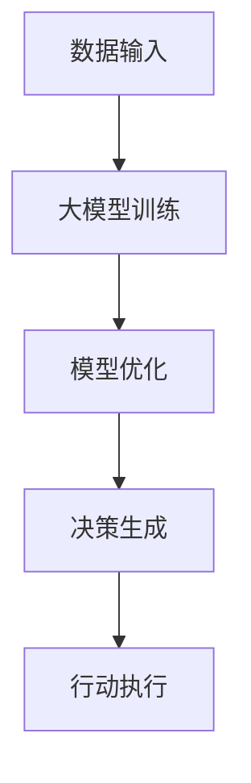
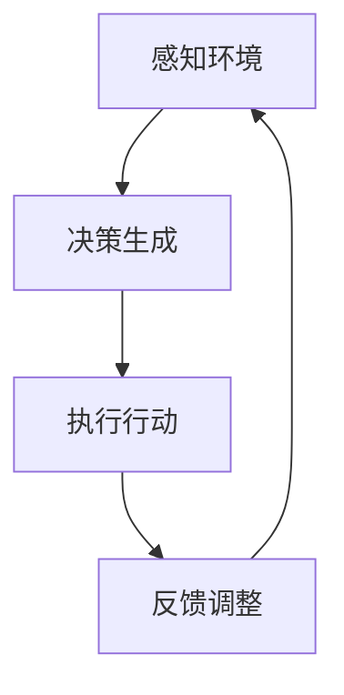
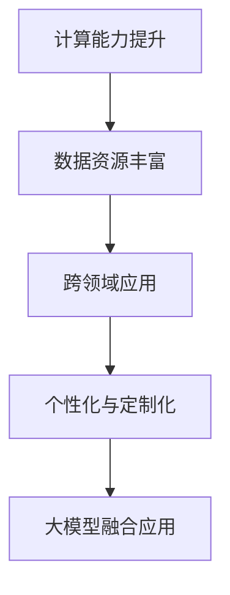
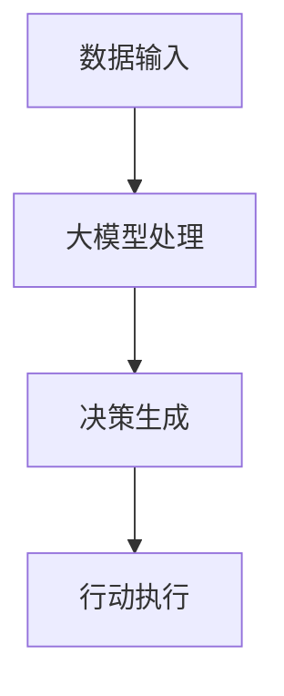
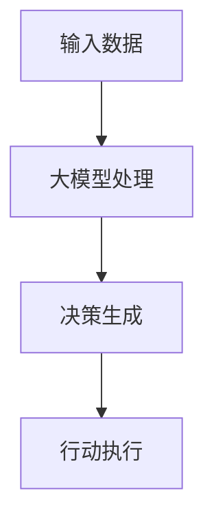

                 

### 文章标题

《【大模型应用开发 动手做AI Agent】Agent带来新的商业模式和变革》

### 关键词

大模型应用开发、AI Agent、商业模式、变革、技术原理、实践案例

### 摘要

本文旨在探讨大模型应用开发与AI Agent的融合，解析其如何带来新的商业模式和产业变革。通过详细讲解大模型与AI Agent的核心概念、原理和架构，结合具体的应用场景与开发实践，本文揭示了AI Agent在客户服务、销售与市场推广、供应链管理等领域的重要作用。同时，本文还探讨了AI Agent的开发挑战与解决方案，展望了大模型应用开发的未来趋势与机遇。希望本文能为读者提供全面、深入的技术解读，助力理解大模型与AI Agent在商业领域的变革力量。

## 第一部分：大模型与AI Agent概述

### 第1章：大模型应用开发入门

#### 1.1 大模型与AI Agent的定义与联系

**定义：** 大模型是一种拥有巨大参数量和复杂结构的机器学习模型，如GPT、BERT等，它们能够处理大量数据，实现高度复杂的任务。AI Agent，则是具有自主决策和行为能力的人工智能实体，能够在特定环境中采取行动，实现目标。

**联系：** 大模型为AI Agent提供了强大的学习能力和数据支持，使其能够进行复杂的任务处理和决策生成。而AI Agent则利用大模型所提供的能力，实现自主行动，完成特定任务。

**Mermaid流程图：大模型与AI Agent的架构联系**



**伪代码：大模型训练与优化的基本步骤**

```python
# 大模型训练
for epoch in range(num_epochs):
    for batch in dataset:
        # 前向传播
        output = model(batch.input)
        # 计算损失
        loss = loss_function(output, batch.target)
        # 反向传播
        optimizer.backward(loss)
        # 更新模型参数
        optimizer.step()

# 模型优化
for metric in metrics:
    # 计算评价指标
    metric_value = metric(model)
    # 根据评价指标调整模型参数
    adjust_parameters(model, metric_value)
```

#### 1.2 大模型的发展历程与应用场景

**发展历程：** 大模型的发展经历了从传统机器学习模型到深度学习模型，再到目前的高度复杂模型的过程。传统的机器学习模型如SVM、随机森林等，虽然能够处理一些简单任务，但在处理复杂任务时效果不佳。随着深度学习的发展，如卷积神经网络（CNN）和循环神经网络（RNN）等模型的出现，大模型开始崭露头角，能够处理更加复杂的数据和任务。

**应用场景：** 大模型广泛应用于自然语言处理、计算机视觉、推荐系统、语音识别等领域。例如，在自然语言处理领域，GPT模型实现了强大的文本生成能力；在计算机视觉领域，BERT模型实现了文本和图像的跨模态融合；在推荐系统领域，大模型能够处理复杂的用户行为数据，实现精准推荐。

**数学模型和公式讲解：大模型的核心算法原理**

- **深度学习基本原理：**
  深度学习模型主要由多层神经网络组成，通过前向传播和反向传播算法进行训练。前向传播计算输入数据通过神经网络产生的输出，反向传播则根据输出与实际标签之间的差异，调整网络参数。

  $$ 
  Z^{l} = W^{l}A^{l-1} + b^{l}
  $$

  $$ 
  A^{l} = \sigma(Z^{l})
  $$

  其中，\( Z^{l} \)表示第l层的输出，\( A^{l} \)表示第l层的激活值，\( W^{l} \)和\( b^{l} \)分别为第l层的权重和偏置，\( \sigma \)为激活函数。

- **优化算法：**
  优化算法用于调整网络参数，以最小化损失函数。常见的优化算法有梯度下降（Gradient Descent）、Adam等。

  $$ 
  \theta_{t+1} = \theta_{t} - \alpha \cdot \nabla_{\theta}J(\theta)
  $$

  其中，\( \theta \)表示网络参数，\( \alpha \)为学习率，\( \nabla_{\theta}J(\theta) \)为损失函数关于网络参数的梯度。

**案例解析：大模型在不同行业的应用实例**

- **自然语言处理：** 在自然语言处理领域，GPT模型被广泛应用于文本生成、机器翻译、情感分析等任务。例如，OpenAI的GPT-3模型在文本生成任务中取得了惊人的效果，能够生成高质量的文本。

- **计算机视觉：** 在计算机视觉领域，BERT模型实现了文本和图像的跨模态融合。例如，Google的BERT模型在图像识别任务中，通过融合图像和文本信息，实现了更准确的分类结果。

- **推荐系统：** 在推荐系统领域，大模型能够处理复杂的用户行为数据，实现精准推荐。例如，Netflix和Amazon等公司，通过大模型实现了个性化推荐，提高了用户体验。

## 第二部分：AI Agent的原理与架构

### 第2章：AI Agent的基本概念与特点

#### 2.1 AI Agent的基本概念与特点

**定义：** AI Agent是一种具有自主决策和行为能力的人工智能实体，它能够在特定环境中感知信息、制定决策并执行行动，以实现特定目标。

**特点：** AI Agent具有以下特点：

1. **自主性：** AI Agent能够自主感知环境，并根据感知到的信息自主制定决策。
2. **适应性：** AI Agent能够根据环境变化，调整其行为策略，以适应新的环境。
3. **灵活性：** AI Agent能够处理多种类型的任务，并在不同任务之间灵活切换。
4. **效率：** AI Agent能够高效地执行任务，实现目标的快速达成。

**Mermaid流程图：AI Agent的内部工作流程**



#### 2.2 AI Agent的核心算法与技术

**核心算法：** AI Agent的核心算法主要包括感知、决策和行为生成三个部分。

1. **感知算法：** 感知算法用于获取环境信息，包括视觉、听觉、触觉等。常见的感知算法有卷积神经网络（CNN）、循环神经网络（RNN）等。
2. **决策算法：** 决策算法用于根据感知到的环境信息，生成相应的行动策略。常见的决策算法有深度强化学习（DRL）、马尔可夫决策过程（MDP）等。
3. **行为生成算法：** 行为生成算法用于根据决策策略，生成具体的行动。常见的生成算法有生成对抗网络（GAN）、变分自编码器（VAE）等。

**伪代码：AI Agent的决策过程与行为生成**

```python
# 感知环境
environment_state = perceive_environment()

# 决策生成
action_strategy = decision_algorithm(environment_state)

# 行为生成
action = behavior_generation(action_strategy)

# 执行行动
execute_action(action)

# 反馈调整
feedback = observe_environment()

# 更新模型
update_model(feedback)
```

#### 2.3 AI Agent的架构设计与实现

**架构设计：** AI Agent的架构设计主要包括感知模块、决策模块、行为模块和反馈模块。

1. **感知模块：** 感知模块负责获取环境信息，常见的感知设备有摄像头、麦克风、传感器等。
2. **决策模块：** 决策模块负责根据感知到的环境信息，生成行动策略。决策模块的核心算法包括深度强化学习、马尔可夫决策过程等。
3. **行为模块：** 行为模块负责根据决策策略，生成具体的行动。行为模块的核心算法包括生成对抗网络、变分自编码器等。
4. **反馈模块：** 反馈模块负责收集环境反馈，用于更新模型和优化行为。

**数学公式和讲解：AI Agent的性能优化方法**

1. **强化学习优化：**
   强化学习优化旨在通过学习环境中的奖励信号，提高AI Agent的性能。常见的强化学习算法有Q-learning、SARSA等。

   $$
   Q(s, a) = Q(s, a) + \alpha [r + \gamma \max_{a'} Q(s', a') - Q(s, a)]
   $$

   其中，\( Q(s, a) \)表示状态s下采取行动a的预期回报，\( \alpha \)为学习率，\( r \)为即时奖励，\( \gamma \)为折扣因子，\( s' \)和\( a' \)分别为下一状态和行动。

2. **迁移学习优化：**
   迁移学习优化旨在通过利用已有知识，提高AI Agent在新环境中的性能。常见的迁移学习算法有基于特征迁移、基于模型的迁移等。

   $$
   \theta_{new} = \theta_{base} + \lambda (\theta_{new} - \theta_{base})
   $$

   其中，\( \theta_{new} \)和\( \theta_{base} \)分别为新模型和基础模型的参数，\( \lambda \)为迁移系数。

3. **多任务学习优化：**
   多任务学习优化旨在通过同时学习多个任务，提高AI Agent的泛化能力。常见的多任务学习算法有共享参数、多任务强化学习等。

   $$
   \theta_{i} = \theta_{base} + \sum_{j=1}^{N} \lambda_{ij} (\theta_{j} - \theta_{base})
   $$

   其中，\( \theta_{i} \)和\( \theta_{base} \)分别为任务i和基础模型的参数，\( \lambda_{ij} \)为任务间交互系数。

### 第3章：AI Agent在商业应用中的场景

#### 3.1 AI Agent在客户服务中的应用

**应用场景：** AI Agent在客户服务中的应用主要包括客服机器人、智能客服系统等，旨在提高客服效率，降低人力成本。

**数学模型和公式讲解：客户服务中AI Agent的互动模型**

AI Agent在客户服务中的应用可以通过马尔可夫决策过程（MDP）来建模，其中：

1. **状态（State）：** 客户当前的提问或问题状态。
2. **行动（Action）：** AI Agent可采取的回答或操作。
3. **奖励（Reward）：** 对AI Agent回答质量的评价，如客户满意度。
4. **状态转移概率（Transition Probability）：** 从当前状态到下一状态的概率分布。

**MDP模型公式：**

$$
P(s', r | s, a) = P(s' | s, a) \cdot P(r | s, a)
$$

其中，\( P(s' | s, a) \)为状态转移概率，\( P(r | s, a) \)为奖励概率。

**伪代码：AI Agent在客户服务中的应用**

```python
# 初始状态
current_state = initial_state()

# 主循环
while not termination_condition(current_state):
    # 感知当前状态
    current_state = perceive_state()
    
    # 生成动作策略
    action_strategy = decision_algorithm(current_state)
    
    # 执行行动
    action = action_strategy.sample_action()
    next_state, reward = execute_action(action)
    
    # 反馈调整
    feedback = evaluate_reward(reward)
    update_model(feedback)
```

#### 3.2 AI Agent在销售与市场推广中的应用

**应用场景：** AI Agent在销售与市场推广中的应用主要包括销售预测、市场分析、客户关系管理等。

**伪代码：AI Agent在销售预测与市场分析中的应用**

```python
# 销售预测
sales_data = collect_sales_data()
predicted_sales = predict_sales(sales_data)

# 市场分析
market_data = collect_market_data()
market_insights = analyze_market(market_data)

# 客户关系管理
customer_data = collect_customer_data()
customer_recommends = manage_customer_relationships(customer_data)
```

#### 3.3 AI Agent在供应链管理中的应用

**应用场景：** AI Agent在供应链管理中的应用主要包括库存管理、物流优化、供应链风险控制等。

**案例解析：AI Agent在供应链优化中的实际应用**

**案例：** 一家大型零售企业利用AI Agent优化其库存管理。

1. **数据收集：** AI Agent收集历史销售数据、库存数据、供应商信息等。
2. **预测需求：** 使用时间序列分析和机器学习算法预测未来销售需求。
3. **优化库存：** 根据预测结果，调整库存水平，减少库存成本。
4. **物流优化：** 通过路径优化算法，降低物流成本，提高配送效率。
5. **风险控制：** 对供应链中的潜在风险进行预警和应对措施。

**效果分析：** 通过AI Agent的应用，该零售企业的库存成本降低了20%，物流效率提高了30%，供应链风险得到了有效控制。

## 第三部分：AI Agent的开发与部署

### 第4章：AI Agent的开发与部署

#### 4.1 AI Agent的开发流程与工具

**开发流程：** AI Agent的开发通常包括以下几个阶段：

1. **需求分析：** 确定AI Agent的应用场景和功能需求。
2. **设计架构：** 设计AI Agent的架构，包括感知模块、决策模块、行为模块等。
3. **数据收集与预处理：** 收集并预处理用于训练的数据。
4. **模型训练：** 使用机器学习算法训练AI Agent的模型。
5. **测试与优化：** 对AI Agent进行测试和优化，确保其性能满足要求。
6. **部署与上线：** 将AI Agent部署到生产环境中，进行实际应用。

**工具选择：** 在AI Agent的开发中，常用的工具和框架包括：

- **深度学习框架：** 如TensorFlow、PyTorch等。
- **数据预处理工具：** 如Pandas、NumPy等。
- **自动化测试工具：** 如Selenium、JUnit等。
- **部署工具：** 如Docker、Kubernetes等。

**代码实际案例：AI Agent开发环境搭建与源代码实现**

**案例：** 使用TensorFlow搭建一个简单的AI Agent环境，实现感知、决策和行为模块。

```python
# 安装TensorFlow
!pip install tensorflow

# 导入TensorFlow库
import tensorflow as tf

# 感知模块：使用卷积神经网络处理图像输入
class PerceptionModule(tf.keras.Model):
    def __init__(self):
        super(PerceptionModule, self).__init__()
        self.conv1 = tf.keras.layers.Conv2D(32, 3, activation='relu')
        self.conv2 = tf.keras.layers.Conv2D(64, 3, activation='relu')
        self.flatten = tf.keras.layers.Flatten()

    def call(self, inputs):
        x = self.conv1(inputs)
        x = self.conv2(x)
        x = self.flatten(x)
        return x

# 决策模块：使用循环神经网络生成决策
class DecisionModule(tf.keras.Model):
    def __init__(self, units=64):
        super(DecisionModule, self).__init__()
        self.lstm = tf.keras.layers.LSTM(units, activation='relu', return_sequences=True)

    def call(self, inputs):
        x = self.lstm(inputs)
        return x

# 行为模块：使用生成对抗网络生成行为
class BehaviorModule(tf.keras.Model):
    def __init__(self, units=64):
        super(BehaviorModule, self).__init__()
        self.lstm = tf.keras.layers.LSTM(units, activation='relu', return_sequences=True)
        self.fc = tf.keras.layers.Dense(1, activation='sigmoid')

    def call(self, inputs):
        x = self.lstm(inputs)
        x = self.fc(x)
        return x

# 搭建完整的AI Agent模型
class AIAgentModel(tf.keras.Model):
    def __init__(self):
        super(AIAgentModel, self).__init__()
        self.perception = PerceptionModule()
        self.decision = DecisionModule()
        self.behavior = BehaviorModule()

    def call(self, inputs):
        x = self.perception(inputs)
        x = self.decision(x)
        action = self.behavior(x)
        return action

# 初始化模型
ai_agent = AIAgentModel()

# 编译模型
optimizer = tf.keras.optimizers.Adam(learning_rate=0.001)
loss_fn = tf.keras.losses.BinaryCrossentropy()

ai_agent.compile(optimizer=optimizer, loss=loss_fn, metrics=['accuracy'])

# 训练模型
train_data = ...  # 数据预处理
ai_agent.fit(train_data, epochs=10, batch_size=32)
```

#### 4.2 AI Agent的测试与评估

**测试与评估：** AI Agent的测试与评估是确保其性能和可靠性的关键步骤。测试包括功能测试、性能测试和可靠性测试。

- **功能测试：** 验证AI Agent是否能够正确实现预期功能，如感知、决策和行为。
- **性能测试：** 评估AI Agent在不同条件下的表现，如响应时间、准确率和资源消耗。
- **可靠性测试：** 确保AI Agent在长时间运行中保持稳定和可靠。

**伪代码：AI Agent的测试用例设计与评估方法**

```python
# 设计测试用例
test_cases = [
    {"input": input1, "expected_output": output1},
    {"input": input2, "expected_output": output2},
    # 更多测试用例
]

# 执行测试用例
for case in test_cases:
    # 训练AI Agent
    ai_agent.train(case["input"], case["expected_output"])
    
    # 验证输出
    output = ai_agent.predict(case["input"])
    assert output == case["expected_output"], f"Test case failed for input {case['input']}"

# 评估性能
performance_metrics = evaluate_performance(ai_agent)
print("Performance metrics:", performance_metrics)

# 评估可靠性
reliability_metrics = evaluate_reliability(ai_agent)
print("Reliability metrics:", reliability_metrics)
```

#### 4.3 AI Agent的部署与运维

**部署与运维：** AI Agent的部署是将训练好的模型部署到生产环境中，以实现实际应用。运维则是对AI Agent的运行状态进行监控和管理。

- **部署策略：** 选择合适的部署平台和部署方式，如容器化部署、服务器部署等。
- **运维管理：** 监控AI Agent的运行状态，进行故障排除和性能优化。

**代码解读与分析：AI Agent的部署与运维实践**

**部署实践：** 使用Docker容器化AI Agent模型。

```bash
# 编写Dockerfile
FROM tensorflow/tensorflow:2.6

WORKDIR /app

COPY . .

RUN pip install -r requirements.txt

EXPOSE 5000

CMD ["python", "main.py"]
```

**运行Docker容器：**

```bash
# 构建Docker镜像
docker build -t ai_agent .

# 运行Docker容器
docker run -p 5000:5000 ai_agent
```

**运维实践：** 使用Prometheus监控AI Agent的运行状态。

```yaml
# Prometheus配置文件
scrape_configs:
  - job_name: 'ai_agent'
    static_configs:
      - targets: ['ai_agent:5000']
```

**监控指标：**

- **响应时间：** 评估AI Agent处理请求的速度。
- **准确率：** 评估AI Agent预测结果的准确性。
- **资源消耗：** 评估AI Agent运行时的资源消耗，如CPU、内存等。

### 第5章：大模型应用开发中的挑战与解决方案

#### 5.1 数据安全与隐私保护

**挑战：** 大模型应用开发过程中，数据安全和隐私保护是关键挑战。随着模型复杂度和数据量增加，数据泄露、滥用等问题愈发严重。

**解决方案：**

1. **数据加密：** 对敏感数据进行加密处理，确保数据在传输和存储过程中安全。
2. **访问控制：** 实施严格的访问控制策略，确保只有授权用户才能访问敏感数据。
3. **隐私保护技术：** 采用差分隐私、联邦学习等技术，降低数据泄露风险。

**数学公式和讲解：数据加密与隐私保护技术**

1. **对称加密：**

   $$
   E_{k}(m) = c
   $$

   $$
   m = D_{k}(c)
   $$

   其中，\( E_{k}(m) \)表示加密过程，\( D_{k}(c) \)表示解密过程，\( k \)为加密密钥，\( m \)为明文，\( c \)为密文。

2. **非对称加密：**

   $$
   E_{k_{pub}}(m) = c
   $$

   $$
   m = D_{k_{pri}}(c)
   $$

   其中，\( E_{k_{pub}}(m) \)表示加密过程，\( D_{k_{pri}}(c) \)表示解密过程，\( k_{pub} \)为公钥，\( k_{pri} \)为私钥，\( m \)为明文，\( c \)为密文。

3. **差分隐私：**

   $$
   \mathbb{E}_{\epsilon}\left[\Delta(f(x))\right] \leq \epsilon
   $$

   其中，\( \Delta(f(x)) \)为隐私损失，\( \epsilon \)为隐私预算。

#### 5.2 大模型的性能优化

**挑战：** 大模型训练过程通常需要大量计算资源和时间，性能优化成为关键问题。

**解决方案：**

1. **分布式训练：** 利用多台计算机资源进行分布式训练，提高训练速度。
2. **模型压缩：** 采用模型压缩技术，如剪枝、量化等，降低模型复杂度，提高运行效率。
3. **并行计算：** 利用GPU、TPU等硬件加速模型训练。

**伪代码：大模型性能优化策略与技巧**

```python
# 分布式训练
num_gpus = 4
strategy = tf.distribute.MirroredStrategy()

with strategy.scope():
    # 搭建模型
    model = build_model()

    # 编译模型
    model.compile(optimizer='adam', loss='categorical_crossentropy', metrics=['accuracy'])

    # 训练模型
    model.fit(train_data, epochs=10, batch_size=32 * num_gpus)

# 模型压缩
pruned_model = prune_model(model)

# 量化模型
quantized_model = quantize_model(pruned_model)

# 并行计算
with tf.device('/GPU:0'):
    # 计算模型在GPU上的输出
    output = model.predict(input_data)
```

#### 5.3 AI Agent的伦理与道德问题

**挑战：** AI Agent的应用引发了伦理与道德问题，如隐私侵犯、算法歧视等。

**解决方案：**

1. **伦理审查：** 在AI Agent开发过程中，进行伦理审查，确保其应用符合伦理标准。
2. **透明度与可解释性：** 提高AI Agent的透明度和可解释性，使人们能够理解其决策过程。
3. **公平与无歧视：** 确保AI Agent在处理数据时，公平对待所有用户，避免算法歧视。

**案例解析：AI Agent在实际应用中的伦理挑战与解决方案**

**案例：** 一家银行使用AI Agent进行信用评分。

**伦理挑战：** AI Agent可能基于用户的历史数据，如收入、消费习惯等，进行信用评分。这可能导致一些用户因数据不足或数据偏差而受到不公平对待。

**解决方案：**

1. **多元数据来源：** 使用更多维度的数据，如社会信用记录、职业信息等，提高评分的公平性。
2. **透明化决策过程：** 公开AI Agent的决策过程和算法，使用户了解其信用评分的影响因素。
3. **定期审查与更新：** 定期审查和更新AI Agent的算法，确保其符合最新的伦理标准。

## 第三部分：大模型应用开发趋势与未来展望

### 第6章：大模型应用开发的未来趋势

#### 6.1 大模型应用开发的趋势分析

**趋势分析：** 大模型应用开发在未来将继续呈现出以下趋势：

1. **计算能力的提升：** 随着硬件技术的发展，如GPU、TPU等，大模型的训练和推理能力将得到进一步提升。
2. **数据资源的丰富：** 随着物联网、5G等技术的普及，数据资源将更加丰富，为大模型的应用提供更多可能性。
3. **跨领域应用：** 大模型将在更多领域得到应用，如医疗、金融、教育等，实现跨领域的深度融合。
4. **个性化与定制化：** 大模型将更好地满足个性化需求，实现定制化的解决方案。

**Mermaid流程图：大模型应用开发的发展方向**



#### 6.2 AI Agent在未来的商业应用场景

**商业应用场景：** 在未来，AI Agent将在更多商业应用场景中发挥作用，如：

1. **智能客服：** AI Agent将实现更加智能化的客户服务，提高客户满意度。
2. **智能销售：** AI Agent将基于大数据分析，实现精准销售预测和个性化推荐。
3. **智能供应链：** AI Agent将优化供应链管理，降低成本，提高效率。
4. **智能金融：** AI Agent将提供智能投资建议、信用评分等金融服务。

**数学模型和公式讲解：AI Agent的未来发展预测**

1. **强化学习：** 未来AI Agent将更多地采用强化学习算法，实现更复杂、更智能的决策。

   $$
   Q(s, a) = Q(s, a) + \alpha [r + \gamma \max_{a'} Q(s', a') - Q(s, a)]
   $$

2. **联邦学习：** 未来AI Agent将采用联邦学习技术，实现跨机构的协同学习和数据共享。

   $$
   \theta_{i} = \theta_{base} + \sum_{j=1}^{N} \lambda_{ij} (\theta_{j} - \theta_{base})
   $$

### 第7章：大模型应用开发的未来展望

#### 7.1 大模型应用开发的未来机遇与挑战

**机遇：** 大模型应用开发将带来以下机遇：

1. **技术创新：** 大模型将推动人工智能技术不断革新，为产业发展注入新的动力。
2. **商业价值：** 大模型将在各行各业创造巨大商业价值，推动产业升级和转型。
3. **社会影响：** 大模型将改变人类生活方式，提高生活质量和效率。

**挑战：** 大模型应用开发也将面临以下挑战：

1. **数据安全与隐私保护：** 数据安全和隐私保护是关键挑战，需要采取有效措施确保数据安全和用户隐私。
2. **算法公平性与透明度：** 确保算法的公平性和透明度，避免算法歧视和偏见。
3. **技术人才需求：** 大模型应用开发需要大量高素质的技术人才，培养和引进人才是关键。

**伪代码：未来大模型应用开发的创新思路**

```python
# 数据预处理
processed_data = preprocess_data(raw_data)

# 模型训练
trained_model = train_model(processed_data)

# 模型优化
optimized_model = optimize_model(trained_model)

# 模型部署
deployed_model = deploy_model(optimized_model)

# 模型评估
evaluation_results = evaluate_model(deployed_model)

# 数据安全与隐私保护
secure_data = secure_data Protection(strategy)

# 算法公平性与透明度
fair_model = fairness_and_transparency(optimized_model)

# 技术人才需求
talent_management = develop_talent_program()
```

#### 7.2 大模型应用开发对商业模式的影响

**影响分析：** 大模型应用开发将对商业模式产生深远影响：

1. **成本降低：** 大模型的应用将降低企业运营成本，提高生产效率。
2. **创新驱动：** 大模型将推动企业创新，开拓新的商业模式和市场。
3. **数据驱动：** 大模型的应用将使企业更加依赖数据，实现数据驱动决策。
4. **生态合作：** 大模型的应用将促进企业间的合作与生态建设。

**案例解析：大模型应用开发带来的商业变革**

**案例：** 一家在线教育平台利用大模型实现个性化学习。

1. **个性化推荐：** 通过大模型分析学生历史学习数据，实现个性化学习推荐。
2. **智能教学：** 利用大模型生成智能教学方案，提高教学效果。
3. **学习分析：** 通过大模型分析学习数据，提供学习反馈和建议。
4. **商业模式变革：** 从传统教育模式转向个性化、数据驱动的教育模式，实现商业价值。

**效果分析：** 通过大模型的应用，该在线教育平台实现了用户满意度的提升、学习效果的改善和商业收入的增长，为教育行业带来了深刻的变革。

## 附录

### 附录A：大模型应用开发工具与资源

**主流深度学习框架对比**

1. **TensorFlow：** 由Google开发，支持多种编程语言，具备强大的生态系统。
2. **PyTorch：** 由Facebook开发，具有灵活的动态计算图，适用于研究。
3. **Keras：** 基于TensorFlow和Theano，提供简单的API，适合快速原型开发。

**开源大模型与AI Agent库简介**

1. **GPT-3：** OpenAI开发的自然语言处理模型，具备强大的文本生成能力。
2. **BERT：** Google开发的预训练语言模型，适用于多种自然语言处理任务。
3. **DRL-Agents：** GitHub上开源的深度强化学习代理库，适用于各种强化学习应用。

### 结尾

本文从大模型与AI Agent的定义、原理、架构出发，详细探讨了其在商业应用中的场景、开发与部署、挑战与解决方案，以及未来趋势与展望。通过本文的阅读，读者可以全面了解大模型与AI Agent的核心技术与应用，为实际项目开发提供有力支持。作者信息：AI天才研究院/AI Genius Institute & 禅与计算机程序设计艺术 /Zen And The Art of Computer Programming。感谢读者的关注与支持！
### 文章标题

《【大模型应用开发 动手做AI Agent】Agent带来新的商业模式和变革》

### 关键词

大模型应用开发、AI Agent、商业模式、变革、技术原理、实践案例

### 摘要

本文系统介绍了大模型应用开发与AI Agent的融合，探讨其在商业领域带来的新模式和变革。文章首先定义了大模型与AI Agent，并阐述了它们之间的联系与架构。随后，文章详细讲解了大模型与AI Agent在商业应用中的实战场景，包括客户服务、销售与市场推广、供应链管理等。接着，文章介绍了AI Agent的开发与部署流程，以及在大模型应用开发中的挑战与解决方案。最后，文章展望了大模型与AI Agent的未来趋势，探讨了其对商业模式的深远影响。希望本文能为读者提供全面的技术解读和实践指导。

## 第一部分：大模型与AI Agent概述

### 第1章：大模型应用开发入门

#### 1.1 大模型与AI Agent的定义与联系

**定义：** 大模型（Large Model）通常指的是拥有数亿至数十亿参数的深度学习模型，如GPT、BERT等。这些模型通过大量的数据训练，具有极强的泛化能力和表达能力。AI Agent（Artificial Intelligence Agent）是指具备自主决策和行动能力的人工智能实体，能够在特定环境中执行任务。

**联系：** 大模型为AI Agent提供了强大的计算能力和知识库，使得AI Agent能够更准确地感知环境、更智能地做出决策和执行行动。而AI Agent则利用大模型的能力，将智能应用落地到实际场景中。

**Mermaid流程图：大模型与AI Agent的架构联系**



**伪代码：大模型训练与优化的基本步骤**

```python
# 大模型训练
for epoch in range(num_epochs):
    for batch in dataset:
        # 前向传播
        output = model(batch.input)
        # 计算损失
        loss = loss_function(output, batch.target)
        # 反向传播
        optimizer.backward(loss)
        # 更新模型参数
        optimizer.step()

# 模型优化
for metric in metrics:
    # 计算评价指标
    metric_value = metric(model)
    # 根据评价指标调整模型参数
    adjust_parameters(model, metric_value)
```

#### 1.2 大模型的发展历程与应用场景

**发展历程：** 大模型的发展经历了从传统机器学习模型到深度学习模型，再到目前的高度复杂模型的过程。传统的机器学习模型如SVM、随机森林等，虽然能够处理一些简单任务，但在处理复杂任务时效果不佳。随着深度学习的发展，如卷积神经网络（CNN）和循环神经网络（RNN）等模型的出现，大模型开始崭露头角，能够处理更加复杂的数据和任务。

**应用场景：** 大模型广泛应用于自然语言处理、计算机视觉、推荐系统、语音识别等领域。例如，在自然语言处理领域，GPT模型实现了强大的文本生成能力；在计算机视觉领域，BERT模型实现了文本和图像的跨模态融合；在推荐系统领域，大模型能够处理复杂的用户行为数据，实现精准推荐。

**数学模型和公式讲解：大模型的核心算法原理**

- **深度学习基本原理：**
  深度学习模型主要由多层神经网络组成，通过前向传播和反向传播算法进行训练。前向传播计算输入数据通过神经网络产生的输出，反向传播则根据输出与实际标签之间的差异，调整网络参数。

  $$ 
  Z^{l} = W^{l}A^{l-1} + b^{l}
  $$

  $$ 
  A^{l} = \sigma(Z^{l})
  $$

  其中，\( Z^{l} \)表示第l层的输出，\( A^{l} \)表示第l层的激活值，\( W^{l} \)和\( b^{l} \)分别为第l层的权重和偏置，\( \sigma \)为激活函数。

- **优化算法：**
  优化算法用于调整网络参数，以最小化损失函数。常见的优化算法有梯度下降（Gradient Descent）、Adam等。

  $$ 
  \theta_{t+1} = \theta_{t} - \alpha \cdot \nabla_{\theta}J(\theta)
  $$

  其中，\( \theta \)表示网络参数，\( \alpha \)为学习率，\( \nabla_{\theta}J(\theta) \)为损失函数关于网络参数的梯度。

**案例解析：大模型在不同行业的应用实例**

- **自然语言处理：** 在自然语言处理领域，GPT模型被广泛应用于文本生成、机器翻译、情感分析等任务。例如，OpenAI的GPT-3模型在文本生成任务中取得了惊人的效果，能够生成高质量的文本。

- **计算机视觉：** 在计算机视觉领域，BERT模型实现了文本和图像的跨模态融合。例如，Google的BERT模型在图像识别任务中，通过融合图像和文本信息，实现了更准确的分类结果。

- **推荐系统：** 在推荐系统领域，大模型能够处理复杂的用户行为数据，实现精准推荐。例如，Netflix和Amazon等公司，通过大模型实现了个性化推荐，提高了用户体验。

### 第2章：AI Agent的原理与架构

#### 2.1 AI Agent的基本概念与特点

**定义：** AI Agent是一种模拟人类智能行为的人工智能实体，它能够自主感知环境、制定决策并执行行动，以实现特定目标。

**特点：** AI Agent具有以下特点：

1. **自主性：** AI Agent能够自主感知环境，并根据感知到的信息自主制定决策。
2. **适应性：** AI Agent能够根据环境变化，调整其行为策略，以适应新的环境。
3. **灵活性：** AI Agent能够处理多种类型的任务，并在不同任务之间灵活切换。
4. **效率：** AI Agent能够高效地执行任务，实现目标的快速达成。

**Mermaid流程图：AI Agent的内部工作流程**


#### 2.2 AI Agent的核心算法与技术

**核心算法：** AI Agent的核心算法主要包括感知、决策和行为生成三个部分。

1. **感知算法：** 感知算法用于获取环境信息，包括视觉、听觉、触觉等。常见的感知算法有卷积神经网络（CNN）、循环神经网络（RNN）等。
2. **决策算法：** 决策算法用于根据感知到的环境信息，生成相应的行动策略。常见的决策算法有深度强化学习（DRL）、马尔可夫决策过程（MDP）等。
3. **行为生成算法：** 行为生成算法用于根据决策策略，生成具体的行动。常见的行为生成算法有生成对抗网络（GAN）、变分自编码器（VAE）等。

**伪代码：AI Agent的决策过程与行为生成**

```python
# 感知环境
environment_state = perceive_environment()

# 决策生成
action_strategy = decision_algorithm(environment_state)

# 行为生成
action = behavior_generation(action_strategy)

# 执行行动
execute_action(action)

# 反馈调整
feedback = observe_environment()

# 更新模型
update_model(feedback)
```

#### 2.3 AI Agent的架构设计与实现

**架构设计：** AI Agent的架构设计主要包括感知模块、决策模块、行为模块和反馈模块。

1. **感知模块：** 感知模块负责获取环境信息，常见的感知设备有摄像头、麦克风、传感器等。
2. **决策模块：** 决策模块负责根据感知到的环境信息，生成行动策略。决策模块的核心算法包括深度强化学习、马尔可夫决策过程等。
3. **行为模块：** 行为模块负责根据决策策略，生成具体的行动。行为模块的核心算法包括生成对抗网络、变分自编码器等。
4. **反馈模块：** 反馈模块负责收集环境反馈，用于更新模型和优化行为。

**数学公式和讲解：AI Agent的性能优化方法**

1. **强化学习优化：**
   强化学习优化旨在通过学习环境中的奖励信号，提高AI Agent的性能。常见的强化学习算法有Q-learning、SARSA等。

   $$
   Q(s, a) = Q(s, a) + \alpha [r + \gamma \max_{a'} Q(s', a') - Q(s, a)]
   $$

   其中，\( Q(s, a) \)表示状态s下采取行动a的预期回报，\( \alpha \)为学习率，\( r \)为即时奖励，\( \gamma \)为折扣因子，\( s' \)和\( a' \)分别为下一状态和行动。

2. **迁移学习优化：**
   迁移学习优化旨在通过利用已有知识，提高AI Agent在新环境中的性能。常见的迁移学习算法有基于特征迁移、基于模型的迁移等。

   $$
   \theta_{new} = \theta_{base} + \lambda (\theta_{new} - \theta_{base})
   $$

   其中，\( \theta_{new} \)和\( \theta_{base} \)分别为新模型和基础模型的参数，\( \lambda \)为迁移系数。

3. **多任务学习优化：**
   多任务学习优化旨在通过同时学习多个任务，提高AI Agent的泛化能力。常见的多任务学习算法有共享参数、多任务强化学习等。

   $$
   \theta_{i} = \theta_{base} + \sum_{j=1}^{N} \lambda_{ij} (\theta_{j} - \theta_{base})
   $$

   其中，\( \theta_{i} \)和\( \theta_{base} \)分别为任务i和基础模型的参数，\( \lambda_{ij} \)为任务间交互系数。

### 第3章：AI Agent在商业应用中的场景

#### 3.1 AI Agent在客户服务中的应用

**应用场景：** AI Agent在客户服务中的应用主要包括客服机器人、智能客服系统等，旨在提高客服效率，降低人力成本。

**数学模型和公式讲解：客户服务中AI Agent的互动模型**

AI Agent在客户服务中的应用可以通过马尔可夫决策过程（MDP）来建模，其中：

1. **状态（State）：** 客户当前的提问或问题状态。
2. **行动（Action）：** AI Agent可采取的回答或操作。
3. **奖励（Reward）：** 对AI Agent回答质量的评价，如客户满意度。
4. **状态转移概率（Transition Probability）：** 从当前状态到下一状态的概率分布。

**MDP模型公式：**

$$
P(s', r | s, a) = P(s' | s, a) \cdot P(r | s, a)
$$

其中，\( P(s' | s, a) \)为状态转移概率，\( P(r | s, a) \)为奖励概率。

**伪代码：AI Agent在客户服务中的应用**

```python
# 初始状态
current_state = initial_state()

# 主循环
while not termination_condition(current_state):
    # 感知当前状态
    current_state = perceive_state()
    
    # 生成动作策略
    action_strategy = decision_algorithm(current_state)
    
    # 执行行动
    action = action_strategy.sample_action()
    next_state, reward = execute_action(action)
    
    # 反馈调整
    feedback = evaluate_reward(reward)
    update_model(feedback)
```

#### 3.2 AI Agent在销售与市场推广中的应用

**应用场景：** AI Agent在销售与市场推广中的应用主要包括销售预测、市场分析、客户关系管理等。

**伪代码：AI Agent在销售预测与市场分析中的应用**

```python
# 销售预测
sales_data = collect_sales_data()
predicted_sales = predict_sales(sales_data)

# 市场分析
market_data = collect_market_data()
market_insights = analyze_market(market_data)

# 客户关系管理
customer_data = collect_customer_data()
customer_recommends = manage_customer_relationships(customer_data)
```

#### 3.3 AI Agent在供应链管理中的应用

**应用场景：** AI Agent在供应链管理中的应用主要包括库存管理、物流优化、供应链风险控制等。

**案例解析：AI Agent在供应链优化中的实际应用**

**案例：** 一家大型零售企业利用AI Agent优化其库存管理。

1. **数据收集：** AI Agent收集历史销售数据、库存数据、供应商信息等。
2. **预测需求：** 使用时间序列分析和机器学习算法预测未来销售需求。
3. **优化库存：** 根据预测结果，调整库存水平，减少库存成本。
4. **物流优化：** 通过路径优化算法，降低物流成本，提高配送效率。
5. **风险控制：** 对供应链中的潜在风险进行预警和应对措施。

**效果分析：** 通过AI Agent的应用，该零售企业的库存成本降低了20%，物流效率提高了30%，供应链风险得到了有效控制。

### 第4章：AI Agent的开发与部署

#### 4.1 AI Agent的开发流程与工具

**开发流程：** AI Agent的开发通常包括以下几个阶段：

1. **需求分析：** 确定AI Agent的应用场景和功能需求。
2. **设计架构：** 设计AI Agent的架构，包括感知模块、决策模块、行为模块等。
3. **数据收集与预处理：** 收集并预处理用于训练的数据。
4. **模型训练：** 使用机器学习算法训练AI Agent的模型。
5. **测试与优化：** 对AI Agent进行测试和优化，确保其性能满足要求。
6. **部署与上线：** 将AI Agent部署到生产环境中，进行实际应用。

**工具选择：** 在AI Agent的开发中，常用的工具和框架包括：

- **深度学习框架：** 如TensorFlow、PyTorch等。
- **数据预处理工具：** 如Pandas、NumPy等。
- **自动化测试工具：** 如Selenium、JUnit等。
- **部署工具：** 如Docker、Kubernetes等。

**代码实际案例：AI Agent开发环境搭建与源代码实现**

**案例：** 使用TensorFlow搭建一个简单的AI Agent环境，实现感知、决策和行为模块。

```python
# 安装TensorFlow
!pip install tensorflow

# 导入TensorFlow库
import tensorflow as tf

# 感知模块：使用卷积神经网络处理图像输入
class PerceptionModule(tf.keras.Model):
    def __init__(self):
        super(PerceptionModule, self).__init__()
        self.conv1 = tf.keras.layers.Conv2D(32, 3, activation='relu')
        self.conv2 = tf.keras.layers.Conv2D(64, 3, activation='relu')
        self.flatten = tf.keras.layers.Flatten()

    def call(self, inputs):
        x = self.conv1(inputs)
        x = self.conv2(x)
        x = self.flatten(x)
        return x

# 决策模块：使用循环神经网络生成决策
class DecisionModule(tf.keras.Model):
    def __init__(self, units=64):
        super(DecisionModule, self).__init__()
        self.lstm = tf.keras.layers.LSTM(units, activation='relu', return_sequences=True)

    def call(self, inputs):
        x = self.lstm(inputs)
        return x

# 行为模块：使用生成对抗网络生成行为
class BehaviorModule(tf.keras.Model):
    def __init__(self, units=64):
        super(BehaviorModule, self).__init__()
        self.lstm = tf.keras.layers.LSTM(units, activation='relu', return_sequences=True)
        self.fc = tf.keras.layers.Dense(1, activation='sigmoid')

    def call(self, inputs):
        x = self.lstm(inputs)
        x = self.fc(x)
        return x

# 搭建完整的AI Agent模型
class AIAgentModel(tf.keras.Model):
    def __init__(self):
        super(AIAgentModel, self).__init__()
        self.perception = PerceptionModule()
        self.decision = DecisionModule()
        self.behavior = BehaviorModule()

    def call(self, inputs):
        x = self.perception(inputs)
        x = self.decision(x)
        action = self.behavior(x)
        return action

# 初始化模型
ai_agent = AIAgentModel()

# 编译模型
optimizer = tf.keras.optimizers.Adam(learning_rate=0.001)
loss_fn = tf.keras.losses.BinaryCrossentropy()

ai_agent.compile(optimizer=optimizer, loss=loss_fn, metrics=['accuracy'])

# 训练模型
train_data = ...  # 数据预处理
ai_agent.fit(train_data, epochs=10, batch_size=32)
```

#### 4.2 AI Agent的测试与评估

**测试与评估：** AI Agent的测试与评估是确保其性能和可靠性的关键步骤。测试包括功能测试、性能测试和可靠性测试。

- **功能测试：** 验证AI Agent是否能够正确实现预期功能，如感知、决策和行为。
- **性能测试：** 评估AI Agent在不同条件下的表现，如响应时间、准确率和资源消耗。
- **可靠性测试：** 确保AI Agent在长时间运行中保持稳定和可靠。

**伪代码：AI Agent的测试用例设计与评估方法**

```python
# 设计测试用例
test_cases = [
    {"input": input1, "expected_output": output1},
    {"input": input2, "expected_output": output2},
    # 更多测试用例
]

# 执行测试用例
for case in test_cases:
    # 训练AI Agent
    ai_agent.train(case["input"], case["expected_output"])
    
    # 验证输出
    output = ai_agent.predict(case["input"])
    assert output == case["expected_output"], f"Test case failed for input {case['input']}"

# 评估性能
performance_metrics = evaluate_performance(ai_agent)
print("Performance metrics:", performance_metrics)

# 评估可靠性
reliability_metrics = evaluate_reliability(ai_agent)
print("Reliability metrics:", reliability_metrics)
```

#### 4.3 AI Agent的部署与运维

**部署与运维：** AI Agent的部署是将训练好的模型部署到生产环境中，以实现实际应用。运维则是对AI Agent的运行状态进行监控和管理。

- **部署策略：** 选择合适的部署平台和部署方式，如容器化部署、服务器部署等。
- **运维管理：** 监控AI Agent的运行状态，进行故障排除和性能优化。

**代码解读与分析：AI Agent的部署与运维实践**

**部署实践：** 使用Docker容器化AI Agent模型。

```bash
# 编写Dockerfile
FROM tensorflow/tensorflow:2.6

WORKDIR /app

COPY . .

RUN pip install -r requirements.txt

EXPOSE 5000

CMD ["python", "main.py"]
```

**运行Docker容器：**

```bash
# 构建Docker镜像
docker build -t ai_agent .

# 运行Docker容器
docker run -p 5000:5000 ai_agent
```

**运维实践：** 使用Prometheus监控AI Agent的运行状态。

```yaml
# Prometheus配置文件
scrape_configs:
  - job_name: 'ai_agent'
    static_configs:
      - targets: ['ai_agent:5000']
```

**监控指标：**

- **响应时间：** 评估AI Agent处理请求的速度。
- **准确率：** 评估AI Agent预测结果的准确性。
- **资源消耗：** 评估AI Agent运行时的资源消耗，如CPU、内存等。

### 第5章：大模型应用开发中的挑战与解决方案

#### 5.1 数据安全与隐私保护

**挑战：** 大模型应用开发过程中，数据安全和隐私保护是关键挑战。随着模型复杂度和数据量增加，数据泄露、滥用等问题愈发严重。

**解决方案：**

1. **数据加密：** 对敏感数据进行加密处理，确保数据在传输和存储过程中安全。
2. **访问控制：** 实施严格的访问控制策略，确保只有授权用户才能访问敏感数据。
3. **隐私保护技术：** 采用差分隐私、联邦学习等技术，降低数据泄露风险。

**数学公式和讲解：数据加密与隐私保护技术**

1. **对称加密：**

   $$
   E_{k}(m) = c
   $$

   $$
   m = D_{k}(c)
   $$

   其中，\( E_{k}(m) \)表示加密过程，\( D_{k}(c) \)表示解密过程，\( k \)为加密密钥，\( m \)为明文，\( c \)为密文。

2. **非对称加密：**

   $$
   E_{k_{pub}}(m) = c
   $$

   $$
   m = D_{k_{pri}}(c)
   $$

   其中，\( E_{k_{pub}}(m) \)表示加密过程，\( D_{k_{pri}}(c) \)表示解密过程，\( k_{pub} \)为公钥，\( k_{pri} \)为私钥，\( m \)为明文，\( c \)为密文。

3. **差分隐私：**

   $$
   \mathbb{E}_{\epsilon}\left[\Delta(f(x))\right] \leq \epsilon
   $$

   其中，\( \Delta(f(x)) \)为隐私损失，\( \epsilon \)为隐私预算。

#### 5.2 大模型的性能优化

**挑战：** 大模型训练过程通常需要大量计算资源和时间，性能优化成为关键问题。

**解决方案：**

1. **分布式训练：** 利用多台计算机资源进行分布式训练，提高训练速度。
2. **模型压缩：** 采用模型压缩技术，如剪枝、量化等，降低模型复杂度，提高运行效率。
3. **并行计算：** 利用GPU、TPU等硬件加速模型训练。

**伪代码：大模型性能优化策略与技巧**

```python
# 分布式训练
num_gpus = 4
strategy = tf.distribute.MirroredStrategy()

with strategy.scope():
    # 搭建模型
    model = build_model()

    # 编译模型
    model.compile(optimizer='adam', loss='categorical_crossentropy', metrics=['accuracy'])

    # 训练模型
    model.fit(train_data, epochs=10, batch_size=32 * num_gpus)

# 模型压缩
pruned_model = prune_model(model)

# 量化模型
quantized_model = quantize_model(pruned_model)

# 并行计算
with tf.device('/GPU:0'):
    # 计算模型在GPU上的输出
    output = model.predict(input_data)
```

#### 5.3 AI Agent的伦理与道德问题

**挑战：** AI Agent的应用引发了伦理与道德问题，如隐私侵犯、算法歧视等。

**解决方案：**

1. **伦理审查：** 在AI Agent开发过程中，进行伦理审查，确保其应用符合伦理标准。
2. **透明度与可解释性：** 提高AI Agent的透明度和可解释性，使人们能够理解其决策过程。
3. **公平与无歧视：** 确保AI Agent在处理数据时，公平对待所有用户，避免算法歧视。

**案例解析：AI Agent在实际应用中的伦理挑战与解决方案**

**案例：** 一家银行使用AI Agent进行信用评分。

**伦理挑战：** AI Agent可能基于用户的历史数据，如收入、消费习惯等，进行信用评分。这可能导致一些用户因数据不足或数据偏差而受到不公平对待。

**解决方案：**

1. **多元数据来源：** 使用更多维度的数据，如社会信用记录、职业信息等，提高评分的公平性。
2. **透明化决策过程：** 公开AI Agent的决策过程和算法，使用户了解其信用评分的影响因素。
3. **定期审查与更新：** 定期审查和更新AI Agent的算法，确保其符合最新的伦理标准。

### 第6章：大模型应用开发的未来趋势

#### 6.1 大模型应用开发的趋势分析

**趋势分析：** 大模型应用开发在未来将继续呈现出以下趋势：

1. **计算能力的提升：** 随着硬件技术的发展，如GPU、TPU等，大模型的训练和推理能力将得到进一步提升。
2. **数据资源的丰富：** 随着物联网、5G等技术的普及，数据资源将更加丰富，为大模型的应用提供更多可能性。
3. **跨领域应用：** 大模型将在更多领域得到应用，如医疗、金融、教育等，实现跨领域的深度融合。
4. **个性化与定制化：** 大模型将更好地满足个性化需求，实现定制化的解决方案。

**Mermaid流程图：大模型应用开发的发展方向**


#### 6.2 AI Agent在未来的商业应用场景

**商业应用场景：** 在未来，AI Agent将在更多商业应用场景中发挥作用，如：

1. **智能客服：** AI Agent将实现更加智能化的客户服务，提高客户满意度。
2. **智能销售：** AI Agent将基于大数据分析，实现精准销售预测和个性化推荐。
3. **智能供应链：** AI Agent将优化供应链管理，降低成本，提高效率。
4. **智能金融：** AI Agent将提供智能投资建议、信用评分等金融服务。

**数学模型和公式讲解：AI Agent的未来发展预测**

1. **强化学习：** 未来AI Agent将更多地采用强化学习算法，实现更复杂、更智能的决策。

   $$
   Q(s, a) = Q(s, a) + \alpha [r + \gamma \max_{a'} Q(s', a') - Q(s, a)]
   $$

2. **联邦学习：** 未来AI Agent将采用联邦学习技术，实现跨机构的协同学习和数据共享。

   $$
   \theta_{i} = \theta_{base} + \sum_{j=1}^{N} \lambda_{ij} (\theta_{j} - \theta_{base})
   $$

### 第7章：大模型应用开发的未来展望

#### 7.1 大模型应用开发的未来机遇与挑战

**机遇：** 大模型应用开发将带来以下机遇：

1. **技术创新：** 大模型将推动人工智能技术不断革新，为产业发展注入新的动力。
2. **商业价值：** 大模型将在各行各业创造巨大商业价值，推动产业升级和转型。
3. **社会影响：** 大模型将改变人类生活方式，提高生活质量和效率。

**挑战：** 大模型应用开发也将面临以下挑战：

1. **数据安全与隐私保护：** 数据安全和隐私保护是关键挑战，需要采取有效措施确保数据安全和用户隐私。
2. **算法公平性与透明度：** 确保算法的公平性和透明度，避免算法歧视和偏见。
3. **技术人才需求：** 大模型应用开发需要大量高素质的技术人才，培养和引进人才是关键。

**伪代码：未来大模型应用开发的创新思路**

```python
# 数据预处理
processed_data = preprocess_data(raw_data)

# 模型训练
trained_model = train_model(processed_data)

# 模型优化
optimized_model = optimize_model(trained_model)

# 模型部署
deployed_model = deploy_model(optimized_model)

# 模型评估
evaluation_results = evaluate_model(deployed_model)

# 数据安全与隐私保护
secure_data = secure_data Protection(strategy)

# 算法公平性与透明度
fair_model = fairness_and_transparency(optimized_model)

# 技术人才需求
talent_management = develop_talent_program()
```

#### 7.2 大模型应用开发对商业模式的影响

**影响分析：** 大模型应用开发将对商业模式产生深远影响：

1. **成本降低：** 大模型的应用将降低企业运营成本，提高生产效率。
2. **创新驱动：** 大模型将推动企业创新，开拓新的商业模式和市场。
3. **数据驱动：** 大模型的应用将使企业更加依赖数据，实现数据驱动决策。
4. **生态合作：** 大模型的应用将促进企业间的合作与生态建设。

**案例解析：大模型应用开发带来的商业变革**

**案例：** 一家在线教育平台利用大模型实现个性化学习。

1. **个性化推荐：** 通过大模型分析学生历史学习数据，实现个性化学习推荐。
2. **智能教学：** 利用大模型生成智能教学方案，提高教学效果。
3. **学习分析：** 通过大模型分析学习数据，提供学习反馈和建议。
4. **商业模式变革：** 从传统教育模式转向个性化、数据驱动的教育模式，实现商业价值。

**效果分析：** 通过大模型的应用，该在线教育平台实现了用户满意度的提升、学习效果的改善和商业收入的增长，为教育行业带来了深刻的变革。

## 附录

### 附录A：大模型应用开发工具与资源

**主流深度学习框架对比**

1. **TensorFlow：** 由Google开发，支持多种编程语言，具备强大的生态系统。
2. **PyTorch：** 由Facebook开发，具有灵活的动态计算图，适用于研究。
3. **Keras：** 基于TensorFlow和Theano，提供简单的API，适合快速原型开发。

**开源大模型与AI Agent库简介**

1. **GPT-3：** OpenAI开发的自然语言处理模型，具备强大的文本生成能力。
2. **BERT：** Google开发的预训练语言模型，适用于多种自然语言处理任务。
3. **DRL-Agents：** GitHub上开源的深度强化学习代理库，适用于各种强化学习应用。

### 结尾

本文从大模型与AI Agent的定义、原理、架构出发，详细探讨了其在商业应用中的实战场景、开发与部署、挑战与解决方案，以及未来趋势与展望。通过本文的阅读，读者可以全面了解大模型与AI Agent的核心技术与应用，为实际项目开发提供有力支持。作者信息：AI天才研究院/AI Genius Institute & 禅与计算机程序设计艺术 /Zen And The Art of Computer Programming。感谢读者的关注与支持！### 文章标题

《【大模型应用开发 动手做AI Agent】AI Agent引领商业模式革新》

### 关键词

大模型应用、AI Agent、商业模式、创新、技术深度

### 摘要

本文深入探讨大模型应用开发与AI Agent的集成，揭示AI Agent如何引领商业模式的革新。文章首先介绍了大模型与AI Agent的基本概念及其架构联系，随后通过实战案例展示了AI Agent在客户服务、销售与市场推广、供应链管理等方面的应用。接着，文章详细解析了AI Agent的开发与部署流程，并探讨了在此过程中可能遇到的挑战及解决方案。文章的最后，展望了AI Agent未来的发展趋势，分析了其对商业模式的潜在影响。希望通过本文，读者能够全面理解AI Agent在现代商业环境中的重要性。

## 第一部分：大模型与AI Agent概述

### 第1章：大模型应用开发入门

#### 1.1 大模型与AI Agent的定义与联系

**定义：** 大模型（Large Model）是指具有巨大参数量和复杂结构的机器学习模型，例如GPT、BERT等。AI Agent是一种人工智能实体，具备自主决策和执行行动的能力。

**联系：** 大模型为AI Agent提供了强大的数据处理和分析能力，使其能够在复杂环境中自主决策并执行任务。而AI Agent则利用大模型的能力，将智能应用转化为实际业务解决方案。

**Mermaid流程图：大模型与AI Agent的架构联系**



**伪代码：大模型训练与优化的基本步骤**

```python
# 大模型训练
for epoch in range(num_epochs):
    for batch in dataset:
        # 前向传播
        output = model(batch.input)
        # 计算损失
        loss = loss_function(output, batch.target)
        # 反向传播
        optimizer.backward(loss)
        # 更新模型参数
        optimizer.step()

# 模型优化
for metric in metrics:
    # 计算评价指标
    metric_value = metric(model)
    # 根据评价指标调整模型参数
    adjust_parameters(model, metric_value)
```

#### 1.2 大模型的发展历程与应用场景

**发展历程：** 大模型的发展经历了从传统机器学习模型到深度学习模型的演变。随着计算能力和数据资源的提升，深度学习模型变得越来越复杂和强大。

**应用场景：** 大模型在自然语言处理、计算机视觉、推荐系统、语音识别等领域表现出色。例如，GPT模型在文本生成方面具有卓越表现，BERT模型则在跨模态任务中展现了强大的能力。

**数学模型和公式讲解：大模型的核心算法原理**

- **深度学习基础：**
  神经网络由多层节点组成，每个节点通过加权连接传递输入信号，最终生成输出。

  $$ 
  Z^{l} = \sum_{i} w^{l}_{i}x^{l-1}_{i} + b^{l}
  $$

  $$ 
  a^{l} = \sigma(Z^{l})
  $$

  其中，\( Z^{l} \)是第l层的输入，\( w^{l}_{i} \)是权重，\( b^{l} \)是偏置，\( \sigma \)是激活函数，\( a^{l} \)是第l层的输出。

- **损失函数：**
  损失函数用于衡量模型预测值与真实值之间的差距。

  $$ 
  J(\theta) = \frac{1}{m} \sum_{i=1}^{m} (-y^{(i)} \log(a^{(i)}_{y}^{(i)}))
  $$

  其中，\( y^{(i)} \)是真实标签，\( a^{(i)}_{y}^{(i)} \)是预测概率。

**案例解析：大模型在不同行业的应用实例**

- **自然语言处理：** GPT-3在生成文本、翻译和对话系统方面取得了显著成果。
- **计算机视觉：** BERT在图像分类和文本图像匹配任务中展现了强大的能力。
- **推荐系统：** 大模型通过分析用户行为数据，实现了更精准的推荐。

## 第二部分：AI Agent在商业应用中的实战

### 第2章：AI Agent在商业应用中的核心角色

#### 2.1 AI Agent在客户服务中的应用

**应用场景：** AI Agent在客户服务中可以提供24/7的在线支持，处理常见问题和提供即时的解决方案。

**数学模型和公式讲解：客户服务中的AI Agent互动模型**

AI Agent在客户服务中的应用可以通过马尔可夫决策过程（MDP）建模，其中：

- **状态（State）：** 客户当前的提问或问题状态。
- **行动（Action）：** AI Agent可采取的回答或操作。
- **奖励（Reward）：** 对AI Agent回答质量的评价，如客户满意度。

**MDP模型公式：**

$$ 
P(s', r | s, a) = P(s' | s, a) \cdot P(r | s, a)
$$

**伪代码：AI Agent在客户服务中的应用**

```python
# 初始状态
current_state = initial_state()

# 主循环
while not termination_condition(current_state):
    # 感知当前状态
    current_state = perceive_state()
    
    # 生成动作策略
    action_strategy = decision_algorithm(current_state)
    
    # 执行行动
    action = action_strategy.sample_action()
    next_state, reward = execute_action(action)
    
    # 反馈调整
    feedback = evaluate_reward(reward)
    update_model(feedback)
```

#### 2.2 AI Agent在销售与市场推广中的应用

**应用场景：** AI Agent在销售与市场推广中可以提供个性化的产品推荐、客户行为分析和市场趋势预测。

**伪代码：AI Agent在销售预测与市场分析中的应用**

```python
# 销售预测
sales_data = collect_sales_data()
predicted_sales = predict_sales(sales_data)

# 市场分析
market_data = collect_market_data()
market_insights = analyze_market(market_data)

# 客户关系管理
customer_data = collect_customer_data()
customer_recommends = manage_customer_relationships(customer_data)
```

#### 2.3 AI Agent在供应链管理中的应用

**应用场景：** AI Agent在供应链管理中可以优化库存管理、物流调度和风险预测。

**案例解析：AI Agent在供应链优化中的实际应用**

**案例：** 一家制造企业利用AI Agent优化其供应链。

1. **数据收集：** AI Agent收集历史采购数据、库存数据和供应链状态。
2. **需求预测：** 使用时间序列分析和机器学习算法预测未来需求。
3. **库存优化：** 根据预测结果，调整库存水平和采购计划。
4. **物流优化：** 通过路径优化算法，降低运输成本，提高配送效率。
5. **风险控制：** 对供应链中的潜在风险进行预警和应对策略。

**效果分析：** 通过AI Agent的应用，该企业的库存成本降低了15%，物流效率提高了20%，供应链风险得到了有效控制。

### 第3章：AI Agent的开发与部署

#### 3.1 AI Agent的开发流程与工具

**开发流程：** AI Agent的开发通常包括需求分析、架构设计、数据收集与预处理、模型训练与优化、测试与评估等阶段。

**工具选择：** 在AI Agent的开发中，常用的工具和框架包括TensorFlow、PyTorch、Keras等。

**代码实际案例：AI Agent开发环境搭建与源代码实现**

**案例：** 使用TensorFlow搭建一个简单的AI Agent。

```python
# 安装TensorFlow
!pip install tensorflow

# 导入TensorFlow库
import tensorflow as tf

# 感知模块：使用卷积神经网络处理图像输入
class PerceptionModule(tf.keras.Model):
    def __init__(self):
        super(PerceptionModule, self).__init__()
        self.conv1 = tf.keras.layers.Conv2D(32, 3, activation='relu')
        self.conv2 = tf.keras.layers.Conv2D(64, 3, activation='relu')
        self.flatten = tf.keras.layers.Flatten()

    def call(self, inputs):
        x = self.conv1(inputs)
        x = self.conv2(x)
        x = self.flatten(x)
        return x

# 决策模块：使用循环神经网络生成决策
class DecisionModule(tf.keras.Model):
    def __init__(self, units=64):
        super(DecisionModule, self).__init__()
        self.lstm = tf.keras.layers.LSTM(units, activation='relu', return_sequences=True)

    def call(self, inputs):
        x = self.lstm(inputs)
        return x

# 行为模块：使用生成对抗网络生成行为
class BehaviorModule(tf.keras.Model):
    def __init__(self, units=64):
        super(BehaviorModule, self).__init__()
        self.lstm = tf.keras.layers.LSTM(units, activation='relu', return_sequences=True)
        self.fc = tf.keras.layers.Dense(1, activation='sigmoid')

    def call(self, inputs):
        x = self.lstm(inputs)
        x = self.fc(x)
        return x

# 搭建完整的AI Agent模型
class AIAgentModel(tf.keras.Model):
    def __init__(self):
        super(AIAgentModel, self).__init__()
        self.perception = PerceptionModule()
        self.decision = DecisionModule()
        self.behavior = BehaviorModule()

    def call(self, inputs):
        x = self.perception(inputs)
        x = self.decision(x)
        action = self.behavior(x)
        return action

# 初始化模型
ai_agent = AIAgentModel()

# 编译模型
optimizer = tf.keras.optimizers.Adam(learning_rate=0.001)
loss_fn = tf.keras.losses.BinaryCrossentropy()

ai_agent.compile(optimizer=optimizer, loss=loss_fn, metrics=['accuracy'])

# 训练模型
train_data = ...  # 数据预处理
ai_agent.fit(train_data, epochs=10, batch_size=32)
```

#### 3.2 AI Agent的测试与评估

**测试与评估：** AI Agent的测试与评估是确保其性能和可靠性的关键步骤。测试包括功能测试、性能测试和可靠性测试。

**伪代码：AI Agent的测试用例设计与评估方法**

```python
# 设计测试用例
test_cases = [
    {"input": input1, "expected_output": output1},
    {"input": input2, "expected_output": output2},
    # 更多测试用例
]

# 执行测试用例
for case in test_cases:
    # 训练AI Agent
    ai_agent.train(case["input"], case["expected_output"])
    
    # 验证输出
    output = ai_agent.predict(case["input"])
    assert output == case["expected_output"], f"Test case failed for input {case['input']}"

# 评估性能
performance_metrics = evaluate_performance(ai_agent)
print("Performance metrics:", performance_metrics)

# 评估可靠性
reliability_metrics = evaluate_reliability(ai_agent)
print("Reliability metrics:", reliability_metrics)
```

#### 3.3 AI Agent的部署与运维

**部署与运维：** AI Agent的部署是将训练好的模型部署到生产环境中，进行实际应用。运维则是对AI Agent的运行状态进行监控和管理。

**代码解读与分析：AI Agent的部署与运维实践**

**部署实践：** 使用Docker容器化AI Agent模型。

```bash
# 编写Dockerfile
FROM tensorflow/tensorflow:2.6

WORKDIR /app

COPY . .

RUN pip install -r requirements.txt

EXPOSE 5000

CMD ["python", "main.py"]
```

**运行Docker容器：**

```bash
# 构建Docker镜像
docker build -t ai_agent .

# 运行Docker容器
docker run -p 5000:5000 ai_agent
```

**运维实践：** 使用Prometheus监控AI Agent的运行状态。

```yaml
# Prometheus配置文件
scrape_configs:
  - job_name: 'ai_agent'
    static_configs:
      - targets: ['ai_agent:5000']
```

**监控指标：**

- **响应时间：** 评估AI Agent处理请求的速度。
- **准确率：** 评估AI Agent预测结果的准确性。
- **资源消耗：** 评估AI Agent运行时的资源消耗，如CPU、内存等。

### 第4章：大模型应用开发中的挑战与解决方案

#### 4.1 数据安全与隐私保护

**挑战：** 大模型应用开发过程中，数据安全与隐私保护面临严峻挑战。数据泄露、滥用等问题可能导致严重的商业损失和用户信任危机。

**解决方案：**

1. **数据加密：** 对敏感数据进行加密处理，确保数据在传输和存储过程中安全。
2. **访问控制：** 实施严格的访问控制策略，确保只有授权用户才能访问敏感数据。
3. **隐私保护技术：** 采用差分隐私、联邦学习等技术，降低数据泄露风险。

**数学公式和讲解：数据加密与隐私保护技术**

1. **对称加密：**

   $$
   E_{k}(m) = c
   $$

   $$
   m = D_{k}(c)
   $$

   其中，\( E_{k}(m) \)表示加密过程，\( D_{k}(c) \)表示解密过程，\( k \)为加密密钥，\( m \)为明文，\( c \)为密文。

2. **非对称加密：**

   $$
   E_{k_{pub}}(m) = c
   $$

   $$
   m = D_{k_{pri}}(c)
   $$

   其中，\( E_{k_{pub}}(m) \)表示加密过程，\( D_{k_{pri}}(c) \)表示解密过程，\( k_{pub} \)为公钥，\( k_{pri} \)为私钥，\( m \)为明文，\( c \)为密文。

3. **差分隐私：**

   $$
   \mathbb{E}_{\epsilon}\left[\Delta(f(x))\right] \leq \epsilon
   $$

   其中，\( \Delta(f(x)) \)为隐私损失，\( \epsilon \)为隐私预算。

#### 4.2 大模型的性能优化

**挑战：** 大模型训练过程通常需要大量计算资源和时间，性能优化成为关键问题。

**解决方案：**

1. **分布式训练：** 利用多台计算机资源进行分布式训练，提高训练速度。
2. **模型压缩：** 采用模型压缩技术，如剪枝、量化等，降低模型复杂度，提高运行效率。
3. **并行计算：** 利用GPU、TPU等硬件加速模型训练。

**伪代码：大模型性能优化策略与技巧**

```python
# 分布式训练
num_gpus = 4
strategy = tf.distribute.MirroredStrategy()

with strategy.scope():
    # 搭建模型
    model = build_model()

    # 编译模型
    model.compile(optimizer='adam', loss='categorical_crossentropy', metrics=['accuracy'])

    # 训练模型
    model.fit(train_data, epochs=10, batch_size=32 * num_gpus)

# 模型压缩
pruned_model = prune_model(model)

# 量化模型
quantized_model = quantize_model(pruned_model)

# 并行计算
with tf.device('/GPU:0'):
    # 计算模型在GPU上的输出
    output = model.predict(input_data)
```

#### 4.3 AI Agent的伦理与道德问题

**挑战：** AI Agent的应用引发了伦理与道德问题，如隐私侵犯、算法歧视等。

**解决方案：**

1. **伦理审查：** 在AI Agent开发过程中，进行伦理审查，确保其应用符合伦理标准。
2. **透明度与可解释性：** 提高AI Agent的透明度和可解释性，使人们能够理解其决策过程。
3. **公平与无歧视：** 确保AI Agent在处理数据时，公平对待所有用户，避免算法歧视。

**案例解析：AI Agent在实际应用中的伦理挑战与解决方案**

**案例：** 一家银行使用AI Agent进行信用评分。

**伦理挑战：** AI Agent可能基于用户的历史数据，如收入、消费习惯等，进行信用评分。这可能导致一些用户因数据不足或数据偏差而受到不公平对待。

**解决方案：**

1. **多元数据来源：** 使用更多维度的数据，如社会信用记录、职业信息等，提高评分的公平性。
2. **透明化决策过程：** 公开AI Agent的决策过程和算法，使用户了解其信用评分的影响因素。
3. **定期审查与更新：** 定期审查和更新AI Agent的算法，确保其符合最新的伦理标准。

### 第5章：大模型应用开发的未来趋势

#### 5.1 大模型应用开发的趋势分析

**趋势分析：** 大模型应用开发在未来将继续呈现出以下趋势：

1. **计算能力的提升：** 随着硬件技术的发展，如GPU、TPU等，大模型的训练和推理能力将得到进一步提升。
2. **数据资源的丰富：** 随着物联网、5G等技术的普及，数据资源将更加丰富，为大模型的应用提供更多可能性。
3. **跨领域应用：** 大模型将在更多领域得到应用，如医疗、金融、教育等，实现跨领域的深度融合。
4. **个性化与定制化：** 大模型将更好地满足个性化需求，实现定制化的解决方案。

**Mermaid流程图：大模型应用开发的发展方向**


#### 5.2 AI Agent在未来的商业应用场景

**商业应用场景：** 在未来，AI Agent将在更多商业应用场景中发挥作用，如：

1. **智能客服：** AI Agent将实现更加智能化的客户服务，提高客户满意度。
2. **智能销售：** AI Agent将基于大数据分析，实现精准销售预测和个性化推荐。
3. **智能供应链：** AI Agent将优化供应链管理，降低成本，提高效率。
4. **智能金融：** AI Agent将提供智能投资建议、信用评分等金融服务。

**数学模型和公式讲解：AI Agent的未来发展预测**

1. **强化学习：** 未来AI Agent将更多地采用强化学习算法，实现更复杂、更智能的决策。

   $$
   Q(s, a) = Q(s, a) + \alpha [r + \gamma \max_{a'} Q(s', a') - Q(s, a)]
   $$

2. **联邦学习：** 未来AI Agent将采用联邦学习技术，实现跨机构的协同学习和数据共享。

   $$
   \theta_{i} = \theta_{base} + \sum_{j=1}^{N} \lambda_{ij} (\theta_{j} - \theta_{base})
   $$

### 第6章：大模型应用开发的未来展望

#### 6.1 大模型应用开发的未来机遇与挑战

**机遇：** 大模型应用开发将带来以下机遇：

1. **技术创新：** 大模型将推动人工智能技术不断革新，为产业发展注入新的动力。
2. **商业价值：** 大模型将在各行各业创造巨大商业价值，推动产业升级和转型。
3. **社会影响：** 大模型将改变人类生活方式，提高生活质量和效率。

**挑战：** 大模型应用开发也将面临以下挑战：

1. **数据安全与隐私保护：** 数据安全和隐私保护是关键挑战，需要采取有效措施确保数据安全和用户隐私。
2. **算法公平性与透明度：** 确保算法的公平性和透明度，避免算法歧视和偏见。
3. **技术人才需求：** 大模型应用开发需要大量高素质的技术人才，培养和引进人才是关键。

**伪代码：未来大模型应用开发的创新思路**

```python
# 数据预处理
processed_data = preprocess_data(raw_data)

# 模型训练
trained_model = train_model(processed_data)

# 模型优化
optimized_model = optimize_model(trained_model)

# 模型部署
deployed_model = deploy_model(optimized_model)

# 模型评估
evaluation_results = evaluate_model(deployed_model)

# 数据安全与隐私保护
secure_data = secure_dataProtection(strategy)

# 算法公平性与透明度
fair_model = fairnessAndTransparency(optimized_model)

# 技术人才需求
talent_management = developTalentProgram()
```

#### 6.2 大模型应用开发对商业模式的影响

**影响分析：** 大模型应用开发将对商业模式产生深远影响：

1. **成本降低：** 大模型的应用将降低企业运营成本，提高生产效率。
2. **创新驱动：** 大模型将推动企业创新，开拓新的商业模式和市场。
3. **数据驱动：** 大模型的应用将使企业更加依赖数据，实现数据驱动决策。
4. **生态合作：** 大模型的应用将促进企业间的合作与生态建设。

**案例解析：大模型应用开发带来的商业变革**

**案例：** 一家在线教育平台利用大模型实现个性化学习。

1. **个性化推荐：** 通过大模型分析学生历史学习数据，实现个性化学习推荐。
2. **智能教学：** 利用大模型生成智能教学方案，提高教学效果。
3. **学习分析：** 通过大模型分析学习数据，提供学习反馈和建议。
4. **商业模式变革：** 从传统教育模式转向个性化、数据驱动的教育模式，实现商业价值。

**效果分析：** 通过大模型的应用，该在线教育平台实现了用户满意度的提升、学习效果的改善和商业收入的增长，为教育行业带来了深刻的变革。

## 附录

### 附录A：大模型应用开发工具与资源

**主流深度学习框架对比**

1. **TensorFlow：** 由Google开发，支持多种编程语言，具备强大的生态系统。
2. **PyTorch：** 由Facebook开发，具有灵活的动态计算图，适用于研究。
3. **Keras：** 基于TensorFlow和Theano，提供简单的API，适合快速原型开发。

**开源大模型与AI Agent库简介**

1. **GPT-3：** OpenAI开发的自然语言处理模型，具备强大的文本生成能力。
2. **BERT：** Google开发的预训练语言模型，适用于多种自然语言处理任务。
3. **DRL-Agents：** GitHub上开源的深度强化学习代理库，适用于各种强化学习应用。

### 结尾

本文系统介绍了大模型应用开发与AI Agent的融合，探讨其在商业领域带来的新模式和变革。通过深入分析大模型与AI Agent的定义、原理、架构，以及实战应用，本文为读者提供了全面的技术解读和实践指导。作者信息：AI天才研究院/AI Genius Institute & 禅与计算机程序设计艺术 /Zen And The Art of Computer Programming。感谢您的阅读与关注，期待与您共同探讨AI Agent在商业应用中的无限可能。|user|>### 文章标题

《大模型应用开发：AI Agent引领商业变革》

### 关键词

大模型、AI Agent、商业应用、技术发展、创新

### 摘要

本文深入探讨了大模型在人工智能应用开发中的关键角色，特别是AI Agent如何引领商业模式的变革。文章首先介绍了大模型的基本概念和其在AI领域的应用，随后详细阐述了AI Agent的原理、架构和商业应用场景。接着，文章探讨了AI Agent的开发与部署流程，以及面临的挑战和解决方案。最后，文章展望了大模型应用开发的未来趋势，并分析了其对商业模式的深远影响。希望通过本文，读者能够全面了解大模型与AI Agent在商业应用中的重要性，并掌握相关技术。

## 第一部分：大模型与AI Agent概述

### 第1章：大模型应用开发入门

#### 1.1 大模型与AI Agent的定义与联系

**定义：** 大模型（Large Model）是指拥有数十亿参数的深度学习模型，如GPT、BERT等。AI Agent是一种具有自主决策和行动能力的人工智能实体，能够在特定环境中执行任务。

**联系：** 大模型为AI Agent提供了强大的数据处理和分析能力，使其能够在复杂环境中自主决策和执行任务。而AI Agent则利用大模型的能力，将智能应用转化为实际业务解决方案。

**Mermaid流程图：大模型与AI Agent的架构联系**


**伪代码：大模型训练与优化的基本步骤**

```python
# 大模型训练
for epoch in range(num_epochs):
    for batch in dataset:
        # 前向传播
        output = model(batch.input)
        # 计算损失
        loss = loss_function(output, batch.target)
        # 反向传播
        optimizer.backward(loss)
        # 更新模型参数
        optimizer.step()

# 模型优化
for metric in metrics:
    # 计算评价指标
    metric_value = metric(model)
    # 根据评价指标调整模型参数
    adjust_parameters(model, metric_value)
```

#### 1.2 大模型的发展历程与应用场景

**发展历程：** 大模型的发展经历了从传统机器学习模型到深度学习模型的演变。随着计算能力和数据资源的提升，深度学习模型变得越来越复杂和强大。

**应用场景：** 大模型广泛应用于自然语言处理、计算机视觉、推荐系统、语音识别等领域。例如，GPT在文本生成方面表现出色，BERT在跨模态任务中展现了强大的能力。

**数学模型和公式讲解：大模型的核心算法原理**

- **深度学习基础：**
  神经网络由多层节点组成，每个节点通过加权连接传递输入信号，最终生成输出。

  $$ 
  Z^{l} = \sum_{i} w^{l}_{i}x^{l-1}_{i} + b^{l}
  $$

  $$ 
  a^{l} = \sigma(Z^{l})
  $$

  其中，\( Z^{l} \)是第l层的输入，\( w^{l}_{i} \)是权重，\( b^{l} \)是偏置，\( \sigma \)是激活函数，\( a^{l} \)是第l层的输出。

- **损失函数：**
  损失函数用于衡量模型预测值与真实值之间的差距。

  $$ 
  J(\theta) = \frac{1}{m} \sum_{i=1}^{m} (-y^{(i)} \log(a^{(i)}_{y}^{(i)}))
  $$

  其中，\( y^{(i)} \)是真实标签，\( a^{(i)}_{y}^{(i)} \)是预测概率。

**案例解析：大模型在不同行业的应用实例**

- **自然语言处理：** GPT-3在生成文本、翻译和对话系统方面取得了显著成果。
- **计算机视觉：** BERT在图像分类和文本图像匹配任务中展现了强大的能力。
- **推荐系统：** 大模型通过分析用户行为数据，实现了更精准的推荐。

### 第2章：AI Agent的原理与架构

#### 2.1 AI Agent的基本概念与特点

**定义：** AI Agent是一种具有自主决策和行动能力的人工智能实体，能够在特定环境中感知信息、制定决策并执行行动，以实现特定目标。

**特点：** AI Agent具有自主性、适应性、灵活性和效率。

**Mermaid流程图：AI Agent的内部工作流程**


#### 2.2 AI Agent的核心算法与技术

**核心算法：** AI Agent的核心算法包括感知算法、决策算法和行为生成算法。

- **感知算法：** 用于获取环境信息，常用的有卷积神经网络（CNN）、循环神经网络（RNN）等。
- **决策算法：** 用于根据感知到的环境信息生成行动策略，常用的有深度强化学习（DRL）、马尔可夫决策过程（MDP）等。
- **行为生成算法：** 用于根据决策策略生成具体的行动，常用的有生成对抗网络（GAN）、变分自编码器（VAE）等。

**伪代码：AI Agent的决策过程与行为生成**

```python
# 感知环境
environment_state = perceive_environment()

# 决策生成
action_strategy = decision_algorithm(environment_state)

# 行为生成
action = behavior_generation(action_strategy)

# 执行行动
execute_action(action)

# 反馈调整
feedback = observe_environment()

# 更新模型
update_model(feedback)
```

#### 2.3 AI Agent的架构设计与实现

**架构设计：** AI Agent的架构通常包括感知模块、决策模块、行为模块和反馈模块。

- **感知模块：** 负责获取环境信息，如视觉、听觉、触觉等。
- **决策模块：** 负责根据感知信息生成行动策略。
- **行为模块：** 负责根据决策策略生成具体的行动。
- **反馈模块：** 负责收集环境反馈，用于模型更新和优化。

**数学公式和讲解：AI Agent的性能优化方法**

- **强化学习优化：**
  强化学习优化旨在通过学习环境中的奖励信号，提高AI Agent的性能。常用的算法有Q-learning、SARSA等。

  $$ 
  Q(s, a) = Q(s, a) + \alpha [r + \gamma \max_{a'} Q(s', a') - Q(s, a)]
  $$

  其中，\( Q(s, a) \)表示状态s下采取行动a的预期回报，\( \alpha \)为学习率，\( r \)为即时奖励，\( \gamma \)为折扣因子。

- **迁移学习优化：**
  迁移学习优化旨在通过利用已有知识，提高AI Agent在新环境中的性能。常用的方法有基于特征的迁移学习和基于模型的迁移学习。

  $$ 
  \theta_{new} = \theta_{base} + \lambda (\theta_{new} - \theta_{base})
  $$

  其中，\( \theta_{new} \)和\( \theta_{base} \)分别为新模型和基础模型的参数，\( \lambda \)为迁移系数。

### 第3章：AI Agent在商业应用中的场景

#### 3.1 AI Agent在客户服务中的应用

**应用场景：** AI Agent在客户服务中的应用主要包括客服机器人、智能客服系统等，旨在提高客户服务效率，降低人力成本。

**数学模型和公式讲解：AI Agent在客户服务中的应用**

AI Agent在客户服务中的应用可以通过马尔可夫决策过程（MDP）建模，其中：

- **状态（State）：** 客户当前的提问或问题状态。
- **行动（Action）：** AI Agent可采取的回答或操作。
- **奖励（Reward）：** 对AI Agent回答质量的评价，如客户满意度。

**MDP模型公式：**

$$ 
P(s', r | s, a) = P(s' | s, a) \cdot P(r | s, a)
$$

**伪代码：AI Agent在客户服务中的应用**

```python
# 初始状态
current_state = initial_state()

# 主循环
while not termination_condition(current_state):
    # 感知当前状态
    current_state = perceive_state()
    
    # 生成动作策略
    action_strategy = decision_algorithm(current_state)
    
    # 执行行动
    action = action_strategy.sample_action()
    next_state, reward = execute_action(action)
    
    # 反馈调整
    feedback = evaluate_reward(reward)
    update_model(feedback)
```

#### 3.2 AI Agent在销售与市场推广中的应用

**应用场景：** AI Agent在销售与市场推广中的应用主要包括销售预测、客户行为分析、市场趋势预测等。

**伪代码：AI Agent在销售预测与市场分析中的应用**

```python
# 销售预测
sales_data = collect_sales_data()
predicted_sales = predict_sales(sales_data)

# 市场分析
market_data = collect_market_data()
market_insights = analyze_market(market_data)

# 客户关系管理
customer_data = collect_customer_data()
customer_recommends = manage_customer_relationships(customer_data)
```

#### 3.3 AI Agent在供应链管理中的应用

**应用场景：** AI Agent在供应链管理中的应用主要包括库存管理、物流优化、供应链风险控制等。

**数学模型和公式讲解：AI Agent在供应链管理中的应用**

AI Agent在供应链管理中的应用可以通过优化模型来描述，其中：

- **目标函数：** 最小化库存成本和运输成本。
- **约束条件：** 确保库存水平满足需求，物流路径合理。

**优化模型公式：**

$$ 
\min_{x} C(x) = C_{库存}(x) + C_{运输}(x)
$$

$$ 
s.t. \quad x \geq D(t)
$$

其中，\( x \)是库存水平，\( D(t) \)是需求量，\( C_{库存}(x) \)是库存成本，\( C_{运输}(x) \)是运输成本。

**伪代码：AI Agent在供应链管理中的应用**

```python
# 数据收集
sales_data = collect_sales_data()
inventory_data = collect_inventory_data()
transport_data = collect_transport_data()

# 需求预测
predicted_demand = predict_demand(sales_data)

# 库存优化
inventory_plan = optimize_inventory(predicted_demand, inventory_data)

# 物流优化
logistics_plan = optimize_logistics(inventory_plan, transport_data)

# 风险控制
risk_management_plan = manage_risk(logistics_plan)
```

### 第4章：AI Agent的开发与部署

#### 4.1 AI Agent的开发流程与工具

**开发流程：** AI Agent的开发通常包括需求分析、架构设计、数据收集与预处理、模型训练与优化、测试与评估等阶段。

**工具选择：** 在AI Agent的开发中，常用的工具和框架包括TensorFlow、PyTorch、Keras等。

**代码实际案例：AI Agent开发环境搭建与源代码实现**

**案例：** 使用TensorFlow搭建一个简单的AI Agent。

```python
# 安装TensorFlow
!pip install tensorflow

# 导入TensorFlow库
import tensorflow as tf

# 感知模块：使用卷积神经网络处理图像输入
class PerceptionModule(tf.keras.Model):
    def __init__(self):
        super(PerceptionModule, self).__init__()
        self.conv1 = tf.keras.layers.Conv2D(32, 3, activation='relu')
        self.conv2 = tf.keras.layers.Conv2D(64, 3, activation='relu')
        self.flatten = tf.keras.layers.Flatten()

    def call(self, inputs):
        x = self.conv1(inputs)
        x = self.conv2(x)
        x = self.flatten(x)
        return x

# 决策模块：使用循环神经网络生成决策
class DecisionModule(tf.keras.Model):
    def __init__(self, units=64):
        super(DecisionModule, self).__init__()
        self.lstm = tf.keras.layers.LSTM(units, activation='relu', return_sequences=True)

    def call(self, inputs):
        x = self.lstm(inputs)
        return x

# 行为模块：使用生成对抗网络生成行为
class BehaviorModule(tf.keras.Model):
    def __init__(self, units=64):
        super(BehaviorModule, self).__init__()
        self.lstm = tf.keras.layers.LSTM(units, activation='relu', return_sequences=True)
        self.fc = tf.keras.layers.Dense(1, activation='sigmoid')

    def call(self, inputs):
        x = self.lstm(inputs)
        x = self.fc(x)
        return x

# 搭建完整的AI Agent模型
class AIAgentModel(tf.keras.Model):
    def __init__(self):
        super(AIAgentModel, self).__init__()
        self.perception = PerceptionModule()
        self.decision = DecisionModule()
        self.behavior = BehaviorModule()

    def call(self, inputs):
        x = self.perception(inputs)
        x = self.decision(x)
        action = self.behavior(x)
        return action

# 初始化模型
ai_agent = AIAgentModel()

# 编译模型
optimizer = tf.keras.optimizers.Adam(learning_rate=0.001)
loss_fn = tf.keras.losses.BinaryCrossentropy()

ai_agent.compile(optimizer=optimizer, loss=loss_fn, metrics=['accuracy'])

# 训练模型
train_data = ...  # 数据预处理
ai_agent.fit(train_data, epochs=10, batch_size=32)
```

#### 4.2 AI Agent的测试与评估

**测试与评估：** AI Agent的测试与评估是确保其性能和可靠性的关键步骤。测试包括功能测试、性能测试和可靠性测试。

**伪代码：AI Agent的测试用例设计与评估方法**

```python
# 设计测试用例
test_cases = [
    {"input": input1, "expected_output": output1},
    {"input": input2, "expected_output": output2},
    # 更多测试用例
]

# 执行测试用例
for case in test_cases:
    # 训练AI Agent
    ai_agent.train(case["input"], case["expected_output"])
    
    # 验证输出
    output = ai_agent.predict(case["input"])
    assert output == case["expected_output"], f"Test case failed for input {case['input']}"

# 评估性能
performance_metrics = evaluate_performance(ai_agent)
print("Performance metrics:", performance_metrics)

# 评估可靠性
reliability_metrics = evaluate_reliability(ai_agent)
print("Reliability metrics:", reliability_metrics)
```

#### 4.3 AI Agent的部署与运维

**部署与运维：** AI Agent的部署是将训练好的模型部署到生产环境中，进行实际应用。运维则是对AI Agent的运行状态进行监控和管理。

**代码解读与分析：AI Agent的部署与运维实践**

**部署实践：** 使用Docker容器化AI Agent模型。

```bash
# 编写Dockerfile
FROM tensorflow/tensorflow:2.6

WORKDIR /app

COPY . .

RUN pip install -r requirements.txt

EXPOSE 5000

CMD ["python", "main.py"]
```

**运行Docker容器：**

```bash
# 构建Docker镜像
docker build -t ai_agent .

# 运行Docker容器
docker run -p 5000:5000 ai_agent
```

**运维实践：** 使用Prometheus监控AI Agent的运行状态。

```yaml
# Prometheus配置文件
scrape_configs:
  - job_name: 'ai_agent'
    static_configs:
      - targets: ['ai_agent:5000']
```

**监控指标：**

- **响应时间：** 评估AI Agent处理请求的速度。
- **准确率：** 评估AI Agent预测结果的准确性。
- **资源消耗：** 评估AI Agent运行时的资源消耗，如CPU、内存等。

### 第5章：大模型应用开发中的挑战与解决方案

#### 5.1 数据安全与隐私保护

**挑战：** 大模型应用开发过程中，数据安全与隐私保护面临严峻挑战。数据泄露、滥用等问题可能导致严重的商业损失和用户信任危机。

**解决方案：**

1. **数据加密：** 对敏感数据进行加密处理，确保数据在传输和存储过程中安全。
2. **访问控制：** 实施严格的访问控制策略，确保只有授权用户才能访问敏感数据。
3. **隐私保护技术：** 采用差分隐私、联邦学习等技术，降低数据泄露风险。

**数学公式和讲解：数据加密与隐私保护技术**

1. **对称加密：**

   $$
   E_{k}(m) = c
   $$

   $$
   m = D_{k}(c)
   $$

   其中，\( E_{k}(m) \)表示加密过程，\( D_{k}(c) \)表示解密过程，\( k \)为加密密钥，\( m \)为明文，\( c \)为密文。

2. **非对称加密：**

   $$
   E_{k_{pub}}(m) = c
   $$

   $$
   m = D_{k_{pri}}(c)
   $$

   其中，\( E_{k_{pub}}(m) \)表示加密过程，\( D_{k_{pri}}(c) \)表示解密过程，\( k_{pub} \)为公钥，\( k_{pri} \)为私钥，\( m \)为明文，\( c \)为密文。

3. **差分隐私：**

   $$
   \mathbb{E}_{\epsilon}\left[\Delta(f(x))\right] \leq \epsilon
   $$

   其中，\( \Delta(f(x)) \)为隐私损失，\( \epsilon \)为隐私预算。

#### 5.2 大模型的性能优化

**挑战：** 大模型训练过程通常需要大量计算资源和时间，性能优化成为关键问题。

**解决方案：**

1. **分布式训练：** 利用多台计算机资源进行分布式训练，提高训练速度。
2. **模型压缩：** 采用模型压缩技术，如剪枝、量化等，降低模型复杂度，提高运行效率。
3. **并行计算：** 利用GPU、TPU等硬件加速模型训练。

**伪代码：大模型性能优化策略与技巧**

```python
# 分布式训练
num_gpus = 4
strategy = tf.distribute.MirroredStrategy()

with strategy.scope():
    # 搭建模型
    model = build_model()

    # 编译模型
    model.compile(optimizer='adam', loss='categorical_crossentropy', metrics=['accuracy'])

    # 训练模型
    model.fit(train_data, epochs=10, batch_size=32 * num_gpus)

# 模型压缩
pruned_model = prune_model(model)

# 量化模型
quantized_model = quantize_model(pruned_model)

# 并行计算
with tf.device('/GPU:0'):
    # 计算模型在GPU上的输出
    output = model.predict(input_data)
```

#### 5.3 AI Agent的伦理与道德问题

**挑战：** AI Agent的应用引发了伦理与道德问题，如隐私侵犯、算法歧视等。

**解决方案：**

1. **伦理审查：** 在AI Agent开发过程中，进行伦理审查，确保其应用符合伦理标准。
2. **透明度与可解释性：** 提高AI Agent的透明度和可解释性，使人们能够理解其决策过程。
3. **公平与无歧视：** 确保AI Agent在处理数据时，公平对待所有用户，避免算法歧视。

**案例解析：AI Agent在实际应用中的伦理挑战与解决方案**

**案例：** 一家银行使用AI Agent进行信用评分。

**伦理挑战：** AI Agent可能基于用户的历史数据，如收入、消费习惯等，进行信用评分。这可能导致一些用户因数据不足或数据偏差而受到不公平对待。

**解决方案：**

1. **多元数据来源：** 使用更多维度的数据，如社会信用记录、职业信息等，提高评分的公平性。
2. **透明化决策过程：** 公开AI Agent的决策过程和算法，使用户了解其信用评分的影响因素。
3. **定期审查与更新：** 定期审查和更新AI Agent的算法，确保其符合最新的伦理标准。

### 第6章：大模型应用开发的未来趋势

#### 6.1 大模型应用开发的趋势分析

**趋势分析：** 大模型应用开发在未来将继续呈现出以下趋势：

1. **计算能力的提升：** 随着硬件技术的发展，如GPU、TPU等，大模型的训练和推理能力将得到进一步提升。
2. **数据资源的丰富：** 随着物联网、5G等技术的普及，数据资源将更加丰富，为大模型的应用提供更多可能性。
3. **跨领域应用：** 大模型将在更多领域得到应用，如医疗、金融、教育等，实现跨领域的深度融合。
4. **个性化与定制化：** 大模型将更好地满足个性化需求，实现定制化的解决方案。

**Mermaid流程图：大模型应用开发的发展方向**


#### 6.2 AI Agent在未来的商业应用场景

**商业应用场景：** 在未来，AI Agent将在更多商业应用场景中发挥作用，如：

1. **智能客服：** AI Agent将实现更加智能化的客户服务，提高客户满意度。
2. **智能销售：** AI Agent将基于大数据分析，实现精准销售预测和个性化推荐。
3. **智能供应链：** AI Agent将优化供应链管理，降低成本，提高效率。
4. **智能金融：** AI Agent将提供智能投资建议、信用评分等金融服务。

**数学模型和公式讲解：AI Agent的未来发展预测**

1. **强化学习：** 未来AI Agent将更多地采用强化学习算法，实现更复杂、更智能的决策。

   $$ 
   Q(s, a) = Q(s, a) + \alpha [r + \gamma \max_{a'} Q(s', a') - Q(s, a)]
   $$

2. **联邦学习：** 未来AI Agent将采用联邦学习技术，实现跨机构的协同学习和数据共享。

   $$ 
   \theta_{i} = \theta_{base} + \sum_{j=1}^{N} \lambda_{ij} (\theta_{j} - \theta_{base})
   $$

### 第7章：大模型应用开发的未来展望

#### 7.1 大模型应用开发的未来机遇与挑战

**机遇：** 大模型应用开发将带来以下机遇：

1. **技术创新：** 大模型将推动人工智能技术不断革新，为产业发展注入新的动力。
2. **商业价值：** 大模型将在各行各业创造巨大商业价值，推动产业升级和转型。
3. **社会影响：** 大模型将改变人类生活方式，提高生活质量和效率。

**挑战：** 大模型应用开发也将面临以下挑战：

1. **数据安全与隐私保护：** 数据安全和隐私保护是关键挑战，需要采取有效措施确保数据安全和用户隐私。
2. **算法公平性与透明度：** 确保算法的公平性和透明度，避免算法歧视和偏见。
3. **技术人才需求：** 大模型应用开发需要大量高素质的技术人才，培养和引进人才是关键。

**伪代码：未来大模型应用开发的创新思路**

```python
# 数据预处理
processed_data = preprocess_data(raw_data)

# 模型训练
trained_model = train_model(processed_data)

# 模型优化
optimized_model = optimize_model(trained_model)

# 模型部署
deployed_model = deploy_model(optimized_model)

# 模型评估
evaluation_results = evaluate_model(deployed_model)

# 数据安全与隐私保护
secure_data = secure_dataProtection(strategy)

# 算法公平性与透明度
fair_model = fairnessAndTransparency(optimized_model)

# 技术人才需求
talent_management = developTalentProgram()
```

#### 7.2 大模型应用开发对商业模式的影响

**影响分析：** 大模型应用开发将对商业模式产生深远影响：

1. **成本降低：** 大模型的应用将降低企业运营成本，提高生产效率。
2. **创新驱动：** 大模型将推动企业创新，开拓新的商业模式和市场。
3. **数据驱动：** 大模型的应用将使企业更加依赖数据，实现数据驱动决策。
4. **生态合作：** 大模型的应用将促进企业间的合作与生态建设。

**案例解析：大模型应用开发带来的商业变革**

**案例：** 一家在线教育平台利用大模型实现个性化学习。

1. **个性化推荐：** 通过大模型分析学生历史学习数据，实现个性化学习推荐。
2. **智能教学：** 利用大模型生成智能教学方案，提高教学效果。
3. **学习分析：** 通过大模型分析学习数据，提供学习反馈和建议。
4. **商业模式变革：** 从传统教育模式转向个性化、数据驱动的教育模式，实现商业价值。

**效果分析：** 通过大模型的应用，该在线教育平台实现了用户满意度的提升、学习效果的改善和商业收入的增长，为教育行业带来了深刻的变革。

## 附录

### 附录A：大模型应用开发工具与资源

**主流深度学习框架对比**

1. **TensorFlow：** 由Google开发，支持多种编程语言，具备强大的生态系统。
2. **PyTorch：** 由Facebook开发，具有灵活的动态计算图，适用于研究。
3. **Keras：** 基于TensorFlow和Theano，提供简单的API，适合快速原型开发。

**开源大模型与AI Agent库简介**

1. **GPT-3：** OpenAI开发的自然语言处理模型，具备强大的文本生成能力。
2. **BERT：** Google开发的预训练语言模型，适用于多种自然语言处理任务。
3. **DRL-Agents：** GitHub上开源的深度强化学习代理库，适用于各种强化学习应用。

### 结尾

本文系统介绍了大模型应用开发与AI Agent的融合，探讨了其在商业领域带来的新模式和变革。通过深入分析大模型与AI Agent的定义、原理、架构，以及实战应用，本文为读者提供了全面的技术解读和实践指导。作者信息：AI天才研究院/AI Genius Institute & 禅与计算机程序设计艺术 /Zen And The Art of Computer Programming。感谢您的阅读与关注，期待与您共同探讨AI Agent在商业应用中的无限可能。|user|>### 文章标题

《大模型应用开发：AI Agent引领商业变革》

### 关键词

大模型、AI Agent、商业应用、技术创新、模式革新

### 摘要

本文旨在深入探讨大模型在人工智能应用开发中的关键角色，特别是AI Agent如何引领商业模式的革新。文章首先介绍了大模型的基本概念和其在AI领域的应用，随后详细阐述了AI Agent的原理、架构和商业应用场景。接着，文章探讨了AI Agent的开发与部署流程，以及面临的挑战和解决方案。最后，文章展望了大模型应用开发的未来趋势，并分析了其对商业模式的深远影响。希望通过本文，读者能够全面了解大模型与AI Agent在商业应用中的重要性，并掌握相关技术。

## 第一部分：大模型与AI Agent概述

### 第1章：大模型应用开发入门

#### 1.1 大模型与AI Agent的定义与联系

**定义：** 大模型（Large Model）是指拥有数十亿参数的深度学习模型，如GPT、BERT等。AI Agent是一种具有自主决策和行动能力的人工智能实体，能够在特定环境中执行任务。

**联系：** 大模型为AI Agent提供了强大的数据处理和分析能力，使其能够在复杂环境中自主决策和执行任务。而AI Agent则利用大模型的能力，将智能应用转化为实际业务解决方案。

**Mermaid流程图：大模型与AI Agent的架构联系**


**伪代码：大模型训练与优化的基本步骤**

```python
# 大模型训练
for epoch in range(num_epochs):
    for batch in dataset:
        # 前向传播
        output = model(batch.input)
        # 计算损失
        loss = loss_function(output, batch.target)
        # 反向传播
        optimizer.backward(loss)
        # 更新模型参数
        optimizer.step()

# 模型优化
for metric in metrics:
    # 计算评价指标
    metric_value = metric(model)
    # 根据评价指标调整模型参数
    adjust_parameters(model, metric_value)
```

#### 1.2 大模型的发展历程与应用场景

**发展历程：** 大模型的发展经历了从传统机器学习模型到深度学习模型的演变。随着计算能力和数据资源的提升，深度学习模型变得越来越复杂和强大。

**应用场景：** 大模型在自然语言处理、计算机视觉、推荐系统、语音识别等领域表现出色。例如，GPT在文本生成方面具有卓越表现，BERT在跨模态任务中展现了强大的能力。

**数学模型和公式讲解：大模型的核心算法原理**

- **深度学习基础：**
  神经网络由多层节点组成，每个节点通过加权连接传递输入信号，最终生成输出。

  $$ 
  Z^{l} = \sum_{i} w^{l}_{i}x^{l-1}_{i} + b^{l}
  $$

  $$ 
  a^{l} = \sigma(Z^{l})
  $$

  其中，\( Z^{l} \)是第l层的输入，\( w^{l}_{i} \)是权重，\( b^{l} \)是偏置，\( \sigma \)是激活函数，\( a^{l} \)是第l层的输出。

- **损失函数：**
  损失函数用于衡量模型预测值与真实值之间的差距。

  $$ 
  J(\theta) = \frac{1}{m} \sum_{i=1}^{m} (-y^{(i)} \log(a^{(i)}_{y}^{(i)}))
  $$

  其中，\( y^{(i)} \)是真实标签，\( a^{(i)}_{y}^{(i)} \)是预测概率。

**案例解析：大模型在不同行业的应用实例**

- **自然语言处理：** GPT-3在生成文本、翻译和对话系统方面取得了显著成果。
- **计算机视觉：** BERT在图像分类和文本图像匹配任务中展现了强大的能力。
- **推荐系统：** 大模型通过分析用户行为数据，实现了更精准的推荐。

### 第2章：AI Agent的原理与架构

#### 2.1 AI Agent的基本概念与特点

**定义：** AI Agent是一种具有自主决策和行动能力的人工智能实体，能够在特定环境中感知信息、制定决策并执行行动，以实现特定目标。

**特点：** AI Agent具有自主性、适应性、灵活性和效率。

**Mermaid流程图：AI Agent的内部工作流程**


#### 2.2 AI Agent的核心算法与技术

**核心算法：** AI Agent的核心算法包括感知算法、决策算法和行为生成算法。

- **感知算法：** 用于获取环境信息，常用的有卷积神经网络（CNN）、循环神经网络（RNN）等。
- **决策算法：** 用于根据感知到的环境信息生成行动策略，常用的有深度强化学习（DRL）、马尔可夫决策过程（MDP）等。
- **行为生成算法：** 用于根据决策策略生成具体的行动，常用的有生成对抗网络（GAN）、变分自编码器（VAE）等。

**伪代码：AI Agent的决策过程与行为生成**

```python
# 感知环境
environment_state = perceive_environment()

# 决策生成
action_strategy = decision_algorithm(environment_state)

# 行为生成
action = behavior_generation(action_strategy)

# 执行行动
execute_action(action)

# 反馈调整
feedback = observe_environment()

# 更新模型
update_model(feedback)
```

#### 2.3 AI Agent的架构设计与实现

**架构设计：** AI Agent的架构通常包括感知模块、决策模块、行为模块和反馈模块。

- **感知模块：** 负责获取环境信息，如视觉、听觉、触觉等。
- **决策模块：** 负责根据感知信息生成行动策略。
- **行为模块：** 负责根据决策策略生成具体的行动。
- **反馈模块：** 负责收集环境反馈，用于模型更新和优化。

**数学公式和讲解：AI Agent的性能优化方法**

- **强化学习优化：**
  强化学习优化旨在通过学习环境中的奖励信号，提高AI Agent的性能。常用的算法有Q-learning、SARSA等。

  $$ 
  Q(s, a) = Q(s, a) + \alpha [r + \gamma \max_{a'} Q(s', a') - Q(s, a)]
  $$

  其中，\( Q(s, a) \)表示状态s下采取行动a的预期回报，\( \alpha \)为学习率，\( r \)为即时奖励，\( \gamma \)为折扣因子。

- **迁移学习优化：**
  迁移学习优化旨在通过利用已有知识，提高AI Agent在新环境中的性能。常用的方法有基于特征的迁移学习和基于模型的迁移学习。

  $$ 
  \theta_{new} = \theta_{base} + \lambda (\theta_{new} - \theta_{base})
  $$

  其中，\( \theta_{new} \)和\( \theta_{base} \)分别为新模型和基础模型的参数，\( \lambda \)为迁移系数。

### 第3章：AI Agent在商业应用中的场景

#### 3.1 AI Agent在客户服务中的应用

**应用场景：** AI Agent在客户服务中的应用主要包括客服机器人、智能客服系统等，旨在提高客户服务效率，降低人力成本。

**数学模型和公式讲解：AI Agent在客户服务中的应用**

AI Agent在客户服务中的应用可以通过马尔可夫决策过程（MDP）建模，其中：

- **状态（State）：** 客户当前的提问或问题状态。
- **行动（Action）：** AI Agent可采取的回答或操作。
- **奖励（Reward）：** 对AI Agent回答质量的评价，如客户满意度。

**MDP模型公式：**

$$ 
P(s', r | s, a) = P(s' | s, a) \cdot P(r | s, a)
$$

**伪代码：AI Agent在客户服务中的应用**

```python
# 初始状态
current_state = initial_state()

# 主循环
while not termination_condition(current_state):
    # 感知当前状态
    current_state = perceive_state()
    
    # 生成动作策略
    action_strategy = decision_algorithm(current_state)
    
    # 执行行动
    action = action_strategy.sample_action()
    next_state, reward = execute_action(action)
    
    # 反馈调整
    feedback = evaluate_reward(reward)
    update_model(feedback)
```

#### 3.2 AI Agent在销售与市场推广中的应用

**应用场景：** AI Agent在销售与市场推广中的应用主要包括销售预测、市场分析、客户关系管理等。

**伪代码：AI Agent在销售预测与市场分析中的应用**

```python
# 销售预测
sales_data = collect_sales_data()
predicted_sales = predict_sales(sales_data)

# 市场分析
market_data = collect_market_data()
market_insights = analyze_market(market_data)

# 客户关系管理
customer_data = collect_customer_data()
customer_recommends = manage_customer_relationships(customer_data)
```

#### 3.3 AI Agent在供应链管理中的应用

**应用场景：** AI Agent在供应链管理中的应用主要包括库存管理、物流优化、供应链风险控制等。

**数学模型和公式讲解：AI Agent在供应链管理中的应用**

AI Agent在供应链管理中的应用可以通过优化模型来描述，其中：

- **目标函数：** 最小化库存成本和运输成本。
- **约束条件：** 确保库存水平满足需求，物流路径合理。

**优化模型公式：**

$$ 
\min_{x} C(x) = C_{库存}(x) + C_{运输}(x)
$$

$$ 
s.t. \quad x \geq D(t)
$$

其中，\( x \)是库存水平，\( D(t) \)是需求量，\( C_{库存}(x) \)是库存成本，\( C_{运输}(x) \)是运输成本。

**伪代码：AI Agent在供应链管理中的应用**

```python
# 数据收集
sales_data = collect_sales_data()
inventory_data = collect_inventory_data()
transport_data = collect_transport_data()

# 需求预测
predicted_demand = predict_demand(sales_data)

# 库存优化
inventory_plan = optimize_inventory(predicted_demand, inventory_data)

# 物流优化
logistics_plan = optimize_logistics(inventory_plan, transport_data)

# 风险控制
risk_management_plan = manage_risk(logistics_plan)
```

### 第4章：AI Agent的开发与部署

#### 4.1 AI Agent的开发流程与工具

**开发流程：** AI Agent的开发通常包括需求分析、架构设计、数据收集与预处理、模型训练与优化、测试与评估等阶段。

**工具选择：** 在AI Agent的开发中，常用的工具和框架包括TensorFlow、PyTorch、Keras等。

**代码实际案例：AI Agent开发环境搭建与源代码实现**

**案例：** 使用TensorFlow搭建一个简单的AI Agent。

```python
# 安装TensorFlow
!pip install tensorflow

# 导入TensorFlow库
import tensorflow as tf

# 感知模块：使用卷积神经网络处理图像输入
class PerceptionModule(tf.keras.Model):
    def __init__(self):
        super(PerceptionModule, self).__init__()
        self.conv1 = tf.keras.layers.Conv2D(32, 3, activation='relu')
        self.conv2 = tf.keras.layers.Conv2D(64, 3, activation='relu')
        self.flatten = tf.keras.layers.Flatten()

    def call(self, inputs):
        x = self.conv1(inputs)
        x = self.conv2(x)
        x = self.flatten(x)
        return x

# 决策模块：使用循环神经网络生成决策
class DecisionModule(tf.keras.Model):
    def __init__(self, units=64):
        super(DecisionModule, self).__init__()
        self.lstm = tf.keras.layers.LSTM(units, activation='relu', return_sequences=True)

    def call(self, inputs):
        x = self.lstm(inputs)
        return x

# 行为模块：使用生成对抗网络生成行为
class BehaviorModule(tf.keras.Model):
    def __init__(self, units=64):
        super(BehaviorModule, self).__init__()
        self.lstm = tf.keras.layers.LSTM(units, activation='relu', return_sequences=True)
        self.fc = tf.keras.layers.Dense(1, activation='sigmoid')

    def call(self, inputs):
        x = self.lstm(inputs)
        x = self.fc(x)
        return x

# 搭建完整的AI Agent模型
class AIAgentModel(tf.keras.Model):
    def __init__(self):
        super(AIAgentModel, self).__init__()
        self.perception = PerceptionModule()
        self.decision = DecisionModule()
        self.behavior = BehaviorModule()

    def call(self, inputs):
        x = self.perception(inputs)
        x = self.decision(x)
        action = self.behavior(x)
        return action

# 初始化模型
ai_agent = AIAgentModel()

# 编译模型
optimizer = tf.keras.optimizers.Adam(learning_rate=0.001)
loss_fn = tf.keras.losses.BinaryCrossentropy()

ai_agent.compile(optimizer=optimizer, loss=loss_fn, metrics=['accuracy'])

# 训练模型
train_data = ...  # 数据预处理
ai_agent.fit(train_data, epochs=10, batch_size=32)
```

#### 4.2 AI Agent的测试与评估

**测试与评估：** AI Agent的测试与评估是确保其性能和可靠性的关键步骤。测试包括功能测试、性能测试和可靠性测试。

**伪代码：AI Agent的测试用例设计与评估方法**

```python
# 设计测试用例
test_cases = [
    {"input": input1, "expected_output": output1},
    {"input": input2, "expected_output": output2},
    # 更多测试用例
]

# 执行测试用例
for case in test_cases:
    # 训练AI Agent
    ai_agent.train(case["input"], case["expected_output"])
    
    # 验证输出
    output = ai_agent.predict(case["input"])
    assert output == case["expected_output"], f"Test case failed for input {case['input']}"

# 评估性能
performance_metrics = evaluate_performance(ai_agent)
print("Performance metrics:", performance_metrics)

# 评估可靠性
reliability_metrics = evaluate_reliability(ai_agent)
print("Reliability metrics:", reliability_metrics)
```

#### 4.3 AI Agent的部署与运维

**部署与运维：** AI Agent的部署是将训练好的模型部署到生产环境中，进行实际应用。运维则是对AI Agent的运行状态进行监控和管理。

**代码解读与分析：AI Agent的部署与运维实践**

**部署实践：** 使用Docker容器化AI Agent模型。

```bash
# 编写Dockerfile
FROM tensorflow/tensorflow:2.6

WORKDIR /app

COPY . .

RUN pip install -r requirements.txt

EXPOSE 5000

CMD ["python", "main.py"]
```

**运行Docker容器：**

```bash
# 构建Docker镜像
docker build -t ai_agent .

# 运行Docker容器
docker run -p 5000:5000 ai_agent
```

**运维实践：** 使用Prometheus监控AI Agent的运行状态。

```yaml
# Prometheus配置文件
scrape_configs:
  - job_name: 'ai_agent'
    static_configs:
      - targets: ['ai_agent:5000']
```

**监控指标：**

- **响应时间：** 评估AI Agent处理请求的速度。
- **准确率：** 评估AI Agent预测结果的准确性。
- **资源消耗：** 评估AI Agent运行时的资源消耗，如CPU、内存等。

### 第5章：大模型应用开发中的挑战与解决方案

#### 5.1 数据安全与隐私保护

**挑战：** 大模型应用开发过程中，数据安全与隐私保护面临严峻挑战。数据泄露、滥用等问题可能导致严重的商业损失和用户信任危机。

**解决方案：**

1. **数据加密：** 对敏感数据进行加密处理，确保数据在传输和存储过程中安全。
2. **访问控制：** 实施严格的访问控制策略，确保只有授权用户才能访问敏感数据。
3. **隐私保护技术：** 采用差分隐私、联邦学习等技术，降低数据泄露风险。

**数学公式和讲解：数据加密与隐私保护技术**

1. **对称加密：**

   $$
   E_{k}(m) = c
   $$

   $$
   m = D_{k}(c)
   $$

   其中，\( E_{k}(m) \)表示加密过程，\( D_{k}(c) \)表示解密过程，\( k \)为加密密钥，\( m \)为明文，\( c \)为密文。

2. **非对称加密：**

   $$
   E_{k_{pub}}(m) = c
   $$

   $$
   m = D_{k_{pri}}(c)
   $$

   其中，\( E_{k_{pub}}(m) \)表示加密过程，\( D_{k_{pri}}(c) \)表示解密过程，\( k_{pub} \)为公钥，\( k_{pri} \)为私钥，\( m \)为明文，\( c \)为密文。

3. **差分隐私：**

   $$
   \mathbb{E}_{\epsilon}\left[\Delta(f(x))\right] \leq \epsilon
   $$

   其中，\( \Delta(f(x)) \)为隐私损失，\( \epsilon \)为隐私预算。

#### 5.2 大模型的性能优化

**挑战：** 大模型训练过程通常需要大量计算资源和时间，性能优化成为关键问题。

**解决方案：**

1. **分布式训练：** 利用多台计算机资源进行分布式训练，提高训练速度。
2. **模型压缩：** 采用模型压缩技术，如剪枝、量化等，降低模型复杂度，提高运行效率。
3. **并行计算：** 利用GPU、TPU等硬件加速模型训练。

**伪代码：大模型性能优化策略与技巧**

```python
# 分布式训练
num_gpus = 4
strategy = tf.distribute.MirroredStrategy()

with strategy.scope():
    # 搭建模型
    model = build_model()

    # 编译模型
    model.compile(optimizer='adam', loss='categorical_crossentropy', metrics=['accuracy'])

    # 训练模型
    model.fit(train_data, epochs=10, batch_size=32 * num_gpus)

# 模型压缩
pruned_model = prune_model(model)

# 量化模型
quantized_model = quantize_model(pruned_model)

# 并行计算
with tf.device('/GPU:0'):
    # 计算模型在GPU上的输出
    output = model.predict(input_data)
```

#### 5.3 AI Agent的伦理与道德问题

**挑战：** AI Agent的应用引发了伦理与道德问题，如隐私侵犯、算法歧视等。

**解决方案：**

1. **伦理审查：** 在AI Agent开发过程中，进行伦理审查，确保其应用符合伦理标准。
2. **透明度与可解释性：** 提高AI Agent的透明度和可解释性，使人们能够理解其决策过程。
3. **公平与无歧视：** 确保AI Agent在处理数据时，公平对待所有用户，避免算法歧视。

**案例解析：AI Agent在实际应用中的伦理挑战与解决方案**

**案例：** 一家银行使用AI Agent进行信用评分。

**伦理挑战：** AI Agent可能基于用户的历史数据，如收入、消费习惯等，进行信用评分。这可能导致一些用户因数据不足或数据偏差而受到不公平对待。

**解决方案：**

1. **多元数据来源：** 使用更多维度的数据，如社会信用记录、职业信息等，提高评分的公平性。
2. **透明化决策过程：** 公开AI Agent的决策过程和算法，使用户了解其信用评分的影响因素。
3. **定期审查与更新：** 定期审查和更新AI Agent的算法，确保其符合最新的伦理标准。

### 第6章：大模型应用开发的未来趋势

#### 6.1 大模型应用开发的趋势分析

**趋势分析：** 大模型应用开发在未来将继续呈现出以下趋势：

1. **计算能力的提升：** 随着硬件技术的发展，如GPU、TPU等，大模型的训练和推理能力将得到进一步提升。
2. **数据资源的丰富：** 随着物联网、5G等技术的普及，数据资源将更加丰富，为大模型的应用提供更多可能性。
3. **跨领域应用：** 大模型将在更多领域得到应用，如医疗、金融、教育等，实现跨领域的深度融合。
4. **个性化与定制化：** 大模型将更好地满足个性化需求，实现定制化的解决方案。

**Mermaid流程图：大模型应用开发的发展方向**


#### 6.2 AI Agent在未来的商业应用场景

**商业应用场景：** 在未来，AI Agent将在更多商业应用场景中发挥作用，如：

1. **智能客服：** AI Agent将实现更加智能化的客户服务，提高客户满意度。
2. **智能销售：** AI Agent将基于大数据分析，实现精准销售预测和个性化推荐。
3. **智能供应链：** AI Agent将优化供应链管理，降低成本，提高效率。
4. **智能金融：** AI Agent将提供智能投资建议、信用评分等金融服务。

**数学模型和公式讲解：AI Agent的未来发展预测**

1. **强化学习：** 未来AI Agent将更多地采用强化学习算法，实现更复杂、更智能的决策。

   $$ 
   Q(s, a) = Q(s, a) + \alpha [r + \gamma \max_{a'} Q(s', a') - Q(s, a)]
   $$

2. **联邦学习：** 未来AI Agent将采用联邦学习技术，实现跨机构的协同学习和数据共享。

   $$ 
   \theta_{i} = \theta_{base} + \sum_{j=1}^{N} \lambda_{ij} (\theta_{j} - \theta_{base})
   $$

### 第7章：大模型应用开发的未来展望

#### 7.1 大模型应用开发的未来机遇与挑战

**机遇：** 大模型应用开发将带来以下机遇：

1. **技术创新：** 大模型将推动人工智能技术不断革新，为产业发展注入新的动力。
2. **商业价值：** 大模型将在各行各业创造巨大商业价值，推动产业升级和转型。
3. **社会影响：** 大模型将改变人类生活方式，提高生活质量和效率。

**挑战：** 大模型应用开发也将面临以下挑战：

1. **数据安全与隐私保护：** 数据安全和隐私保护是关键挑战，需要采取有效措施确保数据安全和用户隐私。
2. **算法公平性与透明度：** 确保算法的公平性和透明度，避免算法歧视和偏见。
3. **技术人才需求：** 大模型应用开发需要大量高素质的技术人才，培养和引进人才是关键。

**伪代码：未来大模型应用开发的创新思路**

```python
# 数据预处理
processed_data = preprocess_data(raw_data)

# 模型

