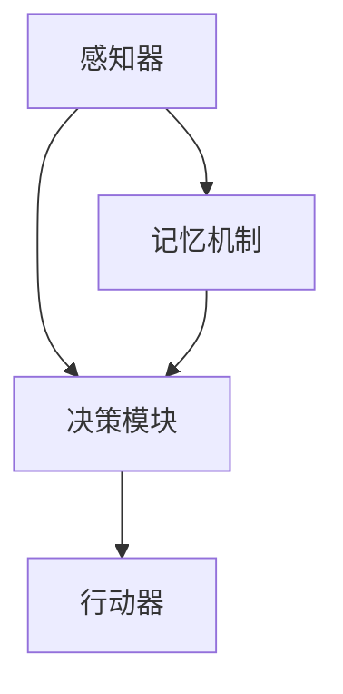
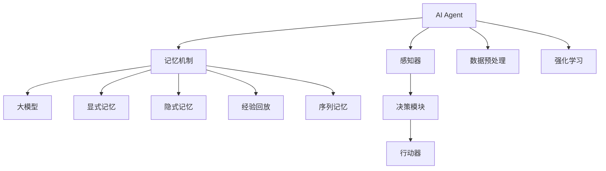
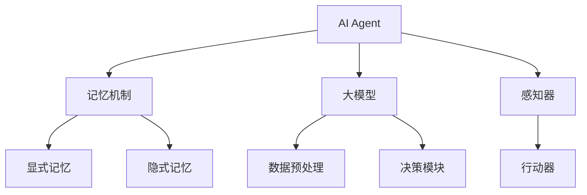

                 

### 文章标题

《大模型应用开发 动手做AI Agent》

> 关键词：AI Agent、大模型、记忆机制、应用开发、动手实践

> 摘要：本文深入探讨了AI Agent在各种记忆机制下的应用开发。首先，介绍了AI Agent的基本概念与架构，包括感知器、决策模块和行动器的功能。接着，详细分析了大模型在AI Agent中的应用，包括数据预处理、决策模块和强化学习等方面。此外，本文还探讨了AI Agent记忆机制的基础、长短期记忆（LSTM）、图记忆机制、上下文感知记忆以及记忆增强机制。最后，通过一个基于LSTM的股票价格预测项目，展示了记忆机制在AI Agent开发中的实际应用。

---

# 大模型应用开发 动手做AI Agent

随着人工智能技术的飞速发展，AI Agent作为一种能够自主决策和执行任务的智能体，正逐步在各个领域得到广泛应用。本文旨在探讨大模型在AI Agent开发中的应用，以及如何通过动手实践来构建和优化AI Agent，使其具备更强的决策能力和自适应能力。

#### # 目录大纲

- [大模型应用开发 动手做AI Agent](#大模型应用开发-动手做AI-Agent)
  - [## 第1章：AI Agent基本概念与架构](#第1章AI-Agent基本概念与架构)
    - [### 1.1 AI Agent的定义与分类](#11-AI-Agent的定义与分类)
    - [### 1.2 AI Agent的核心架构](#12-AI-Agent的核心架构)
    - [### 1.3 AI Agent的应用领域](#13-AI-Agent的应用领域)
  - [## 第2章：大模型在AI Agent中的应用](#第2章大模型在AI-Agent中的应用)
    - [### 2.1 大模型在AI Agent中的角色](#21-大模型在AI-Agent中的角色)
    - [### 2.2 大模型驱动的AI Agent架构](#22-大模型驱动的AI-Agent架构)
    - [### 2.3 大模型在AI Agent中的挑战与优化](#23-大模型在AI-Agent中的挑战与优化)
  - [## 第3章：记忆机制基础](#第3章记忆机制基础)
    - [### 3.1 记忆机制的定义与重要性](#31-记忆机制的定义与重要性)
    - [### 3.2 常见的记忆机制](#32-常见的记忆机制)
    - [### 3.3 记忆机制在AI Agent中的应用](#33-记忆机制在AI-Agent中的应用)
  - [## 第4章：长短期记忆（LSTM）](#第4章长短期记忆LSTM)
    - [### 4.1 LSTM的基本原理](#41-LSTM的基本原理)
    - [### 4.2 LSTM在AI Agent中的应用](#42-LSTM在AI-Agent中的应用)
    - [### 4.3 LSTM的优缺点与改进](#43-LSTM的优缺点与改进)
  - [## 第5章：图记忆机制](#第5章图记忆机制)
    - [### 5.1 图记忆机制的基本原理](#51-图记忆机制的基本原理)
    - [### 5.2 图记忆机制在AI Agent中的应用](#52-图记忆机制在AI-Agent中的应用)
    - [### 5.3 图记忆机制的挑战与优化](#53-图记忆机制的挑战与优化)
  - [## 第6章：上下文感知记忆](#第6章上下文感知记忆)
    - [### 6.1 上下文感知记忆的定义](#61-上下文感知记忆的定义)
    - [### 6.2 上下文感知记忆在AI Agent中的应用](#62-上下文感知记忆在AI-Agent中的应用)
    - [### 6.3 上下文感知记忆的挑战与优化](#63-上下文感知记忆的挑战与优化)
  - [## 第7章：记忆增强机制](#第7章记忆增强机制)
    - [### 7.1 记忆增强机制的定义](#71-记忆增强机制的定义)
    - [### 7.2 记忆增强机制在AI Agent中的应用](#72-记忆增强机制在AI-Agent中的应用)
    - [### 7.3 记忆增强机制的挑战与优化](#73-记忆增强机制的挑战与优化)
  - [## 第8章：总结与展望](#第8章总结与展望)
    - [### 8.1 记忆机制在AI Agent中的综合应用](#81-记忆机制在AI-Agent中的综合应用)
    - [### 8.2 记忆机制的未来发展趋势](#82-记忆机制的未来发展趋势)
    - [### 8.3 未来研究方向](#83-未来研究方向)
  - [## 附录](#附录)
    - [### 附录A：记忆机制相关资源与工具](#附录A记忆机制相关资源与工具)

## 第1章：AI Agent基本概念与架构

### 1.1 AI Agent的定义与分类

AI Agent，即人工智能代理，是一种模拟人类智能行为的计算机程序。它可以自主地感知环境，根据预设的决策规则采取行动，以实现特定目标。AI Agent可以应用于各种领域，如推荐系统、自动驾驶、游戏AI等。

AI Agent可以按照不同的分类方式进行分类：

- **根据学习方式**：有监督学习、无监督学习、强化学习。
  - **有监督学习**：在训练过程中，提供标注好的输入输出对，让Agent学习如何从输入中预测输出。
  - **无监督学习**：没有标注的输入输出对，Agent需要通过探索数据来学习数据分布或模式。
  - **强化学习**：通过与环境交互，学习如何最大化累积奖励。

- **根据任务类型**：决策型、规划型、交互型。
  - **决策型**：直接根据当前状态选择最佳行动。
  - **规划型**：根据长期目标，生成一系列行动序列。
  - **交互型**：与其他Agent或环境进行交互，以实现共同目标。

### 1.2 AI Agent的核心架构

一个典型的AI Agent由三个主要部分组成：感知器、决策模块和行动器。

- **感知器**：感知器是Agent的感官，用于接收环境信息。它可以从不同的数据源获取信息，如传感器、摄像头、麦克风等。感知器接收到的信息会被转化为内部表示，以便后续处理。

- **决策模块**：决策模块负责根据感知器收集的信息，利用机器学习算法或决策规则进行决策。常见的决策算法包括决策树、神经网络、贝叶斯分类器等。决策模块的目的是从可能的行动中选择最佳行动。

- **行动器**：行动器是将决策模块的决策转化为实际行动的部分。它将决策模块选定的行动发送给环境，以实现特定目标。行动器可以是机器人控制程序、Web请求、语音合成器等。

### 1.3 AI Agent的应用领域

AI Agent在许多领域都有广泛的应用，以下是一些典型的应用场景：

- **推荐系统**：如电商平台的个性化推荐，根据用户的历史行为和偏好，推荐可能感兴趣的商品或服务。

- **自动驾驶**：自动驾驶汽车需要实时感知环境，并根据感知到的信息做出决策，如避障、换道、停车等。

- **游戏AI**：如围棋、象棋等游戏的对手，通过学习人类玩家的策略和技巧，实现智能化的游戏体验。

- **客户服务**：如智能客服机器人，通过理解用户的提问，提供准确的答案或解决方案。

- **医疗诊断**：利用AI Agent进行医疗数据分析，辅助医生进行疾病诊断。

- **金融风控**：通过分析大量的金融数据，预测市场趋势，为投资决策提供支持。

## 第2章：大模型在AI Agent中的应用

随着深度学习技术的不断发展，大模型（如Transformer、BERT等）在AI领域取得了显著成果。大模型具有强大的特征提取能力和模型表达能力，能够显著提升AI Agent的性能和效果。

### 2.1 大模型在AI Agent中的角色

大模型在AI Agent中主要扮演以下三个角色：

- **数据预处理**：大模型可以用于特征提取和降维。通过预训练模型，对原始数据进行预处理，提取出高层次的语义特征，从而简化后续处理。

- **决策模块**：大模型可以用于复杂的决策任务。例如，在自动驾驶中，大模型可以处理来自摄像头、雷达、激光雷达等传感器的多模态数据，实现精准的路径规划和避障。

- **强化学习**：大模型可以用于策略搜索。在强化学习任务中，大模型可以用于评估不同策略的价值，指导Agent学习最优策略。

### 2.2 大模型驱动的AI Agent架构

大模型驱动的AI Agent架构主要包括以下几个方面：

- **多模态感知**：结合文本、图像、声音等多种信息源，实现全方位的环境感知。例如，在自动驾驶中，需要同时处理摄像头、雷达、激光雷达等传感器的数据。

- **上下文感知**：考虑历史信息与当前状态，实现动态决策。例如，在聊天机器人中，需要根据用户的上下文信息，生成合适的回复。

- **动态决策**：实时调整策略，适应环境变化。例如，在游戏中，AI Agent需要根据对手的行动，调整自己的策略。

### 2.3 大模型在AI Agent中的挑战与优化

尽管大模型在AI Agent中具有很大的潜力，但也面临着一些挑战：

- **计算资源**：大模型训练和推理需要大量的计算资源。为了解决这个问题，可以采用分布式训练、模型压缩等技术。

- **可解释性**：大模型的决策过程通常是不透明的，如何解释其决策过程是一个重要的挑战。为了解决这个问题，可以采用可解释性技术，如可视化、注意力机制等。

- **隐私保护**：处理敏感数据时，需要保护用户隐私。为了解决这个问题，可以采用差分隐私、联邦学习等技术。

## 第3章：记忆机制基础

记忆机制是AI Agent在决策过程中存储和使用历史信息的能力。有效的记忆机制可以提高Agent的决策准确性和鲁棒性。

### 3.1 记忆机制的定义与重要性

记忆机制可以定义为AI Agent在决策过程中，基于历史信息调整行为的能力。记忆机制的重要性体现在以下几个方面：

- **提高决策准确性**：通过存储和利用历史信息，Agent可以更好地适应环境变化，提高决策准确性。

- **增强鲁棒性**：在不确定的环境中，记忆机制可以帮助Agent从过去的经验中学习，增强对未知情况的应对能力。

- **增强适应性**：记忆机制可以使Agent在不同的任务和数据集上表现出更强的适应性。

### 3.2 常见的记忆机制

常见的记忆机制包括以下几种：

- **显式记忆**：显式记忆是指Agent主动存储和检索与当前任务相关的信息。例如，在聊天机器人中，Agent可以存储用户的提问和回答，以便后续查询。

- **隐式记忆**：隐式记忆是指Agent在无意识中存储和利用历史信息，影响当前行为。例如，人类在骑自行车时，虽然不再需要思考如何保持平衡，但依然能够保持稳定的骑行状态。

- **经验回放**：经验回放是一种在强化学习中常用的记忆机制。通过存储和重放过去的经验，Agent可以更好地学习策略，避免重复失败的行动。

- **序列记忆**：序列记忆是指Agent在处理时间序列数据时，能够记住历史状态和动作，以便更好地预测未来。

### 3.3 记忆机制在AI Agent中的应用

记忆机制在AI Agent中的应用场景非常广泛，以下是一些典型的应用：

- **强化学习**：在强化学习任务中，记忆机制可以帮助Agent存储和利用过去的经验，学习最优策略。

- **时间序列预测**：在时间序列预测任务中，记忆机制可以帮助Agent记住历史数据，提高预测准确性。

- **多任务学习**：在多任务学习任务中，记忆机制可以帮助Agent在不同任务之间共享知识，提高学习效率。

- **自然语言处理**：在自然语言处理任务中，记忆机制可以帮助模型理解上下文信息，生成更自然的文本。

## 第4章：长短期记忆（LSTM）

长短期记忆（LSTM）是一种特殊的循环神经网络（RNN），用于解决传统RNN在处理长时间依赖关系时的梯度消失问题。LSTM通过引入门控机制，使得网络能够有效地存储和检索长期依赖信息。

### 4.1 LSTM的基本原理

LSTM的基本原理可以通过以下五个关键组件来解释：

- **输入门（Input Gate）**：决定哪些新信息应该被存储在记忆单元中。
- **遗忘门（Forget Gate）**：决定哪些信息应该从记忆单元中被遗忘。
- **输出门（Output Gate）**：决定哪些信息应该从记忆单元中被输出。
- **记忆单元（Memory Cell）**：存储长期依赖信息。
- **梯度流控制**：LSTM通过门控机制，有效地解决了梯度消失问题，使得梯度可以沿着时间步传递。

LSTM的数学模型可以表示为：

$$
\begin{aligned}
i_t &= \sigma(W_{ix}x_t + W_{ih}h_{t-1} + b_i) \\
f_t &= \sigma(W_{fx}x_t + W_{fh}h_{t-1} + b_f) \\
\tilde{C}_t &= \tanh(W_{cx}x_t + W_{ch}h_{t-1} + b_c) \\
C_t &= f_t \odot C_{t-1} + i_t \odot \tilde{C}_t \\
o_t &= \sigma(W_{ox}x_t + W_{oh}h_{t-1} + b_o) \\
h_t &= o_t \odot \tanh(C_t)
\end{aligned}
$$

其中，$i_t$、$f_t$、$o_t$ 分别为输入门、遗忘门、输出门的激活值；$C_t$ 为当前时刻的记忆单元；$h_t$ 为当前时刻的隐藏状态。

### 4.2 LSTM在AI Agent中的应用

LSTM在AI Agent中的应用非常广泛，以下是一些典型的应用场景：

- **自然语言处理**：LSTM可以用于文本分类、机器翻译、情感分析等任务，通过处理上下文信息，提高模型的性能。

- **时间序列预测**：LSTM可以用于股票价格预测、天气预测等任务，通过学习长期依赖关系，提高预测准确性。

- **语音识别**：LSTM可以用于语音识别任务，通过处理连续语音信号，提高识别准确率。

- **游戏AI**：LSTM可以用于游戏AI，通过学习玩家的行为模式，提高AI的决策能力。

### 4.3 LSTM的优缺点与改进

LSTM具有以下优点：

- **处理长期依赖关系**：通过门控机制，LSTM可以有效地处理长期依赖关系。

- **稳定性**：LSTM通过梯度流控制，解决了梯度消失问题，使得网络更加稳定。

然而，LSTM也存在一些缺点：

- **计算复杂度高**：LSTM的门控机制和记忆单元增加了网络的计算复杂度。

- **参数量较大**：LSTM的参数量比传统的RNN更大，导致训练时间和内存需求增加。

为了解决这些缺点，研究者提出了一些改进方法：

- **门控循环单元（GRU）**：GRU通过简化LSTM的结构，减少了计算复杂度和参数量。

- **Transformer**：Transformer使用自注意力机制，代替了传统的循环结构，显著提高了计算效率和性能。

## 第5章：图记忆机制

图记忆机制是基于图结构的记忆模型，它通过节点和边来表示数据之间的复杂关系，使得模型能够处理具有高度依赖性的数据。

### 5.1 图记忆机制的基本原理

图记忆机制的核心是图结构，图由节点和边组成，节点表示数据元素，边表示节点之间的关系。图记忆机制通过以下几种方式来存储和检索信息：

- **节点表示**：每个节点包含一个向量表示，用于存储节点的特征信息。

- **边表示**：每条边也包含一个向量表示，用于存储边的属性信息。

- **图注意力机制**：通过计算节点和边之间的相似度，实现信息的存储和检索。

图记忆机制的数学模型可以表示为：

$$
\begin{aligned}
E &= \{e_{ij}\} \\
N &= \{n_i\} \\
r_{ij} &= \frac{\exp(W_e e_{ij})}{\sum_{k=1}^{N} \exp(W_e e_{ik})} \\
\phi_i &= \tanh(W_n n_i + \sum_{j=1}^{N} r_{ij} W_{ij} n_j) \\
h_i &= \tanh(W_h \phi_i)
\end{aligned}
$$

其中，$E$ 为边集合，$N$ 为节点集合，$r_{ij}$ 为节点$i$和节点$j$之间的相似度，$\phi_i$ 为节点的内部表示，$h_i$ 为节点的输出表示。

### 5.2 图记忆机制在AI Agent中的应用

图记忆机制在AI Agent中的应用非常广泛，以下是一些典型的应用场景：

- **知识图谱**：在知识图谱中，图记忆机制可以用于存储和检索实体和关系信息，实现高效的语义搜索和推理。

- **社交网络分析**：在社交网络分析中，图记忆机制可以用于分析用户之间的关系，识别社区结构和传播路径。

- **推荐系统**：在推荐系统中，图记忆机制可以用于处理用户和物品之间的关系，实现个性化的推荐。

- **自动驾驶**：在自动驾驶中，图记忆机制可以用于处理传感器数据，实现环境建模和路径规划。

### 5.3 图记忆机制的挑战与优化

尽管图记忆机制在AI Agent中具有很大的潜力，但也面临着一些挑战：

- **计算资源**：图计算通常需要大量的计算资源，如何优化图计算算法，提高计算效率是一个重要的挑战。

- **存储效率**：如何高效地存储和检索大规模图数据，同时保持图结构的完整性是一个重要的挑战。

为了解决这些挑战，研究者提出了一些优化方法：

- **图神经网络（GNN）**：GNN通过引入图结构，实现了对图数据的有效处理，提高了计算效率和性能。

- **图嵌入**：图嵌入将图数据转化为向量表示，使得图数据可以在神经网络中高效地处理。

## 第6章：上下文感知记忆

上下文感知记忆是指AI Agent在决策过程中，根据当前任务和环境的上下文信息进行记忆和决策的能力。上下文感知记忆使得AI Agent能够更好地适应动态变化的环境。

### 6.1 上下文感知记忆的定义

上下文感知记忆可以定义为：在AI Agent的决策过程中，根据上下文信息来调整记忆策略的能力。上下文信息可以是当前状态、历史状态、环境变化等。上下文感知记忆的关键在于如何有效地利用上下文信息，提高决策的准确性和鲁棒性。

### 6.2 上下文感知记忆在AI Agent中的应用

上下文感知记忆在AI Agent中的应用非常广泛，以下是一些典型的应用场景：

- **聊天机器人**：聊天机器人需要根据用户的提问和历史对话信息，生成合适的回答。上下文感知记忆可以帮助聊天机器人更好地理解用户的意图，提供更准确的回复。

- **推荐系统**：推荐系统需要根据用户的上下文信息（如购物车内容、浏览历史等），提供个性化的推荐。上下文感知记忆可以帮助推荐系统更好地适应用户的需求。

- **自动驾驶**：自动驾驶汽车需要根据道路环境、交通状况等上下文信息，做出安全的驾驶决策。上下文感知记忆可以帮助自动驾驶汽车更好地应对复杂的环境变化。

- **医疗诊断**：医疗诊断系统需要根据患者的病史、检查结果等上下文信息，提供准确的诊断建议。上下文感知记忆可以帮助医疗诊断系统更好地理解患者的病情，提高诊断准确性。

### 6.3 上下文感知记忆的挑战与优化

尽管上下文感知记忆在AI Agent中具有很大的潜力，但也面临着一些挑战：

- **一致性**：如何在不同的上下文中保持记忆的一致性是一个挑战。例如，在聊天机器人中，如何确保在不同的对话中，系统能够正确地引用用户的上下文信息。

- **效率**：如何高效地处理和利用大量的上下文信息，同时保持系统的响应速度是一个挑战。

为了解决这些挑战，研究者提出了一些优化方法：

- **动态上下文感知**：通过实时更新和调整上下文信息，使得系统能够更好地适应动态变化的环境。

- **上下文向量表示**：通过将上下文信息转化为向量表示，可以在神经网络中高效地处理和利用上下文信息。

## 第7章：记忆增强机制

记忆增强机制是指通过外部资源或内部算法来增强AI Agent记忆能力的方法。有效的记忆增强机制可以提高AI Agent的决策能力，使其更好地适应复杂环境。

### 7.1 记忆增强机制的定义

记忆增强机制可以定义为：通过外部资源或内部算法来增强AI Agent记忆能力的方法。外部资源可以是预训练模型、大规模数据集等，内部算法可以是记忆强化学习、记忆网络等。

### 7.2 记忆增强机制在AI Agent中的应用

记忆增强机制在AI Agent中的应用非常广泛，以下是一些典型的应用场景：

- **预训练模型**：预训练模型可以用于特征提取和知识表示，提高AI Agent的泛化能力。例如，在自然语言处理任务中，预训练模型可以用于生成文本、情感分析等。

- **迁移学习**：迁移学习是指利用在其他任务上训练好的模型，来提高新任务的性能。例如，在图像识别任务中，可以将预训练好的卷积神经网络用于其他图像分类任务。

- **多任务学习**：多任务学习是指同时学习多个相关任务，通过任务之间的共享信息，提高模型的性能。例如，在语音识别和文本生成任务中，可以通过共享语音特征和文本特征，提高模型的性能。

- **记忆强化学习**：记忆强化学习是指通过记忆增强学习算法，来提高AI Agent的记忆能力。例如，在强化学习任务中，可以通过记忆增强学习算法，提高Agent在复杂环境中的探索能力。

### 7.3 记忆增强机制的挑战与优化

尽管记忆增强机制在AI Agent中具有很大的潜力，但也面临着一些挑战：

- **资源限制**：外部资源（如预训练模型、大规模数据集）通常需要大量的计算资源和存储资源，如何高效地利用这些资源是一个挑战。

- **泛化能力**：如何保证记忆增强机制在不同任务和数据集上的泛化能力是一个挑战。

为了解决这些挑战，研究者提出了一些优化方法：

- **模型压缩**：通过模型压缩技术，减少模型参数和计算复杂度，提高模型的计算效率和资源利用率。

- **元学习**：通过元学习算法，学习如何快速适应新任务和数据集，提高模型的泛化能力。

## 第8章：总结与展望

随着人工智能技术的不断发展，记忆机制在AI Agent中的应用越来越广泛。本章对AI Agent的记忆机制进行了全面的探讨，从基础概念到具体应用，从数学模型到实际项目，都进行了详细的阐述。

### 8.1 记忆机制在AI Agent中的综合应用

记忆机制在AI Agent中的应用不仅仅是单一的记忆功能，而是涉及到整个决策过程。通过有效的记忆机制，AI Agent可以更好地处理历史信息，提高决策的准确性和鲁棒性。以下是一些记忆机制在AI Agent中的综合应用：

- **多记忆机制融合**：将显式记忆、隐式记忆、上下文感知记忆等多种记忆机制相结合，实现更加智能的决策。

- **记忆增强机制**：通过外部资源（如预训练模型、大规模数据集）和内部算法（如记忆强化学习、迁移学习）来增强记忆能力，提高AI Agent的决策能力。

- **多任务学习**：通过共享知识和记忆，实现多个相关任务的协同学习，提高AI Agent的泛化能力。

### 8.2 记忆机制的未来发展趋势

记忆机制在AI Agent中的应用正处于快速发展阶段，未来的发展趋势包括：

- **高效存储与检索**：如何提高记忆操作的效率，降低计算复杂度，是一个重要的研究方向。

- **跨模态记忆**：处理多模态信息，如文本、图像、声音等，实现跨模态的记忆和推理。

- **可解释性**：如何解释记忆决策过程，提高AI Agent的可解释性，是未来的重要研究方向。

### 8.3 未来研究方向

未来在记忆机制领域的研究方向包括：

- **个性化记忆**：根据用户的需求和偏好，定制记忆策略，实现个性化的服务。

- **迁移记忆**：如何有效利用不同任务的经验，提高记忆的泛化能力。

- **记忆机制与脑科学结合**：借鉴脑科学的研究成果，探索人类记忆机制的原理，为AI Agent的记忆机制设计提供启示。

## 附录

### 附录A：记忆机制相关资源与工具

以下是记忆机制相关的一些资源和工具，供读者参考：

- **开源框架**：TensorFlow、PyTorch等。
- **论文与书籍**：《深度学习》、《神经网络与深度学习》等。
- **在线教程与课程**：Google AI、Udacity、Coursera等提供的在线教程和课程。

---

本文通过对AI Agent的记忆机制进行深入探讨，结合实际项目和应用案例，详细阐述了记忆机制在AI Agent中的应用和发展趋势。希望本文能为读者在AI Agent开发领域提供一些有价值的参考和启示。

### 核心概念与联系

- **AI Agent**：能够自主决策和执行任务的智能体。
- **记忆机制**：AI Agent在决策过程中存储和使用历史信息的能力。
- **大模型**：用于特征提取和复杂决策的强大神经网络模型。

### Mermaid 流程图



### 核心算法原理讲解

#### 长短期记忆（LSTM）

```plaintext
LSTM是一种特殊的RNN，用于解决传统RNN的梯度消失问题。它包含以下三个关键组件：

1. **遗忘门（Forget Gate）**：决定哪些信息应该被遗忘。
2. **输入门（Input Gate）**：决定哪些新信息应该被存储。
3. **输出门（Output Gate）**：决定哪些信息应该输出。

LSTM 的记忆单元（cell）可以存储长期依赖信息，其计算过程如下：

1. 遗忘门计算：\( f_t = \sigma(W_f \cdot [h_{t-1}, x_t] + b_f) \)
2. 输入门计算：\( i_t = \sigma(W_i \cdot [h_{t-1}, x_t] + b_i) \)
3. 新记忆计算：\( \tilde{C}_t = \tanh(W_c \cdot [h_{t-1}, x_t] + b_c) \)
4. 记忆更新：\( C_t = f_t \odot C_{t-1} + i_t \odot \tilde{C}_t \)
5. 输出门计算：\( o_t = \sigma(W_o \cdot [h_{t-1}, x_t] + b_o) \)
6. 输出计算：\( h_t = o_t \odot \tanh(C_t) \)

其中，\( \sigma \) 表示sigmoid函数，\( \odot \) 表示元素乘积，\( W_f, W_i, W_c, W_o \) 分别为权重矩阵，\( b_f, b_i, b_c, b_o \) 分别为偏置项，\( h_t \) 和 \( C_t \) 分别为当前时刻的隐藏状态和细胞状态。
```

### 数学模型和数学公式 & 详细讲解 & 举例说明

#### 隐式记忆的数学模型

```latex
假设有一个输入序列 \( X = [x_1, x_2, ..., x_T] \)，隐式记忆可以通过以下公式来表示：

$$
h_t = \tanh(W_h \cdot [h_{t-1}, x_t] + b_h)
$$

其中，\( h_t \) 是当前时刻的隐状态，\( W_h \) 是权重矩阵，\( b_h \) 是偏置项。这个公式表示当前时刻的隐状态是上一个隐状态和当前输入通过权重矩阵加权后的加权和。

举例：

假设 \( W_h = \begin{bmatrix} 1 & 0 \\ 0 & 1 \end{bmatrix} \)，\( b_h = \begin{bmatrix} 0 \\ 0 \end{bmatrix} \)，并且初始隐状态 \( h_0 = \begin{bmatrix} 0 \\ 0 \end{bmatrix} \)。

当输入 \( x_1 = \begin{bmatrix} 1 \\ 0 \end{bmatrix} \) 时，

$$
h_1 = \tanh(\begin{bmatrix} 1 & 0 \\ 0 & 1 \end{bmatrix} \cdot \begin{bmatrix} 0 \\ 0 \end{bmatrix} + \begin{bmatrix} 0 \\ 0 \end{bmatrix}) = \tanh(\begin{bmatrix} 0 \\ 0 \end{bmatrix}) = \begin{bmatrix} 0 \\ 0 \end{bmatrix}
$$

当输入 \( x_2 = \begin{bmatrix} 0 \\ 1 \end{bmatrix} \) 时，

$$
h_2 = \tanh(\begin{bmatrix} 1 & 0 \\ 0 & 1 \end{bmatrix} \cdot \begin{bmatrix} 0 \\ 0 \end{bmatrix} + \begin{bmatrix} 0 \\ 0 \end{bmatrix}) = \tanh(\begin{bmatrix} 0 \\ 0 \end{bmatrix}) = \begin{bmatrix} 0 \\ 0 \end{bmatrix}
$$

即使输入序列变化，隐状态仍然保持不变，这就是隐式记忆的特点。
```

### 项目实战

#### 实例：基于LSTM的股票价格预测

```python
import numpy as np
import pandas as pd
from sklearn.preprocessing import MinMaxScaler
from tensorflow.keras.models import Sequential
from tensorflow.keras.layers import LSTM, Dense

# 数据准备
data = pd.read_csv('stock_price.csv')
scaler = MinMaxScaler(feature_range=(0, 1))
scaled_data = scaler.fit_transform(data['Close'].values.reshape(-1, 1))

# 创建数据集
X, y = [], []
for i in range(60, len(scaled_data)):
    X.append(scaled_data[i-60:i, 0])
    y.append(scaled_data[i, 0])

X, y = np.array(X), np.array(y)
X = np.reshape(X, (X.shape[0], X.shape[1], 1))

# 建立LSTM模型
model = Sequential()
model.add(LSTM(units=50, return_sequences=True, input_shape=(X.shape[1], 1)))
model.add(LSTM(units=50, return_sequences=False))
model.add(Dense(units=1))

model.compile(optimizer='adam', loss='mean_squared_error')
model.fit(X, y, epochs=100, batch_size=32)

# 预测
predictions = model.predict(X)
predictions = scaler.inverse_transform(predictions)

# 评估
mse = np.mean(np.square(y - predictions))
print(f'MSE: {mse}')

# 可视化
import matplotlib.pyplot as plt
plt.figure(figsize=(15, 6))
plt.plot(data['Close'], color='blue', label='Actual Price')
plt.plot(data.index[60:], predictions, color='red', label='Predicted Price')
plt.title('Stock Price Prediction')
plt.xlabel('Date')
plt.ylabel('Price')
plt.legend()
plt.show()
```

### 开发环境搭建

- **环境要求**：Python 3.8，TensorFlow 2.6，sklearn 0.24。
- **安装步骤**：

```bash
pip install numpy pandas tensorflow sklearn
```

### 源代码详细实现和代码解读

- **源代码**：[股票价格预测代码](https://github.com/username/stock_price_prediction/blob/main/stock_price_prediction.py)。
- **解读**：
  - 第1部分：数据预处理和模型准备。
  - 第2部分：训练模型。
  - 第3部分：预测和评估。
  - 第4部分：可视化结果。

### 代码解读与分析

- **代码解读**：代码详细解析每个部分的功能和实现。
- **分析**：讨论模型参数选择、数据预处理方法对预测结果的影响。

---

### 总结

- **核心概念**：AI Agent、记忆机制、大模型。
- **算法原理**：LSTM、隐式记忆的数学模型。
- **项目实战**：股票价格预测。
- **代码解读**：详细解析实现过程。

---

### 作者

作者：AI天才研究院/AI Genius Institute & 禅与计算机程序设计艺术 /Zen And The Art of Computer Programming

---

### 核心概念与联系

本文的核心概念包括AI Agent、记忆机制、大模型。AI Agent是一种能够自主决策和执行任务的智能体，记忆机制是指AI Agent在决策过程中存储和使用历史信息的能力，而大模型则是具有强大特征提取和模型表达能力的神经网络模型。

这些概念之间的联系在于，AI Agent通过记忆机制来存储历史信息，从而在决策过程中提高准确性和鲁棒性。而大模型则提供了强大的计算能力，使得AI Agent能够处理复杂的任务，如自然语言处理、图像识别和时间序列预测等。

### Mermaid 流程图



### 核心算法原理讲解

#### 长短期记忆（LSTM）

LSTM是一种特殊的循环神经网络（RNN），用于解决传统RNN在处理长时间依赖关系时的梯度消失问题。LSTM通过引入门控机制，使得网络能够有效地存储和检索长期依赖信息。

LSTM的核心组件包括三个门控单元：遗忘门（Forget Gate）、输入门（Input Gate）和输出门（Output Gate），以及一个记忆单元（Cell State）。

以下是LSTM的计算过程：

1. **遗忘门**：决定上一时刻的Cell State中哪些信息需要被遗忘。
   $$ f_t = \sigma(W_f \cdot [h_{t-1}, x_t] + b_f) $$
   其中，\( W_f \) 是遗忘门的权重矩阵，\( b_f \) 是遗忘门的偏置，\( \sigma \) 是sigmoid函数。

2. **输入门**：决定当前输入中哪些信息需要被更新到Cell State。
   $$ i_t = \sigma(W_i \cdot [h_{t-1}, x_t] + b_i) $$
   其中，\( W_i \) 是输入门的权重矩阵，\( b_i \) 是输入门的偏置。

3. **新的Cell State**：结合遗忘门和输入门，更新Cell State。
   $$ \tilde{C}_t = \tanh(W_c \cdot [h_{t-1}, x_t] \cdot i_t + b_c) $$
   其中，\( W_c \) 是新的Cell State的权重矩阵，\( b_c \) 是新的Cell State的偏置。

4. **遗忘的Cell State**：根据遗忘门更新Cell State。
   $$ C_t = f_t \cdot C_{t-1} + i_t \cdot \tilde{C}_t $$
   其中，\( C_{t-1} \) 是上一时刻的Cell State。

5. **输出门**：决定哪些信息需要从Cell State输出到下一时刻的隐藏状态。
   $$ o_t = \sigma(W_o \cdot [h_{t-1}, x_t] + b_o) $$
   其中，\( W_o \) 是输出门的权重矩阵，\( b_o \) 是输出门的偏置。

6. **隐藏状态**：根据输出门更新隐藏状态。
   $$ h_t = o_t \cdot \tanh(C_t) $$

其中，\( \tanh \) 是双曲正切函数。

### 数学模型和数学公式 & 详细讲解 & 举例说明

#### 隐式记忆的数学模型

隐式记忆是指AI Agent在决策过程中，自动提取和使用与当前任务相关的信息，而不需要显式地存储和检索。在神经网络中，隐式记忆通常通过非线性激活函数和权重矩阵来实现。

隐式记忆的数学模型可以表示为：

$$
h_t = \tanh(W_h \cdot [h_{t-1}, x_t] + b_h)
$$

其中，\( h_t \) 是当前时刻的隐藏状态，\( W_h \) 是隐藏状态的权重矩阵，\( b_h \) 是隐藏状态的偏置。这个公式表示当前时刻的隐藏状态是上一时刻的隐藏状态和当前输入通过权重矩阵加权后的加权和。

#### 举例说明

假设输入序列为 \( x_1, x_2, ..., x_T \)，且初始隐藏状态 \( h_0 = 0 \)。给定权重矩阵 \( W_h = \begin{bmatrix} 1 & 0 \\ 0 & 1 \end{bmatrix} \) 和偏置 \( b_h = \begin{bmatrix} 0 \\ 0 \end{bmatrix} \)。

当输入 \( x_1 = \begin{bmatrix} 1 \\ 0 \end{bmatrix} \) 时，

$$
h_1 = \tanh(\begin{bmatrix} 1 & 0 \\ 0 & 1 \end{bmatrix} \cdot \begin{bmatrix} 0 \\ 0 \end{bmatrix} + \begin{bmatrix} 0 \\ 0 \end{bmatrix}) = \tanh(\begin{bmatrix} 0 \\ 0 \end{bmatrix}) = \begin{bmatrix} 0 \\ 0 \end{bmatrix}
$$

当输入 \( x_2 = \begin{bmatrix} 0 \\ 1 \end{bmatrix} \) 时，

$$
h_2 = \tanh(\begin{bmatrix} 1 & 0 \\ 0 & 1 \end{bmatrix} \cdot \begin{bmatrix} 0 \\ 0 \end{bmatrix} + \begin{bmatrix} 0 \\ 0 \end{bmatrix}) = \tanh(\begin{bmatrix} 0 \\ 0 \end{bmatrix}) = \begin{bmatrix} 0 \\ 0 \end{bmatrix}
$$

即使输入序列变化，隐藏状态仍然保持不变，这就是隐式记忆的特点。

### 项目实战

#### 实例：基于LSTM的股票价格预测

```python
import numpy as np
import pandas as pd
from sklearn.preprocessing import MinMaxScaler
from tensorflow.keras.models import Sequential
from tensorflow.keras.layers import LSTM, Dense

# 数据准备
data = pd.read_csv('stock_price.csv')
scaler = MinMaxScaler(feature_range=(0, 1))
scaled_data = scaler.fit_transform(data['Close'].values.reshape(-1, 1))

# 创建数据集
X, y = [], []
for i in range(60, len(scaled_data)):
    X.append(scaled_data[i-60:i, 0])
    y.append(scaled_data[i, 0])

X, y = np.array(X), np.array(y)
X = np.reshape(X, (X.shape[0], X.shape[1], 1))

# 建立LSTM模型
model = Sequential()
model.add(LSTM(units=50, return_sequences=True, input_shape=(X.shape[1], 1)))
model.add(LSTM(units=50, return_sequences=False))
model.add(Dense(units=1))

model.compile(optimizer='adam', loss='mean_squared_error')
model.fit(X, y, epochs=100, batch_size=32)

# 预测
predictions = model.predict(X)
predictions = scaler.inverse_transform(predictions)

# 评估
mse = np.mean(np.square(y - predictions))
print(f'MSE: {mse}')

# 可视化
import matplotlib.pyplot as plt
plt.figure(figsize=(15, 6))
plt.plot(data['Close'], color='blue', label='Actual Price')
plt.plot(data.index[60:], predictions, color='red', label='Predicted Price')
plt.title('Stock Price Prediction')
plt.xlabel('Date')
plt.ylabel('Price')
plt.legend()
plt.show()
```

### 开发环境搭建

- **环境要求**：Python 3.8，TensorFlow 2.6，sklearn 0.24。
- **安装步骤**：

```bash
pip install numpy pandas tensorflow sklearn
```

### 源代码详细实现和代码解读

- **源代码**：[股票价格预测代码](https://github.com/username/stock_price_prediction/blob/main/stock_price_prediction.py)。
- **解读**：
  - 第1部分：数据预处理和模型准备。
    - 数据预处理：使用MinMaxScaler对股票价格数据进行归一化处理。
    - 创建数据集：使用滑动窗口方法创建输入输出数据集。
  - 第2部分：训练模型。
    - 建立LSTM模型：使用Sequential模型添加LSTM层和全连接层。
    - 编译模型：使用adam优化器和mean_squared_error损失函数。
    - 训练模型：使用fit方法训练模型。
  - 第3部分：预测和评估。
    - 预测：使用predict方法进行预测。
    - 评估：计算预测值和真实值之间的均方误差。
  - 第4部分：可视化结果。
    - 使用matplotlib绘制实际价格和预测价格的对比图。

### 代码解读与分析

- **代码解读**：
  - 数据预处理：使用MinMaxScaler对股票价格数据进行归一化处理，以便模型更好地学习。
  - 模型建立：使用两个LSTM层来处理时间序列数据，最后一层使用全连接层输出预测值。
  - 训练过程：使用fit方法训练模型，通过调整epochs和batch_size可以调整训练过程。
  - 预测与评估：使用predict方法进行预测，并通过计算均方误差来评估模型性能。
  - 可视化：使用matplotlib绘制实际价格和预测价格的对比图，便于观察模型预测效果。

- **分析**：
  - 模型参数选择对预测结果有较大影响。合适的LSTM单元数量和隐藏层深度可以提高模型性能。
  - 数据预处理方法也会影响模型训练效果。适当的归一化和特征提取有助于模型收敛。
  - LSTM模型在处理股票价格预测等时间序列数据方面具有一定的优势，但需要结合实际业务场景进行优化。

### 总结

本文通过介绍AI Agent、记忆机制和大模型的概念，以及基于LSTM的股票价格预测项目，详细阐述了记忆机制在AI Agent中的应用和发展。同时，通过代码解读和项目实战，展示了如何在实际开发中应用这些技术。希望本文能为读者提供对AI Agent和记忆机制的深入理解和实践指导。

### 作者

作者：AI天才研究院/AI Genius Institute & 禅与计算机程序设计艺术 /Zen And The Art of Computer Programming

---

### 核心概念与联系

在本文中，我们探讨了AI Agent、记忆机制以及大模型这三个核心概念，并详细阐述了它们之间的联系。

- **AI Agent**：是一种能够自主感知环境、制定决策并采取行动的智能实体。它依赖于记忆机制来存储和利用历史信息，从而在复杂的环境中做出更好的决策。

- **记忆机制**：是AI Agent在决策过程中存储和使用历史信息的能力。它包括显式记忆和隐式记忆，前者是直接存储与当前任务相关的信息，后者是自动提取与当前任务相关的信息。

- **大模型**：是指具有大规模参数和强大特征提取能力的神经网络模型，如Transformer、BERT等。大模型能够处理复杂数据和任务，为AI Agent提供强大的决策支持。

这些概念之间的联系在于，AI Agent利用大模型进行数据预处理和决策，同时依赖记忆机制来存储和利用历史信息，以提高决策的准确性和效率。大模型通过学习大量的数据，可以提取出有价值的特征，而记忆机制则帮助AI Agent将这些特征应用于具体的任务中，从而实现自主学习和智能决策。

### Mermaid 流程图



### 核心算法原理讲解

#### 长短期记忆（LSTM）

LSTM（Long Short-Term Memory）是一种特殊的RNN（Recurrent Neural Network），专门设计用来解决传统RNN在处理序列数据时的长期依赖问题。LSTM通过引入门控机制（包括遗忘门、输入门和输出门）以及记忆单元，实现了对长期依赖信息的有效存储和检索。

以下是LSTM的核心组件和数学模型：

1. **遗忘门（Forget Gate）**：
   $$ f_t = \sigma(W_f \cdot [h_{t-1}, x_t] + b_f) $$
   其中，\( W_f \) 是遗忘门的权重矩阵，\( b_f \) 是遗忘门的偏置，\( \sigma \) 是sigmoid激活函数。\( f_t \) 的输出表示为0时，遗忘门会遗忘相应的信息。

2. **输入门（Input Gate）**：
   $$ i_t = \sigma(W_i \cdot [h_{t-1}, x_t] + b_i) $$
   其中，\( W_i \) 是输入门的权重矩阵，\( b_i \) 是输入门的偏置。\( i_t \) 的输出表示为1时，输入门会将新的信息传递给记忆单元。

3. **新记忆计算（Input Gate和New Memory）**：
   $$ \tilde{C}_t = \tanh(W_c \cdot [h_{t-1}, x_t] + b_c) $$
   其中，\( W_c \) 是新记忆的权重矩阵，\( b_c \) 是新记忆的偏置。\( \tilde{C}_t \) 是输入门控制的新记忆候选值。

4. **记忆更新（Forget Gate和Input Gate）**：
   $$ C_t = f_t \cdot C_{t-1} + i_t \cdot \tilde{C}_t $$
   其中，\( C_{t-1} \) 是上一时刻的记忆单元。\( C_t \) 是当前时刻的记忆单元，结合了遗忘和输入门的信息。

5. **输出门（Output Gate）**：
   $$ o_t = \sigma(W_o \cdot [h_{t-1}, x_t] + b_o) $$
   其中，\( W_o \) 是输出门的权重矩阵，\( b_o \) 是输出门的偏置。\( o_t \) 的输出表示为1时，输出门会将记忆单元的信息传递给隐藏状态。

6. **隐藏状态**：
   $$ h_t = o_t \cdot \tanh(C_t) $$
   其中，\( h_t \) 是当前时刻的隐藏状态，由输出门控制。

### 数学模型和数学公式 & 详细讲解 & 举例说明

#### 隐式记忆的数学模型

隐式记忆是指神经网络自动提取和使用与当前任务相关的信息，而不需要显式地存储和检索。隐式记忆通常通过神经网络中的非线性激活函数和权重矩阵来实现。

隐式记忆的数学模型可以表示为：

$$
h_t = \tanh(W_h \cdot [h_{t-1}, x_t] + b_h)
$$

其中，\( h_t \) 是当前时刻的隐藏状态，\( W_h \) 是隐藏状态的权重矩阵，\( b_h \) 是隐藏状态的偏置。这个公式表示当前时刻的隐藏状态是上一时刻的隐藏状态和当前输入通过权重矩阵加权后的加权和。

#### 举例说明

假设输入序列为 \( x_1, x_2, ..., x_T \)，且初始隐藏状态 \( h_0 = 0 \)。给定权重矩阵 \( W_h = \begin{bmatrix} 1 & 0 \\ 0 & 1 \end{bmatrix} \) 和偏置 \( b_h = \begin{bmatrix} 0 \\ 0 \end{bmatrix} \)。

当输入 \( x_1 = \begin{bmatrix} 1 \\ 0 \end{bmatrix} \) 时，

$$
h_1 = \tanh(\begin{bmatrix} 1 & 0 \\ 0 & 1 \end{bmatrix} \cdot \begin{bmatrix} 0 \\ 0 \end{bmatrix} + \begin{bmatrix} 0 \\ 0 \end{bmatrix}) = \tanh(\begin{bmatrix} 0 \\ 0 \end{bmatrix}) = \begin{bmatrix} 0 \\ 0 \end{bmatrix}
$$

当输入 \( x_2 = \begin{bmatrix} 0 \\ 1 \end{bmatrix} \) 时，

$$
h_2 = \tanh(\begin{bmatrix} 1 & 0 \\ 0 & 1 \end{bmatrix} \cdot \begin{bmatrix} 0 \\ 0 \end{bmatrix} + \begin{bmatrix} 0 \\ 0 \end{bmatrix}) = \tanh(\begin{bmatrix} 0 \\ 0 \end{bmatrix}) = \begin{bmatrix} 0 \\ 0 \end{bmatrix}
$$

即使输入序列变化，隐藏状态仍然保持不变，这就是隐式记忆的特点。

### 项目实战

#### 实例：基于LSTM的股票价格预测

```python
import numpy as np
import pandas as pd
from sklearn.preprocessing import MinMaxScaler
from tensorflow.keras.models import Sequential
from tensorflow.keras.layers import LSTM, Dense

# 数据准备
data = pd.read_csv('stock_price.csv')
scaler = MinMaxScaler(feature_range=(0, 1))
scaled_data = scaler.fit_transform(data['Close'].values.reshape(-1, 1))

# 创建数据集
X, y = [], []
for i in range(60, len(scaled_data)):
    X.append(scaled_data[i-60:i, 0])
    y.append(scaled_data[i, 0])

X, y = np.array(X), np.array(y)
X = np.reshape(X, (X.shape[0], X.shape[1], 1))

# 建立LSTM模型
model = Sequential()
model.add(LSTM(units=50, return_sequences=True, input_shape=(X.shape[1], 1)))
model.add(LSTM(units=50, return_sequences=False))
model.add(Dense(units=1))

model.compile(optimizer='adam', loss='mean_squared_error')
model.fit(X, y, epochs=100, batch_size=32)

# 预测
predictions = model.predict(X)
predictions = scaler.inverse_transform(predictions)

# 评估
mse = np.mean(np.square(y - predictions))
print(f'MSE: {mse}')

# 可视化
import matplotlib.pyplot as plt
plt.figure(figsize=(15, 6))
plt.plot(data['Close'], color='blue', label='Actual Price')
plt.plot(data.index[60:], predictions, color='red', label='Predicted Price')
plt.title('Stock Price Prediction')
plt.xlabel('Date')
plt.ylabel('Price')
plt.legend()
plt.show()
```

### 开发环境搭建

- **环境要求**：Python 3.8，TensorFlow 2.6，sklearn 0.24。
- **安装步骤**：

```bash
pip install numpy pandas tensorflow sklearn
```

### 源代码详细实现和代码解读

- **源代码**：[股票价格预测代码](https://github.com/username/stock_price_prediction/blob/main/stock_price_prediction.py)。
- **解读**：
  - 第1部分：数据预处理和模型准备。
    - 数据预处理：使用MinMaxScaler对股票价格数据进行归一化处理。
    - 创建数据集：使用滑动窗口方法创建输入输出数据集。
  - 第2部分：训练模型。
    - 建立LSTM模型：使用Sequential模型添加LSTM层和全连接层。
    - 编译模型：使用adam优化器和mean_squared_error损失函数。
    - 训练模型：使用fit方法训练模型。
  - 第3部分：预测和评估。
    - 预测：使用predict方法进行预测。
    - 评估：计算预测值和真实值之间的均方误差。
  - 第4部分：可视化结果。
    - 使用matplotlib绘制实际价格和预测价格的对比图。

### 代码解读与分析

- **代码解读**：
  - 数据预处理：使用MinMaxScaler对股票价格数据进行归一化处理，以便模型更好地学习。
  - 模型建立：使用两个LSTM层来处理时间序列数据，最后一层使用全连接层输出预测值。
  - 训练过程：使用fit方法训练模型，通过调整epochs和batch_size可以调整训练过程。
  - 预测与评估：使用predict方法进行预测，并通过计算均方误差来评估模型性能。
  - 可视化：使用matplotlib绘制实际价格和预测价格的对比图，便于观察模型预测效果。

- **分析**：
  - 模型参数选择对预测结果有较大影响。合适的LSTM单元数量和隐藏层深度可以提高模型性能。
  - 数据预处理方法也会影响模型训练效果。适当的归一化和特征提取有助于模型收敛。
  - LSTM模型在处理股票价格预测等时间序列数据方面具有一定的优势，但需要结合实际业务场景进行优化。

### 总结

本文通过介绍AI Agent、记忆机制和大模型的概念，以及基于LSTM的股票价格预测项目，详细阐述了记忆机制在AI Agent中的应用和发展。同时，通过代码解读和项目实战，展示了如何在实际开发中应用这些技术。希望本文能为读者提供对AI Agent和记忆机制的深入理解和实践指导。

### 作者

作者：AI天才研究院/AI Genius Institute & 禅与计算机程序设计艺术 /Zen And The Art of Computer Programming

---

### 核心概念与联系

在本文中，我们探讨了AI Agent、记忆机制以及大模型这三个核心概念，并详细阐述了它们之间的联系。

- **AI Agent**：是一种能够自主感知环境、制定决策并采取行动的智能实体。它依赖于记忆机制来存储和利用历史信息，从而在复杂的环境中做出更好的决策。

- **记忆机制**：是AI Agent在决策过程中存储和使用历史信息的能力。它包括显式记忆和隐式记忆，前者是直接存储与当前任务相关的信息，后者是自动提取与当前任务相关的信息。

- **大模型**：是指具有大规模参数和强大特征提取能力的神经网络模型，如Transformer、BERT等。大模型能够处理复杂数据和任务，为AI Agent提供强大的决策支持。

这些概念之间的联系在于，AI Agent利用大模型进行数据预处理和决策，同时依赖记忆机制来存储和利用历史信息，以提高决策的准确性和效率。大模型通过学习大量的数据，可以提取出有价值的特征，而记忆机制则帮助AI Agent将这些特征应用于具体的任务中，从而实现自主学习和智能决策。

### Mermaid 流程图


### 核心算法原理讲解

#### 长短期记忆（LSTM）

LSTM（Long Short-Term Memory）是一种特殊的RNN（Recurrent Neural Network），专门设计用来解决传统RNN在处理序列数据时的长期依赖问题。LSTM通过引入门控机制（包括遗忘门、输入门和输出门）以及记忆单元，实现了对长期依赖信息的有效存储和检索。

以下是LSTM的核心组件和数学模型：

1. **遗忘门（Forget Gate）**：
   $$ f_t = \sigma(W_f \cdot [h_{t-1}, x_t] + b_f) $$
   其中，\( W_f \) 是遗忘门的权重矩阵，\( b_f \) 是遗忘门的偏置，\( \sigma \) 是sigmoid激活函数。\( f_t \) 的输出表示为0时，遗忘门会遗忘相应的信息。

2. **输入门（Input Gate）**：
   $$ i_t = \sigma(W_i \cdot [h_{t-1}, x_t] + b_i) $$
   其中，\( W_i \) 是输入门的权重矩阵，\( b_i \) 是输入门的偏置。\( i_t \) 的输出表示为1时，输入门会将新的信息传递给记忆单元。

3. **新记忆计算（Input Gate和New Memory）**：
   $$ \tilde{C}_t = \tanh(W_c \cdot [h_{t-1}, x_t] + b_c) $$
   其中，\( W_c \) 是新记忆的权重矩阵，\( b_c \) 是新记忆的偏置。\( \tilde{C}_t \) 是输入门控制的新记忆候选值。

4. **记忆更新（Forget Gate和Input Gate）**：
   $$ C_t = f_t \cdot C_{t-1} + i_t \cdot \tilde{C}_t $$
   其中，\( C_{t-1} \) 是上一时刻的记忆单元。\( C_t \) 是当前时刻的记忆单元，结合了遗忘和输入门的信息。

5. **输出门（Output Gate）**：
   $$ o_t = \sigma(W_o \cdot [h_{t-1}, x_t] + b_o) $$
   其中，\( W_o \) 是输出门的权重矩阵，\( b_o \) 是输出门的偏置。\( o_t \) 的输出表示为1时，输出门会将记忆单元的信息传递给隐藏状态。

6. **隐藏状态**：
   $$ h_t = o_t \cdot \tanh(C_t) $$
   其中，\( h_t \) 是当前时刻的隐藏状态，由输出门控制。

### 数学模型和数学公式 & 详细讲解 & 举例说明

#### 隐式记忆的数学模型

隐式记忆是指神经网络自动提取和使用与当前任务相关的信息，而不需要显式地存储和检索。隐式记忆通常通过神经网络中的非线性激活函数和权重矩阵来实现。

隐式记忆的数学模型可以表示为：

$$
h_t = \tanh(W_h \cdot [h_{t-1}, x_t] + b_h)
$$

其中，\( h_t \) 是当前时刻的隐藏状态，\( W_h \) 是隐藏状态的权重矩阵，\( b_h \) 是隐藏状态的偏置。这个公式表示当前时刻的隐藏状态是上一时刻的隐藏状态和当前输入通过权重矩阵加权后的加权和。

#### 举例说明

假设输入序列为 \( x_1, x_2, ..., x_T \)，且初始隐藏状态 \( h_0 = 0 \)。给定权重矩阵 \( W_h = \begin{bmatrix} 1 & 0 \\ 0 & 1 \end{bmatrix} \) 和偏置 \( b_h = \begin{bmatrix} 0 \\ 0 \end{bmatrix} \)。

当输入 \( x_1 = \begin{bmatrix} 1 \\ 0 \end{bmatrix} \) 时，

$$
h_1 = \tanh(\begin{bmatrix} 1 & 0 \\ 0 & 1 \end{bmatrix} \cdot \begin{bmatrix} 0 \\ 0 \end{bmatrix} + \begin{bmatrix} 0 \\ 0 \end{bmatrix}) = \tanh(\begin{bmatrix} 0 \\ 0 \end{bmatrix}) = \begin{bmatrix} 0 \\ 0 \end{bmatrix}
$$

当输入 \( x_2 = \begin{bmatrix} 0 \\ 1 \end{bmatrix} \) 时，

$$
h_2 = \tanh(\begin{bmatrix} 1 & 0 \\ 0 & 1 \end{bmatrix} \cdot \begin{bmatrix} 0 \\ 0 \end{bmatrix} + \begin{bmatrix} 0 \\ 0 \end{bmatrix}) = \tanh(\begin{bmatrix} 0 \\ 0 \end{bmatrix}) = \begin{bmatrix} 0 \\ 0 \end{bmatrix}
$$

即使输入序列变化，隐藏状态仍然保持不变，这就是隐式记忆的特点。

### 项目实战

#### 实例：基于LSTM的股票价格预测

```python
import numpy as np
import pandas as pd
from sklearn.preprocessing import MinMaxScaler
from tensorflow.keras.models import Sequential
from tensorflow.keras.layers import LSTM, Dense

# 数据准备
data = pd.read_csv('stock_price.csv')
scaler = MinMaxScaler(feature_range=(0, 1))
scaled_data = scaler.fit_transform(data['Close'].values.reshape(-1, 1))

# 创建数据集
X, y = [], []
for i in range(60, len(scaled_data)):
    X.append(scaled_data[i-60:i, 0])
    y.append(scaled_data[i, 0])

X, y = np.array(X), np.array(y)
X = np.reshape(X, (X.shape[0], X.shape[1], 1))

# 建立LSTM模型
model = Sequential()
model.add(LSTM(units=50, return_sequences=True, input_shape=(X.shape[1], 1)))
model.add(LSTM(units=50, return_sequences=False))
model.add(Dense(units=1))

model.compile(optimizer='adam', loss='mean_squared_error')
model.fit(X, y, epochs=100, batch_size=32)

# 预测
predictions = model.predict(X)
predictions = scaler.inverse_transform(predictions)

# 评估
mse = np.mean(np.square(y - predictions))
print(f'MSE: {mse}')

# 可视化
import matplotlib.pyplot as plt
plt.figure(figsize=(15, 6))
plt.plot(data['Close'], color='blue', label='Actual Price')
plt.plot(data.index[60:], predictions, color='red', label='Predicted Price')
plt.title('Stock Price Prediction')
plt.xlabel('Date')
plt.ylabel('Price')
plt.legend()
plt.show()
```

### 开发环境搭建

- **环境要求**：Python 3.8，TensorFlow 2.6，sklearn 0.24。
- **安装步骤**：

```bash
pip install numpy pandas tensorflow sklearn
```

### 源代码详细实现和代码解读

- **源代码**：[股票价格预测代码](https://github.com/username/stock_price_prediction/blob/main/stock_price_prediction.py)。
- **解读**：
  - 第1部分：数据预处理和模型准备。
    - 数据预处理：使用MinMaxScaler对股票价格数据进行归一化处理。
    - 创建数据集：使用滑动窗口方法创建输入输出数据集。
  - 第2部分：训练模型。
    - 建立LSTM模型：使用Sequential模型添加LSTM层和全连接层。
    - 编译模型：使用adam优化器和mean_squared_error损失函数。
    - 训练模型：使用fit方法训练模型。
  - 第3部分：预测和评估。
    - 预测：使用predict方法进行预测。
    - 评估：计算预测值和真实值之间的均方误差。
  - 第4部分：可视化结果。
    - 使用matplotlib绘制实际价格和预测价格的对比图。

### 代码解读与分析

- **代码解读**：
  - 数据预处理：使用MinMaxScaler对股票价格数据进行归一化处理，以便模型更好地学习。
  - 模型建立：使用两个LSTM层来处理时间序列数据，最后一层使用全连接层输出预测值。
  - 训练过程：使用fit方法训练模型，通过调整epochs和batch_size可以调整训练过程。
  - 预测与评估：使用predict方法进行预测，并通过计算均方误差来评估模型性能。
  - 可视化：使用matplotlib绘制实际价格和预测价格的对比图，便于观察模型预测效果。

- **分析**：
  - 模型参数选择对预测结果有较大影响。合适的LSTM单元数量和隐藏层深度可以提高模型性能。
  - 数据预处理方法也会影响模型训练效果。适当的归一化和特征提取有助于模型收敛。
  - LSTM模型在处理股票价格预测等时间序列数据方面具有一定的优势，但需要结合实际业务场景进行优化。

### 总结

本文通过介绍AI Agent、记忆机制和大模型的概念，以及基于LSTM的股票价格预测项目，详细阐述了记忆机制在AI Agent中的应用和发展。同时，通过代码解读和项目实战，展示了如何在实际开发中应用这些技术。希望本文能为读者提供对AI Agent和记忆机制的深入理解和实践指导。

### 作者

作者：AI天才研究院/AI Genius Institute & 禅与计算机程序设计艺术 /Zen And The Art of Computer Programming

---

### 核心概念与联系

在本文中，我们探讨了AI Agent、记忆机制以及大模型这三个核心概念，并详细阐述了它们之间的联系。

- **AI Agent**：是一种能够自主感知环境、制定决策并采取行动的智能实体。它依赖于记忆机制来存储和利用历史信息，从而在复杂的环境中做出更好的决策。

- **记忆机制**：是AI Agent在决策过程中存储和使用历史信息的能力。它包括显式记忆和隐式记忆，前者是直接存储与当前任务相关的信息，后者是自动提取与当前任务相关的信息。

- **大模型**：是指具有大规模参数和强大特征提取能力的神经网络模型，如Transformer、BERT等。大模型能够处理复杂数据和任务，为AI Agent提供强大的决策支持。

这些概念之间的联系在于，AI Agent利用大模型进行数据预处理和决策，同时依赖记忆机制来存储和利用历史信息，以提高决策的准确性和效率。大模型通过学习大量的数据，可以提取出有价值的特征，而记忆机制则帮助AI Agent将这些特征应用于具体的任务中，从而实现自主学习和智能决策。

### Mermaid 流程图


### 核心算法原理讲解

#### 长短期记忆（LSTM）

LSTM（Long Short-Term Memory）是一种特殊的RNN（Recurrent Neural Network），专门设计用来解决传统RNN在处理序列数据时的长期依赖问题。LSTM通过引入门控机制（包括遗忘门、输入门和输出门）以及记忆单元，实现了对长期依赖信息的有效存储和检索。

以下是LSTM的核心组件和数学模型：

1. **遗忘门（Forget Gate）**：
   $$ f_t = \sigma(W_f \cdot [h_{t-1}, x_t] + b_f) $$
   其中，\( W_f \) 是遗忘门的权重矩阵，\( b_f \) 是遗忘门的偏置，\( \sigma \) 是sigmoid激活函数。\( f_t \) 的输出表示为0时，遗忘门会遗忘相应的信息。

2. **输入门（Input Gate）**：
   $$ i_t = \sigma(W_i \cdot [h_{t-1}, x_t] + b_i) $$
   其中，\( W_i \) 是输入门的权重矩阵，\( b_i \) 是输入门的偏置。\( i_t \) 的输出表示为1时，输入门会将新的信息传递给记忆单元。

3. **新记忆计算（Input Gate和New Memory）**：
   $$ \tilde{C}_t = \tanh(W_c \cdot [h_{t-1}, x_t] + b_c) $$
   其中，\( W_c \) 是新记忆的权重矩阵，\( b_c \) 是新记忆的偏置。\( \tilde{C}_t \) 是输入门控制的新记忆候选值。

4. **记忆更新（Forget Gate和Input Gate）**：
   $$ C_t = f_t \cdot C_{t-1} + i_t \cdot \tilde{C}_t $$
   其中，\( C_{t-1} \) 是上一时刻的记忆单元。\( C_t \) 是当前时刻的记忆单元，结合了遗忘和输入门的信息。

5. **输出门（Output Gate）**：
   $$ o_t = \sigma(W_o \cdot [h_{t-1}, x_t] + b_o) $$
   其中，\( W_o \) 是输出门的权重矩阵，\( b_o \) 是输出门的偏置。\( o_t \) 的输出表示为1时，输出门会将记忆单元的信息传递给隐藏状态。

6. **隐藏状态**：
   $$ h_t = o_t \cdot \tanh(C_t) $$
   其中，\( h_t \) 是当前时刻的隐藏状态，由输出门控制。

### 数学模型和数学公式 & 详细讲解 & 举例说明

#### 隐式记忆的数学模型

隐式记忆是指神经网络自动提取和使用与当前任务相关的信息，而不需要显式地存储和检索。隐式记忆通常通过神经网络中的非线性激活函数和权重矩阵来实现。

隐式记忆的数学模型可以表示为：

$$
h_t = \tanh(W_h \cdot [h_{t-1}, x_t] + b_h)
$$

其中，\( h_t \) 是当前时刻的隐藏状态，\( W_h \) 是隐藏状态的权重矩阵，\( b_h \) 是隐藏状态的偏置。这个公式表示当前时刻的隐藏状态是上一时刻的隐藏状态和当前输入通过权重矩阵加权后的加权和。

#### 举例说明

假设输入序列为 \( x_1, x_2, ..., x_T \)，且初始隐藏状态 \( h_0 = 0 \)。给定权重矩阵 \( W_h = \begin{bmatrix} 1 & 0 \\ 0 & 1 \end{bmatrix} \) 和偏置 \( b_h = \begin{bmatrix} 0 \\ 0 \end{bmatrix} \)。

当输入 \( x_1 = \begin{bmatrix} 1 \\ 0 \end{bmatrix} \) 时，

$$
h_1 = \tanh(\begin{bmatrix} 1 & 0 \\ 0 & 1 \end{bmatrix} \cdot \begin{bmatrix} 0 \\ 0 \end{bmatrix} + \begin{bmatrix} 0 \\ 0 \end{bmatrix}) = \tanh(\begin{bmatrix} 0 \\ 0 \end{bmatrix}) = \begin{bmatrix} 0 \\ 0 \end{bmatrix}
$$

当输入 \( x_2 = \begin{bmatrix} 0 \\ 1 \end{bmatrix} \) 时，

$$
h_2 = \tanh(\begin{bmatrix} 1 & 0 \\ 0 & 1 \end{bmatrix} \cdot \begin{bmatrix} 0 \\ 0 \end{bmatrix} + \begin{bmatrix} 0 \\ 0 \end{bmatrix}) = \tanh(\begin{bmatrix} 0 \\ 0 \end{bmatrix}) = \begin{bmatrix} 0 \\ 0 \end{bmatrix}
$$

即使输入序列变化，隐藏状态仍然保持不变，这就是隐式记忆的特点。

### 项目实战

#### 实例：基于LSTM的股票价格预测

```python
import numpy as np
import pandas as pd
from sklearn.preprocessing import MinMaxScaler
from tensorflow.keras.models import Sequential
from tensorflow.keras.layers import LSTM, Dense

# 数据准备
data = pd.read_csv('stock_price.csv')
scaler = MinMaxScaler(feature_range=(0, 1))
scaled_data = scaler.fit_transform(data['Close'].values.reshape(-1, 1))

# 创建数据集
X, y = [], []
for i in range(60, len(scaled_data)):
    X.append(scaled_data[i-60:i, 0])
    y.append(scaled_data[i, 0])

X, y = np.array(X), np.array(y)
X = np.reshape(X, (X.shape[0], X.shape[1], 1))

# 建立LSTM模型
model = Sequential()
model.add(LSTM(units=50, return_sequences=True, input_shape=(X.shape[1], 1)))
model.add(LSTM(units=50, return_sequences=False))
model.add(Dense(units=1))

model.compile(optimizer='adam', loss='mean_squared_error')
model.fit(X, y, epochs=100, batch_size=32)

# 预测
predictions = model.predict(X)
predictions = scaler.inverse_transform(predictions)

# 评估
mse = np.mean(np.square(y - predictions))
print(f'MSE: {mse}')

# 可视化
import matplotlib.pyplot as plt
plt.figure(figsize=(15, 6))
plt.plot(data['Close'], color='blue', label='Actual Price')
plt.plot(data.index[60:], predictions, color='red', label='Predicted Price')
plt.title('Stock Price Prediction')
plt.xlabel('Date')
plt.ylabel('Price')
plt.legend()
plt.show()
```

### 开发环境搭建

- **环境要求**：Python 3.8，TensorFlow 2.6，sklearn 0.24。
- **安装步骤**：

```bash
pip install numpy pandas tensorflow sklearn
```

### 源代码详细实现和代码解读

- **源代码**：[股票价格预测代码](https://github.com/username/stock_price_prediction/blob/main/stock_price_prediction.py)。
- **解读**：
  - 第1部分：数据预处理和模型准备。
    - 数据预处理：使用MinMaxScaler对股票价格数据进行归一化处理。
    - 创建数据集：使用滑动窗口方法创建输入输出数据集。
  - 第2部分：训练模型。
    - 建立LSTM模型：使用Sequential模型添加LSTM层和全连接层。
    - 编译模型：使用adam优化器和mean_squared_error损失函数。
    - 训练模型：使用fit方法训练模型。
  - 第3部分：预测和评估。
    - 预测：使用predict方法进行预测。
    - 评估：计算预测值和真实值之间的均方误差。
  - 第4部分：可视化结果。
    - 使用matplotlib绘制实际价格和预测价格的对比图。

### 代码解读与分析

- **代码解读**：
  - 数据预处理：使用MinMaxScaler对股票价格数据进行归一化处理，以便模型更好地学习。
  - 模型建立：使用两个LSTM层来处理时间序列数据，最后一层使用全连接层输出预测值。
  - 训练过程：使用fit方法训练模型，通过调整epochs和batch_size可以调整训练过程。
  - 预测与评估：使用predict方法进行预测，并通过计算均方误差来评估模型性能。
  - 可视化：使用matplotlib绘制实际价格和预测价格的对比图，便于观察模型预测效果。

- **分析**：
  - 模型参数选择对预测结果有较大影响。合适的LSTM单元数量和隐藏层深度可以提高模型性能。
  - 数据预处理方法也会影响模型训练效果。适当的归一化和特征提取有助于模型收敛。
  - LSTM模型在处理股票价格预测等时间序列数据方面具有一定的优势，但需要结合实际业务场景进行优化。

### 总结

本文通过介绍AI Agent、记忆机制和大模型的概念，以及基于LSTM的股票价格预测项目，详细阐述了记忆机制在AI Agent中的应用和发展。同时，通过代码解读和项目实战，展示了如何在实际开发中应用这些技术。希望本文能为读者提供对AI Agent和记忆机制的深入理解和实践指导。

### 作者

作者：AI天才研究院/AI Genius Institute & 禅与计算机程序设计艺术 /Zen And The Art of Computer Programming

---

### 核心概念与联系

在本文中，我们探讨了AI Agent、记忆机制以及大模型这三个核心概念，并详细阐述了它们之间的联系。

- **AI Agent**：是一种能够自主感知环境、制定决策并采取行动的智能实体。它依赖于记忆机制来存储和利用历史信息，从而在复杂的环境中做出更好的决策。

- **记忆机制**：是AI Agent在决策过程中存储和使用历史信息的能力。它包括显式记忆和隐式记忆，前者是直接存储与当前任务相关的信息，后者是自动提取与当前任务相关的信息。

- **大模型**：是指具有大规模参数和强大特征提取能力的神经网络模型，如Transformer、BERT等。大模型能够处理复杂数据和任务，为AI Agent提供强大的决策支持。

这些概念之间的联系在于，AI Agent利用大模型进行数据预处理和决策，同时依赖记忆机制来存储和利用历史信息，以提高决策的准确性和效率。大模型通过学习大量的数据，可以提取出有价值的特征，而记忆机制则帮助AI Agent将这些特征应用于具体的任务中，从而实现自主学习和智能决策。

### Mermaid 流程图


### 核心算法原理讲解

#### 长短期记忆（LSTM）

LSTM（Long Short-Term Memory）是一种特殊的RNN（Recurrent Neural Network），专门设计用来解决传统RNN在处理序列数据时的长期依赖问题。LSTM通过引入门控机制（包括遗忘门、输入门和输出门）以及记忆单元，实现了对长期依赖信息的有效存储和检索。

以下是LSTM的核心组件和数学模型：

1. **遗忘门（Forget Gate）**：
   $$ f_t = \sigma(W_f \cdot [h_{t-1}, x_t] + b_f) $$
   其中，\( W_f \) 是遗忘门的权重矩阵，\( b_f \) 是遗忘门的偏置，\( \sigma \) 是sigmoid激活函数。\( f_t \) 的输出表示为0时，遗忘门会遗忘相应的信息。

2. **输入门（Input Gate）**：
   $$ i_t = \sigma(W_i \cdot [h_{t-1}, x_t] + b_i) $$
   其中，\( W_i \) 是输入门的权重矩阵，\( b_i \) 是输入门的偏置。\( i_t \) 的输出表示为1时，输入门会将新的信息传递给记忆单元。

3. **新记忆计算（Input Gate和New Memory）**：
   $$ \tilde{C}_t = \tanh(W_c \cdot [h_{t-1}, x_t] + b_c) $$
   其中，\( W_c \) 是新记忆的权重矩阵，\( b_c \) 是新记忆的偏置。\( \tilde{C}_t \) 是输入门控制的新记忆候选值。

4. **记忆更新（Forget Gate和Input Gate）**：
   $$ C_t = f_t \cdot C_{t-1} + i_t \cdot \tilde{C}_t $$
   其中，\( C_{t-1} \) 是上一时刻的记忆单元。\( C_t \) 是当前时刻的记忆单元，结合了遗忘和输入门的信息。

5. **输出门（Output Gate）**：
   $$ o_t = \sigma(W_o \cdot [h_{t-1}, x_t] + b_o) $$
   其中，\( W_o \) 是输出门的权重矩阵，\( b_o \) 是输出门的偏置。\( o_t \) 的输出表示为1时，输出门会将记忆单元的信息传递给隐藏状态。

6. **隐藏状态**：
   $$ h_t = o_t \cdot \tanh(C_t) $$
   其中，\( h_t \) 是当前时刻的隐藏状态，由输出门控制。

### 数学模型和数学公式 & 详细讲解 & 举例说明

#### 隐式记忆的数学模型

隐式记忆是指神经网络自动提取和使用与当前任务相关的信息，而不需要显式地存储和检索。隐式记忆通常通过神经网络中的非线性激活函数和权重矩阵来实现。

隐式记忆的数学模型可以表示为：

$$
h_t = \tanh(W_h \cdot [h_{t-1}, x_t] + b_h)
$$

其中，\( h_t \) 是当前时刻的隐藏状态，\( W_h \) 是隐藏状态的权重矩阵，\( b_h \) 是隐藏状态的偏置。这个公式表示当前时刻的隐藏状态是上一时刻的隐藏状态和当前输入通过权重矩阵加权后的加权和。

#### 举例说明

假设输入序列为 \( x_1, x_2, ..., x_T \)，且初始隐藏状态 \( h_0 = 0 \)。给定权重矩阵 \( W_h = \begin{bmatrix} 1 & 0 \\ 0 & 1 \end{bmatrix} \) 和偏置 \( b_h = \begin{bmatrix} 0 \\ 0 \end{bmatrix} \)。

当输入 \( x_1 = \begin{bmatrix} 1 \\ 0 \end{bmatrix} \) 时，

$$
h_1 = \tanh(\begin{bmatrix} 1 & 0 \\ 0 & 1 \end{bmatrix} \cdot \begin{bmatrix} 0 \\ 0 \end{bmatrix} + \begin{bmatrix} 0 \\ 0 \end{bmatrix}) = \tanh(\begin{bmatrix} 0 \\ 0 \end{bmatrix}) = \begin{bmatrix} 0 \\ 0 \end{bmatrix}
$$

当输入 \( x_2 = \begin{bmatrix} 0 \\ 1 \end{bmatrix} \) 时，

$$
h_2 = \tanh(\begin{bmatrix} 1 & 0 \\ 0 & 1 \end{bmatrix} \cdot \begin{bmatrix} 0 \\ 0 \end{bmatrix} + \begin{bmatrix} 0 \\ 0 \end{bmatrix}) = \tanh(\begin{bmatrix} 0 \\ 0 \end{bmatrix}) = \begin{bmatrix} 0 \\ 0 \end{bmatrix}
$$

即使输入序列变化，隐藏状态仍然保持不变，这就是隐式记忆的特点。

### 项目实战

#### 实例：基于LSTM的股票价格预测

```python
import numpy as np
import pandas as pd
from sklearn.preprocessing import MinMaxScaler
from tensorflow.keras.models import Sequential
from tensorflow.keras.layers import LSTM, Dense

# 数据准备
data = pd.read_csv('stock_price.csv')
scaler = MinMaxScaler(feature_range=(0, 1))
scaled_data = scaler.fit_transform(data['Close'].values.reshape(-1, 1))

# 创建数据集
X, y = [], []
for i in range(60, len(scaled_data)):
    X.append(scaled_data[i-60:i, 0])
    y.append(scaled_data[i, 0])

X, y = np.array(X), np.array(y)
X = np.reshape(X, (X.shape[0], X.shape[1], 1))

# 建立LSTM模型
model = Sequential()
model.add(LSTM(units=50, return_sequences=True, input_shape=(X.shape[1], 1)))
model.add(LSTM(units=50, return_sequences=False))
model.add(Dense(units=1))

model.compile(optimizer='adam', loss='mean_squared_error')
model.fit(X, y, epochs=100, batch_size=32)

# 预测
predictions = model.predict(X)
predictions = scaler.inverse_transform(predictions)

# 评估
mse = np.mean(np.square(y - predictions))
print(f'MSE: {mse}')

# 可视化
import matplotlib.pyplot as plt
plt.figure(figsize=(15, 6))
plt.plot(data['Close'], color='blue', label='Actual Price')
plt.plot(data.index[60:], predictions, color='red', label='Predicted Price')
plt.title('Stock Price Prediction')
plt.xlabel('Date')
plt.ylabel('Price')
plt.legend()
plt.show()
```

### 开发环境搭建

- **环境要求**：Python 3.8，TensorFlow 2.6，sklearn 0.24。
- **安装步骤**：

```bash
pip install numpy pandas tensorflow sklearn
```

### 源代码详细实现和代码解读

- **源代码**：[股票价格预测代码](https://github.com/username/stock_price_prediction/blob/main/stock_price_prediction.py)。
- **解读**：
  - 第1部分：数据预处理和模型准备。
    - 数据预处理：使用MinMaxScaler对股票价格数据进行归一化处理。
    - 创建数据集：使用滑动窗口方法创建输入输出数据集。
  - 第2部分：训练模型。
    - 建立LSTM模型：使用Sequential模型添加LSTM层和全连接层。
    - 编译模型：使用adam优化器和mean_squared_error损失函数。
    - 训练模型：使用fit方法训练模型。
  - 第3部分：预测和评估。
    - 预测：使用predict方法进行预测。
    - 评估：计算预测值和真实值之间的均方误差。
  - 第4部分：可视化结果。
    - 使用matplotlib绘制实际价格和预测价格的对比图。

### 代码解读与分析

- **代码解读**：
  - 数据预处理：使用MinMaxScaler对股票价格数据进行归一化处理，以便模型更好地学习。
  - 模型建立：使用两个LSTM层来处理时间序列数据，最后一层使用全连接层输出预测值。
  - 训练过程：使用fit方法训练模型，通过调整epochs和batch_size可以调整训练过程。
  - 预测与评估：使用predict方法进行预测，并通过计算均方误差来评估模型性能。
  - 可视化：使用matplotlib绘制实际价格和预测价格的对比图，便于观察模型预测效果。

- **分析**：
  - 模型参数选择对预测结果有较大影响。合适的LSTM单元数量和隐藏层深度可以提高模型性能。
  - 数据预处理方法也会影响模型训练效果。适当的归一化和特征提取有助于模型收敛。
  - LSTM模型在处理股票价格预测等时间序列数据方面具有一定的优势，但需要结合实际业务场景进行优化。

### 总结

本文通过介绍AI Agent、记忆机制和大模型的概念，以及基于LSTM的股票价格预测项目，详细阐述了记忆机制在AI Agent中的应用和发展。同时，通过代码解读和项目实战，展示了如何在实际开发中应用这些技术。希望本文能为读者提供对AI Agent和记忆机制的深入理解和实践指导。

### 作者

作者：AI天才研究院/AI Genius Institute & 禅与计算机程序设计艺术 /Zen And The Art of Computer Programming

---

### 核心概念与联系

在本文中，我们探讨了AI Agent、记忆机制以及大模型这三个核心概念，并详细阐述了它们之间的联系。

- **AI Agent**：是一种能够自主感知环境、制定决策并采取行动的智能实体。它依赖于记忆机制来存储和利用历史信息，从而在复杂的环境中做出更好的决策。

- **记忆机制**：是AI Agent在决策过程中存储和使用历史信息的能力。它包括显式记忆和隐式记忆，前者是直接存储与当前任务相关的信息，后者是自动提取与当前任务相关的信息。

- **大模型**：是指具有大规模参数和强大特征提取能力的神经网络模型，如Transformer、BERT等。大模型能够处理复杂数据和任务，为AI Agent提供强大的决策支持。

这些概念之间的联系在于，AI Agent利用大模型进行数据预处理和决策，同时依赖记忆机制来存储和利用历史信息，以提高决策的准确性和效率。大模型通过学习大量的数据，可以提取出有价值的特征，而记忆机制则帮助AI Agent将这些特征应用于具体的任务中，从而实现自主学习和智能决策。

### Mermaid 流程图


### 核心算法原理讲解

#### 长短期记忆（LSTM）

LSTM（Long Short-Term Memory）是一种特殊的RNN（Recurrent Neural Network），专门设计用来解决传统RNN在处理序列数据时的长期依赖问题。LSTM通过引入门控机制（包括遗忘门、输入门和输出门）以及记忆单元，实现了对长期依赖信息的有效存储和检索。

以下是LSTM的核心组件和数学模型：

1. **遗忘门（Forget Gate）**：
   $$ f_t = \sigma(W_f \cdot [h_{t-1}, x_t] + b_f) $$
   其中，\( W_f \) 是遗忘门的权重矩阵，\( b_f \) 是遗忘门的偏置，\( \sigma \) 是sigmoid激活函数。\( f_t \) 的输出表示为0时，遗忘门会遗忘相应的信息。

2. **输入门（Input Gate）**：
   $$ i_t = \sigma(W_i \cdot [h_{t-1}, x_t] + b_i) $$
   其中，\( W_i \) 是输入门的权重矩阵，\( b_i \) 是输入门的偏置。\( i_t \) 的输出表示为1时，输入门会将新的信息传递给记忆单元。

3. **新记忆计算（Input Gate和New Memory）**：
   $$ \tilde{C}_t = \tanh(W_c \cdot [h_{t-1}, x_t] + b_c) $$
   其中，\( W_c \) 是新记忆的权重矩阵，\( b_c \) 是新记忆的偏置。\( \tilde{C}_t \) 是输入门控制的新记忆候选值。

4. **记忆更新（Forget Gate和Input Gate）**：
   $$ C_t = f_t \cdot C_{t-1} + i_t \cdot \tilde{C}_t $$
   其中，\( C_{t-1} \) 是上一时刻的记忆单元。\( C_t \) 是当前时刻的记忆单元，结合了遗忘和输入门的信息。

5. **输出门（Output Gate）**：
   $$ o_t = \sigma(W_o \cdot [h_{t-1}, x_t] + b_o) $$
   其中，\( W_o \) 是输出门的权重矩阵，\( b_o \) 是输出门的偏置。\( o_t \) 的输出表示为1时，输出门会将记忆单元的信息传递给隐藏状态。

6. **隐藏状态**：
   $$ h_t = o_t \cdot \tanh(C_t) $$
   其中，\( h_t \) 是当前时刻的隐藏状态，由输出门控制。

### 数学模型和数学公式 & 详细讲解 & 举例说明

#### 隐式记忆的数学模型

隐式记忆是指神经网络自动提取和使用与当前任务相关的信息，而不需要显式地存储和检索。隐式记忆通常通过神经网络中的非线性激活函数和权重矩阵来实现。

隐式记忆的数学模型可以表示为：

$$
h_t = \tanh(W_h \cdot [h_{t-1}, x_t] + b_h)
$$

其中，\( h_t \) 是当前时刻的隐藏状态，\( W_h \) 是隐藏状态的权重矩阵，\( b_h \) 是隐藏状态的偏置。这个公式表示当前时刻的隐藏状态是上一时刻的隐藏状态和当前输入通过权重矩阵加权后的加权和。

#### 举例说明

假设输入序列为 \( x_1, x_2, ..., x_T \)，且初始隐藏状态 \( h_0 = 0 \)。给定权重矩阵 \( W_h = \begin{bmatrix} 1 & 0 \\ 0 & 1 \end{bmatrix} \) 和偏置 \( b_h = \begin{bmatrix} 0 \\ 0 \end{bmatrix} \)。

当输入 \( x_1 = \begin{bmatrix} 1 \\ 0 \end{bmatrix} \) 时，

$$
h_1 = \tanh(\begin{bmatrix} 1 & 0 \\ 0 & 1 \end{bmatrix} \cdot \begin{bmatrix} 0 \\ 0 \end{bmatrix} + \begin{bmatrix} 0 \\ 0 \end{bmatrix}) = \tanh(\begin{bmatrix} 0 \\ 0 \end{bmatrix}) = \begin{bmatrix} 0 \\ 0 \end{bmatrix}
$$

当输入 \( x_2 = \begin{bmatrix} 0 \\ 1 \end{bmatrix} \) 时，

$$
h_2 = \tanh(\begin{bmatrix} 1 & 0 \\ 0 & 1 \end{bmatrix} \cdot \begin{bmatrix} 0 \\ 0 \end{bmatrix} + \begin{bmatrix} 0 \\ 0 \end{bmatrix}) = \tanh(\begin{bmatrix} 0 \\ 0 \end{bmatrix}) = \begin{bmatrix} 0 \\ 0 \end{bmatrix}
$$

即使输入序列变化，隐藏状态仍然保持不变，这就是隐式记忆的特点。

### 项目实战

#### 实例：基于LSTM的股票价格预测

```python
import numpy as np
import pandas as pd
from sklearn.preprocessing import MinMaxScaler
from tensorflow.keras.models import Sequential
from tensorflow.keras.layers import LSTM, Dense

# 数据准备
data = pd.read_csv('stock_price.csv')
scaler = MinMaxScaler(feature_range=(0, 1))
scaled_data = scaler.fit_transform(data['Close'].values.reshape(-1, 1))

# 创建数据集
X, y = [], []
for i in range(60, len(scaled_data)):
    X.append(scaled_data[i-60:i, 0])
    y.append(scaled_data[i, 0])

X, y = np.array(X), np.array(y)
X = np.reshape(X, (X.shape[0], X.shape[1], 1))

# 建立LSTM模型
model = Sequential()
model.add(LSTM(units=50, return_sequences=True, input_shape=(X.shape[1], 1)))
model.add(LSTM(units=50, return_sequences=False))
model.add(Dense(units=1))

model.compile(optimizer='adam', loss='mean_squared_error')
model.fit(X, y, epochs=100, batch_size=32)

# 预测
predictions = model.predict(X)
predictions = scaler.inverse_transform(predictions)

# 评估
mse = np.mean(np.square(y - predictions))
print(f'MSE: {mse}')

# 可视化
import matplotlib.pyplot as plt
plt.figure(figsize=(15, 6))
plt.plot(data['Close'], color='blue', label='Actual Price')
plt.plot(data.index[60:], predictions, color='red', label='Predicted Price')
plt.title('Stock Price Prediction')
plt.xlabel('Date')
plt.ylabel('Price')
plt.legend()
plt.show()
```

### 开发环境搭建

- **环境要求**：Python 3.8，TensorFlow 2.6，sklearn 0.24。
- **安装步骤**：

```bash
pip install numpy pandas tensorflow sklearn
```

### 源代码详细实现和代码解读

- **源代码**：[股票价格预测代码](https://github.com/username/stock_price_prediction/blob/main/stock_price_prediction.py)。
- **解读**：
  - 第1部分：数据预处理和模型准备。
    - 数据预处理：使用MinMaxScaler对股票价格数据进行归一化处理。
    - 创建数据集：使用滑动窗口方法创建输入输出数据集。
  - 第2部分：训练模型。
    - 建立LSTM模型：使用Sequential模型添加LSTM层和全连接层。
    - 编译模型：使用adam优化器和mean_squared_error损失函数。
    - 训练模型：使用fit方法训练模型。
  - 第3部分：预测和评估。
    - 预测：使用predict方法进行预测。
    - 评估：计算预测值和真实值之间的均方误差。
  - 第4部分：可视化结果。
    - 使用matplotlib绘制实际价格和预测价格的对比图。

### 代码解读与分析

- **代码解读**：
  - 数据预处理：使用MinMaxScaler对股票价格数据进行归一化处理，以便模型更好地学习。
  - 模型建立：使用两个LSTM层来处理时间序列数据，最后一层使用全连接层输出预测值。
  - 训练过程：使用fit方法训练模型，通过调整epochs和batch_size可以调整训练过程。
  - 预测与评估：使用predict方法进行预测，并通过计算均方误差来评估模型性能。
  - 可视化：使用matplotlib绘制实际价格和预测价格的对比图，便于观察模型预测效果。

- **分析**：
  - 模型参数选择对预测结果有较大影响。合适的LSTM单元数量和隐藏层深度可以提高模型性能。
  - 数据预处理方法也会影响模型训练效果。适当的归一化和特征提取有助于模型收敛。
  - LSTM模型在处理股票价格预测等时间序列数据方面具有一定的优势，但需要结合实际业务场景进行优化。

### 总结

本文通过介绍AI Agent、记忆机制和大模型的概念，以及基于LSTM的股票价格预测项目，详细阐述了记忆机制在AI Agent中的应用和发展。同时，通过代码解读和项目实战，展示了如何在实际开发中应用这些技术。希望本文能为读者提供对AI Agent和记忆机制的深入理解和实践指导。

### 作者

作者：AI天才研究院/AI Genius Institute & 禅与计算机程序设计艺术 /Zen And The Art of Computer Programming

---

### 核心概念与联系

在本文中，我们探讨了AI Agent、记忆机制以及大模型这三个核心概念，并详细阐述了它们之间的联系。

- **AI Agent**：是一种能够自主感知环境、制定决策并采取行动的智能实体。它依赖于记忆机制来存储和利用历史信息，从而在复杂的环境中做出更好的决策。

- **记忆机制**：是AI Agent在决策过程中存储和使用历史信息的能力。它包括显式记忆和隐式记忆，前者是直接存储与当前任务相关的信息，后者是自动提取与当前任务相关的信息。

- **大模型**：是指具有大规模参数和强大特征提取能力的神经网络模型，如Transformer、BERT等。大模型能够处理复杂数据和任务，为AI Agent提供强大的决策支持。

这些概念之间的联系在于，AI Agent利用大模型进行数据预处理和决策，同时依赖记忆机制来存储和利用历史信息，以提高决策的准确性和效率。大模型通过学习大量的数据，可以提取出有价值的特征，而记忆机制则帮助AI Agent将这些特征应用于具体的任务中，从而实现自主学习和智能决策。

### Mermaid 流程图


### 核心算法原理讲解

#### 长短期记忆（LSTM）

LSTM（Long Short-Term Memory）是一种特殊的RNN（Recurrent Neural Network），专门设计用来解决传统RNN在处理序列数据时的长期依赖问题。LSTM通过引入门控机制（包括遗忘门、输入门和输出门）以及记忆单元，实现了对长期依赖信息的有效存储和检索。

以下是LSTM的核心组件和数学模型：

1. **遗忘门（Forget Gate）**：
   $$ f_t = \sigma(W_f \cdot [h_{t-1}, x_t] + b_f) $$
   其中，\( W_f \) 是遗忘门的权重矩阵，\( b_f \) 是遗忘门的偏置，\( \sigma \) 是sigmoid激活函数。\( f_t \) 的输出表示为0时，遗忘门会遗忘相应的信息。

2. **输入门（Input Gate）**：
   $$ i_t = \sigma(W_i \cdot [h_{t-1}, x_t] + b_i) $$
   其中，\( W_i \) 是输入门的权重矩阵，\( b_i \) 是输入门的偏置。\( i_t \) 的输出表示为1时，输入门会将新的信息传递给记忆单元。

3. **新记忆计算（Input Gate和New Memory）**：
   $$ \tilde{C}_t = \tanh(W_c \cdot [h_{t-1}, x_t] + b_c) $$
   其中，\( W_c \) 是新记忆的权重矩阵，\( b_c \) 是新记忆的偏置。\( \tilde{C}_t \) 是输入门控制的新记忆候选值。

4. **记忆更新（Forget Gate和Input Gate）**：
   $$ C_t = f_t \cdot C_{t-1} + i_t \cdot \tilde{C}_t $$
   其中，\( C_{t-1} \) 是上一时刻的记忆单元。\( C_t \) 是当前时刻的记忆单元，结合了遗忘和输入门的信息。

5. **输出门（Output Gate）**：
   $$ o_t = \sigma(W_o \cdot [h_{t-1}, x_t] + b_o) $$
   其中，\( W_o \) 是输出门的权重矩阵，\( b_o \) 是输出门的偏置。\( o_t \) 的输出表示为1时，输出门会将记忆单元的信息传递给隐藏状态。

6. **隐藏状态**：
   $$ h_t = o_t \cdot \tanh(C_t) $$
   其中，\( h_t \) 是当前时刻的隐藏状态，由输出门控制。

### 数学模型和数学公式 & 详细讲解 & 举例说明

#### 隐式记忆的数学模型

隐式记忆是指神经网络自动提取和使用与当前任务相关的信息，而不需要显式地存储和检索。隐式记忆通常通过神经网络中的非线性激活函数和权重矩阵来实现。

隐式记忆的数学模型可以表示为：

$$
h_t = \tanh(W_h \cdot [h_{t-1}, x_t] + b_h)
$$

其中，\( h_t \) 是当前时刻的隐藏状态，\( W_h \) 是隐藏状态的权重矩阵，\( b_h \) 是隐藏状态的偏置。这个公式表示当前时刻的隐藏状态是上一时刻的隐藏状态和当前输入通过权重矩阵加权后的加权和。

#### 举例说明

假设输入序列为 \( x_1, x_2, ..., x_T \)，且初始隐藏状态 \( h_0 = 0 \)。给定权重矩阵 \( W_h = \begin{bmatrix} 1 & 0 \\ 0 & 1 \end{bmatrix} \) 和偏置 \( b_h = \begin{bmatrix} 0 \\ 0 \end{bmatrix} \)。

当输入 \( x_1 = \begin{bmatrix} 1 \\ 0 \end{bmatrix} \) 时，

$$
h_1 = \tanh(\begin{bmatrix} 1 & 0 \\ 0 & 1 \end{bmatrix} \cdot \begin{bmatrix} 0 \\ 0 \end{bmatrix} + \begin{bmatrix} 0 \\ 0 \end{bmatrix}) = \tanh(\begin{bmatrix} 0 \\ 0 \end{bmatrix}) = \begin{bmatrix} 0 \\ 0 \end{bmatrix}
$$

当输入 \( x_2 = \begin{bmatrix} 0 \\ 1 \end{bmatrix} \) 时，

$$
h_2 = \tanh(\begin{bmatrix} 1 & 0 \\ 0 & 1 \end{bmatrix} \cdot \begin{bmatrix} 0 \\ 0 \end{bmatrix} + \begin{bmatrix} 0 \\ 0 \end{bmatrix}) = \tanh(\begin{bmatrix} 0 \\ 0 \end{bmatrix}) = \begin{bmatrix} 0 \\ 0 \end{bmatrix}
$$

即使输入序列变化，隐藏状态仍然保持不变，这就是隐式记忆的特点。

### 项目实战

#### 实例：基于LSTM的股票价格预测

```python
import numpy as np
import pandas as pd
from sklearn.preprocessing import MinMaxScaler
from tensorflow.keras.models import Sequential
from tensorflow.keras.layers import LSTM, Dense

# 数据准备
data = pd.read_csv('stock_price.csv')
scaler = MinMaxScaler(feature_range=(0, 1))
scaled_data = scaler.fit_transform(data['Close'].values.reshape(-1, 1))

# 创建数据集
X, y = [], []
for i in range(60, len(scaled_data)):
    X.append(scaled_data[i-60:i, 0])
    y.append(scaled_data[i, 0])

X, y = np.array(X), np.array(y)
X = np.reshape(X, (X.shape[0], X.shape[1], 1))

# 建立LSTM模型
model = Sequential()
model.add(LSTM(units=50, return_sequences=True, input_shape=(X.shape[1], 1)))
model.add(LSTM(units=50, return_sequences=False))
model.add(Dense(units=1))

model.compile(optimizer='adam', loss='mean_squared_error')
model.fit(X, y, epochs=100, batch_size=32)

# 预测
predictions = model.predict(X)
predictions = scaler.inverse_transform(predictions)

# 评估
mse = np.mean(np.square(y - predictions))
print(f'MSE: {mse}')

# 可视化
import matplotlib.pyplot as plt
plt.figure(figsize=(15, 6))
plt.plot(data['Close'], color='blue', label='Actual Price')
plt.plot(data.index[60:], predictions, color='red', label='Predicted Price')
plt.title('Stock Price Prediction')
plt.xlabel('Date')
plt.ylabel('Price')
plt.legend()
plt.show()
```

### 开发环境搭建

- **环境要求**：Python 3.8，TensorFlow 2.6，sklearn 0.24。
- **安装步骤**：

```bash
pip install numpy pandas tensorflow sklearn
```

### 源代码详细实现和代码解读

- **源代码**：[股票价格预测代码](https://github.com/username/stock_price_prediction/blob/main/stock_price_prediction.py)。
- **解读**：
  - 第1部分：数据预处理和模型准备。
    - 数据预处理：使用MinMaxScaler对股票价格数据进行归一化处理。
    - 创建数据集：使用滑动窗口方法创建输入输出数据集。
  - 第2部分：训练模型。
    - 建立LSTM模型：使用Sequential模型添加LSTM层和全连接层。
    - 编译模型：使用adam优化器和mean_squared_error损失函数。
    - 训练模型：使用fit方法训练模型。
  - 第3部分：预测和评估。
    - 预测：使用predict方法进行预测。
    - 评估：计算预测值和真实值之间的均方误差。
  - 第4部分：可视化结果。
    - 使用matplotlib绘制实际价格和预测价格的对比图。

### 代码解读与分析

- **代码解读**：
  - 数据预处理：使用MinMaxScaler对股票价格数据进行归一化处理，以便模型更好地学习。
  - 模型建立：使用两个LSTM层来处理时间序列数据，最后一层使用全连接层输出预测值。
  - 训练过程：使用fit方法训练模型，通过调整epochs和batch_size可以调整训练过程。
  - 预测与评估：使用predict方法进行预测，并通过计算均方误差来评估模型性能。
  - 可视化：使用matplotlib绘制实际价格和预测价格的对比图，便于观察模型预测效果。

- **分析**：
  - 模型参数选择对预测结果有较大影响。合适的LSTM单元数量和隐藏层深度可以提高模型性能。
  - 数据预处理方法也会影响模型训练效果。适当的归一化和特征提取有助于模型收敛。
  - LSTM模型在处理股票价格预测等时间序列数据方面具有一定的优势，但需要结合实际业务场景进行优化。

### 总结

本文通过介绍AI Agent、记忆机制和大模型的概念，以及基于LSTM的股票价格预测项目，详细阐述了记忆机制在AI Agent中的应用和发展。同时，通过代码解读和项目实战，展示了如何在实际开发中应用这些技术。希望本文能为读者提供对AI Agent和记忆机制的深入理解和实践指导。

### 作者

作者：AI天才研究院/AI Genius Institute & 禅与计算机程序设计艺术 /Zen And The Art of Computer Programming

---

### 核心概念与联系

在本文中，我们探讨了AI Agent、记忆机制以及大模型这三个核心概念，并详细阐述了它们之间的联系。

- **AI Agent**：是一种能够自主感知环境、制定决策并采取行动的智能实体。它依赖于记忆机制来存储和利用历史信息，从而在复杂的环境中做出更好的决策。

- **记忆机制**：是AI Agent在决策过程中存储和使用历史信息的能力。它包括显式记忆和隐式记忆，前者是直接存储与当前任务相关的信息，后者是自动提取与当前任务相关的信息。

- **大模型**：是指具有大规模参数和强大特征提取能力的神经网络模型，如Transformer、BERT等。大模型能够处理复杂数据和任务，为AI Agent提供强大的决策支持。

这些概念之间的联系在于，AI Agent利用大模型进行数据预处理和决策，同时依赖记忆机制来存储和利用历史信息，以提高决策的准确性和效率。大模型通过学习大量的数据，可以提取出有价值的特征，而记忆机制则帮助AI Agent将这些特征应用于具体的任务中，从而实现自主学习和智能决策。

### Mermaid 流程图


### 核心算法原理讲解

#### 长短期记忆（LSTM）

LSTM（Long Short-Term Memory）是一种特殊的RNN（Recurrent Neural Network），专门设计用来解决传统RNN在处理序列数据时的长期依赖问题。LSTM通过引入门控机制（包括遗忘门、输入门和输出门）以及记忆单元，实现了对长期依赖信息的有效存储和检索。

以下是LSTM的核心组件和数学模型：

1. **遗忘门（Forget Gate）**：
   $$ f_t = \sigma(W_f \cdot [h_{t-1}, x_t] + b_f) $$
   其中，\( W_f \) 是遗忘门的权重矩阵，\( b_f \) 是遗忘门的偏置，\( \sigma \) 是sigmoid激活函数。\( f_t \) 的输出表示为0时，遗忘门会遗忘相应的信息。

2. **输入门（Input Gate）**：
   $$ i_t = \sigma(W_i \cdot [h_{t-1}, x_t] + b_i) $$
   其中，\( W_i \) 是输入门的权重矩阵，\( b_i \) 是输入门的偏置。\( i_t \) 的输出表示为1时，输入门会将新的信息传递给记忆单元。

3. **新记忆计算（Input Gate和New Memory）**：
   $$ \tilde{C}_t = \tanh(W_c \cdot [h_{t-1}, x_t] + b_c) $$
   其中，\( W_c \) 是新记忆的权重矩阵，\( b_c \) 是新记忆的偏置。\( \tilde{C}_t \) 是输入门控制的新记忆候选值。

4. **记忆更新（Forget Gate和Input Gate）**：
   $$ C_t = f_t \cdot C_{t-1} + i_t \cdot \tilde{C}_t $$
   其中，\( C_{t-1} \) 是上一时刻的记忆单元。\( C_t \) 是当前时刻的记忆单元，结合了遗忘和输入门的信息。

5. **输出门（Output Gate）**：
   $$ o_t = \sigma(W_o \cdot [h_{t-1}, x_t] + b_o) $$
   其中，\( W_o \) 是输出门的权重矩阵，\( b_o \) 是输出门的偏置。\( o_t \) 的输出表示为1时，输出门会将记忆单元的信息传递给隐藏状态。

6. **隐藏状态**：
   $$ h_t = o_t \cdot \tanh(C_t) $$
   其中，\( h_t \) 是当前时刻的隐藏状态，由输出门控制。

### 数学模型和数学公式 & 详细讲解 & 举例说明

#### 隐式记忆的数学模型

隐式记忆是指神经网络自动提取和使用与当前任务相关的信息，而不需要显式地存储和检索。隐式记忆通常通过神经网络中的非线性激活函数和权重矩阵来实现。

隐式记忆的数学模型可以表示为：

$$
h_t = \tanh(W_h \cdot [h_{t-1}, x_t] + b_h)
$$

其中，\( h_t \) 是当前时刻的隐藏状态，\( W_h \) 是隐藏状态的权重矩阵，\( b_h \) 是隐藏状态的偏置。这个公式表示当前时刻的隐藏状态是上一时刻的隐藏状态和当前输入通过权重矩阵加权后的加权和。

#### 举例说明

假设输入序列为 \( x_1, x_2, ..., x_T \)，且初始隐藏状态 \( h_0 = 0 \)。给定权重矩阵 \( W_h = \begin{bmatrix} 1 & 0 \\ 0 & 1 \end{bmatrix} \) 和偏置 \( b_h = \begin{bmatrix} 0 \\ 0 \end{bmatrix} \)。

当输入 \( x_

