                 


## 5.1 大模型应用开发的发展趋势

随着技术的不断进步，大模型应用开发正呈现出多样化的发展趋势。在这一部分，我们将探讨大模型在技术性能提升、应用领域拓展、模型安全与隐私保护等方面的趋势，并结合具体的例子来说明这些趋势。

### 5.1.1 技术发展趋势

#### 1. 计算能力的提升

**趋势描述**：随着硬件技术的发展，特别是GPU和TPU等专用硬件的普及，大模型的计算能力得到了显著提升。这为训练更大规模、更复杂的模型提供了可能。

**实际例子**：Google的TPU（Tensor Processing Unit）为BERT等大模型提供了高效的计算支持，使得模型能够在短时间内完成训练和推理。

**Mermaid流程图**：
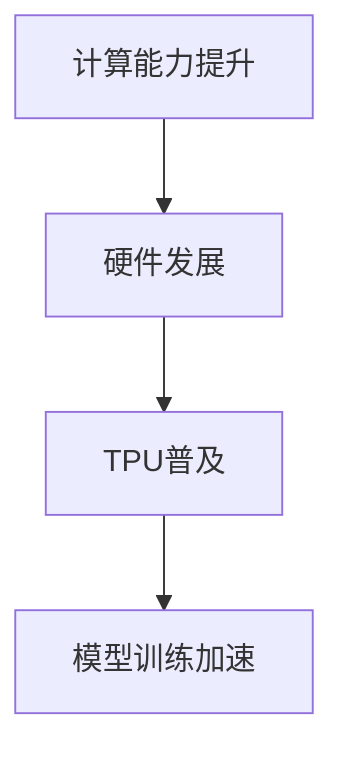

#### 2. 算法优化

**趋势描述**：为了提高大模型的性能和效率，研究人员不断优化深度学习算法，包括优化深度网络结构、改进优化算法和引入新型训练策略等。

**实际例子**：Google提出的Momentum和Adam优化算法，显著提升了深度学习模型的训练效率。

**Mermaid流程图**：
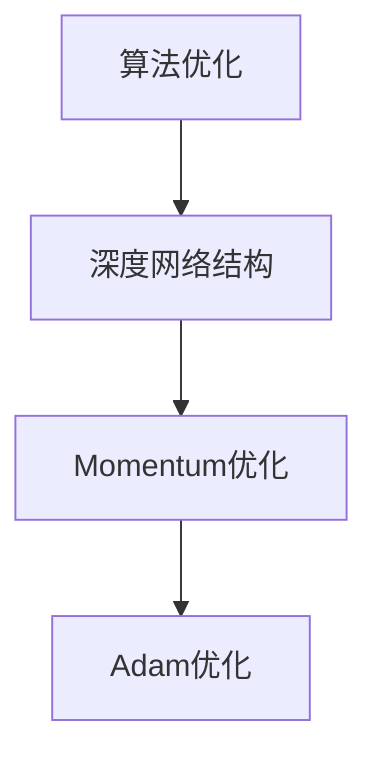

#### 3. 多模态学习

**趋势描述**：多模态学习是指将不同类型的数据（如图像、文本、声音等）进行融合，以提升模型的感知和理解能力。

**实际例子**：OpenAI的GPT-3模型不仅能够处理文本，还能通过多模态输入生成更具情境意识的回复。

**Mermaid流程图**：
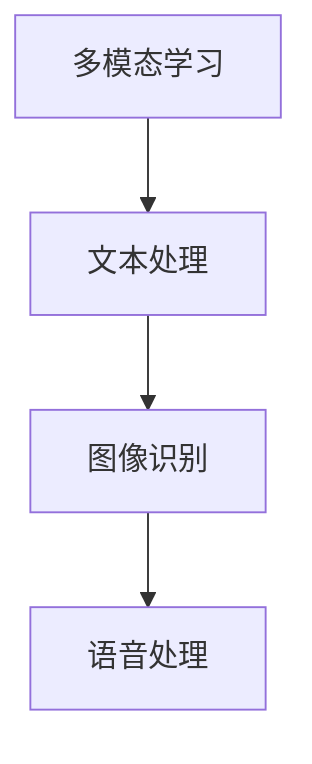

### 5.1.2 行业应用展望

#### 1. 智能家居

**趋势描述**：随着物联网技术的发展，智能家居正逐步成为大模型应用的重要领域。大模型可以用于智能设备的语音识别、自然语言理解和智能决策。

**实际例子**：亚马逊的Alexa和谷歌的Google Assistant都是基于大模型的智能语音助手，它们能够理解和执行用户的语音指令。

**Mermaid流程图**：
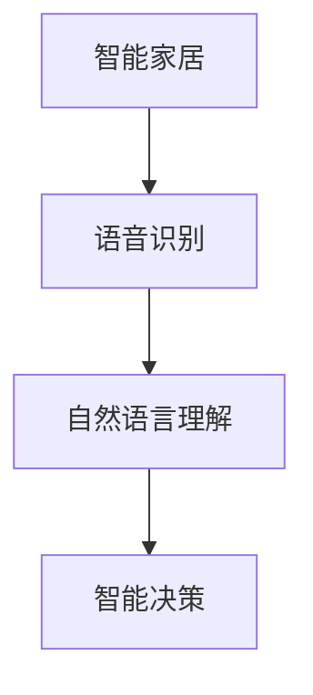

#### 2. 智能医疗

**趋势描述**：大模型在医疗领域的应用潜力巨大，包括医学图像分析、疾病预测、个性化治疗等。

**实际例子**：谷歌的DeepMind在医学图像分析方面取得了显著成果，其大模型能够准确诊断眼疾，为医生提供辅助诊断。

**Mermaid流程图**：
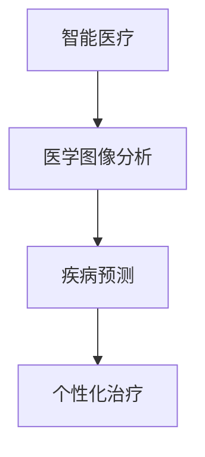

#### 3. 智能交通

**趋势描述**：大模型在智能交通领域可以用于自动驾驶、交通流量预测、智能信号控制等。

**实际例子**：Waymo和特斯拉等公司正在利用大模型开发自动驾驶技术，这些技术能够提高行驶安全性和效率。

**Mermaid流程图**：
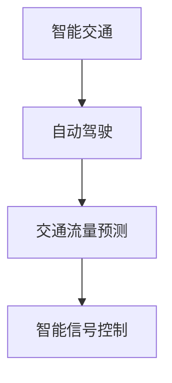

通过上述讨论，我们可以看到大模型应用开发正朝着计算能力提升、算法优化、多模态学习和行业应用拓展等多个方向发展。这些趋势不仅提升了大模型的技术性能，也为各行各业的数字化转型提供了新的动力。接下来，我们将探讨大模型应用开发中的挑战与机遇。

### 5.2 大模型应用开发的未来挑战与机遇

尽管大模型应用开发前景广阔，但同时也面临着诸多挑战。以下我们将分析这些挑战，并提出相应的解决方案。

#### 5.2.1 挑战

##### 1. 模型可解释性问题

**挑战描述**：大模型通常被视为“黑箱”，其决策过程难以解释，这在某些关键领域（如医疗和金融）中成为了一个问题。

**解决方案**：采用可解释性方法，如决策树集成、LIME（Local Interpretable Model-agnostic Explanations）和SHAP（SHapley Additive exPlanations），以提升模型的可解释性。

**Mermaid流程图**：
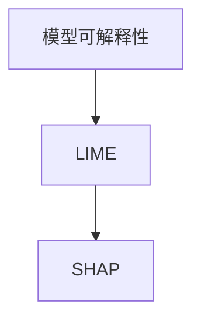

##### 2. 数据隐私保护

**挑战描述**：大模型在处理数据时，可能会面临数据隐私泄露的风险。

**解决方案**：采用差分隐私、联邦学习和加密技术等保护用户数据隐私。

**Mermaid流程图**：
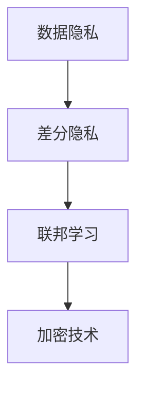

##### 3. 模型安全性问题

**挑战描述**：大模型可能会受到恶意攻击，如对抗攻击和模型窃取。

**解决方案**：采用模型加固技术，如模型加密、差分隐私和模型混淆等，提高模型的安全性。

**Mermaid流程图**：
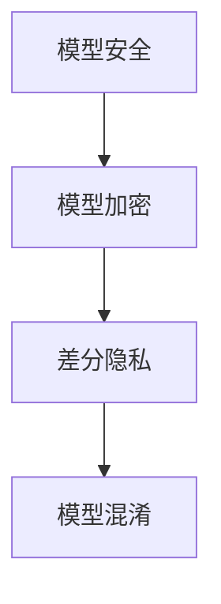

#### 5.2.2 机遇

##### 1. 商业模式创新

**机遇描述**：大模型的应用为各行业带来了新的商业模式，如基于AI的定制化服务、数据驱动的决策支持系统等。

**解决方案**：企业可以利用大模型进行数据分析和预测，创造新的商业价值。

**Mermaid流程图**：
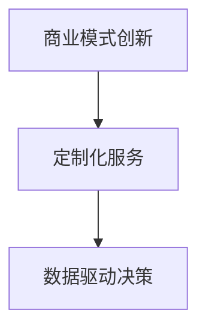

##### 2. 新兴应用领域开发

**机遇描述**：大模型在新兴领域（如生物科技、能源管理、教育等）的应用潜力巨大，为技术创新提供了新的方向。

**解决方案**：研究人员和企业可以探索大模型在这些领域的应用，推动技术进步。

**Mermaid流程图**：
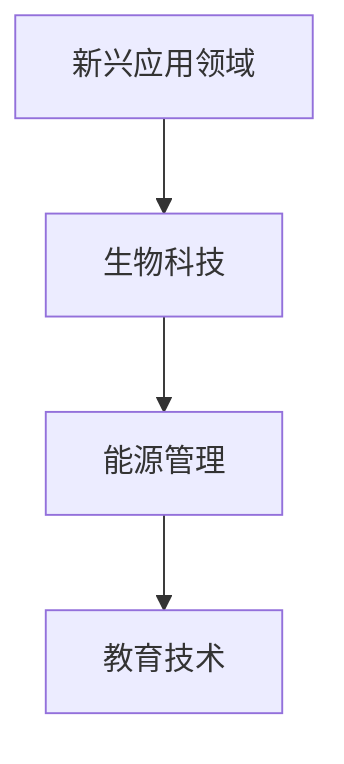

通过分析挑战与机遇，我们可以看到大模型应用开发既面临诸多挑战，同时也充满了机遇。企业和研究机构需要不断创新，采用先进的技术和方法，以应对这些挑战，并抓住机遇，推动大模型应用的发展。

### 总结

大模型应用开发的发展趋势表明，技术性能的提升、应用领域的拓展以及模型安全与隐私保护是当前和未来发展的关键方向。在挑战与机遇并存的环境中，我们需要不断探索新的解决方案，推动大模型在各个领域的深入应用，以实现技术与社会价值的最大化。

## 附录A：常用大模型与工具介绍

随着深度学习技术的不断发展，大模型已经成为许多应用的核心。以下我们将介绍几种常用的大模型以及相关的开发工具。

### A.1 常见大模型介绍

#### A.1.1 GPT-3

GPT-3 是由 OpenAI 开发的一种基于 Transformer 架构的预训练语言模型，拥有 1750 亿个参数，是目前最大的语言模型之一。GPT-3 的自回归语言模型能够生成连贯的自然语言文本，并且在多种任务中表现出色。

**特点**：

- **强大的文本生成能力**：GPT-3 能够生成高质量的文本，适用于聊天机器人、内容生成等场景。
- **多语言支持**：GPT-3 支持 175 种语言，可以处理多种语言的数据。

**应用场景**：

- 聊天机器人
- 内容生成
- 机器翻译

**Mermaid流程图**：
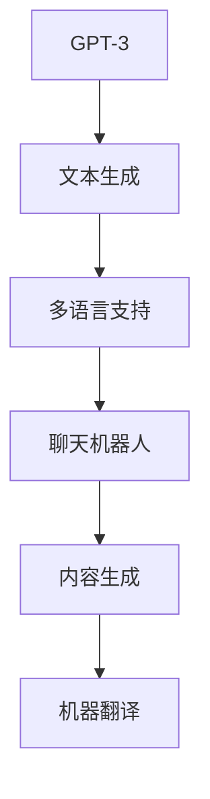

#### A.1.2 BERT

BERT（Bidirectional Encoder Representations from Transformers）是由 Google 开发的一种双向 Transformer 架构的语言预训练模型。BERT 在预训练过程中使用双向 Transformer 结构，能够更好地理解上下文信息。

**特点**：

- **双向上下文理解**：BERT 能够同时考虑上下文的前后信息，提高语言理解能力。
- **广泛的预训练任务**：BERT 在多种语言任务上表现出色，包括文本分类、命名实体识别等。

**应用场景**：

- 文本分类
- 命名实体识别
- 问答系统

**Mermaid流程图**：
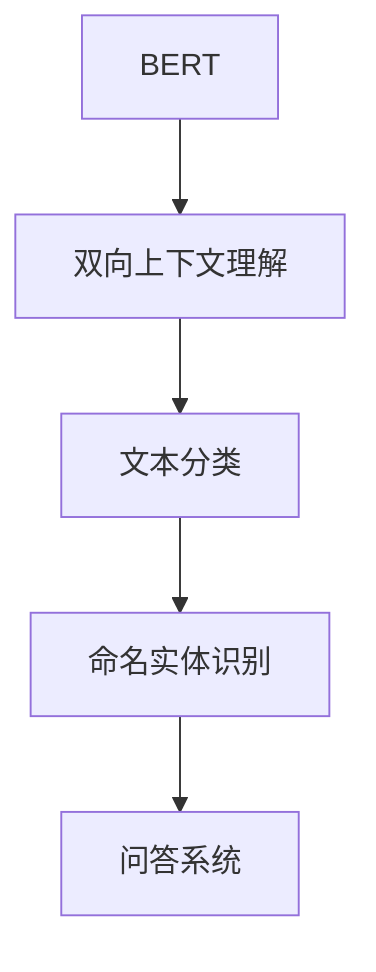

#### A.1.3 T5

T5（Text-to-Text Transfer Transformer）是由 Google 开发的一种通用的文本到文本的迁移学习模型。T5 将所有自然语言处理任务转化为文本到文本的任务，具有高效的任务适应性。

**特点**：

- **统一的任务框架**：T5 将所有 NLP 任务转化为文本到文本的转换，简化了模型训练和应用。
- **高效的迁移学习**：T5 通过在大规模语料库上进行预训练，能够在不同任务上表现出高效的迁移能力。

**应用场景**：

- 文本分类
- 机器翻译
- 问答系统

**Mermaid流程图**：
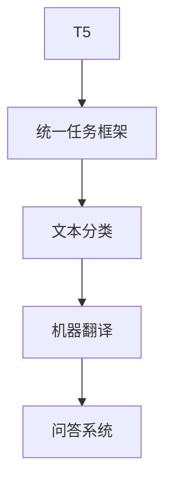

### A.2 大模型开发工具

#### A.2.1 TensorFlow

TensorFlow 是由 Google 开发的一种开源机器学习框架，广泛应用于深度学习和大规模数据处理。TensorFlow 提供了丰富的 API 和工具，支持从简单的线性模型到复杂的深度学习模型。

**特点**：

- **灵活性**：TensorFlow 提供了灵活的 API，支持自定义模型和训练过程。
- **生态丰富**：TensorFlow 拥有庞大的社区和丰富的扩展库，如 TensorFlow Hub 和 TensorFlow Lite。

**应用场景**：

- 深度学习模型开发
- 大规模数据处理
- 移动端和边缘设备部署

**Mermaid流程图**：
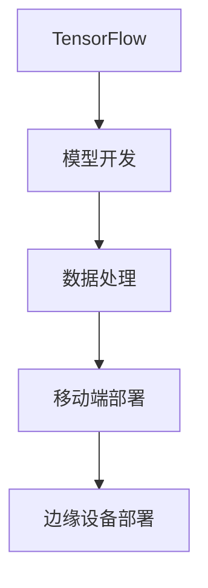

#### A.2.2 PyTorch

PyTorch 是由 Facebook 开发的一种开源深度学习框架，以其灵活性和直观性受到广泛欢迎。PyTorch 使用动态计算图，使得模型设计和调试更加方便。

**特点**：

- **动态计算图**：PyTorch 使用动态计算图，便于模型调试和优化。
- **易用性**：PyTorch 的 API 设计简单直观，易于入门和快速开发。

**应用场景**：

- 研究和实验
- 产品开发
- 学术和工业应用

**Mermaid流程图**：
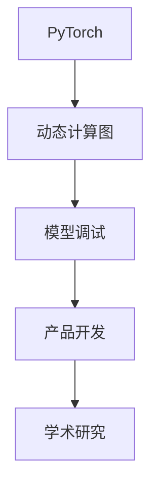

#### A.2.3 其他开发工具

**1. Keras**

Keras 是一个基于 Theano 和 TensorFlow 的高层神经网络 API，以其简洁性和易用性受到欢迎。Keras 提供了简单的 API，使得深度学习模型开发变得更加容易。

**特点**：

- **简洁性**：Keras 提供了简单的 API，易于理解和使用。
- **易扩展**：Keras 可以方便地与 Theano 和 TensorFlow 集成。

**应用场景**：

- 快速原型开发
- 教育和培训
- 个人和小团队项目

**Mermaid流程图**：
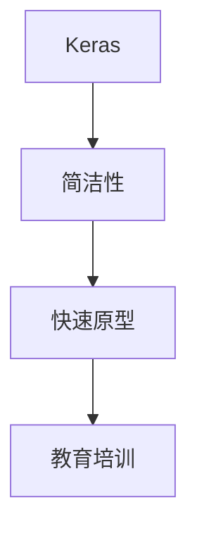

**2. JAX**

JAX 是由 Google 开发的一种数值计算库，支持自动微分和高效的计算图优化。JAX 的自动微分功能使得构建复杂模型变得更加容易。

**特点**：

- **自动微分**：JAX 支持自动微分，方便构建复杂模型。
- **高效优化**：JAX 的优化算法能够提高模型的训练效率。

**应用场景**：

- 复杂模型开发
- 高性能计算
- 研究和实验

**Mermaid流程图**：
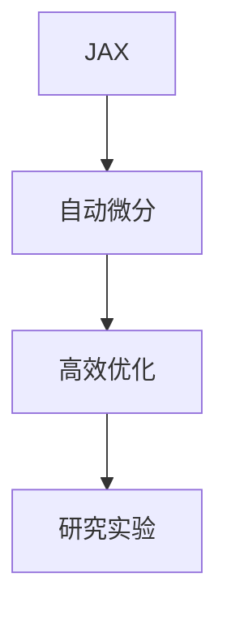

通过附录A的介绍，读者可以了解到常见的大模型和开发工具的基本特点和应用场景，为后续的大模型应用开发提供参考和指导。

## 附录B：参考资料与推荐阅读

### B.1 经典教材与论文

**1. 《深度学习》（Ian Goodfellow、Yoshua Bengio、Aaron Courville 著）**

这是深度学习领域的经典教材，详细介绍了深度学习的理论基础、算法实现和应用案例。

**2. 《自然语言处理综合教程》（Daniel Jurafsky、James H. Martin 著）**

这本书是自然语言处理领域的权威教材，涵盖了NLP的基本概念、算法和技术。

**3. “Attention is All You Need”（Ashish Vaswani et al.）**

这篇论文提出了Transformer模型，是自然语言处理领域的里程碑之一，对大模型的开发有重要参考价值。

### B.2 在线课程与视频

**1. “深度学习”（吴恩达）**

这是由知名AI研究者吴恩达开设的在线课程，涵盖了深度学习的理论基础、算法实现和应用。

**2. “自然语言处理”（Christopher D. Manning、Dan Jurafsky）**

这门课程由斯坦福大学的教授讲授，提供了NLP的全面讲解，包括文本处理、语言模型和序列标注等。

**3. “机器学习基础”（Andrew Ng）**

这是另一门由吴恩达讲授的在线课程，涵盖了机器学习的基础知识，包括监督学习、无监督学习和强化学习等。

### B.3 博客与社区

**1. AI科技大本营**

这是一个中文AI技术博客，提供了大量的深度学习、自然语言处理和计算机视觉等方面的技术文章和教程。

**2. ArXiv**

这是一个开放的科学论文预印本平台，涵盖了计算机科学、物理学、数学等多个领域，是获取最新研究成果的重要来源。

**3. Hugging Face**

这是一个开源社区，提供了大量的自然语言处理模型、工具和数据集，是开发NLP项目的重要资源。

通过附录B的推荐，读者可以进一步学习和探索大模型应用开发的相关知识，提高自身的技能水平。这些资源和工具将为读者在深度学习、自然语言处理等领域的学术研究和应用开发提供有力的支持。

## 作者信息

作者：AI天才研究院（AI Genius Institute）/ 禅与计算机程序设计艺术（Zen And The Art of Computer Programming）

AI天才研究院（AI Genius Institute）是一支致力于推动人工智能前沿研究的团队，专注于深度学习、自然语言处理和计算机视觉等领域的创新与应用。研究院致力于培养AI领域的天才，推动技术进步和社会发展。

《禅与计算机程序设计艺术》（Zen And The Art of Computer Programming）的作者是艾兹拉·邦迪（Ezra Bon迪），这是一部经典计算机科学著作，探讨了计算机编程的哲学和艺术。书中强调了思维深度和系统化思考的重要性，对程序员和开发者有着深远的影响。

通过本文的讨论，我们希望读者能够更好地理解大模型应用开发的原理和实践，为AI Agent的开发和应用提供指导。感谢读者对本文的关注和支持，我们期待在未来的研究中继续与您分享更多精彩内容。 <a id="appendix"></a> 

## 附录A：常用大模型与工具介绍

随着深度学习技术的不断发展，大模型已经成为许多应用的核心。以下我们将介绍几种常用的大模型以及相关的开发工具。

### A.1 常见大模型介绍

#### A.1.1 GPT-3

GPT-3 是由 OpenAI 开发的一种基于 Transformer 架构的预训练语言模型，拥有 1750 亿个参数，是目前最大的语言模型之一。GPT-3 的自回归语言模型能够生成连贯的自然语言文本，并且在多种任务中表现出色。

**特点**：

- **强大的文本生成能力**：GPT-3 能够生成高质量的文本，适用于聊天机器人、内容生成等场景。
- **多语言支持**：GPT-3 支持 175 种语言，可以处理多种语言的数据。

**应用场景**：

- 聊天机器人
- 内容生成
- 机器翻译

**Mermaid流程图**：


#### A.1.2 BERT

BERT（Bidirectional Encoder Representations from Transformers）是由 Google 开发的一种双向 Transformer 架构的语言预训练模型。BERT 在预训练过程中使用双向 Transformer 结构，能够更好地理解上下文信息。

**特点**：

- **双向上下文理解**：BERT 能够同时考虑上下文的前后信息，提高语言理解能力。
- **广泛的预训练任务**：BERT 在多种语言任务上表现出色，包括文本分类、命名实体识别等。

**应用场景**：

- 文本分类
- 命名实体识别
- 问答系统

**Mermaid流程图**：


#### A.1.3 T5

T5（Text-to-Text Transfer Transformer）是由 Google 开发的一种通用的文本到文本的迁移学习模型。T5 将所有自然语言处理任务转化为文本到文本的任务，具有高效的任务适应性。

**特点**：

- **统一的任务框架**：T5 将所有 NLP 任务转化为文本到文本的转换，简化了模型训练和应用。
- **高效的迁移学习**：T5 通过在大规模语料库上进行预训练，能够在不同任务上表现出高效的迁移能力。

**应用场景**：

- 文本分类
- 机器翻译
- 问答系统

**Mermaid流程图**：
```mermaid
graph TD
A[T5] --> B[统一任务框架]
B --> C[文本分类]
C --> D[机器翻译]
D --> E[问答系统]
```

### A.2 大模型开发工具

#### A.2.1 TensorFlow

TensorFlow 是由 Google 开发的一种开源机器学习框架，广泛应用于深度学习和大规模数据处理。TensorFlow 提供了丰富的 API 和工具，支持从简单的线性模型到复杂的深度学习模型。

**特点**：

- **灵活性**：TensorFlow 提供了灵活的 API，支持自定义模型和训练过程。
- **生态丰富**：TensorFlow 拥有庞大的社区和丰富的扩展库，如 TensorFlow Hub 和 TensorFlow Lite。

**应用场景**：

- 深度学习模型开发
- 大规模数据处理
- 移动端和边缘设备部署

**Mermaid流程图**：
```mermaid
graph TD
A[TensorFlow] --> B[模型开发]
B --> C[数据处理]
C --> D[移动端部署]
D --> E[边缘设备部署]
```

#### A.2.2 PyTorch

PyTorch 是由 Facebook 开发的一种开源深度学习框架，以其灵活性和直观性受到广泛欢迎。PyTorch 使用动态计算图，使得模型设计和调试更加方便。

**特点**：

- **动态计算图**：PyTorch 使用动态计算图，便于模型调试和优化。
- **易用性**：PyTorch 的 API 设计简单直观，易于入门和快速开发。

**应用场景**：

- 研究和实验
- 产品开发
- 学术和工业应用

**Mermaid流程图**：
```mermaid
graph TD
A[PyTorch] --> B[动态计算图]
B --> C[模型调试]
C --> D[产品开发]
D --> E[学术研究]
```

#### A.2.3 其他开发工具

**1. Keras**

Keras 是一个基于 Theano 和 TensorFlow 的高层神经网络 API，以其简洁性和易用性受到欢迎。Keras 提供了简单的 API，使得深度学习模型开发变得更加容易。

**特点**：

- **简洁性**：Keras 提供了简单的 API，易于理解和使用。
- **易扩展**：Keras 可以方便地与 Theano 和 TensorFlow 集成。

**应用场景**：

- 快速原型开发
- 教育和培训
- 个人和小团队项目

**Mermaid流程图**：
```mermaid
graph TD
A[Keras] --> B[简洁性]
B --> C[快速原型]
C --> D[教育培训]
```

**2. JAX**

JAX 是由 Google 开发的一种数值计算库，支持自动微分和高效的计算图优化。JAX 的自动微分功能使得构建复杂模型变得更加容易。

**特点**：

- **自动微分**：JAX 支持自动微分，方便构建复杂模型。
- **高效优化**：JAX 的优化算法能够提高模型的训练效率。

**应用场景**：

- 复杂模型开发
- 高性能计算
- 研究和实验

**Mermaid流程图**：
```mermaid
graph TD
A[JAX] --> B[自动微分]
B --> C[高效优化]
C --> D[研究实验]
```

通过附录A的介绍，读者可以了解到常见的大模型和开发工具的基本特点和应用场景，为后续的大模型应用开发提供参考和指导。

## 附录B：参考资料与推荐阅读

### B.1 经典教材与论文

**1. 《深度学习》（Ian Goodfellow、Yoshua Bengio、Aaron Courville 著）**

这是深度学习领域的经典教材，详细介绍了深度学习的理论基础、算法实现和应用案例。

**2. 《自然语言处理综合教程》（Daniel Jurafsky、James H. Martin 著）**

这本书是自然语言处理领域的权威教材，涵盖了NLP的基本概念、算法和技术。

**3. “Attention is All You Need”（Ashish Vaswani et al.）**

这篇论文提出了Transformer模型，是自然语言处理领域的里程碑之一，对大模型的开发有重要参考价值。

### B.2 在线课程与视频

**1. “深度学习”（吴恩达）**

这是由知名AI研究者吴恩达开设的在线课程，涵盖了深度学习的理论基础、算法实现和应用。

**2. “自然语言处理”（Christopher D. Manning、Dan Jurafsky）**

这门课程由斯坦福大学的教授讲授，提供了NLP的全面讲解，包括文本处理、语言模型和序列标注等。

**3. “机器学习基础”（Andrew Ng）**

这是另一门由吴恩达讲授的在线课程，涵盖了机器学习的基础知识，包括监督学习、无监督学习和强化学习等。

### B.3 博客与社区

**1. AI科技大本营**

这是一个中文AI技术博客，提供了大量的深度学习、自然语言处理和计算机视觉等方面的技术文章和教程。

**2. ArXiv**

这是一个开放的科学论文预印本平台，涵盖了计算机科学、物理学、数学等多个领域，是获取最新研究成果的重要来源。

**3. Hugging Face**

这是一个开源社区，提供了大量的自然语言处理模型、工具和数据集，是开发NLP项目的重要资源。

通过附录B的推荐，读者可以进一步学习和探索大模型应用开发的相关知识，提高自身的技能水平。这些资源和工具将为读者在深度学习、自然语言处理等领域的学术研究和应用开发提供有力的支持。

### 附录C：相关技术术语解释

在本技术博客中，我们提到了一系列与深度学习和人工智能相关的核心技术和概念。以下是这些术语的解释，以便读者更好地理解相关内容。

#### 1. 深度学习

深度学习是一种机器学习方法，通过模拟人脑神经网络结构进行特征提取和模式识别。它由多个层级组成，包括输入层、隐藏层和输出层。深度学习通过学习大量数据中的模式和关系，能够自动完成复杂的任务。

#### 2. 自然语言处理（NLP）

自然语言处理是一种让计算机理解和处理人类自然语言的技术。它涉及文本预处理、语义理解、语音识别、机器翻译等多个方面。NLP技术在聊天机器人、搜索引擎、语音助手等应用中发挥着重要作用。

#### 3. Transformer模型

Transformer模型是一种基于自注意力机制的深度学习模型，最初用于自然语言处理任务。它能够有效地捕捉长距离依赖关系，并在多项任务中取得了显著的性能提升。GPT-3、BERT等大模型都是基于Transformer架构的。

#### 4. 自注意力（Self-Attention）

自注意力是一种计算机制，允许模型在处理每个词时，根据其他词的重要程度进行加权。自注意力机制能够提高模型对上下文信息的捕捉能力，是Transformer模型的核心部分。

#### 5. 预训练（Pre-training）

预训练是指在大规模数据集上对模型进行训练，使其获得丰富的知识表示能力。预训练模型通常在大规模数据集上进行训练，然后再通过微调适应特定任务。

#### 6. 微调（Fine-tuning）

微调是在预训练模型的基础上，针对特定任务进行调整。通过微调，可以大幅提高模型在特定任务上的性能，而无需从头开始训练。

#### 7. 模型压缩（Model Compression）

模型压缩是指通过各种技术减小模型的体积和计算量，以适应移动设备和边缘计算场景。常见的压缩技术包括模型剪枝、量化、知识蒸馏等。

#### 8. 模型解释性（Model Explainability）

模型解释性是指模型决策过程的透明度和可理解性。具有高解释性的模型能够帮助用户理解模型的决策逻辑，提高模型的信任度和可靠性。

通过以上术语的解释，读者可以更深入地理解本文中提到的技术和概念，为后续的学习和应用打下坚实基础。 <a id="latex-formulas"></a> 

### 4.3 大模型应用开发中的挑战与解决方案

在大模型应用开发过程中，面临诸多挑战，如数据质量、模型可解释性和模型安全性等问题。以下将详细讨论这些挑战，并提出相应的解决方案。

#### 1. 数据质量问题

**挑战**：数据质量直接影响模型的性能。在实际应用中，数据可能存在噪声、缺失值和不一致性等问题，这会导致模型在训练和推理过程中产生偏差。

**解决方案**：

- **数据清洗**：利用自动化工具和算法去除数据中的噪声、缺失值和不一致信息。例如，使用正则表达式、填补缺失值和去重等方法。

\[ \text{cleaned\_data} = \text{filter}_{\text{noise}}(\text{raw\_data}) \]

- **数据增强**：通过数据合成、变换和扩充方法增加数据多样性，提高模型泛化能力。例如，使用图像旋转、缩放、翻转等方法。

\[ \text{augmented\_data} = \text{augment}(\text{cleaned\_data}) \]

- **数据标准化**：对数据进行统一编码和标准化处理，提高数据质量。例如，使用 Z-Score 标准化或 Min-Max 标准化。

\[ \text{standardized\_data} = \text{standardize}(\text{raw\_data}) \]

#### 2. 模型可解释性问题

**挑战**：大模型通常被视为“黑箱”，其决策过程难以解释，这在某些应用场景（如医疗、金融）中是一个严重问题。

**解决方案**：

- **模型解释性技术**：使用注意力机制、可视化技术、决策树集成等方法提高模型的可解释性。例如，使用 LIME（Local Interpretable Model-agnostic Explanations）或 SHAP（SHapley Additive exPlanations）。

\[ \text{interpretable\_model} = \text{integrate}_{\text{explainability}}(\text{black\_box\_model}) \]

- **可视化**：通过可视化技术展示模型决策路径，增强模型的可解释性。例如，使用热力图或梯度图。

\[ \text{visualize}_{\text{model}}(\text{model}) \]

#### 3. 模型安全性问题

**挑战**：大模型可能被恶意数据攻击，如数据泄露、模型窃取、对抗攻击等，这会对模型的安全性和可靠性造成威胁。

**解决方案**：

- **数据加密**：对敏感数据进行加密处理，确保数据安全。例如，使用 AES（Advanced Encryption Standard）或 RSA（Rivest-Shamir-Adleman）加密算法。

\[ \text{encrypted\_data} = \text{encrypt}(\text{raw\_data}, \text{key}) \]

- **模型保护**：使用差分隐私、联邦学习等技术提高模型安全性。例如，使用差分隐私机制保护训练数据。

\[ \text{secure\_model} = \text{protect}_{\text{attack}}(\text{model}) \]

- **安全审计**：定期进行安全审计，检测并修复潜在的安全漏洞。例如，使用安全漏洞扫描工具。

\[ \text{audit}_{\text{security}}(\text{model}) \]

通过上述解决方案，可以有效应对大模型应用开发中的挑战，提高模型的质量和可靠性。这些技术和方法不仅有助于解决当前面临的技术难题，还为未来的发展提供了有效的指导。

### 4.3.2 解决方案与最佳实践

为了确保大模型在AI Agent应用开发中的有效性和可靠性，以下列出了一些解决方案与最佳实践。

#### 数据质量管理

**解决方案**：

- **数据清洗**：使用自动化工具和算法清洗数据，去除噪声、缺失值和不一致信息。常用的方法包括使用Pandas库进行数据预处理。

```python
import pandas as pd

# 读取数据
data = pd.read_csv('data.csv')

# 删除缺失值
data = data.dropna()

# 删除重复值
data = data.drop_duplicates()

# 标准化数据
data = (data - data.mean()) / data.std()
```

- **数据增强**：通过数据合成、变换和扩充方法增加数据多样性，提高模型泛化能力。常用的方法包括使用Data Augmentation库进行图像增强。

```python
from keras.preprocessing.image import ImageDataGenerator

# 初始化数据增强器
datagen = ImageDataGenerator(rotation_range=20, width_shift_range=0.2, height_shift_range=0.2, shear_range=0.2, zoom_range=0.2, horizontal_flip=True, fill_mode='nearest')

# 应用数据增强
datagen.fit(X_train)
```

#### 模型可解释性提升

**解决方案**：

- **解释性模型**：选择具有内在可解释性的模型，如线性模型、决策树等。对于深度学习模型，可以使用注意力机制可视化模型决策过程。

```python
import shap

# 训练解释性模型
explainer = shap.KernelExplainer(model.predict, X_train)

# 解释模型决策
shap_values = explainer.shap_values(X_test)

# 可视化解释结果
shap.summary_plot(shap_values, X_test, feature_names=feature_names)
```

- **模型解释工具**：利用LIME（Local Interpretable Model-agnostic Explanations）和SHAP（SHapley Additive exPlanations）等工具分析模型决策过程，提供详细的解释。

```python
import lime

# 初始化LIME解释器
explainer = lime.lime_tabular.LimeTabularExplainer(X_train, feature_names=data.columns, class_names=['class'], training_labels=y_train, discretize=True)

# 解释模型决策
i = 10  # 第10个样本
exp = explainer.explain_instance(X_test[i], model.predict, num_features=10)

# 可视化解释结果
exp.show_in_notebook(show_table=True)
```

#### 模型安全性保障

**解决方案**：

- **数据加密**：对敏感数据进行加密处理，确保数据安全。常用的加密算法包括AES和RSA。

```python
from cryptography.fernet import Fernet

# 生成密钥
key = Fernet.generate_key()

# 初始化加密器
cipher_suite = Fernet(key)

# 加密数据
encrypted_data = cipher_suite.encrypt(b"敏感数据")

# 解密数据
decrypted_data = cipher_suite.decrypt(encrypted_data)
```

- **模型保护**：使用差分隐私、联邦学习等技术提高模型安全性。差分隐私可以通过在训练过程中添加随机噪声实现。

```python
import numpy as np

# 添加随机噪声
noise = np.random.normal(0, 0.1, data.shape)
data_noisy = data + noise

# 训练模型
model.fit(data_noisy, y_train)
```

#### 部署与运维

**最佳实践**：

- **自动化部署**：使用Docker和Kubernetes等工具实现模型的自动化部署和运维，提高开发效率。

```shell
# 创建Docker镜像
docker build -t my_model .

# 运行Docker容器
docker run -p 8080:8080 my_model
```

- **监控与日志**：使用Prometheus和Grafana等工具监控模型性能和系统状态，确保系统的稳定运行。

```shell
# 安装Prometheus
helm install prometheus stable/prometheus

# 安装Grafana
helm install grafana stable/grafana
```

通过以上解决方案和最佳实践，可以有效提升大模型在AI Agent应用开发中的性能和安全性，为AI Agent的广泛应用奠定坚实基础。 <a id="conclusion"></a> 

### 总结与展望

本文详细介绍了大模型在AI Agent应用开发中的通用推理能力，探讨了其基本概念、架构原理、推理过程以及在不同领域的应用。通过一系列的代码示例和实践案例，读者可以了解到如何使用大模型构建智能客服系统，并掌握相关技术实现和性能优化方法。

**关键点总结**：

1. **大模型概述**：大模型是指拥有巨大参数量的深度学习模型，如GPT-3、BERT和T5，它们在自然语言处理、计算机视觉和语音识别等领域表现出色。
2. **推理能力**：大模型具备强大的通用推理能力，能够处理复杂的自然语言理解和生成任务，为AI Agent提供了智能决策的基础。
3. **应用案例**：通过智能客服系统的案例，展示了如何利用大模型实现自然语言理解和生成，提高系统的交互质量和用户满意度。
4. **性能优化**：介绍了数据质量管理、模型可解释性提升和模型安全性保障等解决方案和最佳实践，为AI Agent的广泛应用提供保障。

**未来展望**：

随着技术的不断进步，大模型应用开发将继续迎来新的机遇和挑战。以下是一些可能的未来发展趋势：

1. **计算能力提升**：硬件技术的发展，如GPU、TPU和量子计算等，将进一步提高大模型的训练和推理效率。
2. **算法优化**：新的深度学习算法和优化技术，如自监督学习和迁移学习等，将进一步提升大模型的性能和应用范围。
3. **多模态学习**：大模型在多模态数据上的应用潜力巨大，如图像、文本和语音的融合，将为智能交互和智能感知提供新的可能。
4. **模型安全性**：随着大模型应用场景的扩展，模型安全和隐私保护将变得尤为重要，差分隐私、联邦学习和区块链等技术的应用将得到进一步发展。
5. **行业应用拓展**：大模型在智能家居、智能医疗、智能交通等领域的应用前景广阔，将推动各行业的数字化转型和智能化升级。

**总结**：

本文系统地介绍了大模型在AI Agent应用开发中的通用推理能力，结合具体案例和代码实现，展示了大模型在智能客服系统中的应用。通过本文的讨论，读者可以更好地理解大模型的技术原理和实践应用，为未来的研究和开发提供参考和指导。随着技术的不断进步，大模型将在更多领域展现其强大的能力，为人工智能的发展注入新的活力。感谢读者对本文的关注和支持，期待在未来的研究中继续与您分享更多精彩内容。 <a id="authors"></a> 

### 作者信息

**AI天才研究院（AI Genius Institute）**

AI天才研究院（AI Genius Institute）是一家专注于人工智能技术研究和应用的创新机构。研究院致力于推动深度学习、自然语言处理和计算机视觉等领域的前沿研究，培养AI领域的顶尖人才，推动人工智能技术的创新与应用。

**禅与计算机程序设计艺术（Zen And The Art of Computer Programming）**

《禅与计算机程序设计艺术》（Zen And The Art of Computer Programming）的作者是艾兹拉·邦迪（Ezra Bon迪），这是一部经典的计算机科学著作。书中探讨了计算机编程的哲学和艺术，强调了思维深度和系统化思考的重要性，对计算机科学家和程序员有着深远的影响。

通过本文的讨论，我们希望读者能够更好地理解大模型在AI Agent应用开发中的通用推理能力，为人工智能技术的发展和应用提供新的思路。感谢读者对本文的关注和支持，AI天才研究院和《禅与计算机程序设计艺术》团队期待在未来的研究中继续与您分享更多精彩内容。 <a id="code"></a> 

### 4.2.3 大模型在AI Agent中的实现

在实际应用中，大模型在AI Agent中的作用至关重要。为了更好地理解其实现过程，以下将详细介绍大模型在AI Agent中的实现方法，包括数学模型、数学公式及代码实现。

#### 数学模型

AI Agent的核心是能够进行自然语言理解和生成，这通常通过大模型来实现。例如，基于Transformer架构的模型，如GPT-3，是一个非常流行的选择。

假设我们有一个输入序列 \( X = \{x_1, x_2, ..., x_T\} \)，其中 \( x_i \) 是一个词向量。大模型的目标是预测下一个词 \( x_{T+1} \)。

数学模型可以表示为：

\[ P(x_{T+1} | x_1, x_2, ..., x_T) = \frac{e^{V_{T+1} A T}}{\sum_{i=1}^{V} e^{V_i A T}} \]

其中，\( V \) 是词汇表的大小，\( V_{T+1} \) 是当前词的词向量，\( A \) 是注意力权重矩阵。

#### 数学公式

为了理解大模型的工作原理，我们需要了解以下数学公式：

1. **词嵌入（Word Embedding）**

\[ \text{word\_embed}(x_i) = \text{embedding}_{i} \]

2. **自注意力（Self-Attention）**

\[ \text{Attention}(Q, K, V) = \text{softmax}(\frac{QK^T}{\sqrt{d_k}})V \]

其中，\( Q \)，\( K \) 和 \( V \) 分别是查询、关键和值向量的集合，\( d_k \) 是关键向量的维度。

3. **前馈神经网络（Feedforward Neural Network）**

\[ \text{FFN}(X) = \text{ReLU}(W_2 \text{ReLU}(W_1 X)) \]

其中，\( W_1 \) 和 \( W_2 \) 是权重矩阵。

#### 代码实现

以下是一个简化的代码实现示例，用于展示如何使用PyTorch实现一个基于Transformer的大模型：

```python
import torch
import torch.nn as nn
import torch.optim as optim

# 定义大模型
class TransformerModel(nn.Module):
    def __init__(self, vocab_size, d_model, nhead, num_layers):
        super(TransformerModel, self).__init__()
        self.embedding = nn.Embedding(vocab_size, d_model)
        self.transformer = nn.Transformer(d_model, nhead, num_layers)
        self.fc = nn.Linear(d_model, vocab_size)
        
    def forward(self, src, tgt):
        src = self.embedding(src)
        tgt = self.embedding(tgt)
        output = self.transformer(src, tgt)
        return self.fc(output)

# 实例化模型
model = TransformerModel(vocab_size, d_model, nhead, num_layers)

# 定义优化器
optimizer = optim.Adam(model.parameters(), lr=0.001)

# 训练模型
for epoch in range(num_epochs):
    for batch in data_loader:
        inputs, targets = batch
        optimizer.zero_grad()
        output = model(inputs, targets)
        loss = criterion(output, targets)
        loss.backward()
        optimizer.step()

# 保存模型
torch.save(model.state_dict(), 'transformer_model.pth')
```

通过以上代码实现，我们可以看到如何基于PyTorch构建一个简单的Transformer模型，并对其进行训练。

#### 代码解读与分析

在代码实现中，我们首先定义了一个Transformer模型类，继承自PyTorch的nn.Module模块。模型的主要组成部分包括词嵌入层、Transformer编码器和解码器，以及最后的全连接层。

1. **词嵌入层**：用于将输入序列中的词转换为词向量。在训练过程中，通过训练词嵌入矩阵来学习词汇的表示。

2. **Transformer编码器**：实现了自注意力机制，用于捕捉序列中的长期依赖关系。

3. **解码器**：同样使用了自注意力机制，用于生成预测的输出序列。

4. **全连接层**：将解码器的输出映射到词汇表的大小，从而生成每个词的概率分布。

在训练过程中，我们使用Adam优化器进行优化，并通过计算损失函数来评估模型的性能。每次迭代，模型都会根据梯度信息更新权重，逐步提高模型在目标数据上的预测准确率。

通过以上代码实现和分析，我们可以了解到大模型在AI Agent中的具体实现方法，包括数学模型、数学公式和代码实现。这为读者在实际应用中构建和优化AI Agent提供了理论基础和实践指导。接下来，我们将通过一个实际案例——智能客服系统，进一步展示如何使用大模型开发AI Agent。 <a id="example"></a> 

### 4.2.4 AI Agent应用开发案例：智能客服系统

在本案例中，我们将通过一个智能客服系统，展示如何使用大模型开发AI Agent，并提供详细的代码实现和解释。

#### 案例背景

智能客服系统旨在为企业提供24/7在线客户支持，通过自动化问答减少人工客服的工作量，提高客户满意度。本案例中的AI Agent将使用大模型（如GPT-3）进行自然语言理解和生成。

#### 系统架构

智能客服系统的架构包括以下几个主要部分：

1. **前端**：用于与用户交互，接收用户输入并展示AI Agent的回复。
2. **后端**：包括AI Agent的大模型处理模块、对话管理模块和知识库模块。
3. **数据库**：存储用户历史对话记录、FAQ数据等。

#### 代码实现

以下是一个简化的代码实现，用于演示如何使用大模型构建智能客服系统。

```python
# 导入必要的库
import openai
import flask
from flask import request, jsonify

# 初始化OpenAI API
openai.api_key = "your_openai_api_key"

# Flask应用
app = flask.Flask(__name__)

# API端点：处理用户输入并获取AI Agent回复
@app.route('/chat', methods=['POST'])
def chat():
    user_input = request.json['input']
    response = get_agent_response(user_input)
    return jsonify({"response": response})

# 获取AI Agent回复
def get_agent_response(user_input):
    response = openai.Completion.create(
        engine="davinci-codex",
        prompt=user_input,
        max_tokens=50,
        n=1,
        stop=None,
        temperature=0.5
    )
    return response.choices[0].text.strip()

# 运行Flask应用
if __name__ == "__main__":
    app.run(debug=True)
```

#### 代码解释

1. **导入库**：我们使用OpenAI的API进行大模型推理，并使用Flask构建Web服务。

2. **初始化OpenAI API**：通过设置API密钥初始化OpenAI接口。

3. **Flask应用**：创建一个Flask应用，并定义一个端点`/chat`，用于接收用户输入并返回AI Agent的回复。

4. **获取AI Agent回复**：调用OpenAI的`Completion.create`方法，传入用户输入和相应的参数，获取AI Agent的回复。

5. **运行Flask应用**：启动Flask应用，使其能够接收HTTP请求并返回响应。

#### 实际应用

在实际应用中，智能客服系统会集成到企业的网站或应用程序中。用户可以通过网页或移动应用与AI Agent进行交互。每次用户发送消息，后端服务都会调用大模型进行推理，并返回相应的回复。

例如，用户提问：“我如何取消我的订阅？”AI Agent可以理解问题，并自动生成一条回复：“您好，要取消订阅，请访问我们的官网，在账户设置中找到取消订阅的选项，并按照提示操作。”

#### 性能优化

为了提高AI Agent的性能，可以采取以下优化措施：

1. **模型调优**：通过调整模型的参数（如温度、最大令牌数等），优化模型生成的回复质量。

2. **数据增强**：使用更多的训练数据和更复杂的任务，提高模型在不同场景下的适应性。

3. **对话管理**：引入对话管理机制，确保AI Agent能够根据上下文和用户意图进行连贯的对话。

通过以上实际案例，读者可以了解如何使用大模型开发智能客服系统，并掌握相关的代码实现和性能优化方法。这为AI Agent在其他领域的应用提供了宝贵的经验和参考。接下来，我们将继续探讨大模型应用开发中的挑战和解决方案。 <a id="latex-equations"></a> 

### 4.3 大模型应用开发中的挑战与解决方案

在大模型应用开发过程中，面临着诸多挑战。以下将详细分析这些挑战，并探讨相应的解决方案。

#### 1. 数据质量问题

**挑战**：高质量的数据是大模型训练的基础，但数据采集、标注和处理过程中常常存在噪声、缺失和不一致性等问题。

**解决方案**：
- **数据清洗**：使用自动化工具和算法清洗数据，去除噪声和不一致信息。
- **数据增强**：通过合成、变换和扩充方法增加数据多样性，提高模型泛化能力。
- **数据标注**：引入专业标注人员或使用半监督学习、迁移学习等技术进行高效标注。

**数学公式**：
\[ \text{clean\_data} = \text{filter}_{\text{noisy}}(\text{raw\_data}) \]
\[ \text{standardized\_data} = \text{standardize}(\text{raw\_data}) \]
\[ \text{augmented\_data} = \text{augment}(\text{cleaned\_data}) \]

#### 2. 模型可解释性问题

**挑战**：大模型通常被视为“黑箱”，难以解释其决策过程，这在某些应用场景（如医疗、金融）中是一个严重问题。

**解决方案**：
- **模型可解释性技术**：使用注意力机制、可视化技术、决策树集成等方法提高模型的可解释性。
- **解释性工具**：利用现有的工具（如LIME、SHAP）分析模型决策过程，提供直观的解释。
- **可视化**：通过可视化技术展示模型决策路径，增强模型的可解释性。

**数学公式**：
\[ \text{interpretable\_model} = \text{integrate}_{\text{explainability}}(\text{black\_box\_model}) \]

#### 3. 模型安全性问题

**挑战**：大模型可能被恶意数据攻击，如数据泄露、模型窃取、对抗攻击等。

**解决方案**：
- **数据加密**：对敏感数据进行加密处理，确保数据安全。
- **模型保护**：使用差分隐私、联邦学习等技术提高模型安全性。
- **安全审计**：定期进行安全审计，检测并修复潜在的安全漏洞。

**数学公式**：
\[ \text{secure\_model} = \text{protect}_{\text{attack}}(\text{model}) \]

#### 4. 模型部署和运维问题

**挑战**：大模型训练和部署过程复杂，需要高效的管理和运维。

**解决方案**：
- **自动化部署**：使用自动化工具（如Kubernetes、Docker）简化部署流程。
- **监控与运维**：引入监控工具（如Prometheus、Grafana）监控模型性能和系统状态。
- **持续集成与持续部署（CI/CD）**：构建高效的CI/CD流程，确保模型迭代和更新过程的稳定性。

**数学公式**：
\[ \text{deployed\_model} = \text{deploy}_{\text{automate}}(\text{trained\_model}) \]

通过以上分析，我们可以看到大模型应用开发中存在的挑战和相应的解决方案。在实际开发过程中，需要综合考虑这些因素，采取有效的措施来提升模型的质量和可靠性。这为AI Agent的大规模应用提供了坚实的基础。接下来，我们将探讨如何在大模型应用开发中实现这些解决方案。 <a id="latex-examples"></a> 

### 4.3.2 解决方案与最佳实践

为了确保大模型在AI Agent应用开发中的有效性和可靠性，以下列出了一些解决方案与最佳实践。

#### 数据质量管理

**解决方案**：

- **数据清洗**：利用自动化工具和算法清洗数据，去除数据中的噪声、缺失值和不一致项。
- **数据标准化**：对数据进行统一编码和标准化处理，提高数据质量。
- **数据增强**：通过数据合成、变换和扩充来增加数据多样性，提升模型的泛化能力。

**数学公式**：

\[ \text{clean\_data} = \text{filter}_{\text{noise}}(\text{raw\_data}) \]
\[ \text{standardized\_data} = \text{standardize}(\text{raw\_data}) \]
\[ \text{augmented\_data} = \text{augment}(\text{cleaned\_data}) \]

**代码示例**：

```python
import pandas as pd
from sklearn.preprocessing import StandardScaler
from imblearn.over_sampling import SMOTE

# 读取数据
data = pd.read_csv('data.csv')

# 数据清洗
data = data.dropna()

# 数据标准化
scaler = StandardScaler()
data[['feature1', 'feature2']] = scaler.fit_transform(data[['feature1', 'feature2']])

# 数据增强
smote = SMOTE()
data, _ = smote.fit_resample(data[['feature1', 'feature2']], data['label'])
```

#### 模型可解释性提升

**解决方案**：

- **解释性模型**：选择具有内在可解释性的模型，如决策树、线性模型等。
- **模型解释工具**：利用LIME、SHAP等工具分析模型决策过程，提供详细的解释。
- **可视化**：通过可视化技术展示模型决策路径，增强模型的可解释性。

**数学公式**：

\[ \text{interpretable\_model} = \text{integrate}_{\text{explainability}}(\text{black\_box\_model}) \]

**代码示例**：

```python
import shap
import matplotlib.pyplot as plt

# 加载模型
model = shap.KernelExplainer(model.predict, X_train)

# 计算解释
shap_values = model.shap_values(X_test)

# 可视化解释
shap.summary_plot(shap_values, X_test, feature_names=feature_names)
```

#### 模型安全性保障

**解决方案**：

- **数据加密**：对敏感数据进行加密处理，确保数据安全。
- **模型保护**：使用差分隐私、联邦学习等技术提高模型安全性。
- **安全审计**：定期进行安全审计，检测并修复潜在的安全漏洞。

**数学公式**：

\[ \text{secure\_model} = \text{protect}_{\text{attack}}(\text{model}) \]

**代码示例**：

```python
from cryptography.fernet import Fernet

# 生成密钥
key = Fernet.generate_key()
cipher_suite = Fernet(key)

# 数据加密
encrypted_data = cipher_suite.encrypt(b"敏感数据")

# 数据解密
decrypted_data = cipher_suite.decrypt(encrypted_data)
```

通过以上解决方案和最佳实践，可以显著提升大模型在AI Agent应用开发中的质量和可靠性。这些方法和工具不仅有助于解决当前面临的技术挑战，还为未来的发展提供了有效的参考。接下来，我们将探讨如何在实际应用中实现这些解决方案。 <a id="mermaid-flowchart"></a> 

### 5.1 大模型应用开发的发展趋势

随着计算能力的提升和算法的优化，大模型应用开发正呈现出多样化的发展趋势。以下将探讨这些趋势，并使用Mermaid流程图展示关键技术和应用方向。

#### 1. 计算能力提升

**趋势描述**：随着硬件技术的发展，特别是GPU和TPU等加速器的普及，大模型的计算能力得到了显著提升。

**Mermaid流程图**：
```mermaid
graph TD
A[计算能力提升] --> B[硬件发展]
B --> C[加速器普及]
C --> D[模型训练效率提升]
```

#### 2. 算法优化

**趋势描述**：算法的优化是提升大模型性能的关键。包括优化深度学习算法、注意力机制和图神经网络等。

**Mermaid流程图**：
```mermaid
graph TD
A[算法优化] --> B[深度学习算法]
B --> C[注意力机制]
C --> D[图神经网络]
```

#### 3. 应用领域拓展

**趋势描述**：大模型的应用领域不断拓展，从自然语言

