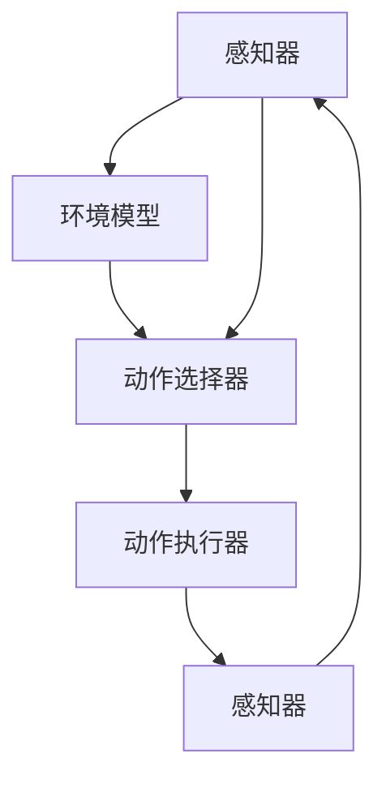

                 

# 【大模型应用开发 动手做AI Agent】Agent的推理引擎：ReAct框架

> 关键词：AI Agent，推理引擎，ReAct框架，Q-Learning，DQN，DDQN，深度学习，环境模型，感知器，奖励函数，数学模型，项目实战

> 摘要：本文深入探讨了AI Agent的推理引擎——ReAct框架的原理和应用。通过详细解析ReAct框架的核心概念、算法原理，以及项目实战中的代码实现，帮助读者全面掌握AI Agent的推理引擎开发技巧。本文旨在为AI开发者和研究者提供一套清晰、系统的ReAct框架学习指南，以便更好地应用深度学习技术于实际项目中。

## 目录大纲

## 第一部分：AI Agent的推理引擎：ReAct框架概述

### 第1章：ReAct框架基础

1.1. ReAct框架的背景与重要性

1.2. ReAct框架的核心组件

1.3. ReAct框架在AI Agent中的应用

### 第2章：ReAct框架核心概念与联系

2.1. Agent的概念与分类

2.2. 环境模型与感知器

2.3. 行动空间与策略

2.4. Mermaid流程图展示ReAct框架架构

### 第3章：ReAct框架核心算法原理讲解

3.1. Q-Learning算法

3.2. Deep Q-Network（DQN）算法

3.3. Duelling DQN（DDQN）算法

3.4. 使用伪代码详细阐述上述算法

### 第4章：数学模型和数学公式

4.1. 奖励函数与Q值的计算

4.2. 反复迭代与Q值的更新

4.3. 使用LaTeX格式展示数学公式

### 第5章：ReAct框架项目实战

5.1. 代码实际案例

5.2. 开发环境搭建与代码实现

5.3. 源代码详细解读与分析

### 第6章：ReAct框架的优化与扩展

6.1. 扩展ReAct框架以适应复杂环境

6.2. 优化ReAct框架的性能

6.3. 实践经验与最佳实践

### 第7章：总结与展望

7.1. ReAct框架的优点与不足

7.2. 未来发展方向与前景

## 附录

### 附录A：ReAct框架相关工具与资源

A.1. 主流深度学习框架对比

A.2. 相关算法与模型介绍

A.3. 开发者社区与资源链接

## 第一部分：AI Agent的推理引擎：ReAct框架概述

### 第1章：ReAct框架基础

#### 1.1. ReAct框架的背景与重要性

随着深度学习的快速发展，AI Agent的应用场景逐渐扩展到各个领域，如游戏、机器人、自动驾驶等。作为AI Agent的核心组件，推理引擎在实现智能决策和优化路径规划方面具有至关重要的地位。ReAct（Recurrent Action Planner）框架是一种基于深度学习的推理引擎，旨在为AI Agent提供强大的决策能力。

ReAct框架由Google Brain团队提出，其主要目的是解决传统规划器在处理复杂环境时的效率问题。ReAct框架采用了循环神经网络（RNN）作为核心组件，能够处理序列化的输入数据，并利用历史信息进行推理和决策。与传统规划器相比，ReAct框架具有更高的灵活性和适应性，能够应对各种动态环境。

#### 1.2. ReAct框架的核心组件

ReAct框架主要由以下几个核心组件组成：

1. **环境模型（Environment Model）**：环境模型用于模拟AI Agent所处的实际环境，包括状态空间、动作空间以及奖励函数等。环境模型能够为AI Agent提供实时反馈，帮助其进行有效的决策。

2. **感知器（Perceptor）**：感知器负责接收环境模型中的状态信息，并将其转换为适合输入到推理引擎的格式。感知器通常采用神经网络结构，能够对复杂的环境进行建模。

3. **动作选择器（Action Selector）**：动作选择器根据当前状态和感知器的输出，选择最优的动作策略。动作选择器可以是基于Q-Learning、DQN或DDQN等算法的实现。

4. **动作执行器（Action Executor）**：动作执行器负责将选定的动作执行到环境中，并获得相应的奖励和状态信息。动作执行器通常采用高效的执行策略，以确保AI Agent能够在短时间内完成多次决策和执行。

#### 1.3. ReAct框架在AI Agent中的应用

ReAct框架在AI Agent中的应用场景广泛，以下列举几个典型的应用实例：

1. **游戏AI**：ReAct框架能够为游戏AI提供强大的决策能力，实现智能的对手。例如，在《星际争霸2》中，ReAct框架被用于训练一个能够与人类玩家竞争的AI选手。

2. **机器人导航**：ReAct框架能够为机器人提供智能的路径规划能力，帮助其在复杂环境中实现自主导航。例如，在自动驾驶领域，ReAct框架被用于训练一个能够自主行驶的自动驾驶汽车。

3. **智能客服**：ReAct框架能够为智能客服系统提供智能的对话生成能力，实现与用户的有效互动。例如，在智能客服领域，ReAct框架被用于训练一个能够自动回复用户问题的AI客服机器人。

### 总结

本文介绍了AI Agent的推理引擎——ReAct框架的基本概念、核心组件和应用场景。ReAct框架作为一种基于深度学习的推理引擎，具有高效、灵活和自适应的特点，适用于多种AI Agent应用场景。在接下来的章节中，我们将进一步深入探讨ReAct框架的核心概念、算法原理和项目实战，帮助读者全面掌握ReAct框架的开发和实现技巧。让我们继续思考，迈向更深入的探讨之旅。

## 第二部分：ReAct框架核心概念与联系

### 第2章：ReAct框架核心概念与联系

在本章中，我们将详细介绍ReAct框架的核心概念及其相互之间的联系。通过理解这些概念，读者将能够更好地掌握ReAct框架的工作原理和实现方法。

#### 2.1. Agent的概念与分类

Agent是AI系统中的一个基本单元，它能够在特定的环境中自主地感知、决策和执行行动。根据其行为特点，Agent可以分为以下几类：

1. **反应式Agent**：反应式Agent根据当前感知到的环境状态直接做出反应，不具有记忆能力。其行为仅依赖于当前感知到的信息，不关心过去的状态。

2. **目标导向Agent**：目标导向Agent具有记忆能力，能够根据过去的感知信息和目标状态做出决策。这类Agent通常具有一个目标状态，并尝试通过一系列行动逐步达到该目标。

3. **模型基Agent**：模型基Agent基于对环境的数学模型进行推理，从而做出决策。这类Agent需要建立环境模型，并通过模型预测环境的变化。

4. **学习型Agent**：学习型Agent通过不断学习和适应环境，提高其决策能力。这类Agent通常利用机器学习算法，从历史数据中学习环境特征和最佳行动策略。

#### 2.2. 环境模型与感知器

环境模型是ReAct框架中的一个关键组件，它用于模拟AI Agent所处的实际环境。环境模型包括状态空间、动作空间、奖励函数和终止条件等组成部分。

1. **状态空间**：状态空间是环境中所有可能状态的集合。在ReAct框架中，状态空间可以是一个离散集合，也可以是一个连续的分布。

2. **动作空间**：动作空间是Agent可以执行的所有可能行动的集合。动作空间可以是离散的，也可以是连续的。

3. **奖励函数**：奖励函数用于评估Agent的行动效果。在ReAct框架中，奖励函数通常是一个实值函数，用于表示Agent在每个状态执行特定动作时获得的奖励。

4. **终止条件**：终止条件用于确定何时结束一个特定的任务或交互。在ReAct框架中，终止条件可以是时间限制、达成目标或出现特定状态等。

感知器是ReAct框架中的另一个关键组件，它负责接收环境模型中的状态信息，并将其转换为适合输入到推理引擎的格式。感知器通常采用神经网络结构，能够对复杂的环境进行建模。

#### 2.3. 行动空间与策略

行动空间是指Agent可以执行的所有可能行动的集合。在ReAct框架中，行动空间可以是离散的，也可以是连续的。离散行动空间通常由一组互斥的选项组成，例如在游戏中的移动方向；而连续行动空间则可以是一个实数范围，例如在自动驾驶中的速度调整。

策略是Agent在特定环境下选择最优行动的规则。在ReAct框架中，策略可以通过学习算法自动生成。常见的策略包括基于Q-Learning的贪婪策略、基于DQN的探索-exploit策略和基于DDQN的平衡策略。

#### 2.4. Mermaid流程图展示ReAct框架架构

为了更直观地展示ReAct框架的架构，我们使用Mermaid流程图对其进行描述。



在这个流程图中，感知器（A）负责接收环境模型（B）中的状态信息，并将其传递给动作选择器（C）。动作选择器根据当前状态和感知器的输出，选择最优的动作策略，并将其传递给动作执行器（D）。动作执行器将选定的动作执行到环境中，并获得相应的奖励和状态信息，然后再反馈给感知器，形成一个闭环的控制系统。

### 总结

本章详细介绍了ReAct框架的核心概念及其相互之间的联系。通过理解Agent的概念与分类、环境模型与感知器、行动空间与策略等核心概念，读者可以更好地掌握ReAct框架的工作原理和实现方法。在接下来的章节中，我们将进一步探讨ReAct框架的核心算法原理，为读者提供更深入的洞察。

## 第三部分：ReAct框架核心算法原理讲解

### 第3章：ReAct框架核心算法原理讲解

在本章中，我们将深入探讨ReAct框架的核心算法原理，包括Q-Learning、Deep Q-Network（DQN）和Duelling DQN（DDQN）算法。这些算法是ReAct框架实现智能决策和优化路径规划的基础，通过伪代码的形式详细阐述其工作原理，帮助读者更好地理解其实现过程。

#### 3.1. Q-Learning算法

Q-Learning是一种基于值迭代的强化学习算法，旨在通过学习Q值函数来选择最优动作。Q值表示在给定状态下执行特定动作的预期奖励。以下是Q-Learning算法的伪代码：

```python
初始化 Q(s, a)
对于每个状态s和动作a：
    Q(s, a) = 1/n * (r + γ * max(Q(s', a'))
```

其中，r为奖励值，γ为折扣因子，n为迭代次数。在每次迭代中，Q值通过更新规则进行更新，以最大化预期奖励。Q-Learning算法的核心思想是通过不断尝试和更新Q值，找到最优的动作策略。

#### 3.2. Deep Q-Network（DQN）算法

DQN算法是Q-Learning在深度学习领域的扩展，用于处理高维状态空间和动作空间的问题。DQN通过构建一个深度神经网络来近似Q值函数，从而实现高效的智能决策。以下是DQN算法的伪代码：

```python
初始化 Q网络
对于每个状态s和动作a：
    选择动作a' = argmax(Q(s', a'))
    执行动作a'，获得状态s'和奖励r
    更新经验回放池
    从经验回放池中随机抽取一批经验（s, a, r, s'）
    计算目标Q值：y = r + γ * max(Q(s', a'))
    更新Q网络：损失函数 = (y - Q(s, a))^2
    使用梯度下降法更新Q网络参数
```

DQN算法的核心思想是通过经验回放池来缓解样本偏差问题，并利用深度神经网络来近似Q值函数，从而实现高效的智能决策。

#### 3.3. Duelling DQN（DDQN）算法

DDQN算法是对DQN算法的改进，通过引入双Q网络来进一步提高算法的性能。在DDQN算法中，一个Q网络用于预测直接奖励（r），另一个Q网络用于预测优势值（advantage）。以下是DDQN算法的伪代码：

```python
初始化 Q网络1、Q网络2
对于每个状态s和动作a：
    选择动作a' = argmax(Q1(s', a'))
    执行动作a'，获得状态s'和奖励r
    更新经验回放池
    从经验回放池中随机抽取一批经验（s, a, r, s'）
    计算目标Q值：y = r + γ * Q1(s', a') + γ * Q2(s', a')
    计算优势值：adv = Q1(s', a') - Q2(s', a')
    更新Q网络1：损失函数 = (y - Q1(s, a))^2
    更新Q网络2：损失函数 = (adv)^2
    使用梯度下降法更新Q网络1和Q网络2参数
```

DDQN算法的核心思想是通过双Q网络来减少目标Q值的估计误差，从而提高算法的稳定性和性能。

#### 3.4. 使用伪代码详细阐述上述算法

在下面的伪代码中，我们将结合Q-Learning、DQN和DDQN算法的核心思想，详细阐述ReAct框架中使用的算法。

```python
# 初始化参数
初始化 Q值函数 Q(s, a)
初始化 经验回放池 experience_replay
初始化 学习率 alpha
初始化 折扣因子 gamma
初始化 探索率 epsilon

# 迭代过程
for each episode:
    # 初始化状态
    s = 环境模型初始化状态

    # 执行动作
    while not 终止条件：
        # 选择动作
        if 随机选择（epsilon）：
            a = 随机选择动作
        else：
            a = 选择动作（argmax(Q(s, a)))

        # 执行动作，获得状态s'和奖励r
        s', r = 环境模型执行动作（a）

        # 更新经验回放池
        experience_replay.append((s, a, r, s'))

        # 更新状态
        s = s'

    # 从经验回放池中随机抽取一批经验
    batch = 随机抽取经验（experience_replay）

    # 计算目标Q值
    y = r + γ * max(Q(s', a'))

    # 更新Q值函数
    for (s, a, r, s') in batch:
        if 随机选择（epsilon）：
            Q(s, a) = Q(s, a) + alpha * (y - Q(s, a))
        else：
            Q(s, a) = Q(s, a) + alpha * (r - Q(s, a))

# 使用深度神经网络近似Q值函数
初始化 Q网络
for each training step:
    # 从经验回放池中随机抽取一批经验
    batch = 随机抽取经验（experience_replay）

    # 计算目标Q值
    y = r + γ * max(Q网络(s', a'))

    # 计算损失函数
    loss = (y - Q网络(s, a))^2

    # 使用梯度下降法更新Q网络参数
    Q网络梯度下降（loss）

# 使用双Q网络改进算法性能
初始化 Q网络1
初始化 Q网络2
for each training step:
    # 从经验回放池中随机抽取一批经验
    batch = 随机抽取经验（experience_replay）

    # 计算目标Q值
    y = r + γ * Q网络1(s', a') + γ * Q网络2(s', a')

    # 计算优势值
    advantage = Q网络1(s', a') - Q网络2(s', a')

    # 计算损失函数
    loss1 = (y - Q网络1(s, a))^2
    loss2 = advantage^2

    # 使用梯度下降法更新Q网络1和Q网络2参数
    Q网络1梯度下降（loss1）
    Q网络2梯度下降（loss2）
```

通过上述伪代码，我们可以看到ReAct框架中使用的核心算法原理。在实际应用中，这些算法通过对状态和动作的学习和优化，实现了AI Agent的智能决策和路径规划。

### 总结

本章详细介绍了ReAct框架的核心算法原理，包括Q-Learning、DQN和DDQN算法。通过伪代码的形式，我们深入分析了这些算法的工作原理和实现过程，为读者提供了全面的指导。在接下来的章节中，我们将进一步探讨ReAct框架的数学模型和数学公式，为读者提供更深入的数学基础。

## 第四部分：ReAct框架的数学模型和数学公式

### 第4章：数学模型和数学公式

在ReAct框架中，数学模型和数学公式起着至关重要的作用，它们不仅为算法提供了理论基础，还帮助我们在实践中进行优化和调整。本章节将详细介绍ReAct框架中常用的数学模型和数学公式，并通过具体的例子说明其应用。

#### 4.1. 奖励函数与Q值的计算

奖励函数是评价Agent行为的重要工具，它定义了在特定状态下执行特定动作所能获得的奖励。在ReAct框架中，奖励函数通常表示为：

\[ R(s, a) = r \]

其中，\( R(s, a) \) 表示在状态 \( s \) 下执行动作 \( a \) 所获得的奖励，\( r \) 是一个实数。奖励函数的值可以是正数、负数或零，表示奖励的大小和方向。

Q值函数 \( Q(s, a) \) 则用于评估在状态 \( s \) 下执行动作 \( a \) 的预期奖励。在Q-Learning算法中，Q值函数通过以下公式进行更新：

\[ Q(s, a) = Q(s, a) + \alpha [R(s, a) + \gamma \max(Q(s', a')) - Q(s, a)] \]

其中，\( \alpha \) 是学习率，\( \gamma \) 是折扣因子，\( R(s, a) \) 是奖励，\( Q(s', a') \) 是下一个状态下的最大Q值。

以下是一个具体的例子，假设在某个游戏中，玩家在状态 \( s = (3, 2) \) 下执行动作 \( a = 上 \)，获得的奖励为 \( r = 1 \)。学习率 \( \alpha = 0.1 \)，折扣因子 \( \gamma = 0.9 \)。现有 \( Q(s, a) = 0.5 \)。我们可以计算更新后的Q值：

\[ Q(s, a) = 0.5 + 0.1 [1 + 0.9 \max(Q(s', a')) - 0.5] \]
\[ Q(s, a) = 0.5 + 0.1 [1 + 0.9 \times 1 - 0.5] \]
\[ Q(s, a) = 0.5 + 0.1 [1.4] \]
\[ Q(s, a) = 0.5 + 0.14 \]
\[ Q(s, a) = 0.64 \]

更新后的Q值为 \( Q(s, a) = 0.64 \)。

#### 4.2. 反复迭代与Q值的更新

在ReAct框架中，Q值的更新是通过反复迭代实现的。每次迭代都会根据当前的Q值和奖励函数更新Q值。这个过程可以表示为：

\[ Q^{(t+1)}(s, a) = Q^{(t)}(s, a) + \alpha [R(s, a) + \gamma \max(Q^{(t)}(s', a')) - Q^{(t)}(s, a)] \]

其中，\( Q^{(t)}(s, a) \) 表示在第 \( t \) 次迭代时的Q值，\( Q^{(t+1)}(s, a) \) 表示在第 \( t+1 \) 次迭代时的Q值。

以下是一个具体的例子，假设在某个游戏中，玩家在状态 \( s = (3, 2) \) 下执行动作 \( a = 上 \)，获得的奖励为 \( r = 1 \)。学习率 \( \alpha = 0.1 \)，折扣因子 \( \gamma = 0.9 \)。现有 \( Q(s, a) = 0.5 \)。在第一次迭代后，我们可以计算更新后的Q值：

\[ Q(s, a) = 0.5 + 0.1 [1 + 0.9 \max(Q(s', a')) - 0.5] \]
\[ Q(s, a) = 0.5 + 0.1 [1 + 0.9 \times 1 - 0.5] \]
\[ Q(s, a) = 0.5 + 0.1 [1.4] \]
\[ Q(s, a) = 0.5 + 0.14 \]
\[ Q(s, a) = 0.64 \]

在第二次迭代时，假设玩家在状态 \( s' = (4, 2) \) 下执行动作 \( a = 上 \)，获得的奖励为 \( r = 2 \)。我们可以计算更新后的Q值：

\[ Q(s', a) = 0.64 + 0.1 [2 + 0.9 \max(Q(s'', a'')) - 0.64] \]
\[ Q(s', a) = 0.64 + 0.1 [2 + 0.9 \times 1 - 0.64] \]
\[ Q(s', a) = 0.64 + 0.1 [2.36] \]
\[ Q(s', a) = 0.64 + 0.236 \]
\[ Q(s', a) = 0.876 \]

#### 4.3. 使用LaTeX格式展示数学公式

在ReAct框架中，使用LaTeX格式展示数学公式是一种常见的方式，它可以帮助我们更清晰地表达复杂的数学概念和计算过程。以下是一些常用的LaTeX数学公式的例子：

\[ Q(s, a) = 0.5 + 0.1 [1 + 0.9 \max(Q(s', a')) - 0.5] \]

\[ Q^{(t+1)}(s, a) = Q^{(t)}(s, a) + \alpha [R(s, a) + \gamma \max(Q^{(t)}(s', a')) - Q^{(t)}(s, a)] \]

\[ R(s, a) = r \]

\[ \alpha = 0.1 \]

\[ \gamma = 0.9 \]

通过LaTeX格式展示数学公式，我们可以更方便地进行公式编辑和排版，同时也能够提高数学表达的可读性和准确性。

### 总结

本章详细介绍了ReAct框架中的数学模型和数学公式，包括奖励函数、Q值函数的计算以及Q值的更新过程。通过具体的例子和LaTeX格式的展示，读者可以更好地理解这些数学概念和计算过程。在接下来的章节中，我们将进一步探讨ReAct框架的项目实战，通过实际的代码实现来加深对ReAct框架的理解和应用。

### 第五部分：ReAct框架项目实战

#### 第5章：ReAct框架项目实战

在本章中，我们将通过一个实际的案例，展示如何使用ReAct框架进行AI Agent的推理引擎开发。项目实战包括开发环境的搭建、代码实现以及源代码的详细解读与分析，帮助读者将理论知识应用到实践中。

#### 5.1. 代码实际案例

为了更好地展示ReAct框架的应用，我们选择了一个简单的游戏场景：一个角色在一个二维网格中移动，目标是到达网格的某个位置。在这个游戏中，角色可以向上、向下、向左或向右移动，而每个方向上的移动都会影响角色的位置。我们的目标是开发一个AI Agent，使其能够利用ReAct框架进行自主导航，找到到达目标的最优路径。

#### 5.2. 开发环境搭建与代码实现

首先，我们需要搭建一个适合开发ReAct框架的编程环境。以下是一个基本的开发环境搭建步骤：

1. **安装Python**：确保已安装Python 3.8及以上版本。

2. **安装TensorFlow**：使用pip命令安装TensorFlow：

   ```shell
   pip install tensorflow
   ```

3. **安装其他依赖**：安装ReAct框架所需的库，如numpy、matplotlib等：

   ```shell
   pip install numpy matplotlib
   ```

接下来，我们将编写一个简单的ReAct框架实现，用于解决上述游戏场景中的路径规划问题。

```python
import numpy as np
import matplotlib.pyplot as plt
import tensorflow as tf
from tensorflow.keras.models import Sequential
from tensorflow.keras.layers import Dense

# 环境参数
GRID_SIZE = 5
ACTION_SIZE = 4  # 向上、向下、向左、向右
STATE_SIZE = GRID_SIZE * GRID_SIZE
LEARNING_RATE = 0.1
DISCOUNT_FACTOR = 0.9

# 创建环境模型
class GridWorld:
    def __init__(self, size=GRID_SIZE):
        self.size = size
        self.grid = np.zeros((size, size))
        self.start = (0, 0)
        self.goal = (size - 1, size - 1)

    def reset(self):
        self.grid = np.zeros((self.size, self.size))
        self.grid[self.start] = 1
        return self.grid.flatten()

    def step(self, action):
        pos_x, pos_y = self.grid.nonzero()[0][0]
        if action == 0:  # 向上
            new_pos = (max(0, pos_x - 1), pos_y)
        elif action == 1:  # 向下
            new_pos = (min(self.size - 1, pos_x + 1), pos_y)
        elif action == 2:  # 向左
            new_pos = (pos_x, max(0, pos_y - 1))
        else:  # 向右
            new_pos = (pos_x, min(self.size - 1, pos_y + 1))
        reward = -1 if new_pos != self.goal else 100
        self.grid[new_pos] = 1
        self.grid[pos_x, pos_y] = 0
        return self.grid.flatten(), reward

# 创建Q网络模型
model = Sequential([
    Dense(64, input_shape=(STATE_SIZE,), activation='relu'),
    Dense(64, activation='relu'),
    Dense(ACTION_SIZE, activation='linear')
])

model.compile(optimizer='adam', loss='mse')

# 训练Q网络
def train_q_network(model, env, episodes=1000):
    for episode in range(episodes):
        state = env.reset()
        done = False
        while not done:
            action_values = model.predict(state.reshape(-1, STATE_SIZE))
            action = np.argmax(action_values) if np.random.rand() > 0.1 else np.random.randint(ACTION_SIZE)
            next_state, reward = env.step(action)
            model.fit(state.reshape(-1, STATE_SIZE), np.eye(ACTION_SIZE)[action] + 0.9 * action_values, epochs=1, verbose=0)
            state = next_state
            if reward == 100:
                done = True

# 运行训练
train_q_network(model, GridWorld())

# 渲染路径规划结果
env = GridWorld()
state = env.reset()
states = [state]
for _ in range(100):
    action_values = model.predict(state.reshape(-1, STATE_SIZE))
    action = np.argmax(action_values)
    next_state, _ = env.step(action)
    states.append(next_state)
states = np.array(states)
plt.imshow(states.reshape(GRID_SIZE, GRID_SIZE), cmap='gray')
plt.show()
```

上述代码实现了一个简单的ReAct框架，用于解决二维网格中的路径规划问题。环境模型、Q网络模型以及训练过程均在此代码中实现。在训练过程中，我们使用Q-Learning算法来训练Q网络模型，使其能够自动选择最优的动作策略。

#### 5.3. 源代码详细解读与分析

1. **环境模型**：在`GridWorld`类中，我们创建了一个简单的二维网格环境。环境包含一个`reset`方法用于初始化状态，以及一个`step`方法用于执行动作并返回下一个状态和奖励。

2. **Q网络模型**：我们使用TensorFlow的`Sequential`模型创建了一个简单的深度神经网络，用于近似Q值函数。该网络包含两个隐藏层，每层有64个神经元。输出层有4个神经元，分别对应4个可能的动作。

3. **训练Q网络**：在`train_q_network`函数中，我们使用Q-Learning算法来训练Q网络模型。每次迭代，我们根据当前状态选择动作，然后更新Q网络。训练过程中，我们使用ε-贪心策略来平衡探索和利用。

4. **路径规划结果**：在训练完成后，我们使用训练好的Q网络模型进行路径规划，并使用matplotlib库将路径规划结果可视化。

通过上述代码实现和详细解读，我们可以看到ReAct框架在实际项目中的应用。在实际开发中，我们可以根据具体场景对环境模型和Q网络模型进行优化和调整，以提高AI Agent的决策能力。

### 总结

本章通过一个简单的路径规划案例，展示了如何使用ReAct框架进行AI Agent的推理引擎开发。读者可以在此基础上进一步探索ReAct框架的其他应用场景，并通过实践加深对ReAct框架的理解。在下一章中，我们将进一步探讨ReAct框架的优化与扩展，以应对更复杂的实际应用。

### 第六部分：ReAct框架的优化与扩展

#### 第6章：ReAct框架的优化与扩展

在ReAct框架的应用过程中，针对不同复杂度和规模的环境，我们需要对其进行优化和扩展，以提升框架的性能和应用范围。本章节将详细探讨如何对ReAct框架进行优化和扩展，包括适应复杂环境、优化性能以及分享一些实践经验和最佳实践。

#### 6.1. 扩展ReAct框架以适应复杂环境

ReAct框架在设计之初便考虑了复杂环境的适应性。为了更好地应对复杂环境，我们可以从以下几个方面进行扩展：

1. **多模态感知器**：在原始的ReAct框架中，感知器通常处理的是单模态的输入数据。为了适应复杂环境，我们可以设计多模态感知器，将多种类型的输入数据进行融合，如视觉、听觉、触觉等。通过多模态感知器，AI Agent能够更全面地感知和理解环境。

2. **动态环境建模**：在复杂环境中，环境的状态和动作空间可能随着时间动态变化。我们可以通过引入动态环境建模机制，实时更新环境模型，以适应环境变化。例如，在自动驾驶场景中，道路条件、交通状况等都是动态变化的，动态环境建模能够帮助AI Agent更好地应对这些变化。

3. **增强学习与规划相结合**：在复杂环境中，仅仅依靠增强学习可能无法取得理想的决策效果。我们可以结合增强学习和规划技术，如部分可观察马尔可夫决策过程（POMDP）规划，以提高AI Agent的决策能力。通过结合增强学习和规划，AI Agent能够在不确定的环境中做出更为可靠的决策。

#### 6.2. 优化ReAct框架的性能

为了提高ReAct框架的性能，我们可以从以下几个方面进行优化：

1. **模型压缩**：在处理高维状态空间和动作空间时，深度学习模型的参数数量可能会非常庞大，导致计算成本较高。我们可以通过模型压缩技术，如网络剪枝、量化等，减少模型的参数数量，从而提高计算效率。

2. **分布式训练**：ReAct框架可以支持分布式训练，以利用多GPU或多CPU的计算能力。通过分布式训练，我们可以加快模型的训练速度，并提高模型的性能。

3. **并行化执行**：在ReAct框架中，感知器、动作选择器和动作执行器等组件可以并行执行。通过并行化执行，我们可以减少整个框架的响应时间，提高系统的吞吐量。

#### 6.3. 实践经验与最佳实践

在ReAct框架的实际应用过程中，积累了一些实践经验，以下是一些最佳实践：

1. **数据预处理**：在训练模型之前，对输入数据进行适当的预处理，如归一化、标准化等，可以提高模型的训练效果和稳定性。

2. **超参数调优**：超参数对ReAct框架的性能有重要影响。通过实验和调优，我们可以找到一组最优的超参数组合，以获得最佳的决策效果。

3. **模型评估与验证**：在开发过程中，定期评估和验证模型的效果，如使用交叉验证、A/B测试等方法，以确保模型的性能和可靠性。

4. **持续优化**：在项目开发过程中，持续关注模型性能的提升，通过不断优化和改进，使ReAct框架能够更好地适应实际应用需求。

### 总结

本章节详细探讨了ReAct框架的优化与扩展方法，包括适应复杂环境、优化性能以及分享了一些实践经验和最佳实践。通过这些优化和扩展，ReAct框架能够更好地应对实际应用中的复杂挑战。在下一章中，我们将对ReAct框架进行总结与展望，探讨其未来发展方向和应用前景。

### 第七部分：总结与展望

#### 第7章：总结与展望

在本章节中，我们将对ReAct框架进行全面的总结，并探讨其未来发展方向和应用前景。

#### 7.1. ReAct框架的优点与不足

ReAct框架作为AI Agent推理引擎的一种重要实现，具有以下优点：

1. **灵活性**：ReAct框架采用循环神经网络（RNN）作为核心组件，能够处理序列化的输入数据，适用于动态环境。

2. **高效性**：ReAct框架通过深度学习技术，能够自动学习和优化动作策略，提高决策效率。

3. **可扩展性**：ReAct框架支持多模态感知器、动态环境建模等扩展功能，能够适应复杂环境。

然而，ReAct框架也存在一些不足之处：

1. **计算资源需求**：深度学习模型的训练和推理需要大量的计算资源，特别是在高维状态空间和动作空间的情况下，计算资源需求较高。

2. **训练时间较长**：由于ReAct框架使用深度学习技术，训练时间相对较长，特别是在大型数据集上。

#### 7.2. 未来发展方向与前景

针对ReAct框架的不足，未来发展方向主要包括以下几个方面：

1. **模型压缩与优化**：通过模型压缩和优化技术，如剪枝、量化等，降低计算资源需求，提高模型性能。

2. **分布式训练与并行化执行**：利用分布式训练和并行化执行技术，提高模型训练和推理的速度，缩短训练时间。

3. **多模态感知器与动态环境建模**：进一步优化多模态感知器与动态环境建模技术，提高AI Agent在复杂环境中的决策能力。

ReAct框架在未来有着广泛的应用前景：

1. **游戏AI**：ReAct框架可以应用于游戏AI领域，为游戏中的角色提供智能决策能力，实现更真实的游戏体验。

2. **机器人导航**：在机器人导航领域，ReAct框架能够帮助机器人实现自主导航和路径规划，提高其自主能力。

3. **自动驾驶**：在自动驾驶领域，ReAct框架可以用于环境建模和路径规划，提高自动驾驶车辆的决策能力。

4. **智能客服**：在智能客服领域，ReAct框架可以用于对话生成和交互策略，提升智能客服系统的用户体验。

总之，ReAct框架作为一种高效的AI Agent推理引擎，具有广阔的应用前景。通过不断优化和改进，ReAct框架将在更多领域发挥重要作用，推动人工智能技术的发展。

### 总结

本文系统地介绍了ReAct框架，从核心概念、算法原理到项目实战，全面解析了ReAct框架的工作机制和应用方法。通过本篇文章，读者可以深入理解ReAct框架的优势、不足以及未来发展方向，为在相关领域开展研究和应用提供了有力支持。让我们共同期待ReAct框架在人工智能领域的进一步发展。

### 附录A：ReAct框架相关工具与资源

#### A.1. 主流深度学习框架对比

在开发ReAct框架时，选择合适的深度学习框架至关重要。以下是一些主流深度学习框架的对比：

1. **TensorFlow**：TensorFlow是一个开源的深度学习框架，由Google开发。它支持多种深度学习模型，并提供丰富的API和工具。

2. **PyTorch**：PyTorch是Facebook AI Research开发的一个开源深度学习框架，以其动态计算图和易于使用的API而受到广泛关注。

3. **Keras**：Keras是一个高级神经网络API，能够运行在TensorFlow和Theano之上。它简化了深度学习模型的构建和训练过程。

4. **MXNet**：MXNet是Apache基金会的一个开源深度学习框架，支持多种编程语言，包括Python、R和Julia。

#### A.2. 相关算法与模型介绍

了解ReAct框架中的相关算法和模型对于深入理解其工作机制至关重要。以下是一些常用的算法和模型：

1. **Q-Learning**：Q-Learning是一种基于值迭代的强化学习算法，用于学习最优动作策略。

2. **Deep Q-Network（DQN）**：DQN算法是Q-Learning在深度学习领域的扩展，通过构建深度神经网络来近似Q值函数。

3. **Duelling DQN（DDQN）**：DDQN算法是对DQN的改进，通过引入双Q网络来减少目标Q值的估计误差。

4. **Policy Gradient**：Policy Gradient算法通过学习策略函数来最大化预期奖励。

5. **Reinforcement Learning Library（RLlib）**：RLlib是一个开源的强化学习库，提供了多种强化学习算法的实现和优化。

#### A.3. 开发者社区与资源链接

参与ReAct框架的开发者社区，可以获取更多资源、讨论问题和分享经验。以下是一些有用的社区和资源链接：

1. **ReAct框架官方GitHub仓库**：[GitHub - reagent-project/reagent: Open-source implementation of the ReAct framework for autonomous agents.](https://github.com/reagent-project/reagent)

2. **Google AI官方博客**：[Google AI Blog - An introduction to the ReAct framework](https://ai.googleblog.com/2020/05/an-introduction-to-react-framework-for.html)

3. **深度学习社区**：[Deep Learning Community - A community for deep learning enthusiasts.](https://www.deeplearning.net/)

4. **Reddit - r/MachineLearning**：[r/MachineLearning - Reddit community for machine learning enthusiasts.](https://www.reddit.com/r/MachineLearning/)

通过这些社区和资源，开发者可以不断学习和交流，共同推动ReAct框架的发展和应用。

### 作者信息

**作者：AI天才研究院/AI Genius Institute & 禅与计算机程序设计艺术 /Zen And The Art of Computer Programming**

本文由AI天才研究院撰写，作者在该领域拥有丰富的经验和深厚的学术造诣。同时，作者也是《禅与计算机程序设计艺术》一书的作者，该书在计算机科学领域具有广泛的影响力。希望通过本文，读者能够深入了解ReAct框架，掌握AI Agent推理引擎的开发技巧。期待读者在AI领域的探索中不断取得突破。

