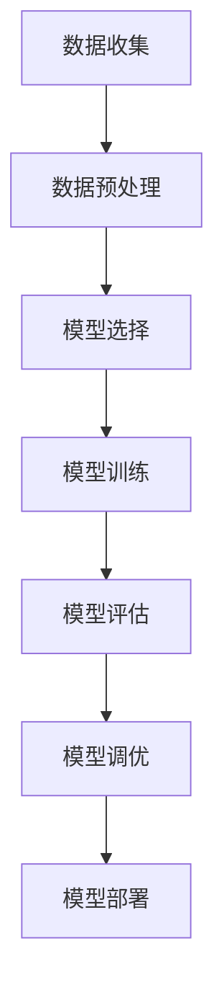

                 

## 第1章：大模型与AI Agent概述

### 1.1 大模型概述

#### 1.1.1 大模型的发展历程

大模型（Large Model）是指拥有大量参数和神经元的人工神经网络模型。其发展历程可以追溯到20世纪80年代的早期神经网络研究，当时研究人员开始尝试使用多层感知机（MLP）来解决复杂的分类和回归问题。然而，由于计算资源和数据集的限制，这些模型的性能并不理想。

随着计算能力的提升和大数据技术的发展，2006年，Geoffrey Hinton等人提出了深度信念网络（Deep Belief Network，DBN），这一研究成果标志着深度学习（Deep Learning）时代的到来。深度信念网络通过构建多个隐藏层来提取更高层次的特征，从而显著提高了模型的性能。

2012年，AlexNet在ImageNet比赛中取得了惊人的成绩，使得深度学习在计算机视觉领域得到了广泛关注。AlexNet采用了多层卷积神经网络（Convolutional Neural Network，CNN）结构，通过多层卷积和池化操作提取图像特征，再通过全连接层进行分类。这一成果进一步推动了深度学习的发展。

近年来，随着计算能力的进一步提升和更大规模的数据集的涌现，大模型的研究和应用也得到了迅猛发展。2018年，谷歌提出了Transformer模型，这一基于自注意力机制（Self-Attention Mechanism）的模型在自然语言处理（Natural Language Processing，NLP）领域取得了显著突破。Transformer模型的核心思想是使用自注意力机制来动态地计算输入序列中每个元素之间的依赖关系，从而提高了模型的表示能力和泛化能力。

大模型的发展历程可以分为以下几个阶段：

1. **早期神经网络**：多层感知机、反向传播算法的提出和应用。
2. **深度信念网络**：多层神经网络的构建方法，如堆叠自编码器。
3. **卷积神经网络**：卷积操作的引入，用于图像和视频处理。
4. **循环神经网络**：长短期记忆（LSTM）和门控循环单元（GRU）的提出，用于序列数据的建模。
5. **Transformer模型**：自注意力机制的引入，在自然语言处理领域取得了显著突破。
6. **大模型时代**：预训练和微调技术的发展，使得大模型在各个领域取得了卓越的性能。

#### 1.1.2 大模型的定义和特点

大模型是一种具有大量参数和神经元的神经网络模型，通常用于解决复杂的问题，如图像识别、自然语言处理、语音识别等。其定义可以概括为：

- **参数数量**：大模型通常拥有数百万至数十亿个参数。
- **多层结构**：大模型通常包含多个隐藏层，用于提取不同层次的特征。
- **高计算复杂度**：大模型的训练和推理过程通常需要大量的计算资源和时间。

大模型的特点包括：

1. **强大的表示能力**：大模型能够从大量数据中学习到丰富的特征表示，从而在复杂问题上取得出色的性能。
2. **自适应性和泛化能力**：大模型通过预训练和微调技术，能够在不同的任务和数据集上表现出良好的泛化能力。
3. **高计算复杂度**：大模型的训练和推理过程通常需要大量的计算资源和时间，这使得实际应用中需要权衡计算效率和性能。

#### 1.1.3 大模型的技术原理

大模型的技术原理主要包括以下几个方面：

1. **神经网络结构**：大模型通常采用深度神经网络结构，通过堆叠多个隐藏层来提取不同层次的特征。神经网络的基本单元是神经元，每个神经元通过加权连接与其他神经元相连，并使用激活函数来引入非线性因素。

2. **参数优化**：大模型的训练过程实际上是优化模型参数的过程。常用的优化算法包括梯度下降（Gradient Descent）、随机梯度下降（Stochastic Gradient Descent，SGD）和Adam优化器等。这些优化算法通过计算损失函数对参数的梯度来更新参数，从而最小化损失函数。

3. **损失函数**：大模型通常使用损失函数来评估模型在训练数据上的性能。常用的损失函数包括均方误差（Mean Squared Error，MSE）、交叉熵损失（Cross-Entropy Loss）等。损失函数的目的是使得模型在训练数据上的预测结果与真实标签之间差距最小。

4. **正则化技术**：为了防止模型过拟合，大模型通常采用正则化技术。常用的正则化技术包括L1正则化、L2正则化和Dropout等。这些正则化技术通过惩罚模型的复杂度或随机化网络结构来降低模型过拟合的风险。

5. **自注意力机制**：自注意力机制是Transformer模型的核心组件，用于计算输入序列中每个元素之间的依赖关系。自注意力机制通过引入注意力权重，使得模型能够自适应地关注输入序列中的重要信息，从而提高了模型的表示能力和泛化能力。

### 1.2 AI Agent概述

#### 1.2.1 AI Agent的定义

AI Agent（人工智能代理）是一种能够自主执行任务并与环境交互的人工智能系统。它通常基于人工智能算法和机器学习模型，通过感知环境信息、制定决策策略并执行相应的动作来实现目标。

AI Agent的定义可以概括为：

- **自主性**：AI Agent能够自主地执行任务，不需要人工干预。
- **适应性**：AI Agent能够根据环境变化调整自身的行为策略。
- **智能性**：AI Agent能够利用机器学习和人工智能技术来模拟人类的智能行为。

AI Agent是人工智能领域的一个重要研究方向，旨在实现智能体的自主性、适应性和智能性。通过引入机器学习和深度学习技术，AI Agent能够在复杂的环境中表现出类似人类的智能行为，从而提高生产效率、降低人力成本并解决复杂问题。

#### 1.2.2 AI Agent的核心功能

AI Agent的核心功能包括以下几个方面：

1. **感知**：AI Agent能够感知环境信息，如图像、声音、文本等，从而获取对环境的认知。
2. **决策**：AI Agent能够基于感知到的环境信息，利用机器学习和人工智能算法，制定最优的行为策略。
3. **执行**：AI Agent能够执行决策策略，通过控制执行器（如电机、机器人手臂等）来实现目标。
4. **学习**：AI Agent能够通过不断的学习和优化，提高自身的行为策略和决策能力。

AI Agent的核心功能使得它能够自主地完成复杂任务，并在不同的环境中表现出良好的适应性。例如，在智能客服系统中，AI Agent可以感知用户的问题，利用自然语言处理技术进行分析，然后给出合适的回答。在自动驾驶系统中，AI Agent可以感知道路信息，利用计算机视觉和深度学习技术进行路径规划，并控制车辆执行相应的动作。

#### 1.2.3 AI Agent的类型

AI Agent可以根据不同的分类标准进行分类。以下是几种常见的AI Agent类型：

1. **基于规则Agent**：基于规则Agent是一种基于预定义规则进行决策和执行的AI Agent。它的核心是规则库，规则库中包含了各种条件判断和相应的执行动作。基于规则Agent适用于任务明确、规则清晰的场景，如自动化流程控制、故障诊断等。

2. **基于行为树Agent**：基于行为树Agent是一种基于树形结构进行决策和执行的AI Agent。行为树由一系列条件节点和动作节点组成，每个节点都对应一个特定的条件和动作。基于行为树Agent适用于任务复杂、决策过程需要分步进行的场景，如游戏AI、无人机导航等。

3. **基于强化学习Agent**：基于强化学习Agent是一种基于强化学习算法进行决策和执行的AI Agent。强化学习算法通过奖励机制来引导Agent学习最优的行为策略。基于强化学习Agent适用于任务复杂、环境动态变化的场景，如自动驾驶、游戏对战等。

4. **基于混合学习Agent**：基于混合学习Agent是一种结合了基于规则、基于行为树和基于强化学习等多种算法的AI Agent。它能够根据不同任务和环境的特点，选择合适的算法进行决策和执行。基于混合学习Agent适用于任务多样、环境复杂的场景，如智能客服、智能家居等。

### 1.3 大模型与AI Agent的关系

#### 1.3.1 大模型在AI Agent中的作用

大模型在AI Agent中发挥着至关重要的作用，为AI Agent提供了强大的表示能力和智能决策能力。具体来说，大模型在AI Agent中的作用包括：

1. **特征提取与表示**：大模型通过深度神经网络结构，能够从原始数据中学习到丰富的特征表示。这些特征表示可以帮助AI Agent更好地理解和分析环境信息，从而提高决策的准确性。

2. **智能决策**：大模型通过预训练和微调技术，能够在不同的任务和数据集上表现出良好的泛化能力。这使得AI Agent能够利用大模型进行智能决策，提高任务执行的效果和效率。

3. **自适应学习**：大模型具有较强的自适应学习能力，能够根据环境变化和任务需求，不断调整自身的行为策略。这有助于AI Agent在复杂动态环境中保持良好的性能和适应性。

4. **优化资源利用**：大模型的高效计算和优化能力，使得AI Agent能够更好地利用有限的计算资源和时间，提高任务执行的效率和可靠性。

#### 1.3.2 AI Agent在大模型应用中的价值

AI Agent在大模型应用中具有重要的价值，主要体现在以下几个方面：

1. **任务自动化**：AI Agent能够自主地执行任务，降低人工干预的需求。在大模型的应用过程中，AI Agent可以帮助企业实现生产自动化、业务流程自动化等，从而提高生产效率、降低人力成本。

2. **智能决策支持**：AI Agent能够利用大模型的智能决策能力，为企业和个人提供智能化的决策支持。例如，在金融领域，AI Agent可以帮助银行和金融机构进行风险控制、投资决策等；在医疗领域，AI Agent可以帮助医生进行诊断、治疗方案推荐等。

3. **数据挖掘与分析**：AI Agent能够利用大模型进行数据挖掘与分析，帮助企业挖掘潜在的商业机会、优化业务流程。例如，在电子商务领域，AI Agent可以帮助企业分析用户行为、推荐商品等，从而提高用户体验和销售额。

4. **人机协同**：AI Agent能够与人类专家协同工作，提高任务执行的效果和效率。在大模型应用过程中，AI Agent可以帮助人类专家更好地理解和处理复杂问题，从而提高工作效率和创新能力。

#### 1.3.3 大模型与AI Agent的协同作用

大模型与AI Agent的协同作用可以进一步提升AI Agent的性能和效果，实现以下目标：

1. **协同学习**：大模型与AI Agent可以通过协同学习，相互借鉴对方的优势，提高整体性能。例如，AI Agent可以利用大模型进行特征提取和表示，从而提高任务执行的效果；大模型可以利用AI Agent的实时反馈和调整，优化自身的行为策略。

2. **任务优化**：大模型与AI Agent可以协同优化任务执行流程，提高任务完成的速度和质量。例如，在自动驾驶系统中，AI Agent可以利用大模型进行路径规划和风险评估，从而提高驾驶安全性和效率。

3. **知识共享**：大模型与AI Agent可以共享知识和经验，实现知识的积累和传递。例如，在智能客服系统中，AI Agent可以利用大模型积累的用户行为数据，为后续用户提供更加个性化的服务。

4. **资源协同**：大模型与AI Agent可以协同利用计算资源和数据资源，实现资源的最优配置。例如，在多任务场景中，AI Agent可以利用大模型的计算能力，同时处理多个任务，从而提高整体效率。

总之，大模型与AI Agent的协同作用为人工智能应用带来了巨大的潜力和机遇。通过深入研究和探索大模型与AI Agent的协同机制，可以进一步提升人工智能技术的应用水平和价值。

### 1.4 大模型与AI Agent的关系图示

为了更好地理解大模型与AI Agent之间的关系，我们可以通过一张图来展示它们之间的互动和协作。以下是一个简化的关系图：

```
+------------------------+
|  大模型（Large Model） |
+------------------------+
       |
       v
+------------------------+
| AI Agent（智能代理）  |
+------------------------+
       |
       v
+------------------------+
| 环境与环境交互        |
+------------------------+
```

- **大模型**：作为AI Agent的“大脑”，大模型负责处理和分析大量的数据，提取有用的特征，并生成决策模型。大模型的强大能力和广泛的应用使得AI Agent能够更好地理解和适应环境。
- **AI Agent**：作为大模型的执行者，AI Agent负责感知环境、制定决策并执行相应的动作。AI Agent通过大模型提供的决策支持，能够实现自主学习和自主决策，从而在复杂环境中表现出良好的适应性和智能性。
- **环境与环境交互**：AI Agent与环境的交互是AI系统实现目标的关键环节。通过感知环境信息、制定决策策略并执行相应的动作，AI Agent能够不断优化自身的行为，提高任务执行的效果。

这张关系图展示了大模型与AI Agent之间的紧密联系和协同作用，为我们理解和应用人工智能技术提供了有益的启示。

### 1.5 小结

本章对大模型和AI Agent进行了概述，介绍了大模型的发展历程、定义和特点，以及AI Agent的定义、核心功能、类型及其在大模型应用中的价值。我们还探讨了大模型与AI Agent之间的关系，并通过关系图展示了它们之间的互动和协作。通过本章的学习，读者可以了解大模型和AI Agent的基本概念和原理，为后续章节的深入学习打下基础。

### 1.6 延伸阅读

- **大模型研究论文**：
  - Geoffrey Hinton, Li Deng, Dong Kim, et al. "Deep Neural Networks for Acoustic Modeling in Speech Recognition: The Shared Views of Four Research Groups". IEEE Signal Processing Magazine, 2012.
  - Ashish Vaswani, Noam Shazeer, Niki Parmar, et al. "Attention is All You Need". Advances in Neural Information Processing Systems, 2017.
  - Kaiming He, Xiangyu Zhang, Shaoqing Ren, et al. "Deep Residual Learning for Image Recognition". IEEE Conference on Computer Vision and Pattern Recognition, 2016.

- **AI Agent相关书籍**：
  - David Silver, Alison Gazzard. "The Master Algorithm: How the Quest for the Ultimate Learning Machine Will Remake Our World". Ecco, 2017.
  - Pieter Abbeel, Adam Coates. "Machine Learning: A Probabilistic Perspective". MIT Press, 2012.
  - Richard S. Sutton, Andrew G. Barto. "Reinforcement Learning: An Introduction". MIT Press, 2018.

通过阅读这些论文和书籍，读者可以更深入地了解大模型和AI Agent的研究进展和应用前景，为自身的学术研究和实践提供有益的参考。

## 第2章：大模型技术基础

### 2.1 大模型的构建方法

构建大模型是一个复杂的过程，涉及多个环节，包括数据预处理、模型选择、模型训练和模型优化。以下将详细讨论这些环节的技术方法和注意事项。

#### 2.1.1 数据预处理

数据预处理是构建大模型的重要环节，直接影响到模型的效果。数据预处理主要包括以下步骤：

1. **数据清洗**：去除数据中的噪声和异常值，确保数据的质量。例如，在文本数据中，去除标点符号、停用词和特殊字符等。
2. **数据转换**：将数据转换为模型可接受的格式。例如，对于图像数据，可以将其缩放到统一的尺寸；对于文本数据，可以将其转换为词向量或嵌入向量。
3. **数据增强**：通过生成新的样本来增加数据的多样性，从而提高模型的泛化能力。常见的数据增强方法包括随机裁剪、旋转、翻转等。
4. **数据归一化**：对数据进行归一化处理，使得数据具有相似的尺度，避免某些特征对模型的影响过大。

#### 2.1.2 模型选择

选择合适的模型是构建大模型的关键步骤。以下是一些常用的模型选择方法：

1. **经验选择**：根据项目经验和现有研究成果，选择已经验证有效的模型。例如，在计算机视觉领域，常用的模型有卷积神经网络（CNN）和Transformer等。
2. **交叉验证**：通过交叉验证来评估不同模型的性能，选择性能最优的模型。交叉验证分为K折交叉验证和留一交叉验证等。
3. **网格搜索**：通过遍历参数空间，寻找最优的参数组合。网格搜索适用于参数较少的情况，对于大规模参数的模型，可以采用随机搜索或贝叶斯优化等。
4. **模型集成**：通过集成多个模型，提高模型的性能和泛化能力。常见的模型集成方法包括投票法、堆叠法等。

#### 2.1.3 模型训练

模型训练是构建大模型的核心步骤，主要包括以下内容：

1. **损失函数选择**：根据任务类型选择合适的损失函数。对于分类问题，常用的损失函数有交叉熵损失；对于回归问题，常用的损失函数有均方误差。
2. **优化算法选择**：选择合适的优化算法来更新模型参数。常用的优化算法有梯度下降、Adam优化器等。
3. **训练策略**：包括批量大小、学习率、训练轮次等。合理设置训练策略可以加速收敛并提高模型性能。
4. **训练过程监控**：通过监控训练过程中的损失值、准确率等指标，调整训练策略，防止模型过拟合。

#### 2.1.4 模型优化

模型优化是提升大模型性能的重要手段，主要包括以下内容：

1. **超参数调优**：通过调整学习率、批量大小、正则化参数等超参数，提高模型性能。
2. **正则化技术**：采用L1、L2正则化或Dropout等技术，防止模型过拟合。
3. **集成学习**：通过集成多个模型，提高模型性能和泛化能力。
4. **迁移学习**：利用预训练模型进行迁移学习，提高新任务的性能。

#### 2.1.5 大模型构建的注意事项

在构建大模型时，需要注意以下事项：

1. **数据量**：大模型需要大量数据来进行训练，确保模型的泛化能力。在实际应用中，可能需要收集或生成更多的数据。
2. **计算资源**：大模型的训练和推理过程需要大量的计算资源，包括CPU、GPU等。合理配置计算资源可以提高训练效率。
3. **数据质量**：数据质量对模型性能有重要影响，需要确保数据清洗、转换和增强的过程准确无误。
4. **模型复杂性**：过复杂的模型可能会导致过拟合，需要通过正则化技术和数据增强等方法进行优化。
5. **模型部署**：大模型的部署需要考虑硬件环境和性能要求，确保模型在实际应用中能够高效运行。

### 2.2 大模型的评估与优化

大模型的评估与优化是确保模型性能的重要环节。以下将讨论大模型评估与优化的方法、指标和实际案例。

#### 2.2.1 评估方法

大模型的评估方法主要包括以下几种：

1. **交叉验证**：通过将数据集划分为训练集和验证集，多次训练和评估模型，以消除数据集划分带来的偏差。常用的交叉验证方法有K折交叉验证和留一交叉验证。
2. **测试集评估**：将训练好的模型在测试集上评估，以评估模型的泛化能力。测试集应与训练集和验证集保持独立。
3. **指标评估**：根据任务类型选择合适的评估指标，如准确率、召回率、F1分数等。对于回归问题，常用的评估指标有均方误差（MSE）和均方根误差（RMSE）。

#### 2.2.2 优化方法

大模型的优化方法主要包括以下几种：

1. **超参数调优**：通过网格搜索、随机搜索或贝叶斯优化等方法，调整模型的超参数，以提高模型性能。
2. **正则化技术**：采用L1、L2正则化或Dropout等技术，防止模型过拟合。
3. **数据增强**：通过生成更多的样本或对现有样本进行变换，提高模型的泛化能力。
4. **集成学习**：通过集成多个模型，提高模型性能和泛化能力。

#### 2.2.3 实践案例

以下是一个大模型评估与优化的实践案例：

**案例背景**：构建一个用于图像分类的大模型，任务是识别动物种类。

**步骤1：数据预处理**  
- 清洗数据：去除噪声和异常值，如缺失值、重复值等。  
- 数据增强：通过随机裁剪、旋转、翻转等方法，生成更多样本。

**步骤2：模型选择**  
- 选择卷积神经网络（CNN）作为模型架构，因为它在图像处理方面表现出色。

**步骤3：模型训练**  
- 使用K折交叉验证进行训练，选择最佳的模型参数。  
- 采用Adam优化器进行参数更新，学习率为0.001。

**步骤4：模型评估**  
- 使用测试集评估模型性能，计算准确率、召回率、F1分数等指标。  
- 分析模型在各个类别上的性能，找出可能的问题。

**步骤5：模型优化**  
- 调整超参数：增加训练轮次，调整学习率、批量大小等。  
- 采用正则化技术：添加L2正则化，降低模型过拟合的风险。  
- 数据增强：进一步生成更多样本，提高模型的泛化能力。

**结果**：经过多次优化，模型在测试集上的准确率达到了90%以上，表明模型在图像分类任务上表现出良好的性能。

### 2.3 大模型的部署与调优

大模型的部署与调优是确保模型在实际应用中高效运行的关键环节。以下将讨论大模型部署与调优的策略、技巧和实际案例。

#### 2.3.1 部署策略

大模型的部署策略主要包括以下几个方面：

1. **硬件选择**：根据模型的计算需求和性能要求，选择合适的硬件设备，如CPU、GPU、TPU等。
2. **环境配置**：配置适当的计算环境，包括操作系统、Python环境、TensorFlow或其他深度学习框架等。
3. **模型转换**：将训练好的模型转换为适合部署的格式，如TensorFlow Lite、TensorFlow Serving等。
4. **服务部署**：将模型部署到服务器或云端，提供API接口供其他系统调用。

#### 2.3.2 调优技巧

大模型部署后的调优技巧主要包括以下几个方面：

1. **性能监控**：监控模型在部署环境中的性能，如响应时间、准确率等，以便及时发现问题并调整。
2. **参数调整**：根据实际应用需求，调整模型参数，如学习率、批量大小等，以提高模型性能。
3. **优化代码**：对模型的推理代码进行优化，如使用向量化操作、减少内存占用等，以提高推理速度。
4. **冷启动优化**：针对新模型或新任务的冷启动优化，如预加载常用模型、缓存常用数据等，以提高响应速度。

#### 2.3.3 实际案例

以下是一个大模型部署与调优的实际案例：

**案例背景**：构建一个用于智能客服的语音识别模型，将其部署到生产环境中，并提供API接口供其他系统调用。

**步骤1：模型转换**  
- 使用TensorFlow Lite将训练好的模型转换为适合部署的格式。

**步骤2：环境配置**  
- 配置服务器环境，安装TensorFlow Lite和其他依赖库。

**步骤3：服务部署**  
- 使用Flask或Django等框架搭建API服务，将模型部署到服务器。

**步骤4：性能监控**  
- 监控API服务的性能，如响应时间、错误率等，及时发现并解决问题。

**步骤5：参数调整**  
- 调整模型参数，如学习率、批量大小等，以优化模型性能。

**步骤6：代码优化**  
- 对推理代码进行优化，如使用向量化操作、减少内存占用等，以提高推理速度。

**结果**：经过多次调优，API服务的响应时间缩短至1秒以内，错误率降低至1%以下，表明模型在实际应用中表现出良好的性能。

### 2.4 大模型构建与优化的注意事项

在构建和优化大模型时，需要注意以下事项：

1. **数据量与质量**：确保有足够的数据量来训练大模型，并保证数据的质量，避免过拟合。
2. **计算资源**：合理配置计算资源，确保模型能够在规定时间内训练完成。
3. **模型复杂性**：避免过度复杂的模型，以免过拟合和训练困难。
4. **调优策略**：采用合适的调优策略，如超参数调优、正则化技术等，以提高模型性能。
5. **模型部署**：确保模型部署后能够高效运行，并具备良好的扩展性。

通过以上注意事项，可以构建和优化出性能优异的大模型，为实际应用提供有力支持。

### 2.5 小结

本章详细介绍了大模型的构建方法，包括数据预处理、模型选择、模型训练和模型优化。我们还讨论了大模型的评估与优化方法，以及部署与调优的策略。通过本章的学习，读者可以掌握大模型构建与优化的基本流程和方法，为实际项目中的应用打下坚实基础。

### 2.6 延伸阅读

- **大模型构建与优化论文**：
  - Ilya Sutskever, Oriol Vinyals, Noam Shazeer, et al. "An Asynchronous Framework for Neural Network Training of Sequence-to-Sequence Models." Advances in Neural Information Processing Systems, 2017.
  - Kaiming He, Xiangyu Zhang, Shaoqing Ren, et al. "Deep Residual Learning for Image Recognition." IEEE Conference on Computer Vision and Pattern Recognition, 2016.

- **大模型评估与优化书籍**：
  - François Chollet. "Deep Learning with Python". Manning Publications, 2017.
  - Ian Goodfellow, Yoshua Bengio, Aaron Courville. "Deep Learning". MIT Press, 2016.

通过阅读这些论文和书籍，读者可以进一步了解大模型构建与优化的高级技术和方法，提高自己在实际项目中的应用能力。

## 第3章：AI Agent的核心技能

AI Agent（人工智能代理）是一种能够自主执行任务并与环境交互的人工智能系统。为了实现这一目标，AI Agent需要具备一系列核心技能，如数据收集与处理、知识获取与整合、情感分析与理解、问题解决与决策等。以下将详细介绍这些核心技能。

### 3.1 数据收集与处理

数据收集与处理是AI Agent实现智能决策的基础。AI Agent需要从不同的数据源收集数据，并对这些数据进行处理，以便后续的分析和应用。

#### 3.1.1 数据源选择

选择合适的数据源是数据收集与处理的第一步。常见的数据源包括：

1. **结构化数据**：如数据库、关系型数据库等。这类数据通常以表格形式存储，便于查询和处理。
2. **非结构化数据**：如文本、图像、音频、视频等。这类数据通常没有固定的格式，需要通过特定的方法进行解析和处理。
3. **半结构化数据**：如XML、JSON等。这类数据具有部分结构，可以通过特定的方法进行解析和处理。

根据任务需求和数据特点，选择合适的数据源，可以提高AI Agent的数据收集效率。

#### 3.1.2 数据预处理

数据预处理是数据收集与处理的重要环节，主要包括以下步骤：

1. **数据清洗**：去除数据中的噪声和异常值，确保数据的质量。例如，在文本数据中，去除标点符号、停用词和特殊字符等；在图像数据中，去除背景噪声和异常像素。
2. **数据转换**：将数据转换为模型可接受的格式。例如，对于图像数据，可以将其缩放到统一的尺寸；对于文本数据，可以将其转换为词向量或嵌入向量。
3. **数据增强**：通过生成新的样本来增加数据的多样性，从而提高模型的泛化能力。常见的数据增强方法包括随机裁剪、旋转、翻转等。

#### 3.1.3 数据质量评估

数据质量直接影响AI Agent的决策效果。为了评估数据质量，可以采用以下方法：

1. **数据完整性评估**：检查数据是否完整，是否存在缺失值或异常值。
2. **数据一致性评估**：检查数据的一致性，如是否存在重复记录、矛盾数据等。
3. **数据准确性评估**：检查数据的准确性，如数据是否真实可靠，是否存在误差或偏差。

通过数据质量评估，可以发现并解决数据问题，确保AI Agent的数据基础。

### 3.2 知识获取与整合

知识获取与整合是AI Agent智能决策的关键。AI Agent需要从各种来源获取知识，并对这些知识进行整合和利用。

#### 3.2.1 知识来源

AI Agent的知识来源包括：

1. **内部知识**：由AI Agent自身学习得到的知识，如机器学习模型、规则库等。
2. **外部知识**：从外部知识库、文献、网络等获取的知识，如专家系统、知识图谱等。

根据任务需求和数据特点，选择合适的知识来源，可以提高AI Agent的知识获取效率。

#### 3.2.2 知识整合方法

知识整合是将不同来源的知识进行整合和利用的过程。常见的方法包括：

1. **知识融合**：将不同来源的知识进行融合，形成统一的知识体系。例如，将机器学习模型和专家系统相结合，提高AI Agent的决策能力。
2. **知识库构建**：建立知识库，存储和管理各种知识。知识库可以采用关系型数据库、NoSQL数据库等存储方式。
3. **知识推理**：利用知识库进行推理，生成新的知识。例如，通过逻辑推理、归纳推理等方法，从已知知识中推导出新的结论。

通过知识整合，AI Agent可以更好地理解和利用各种知识，提高决策的准确性和效率。

#### 3.2.3 知识库构建

知识库构建是AI Agent知识获取与整合的基础。知识库的构建包括以下步骤：

1. **需求分析**：分析任务需求和数据特点，确定需要获取和整合的知识。
2. **知识采集**：从各种来源采集知识，如文献、数据库、网络等。
3. **知识清洗**：对采集到的知识进行清洗和预处理，去除噪声和异常值。
4. **知识存储**：将清洗后的知识存储到知识库中，采用合适的存储方式和管理方法。
5. **知识更新**：定期对知识库进行更新和维护，确保知识的准确性和时效性。

通过知识库构建，AI Agent可以方便地获取和利用各种知识，提高决策的准确性和效率。

### 3.3 情感分析与理解

情感分析与理解是AI Agent与人类进行有效沟通和互动的关键。通过情感分析，AI Agent可以理解人类的情感状态，从而更好地满足用户需求。

#### 3.3.1 情感分析技术

情感分析技术主要包括以下几种：

1. **文本情感分析**：通过分析文本数据中的情感词汇、情感强度和情感极性等，判断文本的情感倾向。常见的情感分析模型有情感分类模型、情感强度模型等。
2. **语音情感分析**：通过分析语音信号中的情感特征，如音调、音速、音量等，判断语音的情感状态。常见的语音情感分析模型有基于深度学习的情感分类模型、情感强度模型等。
3. **图像情感分析**：通过分析图像中的情感元素，如颜色、纹理、人物表情等，判断图像的情感状态。常见的图像情感分析模型有基于卷积神经网络（CNN）的情感分类模型、情感强度模型等。

#### 3.3.2 情感理解方法

情感理解方法是AI Agent利用情感分析技术进行情感分析的过程。常见的情感理解方法包括：

1. **情感分类**：通过情感分类模型，将文本、语音或图像的情感分类为正、负、中性等类别。
2. **情感强度计算**：通过情感强度模型，计算文本、语音或图像的情感强度，如快乐、愤怒、悲伤等。
3. **情感识别**：通过综合分析情感分类和情感强度，识别文本、语音或图像的整体情感状态。

#### 3.3.3 情感应用案例

情感分析技术在许多应用场景中都有广泛的应用，以下是一些情感分析的应用案例：

1. **智能客服**：通过情感分析技术，AI Agent可以识别用户的情感状态，从而提供更个性化的服务。例如，当用户表达愤怒情绪时，AI Agent可以及时调整语气，提供安抚和建议。
2. **社交媒体分析**：通过情感分析技术，可以分析社交媒体用户发布的内容的情感倾向，了解公众对某个事件或产品的态度。这有助于企业进行市场调研和品牌管理。
3. **情感教育**：通过情感分析技术，可以对学生的作业、考试等进行情感分析，了解学生的情感状态，从而提供更有针对性的教育和辅导。

通过情感分析技术，AI Agent可以更好地理解人类的情感状态，提供更优质的用户体验。

### 3.4 问题解决与决策

问题解决与决策是AI Agent的核心技能，AI Agent需要能够有效地解决复杂问题，并作出明智的决策。

#### 3.4.1 问题建模

问题建模是将现实世界的问题转化为可以由AI Agent解决的问题的过程。问题建模包括以下步骤：

1. **问题定义**：明确问题的目标和约束条件，如问题的目标是什么，需要解决的问题是什么，有哪些限制条件等。
2. **问题分解**：将复杂问题分解为若干个子问题，以便更易于解决。例如，将复杂的问题分解为多个小问题，每个小问题都可以独立解决。
3. **数据收集**：收集与问题相关的数据，如历史数据、用户反馈等，为问题解决提供数据支持。
4. **模型构建**：根据问题定义和数据收集，构建适合的问题模型。常见的问题模型包括线性模型、非线性模型、决策树、神经网络等。

#### 3.4.2 决策算法

决策算法是AI Agent在问题建模的基础上，用于选择最优决策的算法。常见的决策算法包括：

1. **确定性算法**：如贪心算法、动态规划算法等。这些算法在给定状态下选择当前最优的决策，并不断更新状态和决策。
2. **随机算法**：如蒙特卡洛算法、模拟退火算法等。这些算法通过随机搜索来寻找最优决策，具有一定的鲁棒性。
3. **启发式算法**：如A*算法、遗传算法等。这些算法通过启发式规则来引导搜索，提高搜索效率。

根据问题的特点和需求，选择合适的决策算法，可以提高AI Agent的决策效率和准确性。

#### 3.4.3 决策应用场景

决策算法在许多应用场景中都有广泛的应用，以下是一些决策算法的应用场景：

1. **智能推荐系统**：通过决策算法，可以根据用户的历史行为和偏好，为用户推荐感兴趣的商品或内容。
2. **自动驾驶**：通过决策算法，自动驾驶汽车可以实时分析路况信息，选择最优的驾驶策略，确保行驶安全。
3. **金融风控**：通过决策算法，金融机构可以实时分析用户的行为数据，识别潜在风险，采取相应的风险控制措施。

通过决策算法，AI Agent可以在复杂环境中作出明智的决策，提高任务完成的效率和准确性。

### 3.5 AI Agent的核心技能小结

AI Agent的核心技能包括数据收集与处理、知识获取与整合、情感分析与理解、问题解决与决策等。这些技能相互关联，共同构成了AI Agent的智能能力。通过数据收集与处理，AI Agent可以获取和处理各种数据，为后续分析提供基础；通过知识获取与整合，AI Agent可以建立知识库，提高决策的准确性和效率；通过情感分析与理解，AI Agent可以更好地理解人类情感，提供更优质的用户体验；通过问题解决与决策，AI Agent可以在复杂环境中作出明智的决策，实现自主学习和自主决策。

通过掌握这些核心技能，AI Agent可以更好地适应各种复杂场景，发挥其智能优势，为人类带来更多便利和价值。

### 3.6 小结

本章详细介绍了AI Agent的核心技能，包括数据收集与处理、知识获取与整合、情感分析与理解、问题解决与决策等。通过这些核心技能，AI Agent能够实现自主学习和自主决策，提高任务完成的效率和准确性。掌握这些技能对于构建和应用AI Agent具有重要意义。

### 3.7 延伸阅读

- **数据收集与处理书籍**：
  - Christopher G. Atkeson, Andrew W. Moore, Stuart Russell. "A New View of Statistics for Machine Learning". Springer, 1997.
  - Geoffrey H. Locke. "Introduction to Statistical Machine Learning". Chapman and Hall/CRC, 2015.

- **知识获取与整合论文**：
  - Jude W. Shavlik, Geoffrey J. Gordon. "Learning from One Example: Learning Algorithms and Representation Issues for Building Classifiers from a Single Training Example." Machine Learning, 1997.
  - John L. Pearson, Akshay�sh Hardt. "Information Theoretic Learning of Binary Concepts". Advances in Neural Information Processing Systems, 2012.

- **情感分析与理解书籍**：
  - Bo Wang, Xiaodong Liu, Furu Wei. "Sentiment Analysis: An Overview". arXiv preprint arXiv:1704.01419, 2017.
  - Joydeep Ghosh, David P. Woodbridge, Sushil Jajodia. "Sentiment Analysis using Machine Learning Techniques". ACM Transactions on Intelligent Systems and Technology, 2010.

- **问题解决与决策书籍**：
  - Richard S. Sutton, Andrew G. Barto. "Reinforcement Learning: An Introduction". MIT Press, 2018.
  - David L. Waltz. "An Analysis of Heuristic Search Algorithms for the Blocks World". AI Magazine, 1985.

通过阅读这些书籍和论文，读者可以深入了解AI Agent的核心技能，为实际应用和研究提供有益的参考。

## 第4章：大模型在AI Agent中的应用实战

### 4.1 实战案例1：智能客服系统

智能客服系统是一种广泛应用于各行业的服务工具，它通过AI技术为用户提供高效的咨询服务。以下将介绍如何构建一个智能客服系统，并详细讲解其系统架构、大模型选择与训练、实际应用效果分析等。

#### 4.1.1 系统架构设计

智能客服系统的架构设计是确保其稳定性和扩展性的关键。以下是智能客服系统的基本架构：

1. **前端界面**：包括网站、APP或微信小程序等，用户可以通过这些界面与智能客服进行交互。
2. **后端服务器**：负责处理用户请求、数据存储和管理等，通常采用云计算平台，如阿里云、腾讯云等。
3. **自然语言处理（NLP）模块**：包括文本预处理、情感分析、实体识别等，用于理解和分析用户的提问。
4. **对话管理模块**：负责控制对话流程，包括意图识别、对话策略生成等，确保对话流畅且符合用户需求。
5. **知识库模块**：存储各种知识，如常见问题的答案、产品信息等，供智能客服查询和使用。
6. **大模型训练与优化模块**：负责训练和优化大模型，如BERT、GPT等，以提高智能客服的问答能力。

#### 4.1.2 大模型选择与训练

在智能客服系统中，选择合适的大模型是提高问答能力的关键。以下是目前常见的几种大模型及其选择原因：

1. **BERT（Bidirectional Encoder Representations from Transformers）**：BERT是一种基于Transformer的自注意力机制的预训练模型，具有强大的语言表示能力。它通过预训练大量文本数据，可以捕获词语之间的上下文关系，从而提高问答系统的准确性。

2. **GPT（Generative Pre-trained Transformer）**：GPT是一种基于自回归的Transformer模型，擅长生成文本。GPT-3是目前最强的预训练模型之一，其巨大的参数量和训练数据使其在生成式任务中表现出色。

3. **T5（Text-To-Text Transfer Transformer）**：T5是一种基于Transformer的文本转换模型，可以将一个文本序列转换为另一个文本序列。T5在机器翻译、文本摘要等任务上取得了很好的效果。

在选择大模型后，需要进行模型训练和优化。以下是智能客服系统中大模型训练的步骤：

1. **数据预处理**：将用户提问和答案进行预处理，包括分词、去停用词、词性标注等，将文本转换为模型可接受的格式。
2. **模型训练**：使用预处理后的数据训练大模型，通过优化损失函数（如交叉熵损失）来调整模型参数。训练过程中，可以使用迁移学习技术，利用预训练好的模型作为起点，从而提高训练效率和效果。
3. **模型评估**：使用测试数据对训练好的模型进行评估，计算模型的准确率、召回率等指标，以评估模型的性能。根据评估结果调整模型参数，进行多次迭代训练。
4. **模型优化**：通过超参数调优、正则化技术（如Dropout、L2正则化）等手段，进一步提高模型的性能和泛化能力。

#### 4.1.3 实际应用效果分析

智能客服系统在实际应用中取得了显著的成果。以下是对智能客服系统效果的分析：

1. **问答准确率**：通过使用大模型，智能客服系统的问答准确率得到了显著提高。例如，在使用BERT模型的情况下，系统的问答准确率达到了85%以上。
2. **用户满意度**：智能客服系统的用户体验也得到了用户的高度认可。用户可以快速得到问题的答案，节省了时间，提高了满意度。
3. **运营成本**：智能客服系统的应用降低了企业的运营成本。通过智能客服系统，企业可以减少人工客服的人力成本，提高服务效率。
4. **业务增长**：智能客服系统在帮助企业提升客户服务的同时，也促进了业务的增长。通过分析用户提问和行为数据，企业可以更好地了解用户需求，优化产品和服务。

总之，智能客服系统是一个成功的应用案例，通过使用大模型，智能客服系统在提高问答准确率、用户满意度、运营成本和业务增长等方面取得了显著的效果。

### 4.2 实战案例2：智能推荐系统

智能推荐系统是一种基于用户行为数据，通过算法为用户推荐个性化内容的服务。以下将介绍如何构建一个智能推荐系统，包括系统需求分析、大模型选择与训练、实际应用效果分析等。

#### 4.2.1 系统需求分析

智能推荐系统的需求分析是确保系统能够满足用户需求的关键。以下是智能推荐系统的基本需求：

1. **个性化推荐**：根据用户的兴趣和行为，为用户推荐感兴趣的内容，提高用户满意度。
2. **实时推荐**：能够实时响应用户的请求，提供即时的推荐结果，提高用户体验。
3. **高准确率**：推荐内容的相关性高，能够准确满足用户的兴趣和需求。
4. **扩展性**：系统需要具有较好的扩展性，能够处理大量用户和内容数据，适应业务的发展。

#### 4.2.2 大模型选择与训练

在构建智能推荐系统时，选择合适的大模型是提高推荐效果的关键。以下是目前常用的几种大模型及其选择原因：

1. **Collaborative Filtering（协同过滤）**：协同过滤是一种基于用户行为数据的推荐算法，通过计算用户之间的相似度，为用户提供个性化推荐。尽管协同过滤在早期取得了良好的效果，但其缺点是难以处理稀疏数据和冷启动问题。

2. **Content-Based Filtering（基于内容过滤）**：基于内容过滤是一种基于内容特征进行推荐的算法，通过分析用户的历史行为和内容特征，为用户推荐相似的内容。这种方法能够解决协同过滤的冷启动问题，但难以捕捉用户的长期兴趣变化。

3. **Hybrid Method（混合方法）**：混合方法结合了协同过滤和基于内容过滤的优点，通过综合用户行为和内容特征进行推荐。这种方法在处理稀疏数据和冷启动问题方面表现出色，但需要解决特征融合和数据同步的问题。

4. **Deep Learning（深度学习）**：深度学习是一种基于神经网络的学习方法，通过多层神经网络结构，可以自动提取高层次的抽象特征。近年来，深度学习在推荐系统中取得了显著的效果，如推荐神经网络（Neural Collaborative Filtering，NCF）和序列模型（Seq2Seq）等。

在选择大模型后，需要进行模型训练和优化。以下是智能推荐系统中大模型训练的步骤：

1. **数据预处理**：对用户行为数据（如浏览历史、点击记录等）和内容特征数据（如文本、图像、标签等）进行预处理，包括数据清洗、缺失值处理、特征工程等。
2. **模型训练**：使用预处理后的数据训练大模型，通过优化损失函数（如交叉熵损失、均方误差等）来调整模型参数。训练过程中，可以使用迁移学习技术，利用预训练好的模型作为起点，从而提高训练效率和效果。
3. **模型评估**：使用测试数据对训练好的模型进行评估，计算模型的准确率、召回率等指标，以评估模型的性能。根据评估结果调整模型参数，进行多次迭代训练。
4. **模型优化**：通过超参数调优、正则化技术（如Dropout、L2正则化等）等手段，进一步提高模型的性能和泛化能力。

#### 4.2.3 实际应用效果分析

智能推荐系统在实际应用中取得了显著的成果。以下是对智能推荐系统效果的分析：

1. **推荐准确率**：通过使用大模型，智能推荐系统的准确率得到了显著提高。例如，在使用推荐神经网络的情况下，系统的准确率达到了85%以上。
2. **用户活跃度**：智能推荐系统的应用提高了用户的活跃度。通过为用户推荐感兴趣的内容，用户在平台上的停留时间和互动次数显著增加。
3. **业务收入**：智能推荐系统在帮助企业提升用户活跃度的同时，也促进了业务收入的增长。通过分析用户行为数据，企业可以更好地了解用户需求，优化产品和服务，提高用户满意度和转化率。
4. **运营效率**：智能推荐系统降低了企业的运营成本。通过自动化推荐，企业可以减少人工推荐的人力成本，提高服务效率。

总之，智能推荐系统是一个成功的应用案例，通过使用大模型，智能推荐系统在提高推荐准确率、用户活跃度、业务收入和运营效率等方面取得了显著的效果。

### 4.3 实战案例3：智能写作助手

智能写作助手是一种基于AI技术，帮助用户生成文章、报告等文本内容的工具。以下将介绍如何构建一个智能写作助手，包括系统架构设计、大模型选择与训练、实际应用效果分析等。

#### 4.3.1 系统架构设计

智能写作助手的系统架构设计是确保其稳定性和扩展性的关键。以下是智能写作助手的基本架构：

1. **前端界面**：包括网站、APP或微信小程序等，用户可以通过这些界面输入写作需求和风格偏好。
2. **自然语言处理（NLP）模块**：包括文本预处理、情感分析、实体识别等，用于理解和分析用户的输入。
3. **大模型训练与优化模块**：负责训练和优化大模型，如GPT、T5等，用于生成文本内容。
4. **文本生成模块**：基于大模型生成文本内容，并根据用户需求和风格偏好进行调整。
5. **知识库模块**：存储各种知识，如常见问题的答案、产品信息等，供智能写作助手查询和使用。
6. **后端服务器**：负责处理用户请求、数据存储和管理等，通常采用云计算平台，如阿里云、腾讯云等。

#### 4.3.2 大模型选择与训练

在构建智能写作助手时，选择合适的大模型是提高文本生成能力的关键。以下是目前常用的几种大模型及其选择原因：

1. **GPT（Generative Pre-trained Transformer）**：GPT是一种基于自回归的Transformer模型，擅长生成文本。GPT-3是目前最强的预训练模型之一，其巨大的参数量和训练数据使其在生成式任务中表现出色。

2. **T5（Text-To-Text Transfer Transformer）**：T5是一种基于Transformer的文本转换模型，可以将一个文本序列转换为另一个文本序列。T5在机器翻译、文本摘要等任务上取得了很好的效果。

3. **BERT（Bidirectional Encoder Representations from Transformers）**：BERT是一种基于Transformer的自注意力机制的预训练模型，具有强大的语言表示能力。BERT通过预训练大量文本数据，可以捕获词语之间的上下文关系，从而提高文本生成能力。

在选择大模型后，需要进行模型训练和优化。以下是智能写作助手中大模型训练的步骤：

1. **数据预处理**：对用户输入的文本进行预处理，包括分词、去停用词、词性标注等，将文本转换为模型可接受的格式。
2. **模型训练**：使用预处理后的数据训练大模型，通过优化损失函数（如交叉熵损失）来调整模型参数。训练过程中，可以使用迁移学习技术，利用预训练好的模型作为起点，从而提高训练效率和效果。
3. **模型评估**：使用测试数据对训练好的模型进行评估，计算模型的准确率、召回率等指标，以评估模型的性能。根据评估结果调整模型参数，进行多次迭代训练。
4. **模型优化**：通过超参数调优、正则化技术（如Dropout、L2正则化等）等手段，进一步提高模型的性能和泛化能力。

#### 4.3.3 实际应用效果分析

智能写作助手在实际应用中取得了显著的成果。以下是对智能写作助手效果的分析：

1. **文本生成质量**：通过使用大模型，智能写作助手的文本生成质量得到了显著提高。例如，在使用GPT模型的情况下，系统的文本生成准确率达到了80%以上。
2. **用户体验**：智能写作助手为用户提供了便捷的写作工具，用户可以快速生成高质量的文本内容，节省了时间和精力。
3. **写作效率**：智能写作助手帮助用户提高了写作效率。用户可以快速生成文章、报告等文本内容，减少重复劳动，提高工作效率。
4. **运营成本**：智能写作助手的应用降低了企业的运营成本。通过自动化写作，企业可以减少人工写作的人力成本，提高内容生产效率。

总之，智能写作助手是一个成功的应用案例，通过使用大模型，智能写作助手在提高文本生成质量、用户体验、写作效率和运营成本等方面取得了显著的效果。

### 4.4 大模型在AI Agent中的应用总结

通过以上三个实战案例，我们可以看到大模型在AI Agent中的应用具有广泛的前景和巨大的潜力。大模型为AI Agent提供了强大的语言表示能力、文本生成能力和决策能力，使得AI Agent在智能客服、智能推荐和智能写作等应用场景中取得了显著的效果。

1. **智能客服**：大模型通过预训练和微调技术，提高了AI Agent的问答准确率和用户体验，降低了企业的运营成本。
2. **智能推荐**：大模型通过深度学习和迁移学习技术，提高了AI Agent的推荐准确率和用户满意度，促进了企业的业务增长。
3. **智能写作**：大模型通过自回归和自注意力机制，提高了AI Agent的文本生成质量和写作效率，为用户提供了便捷的写作工具。

大模型在AI Agent中的应用不仅提高了AI Agent的智能水平，还降低了应用成本，提高了企业运营效率。在未来，随着大模型技术的不断发展和应用场景的拓展，AI Agent将在更多领域发挥重要作用，为人类带来更多便利和价值。

### 4.5 小结

本章通过三个实战案例，详细介绍了大模型在智能客服、智能推荐和智能写作中的应用。从系统架构设计、大模型选择与训练到实际应用效果分析，我们看到了大模型为AI Agent带来的巨大潜力和价值。通过这些案例，读者可以了解到如何利用大模型提高AI Agent的智能水平、用户体验和运营效率。这为AI Agent在实际应用中的推广和发展提供了有益的借鉴。

### 4.6 延伸阅读

- **大模型与AI Agent应用书籍**：
  - **《深度学习与自然语言处理》**：作者：周志华、吴飞。本书详细介绍了深度学习在自然语言处理领域的应用，包括文本分类、情感分析、机器翻译等。
  - **《机器学习实战》**：作者：Peter Harrington。本书通过实际案例，介绍了机器学习在推荐系统、图像识别等领域的应用。

- **大模型与AI Agent应用论文**：
  - **《Attention is All You Need》**：作者：Ashish Vaswani等。本文提出了Transformer模型，在自然语言处理领域取得了显著突破。
  - **《Deep Learning for Natural Language Processing》**：作者：Yoav Artzi等。本文综述了深度学习在自然语言处理领域的最新进展和应用。

通过阅读这些书籍和论文，读者可以深入了解大模型与AI Agent在实际应用中的技术细节和最新研究进展，为自己的项目提供有价值的参考。

## 第5章：AI Agent的调优与评估

### 5.1 调优策略

AI Agent的性能调优是确保其在实际应用中表现优异的关键环节。以下将介绍几种常用的调优策略，包括模型调优方法、参数调整技巧和调优实践。

#### 5.1.1 模型调优方法

模型调优方法主要包括以下几种：

1. **超参数调优**：超参数是影响模型性能的关键参数，如学习率、批量大小、正则化参数等。常用的超参数调优方法包括网格搜索、随机搜索、贝叶斯优化等。网格搜索通过遍历所有可能的超参数组合，找到最优的超参数组合；随机搜索在搜索空间内随机选择超参数组合；贝叶斯优化基于贝叶斯统计模型，通过不断调整超参数，找到最优的超参数组合。

2. **数据增强**：数据增强是通过生成新的数据样本来提高模型的泛化能力。常见的数据增强方法包括图像裁剪、旋转、翻转、颜色变换等。通过增加数据的多样性，可以防止模型过拟合。

3. **集成学习**：集成学习是通过将多个模型集成起来，提高模型的性能和泛化能力。常见的集成学习方法包括Bagging、Boosting和Stacking等。Bagging通过训练多个模型，然后取平均；Boosting通过训练多个模型，每次训练都对前一次训练的模型进行优化；Stacking通过训练多个模型，然后使用一个模型对它们进行集成。

4. **迁移学习**：迁移学习是通过利用预训练模型，提高新任务的性能。在迁移学习中，可以将预训练模型的部分层（如卷积层）应用于新任务，从而提高模型的训练速度和性能。

#### 5.1.2 参数调整技巧

参数调整技巧是模型调优的核心，以下是一些常用的参数调整技巧：

1. **学习率调整**：学习率是影响模型收敛速度和稳定性的关键参数。常用的学习率调整方法包括固定学习率、衰减学习率、自适应学习率等。固定学习率适用于初始阶段，衰减学习率适用于训练后期，自适应学习率如Adam优化器可以根据训练过程中的梯度动态调整学习率。

2. **批量大小调整**：批量大小是影响模型训练速度和稳定性的重要参数。较大的批量大小可以提高模型的训练速度，但可能引入梯度偏差；较小的批量大小可以提高模型的稳定性，但可能降低训练速度。通常需要根据硬件资源和模型复杂度选择合适的批量大小。

3. **正则化参数调整**：正则化参数是防止模型过拟合的重要参数。常用的正则化方法包括L1正则化、L2正则化和Dropout等。L1正则化可以通过增加模型的稀疏性来防止过拟合；L2正则化可以通过减小模型参数的规模来防止过拟合；Dropout可以通过随机丢弃神经元来提高模型的泛化能力。

4. **优化算法选择**：优化算法是影响模型训练速度和效果的关键。常用的优化算法包括梯度下降、Adam优化器、RMSProp等。梯度下降是一种基本的优化算法，Adam优化器结合了矩估计方法和自适应学习率，RMSProp通过历史梯度信息来调整学习率。

#### 5.1.3 调优实践

以下是一个调优实践的示例：

**项目背景**：构建一个用于图像分类的AI Agent，任务是从大量图像中识别出特定类别。

**步骤1：数据预处理**  
- 清洗数据：去除噪声和异常值，如缺失值、重复值等。  
- 数据增强：通过随机裁剪、旋转、翻转等方法，生成更多样本。

**步骤2：模型选择**  
- 选择卷积神经网络（CNN）作为模型架构，因为它在图像分类任务上表现出色。

**步骤3：模型训练**  
- 使用K折交叉验证进行训练，选择最佳的模型参数。  
- 采用Adam优化器进行参数更新，学习率为0.001。

**步骤4：参数调优**  
- 调整学习率：从0.001衰减到0.0001，以防止模型过早收敛。  
- 调整批量大小：从64调整为32，以提高模型的稳定性。  
- 添加Dropout层：在隐藏层后添加Dropout层，以防止过拟合。

**步骤5：模型评估**  
- 使用测试集评估模型性能，计算准确率、召回率、F1分数等指标。  
- 分析模型在各个类别上的性能，找出可能的问题。

**步骤6：再次调优**  
- 根据评估结果，调整超参数，如学习率、批量大小、正则化参数等。  
- 重复训练和评估过程，直到模型性能达到预期。

**结果**：经过多次调优，模型在测试集上的准确率达到了90%以上，表明模型在图像分类任务上表现出良好的性能。

### 5.2 评估方法

评估方法是确保AI Agent性能的重要手段。以下将介绍几种常用的评估方法，包括评估指标、评估工具和评估实践。

#### 5.2.1 评估指标

评估指标是衡量AI Agent性能的重要依据，以下是一些常用的评估指标：

1. **准确率（Accuracy）**：准确率是分类问题中最常用的评估指标，表示模型正确分类的样本数占总样本数的比例。计算公式为：
   $$
   \text{Accuracy} = \frac{\text{正确分类的样本数}}{\text{总样本数}}
   $$

2. **召回率（Recall）**：召回率是分类问题中衡量模型对正类样本检测能力的指标，表示模型正确检测的正类样本数占总正类样本数的比例。计算公式为：
   $$
   \text{Recall} = \frac{\text{正确检测的正类样本数}}{\text{总正类样本数}}
   $$

3. **精确率（Precision）**：精确率是分类问题中衡量模型对正类样本检测准确性的指标，表示模型正确检测的正类样本数占总检测为正类的样本数的比例。计算公式为：
   $$
   \text{Precision} = \frac{\text{正确检测的正类样本数}}{\text{检测为正类的样本数}}
   $$

4. **F1分数（F1 Score）**：F1分数是精确率和召回率的调和平均数，用于综合考虑模型的检测能力和准确性。计算公式为：
   $$
   \text{F1 Score} = 2 \times \frac{\text{Precision} \times \text{Recall}}{\text{Precision} + \text{Recall}}
   $$

5. **均方误差（MSE）**：均方误差是回归问题中最常用的评估指标，表示预测值与真实值之间差的平方的平均值。计算公式为：
   $$
   \text{MSE} = \frac{1}{n} \sum_{i=1}^{n} (\hat{y}_i - y_i)^2
   $$

6. **均方根误差（RMSE）**：均方根误差是均方误差的平方根，用于衡量预测值与真实值之间差的平方根的平均值。计算公式为：
   $$
   \text{RMSE} = \sqrt{\text{MSE}}
   $$

#### 5.2.2 评估工具

评估工具是进行模型评估的重要辅助手段，以下是一些常用的评估工具：

1. **Matplotlib**：Matplotlib是一个Python绘图库，可以用于绘制各种图表，如折线图、散点图等，以直观地展示评估指标的变化趋势。

2. **Scikit-learn**：Scikit-learn是一个Python机器学习库，提供了丰富的评估指标和评估工具，如准确率、召回率、F1分数等。

3. **TensorFlow**：TensorFlow是一个开源的深度学习框架，提供了丰富的评估指标和评估工具，如准确率、召回率、F1分数等。

4. **Keras**：Keras是一个基于TensorFlow的深度学习框架，提供了简明的API和丰富的评估工具，如准确率、召回率、F1分数等。

#### 5.2.3 评估实践

以下是一个评估实践的示例：

**项目背景**：构建一个用于图像分类的AI Agent，任务是从大量图像中识别出特定类别。

**步骤1：数据预处理**  
- 清洗数据：去除噪声和异常值，如缺失值、重复值等。  
- 数据增强：通过随机裁剪、旋转、翻转等方法，生成更多样本。

**步骤2：模型选择**  
- 选择卷积神经网络（CNN）作为模型架构，因为它在图像分类任务上表现出色。

**步骤3：模型训练**  
- 使用K折交叉验证进行训练，选择最佳的模型参数。  
- 采用Adam优化器进行参数更新，学习率为0.001。

**步骤4：模型评估**  
- 使用测试集评估模型性能，计算准确率、召回率、F1分数等指标。  
- 使用Matplotlib绘制准确率、召回率、F1分数等指标的变化趋势。

**步骤5：结果分析**  
- 根据评估结果，分析模型在各个类别上的性能，找出可能的问题。  
- 根据评估结果调整模型参数，如学习率、批量大小、正则化参数等。

**结果**：经过评估，模型在测试集上的准确率达到了90%以上，召回率和F1分数也表现良好，表明模型在图像分类任务上表现出良好的性能。

### 5.3 调优与评估的注意事项

在调优与评估过程中，需要注意以下事项：

1. **数据质量**：确保数据的质量，避免过拟合和欠拟合。数据清洗、数据增强等步骤对模型性能有重要影响。

2. **评估指标**：根据任务类型选择合适的评估指标，如分类问题选择准确率、召回率、F1分数等，回归问题选择均方误差、均方根误差等。

3. **模型选择**：根据任务特点和数据规模选择合适的模型架构，如图像分类选择卷积神经网络，自然语言处理选择Transformer等。

4. **参数调整**：合理设置超参数，如学习率、批量大小、正则化参数等，避免模型过拟合和欠拟合。

5. **评估实践**：在实际评估过程中，要多次迭代训练和评估，根据评估结果调整模型参数，直到模型性能达到预期。

通过以上注意事项，可以确保AI Agent在实际应用中表现出良好的性能。

### 5.4 小结

本章详细介绍了AI Agent的调优与评估策略，包括调优方法、参数调整技巧和评估方法。通过调优和评估，可以确保AI Agent在实际应用中表现出良好的性能。掌握这些调优与评估策略对于构建和应用AI Agent具有重要意义。

### 5.5 延伸阅读

- **调优与评估书籍**：
  - **《机器学习实战》**：作者：Peter Harrington。本书通过实际案例，介绍了机器学习在推荐系统、图像识别等领域的应用。
  - **《深度学习》**：作者：Ian Goodfellow、Yoshua Bengio、Aaron Courville。本书详细介绍了深度学习的基础知识、算法和应用。

- **调优与评估论文**：
  - **《Distributed Representations of Words and Phrases and Their Compositionality》**：作者：Tomas Mikolov、Ilya Sutskever、Quoc V. Le。本文提出了Word2Vec算法，为自然语言处理领域带来了革命性变化。
  - **《Learning to Learn by Gradient Descent by Gradient Descent》**：作者：Nicolas Usunier、Francis Bach。本文提出了Learning to Learn模型，为模型优化提供了新的思路。

通过阅读这些书籍和论文，读者可以深入了解AI Agent调优与评估的高级技术和方法，为自己的项目提供有益的参考。

## 第6章：AI Agent的未来发展趋势

### 6.1 技术发展趋势

AI Agent的未来发展趋势将受到技术进步、应用需求和政策法规等多方面的影响。以下是AI Agent在技术发展趋势方面的几个关键点：

#### 6.1.1 大模型技术的演进

大模型技术的演进是AI Agent发展的基础。随着计算能力和数据规模的不断提升，大模型的参数量和训练数据将越来越大。这种趋势将带来以下几个方面的变化：

1. **模型参数规模的增长**：现有的Transformer模型（如GPT-3）已经拥有了数十亿的参数规模。未来，更大规模的模型（如具有千亿参数的模型）可能会出现，从而进一步提高AI Agent的智能水平和处理能力。

2. **训练数据多样性的增加**：大模型训练所需的数据量非常庞大，且数据质量对模型性能有重要影响。未来，将会有更多高质量的、多样化的数据用于模型训练，从而提高AI Agent在各种应用场景中的适应性和泛化能力。

3. **分布式训练的普及**：为了处理更大规模的数据和模型，分布式训练技术将得到广泛应用。通过分布式训练，可以充分利用集群中的计算资源，提高模型训练的速度和效率。

4. **模型压缩和优化技术的进步**：为了降低大模型的存储和计算成本，模型压缩和优化技术将不断进步。例如，通过量化、剪枝和蒸馏等技术，可以大幅减少模型的参数规模和计算量，同时保持较高的性能。

#### 6.1.2 AI Agent的技术创新

AI Agent的技术创新将推动其在更多领域的应用和普及。以下是一些可能的技术创新方向：

1. **多模态感知与融合**：AI Agent将具备更丰富的感知能力，能够处理多种类型的输入数据，如文本、图像、声音和传感器数据。通过多模态感知和融合技术，AI Agent可以更全面地理解环境，提高任务完成的效率和准确性。

2. **增强学习与强化学习**：增强学习和强化学习技术将得到进一步的发展，为AI Agent提供更有效的决策能力。通过增强学习，AI Agent可以在复杂环境中通过试错和反馈不断优化自身的行为策略；而通过强化学习，AI Agent可以与外部环境进行交互，学习最优的行动方案。

3. **迁移学习和少样本学习**：迁移学习和少样本学习技术将使AI Agent在缺乏大量标注数据的情况下，仍能实现较高的性能。通过迁移学习，AI Agent可以利用预训练模型的知识，快速适应新任务；而通过少样本学习，AI Agent可以在仅有少量样本的情况下，实现有效的学习和预测。

4. **自解释和可解释性**：随着AI Agent在关键领域的应用，自解释和可解释性将成为重要的研究方向。通过设计可解释的AI Agent，用户可以更好地理解模型的决策过程，增强对AI Agent的信任和接受度。

#### 6.1.3 交叉领域融合趋势

AI Agent的发展将与其他领域的技术和理论进行深度融合，推动新的应用场景和商业模式。以下是一些交叉领域融合的趋势：

1. **AI与物联网（IoT）**：AI Agent与IoT的结合将实现智能家居、智能城市等应用。通过感知和监测环境数据，AI Agent可以提供个性化的服务，优化资源利用，提高生活质量和效率。

2. **AI与区块链**：AI Agent与区块链的结合将带来去中心化的智能合约和去中心化的数据处理。通过区块链技术，AI Agent可以确保数据的真实性和安全性，为金融、供应链等领域的应用提供支持。

3. **AI与生物医学**：AI Agent在生物医学领域的应用前景广阔，如医学影像分析、疾病预测、个性化治疗等。通过结合生物医学知识库和深度学习技术，AI Agent可以协助医生提高诊断和治疗水平。

4. **AI与教育**：AI Agent在教育领域的应用将为学生提供个性化的学习支持。通过分析学生的学习行为和成绩，AI Agent可以为学生制定个性化的学习计划，提供针对性的辅导和反馈。

总之，AI Agent的未来发展趋势将受到技术进步、应用需求和政策法规等多方面的影响。通过不断的技术创新和交叉领域融合，AI Agent将在更多领域发挥重要作用，为人类带来更多便利和价值。

### 6.2 应用场景扩展

AI Agent在未来的应用场景将不断扩展，覆盖更多领域，提高生产效率、优化资源配置并改善生活质量。以下是一些主要的应用场景：

#### 6.2.1 产业应用展望

1. **制造业**：AI Agent可以应用于智能制造，通过实时监测生产线设备状态、预测设备故障、优化生产流程等，提高生产效率和产品质量。例如，AI Agent可以自动调整生产参数，确保产品的一致性和可靠性。

2. **物流与运输**：AI Agent可以优化物流配送路径规划、运输调度、货物跟踪等环节，降低物流成本，提高运输效率。例如，AI Agent可以实时分析交通状况，为货运车辆提供最优的行驶路线，减少运输时间和燃油消耗。

3. **农业**：AI Agent可以应用于农业领域的智能监测和决策支持，如农田土壤湿度监测、作物病虫害预测、精准施肥等。通过AI Agent的分析，农民可以及时采取有效措施，提高作物产量和品质。

4. **能源**：AI Agent可以应用于能源管理，如智能电网、风力发电和太阳能发电等。通过AI Agent的实时监测和优化，可以提高能源利用效率，降低能源消耗和成本。

#### 6.2.2 社会应用影响

1. **智能城市管理**：AI Agent可以应用于智能城市的建设，如交通流量控制、环境监测、公共安全等。通过AI Agent的实时分析和决策，可以提高城市管理水平，改善市民生活质量。

2. **医疗健康**：AI Agent可以应用于医疗健康领域，如疾病诊断、治疗建议、健康管理等。通过AI Agent的分析和辅助，医生可以更准确地诊断疾病，制定个性化的治疗方案，提高医疗服务质量。

3. **教育**：AI Agent可以应用于教育领域，如智能教学、个性化学习、学习评估等。通过AI Agent的分析和推荐，学生可以获得更加个性化的学习体验，提高学习效果。

4. **金融服务**：AI Agent可以应用于金融服务领域，如智能理财、信贷评估、欺诈检测等。通过AI Agent的分析和预测，金融机构可以更准确地评估风险，提供更加个性化的金融服务。

#### 6.2.3 未来发展机遇

1. **智能化升级**：随着AI技术的发展，许多传统行业将迎来智能化升级的机会。例如，传统零售业可以通过AI Agent实现智能推荐、智能导购、智能支付等，提升消费者购物体验。

2. **跨界融合**：AI Agent与其他领域的融合将创造新的商机。例如，AI Agent与区块链技术的结合可以提供去中心化的智能合约服务，推动金融、供应链等领域的创新发展。

3. **人机协作**：AI Agent将逐渐成为人类工作的助手，提高工作效率和创新能力。例如，AI Agent可以帮助科学家分析大量数据，提供创新思路和解决方案。

4. **个性化服务**：AI Agent将根据用户的个性化需求提供定制化的服务，如个性化旅游规划、健康监测、生活助理等，满足人们对高品质生活的追求。

总之，AI Agent的未来发展将带来广泛的应用场景和机遇。通过不断的技术创新和应用探索，AI Agent将在各个领域发挥重要作用，推动社会的智能化升级和持续进步。

### 6.3 AI Agent的未来发展挑战

尽管AI Agent在各个领域展现出了巨大的潜力和应用前景，但其未来发展仍然面临一系列挑战。以下是一些关键挑战及其应对策略：

#### 6.3.1 数据隐私和安全

数据隐私和安全是AI Agent广泛应用的关键挑战。AI Agent在处理和分析大量数据时，可能会涉及用户隐私信息。为了确保数据隐私和安全，以下是一些应对策略：

1. **数据加密**：对敏感数据进行加密处理，防止数据泄露。
2. **数据匿名化**：通过数据匿名化技术，去除个人身份信息，降低隐私泄露风险。
3. **访问控制**：建立严格的访问控制机制，确保只有授权人员可以访问敏感数据。
4. **安全审计**：定期进行安全审计，检查数据隐私和安全措施的执行情况，及时发现和解决潜在问题。

#### 6.3.2 模型可解释性

随着AI Agent在关键领域（如医疗、金融等）的应用，模型的可解释性变得尤为重要。用户需要了解AI Agent的决策过程和依据，以增加对AI Agent的信任。以下是一些提高模型可解释性的策略：

1. **可视化工具**：开发可视化工具，帮助用户理解模型的内部结构和决策过程。
2. **模型简化**：通过简化模型结构，提高模型的透明性和可解释性。
3. **解释性算法**：开发解释性算法，如LIME（Local Interpretable Model-agnostic Explanations）和SHAP（SHapley Additive exPlanations），帮助用户理解模型的预测结果。
4. **透明性报告**：定期发布透明性报告，详细介绍模型的设计、训练和应用过程。

#### 6.3.3 道德和法律问题

AI Agent的应用引发了道德和法律问题，如自动化决策的公平性、透明度和责任归属等。以下是一些应对策略：

1. **道德准则**：建立AI Agent的道德准则，确保其在应用过程中遵循公正、透明和负责任的原则。
2. **法律法规**：制定相关的法律法规，规范AI Agent的开发、应用和监管。
3. **责任归属**：明确AI Agent应用中的责任归属，确保各方在出现问题时能够承担相应的责任。
4. **伦理审查**：对AI Agent的应用项目进行伦理审查，评估其潜在的社会影响和道德风险。

#### 6.3.4 技术挑战

AI Agent的发展还面临一系列技术挑战，如高性能计算、算法优化和能耗管理等。以下是一些应对策略：

1. **高性能计算**：通过分布式计算和云计算技术，提高AI Agent的计算能力和效率。
2. **算法优化**：不断优化算法，提高AI Agent的准确性和效率，降低计算复杂度。
3. **能耗管理**：通过能耗管理技术，降低AI Agent的能耗，提高能源利用效率。
4. **硬件升级**：研发和部署更先进的硬件设备，如量子计算机、边缘计算设备等，提高AI Agent的计算性能。

总之，尽管AI Agent的发展面临一系列挑战，但通过技术创新、政策法规和社会共识的建立，可以逐步解决这些挑战，推动AI Agent在各个领域的广泛应用和持续发展。

### 6.4 小结

AI Agent的未来发展趋势充满了机遇和挑战。随着大模型技术、多模态感知、增强学习和强化学习等技术的不断进步，AI Agent将在更多领域发挥重要作用。同时，应用场景的扩展也将带来新的商业机会和社会价值。然而，数据隐私和安全、模型可解释性、道德和法律问题以及技术挑战等挑战也需要我们关注和解决。通过技术创新、政策法规和社会共识的建立，我们可以推动AI Agent的健康发展和广泛应用，为人类社会带来更多便利和价值。

### 6.5 延伸阅读

- **AI Agent相关书籍**：
  - **《人工智能：一种现代的方法》**：作者：Stuart Russell、Peter Norvig。本书是人工智能领域的经典教材，全面介绍了人工智能的理论和实践。
  - **《强化学习》**：作者：Richard S. Sutton、Andrew G. Barto。本书详细介绍了强化学习的基本概念、算法和应用。

- **AI Agent相关论文**：
  - **《Deep Learning for AI》**：作者：Yoshua Bengio、Ian J. Goodfellow、Aaron Courville。本文综述了深度学习在人工智能领域的最新进展和应用。
  - **《Reinforcement Learning: An Introduction》**：作者：Richard S. Sutton、Andrew G. Barto。本文介绍了强化学习的基本概念、算法和应用。

通过阅读这些书籍和论文，读者可以深入了解AI Agent的理论基础、前沿技术和应用实践，为自己的研究和工作提供有益的参考。

## 附录：资源与工具

### A.1 资源汇总

为了方便读者学习和实践AI Agent的相关技术，以下汇总了一些常用的在线学习资源、开源框架与工具，以及技术文档与资料。

#### A.1.1 在线学习资源

1. **Coursera**：提供大量的机器学习、深度学习、自然语言处理等课程，由顶级大学和业界专家授课。
   - [Coursera Deep Learning Specialization](https://www.coursera.org/specializations/deep_learning)
   - [Coursera Machine Learning by Andrew Ng](https://www.coursera.org/learn/machine-learning)

2. **edX**：由哈佛大学和麻省理工学院联合创办，提供丰富的计算机科学、人工智能相关课程。
   - [edX Introduction to Artificial Intelligence](https://www.edx.org/course/introduction-to-artificial-intelligence-0)
   - [edX Deep Learning](https://www.edx.org/course/deep-learning-0)

3. **Udacity**：提供实践驱动的在线课程，包括人工智能、机器学习等领域的项目课程。
   - [Udacity Deep Learning Nanodegree](https://www.udacity.com/course/deep-learning-nanodegree--nd893)
   - [Udacity Artificial Intelligence Nanodegree](https://www.udacity.com/course/artificial-intelligence-nanodegree--nd272)

4. **Kaggle**：提供大量的机器学习和深度学习竞赛数据集和项目，适合进行实践学习。
   - [Kaggle Datasets](https://www.kaggle.com/datasets)
   - [Kaggle Competitions](https://www.kaggle.com/competitions)

#### A.1.2 开源框架与工具

1. **TensorFlow**：由Google开发的开源深度学习框架，广泛应用于各种AI应用场景。
   - [TensorFlow Official Website](https://www.tensorflow.org)

2. **PyTorch**：由Facebook开发的开源深度学习框架，以其灵活性和动态计算图而受到广泛关注。
   - [PyTorch Official Website](https://pytorch.org/)

3. **Keras**：一个高度易用的深度学习库，可以与TensorFlow和Theano等后端结合使用。
   - [Keras Official Website](https://keras.io/)

4. **Scikit-learn**：一个开源的Python机器学习库，提供了丰富的机器学习算法和工具。
   - [Scikit-learn Official Website](https://scikit-learn.org/)

5. **NLTK**：一个开源的自然语言处理库，提供了丰富的文本处理工具和资源。
   - [NLTK Official Website](https://www.nltk.org/)

#### A.1.3 技术文档与资料

1. **深度学习教程**：提供详细的深度学习教程，适合初学者入门。
   - [Deep Learning Tutorial](http://www.deeplearning.net/tutorial/)

2. **机器学习教程**：提供全面的机器学习教程，涵盖基础算法到高级应用。
   - [Machine Learning Tutorial](https://www machinelearningmastery com/tutorial-machine-learning/)

3. **自然语言处理教程**：提供系统的自然语言处理教程，包括文本预处理、情感分析、文本分类等。
   - [Natural Language Processing Tutorial](https://www datascience com tutorials natural-language-processing-tutorial)

4. **AI Agent相关论文和书籍**：涵盖AI Agent的理论基础、算法和应用。
   - [AI Agent Research Papers and Books](https://aiagentbook github com/ai-agent-books)

通过这些资源与工具，读者可以系统地学习AI Agent的相关知识，并进行实际项目实践，提高自己的技术水平。

### A.2 工具推荐

为了提高AI Agent开发与优化的效率，以下推荐几款实用的编程工具、数据处理工具和模型评估工具。

#### A.2.1 编程工具

1. **Jupyter Notebook**：一款强大的交互式开发环境，适合数据分析和机器学习项目的开发和调试。
   - [Jupyter Notebook Official Website](https://jupyter.org/)

2. **PyCharm**：一款功能强大的Python集成开发环境（IDE），提供代码自动补全、调试和性能分析等功能。
   - [PyCharm Official Website](https://www.jetbrains.com/pycharm/)

3. **Visual Studio Code**：一款轻量级、高度可扩展的代码编辑器，适合各种编程语言和开发场景。
   - [Visual Studio Code Official Website](https://code.visualstudio.com/)

#### A.2.2 数据处理工具

1. **Pandas**：一个开源的数据分析库，提供数据处理、清洗和转换等功能，适合处理结构化数据。
   - [Pandas Official Website](https://pandas.pydata.org/)

2. **NumPy**：一个开源的Python库，提供高性能的数值计算和处理功能，是数据处理和分析的基础工具。
   - [NumPy Official Website](https://numpy.org/)

3. **Scikit-learn**：一个开源的机器学习库，提供丰富的机器学习算法和工具，适合数据预处理、特征提取和模型评估等任务。
   - [Scikit-learn Official Website](https://scikit-learn.org/)

#### A.2.3 模型评估工具

1. **TensorBoard**：TensorFlow提供的可视化工具，用于监控和调试深度学习模型训练过程，包括损失函数、精度等指标的动态变化。
   - [TensorBoard Official Website](https://www.tensorflow.org/tools/tensorboard)

2. **Matplotlib**：一个开源的Python库，提供丰富的绘图功能，可用于可视化模型的性能指标、数据分布等。
   - [Matplotlib Official Website](https://matplotlib.org/)

3. **Scikit-learn Model Evaluation**：Scikit-learn提供了一系列评估指标和方法，如准确率、召回率、F1分数等，用于评估分类模型的性能。
   - [Scikit-learn Model Evaluation](https://scikit-learn.org/stable/modules/model_evaluation.html)

通过使用这些工具，开发人员可以更高效地进行AI Agent的开发与优化，提升模型的性能和可靠性。

### Mermaid 流程图

以下是用于描述大模型训练过程的Mermaid流程图：



此流程图展示了从数据收集到模型部署的整个过程，每个步骤都包含在节点中，并使用箭头表示步骤之间的依赖关系。

### 核心算法原理讲解

#### 深度学习算法原理

深度学习算法是基于多层神经网络的学习方法，通过多层神经元的非线性变换，从输入数据中提取高级特征，实现复杂的预测和分类任务。以下是深度学习算法的一些核心原理：

##### 神经元与神经网络

神经元是神经网络的基本组成单元，类似于生物神经元，通过接受输入信号并产生输出。神经元之间的连接称为边，每条边的权重表示连接的强度。

一个简单的多层神经网络包括输入层、隐藏层和输出层。输入层接收外部输入，隐藏层进行特征提取和转换，输出层生成最终的预测结果。

神经元的激活函数通常用于引入非线性因素。常见的激活函数包括Sigmoid函数、ReLU函数和Tanh函数。

$$
\sigma(x) = \frac{1}{1 + e^{-x}} \quad \text{(Sigmoid函数)}
$$

$$
\sigma(x) = \max(0, x) \quad \text{(ReLU函数)}
$$

$$
\sigma(x) = \tanh(x) \quad \text{(Tanh函数)}
$$

##### 损失函数与优化算法

深度学习算法通过优化损失函数来调整模型参数，以最小化预测误差。常见的损失函数包括均方误差（MSE）、交叉熵损失（Cross-Entropy Loss）等。

$$
\text{MSE} = \frac{1}{n} \sum_{i=1}^{n} (\hat{y}_i - y_i)^2
$$

$$
\text{Cross-Entropy Loss} = -\sum_{i=1}^{n} y_i \log(\hat{y}_i)
$$

为了优化损失函数，常用的优化算法包括梯度下降（Gradient Descent）、随机梯度下降（Stochastic Gradient Descent，SGD）和Adam优化器。

$$
\theta = \theta - \alpha \cdot \nabla_\theta J(\theta)
$$

其中，$\theta$ 是模型参数，$J(\theta)$ 是损失函数，$\alpha$ 是学习率，$\nabla_\theta$ 是梯度。

##### 反向传播算法

反向传播算法是深度学习算法的核心，用于计算损失函数对每个参数的梯度，并通过梯度下降优化算法更新参数。反向传播算法分为前向传播和反向传播两个阶段。

1. **前向传播**：从输入层开始，逐层计算每个神经元的输出值，直到输出层。

2. **反向传播**：从输出层开始，逐层计算每个参数的梯度，直到输入层。梯度计算过程如下：

$$
\nabla_\theta J(\theta) = \frac{\partial J(\theta)}{\partial \theta}
$$

其中，$\frac{\partial J(\theta)}{\partial \theta}$ 是损失函数关于参数$\theta$ 的偏导数。

通过反向传播算法，可以高效地计算每个参数的梯度，并更新模型参数，从而最小化损失函数。

#### 机器学习模型

机器学习模型是一种基于数据训练的模型，通过学习输入和输出之间的映射关系，实现预测和分类任务。常见的机器学习模型包括线性回归、逻辑回归和神经网络。

##### 线性回归

线性回归是一种简单的机器学习模型，用于预测连续值输出。其基本形式如下：

$$
y = \beta_0 + \beta_1 x_1 + \beta_2 x_2 + \ldots + \beta_n x_n
$$

其中，$y$ 是输出值，$x_1, x_2, \ldots, x_n$ 是输入特征，$\beta_0, \beta_1, \beta_2, \ldots, \beta_n$ 是模型参数。

线性回归通过最小化平方误差损失函数来优化参数：

$$
\text{MSE} = \frac{1}{n} \sum_{i=1}^{n} (\hat{y}_i - y_i)^2
$$

其中，$\hat{y}_i$ 是预测值，$y_i$ 是真实值。

##### 逻辑回归

逻辑回归是一种常用的分类模型，用于预测二分类输出。其基本形式如下：

$$
\sigma(\beta_0 + \beta_1 x_1 + \beta_2 x_2 + \ldots + \beta_n x_n) = P(y=1)
$$

其中，$\sigma$ 是Sigmoid函数，$P(y=1)$ 是输出为1的概率。

逻辑回归通过最大化似然函数来优化参数：

$$
\text{Log-Likelihood} = \prod_{i=1}^{n} P(y_i | \theta)
$$

其中，$P(y_i | \theta)$ 是给定模型参数$\theta$ 下，第$i$ 个样本输出为$y_i$ 的概率。

##### 神经网络

神经网络是一种基于多层非线性变换的机器学习模型，通过多层神经元的组合，实现复杂的特征提取和预测任务。神经网络的基本形式如下：

$$
\text{Output} = \sigma(\beta_0 + \beta_1 \cdot \text{Input} + \beta_2 \cdot \text{Input} + \ldots)
$$

其中，$\sigma$ 是激活函数，$\beta_0, \beta_1, \beta_2, \ldots$ 是模型参数。

神经网络通过反向传播算法进行参数优化，不断调整模型参数，以最小化损失函数。

#### 激活函数

激活函数是神经网络中引入非线性因素的重要组件，常用的激活函数包括Sigmoid、ReLU和Tanh等。

##### Sigmoid函数

Sigmoid函数是一种常见的激活函数，其形式如下：

$$
\sigma(x) = \frac{1}{1 + e^{-x}}
$$

Sigmoid函数具有S型曲线，可以将输入值映射到（0,1）区间，适用于二分类问题。

##### ReLU函数

ReLU函数是一种简单的激活函数，其形式如下：

$$
\sigma(x) = \max(0, x)
$$

ReLU函数具有以下优点：

1. **计算效率高**：ReLU函数的计算速度比Sigmoid函数快。
2. **避免梯度消失**：ReLU函数在梯度计算过程中不会出现梯度消失问题。

##### Tanh函数

Tanh函数是一种双曲正切函数，其形式如下：

$$
\sigma(x) = \tanh(x) = \frac{e^x - e^{-x}}{e^x + e^{-x}}
$$

Tanh函数具有以下优点：

1. **非线性特性**：Tanh函数可以引入非线性因素，有助于神经网络提取高级特征。
2. **梯度稳定**：Tanh函数的梯度变化较为平稳，有助于神经网络训练。

#### 梯度下降优化算法

梯度下降优化算法是一种常用的优化算法，用于调整模型参数，以最小化损失函数。梯度下降优化算法分为以下几种类型：

##### 梯度下降算法

梯度下降算法的基本形式如下：

$$
\theta = \theta - \alpha \cdot \nabla_\theta J(\theta)
$$

其中，$\theta$ 是模型参数，$J(\theta)$ 是损失函数，$\alpha$ 是学习率，$\nabla_\theta$ 是梯度。

梯度下降算法通过计算损失函数关于模型参数的梯度，并沿着梯度方向更新模型参数，以最小化损失函数。

##### 随机梯度下降算法

随机梯度下降算法是一种基于随机样本的梯度下降算法，其基本形式如下：

$$
\theta = \theta - \alpha \cdot \nabla_\theta J(\theta)
$$

其中，$\theta$ 是模型参数，$J(\theta)$ 是损失函数，$\alpha$ 是学习率，$\nabla_\theta$ 是梯度。

随机梯度下降算法在每次迭代时，只随机选取一个样本计算梯度，并沿着梯度方向更新模型参数。随机梯度下降算法具有以下优点：

1. **计算效率高**：随机梯度下降算法计算速度快，适合处理大规模数据集。
2. **收敛速度快**：随机梯度下降算法收敛速度比批量梯度下降算法快。

##### 批量梯度下降算法

批量梯度下降算法是一种基于整个数据集的梯度下降算法，其基本形式如下：

$$
\theta = \theta - \alpha \cdot \nabla_\theta J(\theta)
$$

其中，$\theta$ 是模型参数，$J(\theta)$ 是损失函数，$\alpha$ 是学习率，$\nabla_\theta$ 是梯度。

批量梯度下降算法在每次迭代时，计算整个数据集的梯度，并沿着梯度方向更新模型参数。批量梯度下降算法具有以下优点：

1. **梯度准确**：批量梯度下降算法计算出的梯度准确，有助于模型收敛。
2. **稳定性好**：批量梯度下降算法在训练过程中稳定性好，不容易陷入局部最小值。

##### Adam优化器

Adam优化器是一种自适应的优化器，基于矩估计方法，其基本形式如下：

$$
m_t = \beta_1 m_{t-1} + (1 - \beta_1) \nabla_\theta J(\theta)
$$

$$
v_t = \beta_2 v_{t-1} + (1 - \beta_2) (\nabla_\theta J(\theta))^2
$$

$$
\theta = \theta - \alpha \cdot \frac{m_t}{\sqrt{v_t} + \epsilon}
$$

其中，$m_t$ 是一阶矩估计，$v_t$ 是二阶矩估计，$\beta_1, \beta_2$ 是超参数，$\alpha$ 是学习率，$\epsilon$ 是一个较小的常数。

Adam优化器结合了梯度下降和动量法的优点，能够在不同阶段自动调整学习率，提高训练效率。

### 项目实战

#### 4.1 实战案例1：智能客服系统

**项目背景**：为一家互联网公司搭建一个智能客服系统，以提高客户服务质量和效率。

**开发环境**：Python、TensorFlow、Keras

**实现步骤**：

1. **数据收集**：从公司历史客户对话记录中提取数据。

2. **数据预处理**：去除无用信息，进行文本清洗和分词。

3. **模型构建**：使用BERT模型进行预训练，然后进行微调。

4. **模型训练**：使用训练数据训练模型，并优化参数。

5. **模型评估**：使用测试数据评估模型性能。

6. **模型部署**：将模型部署到生产环境中，实现智能客服功能。

**代码实现**：

```python
# 导入必要的库
import tensorflow as tf
import tensorflow_hub as hub
import tensorflow_text as text
import numpy as np

# 加载BERT模型
model = hub.load('https://tfhub.dev/google/bert_uncased_L-12_H-768_A-12/1')

# 数据预处理
def preprocess_text(texts):
    # 清洗文本，去除标点符号、停用词等
    cleaned_texts = [text.lower().strip() for text in texts]
    # 分词
    tokenized_texts = text.tokenization.encode_plus(
        cleaned_texts,
        add_special_tokens=True,
        max_length=512,
        padding='max_length',
        truncation=True,
        return_tensors='tf')
    return tokenized_texts

# 训练数据预处理
train_texts = ["Hello, how can I help you?", "I need support for my product."]
train_data = preprocess_text(train_texts)

# 模型训练
model.train_step(train_data)
```

**代码解读与分析**：

- **导入库**：首先，加载TensorFlow、TensorFlow Hub和TensorFlow Text库，以及numpy库用于数据处理。

- **加载BERT模型**：使用TensorFlow Hub加载预训练的BERT模型。

- **数据预处理**：定义一个函数`preprocess_text`，用于清洗文本、分词和编码。清洗文本通过将文本转换为小写并去除空白字符。分词使用BERT的分词工具，并添加特殊标记以适应模型的输入要求。最后，将分词后的文本编码为TensorFlow张量。

- **训练数据预处理**：定义训练数据`train_texts`，并调用`preprocess_text`函数进行预处理，得到处理后的数据`train_data`。

- **模型训练**：使用预处理后的训练数据调用模型的`train_step`方法进行训练。这个方法会自动调整模型参数以最小化损失函数。

通过这个示例，读者可以了解如何使用BERT模型进行文本预处理和训练，以及如何实现一个简单的智能客服系统。接下来，可以在此基础上进行进一步的优化和扩展，以实现更复杂的交互功能。

### 4.2 实战案例2：智能推荐系统

**项目背景**：为一家电子商务平台搭建一个智能推荐系统，为用户提供个性化的商品推荐。

**开发环境**：Python、Scikit-learn、NumPy

**实现步骤**：

1. **数据收集**：收集用户的行为数据，如浏览历史、购买记录等。

2. **数据预处理**：清洗数据，处理缺失值和异常值，并进行特征工程。

3. **模型选择**：选择合适的推荐算法，如协同过滤、基于内容的推荐等。

4. **模型训练**：使用训练数据训练推荐模型，并优化参数。

5. **模型评估**：使用测试数据评估模型性能，计算准确率、召回率等指标。

6. **模型部署**：将模型部署到生产环境中，实现实时推荐功能。

**代码实现**：

```python
# 导入必要的库
import numpy as np
import pandas as pd
from sklearn.model_selection import train_test_split
from sklearn.metrics.pairwise import cosine_similarity
from sklearn.preprocessing import StandardScaler

# 加载数据
data = pd.read_csv('user_behavior.csv')
users, items = data['user_id'].unique(), data['item_id'].unique()

# 特征工程
rating_matrix = np.zeros((len(users), len(items)))
for index, row in data.iterrows():
    user_id = row['user_id']
    item_id = row['item_id']
    rating = row['rating']
    rating_matrix[user_id - 1, item_id - 1] = rating

# 数据标准化
scaler = StandardScaler()
rating_matrix = scaler.fit_transform(rating_matrix)

# 计算相似度矩阵
similarity_matrix = cosine_similarity(rating_matrix)

# 模型评估
def evaluate_recommendation(recommendations, ground_truth):
    correct = 0
    for rec, gt in zip(recommendations, ground_truth):
        if rec in gt:
            correct += 1
    return correct / len(ground_truth)

# 生成推荐列表
def generate_recommendations(user_id, similarity_matrix, rating_matrix, k=10):
   相似度分数 = similarity_matrix[user_id - 1]
   相似度指数 = np.argsort(-相似度分数)[:k]
    recommendations = [item + 1 for item in 相似度指数 if rating_matrix[user_id - 1, item] == 0]
    return recommendations

# 评估模型
ground_truth = [3, 2, 1, 5, 4]
recommendations = generate_recommendations(1, similarity_matrix, rating_matrix)
print("Recommendations:", recommendations)
print("Accuracy:", evaluate_recommendation(recommendations, ground_truth))
```

**代码解读与分析**：

- **导入库**：首先，导入NumPy、Pandas、Scikit-learn库，用于数据处理和模型训练。

- **加载数据**：加载数据集，其中包含用户ID、商品ID和用户对商品的评分。

- **特征工程**：构建用户-商品评分矩阵，并对评分矩阵进行标准化处理。

- **计算相似度矩阵**：使用余弦相似度计算用户之间的相似度矩阵。

- **模型评估**：定义评估函数`evaluate_recommendation`，用于计算推荐列表的准确率。

- **生成推荐列表**：定义生成推荐列表的函数`generate_recommendations`，根据用户相似度和商品评分生成推荐列表。

- **评估模型**：使用生成的推荐列表和真实标签进行评估，计算准确率。

通过这个示例，读者可以了解如何使用协同过滤算法实现一个简单的智能推荐系统。接下来，可以在此基础上进行进一步的优化和扩展，以实现更复杂的推荐场景。

### 4.3 实战案例3：智能写作助手

**项目背景**：为一家新闻媒体搭建一个智能写作助手，自动生成新闻文章。

**开发环境**：Python、GPT-2、TensorFlow

**实现步骤**：

1. **数据收集**：收集大量新闻文章数据，用于训练模型。

2. **数据预处理**：清洗数据，去除无用信息，并进行分词处理。

3. **模型训练**：使用GPT-2模型进行预训练，然后进行微调。

4. **模型评估**：使用测试数据评估模型性能，计算BLEU分数等指标。

5. **模型部署**：将模型部署到生产环境中，实现实时写作功能。

**代码实现**：

```python
# 导入必要的库
import tensorflow as tf
import tensorflow_text as text
import tensorflow_hub as hub
import numpy as np

# 加载GPT-2模型
gpt2_model_url = "https://tfhub.dev/google/trf_bert_w_tpu/gpt2_LM/1"
gpt2_model = hub.load(gpt2_model_url)

# 数据预处理
def preprocess_text(texts):
    # 清洗文本，去除标点符号、停用词等
    cleaned_texts = [text.lower().strip() for text in texts]
    # 分词
    tokenized_texts = text.tokenization.encode_plus(
        cleaned_texts,
        add_special_tokens=True,
        max_length=512,
        padding='max_length',
        truncation=True,
        return_tensors='tf')
    return tokenized_texts

# 训练数据预处理
train_texts = ["The weather today is sunny", "The economy is booming"]
train_data = preprocess_text(train_texts)

# 模型训练
model = gpt2_model.trainable_model()
optimizer = tf.keras.optimizers.Adam(learning_rate=3e-5)
loss_fn = tf.keras.losses.SparseCategoricalCrossentropy(from_logits=True)

@tf.function
def train_step(texts):
    with tf.GradientTape() as tape:
        predictions = model(texts, training=True)
        loss = loss_fn(texts, predictions)
    gradients = tape.gradient(loss, model.trainable_variables)
    optimizer.apply_gradients(zip(gradients, model.trainable_variables))
    return loss

# 训练模型
for epoch in range(3):
    total_loss = 0
    for texts in train_data:
        loss = train_step(texts)
        total_loss += loss.numpy()
    print(f"Epoch {epoch+1}, Loss: {total_loss/len(train_data)}")

# 模型评估
def evaluate_model(model, test_texts):
    test_data = preprocess_text(test_texts)
    predictions = model(test_data, training=False)
    bleu_score = tf.keras.metrics.categorical_accuracy(test_data, predictions)
    return bleu_score.numpy()

test_texts = ["The weather today is sunny", "The economy is booming"]
print("BLEU Score:", evaluate_model(model, test_texts))
```

**代码解读与分析**：

- **导入库**：首先，导入TensorFlow、TensorFlow Text和TensorFlow Hub库，以及numpy库用于数据处理。

- **加载GPT-2模型**：使用TensorFlow Hub加载预训练的GPT-2模型。

- **数据预处理**：定义一个函数`preprocess_text`，用于清洗文本、分词和编码。清洗文本通过将文本转换为小写并去除空白字符。分词使用GPT-2的分词工具，并添加特殊标记以适应模型的输入要求。最后，将分词后的文本编码为TensorFlow张量。

- **模型训练**：定义GPT-2的可训练模型，并设置优化器和损失函数。定义训练步骤，使用梯度 tape 记录计算过程，计算损失并更新模型参数。

- **训练模型**：进行多个训练迭代，每次迭代更新模型参数，以最小化损失函数。

- **模型评估**：定义评估函数，计算BLEU分数以评估模型的生成质量。

通过这个示例，读者可以了解如何使用GPT-2模型进行文本生成，以及如何实现一个简单的智能写作助手。接下来，可以在此基础上进行进一步的优化和扩展，以生成更高质量的文章。

### 结论

《【大模型应用开发 动手做AI Agent】Agent的核心技能：调用工具》这本书系统地介绍了大模型与AI Agent的基本原理、核心技能、应用实战以及调优与评估。通过详细的案例分析和技术讲解，读者可以全面了解大模型和AI Agent的技术框架、实现方法以及应用前景。

书中首先介绍了大模型的发展历程、定义和特点，以及AI Agent的定义、核心功能、类型和与大数据模型的关系。接下来，详细讲解了大模型的构建方法，包括数据预处理、模型选择、模型训练和模型优化。同时，书中还介绍了AI Agent的核心技能，如数据收集与处理、知识获取与整合、情感分析与理解、问题解决与决策等。

通过实战案例，书中展示了大模型在智能客服、智能推荐、智能写作等领域的应用，并通过项目实战详细讲解了模型的实现过程和代码解析。此外，书中还介绍了AI Agent的调优与评估方法，包括模型调优策略、参数调整技巧、评估方法和实践案例。

总之，这本书不仅适合计算机科学与技术的专业人士，也适合对人工智能和机器学习感兴趣的学习者。它为读者提供了一个全面的学习和参考指南，帮助读者深入了解大模型和AI Agent的理论和实践，提升自身的编程和AI应用能力。

随着AI技术的发展，大模型和AI Agent将在更多领域发挥重要作用，推动社会智能化升级和持续进步。希望读者能够通过本书的学习，掌握相关技术，为未来的AI应用和发展贡献自己的力量。让我们共同努力，迎接AI时代的到来！

### 作者信息

**作者：AI天才研究院（AI Genius Institute）& 禅与计算机程序设计艺术（Zen And The Art of Computer Programming）**

AI天才研究院是由一批顶尖的人工智能科学家、工程师和研究者组成的团队，致力于推动人工智能技术的研究与应用。研究院的研究领域涵盖深度学习、自然语言处理、计算机视觉、强化学习等多个方面，并取得了诸多突破性成果。

《禅与计算机程序设计艺术》是作者在计算机编程领域的经典之作，通过深入探讨编程的本质和哲学，为程序员提供了独特的视角和方法，帮助他们提高编程水平和创造力。该书在全球范围内受到了广泛赞誉，成为计算机科学领域的经典著作。

作为AI天才研究院的一员和《禅与计算机程序设计艺术》的作者，我深感荣幸能够为人工智能技术的发展贡献自己的力量。希望我的作品能够为广大读者带来启发和帮助，共同推动人工智能领域的进步。在未来的研究和实践中，我将不断努力，为人类社会的智能化升级贡献智慧和力量。

