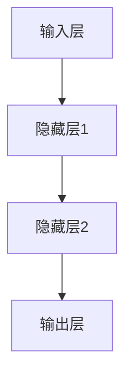
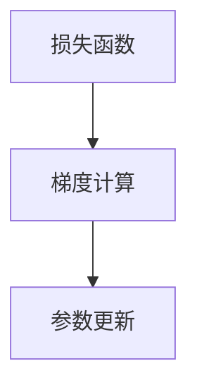
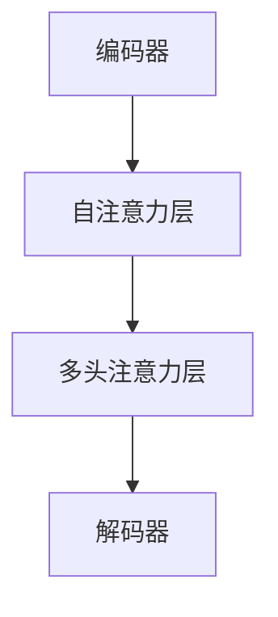

                 

# 【大模型应用开发 动手做AI Agent】AutoGPT简介

> 关键词：大模型，应用开发，AutoGPT，人工智能，深度学习，自然语言处理

> 摘要：本文将介绍大模型应用开发的基础知识，并重点介绍近期备受关注的开源项目AutoGPT。我们将分析AutoGPT的原理、结构、实现方法，以及其在实际应用中的优势。通过本文，读者可以了解到如何利用大模型进行应用开发，并掌握AutoGPT的构建和使用方法。

## 第一部分: 大模型应用开发基础

### 第1章: 大模型应用开发概述

#### 1.1 大模型应用开发的意义与挑战

大模型应用开发是指利用深度学习技术，特别是大规模预训练模型，来构建能够解决实际问题的智能系统。随着人工智能技术的快速发展，大模型在各个领域的应用日益广泛，如自然语言处理、计算机视觉、语音识别等。

**意义：**

1. 提高模型性能：大模型通过在大量数据上进行预训练，可以提取出丰富的特征，从而在特定任务上获得更高的性能。
2. 降低开发难度：大模型的出现使得开发者无需从零开始构建复杂的神经网络，而可以直接利用预训练模型进行迁移学习，简化开发过程。
3. 促进技术创新：大模型的广泛应用推动了深度学习算法和技术的不断进步，为人工智能领域的发展提供了源源不断的动力。

**挑战：**

1. 计算资源需求：大模型通常需要大量的计算资源进行训练，对硬件设备的要求较高。
2. 数据需求：大模型需要大量的高质量数据来进行预训练，数据获取和处理成为一大挑战。
3. 模型解释性：大模型在训练过程中难以解释，对于某些需要高解释性的应用场景，大模型的适用性受到限制。

#### 1.2 大模型应用开发的演进历程

大模型应用开发经历了从传统的手工特征工程到深度学习的转变，再到如今的大模型时代。

1. **传统机器学习：**早期的人工智能应用主要依赖于手工特征工程，开发者需要根据任务需求手动提取特征，构建模型。
2. **深度学习：**随着深度学习技术的发展，自动化的特征提取方法逐渐取代了手工特征工程，大大提高了模型性能。
3. **大规模预训练模型：**近年来，以GPT、BERT等为代表的大规模预训练模型的出现，使得深度学习进入了一个新的阶段，大模型应用开发成为可能。

#### 1.3 大模型应用开发的总体框架

大模型应用开发的总体框架包括以下几个关键环节：

1. **数据准备：**收集并预处理大量高质量数据，为模型训练提供数据支持。
2. **模型训练：**利用预训练模型或从头开始训练大模型，通过大量的数据训练，使模型具备强大的特征提取能力。
3. **模型优化：**针对具体应用任务，对模型进行优化，如调整模型架构、调整超参数等，以提高模型在特定任务上的性能。
4. **模型部署：**将训练好的模型部署到实际应用场景中，实现自动化和智能化的功能。
5. **模型运维：**对模型进行持续监控和更新，确保其稳定性和性能。

## 第二部分: 大模型技术基础

### 第2章: 大模型技术基础

#### 2.1 深度学习与神经网络基础

#### 2.1.1 神经网络的基本结构

神经网络是由大量神经元（节点）组成的层次结构，每个神经元接收来自前一层神经元的输入，通过激活函数处理后输出到下一层。神经网络的层次结构可以分为输入层、隐藏层和输出层。

#### 2.1.2 常见的深度学习架构

深度学习架构主要包括卷积神经网络（CNN）、循环神经网络（RNN）和转换器架构（Transformer）等。

1. **卷积神经网络（CNN）：**主要用于图像处理任务，通过卷积操作提取图像特征。
2. **循环神经网络（RNN）：**用于序列数据处理，如自然语言处理和语音识别。
3. **转换器架构（Transformer）：**由Google提出，用于自然语言处理任务，具有并行计算优势和全局关注能力。

#### 2.1.3 深度学习优化算法

深度学习优化算法主要包括梯度下降（Gradient Descent）和其变种，如随机梯度下降（SGD）、Adam等。

梯度下降是一种优化算法，用于最小化损失函数。其核心思想是通过计算损失函数关于模型参数的梯度，沿着梯度方向更新模型参数，以减小损失。

#### 2.2 自然语言处理技术概览

自然语言处理（NLP）是人工智能的重要分支，旨在使计算机能够理解和处理自然语言。NLP技术主要包括词嵌入、序列模型和注意力机制等。

1. **词嵌入（Word Embedding）：**将单词映射到高维向量空间，使相似的词在向量空间中靠近。
2. **序列模型（Sequential Model）：**用于处理序列数据，如RNN和LSTM等。
3. **注意力机制（Attention Mechanism）：**用于模型在处理序列数据时，对不同的输入数据进行加权，使其对重要信息给予更多关注。

#### 2.2.1 词嵌入技术

词嵌入是将单词映射到高维向量空间的技术，常用的词嵌入方法有Word2Vec、GloVe等。

**Word2Vec：**基于神经网络的语言模型（NLP），将单词表示为向量。训练过程包括两个步骤：预测单词的上下文和预测上下文中的单词。

**GloVe：**全局向量表示（Global Vectors for Word Representation），通过计算单词共现矩阵的因子分解来得到词向量。

#### 2.2.2 序列模型与注意力机制

序列模型用于处理序列数据，常见的序列模型有RNN和LSTM。

**RNN（循环神经网络）：**通过循环结构来处理序列数据，每个时间步的输出都依赖于之前的输入。

**LSTM（长短期记忆网络）：**是RNN的一种改进，通过引入门控机制来避免梯度消失问题，适用于处理长序列数据。

注意力机制是一种让模型在处理序列数据时，能够自动关注重要信息的方法。常见的注意力机制有自注意力（Self-Attention）和多头注意力（Multi-Head Attention）。

#### 2.2.3 转换器架构详解

转换器架构（Transformer）是Google在2017年提出的一种新的深度学习架构，主要用于自然语言处理任务。与传统的序列模型不同，转换器架构具有并行计算优势和全局关注能力。

**转换器架构主要组成部分：**

1. **编码器（Encoder）：**用于处理输入序列，将序列编码为固定长度的向量。
2. **解码器（Decoder）：**用于生成输出序列，解码器在生成每个单词时都依赖于编码器的输出。

**自注意力（Self-Attention）：**转换器架构中的核心机制，用于计算输入序列中每个单词对其他单词的注意力权重。

#### 2.3 大规模预训练模型原理

大规模预训练模型是指通过在大量数据上进行预训练，使模型具备通用特征表示能力的模型。常见的预训练模型有GPT、BERT等。

**预训练的概念与意义：**

1. **概念：**预训练是指在特定任务之前，利用大量未标注的数据对模型进行训练，以便模型能够提取出通用特征。
2. **意义：**预训练可以提高模型的性能，减少对标注数据的依赖，缩短开发周期。

**自监督学习方法：**

自监督学习是一种无需依赖标注数据的学习方法，通过利用数据本身的内在结构来学习特征表示。在预训练过程中，自监督学习方法被广泛采用。

**迁移学习与微调技术：**

迁移学习是指将预训练模型在不同任务上应用，通过微调（Fine-tuning）来适应特定任务。微调过程通常只需要少量的标注数据，可以显著提高模型在特定任务上的性能。

## 第三部分: 大模型应用开发工具与框架

### 第3章: 大模型应用开发工具与框架

#### 3.1 主流深度学习框架对比

在深度学习应用开发中，选择合适的深度学习框架至关重要。主流的深度学习框架包括TensorFlow、PyTorch、JAX等。

#### 3.1.1 TensorFlow

TensorFlow是Google开源的深度学习框架，广泛应用于工业界和学术界。TensorFlow具有以下特点：

1. **易用性：**提供了丰富的API和工具，使开发者能够快速构建和部署深度学习模型。
2. **生态丰富：**拥有大量的预训练模型和开源项目，方便开发者进行迁移学习和复现研究。
3. **分布式训练：**支持大规模模型的分布式训练，适用于高性能计算需求。

#### 3.1.2 PyTorch

PyTorch是Facebook开源的深度学习框架，以动态图（Dynamic Graph）为特色。PyTorch具有以下特点：

1. **易理解：**动态图设计使得模型的可视化和调试更加直观。
2. **灵活性：**提供了丰富的运算符和自定义能力，方便开发者进行模型创新。
3. **生态系统：**与Python深度集成，拥有强大的开源社区支持。

#### 3.1.3 JAX

JAX是Google开源的自动微分库，支持自动微分、向量化和并行计算。JAX在深度学习应用开发中具有以下优势：

1. **自动微分：**JAX提供了高效的自动微分支持，适用于复杂模型的优化。
2. **向量化和并行计算：**JAX支持自动向量化和并行计算，可以提高模型的训练效率。
3. **灵活的编程模型：**JAX提供了灵活的编程模型，方便开发者进行模型创新。

#### 3.1.4 其他框架简介

除了上述主流框架，还有其他一些深度学习框架，如MXNet、Theano等。这些框架各自具有不同的特点和优势，开发者可以根据具体需求进行选择。

### 3.2 大模型应用开发环境搭建

搭建大模型应用开发环境需要考虑计算资源、软件依赖和环境配置等方面。

#### 3.2.1 深度学习环境配置

深度学习环境配置包括安装深度学习框架和相关依赖库。以TensorFlow为例，配置步骤如下：

1. 安装Python环境和pip。
2. 使用pip安装TensorFlow及其依赖库。
3. 验证TensorFlow安装：运行`import tensorflow as tf`，检查版本信息。

#### 3.2.2 数据预处理工具

数据预处理是深度学习应用开发的重要环节，常用的数据预处理工具包括NumPy、Pandas等。数据预处理工具可以用于数据清洗、数据转换和数据增强等操作。

1. **NumPy：**提供高性能的数组操作库，适用于数值计算。
2. **Pandas：**提供数据操作和分析库，适用于数据处理和分析。

#### 3.2.3 代码调试与版本控制工具

代码调试和版本控制是深度学习应用开发中不可或缺的环节。常用的代码调试工具包括PyCharm、VSCode等，版本控制工具包括Git等。

1. **PyCharm：**集成开发环境（IDE），提供代码调试和版本控制功能。
2. **VSCode：**轻量级集成开发环境，支持多种编程语言和扩展。
3. **Git：**分布式版本控制工具，用于管理代码版本和协作开发。

## 第四部分: 大模型应用开发流程

### 第4章: 大模型应用开发流程

#### 4.1 大模型应用开发方法论

大模型应用开发方法论包括以下几个关键环节：

1. **需求分析：**明确应用任务的需求，包括目标、指标、数据等。
2. **技术调研与选型：**分析现有技术方案，选择适合的深度学习框架和算法。
3. **数据准备：**收集并预处理大量高质量数据，为模型训练提供数据支持。
4. **模型设计：**设计模型架构，包括输入层、隐藏层和输出层等。
5. **模型训练：**利用预训练模型或从头开始训练大模型，通过大量的数据训练，使模型具备强大的特征提取能力。
6. **模型优化：**对模型进行优化，如调整模型架构、调整超参数等，以提高模型在特定任务上的性能。
7. **模型部署：**将训练好的模型部署到实际应用场景中，实现自动化和智能化的功能。
8. **模型运维：**对模型进行持续监控和更新，确保其稳定性和性能。

#### 4.1.1 MLOps概述

MLOps（机器学习运维）是指将机器学习实践与软件开发流程相结合，以提高机器学习模型的开发、部署和运维效率。MLOps的关键目标是实现机器学习模型的持续集成、持续部署和持续监控。

1. **持续集成（CI）：**将代码、数据和模型集成到统一的平台中，确保模型在不同环境下的一致性。
2. **持续部署（CD）：**自动化模型部署过程，实现快速迭代和上线。
3. **持续监控（CM）：**对模型进行实时监控，确保模型性能和稳定性。

#### 4.1.2 大模型应用开发的关键环节

在大模型应用开发过程中，以下关键环节至关重要：

1. **数据质量评估：**确保数据质量，包括数据完整性、数据一致性和数据真实性等。
2. **模型训练与优化：**通过调整模型架构、超参数和训练策略等，提高模型性能。
3. **模型评估与验证：**对模型进行评估和验证，确保模型在真实场景中的性能。
4. **模型部署与运维：**将模型部署到实际应用场景，并对其进行监控和更新。

#### 4.1.3 大模型应用开发的最佳实践

大模型应用开发的最佳实践包括以下几点：

1. **明确目标：**在项目开始前，明确应用目标、指标和预期效果。
2. **数据驱动：**充分利用数据，进行数据挖掘和分析，为模型设计提供依据。
3. **迭代开发：**采用敏捷开发方法，快速迭代和优化模型。
4. **团队协作：**建立跨部门、跨职能的团队，确保项目顺利进行。
5. **持续学习：**关注新技术和新方法，持续提升团队的技术水平。

#### 4.2 大模型应用项目实战

以下是一个典型的大模型应用项目实战案例：

**项目背景：**某电商平台希望利用大模型技术提高商品推荐效果，提高用户购买满意度。

**项目目标：**通过大模型技术实现精准的商品推荐，提高用户点击率和购买转化率。

**项目步骤：**

1. **需求分析：**明确商品推荐的目标、指标和用户需求。
2. **数据收集与处理：**收集用户行为数据、商品信息数据等，进行数据清洗和预处理。
3. **模型设计：**采用GPT模型进行商品推荐，设计输入层、隐藏层和输出层。
4. **模型训练：**利用大量用户行为数据进行模型训练，使模型具备强大的特征提取能力。
5. **模型优化：**通过调整模型参数和训练策略，提高模型性能。
6. **模型部署：**将训练好的模型部署到电商平台，实现实时商品推荐。
7. **模型监控与更新：**对模型进行实时监控，确保模型性能和稳定性，定期更新模型。

#### 4.2.1 项目背景与目标

**项目背景：**随着电商平台的快速发展，商品推荐已成为提升用户体验和转化率的关键环节。然而，传统的推荐算法存在推荐结果单一、用户满意度不高等问题，难以满足个性化推荐的需求。

**项目目标：**通过引入大模型技术，实现精准的商品推荐，提高用户点击率和购买转化率。具体目标包括：

1. 提高用户点击率：通过分析用户行为数据，为用户提供个性化推荐，提高用户点击率。
2. 提高购买转化率：通过精准的商品推荐，提高用户购买意愿，提高购买转化率。
3. 提升用户体验：通过智能化推荐，提升用户满意度，增强用户对电商平台的信任和依赖。

#### 4.2.2 数据收集与处理

**数据收集：**为了实现精准的商品推荐，需要收集大量的用户行为数据和商品信息数据。用户行为数据包括用户浏览、搜索、收藏、购买等行为，商品信息数据包括商品名称、类别、价格、销量等。

**数据处理：**收集到的数据需要进行清洗和预处理，以去除噪声和异常值，确保数据质量。数据处理步骤包括：

1. 数据清洗：去除重复数据、缺失数据和异常数据。
2. 数据归一化：对数值型数据进行归一化处理，使其在同一尺度上。
3. 数据编码：对类别型数据进行编码处理，如使用独热编码或标签编码。
4. 特征工程：提取用户和商品的特征，如用户购买频率、商品销售量等。

#### 4.2.3 大模型设计

**模型架构：**采用GPT模型进行商品推荐，GPT模型具有强大的特征提取能力和并行计算优势。模型架构包括输入层、隐藏层和输出层。

1. **输入层：**接收用户行为数据和商品信息数据，将数据编码为向量。
2. **隐藏层：**通过多层神经网络，对输入数据进行特征提取和变换。
3. **输出层：**输出商品推荐结果，使用Softmax函数进行概率分布计算。

**训练过程：**利用大量用户行为数据进行模型训练，通过优化算法（如Adam）调整模型参数，使模型在预测用户行为上表现更好。训练过程包括以下步骤：

1. 数据准备：将用户行为数据和商品信息数据进行编码和归一化处理。
2. 模型初始化：初始化模型参数，可以使用随机初始化或预训练模型初始化。
3. 训练循环：对于每个训练样本，计算预测结果和损失函数，通过反向传播更新模型参数。
4. 评估与优化：在训练过程中，定期评估模型性能，调整超参数和训练策略，以提高模型性能。

#### 4.2.4 模型训练与优化

**模型训练：**利用大量用户行为数据进行模型训练，通过优化算法（如Adam）调整模型参数，使模型在预测用户行为上表现更好。训练过程包括以下步骤：

1. 数据准备：将用户行为数据和商品信息数据进行编码和归一化处理。
2. 模型初始化：初始化模型参数，可以使用随机初始化或预训练模型初始化。
3. 训练循环：对于每个训练样本，计算预测结果和损失函数，通过反向传播更新模型参数。
4. 评估与优化：在训练过程中，定期评估模型性能，调整超参数和训练策略，以提高模型性能。

**模型优化：**通过调整模型参数和训练策略，提高模型性能。常见的优化方法包括：

1. **调整学习率：**学习率是模型训练过程中的重要参数，通过调整学习率可以加快或减缓模型收敛速度。
2. **批量大小：**批量大小是指每次训练过程中用于计算梯度的小批量数据的大小，通过调整批量大小可以影响模型训练的稳定性和速度。
3. **正则化：**正则化方法（如L1、L2正则化）可以防止模型过拟合，提高模型泛化能力。
4. **dropout：**dropout是一种常用的正则化方法，通过随机丢弃一部分神经元来提高模型泛化能力。

#### 4.2.5 模型部署与运维

**模型部署：**将训练好的模型部署到电商平台，实现实时商品推荐。部署过程包括以下步骤：

1. **模型转换：**将训练好的模型转换为部署平台支持的格式，如TensorFlow SavedModel或PyTorch TorchScript。
2. **服务部署：**在部署平台上部署模型服务，如使用TensorFlow Serving或PyTorch Lightning。
3. **接口设计：**设计API接口，实现用户请求与模型服务的交互。

**模型运维：**对模型进行持续监控和更新，确保模型性能和稳定性。运维过程包括以下方面：

1. **性能监控：**实时监控模型性能指标，如准确率、召回率、F1分数等，及时发现和处理性能问题。
2. **稳定性监控：**监控模型服务的稳定性，如服务响应时间、错误率等，确保模型服务的正常运行。
3. **更新与迭代：**定期更新模型，引入新的用户行为数据和商品信息数据，优化模型性能和推荐效果。
4. **安全监控：**监控模型服务的安全性，如防止恶意攻击、数据泄露等。

#### 4.3 大模型应用案例分析

以下为几个典型的大模型应用案例：

##### 案例一：自然语言生成

**项目背景：**自然语言生成（NLG）技术在智能客服、内容生成等领域具有广泛应用。通过大模型技术，可以实现高质量的文本生成。

**项目目标：**实现自动化文本生成，提高客服效率，降低人力成本。

**应用场景：**智能客服系统、新闻报道自动生成、广告文案自动生成等。

**模型设计：**采用GPT模型进行文本生成，设计输入层、隐藏层和输出层。

**模型训练：**利用大量文本数据进行模型训练，通过优化算法调整模型参数。

**模型部署：**将训练好的模型部署到客服系统，实现自动化文本生成。

##### 案例二：图像识别

**项目背景：**图像识别技术在安防监控、医疗诊断等领域具有广泛应用。通过大模型技术，可以实现高精度的图像识别。

**项目目标：**实现自动化图像识别，提高识别准确率，降低误报率。

**应用场景：**安防监控、医疗诊断、自动驾驶等。

**模型设计：**采用卷积神经网络（CNN）进行图像识别，设计卷积层、池化层和全连接层。

**模型训练：**利用大量图像数据进行模型训练，通过优化算法调整模型参数。

**模型部署：**将训练好的模型部署到图像识别系统，实现自动化图像识别。

##### 案例三：语音识别

**项目背景：**语音识别技术在智能助手、语音搜索等领域具有广泛应用。通过大模型技术，可以实现高精度的语音识别。

**项目目标：**实现自动化语音识别，提高识别准确率，降低误报率。

**应用场景：**智能助手、语音搜索、语音控制等。

**模型设计：**采用循环神经网络（RNN）进行语音识别，设计输入层、隐藏层和输出层。

**模型训练：**利用大量语音数据进行模型训练，通过优化算法调整模型参数。

**模型部署：**将训练好的模型部署到语音识别系统，实现自动化语音识别。

## 第五部分: 大模型应用领域探索

### 第5章: 大模型应用领域探索

随着大模型技术的不断发展，其在各个领域中的应用也越来越广泛。以下将探讨大模型在金融行业、医疗健康领域和教育行业中的应用。

#### 5.1 金融行业应用

金融行业是一个数据密集型的行业，大模型在金融风控、投资策略优化和个性化理财服务等方面具有广泛的应用前景。

1. **金融风控：**大模型可以分析大量历史数据和实时数据，识别潜在风险，提高风控能力。
2. **投资策略优化：**通过分析市场数据，大模型可以帮助投资者制定更科学的投资策略，降低投资风险。
3. **个性化理财服务：**大模型可以根据用户的风险偏好和投资目标，为用户提供个性化的理财建议，提高用户满意度。

#### 5.2 医疗健康领域应用

医疗健康领域是人工智能的重要应用领域，大模型在疾病预测与诊断、医疗图像分析和公共卫生监测等方面具有重要作用。

1. **疾病预测与诊断：**大模型可以通过分析患者的病历、基因信息和外部数据等，预测疾病的发生风险，辅助医生进行诊断。
2. **医疗图像分析：**大模型可以对医学图像进行自动分析，识别病变区域，提高诊断准确率。
3. **公共卫生监测：**大模型可以通过分析公共卫生数据，预测疫情趋势，为公共卫生决策提供支持。

#### 5.3 教育行业应用

教育行业是人工智能的重要应用领域，大模型在智能教学辅助、学生个性化学习分析和教育资源推荐等方面具有广泛的应用前景。

1. **智能教学辅助：**大模型可以根据学生的学习特点和需求，为学生提供个性化的教学资源和辅导。
2. **学生个性化学习分析：**大模型可以分析学生的学习行为和学习成果，为学生提供个性化的学习建议，提高学习效果。
3. **教育资源推荐：**大模型可以根据学生的兴趣和学习需求，为教师和学生推荐合适的教育资源，提高教育资源利用效率。

## 第六部分: 大模型应用开发的未来趋势

### 第6章: 大模型应用开发的未来趋势

随着人工智能技术的不断发展，大模型应用开发面临着新的挑战和机遇。以下将探讨大模型应用开发的未来趋势。

#### 6.1 大模型应用开发的新挑战

1. **模型可解释性：**随着模型规模的不断扩大，大模型的复杂性和黑箱特性日益突出，如何提高模型的可解释性成为一大挑战。
2. **数据隐私保护：**在应用大模型时，如何保护用户数据的隐私成为关键问题，需要采取有效的隐私保护措施。
3. **绿色可持续发展：**大模型训练和推理过程需要大量计算资源，如何降低能耗，实现绿色可持续发展成为重要议题。

#### 6.2 大模型应用开发的未来方向

1. **模型压缩与加速：**通过模型压缩和加速技术，降低大模型对计算资源的需求，提高模型部署的效率。
2. **多模态大模型应用：**将不同类型的数据（如文本、图像、语音等）进行融合，构建多模态大模型，提高模型在复杂任务上的性能。
3. **大模型与边缘计算的结合：**将大模型与边缘计算相结合，实现实时、高效的大模型应用，满足低延迟和高性能的需求。

## 第七部分: 大模型应用开发的资源与工具汇总

### 第7章: 大模型应用开发的资源与工具汇总

为了帮助读者更好地了解大模型应用开发，本章将汇总一些常用的资源与工具。

#### 7.1 主流深度学习框架

1. **TensorFlow：**https://www.tensorflow.org/
2. **PyTorch：**https://pytorch.org/
3. **JAX：**https://jax.pygon/

#### 7.2 大模型应用开发工具与平台

1. **Hugging Face：**https://huggingface.co/
2. **MLflow：**https://mlflow.org/
3. **TensorBoard：**https://www.tensorflow.org/tensorboard/

#### 7.3 数据预处理工具

1. **NumPy：**https://numpy.org/
2. **Pandas：**https://pandas.pydata.org/
3. **Scikit-learn：**https://scikit-learn.org/

#### 7.4 代码调试与版本控制工具

1. **PyCharm：**https://www.jetbrains.com/pycharm/
2. **VSCode：**https://code.visualstudio.com/
3. **Git：**https://git-scm.com/

#### 7.5 模型训练与优化工具

1. **CUDA：**https://developer.nvidia.com/cuda-downloads
2. **cuDNN：**https://docs.nvidia.com/deeplearning/cudnn/install-guide/index.html
3. **Docker：**https://www.docker.com/

#### 7.6 模型部署与运维工具

1. **TensorFlow Serving：**https://www.tensorflow.org/tfx/serving
2. **PyTorch Lightning：**https://pytorch-lightning.readthedocs.io/
3. **Kubernetes：**https://kubernetes.io/

### 附录 A: 大模型应用开发参考资源

#### A.1 学术论文与研究报告

1. **"Attention Is All You Need"：**https://arxiv.org/abs/1706.03762
2. **"BERT: Pre-training of Deep Bidirectional Transformers for Language Understanding"：**https://arxiv.org/abs/1810.04805
3. **"Generative Pre-trained Transformer"：**https://arxiv.org/abs/1704.04368

#### A.2 开源代码与项目

1. **Transformer：**https://github.com/tensorflow/models/blob/master/tutorials/transformers
2. **BERT：**https://github.com/google-research/bert
3. **GPT-2：**https://github.com/openai/gpt-2

#### A.3 在线课程与教程

1. **深度学习教程：**https://www.deeplearningbook.org/
2. **Transformer教程：**https://ai[Anything]world.com/tutorial-transformers/
3. **BERT教程：**https://github.com/bojone/BERT-tutorial

### 附录 B: 大模型应用开发常见问题与解答

#### B.1 深度学习基础问题

1. **什么是深度学习？**
   - 深度学习是一种人工智能方法，通过多层神经网络学习数据的特征表示。
2. **什么是神经网络的反向传播算法？**
   - 反向传播算法是一种用于计算神经网络参数梯度的算法，通过梯度下降优化参数。
3. **什么是dropout？**
   - Dropout是一种常用的正则化方法，通过随机丢弃一部分神经元来防止模型过拟合。

#### B.2 大模型训练与优化问题

1. **为什么大模型的训练需要大量数据？**
   - 大模型需要大量的数据来学习丰富的特征表示，提高模型的泛化能力。
2. **什么是迁移学习？**
   - 迁移学习是指将预训练模型在不同任务上应用，通过微调来适应特定任务。
3. **如何优化大模型的训练速度？**
   - 可以使用分布式训练、更高效的优化算法（如Adam）、批量归一化等技术来优化大模型的训练速度。

#### B.3 模型部署与运维问题

1. **如何将训练好的模型部署到生产环境中？**
   - 可以使用TensorFlow Serving、PyTorch Lightning等工具将模型部署到生产环境中。
2. **什么是MLOps？**
   - MLOps是将机器学习实践与软件开发流程相结合，以提高模型开发、部署和运维效率的方法。
3. **如何确保模型在生产环境中的稳定性？**
   - 可以通过监控模型性能、数据质量、系统资源使用情况等方式来确保模型在生产环境中的稳定性。

### 附录 C: 大模型应用开发工具集成指南

#### C.1 深度学习框架集成

1. **TensorFlow：**
   - 安装TensorFlow：`pip install tensorflow`
   - 配置CUDA：`pip install tensorflow-gpu`
   - 使用TensorFlow进行模型训练：`import tensorflow as tf`
2. **PyTorch：**
   - 安装PyTorch：`pip install torch torchvision`
   - 使用PyTorch进行模型训练：`import torch`
   - 配置CUDA：`torch.cuda.is_available()`

#### C.2 数据预处理工具集成

1. **NumPy：**
   - 安装NumPy：`pip install numpy`
   - 使用NumPy进行数据操作：`import numpy as np`
2. **Pandas：**
   - 安装Pandas：`pip install pandas`
   - 使用Pandas进行数据操作：`import pandas as pd`

#### C.3 代码调试与版本控制工具集成

1. **PyCharm：**
   - 安装PyCharm：下载并安装PyCharm社区版或专业版。
   - 配置Python环境：在PyCharm中配置Python解释器和相应的库。
2. **VSCode：**
   - 安装VSCode：下载并安装VSCode。
   - 安装扩展：在VSCode中安装Python扩展，如`Python`、`Pylance`等。

#### C.4 模型训练与优化工具集成

1. **CUDA与cuDNN：**
   - 安装CUDA：下载并安装NVIDIA CUDA Toolkit。
   - 安装cuDNN：下载并安装NVIDIA cuDNN库。
2. **Docker：**
   - 安装Docker：下载并安装Docker。
   - 使用Docker容器化模型训练：创建Dockerfile，配置模型训练环境，构建并运行Docker容器。

#### C.5 模型部署与运维工具集成

1. **TensorFlow Serving：**
   - 安装TensorFlow Serving：`pip install tensorflow-serving`
   - 部署TensorFlow模型：将训练好的模型文件上传到服务器，启动TensorFlow Serving服务。
2. **PyTorch Lightning：**
   - 安装PyTorch Lightning：`pip install pytorch-lightning`
   - 部署PyTorch模型：使用PyTorch Lightning的`Trainer`类进行模型部署。
3. **Kubernetes：**
   - 安装Kubernetes：下载并安装Kubernetes集群。
   - 部署模型服务：使用Kubernetes进行模型服务的部署和管理。

