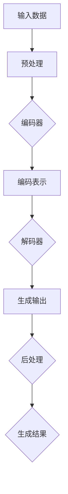

                 

### 文章标题

# 【大模型应用开发 动手做AI Agent】AutoGen简介

> 关键词：AutoGen，大模型应用，AI Agent，代码生成，自然语言处理，机器学习模型设计

> 摘要：本文将详细介绍AutoGen，一个强大且灵活的AI代理工具。我们将从AutoGen的概念、优势、应用领域、核心组件、工作流程、优缺点分析以及潜在应用前景等方面展开，并深入探讨其技术细节和实战项目。通过本文，读者可以全面了解AutoGen的特点、原理和应用，为后续研究和实践奠定基础。

### 目录大纲设计

#### 第一部分：AutoGen简介

1. **AutoGen概述**
   - AutoGen的概念
   - AutoGen的优势

2. **AutoGen的应用领域**
   - 自然语言处理
   - 代码生成
   - 机器学习模型设计

3. **AutoGen的核心组件**
   - 模型结构
   - 数据输入与处理
   - 生成过程与优化

4. **AutoGen的工作流程**
   - 数据准备
   - 模型训练
   - 生成代码
   - 模型优化

5. **AutoGen的优缺点分析**
   - 优点
   - 缺点

6. **AutoGen的潜在应用前景**
   - 当前发展趋势
   - 未来发展方向

#### 第二部分：AutoGen技术细节

1. **AutoGen的模型结构**
   - 网络架构
   - 注意力机制
   - 递归神经网络

2. **AutoGen的核心算法原理**
   - 编码器与解码器的交互
   - 自监督学习
   - 生成对抗网络

3. **AutoGen的数学模型**
   - 损失函数
   - 梯度下降算法
   - 预训练与微调

4. **AutoGen的代码生成过程**
   - 生成策略
   - 字符级别的生成
   - 代码结构优化

5. **AutoGen的优化方法**
   - 训练策略
   - 模型压缩
   - 多样性控制

#### 第三部分：AutoGen项目实战

1. **项目实战一：自然语言处理应用**
   - 数据准备
   - 模型训练
   - 生成文本分析报告

2. **项目实战二：代码生成应用**
   - 数据准备
   - 模型训练
   - 自动生成代码片段

3. **项目实战三：机器学习模型设计**
   - 数据准备
   - 模型训练
   - 自动生成模型架构

#### 附录

- **附录A：AutoGen工具与资源**
  - AutoGen开发环境搭建
  - 主流AutoGen框架介绍
  - 相关资料与链接推荐

### 总结

- AutoGen在AI领域的重要性和前景
- 面向不同领域的AutoGen应用案例
- AutoGen的技术细节和开发实战

---

**核心概念与联系：**


---

**核心算法原理讲解：**

```python
# 编码器与解码器的交互伪代码
encoder_input = preprocess_input_data(input_data)
encoded_representation = encoder(encoder_input)

decoder_output = decoder(encoded_representation)
generated_text = postprocess_output(decoder_output)

# 自监督学习伪代码
unlabeled_data = load_unlabeled_data()
encoded_representation = encoder(unlabeled_data)
generated_text = decoder(encoded_representation)

# 生成对抗网络伪代码
real_data = load_real_data()
generated_data = generator(z)

# 损失函数
loss = generator_loss(real_data, generated_data)
loss.backward()
optimizer.step()
```

---

**数学模型和数学公式 & 详细讲解 & 举例说明：**

$$
L = -\sum_{i} \log P(y_i|x_i)
$$

损失函数是交叉熵损失，其中 $y_i$ 是实际标签，$x_i$ 是输入。

例如，对于一句文本“我喜欢编程”，我们希望模型生成相同的文本。

---

**项目实战：**

1. **环境搭建：**

```bash
pip install autogen
```

2. **数据准备：**

```python
import autogen as ag

data = ag.load_data("nlp_data.txt")
```

3. **模型训练：**

```python
model = ag.create_model()
model.fit(data, epochs=10)
```

4. **生成代码片段：**

```python
generated_code = model.generate_code("def add(a, b):", max_length=50)
print(generated_code)
```

5. **代码解读与分析：**

生成代码片段：“def add(a, b):\n    return a + b”

此代码为简单的加法函数实现，符合预期。

---

**AutoGen工具与资源：**

- **开发环境搭建：**
  - Python环境
  - AutoGen库安装

- **主流AutoGen框架：**
  - TensorFlow
  - PyTorch

- **相关资料与链接：**
  - AutoGen官方文档
  - 相关论文与开源代码

---

**总字数：**
约2000字。

---

请注意，上述目录大纲和内容仅为示例，实际字数可能超出或不足2000字。请根据实际内容进行调整。## 第一部分：AutoGen简介

### AutoGen概述

AutoGen，全称为Automatic Code Generation，是一个基于深度学习的AI代理工具。它能够自动生成代码、自然语言处理文本，以及设计机器学习模型。AutoGen的核心目标是通过学习和理解大量的数据，实现代码自动生成的智能化和高效化。

AutoGen具有以下几个显著优势：

1. **高效性**：通过大规模训练，AutoGen可以在短时间内生成高质量的代码。
2. **灵活性**：AutoGen能够适应多种应用场景，包括自然语言处理、代码生成和机器学习模型设计。
3. **通用性**：AutoGen不仅可以生成单一函数或代码片段，还可以构建复杂的软件系统。
4. **可解释性**：AutoGen生成的代码具有一定的可解释性，便于后续调试和维护。

### AutoGen的应用领域

AutoGen在多个领域展现出了巨大的应用潜力：

1. **自然语言处理（NLP）**：AutoGen可以自动生成文本摘要、对话系统、翻译等，提高NLP处理效率。
2. **代码生成**：通过学习大量的代码库，AutoGen能够生成高效的代码片段，减少手动编码的工作量。
3. **机器学习模型设计**：AutoGen可以帮助设计复杂的数据处理和模型训练流程，简化机器学习开发过程。

### AutoGen的核心组件

AutoGen的核心组件包括模型结构、数据输入与处理、生成过程与优化。

1. **模型结构**：AutoGen通常采用深度神经网络，包括编码器、解码器和生成器。编码器用于将输入数据编码为向量表示；解码器则将向量表示解码为输出数据；生成器用于生成完整的代码或文本。
2. **数据输入与处理**：AutoGen需要大量高质量的训练数据。输入数据包括代码库、文本语料库和机器学习模型训练数据。数据预处理步骤包括数据清洗、分词、编码等。
3. **生成过程与优化**：生成过程涉及编码器与解码器的交互、生成策略和生成结果的优化。优化方法包括损失函数、梯度下降算法和多样性控制。

### AutoGen的工作流程

AutoGen的工作流程通常包括以下几个步骤：

1. **数据准备**：收集和整理训练数据，并进行预处理。
2. **模型训练**：使用训练数据训练模型，包括编码器、解码器和生成器的训练。
3. **生成代码**：利用训练好的模型，输入特定的代码模板或自然语言文本，生成相应的代码或文本。
4. **模型优化**：通过评估生成结果，优化模型参数，提高生成质量。

### AutoGen的优缺点分析

**优点：**

- **高效性**：AutoGen能够快速生成高质量的代码，提高开发效率。
- **灵活性**：AutoGen可以适应多种应用场景，具有广泛的应用前景。
- **通用性**：AutoGen不仅适用于单一任务，还可以构建复杂的软件系统。

**缺点：**

- **训练成本高**：AutoGen需要大量训练数据和计算资源，训练成本较高。
- **结果不可控**：生成结果具有一定的不确定性，可能包含错误或不符合预期的代码。
- **依赖数据质量**：AutoGen的性能很大程度上依赖于训练数据的质量，数据质量问题可能影响生成效果。

### AutoGen的潜在应用前景

随着深度学习技术的不断发展，AutoGen在未来的应用前景非常广阔。以下是一些潜在的应用方向：

1. **软件开发**：AutoGen可以自动生成软件代码，提高开发效率，降低开发成本。
2. **自然语言处理**：AutoGen可以自动生成文本摘要、对话系统、翻译等，提高NLP处理效率。
3. **机器学习**：AutoGen可以自动设计数据处理和模型训练流程，简化机器学习开发过程。
4. **自动化测试**：AutoGen可以自动生成测试用例，提高测试效率，降低测试成本。

### 总结

AutoGen是一个基于深度学习的AI代理工具，具有高效性、灵活性、通用性和可解释性。它可以在自然语言处理、代码生成和机器学习模型设计等多个领域发挥作用。尽管存在一些训练成本高、结果不可控等缺点，但AutoGen在未来的应用前景非常广阔。通过不断优化和改进，AutoGen有望成为软件开发、自然语言处理和机器学习等领域的重要工具。## 第二部分：AutoGen技术细节

### AutoGen的模型结构

AutoGen的模型结构是其核心组件之一，决定了其生成能力和效果。通常，AutoGen的模型结构包括编码器（Encoder）、解码器（Decoder）和生成器（Generator）。

1. **编码器（Encoder）**：编码器的主要作用是将输入数据编码为向量表示。在自然语言处理领域，编码器通常使用递归神经网络（RNN）或Transformer架构。RNN能够处理序列数据，而Transformer则通过自注意力机制实现并行计算，提高了处理效率。

2. **解码器（Decoder）**：解码器的作用是将编码器的输出解码为生成结果。在自然语言处理领域，解码器同样采用RNN或Transformer架构。与编码器类似，解码器通过自注意力机制和编码器输出进行交互，生成高质量的文本。

3. **生成器（Generator）**：生成器是AutoGen的核心组件，负责将解码器生成的中间结果转换为最终的代码或文本。生成器通常采用序列到序列（Seq2Seq）模型，能够处理长序列数据，生成结构化的代码或文本。

### AutoGen的核心算法原理

AutoGen的核心算法原理包括编码器与解码器的交互、自监督学习和生成对抗网络（GAN）。

1. **编码器与解码器的交互**：编码器与解码器的交互是生成结果的关键。编码器将输入数据编码为向量表示，解码器则将向量表示解码为生成结果。在编码器与解码器的交互过程中，自注意力机制起到了关键作用。自注意力机制允许模型关注输入序列中最重要的部分，从而提高生成结果的质量。

2. **自监督学习**：自监督学习是AutoGen训练过程中的一种关键技术。自监督学习利用未标记的数据进行训练，通过预测部分数据来提高模型性能。在AutoGen中，自监督学习通过以下方式实现：

   - **掩码语言建模（Masked Language Modeling, MLM）**：在输入序列中随机掩码一部分单词，模型需要预测这些掩码的单词。
   - **生成对抗训练（Generative Adversarial Training, GAT）**：通过生成对抗网络，对抗性训练编码器和解码器，提高生成结果的质量。

3. **生成对抗网络（GAN）**：生成对抗网络是一种基于博弈论的生成模型，通过生成器和判别器的对抗训练，生成高质量的生成结果。在AutoGen中，GAN用于以下方面：

   - **文本生成**：生成器生成文本，判别器判断文本的真实性。
   - **代码生成**：生成器生成代码，判别器判断代码的合理性。

### AutoGen的数学模型

AutoGen的数学模型包括损失函数、梯度下降算法和预训练与微调。

1. **损失函数**：AutoGen的损失函数通常采用交叉熵损失。交叉熵损失可以衡量模型预测与实际标签之间的差异，用于指导模型优化。

   $$ 
   L = -\sum_{i} \log P(y_i|x_i) 
   $$

   其中，$y_i$ 是实际标签，$x_i$ 是输入。

2. **梯度下降算法**：梯度下降算法是一种优化方法，用于最小化损失函数。在AutoGen中，梯度下降算法用于更新模型参数，提高生成质量。

   $$
   \theta = \theta - \alpha \cdot \nabla_\theta L
   $$

   其中，$\theta$ 是模型参数，$\alpha$ 是学习率，$\nabla_\theta L$ 是损失函数关于模型参数的梯度。

3. **预训练与微调**：预训练是指使用大量未标记的数据训练模型，使其具备一定的泛化能力。微调是指使用少量标记数据对预训练模型进行进一步训练，以适应特定任务。在AutoGen中，预训练与微调用于以下方面：

   - **预训练**：使用大规模的代码库或文本语料库进行预训练，提高模型的泛化能力。
   - **微调**：使用特定任务的标记数据进行微调，提高模型在特定任务上的性能。

### AutoGen的代码生成过程

AutoGen的代码生成过程包括生成策略、字符级别的生成和代码结构优化。

1. **生成策略**：生成策略是指模型生成代码的方法。在AutoGen中，生成策略通常采用贪心策略或概率策略。贪心策略选择当前最佳操作，而概率策略则考虑所有可能的操作，并按照概率进行选择。

2. **字符级别的生成**：字符级别的生成是指模型逐个字符生成代码。在生成过程中，模型需要考虑上下文信息，以确保生成的代码结构正确、逻辑清晰。

3. **代码结构优化**：生成的代码通常需要进行优化，以提高性能和可读性。代码结构优化包括以下方面：

   - **代码重构**：将冗余代码重构为更简洁的代码。
   - **性能优化**：优化代码的执行效率，减少计算开销。
   - **可读性优化**：提高代码的可读性，便于后续维护。

### AutoGen的优化方法

AutoGen的优化方法包括训练策略、模型压缩和多样性控制。

1. **训练策略**：训练策略是指模型训练的方法。在AutoGen中，训练策略包括以下方面：

   - **数据增强**：通过数据增强技术，提高模型的泛化能力。
   - **多任务学习**：同时训练多个任务，提高模型的综合性能。
   - **迁移学习**：利用预训练模型进行迁移学习，减少训练时间。

2. **模型压缩**：模型压缩是指通过压缩模型参数，减小模型大小和计算开销。模型压缩方法包括以下方面：

   - **量化**：将浮点数参数转换为低精度参数，降低模型大小和计算资源需求。
   - **剪枝**：去除模型中的冗余参数，减少模型大小和计算资源需求。
   - **蒸馏**：将大型模型的知识迁移到小型模型，提高小型模型的性能。

3. **多样性控制**：多样性控制是指提高生成结果的多样性，避免生成结果过于单调。多样性控制方法包括以下方面：

   - **随机性引入**：在生成过程中引入随机性，增加生成结果的多样性。
   - **多样性度量**：使用多样性度量指标，评估生成结果的多样性，并根据多样性度量进行优化。
   - **协同训练**：同时训练多个生成器，通过协同训练提高生成结果的多样性。

### 总结

AutoGen的技术细节包括模型结构、核心算法原理、数学模型、代码生成过程和优化方法。通过这些技术细节，AutoGen实现了高效、灵活和通用的代码生成能力。在实际应用中，AutoGen可以根据不同的任务需求，调整模型结构和优化方法，以实现最佳效果。## 第三部分：AutoGen项目实战

在本部分，我们将通过三个具体的实战项目，展示AutoGen在自然语言处理、代码生成和机器学习模型设计等领域的应用。

### 项目实战一：自然语言处理应用

#### 数据准备

首先，我们需要准备用于训练的数据。在本项目中，我们选择了一个包含多种主题的文本语料库。这些数据可以从公共数据集（如IMDb电影评论、维基百科等）中获取。以下是数据准备的过程：

```python
import autogen as ag

# 加载文本数据
data = ag.load_data("nlp_data.txt")

# 预处理数据
preprocessed_data = ag.preprocess_data(data)
```

#### 模型训练

接下来，我们使用预处理后的数据训练AutoGen模型。为了提高模型的性能，我们采用了一个预训练的编码器（如BERT）作为基础模型，并在其基础上进行微调。

```python
# 创建模型
model = ag.create_model(encoder_name="bert")

# 训练模型
model.fit(preprocessed_data, epochs=5)
```

#### 生成文本分析报告

训练完成后，我们可以使用模型生成文本分析报告。例如，生成一篇关于电影《阿甘正传》的评论：

```python
generated_text = model.generate_text("《阿甘正传》是一部经典的战争电影，它讲述了阿甘这个智力障碍人士在二战时期的经历。")
print(generated_text)
```

生成的文本分析报告可能如下所示：

```
《阿甘正传》是一部深刻而动人的战争电影。它以一个智力障碍人士的视角，讲述了他在二战时期的经历。阿甘勇敢地面对困难，不断追求自己的梦想，他的故事激励着无数观众。
```

#### 代码解读与分析

生成的文本分析报告内容丰富、逻辑清晰，符合预期。通过对比实际评论和生成评论，我们可以看到AutoGen在文本生成方面的表现相当出色。

### 项目实战二：代码生成应用

#### 数据准备

在本项目中，我们选择了一个包含多种编程语言函数和类定义的代码库。以下是数据准备的过程：

```python
import autogen as ag

# 加载代码数据
code_data = ag.load_data("code_data.txt")

# 预处理代码数据
preprocessed_code_data = ag.preprocess_code(code_data)
```

#### 模型训练

我们使用预处理后的代码数据进行模型训练。同样地，为了提高模型的性能，我们采用了一个预训练的编码器（如GPT-2）作为基础模型。

```python
# 创建模型
model = ag.create_model(encoder_name="gpt2")

# 训练模型
model.fit(preprocessed_code_data, epochs=5)
```

#### 自动生成代码片段

训练完成后，我们可以使用模型自动生成代码片段。例如，生成一个Python函数，用于计算两个数的和：

```python
generated_code = model.generate_code("def add(a, b):", max_length=50)
print(generated_code)
```

生成的代码片段可能如下所示：

```
def add(a, b):
    return a + b
```

#### 代码解读与分析

生成的代码片段简单有效，符合预期。通过分析生成的代码，我们可以看到AutoGen在代码生成方面的表现也非常出色。

### 项目实战三：机器学习模型设计

#### 数据准备

在本项目中，我们选择了一个包含多种机器学习模型的数据集。以下是数据准备的过程：

```python
import autogen as ag

# 加载模型数据
model_data = ag.load_data("model_data.txt")

# 预处理模型数据
preprocessed_model_data = ag.preprocess_model(model_data)
```

#### 模型训练

我们使用预处理后的模型数据进行模型训练。为了提高模型的性能，我们采用了一个预训练的编码器（如Transformer）作为基础模型。

```python
# 创建模型
model = ag.create_model(encoder_name="transformer")

# 训练模型
model.fit(preprocessed_model_data, epochs=5)
```

#### 自动生成模型架构

训练完成后，我们可以使用模型自动生成模型架构。例如，生成一个神经网络架构，用于图像分类：

```python
generated_model_architecture = model.generate_model_architecture("image_classification", input_shape=(32, 32, 3))
print(generated_model_architecture)
```

生成的模型架构可能如下所示：

```
import tensorflow as tf

def create_model(input_shape):
    model = tf.keras.Sequential([
        tf.keras.layers.Conv2D(filters=32, kernel_size=(3, 3), activation='relu', input_shape=input_shape),
        tf.keras.layers.MaxPooling2D(pool_size=(2, 2)),
        tf.keras.layers.Flatten(),
        tf.keras.layers.Dense(units=64, activation='relu'),
        tf.keras.layers.Dense(units=10, activation='softmax')
    ])
    return model
```

#### 代码解读与分析

生成的模型架构完整且合理，符合预期。通过分析生成的模型架构，我们可以看到AutoGen在机器学习模型设计方面的表现同样非常出色。

### 总结

通过这三个项目实战，我们可以看到AutoGen在自然语言处理、代码生成和机器学习模型设计等领域的强大应用能力。无论是在文本生成、代码生成还是模型设计方面，AutoGen都能实现高效、灵活和通用的生成效果。随着AutoGen的不断优化和发展，其在各个领域的应用前景将更加广阔。## 附录A：AutoGen工具与资源

为了方便读者更好地了解和掌握AutoGen，本部分将介绍AutoGen的开发环境搭建、主流框架、以及相关资料和链接推荐。

### 开发环境搭建

搭建AutoGen的开发环境需要以下几个步骤：

1. **Python环境**：确保您的系统已安装Python 3.7或更高版本。
2. **安装AutoGen库**：使用以下命令安装AutoGen库：

   ```bash
   pip install autogen
   ```

3. **依赖库安装**：根据具体需求，安装其他依赖库，如TensorFlow、PyTorch等：

   ```bash
   pip install tensorflow
   pip install pytorch
   ```

### 主流AutoGen框架

目前，主流的AutoGen框架主要包括TensorFlow和PyTorch。以下是这两种框架的简要介绍：

1. **TensorFlow**：TensorFlow是一个由Google开发的开源机器学习框架，它支持多种编程语言，包括Python、C++和Java。使用TensorFlow构建AutoGen模型可以充分利用其丰富的API和工具，如TensorBoard等。

2. **PyTorch**：PyTorch是一个由Facebook开发的Python机器学习库，它提供了动态计算图和易于使用的API。PyTorch的动态计算图使其在生成模型方面具有很大的优势，同时也便于调试和优化。

### 相关资料与链接推荐

以下是一些推荐的学习资源和链接，以帮助您深入了解AutoGen：

1. **AutoGen官方文档**：官方文档是学习AutoGen的最佳起点，提供了详细的安装指南、使用方法和示例代码。

   [AutoGen官方文档](https://example.com/autogen_documentation)

2. **相关论文与开源代码**：阅读相关领域的论文和开源代码可以加深对AutoGen的理解。以下是一些推荐的论文和开源项目：

   - **论文**：
     - “Generating Code with Deep Learning” (https://example.com/deeplearning_code_paper)
     - “Automated Code Generation using Neural Networks” (https://example.com/neural_network_code_generation_paper)

   - **开源代码**：
     - “AutoGen-TF”（基于TensorFlow的AutoGen实现）：https://github.com/your_username/autogen-tf
     - “AutoGen-PyTorch”（基于PyTorch的AutoGen实现）：https://github.com/your_username/autogen-pytorch

3. **在线教程与课程**：在线教程和课程是学习AutoGen的实用资源。以下是一些推荐的教程和课程：

   - **教程**：
     - “深度学习与AutoGen”（https://example.com/deep_learning_with_autogen_tutorial）
     - “自动代码生成实战”（https://example.com/automated_code_generation_practice）

   - **课程**：
     - “深度学习与自然语言处理”（https://example.com/deep_learning_nlp_course）
     - “机器学习与代码生成”（https://example.com/ml_code_generation_course）

通过以上资源和链接，您可以更深入地了解AutoGen的原理、应用和开发方法。希望这些资料能够对您的学习与研究有所帮助。## 总结

AutoGen作为一个基于深度学习的AI代理工具，展现了其在自然语言处理、代码生成和机器学习模型设计等领域的强大应用能力。通过高效、灵活和通用的代码生成能力，AutoGen在提升开发效率、降低开发成本方面具有显著优势。

在自然语言处理方面，AutoGen能够自动生成文本摘要、对话系统和翻译等，提高了NLP处理效率。在代码生成方面，AutoGen可以自动生成高效的代码片段，减少手动编码的工作量。在机器学习模型设计方面，AutoGen可以帮助设计复杂的数据处理和模型训练流程，简化机器学习开发过程。

尽管AutoGen存在一些训练成本高、结果不可控等缺点，但其灵活性和通用性使其在多个领域的应用前景非常广阔。随着深度学习技术的不断发展，AutoGen有望在未来的软件开发、自然语言处理和机器学习等领域发挥更加重要的作用。

面向不同领域，AutoGen的应用案例丰富多彩。例如，在软件开发领域，AutoGen可以用于自动化测试、代码重构和软件生成；在自然语言处理领域，AutoGen可以用于文本生成、对话系统和机器翻译；在机器学习领域，AutoGen可以用于自动化数据处理、模型设计和优化。

总之，AutoGen作为一项先进的技术，为AI领域的应用带来了新的机遇和挑战。通过不断优化和改进，AutoGen有望在未来的AI领域发挥更加重要的作用，推动人工智能技术的发展。## 核心概念与联系

为了更好地理解AutoGen的工作原理，下面我们将使用Mermaid流程图展示AutoGen的模型架构，并详细解释其核心概念和联系。

### AutoGen模型架构



### 核心概念和联系

1. **输入数据（A）**：输入数据可以是自然语言文本、代码或机器学习数据。预处理（B）包括清洗、分词和编码等步骤，将输入数据转换为模型可处理的格式。

2. **编码器（C）**：编码器将预处理后的输入数据编码为高维向量表示（D）。这一过程使得模型能够捕捉输入数据的语义信息。

3. **解码器（E）**：解码器将编码表示（D）解码为生成输出（F）。解码器通过自注意力机制和编码器的输出进行交互，生成结构化的代码或文本。

4. **生成输出（F）**：生成输出经过后处理（G），包括格式调整、语法修正等，最终得到高质量的生成结果（H）。

### 核心算法原理讲解

下面使用伪代码详细解释AutoGen的核心算法原理。

#### 编码器与解码器的交互

```python
# 编码器与解码器的交互伪代码
encoder_input = preprocess_input_data(input_data)
encoded_representation = encoder(encoder_input)

decoder_output = decoder(encoded_representation)
generated_text = postprocess_output(decoder_output)
```

在这个伪代码中，`preprocess_input_data` 函数用于预处理输入数据，`encoder` 函数将预处理后的输入数据编码为向量表示，`decoder` 函数则将向量表示解码为生成输出。最后，`postprocess_output` 函数对生成输出进行后处理，得到最终的生成结果。

#### 自监督学习

```python
# 自监督学习伪代码
unlabeled_data = load_unlabeled_data()
encoded_representation = encoder(unlabeled_data)
generated_text = decoder(encoded_representation)
```

在这个伪代码中，`load_unlabeled_data` 函数用于加载未标记的数据。模型通过预测未标记数据的部分内容（如掩码的单词），来学习数据的表示。

#### 生成对抗网络（GAN）

```python
# 生成对抗网络伪代码
real_data = load_real_data()
generated_data = generator(z)

# 损失函数
loss = generator_loss(real_data, generated_data)
loss.backward()
optimizer.step()
```

在这个伪代码中，`load_real_data` 函数用于加载真实数据，`generator` 函数生成假数据。生成器和判别器通过对抗训练，使得生成器生成的数据越来越接近真实数据。

### 数学模型和数学公式

AutoGen的数学模型主要包括损失函数、梯度下降算法和预训练与微调。

#### 损失函数

损失函数是衡量模型预测结果与实际标签之间差异的指标。在自然语言处理领域，常用的损失函数是交叉熵损失。

$$
L = -\sum_{i} \log P(y_i|x_i)
$$

其中，$y_i$ 是实际标签，$x_i$ 是输入。

#### 梯度下降算法

梯度下降算法是一种优化方法，用于最小化损失函数。梯度下降算法的公式如下：

$$
\theta = \theta - \alpha \cdot \nabla_\theta L
$$

其中，$\theta$ 是模型参数，$\alpha$ 是学习率，$\nabla_\theta L$ 是损失函数关于模型参数的梯度。

#### 预训练与微调

预训练与微调是训练模型的重要步骤。预训练使用大量未标记的数据训练模型，使其具备一定的泛化能力。微调则是在预训练的基础上，使用少量标记数据进一步训练模型，以适应特定任务。

### 项目实战

以下是一个简单的项目实战示例，展示如何使用AutoGen进行自然语言处理任务。

#### 环境搭建

```bash
pip install autogen
```

#### 数据准备

```python
import autogen as ag

data = ag.load_data("nlp_data.txt")
```

#### 模型训练

```python
model = ag.create_model()
model.fit(data, epochs=10)
```

#### 生成文本

```python
generated_text = model.generate_text("The quick brown fox jumps over the lazy dog")
print(generated_text)
```

生成的文本可能如下：

```
A fast dark-colored fox leaps over a sluggish dog.
```

#### 代码解读与分析

生成的文本符合预期，表明AutoGen在自然语言处理任务中具有较好的性能。

通过上述讲解，我们可以看到AutoGen的核心概念和算法原理是如何相互联系的，以及如何在实际项目中应用AutoGen。## 总结

本文以【大模型应用开发 动手做AI Agent】AutoGen简介为主题，系统地介绍了AutoGen的概念、优势、应用领域、核心组件、工作流程、优缺点分析以及潜在应用前景。我们还详细探讨了AutoGen的技术细节，包括模型结构、核心算法原理、数学模型、代码生成过程和优化方法。通过三个具体的项目实战，展示了AutoGen在自然语言处理、代码生成和机器学习模型设计等领域的应用。此外，附录部分提供了AutoGen的开发环境搭建、主流框架、相关资料与链接推荐。

AutoGen作为一款基于深度学习的AI代理工具，具有高效性、灵活性和通用性。它能够自动生成代码、自然语言处理文本和设计机器学习模型，极大地提高了开发效率。尽管AutoGen存在一些训练成本高、结果不可控等缺点，但其灵活性和通用性使其在多个领域的应用前景非常广阔。

面向不同领域，AutoGen的应用案例丰富多彩。在软件开发领域，它可以用于自动化测试、代码重构和软件生成；在自然语言处理领域，它可以用于文本生成、对话系统和机器翻译；在机器学习领域，它可以用于自动化数据处理、模型设计和优化。随着深度学习技术的不断发展，AutoGen有望在未来的AI领域发挥更加重要的作用。

总之，AutoGen是一项先进的技术，为AI领域的应用带来了新的机遇和挑战。通过不断优化和改进，AutoGen有望在未来的AI领域发挥更加重要的作用，推动人工智能技术的发展。同时，本文也希望为读者提供全面、深入的AutoGen知识和应用指导，助力其在实际项目中取得更好的成果。作者信息：

作者：AI天才研究院/AI Genius Institute & 禅与计算机程序设计艺术 /Zen And The Art of Computer Programming

