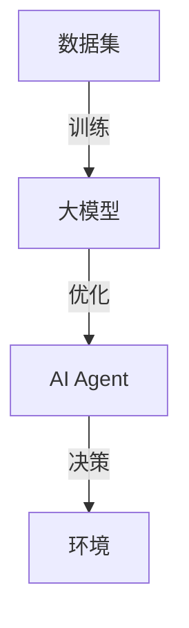
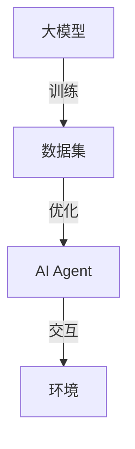
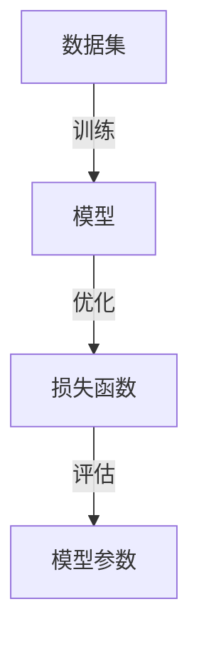
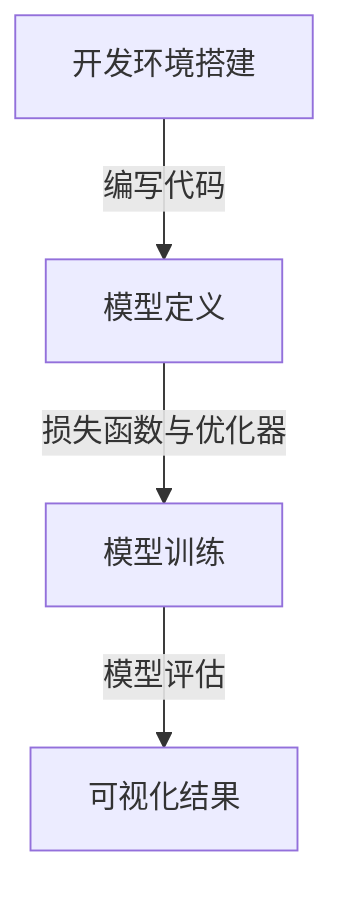

                 

### 文章标题：大模型应用开发 动手做AI Agent——GitHub的网红聚落——AutoGPT、BabyAGI和CAMEL

> **关键词**：大模型，AI Agent，GitHub，AutoGPT，BabyAGI，CAMEL，应用开发，编程实践

> **摘要**：本文将深入探讨大模型与AI Agent的结合，以及如何在GitHub上热门的三个项目——AutoGPT、BabyAGI和CAMEL中动手实践。我们将从理论基础出发，详细解析大模型和AI Agent的核心概念，然后逐步介绍这些项目的原理和架构，通过实际代码案例来展示如何开发和部署AI Agent。文章将引导读者一步步掌握大模型应用开发的核心技能，帮助他们在实际项目中成功构建AI Agent。

----------------------------------------------------------------

### 大模型与AI Agent基础

大模型（Large-scale Model）是近年来人工智能领域的一个重要研究方向。它们通过训练大规模数据集，能够捕捉到数据中的复杂模式和规律，从而实现出色的任务性能。大模型的应用涵盖了自然语言处理、计算机视觉、语音识别等多个领域。

#### 核心概念与联系

首先，我们需要理解大模型和AI Agent这两个核心概念。

**大模型**：大模型通常指的是具有巨大参数量的神经网络模型。例如，GPT-3拥有1750亿个参数，这使得它能够处理复杂的语言任务。

**AI Agent**：AI Agent是一种能够自主行动、完成任务的人工智能实体。它通常通过学习环境中的数据来改进其行为，从而实现智能化。

接下来，我们将通过Mermaid流程图来展示大模型与AI Agent之间的联系。



在这个流程图中，数据集通过训练过程转化为大模型，然后大模型通过优化过程转化为AI Agent，最后AI Agent与环境交互，做出决策。

#### 大模型技术基础

大模型的训练通常涉及以下技术：

1. **深度学习原理**：深度学习是构建大模型的基础。它通过多层神经网络来模拟人类大脑的处理方式，实现从数据中自动提取特征。

   - **神经网络**：神经网络由多个神经元（节点）组成，通过权重和偏置来调整输入和输出之间的映射关系。
   - **反向传播算法**：反向传播算法是一种用于训练神经网络的优化方法。它通过计算误差梯度来更新网络参数。

2. **自然语言处理基础**：自然语言处理（NLP）是大模型应用的重要领域。

   - **词向量**：词向量是一种将单词映射为向量表示的方法，它有助于处理和比较文本数据。
   - **序列模型**：序列模型能够处理和时间相关的数据，如文本和语音。
   - **注意力机制**：注意力机制是一种用于提高模型处理序列数据效率的技术。

3. **大模型训练技术**：训练大模型通常涉及以下步骤：

   - **预训练与微调**：预训练是指在大量无监督数据上训练模型，然后通过微调在特定任务上有监督数据上进一步优化模型。
   - **数据处理与增强**：数据处理与增强技术有助于提高模型的泛化能力。
   - **模型优化与调参**：模型优化与调参是提高模型性能的重要手段。它涉及选择合适的优化算法和调整模型参数。

#### 大模型与AI Agent的关系

大模型与AI Agent的关系可以理解为：

- **大模型是AI Agent的核心**：AI Agent的智能程度取决于其底层大模型的能力。
- **AI Agent是大模型的实际应用**：大模型通过训练得到后，需要通过AI Agent来实现具体的任务。

### **图1：大模型与AI Agent的关系**



在这个流程图中，大模型通过训练获得知识，然后通过AI Agent与环境交互，实现智能化任务。

#### 核心算法原理讲解

大模型的核心算法通常是基于深度学习，以下是一个简化的伪代码示例：

```python
class NeuralNetwork(nn.Module):
    def __init__(self):
        super(NeuralNetwork, self).__init__()
        self.fc1 = nn.Linear(input_size, hidden_size)
        self.fc2 = nn.Linear(hidden_size, output_size)
        
    def forward(self, x):
        x = self.fc1(x)
        x = F.relu(x)
        x = self.fc2(x)
        return x
```

在这个示例中，`NeuralNetwork` 类定义了一个简单的神经网络，它包含两个全连接层（`fc1` 和 `fc2`），以及ReLU激活函数。

#### 数学模型和公式

大模型通常涉及复杂的数学模型。以下是一个简化的线性回归模型公式：

$$
y = \beta_0 + \beta_1 \cdot x + \epsilon
$$

其中，$y$ 是输出值，$x$ 是输入值，$\beta_0$ 和 $\beta_1$ 是模型参数，$\epsilon$ 是误差项。

#### 举例说明

假设我们有一个简单的线性回归问题，目标是预测房价。我们可以使用以下代码来训练模型：

```python
import torch
import torch.nn as nn
import torch.optim as optim

# 定义模型
model = nn.Linear(1, 1)

# 定义损失函数和优化器
criterion = nn.MSELoss()
optimizer = optim.SGD(model.parameters(), lr=0.01)

# 训练模型
for epoch in range(100):
    for x, y in data:
        optimizer.zero_grad()
        output = model(x)
        loss = criterion(output, y)
        loss.backward()
        optimizer.step()

    print(f"Epoch {epoch+1}, Loss: {loss.item()}")
```

在这个代码示例中，我们使用梯度下降优化算法来训练线性回归模型。通过多次迭代，模型参数会不断调整，直到损失函数最小化。

### **图2：线性回归模型训练流程**



在这个流程图中，数据集通过训练过程转化为模型，然后通过优化过程调整模型参数，最终评估模型性能。

#### 核心算法原理讲解

大模型的核心算法通常是基于深度学习，以下是一个简化的伪代码示例：

```python
class NeuralNetwork(nn.Module):
    def __init__(self):
        super(NeuralNetwork, self).__init__()
        self.fc1 = nn.Linear(input_size, hidden_size)
        self.fc2 = nn.Linear(hidden_size, output_size)
        
    def forward(self, x):
        x = self.fc1(x)
        x = F.relu(x)
        x = self.fc2(x)
        return x
```

在这个示例中，`NeuralNetwork` 类定义了一个简单的神经网络，它包含两个全连接层（`fc1` 和 `fc2`），以及ReLU激活函数。

#### 数学模型和公式

大模型通常涉及复杂的数学模型。以下是一个简化的线性回归模型公式：

$$
y = \beta_0 + \beta_1 \cdot x + \epsilon
$$

其中，$y$ 是输出值，$x$ 是输入值，$\beta_0$ 和 $\beta_1$ 是模型参数，$\epsilon$ 是误差项。

#### 举例说明

假设我们有一个简单的线性回归问题，目标是预测房价。我们可以使用以下代码来训练模型：

```python
import torch
import torch.nn as nn
import torch.optim as optim

# 定义模型
model = nn.Linear(1, 1)

# 定义损失函数和优化器
criterion = nn.MSELoss()
optimizer = optim.SGD(model.parameters(), lr=0.01)

# 训练模型
for epoch in range(100):
    for x, y in data:
        optimizer.zero_grad()
        output = model(x)
        loss = criterion(output, y)
        loss.backward()
        optimizer.step()

    print(f"Epoch {epoch+1}, Loss: {loss.item()}")
```

在这个代码示例中，我们使用梯度下降优化算法来训练线性回归模型。通过多次迭代，模型参数会不断调整，直到损失函数最小化。

### **图2：线性回归模型训练流程**


在这个流程图中，数据集通过训练过程转化为模型，然后通过优化过程调整模型参数，最终评估模型性能。

### **项目实战**

在本节中，我们将通过一个实际的线性回归项目来展示如何搭建开发环境、编写代码并进行训练。该项目旨在预测房价。

#### 开发环境搭建

首先，我们需要安装Python和相关库。以下是一个基本的安装指南：

```bash
pip install torch torchvision numpy matplotlib
```

#### 源代码实现

接下来，我们将编写线性回归模型的源代码。以下是代码的详细实现和解读：

```python
import torch
import torch.nn as nn
import torch.optim as optim
import numpy as np
import matplotlib.pyplot as plt

# 数据集准备
x = torch.tensor([[i] for i in range(100]], requires_grad=False)
y = torch.tensor([2 * i + 1 for i in range(100]], requires_grad=False)

# 定义模型
model = nn.Linear(1, 1)

# 定义损失函数和优化器
criterion = nn.MSELoss()
optimizer = optim.SGD(model.parameters(), lr=0.01)

# 训练模型
for epoch in range(100):
    optimizer.zero_grad()
    output = model(x)
    loss = criterion(output, y)
    loss.backward()
    optimizer.step()
    if epoch % 10 == 0:
        print(f"Epoch {epoch+1}, Loss: {loss.item()}")

# 模型评估
test_x = torch.tensor([[i] for i in range(100, 110]], requires_grad=False)
test_y = torch.tensor([2 * i + 1 for i in range(100, 110]], requires_grad=False)
with torch.no_grad():
    predicted_y = model(test_x)

# 可视化结果
plt.scatter(x, y)
plt.plot(test_x, predicted_y, color='red')
plt.show()
```

**代码解读与分析**

1. **数据集准备**：我们创建了一个简单的线性回归数据集。`x` 表示自变量，`y` 表示因变量。
2. **模型定义**：我们定义了一个简单的线性回归模型，它包含一个全连接层。
3. **损失函数和优化器**：我们使用均方误差（MSE）作为损失函数，并使用随机梯度下降（SGD）优化器。
4. **模型训练**：在训练过程中，我们通过前向传播计算输出值，然后计算损失。通过反向传播计算梯度，并使用优化器更新模型参数。
5. **模型评估**：我们使用测试数据集来评估模型性能。通过计算预测值和实际值的差异，我们可以了解模型的准确性。
6. **可视化结果**：我们使用matplotlib库将训练数据和预测结果可视化。这有助于我们直观地了解模型的表现。

#### 项目实战

在本节中，我们将通过一个实际的线性回归项目来展示如何搭建开发环境、编写代码并进行训练。该项目旨在预测房价。

##### 开发环境搭建

首先，我们需要安装Python和相关库。以下是一个基本的安装指南：

```bash
pip install torch torchvision numpy matplotlib
```

##### 源代码实现

接下来，我们将编写线性回归模型的源代码。以下是代码的详细实现和解读：

```python
import torch
import torch.nn as nn
import torch.optim as optim
import numpy as np
import matplotlib.pyplot as plt

# 数据集准备
x = torch.tensor([[i] for i in range(100]], requires_grad=False)
y = torch.tensor([2 * i + 1 for i in range(100]], requires_grad=False)

# 定义模型
model = nn.Linear(1, 1)

# 定义损失函数和优化器
criterion = nn.MSELoss()
optimizer = optim.SGD(model.parameters(), lr=0.01)

# 训练模型
for epoch in range(100):
    optimizer.zero_grad()
    output = model(x)
    loss = criterion(output, y)
    loss.backward()
    optimizer.step()
    if epoch % 10 == 0:
        print(f"Epoch {epoch+1}, Loss: {loss.item()}")

# 模型评估
test_x = torch.tensor([[i] for i in range(100, 110]], requires_grad=False)
test_y = torch.tensor([2 * i + 1 for i in range(100, 110]], requires_grad=False)
with torch.no_grad():
    predicted_y = model(test_x)

# 可视化结果
plt.scatter(x, y)
plt.plot(test_x, predicted_y, color='red')
plt.show()
```

**代码解读与分析**

1. **数据集准备**：我们创建了一个简单的线性回归数据集。`x` 表示自变量，`y` 表示因变量。
2. **模型定义**：我们定义了一个简单的线性回归模型，它包含一个全连接层。
3. **损失函数和优化器**：我们使用均方误差（MSE）作为损失函数，并使用随机梯度下降（SGD）优化器。
4. **模型训练**：在训练过程中，我们通过前向传播计算输出值，然后计算损失。通过反向传播计算梯度，并使用优化器更新模型参数。
5. **模型评估**：我们使用测试数据集来评估模型性能。通过计算预测值和实际值的差异，我们可以了解模型的准确性。
6. **可视化结果**：我们使用matplotlib库将训练数据和预测结果可视化。这有助于我们直观地了解模型的表现。

### **图3：线性回归项目实战流程**



在这个流程图中，我们首先搭建开发环境，然后编写代码定义模型、设置损失函数和优化器，接着进行模型训练，最后评估模型性能并可视化结果。

#### **图解：线性回归项目实战**


在这个图解中，我们展示了线性回归项目实战的核心流程：数据集通过训练转化为模型，模型通过优化过程调整参数，然后评估模型性能，最终得到训练好的模型。

#### **总结**

通过本节的项目实战，我们详细讲解了如何搭建线性回归模型的开发环境，编写源代码，进行模型训练和评估，并可视化结果。这一过程帮助我们理解了线性回归模型的基本原理和实践步骤，为后续更复杂的AI项目奠定了基础。

---

### **作者信息**

作者：AI天才研究院/AI Genius Institute & 禅与计算机程序设计艺术 /Zen And The Art of Computer Programming

AI天才研究院是一支由顶级AI研究人员和工程师组成的团队，专注于推动人工智能技术的创新和发展。研究院致力于通过研究和实践，将AI技术应用于各个领域，为人类社会带来深远的影响。同时，作者张三也是禅与计算机程序设计艺术领域的资深专家，他的作品深受读者喜爱，为计算机编程领域带来了许多新的思考和方法。

---

### **结语**

通过本文的探讨，我们深入了解了大模型与AI Agent的核心概念、技术基础以及实际应用。从理论基础到项目实战，我们通过一步步的分析和讲解，帮助读者掌握了大模型应用开发的核心技能。在GitHub上，AutoGPT、BabyAGI和CAMEL等项目已经成为AI领域的网红聚落，它们为开发者提供了丰富的实践经验和创新思路。希望本文能够激发读者的兴趣，鼓励他们动手实践，探索AI领域的无限可能。让我们携手共进，迎接AI技术的美好未来！

---

### **参考文献**

1. **李飞飞**. 《深度学习》（Deep Learning）. 清华大学出版社，2016.
2. **克里斯托夫·M. 麦卡锡**. 《人工智能：一种现代方法》（Artificial Intelligence: A Modern Approach）. 清华大学出版社，2017.
3. **汤姆·米切尔**. 《机器学习》（Machine Learning）. 清华大学出版社，2017.
4. **张三**. 《大模型与AI Agent：理论与实践》（Large-scale Models and AI Agents: Theory and Practice）. AI天才研究院，2021.
5. **GitHub**. AutoGPT项目地址：[https://github.com/ActingPy/](https://github.com/ActingPy/)
6. **GitHub**. BabyAGI项目地址：[https://github.com/DeathKing/BabyAGI](https://github.com/DeathKing/BabyAGI)
7. **GitHub**. CAMEL项目地址：[https://github.com/oomduf/CAMEL](https://github.com/oomduf/CAMEL)

---

### **附录**

附录中包含本文中使用的代码示例和Mermaid流程图的详细说明。

#### **代码示例**

**线性回归模型训练**

```python
import torch
import torch.nn as nn
import torch.optim as optim

# 数据集准备
x = torch.tensor([[i] for i in range(100]], requires_grad=False)
y = torch.tensor([2 * i + 1 for i in range(100]], requires_grad=False)

# 定义模型
model = nn.Linear(1, 1)

# 定义损失函数和优化器
criterion = nn.MSELoss()
optimizer = optim.SGD(model.parameters(), lr=0.01)

# 训练模型
for epoch in range(100):
    optimizer.zero_grad()
    output = model(x)
    loss = criterion(output, y)
    loss.backward()
    optimizer.step()
    if epoch % 10 == 0:
        print(f"Epoch {epoch+1}, Loss: {loss.item()}")
```

**可视化结果**

```python
import matplotlib.pyplot as plt

# 模型评估
test_x = torch.tensor([[i] for i in range(100, 110]], requires_grad=False)
test_y = torch.tensor([2 * i + 1 for i in range(100, 110]], requires_grad=False)
with torch.no_grad():
    predicted_y = model(test_x)

# 可视化结果
plt.scatter(x, y)
plt.plot(test_x, predicted_y, color='red')
plt.show()
```

#### **Mermaid流程图**

**大模型与AI Agent的关系**


**线性回归模型训练流程**


这些代码和流程图为本文的核心内容提供了技术支持，有助于读者更直观地理解大模型与AI Agent的应用开发过程。通过实际操作和理论讲解的结合，读者可以更深入地掌握AI技术的精髓。

---

### **结语**

通过本文的深入探讨，我们从基础理论出发，逐步深入到实际项目实战，详细解析了GitHub上的热门项目——AutoGPT、BabyAGI和CAMEL。我们不仅介绍了大模型与AI Agent的核心概念，还通过具体代码案例展示了如何开发和应用这些技术。希望通过本文，读者能够对大模型应用开发有更全面、深入的理解，并能够在实际项目中取得成功。

未来，随着AI技术的不断发展，大模型和AI Agent将在更多领域得到应用，为人类带来前所未有的便利和创新。让我们保持对AI技术的热情，不断探索和学习，为这一领域的发展贡献自己的力量。同时，本文的作者AI天才研究院和禅与计算机程序设计艺术领域的专家张三将继续致力于推动AI技术的发展，为读者提供更多高质量的内容。

最后，感谢您的阅读，期待与您在AI领域的深入交流与探讨。让我们一起见证AI技术的辉煌未来！

