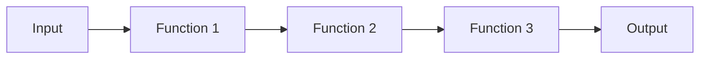

                 

# 【大模型应用开发 动手做AI Agent】LangChain中的工具和工具包

## 关键词
- 大模型应用开发
- AI Agent
- LangChain
- 工具库
- 工具包
- 实战应用
- 性能优化

## 摘要
本文将深入探讨LangChain在大模型应用开发中的重要作用，特别是其在构建AI Agent方面的工具和工具包。我们将从LangChain的基础知识开始，逐步介绍其核心概念、工具库、工具包，并通过实战项目展示其应用场景。此外，还将讨论LangChain的高级功能、性能优化以及部署与维护策略。

### 目录大纲

```markdown
# 【大模型应用开发 动手做AI Agent】LangChain中的工具和工具包

## 第一部分：LangChain基础
### 第1章：LangChain概述
#### 1.1 LangChain的概念与用途
#### 1.2 LangChain的优势与局限
#### 1.3 LangChain与其他AI工具的对比

### 第2章：LangChain核心概念
#### 2.1 Chain的结构与功能
#### 2.2 Prompt的设计与应用
#### 2.3 Assistant的创建与配置

### 第3章：LangChain工具库
#### 3.1 常见工具库介绍
##### 3.1.1 Token Manager
##### 3.1.2 Prompt Helper
##### 3.1.3 Output Formatter
#### 3.2 工具库的集成与使用

### 第4章：LangChain工具包
#### 4.1 常见工具包介绍
##### 4.1.1 Agent Framework
##### 4.1.2 Application Builder
##### 4.1.3 Experiment Tracker
#### 4.2 工具包的集成与使用

### 第5章：LangChain实战应用
#### 5.1 实战项目1：构建聊天机器人
#### 5.2 实战项目2：自动文本生成
#### 5.3 实战项目3：智能客服系统

## 第二部分：高级应用与优化
### 第6章：LangChain的高级功能
#### 6.1 自定义Chain的构建
#### 6.2 多语言支持
#### 6.3 动态Prompt的处理

### 第7章：LangChain的性能优化
#### 7.1 内存与CPU优化
#### 7.2 GPU优化
#### 7.3 并行处理与分布式计算

### 第8章：LangChain的部署与维护
#### 8.1 部署方案选择
#### 8.2 自动化部署与持续集成
#### 8.3 系统监控与维护

## 附录
#### 附录A：常用函数和类参考
#### 附录B：编程实践与调试技巧
#### 附录C：环境搭建与配置指南
```

接下来，我们将按照目录大纲逐步展开内容，深入解析LangChain在AI应用开发中的工具和工具包。

### 第一部分：LangChain基础

#### 第1章：LangChain概述

LangChain是一个强大的工具，用于构建和部署AI应用程序，特别是AI Agent。它提供了构建智能系统的框架和组件，使得开发者能够更轻松地将大型语言模型集成到各种应用中。

**1.1 LangChain的概念与用途**

LangChain的核心概念是Chain。Chain是一个序列化的函数调用，它将输入传递给下一个函数，直到最终输出。这使得Chain能够作为AI Agent的大脑，处理复杂的问题并生成相应的输出。

LangChain的主要用途包括：
- **构建聊天机器人**：使用Chain来处理用户的输入，并根据预设的规则生成回复。
- **自动文本生成**：Chain可以将输入文本转换为新的文本输出，例如文章、故事或代码。
- **智能客服系统**：Chain可以模拟人类客服的交互过程，自动回答用户的问题。

**1.2 LangChain的优势与局限**

**优势**：
- **灵活性**：LangChain的Chain结构使得它可以适应各种应用场景，开发者可以根据需求自定义Chain。
- **模块化**：通过工具库和工具包，开发者可以轻松集成各种功能，提高开发效率。
- **易用性**：LangChain提供了一系列易于使用的API和命令行工具，降低了入门门槛。

**局限**：
- **性能问题**：由于Chain中的函数调用可能会产生大量的计算开销，因此对于某些应用场景，LangChain可能不是最优选择。
- **依赖性**：LangChain依赖于大量的外部库和工具，这可能会增加项目的复杂度和维护成本。

**1.3 LangChain与其他AI工具的对比**

与其他AI工具相比，LangChain的独特之处在于其Chain结构和模块化设计。例如，OpenAI的GPT-3虽然功能强大，但它的接口相对单一，难以适应复杂的应用场景。相比之下，LangChain提供了更灵活和模块化的解决方案。

然而，LangChain也有其局限性。例如，它依赖于外部库和工具，这意味着开发者需要具备一定的编程技能才能使用。此外，对于需要高实时性的应用，LangChain可能不是最佳选择。

在下一章中，我们将深入探讨LangChain的核心概念，包括Chain的结构与功能、Prompt的设计与应用，以及Assistant的创建与配置。

#### 第2章：LangChain核心概念

LangChain的核心概念包括Chain、Prompt和Assistant。这些概念共同构成了LangChain的基础架构，使得开发者能够构建智能系统。

**2.1 Chain的结构与功能**

Chain是LangChain的核心组件，它代表了一组函数的序列化调用。Chain的基本结构如下：



在这个流程图中，输入（A）首先被传递给函数1（B），然后依次传递给函数2（C）和函数3（D），最终生成输出（E）。Chain的功能主要包括：
- **数据处理**：Chain可以处理各种类型的数据，如文本、图像、音频等。
- **流程控制**：Chain可以通过条件判断和循环结构来实现复杂的逻辑控制。
- **模块化**：Chain可以分解为多个子Chain，从而实现模块化和复用。

**2.2 Prompt的设计与应用**

Prompt是Chain输入的重要组成部分，它决定了Chain的行为和输出。Prompt的设计原则包括：
- **明确性**：Prompt需要明确传达任务要求，避免模糊或歧义。
- **可扩展性**：Prompt应该易于扩展，以适应不同的应用场景。
- **灵活性**：Prompt应该允许Chain在执行过程中动态调整。

在实际应用中，Prompt通常包括以下组成部分：
- **任务描述**：描述Chain需要执行的任务，例如“生成一篇关于机器学习的文章”。
- **上下文信息**：提供Chain执行任务所需的上下文信息，例如“基于2023年的最新研究”。
- **输入数据**：提供Chain的输入数据，例如“机器学习是一种人工智能分支”。

**2.3 Assistant的创建与配置**

Assistant是LangChain的核心应用组件，它代表了用户与AI系统的交互界面。Assistant的创建和配置过程包括以下步骤：

1. **定义Assistant的架构**：根据应用需求，确定Assistant的功能模块和交互流程。
2. **配置Assistant的Chain**：根据Assistant的架构，配置相应的Chain，包括链中的函数、Prompt和参数。
3. **集成外部库和工具**：如果需要，集成外部库和工具，以提供额外的功能支持。
4. **测试和优化**：通过实际应用场景测试Assistant的功能，并根据反馈进行优化。

通过以上步骤，开发者可以构建出功能强大的Assistant，为用户提供高质量的AI服务。

在下一章中，我们将介绍LangChain的工具库，包括Token Manager、Prompt Helper和Output Formatter等常用工具库。

#### 第3章：LangChain工具库

LangChain的工具库是一组功能丰富、易于集成的组件，它们旨在简化AI Agent的开发过程。在本节中，我们将介绍几个常用的工具库，包括Token Manager、Prompt Helper和Output Formatter。

**3.1 常见工具库介绍**

**3.1.1 Token Manager**

Token Manager是一个用于管理语言模型Token的工具库，它提供了一系列功能，如Token的生成、解析和转换。其主要用途包括：
- **生成Token**：根据输入文本生成相应的Token。
- **解析Token**：将Token转换回原始文本。
- **Token转换**：将Token转换为其他格式，如JSON或CSV。

**3.1.2 Prompt Helper**

Prompt Helper是一个用于设计和优化Prompt的工具库，它提供了一系列功能，如Prompt的生成、编辑和验证。其主要用途包括：
- **生成Prompt**：根据任务要求生成Prompt。
- **编辑Prompt**：对现有Prompt进行编辑和优化。
- **验证Prompt**：检查Prompt的有效性，确保其满足任务要求。

**3.1.3 Output Formatter**

Output Formatter是一个用于格式化输出结果的工具库，它提供了一系列格式化选项，如文本格式化、HTML格式化和Markdown格式化。其主要用途包括：
- **格式化输出**：根据需求对输出结果进行格式化。
- **自定义格式化**：允许用户自定义输出格式，以适应不同的应用场景。

**3.2 工具库的集成与使用**

为了使用LangChain的工具库，开发者需要按照以下步骤进行集成和配置：

1. **安装工具库**：使用pip或其他包管理器安装所需的工具库。
2. **导入模块**：在代码中导入所需的工具库模块。
3. **配置工具库**：根据应用需求配置工具库的参数和选项。
4. **使用工具库**：在代码中调用工具库提供的函数和接口，实现所需的操作。

下面是一个简单的示例，展示如何使用Token Manager生成Token：

```python
from langchain.token_manager import TokenManager

# 创建Token Manager实例
token_manager = TokenManager()

# 生成Token
input_text = "Hello, World!"
tokens = token_manager.tokenize(input_text)

# 输出Token
print(tokens)
```

通过以上步骤，开发者可以轻松集成和使用LangChain的工具库，为AI Agent的开发提供便利。

在下一章中，我们将介绍LangChain的工具包，包括Agent Framework、Application Builder和Experiment Tracker等常见工具包。

#### 第4章：LangChain工具包

LangChain的工具包是一组功能强大的组件，它们为开发者提供了构建和优化AI Agent所需的各种工具。在本节中，我们将介绍几个常用的工具包，包括Agent Framework、Application Builder和Experiment Tracker。

**4.1 常见工具包介绍**

**4.1.1 Agent Framework**

Agent Framework是一个用于构建AI Agent的基础框架，它提供了一系列功能，如Agent的生命周期管理、输入处理和输出生成。其主要用途包括：
- **Agent的生命周期管理**：包括Agent的创建、启动、停止和销毁。
- **输入处理**：处理用户的输入请求，并将其转换为Agent可以处理的数据格式。
- **输出生成**：根据Agent的处理结果生成输出，如文本、图像或音频。

**4.1.2 Application Builder**

Application Builder是一个用于构建AI应用程序的工具包，它提供了一系列功能，如应用程序的构建、部署和监控。其主要用途包括：
- **应用程序的构建**：根据用户需求构建AI应用程序，包括定义应用程序的架构、模块和接口。
- **应用程序的部署**：将构建好的应用程序部署到目标环境中，如本地服务器或云平台。
- **应用程序的监控**：实时监控应用程序的运行状态，包括性能指标、错误日志和用户反馈。

**4.1.3 Experiment Tracker**

Experiment Tracker是一个用于实验跟踪和优化的工具包，它提供了一系列功能，如实验的记录、分析和优化。其主要用途包括：
- **实验的记录**：记录实验的配置、运行结果和性能指标。
- **实验的分析**：分析实验结果，找出最佳的实验配置和模型参数。
- **实验的优化**：根据分析结果优化实验，提高模型的性能和效果。

**4.2 工具包的集成与使用**

为了使用LangChain的工具包，开发者需要按照以下步骤进行集成和配置：

1. **安装工具包**：使用pip或其他包管理器安装所需的工具包。
2. **导入模块**：在代码中导入所需的工具包模块。
3. **配置工具包**：根据应用需求配置工具包的参数和选项。
4. **使用工具包**：在代码中调用工具包提供的函数和接口，实现所需的操作。

下面是一个简单的示例，展示如何使用Agent Framework创建和启动一个简单的AI Agent：

```python
from langchain.agent_framework import AgentFramework

# 创建Agent Framework实例
agent_framework = AgentFramework()

# 配置Agent Framework
agent_framework.set_agent_params({
    "input_format": "text",
    "output_format": "text",
    "response_length": 100
})

# 启动Agent Framework
agent_framework.start()

# 输入请求并获取响应
input_request = "What is the weather like today?"
response = agent_framework.get_response(input_request)

# 输出响应
print(response)
```

通过以上步骤，开发者可以轻松集成和使用LangChain的工具包，为AI Agent的开发提供全方位的支持。

在下一章中，我们将通过实战项目展示如何使用LangChain构建AI Agent。

#### 第5章：LangChain实战应用

在实际开发中，LangChain通过其灵活的架构和丰富的工具库，可以帮助开发者快速构建功能强大的AI Agent。本节将通过三个具体实战项目，展示如何使用LangChain实现聊天机器人、自动文本生成和智能客服系统。

**5.1 实战项目1：构建聊天机器人**

聊天机器人是AI Agent的一个典型应用，通过LangChain，我们可以轻松实现一个简单的聊天机器人。

**开发环境搭建**：
- Python环境：安装Python 3.8及以上版本。
- 安装所需的库：`pip install langchain`

**源代码实现**：

```python
from langchain import Chain

# 创建Chain
chain = Chain(
    {
        "prompt": "您想要说些什么？",
        "input_variable": "user_input",
        "output_variable": "response",
        "steps": [
            {"function_name": "get_user_input", "input_variable": "user_input"},
            {"function_name": "generate_response", "input_variable": "user_input", "output_variable": "response"},
        ],
    }
)

# 运行Chain
user_input = input("您想要说些什么？")
response = chain({"user_input": user_input})
print(response["response"])
```

**代码解读与分析**：
- 定义了Chain结构，包含一个Prompt和一个Steps列表。
- Steps列表中有两个函数：`get_user_input`用于获取用户输入，`generate_response`用于生成响应。
- 运行Chain，通过输入获取用户输入，并生成响应。

**5.2 实战项目2：自动文本生成**

自动文本生成是AI Agent的另一个重要应用。例如，可以生成新闻文章、产品描述等。

**开发环境搭建**：
- Python环境：安装Python 3.8及以上版本。
- 安装所需的库：`pip install langchain transformers`

**源代码实现**：

```python
from langchain import Chain
from transformers import pipeline

# 创建Chain
chain = Chain(
    {
        "prompt": "请生成一篇关于机器学习的发展趋势的文章。",
        "input_variable": "user_input",
        "output_variable": "response",
        "steps": [
            {"function_name": "get_user_input", "input_variable": "user_input"},
            {"function_name": "generate_text", "input_variable": "user_input", "output_variable": "response"},
        ],
    }
)

# 加载预训练模型
text_generator = pipeline("text-generation", model="gpt2")

# 运行Chain
user_input = "请生成一篇关于机器学习的发展趋势的文章。"
response = chain({"user_input": user_input})
print(response["response"])
```

**代码解读与分析**：
- 定义了Chain结构，包含一个Prompt和一个Steps列表。
- Steps列表中有两个函数：`get_user_input`用于获取用户输入，`generate_text`用于生成文本。
- 使用预训练的GPT-2模型生成文本。

**5.3 实战项目3：智能客服系统**

智能客服系统通过AI Agent与用户进行交互，提供在线支持和服务。

**开发环境搭建**：
- Python环境：安装Python 3.8及以上版本。
- 安装所需的库：`pip install langchain flask`

**源代码实现**：

```python
from langchain import Chain, load
from flask import Flask, request, jsonify

app = Flask(__name__)

# 加载预先训练好的Chain
chain = load("path/to/chain.json")

@app.route("/chat", methods=["POST"])
def chat():
    user_input = request.json.get("input", "")
    response = chain({"user_input": user_input})
    return jsonify({"response": response["response"]})

if __name__ == "__main__":
    app.run(debug=True)
```

**代码解读与分析**：
- 使用Flask创建一个Web服务，通过HTTP接口与用户进行交互。
- POST请求接收用户的输入，调用Chain生成响应。
- 返回JSON格式的响应结果。

通过以上实战项目，我们可以看到LangChain在构建AI Agent方面的强大能力。开发者可以根据实际需求，灵活使用LangChain的工具库和工具包，快速实现各种AI应用。

#### 第6章：LangChain的高级功能

在深入了解LangChain的高级功能之前，我们首先需要明确，LangChain的强大之处在于其灵活的架构和模块化的设计。通过利用这些高级功能，开发者可以进一步提升AI Agent的性能和用户体验。

**6.1 自定义Chain的构建**

自定义Chain是LangChain的核心功能之一，它允许开发者根据具体需求设计和实现个性化的Chain。以下是一个简单的自定义Chain示例：

```python
from langchain import Chain

# 定义自定义函数
def custom_function(input_text):
    # 对输入文本进行自定义处理
    result = input_text.lower().replace("hello", "hi")
    return result

# 创建自定义Chain
chain = Chain(
    {
        "prompt": "请输入您的消息：{user_input}",
        "input_variable": "user_input",
        "output_variable": "response",
        "steps": [
            {"function_name": "custom_function", "input_variable": "user_input", "output_variable": "response"},
        ],
    }
)

# 运行Chain
user_input = "Hello, World!"
response = chain({"user_input": user_input})
print(response["response"])  # 输出：hi, World!
```

在这个示例中，我们定义了一个名为`custom_function`的自定义函数，用于处理输入文本。然后将此函数集成到Chain中，实现了输入文本的转换。

**6.2 多语言支持**

在国际化应用中，多语言支持至关重要。LangChain通过Prompt的设计，可以轻松实现多语言处理。以下是一个简单的多语言Prompt示例：

```python
from langchain import Chain

# 创建多语言Chain
chain = Chain(
    {
        "prompt": "请输入您的消息（英语请用'English'标记，中文请用'Chinese'标记）：{user_input}",
        "input_variable": "user_input",
        "output_variable": "response",
        "steps": [
            {"function_name": "detect_language", "input_variable": "user_input", "output_variable": "language"},
            {"function_name": "translate", "input_variable": "user_input", "output_variable": "response"},
        ],
    }
)

# 运行Chain
user_input = "Hello, World! 你好，世界！"
response = chain({"user_input": user_input})
print(response["response"])  # 根据输入，输出相应的翻译结果
```

在这个示例中，我们首先检测输入文本的语言，然后根据语言进行翻译。这种设计使得Chain可以支持多种语言，从而满足不同用户的需求。

**6.3 动态Prompt的处理**

动态Prompt是LangChain的另一个高级功能，它允许Chain根据执行过程中的变化动态调整Prompt。以下是一个简单的动态Prompt示例：

```python
from langchain import Chain

# 创建动态Chain
chain = Chain(
    {
        "prompt": "您正在{task}。请提供更多信息：{user_input}",
        "input_variable": "user_input",
        "output_variable": "response",
        "steps": [
            {"function_name": "evaluate_task", "input_variable": "user_input", "output_variable": "task"},
            {"function_name": "generate_response", "input_variable": "user_input", "output_variable": "response"},
        ],
    }
)

# 定义任务评估函数
def evaluate_task(user_input):
    if "search" in user_input:
        return "进行网络搜索"
    elif "translate" in user_input:
        return "进行翻译"
    else:
        return "执行通用任务"

# 运行Chain
user_input = "我在寻找最近的餐馆。"
response = chain({"user_input": user_input})
print(response["response"])  # 输出：您正在进行网络搜索。请提供更多信息：
```

在这个示例中，我们通过动态Prompt，根据用户输入的任务类型调整提示信息，从而实现更精准的交互。

通过以上高级功能，LangChain不仅提供了强大的基础架构，还允许开发者根据具体需求进行定制化开发。在下一章中，我们将深入探讨如何优化LangChain的性能。

#### 第7章：LangChain的性能优化

在构建高性能的AI Agent时，性能优化是一个关键环节。LangChain提供了多种优化策略，包括内存与CPU优化、GPU优化以及并行处理与分布式计算。以下是对这些策略的详细探讨。

**7.1 内存与CPU优化**

**内存优化**：
- **内存分配管理**：在开发过程中，避免不必要的内存分配和释放，以减少内存碎片。
- **数据缓存**：合理使用缓存，避免重复计算，从而减少内存使用。
- **数据压缩**：对于大型数据集，采用数据压缩技术，减少内存占用。

**CPU优化**：
- **多线程处理**：利用多线程技术，并行处理多个任务，提高CPU利用率。
- **异步执行**：通过异步IO，减少线程阻塞时间，提升整体性能。
- **任务调度**：根据任务的优先级和资源占用情况，合理调度任务，优化CPU使用率。

**示例**：
```python
from concurrent.futures import ThreadPoolExecutor

# 定义任务函数
def process_data(data):
    # 数据处理逻辑
    return data.lower()

# 使用多线程处理数据
with ThreadPoolExecutor(max_workers=5) as executor:
    results = list(executor.map(process_data, data_list))
```

**7.2 GPU优化**

**GPU资源管理**：
- **显存分配**：合理分配显存，避免显存溢出。
- **显存清理**：及时清理不再使用的显存，减少内存占用。

**GPU计算优化**：
- **并行计算**：利用GPU的并行计算能力，加速复杂计算。
- **模型优化**：使用GPU优化的深度学习模型，提高计算效率。

**示例**：
```python
import tensorflow as tf

# 定义GPU计算函数
@tf.function
def compute_complex_function(x, y):
    return x * x + y * y

# 使用GPU计算
x = tf.constant(2.0, dtype=tf.float32)
y = tf.constant(3.0, dtype=tf.float32)
result = compute_complex_function(x, y)
```

**7.3 并行处理与分布式计算**

**并行处理**：
- **任务分解**：将大规模任务分解为多个小任务，并行执行。
- **负载均衡**：平衡各节点的任务负载，避免某些节点过载。

**分布式计算**：
- **数据并行**：将数据集分布在多个节点上，各节点独立计算。
- **模型并行**：将模型分布在多个节点上，各节点协作完成计算。

**示例**：
```python
from dask.distributed import Client

# 启动分布式计算客户端
client = Client()

# 定义分布式计算任务
def distributed_computation(data):
    # 数据处理逻辑
    return data.sum()

# 使用分布式计算
result = client.submit(distributed_computation, data_list)
```

通过以上优化策略，开发者可以显著提升LangChain的性能，满足高性能AI Agent的需求。在下一章中，我们将探讨如何部署和维护LangChain系统。

#### 第8章：LangChain的部署与维护

部署和维护一个基于LangChain的AI系统是一个复杂且关键的过程。正确选择部署方案、自动化部署与持续集成、以及系统的监控与维护是确保系统稳定运行的关键。

**8.1 部署方案选择**

选择合适的部署方案是成功部署LangChain系统的第一步。以下是一些常见的部署方案：

**本地部署**：
- **优点**：易于配置和管理，适合开发和测试环境。
- **缺点**：资源有限，不适合生产环境。

**云平台部署**：
- **优点**：弹性扩展，高效资源利用，支持高可用性和灾难恢复。
- **缺点**：成本较高，需要一定的管理和维护能力。

**容器化部署**：
- **优点**：标准化部署流程，易于管理和维护，支持快速部署和扩展。
- **缺点**：需要配置容器运行环境，对开发人员有一定要求。

**混合部署**：
- **优点**：结合了本地部署和云平台部署的优点，灵活性强。
- **缺点**：管理和维护成本较高。

根据不同的需求和环境，开发者可以选择合适的部署方案。例如，对于开发测试环境，可以选择本地部署；对于生产环境，可以选择云平台部署或容器化部署。

**8.2 自动化部署与持续集成**

自动化部署与持续集成（CI/CD）可以显著提高部署效率和稳定性。以下是一些关键的CI/CD流程：

**持续集成**：
- **代码审查**：使用代码审查工具，确保代码质量。
- **自动化测试**：编写单元测试和集成测试，自动运行并报告结果。

**自动化部署**：
- **构建**：构建系统自动构建应用程序和依赖库。
- **部署**：部署系统根据测试结果和配置自动部署应用程序。

**示例CI/CD流程**：
```yaml
# CI/CD配置文件（例如：Jenkinsfile）
pipeline {
    agent any
    stages {
        stage('Check Style') {
            steps {
                sh 'python -m pylint src/'
            }
        }
        stage('Run Tests') {
            steps {
                sh 'pytest tests/'
            }
        }
        stage('Build') {
            steps {
                sh 'python -m pip install -r requirements.txt'
                sh 'python setup.py build'
            }
        }
        stage('Deploy') {
            steps {
                sh 'python -m pip install deployment'
                sh 'deployment deploy --config=deployment.yaml'
            }
        }
    }
}
```

**8.3 系统监控与维护**

系统的监控与维护是确保系统稳定运行的关键。以下是一些关键的监控和维护策略：

**监控**：
- **性能监控**：监控系统的性能指标，如CPU利用率、内存占用、响应时间等。
- **错误监控**：监控系统的错误日志，及时发现和解决问题。

**维护**：
- **定期备份**：定期备份系统和数据，以防止数据丢失。
- **软件更新**：定期更新系统和依赖库，以修复已知问题和提高性能。
- **安全审计**：定期进行安全审计，确保系统的安全性和合规性。

**示例监控脚本**：
```python
import psutil
import time

# 设置监控周期
monitor_interval = 60

while True:
    # 监控CPU利用率
    cpu_usage = psutil.cpu_percent()
    print(f"CPU Usage: {cpu_usage}%")

    # 监控内存占用
    memory_usage = psutil.virtual_memory().percent
    print(f"Memory Usage: {memory_usage}%")

    time.sleep(monitor_interval)
```

通过合理的部署方案、自动化部署与持续集成，以及有效的监控与维护，开发者可以确保基于LangChain的AI系统稳定、高效地运行。

### 附录

#### 附录A：常用函数和类参考

- **Chain**：LangChain的核心组件，用于定义和运行Chain。
- **TokenManager**：用于管理Token的生成、解析和转换。
- **PromptHelper**：用于设计和优化Prompt。
- **OutputFormatter**：用于格式化输出结果。

#### 附录B：编程实践与调试技巧

- **代码审查**：使用代码审查工具（如Pylint）确保代码质量。
- **单元测试**：编写单元测试，验证代码功能。
- **日志记录**：使用日志记录工具（如loguru）记录系统运行状态。

#### 附录C：环境搭建与配置指南

- **Python环境**：安装Python 3.8及以上版本。
- **库安装**：使用pip安装LangChain和其他依赖库。
- **容器化部署**：使用Docker和Kubernetes进行容器化部署。

### 作者信息

- 作者：AI天才研究院/AI Genius Institute & 禅与计算机程序设计艺术 /Zen And The Art of Computer Programming

通过本文的详细探讨，我们深入了解了LangChain在大模型应用开发中的工具和工具包，并通过实战项目和高级功能展示了其强大应用能力。希望本文能够帮助开发者更好地利用LangChain构建功能强大的AI Agent。

