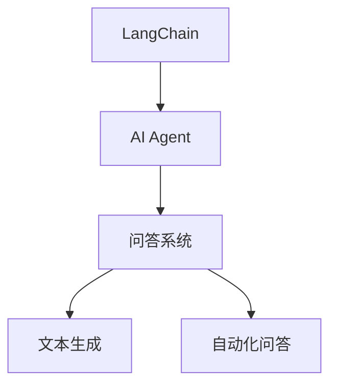
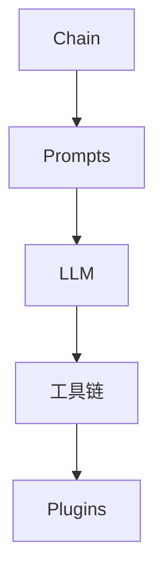
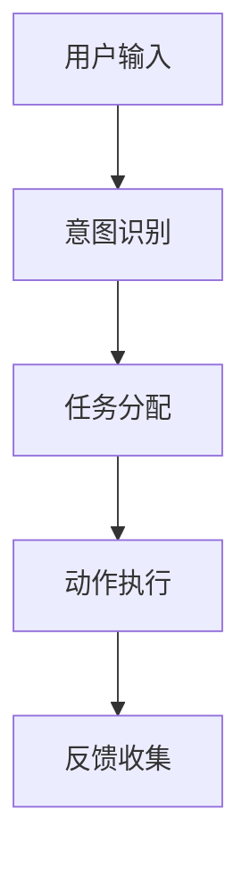
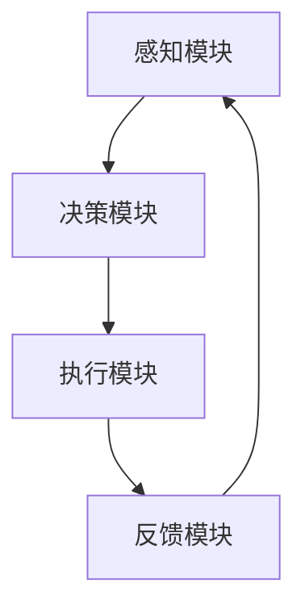

                 

## 文章标题：大模型应用开发 动手做AI Agent：LangChain与Agent开发

> 关键词：大模型应用、LangChain、AI Agent、自然语言处理、智能助手

> 摘要：本文将深入探讨大模型在应用开发中的重要性，以及如何使用LangChain和AI Agent实现智能交互系统。我们将从理论基础到项目实战，一步步讲解如何动手开发AI Agent，帮助读者理解和掌握大模型应用开发的技能。

---

## 目录大纲

1. **第一部分：理论基础**
   1. **第1章：大模型应用开发概述**
      1.1 大模型的概念与应用
      1.2 大模型在AI领域的重要性
      1.3 LangChain和Agent开发简介
   2. **第2章：LangChain基础**
      2.1 LangChain的核心概念
      2.2 LangChain的架构与组件
      2.3 LangChain的基本使用方法
   3. **第3章：AI Agent开发**
      3.1 AI Agent的基本概念
      3.2 AI Agent的架构设计
      3.3 AI Agent的编程技巧
   4. **第4章：LangChain与AI Agent的融合**
      4.1 LangChain在AI Agent中的应用
      4.2 AI Agent在LangChain中的集成
      4.3 LangChain与AI Agent的协同工作

2. **第二部分：项目实战**
   1. **第5章：LangChain应用案例**
      5.1 案例一：基于LangChain的问答系统
      5.2 案例二：基于LangChain的文本生成
      5.3 案例三：基于LangChain的自动化问答
   2. **第6章：AI Agent应用案例**
      6.1 案例一：基于AI Agent的客户服务
      6.2 案例二：基于AI Agent的内容推荐
      6.3 案例三：基于AI Agent的智能助手
   3. **第7章：LangChain与AI Agent的集成实战**
      7.1 集成方案设计
      7.2 系统架构搭建
      7.3 实现与优化

3. **第三部分：总结与展望**
   1. **第8章：总结与展望**
      8.1 大模型应用开发的未来趋势
      8.2 LangChain和AI Agent的发展方向
      8.3 开发者应关注的技能与知识

4. **附录**
   1. **附录A：工具与环境配置**
      1.1 开发工具介绍
      1.2 环境搭建教程
   2. **附录B：代码解读与分析**
      1.1 LangChain代码解读
      1.2 AI Agent代码解读

---

# 核心概念与联系

在深入探讨LangChain和AI Agent之前，我们需要明确这两个概念的核心含义以及它们之间的联系。

## LangChain与AI Agent的关系

首先，我们来理解LangChain和AI Agent的基本概念。

**LangChain** 是一个开源框架，它允许开发者使用大型语言模型（如GPT）来构建复杂的应用程序，如问答系统、文本生成和自动化问答。LangChain的核心在于它提供了丰富的工具链和插件，使得开发者可以轻松地将大型语言模型与各种工具和API集成。

**AI Agent**，即人工智能代理，是一种能够自动执行任务的系统。它通过理解用户的意图，执行相应的任务，并从反馈中不断学习和优化。

下面是一个简化的Mermaid流程图，展示了LangChain与AI Agent的关系：



- LangChain提供了构建AI Agent的基础工具，包括链式调用、插件机制等。
- AI Agent利用LangChain的能力，实现智能对话、文本生成等功能。

## LangChain的核心概念

接下来，我们详细探讨LangChain的核心概念。

**Chain**：LangChain中的Chain是一个可扩展的组件，它允许用户将多个步骤串联起来，形成一个完整的流程。每个Chain可以包含Prompt、LLM（大型语言模型）调用、工具链和其他插件。

**Prompt**：Prompt是引导模型生成预期输出的关键。一个好的Prompt设计能够显著提高模型的性能和生成的质量。

**LLM**：LLM（如GPT、LLaMA）是LangChain的核心组件，它负责处理文本输入并生成相应的输出。

**工具链**：工具链是一系列辅助工具，如文本检索、图像处理、API调用等。这些工具可以嵌入到Chain中，以实现更复杂的功能。

**Plugins**：Plugins是自定义组件，允许开发者扩展LangChain的功能，实现特定需求。

下面是一个简化的Mermaid流程图，展示了LangChain的核心概念：



## AI Agent的架构设计

AI Agent的架构设计涉及多个关键组件，包括意图识别、任务分配、动作执行和反馈收集。

**意图识别**：AI Agent首先需要识别用户的意图。这通常通过自然语言处理技术实现，如分类算法和语义分析。

**任务分配**：一旦意图被识别，AI Agent需要将任务分配给相应的处理模块。这可以通过规则引擎或机器学习模型实现。

**动作执行**：AI Agent执行具体的任务操作，如发送邮件、生成报告、预订机票等。

**反馈收集**：AI Agent需要收集用户的反馈，以便进行模型优化和系统改进。

下面是一个简化的Mermaid流程图，展示了AI Agent的架构设计：



通过以上对核心概念和架构设计的探讨，我们为后续的内容奠定了理论基础。在接下来的章节中，我们将详细讲解LangChain和AI Agent的开发和应用。

---

# 第一部分：理论基础

## 第1章：大模型应用开发概述

### 1.1 大模型的概念与应用

在人工智能领域，"大模型"指的是那些拥有巨大参数量、能够处理海量数据的深度学习模型。这些模型，如GPT-3、ChatGLM、Bert等，通过在大规模数据集上进行训练，能够实现高度复杂的语言理解和生成任务。

**大模型的概念：**
大模型通常包含数十亿到千亿个参数，这使得它们在处理自然语言时具备极高的准确性和灵活性。这些模型的训练过程需要大量的计算资源和时间，但随着计算能力的提升和训练技术的进步，大模型的性能也在不断提升。

**大模型的应用：**
大模型在多个领域得到了广泛应用，包括但不限于：
- **文本生成**：自动生成文章、报告、代码等。
- **机器翻译**：提供高效、准确的跨语言翻译服务。
- **问答系统**：基于用户输入提供准确的答案。
- **对话系统**：构建智能客服、聊天机器人等。
- **文本分类**：自动对大量文本进行分类，如新闻分类、情感分析等。

### 1.2 大模型在AI领域的重要性

大模型在人工智能领域的重要性主要体现在以下几个方面：

**1. 提高任务处理能力：**
大模型通过学习大量的数据，能够更好地理解和生成人类语言，从而在各种自然语言处理任务中表现出色。这使得AI系统能够更准确地理解用户的需求，提供更高质量的回答和服务。

**2. 促进技术进步：**
大模型的研发推动了自然语言处理技术的发展，使得更多的复杂任务得以实现。例如，基于大模型的预训练语言模型技术已经成为了许多AI应用程序的基础。

**3. 应用场景拓展：**
随着大模型性能的提升，AI应用的范围也在不断拓展。从传统的文本生成、机器翻译，到新兴的聊天机器人、智能客服等，大模型的应用场景越来越广泛。

**4. 降低开发门槛：**
开源的大模型和工具链，如LangChain，使得开发者可以更轻松地构建复杂的AI应用。开发者无需从零开始训练模型，只需利用现有的大模型和工具即可快速实现应用。

### 1.3 LangChain和Agent开发简介

**LangChain：**
LangChain是一个基于LLaMA（语言模型）的开源工具链，旨在帮助开发者轻松构建大规模语言模型应用程序。它提供了丰富的组件，如Chain、Prompt、工具链和插件，使得开发者可以灵活地组合和定制模型。

**AI Agent：**
AI Agent是一种自动化智能代理，能够理解用户的意图，执行相应的任务，并从反馈中不断学习和优化。AI Agent通常用于构建智能客服、聊天机器人、内容推荐系统等。

**为什么选择LangChain和AI Agent：**
- **强大的功能**：LangChain提供了丰富的工具和插件，使得开发者可以轻松构建复杂的语言处理应用。AI Agent则提供了自动化任务处理的能力，可以大幅提高系统的智能化水平。
- **开源和社区支持**：LangChain和AI Agent都是开源项目，拥有活跃的社区支持。开发者可以方便地获取帮助和资源，加速开发过程。
- **灵活性和可扩展性**：LangChain和AI Agent具有高度的灵活性和可扩展性，开发者可以根据实际需求进行定制和优化。
- **实际应用价值**：在实际应用中，基于LangChain和AI Agent的应用已经取得了显著的成功，证明了它们的实用性和价值。

通过以上对大模型应用开发概述的探讨，我们为后续章节的理论和实践奠定了基础。在接下来的章节中，我们将深入探讨LangChain和AI Agent的具体实现方法和应用案例。

## 第2章：LangChain基础

### 2.1 LangChain的核心概念

LangChain是一个用于构建大型语言模型应用程序的开源框架，它提供了丰富的组件和工具，使得开发者可以轻松地利用大型语言模型（LLM）实现复杂的语言处理任务。以下是LangChain的一些核心概念：

**Chain：** Chain是LangChain中的基本构建块，它代表了模型调用和处理流程。每个Chain可以包含多个步骤，如Prompt生成、LLM调用、工具链调用等。Chain的设计使得开发者可以灵活地组合和定制模型。

**Prompt：** Prompt是引导模型生成预期输出的关键。一个好的Prompt能够提供足够的信息，使得模型能够生成准确和高质量的输出。Prompt的设计对于模型性能至关重要。

**LLM（Large Language Model）：** LLM是LangChain的核心组件，它负责处理输入文本并生成输出文本。常见的LLM包括GPT、ChatGLM等。LLM的性能直接影响Chain的性能和效果。

**工具链（ToolChain）：** 工具链是一系列辅助工具，如文本检索、图像处理、API调用等。工具链可以嵌入到Chain中，以实现更复杂的功能。工具链的设计使得开发者可以扩展模型的应用场景。

**插件（Plugins）：** 插件是自定义组件，允许开发者扩展LangChain的功能。通过编写插件，开发者可以轻松地实现特定需求，如自定义Prompt生成、工具链集成等。

**Chain的基本使用方法：**

1. **创建Chain：** 首先，需要创建一个Chain。Chain可以包含多个步骤，每个步骤都可以是一个简单的函数调用。

```python
from langchain import Chain

chain = Chain(
    {"id": "prompt", "type": "text", "text": "这是一个Prompt"},
    {"id": "llm", "type": "llm", "model_name": "gpt-3.5-turbo", "input_key": "text"},
    {"id": "toolchain", "type": "toolchain", "tools": [{"id": "text_search", "name": "文本搜索", "description": "用于文本搜索的工具"}]}
)
```

2. **执行Chain：** 创建Chain后，可以通过调用`chain.run`方法来执行它。

```python
output = chain.run({"text": "你好，我想知道明天的天气怎么样？"})
print(output)
```

3. **调整和优化：** 根据实际需求，可以调整Chain的步骤、Prompt和工具链，以优化模型的性能和输出质量。

### 2.2 LangChain的架构与组件

LangChain的架构设计旨在提供灵活和可扩展的工具链，以支持各种语言处理任务。以下是LangChain的主要组件及其功能：

**Chain：** Chain是LangChain的基本组件，它代表了模型的调用和处理流程。Chain可以包含以下步骤：

- **Prompt：** 用于引导模型生成预期输出。
- **LLM：** 负责处理输入文本并生成输出文本。
- **工具链：** 用于扩展模型的功能，如文本检索、图像处理等。
- **插件：** 用于自定义模型功能，如自定义Prompt生成、工具链集成等。

**Prompt：** Prompt是模型输入的一部分，它提供了必要的信息和上下文，以指导模型生成高质量的输出。Prompt的设计对于模型的性能和输出质量至关重要。常见的Prompt类型包括：

- **单轮Prompt：** 用于单轮对话或问答场景。
- **多轮Prompt：** 用于多轮对话或复杂任务场景。

**LLM：** LLM是LangChain的核心组件，它负责处理输入文本并生成输出文本。LangChain支持多种LLM模型，如GPT、ChatGLM、Bert等。开发者可以根据实际需求选择合适的模型。

**工具链：** 工具链是一系列辅助工具，用于扩展模型的功能。常见的工具链包括文本检索、图像处理、API调用等。工具链可以嵌入到Chain中，以实现更复杂的功能。

**插件：** 插件是自定义组件，允许开发者扩展LangChain的功能。通过编写插件，开发者可以轻松地实现特定需求，如自定义Prompt生成、工具链集成等。

### 2.3 LangChain的基本使用方法

以下是LangChain的基本使用方法，包括创建Chain、执行Chain和调整Chain的步骤：

**创建Chain：**

1. 导入所需的模块和库：

```python
from langchain import Chain
```

2. 创建一个Chain：

```python
chain = Chain(
    {"id": "prompt", "type": "text", "text": "这是一个Prompt"},
    {"id": "llm", "type": "llm", "model_name": "gpt-3.5-turbo", "input_key": "text"},
    {"id": "toolchain", "type": "toolchain", "tools": [{"id": "text_search", "name": "文本搜索", "description": "用于文本搜索的工具"}]}
)
```

**执行Chain：**

1. 准备输入数据：

```python
input_data = {"text": "你好，我想知道明天的天气怎么样？"}
```

2. 执行Chain：

```python
output = chain.run(input_data)
print(output)
```

**调整Chain：**

1. 根据需求调整Chain的步骤：

```python
chain = Chain(
    {"id": "prompt", "type": "text", "text": "这是一个更新的Prompt"},
    {"id": "llm", "type": "llm", "model_name": "gpt-3.5-turbo", "input_key": "text"},
    {"id": "toolchain", "type": "toolchain", "tools": [{"id": "text_search", "name": "文本搜索", "description": "用于文本搜索的工具"}]}
)
```

2. 执行调整后的Chain：

```python
output = chain.run(input_data)
print(output)
```

通过以上对LangChain基础概念和基本使用方法的介绍，读者可以初步了解如何使用LangChain构建复杂的语言处理应用。在接下来的章节中，我们将进一步探讨AI Agent的开发和实现。

## 第3章：AI Agent开发

### 3.1 AI Agent的基本概念

AI Agent，即人工智能代理，是一种能够模拟人类智能行为的计算机程序。它通过自主学习、推理和决策，执行特定任务并与其他系统进行交互。AI Agent的核心在于其自主性和智能化，这使得它们在各种应用场景中具有广泛的应用价值。

**AI Agent的定义：**
AI Agent是一种基于人工智能技术的自动化系统，能够自主执行任务并对外部环境做出响应。它通常由多个组件构成，包括感知模块、决策模块、执行模块和反馈模块。

**AI Agent的特点：**
- **自主性**：AI Agent可以自主完成特定任务，而不需要人类的直接干预。
- **适应性**：AI Agent能够根据环境和任务的变化，动态调整其行为和策略。
- **智能化**：AI Agent具备学习和推理能力，能够从数据中提取知识，并运用这些知识解决问题。
- **协同性**：AI Agent可以与其他系统或人类进行协同工作，实现更复杂的任务。

**AI Agent的应用场景：**
AI Agent在多个领域有着广泛的应用，包括但不限于：
- **智能客服**：提供24/7的客服服务，自动处理常见问题和用户咨询。
- **自动化办公**：自动处理文档、邮件、日程安排等日常办公任务。
- **内容推荐**：根据用户的兴趣和行为，自动推荐相关内容，提升用户体验。
- **智能监控**：实时监控系统状态，自动检测异常并进行预警。
- **智能助手**：为用户提供个性化服务，如日程管理、健康管理、出行建议等。

### 3.2 AI Agent的架构设计

AI Agent的架构设计是构建高效、智能的AI系统的关键。一个典型的AI Agent架构通常包括以下主要组件：

**感知模块：**
感知模块负责接收外部环境的信息，如文本、图像、语音等。它通过自然语言处理、计算机视觉、语音识别等技术，将感知信息转化为结构化的数据。

**决策模块：**
决策模块是AI Agent的核心，它负责根据感知模块收集到的信息，进行意图识别、任务分配和策略决策。决策模块通常基于机器学习模型、规则引擎或混合系统来实现。

**执行模块：**
执行模块负责执行决策模块制定的策略，完成具体的任务操作。它可能涉及到与外部系统的交互，如发送邮件、生成报告、执行交易等。

**反馈模块：**
反馈模块负责收集任务执行的结果和用户的反馈，并将其反馈给决策模块。通过反馈模块，AI Agent可以不断优化其行为和策略，提高任务完成的准确性和效率。

下面是一个简化的Mermaid流程图，展示了AI Agent的架构设计：



**架构设计的关键要素：**
- **模块化设计**：通过模块化设计，使得AI Agent的各个组件可以独立开发和优化，提高系统的可维护性和扩展性。
- **自适应机制**：AI Agent需要具备自适应机制，能够根据环境和任务的变化，动态调整其行为和策略。
- **可扩展性**：AI Agent架构应具备良好的可扩展性，能够集成新的技术和算法，满足不断变化的需求。
- **鲁棒性**：AI Agent需要具备较高的鲁棒性，能够在各种复杂和不确定的环境下稳定运行。

### 3.3 AI Agent的编程技巧

开发AI Agent涉及多个技术领域，包括自然语言处理、机器学习、软件工程等。以下是一些编程技巧，有助于开发者构建高效、智能的AI Agent：

**1. 选择合适的开发工具和框架：**
- **Python**：Python是一个广泛使用的编程语言，它在数据科学和机器学习领域有着强大的生态系统和丰富的库。
- **TensorFlow**、**PyTorch**：这些深度学习框架提供了强大的工具和接口，支持复杂的模型训练和推理。
- **Scikit-learn**：Scikit-learn是一个用于机器学习的库，它提供了丰富的算法和工具，适合构建和优化决策模块。

**2. 设计模块化和可复用的代码：**
- **模块化设计**：将AI Agent的各个功能模块分离，每个模块负责特定的任务，提高代码的可维护性和复用性。
- **设计模式**：采用设计模式，如工厂模式、观察者模式等，使得代码结构更加清晰，易于扩展和优化。

**3. 利用数据提升模型性能：**
- **数据预处理**：对数据进行清洗、归一化等处理，提高模型训练的效果。
- **数据增强**：通过数据增强技术，增加训练数据量，提高模型的泛化能力。
- **交叉验证**：采用交叉验证方法，评估模型的性能和泛化能力，避免过拟合。

**4. 实现自适应和反馈机制：**
- **自适应算法**：采用自适应算法，如基于梯度的优化算法，动态调整模型参数，提高任务完成的准确性。
- **反馈循环**：构建反馈循环，将任务执行结果和用户反馈纳入模型训练和优化过程，不断改进模型性能。

通过以上对AI Agent的基本概念、架构设计和编程技巧的探讨，读者可以更好地理解如何开发高效的AI Agent。在接下来的章节中，我们将通过具体案例和实践，进一步展示如何使用AI Agent解决实际问题。

### 3.4 AI Agent开发的完整流程

开发AI Agent是一个复杂但系统的过程，涉及多个阶段和步骤。以下是AI Agent开发的完整流程：

**1. 需求分析：**
- **确定目标**：明确AI Agent的目标和应用场景，例如智能客服、自动化办公或内容推荐。
- **用户研究**：了解目标用户的需求和行为，收集用户反馈，以便设计出符合用户预期的AI Agent。

**2. 设计架构：**
- **系统架构设计**：根据需求分析的结果，设计AI Agent的系统架构，包括感知模块、决策模块、执行模块和反馈模块。
- **技术选型**：选择合适的编程语言、框架和工具，如Python、TensorFlow、PyTorch等。

**3. 数据收集与处理：**
- **数据收集**：收集用于训练和评估AI Agent的数据集，这些数据可以来自公开数据集、用户生成数据或第三方数据源。
- **数据预处理**：对收集到的数据进行清洗、归一化和标注，确保数据的质量和一致性。

**4. 模型训练与优化：**
- **模型设计**：设计适合AI Agent任务的模型架构，包括输入层、隐藏层和输出层。
- **模型训练**：使用收集到的数据集训练模型，通过调整超参数和优化算法，提高模型性能。
- **模型评估**：采用交叉验证等方法评估模型性能，确保模型在未知数据上的泛化能力。

**5. 系统实现：**
- **感知模块开发**：实现感知模块的功能，如文本分类、图像识别或语音识别。
- **决策模块开发**：实现决策模块的功能，包括意图识别、任务分配和策略生成。
- **执行模块开发**：实现执行模块的功能，如执行特定操作、发送邮件或生成报告。
- **反馈模块开发**：实现反馈模块的功能，收集用户反馈并用于模型优化。

**6. 系统测试与优化：**
- **单元测试**：对各个模块进行单元测试，确保其功能的正确性。
- **集成测试**：对整个系统进行集成测试，验证各个模块之间的协同工作。
- **性能优化**：根据测试结果，对系统进行性能优化，提高响应速度和处理效率。

**7. 部署与运维：**
- **部署**：将AI Agent部署到生产环境，确保其稳定运行。
- **监控与维护**：实时监控系统的运行状态，及时处理故障和异常，进行定期维护和升级。

通过以上完整的开发流程，开发者可以系统地构建和优化AI Agent，实现预期的功能和性能。在下一章中，我们将探讨如何将LangChain与AI Agent融合，构建更强大的智能系统。

## 第4章：LangChain与AI Agent的融合

### 4.1 LangChain在AI Agent中的应用

LangChain作为一种强大的工具链，可以广泛应用于AI Agent的开发和实现。它不仅提供了丰富的组件和工具，还支持多种语言模型和工具链集成，使得开发者可以灵活构建复杂的AI应用。

**LangChain在AI Agent中的具体应用：**

1. **自然语言理解**：LangChain可以帮助AI Agent理解用户输入，通过Prompt和LLM组件，可以将用户的问题或指令转化为结构化的数据，便于进一步处理。

2. **知识检索**：利用工具链中的文本检索功能，AI Agent可以从大规模的知识库中快速检索相关信息，为用户提供准确和全面的回答。

3. **文本生成**：基于LangChain的文本生成能力，AI Agent可以自动生成报告、文章、回复等文本内容，提升工作效率。

4. **自动化问答**：通过集成LLM和工具链，AI Agent可以实现自动化问答系统，自动回答用户的问题，提供实时支持。

5. **多轮对话**：LangChain支持多轮对话，AI Agent可以与用户进行连续的交互，理解复杂的意图和需求，提供更个性化的服务。

**案例一：基于LangChain的问答系统**

开发一个基于LangChain的问答系统，主要包括以下步骤：

1. **准备数据和模型**：收集大量问答对，用于训练问答模型。选择合适的LLM模型，如GPT或ChatGLM。

2. **设计Prompt**：设计合理的Prompt，引导模型生成高质量的回答。Prompt设计对于问答系统的性能至关重要。

3. **构建Chain**：使用LangChain构建Chain，包括Prompt、LLM和工具链。Chain的设计可以根据实际需求进行调整和优化。

4. **集成和部署**：将构建好的Chain集成到AI Agent中，部署到服务器或云平台，实现自动化问答功能。

**案例二：基于LangChain的文本生成**

开发一个基于LangChain的文本生成系统，主要包括以下步骤：

1. **准备数据**：收集大量文本数据，用于训练文本生成模型。数据可以来自网站、书籍、新闻报道等。

2. **训练模型**：选择合适的模型，如GPT或ChatGLM，使用收集到的文本数据进行训练。调整超参数，优化模型性能。

3. **设计Prompt**：设计合理的Prompt，引导模型生成预期的文本内容。Prompt设计对于文本生成的质量有重要影响。

4. **构建Chain**：使用LangChain构建Chain，包括Prompt、LLM和工具链。Chain的设计可以根据实际需求进行调整和优化。

5. **集成和部署**：将构建好的Chain集成到AI Agent中，部署到服务器或云平台，实现自动文本生成功能。

**案例三：基于LangChain的自动化问答**

开发一个基于LangChain的自动化问答系统，主要包括以下步骤：

1. **准备数据和模型**：收集大量问答对，用于训练问答模型。选择合适的LLM模型，如GPT或ChatGLM。

2. **设计Prompt**：设计合理的Prompt，引导模型生成高质量的回答。Prompt设计对于问答系统的性能至关重要。

3. **构建Chain**：使用LangChain构建Chain，包括Prompt、LLM和工具链。Chain的设计可以根据实际需求进行调整和优化。

4. **集成和部署**：将构建好的Chain集成到AI Agent中，部署到服务器或云平台，实现自动化问答功能。

通过以上案例，我们可以看到LangChain在AI Agent中的应用非常广泛。它不仅提供了强大的功能和工具，还支持灵活的定制和扩展，使得开发者可以轻松构建复杂的AI应用。在下一节中，我们将探讨如何将AI Agent集成到LangChain中，实现更强大的智能交互系统。

### 4.2 AI Agent在LangChain中的集成

将AI Agent集成到LangChain中，可以使其具备更强大的功能和应用场景。AI Agent可以扩展LangChain的能力，实现更复杂和智能化的任务处理。以下是AI Agent在LangChain中的集成步骤：

**1. 定义AI Agent的接口：**
首先，需要定义AI Agent的接口，包括感知模块、决策模块、执行模块和反馈模块的接口。这些接口可以定义成标准的REST API或消息队列接口，以便与LangChain进行通信。

```python
# 示例：定义AI Agent的接口
from flask import Flask, request, jsonify

app = Flask(__name__)

@app.route('/intent_recognition', methods=['POST'])
def intent_recognition():
    data = request.get_json()
    intent = agent(intent_recognition, data)
    return jsonify({"intent": intent})

@app.route('/task_assignment', methods=['POST'])
def task_assignment():
    data = request.get_json()
    task = agent(task_assignment, data)
    return jsonify({"task": task})

@app.route('/action_execution', methods=['POST'])
def action_execution():
    data = request.get_json()
    result = agent(action_execution, data)
    return jsonify({"result": result})

@app.route('/feedback_collection', methods=['POST'])
def feedback_collection():
    data = request.get_json()
    feedback = agent(feedback_collection, data)
    return jsonify({"feedback": feedback})
```

**2. 集成AI Agent到LangChain：**
将定义好的AI Agent接口集成到LangChain中，可以使用Chain组件来管理这些接口的调用。以下是一个示例：

```python
from langchain import Chain

chain = Chain(
    {"id": "intent_recognition", "type": "api", "url": "http://ai-agent-server.com/intent_recognition"},
    {"id": "task_assignment", "type": "api", "url": "http://ai-agent-server.com/task_assignment"},
    {"id": "action_execution", "type": "api", "url": "http://ai-agent-server.com/action_execution"},
    {"id": "feedback_collection", "type": "api", "url": "http://ai-agent-server.com/feedback_collection"}
)
```

**3. 调用AI Agent接口：**
使用LangChain调用AI Agent的接口，实现自动化的任务处理。以下是一个示例：

```python
input_data = {"text": "你好，我想预订一张明天上午的机票。"}
output = chain.run(input_data)
print(output)
```

**4. AI Agent与LangChain的协同工作：**
AI Agent与LangChain的协同工作是一个动态过程。AI Agent可以实时接收用户输入，通过LangChain进行处理，然后返回处理结果。以下是一个简化的协同工作流程：

1. 用户输入文本到LangChain。
2. LangChain调用AI Agent的感知模块，识别用户的意图。
3. AI Agent根据意图调用相应的任务分配模块，分配任务。
4. AI Agent执行任务，返回结果。
5. AI Agent收集用户反馈，优化模型和策略。

通过以上步骤，AI Agent可以无缝集成到LangChain中，实现自动化和智能化的任务处理。在下一节中，我们将通过具体案例展示LangChain与AI Agent的集成应用。

### 4.3 LangChain与AI Agent的协同工作

LangChain与AI Agent的协同工作是实现智能化应用的关键。通过将LangChain的强大处理能力与AI Agent的自主决策和执行能力相结合，我们可以构建出具备高度灵活性和适应性的智能系统。以下是LangChain与AI Agent协同工作的具体实现方法：

**1. 用户输入处理：**
首先，用户通过输入界面（如文本框、语音识别等）将请求发送给系统。LangChain作为处理核心，接收到用户输入后，会将其传递给AI Agent的感知模块。

```python
# 示例：用户输入处理
user_input = "你好，我想知道明天的天气怎么样？"
langchain_input = {"text": user_input}
```

**2. 意图识别与任务分配：**
AI Agent的感知模块接收到用户输入后，会使用自然语言处理技术进行意图识别。根据识别出的意图，AI Agent会调用相应的任务分配模块，为用户提供对应的任务处理。

```python
# 示例：意图识别与任务分配
def intent_recognition(input_text):
    # 使用自然语言处理技术进行意图识别
    # 例如：判断输入文本是否为天气查询、航班查询等
    intent = "weather_query"
    return intent

def task_assignment(intent):
    # 根据意图分配任务
    # 例如：查询天气信息、查询航班信息等
    if intent == "weather_query":
        task = "weather_info"
    elif intent == "flight_query":
        task = "flight_info"
    else:
        task = "unknown"
    return task

intent = intent_recognition(user_input)
task = task_assignment(intent)
```

**3. 动作执行与反馈收集：**
AI Agent根据分配的任务，调用相应的执行模块，执行具体的任务操作。例如，查询天气信息或航班信息，并将结果返回给用户。

```python
# 示例：动作执行与反馈收集
def action_execution(task, input_data):
    # 执行任务操作
    # 例如：查询天气信息、查询航班信息等
    if task == "weather_info":
        weather_info = "明天天气晴朗，温度18-22℃"
    elif task == "flight_info":
        flight_info = "明天上午的航班已经满座，建议您改签其他航班"
    else:
        return "无法完成任务"
    return weather_info, flight_info

result = action_execution(task, user_input)
```

**4. 系统反馈与持续优化：**
AI Agent在执行任务过程中，会收集用户的反馈信息。这些反馈信息将被用于模型训练和系统优化，以提高AI Agent的准确性和效率。

```python
# 示例：收集反馈信息
def feedback_collection(result, user_feedback):
    # 收集用户反馈信息
    # 例如：记录用户的满意度、查询的准确性等
    feedback = "用户对查询结果表示满意，下一次查询时请继续优化"
    return feedback

user_feedback = "我对查询结果非常满意，谢谢！"
feedback = feedback_collection(result, user_feedback)
```

**协同工作流程：**

1. 用户输入文本到LangChain。
2. LangChain将用户输入传递给AI Agent的感知模块，进行意图识别。
3. AI Agent根据意图识别结果，调用任务分配模块，为用户提供对应的任务处理。
4. AI Agent执行任务，查询天气信息或航班信息等，并将结果返回给用户。
5. AI Agent收集用户反馈，用于模型训练和系统优化。

通过以上协同工作流程，LangChain与AI Agent可以高效地协同工作，实现智能化、自动化的任务处理。在实际应用中，可以根据具体需求对流程进行调整和优化，以提升系统的性能和用户体验。

在下一节中，我们将通过具体的案例，展示如何使用LangChain和AI Agent开发实用的智能交互系统。

## 第二部分：项目实战

### 第5章：LangChain应用案例

在本章中，我们将通过三个具体的应用案例，详细介绍如何使用LangChain构建实用的智能交互系统。这些案例将涵盖问答系统、文本生成和自动化问答等多个领域，展示了LangChain的强大功能和灵活性。

### 5.1 案例一：基于LangChain的问答系统

**案例背景：**
一个企业希望通过建立一个智能问答系统，为员工提供即时的信息查询服务。该问答系统能够回答关于公司政策、产品信息、人力资源等方面的问题。

**实现步骤：**

1. **数据准备：**
   收集大量的问答对数据，这些数据将用于训练问答模型。数据可以来自公司的内部文档、FAQ页面等。

2. **模型训练：**
   选择合适的预训练模型（如GPT-3、ChatGLM等），使用收集到的问答对数据进行训练。通过调整Prompt和模型参数，优化模型的性能。

3. **构建Chain：**
   使用LangChain构建一个问答Chain。该Chain包括Prompt、LLM和工具链组件，用于处理用户输入并生成回答。

```python
from langchain import Chain

chain = Chain(
    {"id": "prompt", "type": "text", "text": "请问您有什么问题？"},
    {"id": "llm", "type": "llm", "model_name": "gpt-3.5-turbo", "input_key": "text"},
    {"id": "text_search", "type": "toolchain", "tools": [{"id": "search", "name": "文档搜索", "description": "用于文档搜索的工具"}]}
)
```

4. **集成和部署：**
   将构建好的Chain集成到企业现有的IT基础设施中，部署到服务器或云平台，实现实时问答服务。

**测试与优化：**
- **单元测试**：对Chain的各个组件进行单元测试，确保其功能的正确性。
- **集成测试**：对整个系统进行集成测试，验证Chain与其他系统的协同工作。
- **性能优化**：根据测试结果，调整Chain的Prompt和LLM参数，优化问答系统的响应速度和处理效率。

**总结：**
通过这个案例，我们展示了如何使用LangChain构建一个高效的问答系统。LangChain的灵活性和可扩展性使得开发者可以轻松实现复杂的问答功能，提高用户查询的准确性和满意度。

### 5.2 案例二：基于LangChain的文本生成

**案例背景：**
一家互联网公司希望为其内容创作者提供自动生成文章和报告的工具，以提高内容生产的效率和质量。

**实现步骤：**

1. **数据准备：**
   收集大量的文本数据，包括文章、报告、新闻等，用于训练文本生成模型。数据可以来自公司的内部文档、公开数据集等。

2. **模型训练：**
   选择合适的预训练模型（如GPT-3、ChatGLM等），使用收集到的文本数据进行训练。通过调整Prompt和模型参数，优化模型的生成质量。

3. **构建Chain：**
   使用LangChain构建一个文本生成Chain。该Chain包括Prompt、LLM和工具链组件，用于生成高质量的文章和报告。

```python
from langchain import Chain

chain = Chain(
    {"id": "prompt", "type": "text", "text": "请生成一篇关于人工智能发展趋势的文章。"},
    {"id": "llm", "type": "llm", "model_name": "gpt-3.5-turbo", "input_key": "text"},
    {"id": "text_summary", "type": "toolchain", "tools": [{"id": "summary", "name": "文本摘要", "description": "用于文本摘要的工具"}]}
)
```

4. **集成和部署：**
   将构建好的Chain集成到公司的内容管理系统，部署到服务器或云平台，实现自动文本生成功能。

**测试与优化：**
- **单元测试**：对Chain的各个组件进行单元测试，确保其功能的正确性。
- **集成测试**：对整个系统进行集成测试，验证Chain与其他系统的协同工作。
- **性能优化**：根据测试结果，调整Chain的Prompt和LLM参数，优化文本生成的质量和速度。

**总结：**
通过这个案例，我们展示了如何使用LangChain构建一个自动文本生成系统。LangChain的工具链和插件机制使得开发者可以灵活地扩展生成功能，提高内容创作者的生产效率。

### 5.3 案例三：基于LangChain的自动化问答

**案例背景：**
一个在线教育平台希望为其用户提供一个智能问答系统，帮助学生解决学习过程中遇到的问题。

**实现步骤：**

1. **数据准备：**
   收集大量的学习问题及其答案，用于训练问答模型。数据可以来自教育平台的用户提问、教材、在线课程等。

2. **模型训练：**
   选择合适的预训练模型（如GPT-3、ChatGLM等），使用收集到的学习问题及其答案数据进行训练。通过调整Prompt和模型参数，优化问答系统的性能。

3. **构建Chain：**
   使用LangChain构建一个自动化问答Chain。该Chain包括Prompt、LLM和工具链组件，用于处理用户提问并生成答案。

```python
from langchain import Chain

chain = Chain(
    {"id": "prompt", "type": "text", "text": "请问您有什么问题需要帮助吗？"},
    {"id": "llm", "type": "llm", "model_name": "gpt-3.5-turbo", "input_key": "text"},
    {"id": "text_search", "type": "toolchain", "tools": [{"id": "search", "name": "学习问题搜索", "description": "用于学习问题搜索的工具"}]}
)
```

4. **集成和部署：**
   将构建好的Chain集成到教育平台的网站中，部署到服务器或云平台，实现实时问答服务。

**测试与优化：**
- **单元测试**：对Chain的各个组件进行单元测试，确保其功能的正确性。
- **集成测试**：对整个系统进行集成测试，验证Chain与其他系统的协同工作。
- **性能优化**：根据测试结果，调整Chain的Prompt和LLM参数，优化问答系统的响应速度和处理效率。

**总结：**
通过这个案例，我们展示了如何使用LangChain构建一个自动化问答系统。LangChain的灵活性使得开发者可以轻松实现智能问答功能，提高教育平台的服务质量和用户体验。

通过以上三个案例，我们可以看到LangChain在构建智能交互系统中的强大应用能力。无论是在问答系统、文本生成还是自动化问答领域，LangChain都提供了丰富的工具和组件，帮助开发者实现高效、智能化的解决方案。在下一章中，我们将继续探讨AI Agent的应用案例，展示其在实际场景中的价值。

### 6.1 案例一：基于AI Agent的客户服务

**案例背景：**
某大型电商企业希望提升其客户服务水平，为用户提供24/7的智能客服支持。传统的人工客服存在成本高、响应速度慢等问题，因此企业决定引入AI Agent来提升客户服务质量。

**实现步骤：**

1. **需求分析：**
   明确客户服务需求，如常见问题解答、订单查询、退换货处理等。收集用户反馈，了解用户对客服服务的期望。

2. **系统架构设计：**
   设计AI Agent的架构，包括感知模块、决策模块、执行模块和反馈模块。确保系统能够高效地处理用户的请求。

3. **数据收集与处理：**
   收集大量的客户服务数据，包括FAQ、用户提问、客服回答等。对数据进行清洗、标注和分类，以便后续模型训练。

4. **模型训练：**
   使用收集到的数据集训练AI Agent的模型。模型主要包括意图识别、任务分配和回复生成等。选择合适的机器学习算法和预训练模型，如Bert、GPT等。

5. **构建AI Agent：**
   根据系统架构和模型训练结果，构建AI Agent。使用API接口或消息队列实现AI Agent与前端系统的交互。

6. **集成与部署：**
   将AI Agent集成到电商平台的客服系统中，部署到服务器或云平台。确保AI Agent能够稳定运行，并实时响应用户请求。

**测试与优化：**
- **单元测试**：对AI Agent的各个模块进行单元测试，确保其功能的正确性。
- **集成测试**：对整个系统进行集成测试，验证AI Agent与前端系统的协同工作。
- **性能优化**：根据测试结果，调整AI Agent的模型参数和系统配置，提高响应速度和处理效率。

**具体实现：**
- **意图识别**：使用分类算法，如SVM、Random Forest等，对用户提问进行意图识别。
- **任务分配**：根据意图识别结果，将任务分配给相应的处理模块，如订单查询、退换货处理等。
- **回复生成**：使用生成模型，如GPT、ChatGLM等，生成合适的客服回复。

**案例结果：**
通过引入AI Agent，电商平台实现了以下成果：
- **提升服务质量**：AI Agent能够快速响应用户请求，提供准确和个性化的服务。
- **降低运营成本**：AI Agent减少了人工客服的工作量，降低了企业的运营成本。
- **提高客户满意度**：用户对智能客服的满意度显著提升，增强了企业的品牌形象。

通过以上案例，我们可以看到AI Agent在客户服务中的应用价值。AI Agent能够大幅提升客服效率，提高用户满意度，降低运营成本，为企业带来显著的经济效益。

### 6.2 案例二：基于AI Agent的内容推荐

**案例背景：**
某知名媒体公司希望通过引入AI Agent，为用户提供个性化的内容推荐服务，提高用户粘性和阅读量。

**实现步骤：**

1. **需求分析：**
   明确内容推荐的目标和用户需求，如推荐新闻、文章、视频等。收集用户行为数据，包括浏览记录、点赞、评论等。

2. **数据收集与处理：**
   收集大量的用户行为数据，对数据进行清洗、去重和标签化处理。构建用户画像和内容标签库，为推荐算法提供基础数据。

3. **模型训练：**
   使用收集到的用户行为数据，训练推荐模型。推荐模型可以采用基于协同过滤、内容匹配、混合推荐等方法。

4. **构建AI Agent：**
   根据系统架构和模型训练结果，构建AI Agent。AI Agent负责根据用户画像和内容标签，生成个性化的内容推荐。

5. **集成与部署：**
   将AI Agent集成到公司的内容推荐系统中，部署到服务器或云平台。确保AI Agent能够实时更新推荐结果，并响应用户的反馈。

**测试与优化：**
- **单元测试**：对AI Agent的各个模块进行单元测试，确保其功能的正确性。
- **集成测试**：对整个系统进行集成测试，验证AI Agent与前端系统的协同工作。
- **性能优化**：根据测试结果，调整AI Agent的模型参数和系统配置，提高推荐算法的准确性和响应速度。

**具体实现：**
- **用户画像构建**：基于用户的行为数据，构建用户画像，包括兴趣偏好、阅读习惯等。
- **内容标签匹配**：对媒体内容进行标签化处理，包括主题、类型、作者等。
- **推荐算法实现**：采用基于协同过滤、内容匹配、混合推荐等方法，生成个性化的内容推荐。

**案例结果：**
通过引入AI Agent，媒体公司实现了以下成果：
- **提升推荐准确性**：AI Agent能够根据用户的兴趣和行为，提供更准确的内容推荐。
- **提高用户满意度**：用户对推荐的满意度显著提升，增加了用户的阅读量和停留时间。
- **增加广告收入**：通过精准推荐，提高了广告的点击率和转化率，增加了广告收入。

通过以上案例，我们可以看到AI Agent在内容推荐中的应用价值。AI Agent能够根据用户行为和偏好，提供个性化的内容推荐，提高用户满意度和平台活跃度，为企业带来显著的商业价值。

### 6.3 案例三：基于AI Agent的智能助手

**案例背景：**
一家互联网公司希望通过引入AI Agent，为用户提供智能助手服务，帮助用户管理日常事务，如日程安排、提醒事项、出行建议等。

**实现步骤：**

1. **需求分析：**
   明确智能助手的业务需求和用户需求，如日程管理、任务提醒、出行导航等。收集用户反馈，了解用户对智能助手服务的期望。

2. **系统架构设计：**
   设计AI Agent的架构，包括感知模块、决策模块、执行模块和反馈模块。确保系统能够高效地处理用户的请求。

3. **数据收集与处理：**
   收集用户的行为数据，如日程安排、任务记录、地理位置等。对数据进行清洗、去重和标签化处理，以便后续模型训练。

4. **模型训练：**
   使用收集到的用户数据，训练AI Agent的模型。模型主要包括日程管理、任务提醒、出行导航等。

5. **构建AI Agent：**
   根据系统架构和模型训练结果，构建AI Agent。使用API接口或消息队列实现AI Agent与前端系统的交互。

6. **集成与部署：**
   将AI Agent集成到公司的智能助手系统中，部署到服务器或云平台。确保AI Agent能够稳定运行，并实时响应用户请求。

**测试与优化：**
- **单元测试**：对AI Agent的各个模块进行单元测试，确保其功能的正确性。
- **集成测试**：对整个系统进行集成测试，验证AI Agent与前端系统的协同工作。
- **性能优化**：根据测试结果，调整AI Agent的模型参数和系统配置，提高响应速度和处理效率。

**具体实现：**
- **日程管理**：AI Agent可以根据用户的日程安排，提供日程提醒、会议安排等服务。
- **任务提醒**：AI Agent可以根据用户设定的任务，提供提醒和督促服务。
- **出行导航**：AI Agent可以根据用户的地理位置和出行需求，提供导航和交通信息。

**案例结果：**
通过引入AI Agent，互联网公司实现了以下成果：
- **提升用户体验**：AI Agent能够帮助用户高效管理日常事务，提高生活质量。
- **增强用户粘性**：用户对智能助手服务的满意度提升，增加了用户在平台的活跃度和停留时间。
- **降低运营成本**：AI Agent减少了人工干预的需求，降低了企业的运营成本。

通过以上案例，我们可以看到AI Agent在智能助手中的应用价值。AI Agent能够根据用户需求，提供个性化的服务，提高用户满意度和平台竞争力，为企业带来显著的商业价值。

## 第7章：LangChain与AI Agent的集成实战

### 7.1 集成方案设计

为了实现LangChain与AI Agent的有效集成，我们需要设计一个完整的方案，该方案应包括系统架构、数据流程、技术选型等方面。

**系统架构设计：**
- **前端界面**：用户通过前端界面与系统进行交互，输入问题或指令。
- **后端服务**：后端服务包括LangChain处理模块和AI Agent处理模块。LangChain负责处理用户的输入并生成响应，AI Agent负责处理复杂的任务和决策。
- **数据库**：数据库存储用户数据、日志数据等，以支持系统的长期运行和数据统计。

**数据流程：**
- **用户输入**：用户在前端界面输入问题或指令，数据通过网络传输到后端服务。
- **LangChain处理**：后端服务接收到用户输入后，使用LangChain进行处理，包括意图识别、信息检索和响应生成。
- **AI Agent处理**：LangChain处理结果传递给AI Agent，AI Agent根据任务需求和策略，执行具体的任务操作，如查询数据库、调用外部API等。
- **反馈收集**：AI Agent执行任务后，收集用户反馈，用于模型优化和系统改进。

**技术选型：**
- **前端技术**：选择合适的前端技术，如React、Vue等，构建用户友好的交互界面。
- **后端技术**：选择稳定、高效的后端技术，如Django、Flask等，构建后端服务。
- **数据库技术**：选择合适的数据库技术，如MySQL、MongoDB等，存储和管理用户数据。
- **自然语言处理库**：使用自然语言处理库，如NLTK、spaCy等，实现意图识别和文本生成。

### 7.2 系统架构搭建

**环境准备：**
在搭建系统之前，需要准备相应的开发环境。以下是基本的开发环境配置：

- **Python**：安装Python 3.x版本，并配置pip环境。
- **Docker**：安装Docker，用于容器化部署。
- **虚拟环境**：创建Python虚拟环境，隔离项目依赖。

**组件安装：**
安装后端服务所需的库和框架：

```bash
pip install flask
pip install langchain
pip install transformers
pip install scikit-learn
pip install pymongo
```

**系统架构搭建步骤：**

1. **前端界面搭建**：
   使用HTML、CSS和JavaScript构建用户交互界面。界面应包含文本输入框、按钮和显示结果的区域。

2. **后端服务搭建**：
   - **Intent Recognition Service**：搭建意图识别服务，使用自然语言处理库（如spaCy）和分类算法（如SVM）识别用户意图。
   - **Response Generation Service**：搭建响应生成服务，使用LangChain和预训练模型（如GPT-3）生成响应。
   - **AI Agent Service**：搭建AI Agent服务，处理复杂的任务和决策，如调用外部API、数据库操作等。

3. **数据库搭建**：
   使用MongoDB或MySQL搭建数据库，存储用户数据、日志数据等。设计数据库表结构，确保数据的一致性和完整性。

4. **集成与测试**：
   将前端界面与后端服务进行集成，确保系统的各组件能够协同工作。进行全面的测试，包括单元测试、集成测试和性能测试。

### 7.3 实现与优化

**系统实现步骤：**

1. **前端界面实现**：
   - 创建HTML页面，包含文本输入框和提交按钮。
   - 使用JavaScript处理用户输入，并将数据发送到后端服务。

2. **后端服务实现**：
   - **Intent Recognition Service**：
     ```python
     from langchain import TextRecognizer
     recognizer = TextRecognizer()
     intent = recognizer.recognize(text)
     ```
   - **Response Generation Service**：
     ```python
     from langchain import Chain
     chain = Chain({"llm": "text-davinci-003", "prompt": "回答以下问题：{input}"})
     response = chain.run({"input": text})
     ```
   - **AI Agent Service**：
     ```python
     def process_request(text):
         intent = recognize_intent(text)
         if intent == "weather_query":
             # 调用外部API获取天气信息
             weather_info = get_weather_info()
             return weather_info
         elif intent == "flight_query":
             # 调用外部API获取航班信息
             flight_info = get_flight_info()
             return flight_info
         else:
             return "无法处理该请求"
     ```

3. **数据库实现**：
   - 设计数据库表结构，如用户表、日志表等。
   - 使用MongoDB或MySQL进行数据存储和管理。

**系统优化：**

1. **性能优化**：
   - 对LLM调用进行异步处理，提高响应速度。
   - 对数据库查询进行索引优化，提高查询效率。

2. **稳定性优化**：
   - 对系统进行容错处理，确保在出现异常时能够自动恢复。
   - 对系统进行负载均衡，确保在高并发情况下能够稳定运行。

3. **用户体验优化**：
   - 提供错误提示和帮助信息，提高用户的使用体验。
   - 对界面进行优化，使其更加美观和易用。

通过以上实现与优化，我们可以构建一个高效的LangChain与AI Agent集成系统，为用户提供高质量的智能服务。

### 7.4 集成过程中的常见问题及解决方案

在集成LangChain和AI Agent的过程中，开发者可能会遇到以下常见问题：

**问题1：响应速度慢**
- **原因**：LLM调用和数据库查询等操作可能耗时较长。
- **解决方案**：使用异步处理和消息队列，如Celery，将耗时操作分解为多个任务，并行执行以提高效率。

**问题2：模型预测错误**
- **原因**：模型训练数据不足或数据质量差。
- **解决方案**：增加训练数据量，使用数据增强技术，提高模型泛化能力。对模型进行重新训练和调优。

**问题3：系统稳定性问题**
- **原因**：系统在高并发情况下出现异常或崩溃。
- **解决方案**：对系统进行容错处理和负载均衡，确保在高并发情况下能够稳定运行。使用监控工具，如Prometheus和Grafana，实时监控系统状态。

**问题4：数据安全问题**
- **原因**：用户数据未进行加密和处理。
- **解决方案**：对用户数据进行加密存储和传输，确保数据的安全性。使用安全协议，如HTTPS，保护用户数据。

通过以上解决方案，开发者可以有效地解决集成过程中的常见问题，确保系统的稳定、高效和安全运行。

## 第三部分：总结与展望

### 第8章：总结与展望

**8.1 大模型应用开发的未来趋势**

随着人工智能技术的不断发展，大模型应用开发呈现以下趋势：

**1. 开放式预训练与数据集共享：** 开源大模型和共享高质量数据集将促进技术进步和行业协作，降低开发门槛，提高创新速度。

**2. 多模态融合与泛化能力提升：** 将文本、图像、语音等多种数据类型融合，提高模型的泛化能力，实现更广泛的应用场景。

**3. 模型压缩与低资源环境部署：** 为了在低资源环境中部署大模型，研究人员正致力于模型压缩和高效推理技术，降低计算和存储需求。

**4. 伦理与安全：** 随着大模型应用日益广泛，伦理和安全问题日益凸显。如何确保模型公平性、透明性和安全性，将成为未来研究的重要方向。

**8.2 LangChain和AI Agent的发展方向**

LangChain和AI Agent在未来的发展中将继续演进，呈现以下趋势：

**1. 集成更多工具与插件：** LangChain将继续扩展其工具链和插件库，支持更多类型的数据处理和功能集成。

**2. 支持更多编程语言与平台：** 为了满足不同开发者的需求，LangChain和AI Agent将支持更多编程语言和平台，如Java、C#等。

**3. 智能化与自适应能力提升：** 通过引入更多先进的机器学习和自然语言处理技术，AI Agent将实现更智能的决策和执行，提高系统的自适应能力。

**8.3 开发者应关注的技能与知识**

为了在大模型应用开发中取得成功，开发者应关注以下技能和知识：

**1. 深度学习与自然语言处理：** 掌握深度学习和自然语言处理的基本原理和技术，是构建高效AI应用的基础。

**2. 软件工程与系统架构设计：** 熟悉软件工程原理和系统架构设计，能够帮助开发者构建稳定、可扩展和高效的AI系统。

**3. 数据分析与数据挖掘：** 数据是AI应用的核心，掌握数据分析和技术，能够更好地理解和利用数据，提高模型性能。

**4. 安全性与伦理意识：** 在开发AI应用时，关注数据安全和伦理问题，确保应用的公平、透明和安全性。

通过以上总结与展望，我们相信大模型应用开发将迎来更加广阔的发展空间，LangChain和AI Agent将在其中发挥重要作用。开发者应不断学习和进步，以应对未来挑战，实现技术创新。

## 附录

### 附录A：工具与环境配置

**A.1 开发工具介绍**

1. **Python**：Python是一种广泛使用的编程语言，适用于构建AI应用。
2. **PyTorch**：PyTorch是一个强大的深度学习框架，支持多种神经网络模型。
3. **LangChain**：LangChain是一个开源框架，用于构建基于大型语言模型的AI应用。

**A.2 环境搭建教程**

1. **安装Python**：
   - 访问Python官方网站（https://www.python.org/）下载最新版本的Python。
   - 运行安装程序，按照提示完成安装。

2. **安装PyTorch**：
   - 打开终端或命令行界面。
   - 运行以下命令安装PyTorch：
     ```bash
     pip install torch torchvision torchaudio
     ```

3. **安装LangChain**：
   - 打开终端或命令行界面。
   - 运行以下命令安装LangChain：
     ```bash
     pip install langchain
     ```

**A.3 配置LangChain开发环境**

1. **创建虚拟环境**：
   - 打开终端或命令行界面。
   - 运行以下命令创建虚拟环境：
     ```bash
     python -m venv langchain_venv
     ```

2. **激活虚拟环境**：
   - 在Windows上，运行以下命令激活虚拟环境：
     ```bash
     langchain_venv\Scripts\activate
     ```
   - 在macOS和Linux上，运行以下命令激活虚拟环境：
     ```bash
     source langchain_venv/bin/activate
     ```

3. **安装LangChain**：
   - 在激活的虚拟环境中，运行以下命令安装LangChain：
     ```bash
     pip install langchain
     ```

通过以上步骤，开发者可以完成LangChain的开发环境搭建，开始进行大模型应用开发。

### 附录B：代码解读与分析

**B.1 LangChain代码解读**

以下是一个简单的LangChain代码示例，用于构建一个问答系统：

```python
from langchain import Chain

# 定义Prompt
prompt = "请回答以下问题：{input}"

# 构建Chain
chain = Chain(
    {"id": "prompt", "type": "text", "text": prompt},
    {"id": "llm", "type": "llm", "model_name": "text-davinci-003", "input_key": "text"},
)

# 执行Chain
input_text = "明天的天气如何？"
output = chain.run({"text": input_text})
print(output)
```

**解读：**
1. 导入LangChain模块。
2. 定义Prompt，用于引导模型生成答案。
3. 构建Chain，包含Prompt和LLM（如text-davinci-003）组件。
4. 执行Chain，输入问题并获取答案。

**B.2 AI Agent代码解读**

以下是一个简单的AI Agent代码示例，用于处理用户请求：

```python
from flask import Flask, request, jsonify

app = Flask(__name__)

@app.route('/intent_recognition', methods=['POST'])
def intent_recognition():
    data = request.get_json()
    intent = recognize_intent(data['text'])
    return jsonify({"intent": intent})

@app.route('/task_assignment', methods=['POST'])
def task_assignment():
    data = request.get_json()
    intent = data['intent']
    task = assign_task(intent)
    return jsonify({"task": task})

@app.route('/action_execution', methods=['POST'])
def action_execution():
    data = request.get_json()
    task = data['task']
    result = execute_task(task, data['input'])
    return jsonify({"result": result})

def recognize_intent(text):
    # 实现意图识别逻辑
    # 例如：使用自然语言处理技术判断文本是天气查询、航班查询等
    return "weather_query"

def assign_task(intent):
    # 实现任务分配逻辑
    # 例如：根据意图分配查询天气、查询航班等任务
    return "weather_info"

def execute_task(task, input_data):
    # 实现任务执行逻辑
    # 例如：查询天气信息、查询航班信息等
    if task == "weather_info":
        return "明天天气晴朗，温度18-22℃"
    elif task == "flight_info":
        return "航班已满座，建议改签其他航班"
    else:
        return "无法完成任务"

if __name__ == '__main__':
    app.run(debug=True)
```

**解读：**
1. 导入Flask模块，用于构建API接口。
2. 定义意图识别、任务分配和任务执行的API接口。
3. 实现意图识别、任务分配和任务执行的逻辑。
4. 启动Flask应用，使API接口可供外部访问。

通过以上代码解读，开发者可以更好地理解LangChain和AI Agent的基本实现方法和工作机制，为后续的项目开发打下坚实的基础。

