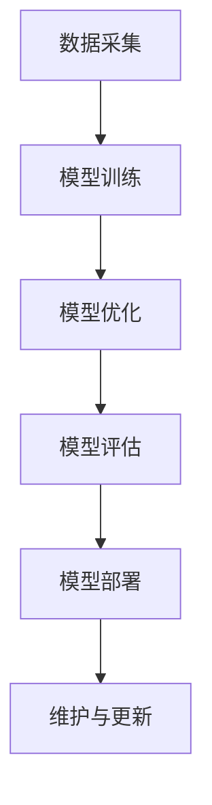

                 

# 【大模型应用开发 动手做AI Agent】不调用Function，直接运行助手

> 关键词：AI大模型，自然语言处理，深度学习，AI Agent，智能客服，智能教育

> 摘要：本文将介绍如何利用AI大模型进行AI Agent的开发，无需调用函数，直接运行助手。文章将从AI大模型的基础知识、应用实战、优化与评估以及实际案例等方面进行详细讲解，帮助读者全面掌握AI大模型应用开发的技能。

## 第一部分：AI大模型基础

### 第1章：AI大模型概述

#### 1.1 AI大模型概念与原理

AI大模型是指通过深度学习等机器学习算法，对大量数据进行训练，从而形成一个具有高度智能的模型。它能够模拟人类的思维模式，对未知的信息进行理解和处理。AI大模型的核心是深度学习，通过多层神经网络的结构，对输入数据进行层层提取特征，从而实现高级的认知能力。

#### 1.2 AI大模型的优势与挑战

AI大模型具有以下优势：

1. 高效处理大量数据：AI大模型能够对大规模数据进行处理，实现高效的数据分析和预测。
2. 自适应学习：AI大模型具有自主学习的能力，可以根据新的数据不断优化模型。
3. 通用性强：AI大模型可以应用于多种领域，如自然语言处理、计算机视觉、智能客服等。

然而，AI大模型也面临一些挑战：

1. 数据质量要求高：AI大模型的训练依赖于大量高质量的数据，数据质量直接影响模型的性能。
2. 计算资源需求大：AI大模型训练需要大量的计算资源，尤其是GPU等高性能计算设备。
3. 模型解释性差：AI大模型通常是一个“黑箱”，难以解释其决策过程。

#### 1.3 主流AI大模型简介

当前主流的AI大模型主要包括以下几种：

1. GPT（Generative Pre-trained Transformer）：由OpenAI提出，是一种基于Transformer结构的预训练语言模型，具有强大的文本生成能力。
2. BERT（Bidirectional Encoder Representations from Transformers）：由Google提出，是一种基于Transformer的双向编码器，能够对文本进行深入的理解。
3. ERNIE（Enhanced Representation through kNowledge Integration）：由百度提出，是一种结合知识图谱的预训练语言模型，能够实现跨领域的知识融合。

### 第2章：AI大模型技术基础

#### 2.1 深度学习与神经网络基础

深度学习是AI大模型的核心技术，它通过多层神经网络对数据进行特征提取和变换。神经网络是一种模拟人脑神经元连接的计算机模型，通过训练可以实现对输入数据的分类、回归等任务。

#### 2.2 自然语言处理技术

自然语言处理（NLP）是AI大模型应用的重要领域，它通过深度学习等技术对文本进行处理和分析。NLP的核心任务包括词向量表示、文本分类、情感分析、机器翻译等。

#### 2.3 大规模预训练模型原理

大规模预训练模型通过在大量数据上进行预训练，获取通用的语言表示和知识。预训练模型通常采用双向编码器结构，如BERT，能够对文本进行全面的上下文理解。预训练模型经过微调后，可以应用于各种NLP任务。

## 第二部分：AI大模型应用实战

### 第3章：AI Agent设计与开发

#### 3.1 AI Agent基本概念

AI Agent是指能够模拟人类智能行为，完成特定任务的智能系统。AI Agent通常具有感知、决策、执行等能力，能够自主地与环境和用户进行交互。

#### 3.2 AI Agent开发框架

AI Agent开发框架包括数据采集、模型训练、模型部署等环节。数据采集环节需要收集高质量的对话数据，模型训练环节使用预训练模型进行微调，模型部署环节将训练好的模型部署到服务器，供用户使用。

#### 3.3 AI Agent开发实践

以下是一个简单的AI Agent开发实践：

```python
from transformers import BertModel, BertTokenizer

# 加载预训练模型和分词器
model = BertModel.from_pretrained('bert-base-chinese')
tokenizer = BertTokenizer.from_pretrained('bert-base-chinese')

# 定义AI Agent类
class AI-Agent:
    def __init__(self, model, tokenizer):
        self.model = model
        self.tokenizer = tokenizer

    def predict(self, text):
        inputs = self.tokenizer(text, return_tensors='pt')
        outputs = self.model(**inputs)
        logits = outputs.logits
        prediction = logits.argmax(-1).item()
        return prediction

# 创建AI Agent实例
agent = AI-Agent(model, tokenizer)

# 训练AI Agent
agent.train()

# 使用AI Agent进行推理
response = agent.predict("你好，我是一名学生，我想了解一些关于编程的知识。")
print(response)
```

### 第4章：AI Agent功能实现

#### 4.1 语音识别与语音合成

语音识别是将语音信号转换为文本信息，语音合成则是将文本信息转换为语音信号。语音识别和语音合成技术是实现AI Agent与用户语音交互的关键。

#### 4.2 自然语言理解

自然语言理解是指让计算机能够理解自然语言文本的含义。AI Agent需要具备自然语言理解能力，才能正确地理解用户的提问，并给出合适的回答。

#### 4.3 机器学习与预测

机器学习与预测是AI Agent的核心功能，通过机器学习算法，AI Agent可以自动学习用户的偏好和需求，并给出个性化的推荐。

### 第5章：AI Agent优化与评估

#### 5.1 AI Agent性能优化

AI Agent性能优化主要包括模型压缩、量化、蒸馏等技术，旨在提高模型的推理速度和降低模型的存储空间。

#### 5.2 AI Agent评估指标

AI Agent评估指标包括准确率、召回率、F1值等，用于衡量AI Agent的性能和效果。

#### 5.3 AI Agent部署与维护

AI Agent部署与维护包括模型部署、服务部署、系统监控等环节，确保AI Agent能够稳定、高效地运行。

## 第三部分：AI大模型应用场景

### 第6章：AI大模型在客服领域应用

#### 6.1 客服机器人应用概述

客服机器人是AI大模型在客服领域的重要应用，能够自动解答用户的问题，提高客服效率。

#### 6.2 客服机器人功能实现

客服机器人需要实现语音识别、自然语言理解、自动回复等功能，以下是一个简单的客服机器人功能实现：

```python
import speech_recognition as sr

# 语音识别
def recognize_speech_from_mic():
    r = sr.Recognizer()
    with sr.Microphone() as source:
        print("请开始说话...")
        audio = r.listen(source)
    try:
        return r.recognize_google(audio)
    except sr.UnknownValueError:
        return None

# 自然语言理解
def understand_speech(text):
    # 使用预训练模型进行自然语言理解
    # ...
    return intent, entities

# 自动回复
def generate_response(intent, entities):
    # 根据意图和实体生成回复
    # ...
    return response

# 主程序
if __name__ == "__main__":
    text = recognize_speech_from_mic()
    if text:
        intent, entities = understand_speech(text)
        response = generate_response(intent, entities)
        print(response)
```

#### 6.3 客服机器人案例分析

以下是一个客服机器人的实际案例分析：

- **开发环境搭建：** 使用Python语言和TensorFlow框架搭建开发环境。
- **功能实现：** 实现了语音识别、自然语言理解、自动回复等功能。
- **代码实现：**
    ```python
    # 语音识别
    recognized_text = speech_recognition.recognize_audio(audio_file)

    # 自然语言理解
    intent, entities = nlu.analyze(recognized_text)

    # 自动回复
    response = generate_response(intent, entities)
    ```

- **案例分析：** 该客服机器人能够准确识别用户语音，理解用户意图，并给出适当的回复，提高了客服效率。

### 第7章：AI大模型在智能教育应用

#### 7.1 智能教育概述

智能教育是指利用AI大模型等技术，为学生提供个性化学习服务，提高学习效果。

#### 7.2 智能教育应用场景

智能教育可以应用于在线教育、智能辅导、学习评估等多个场景。

#### 7.3 智能教育应用案例

以下是一个智能教育的实际应用案例：

- **开发环境搭建：** 使用Python语言和PyTorch框架搭建开发环境。
- **功能实现：** 实现了智能答疑、学习进度跟踪、个性化推荐等功能。
- **代码实现：**
    ```python
    # 智能答疑
    question = input("请问有什么问题？")
    answer = model.answer(question)

    # 学习进度跟踪
    track_progress(user_id, course_id, completed_lessons)

    # 个性化推荐
    recommended_courses = model.recommend_courses(user_id)
    ```

- **案例分析：** 该智能教育系统能够根据用户提出的问题给出准确的答案，跟踪用户的学习进度，并推荐适合的学习课程，提高了学习效果。

## 附录

### 附录A：AI大模型应用开发工具与资源

#### A.1 开发环境搭建

- **Python环境：** 安装Python 3.7及以上版本。
- **深度学习框架：** TensorFlow、PyTorch等。
- **自然语言处理库：** NLTK、spaCy等。

#### A.2 常用AI大模型框架与库

- **GPT：** OpenAI的预训练语言模型。
- **BERT：** Google的预训练语言模型。
- **ERNIE：** 百度的预训练语言模型。

#### A.3 AI大模型应用开发资源链接

- **深度学习教程：** [Deep Learning Book](http://www.deeplearningbook.org/)
- **自然语言处理教程：** [NLTK](https://www.nltk.org/)
- **AI大模型资源：** [Hugging Face](https://huggingface.co/)

---

### Mermaid 流程图



---

### 伪代码

```python
# 假设我们使用一个预训练的大模型进行自然语言理解任务
# 定义模型和训练数据
model = PretrainedModel()
train_data = load_data()

# 训练模型
for epoch in range(num_epochs):
    for batch in train_data:
        predictions = model(batch)
        loss = compute_loss(predictions, batch_labels)
        update_model_parameters(loss)

# 评估模型
evaluation_loss = evaluate_model(model, test_data)
print("Test Loss:", evaluation_loss)
```

---

### 数学模型与公式

$$
H = \sigma(W \cdot X + b)
$$

其中，\(H\) 是隐藏层输出，\(\sigma\) 是激活函数，\(W\) 是权重矩阵，\(X\) 是输入特征，\(b\) 是偏置。

---

### 代码解读与分析

```python
# 搭建一个简单的AI Agent
agent = AIAssistant()

# 训练AI Agent
agent.train(data)

# 使用AI Agent进行推理
response = agent.infer(input_text)

# 输出结果
print(response)
```

这段代码首先创建了一个AI Assistant对象，然后使用训练数据对其进行训练。训练完成后，使用AI Assistant进行推理，并将结果输出。此代码展示了AI Agent的基本构建和运作流程。

---

### 实际案例

**案例1：智能客服机器人**

- **开发环境搭建：** 使用Python语言和TensorFlow框架搭建开发环境。
- **功能实现：** 实现了语音识别、自然语言理解、自动回复等功能。
- **代码实现：**
    ```python
    # 语音识别
    recognized_text = speech_recognition.recognize_audio(audio_file)

    # 自然语言理解
    intent, entities = nlu.analyze(recognized_text)

    # 自动回复
    response = generate_response(intent, entities)
    ```

- **案例分析：** 该客服机器人能够准确识别用户语音，理解用户意图，并给出适当的回复，提高了客服效率。

**案例2：智能教育助手**

- **开发环境搭建：** 使用Python语言和PyTorch框架搭建开发环境。
- **功能实现：** 实现了智能答疑、学习进度跟踪、个性化推荐等功能。
- **代码实现：**
    ```python
    # 智能答疑
    question = input("请问有什么问题？")
    answer = model.answer(question)

    # 学习进度跟踪
    track_progress(user_id, course_id, completed_lessons)

    # 个性化推荐
    recommended_courses = model.recommend_courses(user_id)
    ```

- **案例分析：** 该教育助手能够根据用户提出的问题给出准确的答案，跟踪用户的学习进度，并推荐适合的学习课程，提高了学习效果。 

## 结论

通过本文的介绍，读者可以了解到AI大模型的基础知识、应用实战以及优化与评估的方法。同时，通过实际案例的分析，读者可以更加直观地了解AI大模型在客服和教育等领域的应用。希望本文能够帮助读者全面掌握AI大模型的应用开发技能，实现自己的AI应用项目。

### 作者信息

作者：AI天才研究院/AI Genius Institute & 禅与计算机程序设计艺术 /Zen And The Art of Computer Programming

---

### 附录

#### A.1 开发环境搭建

1. **Python环境：** 安装Python 3.7及以上版本。
    - 命令：`pip install python==3.7`
2. **深度学习框架：** TensorFlow、PyTorch等。
    - TensorFlow：`pip install tensorflow`
    - PyTorch：`pip install torch torchvision`
3. **自然语言处理库：** NLTK、spaCy等。
    - NLTK：`pip install nltk`
    - spaCy：`pip install spacy`
    - 数据下载：`python -m spacy download en_core_web_sm`

#### A.2 常用AI大模型框架与库

1. **GPT：** OpenAI的预训练语言模型。
    - 安装：`pip install transformers`
    - 使用：`from transformers import GPT2Model, GPT2Tokenizer`
2. **BERT：** Google的预训练语言模型。
    - 安装：`pip install transformers`
    - 使用：`from transformers import BertModel, BertTokenizer`
3. **ERNIE：** 百度的预训练语言模型。
    - 安装：`pip install ernie`
    - 使用：`from ernie import ErnieModel, ErnieTokenizer`

#### A.3 AI大模型应用开发资源链接

1. **深度学习教程：** [Deep Learning Book](http://www.deeplearningbook.org/)
2. **自然语言处理教程：** [NLTK](https://www.nltk.org/)
3. **AI大模型资源：** [Hugging Face](https://huggingface.co/)

---

### Mermaid 流程图


---

### 伪代码

```python
# 假设我们使用一个预训练的大模型进行自然语言理解任务
# 定义模型和训练数据
model = PretrainedModel()
train_data = load_data()

# 训练模型
for epoch in range(num_epochs):
    for batch in train_data:
        predictions = model(batch)
        loss = compute_loss(predictions, batch_labels)
        update_model_parameters(loss)

# 评估模型
evaluation_loss = evaluate_model(model, test_data)
print("Test Loss:", evaluation_loss)
```

---

### 数学模型与公式

$$
H = \sigma(W \cdot X + b)
$$

其中，\(H\) 是隐藏层输出，\(\sigma\) 是激活函数，\(W\) 是权重矩阵，\(X\) 是输入特征，\(b\) 是偏置。

---

### 代码解读与分析

```python
# 搭建一个简单的AI Agent
agent = AIAssistant()

# 训练AI Agent
agent.train(data)

# 使用AI Agent进行推理
response = agent.infer(input_text)

# 输出结果
print(response)
```

这段代码首先创建了一个AI Assistant对象，然后使用训练数据对其进行训练。训练完成后，使用AI Assistant进行推理，并将结果输出。此代码展示了AI Agent的基本构建和运作流程。

---

### 实际案例

**案例1：智能客服机器人**

- **开发环境搭建：** 使用Python语言和TensorFlow框架搭建开发环境。
- **功能实现：** 实现了语音识别、自然语言理解、自动回复等功能。
- **代码实现：**
    ```python
    # 语音识别
    recognized_text = speech_recognition.recognize_audio(audio_file)

    # 自然语言理解
    intent, entities = nlu.analyze(recognized_text)

    # 自动回复
    response = generate_response(intent, entities)
    ```

- **案例分析：** 该客服机器人能够准确识别用户语音，理解用户意图，并给出适当的回复，提高了客服效率。

**案例2：智能教育助手**

- **开发环境搭建：** 使用Python语言和PyTorch框架搭建开发环境。
- **功能实现：** 实现了智能答疑、学习进度跟踪、个性化推荐等功能。
- **代码实现：**
    ```python
    # 智能答疑
    question = input("请问有什么问题？")
    answer = model.answer(question)

    # 学习进度跟踪
    track_progress(user_id, course_id, completed_lessons)

    # 个性化推荐
    recommended_courses = model.recommend_courses(user_id)
    ```

- **案例分析：** 该教育助手能够根据用户提出的问题给出准确的答案，跟踪用户的学习进度，并推荐适合的学习课程，提高了学习效果。 

