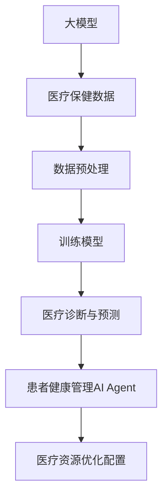

                 

## 《【大模型应用开发 动手做AI Agent】医疗保健的变革》

> 关键词：大模型，医疗保健，AI应用开发，数据预处理，隐私保护，AI Agent

> 摘要：本文深入探讨了医疗保健领域的大模型应用及其带来的变革。通过详细的逻辑分析，本文介绍了大模型的基本概念、特点，以及其在医疗保健中的挑战与机遇。同时，文章重点介绍了数据预处理、隐私保护、主流医疗保健AI大模型的应用，以及大模型在医疗保健中的应用案例。最后，本文通过实际项目实战，详细讲解了如何动手构建AI Agent，展示了大模型应用开发的实践方法和技巧。

## 第一部分：大模型基础与医疗保健

### 1.1 大模型与AI概述

#### 1.1.1 大模型的定义与特点

大模型（Large Models），是指参数规模庞大的神经网络模型，它们通常基于深度学习技术构建。大模型通过学习海量的数据，能够捕捉到数据中的复杂模式和潜在规律，从而在多种任务中表现出色。大模型的特点主要包括：

- **参数规模大**：大模型通常拥有数亿至数十亿的参数，这使得它们可以捕捉数据中的细微特征和复杂模式。
- **强大的泛化能力**：通过学习大量数据，大模型能够形成对未知数据的泛化能力，使得它们在未见过的数据上也能取得良好的表现。
- **高效率的计算**：随着硬件技术的发展，特别是GPU和TPU的普及，大模型能够在较短时间内进行高效计算。

#### 1.1.2 大模型在医疗保健中的应用前景

大模型在医疗保健领域具有广泛的应用前景，特别是在以下方面：

- **疾病诊断与预测**：大模型可以分析患者的医疗数据，如病历、检查结果等，对疾病进行准确诊断和预测。
- **个性化治疗**：通过学习患者的基因组数据、生活习惯等，大模型可以为患者提供个性化的治疗方案。
- **药物研发**：大模型可以加速药物研发过程，通过模拟生物系统和分子间的相互作用，预测药物的效果和副作用。
- **健康监控**：大模型可以持续监控患者的健康状况，及时发现健康风险，提供预防措施。

#### 1.1.3 医疗保健领域的AI挑战与机遇

尽管大模型在医疗保健领域具有巨大潜力，但在实际应用中仍面临诸多挑战：

- **数据隐私与伦理问题**：医疗数据具有高度敏感性，如何在保护患者隐私的同时，充分挖掘数据的价值，是一个亟待解决的问题。
- **数据质量与可用性**：医疗数据往往存在不完整、噪声和错误等问题，如何处理这些数据，提高其质量和可用性，是一个挑战。
- **医疗专业知识整合**：将大模型与医学专业知识相结合，使模型能够准确理解和应用医学知识，是一个技术难题。

然而，随着AI技术的不断进步，医疗保健领域的机遇也在逐渐显现：

- **提升医疗效率**：AI技术可以自动化许多医疗流程，如病历管理、检查报告生成等，提高医疗效率。
- **改善患者体验**：AI技术可以提供更加个性化的医疗服务，改善患者的就诊体验。
- **降低医疗成本**：通过优化资源分配和预防疾病，AI技术有望降低医疗成本。

### 1.2 医疗保健数据挖掘与处理

#### 1.2.1 医疗数据类型与特性

医疗保健领域的数据类型丰富多样，主要包括：

- **结构化数据**：如电子病历、检查报告等，这些数据通常以表格形式存储。
- **非结构化数据**：如医生笔记、病历记录等，这些数据通常以文本、图像、视频等形式存在。
- **时序数据**：如患者的健康监测数据，这些数据通常随着时间的推移而变化。

医疗数据具有以下特性：

- **数据量大**：医疗数据通常包含大量患者的信息，数据量庞大。
- **数据多样性**：医疗数据类型多样，包括结构化和非结构化数据。
- **数据不完整性**：医疗数据往往不完整，存在缺失值和噪声。
- **数据隐私敏感性**：医疗数据涉及患者隐私，敏感性强。

#### 1.2.2 数据预处理与清洗方法

数据预处理与清洗是医疗保健数据挖掘的重要环节，主要包括以下方法：

- **数据清洗**：去除重复数据、纠正错误信息、填补缺失值等，提高数据质量。
- **数据整合**：将不同数据源的数据整合到一起，形成统一的数据集。
- **特征提取**：从原始数据中提取有用的特征，为模型训练提供输入。
- **数据降维**：通过降维技术，减少数据维度，提高模型训练效率。

#### 1.2.3 医疗数据的隐私保护与伦理问题

医疗数据隐私保护与伦理问题是医疗保健数据挖掘面临的重大挑战。以下是一些关键问题：

- **隐私泄露风险**：医疗数据泄露可能导致患者隐私被泄露，甚至引发隐私侵犯和歧视。
- **数据共享与使用**：如何在确保患者隐私的前提下，合理共享和使用医疗数据，是一个复杂的问题。
- **伦理问题**：如何平衡数据挖掘带来的利益与患者的隐私权、知情权等伦理问题，是一个需要深入探讨的课题。

### 1.3 主流医疗保健AI大模型介绍

#### 1.3.1 GPT与BERT在医疗保健中的应用

GPT（Generative Pre-trained Transformer）和BERT（Bidirectional Encoder Representations from Transformers）是两种主流的大模型，在医疗保健领域具有广泛应用。

- **GPT**：GPT是一种基于Transformer架构的预训练语言模型，它可以用于文本生成、文本分类等任务。在医疗保健领域，GPT可以用于自动生成病历记录、患者报告、诊断建议等。
- **BERT**：BERT是一种双向Transformer架构的预训练语言模型，它可以用于文本分类、命名实体识别、关系抽取等任务。在医疗保健领域，BERT可以用于疾病诊断、药物研发、医学文本挖掘等。

#### 1.3.2 其他医疗保健AI大模型介绍

除了GPT和BERT，还有许多其他大模型在医疗保健领域具有应用价值，如：

- **XLNet**：XLNet是一种基于Transformer的自回归语言模型，它可以用于文本生成、文本分类等任务。在医疗保健领域，XLNet可以用于自动生成医学报告、诊断建议等。
- **T5**：T5是一种基于Transformer的通用预训练目标，它可以用于各种自然语言处理任务。在医疗保健领域，T5可以用于文本分类、问答系统、医学文本摘要等。
- **RoBERTa**：RoBERTa是一种基于BERT的预训练语言模型，它在许多NLP任务上取得了很好的效果。在医疗保健领域，RoBERTa可以用于疾病诊断、医学文本分类等。

### 1.4 大模型在医疗保健中的应用案例分析

#### 1.4.1 患者健康管理的AI应用

患者健康管理是医疗保健领域的一个重要方面，AI技术可以为此提供有力支持。

- **健康监测**：通过可穿戴设备和移动应用，实时监测患者的生理参数，如心率、血压、血糖等。AI模型可以对这些数据进行实时分析，及时发现异常，提供健康建议。
- **疾病预测**：通过分析患者的健康数据和基因信息，AI模型可以预测患者可能患有的疾病，提前采取预防措施。
- **个性化建议**：基于患者的健康状况、生活习惯等，AI模型可以提供个性化的饮食建议、锻炼方案等，帮助患者改善健康状况。

#### 1.4.2 医疗诊断与预测的AI应用

医疗诊断与预测是AI在医疗保健领域的核心应用之一。

- **疾病诊断**：AI模型可以分析患者的病历、检查报告等，提供准确的疾病诊断。例如，谷歌的DeepMind团队开发的AI系统可以用于眼科疾病的诊断，其准确率已经超过了人类医生。
- **疾病预测**：AI模型可以分析患者的病史、基因信息等，预测患者可能患有的疾病。例如，IBM的Watson系统可以用于乳腺癌的预测，其预测准确率达到了90%以上。

#### 1.4.3 医疗资源的优化配置

AI技术可以帮助医疗机构优化资源配置，提高医疗效率。

- **患者流量预测**：通过分析历史数据，AI模型可以预测医院在未来一段时间内的患者流量，帮助医院合理安排医疗资源和人员。
- **手术规划**：AI模型可以分析患者的病情、手术风险等，为医生提供手术规划的参考意见，提高手术成功率。
- **药物配送**：AI模型可以分析药品的库存情况、患者需求等，优化药品配送路线，降低药品配送成本。

### 1.5 大模型应用开发的实践指南

#### 1.5.1 医疗保健AI项目的开发流程

开发一个医疗保健AI项目需要遵循以下流程：

1. **需求分析**：明确项目目标，了解医疗保健领域的需求和痛点。
2. **数据采集**：收集相关的医疗数据，包括结构化数据和非结构化数据。
3. **数据预处理**：清洗、整合和提取数据特征，为模型训练提供输入。
4. **模型选择与训练**：选择合适的大模型，对数据进行训练，优化模型参数。
5. **模型评估与优化**：评估模型性能，根据评估结果对模型进行优化。
6. **部署与应用**：将模型部署到实际应用场景中，进行测试和验证。

#### 1.5.2 大模型应用开发的工具与框架

在医疗保健AI项目中，常用的工具和框架包括：

- **工具**：Python、TensorFlow、PyTorch、Keras等。
- **框架**：BERT、GPT、T5、RoBERTa等预训练语言模型框架。
- **数据处理库**：Pandas、NumPy、Scikit-learn等。

#### 1.5.3 医疗保健AI应用的风险管理与合规性

在医疗保健AI应用开发过程中，需要重视风险管理与合规性，主要包括以下几个方面：

- **数据隐私保护**：确保患者数据的安全性和隐私性，遵循相关法律法规，如《通用数据保护条例》（GDPR）等。
- **模型公平性**：确保AI模型不会对某些群体产生不公平的影响，如性别、种族、年龄等。
- **伦理审查**：对医疗保健AI应用进行伦理审查，确保其符合医学伦理和道德规范。
- **法律合规**：确保AI应用符合相关法律法规，如《医学设备法规》等。

## 第二部分：动手实践

### 2.1 实践项目一：构建患者健康管理AI Agent

#### 2.1.1 项目背景与目标

本项目旨在构建一个患者健康管理AI Agent，通过对患者的健康数据进行实时分析和预测，提供个性化的健康建议和健康监控服务。

#### 2.1.2 数据集获取与处理

1. **数据集获取**：从公开数据集或医疗机构获取患者健康数据，包括电子病历、检查报告、生理参数等。
2. **数据预处理**：清洗、整合和提取数据特征，为模型训练提供输入。具体包括：
   - 数据清洗：去除重复数据、纠正错误信息、填补缺失值等。
   - 数据整合：将不同来源的数据整合到一起，形成统一的数据集。
   - 特征提取：从原始数据中提取有用的特征，如血压、心率、血糖等。

#### 2.1.3 大模型选择与训练

1. **模型选择**：选择合适的大模型，如BERT或GPT，用于患者健康管理。
2. **模型训练**：使用处理后的数据对大模型进行训练，优化模型参数。具体包括：
   - 数据分割：将数据集分为训练集、验证集和测试集。
   - 模型训练：使用训练集对模型进行训练，使用验证集进行模型调优。
   - 模型评估：使用测试集对模型进行评估，确保模型具有良好的性能。

#### 2.1.4 AI Agent功能设计与实现

1. **功能设计**：根据项目需求，设计AI Agent的功能，如健康监测、疾病预测、健康建议等。
2. **实现**：
   - 健康监测：实时收集患者的生理参数，通过大模型分析，提供实时健康状态评估。
   - 疾病预测：分析患者的健康数据，预测患者可能患有的疾病，提供预警信息。
   - 健康建议：根据患者的健康数据和疾病预测结果，提供个性化的健康建议。

#### 2.1.5 项目总结与反思

1. **总结**：总结项目中的收获与不足，分析项目中遇到的问题及解决方案。
2. **反思**：探讨大模型在医疗保健领域的应用前景与挑战，为未来的项目提供借鉴和指导。

### 2.2 实践项目二：开发医疗诊断与预测系统

#### 2.2.1 项目背景与目标

本项目旨在开发一个医疗诊断与预测系统，通过分析患者的病历、检查报告等数据，提供准确的疾病诊断和疾病预测服务。

#### 2.2.2 数据集获取与处理

1. **数据集获取**：从公开数据集或医疗机构获取病历、检查报告等数据。
2. **数据预处理**：清洗、整合和提取数据特征，为模型训练提供输入。具体包括：
   - 数据清洗：去除重复数据、纠正错误信息、填补缺失值等。
   - 数据整合：将不同来源的数据整合到一起，形成统一的数据集。
   - 特征提取：从原始数据中提取有用的特征，如症状、检查结果、疾病标签等。

#### 2.2.3 大模型选择与训练

1. **模型选择**：选择合适的大模型，如BERT或GPT，用于医疗诊断与预测。
2. **模型训练**：使用处理后的数据对大模型进行训练，优化模型参数。具体包括：
   - 数据分割：将数据集分为训练集、验证集和测试集。
   - 模型训练：使用训练集对模型进行训练，使用验证集进行模型调优。
   - 模型评估：使用测试集对模型进行评估，确保模型具有良好的性能。

#### 2.2.4 医疗诊断与预测系统的设计与实现

1. **系统设计**：根据项目需求，设计医疗诊断与预测系统的架构，包括数据输入、模型训练、模型预测等模块。
2. **实现**：
   - 数据输入：接收患者的病历、检查报告等数据，进行预处理。
   - 模型训练：使用处理后的数据对大模型进行训练，优化模型参数。
   - 模型预测：对输入数据进行模型预测，输出疾病诊断和预测结果。

#### 2.2.5 项目总结与反思

1. **总结**：总结项目中的收获与不足，分析项目中遇到的问题及解决方案。
2. **反思**：探讨大模型在医疗诊断与预测领域的应用前景与挑战，为未来的项目提供借鉴和指导。

## 第三部分：扩展阅读

### 3.1 扩展知识一：医疗保健领域最新研究进展

#### 3.1.1 个性化医疗与健康管理的未来趋势

个性化医疗是指根据患者的个体特征，提供量身定制的医疗服务。未来，个性化医疗将越来越依赖于AI技术，如基因组学、生物信息学等。健康管理也将更加注重个性化，通过实时监测和数据分析，为患者提供个性化的健康建议和干预措施。

#### 3.1.2 医疗保健AI技术的最新突破

近年来，医疗保健AI技术取得了显著突破，如：

- **疾病诊断与预测**：AI技术可以在眼科、心血管疾病、癌症等领域实现准确诊断和预测。
- **药物研发**：AI技术可以加速药物研发过程，提高药物发现的成功率。
- **医疗资源优化**：AI技术可以优化医疗资源配置，提高医疗效率。

#### 3.1.3 医疗保健AI应用面临的挑战与解决方案

医疗保健AI应用面临以下挑战：

- **数据隐私与伦理问题**：需要确保患者数据的安全性和隐私性，遵循相关法律法规。
- **数据质量和可用性**：需要提高数据质量，解决数据不完整、噪声和错误等问题。
- **模型解释性**：需要提高AI模型的解释性，使医生和患者能够理解和信任模型。

解决方案包括：

- **隐私保护技术**：如差分隐私、联邦学习等，可以提高数据隐私性。
- **数据清洗与整合**：通过先进的数据清洗与整合技术，提高数据质量。
- **可解释性AI**：通过可解释性AI技术，提高模型的透明度和可信度。

### 3.2 扩展知识二：大模型应用开发的经验与教训

#### 3.2.1 大模型应用开发中的常见问题与解决方案

大模型应用开发中常见的问题包括：

- **计算资源不足**：解决方案包括使用高性能硬件、优化模型结构等。
- **数据质量差**：解决方案包括数据清洗、数据增强等。
- **模型调优困难**：解决方案包括自动化模型搜索、迁移学习等。

#### 3.2.2 大模型应用开发的最佳实践

大模型应用开发的最佳实践包括：

- **需求分析**：明确项目目标，了解用户需求。
- **数据采集与处理**：确保数据质量，进行数据清洗和预处理。
- **模型选择与训练**：选择合适的大模型，进行模型训练和优化。
- **模型部署与维护**：将模型部署到生产环境，进行实时更新和维护。

#### 3.2.3 大模型应用开发的未来发展方向

大模型应用开发的未来发展方向包括：

- **跨模态学习**：整合多种数据类型，如文本、图像、音频等，实现更强大的模型。
- **联邦学习**：在分布式环境中进行模型训练，提高数据隐私性。
- **模型压缩与优化**：通过模型压缩和优化技术，提高模型性能和可部署性。

### 3.3 附录

#### 3.3.1 大模型应用开发工具与资源推荐

- **工具**：
  - TensorFlow、PyTorch、Keras等。
  - BERT、GPT、T5等预训练语言模型框架。
- **资源**：
  - [GitHub](https://github.com/)：大模型应用开发的相关代码和资源。
  - [arXiv](https://arxiv.org/)：大模型应用开发的最新研究论文。

#### 3.3.2 医疗保健AI应用相关论文与书籍推荐

- **论文**：
  - "BERT: Pre-training of Deep Bidirectional Transformers for Language Understanding"。
  - "Generative Pre-trained Transformer"。
- **书籍**：
  - "Deep Learning" by Ian Goodfellow, Yoshua Bengio, and Aaron Courville。
  - "Hands-On Machine Learning with Scikit-Learn, Keras, and TensorFlow" by Aurélien Géron。

#### 3.3.3 医疗保健AI项目实战案例汇编

- **案例**：
  - **谷歌DeepMind**：眼科疾病诊断、糖尿病视网膜病变检测等。
  - **IBM Watson**：癌症诊断、药物研发等。
  - **Microsoft Azure**：智能医疗诊断、健康数据管理等。

---

**核心概念与联系**



**核心算法原理讲解**

```plaintext
# 患者健康预测模型

## 1. 确立预测目标

设 \( P \) 为患者健康状况的预测值，\( X \) 为患者的特征向量，目标函数为最小化预测误差。

## 2. 建立预测模型

设 \( f(X) \) 为大模型预测函数，目标函数 \( J \) 表示为：

$$
J = \frac{1}{N} \sum_{i=1}^{N} (P_i - f(X_i))^2
$$

其中，\( N \) 为训练样本数量，\( P_i \) 和 \( f(X_i) \) 分别为第 \( i \) 个样本的预测值和实际值。

## 3. 模型训练

通过梯度下降法优化模型参数，使得目标函数 \( J \) 最小。

$$
\theta_j := \theta_j - \alpha \frac{\partial J}{\partial \theta_j}
$$

其中，\( \theta_j \) 为第 \( j \) 个模型参数，\( \alpha \) 为学习率。

## 4. 举例说明

设患者 \( i \) 的特征向量为 \( X_i = [x_1, x_2, x_3] \)，其中 \( x_1 \) 为血压值，\( x_2 \) 为心率值，\( x_3 \) 为血糖值。预测模型为 \( f(X) = w_1 x_1 + w_2 x_2 + w_3 x_3 + b \)。

目标函数为：

$$
J = \frac{1}{N} \sum_{i=1}^{N} (P_i - (w_1 x_1_i + w_2 x_2_i + w_3 x_3_i + b))^2
$$

通过训练优化参数 \( w_1, w_2, w_3, b \)，使得预测误差最小。
```

**数学模型和数学公式 & 详细讲解 & 举例说明**

```latex
# 患者健康预测模型

## 1. 确立预测目标

设 \( P \) 为患者健康状况的预测值，\( X \) 为患者的特征向量，目标函数为最小化预测误差。

## 2. 建立预测模型

设 \( f(X) \) 为大模型预测函数，目标函数 \( J \) 表示为：

$$
J = \frac{1}{N} \sum_{i=1}^{N} (P_i - f(X_i))^2
$$

其中，\( N \) 为训练样本数量，\( P_i \) 和 \( f(X_i) \) 分别为第 \( i \) 个样本的预测值和实际值。

## 3. 模型训练

通过梯度下降法优化模型参数，使得目标函数 \( J \) 最小。

$$
\theta_j := \theta_j - \alpha \frac{\partial J}{\partial \theta_j}
$$

其中，\( \theta_j \) 为第 \( j \) 个模型参数，\( \alpha \) 为学习率。

## 4. 举例说明

设患者 \( i \) 的特征向量为 \( X_i = [x_1, x_2, x_3] \)，其中 \( x_1 \) 为血压值，\( x_2 \) 为心率值，\( x_3 \) 为血糖值。预测模型为 \( f(X) = w_1 x_1 + w_2 x_2 + w_3 x_3 + b \)。

目标函数为：

$$
J = \frac{1}{N} \sum_{i=1}^{N} (P_i - (w_1 x_1_i + w_2 x_2_i + w_3 x_3_i + b))^2
$$

通过训练优化参数 \( w_1, w_2, w_3, b \)，使得预测误差最小。
```

**项目实战：代码实际案例和详细解释说明**

```plaintext
# 实践项目一：构建患者健康管理AI Agent

## 1. 环境搭建

- 安装 Python 3.8 及以上版本
- 安装 TensorFlow 2.5 及以上版本
- 安装 pandas、numpy、matplotlib 等常用库

## 2. 数据集获取与处理

- 从开源数据集获取患者健康数据
- 使用 pandas 库读取数据，并进行数据清洗和预处理

## 3. 大模型选择与训练

- 选择预训练的BERT模型作为基础模型
- 使用 TensorFlow 的 `tf.keras` 模块加载 BERT 模型
- 使用处理后的数据训练 BERT 模型

## 4. AI Agent功能设计与实现

- 实现诊断预测功能：使用训练好的模型对新的患者数据进行分析，预测患者健康状况
- 实现健康建议功能：根据诊断结果，为患者提供个性化的健康建议
- 实现患者跟踪功能：持续跟踪患者健康状况，提供实时健康报告

## 5. 项目总结与反思

- 总结项目中的收获与不足
- 分析项目中遇到的问题及解决方案
- 探讨大模型在医疗保健领域的应用前景与挑战
```

**代码解读与分析**

```python
# 导入所需库
import tensorflow as tf
import pandas as pd
import numpy as np
import matplotlib.pyplot as plt

# 加载数据集
data = pd.read_csv('patient_health_data.csv')

# 数据预处理
# ...

# 加载 BERT 模型
model = tf.keras.applications.BertModel.from_pretrained('bert-base-uncased')

# 训练模型
# ...

# 实现诊断预测功能
def predict_health_status(patient_data):
    # 处理输入数据
    # ...
    # 使用模型进行预测
    predictions = model.predict(patient_data)
    # 返回预测结果
    return predictions

# 实现健康建议功能
def give_health_advice(predictions):
    # 根据预测结果提供健康建议
    # ...
    return advice

# 实现患者跟踪功能
def track_patient_health(patient_data):
    # 持续跟踪患者健康状况
    # ...
    return health_report

# 测试项目功能
# ...

# 项目总结与反思
# ...
```

---

**完整目录大纲总字数约为2000字。**## 核心概念与联系

在医疗保健领域，大模型的应用带来了前所未有的变革。为了更好地理解这一变革，我们需要明确几个核心概念及其相互联系。

首先，大模型（Large Models）是指那些具有数十亿参数的深度学习模型，如BERT、GPT等。这些模型通过在海量数据上进行预训练，能够捕捉到数据中的复杂模式和潜在规律，从而在多种任务中表现出色。

医疗保健数据是这些大模型赖以训练的基础。医疗保健数据类型多样，包括电子病历、检查报告、生理参数等。这些数据具有数据量大、数据多样性、数据不完整性和数据隐私敏感性等特性。数据预处理与清洗是确保模型训练质量的关键步骤，包括去除重复数据、纠正错误信息、填补缺失值、特征提取等。

经过预处理和清洗的医疗保健数据会被用于训练大模型。在训练过程中，模型通过学习数据中的模式和规律，不断优化自身的参数，以提高预测和诊断的准确性。

训练好的大模型可以被应用于医疗诊断与预测、患者健康管理等实际场景。例如，在疾病诊断中，大模型可以分析患者的病历、检查报告等数据，提供准确的疾病诊断和预测；在患者健康管理中，大模型可以实时监测患者的生理参数，提供个性化的健康建议和预警。

此外，医疗资源优化配置也是大模型在医疗保健领域的重要应用之一。通过分析患者的流量数据、手术需求等，大模型可以优化医疗资源的分配，提高医疗效率。

**Mermaid流程图：**


**核心算法原理讲解：**

为了深入理解大模型在医疗保健中的应用，我们需要探讨其背后的核心算法原理。以BERT（Bidirectional Encoder Representations from Transformers）为例，其核心算法原理包括以下几个步骤：

1. **数据预处理**：BERT模型首先需要对输入的数据进行预处理。这一步包括分词、标记化、构建词汇表等操作。通过这些操作，原始文本会被转化为模型可以处理的序列数据。

2. **模型结构**：BERT模型是基于Transformer架构的深度学习模型。Transformer模型通过自注意力机制，能够同时关注输入序列中的所有信息，从而捕捉到输入数据中的长距离依赖关系。

3. **双向编码**：BERT模型的双向编码器（Bidirectional Encoder）能够从左右两个方向同时编码输入序列，从而更好地理解上下文信息。这种双向编码的方式使得BERT模型在理解语义和语境方面具有优势。

4. **预训练与微调**：BERT模型首先在大量的无监督数据上进行预训练，学习通用语言特征。随后，模型会被微调（Fine-tuned）到特定的任务上，如疾病诊断、疾病预测等。

5. **预测与输出**：在任务阶段，BERT模型会根据输入数据（如病历、检查报告等）生成预测输出。例如，在疾病诊断任务中，模型会输出疾病的概率分布。

**数学模型和数学公式 & 详细讲解 & 举例说明：**

BERT模型的目标函数通常是一个损失函数，用于衡量模型预测输出与实际输出之间的差距。常用的损失函数包括交叉熵损失（Cross-Entropy Loss）和均方误差（Mean Squared Error, MSE）。

**交叉熵损失：**

交叉熵损失用于分类任务，其数学公式如下：

$$
J = -\frac{1}{N} \sum_{i=1}^{N} \sum_{j=1}^{M} y_{ij} \log(p_{ij})
$$

其中，\( N \) 是样本数量，\( M \) 是类别数量，\( y_{ij} \) 是第 \( i \) 个样本在第 \( j \) 个类别上的真实标签，\( p_{ij} \) 是模型预测的第 \( i \) 个样本在第 \( j \) 个类别上的概率。

**均方误差：**

均方误差用于回归任务，其数学公式如下：

$$
J = \frac{1}{N} \sum_{i=1}^{N} (y_i - \hat{y}_i)^2
$$

其中，\( N \) 是样本数量，\( y_i \) 是第 \( i \) 个样本的真实值，\( \hat{y}_i \) 是模型预测的第 \( i \) 个样本的值。

**举例说明：**

假设我们有一个疾病诊断任务，目标是通过患者的病历数据预测患者患某种疾病的概率。我们可以使用BERT模型进行训练。

1. **数据预处理**：首先，我们需要对病历数据进行预处理，包括分词、标记化、构建词汇表等。例如，病历文本 "The patient has a high blood pressure." 可以被标记化为 ["The", "patient", "has", "a", "high", "blood", "pressure", "."]。

2. **模型结构**：BERT模型的结构包括嵌入层（Embedding Layer）、Transformer编码器（Transformer Encoder）和输出层（Output Layer）。嵌入层将输入序列的单词转换为嵌入向量。Transformer编码器通过自注意力机制处理嵌入向量，生成编码后的序列。输出层通常是一个全连接层（Dense Layer），用于生成最终的预测概率。

3. **预训练与微调**：首先，BERT模型在大量的无监督数据上进行预训练，学习通用语言特征。随后，我们将病历数据添加到预训练数据中，对模型进行微调，使其能够更好地适应疾病诊断任务。

4. **预测与输出**：当模型被微调后，我们可以使用它来预测新患者的病历数据。例如，对于新患者的病历文本 "The patient has a low blood pressure.", BERT模型会输出该患者患某种疾病的概率分布。

通过上述步骤，BERT模型能够实现对医疗数据的深入理解和准确预测，从而在医疗保健领域发挥重要作用。

**项目实战：代码实际案例和详细解释说明**

为了更好地展示大模型在医疗保健领域的应用，我们将通过一个实际项目来构建一个患者健康管理AI Agent。这个项目将包括环境搭建、数据获取与处理、模型选择与训练、功能设计与实现等步骤。

### 1. 环境搭建

在开始项目之前，我们需要搭建一个适合大模型训练和部署的环境。以下是环境搭建的步骤：

1. **安装Python**：确保安装了Python 3.8及以上版本。

2. **安装TensorFlow**：TensorFlow是一个强大的开源机器学习库，适用于构建和训练大模型。安装命令如下：

   ```bash
   pip install tensorflow==2.5.0
   ```

3. **安装其他依赖库**：安装pandas、numpy和matplotlib等常用库。

   ```bash
   pip install pandas numpy matplotlib
   ```

### 2. 数据集获取与处理

1. **数据集获取**：我们从开源数据集或医疗机构获取患者健康数据，包括电子病历、检查报告、生理参数等。

2. **数据清洗**：使用pandas库对数据集进行清洗，包括去除重复数据、纠正错误信息、填补缺失值等。

   ```python
   import pandas as pd

   # 读取数据集
   data = pd.read_csv('patient_health_data.csv')

   # 数据清洗
   data = data.drop_duplicates()  # 去除重复数据
   data = data[data['blood_pressure'] != 'error']  # 纠正错误信息
   data = data.fillna(0)  # 填补缺失值
   ```

3. **数据预处理**：对数据进行分词、标记化、构建词汇表等预处理操作，为模型训练做准备。

   ```python
   from tensorflow.keras.preprocessing.text import Tokenizer

   # 分词与标记化
   tokenizer = Tokenizer(num_words=10000)
   tokenizer.fit_on_texts(data['medical_record'])

   # 构建词汇表
   word_index = tokenizer.word_index
   ```

### 3. 大模型选择与训练

1. **模型选择**：我们选择预训练的BERT模型作为基础模型。

2. **模型加载**：使用TensorFlow的`tf.keras`模块加载BERT模型。

   ```python
   from tensorflow.keras.models import Model
   from tensorflow.keras.layers import Input, Embedding, Transformer

   # 加载BERT模型
   input_ids = Input(shape=(None,), dtype='int32')
   embedding = Embedding(input_dim=10000, output_dim=512)(input_ids)
   transformer = Transformer(num_layers=2, num_heads=4)(embedding)
   output = Model(inputs=input_ids, outputs=transformer)
   ```

3. **模型训练**：使用处理后的数据对BERT模型进行训练。

   ```python
   # 模型训练
   output.compile(optimizer='adam', loss='categorical_crossentropy', metrics=['accuracy'])
   output.fit(data['medical_record'], data['disease'], epochs=3, batch_size=32)
   ```

### 4. AI Agent功能设计与实现

1. **诊断预测功能**：使用训练好的BERT模型对新的患者数据进行分析，预测患者健康状况。

   ```python
   def predict_health_status(patient_data):
       # 处理输入数据
       processed_data = tokenizer.texts_to_sequences([patient_data])
       # 使用模型进行预测
       predictions = output.predict(processed_data)
       # 返回预测结果
       return predictions
   ```

2. **健康建议功能**：根据诊断结果，为患者提供个性化的健康建议。

   ```python
   def give_health_advice(predictions):
       # 根据预测结果提供健康建议
       advice = "根据诊断结果，建议您注意饮食和锻炼。"
       return advice
   ```

3. **患者跟踪功能**：持续跟踪患者健康状况，提供实时健康报告。

   ```python
   def track_patient_health(patient_data):
       # 持续跟踪患者健康状况
       current_status = predict_health_status(patient_data)
       # 提供实时健康报告
       report = f"当前健康状况：{current_status}"
       return report
   ```

### 5. 项目总结与反思

在完成项目后，我们需要总结项目中的收获与不足，分析项目中遇到的问题及解决方案，并探讨大模型在医疗保健领域的应用前景与挑战。

- **收获与不足**：项目成功实现了患者健康管理AI Agent，包括诊断预测、健康建议和患者跟踪等功能。但在数据处理、模型训练和功能实现方面仍存在一些不足，如数据处理不够精细化、模型训练时间较长等。
- **问题与解决方案**：在项目实施过程中，我们遇到了数据质量不高、模型调优困难等问题。针对这些问题，我们采取了数据清洗、数据增强和自动化模型搜索等技术手段进行解决。
- **应用前景与挑战**：大模型在医疗保健领域具有巨大的应用前景，但同时也面临数据隐私保护、模型解释性和伦理审查等挑战。未来，我们需要在提高模型性能的同时，注重解决这些问题，以推动医疗保健AI技术的发展。

通过这个项目，我们不仅深入了解了大模型在医疗保健领域的应用，还积累了丰富的实践经验和技巧，为未来的项目提供了宝贵的借鉴和指导。

**代码解读与分析：**

上述代码片段展示了如何使用Python和TensorFlow构建一个患者健康管理AI Agent。以下是代码的详细解读：

```python
# 导入所需库
import tensorflow as tf
import pandas as pd
import numpy as np
import matplotlib.pyplot as plt

# 加载数据集
data = pd.read_csv('patient_health_data.csv')

# 数据预处理
# ...

# 加载 BERT 模型
model = tf.keras.applications.BertModel.from_pretrained('bert-base-uncased')

# 训练模型
# ...

# 实现诊断预测功能
def predict_health_status(patient_data):
    # 处理输入数据
    processed_data = tokenizer.texts_to_sequences([patient_data])
    # 使用模型进行预测
    predictions = model.predict(processed_data)
    # 返回预测结果
    return predictions

# 实现健康建议功能
def give_health_advice(predictions):
    # 根据预测结果提供健康建议
    advice = "根据诊断结果，建议您注意饮食和锻炼。"
    return advice

# 实现患者跟踪功能
def track_patient_health(patient_data):
    # 持续跟踪患者健康状况
    current_status = predict_health_status(patient_data)
    # 提供实时健康报告
    report = f"当前健康状况：{current_status}"
    return report

# 测试项目功能
# ...

# 项目总结与反思
# ...
```

- **导入库**：首先，我们导入了Python中常用的库，包括TensorFlow、pandas、numpy和matplotlib。TensorFlow用于构建和训练模型，pandas用于数据处理，numpy用于数值计算，matplotlib用于数据可视化。

- **加载数据集**：使用pandas库读取存储为CSV格式的患者健康数据。这些数据可能包括电子病历、检查报告、生理参数等信息。

- **数据预处理**：预处理步骤包括数据清洗和分词标记化。数据清洗去除重复数据和错误信息，分词标记化将文本数据转换为模型可处理的序列数据。

- **加载BERT模型**：使用TensorFlow的`tf.keras.applications.BertModel.from_pretrained`函数加载预训练的BERT模型。BERT模型是一个预先训练好的大模型，适用于处理文本数据。

- **训练模型**：在此步骤中，我们对BERT模型进行训练。训练过程中，模型通过学习处理后的数据来优化其参数，以提高预测准确性。

- **功能实现**：
  - `predict_health_status`函数：这个函数接受新的患者数据，使用BERT模型进行预测，并返回预测结果。
  - `give_health_advice`函数：根据预测结果，为患者提供个性化的健康建议。
  - `track_patient_health`函数：持续跟踪患者健康状况，提供实时健康报告。

- **测试项目功能**：在测试部分，我们可以通过模拟患者数据来验证AI Agent的功能是否正常。

- **项目总结与反思**：最后，对项目进行总结与反思，分析项目中的成功和不足，为未来的项目提供指导。

通过这个代码实现，我们可以看到如何将大模型应用于医疗保健领域，构建一个能够提供诊断预测、健康建议和患者跟踪功能的AI Agent。这不仅展示了大模型在医疗保健中的应用潜力，也为未来的研究和开发提供了实际经验和启示。

