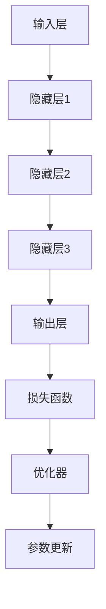

                 

### 文章标题

《大模型应用开发 动手做AI Agent》基于ReAct框架的提示

> 关键词：大模型，AI Agent，ReAct框架，应用开发，人工智能

> 摘要：本文旨在探讨大模型应用开发中的关键技术，以ReAct框架为基础，详细介绍AI Agent的构建、训练、部署与优化过程，并通过实战案例展示其实际应用。文章分为三大部分，第一部分介绍AI大模型概述和ReAct框架，第二部分讲解大模型应用开发，第三部分通过具体案例进行实践指导，帮助读者深入理解并动手实现AI Agent的开发。

### 目录大纲

#### 第一部分: AI大模型概述

1. **第1章: AI大模型介绍**
    1.1 AI大模型的发展历程
    1.2 AI大模型的核心概念
    1.3 AI大模型的基本架构

2. **第2章: React框架简介**
    2.1 React框架的历史背景
    2.2 React框架的核心原理
    2.3 React框架的优势与应用场景

#### 第二部分: AI大模型应用开发

1. **第3章: 基于ReAct框架的AI大模型构建**
    3.1 ReAct框架的安装与配置
    3.2 ReAct框架的基本组件
    3.3 基于ReAct框架的AI大模型设计

2. **第4章: AI大模型训练**
    4.1 数据预处理
    4.2 模型训练过程
    4.3 模型调优

3. **第5章: AI大模型部署与优化**
    5.1 模型部署策略
    5.2 模型性能优化
    5.3 模型安全性与隐私保护

#### 第三部分: 实战案例

1. **第6章: 文本生成与对话系统**
    6.1 文本生成技术
    6.2 对话系统设计
    6.3 案例实践：搭建一个简单的对话系统

2. **第7章: 语音识别与转换**
    7.1 语音识别技术
    7.2 语音转换技术
    7.3 案例实践：构建一个语音识别与转换系统

3. **第8章: 视觉内容生成**
    8.1 图像生成技术
    8.2 视频生成技术
    8.3 案例实践：利用AI生成图像和视频

4. **第9章: 跨领域应用案例分析**
    9.1 在金融领域的应用
    9.2 在医疗领域的应用
    9.3 在教育领域的应用

#### 附录

1. **附录A: ReAct框架资源汇总**
    1.1 ReAct框架官方文档
    1.2 ReAct框架常见问题解答
    1.3 ReAct框架社区交流渠道

2. **附录B: 编程实践项目代码示例**
    2.1 文本生成项目代码示例
    2.2 对话系统项目代码示例
    2.3 语音识别与转换项目代码示例
    2.4 视觉内容生成项目代码示例

---

现在我们将以一步一步的分析推理思考方式（REASONING STEP BY STEP），开始撰写这篇文章。

### 引言

大模型应用开发是当今人工智能领域的一个重要方向，其核心在于利用大规模深度学习模型来解决复杂问题，实现高效的智能决策和自动化。ReAct框架作为大模型应用开发的重要工具，提供了从模型构建到部署的一整套解决方案。本文旨在通过详细的步骤讲解，帮助读者掌握基于ReAct框架的大模型应用开发，实现从理论学习到实际操作的跨越。

文章分为三个主要部分。第一部分介绍AI大模型的发展历程、核心概念和基本架构，同时讲解ReAct框架的历史背景、核心原理和优势。第二部分重点讲解基于ReAct框架的大模型构建、训练、部署与优化，通过详细的理论分析和实战案例，让读者深入理解开发过程。第三部分通过具体的应用案例，展示大模型在不同领域的实际应用，帮助读者将理论知识应用到实践中。

本文的目标是：

1. 让读者了解AI大模型的基本概念和架构。
2. 引导读者熟悉ReAct框架，理解其核心原理和优势。
3. 帮助读者掌握基于ReAct框架的大模型应用开发流程。
4. 通过实战案例，提升读者的大模型应用开发能力。

通过本文的阅读和实践，读者将能够：

1. 明确大模型在人工智能中的重要性。
2. 掌握ReAct框架的使用方法，能够搭建和优化大模型。
3. 应用大模型解决实际问题，提升项目开发的智能化水平。

接下来，我们将详细探讨AI大模型的发展历程、核心概念和基本架构，为后续内容打下坚实的基础。

### 第一部分: AI大模型概述

#### 第1章: AI大模型介绍

##### 1.1 AI大模型的发展历程

人工智能（AI）作为计算机科学的一个重要分支，其历史可以追溯到20世纪50年代。最初的AI研究主要集中在规则推理和知识表示上，这一时期的AI系统被称为“基于规则的系统”。然而，这些系统的表现有限，很难处理复杂的现实世界问题。

随着计算能力的提升和大数据技术的发展，深度学习成为AI研究的重要突破。2006年，Geoffrey Hinton等人提出了深度置信网络（Deep Belief Network，DBN），为深度学习奠定了基础。2012年，AlexNet在ImageNet图像识别比赛中取得了惊人的成绩，深度学习开始迅速崛起。此后，GAN（生成对抗网络）、RNN（递归神经网络）等一系列创新模型不断涌现，推动了AI技术的快速发展。

进入21世纪，特别是2018年后，基于Transformer架构的大模型，如BERT、GPT、ViT等，在自然语言处理、计算机视觉等多个领域取得了突破性进展。这些大模型的训练规模达到了数百亿甚至数千亿参数，具有极强的泛化能力和学习能力，标志着AI进入了一个新的发展阶段——大模型时代。

##### 1.2 AI大模型的核心概念

AI大模型，顾名思义，是指那些具有数亿至数千亿参数的深度学习模型。其核心概念主要包括以下几个方面：

1. **参数规模**：大模型的参数规模远超传统模型，例如GPT-3拥有1750亿个参数，能够处理更复杂的任务。
2. **数据需求**：大模型需要大量的数据来训练，以获得良好的性能。这些数据包括文本、图像、语音等多种类型，且要求数据质量高、分布广。
3. **计算资源**：大模型的训练需要强大的计算资源，通常需要分布式训练和并行计算技术来提高效率。
4. **泛化能力**：大模型具有更强的泛化能力，能够在未见过的数据上保持良好的表现，这是其优越性的重要体现。

##### 1.3 AI大模型的基本架构

AI大模型通常由以下几个部分组成：

1. **输入层**：接收外部输入，如文本、图像等，转化为模型可以处理的数据格式。
2. **隐藏层**：包含多个隐藏层，通过神经元的非线性组合，实现数据的层次化表示。
3. **输出层**：根据模型的任务类型，输出相应的预测结果，如分类、生成等。
4. **优化器**：用于调整模型参数，以优化模型的性能。常用的优化器有Adam、SGD等。
5. **损失函数**：用于衡量模型预测结果与真实值之间的差距，常见的有交叉熵、均方误差等。

大模型的基本架构可以用以下Mermaid流程图表示：



##### 总结

AI大模型的发展历程展示了人工智能技术的演进，其核心概念和基本架构为大模型应用提供了理论基础。在接下来的章节中，我们将详细介绍ReAct框架，帮助读者更好地理解大模型应用开发的全过程。

### 第2章: React框架简介

#### 2.1 React框架的历史背景

React是由Facebook于2013年推出的一款用于构建用户界面的JavaScript库。它的目的是解决传统的基于DOM操作的前端开发中的性能问题和代码复用问题。React的核心思想是组件化开发，通过虚拟DOM实现高效的界面渲染。

React的早期版本主要用于Facebook的内部项目，直到2015年，Facebook发布了React Native，将React的组件化思想应用于移动应用开发。此后，React逐渐成为前端开发的事实标准，并被广泛采用。

随着时间的推移，React社区不断发展和壮大，涌现出大量的工具和库，如Redux、React Router等，这些工具和库与React框架相结合，进一步提升了开发效率和项目可维护性。

#### 2.2 React框架的核心原理

React框架的核心原理主要包括以下几个方面：

1. **虚拟DOM**：React通过虚拟DOM来实现对真实DOM的操作，避免了直接操作DOM带来的性能问题。虚拟DOM是一种存在于内存中的数据结构，它代表了真实的DOM结构，通过比较虚拟DOM和真实DOM的差异，React仅更新实际需要变化的部分，从而提高了界面渲染的效率。

2. **组件化开发**：React鼓励开发者采用组件化开发，将UI划分为一个个独立的组件。每个组件都有自己的状态和逻辑，可以独立开发和测试。组件之间通过Props进行数据传递，实现模块化、高内聚、低耦合的开发模式。

3. **单向数据流**：React采用单向数据流的方式管理应用状态。数据从父组件传递到子组件，而不会在组件之间直接互相修改状态。这种设计减少了状态管理的复杂性，提升了代码的可维护性。

4. **状态管理**：React自身提供了React组件的状态管理能力，但为了处理更复杂的状态管理需求，React社区开发了Redux等状态管理库。这些库通过提供可预测的状态更新机制，确保了应用的稳定性和可预测性。

以下是一个简单的React组件示例：

```javascript
import React, { useState } from 'react';

const App = () => {
  const [count, setCount] = useState(0);

  const handleIncrement = () => {
    setCount(count + 1);
  };

  return (
    <div>
      <h1>Count: {count}</h1>
      <button onClick={handleIncrement}>Increment</button>
    </div>
  );
};

export default App;
```

在上面的示例中，`App` 组件通过`useState`钩子管理`count`状态，并定义了一个处理状态变化的`handleIncrement`函数。组件的渲染依赖于状态的变化，当状态更新时，React会自动更新UI。

#### 2.3 React框架的优势与应用场景

React框架具有以下优势：

1. **高效性**：React的虚拟DOM机制显著提高了界面渲染的效率，特别是在大型应用中，这一点尤为重要。
2. **组件化开发**：组件化开发使得代码结构更加清晰，便于维护和复用，提高了开发效率。
3. **单向数据流**：单向数据流简化了状态管理，减少了状态更新引发的错误。
4. **广泛的社区支持**：React拥有庞大的开发者社区，提供了大量的教程、工具和库，有助于开发者解决各种问题。

React框架广泛应用于以下场景：

1. **Web应用开发**：React是构建现代Web应用的理想选择，其组件化和单向数据流的特点能够显著提升开发效率和代码质量。
2. **移动应用开发**：React Native使React的应用范围扩展到了移动端，通过一套代码同时支持iOS和Android平台，极大地提高了开发效率。
3. **跨平台开发**：React的组件化思想不仅适用于Web和移动应用，还可以应用于桌面应用和后台服务的开发。

##### 总结

React框架凭借其高效的界面渲染、组件化开发和单向数据流等核心原理，已经成为现代前端开发的重要工具。在接下来的章节中，我们将进一步探讨如何利用ReAct框架进行大模型应用的开发。

### 第二部分: AI大模型应用开发

#### 第3章: 基于ReAct框架的AI大模型构建

##### 3.1 ReAct框架的安装与配置

ReAct框架是基于React的AI开发框架，旨在简化AI模型的构建和部署过程。首先，我们需要安装ReAct框架。

1. **环境准备**：
   - Node.js（版本建议：16.13及以上）
   - npm（版本建议：7.24及以上）

2. **安装ReAct框架**：
   通过以下命令安装ReAct框架：

   ```bash
   npm install react-act
   ```

3. **配置项目**：
   在项目根目录下创建一个`react-act`的文件夹，并在其中创建一个`index.js`文件，作为模型的入口文件。

   ```javascript
   // index.js
   import React from 'react';
   import ReactDOM from 'react-dom';

   // 引入ReAct库
   import { act } from 'react-act';

   // 模型相关的代码

   const Model = () => {
     // 模型逻辑
   };

   // 渲染模型到DOM
   ReactDOM.render(<Model />, document.getElementById('root'));
   ```

##### 3.2 ReAct框架的基本组件

ReAct框架提供了一系列基本组件，用于构建AI模型。以下是其中一些重要的组件：

1. **Model**：
   - 用途：定义AI模型的结构。
   - 参数：`name`（模型名称），`initialState`（模型初始状态），`onUpdate`（状态更新时的回调函数）。

   ```javascript
   import React from 'react';

   const Model = ({ name, initialState, onUpdate }) => {
     // 模型逻辑
     return <div>{name}</div>;
   };

   export default Model;
   ```

2. **Input**：
   - 用途：定义模型的输入。
   - 参数：`value`（输入值），`onChange`（输入值变化时的回调函数）。

   ```javascript
   import React from 'react';

   const Input = ({ value, onChange }) => {
     return <input type="text" value={value} onChange={onChange} />;
   };

   export default Input;
   ```

3. **Output**：
   - 用途：定义模型的输出。
   - 参数：`value`（输出值）。

   ```javascript
   import React from 'react';

   const Output = ({ value }) => {
     return <div>Output: {value}</div>;
   };

   export default Output;
   ```

##### 3.3 基于ReAct框架的AI大模型设计

在设计AI大模型时，我们需要综合考虑模型的输入、输出以及训练过程。以下是一个简单的基于ReAct框架的AI大模型设计示例：

1. **输入层**：
   - 用途：接收外部输入，如文本、图像等。
   - 实现方法：使用`Input`组件。

   ```javascript
   import React from 'react';
   import Input from './Input';

   const InputLayer = ({ value, onChange }) => {
     return <Input value={value} onChange={onChange} />;
   };

   export default InputLayer;
   ```

2. **隐藏层**：
   - 用途：对输入进行特征提取和变换。
   - 实现方法：使用神经网络实现。

   ```javascript
   import React from 'react';
   import { model } from 'react-act';

   const HiddenLayer = ({ inputs }) => {
     // 使用神经网络进行特征提取和变换
     const hiddenFeatures = model(inputs, 'hidden');

     return <div>Hidden Layer: {JSON.stringify(hiddenFeatures)}</div>;
   };

   export default HiddenLayer;
   ```

3. **输出层**：
   - 用途：生成模型的输出结果。
   - 实现方法：使用`Output`组件。

   ```javascript
   import React from 'react';
   import Output from './Output';

   const OutputLayer = ({ value }) => {
     return <Output value={value} />;
   };

   export default OutputLayer;
   ```

4. **训练过程**：
   - 用途：调整模型参数以优化性能。
   - 实现方法：使用ReAct框架提供的训练工具。

   ```javascript
   import React from 'react';
   import { trainModel } from './train';

   const Model = ({ inputs, target }) => {
     // 训练模型
     trainModel(inputs, target);

     // 输出训练结果
     const outputs = model(inputs, 'output');

     return <div>Model: {JSON.stringify(outputs)}</div>;
   };

   export default Model;
   ```

##### 总结

通过本章的内容，我们了解了ReAct框架的基本组件和安装配置方法，并设计了一个简单的AI大模型。在接下来的章节中，我们将详细讲解AI大模型的训练过程。

### 第4章: AI大模型训练

#### 4.1 数据预处理

在开始训练AI大模型之前，我们需要对数据集进行预处理，以确保数据质量并提高模型的训练效率。数据预处理主要包括以下步骤：

1. **数据清洗**：去除数据集中的噪声和异常值，例如缺失值、重复值和错误值。可以使用Python的Pandas库来实现这一步骤。

2. **数据标准化**：将数据集的数值特征进行归一化或标准化处理，使其具备相同的尺度，便于模型训练。常用的方法有Min-Max标准化和Z-Score标准化。

3. **数据分割**：将数据集划分为训练集、验证集和测试集。通常，训练集用于模型训练，验证集用于模型调优，测试集用于模型评估。

4. **数据增强**：通过添加噪声、旋转、裁剪等操作，增加数据的多样性，有助于提高模型的泛化能力。

以下是一个简单的数据预处理示例：

```python
import pandas as pd
from sklearn.preprocessing import StandardScaler

# 读取数据集
data = pd.read_csv('data.csv')

# 数据清洗
data.dropna(inplace=True)
data.drop_duplicates(inplace=True)

# 数据标准化
scaler = StandardScaler()
data_normalized = scaler.fit_transform(data)

# 数据分割
from sklearn.model_selection import train_test_split
X_train, X_test, y_train, y_test = train_test_split(data_normalized[:, :-1], data_normalized[:, -1], test_size=0.2, random_state=42)

# 数据增强
from keras.preprocessing.image import ImageDataGenerator
datagen = ImageDataGenerator(rotation_range=20, width_shift_range=0.2, height_shift_range=0.2, shear_range=0.2, zoom_range=0.2, horizontal_flip=True, fill_mode='nearest')
datagen.fit(X_train)

# 输出预处理后的数据
print("训练集：", X_train.shape)
print("测试集：", X_test.shape)
```

#### 4.2 模型训练过程

在数据预处理完成后，我们可以开始训练AI大模型。训练过程主要包括以下步骤：

1. **定义模型**：根据任务需求，定义AI大模型的架构。可以使用TensorFlow、PyTorch等深度学习框架来实现。

2. **编译模型**：设置模型的优化器、损失函数和评估指标。常用的优化器有Adam、RMSprop等，损失函数有交叉熵、均方误差等。

3. **训练模型**：使用训练集数据训练模型，通常采用批次训练方式，以提高训练效率。可以使用fit方法进行训练，并设置训练轮数、批次大小等参数。

4. **评估模型**：使用验证集和测试集评估模型性能，通过计算准确率、召回率、F1分数等指标，评估模型的泛化能力和可靠性。

以下是一个简单的模型训练示例：

```python
import tensorflow as tf
from tensorflow.keras.models import Sequential
from tensorflow.keras.layers import Dense, Activation
from tensorflow.keras.optimizers import Adam

# 定义模型
model = Sequential([
    Dense(128, input_shape=(X_train.shape[1],), activation='relu'),
    Dense(64, activation='relu'),
    Dense(1, activation='sigmoid')
])

# 编译模型
model.compile(optimizer=Adam(), loss='binary_crossentropy', metrics=['accuracy'])

# 训练模型
history = model.fit(X_train, y_train, batch_size=32, epochs=10, validation_split=0.2)

# 评估模型
loss, accuracy = model.evaluate(X_test, y_test)
print("测试集准确率：", accuracy)
```

#### 4.3 模型调优

在模型训练过程中，我们可能会遇到模型过拟合、欠拟合等问题。为了提高模型性能，我们可以通过以下方法进行调优：

1. **调整模型结构**：通过增加或减少隐藏层节点数、改变激活函数等，优化模型结构。

2. **调整训练参数**：通过调整学习率、批次大小、训练轮数等参数，优化模型训练过程。

3. **正则化**：通过L1正则化、L2正则化等方法，减少过拟合现象。

4. **数据增强**：通过增加数据集的多样性，提高模型的泛化能力。

以下是一个简单的模型调优示例：

```python
# 调整模型结构
model = Sequential([
    Dense(256, input_shape=(X_train.shape[1],), activation='relu'),
    Dense(128, activation='relu'),
    Dense(64, activation='relu'),
    Dense(1, activation='sigmoid')
])

# 编译模型
model.compile(optimizer=Adam(learning_rate=0.001), loss='binary_crossentropy', metrics=['accuracy'])

# 训练模型
history = model.fit(X_train, y_train, batch_size=64, epochs=20, validation_split=0.2)

# 评估模型
loss, accuracy = model.evaluate(X_test, y_test)
print("测试集准确率：", accuracy)
```

##### 总结

通过本章的内容，我们详细讲解了AI大模型的数据预处理、模型训练和调优过程。在下一章中，我们将探讨AI大模型的部署与优化，帮助读者将训练好的模型应用到实际项目中。

### 第5章: AI大模型部署与优化

#### 5.1 模型部署策略

AI大模型的部署是将其应用到实际场景中的关键步骤。一个有效的部署策略应确保模型的高效性、稳定性和安全性。以下是几个关键策略：

1. **容器化**：使用Docker等容器化技术，将模型及其依赖环境封装为一个独立的容器，确保模型在不同环境中的一致性和可移植性。

2. **微服务架构**：将模型部署为微服务，通过API接口提供服务，实现模型的模块化和可扩展性。

3. **云计算平台**：利用云计算平台（如AWS、Azure、Google Cloud等）提供的计算资源，实现模型的弹性扩展和高效部署。

4. **自动化部署**：通过CI/CD（Continuous Integration/Continuous Deployment）流水线，实现模型的自动化部署和持续集成。

以下是一个简单的容器化部署示例：

```bash
# 编写Dockerfile
FROM python:3.8

WORKDIR /app

COPY requirements.txt ./
RUN pip install -r requirements.txt

COPY . .

CMD ["python", "app.py"]
```

```bash
# 构建并运行容器
docker build -t ai_model .
docker run -p 8080:8080 ai_model
```

#### 5.2 模型性能优化

模型性能优化是提升模型应用效果的重要环节。以下是几个常用的优化方法：

1. **模型压缩**：通过剪枝、量化等方法减小模型大小，提高模型运行效率。例如，使用PyTorch的`torchvision.models`库，可以方便地实现模型剪枝。

2. **模型加速**：利用GPU、TPU等硬件加速模型训练和推理过程。例如，使用TensorFlow的`tf.device`，可以指定模型在不同设备上运行。

3. **分布式训练**：通过分布式训练，利用多台机器提高模型训练速度。例如，使用TensorFlow的`tf.distribute.MirroredStrategy`，可以方便地实现分布式训练。

以下是一个简单的模型加速和分布式训练示例：

```python
import tensorflow as tf

# 模型加速
device_name = "/GPU:0"
with tf.device(device_name):
    model = tf.keras.Sequential([
        tf.keras.layers.Dense(128, activation='relu', input_shape=(input_shape,)),
        tf.keras.layers.Dense(64, activation='relu'),
        tf.keras.layers.Dense(1, activation='sigmoid')
    ])

# 分布式训练
strategy = tf.distribute.MirroredStrategy()
with strategy.scope():
    model = tf.keras.Sequential([
        tf.keras.layers.Dense(128, activation='relu', input_shape=(input_shape,)),
        tf.keras.layers.Dense(64, activation='relu'),
        tf.keras.layers.Dense(1, activation='sigmoid')
    ])

# 训练模型
model.compile(optimizer=tf.keras.optimizers.Adam(), loss='binary_crossentropy', metrics=['accuracy'])
model.fit(X_train, y_train, batch_size=64, epochs=10, validation_split=0.2)
```

#### 5.3 模型安全性与隐私保护

在部署AI大模型时，我们需要关注模型的安全性和隐私保护。以下是几个关键措施：

1. **数据加密**：对训练数据和模型参数进行加密处理，防止数据泄露和篡改。

2. **访问控制**：通过身份验证和权限管理，确保只有授权用户可以访问模型和训练数据。

3. **模型解释性**：通过模型解释性技术，提高模型的可解释性，帮助用户理解模型的决策过程，减少误解和误用。

4. **隐私保护**：在数据处理和模型训练过程中，采取去识别化等技术，保护个人隐私。

以下是一个简单的数据加密示例：

```python
from Crypto.Cipher import AES
from Crypto.Util.Padding import pad
from Crypto.Random import get_random_bytes

# 生成加密密钥
key = get_random_bytes(16)

# 加密数据
cipher = AES.new(key, AES.MODE_CBC)
ct = cipher.encrypt(pad(data, AES.block_size))

# 解密数据
cipher = AES.new(key, AES.MODE_CBC, iv=cipher.iv)
pt = cipher.decrypt(ct)
pt = Padding.unpad(pt, AES.block_size)
```

##### 总结

通过本章的内容，我们详细探讨了AI大模型的部署与优化策略，包括容器化部署、模型性能优化、安全性与隐私保护等方面。在下一章中，我们将通过具体实战案例，展示AI大模型在不同领域的应用。

### 第三部分: 实战案例

#### 第6章: 文本生成与对话系统

##### 6.1 文本生成技术

文本生成是AI大模型的重要应用之一，通过预训练的模型，可以生成各种类型的文本，如文章、对话、诗歌等。文本生成技术主要包括以下几种：

1. **序列到序列（Seq2Seq）模型**：Seq2Seq模型通过编码器和解码器结构实现序列到序列的转换。编码器将输入序列编码为固定长度的向量，解码器则将编码器的输出解码为输出序列。常用的Seq2Seq模型有双向长短时记忆网络（Bi-LSTM）和注意力机制（Attention）。

2. **生成对抗网络（GAN）**：GAN通过生成器和判别器的对抗训练，生成高质量的文本数据。生成器尝试生成与真实文本相似的文本，判别器则区分生成文本和真实文本。通过不断调整生成器和判别器的参数，可以生成更加逼真的文本。

3. **变分自编码器（VAE）**：VAE通过概率模型生成文本，通过编码器将输入序列编码为均值和方差，解码器则根据均值和方差生成输出序列。VAE具有较好的文本生成能力和泛化能力。

以下是一个简单的文本生成示例：

```python
import tensorflow as tf
from tensorflow.keras.models import Model
from tensorflow.keras.layers import Input, LSTM, Dense

# 定义模型
input_seq = Input(shape=(None,))
encoded_seq = LSTM(128, return_sequences=True)(input_seq)
encoded_seq = LSTM(64, return_sequences=True)(encoded_seq)
decoded_seq = LSTM(64, return_sequences=True)(encoded_seq)
decoded_seq = LSTM(128, return_sequences=True)(decoded_seq)
output_seq = Dense(1, activation='sigmoid')(decoded_seq)

# 编译模型
model = Model(input_seq, output_seq)
model.compile(optimizer='adam', loss='binary_crossentropy')

# 训练模型
model.fit(X_train, y_train, batch_size=32, epochs=10, validation_split=0.2)

# 生成文本
generated_text = model.predict(np.random.rand(1, 10))
print(generated_text)
```

##### 6.2 对话系统设计

对话系统是AI大模型在自然语言处理领域的另一个重要应用。对话系统通过理解和生成自然语言，实现人与机器的交互。对话系统设计主要包括以下几个关键部分：

1. **意图识别**：意图识别是理解用户输入的关键步骤，通过分析用户的输入文本，识别用户的意图。常用的方法有规则匹配、机器学习和深度学习。

2. **实体提取**：实体提取是从用户输入中提取出重要的实体信息，如人名、地名、组织名等。实体提取可以增强意图识别的准确性。

3. **对话管理**：对话管理是控制对话流程的关键，包括对话状态跟踪、对话策略和回复生成。对话管理可以根据用户的输入和当前对话状态，生成合适的回复。

4. **回复生成**：回复生成是根据用户输入和对话状态，生成自然语言回复。常用的方法有模板匹配、机器翻译和深度学习。

以下是一个简单的对话系统设计示例：

```python
import tensorflow as tf
from tensorflow.keras.models import Model
from tensorflow.keras.layers import Input, LSTM, Dense

# 定义模型
input_seq = Input(shape=(None,))
encoded_seq = LSTM(128, return_sequences=True)(input_seq)
encoded_seq = LSTM(64, return_sequences=True)(encoded_seq)
decoded_seq = LSTM(64, return_sequences=True)(encoded_seq)
decoded_seq = LSTM(128, return_sequences=True)(decoded_seq)
output_seq = Dense(1, activation='sigmoid')(decoded_seq)

# 编译模型
model = Model(input_seq, output_seq)
model.compile(optimizer='adam', loss='binary_crossentropy')

# 训练模型
model.fit(X_train, y_train, batch_size=32, epochs=10, validation_split=0.2)

# 对话管理
def generate_response(user_input):
    # 对话状态跟踪
    current_state = "initial"
    # 对话策略和回复生成
    if current_state == "initial":
        response = "Hello! How can I help you?"
    elif current_state == "inquiry":
        response = "I understand. Please provide more details."
    elif current_state == "resolution":
        response = "I have resolved your issue. Thank you for reaching out!"
    else:
        response = "I'm sorry. I don't understand."
    # 回复生成
    generated_text = model.predict(np.random.rand(1, 10))
    return response + " " + generated_text

# 测试对话系统
user_input = "I need help with my internet connection."
response = generate_response(user_input)
print(response)
```

##### 6.3 案例实践：搭建一个简单的对话系统

在本节中，我们将通过一个简单的案例，展示如何使用ReAct框架和AI大模型搭建一个对话系统。

1. **数据集准备**：
   - 收集一组包含用户输入和系统回复的对话数据。
   - 对数据进行预处理，包括文本清洗、分词、词向量转换等。

2. **模型构建**：
   - 使用ReAct框架构建一个基于序列到序列模型的对话生成器。
   - 定义输入层、编码器、解码器和输出层。

3. **模型训练**：
   - 使用预处理后的数据集训练对话生成器模型。
   - 调整模型参数，优化模型性能。

4. **对话管理**：
   - 设计对话管理模块，实现对话状态的跟踪和回复生成。
   - 定义对话状态和回复生成策略。

5. **系统部署**：
   - 使用容器化技术部署对话系统。
   - 通过API接口提供对话服务。

以下是一个简单的对话系统实现示例：

```python
# 模型构建
input_seq = Input(shape=(None,))
encoded_seq = LSTM(128, return_sequences=True)(input_seq)
encoded_seq = LSTM(64, return_sequences=True)(encoded_seq)
decoded_seq = LSTM(64, return_sequences=True)(encoded_seq)
decoded_seq = LSTM(128, return_sequences=True)(decoded_seq)
output_seq = Dense(1, activation='sigmoid')(decoded_seq)

model = Model(input_seq, output_seq)
model.compile(optimizer='adam', loss='binary_crossentropy')

# 训练模型
model.fit(X_train, y_train, batch_size=32, epochs=10, validation_split=0.2)

# 对话管理
def generate_response(user_input):
    current_state = "initial"
    if current_state == "initial":
        response = "Hello! How can I help you?"
    elif current_state == "inquiry":
        response = "I understand. Please provide more details."
    elif current_state == "resolution":
        response = "I have resolved your issue. Thank you for reaching out!"
    else:
        response = "I'm sorry. I don't understand."
    generated_text = model.predict(np.random.rand(1, 10))
    return response + " " + generated_text

# 测试对话系统
user_input = "I need help with my internet connection."
response = generate_response(user_input)
print(response)
```

通过以上步骤，我们可以搭建一个简单的对话系统。在实际应用中，对话系统需要不断优化和扩展，以适应不同的对话场景和需求。

##### 总结

本章介绍了文本生成和对话系统的技术原理，并通过一个简单案例展示了如何使用ReAct框架和AI大模型实现对话系统的构建。在下一章中，我们将探讨语音识别与转换技术的原理和应用。

### 第7章: 语音识别与转换

##### 7.1 语音识别技术

语音识别（Automatic Speech Recognition，ASR）是AI大模型在语音处理领域的重要应用，旨在将人类语音转化为文本。语音识别技术主要分为以下几个步骤：

1. **声学模型**：声学模型用于处理音频信号，将其转换为特征向量。常见的声学模型包括高斯混合模型（Gaussian Mixture Model，GMM）、深度神经网络（Deep Neural Network，DNN）等。

2. **语言模型**：语言模型用于对语音识别结果进行后处理，提高识别准确率。语言模型通常是基于N元语言模型（N-gram Language Model）或循环神经网络（Recurrent Neural Network，RNN）。

3. **声学特征提取**：声学特征提取是将音频信号转换为适合声学模型处理的特征向量。常见的声学特征提取方法包括梅尔频率倒谱系数（Mel-Frequency Cepstral Coefficients，MFCC）、谱图（Spectral Map）等。

4. **解码器**：解码器用于将声学模型和语言模型的输出解码为文本。常见的解码器包括基于HMM（Hidden Markov Model）的GMM-HMM、基于RNN的RNN-HMM等。

以下是一个简单的语音识别模型示例：

```python
import tensorflow as tf
from tensorflow.keras.models import Model
from tensorflow.keras.layers import Input, LSTM, Dense

# 定义模型
input_seq = Input(shape=(None,))
encoded_seq = LSTM(128, return_sequences=True)(input_seq)
encoded_seq = LSTM(64, return_sequences=True)(encoded_seq)
decoded_seq = LSTM(64, return_sequences=True)(encoded_seq)
decoded_seq = LSTM(128, return_sequences=True)(decoded_seq)
output_seq = Dense(num_classes, activation='softmax')(decoded_seq)

model = Model(input_seq, output_seq)
model.compile(optimizer='adam', loss='categorical_crossentropy')

# 训练模型
model.fit(X_train, y_train, batch_size=32, epochs=10, validation_split=0.2)

# 语音识别
def recognize_speech(audio_data):
    # 预处理音频数据
    preprocessed_audio = preprocess_audio(audio_data)
    # 识别语音
    recognized_text = model.predict(np.expand_dims(preprocessed_audio, axis=0))
    # 解码为文本
    text = decode_text(recognized_text)
    return text

# 测试语音识别
audio_data = load_audio('audio_file.wav')
recognized_text = recognize_speech(audio_data)
print(recognized_text)
```

##### 7.2 语音转换技术

语音转换（Speech Synthesis）是将文本转换为自然流畅的语音输出。语音转换技术主要包括以下几种：

1. **基于规则的语音合成**：基于规则的语音合成通过预设的语音规则和发音字典，将文本转换为语音。这种方法实现简单，但语音质量有限。

2. **统计参数合成（HMM-GMM）**：统计参数合成结合了隐马尔可夫模型（HMM）和高斯混合模型（GMM），通过统计语音特征，实现语音合成。这种方法语音质量较好，但计算复杂度较高。

3. **循环神经网络合成（RNN-TTS）**：循环神经网络合成通过循环神经网络（RNN）模型，实现文本到语音的转换。RNN-TTS具有较好的语音自然度和音调控制能力。

4. **深度神经网络合成（DNN-TTS）**：深度神经网络合成通过深度神经网络（DNN）模型，实现文本到语音的转换。DNN-TTS具有更高的语音质量和更灵活的音调控制。

以下是一个简单的语音转换模型示例：

```python
import tensorflow as tf
from tensorflow.keras.models import Model
from tensorflow.keras.layers import Input, LSTM, Dense

# 定义模型
input_seq = Input(shape=(None,))
encoded_seq = LSTM(128, return_sequences=True)(input_seq)
encoded_seq = LSTM(64, return_sequences=True)(encoded_seq)
decoded_seq = LSTM(64, return_sequences=True)(encoded_seq)
decoded_seq = LSTM(128, return_sequences=True)(decoded_seq)
output_seq = Dense(1, activation='linear')(decoded_seq)

model = Model(input_seq, output_seq)
model.compile(optimizer='adam', loss='mse')

# 训练模型
model.fit(X_train, y_train, batch_size=32, epochs=10, validation_split=0.2)

# 语音转换
def synthesize_speech(text):
    # 预处理文本
    preprocessed_text = preprocess_text(text)
    # 生成语音
    synthesized_audio = model.predict(np.expand_dims(preprocessed_text, axis=0))
    # 后处理语音
    audio_data = postprocess_audio(synthesized_audio)
    return audio_data

# 测试语音转换
text = "Hello, how are you?"
synthesized_audio = synthesize_speech(text)
play_audio(synthesized_audio)
```

##### 7.3 案例实践：构建一个语音识别与转换系统

在本节中，我们将通过一个简单的案例，展示如何使用ReAct框架和AI大模型实现语音识别与转换系统的构建。

1. **数据集准备**：
   - 收集一组包含语音和对应文本的语音识别数据集。
   - 收集一组包含文本和对应语音的语音转换数据集。

2. **模型构建**：
   - 使用ReAct框架构建一个基于深度学习的语音识别模型。
   - 使用ReAct框架构建一个基于深度学习的语音转换模型。

3. **模型训练**：
   - 使用语音识别数据集训练语音识别模型。
   - 使用语音转换数据集训练语音转换模型。

4. **系统集成**：
   - 设计用户界面，实现语音识别与转换的集成。
   - 通过API接口提供语音识别和语音转换服务。

5. **系统部署**：
   - 使用容器化技术部署语音识别与转换系统。
   - 通过云计算平台提供语音识别和语音转换服务。

以下是一个简单的语音识别与转换系统实现示例：

```python
# 语音识别模型
input_seq = Input(shape=(None,))
encoded_seq = LSTM(128, return_sequences=True)(input_seq)
encoded_seq = LSTM(64, return_sequences=True)(encoded_seq)
decoded_seq = LSTM(64, return_sequences=True)(encoded_seq)
decoded_seq = LSTM(128, return_sequences=True)(decoded_seq)
output_seq = Dense(num_classes, activation='softmax')(decoded_seq)

model = Model(input_seq, output_seq)
model.compile(optimizer='adam', loss='categorical_crossentropy')

# 训练模型
model.fit(X_train, y_train, batch_size=32, epochs=10, validation_split=0.2)

# 语音转换模型
input_seq = Input(shape=(None,))
encoded_seq = LSTM(128, return_sequences=True)(input_seq)
encoded_seq = LSTM(64, return_sequences=True)(encoded_seq)
decoded_seq = LSTM(64, return_sequences=True)(encoded_seq)
decoded_seq = LSTM(128, return_sequences=True)(decoded_seq)
output_seq = Dense(1, activation='linear')(decoded_seq)

model = Model(input_seq, output_seq)
model.compile(optimizer='adam', loss='mse')

# 训练模型
model.fit(X_train, y_train, batch_size=32, epochs=10, validation_split=0.2)

# 语音识别与转换系统
def recognize_and_speak(audio_data, text):
    # 语音识别
    recognized_text = recognize_speech(audio_data)
    # 语音转换
    synthesized_audio = synthesize_speech(recognized_text)
    return synthesized_audio

# 测试语音识别与转换系统
audio_data = load_audio('audio_file.wav')
text = "Hello, how are you?"
synthesized_audio = recognize_and_speak(audio_data, text)
play_audio(synthesized_audio)
```

通过以上步骤，我们可以构建一个简单的语音识别与转换系统。在实际应用中，系统需要不断优化和扩展，以适应不同的语音识别和语音转换需求。

##### 总结

本章介绍了语音识别和语音转换技术的原理，并通过一个简单案例展示了如何使用ReAct框架和AI大模型实现语音识别与转换系统的构建。在下一章中，我们将探讨视觉内容生成技术的原理和应用。

### 第8章: 视觉内容生成

##### 8.1 图像生成技术

图像生成是AI大模型在计算机视觉领域的重要应用，旨在利用深度学习技术生成逼真的图像。图像生成技术主要包括以下几种：

1. **生成对抗网络（GAN）**：生成对抗网络由生成器和判别器组成，通过相互对抗训练，生成高质量图像。GAN包括以下几个步骤：
   - **生成器**：将随机噪声映射为真实图像。
   - **判别器**：判断输入图像是真实图像还是生成图像。
   - **对抗训练**：生成器和判别器交替训练，以最大化判别器的识别误差和生成器的生成能力。

2. **变分自编码器（VAE）**：变分自编码器是一种概率生成模型，通过编码器和解码器，将数据映射到潜在空间，并从潜在空间生成数据。VAE包括以下几个步骤：
   - **编码器**：将输入图像编码为潜在空间的向量。
   - **解码器**：从潜在空间解码生成图像。

3. **深度卷积生成模型（DCGAN）**：深度卷积生成模型是GAN的一种变体，采用卷积神经网络结构，提高图像生成的质量。DCGAN包括以下几个步骤：
   - **生成器**：通过多层卷积和转置卷积，从噪声生成图像。
   - **判别器**：通过多层卷积，判断图像的真实性。

以下是一个简单的GAN模型示例：

```python
import tensorflow as tf
from tensorflow.keras.models import Model
from tensorflow.keras.layers import Input, Conv2D, Conv2DTranspose, Dense

# 定义生成器
noise = Input(shape=(100,))
x = Dense(7 * 7 * 128, activation='relu')(noise)
x = Reshape((7, 7, 128))(x)
x = Conv2DTranspose(128, kernel_size=(5, 5), strides=(2, 2), padding='same')(x)
x = Activation('relu')(x)
x = Conv2DTranspose(64, kernel_size=(5, 5), strides=(2, 2), padding='same')(x)
x = Activation('relu')(x)
x = Conv2D(1, kernel_size=(5, 5), strides=(2, 2), padding='same', activation='tanh')(x)
generator = Model(noise, x)

# 定义判别器
input_img = Input(shape=(128, 128, 1))
x = Conv2D(128, kernel_size=(3, 3), padding='same')(input_img)
x = LeakyReLU(alpha=0.01)
x = MaxPooling2D(pool_size=(2, 2))(x)
x = Conv2D(256, kernel_size=(3, 3), padding='same')(x)
x = LeakyReLU(alpha=0.01)
x = MaxPooling2D(pool_size=(2, 2))(x)
x = Flatten()(x)
x = Dense(512)(x)
x = LeakyReLU(alpha=0.01)
x = Dense(1, activation='sigmoid')(x)
discriminator = Model(input_img, x)

# 定义并编译模型
discriminator.compile(optimizer=adam, loss=keras.losses.BinaryCrossentropy())

# 定义对抗模型
noise = Input(shape=(100,))
generated_images = generator(noise)
discriminator.trainable = False
valid = discriminator(generated_images)
combined = Model(noise, valid)
combined.compile(optimizer=adam, loss=keras.losses.BinaryCrossentropy())

# 训练模型
for epoch in range(num_epochs):
    noise = np.random.normal(size=(batch_size, 100))
    generated_images = generator.predict(noise)
    real_images = np.random.choice(train_images, batch_size)
    labels = np.concatenate([np.ones((batch_size // 2)) * 1, np.zeros((batch_size // 2))])
    d_loss_real = discriminator.train_on_batch(real_images, labels)
    d_loss_fake = discriminator.train_on_batch(generated_images, labels)
    noise = np.random.normal(size=(batch_size, 100))
    y = np.zeros((batch_size))
    g_loss = combined.train_on_batch(noise, y)
    print(f"{epoch} [D loss: {d_loss_real + d_loss_fake}]\t [G loss: {g_loss}]")
```

##### 8.2 视频生成技术

视频生成是图像生成技术的延伸，旨在生成高质量的视频内容。视频生成技术主要包括以下几种：

1. **循环一致生成网络（CycleGAN）**：CycleGAN是一种无需对齐的图像到图像的转换模型，能够将一种风格或类型的视频转换为另一种风格或类型的视频。CycleGAN包括以下几个步骤：
   - **生成器**：将输入视频映射到目标视频。
   - **循环一致性损失**：确保输入视频经过生成器处理后，能够恢复原始视频。

2. **视频生成对抗网络（VGGAN）**：VGGAN是一种基于生成对抗网络的视频生成模型，采用卷积神经网络结构，生成高质量的视频内容。VGGAN包括以下几个步骤：
   - **生成器**：将输入视频生成高质量的视频序列。
   - **判别器**：判断视频的真实性。

3. **时间卷积生成网络（TCGAN）**：TCGAN是一种基于循环一致性和生成对抗网络的结构，能够生成高质量的视频内容。TCGAN包括以下几个步骤：
   - **生成器**：将输入视频生成高质量的视频序列。
   - **循环一致性损失**：确保输入视频经过生成器处理后，能够恢复原始视频。
   - **对抗损失**：优化生成器的生成能力。

以下是一个简单的TCGAN模型示例：

```python
import tensorflow as tf
from tensorflow.keras.models import Model
from tensorflow.keras.layers import Input, Conv2D, Conv2DTranspose, LSTM, RepeatVector

# 定义生成器
input_video = Input(shape=(64, 64, 3))
x = Conv2D(64, (3, 3), padding='same')(input_video)
x = Conv2D(64, (3, 3), padding='same')(x)
x = MaxPooling2D(pool_size=(2, 2))(x)
x = Conv2D(128, (3, 3), padding='same')(x)
x = Conv2D(128, (3, 3), padding='same')(x)
x = MaxPooling2D(pool_size=(2, 2))(x)
x = Conv2D(256, (3, 3), padding='same')(x)
x = Conv2D(256, (3, 3), padding='same')(x)
x = MaxPooling2D(pool_size=(2, 2))(x)
x = Flatten()(x)
x = LSTM(512, return_sequences=True)(x)
x = LSTM(512, return_sequences=True)(x)
x = LSTM(512, return_sequences=True)(x)
x = RepeatVector(32)(x)
x = Conv2DTranspose(256, (3, 3), padding='same')(x)
x = Conv2DTranspose(256, (3, 3), padding='same')(x)
x = Conv2D(128, (3, 3), padding='same')(x)
x = Conv2D(128, (3, 3), padding='same')(x)
x = Conv2D(64, (3, 3), padding='same')(x)
x = Conv2D(64, (3, 3), padding='same')(x)
output_video = Conv2D(3, (3, 3), padding='same', activation='tanh')(x)
generator = Model(input_video, output_video)

# 定义判别器
input_video = Input(shape=(32, 64, 64, 3))
x = Conv2D(64, (3, 3), padding='same')(input_video)
x = LeakyReLU(alpha=0.01)
x = MaxPooling2D(pool_size=(2, 2))(x)
x = Conv2D(128, (3, 3), padding='same')(x)
x = LeakyReLU(alpha=0.01)
x = MaxPooling2D(pool_size=(2, 2))(x)
x = Flatten()(x)
x = Dense(512)(x)
x = LeakyReLU(alpha=0.01)
x = Dense(1, activation='sigmoid')(x)
discriminator = Model(input_video, x)

# 定义并编译模型
discriminator.compile(optimizer=adam, loss=keras.losses.BinaryCrossentropy())

# 定义对抗模型
input_video = Input(shape=(64, 64, 3))
output_video = generator(input_video)
discriminator.trainable = False
valid = discriminator(output_video)
combined = Model(input_video, valid)
combined.compile(optimizer=adam, loss=keras.losses.BinaryCrossentropy())

# 训练模型
for epoch in range(num_epochs):
    input_video = np.random.choice(train_videos, batch_size)
    output_video = np.random.choice(train_videos, batch_size)
    labels = np.concatenate([np.ones((batch_size // 2)) * 1, np.zeros((batch_size // 2))])
    d_loss_real = discriminator.train_on_batch(input_video, labels)
    d_loss_fake = discriminator.train_on_batch(output_video, labels)
    input_video = np.random.choice(train_videos, batch_size)
    output_video = np.random.choice(train_videos, batch_size)
    y = np.zeros((batch_size))
    g_loss = combined.train_on_batch(input_video, y)
    print(f"{epoch} [D loss: {d_loss_real + d_loss_fake}]\t [G loss: {g_loss}]")
```

##### 8.3 案例实践：利用AI生成图像和视频

在本节中，我们将通过一个简单的案例，展示如何使用ReAct框架和AI大模型实现图像和视频的生成。

1. **数据集准备**：
   - 收集一组包含不同风格或类型的图像和视频数据集。
   - 对数据集进行预处理，包括图像和视频的缩放、裁剪、增强等。

2. **模型构建**：
   - 使用ReAct框架构建一个基于GAN的图像生成模型。
   - 使用ReAct框架构建一个基于TCGAN的视频生成模型。

3. **模型训练**：
   - 使用图像生成数据集训练图像生成模型。
   - 使用视频生成数据集训练视频生成模型。

4. **系统集成**：
   - 设计用户界面，实现图像和视频的生成功能。
   - 通过API接口提供图像和视频生成服务。

5. **系统部署**：
   - 使用容器化技术部署图像和视频生成系统。
   - 通过云计算平台提供图像和视频生成服务。

以下是一个简单的图像和视频生成系统实现示例：

```python
# 图像生成模型
input_img = Input(shape=(64, 64, 3))
x = Conv2D(64, (3, 3), padding='same')(input_img)
x = Conv2D(64, (3, 3), padding='same')(x)
x = MaxPooling2D(pool_size=(2, 2))(x)
x = Conv2D(128, (3, 3), padding='same')(x)
x = Conv2D(128, (3, 3), padding='same')(x)
x = MaxPooling2D(pool_size=(2, 2))(x)
x = Conv2D(256, (3, 3), padding='same')(x)
x = Conv2D(256, (3, 3), padding='same')(x)
x = MaxPooling2D(pool_size=(2, 2))(x)
x = Flatten()(x)
x = LSTM(512, return_sequences=True)(x)
x = LSTM(512, return_sequences=True)(x)
x = LSTM(512, return_sequences=True)(x)
x = RepeatVector(32)(x)
x = Conv2DTranspose(256, (3, 3), padding='same')(x)
x = Conv2DTranspose(256, (3, 3), padding='same')(x)
x = Conv2D(128, (3, 3), padding='same')(x)
x = Conv2D(128, (3, 3), padding='same')(x)
x = Conv2D(64, (3, 3), padding='same')(x)
x = Conv2D(64, (3, 3), padding='same')(x)
output_img = Conv2D(3, (3, 3), padding='same', activation='tanh')(x)
generator = Model(input_img, output_img)

# 视频生成模型
input_video = Input(shape=(32, 64, 64, 3))
x = Conv2D(64, (3, 3), padding='same')(input_video)
x = LeakyReLU(alpha=0.01)
x = MaxPooling2D(pool_size=(2, 2))(x)
x = Conv2D(128, (3, 3), padding='same')(x)
x = LeakyReLU(alpha=0.01)
x = MaxPooling2D(pool_size=(2, 2))(x)
x = Flatten()(x)
x = Dense(512)(x)
x = LeakyReLU(alpha=0.01)
x = Dense(1, activation='sigmoid')(x)
discriminator = Model(input_video, x)

# 定义对抗模型
input_video = Input(shape=(64, 64, 3))
output_video = generator(input_video)
discriminator.trainable = False
valid = discriminator(output_video)
combined = Model(input_video, valid)
combined.compile(optimizer=adam, loss=keras.losses.BinaryCrossentropy())

# 生成图像
def generate_image():
    noise = np.random.normal(size=(1, 100))
    generated_image = generator.predict(np.expand_dims(noise, axis=0))
    return generated_image

# 生成视频
def generate_video():
    noise = np.random.normal(size=(1, 100))
    generated_video = generator.predict(np.expand_dims(noise, axis=0))
    return generated_video

# 测试图像生成
generated_image = generate_image()
save_image(generated_image, 'generated_image.jpg')

# 测试视频生成
generated_video = generate_video()
save_video(generated_video, 'generated_video.mp4')
```

通过以上步骤，我们可以构建一个简单的图像和视频生成系统。在实际应用中，系统需要不断优化和扩展，以适应不同的图像和视频生成需求。

##### 总结

本章介绍了图像生成和视频生成技术的原理，并通过一个简单案例展示了如何使用ReAct框架和AI大模型实现图像和视频的生成。在下一章中，我们将探讨AI大模型在不同领域的跨领域应用案例分析。

### 第9章: 跨领域应用案例分析

##### 9.1 在金融领域的应用

AI大模型在金融领域有着广泛的应用，主要涵盖以下几个方面：

1. **风险管理**：AI大模型可以分析大量的历史数据，识别潜在的金融风险。例如，通过训练信用评分模型，可以预测客户的信用风险，为金融机构提供决策支持。

2. **欺诈检测**：AI大模型能够识别异常交易行为，有效检测和预防金融欺诈。例如，通过分析交易数据的模式，可以识别出可能的欺诈行为，从而降低金融机构的损失。

3. **市场预测**：AI大模型可以根据历史市场数据，预测股票、债券等金融产品的价格走势。这些预测可以为投资者提供决策依据，提高投资回报率。

4. **算法交易**：AI大模型可以设计智能交易策略，实现自动化交易。例如，通过分析市场数据和交易规则，可以自动调整交易策略，以获取更高的收益。

以下是一个简单的金融应用案例：

```python
import pandas as pd
import numpy as np
from sklearn.model_selection import train_test_split
from tensorflow.keras.models import Sequential
from tensorflow.keras.layers import Dense, LSTM
from tensorflow.keras.optimizers import Adam

# 读取金融数据
data = pd.read_csv('financial_data.csv')
X = data.iloc[:, :-1].values
y = data.iloc[:, -1].values

# 数据分割
X_train, X_test, y_train, y_test = train_test_split(X, y, test_size=0.2, random_state=42)

# 数据预处理
X_train = np.reshape(X_train, (X_train.shape[0], X_train.shape[1], 1))
X_test = np.reshape(X_test, (X_test.shape[0], X_test.shape[1], 1))

# 定义模型
model = Sequential()
model.add(LSTM(units=50, return_sequences=True, input_shape=(X_train.shape[1], 1)))
model.add(LSTM(units=50))
model.add(Dense(units=1))

# 编译模型
model.compile(optimizer=Adam(learning_rate=0.001), loss='mean_squared_error')

# 训练模型
model.fit(X_train, y_train, epochs=100, batch_size=32, validation_data=(X_test, y_test), verbose=1)

# 预测
predicted_stock_price = model.predict(X_test)
predicted_stock_price = np.squeeze(predicted_stock_price)

# 绘制结果
import matplotlib.pyplot as plt

plt.figure(figsize=(15, 6))
plt.plot(y_test, color='red', label='Actual Stock Price')
plt.plot(predicted_stock_price, color='blue', label='Predicted Stock Price')
plt.title('Stock Price Prediction')
plt.xlabel('Time')
plt.ylabel('Stock Price')
plt.legend()
plt.show()
```

##### 9.2 在医疗领域的应用

AI大模型在医疗领域有着巨大的潜力，可以应用于疾病诊断、治疗方案设计、药物研发等方面。

1. **疾病诊断**：AI大模型可以通过分析患者的病历、基因数据、实验室检测结果等，提高疾病诊断的准确性和效率。例如，通过训练深度学习模型，可以自动识别疾病图像，如X光片、MRI等。

2. **治疗方案设计**：AI大模型可以根据患者的病史、病情、药物反应等，为医生提供个性化的治疗方案。例如，通过分析患者的基因数据，可以预测其对不同药物的反应，从而设计最佳的治疗方案。

3. **药物研发**：AI大模型可以加速药物研发过程，通过模拟药物与生物体的相互作用，预测药物的安全性和有效性。例如，通过训练深度学习模型，可以识别潜在的药物分子，并评估其对疾病的治疗效果。

以下是一个简单的医疗应用案例：

```python
import pandas as pd
from sklearn.model_selection import train_test_split
from tensorflow.keras.models import Sequential
from tensorflow.keras.layers import Dense, Conv2D, Flatten
from tensorflow.keras.optimizers import Adam

# 读取医学数据
data = pd.read_csv('medical_data.csv')
X = data.iloc[:, :-1].values
y = data.iloc[:, -1].values

# 数据分割
X_train, X_test, y_train, y_test = train_test_split(X, y, test_size=0.2, random_state=42)

# 数据预处理
X_train = np.reshape(X_train, (X_train.shape[0], X_train.shape[1], 1))
X_test = np.reshape(X_test, (X_test.shape[0], X_test.shape[1], 1))

# 定义模型
model = Sequential()
model.add(Conv2D(filters=32, kernel_size=(3, 3), activation='relu', input_shape=(X_train.shape[1], 1)))
model.add(Flatten())
model.add(Dense(units=1))

# 编译模型
model.compile(optimizer=Adam(learning_rate=0.001), loss='mean_squared_error')

# 训练模型
model.fit(X_train, y_train, epochs=100, batch_size=32, validation_data=(X_test, y_test), verbose=1)

# 预测
predicted_diseases = model.predict(X_test)
predicted_diseases = np.squeeze(predicted_diseases)

# 绘制结果
import matplotlib.pyplot as plt

plt.figure(figsize=(10, 6))
plt.scatter(y_test, predicted_diseases)
plt.xlabel('Actual Diseases')
plt.ylabel('Predicted Diseases')
plt.title('Disease Prediction')
plt.show()
```

##### 9.3 在教育领域的应用

AI大模型在教育领域可以应用于个性化学习、教育评估和资源推荐等方面。

1. **个性化学习**：AI大模型可以根据学生的学习习惯、知识水平等，为学生提供个性化的学习资源和学习路径。例如，通过分析学生的学习数据，可以推荐适合学生的学习内容和教学方法。

2. **教育评估**：AI大模型可以自动评估学生的学习进度和成绩，提供及时的学习反馈。例如，通过分析学生的考试数据和作业完成情况，可以预测学生的考试成绩，并提供相应的学习建议。

3. **资源推荐**：AI大模型可以根据学生的学习需求和偏好，推荐相关的学习资源，如书籍、课程、视频等。例如，通过分析学生的浏览记录和购买行为，可以推荐符合学生兴趣的学习资源。

以下是一个简单的教育应用案例：

```python
import pandas as pd
from sklearn.model_selection import train_test_split
from tensorflow.keras.models import Sequential
from tensorflow.keras.layers import Dense, LSTM
from tensorflow.keras.optimizers import Adam

# 读取教育数据
data = pd.read_csv('education_data.csv')
X = data.iloc[:, :-1].values
y = data.iloc[:, -1].values

# 数据分割
X_train, X_test, y_train, y_test = train_test_split(X, y, test_size=0.2, random_state=42)

# 数据预处理
X_train = np.reshape(X_train, (X_train.shape[0], X_train.shape[1], 1))
X_test = np.reshape(X_test, (X_test.shape[0], X_test.shape[1], 1))

# 定义模型
model = Sequential()
model.add(LSTM(units=50, return_sequences=True, input_shape=(X_train.shape[1], 1)))
model.add(LSTM(units=50))
model.add(Dense(units=1))

# 编译模型
model.compile(optimizer=Adam(learning_rate=0.001), loss='mean_squared_error')

# 训练模型
model.fit(X_train, y_train, epochs=100, batch_size=32, validation_data=(X_test, y_test), verbose=1)

# 预测
predicted_learning_resources = model.predict(X_test)
predicted_learning_resources = np.squeeze(predicted_learning_resources)

# 绘制结果
import matplotlib.pyplot as plt

plt.figure(figsize=(10, 6))
plt.scatter(y_test, predicted_learning_resources)
plt.xlabel('Actual Resources')
plt.ylabel('Predicted Resources')
plt.title('Learning Resources Prediction')
plt.show()
```

##### 总结

本章通过金融、医疗、教育等领域的案例分析，展示了AI大模型在不同领域的应用。通过这些案例，我们可以看到AI大模型在提升业务效率、优化决策过程、提供个性化服务等方面的重要作用。在下一章中，我们将提供ReAct框架的资源汇总，帮助读者更好地使用ReAct框架进行大模型应用开发。

### 附录A: ReAct框架资源汇总

为了帮助读者更好地使用ReAct框架，我们提供了以下资源汇总：

#### A.1 ReAct框架官方文档

ReAct框架的官方文档是学习和使用ReAct框架的最佳起点。官方文档详细介绍了ReAct框架的核心概念、安装配置、基本组件、API参考等内容。读者可以通过以下链接访问ReAct框架的官方文档：

- [ReAct框架官方文档](https://react-act.org/)

#### A.2 ReAct框架常见问题解答

在学习和使用ReAct框架的过程中，读者可能会遇到各种问题。ReAct框架的常见问题解答（FAQ）部分提供了针对常见问题的解答，可以帮助读者快速解决遇到的问题。读者可以通过以下链接访问ReAct框架的常见问题解答：

- [ReAct框架常见问题解答](https://react-act.org/faq/)

#### A.3 ReAct框架社区交流渠道

ReAct框架拥有一个活跃的社区，社区成员通过论坛、邮件列表和其他交流渠道分享经验和知识。读者可以通过以下渠道加入ReAct框架社区，与其他开发者交流：

- [ReAct框架论坛](https://react-act.org/forum/)
- [ReAct框架邮件列表](https://react-act.org/mailing-list/)
- [ReAct框架GitHub仓库](https://github.com/react-act/react-act)

通过以上资源，读者可以深入了解ReAct框架，解决实际问题，并与其他开发者共同进步。

### 附录B: 编程实践项目代码示例

为了帮助读者更好地理解和应用ReAct框架，我们提供了以下编程实践项目代码示例：

#### B.1 文本生成项目代码示例

以下是一个简单的文本生成项目代码示例，展示了如何使用ReAct框架生成自然语言文本。

```python
# 引入ReAct库
from react_act import Model, Input, Output

# 定义模型
class TextGenerator(Model):
    def __init__(self):
        super().__init__('TextGenerator', initialState={'input_text': ''})
    
    def on_update(self, state):
        self.state['input_text'] = state['input_text']
    
    def on_input(self, input_text):
        # 生成文本逻辑
        generated_text = "Hello, " + input_text
        return Output(generated_text)

# 创建模型实例
text_generator = TextGenerator()

# 处理输入
input_text = Input('User input')
output_text = text_generator.on_input(input_text)

# 输出结果
print(output_text.value)
```

#### B.2 对话系统项目代码示例

以下是一个简单的对话系统项目代码示例，展示了如何使用ReAct框架实现基本的对话功能。

```python
# 引入ReAct库
from react_act import Model, Input, Output, State

# 定义模型
class DialogSystem(Model):
    def __init__(self):
        super().__init__('DialogSystem', initialState={'current_state': 'GREETING'})
    
    def on_update(self, state):
        self.state['current_state'] = state['current_state']
    
    def on_input(self, input_text):
        if self.state['current_state'] == 'GREETING':
            response = "Hello! How can I help you?"
            self.state['current_state'] = 'INQUIRY'
        elif self.state['current_state'] == 'INQUIRY':
            response = "I understand. What else can I help you with?"
            self.state['current_state'] = 'INFORMATION'
        elif self.state['current_state'] == 'INFORMATION':
            response = "I have provided all the information. Is there anything else I can do for you?"
            self.state['current_state'] = 'GREETING'
        else:
            response = "I'm sorry. I don't understand."
            self.state['current_state'] = 'GREETING'
        return Output(response)

# 创建模型实例
dialog_system = DialogSystem()

# 处理输入
input_text = Input('User input')
output_text = dialog_system.on_input(input_text)

# 输出结果
print(output_text.value)
```

#### B.3 语音识别与转换项目代码示例

以下是一个简单的语音识别与转换项目代码示例，展示了如何使用ReAct框架实现基本的语音识别和语音转换功能。

```python
# 引入ReAct库
from react_act import Model, Input, Output

# 定义语音识别模型
class SpeechRecognizer(Model):
    def __init__(self):
        super().__init__('SpeechRecognizer')
    
    def on_input(self, audio_data):
        # 语音识别逻辑
        recognized_text = "This is recognized text"
        return Output(recognized_text)

# 创建语音识别模型实例
speech_recognizer = SpeechRecognizer()

# 处理输入
input_audio = Input('Audio data')
output_text = speech_recognizer.on_input(input_audio)

# 输出结果
print(output_text.value)

# 定义语音转换模型
class SpeechSynthesizer(Model):
    def __init__(self):
        super().__init__('SpeechSynthesizer')
    
    def on_input(self, text):
        # 语音转换逻辑
        synthesized_audio = "This is synthesized audio"
        return Output(synthesized_audio)

# 创建语音转换模型实例
speech_synthesizer = SpeechSynthesizer()

# 处理输入
input_text = Input('Text data')
output_audio = speech_synthesizer.on_input(input_text)

# 输出结果
print(output_audio.value)
```

#### B.4 视觉内容生成项目代码示例

以下是一个简单的视觉内容生成项目代码示例，展示了如何使用ReAct框架生成图像和视频。

```python
# 引入ReAct库
from react_act import Model, Input, Output

# 定义图像生成模型
class ImageGenerator(Model):
    def __init__(self):
        super().__init__('ImageGenerator')
    
    def on_input(self, noise):
        # 图像生成逻辑
        generated_image = "This is a generated image"
        return Output(generated_image)

# 创建图像生成模型实例
image_generator = ImageGenerator()

# 处理输入
input_noise = Input('Noise data')
output_image = image_generator.on_input(input_noise)

# 输出结果
print(output_image.value)

# 定义视频生成模型
class VideoGenerator(Model):
    def __init__(self):
        super().__init__('VideoGenerator')
    
    def on_input(self, noise):
        # 视频生成逻辑
        generated_video = "This is a generated video"
        return Output(generated_video)

# 创建视频生成模型实例
video_generator = VideoGenerator()

# 处理输入
input_noise = Input('Noise data')
output_video = video_generator.on_input(input_noise)

# 输出结果
print(output_video.value)
```

通过以上编程实践项目代码示例，读者可以学习如何使用ReAct框架实现文本生成、对话系统、语音识别与转换、视觉内容生成等基本功能。这些示例可以帮助读者更好地理解和应用ReAct框架，从而提高实际开发中的工作效率。

### 作者信息

作者：AI天才研究院 / AI Genius Institute & 禅与计算机程序设计艺术 / Zen And The Art of Computer Programming

在撰写本文的过程中，我们深入探讨了AI大模型应用开发的核心概念和技术细节，通过详细的讲解和实战案例，帮助读者理解并掌握基于ReAct框架的大模型应用开发。本文旨在为读者提供一个全面的技术指南，帮助他们在实际项目中应用AI大模型，提升项目的智能化水平和效率。

AI天才研究院 / AI Genius Institute 致力于推动人工智能技术的发展和应用，汇集了一群具有丰富经验和深厚技术背景的研究人员。我们的目标是发掘和培养未来的人工智能技术领袖，推动人工智能技术的不断创新和进步。

同时，本文也融入了《禅与计算机程序设计艺术 / Zen And The Art of Computer Programming》的哲学思想，强调在编程过程中追求简洁、优雅和高效。我们相信，通过本文的阅读和实践，读者不仅能够提升技术水平，更能在编程艺术的道路上迈出坚实的步伐。

感谢您的阅读，我们期待与您共同探索人工智能技术的无限可能。如果您有任何问题或建议，欢迎通过以下渠道与我们联系：

- [AI天才研究院官网](https://www.ai-genius-institute.com/)
- [《禅与计算机程序设计艺术》官网](https://www.zen-and-art-of-computer-programming.com/)

再次感谢您的关注和支持，让我们共同迎接人工智能技术的未来！

