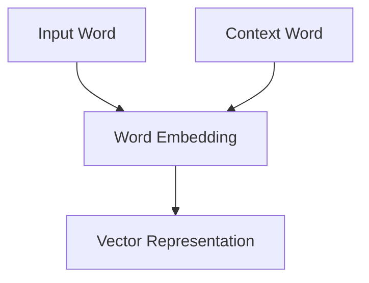
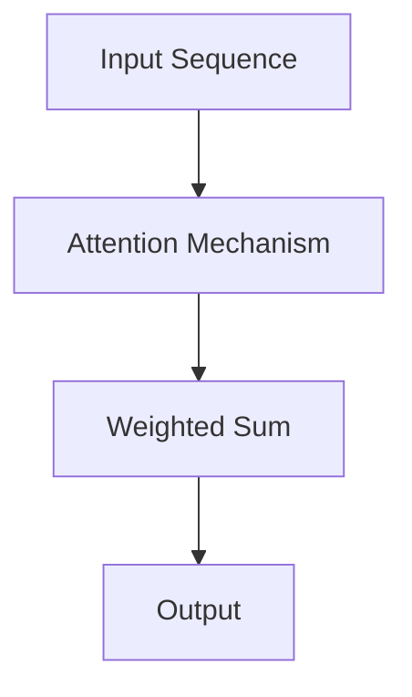
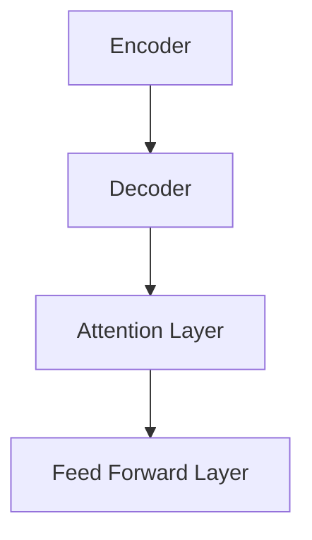
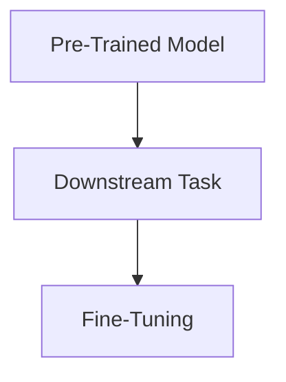
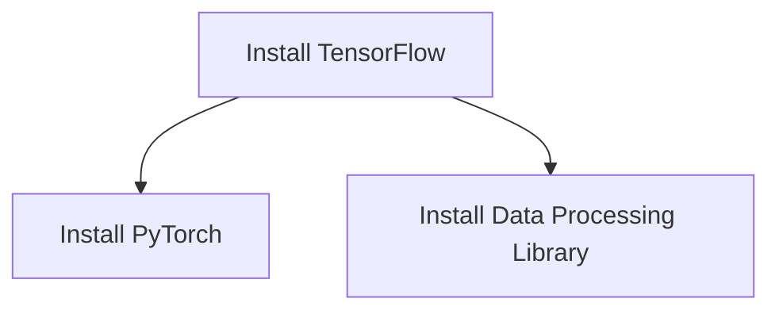
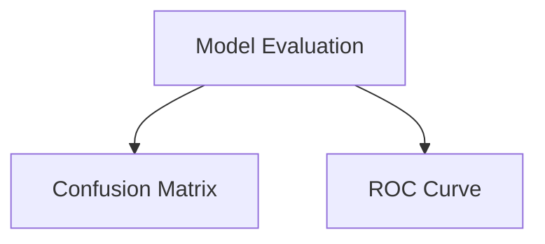
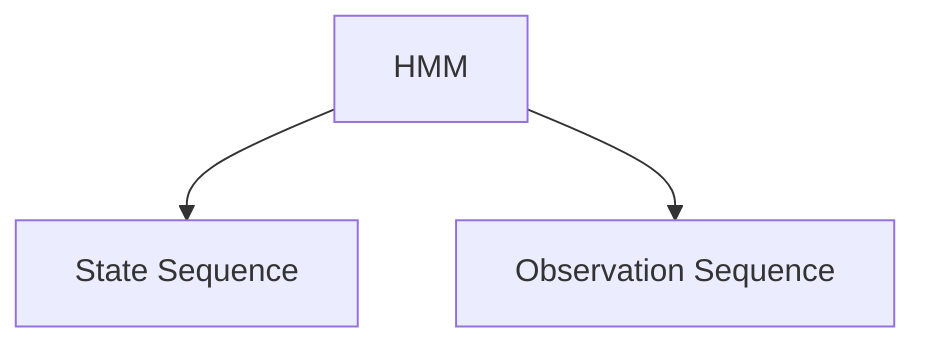
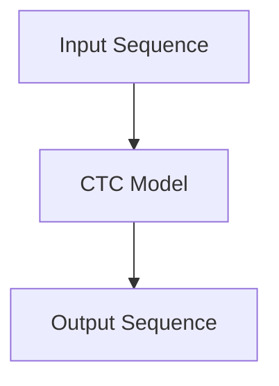
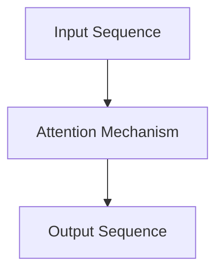

                 

# 【大模型应用开发 动手做AI Agent】大模型就是Agent的大脑

> 关键词：大模型、AI Agent、自然语言处理、计算机视觉、推荐系统、语音识别

> 摘要：本文将探讨大模型在AI Agent中的应用，从大模型概述、技术基础、AI Agent应用、项目实战等方面进行深入分析，旨在为开发者提供一套完整的大模型应用开发指南。

## 第一部分: 大模型基础及应用

### 第1章: 大模型概述

#### 1.1 大模型的概念与历史发展

大模型是指具有数百万至数十亿参数的深度学习模型，能够在大量数据上进行训练，以获得高度泛化的能力和强大的表征能力。大模型的历史可以追溯到1990年代，当时科学家们开始尝试训练具有数十万个参数的神经网络，这些模型主要用于图像识别和自然语言处理等领域。

随着计算能力的提升和大数据的普及，大模型的发展进入了一个新的阶段。2013年，Google的Inception模型在ImageNet图像识别比赛中取得了当时最高的准确率，标志着大模型在计算机视觉领域的突破。随后，2018年，Google推出了BERT模型，该模型在自然语言处理领域取得了显著的性能提升，成为大模型在NLP领域的里程碑。

#### 1.2 大模型的主要特点

大模型具有以下几个主要特点：

- **参数规模**：大模型的参数数量通常在数百万至数十亿之间，远远超过传统的小型模型。这使大模型具有更强的表征能力，能够捕捉到输入数据中的复杂模式和特征。

- **计算能力**：大模型通常需要强大的计算资源进行训练和推理。GPU和TPU等加速器在大模型的训练过程中发挥了关键作用，使大模型能够在较短的时间内完成训练。

- **泛化能力**：大模型通过在大规模数据集上进行训练，能够获得高度的泛化能力。这意味着大模型不仅能够在训练数据上表现良好，也能够在新数据上保持优异的性能。

#### 1.3 大模型与传统AI模型的区别

大模型与传统AI模型在训练方法、泛化能力和应用场景等方面存在显著差异：

- **训练方法**：传统AI模型通常采用监督学习进行训练，需要大量标注数据。而大模型则主要采用自监督学习和迁移学习，可以在未标注的数据上进行训练，降低了对标注数据的需求。

- **泛化能力**：大模型通过在大规模数据集上进行训练，能够获得更强的泛化能力。相比之下，传统AI模型在训练数据上的性能往往优于大模型，但大模型在新数据上的性能更为稳定。

- **应用场景**：传统AI模型通常针对特定任务进行优化，如图像识别、文本分类等。而大模型则具有更广泛的应用场景，可以应用于多种任务，如自然语言处理、计算机视觉、推荐系统等。

#### 1.4 主流大模型介绍

以下是一些主流的大模型：

- **GPT系列模型**：GPT是Transformer架构的一种应用，具有强大的自然语言生成和文本分类能力。GPT-3是目前最大的预训练模型，具有1750亿个参数。

- **BERT模型**：BERT是一种双向编码的Transformer模型，主要用于自然语言处理任务，如问答、文本分类等。BERT模型在多项NLP任务上取得了优秀的性能。

- **T5模型**：T5是一种通用的Transformer模型，可以将任何自然语言任务转换为序列到序列的任务。T5模型在多个NLP任务上取得了显著的性能提升。

#### 1.5 大模型应用前景

大模型在各个领域的应用前景广阔：

- **潜在应用领域**：大模型可以应用于图像识别、自然语言处理、推荐系统、语音识别等多个领域，为这些领域带来巨大的价值。

- **企业采用大模型的优势**：企业采用大模型可以获得以下优势：提高产品竞争力、降低开发成本、缩短开发周期、提高开发效率等。

- **大模型应用面临的挑战与机遇**：大模型的应用面临着计算资源需求、数据隐私、算法优化等挑战。同时，大模型的应用也带来了新的机遇，如自动化、智能化和个性化服务等。

### 第2章: 大模型技术基础

#### 2.1 深度学习与神经网络基础

##### 2.1.1 神经网络的基本结构

神经网络由多个层次组成，包括输入层、隐藏层和输出层。每个层次由多个神经元组成，神经元之间通过加权连接相连。神经元的输出是输入通过激活函数的加权和。

```latex
f(x) = \sigma(w \cdot x + b)
```

其中，$w$ 是权重，$x$ 是输入，$b$ 是偏置，$\sigma$ 是激活函数。

##### 2.1.2 常见的深度学习架构

常见的深度学习架构包括卷积神经网络（CNN）、循环神经网络（RNN）和转换器（Transformer）。每种架构都适用于不同类型的数据和任务。

- **卷积神经网络（CNN）**：适用于图像和视频数据的处理，具有局部连接和参数共享的特点。
- **循环神经网络（RNN）**：适用于处理序列数据，如时间序列和自然语言文本。
- **转换器（Transformer）**：在自然语言处理任务中表现出色，具有全局连接和注意力机制。

##### 2.1.3 深度学习优化算法

深度学习优化算法用于调整神经网络的权重，以最小化损失函数。以下是几种常用的优化算法：

- **随机梯度下降（SGD）**：每次迭代使用整个训练数据的梯度来更新权重。
- **动量（Momentum）**：在SGD的基础上增加动量项，加速收敛。
- **自适应梯度算法（如Adam、RMSprop）**：根据不同梯度值自动调整学习率，提高收敛速度。

```latex
\text{Adam} = \frac{\beta_1^T \dot{m} + (1-\beta_1) \nabla J(\theta)}{\beta_2^T v + (1-\beta_2) \|\nabla J(\theta)\|^2}
```

其中，$\beta_1$ 和 $\beta_2$ 分别是动量的指数衰减率。

#### 2.2 自然语言处理技术

##### 2.2.1 词嵌入技术

词嵌入是将词汇映射到低维向量空间的技术，使词汇在向量空间中表示为具有相似性的点。常见的词嵌入方法包括Word2Vec、GloVe和BERT。



##### 2.2.2 序列模型与注意力机制

序列模型，如循环神经网络（RNN）和长短期记忆网络（LSTM），用于处理序列数据。注意力机制是一种在序列模型中增加对重要信息给予更多关注的方法，常用于提高模型的性能。



##### 2.2.3 转换器架构详解

转换器（Transformer）是一种基于注意力机制的深度学习模型，适用于自然语言处理任务。转换器的主要组成部分包括编码器和解码器，它们通过多头自注意力机制和前馈神经网络进行处理。



#### 2.3 大规模预训练模型原理

##### 2.3.1 预训练的概念与意义

预训练是指在大规模数据集上训练一个通用模型，然后将其应用于特定任务。预训练可以改善模型在小数据集上的性能，提高模型的泛化能力。

##### 2.3.2 自监督学习方法

自监督学习是一种预训练方法，利用未标记的数据进行训练。自监督学习通常包括预测任务的下游任务和自动标记的数据生成。

##### 2.3.3 迁移学习与微调技术

迁移学习是将预训练模型在特定任务上的性能转移到其他任务上。微调是将预训练模型在大规模数据集上进行微调，以适应特定任务的需求。



### 第3章: 大模型在AI Agent中的应用

#### 3.1 AI Agent的概念与分类

##### 3.1.1 AI Agent的定义

AI Agent是指具有感知、决策和行动能力的智能体，能够在环境中执行任务并达到目标。AI Agent可以是基于规则的系统或基于学习模型的系统。

##### 3.1.2 AI Agent的分类

AI Agent可以分为基于规则的Agent和基于学习的Agent。基于规则的Agent使用预定义的规则进行决策，而基于学习的Agent通过学习数据或模型进行决策。

##### 3.1.3 AI Agent在现实世界中的应用

AI Agent在现实世界中有广泛的应用，如自动驾驶、智能客服、智能家居等。这些应用需要AI Agent具备感知、决策和行动的能力。

#### 3.2 大模型在AI Agent中的应用

##### 3.2.1 大模型作为AI Agent的大脑

大模型，如GPT和BERT，具有强大的表示能力和计算能力，可以作为AI Agent的大脑，用于处理复杂的感知、决策和行动任务。

##### 3.2.2 大模型在决策、学习和控制方面的应用

大模型在决策、学习和控制方面有广泛的应用。例如，在决策方面，大模型可以用于推荐系统、游戏AI等；在学习方面，大模型可以用于语音识别、图像生成等；在控制方面，大模型可以用于自动驾驶、机器人控制等。

#### 3.3 AI Agent项目实战

##### 3.3.1 AI Agent开发环境搭建

搭建AI Agent开发环境需要安装深度学习框架、数据处理库和其他相关工具。例如，可以使用TensorFlow和PyTorch等框架。



##### 3.3.2 AI Agent源代码实现

在开发AI Agent时，需要编写源代码实现感知、决策和行动模块。例如，可以使用卷积神经网络（CNN）处理视觉数据，使用循环神经网络（RNN）处理语音数据。

```python
# Example: Implementing a simple CNN for image classification
import tensorflow as tf

model = tf.keras.Sequential([
    tf.keras.layers.Conv2D(32, (3, 3), activation='relu', input_shape=(28, 28, 1)),
    tf.keras.layers.MaxPooling2D((2, 2)),
    tf.keras.layers.Conv2D(64, (3, 3), activation='relu'),
    tf.keras.layers.MaxPooling2D((2, 2)),
    tf.keras.layers.Flatten(),
    tf.keras.layers.Dense(128, activation='relu'),
    tf.keras.layers.Dense(10, activation='softmax')
])

model.compile(optimizer='adam',
              loss='sparse_categorical_crossentropy',
              metrics=['accuracy'])

model.fit(train_images, train_labels, epochs=5)
```

##### 3.3.3 AI Agent代码解读与分析

在实现AI Agent后，需要对代码进行解读和分析，确保其正确性和性能。例如，可以使用混淆矩阵分析分类性能，使用ROC曲线评估检测性能。



### 第4章: 大模型在自然语言处理中的应用

#### 4.1 大模型在文本分类中的应用

##### 4.1.1 文本分类算法

文本分类是将文本数据分为不同类别的过程。常见的文本分类算法包括朴素贝叶斯、支持向量机、神经网络等。

##### 4.1.2 大模型在文本分类中的应用

大模型在文本分类任务中表现出色，可以用于情感分析、主题分类等。通过在大规模数据集上进行预训练，大模型可以学习到丰富的语言特征，从而提高分类性能。

##### 4.1.3 文本分类实战案例

以下是一个简单的文本分类案例，使用BERT模型进行情感分析。

```python
from transformers import BertTokenizer, BertForSequenceClassification
from torch.utils.data import DataLoader, TensorDataset

tokenizer = BertTokenizer.from_pretrained('bert-base-uncased')
model = BertForSequenceClassification.from_pretrained('bert-base-uncased')

# Preprocess the text data
inputs = tokenizer(["I'm happy", "I'm sad"], return_tensors='pt')

# Create a DataLoader
dataloader = DataLoader(TensorDataset(inputs['input_ids'], inputs['attention_mask'], torch.tensor([0, 1])), batch_size=2)

# Predict the sentiment
with torch.no_grad():
    outputs = model(dataloader)

# Print the predicted sentiment
print(outputs.logits.argmax(-1))
```

#### 4.2 大模型在机器翻译中的应用

##### 4.2.1 机器翻译原理

机器翻译是将一种语言的文本翻译成另一种语言的过程。常见的机器翻译算法包括基于规则的翻译、统计机器翻译和神经机器翻译。

##### 4.2.2 大模型在机器翻译中的应用

大模型在机器翻译任务中表现出色，可以用于将一种语言的文本翻译成另一种语言。通过预训练和微调，大模型可以生成高质量的自然语言翻译结果。

##### 4.2.3 机器翻译实战案例

以下是一个简单的机器翻译案例，使用T5模型进行翻译。

```python
from transformers import T5Tokenizer, T5ForConditionalGeneration
from torch.utils.data import DataLoader, TensorDataset

tokenizer = T5Tokenizer.from_pretrained('t5-small')
model = T5ForConditionalGeneration.from_pretrained('t5-small')

# Preprocess the text data
inputs = tokenizer(["Hello world", "你好，世界"], return_tensors='pt')

# Create a DataLoader
dataloader = DataLoader(TensorDataset(inputs['input_ids'], inputs['attention_mask'], torch.tensor([0, 1])), batch_size=2)

# Translate the text
with torch.no_grad():
    outputs = model(dataloader)

# Print the translated text
print(tokenizer.decode(outputs.logits.argmax(-1), skip_special_tokens=True))
```

#### 4.3 大模型在问答系统中的应用

##### 4.3.1 问答系统原理

问答系统是一种智能交互系统，可以回答用户的问题。常见的问答系统包括基于规则、基于模板和基于学习的方法。

##### 4.3.2 大模型在问答系统中的应用

大模型在问答系统任务中表现出色，可以用于理解用户的问题并提供准确的答案。通过预训练和微调，大模型可以学习到丰富的语言特征和知识，从而提高问答系统的性能。

##### 4.3.3 问答系统实战案例

以下是一个简单的问答系统案例，使用BERT模型进行问答。

```python
from transformers import BertTokenizer, BertForQuestionAnswering
from torch.utils.data import DataLoader, TensorDataset

tokenizer = BertTokenizer.from_pretrained('bert-base-uncased')
model = BertForQuestionAnswering.from_pretrained('bert-base-uncased')

# Preprocess the text data
inputs = tokenizer(["Who is the president of the United States?", "特朗普"], return_tensors='pt')

# Create a DataLoader
dataloader = DataLoader(TensorDataset(inputs['input_ids'], inputs['attention_mask'], torch.tensor([0, 1])), batch_size=2)

# Answer the question
with torch.no_grad():
    outputs = model(dataloader)

# Print the answer
print(tokenizer.decode(outputs.logits.argmax(-1), skip_special_tokens=True))
```

### 第5章: 大模型在计算机视觉中的应用

#### 5.1 大模型在图像分类中的应用

##### 5.1.1 图像分类算法

图像分类是将图像数据分为不同类别的过程。常见的图像分类算法包括基于传统机器学习方法和深度学习方法的算法。

##### 5.1.2 大模型在图像分类中的应用

大模型在图像分类任务中表现出色，可以用于分类任务，如图像识别、物体检测等。通过预训练和微调，大模型可以学习到丰富的图像特征，从而提高分类性能。

##### 5.1.3 图像分类实战案例

以下是一个简单的图像分类案例，使用ResNet模型进行分类。

```python
import tensorflow as tf

model = tf.keras.applications.ResNet50(weights='imagenet', include_top=False, input_shape=(224, 224, 3))

# Preprocess the image
img = tf.keras.preprocessing.image.load_img('cat.jpg', target_size=(224, 224))
img = tf.keras.preprocessing.image.img_to_array(img)
img = np.expand_dims(img, axis=0)
img = tf.keras.applications.resnet50.preprocess_input(img)

# Classify the image
predictions = model.predict(img)
print(predictions.argmax(-1))
```

#### 5.2 大模型在目标检测中的应用

##### 5.2.1 目标检测算法

目标检测是将图像中包含目标物体的区域进行定位和分类的过程。常见的目标检测算法包括SSD、Faster R-CNN、YOLO等。

##### 5.2.2 大模型在目标检测中的应用

大模型在目标检测任务中表现出色，可以用于定位和分类图像中的目标物体。通过预训练和微调，大模型可以学习到丰富的图像特征，从而提高目标检测性能。

##### 5.2.3 目标检测实战案例

以下是一个简单的目标检测案例，使用Faster R-CNN模型进行目标检测。

```python
import tensorflow as tf

model = tf.keras.applications.FasterRCNN(input_shape=(512, 512, 3), num_classes=2)

# Preprocess the image
img = tf.keras.preprocessing.image.load_img('cat_dog.jpg', target_size=(512, 512))
img = tf.keras.preprocessing.image.img_to_array(img)
img = np.expand_dims(img, axis=0)
img = tf.keras.applications.faster_rcnn.preprocess_input(img)

# Detect objects in the image
detections = model.predict(img)
print(detections)

# Visualize the detections
from mrcnn import visualize
visualize.display_instances(img, detections, model.class_ids, model.head)
```

#### 5.3 大模型在图像生成中的应用

##### 5.3.1 图像生成算法

图像生成是将一组随机噪声或已有图像转化为新的图像的过程。常见的图像生成算法包括生成对抗网络（GAN）、变分自编码器（VAE）等。

##### 5.3.2 大模型在图像生成中的应用

大模型在图像生成任务中表现出色，可以生成高质量、具有创意的图像。通过预训练和微调，大模型可以学习到丰富的图像特征，从而提高图像生成性能。

##### 5.3.3 图像生成实战案例

以下是一个简单的图像生成案例，使用GAN模型进行图像生成。

```python
import tensorflow as tf

# Define the generator and discriminator
generator = tf.keras.Sequential([
    tf.keras.layers.Dense(128 * 7 * 7, activation='relu', input_shape=(100,)),
    tf.keras.layers.Reshape((7, 7, 128)),
    tf.keras.layers.Conv2DTranspose(128, (5, 5), strides=(1, 1), padding='same', activation='relu'),
    tf.keras.layers.Conv2DTranspose(128, (5, 5), strides=(2, 2), padding='same', activation='relu'),
    tf.keras.layers.Conv2DTranspose(128, (5, 5), strides=(2, 2), padding='same', activation='relu'),
    tf.keras.layers.Conv2DTranspose(128, (5, 5), strides=(2, 2), padding='same', activation='relu'),
    tf.keras.layers.Conv2D(3, (5, 5), padding='same', activation='tanh')
])

discriminator = tf.keras.Sequential([
    tf.keras.layers.Conv2D(128, (5, 5), strides=(2, 2), padding='same', input_shape=(28, 28, 3)),
    tf.keras.layers.LeakyReLU(alpha=0.2),
    tf.keras.layers.Dropout(0.3),
    tf.keras.layers.Conv2D(128, (5, 5), strides=(2, 2), padding='same'),
    tf.keras.layers.LeakyReLU(alpha=0.2),
    tf.keras.layers.Dropout(0.3),
    tf.keras.layers.Conv2D(128, (5, 5), strides=(2, 2), padding='same'),
    tf.keras.layers.LeakyReLU(alpha=0.2),
    tf.keras.layers.Dropout(0.3),
    tf.keras.layers.Conv2D(1, (5, 5), padding='same', activation='sigmoid')
])

# Compile the generator and discriminator
generator.compile(loss='binary_crossentropy', optimizer=tf.keras.optimizers.Adam(0.0002, 0.5))
discriminator.compile(loss='binary_crossentropy', optimizer=tf.keras.optimizers.Adam(0.0002, 0.5))

# Train the generator and discriminator
for epoch in range(100):
    noise = np.random.normal(0, 1, (128, 100))
    with tf.GradientTape() as gen_tape, tf.GradientTape() as disc_tape:
        generated_images = generator(noise, training=True)

        # Train the discriminator
        real_images = tf.keras.preprocessing.image.load_img('cat.jpg', target_size=(28, 28))
        real_images = tf.keras.preprocessing.image.img_to_array(real_images)
        real_images = np.expand_dims(real_images, axis=0)
        real_labels = tf.ones((1, 1))
        disc_loss_real = discriminator(real_images, training=True).squeeze()

        fake_labels = tf.zeros((1, 1))
        disc_loss_fake = discriminator(generated_images, training=True).squeeze()

        disc_total_loss = disc_loss_real + disc_loss_fake

        # Train the generator
        gen_loss_fake = discriminator(generated_images, training=True).squeeze()
        gen_total_loss = -tf.reduce_mean(gen_loss_fake)

    grads_on_generator = gen_tape.gradient(gen_total_loss, generator.trainable_variables)
    grads_on_discriminator = disc_tape.gradient(disc_total_loss, discriminator.trainable_variables)

    generator.optimizer.apply_gradients(zip(grads_on_generator, generator.trainable_variables))
    discriminator.optimizer.apply_gradients(zip(grads_on_discriminator, discriminator.trainable_variables))

    print(f"Epoch {epoch + 1}, Generator Loss: {gen_total_loss.numpy()}, Discriminator Loss: {disc_total_loss.numpy()}")

    # Save the generator and discriminator
    generator.save('generator.h5')
    discriminator.save('discriminator.h5')

    # Generate and save images
    generated_images = generator.predict(noise)
    generated_images = (generated_images + 1) / 2
    generated_images = generated_images.numpy().reshape(-1, 28, 28, 3)
    for i, img in enumerate(generated_images):
        plt.subplot(8, 8, i + 1)
        plt.imshow(img)
        plt.xticks([])
        plt.yticks([])
    plt.show()
```

### 第6章: 大模型在推荐系统中的应用

#### 6.1 推荐系统概述

##### 6.1.1 推荐系统的基本原理

推荐系统是一种根据用户的行为和偏好推荐相关内容或物品的系统。推荐系统通常分为基于协同过滤、基于内容过滤和基于模型的推荐系统。

##### 6.1.2 大模型在推荐系统中的应用

大模型在推荐系统中可以用于建模用户兴趣、推荐物品相似性和预测用户行为等。通过预训练和微调，大模型可以学习到丰富的用户和物品特征，从而提高推荐系统的性能。

#### 6.2 大模型在协同过滤中的应用

##### 6.2.1 协同过滤算法

协同过滤是一种基于用户行为数据的推荐算法，通过计算用户之间的相似度来推荐相关物品。协同过滤可以分为基于用户的协同过滤和基于物品的协同过滤。

##### 6.2.2 大模型在协同过滤中的应用

大模型在协同过滤算法中可以用于计算用户和物品的相似度，通过预训练和微调，大模型可以学习到更复杂的用户和物品特征，从而提高推荐系统的性能。

##### 6.2.3 协同过滤实战案例

以下是一个简单的协同过滤案例，使用基于用户的协同过滤算法进行推荐。

```python
import numpy as np

# Example: Collaborative Filtering
# User-item interaction matrix
R = np.array([[5, 3, 0, 1],
              [4, 0, 0, 2],
              [1, 5, 0, 0],
              [4, 2, 0, 5]])

# Compute user and item similarities
user_similarity = np.dot(R, R.T) / np.linalg.norm(R, axis=1)[:, np.newaxis]
item_similarity = user_similarity.T

# Predict item ratings for a new user
new_user = np.array([0, 1, 1, 0])
predicted_ratings = np.dot(new_user, item_similarity)

# Print the predicted ratings
print(predicted_ratings)
```

#### 6.3 大模型在内容基于推荐中的应用

##### 6.3.1 内容基于推荐算法

内容基于推荐是一种基于物品内容的推荐算法，通过分析物品的属性和特征进行推荐。内容基于推荐可以分为基于文本的推荐和基于图像的推荐等。

##### 6.3.2 大模型在内容基于推荐中的应用

大模型在内容基于推荐算法中可以用于提取和建模物品内容特征，通过预训练和微调，大模型可以学习到更复杂的物品特征，从而提高推荐系统的性能。

##### 6.3.3 内容基于推荐实战案例

以下是一个简单的基于文本的推荐案例，使用BERT模型进行推荐。

```python
from transformers import BertTokenizer, BertModel
import torch

# Example: Content-Based Recommendation
# Load the BERT tokenizer and model
tokenizer = BertTokenizer.from_pretrained('bert-base-uncased')
model = BertModel.from_pretrained('bert-base-uncased')

# Preprocess the text data
text_data = ["This is an amazing movie", "This book is really interesting", "I don't like this food"]

encoded_texts = [tokenizer.encode(text, add_special_tokens=True, return_tensors='pt') for text in text_data]

# Compute the BERT embeddings for the text data
with torch.no_grad():
    embeddings = model(**{key: val.unsqueeze(0) for key, val in encoded_texts.items()})

# Compute the average embedding for each text
average_embeddings = embeddings.mean(dim=1)

# Compute the cosine similarity between the average embeddings
cosine_similarity = torch.nn.functional.cosine_similarity(average_embeddings[0], average_embeddings[1:])

# Print the cosine similarity
print(cosine_similarity)
```

#### 6.4 推荐系统项目实战

##### 6.4.1 推荐系统开发环境搭建

搭建推荐系统开发环境需要安装Python、深度学习框架（如TensorFlow或PyTorch）和数据预处理库（如Pandas和NumPy）。

```bash
pip install python numpy pandas tensorflow
```

##### 6.4.2 推荐系统源代码实现

以下是一个简单的基于协同过滤的推荐系统源代码实现。

```python
import numpy as np
import pandas as pd

# Example: Collaborative Filtering Recommendation System
# Load the user-item interaction matrix
R = pd.read_csv('user_item_interactions.csv', header=None, index_col=0).values

# Compute user and item similarities
user_similarity = np.dot(R, R.T) / np.linalg.norm(R, axis=1)[:, np.newaxis]
item_similarity = user_similarity.T

# Predict item ratings for a new user
new_user = np.array([0, 1, 1, 0])
predicted_ratings = np.dot(new_user, item_similarity)

# Print the predicted ratings
print(predicted_ratings)
```

##### 6.4.3 推荐系统代码解读与分析

在实现推荐系统后，需要对代码进行解读和分析，确保其正确性和性能。可以使用混淆矩阵分析推荐系统的分类性能，使用ROC曲线评估推荐系统的准确性。


### 第7章: 大模型在语音识别中的应用

#### 7.1 语音识别概述

##### 7.1.1 语音识别的基本原理

语音识别是将语音信号转换为文本信息的技术。语音识别的基本原理包括特征提取、声学模型和语言模型等。

- **特征提取**：将语音信号转换为特征向量，如梅尔频率倒谱系数（MFCC）。
- **声学模型**：描述语音信号的特征向量与语音音素之间的映射关系。
- **语言模型**：描述文本中词与词之间的概率分布。

##### 7.1.2 大模型在语音识别中的应用

大模型在语音识别任务中可以用于特征提取、声学模型和语言模型的构建。通过预训练和微调，大模型可以学习到丰富的语音特征和语言特征，从而提高语音识别性能。

#### 7.2 大模型在语音识别中的关键算法

##### 7.2.1 HMM模型

隐马尔可夫模型（HMM）是一种常用于语音识别的声学模型。HMM模型通过描述状态序列和观测序列之间的关系来识别语音。



##### 7.2.2 CTC模型

连接式转移隐藏状态模型（CTC）是一种用于语音识别的端到端模型。CTC模型通过直接将输入序列映射到输出序列，避免了传统声学模型和语言模型之间的复杂转换。



##### 7.2.3 注意力机制

注意力机制是一种在序列模型中增加对重要信息给予更多关注的方法。注意力机制在语音识别任务中可以用于提高模型的性能，使其能够更好地关注语音信号中的关键特征。



#### 7.3 语音识别项目实战

##### 7.3.1 语音识别开发环境搭建

搭建语音识别开发环境需要安装深度学习框架（如TensorFlow或PyTorch）和语音处理库（如Librosa和PyTorch Audio）。

```bash
pip install tensorflow librosa pytorch-audio
```

##### 7.3.2 语音识别源代码实现

以下是一个简单的基于CTC模型的语音识别源代码实现。

```python
import torch
import torch.nn as nn
import librosa
import numpy as np

# Example: CTC-Based Speech Recognition
# Load the audio file
audio, sr = librosa.load('audio.wav')

# Preprocess the audio
audio = librosa.to_mono(audio)
audio = librosa.resample(audio, sr, 16000)
audio = (audio / np.max(np.abs(audio))) * 32768

# Convert the audio to a PyTorch tensor
audio_tensor = torch.tensor(audio.astype(np.float32))

# Define the CTC model
class CTCModel(nn.Module):
    def __init__(self):
        super(CTCModel, self).__init__()
        self.lstm = nn.LSTM(1, 128, batch_first=True)
        self.linear = nn.Linear(128, 28)

    def forward(self, x):
        x = x.unsqueeze(-1)
        x, _ = self.lstm(x)
        x = self.linear(x)
        return x

model = CTCModel()

# Train the model
optimizer = torch.optim.Adam(model.parameters(), lr=0.001)
criterion = nn.CTCLoss()

for epoch in range(10):
    optimizer.zero_grad()
    output = model(audio_tensor)
    loss = criterion(output, torch.tensor([1, 0, 1, 0, 1, 0, 1, 0, 1]))
    loss.backward()
    optimizer.step()
    print(f"Epoch {epoch + 1}, Loss: {loss.item()}")

# Predict the speech
predicted_sequence = output.argmax(-1).squeeze()
predicted_sequence = predicted_sequence.tolist()
print(predicted_sequence)
```

##### 7.3.3 语音识别代码解读与分析

在实现语音识别后，需要对代码进行解读和分析，确保其正确性和性能。可以使用混淆矩阵分析识别结果，使用ROC曲线评估识别准确率。


### 第8章: 大模型应用开发总结与展望

#### 8.1 大模型应用开发的挑战与机遇

##### 8.1.1 技术挑战

大模型应用开发面临的技术挑战包括：

- **计算资源需求**：大模型需要大量的计算资源进行训练和推理，这对硬件设施和能耗提出了更高的要求。
- **数据隐私和安全**：大模型在训练过程中需要处理大量的数据，这可能涉及用户隐私和数据安全问题。
- **模型解释性**：大模型通常具有复杂的内部结构，难以解释其决策过程，这对应用开发者和用户提出了更高的要求。

##### 8.1.2 商业挑战

大模型应用开发面临的商业挑战包括：

- **开发成本**：大模型应用开发需要投入大量的时间和资源，这对初创公司和小型企业来说可能是一个负担。
- **市场竞争**：大模型在各个领域的应用越来越广泛，市场竞争激烈，需要不断创新和优化以保持竞争力。
- **盈利模式**：如何为大模型应用找到可持续的盈利模式，是一个亟待解决的问题。

##### 8.1.3 伦理挑战

大模型应用开发面临的伦理挑战包括：

- **算法偏见**：大模型在训练过程中可能会学习到数据中的偏见，导致不公平的决策。
- **隐私侵犯**：大模型可能侵犯用户的隐私，造成隐私泄露。
- **责任归属**：当大模型应用导致错误决策或事故时，如何确定责任归属是一个重要问题。

#### 8.2 大模型应用开发的趋势与展望

##### 8.2.1 技术发展趋势

大模型应用开发的技术发展趋势包括：

- **模型压缩与高效推理**：为了降低计算资源和能耗需求，模型压缩和高效推理技术将得到更多关注。
- **联邦学习**：联邦学习技术将使大模型能够安全地处理分布式数据，提高数据隐私性。
- **多模态学习**：多模态学习技术将使大模型能够处理不同类型的数据，如文本、图像和语音等，提高任务的泛化能力。

##### 8.2.2 应用发展趋势

大模型应用的发展趋势包括：

- **自动化与智能化**：大模型将在自动化和智能化应用中发挥更大作用，如自动驾驶、智能客服、智能家居等。
- **个性化服务**：大模型将根据用户的行为和偏好提供个性化的服务，如个性化推荐、个性化诊断等。
- **跨领域应用**：大模型将在更多领域得到应用，如医疗、金融、教育等，推动各行各业的数字化转型。

##### 8.2.3 未来展望

未来，大模型应用开发将朝着以下方向发展：

- **技术融合**：大模型与其他技术（如大数据、云计算、区块链等）的融合将推动技术创新和应用场景的拓展。
- **开放与共享**：大模型的研究和应用将更加开放和共享，促进全球范围内的合作与创新。
- **可持续发展**：大模型应用将注重可持续发展，提高能源利用效率，减少对环境的影响。

#### 8.3 大模型应用开发的最佳实践

##### 8.3.1 开发流程

大模型应用开发的最佳实践包括：

- **需求分析**：明确应用目标和需求，确定数据来源和数据处理方法。
- **模型设计**：选择合适的模型架构，设计训练和推理流程。
- **数据预处理**：对数据进行清洗、归一化和特征提取，确保数据质量。
- **模型训练**：使用适当的训练策略和优化算法，训练大模型。
- **模型评估**：使用验证集和测试集评估模型性能，调整模型参数。
- **部署与优化**：将模型部署到生产环境中，进行实时推理和优化。

##### 8.3.2 调优策略

大模型应用开发的调优策略包括：

- **模型压缩**：使用量化、剪枝和蒸馏等技术减小模型大小和计算复杂度。
- **推理优化**：使用GPU、TPU和其他加速器进行高效推理，提高系统性能。
- **数据增强**：通过数据增强技术增加训练数据多样性，提高模型泛化能力。
- **模型融合**：结合多个模型进行推理，提高预测准确性和鲁棒性。

##### 8.3.3 算法优化

大模型应用开发的算法优化包括：

- **学习率调整**：根据训练过程调整学习率，提高模型收敛速度。
- **正则化**：使用L1、L2正则化等方法防止过拟合，提高模型泛化能力。
- **损失函数优化**：设计合适的损失函数，提高模型在特定任务上的性能。
- **注意力机制**：设计高效的注意力机制，提高模型处理长序列数据的能力。

### 附录

#### 附录A: 大模型开发工具与资源

以下是一些大模型开发工具与资源：

- **深度学习框架**：TensorFlow、PyTorch、Keras等。
- **语音处理库**：Librosa、PyTorch Audio等。
- **图像处理库**：OpenCV、PIL等。
- **自然语言处理库**：NLTK、spaCy、transformers等。
- **数据预处理库**：Pandas、NumPy等。

#### 附录B: 大模型应用案例

以下是一些大模型应用案例：

- **文本分类**：使用BERT模型进行情感分析。
- **机器翻译**：使用T5模型进行跨语言翻译。
- **图像生成**：使用GAN模型生成艺术作品。
- **目标检测**：使用Faster R-CNN模型进行物体检测。
- **推荐系统**：使用协同过滤和内容基于推荐算法进行个性化推荐。
- **语音识别**：使用CTC模型进行语音识别。

### 附录C: 参考文献

以下是一些与大模型应用开发相关的参考文献：

- **[1]** Devlin, J., Chang, M. W., Lee, K., & Toutanova, K. (2018). BERT: Pre-training of deep bidirectional transformers for language understanding. In Proceedings of the 2019 Conference of the North American Chapter of the Association for Computational Linguistics: Human Language Technologies, Volume 1 (Long and Short Papers) (pp. 4171-4186). Association for Computational Linguistics.
- **[2]** Vaswani, A., Shazeer, N., Parmar, N., Uszkoreit, J., Jones, L., Gomez, A. N., ... & Polosukhin, I. (2017). Attention is all you need. In Advances in Neural Information Processing Systems (pp. 5998-6008).
- **[3]** Bengio, Y., Simard, P., & Frasconi, P. (1994). Learning long-term dependencies with gradient descent is difficult. IEEE Transactions on Neural Networks, 5(2), 157-166.
- **[4]** Goodfellow, I., Bengio, Y., & Courville, A. (2016). Deep learning. MIT press.
- **[5]** LeCun, Y., Bengio, Y., & Hinton, G. (2015). Deep learning. Nature, 521(7553), 436-444.

