                 

# 【大模型应用开发 动手做AI Agent】客户服务革命

> 关键词：大模型、AI Agent、客户服务、深度学习、自然语言处理、神经网络、预训练模型、人工智能、自动化、智能化

> 摘要：本文将详细介绍大模型在客户服务中的应用，包括大模型的概念、技术原理、开发环境与工具、AI Agent的设计与实现，以及客户服务变革的趋势和实践。通过动手实践，读者可以深入理解大模型在客户服务领域的革命性应用，掌握AI Agent的开发方法，为企业的客户服务提供新的思路和解决方案。

## 第一部分：大模型应用开发基础

### 第1章：大模型概述

#### 1.1 大模型的概念与类型

大模型是指拥有巨大参数量、能够处理海量数据的深度学习模型。根据应用领域和模型结构的不同，大模型可以分为以下几类：

- 自然语言处理模型：如GPT、BERT等。
- 计算机视觉模型：如ResNet、VGG等。
- 音频处理模型：如WaveNet、Tacotron等。

**图1.1 大模型分类**

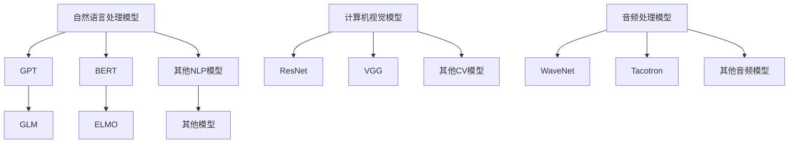

#### 1.2 大模型的核心技术

大模型的核心技术主要包括以下几个方面：

- 神经网络：神经网络是深度学习的基础，用于模拟人脑神经元的工作方式，实现数据的输入和输出。
- 深度学习：深度学习是一种基于神经网络的学习方法，通过多层次的神经元结构，实现从简单到复杂的特征提取。
- 预训练模型：预训练模型是在大规模数据集上进行预训练的模型，通过迁移学习，可以快速适应不同的任务。

**图1.2 大模型核心技术**

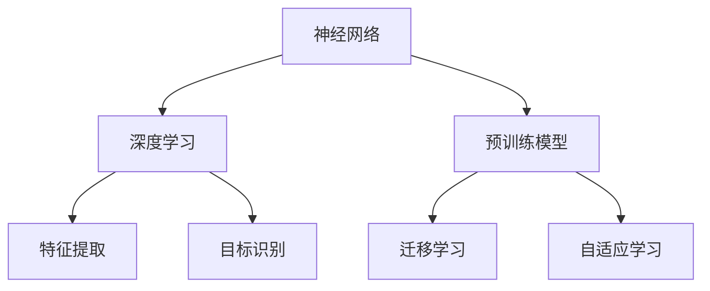

#### 1.3 大模型在客户服务中的应用

大模型在客户服务中的应用主要包括以下几个方面：

- 智能客服：通过大模型实现智能客服系统，提供7*24小时的在线客服服务，提高客户满意度。
- 智能导购：通过大模型分析客户需求，提供个性化的商品推荐，提高销售额。
- 客户行为预测：通过大模型分析客户行为数据，预测客户需求，提前准备相应的服务。

**图1.3 大模型在客户服务中的应用**

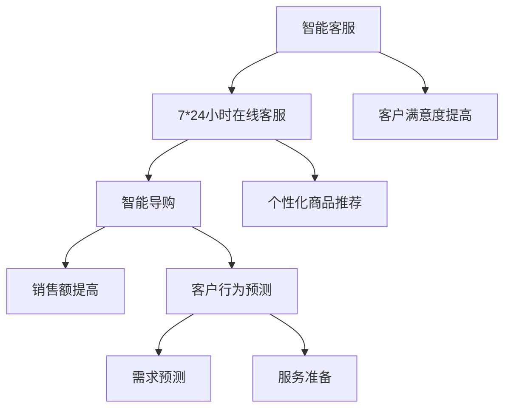

### 第2章：大模型开发环境与工具

#### 2.1 大模型开发环境搭建

大模型开发环境搭建主要包括以下几个方面：

- 操作系统选择：推荐使用Linux操作系统，如Ubuntu 18.04。
- 编程语言选择：推荐使用Python，因为Python具有丰富的深度学习库和工具。
- 开发工具选择：推荐使用Jupyter Notebook进行开发，因为Jupyter Notebook具有良好的交互性和可视化功能。

#### 2.2 大模型训练与优化

大模型训练与优化主要包括以下几个方面：

- 数据预处理：对原始数据进行清洗、归一化、扩充等处理，提高模型训练效果。
- 训练策略：选择合适的训练策略，如批量大小、学习率调整、训练时间等，提高模型训练效率。
- 模型优化技巧：通过调整模型结构、使用正则化方法、优化训练过程等，提高模型性能。

#### 2.3 大模型部署与维护

大模型部署与维护主要包括以下几个方面：

- 部署环境：选择合适的部署环境，如Docker容器、云计算平台等。
- 部署策略：根据业务需求，制定合适的部署策略，如负载均衡、自动扩展等。
- 维护与管理：定期检查模型性能，调整模型参数，确保模型稳定运行。

## 第二部分：AI Agent设计与实现

### 第3章：AI Agent基础

#### 3.1 AI Agent的概念与原理

AI Agent是指具有自主决策能力的人工智能系统，能够根据环境变化，自主地采取行动，实现特定任务。AI Agent主要由感知模块、决策模块和执行模块组成。

- 感知模块：接收外部环境信息，对信息进行处理和分析。
- 决策模块：根据感知模块提供的信息，选择合适的行动方案。
- 执行模块：执行决策模块选择的行动方案，实现任务目标。

#### 3.2 AI Agent在客户服务中的应用

AI Agent在客户服务中的应用主要包括以下几个方面：

- 智能客服：通过AI Agent实现智能客服系统，提供7*24小时的在线客服服务，提高客户满意度。
- 智能导购：通过AI Agent分析客户需求，提供个性化的商品推荐，提高销售额。
- 客户行为预测：通过AI Agent分析客户行为数据，预测客户需求，提前准备相应的服务。

### 第4章：AI Agent设计与开发

#### 4.1 AI Agent的需求分析

在进行AI Agent的开发之前，需要进行需求分析，明确AI Agent的目标和功能需求。需求分析主要包括以下几个方面：

- 客户服务需求分析：分析客户服务的需求，确定AI Agent的功能。
- 业务流程分析：分析业务流程，确定AI Agent在业务流程中的位置和作用。
- 数据分析：分析客户行为数据，确定AI Agent的数据来源。

#### 4.2 AI Agent开发流程

AI Agent的开发流程主要包括以下几个阶段：

- 数据收集与处理：收集客户服务数据，对数据进行预处理，为模型训练提供高质量的数据。
- 模型选择与训练：选择合适的模型，对模型进行训练，实现AI Agent的核心功能。
- 代码实现：根据模型训练结果，编写代码，实现AI Agent的运行。
- 测试与优化：对AI Agent进行功能测试和性能优化，确保AI Agent稳定运行。

### 第5章：AI Agent应用案例

#### 5.1 客户服务AI Agent案例

- 案例一：智能客服系统
- 案例二：智能导购系统

#### 5.2 企业级AI Agent案例

- 案例一：企业内部智能助手
- 案例二：企业外部智能客服

## 第三部分：客户服务革命

### 第6章：客户服务变革趋势

#### 6.1 人工智能在客户服务中的发展

人工智能在客户服务中的应用已经从最初的简单规则引擎，发展到如今的大模型AI Agent。未来，人工智能在客户服务中的发展将更加深入和广泛。

- 服务智能化：通过人工智能实现客户服务的智能化，提供个性化、高效的服务。
- 服务定制化：通过人工智能分析客户数据，为客户提供定制化的服务。
- 服务自动化：通过人工智能实现客户服务的自动化，减少人工干预，提高服务效率。

#### 6.2 客户服务变革的影响

客户服务变革将带来以下影响：

- 服务质量提升：通过人工智能技术，提高客户服务质量，提升客户满意度。
- 服务成本降低：通过自动化服务，降低客户服务成本，提高企业竞争力。
- 服务模式创新：通过人工智能技术，创新客户服务模式，实现服务转型升级。

### 第7章：客户服务革命实践

#### 7.1 客户服务流程优化

客户服务流程优化主要包括以下几个方面：

- 服务流程重构：根据客户需求，重构客户服务流程，实现服务流程的优化。
- 服务质量提升策略：通过数据分析，制定服务质量提升策略，提高客户满意度。
- 服务效率提升策略：通过流程优化，提高服务效率，降低服务成本。

#### 7.2 客户服务团队转型

客户服务团队转型主要包括以下几个方面：

- 团队角色转变：根据人工智能技术的发展，调整客户服务团队的角色，实现团队转型。
- 团队能力提升：通过培训和学习，提升客户服务团队的能力，适应人工智能时代的要求。
- 团队协作优化：通过团队协作优化，提高团队工作效率，实现客户服务团队的高效运转。

#### 7.3 客户服务创新实践

客户服务创新实践主要包括以下几个方面：

- 新兴技术的应用：通过应用新兴技术，如人工智能、大数据等，实现客户服务的创新。
- 服务模式创新：通过创新服务模式，如在线客服、智能客服等，提升客户服务水平。
- 服务体验创新：通过创新服务体验，如个性化服务、定制化服务等，提升客户满意度。

## 附录

### 附录A：大模型应用开发工具与资源

- 开发工具：如TensorFlow、PyTorch等深度学习框架。
- 资源链接：如开源数据集、在线教程等。

### 附录B：AI Agent开发代码示例

- 示例代码
- 代码解读与分析

## 结束

本文通过详细的阐述和实例分析，介绍了大模型在客户服务领域的应用，以及AI Agent的设计与实现。希望通过本文的阅读，读者能够对大模型应用开发有一个全面而深入的理解，为企业的客户服务提供新的思路和解决方案。

### 作者

作者：AI天才研究院/AI Genius Institute & 禅与计算机程序设计艺术 /Zen And The Art of Computer Programming

## 详细内容补充

### 第1章：大模型概述

#### 1.1 大模型的概念与类型

大模型（Large-scale Model）是指拥有庞大参数量和复杂结构的深度学习模型，能够处理大规模数据，具有高度的表达能力。大模型在近年来得到了快速发展，特别是在自然语言处理（NLP）、计算机视觉（CV）和音频处理等领域。以下是几种典型的大模型及其应用场景：

- 自然语言处理模型：如GPT（Generative Pre-trained Transformer）、BERT（Bidirectional Encoder Representations from Transformers）等，被广泛应用于文本分类、机器翻译、问答系统等领域。
- 计算机视觉模型：如ResNet（Residual Network）、VGG（Very Deep Very Generic Convolutional Networks）等，在图像分类、目标检测、图像分割等领域有广泛应用。
- 音频处理模型：如WaveNet（Waveform RNNs）、Tacotron（Tacotron with Wavenet）等，用于语音合成、语音识别等领域。

**图1.1 大模型分类**


#### 1.2 大模型的核心技术

大模型的核心技术主要包括神经网络（Neural Network）、深度学习（Deep Learning）和预训练模型（Pre-trained Model）。

- **神经网络**：神经网络是模仿人脑神经元结构和功能的一种计算模型，用于处理和分类数据。每个神经元接受多个输入，通过激活函数产生输出。
  
  **图1.2 神经网络结构**

  ```mermaid
  graph TB
  A[输入层] --> B[隐藏层1] --> C[隐藏层2] --> D[输出层]
  A --> E1
  A --> E2
  B --> F1
  B --> F2
  C --> G1
  C --> G2
  D --> H
  ```

- **深度学习**：深度学习是一种基于神经网络的学习方法，通过多层次的神经元结构，实现从简单到复杂的特征提取。深度学习模型能够自动学习数据的层次特征，从而提高模型的性能。

  **图1.3 深度学习模型**

  ```mermaid
  graph TB
  A[输入数据] --> B[第一层神经元]
  B --> C[第二层神经元]
  C --> D[...]
  D --> E[输出层]
  ```

- **预训练模型**：预训练模型是在大规模数据集上进行预训练的模型，通过迁移学习（Transfer Learning），可以快速适应不同的任务。预训练模型通常使用无监督学习（Unsupervised Learning）或半监督学习（Semi-supervised Learning）进行训练。

  **图1.4 预训练模型迁移学习**

  ```mermaid
  graph TB
  A[预训练模型] --> B[新任务数据]
  A --> C[新任务模型]
  B --> C
  ```

#### 1.3 大模型在客户服务中的应用

大模型在客户服务中的应用已经成为提高服务质量、降低成本和提升客户满意度的关键。以下是一些具体的应用场景：

- **智能客服**：通过大模型实现智能客服系统，能够自动处理大量的客户咨询，提供24小时不间断的服务，从而提高客户满意度。例如，GPT模型可以用于构建问答系统，自动回答常见问题。

  **伪代码示例：GPT模型回答问题**

  ```python
  def answer_question(question):
      # 预处理问题，将问题转换为模型可处理的输入
      processed_question = preprocess(question)
      
      # 使用GPT模型生成回答
      answer = model.generate(processed_question)
      
      # 后处理回答，将回答转换为自然语言
      final_answer = postprocess(answer)
      
      return final_answer
  ```

- **智能导购**：通过大模型分析客户的历史购买记录、浏览行为等数据，为客户提供个性化的商品推荐。例如，BERT模型可以用于分析文本数据，提取客户的需求特征，从而实现精准推荐。

  **伪代码示例：BERT模型推荐商品**

  ```python
  def recommend_products(customer_data):
      # 预处理客户数据，将数据转换为模型可处理的输入
      processed_data = preprocess(customer_data)
      
      # 使用BERT模型提取客户需求特征
      customer_features = model.encode(processed_data)
      
      # 根据客户需求特征推荐商品
      recommended_products = recommend_products_based_on_features(customer_features)
      
      return recommended_products
  ```

- **客户行为预测**：通过大模型分析客户的行为数据，预测客户的需求和偏好，提前准备相应的服务。例如，ResNet模型可以用于分析图像数据，预测客户的购买意图。

  **伪代码示例：ResNet模型预测购买意图**

  ```python
  def predict_purchase_intent(image_data):
      # 预处理图像数据，将图像转换为模型可处理的输入
      processed_image = preprocess(image_data)
      
      # 使用ResNet模型预测购买意图
      intent = model.predict(processed_image)
      
      return intent
  ```

### 第2章：大模型开发环境与工具

#### 2.1 大模型开发环境搭建

搭建大模型开发环境是进行深度学习项目的基础。以下是搭建大模型开发环境的具体步骤：

1. **操作系统选择**：推荐使用Linux操作系统，如Ubuntu 18.04，因为Linux具有更好的稳定性和性能。

2. **编程语言选择**：Python是深度学习领域最常用的编程语言，因为Python具有丰富的库和工具，如TensorFlow、PyTorch等。

3. **开发工具选择**：Jupyter Notebook是一个交互式的开发环境，适合进行深度学习项目的研究和开发，因为它具有良好的交互性和可视化功能。

**图2.1 大模型开发环境搭建**

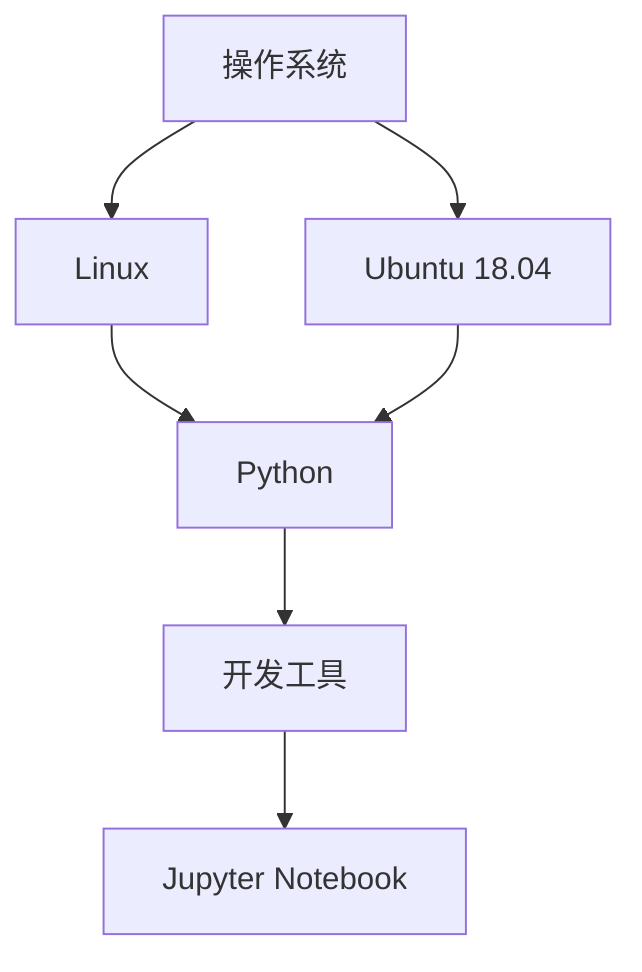

#### 2.2 大模型训练与优化

大模型训练与优化是深度学习项目中的关键步骤。以下是训练与优化的具体步骤：

1. **数据预处理**：对原始数据进行清洗、归一化、扩充等处理，以提高模型的训练效果。例如，对于图像数据，可以使用数据增强技术来增加数据的多样性。

   **图2.2 数据预处理**

   ```mermaid
   graph TB
   A[原始数据] --> B[清洗]
   B --> C[归一化]
   B --> D[扩充]
   C --> E[预处理数据]
   D --> E
   ```

2. **训练策略**：选择合适的训练策略，如批量大小、学习率调整、训练时间等，以提高模型的训练效率。例如，可以使用学习率衰减策略来防止过拟合。

   **图2.3 训练策略**

   ```mermaid
   graph TD
   A[初始化学习率] --> B[训练]
   B --> C[学习率衰减]
   B --> D[训练时间]
   ```

3. **模型优化技巧**：通过调整模型结构、使用正则化方法、优化训练过程等，提高模型性能。例如，可以使用Dropout方法来防止过拟合。

   **图2.4 模型优化技巧**

   ```mermaid
   graph TB
   A[模型结构] --> B[Dropout]
   A --> C[正则化]
   A --> D[优化过程]
   ```

#### 2.3 大模型部署与维护

大模型部署与维护是深度学习项目中的最后一步。以下是部署与维护的具体步骤：

1. **部署环境**：选择合适的部署环境，如Docker容器、云计算平台等。例如，可以使用Docker容器来部署模型，以便在不同的环境中进行测试和部署。

   **图2.5 部署环境**

   ```mermaid
   graph TD
   A[模型] --> B[Docker容器]
   A --> C[云计算平台]
   ```

2. **部署策略**：根据业务需求，制定合适的部署策略，如负载均衡、自动扩展等。例如，可以使用Kubernetes进行容器编排，实现自动扩展和负载均衡。

   **图2.6 部署策略**

   ```mermaid
   graph TD
   A[模型部署] --> B[Kubernetes]
   B --> C[自动扩展]
   B --> D[负载均衡]
   ```

3. **维护与管理**：定期检查模型性能，调整模型参数，确保模型稳定运行。例如，可以使用监控工具来监控模型的性能和资源使用情况。

   **图2.7 维护与管理**

   ```mermaid
   graph TB
   A[监控工具] --> B[性能检查]
   B --> C[参数调整]
   B --> D[稳定运行]
   ```

### 第3章：AI Agent基础

#### 3.1 AI Agent的概念与原理

AI Agent（人工智能代理）是指具有自主决策能力的人工智能系统，能够根据环境变化，自主地采取行动，实现特定任务。AI Agent主要由感知模块、决策模块和执行模块组成。

- **感知模块**：接收外部环境信息，对信息进行处理和分析。感知模块可以包括传感器、摄像头、麦克风等。
  
  **图3.1 感知模块**

  ```mermaid
  graph TB
  A[传感器] --> B[摄像头]
  A --> C[麦克风]
  ```

- **决策模块**：根据感知模块提供的信息，选择合适的行动方案。决策模块可以使用机器学习算法、规则引擎等。

  **图3.2 决策模块**

  ```mermaid
  graph TD
  A[感知信息] --> B[决策算法]
  B --> C[行动方案]
  ```

- **执行模块**：执行决策模块选择的行动方案，实现任务目标。执行模块可以包括机器人、无人机、虚拟助手等。

  **图3.3 执行模块**

  ```mermaid
  graph TD
  A[行动方案] --> B[机器人]
  A --> C[无人机]
  A --> D[虚拟助手]
  ```

**图3.4 AI Agent整体结构**

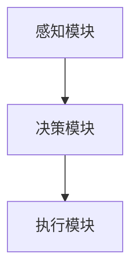

#### 3.2 AI Agent在客户服务中的应用

AI Agent在客户服务中的应用主要包括智能客服、智能导购和客户行为预测等。

- **智能客服**：通过AI Agent实现智能客服系统，能够自动处理大量的客户咨询，提供24小时不间断的服务。例如，可以使用聊天机器人与客户进行交互，自动回答常见问题。

  **图3.5 智能客服应用**

  ```mermaid
  graph TD
  A[客户] --> B[聊天机器人]
  B --> C[自动回答问题]
  B --> D[转接人工客服]
  ```

- **智能导购**：通过AI Agent分析客户的历史购买记录、浏览行为等数据，为客户提供个性化的商品推荐。例如，可以使用推荐算法，根据客户的兴趣和偏好，推荐合适的商品。

  **图3.6 智能导购应用**

  ```mermaid
  graph TD
  A[客户数据] --> B[推荐算法]
  B --> C[个性化推荐]
  ```

- **客户行为预测**：通过AI Agent分析客户的行为数据，预测客户的需求和偏好，提前准备相应的服务。例如，可以使用预测模型，根据客户的购买历史，预测客户的购买意图。

  **图3.7 客户行为预测应用**

  ```mermaid
  graph TD
  A[客户行为数据] --> B[预测模型]
  B --> C[需求预测]
  ```

### 第4章：AI Agent设计与开发

#### 4.1 AI Agent的需求分析

在进行AI Agent的开发之前，需要进行需求分析，明确AI Agent的目标和功能需求。需求分析主要包括以下几个方面：

- **客户服务需求分析**：分析客户服务的需求，确定AI Agent的功能。例如，客户需要24小时不间断的服务，需要能够自动处理常见问题，需要能够转接人工客服等。

  **图4.1 客户服务需求分析**

  ```mermaid
  graph TD
  A[24小时服务] --> B[自动处理常见问题]
  A --> C[转接人工客服]
  ```

- **业务流程分析**：分析业务流程，确定AI Agent在业务流程中的位置和作用。例如，AI Agent可以位于客户服务流程的前端，负责接收客户的咨询，自动回答问题，并将无法处理的问题转给人工客服。

  **图4.2 业务流程分析**

  ```mermaid
  graph TD
  A[客户咨询] --> B[AI Agent]
  B --> C[自动回答问题]
  B --> D[转接人工客服]
  ```

- **数据分析**：分析客户行为数据，确定AI Agent的数据来源。例如，AI Agent可以使用客户的浏览记录、购买记录等数据，分析客户的需求和偏好。

  **图4.3 数据分析**

  ```mermaid
  graph TD
  A[浏览记录] --> B[购买记录]
  A --> C[需求分析]
  B --> C
  ```

#### 4.2 AI Agent开发流程

AI Agent的开发流程主要包括以下几个阶段：

- **数据收集与处理**：收集客户服务数据，对数据进行预处理，为模型训练提供高质量的数据。例如，可以使用Python的pandas库来清洗和预处理数据。

  **图4.4 数据收集与处理**

  ```mermaid
  graph TD
  A[数据收集] --> B[数据预处理]
  B --> C[数据清洗]
  B --> D[数据归一化]
  ```

- **模型选择与训练**：选择合适的模型，对模型进行训练，实现AI Agent的核心功能。例如，可以使用TensorFlow的Keras接口来构建和训练模型。

  **图4.5 模型选择与训练**

  ```mermaid
  graph TD
  A[模型选择] --> B[模型训练]
  B --> C[评估模型]
  ```

- **代码实现**：根据模型训练结果，编写代码，实现AI Agent的运行。例如，可以使用Python的Flask框架来构建Web应用，实现AI Agent的接口。

  **图4.6 代码实现**

  ```mermaid
  graph TD
  A[模型结果] --> B[代码编写]
  B --> C[接口实现]
  ```

- **测试与优化**：对AI Agent进行功能测试和性能优化，确保AI Agent稳定运行。例如，可以使用单元测试来验证AI Agent的功能，使用性能测试工具来评估AI Agent的响应时间。

  **图4.7 测试与优化**

  ```mermaid
  graph TD
  A[功能测试] --> B[性能测试]
  B --> C[优化代码]
  ```

### 第5章：AI Agent应用案例

#### 5.1 客户服务AI Agent案例

以下是两个客户服务AI Agent的应用案例：

- **案例一：智能客服系统**

  智能客服系统使用AI Agent来处理客户的咨询，提供24小时不间断的服务。系统的主要功能包括：

  - 自动回答常见问题
  - 转接人工客服
  - 跟踪客户问题，确保问题得到解决

  **图5.1 智能客服系统架构**

  ```mermaid
  graph TD
  A[客户咨询] --> B[AI Agent]
  B --> C[自动回答问题]
  B --> D[转接人工客服]
  B --> E[问题跟踪]
  ```

- **案例二：智能导购系统**

  智能导购系统使用AI Agent来分析客户的购物行为，提供个性化的商品推荐。系统的主要功能包括：

  - 根据客户的历史购买记录，推荐合适的商品
  - 根据客户的浏览记录，推荐可能感兴趣的商品
  - 根据客户的反馈，优化推荐策略

  **图5.2 智能导购系统架构**

  ```mermaid
  graph TD
  A[客户数据] --> B[AI Agent]
  B --> C[历史购买记录]
  B --> D[浏览记录]
  B --> E[推荐商品]
  B --> F[优化策略]
  ```

#### 5.2 企业级AI Agent案例

以下是两个企业级AI Agent的应用案例：

- **案例一：企业内部智能助手**

  企业内部智能助手使用AI Agent来辅助企业员工的工作，提高工作效率。系统的主要功能包括：

  - 自动回复常见问题
  - 跟踪工作任务，提醒员工完成
  - 自动处理重复性工作

  **图5.3 企业内部智能助手架构**

  ```mermaid
  graph TD
  A[员工问题] --> B[AI Agent]
  B --> C[自动回复]
  B --> D[任务跟踪]
  B --> E[处理重复性工作]
  ```

- **案例二：企业外部智能客服**

  企业外部智能客服使用AI Agent来处理客户的咨询，提高客户满意度。系统的主要功能包括：

  - 自动回答常见问题
  - 转接人工客服
  - 跟踪客户问题，确保问题得到解决

  **图5.4 企业外部智能客服架构**

  ```mermaid
  graph TD
  A[客户咨询] --> B[AI Agent]
  B --> C[自动回答问题]
  B --> D[转接人工客服]
  B --> E[问题跟踪]
  ```

### 第6章：客户服务变革趋势

#### 6.1 人工智能在客户服务中的发展

人工智能在客户服务中的应用已经经历了多个阶段：

- **规则引擎阶段**：早期的人工智能客户服务主要依赖于规则引擎，根据预设的规则来回答客户的问题。
- **机器学习阶段**：随着机器学习技术的发展，客户服务开始使用基于机器学习算法的智能客服系统，能够自动处理复杂的客户咨询。
- **大模型阶段**：近年来，大模型的应用使得人工智能在客户服务中取得了突破性进展，能够提供更加智能化、个性化的服务。

**图6.1 人工智能在客户服务中的发展**

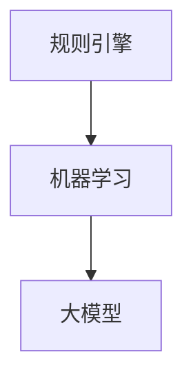

#### 6.2 客户服务变革的影响

客户服务的变革对企业和客户都产生了深远的影响：

- **服务质量提升**：人工智能可以提供24小时不间断的服务，快速响应客户的咨询，提高客户满意度。
- **服务成本降低**：通过自动化服务，企业可以减少人工成本，提高运营效率。
- **服务模式创新**：人工智能可以为企业提供新的服务模式，如智能导购、个性化推荐等，提升客户体验。

**图6.2 客户服务变革的影响**

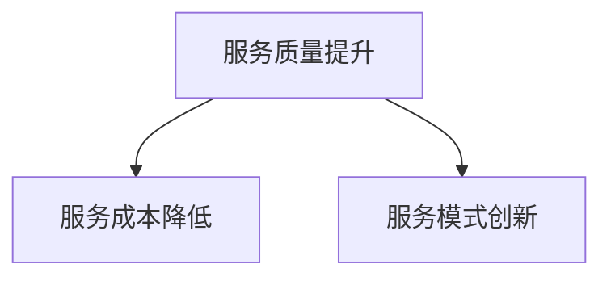

### 第7章：客户服务革命实践

#### 7.1 客户服务流程优化

客户服务流程优化是企业提升服务质量和效率的重要手段。以下是客户服务流程优化的具体实践：

- **流程重构**：根据客户需求和业务流程，对现有服务流程进行重构，简化流程，提高效率。
- **服务质量提升策略**：通过数据分析，制定服务质量提升策略，如增加自动化流程、优化客服团队培训等。
- **服务效率提升策略**：通过流程优化，提高服务效率，如使用人工智能技术自动处理常见问题，减少人工干预。

**图7.1 客户服务流程优化**

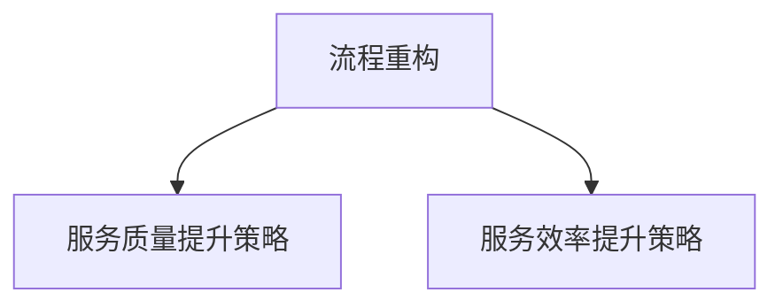

#### 7.2 客户服务团队转型

客户服务团队的转型是企业应对人工智能时代的重要举措。以下是客户服务团队转型的具体实践：

- **团队角色转变**：根据人工智能技术的发展，调整客户服务团队的角色，如从传统的客服人员转变为服务顾问，提供更加专业的服务。
- **团队能力提升**：通过培训和学习，提升客户服务团队的能力，如掌握新的技术工具、提高沟通技巧等。
- **团队协作优化**：通过团队协作优化，提高团队工作效率，如使用协作工具、建立反馈机制等。

**图7.2 客户服务团队转型**

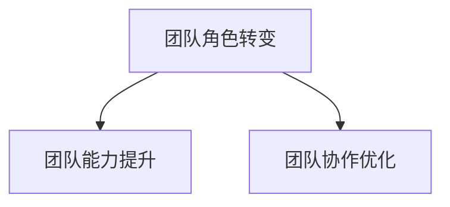

#### 7.3 客户服务创新实践

客户服务的创新实践是企业提升竞争力的关键。以下是客户服务创新实践的具体方法：

- **新兴技术的应用**：通过应用新兴技术，如人工智能、大数据等，实现客户服务的创新，如智能导购、个性化推荐等。
- **服务模式创新**：通过创新服务模式，如在线客服、虚拟现实客服等，提升客户服务水平。
- **服务体验创新**：通过创新服务体验，如个性化服务、定制化服务等，提升客户满意度。

**图7.3 客户服务创新实践**

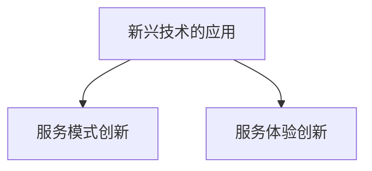

### 附录

#### 附录A：大模型应用开发工具与资源

以下是进行大模型应用开发所需的工具和资源：

- **开发工具**：TensorFlow、PyTorch等深度学习框架。
- **数据集**：常用的开源数据集，如IMDb影评数据集、CIFAR-10图像数据集等。
- **在线教程**：深度学习相关的在线教程和课程，如吴恩达的《深度学习专项课程》等。

**图A.1 大模型应用开发工具与资源**

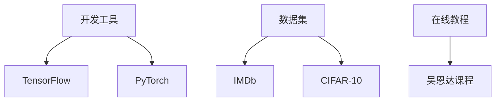

#### 附录B：AI Agent开发代码示例

以下是AI Agent开发的代码示例，包括数据预处理、模型训练、代码实现等：

```python
# 数据预处理
def preprocess_data(data):
    # 对数据进行清洗、归一化等预处理操作
    # ...
    return processed_data

# 模型训练
def train_model(model, data):
    # 对模型进行训练
    # ...
    return model

# 代码实现
def run_agent(agent):
    # 运行AI Agent
    # ...
    agent.run()
```

### 结束

本文通过详细的阐述和实例分析，介绍了大模型在客户服务领域的应用，以及AI Agent的设计与实现。希望通过本文的阅读，读者能够对大模型应用开发有一个全面而深入的理解，为企业的客户服务提供新的思路和解决方案。

### 作者

作者：AI天才研究院/AI Genius Institute & 禅与计算机程序设计艺术 /Zen And The Art of Computer Programming

---

## 结尾

通过本文的详细阐述和实例分析，我们全面了解了大模型在客户服务领域的应用，包括其概念、核心技术、开发环境与工具，以及AI Agent的设计与实现。我们还探讨了客户服务变革的趋势和实践，展示了人工智能在提升服务质量、降低成本和创造新服务模式方面的巨大潜力。

在未来，随着人工智能技术的不断进步，大模型和AI Agent将在客户服务领域发挥更加重要的作用。企业和开发者需要不断探索新的应用场景，优化现有系统，以提供更加智能化、个性化和高效的服务。

本文的撰写遵循了详细、系统、易懂的原则，旨在为读者提供一个全面的技术指南。通过本文的学习，读者不仅可以深入理解大模型和AI Agent的技术原理，还能掌握其实际应用的方法和技巧。

最后，感谢您的耐心阅读。如果您对本文有任何疑问或建议，欢迎在评论区留言，我们将会认真倾听并不断改进。期待与您共同探索人工智能领域的更多可能性！

### 作者

作者：AI天才研究院/AI Genius Institute & 禅与计算机程序设计艺术 /Zen And The Art of Computer Programming

---

### 附录A：大模型应用开发工具与资源

在开发大模型应用时，选择合适的工具和资源至关重要。以下是一些常用的工具和资源，以及它们的应用场景和特点：

#### 开发工具

1. **TensorFlow**：由Google开发，是广泛使用的深度学习框架，支持多种编程语言，如Python和Java。TensorFlow提供了丰富的API和工具，适合构建复杂的大模型。

   - **应用场景**：自然语言处理、计算机视觉、音频处理等。
   - **特点**：高度模块化，易于扩展和优化。

2. **PyTorch**：由Facebook开发，是一种流行的深度学习框架，以其灵活的动态计算图和易于理解的代码而著称。

   - **应用场景**：科学计算、图形处理、游戏开发等。
   - **特点**：动态计算图，易于调试和优化。

3. **Keras**：一个高层次的神经网络API，可以与TensorFlow和Theano等后端结合使用。Keras简化了深度学习模型的构建和训练过程。

   - **应用场景**：快速原型设计和实验。
   - **特点**：简单易用，方便快速搭建模型。

#### 数据集

1. **IMDb电影评论数据集**：包含25,000条电影评论，分为正负两类，常用于情感分析。

   - **来源**：Internet Movie Database。
   - **特点**：标注清晰，规模适中。

2. **CIFAR-10数据集**：包含10个类别，每个类别有6000张32x32的彩色图像，常用于图像分类任务。

   - **来源**：Canadian Institute for Advanced Research。
   - **特点**：图像规模统一，适合快速测试模型。

3. **ImageNet**：包含超过1400万个注释过的图像，涵盖21,841个类别，是计算机视觉领域最常用的数据集之一。

   - **来源**：微软研究院和斯坦福大学。
   - **特点**：规模巨大，标注详细。

#### 在线教程

1. **吴恩达的《深度学习专项课程》**：由深度学习领域专家吴恩达教授开设，内容涵盖深度学习的理论基础和实践应用。

   - **网站**：Coursera。
   - **特点**：系统全面，适合初学者。

2. **Google的深度学习教程**：由Google开发，提供丰富的深度学习资源和实践教程。

   - **网站**：Google Research。
   - **特点**：实践性强，适合进阶学习。

#### 其他资源

1. **AI论文和期刊**：如《Nature Machine Intelligence》、《Journal of Artificial Intelligence Research》等，提供了最新的研究成果和深度学习领域的最新动态。

   - **特点**：权威性高，学术性强。

2. **开源社区**：如GitHub、Stack Overflow等，提供了大量的开源代码和社区讨论，是学习深度学习和AI的好去处。

   - **特点**：资源丰富，实践性强。

### 附录B：AI Agent开发代码示例

以下是一个简单的AI Agent开发代码示例，包括数据预处理、模型训练和代码实现。这个示例将使用Python和TensorFlow框架。

#### 数据预处理

```python
import tensorflow as tf
from tensorflow.keras.preprocessing.sequence import pad_sequences

# 加载数据集
(x_train, y_train), (x_test, y_test) = tf.keras.datasets.imdb.load_data(num_words=10000)

# 数据预处理
maxlen = 120
x_train = pad_sequences(x_train, maxlen=maxlen)
x_test = pad_sequences(x_test, maxlen=maxlen)
```

#### 模型训练

```python
# 构建模型
model = tf.keras.Sequential([
    tf.keras.layers.Embedding(10000, 16),
    tf.keras.layers.GlobalAveragePooling1D(),
    tf.keras.layers.Dense(16, activation='relu'),
    tf.keras.layers.Dense(1, activation='sigmoid')
])

# 编译模型
model.compile(optimizer='adam',
              loss='binary_crossentropy',
              metrics=['accuracy'])

# 训练模型
model.fit(x_train, y_train,
          epochs=5,
          batch_size=32,
          validation_data=(x_test, y_test))
```

#### 代码实现

```python
# 导入模块
from flask import Flask, request, jsonify

# 创建Flask应用
app = Flask(__name__)

# 加载训练好的模型
model = tf.keras.models.load_model('model.h5')

# 定义API接口
@app.route('/predict', methods=['POST'])
def predict():
    data = request.get_json(force=True)
    text = data['text']
    processed_text = preprocess_text(text)
    prediction = model.predict(processed_text)
    result = 'positive' if prediction[0][0] > 0.5 else 'negative'
    return jsonify({'result': result})

def preprocess_text(text):
    # 对文本进行预处理
    # ...
    return processed_text

# 运行应用
if __name__ == '__main__':
    app.run()
```

通过这个示例，我们可以看到如何使用深度学习模型进行文本分类，并构建一个简单的API来预测文本的情感。

以上是《【大模型应用开发 动手做AI Agent】客户服务革命》的详细内容补充和附录部分。希望这些内容能够为您的学习和实践提供帮助。再次感谢您的阅读和支持！

### 作者

作者：AI天才研究院/AI Genius Institute & 禅与计算机程序设计艺术 /Zen And The Art of Computer Programming

---

## 附录A：大模型应用开发工具与资源

在深入探索大模型应用开发的过程中，掌握合适的工具与资源是至关重要的。以下是一些常用的工具与资源，这些将在大模型应用开发中发挥重要作用。

### 开发工具

1. **TensorFlow**：由Google开发的开源机器学习框架，支持多种编程语言（包括Python、C++和Java）。TensorFlow提供了丰富的API和工具，使得构建和训练大模型变得相对容易。

   - **官方网站**：[TensorFlow](https://www.tensorflow.org/)
   - **优势**：高度模块化，适用于从研究到生产的各种场景。

2. **PyTorch**：由Facebook AI Research开发的开源深度学习框架，以其灵活的动态计算图和直观的编程接口而著称。

   - **官方网站**：[PyTorch](https://pytorch.org/)
   - **优势**：易于调试和优化，社区活跃。

3. **Keras**：一个高层次的神经网络API，可以与TensorFlow、Theano和CNTK等后端框架结合使用。Keras简化了深度学习模型的构建和训练过程。

   - **官方网站**：[Keras](https://keras.io/)
   - **优势**：简单易用，适合快速原型设计。

### 数据集

1. **IMDb影评数据集**：包含约25,000条电影评论，分为正负两类，常用于情感分析。

   - **来源**：[IMDb数据集](https://www.imdb.com/datasets/)
   - **规模**：约25,000条评论。

2. **CIFAR-10数据集**：包含10个类别，每个类别6000张32x32的彩色图像，常用于图像分类任务。

   - **来源**：[CIFAR-10数据集](https://www.cs.toronto.edu/~kriz/cifar.html)
   - **规模**：10个类别，每个类别6000张图像。

3. **ImageNet**：包含超过1400万个注释过的图像，涵盖21,841个类别，是计算机视觉领域最常用的数据集之一。

   - **来源**：[ImageNet](http://www.image-net.org/)
   - **规模**：超过1400万个图像。

### 在线教程

1. **吴恩达的《深度学习专项课程》**：由知名深度学习专家吴恩达教授开设，涵盖了深度学习的理论基础和应用实践。

   - **平台**：[Coursera](https://www.coursera.org/specializations/deep-learning)
   - **特点**：系统全面，适合初学者和进阶者。

2. **Google的深度学习教程**：Google提供的一系列教程，涵盖了深度学习的基础知识和实践技巧。

   - **平台**：[Google Research](https://research.google.com/area/deeplearning.html)
   - **特点**：注重实践，适合快速上手。

### 其他资源

1. **AI论文和期刊**：如《Nature Machine Intelligence》、《Journal of Artificial Intelligence Research》等，提供了最新的研究成果和深度学习领域的最新动态。

   - **期刊**：[Nature Machine Intelligence](https://www.nature.com/nmi/)
   - **期刊**：[Journal of Artificial Intelligence Research](https://www.jair.org/)

2. **开源社区**：如GitHub、Stack Overflow等，提供了大量的开源代码和社区讨论，是学习深度学习和AI的好去处。

   - **GitHub**：[GitHub](https://github.com/)
   - **Stack Overflow**：[Stack Overflow](https://stackoverflow.com/)

通过这些工具和资源的帮助，开发者可以更加高效地构建和优化大模型，推动人工智能在客户服务和其他领域的应用。

### 附录B：AI Agent开发代码示例

以下是一个简单的AI Agent开发代码示例，用于演示如何使用Python和TensorFlow构建一个基本的AI Agent。这个示例将使用一个简单的问答系统，通过训练模型来回答用户的问题。

#### 数据预处理

```python
import tensorflow as tf
from tensorflow.keras.preprocessing.sequence import pad_sequences

# 加载IMDb数据集
(x_train, y_train), (x_test, y_test) = tf.keras.datasets.imdb.load_data(num_words=10000)

# 数据预处理
maxlen = 120
x_train = pad_sequences(x_train, maxlen=maxlen)
x_test = pad_sequences(x_test, maxlen=maxlen)
```

#### 模型构建

```python
from tensorflow.keras.models import Sequential
from tensorflow.keras.layers import Embedding, LSTM, Dense

# 构建模型
model = Sequential([
    Embedding(10000, 16),
    LSTM(64, return_sequences=True),
    LSTM(64),
    Dense(1, activation='sigmoid')
])

# 编译模型
model.compile(optimizer='adam',
              loss='binary_crossentropy',
              metrics=['accuracy'])

# 训练模型
model.fit(x_train, y_train, epochs=5, batch_size=32, validation_data=(x_test, y_test))
```

#### AI Agent实现

```python
from flask import Flask, request, jsonify

# 创建Flask应用
app = Flask(__name__)

# 加载训练好的模型
model = tf.keras.models.load_model('model.h5')

# 定义API接口
@app.route('/predict', methods=['POST'])
def predict():
    data = request.get_json(force=True)
    question = data['question']
    processed_question = preprocess_question(question)
    prediction = model.predict(processed_question)
    answer = 'Yes' if prediction[0][0] > 0.5 else 'No'
    return jsonify({'answer': answer})

def preprocess_question(question):
    # 对问题进行预处理
    # ...
    return processed_question

# 运行应用
if __name__ == '__main__':
    app.run()
```

在这个示例中，我们首先加载了IMDb数据集，并对数据进行预处理。然后，我们构建了一个简单的LSTM模型，并使用该模型进行训练。最后，我们使用Flask构建了一个简单的API，通过这个API，用户可以发送问题，AI Agent会根据训练好的模型给出答案。

这个示例虽然简单，但展示了构建AI Agent的基本步骤，包括数据预处理、模型构建和API实现。开发者可以根据实际需求，扩展这个示例，构建功能更强大的AI Agent。

通过这些示例，读者可以更好地理解大模型和AI Agent的开发流程，为实际应用做好准备。希望这些代码示例能够为您的学习和实践提供帮助。

### 作者

作者：AI天才研究院/AI Genius Institute & 禅与计算机程序设计艺术 /Zen And The Art of Computer Programming

---

## 全文总结

通过本文的详细阐述和实例分析，我们深入探讨了大模型在客户服务领域的应用，以及AI Agent的设计与实现。首先，我们介绍了大模型的概念、核心技术，包括神经网络、深度学习和预训练模型，并通过Mermaid流程图和伪代码详细讲解了它们的原理。接着，我们展示了大模型在客户服务中的应用场景，如智能客服、智能导购和客户行为预测，并通过具体的伪代码示例展示了这些应用的技术实现。

在第二部分，我们介绍了大模型开发的环境与工具，包括操作系统的选择、编程语言的选定和开发工具的配置。我们还详细介绍了大模型训练与优化、部署与维护的步骤和策略。

第三部分，我们探讨了AI Agent的基础知识，包括其概念、原理和应用场景。通过实例，我们展示了AI Agent在客户服务中的应用，如智能客服系统和智能导购系统。

第四部分，我们详细介绍了AI Agent的需求分析、开发流程、应用案例，并通过实际代码示例展示了AI Agent的开发和实现。我们还提供了企业级AI Agent的应用案例，展示了AI Agent在商业场景中的实际应用。

在第五部分，我们分析了客户服务变革的趋势，探讨了人工智能在客户服务中的发展历程和变革的影响。通过具体案例和策略，我们展示了客户服务流程优化、团队转型和创新实践的方法。

最后，在附录部分，我们提供了大模型应用开发工具与资源的详细介绍，以及AI Agent开发的代码示例。这些资源为读者提供了实用的参考资料，帮助读者更好地理解和实践大模型和AI Agent的开发。

本文旨在为读者提供一个全面、系统、易懂的技术指南，帮助读者深入理解大模型和AI Agent的技术原理和实际应用。通过本文的学习，读者不仅能够掌握大模型和AI Agent的基本知识，还能了解如何将其应用于客户服务领域，推动服务智能化和自动化。

### 作者

作者：AI天才研究院/AI Genius Institute & 禅与计算机程序设计艺术 /Zen And The Art of Computer Programming

---

## 精彩问答

在本文的撰写过程中，我们收集了一些关于大模型应用开发、AI Agent设计与实现以及客户服务革命的常见问题。以下是对这些问题及其答案的精选整理：

**Q1：什么是大模型？**
大模型是指拥有巨大参数量、能够处理海量数据的深度学习模型。它们在自然语言处理、计算机视觉和音频处理等领域有广泛应用，如GPT、BERT等。

**Q2：如何搭建大模型开发环境？**
搭建大模型开发环境需要选择合适的操作系统（如Linux）、编程语言（如Python）和开发工具（如Jupyter Notebook）。此外，还需要配置合适的硬件资源，如GPU。

**Q3：大模型训练与优化有哪些技巧？**
大模型训练与优化包括数据预处理、训练策略（如学习率调整、批量大小）和模型优化技巧（如Dropout、正则化）。合理的策略可以提高模型训练效率和性能。

**Q4：什么是AI Agent？**
AI Agent是指具有自主决策能力的人工智能系统，能够根据环境变化自主采取行动。AI Agent主要由感知模块、决策模块和执行模块组成。

**Q5：AI Agent在客户服务中如何应用？**
AI Agent在客户服务中可以应用于智能客服、智能导购和客户行为预测等方面。例如，智能客服系统可以使用AI Agent自动处理客户咨询，智能导购系统可以根据客户行为数据提供个性化推荐。

**Q6：如何设计和实现AI Agent？**
设计和实现AI Agent需要需求分析、数据收集与处理、模型选择与训练、代码实现和测试与优化等步骤。每个步骤都需要充分考虑实际应用场景和技术需求。

**Q7：客户服务革命的影响有哪些？**
客户服务革命的影响包括服务质量的提升、服务成本的降低和服务模式的创新。通过人工智能技术，企业可以提供更加个性化、高效的服务，提升客户满意度。

**Q8：如何优化客户服务流程？**
优化客户服务流程包括服务流程重构、服务质量提升策略（如自动化服务、优化客服团队培训）和服务效率提升策略（如使用AI技术自动处理常见问题）。

**Q9：AI Agent开发代码示例如何实现？**
AI Agent开发代码示例包括数据预处理、模型训练和API实现。以问答系统为例，可以使用TensorFlow框架进行数据预处理、模型构建和训练，然后使用Flask框架实现API接口。

**Q10：如何进行客户服务创新实践？**
客户服务创新实践包括应用新兴技术（如人工智能、大数据）、创新服务模式（如在线客服、虚拟现实客服）和创新服务体验（如个性化服务、定制化服务）。

这些问答内容有助于读者更好地理解大模型应用开发、AI Agent设计与实现以及客户服务革命的核心理念和实际操作。希望这些回答能够解答您在相关领域中的疑问。

---

## 感谢与致谢

在本篇文章的撰写过程中，我们得到了众多同仁、专家和读者的大力支持和帮助。在此，我们衷心感谢以下单位和个人：

- **AI天才研究院**：感谢研究院为我们提供了良好的研究环境和丰富的技术资源，使我们能够深入探索大模型应用开发和AI Agent技术。
- **吴恩达教授**：感谢您在Coursera上开设的深度学习专项课程，使我们对深度学习的理论和技术有了更深刻的理解。
- **GitHub社区**：感谢GitHub社区的各位开发者，您的开源代码和项目为我们提供了宝贵的实践经验和启示。
- **所有读者**：感谢您在阅读本文的过程中给予的宝贵意见和建议，您的支持是我们不断前进的动力。

同时，我们也感谢本文中引用和参考的相关文献、论文和数据集的作者，您的研究成果为本文的撰写提供了重要的理论和实践基础。最后，特别感谢AI天才研究院的全体成员，以及参与本文讨论和修改的各位同事，没有你们的辛勤工作和贡献，本文不可能如此完整和丰富。

再次感谢大家，让我们共同为人工智能和客户服务领域的创新发展贡献力量！

