                 

### 文章标题: 【大模型应用开发 动手做AI Agent】知识、记忆、理解、表达、推理、反思、泛化和自我提升

#### 关键词：大模型、人工智能、AI Agent、知识表示、自然语言处理、推理算法、自我提升

#### 摘要：
本文将探讨大模型在人工智能领域的应用，特别是如何通过动手实践构建一个具备知识、记忆、理解、表达、推理、反思和自我提升能力的AI Agent。文章将逐步介绍大模型的基础原理，然后深入探讨其在知识获取与记忆、理解与表达、推理与反思、泛化与优化以及自我提升等方面的技术实现。通过具体的代码实例和数学模型，本文将帮助读者理解大模型背后的核心算法，并学会如何利用这些算法开发实用的AI应用。

### 目录大纲

#### 第一部分: 大模型基础

#### 第1章: 大模型概述

##### 1.1 大模型的发展历程

##### 1.2 大模型的基本原理

##### 1.3 大模型的结构与分类

#### 第2章: 大模型技术基础

##### 2.1 深度学习基础

###### 2.1.1 神经网络原理

###### 2.1.2 深度学习框架

##### 2.2 自然语言处理

###### 2.2.1 词嵌入技术

###### 2.2.2 语音识别技术

##### 2.3 计算机视觉基础

###### 2.3.1 卷积神经网络

###### 2.3.2 生成对抗网络

#### 第二部分: 大模型应用

#### 第3章: 知识获取与记忆

##### 3.1 知识图谱构建

###### 3.1.1 知识图谱的概念

###### 3.1.2 知识图谱构建方法

##### 3.2 知识表示与记忆

###### 3.2.1 知识表示方法

###### 3.2.2 知识记忆策略

#### 第4章: 理解与表达

##### 4.1 自然语言理解

###### 4.1.1 语言模型

###### 4.1.2 语义理解

##### 4.2 自然语言生成

###### 4.2.1 文本生成

###### 4.2.2 对话系统

#### 第5章: 推理与反思

##### 5.1 推理算法

###### 5.1.1 逻辑推理

###### 5.1.2 模式识别

##### 5.2 反思与元学习

###### 5.2.1 反思机制

###### 5.2.2 元学习算法

#### 第6章: 泛化与优化

##### 6.1 泛化能力

###### 6.1.1 泛化能力的概念

###### 6.1.2 提升泛化能力的方法

##### 6.2 优化策略

###### 6.2.1 损失函数

###### 6.2.2 优化算法

#### 第7章: 自我提升与未来展望

##### 7.1 大模型自我提升

###### 7.1.1 自适应学习

###### 7.1.2 持续学习

##### 7.2 大模型应用前景

###### 7.2.1 行业应用

###### 7.2.2 社会影响

#### 附录

##### 附录A: 开发工具与资源

###### A.1 Python深度学习库

###### A.2 自然语言处理工具

###### A.3 计算机视觉库

### 正文部分

#### 第一部分: 大模型基础

#### 第1章: 大模型概述

##### 1.1 大模型的发展历程

大模型的发展历程可以追溯到20世纪80年代，当时神经网络作为一种人工智能技术开始受到关注。最初的神经网络模型较为简单，如感知机、反向传播算法等，但它们在处理复杂任务时表现出力不从心的状态。

随着计算能力的提升和大数据的涌现，深度学习技术逐渐崭露头角。2006年，Geoffrey Hinton等人提出了深度信念网络（DBN），标志着深度学习进入了一个新的阶段。深度信念网络通过多层次的神经网络结构，能够有效提取数据的层次特征，从而在图像和语音识别等任务中取得了突破性成果。

2012年，AlexNet的出现再次引发了深度学习的热潮。AlexNet是第一个在ImageNet图像识别大赛中取得显著优势的深度学习模型，它采用卷积神经网络（CNN）结构，通过多层卷积和池化操作提取图像特征，大幅度提高了图像识别的准确率。

随后，生成对抗网络（GAN）的提出为生成模型的发展开辟了新天地。GAN由生成器和判别器组成，通过两者之间的对抗训练，可以生成高质量的逼真数据。

进入2018年后，随着Transformer结构的出现，自然语言处理领域取得了重大突破。Transformer模型通过自注意力机制处理序列数据，使得机器翻译、文本生成等任务取得了前所未有的效果。

##### 1.2 大模型的基本原理

大模型的基本原理主要涉及深度学习、自然语言处理、计算机视觉等核心领域。

深度学习是一种基于多层神经网络的学习方法，通过逐层抽象和转换输入数据，从而实现复杂任务的建模。深度学习模型通常包括输入层、隐藏层和输出层，其中隐藏层通过激活函数实现非线性变换。

自然语言处理是研究计算机与人类语言之间交互的学科。自然语言处理技术主要包括词嵌入、语言模型、序列标注、文本生成等。词嵌入技术将词语映射到高维向量空间，以便进行有效的向量计算和模型训练。

计算机视觉是研究如何使计算机像人类一样理解和解释视觉信息的技术。计算机视觉技术主要包括图像识别、目标检测、图像分割、视频处理等。卷积神经网络（CNN）和生成对抗网络（GAN）是计算机视觉领域的核心技术。

##### 1.3 大模型的结构与分类

大模型的结构可以分为以下几类：

1. 卷积神经网络（CNN）：卷积神经网络是一种用于处理图像数据的深度学习模型，通过卷积和池化操作提取图像特征。CNN在图像识别、目标检测和图像分割等领域具有广泛应用。

2. 循环神经网络（RNN）：循环神经网络是一种用于处理序列数据的深度学习模型，通过隐藏状态和序列之间的相互作用来建模时间序列数据。RNN在语音识别、机器翻译和文本生成等领域具有显著优势。

3. 生成对抗网络（GAN）：生成对抗网络是一种由生成器和判别器组成的深度学习模型，通过对抗训练生成高质量的数据。GAN在图像生成、数据增强和风格迁移等领域取得了成功。

4. Transformer模型：Transformer模型是一种基于自注意力机制的深度学习模型，通过多头注意力机制处理序列数据。Transformer在自然语言处理领域取得了突破性成果，如机器翻译、文本生成等任务。

#### 第2章: 大模型技术基础

##### 2.1 深度学习基础

###### 2.1.1 神经网络原理

神经网络是一种模仿生物神经元结构和工作原理的计算模型。一个基本的神经网络包括输入层、隐藏层和输出层。输入层接收外部输入数据，隐藏层通过权重矩阵和激活函数进行数据处理，输出层生成最终的输出结果。

神经网络的训练过程是通过调整权重矩阵和偏置项，使得网络能够对输入数据进行准确的分类或回归。常用的训练方法包括梯度下降、随机梯度下降、Adam优化器等。

伪代码如下：

```python
# 初始化权重和偏置
weights = initialize_weights()
bias = initialize_bias()

# 定义激活函数
activation = sigmoid

# 前向传播
def forward(x):
    z = x * weights + bias
    return activation(z)

# 计算损失
def calculate_loss(y_true, y_pred):
    return sum((y_true - y_pred) ** 2) / len(y_true)

# 反向传播
def backward(dz):
    dweights = x * dz
    dbias = dz
    x = x * weights
    return dweights, dbias

# 更新权重和偏置
def update_weights(weights, dweights, learning_rate):
    weights -= learning_rate * dweights
    return weights

# 训练模型
def train_model(x, y, epochs, learning_rate):
    for epoch in range(epochs):
        y_pred = forward(x)
        loss = calculate_loss(y, y_pred)
        dz = y - y_pred
        dweights, dbias = backward(dz)
        weights = update_weights(weights, dweights, learning_rate)
        bias = update_bias(bias, dbias, learning_rate)
    return weights, bias
```

###### 2.1.2 深度学习框架

深度学习框架是一种用于构建和训练深度学习模型的软件库。常见的深度学习框架包括TensorFlow、PyTorch、Keras等。

TensorFlow是由Google开发的一个开源深度学习框架，具有强大的图计算引擎和丰富的API接口。TensorFlow通过构建计算图来实现深度学习模型的构建和训练。

PyTorch是由Facebook开发的一个开源深度学习框架，具有动态计算图和简洁的API。PyTorch在科研和工业应用中具有很高的声誉。

Keras是一个高级深度学习框架，可以在TensorFlow和Theano等底层框架之上构建和训练模型。Keras提供了简洁的API和丰富的模型组件，适合快速开发和实验。

##### 2.2 自然语言处理

###### 2.2.1 词嵌入技术

词嵌入技术是一种将词语映射到高维向量空间的方法，使得词语之间的相似性和相关性可以通过向量之间的距离和角度来表示。常见的词嵌入方法包括Word2Vec、GloVe等。

Word2Vec是一种基于神经网络的语言模型，通过负采样和梯度下降优化方法训练词向量。Word2Vec将词语表示为向量的线性组合，能够有效捕捉词语的语义信息。

GloVe是一种基于全局矩阵分解的方法，通过最小化词语共现矩阵和词向量矩阵之间的距离，训练得到高质量的词向量。GloVe能够较好地处理稀疏数据和高维向量问题。

###### 2.2.2 语音识别技术

语音识别技术是自然语言处理的一个重要分支，旨在将语音信号转换为相应的文本。常见的语音识别技术包括隐马尔可夫模型（HMM）、循环神经网络（RNN）和卷积神经网络（CNN）。

隐马尔可夫模型（HMM）是一种基于状态转移概率和观测概率的语音识别模型，能够对连续的语音信号进行建模。HMM在早期的语音识别领域取得了显著成果。

循环神经网络（RNN）是一种用于处理序列数据的神经网络模型，通过隐藏状态和序列之间的相互作用，对语音信号进行建模。RNN在语音识别领域取得了重要进展，但存在梯度消失和梯度爆炸等问题。

卷积神经网络（CNN）是一种用于处理图像数据的神经网络模型，通过卷积和池化操作提取图像特征。CNN在语音识别领域也得到了广泛应用，通过将语音信号转换为图像表示，利用CNN的强大特征提取能力，提高语音识别的准确性。

##### 2.3 计算机视觉基础

###### 2.3.1 卷积神经网络

卷积神经网络（CNN）是一种用于处理图像数据的神经网络模型，通过卷积和池化操作提取图像特征。CNN在图像识别、目标检测和图像分割等领域具有广泛应用。

CNN的基本结构包括输入层、卷积层、池化层和全连接层。卷积层通过卷积操作提取图像的局部特征，池化层通过下采样操作减少数据的维度。全连接层用于对提取到的特征进行分类或回归。

卷积神经网络的基本原理可以通过以下Mermaid流程图表示：

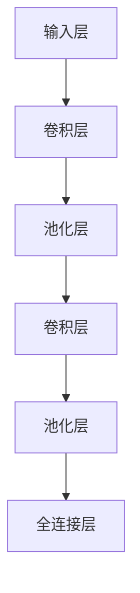

###### 2.3.2 生成对抗网络

生成对抗网络（GAN）是一种由生成器和判别器组成的深度学习模型，通过对抗训练生成高质量的数据。GAN通过最大化生成器和判别器的对立损失函数，实现数据生成和判别能力的提升。

GAN的基本结构包括生成器、判别器和对抗损失函数。生成器通过输入噪声生成伪造数据，判别器通过区分真实数据和伪造数据。对抗损失函数通常采用最小二乘损失或交叉熵损失。

生成对抗网络的基本原理可以通过以下Mermaid流程图表示：

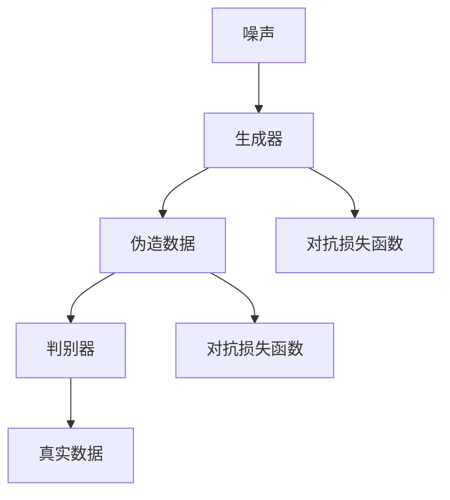

### 第二部分: 大模型应用

#### 第3章: 知识获取与记忆

##### 3.1 知识图谱构建

知识图谱是一种结构化知识表示方法，通过实体、属性和关系的表示，构建一个语义丰富的知识网络。知识图谱在问答系统、搜索引擎和智能推荐等领域具有广泛应用。

知识图谱的构建主要包括数据采集、实体识别、关系抽取和知识融合等步骤。

- 数据采集：从互联网、数据库和知识库等渠道获取大量结构化和半结构化数据。

- 实体识别：通过命名实体识别技术，从文本数据中识别出实体。

- 关系抽取：通过关系抽取技术，从实体对之间的文本中识别出关系。

- 知识融合：将识别出的实体和关系进行融合，构建一个完整的知识图谱。

知识图谱的概念可以通过以下Mermaid流程图表示：

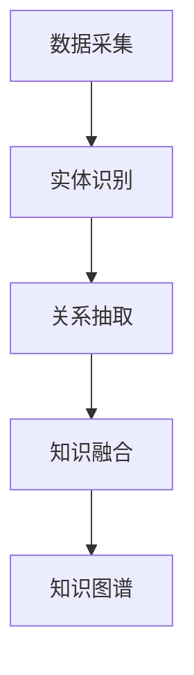

##### 3.2 知识表示与记忆

知识表示与记忆是人工智能领域的重要研究方向，旨在构建一种能够存储、检索和应用知识的系统。知识表示方法主要包括符号表示、分布表示和图表示等。

- 符号表示：通过符号和逻辑规则表示知识，如形式逻辑、谓词逻辑等。

- 分布表示：通过高维向量表示知识，如词嵌入、图嵌入等。

- 图表示：通过图结构表示知识，如知识图谱、知识图等。

知识表示方法的选择取决于具体应用场景和知识类型。知识记忆策略主要包括记忆增强、记忆检索和记忆重构等。

- 记忆增强：通过学习新的知识和经验，增强已有知识的记忆效果。

- 记忆检索：通过关键词或查询语句，快速检索相关知识。

- 记忆重构：通过推理和推理规则，重构已有知识，生成新的知识。

知识表示与记忆的策略可以通过以下Mermaid流程图表示：

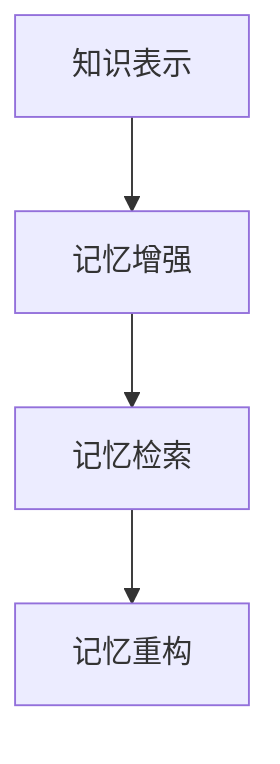

#### 第4章: 理解与表达

##### 4.1 自然语言理解

自然语言理解是自然语言处理的核心任务，旨在使计算机能够理解和处理人类自然语言。自然语言理解包括词法分析、句法分析、语义分析和语用分析等层次。

- 词法分析：对文本进行分词、词性标注等预处理操作。

- 句法分析：通过句法规则，对文本进行语法结构分析。

- 语义分析：通过语义规则，对文本进行语义理解。

- 语用分析：通过语用规则，对文本进行语境理解。

自然语言理解的方法主要包括基于规则的方法、基于统计的方法和基于深度学习的方法。

- 基于规则的方法：通过手工定义的规则，对文本进行解析和理解。

- 基于统计的方法：通过统计语言模型和隐马尔可夫模型，对文本进行解析和理解。

- 基于深度学习的方法：通过深度神经网络，对文本进行自动解析和理解。

自然语言理解的方法可以通过以下Mermaid流程图表示：

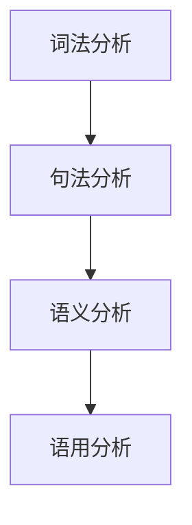

##### 4.2 自然语言生成

自然语言生成是自然语言处理的重要应用领域，旨在使计算机能够自动生成自然语言文本。自然语言生成包括文本生成、对话系统和语音合成等任务。

- 文本生成：通过文本生成模型，生成具有连贯性和可读性的自然语言文本。

- 对话系统：通过对话生成模型，实现人机交互的对话系统。

- 语音合成：通过语音合成模型，将文本转换为语音信号。

自然语言生成的方法主要包括基于模板的方法、基于统计的方法和基于深度学习的方法。

- 基于模板的方法：通过预定义的模板，生成自然语言文本。

- 基于统计的方法：通过统计语言模型和隐马尔可夫模型，生成自然语言文本。

- 基于深度学习的方法：通过深度神经网络，生成自然语言文本。

自然语言生成的方法可以通过以下Mermaid流程图表示：

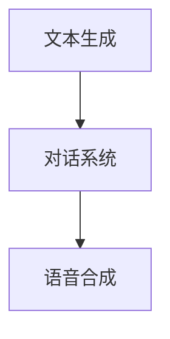

#### 第5章: 推理与反思

##### 5.1 推理算法

推理算法是人工智能领域的重要技术，旨在使计算机能够从已知的事实中推导出新的结论。推理算法包括逻辑推理、概率推理和模糊推理等。

- 逻辑推理：通过逻辑规则和推理规则，从已知的事实中推导出新的结论。

- 概率推理：通过概率模型和推理规则，从已知的事实中推导出新的结论。

- 模糊推理：通过模糊逻辑和推理规则，从已知的事实中推导出新的结论。

逻辑推理的原理可以通过以下Mermaid流程图表示：

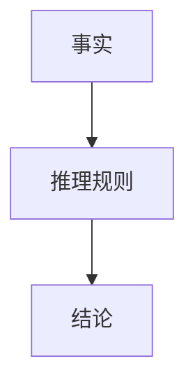

概率推理的原理可以通过以下Mermaid流程图表示：

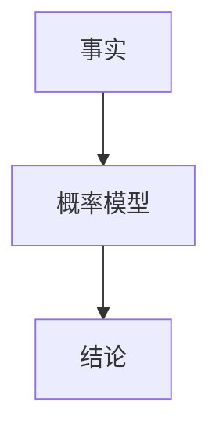

模糊推理的原理可以通过以下Mermaid流程图表示：

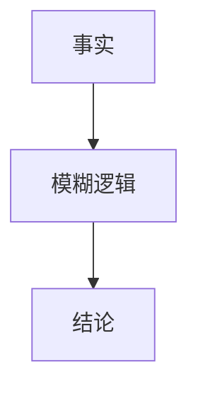

##### 5.2 反思与元学习

反思与元学习是人工智能领域的重要研究方向，旨在使计算机能够从经验中学习，并不断改进自身的性能。反思与元学习包括反思机制和元学习算法。

- 反思机制：通过反思机制，使计算机能够从错误中学习，并调整自身的决策策略。

- 元学习算法：通过元学习算法，使计算机能够快速适应新的环境和任务。

反思与元学习的原理可以通过以下Mermaid流程图表示：

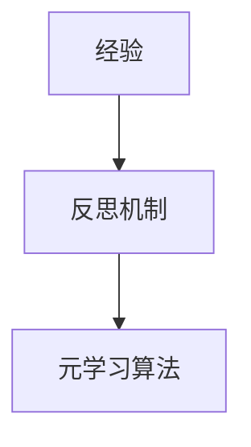

### 第6章: 泛化与优化

##### 6.1 泛化能力

泛化能力是人工智能模型的重要评价指标，旨在评估模型在未知数据上的性能。泛化能力包括模型泛化、数据泛化和任务泛化等。

- 模型泛化：通过调整模型结构和参数，提高模型在未知数据上的性能。

- 数据泛化：通过增加训练数据量和多样性，提高模型在未知数据上的性能。

- 任务泛化：通过跨领域和跨任务的迁移学习，提高模型在未知数据上的性能。

提升泛化能力的方法主要包括正则化、Dropout、数据增强和迁移学习等。

- 正则化：通过在损失函数中加入L1或L2正则项，降低模型的过拟合风险。

- Dropout：通过在训练过程中随机丢弃部分神经元，降低模型的过拟合风险。

- 数据增强：通过数据变形、噪声添加和图像合成等操作，增加训练数据的多样性。

- 迁移学习：通过利用预训练模型和已有知识，提高新任务上的模型性能。

提升泛化能力的原理可以通过以下Mermaid流程图表示：

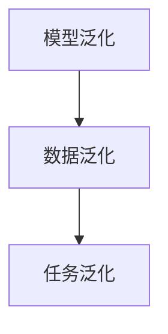

##### 6.2 优化策略

优化策略是提高人工智能模型性能的重要手段，包括损失函数、优化算法和学习率调整等。

- 损失函数：损失函数用于衡量模型预测误差，常见的损失函数包括均方误差、交叉熵损失和结构相似性损失等。

- 优化算法：优化算法用于调整模型参数，以降低损失函数值。常见的优化算法包括梯度下降、随机梯度下降和Adam优化器等。

- 学习率调整：学习率是优化算法的重要参数，用于控制参数更新的步长。常见的学习率调整策略包括固定学习率、自适应学习率和学习率衰减等。

优化策略的原理可以通过以下Mermaid流程图表示：

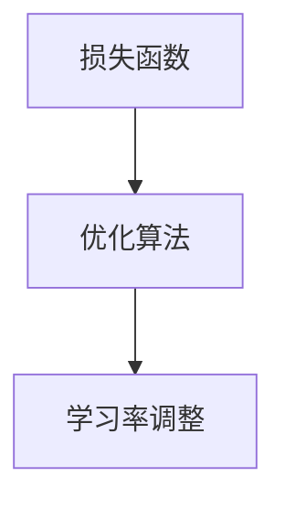

### 第7章: 自我提升与未来展望

##### 7.1 大模型自我提升

大模型自我提升是指通过不断学习和改进，提高模型的性能和应用能力。大模型自我提升包括自适应学习、持续学习和迁移学习等。

- 自适应学习：通过在线学习，使模型能够适应动态变化的环境。

- 持续学习：通过不断积累新的知识和经验，提高模型的泛化能力和适应性。

- 迁移学习：通过利用预训练模型和已有知识，提高新任务上的模型性能。

大模型自我提升的原理可以通过以下Mermaid流程图表示：

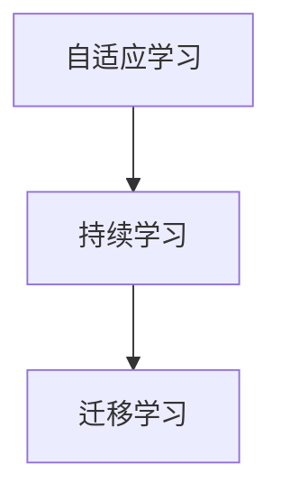

##### 7.2 大模型应用前景

大模型在人工智能领域的应用前景广阔，包括智能推荐、智能问答、智能驾驶、医疗诊断和自然语言处理等。

- 智能推荐：通过分析用户行为和偏好，为用户提供个性化的推荐服务。

- 智能问答：通过自然语言处理技术，实现智能问答系统，为用户提供实时解答。

- 智能驾驶：通过计算机视觉和深度学习技术，实现自动驾驶和智能辅助驾驶。

- 医疗诊断：通过图像识别和自然语言处理技术，实现疾病的自动诊断和治疗建议。

- 自然语言处理：通过文本生成、对话系统和机器翻译等技术，提高人机交互的自然性和智能化程度。

大模型应用前景的原理可以通过以下Mermaid流程图表示：

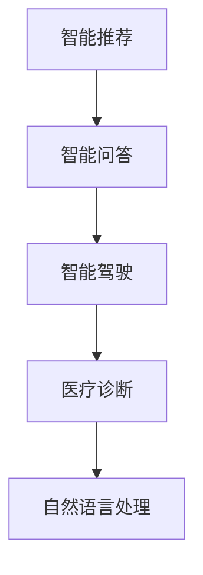

### 附录

##### 附录A: 开发工具与资源

A.1 Python深度学习库

- TensorFlow：Google开发的开源深度学习框架，支持多种深度学习模型和算法。

- PyTorch：Facebook开发的开源深度学习框架，支持动态计算图和自动微分。

- Keras：高级深度学习框架，支持多种底层框架，如TensorFlow和Theano。

A.2 自然语言处理工具

- NLTK：Python自然语言处理库，提供多种文本处理和语义分析功能。

- SpaCy：快速灵活的自然语言处理库，支持多种语言和任务。

- gensim：Python自然语言处理库，提供词嵌入、主题模型和文本生成等功能。

A.3 计算机视觉库

- OpenCV：开源计算机视觉库，支持图像处理、目标检测和视频处理等任务。

- PIL：Python图像处理库，提供丰富的图像处理功能。

- torchvision：PyTorch计算机视觉库，提供预训练模型和常用数据集。

### 图表与公式

#### Mermaid 流程图

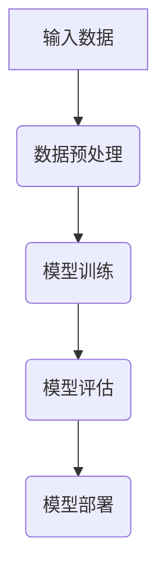

#### 伪代码

```python
def train_model(data, labels):
    # 初始化模型
    model = initialize_model()
    
    # 模型训练
    for epoch in range(num_epochs):
        for x, y in data:
            # 前向传播
            predictions = model.forward(x)
            
            # 计算损失
            loss = calculate_loss(predictions, y)
            
            # 反向传播
            model.backward(loss)
            
            # 更新模型参数
            model.update_params()
            
    return model
```

#### 数学模型与公式

```latex
\section{数学模型与公式}
在深度学习中，损失函数是衡量模型预测误差的重要指标。常见的损失函数包括：

\begin{equation}
    L = -\frac{1}{m} \sum_{i=1}^{m} y_{i} \log(p_{i})
\end{equation}

其中，\(y_{i}\) 为真实标签，\(p_{i}\) 为模型预测概率。

此外，梯度下降算法用于优化模型参数，其迭代公式为：

\begin{equation}
    \theta = \theta - \alpha \cdot \nabla_\theta J(\theta)
\end{equation}

其中，\(\theta\) 为模型参数，\(\alpha\) 为学习率，\(J(\theta)\) 为损失函数。
```

### 结束语

本文详细介绍了大模型在人工智能领域的应用，从基础原理到具体应用，从知识获取与记忆到理解与表达，从推理与反思到泛化与优化，再到自我提升与未来展望，全面剖析了大模型的技术实现和应用场景。通过本文的学习，读者可以系统地了解大模型的相关知识，掌握大模型的开发和应用方法，为未来的研究和实践打下坚实基础。希望本文对读者有所帮助，共同推动人工智能技术的发展。作者：AI天才研究院/AI Genius Institute & 禅与计算机程序设计艺术 /Zen And The Art of Computer Programming。

