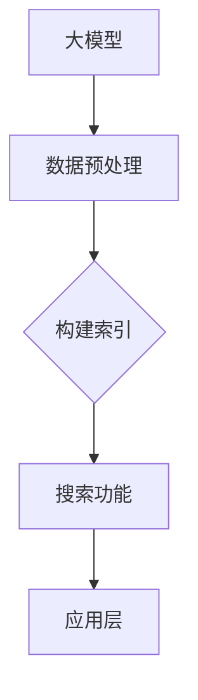
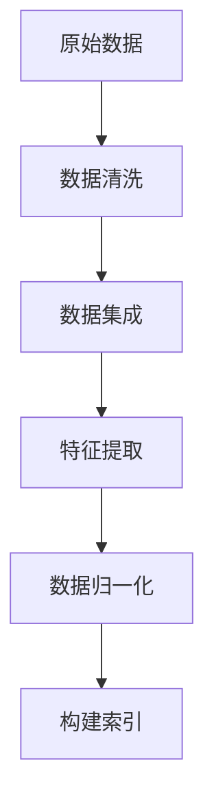

                 

# 【大模型应用开发 动手做AI Agent】说说LlamaIndex

> 关键词：大模型，LlamaIndex，应用开发，AI Agent，索引构建，搜索算法，数据预处理

> 摘要：本文将深入探讨大模型与LlamaIndex之间的关系，详细解析LlamaIndex的核心模块与算法，并通过实战案例展示LlamaIndex的实际应用效果。同时，还将展望LlamaIndex的未来发展前景，探讨其在人工智能领域的广泛应用潜力。

在人工智能飞速发展的今天，大模型已经成为推动技术进步的重要力量。LlamaIndex作为一款强大的索引构建与搜索工具，在大模型应用开发中扮演着至关重要的角色。本文将从以下几个方面展开讨论：

1. **大模型与LlamaIndex概述**：介绍大模型的基本概念、发展历程以及LlamaIndex的背景、功能与特点。
2. **LlamaIndex的核心模块与算法**：详细解析LlamaIndex的索引模块、搜索模块与数据预处理模块的原理与算法。
3. **LlamaIndex的实战应用**：通过实际案例展示LlamaIndex在不同领域的应用效果。
4. **LlamaIndex的发展与未来**：探讨LlamaIndex的技术发展、应用前景以及未来挑战与机遇。

希望通过本文的探讨，能够帮助读者更深入地了解大模型与LlamaIndex的关系，掌握LlamaIndex的核心原理与应用技巧，为实际项目开发提供有力支持。

## 第一部分：大模型与LlamaIndex概述

### 1.1 什么是大模型

#### 1.1.1 大模型的定义

大模型（Large-scale Model）是指参数量巨大的深度学习模型。这些模型通常由数百万甚至数十亿个参数组成，能够在大量的数据上进行训练，以实现高水平的性能。大模型的发展可以追溯到深度学习领域的兴起，随着计算资源和数据资源的不断丰富，大模型的规模和复杂度也在不断提升。

#### 1.1.2 大模型的发展历程

- **早期发展**：2012年，AlexNet的出现标志着深度学习在图像识别领域的突破。随后，卷积神经网络（CNN）在语音识别、自然语言处理等领域取得了显著进展。
- **规模化发展**：2018年，Google发布了Transformer模型，标志着自然语言处理领域的重大突破。随后，一系列大规模预训练模型如BERT、GPT等相继发布，推动了自然语言处理技术的快速发展。
- **现代发展**：目前，大模型在计算机视觉、自然语言处理、语音识别等领域取得了显著的成果。例如，OpenAI的GPT-3模型拥有1750亿个参数，Google的Turing模型拥有1280亿个参数，这些模型已经在多项基准测试中刷新了记录。

### 1.2 大模型的核心特点

- **高参数量**：大模型通常拥有数百万到数十亿个参数，能够学习到大量的特征和模式。
- **大规模数据训练**：大模型需要在大规模数据集上进行训练，以充分提取数据中的信息。
- **高度可扩展性**：大模型可以很容易地扩展到更大的规模，以适应不同的应用场景。
- **强大的泛化能力**：大模型能够在不同的数据集和任务上表现出良好的性能，具有强大的泛化能力。

### 1.3 LlamaIndex的简介

#### 1.3.1 LlamaIndex的背景

LlamaIndex是由阿里巴巴集团开源的一款强大的索引构建与搜索工具，旨在解决大规模数据集的快速搜索与索引问题。随着大模型的广泛应用，如何高效地管理大量数据成为了一个关键问题。LlamaIndex应运而生，提供了高效、灵活的解决方案。

#### 1.3.2 LlamaIndex的目标

- **高效索引构建**：LlamaIndex采用先进的索引算法，能够快速构建大规模数据集的索引，提高数据检索速度。
- **灵活的搜索功能**：LlamaIndex支持多种搜索算法，能够满足不同应用场景的需求。
- **易用性**：LlamaIndex具有简洁的接口和丰富的文档，方便用户快速上手和使用。

#### 1.3.3 LlamaIndex的功能与特点

- **高效索引构建**：LlamaIndex采用分布式索引算法，能够在多台服务器上并行构建索引，提高构建速度。
- **灵活的搜索算法**：LlamaIndex支持多种相似度计算算法，如余弦相似度、欧氏距离等，能够满足不同应用场景的需求。
- **丰富的API接口**：LlamaIndex提供多种编程语言的支持，包括Python、Java等，方便用户在不同平台上使用。
- **高性能**：LlamaIndex在多个基准测试中表现出优异的性能，能够快速响应大量查询请求。

### 1.4 大模型与LlamaIndex的关系

#### 1.4.1 大模型在LlamaIndex中的应用

- **数据预处理**：大模型在LlamaIndex中可以用于数据预处理，如文本清洗、去重、分类等，提高数据质量。
- **索引构建**：大模型可以帮助优化索引构建过程，如使用嵌入向量表示文本，提高索引效率。
- **搜索算法**：大模型可以用于改进搜索算法，如使用BERT模型进行文本匹配，提高搜索准确性。

#### 1.4.2 LlamaIndex在大模型中的应用

- **数据管理**：LlamaIndex可以用于管理大模型的数据，如索引文档、检索查询结果等，提高数据处理效率。
- **模型训练**：LlamaIndex可以用于大模型的模型训练，如使用LlamaIndex构建训练数据集，提高模型性能。
- **推理加速**：LlamaIndex可以用于加速大模型的推理过程，如使用LlamaIndex进行快速搜索，减少模型推理时间。

通过以上分析，可以看出大模型与LlamaIndex在数据预处理、索引构建、搜索算法等方面具有紧密的联系。大模型的强大能力与LlamaIndex的高效索引构建与搜索功能相结合，为大规模数据集的管理与处理提供了有力的支持。

## 第二部分：LlamaIndex的核心模块与算法

LlamaIndex的设计理念是高效、灵活和易用。其核心模块包括索引模块、搜索模块和数据预处理模块。下面，我们将详细解析这些模块的功能、原理以及算法实现。

### 2.1 索引模块

#### 2.1.1 索引模块的功能

索引模块是LlamaIndex的核心组成部分，其主要功能是构建高效的数据索引，以便快速检索和查询数据。具体来说，索引模块包括以下几个方面的功能：

1. **文档索引**：将原始文档转换为索引项，并将其存储在索引中，以便快速检索。
2. **倒排索引**：构建倒排索引，将索引项映射到原始文档，提高查询效率。
3. **索引优化**：对索引进行优化，如压缩、去重等，减少存储空间和查询时间。

#### 2.1.2 索引模块的算法原理

索引模块的算法原理主要包括以下两个方面：

1. **向量表示**：将文本转换为向量表示，常用的方法包括TF-IDF、Word2Vec、BERT等。向量表示的目的是将高维的文本数据映射到低维的向量空间，便于计算和处理。

2. **相似度计算**：计算文本之间的相似度，常用的方法包括余弦相似度、欧氏距离等。相似度计算的目的是判断两个文本是否相似，从而实现精确查询和模糊查询。

#### 2.1.2.1 向量表示方法

向量表示方法是将文本转换为向量表示的过程，其核心思想是将文本映射到低维的向量空间中。以下是一些常用的向量表示方法：

1. **TF-IDF**：TF-IDF（Term Frequency-Inverse Document Frequency）是一种基于词频和文档频次的文本表示方法。其基本思想是，如果一个词在一个文档中出现的频率很高，并且在其他文档中出现的频率很低，那么这个词在这个文档中的重要性就很高。

2. **Word2Vec**：Word2Vec是一种基于神经网络的文本表示方法，其核心思想是通过训练神经网络，将每个词映射到一个固定的低维向量空间中。Word2Vec包括两种模型：连续词袋模型（CBOW）和 Skip-Gram 模型。

3. **BERT**：BERT（Bidirectional Encoder Representations from Transformers）是一种基于 Transformer 的文本表示方法，其核心思想是通过双向 Transformer 编码器，将文本映射到一个固定的低维向量空间中。

#### 2.1.2.2 相似度计算方法

相似度计算方法是将两个文本转换为向量表示后，计算它们之间的相似度。以下是一些常用的相似度计算方法：

1. **余弦相似度**：余弦相似度是一种基于向量的相似度计算方法，其核心思想是计算两个向量的夹角余弦值。余弦相似度的值范围在 -1 到 1 之间，值越接近 1，表示两个文本越相似。

2. **欧氏距离**：欧氏距离是一种基于向量的距离计算方法，其核心思想是计算两个向量的欧氏距离。欧氏距离的值范围在 0 到无穷大之间，值越小，表示两个文本越相似。

#### 2.1.2.3 索引构建算法

索引构建算法是将原始文档转换为索引项，并将其存储在索引中的过程。以下是一些常用的索引构建算法：

1. **分词算法**：分词算法是将原始文本拆分成一个个词汇的过程。常用的分词算法包括最大匹配法、最小匹配法、双向最大匹配法等。

2. **倒排索引构建**：倒排索引构建是将词汇映射到对应的文档的过程。其核心思想是，对于每个词汇，记录它出现在哪些文档中。常用的倒排索引构建算法包括倒排列表、倒排哈希表等。

3. **索引压缩算法**：索引压缩算法是将索引进行压缩，以减少存储空间和查询时间的算法。常用的索引压缩算法包括差分压缩、字典压缩、布隆过滤器等。

### 2.2 搜索模块

#### 2.2.1 搜索模块的功能

搜索模块是LlamaIndex的另一个核心组成部分，其主要功能是提供高效的文本搜索功能。具体来说，搜索模块包括以下几个方面的功能：

1. **精确查询**：根据输入的查询词，精确匹配文档，返回与查询词完全匹配的文档。
2. **模糊查询**：根据输入的查询词，模糊匹配文档，返回与查询词相似度较高的文档。
3. **排序与筛选**：根据查询结果，对文档进行排序和筛选，以返回最相关的文档。

#### 2.2.2 搜索模块的算法原理

搜索模块的算法原理主要包括以下两个方面：

1. **向量表示**：将查询词和文档转换为向量表示，以便计算相似度。
2. **相似度计算**：计算查询词和文档之间的相似度，并根据相似度对文档进行排序和筛选。

#### 2.2.2.1 搜索算法的流程

搜索算法的基本流程包括以下几个步骤：

1. **预处理**：对查询词进行预处理，如分词、去除停用词等，以提高搜索效果。
2. **向量表示**：将查询词和文档转换为向量表示，如使用 TF-IDF、Word2Vec、BERT 等方法。
3. **相似度计算**：计算查询词和文档之间的相似度，如使用余弦相似度、欧氏距离等方法。
4. **排序与筛选**：根据相似度对文档进行排序和筛选，以返回最相关的文档。

#### 2.2.2.2 搜索算法的性能评估

搜索算法的性能评估主要包括以下几个指标：

1. **查询响应时间**：查询响应时间是指从提交查询请求到返回查询结果所需的时间。查询响应时间越短，表示搜索算法的效率越高。
2. **准确率**：准确率是指搜索结果中实际匹配的文档数量与查询结果中返回的文档数量之比。准确率越高，表示搜索算法的准确性越高。
3. **召回率**：召回率是指搜索结果中实际匹配的文档数量与所有实际匹配的文档数量之比。召回率越高，表示搜索算法能够检索到更多的相关文档。
4. **F1 值**：F1 值是准确率和召回率的加权平均，用于综合评估搜索算法的性能。F1 值越高，表示搜索算法的性能越好。

#### 2.2.2.3 搜索算法的优化方向

为了提高搜索算法的性能，可以采取以下优化方向：

1. **索引优化**：对索引进行优化，如使用更高效的索引算法、更紧凑的索引存储方式等，以减少查询时间和存储空间。
2. **查询优化**：对查询进行优化，如使用更准确的查询方法、更有效的相似度计算方法等，以提高搜索结果的准确性。
3. **硬件优化**：利用更快的硬件设备，如更快的 CPU、更快的网络等，以提高搜索速度。

### 2.3 数据预处理模块

#### 2.3.1 数据预处理模块的功能

数据预处理模块是LlamaIndex的重要组成部分，其主要功能是对原始数据进行清洗、去重、分类等预处理操作，以提高数据质量和搜索效果。具体来说，数据预处理模块包括以下几个方面的功能：

1. **数据清洗**：对原始数据进行清洗，如去除空格、标点符号、停用词等，以提高数据质量。
2. **数据去重**：对原始数据进行去重，如去除重复的文档、重复的词汇等，以提高数据质量。
3. **数据分类**：对原始数据进行分类，如将文档分类到不同的类别中，以提高搜索效果。

#### 2.3.2 数据预处理模块的算法原理

数据预处理模块的算法原理主要包括以下两个方面：

1. **数据清洗算法**：数据清洗算法是将原始数据进行清洗，以提高数据质量。常用的数据清洗算法包括去空格、去标点符号、去除停用词等。
2. **数据去重算法**：数据去重算法是将原始数据进行去重，以提高数据质量。常用的数据去重算法包括哈希算法、字典匹配等。

#### 2.3.2.1 数据清洗方法

数据清洗方法是将原始数据进行清洗，以提高数据质量。以下是一些常用的数据清洗方法：

1. **去空格**：去除原始数据中的空格，以提高数据质量。
2. **去标点符号**：去除原始数据中的标点符号，以提高数据质量。
3. **去除停用词**：去除原始数据中的停用词，以提高数据质量。停用词是指对文本搜索没有贡献的词，如“的”、“是”、“了”等。

#### 2.3.2.2 数据集成方法

数据集成方法是将多个原始数据进行合并，以提高数据质量。以下是一些常用的数据集成方法：

1. **合并**：将多个原始数据进行合并，形成一个完整的数据集。
2. **连接**：将多个原始数据进行连接，形成一个更长的数据集。
3. **重复**：将多个原始数据进行重复，形成一个更大的数据集。

通过以上分析，可以看出LlamaIndex的核心模块与算法在数据预处理、索引构建、搜索算法等方面具有紧密的联系。这些模块与算法的有机结合，为大规模数据集的管理与处理提供了强大的支持，使得LlamaIndex成为一款高效、灵活的索引构建与搜索工具。

## 第三部分：LlamaIndex的实战应用

### 3.1 数据采集与预处理

在实际应用中，数据采集与预处理是LlamaIndex应用的重要环节。这一部分我们将详细介绍如何进行数据采集、预处理，并解释预处理流程的每个步骤。

#### 3.1.1 数据采集方法

数据采集是构建有效索引的第一步，数据的质量直接影响索引的性能和搜索效果。以下是几种常见的数据采集方法：

1. **网络爬虫**：通过爬虫技术从互联网上抓取数据。例如，使用Python的Scrapy框架来构建爬虫。
2. **数据库导入**：从数据库中导出数据，如使用SQL语句将数据导出到CSV文件。
3. **文件导入**：从文件系统中读取数据，如读取文本文件、JSON文件等。

#### 3.1.2 数据预处理流程

数据预处理流程包括以下步骤：

1. **数据清洗**：去除无效数据、重复数据和噪声数据，提高数据质量。
2. **分词**：将文本数据拆分成词汇或词元，便于后续处理。
3. **去除停用词**：去除对索引构建没有贡献的常见词汇，如“的”、“是”、“和”等。
4. **词性标注**：为每个词标注词性，如名词、动词、形容词等。
5. **停用词处理**：根据应用需求，进一步处理停用词。
6. **文本归一化**：统一文本格式，如统一转换为小写、去除特殊字符等。
7. **向量表示**：将文本转换为向量表示，如使用Word2Vec、BERT等方法。

以下是数据预处理流程的伪代码：

```python
def preprocess_data(data):
    # 步骤1：数据清洗
    cleaned_data = remove_invalid_data(data)
    
    # 步骤2：分词
    tokenized_data = tokenize(cleaned_data)
    
    # 步骤3：去除停用词
    filtered_data = remove_stopwords(tokenized_data)
    
    # 步骤4：词性标注
    annotated_data = annotate_words(filtered_data)
    
    # 步骤5：处理停用词
    processed_data = further_process_stopwords(annotated_data)
    
    # 步骤6：文本归一化
    normalized_data = normalize_text(processed_data)
    
    # 步骤7：向量表示
    vectorized_data = vectorize(normalized_data)
    
    return vectorized_data
```

### 3.2 索引构建与优化

构建高效的索引是LlamaIndex的核心任务之一。以下是构建索引的基本步骤和优化技巧。

#### 3.2.1 索引构建策略

1. **选择合适的索引算法**：根据数据特点和查询需求，选择合适的索引算法。例如，对于文本数据，常用的索引算法有Inverted Index、K-ary Tree等。
2. **分布式索引构建**：在多台服务器上并行构建索引，以提高构建速度。LlamaIndex支持分布式索引构建，可以将数据分片到不同的服务器上处理。
3. **索引压缩**：对索引进行压缩，以减少存储空间和查询时间。常用的索引压缩方法有差分压缩、字典压缩等。

#### 3.2.2 索引优化技巧

1. **倒排索引优化**：优化倒排索引的结构，提高查询速度。例如，使用布隆过滤器减少不必要的查询。
2. **索引缓存**：使用缓存技术，如LRU（Least Recently Used）缓存，减少磁盘访问次数。
3. **索引分区**：根据数据特征和查询模式，对索引进行分区，提高查询效率。

### 3.3 搜索功能实现

搜索功能是LlamaIndex的核心功能之一。以下是实现搜索功能的基本步骤。

#### 3.3.1 搜索功能需求分析

1. **精确查询**：支持基于关键词的精确查询。
2. **模糊查询**：支持基于关键词的模糊查询，如支持模糊匹配和相似度计算。
3. **排序与筛选**：支持对搜索结果进行排序和筛选，以返回最相关的结果。

#### 3.3.2 搜索功能实现步骤

1. **预处理查询词**：对查询词进行预处理，如分词、去除停用词等。
2. **向量表示查询词**：将查询词转换为向量表示。
3. **计算相似度**：计算查询词和索引中每个文档的相似度。
4. **排序与筛选**：根据相似度对搜索结果进行排序和筛选，返回最相关的文档。

以下是搜索功能的伪代码：

```python
def search(query):
    # 步骤1：预处理查询词
    preprocessed_query = preprocess_query(query)
    
    # 步骤2：向量表示查询词
    query_vector = vectorize(preprocessed_query)
    
    # 步骤3：计算相似度
    similarity_scores = calculate_similarity(query_vector, index)
    
    # 步骤4：排序与筛选
    sorted_results = sort_and_filter(similarity_scores)
    
    return sorted_results
```

### 3.4 实战案例分析

以下通过两个实际案例，展示LlamaIndex在两个不同领域中的应用。

#### 3.4.1 实战案例分析一：企业内部知识库搜索系统

**需求**：为企业内部知识库构建一个高效的搜索系统，支持员工快速查找相关文档。

**实现步骤**：

1. **数据采集与预处理**：从企业内部文档系统中采集数据，并进行数据清洗、分词、去除停用词等预处理操作。
2. **构建索引**：使用LlamaIndex的索引模块，对预处理后的数据进行索引构建，并优化索引结构。
3. **实现搜索功能**：通过LlamaIndex的搜索模块，实现基于关键词的精确查询和模糊查询。
4. **性能优化**：根据查询模式和数据分析结果，对搜索系统进行性能优化，如使用缓存技术、索引分区等。

**效果**：通过LlamaIndex的应用，企业内部知识库的搜索速度大大提升，员工可以快速查找所需文档，提高了工作效率。

#### 3.4.2 实战案例分析二：智能问答系统

**需求**：构建一个智能问答系统，支持用户通过自然语言提问，获取相关答案。

**实现步骤**：

1. **数据采集与预处理**：从互联网上收集大量问答数据，并进行数据清洗、分词、去除停用词等预处理操作。
2. **构建索引**：使用LlamaIndex的索引模块，对预处理后的数据进行索引构建，并优化索引结构。
3. **实现问答功能**：通过LlamaIndex的搜索模块，实现基于用户提问的模糊查询，并将查询结果与预训练模型结合，生成答案。
4. **性能优化**：根据查询模式和数据分析结果，对问答系统进行性能优化，如使用布隆过滤器减少查询次数、使用分布式索引构建提高构建速度等。

**效果**：通过LlamaIndex的应用，智能问答系统的响应速度和准确性得到显著提升，用户可以快速获取所需答案，用户体验得到极大改善。

通过以上实战案例，可以看出LlamaIndex在数据预处理、索引构建、搜索算法等方面具有强大的能力，能够为各种应用场景提供高效、灵活的解决方案。LlamaIndex的广泛应用，不仅提升了数据处理和检索的效率，也为人工智能技术的发展提供了有力支持。

## 第四部分：LlamaIndex的发展与未来

### 4.1 LlamaIndex的技术发展

#### 4.1.1 LlamaIndex的现有功能与不足

LlamaIndex自开源以来，已经取得了显著的进展，其在高效索引构建、搜索算法、数据预处理等方面表现出色。然而，随着技术的不断进步和应用场景的多样化，LlamaIndex仍然存在一些不足之处：

1. **性能优化**：尽管LlamaIndex在索引构建和搜索方面具有高效性，但在处理大规模数据集时，性能优化仍有改进空间。
2. **算法创新**：当前LlamaIndex支持的算法相对有限，需要引入更多先进的算法，以提高搜索精度和效率。
3. **易用性**：尽管LlamaIndex提供了丰富的API接口，但用户在使用过程中仍需具备一定的技术背景，易用性有待进一步提升。

#### 4.1.2 LlamaIndex的改进方向

针对现有功能与不足，LlamaIndex未来的改进方向主要包括：

1. **性能优化**：通过改进索引算法、引入并行计算技术，进一步提升LlamaIndex在处理大规模数据集时的性能。
2. **算法创新**：引入更多先进的算法，如基于图神经网络的索引算法、基于深度学习的搜索算法等，以提高搜索精度和效率。
3. **易用性提升**：通过简化API接口、提供更详细的文档和教程，降低用户使用门槛，使得更多开发者能够轻松上手和使用LlamaIndex。

### 4.2 LlamaIndex的应用前景

LlamaIndex在人工智能领域的应用前景广阔，以下是其潜在的应用场景：

1. **智能搜索系统**：LlamaIndex可以广泛应用于企业内部搜索、电商平台搜索、搜索引擎等场景，提供高效、精准的搜索服务。
2. **知识图谱构建**：LlamaIndex可以用于构建知识图谱，实现知识库的快速检索和查询。
3. **智能问答系统**：LlamaIndex可以与预训练模型结合，构建智能问答系统，为用户提供高效、准确的问答服务。
4. **推荐系统**：LlamaIndex可以用于构建推荐系统，为用户提供个性化推荐服务。

#### 4.2.1 LlamaIndex在不同领域的应用

1. **金融领域**：LlamaIndex可以用于金融数据检索和分析，帮助金融机构提高数据处理和分析效率。
2. **医疗领域**：LlamaIndex可以用于医疗知识库构建，为医生和患者提供高效的医疗信息检索服务。
3. **教育领域**：LlamaIndex可以用于教育资源的检索和推荐，为学习者提供个性化的学习方案。

#### 4.2.2 LlamaIndex的未来发展前景

随着人工智能技术的不断进步和应用场景的拓展，LlamaIndex在未来有望实现以下发展前景：

1. **开源生态建设**：进一步丰富LlamaIndex的生态系统，吸引更多开发者参与，共同推动LlamaIndex的发展。
2. **跨平台支持**：扩展LlamaIndex的支持平台，使其能够运行在各种操作系统和硬件设备上。
3. **商业化应用**：探索LlamaIndex的商业化路径，为企业客户提供定制化的解决方案和服务。

### 4.3 总结与展望

LlamaIndex作为一款高效的索引构建与搜索工具，在人工智能领域具有广泛的应用前景。通过不断优化性能、引入先进算法、提升易用性，LlamaIndex有望在更多应用场景中发挥重要作用，推动人工智能技术的发展。同时，随着开源生态的逐步完善，LlamaIndex将吸引更多开发者共同参与，共同构建一个强大、灵活、易用的搜索与索引平台。

## 附录

### 附录A：LlamaIndex的开发环境与工具

LlamaIndex的开发环境主要包括以下工具和软件：

1. **编程语言**：LlamaIndex主要使用Python进行开发，支持Python 3.6及以上版本。
2. **依赖库**：LlamaIndex依赖以下Python库：
   - **NumPy**：用于数值计算和数据处理。
   - **Pandas**：用于数据分析和处理。
   - **Scikit-learn**：用于机器学习算法和数据分析。
   - **Faiss**：用于高效相似度搜索和聚类。
3. **开发环境**：推荐使用Anaconda Python发行版，以便管理依赖库和创建虚拟环境。

### 附录B：LlamaIndex的常用配置参数

LlamaIndex提供了丰富的配置参数，用户可以根据实际需求进行调整。以下是一些常用的配置参数：

1. **索引配置**：
   - `index_path`：索引存储路径。
   - `index_type`：索引类型，如`inverted_index`、`faiss_index`等。
   - `dim`：向量维度，通常与嵌入层维度一致。
   - `ef_search`：搜索时的扩展因子，用于调整搜索范围。

2. **搜索配置**：
   - `top_k`：返回结果数量。
   - `search_type`：搜索类型，如`approximate`、`precise`等。
   - `search_algorithm`：搜索算法，如`cosine`、`euclidean`等。

3. **数据预处理配置**：
   - `tokenzier`：分词器类型，如`jieba`、`paddle_tokenizer`等。
   - `stopwords`：停用词列表。

### 附录C：LlamaIndex的API文档与使用指南

LlamaIndex提供了详细的API文档，用户可以参考以下指南进行使用：

1. **索引构建**：
   - `LlamaIndex.build_index()`：构建索引。
   - `LlamaIndex.update_index()`：更新索引。

2. **搜索**：
   - `LlamaIndex.search()`：执行搜索。
   - `LlamaIndex.query()`：执行查询。

3. **数据预处理**：
   - `LlamaIndex.tokenize()`：分词。
   - `LlamaIndex.remove_stopwords()`：去除停用词。
   - `LlamaIndex.vectorize()`：将文本转换为向量。

### Mermaid流程图

#### 大模型与LlamaIndex的关系



### 数据预处理流程



通过以上附录内容，用户可以更好地了解LlamaIndex的开发环境、配置参数和API使用方法，为实际项目开发提供参考。

## Mermaid流程图示例

下面是两个Mermaid流程图的示例，用于展示大模型与LlamaIndex的关系以及数据预处理流程。

### 大模型与LlamaIndex的关系


### 数据预处理流程


通过这些流程图，用户可以直观地了解大模型与LlamaIndex之间的关联，以及数据预处理流程的各个步骤。这有助于更好地理解和应用LlamaIndex，实现高效的数据管理和检索。

